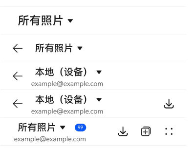
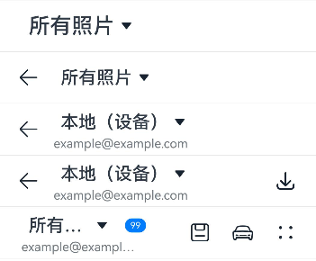

# SelectTitleBar


下拉菜单标题栏包含一个下拉菜单，可用于页面之间的切换；可用于一级页面、二级及其以上界面（配置返回键）。


> **说明：**
>
> 该组件从API Version 10开始支持。后续版本如有新增内容，则采用上角标单独标记该内容的起始版本。
>
> 该组件不支持在Wearable设备上使用。


## 导入模块

```
import { SelectTitleBar } from '@kit.ArkUI'
```


## 子组件

无

## 属性
不支持[通用属性](ts-component-general-attributes.md)。

## SelectTitleBar

SelectTitleBar({selected: number, options: Array&lt;SelectOption&gt;, menuItems?: Array&lt;SelectTitleBarMenuItem&gt;, subtitle?: ResourceStr, badgeValue?: number, hidesBackButton?: boolean, onSelected?: (index: number) =&gt; void})

**装饰器类型：**\@Component

**原子化服务API：** 从API version 11开始，该接口支持在原子化服务中使用。

**系统能力：** SystemCapability.ArkUI.ArkUI.Full

| 名称 | 类型 | 必填 | 装饰器类型 | 说明 |
| -------- | -------- | -------- | -------- | -------- |
| selected | number | 是 | \@Prop | 当前选中项目的索引。<br>第一项的索引为0。如果不设置该属性，则默认值为0。 |
| options | Array&lt;[SelectOption](ts-basic-components-select.md#selectoption对象说明)&gt; | 是 | - | 下拉菜单中的项目。 |
| menuItems | Array&lt;[SelectTitleBarMenuItem](#selecttitlebarmenuitem)&gt;              | 否 | - | 右侧菜单项目列表，定义标题栏右侧的菜单项目。 |
| subtitle | [ResourceStr](ts-types.md#resourcestr)                                      | 否 | - | 子标题。 |
| badgeValue | number                                                                      | 否 | - | 新事件标记。<br>取值范围：[-2147483648,2147483647]，超出范围时会加上或减去4294967296，使得值仍在范围内，非整数时会舍去小数部分取整数部分，如5.5取5。<br>**说明：** 小于等于0时不显示信息标记。<br>最大消息数99，超过最大消息时仅显示99+。超大数值属于异常值，不显示信息标记。 |
| hidesBackButton | boolean                                                                     | 否 | - | 是否隐藏左侧的返回箭头。<br>默认值：false。true：隐藏，false：显示。|
| onSelected | (index:&nbsp;number)&nbsp;=&gt;&nbsp;void                                   | 否 | - | 下拉菜单项目选中触发的回调函数，传入选中项的索引。 |

> **说明：**
> 
> 入参对象不可为undefined，即`SelectTitleBar(undefined)`。

## SelectTitleBarMenuItem

**系统能力：** SystemCapability.ArkUI.ArkUI.Full

| 名称 | 类型 | 必填 | 说明 |
| -------- | -------- | -------- | -------- |
| value | [ResourceStr](ts-types.md#resourcestr) | 是 | 图标资源。<br/>**原子化服务API：** 从API version 11开始，该接口支持在原子化服务中使用。 |
| symbolStyle<sup>18+</sup> | [SymbolGlyphModifier](ts-universal-attributes-attribute-modifier.md) | 否 | Symbol图标资源，优先级大于value。<br/>**原子化服务API：** 从API version 18开始，该接口支持在原子化服务中使用。 |
| label<sup>13+</sup> | [ResourceStr](ts-types.md#resourcestr) | 否 | 图标标签描述。<br/>**原子化服务API：** 从API version 13开始，该接口支持在原子化服务中使用。 |
| isEnabled | boolean | 否 | 是否启用。<br>默认值：false。true：启用，false：禁用。<br/>**原子化服务API：** 从API version 11开始，该接口支持在原子化服务中使用。 |
| action | ()&nbsp;=&gt;&nbsp;void | 否 | 触发时的动作闭包。<br/>**原子化服务API：** 从API version 11开始，该接口支持在原子化服务中使用。 |
| accessibilityLevel<sup>18+<sup>       | string  | 否 | 标题栏右侧自定义按钮无障碍重要性。用于控制当前项是否可被无障碍辅助服务所识别。<br/>支持的值为：<br/>"auto"：当前组件会转换'yes'。<br/>"yes"：当前组件可被无障碍辅助服务所识别。<br/>"no"：当前组件不可被无障碍辅助服务所识别。<br/>"no-hide-descendants"：当前组件及其所有子组件不可被无障碍辅助服务所识别。<br/>默认值："auto"。<br/>**原子化服务API：** 从API version 18开始，该接口支持在原子化服务中使用。 |
| accessibilityText<sup>18+<sup>        | ResourceStr | 否 | 标题栏右侧自定义按钮的无障碍文本属性。当组件不包含文本属性时，屏幕朗读选中此组件时不播报，使用者无法清楚地知道当前选中了什么组件。为了解决此场景，开发人员可为不包含文字信息的组件设置无障碍文本，当屏幕朗读选中此组件时播报无障碍文本的内容，帮助屏幕朗读的使用者清楚地知道自己选中了什么组件。<br/>默认值：有label默认值为当前项label属性内容，没有设置label时，默认值为“ ”。<br/>**原子化服务API：** 从API version 18开始，该接口支持在原子化服务中使用。                                     |
| accessibilityDescription<sup>18+<sup> | ResourceStr | 否 | 标题栏右侧自定义按钮的无障碍描述。此描述用于向用户详细解释当前组件，开发人员应为组件的这一属性提供较为详尽的文本说明，以协助用户理解即将执行的操作及其可能产生的后果。特别是当这些后果无法仅从组件的属性和无障碍文本中直接获知时。如果组件同时具备文本属性和无障碍说明属性，当组件被选中时，系统将首先播报组件的文本属性，随后播报无障碍说明属性的内容。<br/>默认值为“单指双击即可执行”。<br/>**原子化服务API：** 从API version 18开始，该接口支持在原子化服务中使用。           |

## 事件
不支持[通用事件](ts-component-general-events.md)。

## 示例

### 示例1（下拉菜单标题栏）
该示例实现了简单的下拉菜单标题栏，带有返回箭头的下拉菜单标题栏和带有右侧菜单项目列表的下拉菜单标题栏。
```ts
import { SelectTitleBar, Prompt, SelectTitleBarMenuItem } from '@kit.ArkUI'


@Entry
@Component
struct Index {
  // 定义右侧菜单项目列表
  private menuItems: Array<SelectTitleBarMenuItem> =
    [
      {
        // 菜单图片资源
        value: $r('sys.media.ohos_save_button_filled'),
        // 启用图片
        isEnabled: true,
        // 点击菜单时触发事件
        action: () => Prompt.showToast({ message: 'show toast index 1' }),
      },
      {
        value: $r('sys.media.ohos_ic_public_copy'),
        isEnabled: true,
        action: () => Prompt.showToast({ message: 'show toast index 2' }),
      },
      {
        value: $r('sys.media.ohos_ic_public_edit'),
        isEnabled: true,
        action: () => Prompt.showToast({ message: 'show toast index 3' }),
      },
      {
        value: $r('sys.media.ohos_ic_public_remove'),
        isEnabled: true,
        action: () => Prompt.showToast({ message: 'show toast index 4' }),
      },
    ]

  build() {
    Row() {
      Column() {
        Divider().height(2).color(0xCCCCCC)
        SelectTitleBar({
          // 定义下拉列表选项
          options: [
            { value: '所有照片' },
            { value: '本地（设备）' },
            { value: '本地本地本地本地本地（储存卡）' }
          ],
          // 初始选择第一个下拉选项
          selected: 0,
          // 选中时触发函数
          onSelected: (index) => Prompt.showToast({ message: 'page index ' + index }),
          // 隐藏左侧返回箭头
          hidesBackButton: true,
        })
        Divider().height(2).color(0xCCCCCC)
        SelectTitleBar({
          options: [
            { value: '所有照片' },
            { value: '本地（设备）' },
            { value: '本地本地本地本地本地（储存卡）' },
          ],
          selected: 0,
          onSelected: (index) => Prompt.showToast({ message: 'page index ' + index }),
          hidesBackButton: false,
        })
        Divider().height(2).color(0xCCCCCC)
        SelectTitleBar({
          options: [
            { value: '所有照片' },
            { value: '本地（设备）' },
            { value: '本地本地本地本地本地（储存卡）' },
          ],
          selected: 1,
          onSelected: (index) => Prompt.showToast({ message: 'page index ' + index }),
          subtitle: 'example@example.com',
        })
        Divider().height(2).color(0xCCCCCC)
        SelectTitleBar({
          options: [
            { value: '所有照片' },
            { value: '本地（设备）' },
            { value: '本地本地本地本地本地（储存卡）' },
          ],
          selected: 1,
          onSelected: (index) => Prompt.showToast({ message: 'page index ' + index }),
          subtitle: 'example@example.com',
          menuItems: [{ isEnabled: true, value: $r('sys.media.ohos_save_button_filled'),
            action: () => Prompt.showToast({ message: 'show toast index 1' }),
          }],
        })
        Divider().height(2).color(0xCCCCCC)
        SelectTitleBar({
          options: [
            { value: '所有照片' },
            { value: '本地（设备）' },
            { value: '本地本地本地本地本地（储存卡）' },
          ],
          selected: 0,
          onSelected: (index) => Prompt.showToast({ message: 'page index ' + index }),
          subtitle: 'example@example.com',
          menuItems: this.menuItems,
          badgeValue: 99,
          hidesBackButton: true,
        })
        Divider().height(2).color(0xCCCCCC)
      }.width('100%')
    }.height('100%')
  }
}
```



### 示例2（右侧自定义按钮播报）
该示例通过设置标题栏右侧自定义按钮属性accessibilityText、accessibilityDescription、accessibilityLevel自定义屏幕朗读播报文本。
```ts
import { SelectTitleBar, Prompt, SelectTitleBarMenuItem } from '@kit.ArkUI'

@Entry
@Component
struct Index {
  // 定义右侧菜单项目列表
  private menuItems: Array<SelectTitleBarMenuItem> =
    [
      {
        // 菜单图片资源
        value: $r('sys.media.ohos_save_button_filled'),
        // 启用图片
        isEnabled: true,
        // 点击菜单时触发事件
        action: () => Prompt.showToast({ message: 'show toast index 1' }),
        // 屏幕朗读播报文本，优先级比label高
        accessibilityText: '保存',
        // 屏幕朗读是否可以聚焦到
        accessibilityLevel: 'yes',
        // 屏幕朗读最后播报的描述文本
        accessibilityDescription: '点击操作保存图标',
      },
      {
        value: $r('sys.media.ohos_ic_public_copy'),
        isEnabled: true,
        action: () => Prompt.showToast({ message: 'show toast index 2' }),
        accessibilityText: '复制',
        // 此处为no，屏幕朗读不聚焦
        accessibilityLevel: 'no',
        accessibilityDescription: '点击操作复制图标',
      },
      {
        value: $r('sys.media.ohos_ic_public_edit'),
        isEnabled: true,
        action: () => Prompt.showToast({ message: 'show toast index 3' }),
        accessibilityText: '编辑',
        accessibilityLevel: 'yes',
        accessibilityDescription: '点击操作编辑图标',
      },
      {
        value: $r('sys.media.ohos_ic_public_remove'),
        isEnabled: true,
        action: () => Prompt.showToast({ message: "show toast index 4" }),
        accessibilityText: '移除',
        accessibilityLevel: 'yes',
        accessibilityDescription: '点击操作移除图标',
      }
    ]

  build() {
    Row() {
      Column() {
        Divider().height(2).color(0xCCCCCC)
        SelectTitleBar({
          // 定义下拉列表选项
          options: [
            { value: '所有照片' },
            { value: '本地（设备）' },
            { value: '本地本地本地本地本地（储存卡）' },
          ],
          // 初始选择第一个下拉选项
          selected: 0,
          // 选中时触发函数
          onSelected: (index) => Prompt.showToast({ message: 'page index ' + index }),
          // 隐藏左侧返回箭头
          hidesBackButton: true,
        })
        Divider().height(2).color(0xCCCCCC)
        SelectTitleBar({
          options: [
            { value: '所有照片' },
            { value: '本地（设备）' },
            { value: '本地本地本地本地本地（储存卡）' },
          ],
          selected: 0,
          onSelected: (index) => Prompt.showToast({ message: 'page index ' + index }),
          hidesBackButton: false,
        })
        Divider().height(2).color(0xCCCCCC)
        SelectTitleBar({
          options: [
            { value: '所有照片' },
            { value: '本地（设备）' },
            { value: '本地本地本地本地本地（储存卡）' },
          ],
          selected: 1,
          onSelected: (index) => Prompt.showToast({ message: 'page index ' + index }),
          subtitle: 'example@example.com',
        })
        Divider().height(2).color(0xCCCCCC)
        SelectTitleBar({
          options: [
            { value: '所有照片' },
            { value: '本地（设备）' },
            { value: '本地本地本地本地本地（储存卡）' },
          ],
          selected: 1,
          onSelected: (index) => Prompt.showToast({ message: 'page index ' + index }),
          subtitle: 'example@example.com',
          menuItems: [{ isEnabled: true, value: $r('sys.media.ohos_save_button_filled'),
            action: () => Prompt.showToast({ message: 'show toast index 1' }),
          }],
        })
        Divider().height(2).color(0xCCCCCC)
        SelectTitleBar({
          options: [
            { value: '所有照片' },
            { value: '本地（设备）' },
            { value: '本地本地本地本地本地（储存卡）' },
          ],
          selected: 0,
          onSelected: (index) => Prompt.showToast({ message: 'page index ' + index }),
          subtitle: 'example@example.com',
          menuItems: this.menuItems,
          badgeValue: 99,
          hidesBackButton: true,
        })
        Divider().height(2).color(0xCCCCCC)
      }.width('100%')
    }.height('100%')
  }
}
```


### 示例3（设置Symbol类型图标）
该示例通过设置SelectTitleBarMenuItem的属性symbolStyle，展示了自定义Symbol类型图标。
```ts
import { SelectTitleBar, Prompt, SelectTitleBarMenuItem, SymbolGlyphModifier } from '@kit.ArkUI'

@Entry
@Component
struct Index {
  // 定义右侧菜单项目列表
  private menuItems: Array<SelectTitleBarMenuItem> =
    [
      {
        // 菜单图片资源
        value: $r('sys.media.ohos_save_button_filled'),
        // 菜单图片symbol资源
        symbolStyle: new SymbolGlyphModifier($r('sys.symbol.save')),
        // 启用图片
        isEnabled: true,
        // 点击菜单时触发事件
        action: () => Prompt.showToast({ message: 'show toast index 1' }),
        // 屏幕朗读播报文本，优先级比label高
        accessibilityText: '保存',
        // 屏幕朗读是否可以聚焦到
        accessibilityLevel: 'yes',
        // 屏幕朗读最后播报的描述文本
        accessibilityDescription: '点击操作保存图标',
      },
      {
        value: $r('sys.media.ohos_ic_public_copy'),
        symbolStyle: new SymbolGlyphModifier($r('sys.symbol.car')),
        isEnabled: true,
        action: () => Prompt.showToast({ message: 'show toast index 2' }),
        accessibilityText: '复制',
        // 此处为no，屏幕朗读不聚焦
        accessibilityLevel: 'no',
        accessibilityDescription: '点击操作复制图标',
      },
      {
        value: $r('sys.media.ohos_ic_public_edit'),
        symbolStyle: new SymbolGlyphModifier($r('sys.symbol.ai_edit')),
        isEnabled: true,
        action: () => Prompt.showToast({ message: 'show toast index 3' }),
        accessibilityText: '编辑',
        accessibilityLevel: 'yes',
        accessibilityDescription: '点击操作编辑图标',
      },
      {
        value: $r('sys.media.ohos_ic_public_remove'),
        symbolStyle: new SymbolGlyphModifier($r('sys.symbol.remove_songlist')),
        isEnabled: true,
        action: () => Prompt.showToast({ message: "show toast index 4" }),
        accessibilityText: '移除',
        accessibilityLevel: 'yes',
        accessibilityDescription: '点击操作移除图标',
      }
    ]

  build() {
    Row() {
      Column() {
        Divider().height(2).color(0xCCCCCC)
        SelectTitleBar({
          // 定义下拉列表选项
          options: [
            { value: '所有照片' },
            { value: '本地（设备）' },
            { value: '本地本地本地本地本地（储存卡）' },
          ],
          // 初始选择第一个下拉选项
          selected: 0,
          // 选中时触发函数
          onSelected: (index) => Prompt.showToast({ message: 'page index ' + index }),
          // 隐藏左侧返回箭头
          hidesBackButton: true,
        })
        Divider().height(2).color(0xCCCCCC)
        SelectTitleBar({
          options: [
            { value: '所有照片' },
            { value: '本地（设备）' },
            { value: '本地本地本地本地本地（储存卡）' },
          ],
          selected: 0,
          onSelected: (index) => Prompt.showToast({ message: 'page index ' + index }),
          hidesBackButton: false,
        })
        Divider().height(2).color(0xCCCCCC)
        SelectTitleBar({
          options: [
            { value: '所有照片' },
            { value: '本地（设备）' },
            { value: '本地本地本地本地本地（储存卡）' },
          ],
          selected: 1,
          onSelected: (index) => Prompt.showToast({ message: 'page index ' + index }),
          subtitle: 'example@example.com',
        })
        Divider().height(2).color(0xCCCCCC)
        SelectTitleBar({
          options: [
            { value: '所有照片' },
            { value: '本地（设备）' },
            { value: '本地本地本地本地本地（储存卡）' },
          ],
          selected: 1,
          onSelected: (index) => Prompt.showToast({ message: 'page index ' + index }),
          subtitle: 'example@example.com',
          menuItems: [{
            isEnabled: true, value: $r('sys.media.ohos_save_button_filled'),
            action: () => Prompt.showToast({ message: 'show toast index 1' }),
          }],
        })
        Divider().height(2).color(0xCCCCCC)
        SelectTitleBar({
          options: [
            { value: '所有照片' },
            { value: '本地（设备）' },
            { value: '本地本地本地本地本地（储存卡）' },
          ],
          selected: 0,
          onSelected: (index) => Prompt.showToast({ message: 'page index ' + index }),
          subtitle: 'example@example.com',
          menuItems: this.menuItems,
          badgeValue: 99,
          hidesBackButton: true,
        })
        Divider().height(2).color(0xCCCCCC)
      }.width('100%')
    }.height('100%')
  }
}
```
