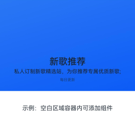
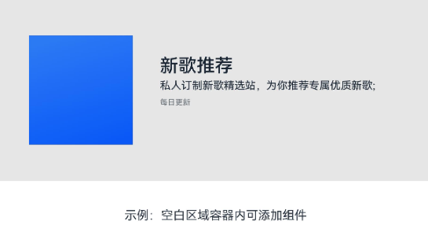
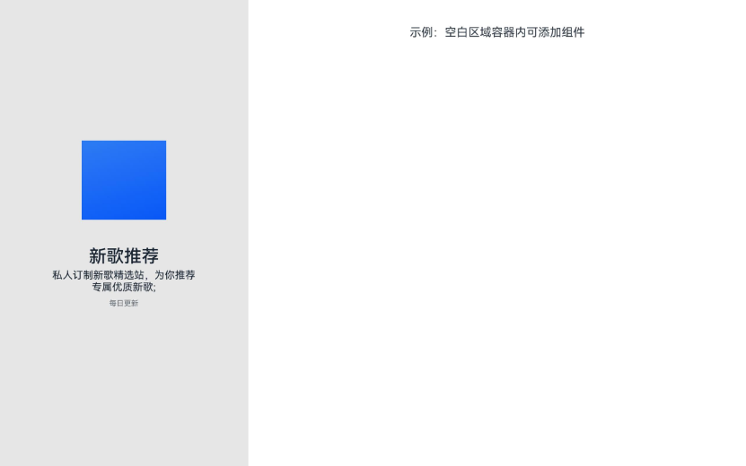

# SplitLayout
<!--Kit: ArkUI-->
<!--Subsystem: ArkUI-->
<!--Owner: @fengluochenai-->
<!--Designer: @YanSanzo-->
<!--Tester: @tinygreyy-->
<!--Adviser: @HelloCrease-->


上下结构布局介绍了常用的页面布局样式。主要分为上下文本和上下图文两种类型。


> **说明：**
>
> 该组件从API version 10开始支持。后续版本如有新增内容，则采用上角标单独标记该内容的起始版本。
>


## 导入模块

```
import { SplitLayout } from '@kit.ArkUI';
```


## 子组件

无

## 属性
不支持[通用属性](ts-component-general-attributes.md)。


## SplitLayout

SplitLayout({mainImage: Resource, primaryText: string, secondaryText?: string, tertiaryText?: string, container: ()&nbsp;=&gt;&nbsp;void })

**装饰器类型：**@Component

**原子化服务API：** 从API version 11开始，该接口支持在原子化服务中使用。

**系统能力：** SystemCapability.ArkUI.ArkUI.Full

**设备行为差异：** 该接口在Wearable设备上使用时，应用程序运行异常，异常信息中提示接口未定义，在其他设备中可正常调用。

| 名称 | 类型 | 必填 | 装饰器类型        | 说明     |
| -------- | -------- | -------- |---------------|--------|
| mainImage | [ResourceStr](ts-types.md#resourcestr) | 是 | @State | 传入图片。  |
| primaryText | [ResourceStr](ts-types.md#resourcestr) | 是 | @Prop         | 标题内容。  |
| secondaryText | [ResourceStr](ts-types.md#resourcestr) | 否 | @Prop         | 副标题内容。 |
| tertiaryText | [ResourceStr](ts-types.md#resourcestr) | 否 | @Prop         | 辅助文本。  |
| container | ()&nbsp;=&gt;&nbsp;void | 是 | @BuilderParam | 容器内组件。 |

## 事件
不支持[通用事件](ts-component-general-events.md)。

## 示例
该示例通过SplitLayout实现了页面布局，并具备自适应能力。
```ts
import { SplitLayout } from '@kit.ArkUI';

@Entry
@Component
struct Index {
  @State demoImage: Resource = $r("app.media.background");

  build() {
    Column() {
      SplitLayout({
        mainImage: this.demoImage,
        primaryText: '新歌推荐',
        secondaryText: '私人订制新歌精选站，为你推荐专属优质新歌;',
        tertiaryText: '每日更新',
      }) {
        Text('示例：空白区域容器内可添加组件')
          .margin({ top: 36 })
      }
    }
    .justifyContent(FlexAlign.SpaceBetween)
    .height('100%')
    .width('100%')
  }
}
```


小于等于600vp布局：





大于600vp且小于等于840vp的布局：





大于840vp布局：



