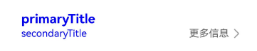

# SubHeader


子标题，用于列表项顶部，将该组列表划分为一个区块，子标题名称用来概括该区块内容。也可以用于内容项顶部，子标题名称用来概括该区块内容。


> **说明：**
>
> 该组件从API version 10开始支持。后续版本如有新增内容，则采用上角标单独标记该内容的起始版本。
>
> 该组件不支持在Wearable设备上使用。


## 导入模块

```ts
import { SubHeader } from '@kit.ArkUI';
```


## 子组件

无

## 属性

不支持[通用属性](ts-component-general-attributes.md)。

> **说明：**
>
> 不支持设置文本相关。

## SubHeader

SubHeader({icon?: ResourceStr, iconSymbolOptions?: SymbolOptions, primaryTitle?: ResourceStr, secondaryTitle?:
ResourceStr, select?: SelectOptions, operationType?: OperationType, operationItem?: Array&lt;OperationOption&gt;,
operationSymbolOptions?: Array&lt;SymbolOptions&gt;, primaryTitleModifier?: TextModifier, secondaryTitleModifier?:
TextModifier, titleBuilder?: () => void, contentMargin?: LocalizedMargin, contentPadding?: LocalizedPadding})

**装饰器类型：**\@Component

**系统能力：** SystemCapability.ArkUI.ArkUI.Full

| 名称 | 类型 | 必填 | 装饰器类型         | 说明 |
| -------- | -------- | -------- |---------------| -------- |
| icon | [ResourceStr](ts-types.md#resourcestr) | 否 | \@Prop        | 图标设置项。<br/>**原子化服务API：** 从API version 11开始，该接口支持在原子化服务中使用。 |
| iconSymbolOptions<sup>12+</sup> | [SymbolOptions](#symboloptions12) | 否 | -             | icon为[SymbolGlyph](ts-basic-components-symbolGlyph.md)时的设置项。<br/>**原子化服务API：** 从API version 12开始，该接口支持在原子化服务中使用。 |
| primaryTitle | [ResourceStr](ts-types.md#resourcestr) | 否 | \@Prop        | 标题内容。<br/>**原子化服务API：** 从API version 11开始，该接口支持在原子化服务中使用。 |
| secondaryTitle | [ResourceStr](ts-types.md#resourcestr) | 否 | \@Prop        | 副标题内容。<br/>**原子化服务API：** 从API version 11开始，该接口支持在原子化服务中使用。 |
| select | [SelectOptions](#selectoptions) | 否 | -             | select内容以及事件。<br/>**原子化服务API：** 从API version 11开始，该接口支持在原子化服务中使用。 |
| operationType | [OperationType](#operationtype) | 否 | \@Prop        | 操作区(右侧)元素样式。<br/>默认值：OperationType.BUTTON<br/>**原子化服务API：** 从API version 11开始，该接口支持在原子化服务中使用。 |
| operationItem | Array&lt;[OperationOption](#operationoption)&gt; | 否 | -             | 操作区（右侧）的设置项。<br/>**原子化服务API：** 从API version 11开始，该接口支持在原子化服务中使用。 |
| operationSymbolOptions<sup>12+</sup> | Array&lt;[SymbolOptions](#symboloptions12)&gt; | 否 | -             | operationType为OperationType.ICON_GROUP，<br/>operationItem设置多个图标，图标为[SymbolGlyph](ts-basic-components-symbolGlyph.md)时的设置项。<br/>**原子化服务API：** 从API version 12开始，该接口支持在原子化服务中使用。 |
| primaryTitleModifier<sup>12+</sup> | [TextModifier](ts-universal-attributes-attribute-modifier.md) | 否 | -             | 设置标题文本属性，如设置标题颜色、字体大小、字重等。<br/>**原子化服务API：** 从API version 12开始，该接口支持在原子化服务中使用。 |
| secondaryTitleModifier<sup>12+</sup> | [TextModifier](ts-universal-attributes-attribute-modifier.md) | 否 | -             | 设置副标题文本属性，如设置标题颜色、字体大小、字重等。<br/>**原子化服务API：** 从API version 12开始，该接口支持在原子化服务中使用。 |
| titleBuilder<sup>12+</sup> | () => void | 否 | @BuilderParam | 自定义标题区内容<br/>**原子化服务API：** 从API version 12开始，该接口支持在原子化服务中使用。 |
| contentMargin<sup>12+</sup> | [LocalizedMargin](ts-types.md#localizedmargin12) | 否 | @Prop         | 子标题外边距，不支持设置负数。<br />默认值：<br /> `{start: LengthMetrics.resource(` <br /> `$r('sys.float.margin_left'))`, <br /> `end: LengthMetrics.resource(` <br /> `$r('sys.float.margin_right'))}`<br/>**原子化服务API：** 从API version 12开始，该接口支持在原子化服务中使用。 |
| contentPadding<sup>12+</sup> | [LocalizedPadding](ts-types.md#localizedpadding12) | 否 | @Prop         | 子标题内边距。<br />默认值：<br />左侧为副标题或副标题加图标时：<br /> {start: LengthMetrics.vp(12), end: LengthMetrics.vp(12)}。<br/>**原子化服务API：** 从API version 12开始，该接口支持在原子化服务中使用。|


## OperationType

**原子化服务API：** 从API version 11开始，该接口支持在原子化服务中使用。

**系统能力：** SystemCapability.ArkUI.ArkUI.Full

| 名称 | 值 | 说明 |
| -------- | -------- | -------- |
| TEXT_ARROW |  0  | 文本按钮（带右箭头）。 |
| BUTTON |  1  |  文本按钮（不带右箭头）。 |
| ICON_GROUP |  2  |  图标按钮（最多支持配置三张图标）。 |
| LOADING |  3  |  加载动画。 |

## SelectOptions

**系统能力：** SystemCapability.ArkUI.ArkUI.Full

| 名称 | 类型 | 必填 | 说明                                                                                                                                                           |
| -------- | -------- | -------- |--------------------------------------------------------------------------------------------------------------------------------------------------------------|
| options | Array&lt;[SelectOption](ts-basic-components-select.md#selectoption对象说明)&gt; | 是 | 下拉选项内容。 <br/>**原子化服务API：** 从API version 11开始，该接口支持在原子化服务中使用。                                                                                                 |
| selected | number | 否 | 设置下拉菜单初始选项的索引。<br/>取值范围：大于等于-1。<br/>第一项的索引为0。<br/>当不设置selected属性时，默认选择值为-1，菜单项不选中。<br/>若设置数值小于-1，按不选中处理。<br/>**原子化服务API：** 从API version 11开始，该接口支持在原子化服务中使用。 |
| value | [ResourceStr](ts-types.md#resourcestr) | 否 | 设置下拉按钮本身的文本内容。<br/>默认值：空字符串。<br/>**说明**：如果文本大于列宽时，文本被截断。从API version 20开始，支持Resource类型。<br/>**原子化服务API：** 从API version 11开始，该接口支持在原子化服务中使用。                       |
| onSelect | (index:&nbsp;number,&nbsp;value?:&nbsp;string)&nbsp;=&gt;&nbsp;void | 否 | 下拉菜单选中某一项的回调。<br/>-&nbsp;index：选中项的索引。<br/>-&nbsp;value：选中项的值。<br/>**原子化服务API：** 从API version 11开始，该接口支持在原子化服务中使用。                                           |
| defaultFocus<sup>18+</sup> | boolean | 否 | 下拉按钮是否为默认焦点。<br/>true：下拉按钮是默认焦点。<br/>false：下拉按钮不是默认焦点。<br />默认值：false <br/>**原子化服务API：** 从API version 18开始，该接口支持在原子化服务中使用。                                 |

## OperationOption

**系统能力：** SystemCapability.ArkUI.ArkUI.Full

| 名称 | 类型 | 必填 | 说明                                                                                                                                                                                                                                                       |
| -------- | -------- | -------- |----------------------------------------------------------------------------------------------------------------------------------------------------------------------------------------------------------------------------------------------------------|
| value | [ResourceStr](ts-types.md#resourcestr) | 是 | 文本内容。<br/>**原子化服务API：** 从API version 11开始，该接口支持在原子化服务中使用。                                                                                                                                                                                                                                                  |
| action | ()=&gt;void | 否 | 事件。<br/>**原子化服务API：** 从API version 11开始，该接口支持在原子化服务中使用。                                                                                                                                                                                                                                                    |
| accessibilityLevel<sup>18+<sup>       | string  | 否 | 子标题右侧按钮无障碍重要性。用于控制当前项是否可被无障碍辅助服务所识别。<br/>支持的值为：<br/>"auto"：当前组件会转换'yes'。<br/>"yes"：当前组件可被无障碍辅助服务所识别。<br/>"no"：当前组件不可被无障碍辅助服务所识别。<br/>"no-hide-descendants"：当前组件及其所有子组件不可被无障碍辅助服务所识别。<br/>默认值："auto"。<br/>**原子化服务API：** 从API version 18开始，该接口支持在原子化服务中使用。 |
| accessibilityText<sup>18+<sup>        | ResourceStr | 否 | 子标题右侧按钮的无障碍文本属性。当组件不包含文本属性时，屏幕朗读选中此组件时不播报，使用者无法清楚地知道当前选中了什么组件。为了解决此场景，开发人员可为不包含文字信息的组件设置无障碍文本，当屏幕朗读选中此组件时播报无障碍文本的内容，帮助屏幕朗读的使用者清楚地知道自己选中了什么组件。<br/>默认值：类型为TEXT_ARROW和BUTTON时默认值为当前项value属性内容，其他类型默认值为“ ”。<br/>**原子化服务API：** 从API version 18开始，该接口支持在原子化服务中使用。 |
| accessibilityDescription<sup>18+<sup> | ResourceStr | 否 | 子标题右侧按钮的无障碍描述。此描述用于向用户详细解释当前组件，开发人员应为组件的这一属性提供较为详尽的文本说明，以协助用户理解即将执行的操作及其可能产生的后果。特别是当这些后果无法仅从组件的属性和无障碍文本中直接获知时。如果组件同时具备文本属性和无障碍说明属性，当组件被选中时，系统将首先播报组件的文本属性，随后播报无障碍说明属性的内容。<br/>默认值：类型为LOADING时，默认值为“正在加载”，其他类型默认值为“单指双击即可执行”。<br/>**原子化服务API：** 从API version 18开始，该接口支持在原子化服务中使用。        |
| defaultFocus<sup>18+</sup> | boolean | 否 | 子标题右侧按钮是否为默认焦点。<br/>true：子标题右侧按钮是默认焦点。<br/>false：子标题右侧按钮不是默认焦点。<br />默认值：false <br/>**原子化服务API：** 从API version 18开始，该接口支持在原子化服务中使用。                                                                                                                                            |
## SymbolOptions<sup>12+</sup>

**原子化服务API：** 从API version 12开始，该接口支持在原子化服务中使用。

**系统能力：** SystemCapability.ArkUI.ArkUI.Full

| 名称 | 类型 | 必填 | 说明                                                                                                                                                                                                                                              |
| -------- | -------- | -------- |-------------------------------------------------------------------------------------------------------------------------------------------------------------------------------------------------------------------------------------------------|
| fontColor | Array&lt;[ResourceColor](ts-types.md#resourcecolor)&gt; | 否 | 设置[SymbolGlyph](ts-basic-components-symbolGlyph.md)颜色。<br/>默认值：不同渲染策略下默认值不同。                                                                                                                                                                       |
| fontSize | number \|string \|[Resource](ts-types.md#resource) | 否 | 设置[SymbolGlyph](ts-basic-components-symbolGlyph.md)大小。<br/>取值范围：大于等于0。<br/>默认值：系统默认值。                                                                                                                                                              |
| fontWeight | number \|&nbsp;[FontWeight](ts-appendix-enums.md#fontweight)&nbsp;\|&nbsp;string | 否 | 设置[SymbolGlyph](ts-basic-components-symbolGlyph.md)粗细。<br/>number类型取值[100,900]，取值间隔为100，默认为400，取值越大，字体越粗。<br/>string类型仅支持number类型取值的字符串形式，例如“400”，以及“bold”、“bolder”、“lighter”、“regular” 、“medium”分别对应FontWeight中相应的枚举值。<br/>默认值：FontWeight.Normal。 |
| renderingStrategy | [SymbolRenderingStrategy](ts-basic-components-symbolGlyph.md#symbolrenderingstrategy11枚举说明) | 否 | 设置[SymbolGlyph](ts-basic-components-symbolGlyph.md)渲染策略。<br/>默认值：SymbolRenderingStrategy.SINGLE。<br/>**说明：**<br/>$r('sys.symbol.ohos_*')中引用的资源仅ohos_trash_circle、ohos_folder_badge_plus、ohos_lungs支持分层与多色模式。                                       |
| effectStrategy | [SymbolEffectStrategy](ts-basic-components-symbolGlyph.md#symboleffectstrategy11枚举说明) | 否 | 设置[SymbolGlyph](ts-basic-components-symbolGlyph.md)动效策略。<br/>默认值：SymbolEffectStrategy.NONE。<br/>**说明：**<br/>$r('sys.symbol.ohos_*')中引用的资源仅ohos_wifi支持层级动效模式。                                                                                       |

## 事件
不支持[通用事件](ts-component-general-events.md)。

## 示例
### 示例1（效率型子标题）
该示例主要演示子标题左侧为icon、secondaryTitle，右侧operationType为按钮类型。

```ts
import { Prompt, OperationType, SubHeader } from '@kit.ArkUI';

@Entry
@Component
struct SubHeaderExample {
  build() {
    Column() {
      SubHeader({
        icon: $r('sys.media.ohos_ic_public_email'),
        secondaryTitle: '二级标题',
        operationType: OperationType.BUTTON,
        operationItem: [{
          value: '操作',
          action: () => {
            Prompt.showToast({ message: 'demo' });
          }
        }]
      })
    }
  }
}
```


### 示例2（双行文本内容型子标题）
该示例主要演示子标题左侧为primaryTitle、secondaryTitle，右侧operationType类型为TEXT_ARROW。

```ts
import { Prompt, OperationType, SubHeader } from '@kit.ArkUI';

@Entry
@Component
struct SubHeaderExample {
  build() {
    Column() {
      SubHeader({
        primaryTitle: '一级标题',
        secondaryTitle: '二级标题',
        operationType: OperationType.TEXT_ARROW,
        operationItem: [{
          value: '更多',
          action: () => {
            Prompt.showToast({ message: 'demo' });
          }
        }]
      })
    }
  }
}
```


### 示例3（spinner型内容型子标题）
该示例主要演示子标题左侧为select，右侧operationType类型为ICON_GROUP。

```ts
import { Prompt, OperationType, SubHeader } from '@kit.ArkUI';

@Entry
@Component
struct SubHeaderExample {
  build() {
    Column() {
      SubHeader({
        // 左侧为select选择器
        select: {
          options: [{ value: 'aaa' }, { value: 'bbb' }, { value: 'ccc' }],
          value: 'selectDemo',
          selected: 2,
          onSelect: () => {
            Prompt.showToast({ message: 'demo' });
          }
        },
        operationType: OperationType.ICON_GROUP,
        // 右侧为三个icon图标
        operationItem: [{
          value: $r('sys.media.ohos_ic_public_email'),
          action: () => {
            Prompt.showToast({ message: 'demo' })
          }
        }, {
          value: $r('sys.media.ohos_ic_public_email'),
          action: () => {
            Prompt.showToast({ message: 'demo' });
          }
        }, {
          value: $r('sys.media.ohos_ic_public_email'),
          action: () => {
            Prompt.showToast({ message: 'demo' });
          }
        }]
      })
    }
  }
}
```


### 示例4（设置左侧symbol图标）
该示例主要演示子标题左侧icon设置symbol图标。

```ts

import { Prompt, OperationType, SubHeader } from '@kit.ArkUI';

@Entry
@Component
struct SubHeaderExample {
  build() {
    Column() {
      SubHeader({
        // 设置icon为symbol图标
        icon: $r('sys.symbol.ohos_wifi'),
        iconSymbolOptions: {
          effectStrategy: SymbolEffectStrategy.HIERARCHICAL,
        },
        secondaryTitle: '标题',
        operationType: OperationType.BUTTON,
        operationItem: [{
          value: '操作',
          action: () => {
            Prompt.showToast({ message: 'demo' });
          }
        }]
      })
    }
  }
}
```


### 示例5（设置右侧symbol图标）
该示例主要演示子标题operationType设置为OperationType.ICON_GROUP，operationItem的value设置为symbol图标。

```ts
import { Prompt, OperationType, SubHeader } from '@kit.ArkUI';

@Entry
@Component
struct SubHeaderExample {
  build() {
    Column() {
      SubHeader({
        // 设置左侧select
        select: {
          options: [{ value: 'aaa' }, { value: 'bbb' }, { value: 'ccc' }],
          value: 'selectDemo',
          selected: 2,
          onSelect: () => {
            Prompt.showToast({ message: 'demo' });
          }
        },
        operationType: OperationType.ICON_GROUP,
        // 设置右侧icon
        operationItem: [{
          value: $r('sys.symbol.ohos_lungs'),
          action: () => {
            Prompt.showToast({ message: 'icon1' });
          }
        }, {
          value: $r('sys.symbol.ohos_lungs'),
          action: () => {
            Prompt.showToast({ message: 'icon2' });
          }
        }, {
          value: $r('sys.symbol.ohos_lungs'),
          action: () => {
            Prompt.showToast({ message: 'icon3' });
          }
        }],
        // 设置右侧icon图标symbol样式
        operationSymbolOptions: [{
          fontWeight: FontWeight.Lighter,
        }, {
          renderingStrategy: SymbolRenderingStrategy.MULTIPLE_COLOR,
          fontColor: [Color.Blue, Color.Grey, Color.Green],
        }, {
          renderingStrategy: SymbolRenderingStrategy.MULTIPLE_OPACITY,
          fontColor: [Color.Blue, Color.Grey, Color.Green],
        }]
      })
    }
  }
}
```


### 示例6（自定义标题内容）
 该示例主要演示SubHeader设置titleBuilder自定义标题内容的效果。

```ts
import { Prompt, OperationType, SubHeader } from '@kit.ArkUI';

@Entry
@Component
struct SubHeaderExample {
  // 自定义左侧标题
  @Builder
  TitleBuilder(): void {
    Text('自定义标题')
      .fontSize(24)
      .fontColor(Color.Blue)
      .fontWeight(FontWeight.Bold)
  }

  build() {
    Column() {
      SubHeader({
        // 调用TitleBuilder
        titleBuilder: () => {
          this.TitleBuilder();
        },
        primaryTitle: '一级标题',
        secondaryTitle: '二级标题',
        icon: $r('sys.symbol.ohos_star'),
        operationType: OperationType.TEXT_ARROW,
        operationItem: [{
          value: '更多信息',
          action: () => {
            Prompt.showToast({ message: 'demo' });
          }
        }]
      })
    }
  }
}
```


### 示例7（自定义标题样式）
该示例主要演示SubHeader设置标题和副标题字体样式以及标题内外边距的效果。

```ts
import { Prompt, OperationType, SubHeader, LengthMetrics, TextModifier } from '@kit.ArkUI';

@Entry
@Component
struct SubHeaderExample {
  // 设置主副标题文本颜色
  @State primaryModifier: TextModifier = new TextModifier().fontColor(Color.Blue);
  @State secondaryModifier: TextModifier = new TextModifier().fontColor(Color.Blue);

  build() {
    Column() {
      SubHeader({
        primaryTitle: 'primaryTitle',
        secondaryTitle: 'secondaryTitle',
        primaryTitleModifier: this.primaryModifier,
        secondaryTitleModifier: this.secondaryModifier,
        operationType: OperationType.TEXT_ARROW,
        operationItem: [{
          value: '更多信息',
          action: () => {
            Prompt.showToast({ message: 'demo' });
          }
        }],
        // 标题内外间距
        contentMargin: { start: LengthMetrics.vp(20), end: LengthMetrics.vp(20) },
        contentPadding: { start: LengthMetrics.vp(20), end: LengthMetrics.vp(20) }
      })
    }
  }
}
```




### 示例8（右侧按钮自定义播报）
从API version 18开始，该示例通过设置subheader的右侧按钮属性accessibilityText、accessibilityDescription、accessibilityLevel自定义屏幕朗读播报文本。
```ts
import { Prompt, OperationType, SubHeader } from '@kit.ArkUI';

@Entry
@Component
struct SubHeaderExample {
  build() {
    Column() {
      Divider().color('grey').width('100%').height('2vp')
      SubHeader({
        // 图标+二级标题, 右侧button
        icon: $r('sys.media.ohos_ic_public_email'),
        secondaryTitle: '二级标题',
        operationType: OperationType.BUTTON,
        operationItem: [{
          value: '操作',
          action: () => {
            Prompt.showToast({ message: 'demo' })
          }
        }]
      })
      Divider().color('grey').width('100%').height('2vp')
      SubHeader({
        // 右侧text_arrow
        primaryTitle: '一级标题',
        secondaryTitle: '二级标题',
        operationType: OperationType.TEXT_ARROW,
        operationItem: [{
          value: '更多',
          action: () => {
            Prompt.showToast({ message: 'demo' })
          }
        }]
      })
      Divider().color('grey').width('100%').height('2vp')
      SubHeader({
        //左侧select 右侧是icon_(依次获焦)
        select: {
          options: [{ value: 'aaa' }, { value: 'bbb' }, { value: 'ccc' }],
          value: 'selectDemo',
          selected: 0,
          onSelect: (index: number, value?: string) => {
            console.log(`subheader onselect index : ${index}, value: ${value}`);
          }
        },
        operationType: OperationType.ICON_GROUP,
        operationItem: [{
          value: $r('sys.media.ohos_ic_public_email'),
          accessibilityText: '图标1',
          accessibilityLevel: 'yes',
        }, {
          value: $r('sys.media.ohos_ic_public_email'),
          accessibilityText: '图标2',
          accessibilityLevel: 'no',
        }, {
          value: $r('sys.media.ohos_ic_public_email'),
          accessibilityText: '图标3',
          accessibilityDescription: '点击操作图标3',
        }]
      })
      Divider().color('grey').width('100%').height('2vp')
    }
  }
}
```


### 示例9（右侧按钮设置默认获焦）
从API version 18开始，该示例通过设置subheader的右侧按钮属性defaultFocus使其默认获焦。
```ts
import { Prompt, OperationType, SubHeader } from '@kit.ArkUI';

@Entry
@Component
struct SubHeaderExample {
  build() {
    Column() {
      SubHeader({
        // 图标+二级标题, 右侧button
        icon: $r('app.media.app_icon'),
        secondaryTitle: '二级标题',
        operationType: OperationType.BUTTON,
        operationItem: [{
          value: '操作',
          defaultFocus: true,
          action: () => {
            Prompt.showToast({ message: 'demo' })
          }
        }]
      })
    }
  }
}
```

