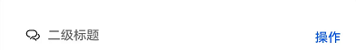
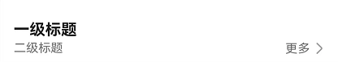
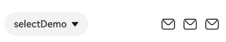
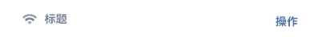
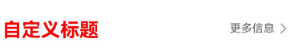
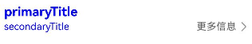
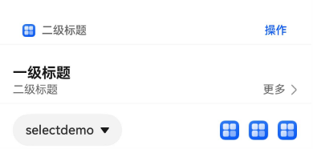
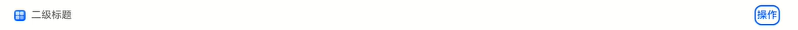

# SubHeaderV2


子标题，用于列表项顶部，将该组列表划分为一个区块，子标题名称用来概括该区块内容。也可以用于内容项顶部，子标题名称用来概括该区块内容。

该组件基于[状态管理V2](../../../ui/state-management/arkts-state-management-overview.md#状态管理v2)实现，相较于[状态管理V1](../../../ui/state-management/arkts-state-management-overview.md#状态管理v1)，状态管理V2增强了对数据对象的深度观察与管理能力，不再局限于组件层级。借助状态管理V2，开发者可以通过该组件更灵活地控制子标题的数据和状态，实现更高效的用户界面刷新。


> **说明：**
>
> - 该组件从API version 18开始支持。后续版本如有新增内容，则采用上角标单独标记该内容的起始版本。
> 
> - 该组件不支持在Wearable设备上使用。


## 导入模块

```ts
import { SubHeader } from '@kit.ArkUI';
```


## 子组件

无

## 属性

不支持[通用属性](ts-component-general-attributes.md)。

## SubHeaderV2

SubHeaderV2({
icon?: SubHeaderV2IconType,
title?: SubHeaderV2Title,
select?: SubHeaderV2Select,
operationType?: SubHeaderV2OperationType,
operationItems?: SubHeaderV2OperationItem
})

子标题，用于列表项顶部，将该组列表划分为一个区块，子标题名称用来概括该区块内容。也可以用于内容项顶部，子标题名称用来概括该区块内容。

**装饰器类型：** @ComponentV2

**原子化服务API：** 从API version 18开始，该接口支持在原子化服务中使用。

**系统能力：** SystemCapability.ArkUI.ArkUI.Full

| 名称 | 类型                                                      | 必填 | 装饰器类型 | 说明                                     |
| -------- |---------------------------------------------------------| -------- | -------- |----------------------------------------|
| icon| [SubHeaderV2IconType](#subheaderv2icontype)             | 否 | @Param | 图标设置项。<br />默认值：undefined              |
| title| [SubHeaderV2Title](#subheaderv2title)                   | 否 | @Param| 标题设置项。<br />默认值：undefined              |
| select| [SubHeaderV2Select](#subheaderv2select)                 | 否 | @Param | select内容以及事件。<br />默认值：undefined       |
| operationType | [SubHeaderV2OperationType](#subheaderv2operationtype)   | 否 | @Param| 操作区元素样式。<br />默认值：OperationType.BUTTON |
| operationItems | [SubHeaderV2OperationItem](#subheaderv2operationitem)[] | 否 | @Param| 操作区的设置项。<br />默认值：undefined            |
| titleBuilder | [SubHeaderV2TitleBuilder](#subheaderv2titlebuilder)                            | 否 | @BuilderParam | 自定义标题区内容。<br />默认值：() => void          |

## SubHeaderV2IconType

type SubHeaderV2IconType = ResourceStr | SymbolGlyphModifier

图标内容的联合类型。

**原子化服务API：** 从API version 18开始，该接口支持在原子化服务中使用。

**系统能力：** SystemCapability.ArkUI.ArkUI.Full

| 类型                        | 说明                     |
| ----------------------------- |------------------------|
| ResourceStr                 | 资源类型，用于定义普通图标。         |
| SymbolGlyphModifier | Symbol类型，用于定义Symbol图标。 |

## SubHeaderV2Title
标题设置项

**装饰器类型：** @ObservedV2

### 属性

**原子化服务API：** 从API version 18开始，该接口支持在原子化服务中使用。

**系统能力：** SystemCapability.ArkUI.ArkUI.Full

| 名称 | 类型 | 必填 | 装饰器类型 | 说明                           |
| -------- | -------- | -------- | -------- |------------------------------|
| primaryTitle|  [ResourceStr](ts-types.md#resourcestr)  | 否 | @Trace | 标题内容。<br />默认值：undefined                        |
| secondaryTitle|  [ResourceStr](ts-types.md#resourcestr)  | 否 | @Trace | 副标题内容。<br />默认值：undefined                       |
| primaryTitleModifier|  [TextModifier](ts-universal-attributes-attribute-modifier.md)  | 否 | @Trace | 设置标题文本属性，如设置标题颜色、字体大小、字重等。<br />默认值：undefined   |
| secondaryTitleModifier|   [TextModifier](ts-universal-attributes-attribute-modifier.md)  | 否 | @Trace | 设置副标题文本属性，如设置副标题颜色、字体大小、字重等。<br />默认值：undefined |

### constructor

constructor(options: SubHeaderV2TitleOptions)

标题内容信息SubHeaderV2Title构造函数。

**原子化服务API：** 从API version 18开始，该接口支持在原子化服务中使用。

**系统能力：** SystemCapability.ArkUI.ArkUI.Full

**参数：**

| 参数名    | 类型                                                  | 必填 | 说明             |
| --------- |-----------------------------------------------------| ------ | ------------------ |
| options | [SubHeaderV2TitleOptions](#subheaderv2titleoptions) | 是   | 标题内容信息。 |

## SubHeaderV2TitleOptions

用于构建SubHeaderV2Title对象。

**原子化服务API：** 从API version 18开始，该接口支持在原子化服务中使用。

**系统能力：** SystemCapability.ArkUI.ArkUI.Full

| 名称 | 类型 | 必填  | 说明                          |
| -------- | -------- | -------- |-----------------------------|
| primaryTitle|  [ResourceStr](ts-types.md#resourcestr)  | 否 | 标题内容。<br />默认值：undefined                       |
| secondaryTitle|  [ResourceStr](ts-types.md#resourcestr)  | 否 | 副标题内容。<br />默认值：undefined                      |
| primaryTitleModifier|  [TextModifier](ts-universal-attributes-attribute-modifier.md)  | 否 | 设置标题文本属性，如设置副标题颜色、字体大小、字重等。<br />默认值：undefined |
| secondaryTitleModifier|   [TextModifier](ts-universal-attributes-attribute-modifier.md)  | 否 | 设置副标题文本属性，如设置标题颜色、字体大小、字重等。<br />默认值：undefined |

## SubHeaderV2Select

select内容以及事件。

**装饰器类型：** @ObservedV2

### 属性

**原子化服务API：** 从API version 18开始，该接口支持在原子化服务中使用。

**系统能力：** SystemCapability.ArkUI.ArkUI.Full

| 名称 | 类型                                                               | 必填 | 装饰器类型| 说明                                                                        |
| -------- |------------------------------------------------------------------| -------- | -------- |---------------------------------------------------------------------------|
| options | [SelectOption](ts-basic-components-select.md#selectoption对象说明)[] | 是 | @Trace | 下拉选项内容。                                                                   |
| selectedIndex | number                                                           | 否 |@Trace | 设置下拉菜单初始选项的索引。<br />第一项的索引为0。<br />当不设置selected属性时，<br />默认选择值为-1，菜单项不选中。 |
| selectedContent | string                                                           | 否 | @Trace | 设置下拉按钮本身的文本内容。默认值''                                                       |
| onSelect | [SubHeaderV2SelectOnSelect](#subheaderv2selectonselect)                                   | 否 | @Trace | 下拉菜单选中某一项的回调。 <br />默认值：undefined                                               |
| defaultFocus | boolean | 否 | @Trace |下拉按钮是否为默认焦点。<br/>true：下拉按钮是默认焦点。<br/>false：下拉按钮不是默认焦点。<br />默认值：false                                  |

### constructor

constructor(options: SubHeaderV2SelectOptions)

select内容以及事件构造函数。

**原子化服务API：** 从API version 18开始，该接口支持在原子化服务中使用。

**系统能力：** SystemCapability.ArkUI.ArkUI.Full

**参数：**

| 参数名    | 类型                            | 必填 | 说明             |
| --------- |-------------------------------| ------ | ------------------ |
| options | [SubHeaderV2SelectOptions](#subheaderv2selectoptions) | 是   | 下拉选项信息。 |

## SubHeaderV2SelectOptions

用于构建SubHeaderV2Select对象。

**原子化服务API：** 从API version 18开始，该接口支持在原子化服务中使用。

**系统能力：** SystemCapability.ArkUI.ArkUI.Full

| 名称 | 类型                                                               | 必填  | 说明                                                                        |
| -------- |------------------------------------------------------------------| -------- |---------------------------------------------------------------------------| 
| options | [SelectOption](ts-basic-components-select.md#selectoption对象说明)[] | 是 | 下拉选项内容。                                                                   |
| selectedIndex | number                                                           | 否 | 设置下拉菜单初始选项的索引。<br />第一项的索引为0。<br />当不设置selected属性时，<br />默认选择值为-1，菜单项不选中。 |
| selectedContent | string                                                           | 否 | 设置下拉按钮本身的文本内容。默认值''。                                                      |
| onSelect | [SubHeaderV2SelectOnSelect](#subheaderv2selectonselect)          | 否 | 下拉菜单选中某一项的回调。<br />默认值：undefined                                                |
| defaultFocus | boolean | 否 | 下拉按钮是否为默认焦点。<br/>true：下拉按钮是默认焦点。<br/>false：下拉按钮不是默认焦点。<br />默认值：false                                  |

## SubHeaderV2SelectOnSelect

type SubHeaderV2SelectOnSelect = (selectedIndex: number, selectedContent?: string) => void

下拉菜单选中某一项的回调类型。

**原子化服务API：** 从API version 18开始，该接口支持在原子化服务中使用。

**系统能力：** SystemCapability.ArkUI.ArkUI.Full

**参数：**

| 类型            | 说明                                          |
|:--------------|:--------------------------------------------|
| selectIndex   | 下拉菜单选中某一项的回调类型。表示选中项的索引。 |
| selectContent | 下拉菜单选中某一项的回调类型。表示选中项的值。|

## SubHeaderV2OperationType

操作区元素样式。

**原子化服务API：** 从API version 18开始，该接口支持在原子化服务中使用。

**系统能力：** SystemCapability.ArkUI.ArkUI.Full

| 名称 | 值 | 说明 |
| -------- | -------- | -------- |
| TEXT_ARROW |  0  | 文本按钮（带右箭头）。 |
| BUTTON |  1  |  文本按钮（不带右箭头）。 |
| ICON_GROUP |  2  |  图标按钮（最多支持配置三张图标）。 |
| LOADING |  3  |  加载动画。 |

## SubHeaderV2OperationItemType

type SubHeaderV2OperationItemType = ResourceStr | SymbolGlyphModifier

操作区元素内容的联合类型。

**原子化服务API：** 从API version 18开始，该接口支持在原子化服务中使用。

**系统能力：** SystemCapability.ArkUI.ArkUI.Full

| 类型                        | 说明                                |
| ----------------------------- |-----------------------------------|
| ResourceStr                 | 字符串类型用于定义文本显示或普通图标；资源类型，用于定义普通图标。 |
| SymbolGlyphModifier | Symbol类型，用于定义Symbol图标。            |

## SubHeaderV2OperationItem

操作区的设置项。

**装饰器类型：** @ObservedV2

### 属性

**原子化服务API：** 从API version 18开始，该接口支持在原子化服务中使用。

**系统能力：** SystemCapability.ArkUI.ArkUI.Full

| 名称 | 类型 | 必填 | 装饰器类型 | 说明                                                  |
| -------- | -------- | -------- | -------- |-----------------------------------------------------|
| content |  [SubHeaderV2OperationItemType](#subheaderv2operationitemtype)  | 是 | @Trace | 操作区元素内容。                                            |
| action | SubHeaderV2OperationItemAction | 否 | @Trace | 操作区事件。默认值() => void。                                |
| accessibilityText |[ResourceStr](ts-types.md#resourcestr) | 否 |@Trace | 子标题右侧icon图标无障碍描述。 <br />默认值：undefined                     |
| accessibilityLevel |[string](ts-types.md#resourcestr) | 否 |@Trace | 子标题右侧icon图标无障碍重要性。<br>默认值: “yes”。                   | 
| accessibilityDescription|[ResourceStr](ts-types.md#resourcestr) | 否 |@Trace | 子标题右侧icon图标无障碍说明，用于为用户进一步说明当前组件。<br>默认值：“单指双击即可执行”。 |
| defaultFocus | boolean | 否 | @Trace |子标题右侧按钮是否为默认焦点。<br/>true：子标题右侧按钮是默认焦点。<br/>false：子标题右侧按钮不是默认焦点。<br />默认值：false                                                                                                                                            |

### constructor

constructor(options: SubHeaderV2OperationItemOptions)

下拉选项信息SubHeaderV2OperationItem的构造函数。

**原子化服务API：** 从API version 18开始，该接口支持在原子化服务中使用。

**系统能力：** SystemCapability.ArkUI.ArkUI.Full

**参数：**

| 参数名    | 类型             | 必填 | 说明             |
| --------- | -------------------- | ------ | ------------------ |
| options | SubHeaderV2OperationItemOptions| 是   | 下拉选项信息。 |

## SubHeaderV2OperationItemAction

type SubHeaderV2OperationItemAction = () => void

操作区的设置项的回调事件类型。

**原子化服务API：** 从API version 18开始，该接口支持在原子化服务中使用。

**系统能力：** SystemCapability.ArkUI.ArkUI.Full

## SubHeaderV2OperationItemOptions

用于构建SubHeaderV2OperationItem对象。

**原子化服务API：** 从API version 18开始，该接口支持在原子化服务中使用。

**系统能力：** SystemCapability.ArkUI.ArkUI.Full

| 名称                       | 类型                                          | 必填  | 说明                                                  |
|--------------------------|---------------------------------------------| -------- |-----------------------------------------------------|
| content                  | [SubHeaderV2OperationItemType](#subheaderv2operationitemtype) | 是 | 文本内容。                                               |
| action                   | [SubHeaderV2OperationItemAction](#subheaderv2operationitemaction)         | 否 | 选项操作事件。默认值() => void。                               |
| accessibilityText        | [ResourceStr](ts-types.md#resourcestr)      | 否 | 子标题右侧icon图标无障碍描述。<br />默认值：undefined                      |
| accessibilityLevel       | [string](ts-types.md#resourcestr)           | 否 | 子标题右侧icon图标无障碍重要性。<br>默认值: “yes”。                   | 
| accessibilityDescription | [ResourceStr](ts-types.md#resourcestr)      | 否 | 子标题右侧icon图标无障碍说明，用于为用户进一步说明当前组件。<br>默认值：“单指双击即可执行”。 |
| defaultFocus | boolean | 否 | 子标题右侧按钮是否为默认焦点。<br/>true：子标题右侧按钮是默认焦点。<br/>false：子标题右侧按钮不是默认焦点。<br />默认值：false                                                                                                                                            |

## SubHeaderV2TitleBuilder

type SubHeaderV2TitleBuilder= () => void

自定义标题区内容的回调事件类型。

**原子化服务API：** 从API version 18开始，该接口支持在原子化服务中使用。

**系统能力：** SystemCapability.ArkUI.ArkUI.Full

## 事件
不支持[通用事件](ts-component-general-events.md)。

## 示例
### 示例1（效率型子标题）
该示例主要演示子标题左侧为icon、secondaryTitle，右侧operationType为按钮类型。

```ts
import {
  SubHeaderV2OperationType,
  SubHeaderV2,
  SubHeaderV2Title,
  SubHeaderV2OperationItem,
  Prompt,
  TextModifier
} from '@kit.ArkUI';

@Entry
@ComponentV2
struct SubHeaderExample {
  @Local selectText: string = "TTTTT"
  @Local selectIndex: number = 2
  @Local flag: boolean = true;
  @Local index: number = 1;
  @Local primaryTitle: ResourceStr = '一级标题';
  @Local secondaryTitle: ResourceStr = '二级标题';
  @Local subHeaderIcon: Resource = $r('sys.media.ohos_ic_public_email');
  @Local title: SubHeaderV2Title = new SubHeaderV2Title({ primaryTitle: '一级标题' });
  @Local primaryModifier: TextModifier = new TextModifier().fontColor(Color.Red);
  @Local secondaryModifier: TextModifier = new TextModifier().fontColor(Color.Red);
  @Local subHeaderOperationType: SubHeaderV2OperationType = SubHeaderV2OperationType.BUTTON;
  @Local operationItems: SubHeaderV2OperationItem[] = [];

  aboutToAppear(): void {
    this.title = new SubHeaderV2Title({
      primaryTitle: this.primaryTitle,
      secondaryTitle: this.secondaryTitle,
    });
    this.operationItems = [new SubHeaderV2OperationItem({
      content: '操作',
      action: () => {
        Prompt.showToast({ message: 'demo2' })
      }
    })]
  }

  build() {
    Column() {
      Column() {
        SubHeaderV2({
          icon: this.subHeaderIcon,
          title: this.title,
          operationType: this.subHeaderOperationType,
          operationItems: this.operationItems
        });
      }
    }
  }
}
```



### 示例2（双行文本内容型子标题）
该示例主要演示子标题左侧为primaryTitle、secondaryTitle，右侧operationType类型为TEXT_ARROW。

```ts
import {
  SubHeaderV2OperationType,
  SubHeaderV2,
  SubHeaderV2Title,
  SubHeaderV2OperationItem,
  Prompt,
  TextModifier
} from '@kit.ArkUI';

@Entry
@ComponentV2
struct SubHeaderExample {
  @Local title: SubHeaderV2Title = new SubHeaderV2Title({ primaryTitle: '一级标题', secondaryTitle: '二级标题' });
  @Local primaryModifier: TextModifier = new TextModifier().fontColor(Color.Red);
  @Local secondaryModifier: TextModifier = new TextModifier().fontColor(Color.Red);
  @Local subHeaderOperationType: SubHeaderV2OperationType = SubHeaderV2OperationType.TEXT_ARROW;
  @Local operationItems: SubHeaderV2OperationItem[] = [];

  aboutToAppear(): void {
    this.title = new SubHeaderV2Title({
      primaryTitle: '一级标题',
      secondaryTitle: '二级标题'
    });
    this.operationItems = [new SubHeaderV2OperationItem({
      content: '更多',
      action: () => {
        Prompt.showToast({ message: 'demo2' })
      }
    })]
  }

  build() {
    Column() {
      Column() {
        SubHeaderV2({
          title: this.title,
          operationType: this.subHeaderOperationType,
          operationItems: this.operationItems
        });
      }
    }
  }
}
```



### 示例3（spinner型内容型子标题）
该示例主要演示子标题左侧为select，右侧operationType类型为ICON_GROUP。

```ts
import {
  SubHeaderV2,
  SubHeaderV2OperationType,
  SubHeaderV2OperationItem,
  SubHeaderV2Title,
  SubHeaderV2Select,
  Prompt
} from '@kit.ArkUI';

@Entry
@ComponentV2
struct SubHeaderExample {
  @Local selectedValue: string = 'aaa';
  @Local selectedIndex: number = 0;
  @Local title: SubHeaderV2Title = new SubHeaderV2Title({ primaryTitle: '一级标题', secondaryTitle: '二级标题' });
  @Local operationItems: SubHeaderV2OperationItem[] = [];
  @Local select: SubHeaderV2Select =
    new SubHeaderV2Select({ options: [{ value: 'aaa' }, { value: 'bbb' }, { value: 'ccc' }] });

  aboutToAppear(): void {

    this.title = new SubHeaderV2Title({
      primaryTitle: '一级标题',
      secondaryTitle: '二级标题'
    });

    this.selectedValue = 'selectDemo';
    this.select = new SubHeaderV2Select({
      options: [{ value: 'aaa' }, { value: 'bbb' }, { value: 'ccc' }],
      selectedContent: this.selectedValue,
      selectedIndex: this.selectedIndex,
      onSelect: (index: number, value?: string) => {
        Prompt.showToast({ message: 'selectdemo' })
      }
    })

    this.operationItems = [
      new SubHeaderV2OperationItem({
        content: $r('sys.media.ohos_ic_public_email'),
        action: () => {
          Prompt.showToast({ message: 'demo' })
        }
      }),
      new SubHeaderV2OperationItem({
        content: $r('sys.media.ohos_ic_public_email'),
        action: () => {
          Prompt.showToast({ message: 'demo' })
        }
      }),
      new SubHeaderV2OperationItem({
        content: $r('sys.media.ohos_ic_public_email'),
        action: () => {
          Prompt.showToast({ message: 'demo' })
        }
      })]
  }

  build() {
    Column() {
      Column() {
        SubHeaderV2({
          select: this.select,
          operationType: SubHeaderV2OperationType.ICON_GROUP,
          operationItems: this.operationItems
        })
      }
    }
  }
}
```



### 示例4（设置左侧symbol图标）
该示例主要演示子标题左侧icon设置symbol图标。

```ts
import {
  SubHeaderV2,
  SubHeaderV2OperationType,
  SubHeaderV2OperationItem,
  SubHeaderV2Title,
  Prompt,
  SymbolGlyphModifier
} from '@kit.ArkUI';

@Entry
@ComponentV2
struct SubHeaderExample {
  @Local icon: SymbolGlyphModifier = new SymbolGlyphModifier($r('sys.symbol.ohos_wifi'));

  aboutToAppear(): void {
    this.icon = new SymbolGlyphModifier($r('sys.symbol.ohos_wifi')).fontSize(24);
    this.icon.effectStrategy(SymbolEffectStrategy.HIERARCHICAL)
  }

  build() {
    Column() {
      SubHeaderV2({
        icon: this.icon,
        title: new SubHeaderV2Title({ secondaryTitle: '标题' }),
        operationType: SubHeaderV2OperationType.BUTTON,
        operationItems: [new SubHeaderV2OperationItem({
          content: '操作',
          action: () => {
            Prompt.showToast({ message: 'demo' })
          }
        })]
      })
    }
  }
}
```



### 示例5（设置右侧symbol图标）
该示例主要演示子标题operationType设置为OperationType.ICON_GROUP，operationItem的value设置为symbol图标。

```ts
import {
  SubHeaderV2,
  SubHeaderV2OperationType,
  SubHeaderV2OperationItem,
  SubHeaderV2Title,
  SubHeaderV2Select,
  Prompt,
  SymbolGlyphModifier
} from '@kit.ArkUI';

@Entry
@ComponentV2
struct SubHeaderExample {
  @Local icon: SymbolGlyphModifier = new SymbolGlyphModifier($r('sys.symbol.ohos_wifi'));
  @Local selectedValue: string = 'aaa';
  @Local selectedIndex: number = 2;
  @Local title: SubHeaderV2Title = new SubHeaderV2Title({ primaryTitle: '一级标题', secondaryTitle: '二级标题' });
  @Local operationItem: SubHeaderV2OperationItem[] = [];
  @Local select: SubHeaderV2Select =
    new SubHeaderV2Select({ options: [{ value: 'aaa' }, { value: 'bbb' }, { value: 'ccc' }] });

  aboutToAppear(): void {
    this.icon = new SymbolGlyphModifier($r('sys.symbol.ohos_wifi'));
    this.icon.effectStrategy(SymbolEffectStrategy.HIERARCHICAL);

    this.selectedValue = 'selectDemo';
    this.selectedIndex = 2;
    this.title = new SubHeaderV2Title({
      primaryTitle: '一级标题',
      secondaryTitle: '二级标题'
    });
    this.select = new SubHeaderV2Select({
      options: [{ value: 'aaa' }, { value: 'bbb' }, { value: 'ccc' }],
      selectedContent: this.selectedValue,
      selectedIndex: this.selectedIndex,
      onSelect: (index: number, value?: string) => {
        Prompt.showToast({ message: 'demo' })
      }
    })

    this.operationItem = [
      new SubHeaderV2OperationItem({
        content: new SymbolGlyphModifier($r('sys.symbol.ohos_lungs')).fontWeight(FontWeight.Lighter),
        action: () => {
          Prompt.showToast({ message: 'demo1' })
        }
      }),
      new SubHeaderV2OperationItem({
        content: new SymbolGlyphModifier($r('sys.symbol.ohos_lungs'))
          .renderingStrategy(SymbolRenderingStrategy.MULTIPLE_COLOR)
          .fontColor([Color.Blue, Color.Grey, Color.Green])
      ,
        action: () => {
          Prompt.showToast({ message: 'demo2' })
        }
      }),
      new SubHeaderV2OperationItem({
        content: new SymbolGlyphModifier($r('sys.symbol.ohos_lungs'))
          .renderingStrategy(SymbolRenderingStrategy.MULTIPLE_OPACITY)
          .fontColor([Color.Blue, Color.Grey, Color.Green])
      ,
        action: () => {
          Prompt.showToast({ message: 'demo3' })
        }
      })]
  }

  build() {
    Column() {
      SubHeaderV2({
        select: this.select,
        operationType: SubHeaderV2OperationType.ICON_GROUP,
        operationItems: this.operationItem
      })
    }
  }
}
```


### 示例6（自定义标题内容）
 该示例主要演示SubHeader设置titleBuilder自定义标题内容的效果。

```ts
import {
  SubHeaderV2,
  SubHeaderV2OperationType,
  SubHeaderV2OperationItem,
  SubHeaderV2Title,
  Prompt
} from '@kit.ArkUI';

@Entry
@ComponentV2
struct SubHeaderExample {
  @Local title: SubHeaderV2Title = new SubHeaderV2Title({ primaryTitle: '一级标题' });
  @Local operationItem: SubHeaderV2OperationItem[] = [];

  aboutToAppear(): void {
    this.title = new SubHeaderV2Title({
      primaryTitle: '一级标题',
      secondaryTitle: '二级标题'
    });
    this.operationItem = [new SubHeaderV2OperationItem({
      content: '更多信息',
      action: () => {
        Prompt.showToast({ message: 'demo' })
      }
    })]
  }

  @Builder
  TitleBuilder(): void {
    Text('自定义标题')
      .fontSize(24)
      .fontColor(Color.Blue)
      .fontWeight(FontWeight.Bold)
  }

  build() {
    Column() {
      SubHeaderV2({
        titleBuilder: () => {
          this.TitleBuilder();
        },
        title: this.title,

        operationType: SubHeaderV2OperationType.TEXT_ARROW,
        operationItems: this.operationItem
      })
    }
  }
}
```



### 示例7（自定义标题样式）
该示例主要演示SubHeader设置标题和副标题字体样式。

```ts
import {
  SubHeaderV2,
  SubHeaderV2OperationType,
  SubHeaderV2OperationItem,
  SubHeaderV2Title,
  Prompt,
  TextModifier
} from '@kit.ArkUI';

@Entry
@ComponentV2
struct SubHeaderExample {
  @Local primaryModifier: TextModifier = new TextModifier().fontColor(Color.Blue);
  @Local secondaryModifier: TextModifier = new TextModifier().fontColor(Color.Blue);
  @Local title: SubHeaderV2Title = new SubHeaderV2Title({ primaryTitle: '一级标题' });
  @Local operationItems4: SubHeaderV2OperationItem[] = [];

  aboutToAppear(): void {
    this.title = new SubHeaderV2Title({
      primaryTitle: '一级标题',
      primaryTitleModifier: this.primaryModifier,
      secondaryTitle: '二级标题',
      secondaryTitleModifier: this.secondaryModifier
    });
    this.operationItems4 = [new SubHeaderV2OperationItem({
      content: '更多信息',
      action: () => {
        Prompt.showToast({ message: 'demo' })
      }
    })]
  }

  build() {
    Column() {
      SubHeaderV2({
        title: this.title,
        operationType: SubHeaderV2OperationType.TEXT_ARROW,
        operationItems: this.operationItems4
      })
    }
  }
}
```




### 示例8（右侧按钮自定义播报）
该示例通过设置subheader的右侧按钮属性accessibilityText、accessibilityDescription、accessibilityLevel自定义屏幕朗读播报文本。
```ts
import {
  SubHeaderV2OperationType,
  SubHeaderV2,
  SubHeaderV2Title,
  SubHeaderV2OperationItem,
  SubHeaderV2IconType,
  SubHeaderV2Select,
  Prompt
} from '@kit.ArkUI';

@Entry
@ComponentV2
struct SubHeaderExample {
  @Local index: number = 1;
  @Local primaryTitle: ResourceStr = '一级标题';
  @Local secondaryTitle: ResourceStr = '二级标题';
  @Local subHeaderIcon: SubHeaderV2IconType | undefined = $r('sys.media.ohos_ic_public_email');
  @Local title: SubHeaderV2Title = new SubHeaderV2Title({ primaryTitle: '一级标题' });
  @Local title2: SubHeaderV2Title = new SubHeaderV2Title({ primaryTitle: '一级标题', secondaryTitle: '二级标题' });
  @Local subHeaderOperationType: SubHeaderV2OperationType = SubHeaderV2OperationType.BUTTON;
  @Local subHeaderOperationType2: SubHeaderV2OperationType = SubHeaderV2OperationType.TEXT_ARROW;
  @Local subHeaderOperationType3: SubHeaderV2OperationType = SubHeaderV2OperationType.ICON_GROUP;
  @Local operationItems: SubHeaderV2OperationItem[] = [];
  @Local selectedValue: string | undefined = 'selectDemo';
  @Local selectedIndex: number = 0;
  @Local select: SubHeaderV2Select =
    new SubHeaderV2Select({ options: [{ value: 'aaa' }, { value: 'bbb' }, { value: 'ccc' }] });

  aboutToAppear(): void {
    this.select = new SubHeaderV2Select({ options: [] });
    this.title = new SubHeaderV2Title({
      primaryTitle: this.primaryTitle,
      secondaryTitle: this.secondaryTitle,
    });
    this.operationItems = [new SubHeaderV2OperationItem({
      content: '操作',
      action: () => {
        Prompt.showToast({ message: 'demo2' })
      }
    })]
  }

  build() {
    Column() {
      Column() {
        SubHeaderV2({
          icon: this.subHeaderIcon,
          title: this.title,
          select: this.select,
          operationType: this.subHeaderOperationType,
          operationItems: this.operationItems
        });
        Divider().color('grey').width('100%').height('2vp')
        SubHeaderV2({
          title: this.title2,
          select: this.select,
          operationType: this.subHeaderOperationType2,
          operationItems: this.operationItems
        });
        Divider().color('grey').width('100%').height('2vp')
        SubHeaderV2({
          select: new SubHeaderV2Select({
            options: [{ value: 'aaa' }, { value: 'bbb' }, { value: 'ccc' }],
            selectedIndex: this.selectedIndex,
            selectedContent: this.selectedValue,
            onSelect: (index: number, value?: string) => {
              this.selectedIndex = index;
              this.selectedValue = value;
              Prompt.showToast({ message: this.selectedValue })
            }
          }),
          operationType: this.subHeaderOperationType3,
          operationItems: [new SubHeaderV2OperationItem({
            content: $r('sys.media.ohos_ic_public_email'),
            accessibilityText: '图标1',
            accessibilityLevel: 'yes',
          }), new SubHeaderV2OperationItem({
            content: $r('sys.media.ohos_ic_public_email'),
            accessibilityText: '图标2',
            accessibilityLevel: 'no',
          }), new SubHeaderV2OperationItem({
            content: $r('sys.media.ohos_ic_public_email'),
            accessibilityText: '图标3',
            accessibilityDescription: '点击操作图标3',
          })]
        });
      }
      Divider().color('grey').width('100%').height('2vp')
    }
  }
}
```


### 示例9（右侧按钮自定义播报）
该示例通过设置subheader的右侧按钮属性accessibilityText、accessibilityDescription、accessibilityLevel自定义屏幕朗读播报文本。
```ts
import {
  SubHeaderV2OperationType,
  SubHeaderV2,
  SubHeaderV2Title,
  SubHeaderV2OperationItem,
  Prompt,
  TextModifier
} from '@kit.ArkUI';

@Entry
@ComponentV2
struct SubHeaderExample {
  @Local selectText: string = "TTTTT"
  @Local selectIndex: number = 2
  @Local flag: boolean = true;
  @Local index: number = 1;
  @Local primaryTitle: ResourceStr = '一级标题';
  @Local secondaryTitle: ResourceStr = '二级标题';
  @Local subHeaderIcon: Resource = $r('app.media.app_icon');
  @Local title: SubHeaderV2Title = new SubHeaderV2Title({ primaryTitle: '一级标题' });
  @Local primaryModifier: TextModifier = new TextModifier().fontColor(Color.Red);
  @Local secondaryModifier: TextModifier = new TextModifier().fontColor(Color.Red);
  @Local subHeaderOperationType: SubHeaderV2OperationType = SubHeaderV2OperationType.BUTTON;
  @Local operationItems: SubHeaderV2OperationItem[] = [];

  aboutToAppear(): void {
    this.title = new SubHeaderV2Title({
      secondaryTitle: this.secondaryTitle,
    });
    this.operationItems = [new SubHeaderV2OperationItem({
      content: '操作',
      defaultFocus: true,
      action: () => {
        Prompt.showToast({ message: 'demo2' })
      }
    })]
  }

  build() {
    Column() {
      Column() {
        SubHeaderV2({
          icon: this.subHeaderIcon,
          title: this.title,
          operationType: this.subHeaderOperationType,
          operationItems: this.operationItems
        });
      }
    }
  }
}
```
