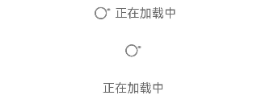

# SwipeRefresher
<!--Kit: ArkUI-->
<!--Subsystem: ArkUI-->
<!--Owner: @song-song-song-->
<!--Designer: @fenglinbailu-->
<!--Tester: @ybhou1993-->
<!--Adviser: @Brilliantry_Rui-->


内容加载指获取内容并加载出来，常用于衔接展示下拉加载的内容。

> **说明：**
>
> - 该组件及其子组件从 API version 10 开始支持。后续版本如有新增内容，则采用上角标单独标记该内容的起始版本。
>
> - 该组件仅可在Stage模型下使用。
>
> - 如果SwipeRefresher设置[通用属性](ts-component-general-attributes.md)和[通用事件](ts-component-general-events.md)，编译工具链会额外生成节点__Common__，并将通用属性或通用事件挂载在__Common__上，而不是直接应用到SwipeRefresher本身。这可能导致开发者设置的通用属性或通用事件不生效或不符合预期，因此，不建议SwipeRefresher设置通用属性和通用事件。


## 导入模块

```ts
import { SwipeRefresher } from '@kit.ArkUI';
```


## 子组件

无

## SwipeRefresher

SwipeRefresher({content?: ResourceStr, isLoading: boolean})

主要用于实现下拉刷新功能。当用户下拉页面时，会触发内容加载操作，即从数据源获取新内容并动态展示在界面中。

**装饰器类型：**\@Component

**原子化服务API：** 从API version 11开始，该接口支持在原子化服务中使用。

**系统能力：** SystemCapability.ArkUI.ArkUI.Full

**设备行为差异：** 该接口在Wearable设备上使用时，应用程序运行异常，异常信息中提示接口未定义，在其他设备中可正常调用。

| 名称 | 类型 | 必填 | 装饰器类型 | 说明                                                                 |
| -------- | -------- | -------- | -------- |--------------------------------------------------------------------|
| content | [ResourceStr](ts-types.md#resourcestr) | 否 | @Prop | 内容加载时显示的文本。<br/>默认值：空字符串。<br/>**说明**：如果文本大于列宽时，文本被截断。从API version 20开始，支持Resource类型。   |
| isLoading | boolean | 是 | \@Prop | 当前是否正在加载。<br> true：正在加载。<br> false：未在加载。 |

## 事件
不支持[通用事件](ts-component-general-events.md)。

## 示例
展示设置属性content为空字符串及不为空、isLoading为true和false的不同加载效果。
```ts
import { SwipeRefresher } from '@kit.ArkUI';

@Entry
@Component
struct Index {
  build() {
    Column() {
      SwipeRefresher({
        content: '正在加载中',
        isLoading: true
      })
      SwipeRefresher({
        content: '',
        isLoading: true
      })
      SwipeRefresher({
        content: '正在加载中',
        isLoading: false
      })
    }
  }
}
```


