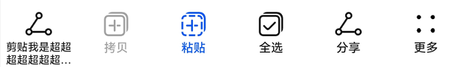

# @ohos.arkui.advanced.ToolBar (工具栏)


工具栏用于展示针对当前界面内容的操作选项，在界面底部显示。底部最多显示5个入口，超过则收纳入“更多”子项中，在最右侧显示。


> **说明：**
>
> 该组件从API Version 10开始支持。后续版本如有新增内容，则采用上角标单独标记该内容的起始版本。


## 导入模块

```
import { ToolBar, ToolBarOptions } from '@kit.ArkUI'
```


## 子组件

无

## 属性
支持[通用属性](ts-universal-attributes-size.md)

## ToolBar

Toolbar({toolBarList: ToolBarOptions, activateIndex?: number, controller: TabsController, dividerModifier: DividerModifier, toolBarModifier: ToolBarModifier})

**装饰器类型：**\@Component

**原子化服务API：** 从API version 11开始，该接口支持在原子化服务中使用。

**系统能力：** SystemCapability.ArkUI.ArkUI.Full

**参数：**

| 名称                            | 参数类型                                                      | 必填  | 装饰器类型       | 说明                                                                                                       |
|-------------------------------|-----------------------------------------------------------|-----|-------------|----------------------------------------------------------------------------------------------------------|
| toolBarList                   | [ToolBarOptions](#toolbaroptions)                         | 是   | @ObjectLink | 工具栏列表。                                                                                                   |
| activateIndex                 | number                                                    | 否   | @Prop       | 激活态的子项。<br/>默认值：-1。                                                                                      |
| controller                    | [TabsController](ts-container-tabs.md#tabscontroller)     | 是   | -           | 筛选器的样式类型。                                                                                                |
| dividerModifier<sup>13+</sup> | [DividerModifier](ts-universal-attributes-attribute-modifier.md) | 否   | @Prop       | 设置工具栏头部分割线属性，可设置分割线高度、颜色等。<br/>**原子化服务API：** 从API version 13开始，该接口支持在原子化服务中使用。|
| toolBarModifier<sup>13+</sup> | [ToolBarModifier](#toolbarmodifier13) | 否   | @Prop       | 设置工具栏属性，可设置工具栏高度、背景色、padding（仅在item小于5个时生效）、是否显示按压态。<br/>**原子化服务API：** 从API version 13开始，该接口支持在原子化服务中使用。 |

## ToolBarOptions

继承于 Array<[ToolBarOption](#toolbaroption)>

**原子化服务API：** 从API version 11开始，该接口支持在原子化服务中使用。

## ToolBarOption

**原子化服务API：** 从API version 11开始，该接口支持在原子化服务中使用。

| 名称                                 | 类型                                                        | 必填 | 说明                                                                                                                  |
|------------------------------------|-----------------------------------------------------------| -------- |---------------------------------------------------------------------------------------------------------------------|
| content                            | [ResourceStr](ts-types.md#resourcestr)                    | 是 | 工具栏子项的文本。                                                                                                           |
| action                             | ()&nbsp;=&gt;&nbsp;void                                   | 否 | 工具栏子项点击事件。                                                                                                          |
| icon                               | [Resource](ts-types.md#resource)                          | 否 | 工具栏子项的图标。<br/>toolBarSymbolOptions有传入参数时，icon不生效。                                                                   |
| state                              | [ItemState](#itemstate)                                   | 否 | 工具栏子项的状态。<br/>默认为ENABLE。                                                                                                 |
| iconColor<sup>13+</sup>            | [ResourceColor](ts-types.md#resourcecolor)                | 否 | 工具栏子项的图标填充颜色。<br/>默认值为$r('sys.color.icon_primary')。<br/>**原子化服务API：** 从API version 13开始，该接口支持在原子化服务中使用。    |
| activatedIconColor<sup>13+</sup>   | [ResourceColor](ts-types.md#resourcecolor)                | 否 | 工具栏子项激活态的图标填充颜色。<br/>默认值为$r('sys.color.icon_emphasize')。<br/>**原子化服务API：** 从API version 13开始，该接口支持在原子化服务中使用。 |
| textColor<sup>13+</sup>            | [ResourceColor](ts-types.md#resourcecolor)                | 否 | 工具栏子项的文本颜色。<br/>默认值为$r('sys.color.font_primary')。<br/>**原子化服务API：** 从API version 13开始，该接口支持在原子化服务中使用。      |
| activatedTextColor<sup>13+</sup>   | [ResourceColor](ts-types.md#resourcecolor)                | 否 | 工具栏子项激活态的文本颜色。<br/>默认值为$r('sys.color.font_emphasize')。<br/>**原子化服务API：** 从API version 13开始，该接口支持在原子化服务中使用。   |
| toolBarSymbolOptions<sup>13+</sup> | [ToolBarSymbolGlyphOptions](#toolbarsymbolglyphoptions13) | 否 | 工具栏子项的图标属性，symbol类型。<br/>**原子化服务API：** 从API version 13开始，该接口支持在原子化服务中使用。   |

## ToolBarModifier<sup>13+</sup>
ToolBarModifier提供设置工具栏高度(height)、背景色(backgroundColor)、左右内边距（padding，仅在item小于5个时生效）、是否显示按压态（stateEffect）的方法。

**原子化服务API：** 从API version 13开始，该接口支持在原子化服务中使用。

### backgroundColor

backgroundColor?(color: ResourceColor): ToolBarModifier

自定义绘制工具栏背景色的接口，若重载该方法则可进行工具栏背景色的自定义绘制。

**原子化服务API：** 从API version 13开始，该接口支持在原子化服务中使用。

**系统能力：** SystemCapability.ArkUI.ArkUI.Full

**参数：**

| 参数名  | 类型                                                   | 必填 | 说明                                                                |
| ------- | ------------------------------------------------------ | ---- |-------------------------------------------------------------------|
| backgroundColor | [ResourceColor](ts-types.md#resourcecolor) | 是   | 绘制工具栏背景色。<br/>默认背景色为为$r('sys.color.ohos_id_color_toolbar_bg')。 |

### padding

padding(padding: Length): ToolBarModifier

自定义绘制工具栏左右内边距的接口，若重载该方法则可进行工具栏左右内边距的自定义绘制。

**原子化服务API：** 从API version 13开始，该接口支持在原子化服务中使用。

**系统能力：** SystemCapability.ArkUI.ArkUI.Full

**参数：**

| 参数名  | 类型     | 必填 | 说明                                                                                  |
| ------- |--------| ---- |-------------------------------------------------------------------------------------|
| padding | [Length](ts-types.md#length) | 是   | 设置工具栏左右内边距，仅在item小于5个时生效。<br/>工具栏默认在item小于5个时padding为24vp，大于等于5个时为0。 |

### height

height(height: Length): ToolBarModifier

自定义绘制工具栏高度的接口，若重载该方法则可进行工具栏高度的自定义绘制，此高度不包含分割线高度。

**原子化服务API：** 从API version 13开始，该接口支持在原子化服务中使用。

**系统能力：** SystemCapability.ArkUI.ArkUI.Full

**参数：**

| 参数名  | 类型                              | 必填 | 说明                                 |
| ------- |---------------------------------| ---- |------------------------------------|
| height | [Length](ts-types.md#length) | 是   | 设置工具栏高度。<br/>工具栏高度默认为56vp（不包含分割线）。 |

### stateEffect

stateEffect(stateEffect: boolean): ToolBarModifier

设置是否显示按压态效果的接口。

**原子化服务API：** 从API version 13开始，该接口支持在原子化服务中使用。

**系统能力：** SystemCapability.ArkUI.ArkUI.Full

**参数：**

| 参数名  | 类型                             | 必填 | 说明                                                       |
| ------- |--------------------------------| ---- |----------------------------------------------------------|
| stateEffect | boolean | 是   | 设置工具栏是否显示按压态效果。<br/>true为显示按压态效果，false为移除按压态效果，默认为true。 |

## ItemState

**原子化服务API：** 从API version 11开始，该接口支持在原子化服务中使用。

| 名称 | 值 | 说明 |
| -------- | -------- | -------- |
| ENABLE | 1 | 工具栏子项为正常可点击状态。 |
| DISABLE | 2 | 工具栏子项为不可点击状态。 |
| ACTIVATE | 3 | 工具栏子项为激活状态，可点击。 |

## ToolBarSymbolGlyphOptions<sup>13+</sup>

ToolBarSymbolGlyphOptions定义图标的属性。

**原子化服务API：** 从API version 13开始，该接口支持在原子化服务中使用。

**系统能力：** SystemCapability.ArkUI.ArkUI.Full

| 名称   | 类型       | 必填 | 说明                                                                                       |
| ------ | ---------- | ---- |------------------------------------------------------------------------------------------|
| normal | [SymbolGlyphModifier](ts-universal-attributes-attribute-modifier.md) | 否   | 页签内symbol图标普通态样式。<br/>默认值：fontColor：$r('sys.color.icon_primary')，fontSize：24vp。  |
| activated| [SymbolGlyphModifier](ts-universal-attributes-attribute-modifier.md) | 否   | 页签内symbol图标激活态样式。<br/>默认值：fontColor：$r('sys.color.icon_emphasize')，fontSize：24vp。 |

## 事件
支持[通用事件](ts-universal-events-click.md)

## 示例

```ts
import { ToolBar, ToolBarOptions } from '@kit.ArkUI'

enum ItemState {
  ENABLE = 1,
  DISABLE = 2,
  ACTIVATE = 3
}

@Entry
@Component
struct Index {
  @State toolbarList: ToolBarOptions = new ToolBarOptions()
  aboutToAppear() {
    this.toolbarList.push({
      content: '剪贴我是超超超超超超超超超长样式',
      icon: $r('sys.media.ohos_ic_public_share'),
      action: () => {
      },
    })
    this.toolbarList.push({
      content: '拷贝',
      icon: $r('sys.media.ohos_ic_public_copy'),
      action: () => {
      },
      state:ItemState.DISABLE
    })
    this.toolbarList.push({
      content: '粘贴',
      icon: $r('sys.media.ohos_ic_public_paste'),
      action: () => {
      },
      state:ItemState.ACTIVATE
    })
    this.toolbarList.push({
      content: '全选',
      icon: $r('sys.media.ohos_ic_public_select_all'),
      action: () => {
      },
    })
    this.toolbarList.push({
      content: '分享',
      icon: $r('sys.media.ohos_ic_public_share'),
      action: () => {
      },
    })
    this.toolbarList.push({
      content: '分享',
      icon: $r('sys.media.ohos_ic_public_share'),
      action: () => {
      },
    })
  }
  build() {
    Row() {
      Stack() {
        Column() {
          ToolBar({
            activateIndex: 2,
            toolBarList: this.toolbarList,
          })
        }
      }.align(Alignment.Bottom)
      .width('100%').height('100%')
    }
  }
}
```


