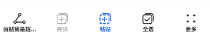
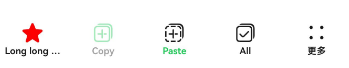

# ToolBarV2
<!--Kit: ArkUI-->
<!--Subsystem: ArkUI-->
<!--Owner: @fengluochenai-->
<!--Designer: @YanSanzo-->
<!--Tester: @tinygreyy-->
<!--Adviser: @HelloCrease-->

工具栏用于展示针对当前界面内容的操作选项，在界面底部显示。底部最多显示5个入口，超过则收纳入“更多”子项中，在最右侧显示。<br />
该组件基于[状态管理V2](../../../ui/state-management/arkts-state-management-overview.md#状态管理v2)实现，相较于[状态管理V1](../../../ui/state-management/arkts-state-management-overview.md#状态管理v1)，状态管理V2增强了对数据对象的深度观察与管理能力，不再局限于组件层级。借助状态管理V2，开发者可以通过该组件更灵活地控制工具栏的数据和状态，实现更高效的用户界面刷新。<br>

> **说明：**
>
> - 该组件从API version 18开始支持。后续版本如有新增内容，则采用上角标单独标记该内容的起始版本。
> 
> - 该组件不支持在Wearable设备上使用。

## 导入模块

```ts
import { ToolBarV2 } from '@kit.ArkUI';
```

## 子组件

无


## ToolBarV2

ToolbarV2({toolBarList: ToolBarV2Item\[], activatedIndex?: number, dividerModifier: DividerModifier, toolBarModifier: ToolBarV2Modifier})

工具栏。

**装饰器类型：**@ComponentV2

**原子化服务API：** 从API version 18开始，该接口支持在原子化服务中使用。

**系统能力：** SystemCapability.ArkUI.ArkUI.Full

| 名称                   | 类型                                                               | 必填 | 装饰器类型               | 说明                                                           |
| -------------------- | ---------------------------------------------------------------- | -- |---------------------|--------------------------------------------------------------|
| toolBarList          | [ToolBarV2Item](#toolbarv2item)\[]                               | 是  | @Param<br/>@Require | 工具栏列表。                                                       |
| activatedIndex       | number                                                           | 否  | @Param              | 激活态的子项。<br ></div>默认值：-1，即无工具栏子项为激活态。<br />取值范围：[-1,4]。      |
| dividerModifier<sup> | [DividerModifier](ts-universal-attributes-attribute-modifier.md#自定义modifier) | 否  | @Param              | 工具栏头部分割线属性，可设置分割线高度、颜色等。<br />默认不生效。                         |
| toolBarModifier<sup> | [ToolBarV2Modifier](#toolbarv2modifier)                          | 否  | @Param              | 工具栏属性，可设置工具栏高度、背景色、内边距（仅在工具栏子项数量小于5时生效）、是否显示按压态。<br />默认不生效。 |

## ToolBarV2Item
定义工具栏子项。

**装饰器类型：**@ObservedV2

**原子化服务API：** 从API version 18开始，该接口支持在原子化服务中使用。

**系统能力：** SystemCapability.ArkUI.ArkUI.Full

### 属性

| 名称                           | 类型                                              | 必填 | 装饰器类型  | 说明                                                                                                                                                                                                                  |
| ---------------------------- | ----------------------------------------------- | -- | :----- |---------------------------------------------------------------------------------------------------------------------------------------------------------------------------------------------------------------------|
| content                      | [ToolBarV2ItemText](#toolbarv2itemtext)         | 是  | @Trace | 工具栏子项的文本。                                                                                                                                                                                                           |
| action                       | [ToolBarV2ItemAction](#toolbarv2itemaction)     | 否  | @Trace | 工具栏子项点击事件。 <br ></div>默认无点击事件。                                                                                                                                                                                      |
| icon                         | [ToolBarV2ItemIconType](#toolbarv2itemicontype) | 否  | @Trace | 工具栏子项的图标。<br ></div>默认不显示图标。                                                                                                                                                                                        |
| state                        | [ToolBarV2ItemState](#toolbarv2itemstate)       | 否  | @Trace | 工具栏子项的状态。<br />默认为ToolBarV2ItemState.ENABLE。<br />                                                                                                                                                                           |
| accessibilityText     | [ResourceStr](ts-types.md#resourcestr)          | 否  | @Trace | 工具栏子项的无障碍文本属性。当组件不包含文本属性时，屏幕朗读选中此组件时不播报，使用者无法清楚地知道当前选中了什么组件。为了解决此场景，开发人员可为不包含文字信息的组件设置无障碍文本，当屏幕朗读选中此组件时播报无障碍文本的内容，帮助屏幕朗读的使用者清楚地知道自己选中了什么组件。<br ></div>默认值为当前项content属性内容。                                           |
| accessibilityDescription | [ResourceStr](ts-types.md#resourcestr)          | 否  | @Trace | 工具栏子项的无障碍描述。此描述用于向用户详细解释当前组件，开发人员应为组件的这一属性提供较为详尽的文本说明，以协助用户理解即将执行的操作及其可能产生的后果。特别是当这些后果无法仅从组件的属性和无障碍文本中直接获知时。如果组件同时具备文本属性和无障碍说明属性，当组件被选中时，系统将首先播报组件的文本属性，随后播报无障碍说明属性的内容。<br />默认值：“单指双击即可执行”。                        |
| accessibilityLevel  | string                                          | 否  | @Trace | 工具栏子项无障碍重要性。用于控制当前项是否可被无障碍辅助服务所识别。<br ></div>支持的值为：<br />"auto"：当前组件会转换"yes"。<br />"yes"：当前组件可被无障碍辅助服务所识别。<br />"no"：当前组件不可被无障碍辅助服务所识别。<br />"no-hide-descendants"：当前组件及其所有子组件不可被无障碍辅助服务所识别。<br />默认值："auto"<br /> |

### constructor

constructor(options: ToolBarV2ItemOptions)

ToolBarV2Item的构造函数。

**原子化服务API：** 从API version 18开始，该接口支持在原子化服务中使用。

**系统能力：** SystemCapability.ArkUI.ArkUI.Full

**参数：**

| 参数名       | 类型                                            | 必填 | 说明       |
| :------ |:----------------------------------------------| :- | :------- |
| options | [ToolBarV2ItemOptions](#toolbarv2itemoptions) | 是  | 工具栏子项信息。 |

## ToolBarV2ItemOptions

用于构建ToolBarV2Item对象。

**原子化服务API：** 从API version 18开始，该接口支持在原子化服务中使用。

**系统能力：** SystemCapability.ArkUI.ArkUI.Full

| 名称                       | 类型                                              | 必填 | 说明                                                                                                                                                                                                                  |
|:-------------------------| :---------------------------------------------- | :- |:--------------------------------------------------------------------------------------------------------------------------------------------------------------------------------------------------------------------|
| content                  | [ToolBarV2ItemText](#toolbarv2itemtext)         | 是  | 工具栏子项的文本。                                                                                                                                                                                                           |
| action                   | [ToolBarV2ItemAction](#toolbarv2itemaction)     | 否  | 工具栏子项点击事件。<br />默认无点击事件。                                                                                                                                                                                            |
| icon                     | [ToolBarV2ItemIconType](#toolbarv2itemicontype) | 否  | 工具栏子项的图标。<br />默认不显示图标。                                                                                                                                                                                             |
| state                    | [ToolBarV2ItemState](#toolbarv2itemstate)       | 否  | 工具栏子项的状态。<br />默认为ToolBarV2ItemState.ENABLE。<br />                                                                                                                                                                  |
| accessibilityText        | [ResourceStr](ts-types.md#resourcestr)          | 否  | 工具栏子项的无障碍文本属性。当组件不包含文本属性时，屏幕朗读选中此组件时不播报，使用者无法清楚地知道当前选中了什么组件。为了解决此场景，开发人员可为不包含文字信息的组件设置无障碍文本，当屏幕朗读选中此组件时播报无障碍文本的内容，帮助屏幕朗读的使用者清楚地知道自己选中了什么组件。<br />默认值为当前项content属性内容。<br />                                          |
| accessibilityDescription | [ResourceStr](ts-types.md#resourcestr)          | 否  | 工具栏子项的无障碍描述。此描述用于向用户详细解释当前组件，开发人员应为组件的这一属性提供较为详尽的文本说明，以协助用户理解即将执行的操作及其可能产生的后果。特别是当这些后果无法仅从组件的属性和无障碍文本中直接获知时。如果组件同时具备文本属性和无障碍说明属性，当组件被选中时，系统将首先播报组件的文本属性，随后播报无障碍说明属性的内容。<br />默认值为“单指双击即可执行”。                        |
| accessibilityLevel       | string                                          | 否  | 工具栏子项无障碍重要性。用于控制当前项是否可被无障碍辅助服务所识别。<br ></div>支持的值为：<br />"auto"：当前组件会转换"yes"。<br />"yes"：当前组件可被无障碍辅助服务所识别。<br />"no"：当前组件不可被无障碍辅助服务所识别。<br />"no-hide-descendants"：当前组件及其所有子组件不可被无障碍辅助服务所识别。<br />默认值："auto"<br /> |

## ToolBarV2ItemAction

type ToolBarV2ItemAction = (index: number) => void

工具栏子项点击事件回调类型。

**原子化服务API：** 从API version 18开始，该接口支持在原子化服务中使用。

**系统能力：** SystemCapability.ArkUI.ArkUI.Full

**参数：**

| 参数名   | 类型     | 必填 | 说明 |
|:------|:-------|:---|----|
| index | number | 是  |工具栏子项点击事件的回调。<br /> -index: 表示触发事件的工具栏子项索引。    |

## ToolBarV2ItemText

定义工具栏子项的文本。

**装饰器类型：**@ObservedV2

**原子化服务API：** 从API version 18开始，该接口支持在原子化服务中使用。

**系统能力：** SystemCapability.ArkUI.ArkUI.Full

### 属性

| 名称                  | 类型                                                          | 必填 | 装饰器类型  | 说明                                                       |
|:--------------------|:------------------------------------------------------------| :- | :----- |:---------------------------------------------------------|
| text                | [ResourceStr](ts-types.md#resourcestr)                      | 是  | @Trace | 工具栏子项的文本。                                                |
| color               | [ColorMetrics](../js-apis-arkui-graphics.md#colormetrics12) | 否  | @Trace | 工具栏子项的文本的颜色。<br/>默认值：$r('sys.color.font_primary')       |
| activatedColor | [ColorMetrics](../js-apis-arkui-graphics.md#colormetrics12) | 否  | @Trace | 工具栏子项在激活态下文本的颜色。<br></div>默认值：$r('sys.color.font_emphasize') |

### constructor

constructor(options: ToolBarV2ItemTextOptions)

ToolBarV2ItemText的构造函数。

**原子化服务API：** 从API version 18开始，该接口支持在原子化服务中使用。

**系统能力：** SystemCapability.ArkUI.ArkUI.Full

**参数：**

| 参数名       | 类型                                                    | 必填 | 说明         |
| :------ |:------------------------------------------------------| :- | :--------- |
| options | [ToolBarV2ItemTextOptions](#toolbarv2itemtextoptions) | 是  | 工具栏子项文本信息。 |

## ToolBarV2ItemTextOptions

用于构建ToolBarV2ItemText对象。

**原子化服务API：** 从API version 18开始，该接口支持在原子化服务中使用。

**系统能力：** SystemCapability.ArkUI.ArkUI.Full

| 名称                  | 类型                                                          | 必填 | 说明                                                       |
| :------------------ |:------------------------------------------------------------| :- |:---------------------------------------------------------|
| text                | [ResourceStr](ts-types.md#resourcestr)                      | 是  | 工具栏子项的文本。                                                |
| color          | [ColorMetrics](../js-apis-arkui-graphics.md#colormetrics12) | 否  | 工具栏子项的文本的颜色。<br/>默认值：$r('sys.color.font_primary')       |
| activatedColor | [ColorMetrics](../js-apis-arkui-graphics.md#colormetrics12) | 否  | 工具栏子项在激活态下文本的颜色。<br/>默认值：$r('sys.color.font_emphasize') |

## ToolBarV2ItemImage

定义工具栏子项的普通图标。

**装饰器类型：**@ObservedV2

**原子化服务API：** 从API version 18开始，该接口支持在原子化服务中使用。

**系统能力：** SystemCapability.ArkUI.ArkUI.Full

### 属性

| 名称                 | 类型                                                          | 必填 | 装饰器类型  | 说明                                                       |
|:-------------------|:------------------------------------------------------------| :- | :----- |:---------------------------------------------------------|
| src                | [ResourceStr](ts-types.md#resourcestr)                      | 是  | @Trace | 工具栏子项的图标。                                                |
| color              | [ColorMetrics](../js-apis-arkui-graphics.md#colormetrics12) | 否  | @Trace | 工具栏子项的图标的颜色。<br/>默认值：$r('sys.color.icon_primary')       |
| activatedColor     | [ColorMetrics](../js-apis-arkui-graphics.md#colormetrics12) | 否  | @Trace | 工具栏子项在激活态下图标的颜色。<br/>默认值：$r('sys.color.icon_emphasize') |

### constructor

constructor(options: ToolBarV2ItemImageOptions)

ToolBarV2ItemImage的构造函数。

**原子化服务API：** 从API version 18开始，该接口支持在原子化服务中使用。

**系统能力：** SystemCapability.ArkUI.ArkUI.Full

**参数：**

| 参数名       | 类型                                                    | 必填 | 说明         |
| :------ | :------------------------------------------------------ | :- | :--------- |
| options | [ToolBarV2ItemImageOptions](#toolbarv2itemimageoptions) | 是  | 工具栏子项图标信息。 |

## ToolBarV2ItemImageOptions

用于构建ToolBarV2ItemImage对象。

**原子化服务API：** 从API version 18开始，该接口支持在原子化服务中使用。

**系统能力：** SystemCapability.ArkUI.ArkUI.Full

| 名称                  | 类型                                                          | 必填 | 说明                                                       |
|:--------------------|:------------------------------------------------------------| :- |:---------------------------------------------------------|
| src                 | [ResourceStr](ts-types.md#resourcestr)                      | 是  | 工具栏子项的图标。                                                |
| color               | [ColorMetrics](../js-apis-arkui-graphics.md#colormetrics12) | 否  | 工具栏子项的图标的颜色。<br/>默认值：$r('sys.color.icon_primary')       |
| activatedColor | [ColorMetrics](../js-apis-arkui-graphics.md#colormetrics12) | 否  | 工具栏子项在激活态下图标的颜色。<br/>默认值：$r('sys.color.icon_emphasize') |

## ToolBarV2ItemIconType

type ToolBarV2ItemIconType = ToolBarV2ItemImage | ToolBarV2SymbolGlyph

工具栏子项图标内容的联合类型。

**原子化服务API：** 从API version 18开始，该接口支持在原子化服务中使用。

**系统能力：** SystemCapability.ArkUI.ArkUI.Full

| 类型                                            | 说明            |
|:----------------------------------------------| :------------ |
| [ToolBarV2ItemImage](#toolbarv2itemimage)     | 用于定义普通图标。     |
| [ToolBarV2SymbolGlyph](#toolbarv2symbolglyph) | 用于定义Symbol图标。 |

## ToolBarV2Modifier

ToolBarV2Modifier提供设置工具栏高度(height)、背景色(backgroundColor)、左右内边距（padding，仅在item小于5个时生效）、是否显示按压态（stateEffect）的方法。

**原子化服务API：** 从API version 18开始，该接口支持在原子化服务中使用。

**系统能力：** SystemCapability.ArkUI.ArkUI.Full

### backgroundColor

backgroundColor(backgroundColor: ColorMetrics): ToolBarV2Modifier

自定义绘制工具栏背景色的接口，若重载该方法则可进行工具栏背景色的自定义绘制。

**原子化服务API：** 从API version 18开始，该接口支持在原子化服务中使用。

**系统能力：** SystemCapability.ArkUI.ArkUI.Full

**参数：**

| 参数名             | 类型                                                          | 必填 | 说明                                                                |
| --------------- |-------------------------------------------------------------| -- | ----------------------------------------------------------------- |
| backgroundColor | [ColorMetrics](../js-apis-arkui-graphics.md#colormetrics12) | 是  | 工具栏背景色。<br />默认背景色为\$r('sys.color.ohos\_id\_color\_toolbar\_bg')。 |

**返回值：**

| 类型                                      | 说明                                      |
|-----------------------------------------|-----------------------------------------|
| [ToolBarV2Modifier](#toolbarv2modifier) | 设置backgroundColor后的ToolBarV2Modifier对象。 |

### padding

padding(padding: LengthMetrics): ToolBarV2Modifier

自定义绘制工具栏左右内边距的接口，若重载该方法则可进行工具栏左右内边距的自定义绘制。

**原子化服务API：** 从API version 18开始，该接口支持在原子化服务中使用。

**系统能力：** SystemCapability.ArkUI.ArkUI.Full

**参数：**

| 参数名     | 类型                                                            | 必填 | 说明                                                                  |
| ------- |---------------------------------------------------------------| -- | ------------------------------------------------------------------- |
| padding | [LengthMetrics](../js-apis-arkui-graphics.md#lengthmetrics12) | 是  | 工具栏左右内边距，仅在item小于5个时生效。<br ></div>工具栏默认在item小于5个时padding为24vp，大于等于5个时为0。 |

**返回值：**

| 类型                                      | 说明                              |
|-----------------------------------------|---------------------------------|
| [ToolBarV2Modifier](#toolbarv2modifier) | 设置padding后的ToolBarV2Modifier对象。 |
### height

height(height: LengthMetrics): ToolBarV2Modifier

自定义绘制工具栏高度的接口，若重载该方法则可进行工具栏高度的自定义绘制，此高度不包含分割线高度。

**原子化服务API：** 从API version 18开始，该接口支持在原子化服务中使用。

**系统能力：** SystemCapability.ArkUI.ArkUI.Full

**参数：**

| 参数名    | 类型                                                                 | 必填 | 说明                                |
| ------ | ------------------------------------------------------------------ | -- | --------------------------------- |
| height | [LengthMetrics](../js-apis-arkui-graphics.md#lengthmetrics12) | 是  | 工具栏高度。<br />工具栏高度默认为56vp（不包含分割线）。 |

**返回值：**

| 类型                                      | 说明                             |
|-----------------------------------------|--------------------------------|
| [ToolBarV2Modifier](#toolbarv2modifier) | 设置height后的ToolBarV2Modifier对象。 |

### stateEffect

stateEffect(stateEffect: boolean): ToolBarV2Modifier

设置是否显示按压态效果的接口。

**原子化服务API：** 从API version 18开始，该接口支持在原子化服务中使用。

**系统能力：** SystemCapability.ArkUI.ArkUI.Full

**参数：**

| 参数名         | 类型      | 必填 | 说明                                                     |
| ----------- | ------- | -- |--------------------------------------------------------|
| stateEffect | boolean | 是  | 工具栏是否显示按压态效果。<br />true为显示按压态效果，false为移除按压态效果。默认为true。 |

**返回值：**

| 类型                                      | 说明                                  |
|-----------------------------------------|-------------------------------------|
| [ToolBarV2Modifier](#toolbarv2modifier) | 设置stateEffect后的ToolBarV2Modifier对象。 |

## ToolBarV2ItemState

工具栏子项状态枚举。

**原子化服务API：** 从API version 18开始，该接口支持在原子化服务中使用。

**系统能力：** SystemCapability.ArkUI.ArkUI.Full

| 名称       | 值 | 说明              |
| -------- | - | --------------- |
| ENABLE   | 1 | 工具栏子项为正常可点击状态。  |
| DISABLE  | 2 | 工具栏子项为不可点击状态。   |
| ACTIVATE | 3 | 工具栏子项为激活状态，可点击。 |

## ToolBarV2SymbolGlyph

ToolBarV2SymbolGlyph定义Symbol图标的属性。

**装饰器类型**：@ObservedV2

**原子化服务API：** 从API version 18开始，该接口支持在原子化服务中使用。

**系统能力：** SystemCapability.ArkUI.ArkUI.Full

### 属性

| 名称        | 类型                                                                   | 必填 | 装饰器类型  | 说明                                                                                   |
| :-------- | :------------------------------------------------------------------- | :- | :----- | :----------------------------------------------------------------------------------- |
| normal    | [SymbolGlyphModifier](ts-universal-attributes-attribute-symbolglyphmodifier.md#symbolglyphmodifier) | 是  | @Trace | 工具栏symbol图标普通态样式。   |
| activated | [SymbolGlyphModifier](ts-universal-attributes-attribute-symbolglyphmodifier.md#symbolglyphmodifier) | 否  | @Trace | 工具栏symbol图标激活态样式。<br />默认值：fontColor：\$r('sys.color.icon\_emphasize')，fontSize：24vp。 |

### constructor

constructor(options: ToolBarV2SymbolGlyphOptions)

ToolBarV2SymbolGlyph的构造函数。

**原子化服务API：** 从API version 18开始，该接口支持在原子化服务中使用。

**系统能力：** SystemCapability.ArkUI.ArkUI.Full

**参数：**

| 参数名     | 类型                                                        | 必填 | 说明          |
| :------ | :---------------------------------------------------------- | :- | :---------- |
| options | [ToolBarV2SymbolGlyphOptions](#toolbarv2symbolglyphoptions) | 是  | Symbol图标信息。 |

## ToolBarV2SymbolGlyphOptions

ToolBarV2SymbolGlyphOptions定义图标的属性。

**原子化服务API：** 从API version 18开始，该接口支持在原子化服务中使用。

**系统能力：** SystemCapability.ArkUI.ArkUI.Full

| 名称        | 类型                                                                   | 必填 | 说明                                                                                   |
| --------- | -------------------------------------------------------------------- | -- | ------------------------------------------------------------------------------------ |
| normal    | [SymbolGlyphModifier](ts-universal-attributes-attribute-symbolglyphmodifier.md#symbolglyphmodifier) | 是  | 工具栏symbol图标普通态样式。   |
| activated | [SymbolGlyphModifier](ts-universal-attributes-attribute-symbolglyphmodifier.md#symbolglyphmodifier) | 否  | 工具栏symbol图标激活态样式。<br />默认值：fontColor：\$r('sys.color.icon\_emphasize')，fontSize：24vp。 |

## 示例

### 示例1（工具栏不同状态的默认效果）

该示例展示了工具栏子项state属性分别设置ENABLE、DISABLE、ACTIVATE状态的不同显示效果。

```ts
import { ToolBarV2ItemImage, ToolBarV2ItemState, ToolBarV2ItemText, ToolBarV2Item, ToolBarV2 } from '@kit.ArkUI';

@Entry
@ComponentV2
struct Index {
  @Local toolbarList: ToolBarV2Item[] = []

  aboutToAppear() {
    this.toolbarList.push(new ToolBarV2Item({
      content: new ToolBarV2ItemText(
        {
          text: '剪贴我是超超超超超超超超超长样式'
        }
      ),
      icon: new ToolBarV2ItemImage({
        src: $r('sys.media.ohos_ic_public_share')
      }),
      action: () => {
      },
    }))
    this.toolbarList.push(
      new ToolBarV2Item({
        content: new ToolBarV2ItemText(
          {
            text: '拷贝'
          }
        ),
        icon: new ToolBarV2ItemImage({
          src: $r('sys.media.ohos_ic_public_copy')
        }),
        action: () => {
        },
        state: ToolBarV2ItemState.DISABLE
      })
    )
    this.toolbarList.push(
      new ToolBarV2Item({
        content: new ToolBarV2ItemText(
          {
            text: '粘贴'
          }
        ),
        icon: new ToolBarV2ItemImage({
          src: $r('sys.media.ohos_ic_public_paste')
        }),
        action: () => {
        },
        state: ToolBarV2ItemState.ACTIVATE
      })
    )
    this.toolbarList.push(
      new ToolBarV2Item({
        content: new ToolBarV2ItemText(
          {
            text: '全选'
          }
        ),
        icon: new ToolBarV2ItemImage({
          src: $r('sys.media.ohos_ic_public_select_all')
        }),
        action: () => {
        },
      })
    )
    this.toolbarList.push(
      new ToolBarV2Item({
        content: new ToolBarV2ItemText(
          {
            text: '分享'
          }
        ),
        icon: new ToolBarV2ItemImage({
          src: $r('sys.media.ohos_ic_public_share')
        }),
        action: () => {
        },
      })
    )
    this.toolbarList.push(
      new ToolBarV2Item({
        content: new ToolBarV2ItemText(
          {
            text: '分享'
          }
        ),
        icon: new ToolBarV2ItemImage({
          src: $r('sys.media.ohos_ic_public_share')
        }),
        action: () => {
        },
      })
    )
  }

  build() {
    Row() {
      Stack() {
        Column() {
          ToolBarV2({
            activatedIndex: 2,
            toolBarList: this.toolbarList,
          })
        }
      }.align(Alignment.Bottom)
      .width('100%').height('100%')
    }
  }
}
```



### 示例2（设置工具栏自定义样式）

该示例通过设置属性ToolBarV2Modifier自定义工具栏高度、背景色、按压效果等样式。

```ts
import {
  SymbolGlyphModifier,
  DividerModifier,
  LengthMetrics,
  ColorMetrics,
  ToolBarV2Item,
  ToolBarV2Modifier,
  ToolBarV2ItemText,
  ToolBarV2ItemImage,
  ToolBarV2,
  ToolBarV2ItemState,
  ToolBarV2SymbolGlyph
} from '@kit.ArkUI';

@Entry
@ComponentV2
struct Index {
  @Local toolbarList: ToolBarV2Item[] = [];
  private toolBarModifier: ToolBarV2Modifier =
    new ToolBarV2Modifier().height(LengthMetrics.vp(52))
      .backgroundColor(ColorMetrics.resourceColor(Color.Transparent))
      .stateEffect(false);
  @Local dividerModifier: DividerModifier = new DividerModifier().height(0);

  aboutToAppear() {
    this.toolbarList.push(
      new ToolBarV2Item({
        content: new ToolBarV2ItemText({
          text: 'Long long long long long long long long text',
          activatedColor: ColorMetrics.resourceColor($r('sys.color.font_primary'))
        }),
        icon: new ToolBarV2SymbolGlyph({
          normal: new SymbolGlyphModifier($r('sys.symbol.ohos_star')).fontColor([Color.Green]),
          activated: new SymbolGlyphModifier($r('sys.symbol.ohos_star')).fontColor([Color.Red]),
        }),
        action: () => {
        },
        state: ToolBarV2ItemState.ACTIVATE,
      })
    )
    this.toolbarList.push(
      new ToolBarV2Item({
        content: new ToolBarV2ItemText({
          text: 'Copy',
          activatedColor: ColorMetrics.resourceColor('#ffec5d5d')
        }),
        icon: new ToolBarV2ItemImage({
          src: $r('sys.media.ohos_ic_public_copy'),
          color: ColorMetrics.resourceColor('#ff18cb53'),
          activatedColor: ColorMetrics.resourceColor('#ffec5d5d'),
        }),
        action: () => {
        },
        state: ToolBarV2ItemState.DISABLE,
      }))
    this.toolbarList.push(
      new ToolBarV2Item({
        content: new ToolBarV2ItemText({
          text: 'Paste',
          color: ColorMetrics.resourceColor('#ff18cb53')
        }),
        icon: new ToolBarV2ItemImage({
          src: $r('sys.media.ohos_ic_public_paste'),
        }),
        action: () => {
        },
        state: ToolBarV2ItemState.ACTIVATE,
      })
    )
    this.toolbarList.push(
      new ToolBarV2Item({
        content: new ToolBarV2ItemText({
          text: 'All',
        }),
        icon: new ToolBarV2ItemImage({
          src: $r('sys.media.ohos_ic_public_select_all'),
        }),
        action: () => {
        },
        state: ToolBarV2ItemState.ACTIVATE,
      }))
    this.toolbarList.push(
      new ToolBarV2Item({
        content: new ToolBarV2ItemText({
          text: '分享',
        }),
        icon: new ToolBarV2ItemImage({
          src: $r('sys.media.ohos_ic_public_share'),
        }),
        action: () => {
        },
      }))
    this.toolbarList.push(
      new ToolBarV2Item({
        content: new ToolBarV2ItemText({
          text: '分享',
        }),
        icon: new ToolBarV2ItemImage({
          src: $r('sys.media.ohos_ic_public_share'),
        }),
        action: () => {
        },
      })
    )
  }

  build() {
    Row() {
      Stack() {
        Column() {
          ToolBarV2({
            toolBarModifier: this.toolBarModifier,
            dividerModifier: this.dividerModifier,
            activatedIndex: 0,
            toolBarList: this.toolbarList,
          })
            .height(52)
        }
      }.align(Alignment.Bottom)
      .width('100%').height('100%')
    }
  }
}
```



### 示例3（设置工具栏自定义播报）

该示例通过设置工具栏子项属性accessibilityText、accessibilityDescription、accessibilityLevel自定义屏幕朗读播报文本。

```ts
import {
  DividerModifier,
  LengthMetrics,
  ColorMetrics,
  ToolBarV2Item,
  ToolBarV2Modifier,
  ToolBarV2ItemText,
  ToolBarV2ItemImage,
  ToolBarV2,
  ToolBarV2ItemState,
} from '@kit.ArkUI';

@Entry
@ComponentV2
struct Index {
  @Local toolbarList: ToolBarV2Item[] = [];
  private toolBarModifier: ToolBarV2Modifier =
    new ToolBarV2Modifier().height(LengthMetrics.vp(52))
      .backgroundColor(ColorMetrics.resourceColor(Color.Transparent))
      .stateEffect(false);
  @Local dividerModifier: DividerModifier = new DividerModifier().height(0);

  aboutToAppear() {
    this.toolbarList.push(
      new ToolBarV2Item({
        content: new ToolBarV2ItemText({
          text: '剪贴我是超超超超超超超超超长样式',
        }),
        icon: new ToolBarV2ItemImage({
          src: $r('sys.media.ohos_ic_public_share')
        }),
        action: () => {
        },
        accessibilityText: '剪贴', //该项屏幕朗读播报文本为‘剪贴’
        accessibilityDescription: '单指双击即可剪贴', //该项屏幕朗读播报描述为'单指双击即可剪贴'
        accessibilityLevel: 'yes'  //该项可被无障碍屏幕朗读聚焦
      })
    )
    this.toolbarList.push(
      new ToolBarV2Item({
        content: new ToolBarV2ItemText({
          text: '拷贝',
        }),
        icon: new ToolBarV2ItemImage({
          src: $r('sys.media.ohos_ic_public_copy'),
        }),
        action: () => {
        },
        state: ToolBarV2ItemState.DISABLE,
        accessibilityLevel: 'no'  //该项将无法被屏幕朗读服务所识别，屏幕朗读不可聚焦
      }))
    this.toolbarList.push(
      new ToolBarV2Item({
        content: new ToolBarV2ItemText({
          text: '粘贴',
        }),
        icon: new ToolBarV2ItemImage({
          src: $r('sys.media.ohos_ic_public_paste'),
        }),
        action: () => {
        },
        state: ToolBarV2ItemState.ACTIVATE,
      })
    )
    this.toolbarList.push(
      new ToolBarV2Item({
        content: new ToolBarV2ItemText({
          text: '全选',
        }),
        icon: new ToolBarV2ItemImage({
          src: $r('sys.media.ohos_ic_public_select_all'),
        }),
        action: () => {
        },
      }))
    this.toolbarList.push(
      new ToolBarV2Item({
        content: new ToolBarV2ItemText({
          text: '分享',
        }),
        icon: new ToolBarV2ItemImage({
          src: $r('sys.media.ohos_ic_public_share'),
        }),
        action: () => {
        },
      }))
    this.toolbarList.push(
      new ToolBarV2Item({
        content: new ToolBarV2ItemText({
          text: '分享',
        }),
        icon: new ToolBarV2ItemImage({
          src: $r('sys.media.ohos_ic_public_share'),
        }),
        action: () => {
        },
      })
    )
  }

  build() {
    Row() {
      Stack() {
        Column() {
          ToolBarV2({
            toolBarModifier: this.toolBarModifier,
            dividerModifier: this.dividerModifier,
            activatedIndex: 0,
            toolBarList: this.toolbarList,
          })
            .height(52)
        }
      }.align(Alignment.Bottom)
      .width('100%').height('100%')
    }
  }
}
```


