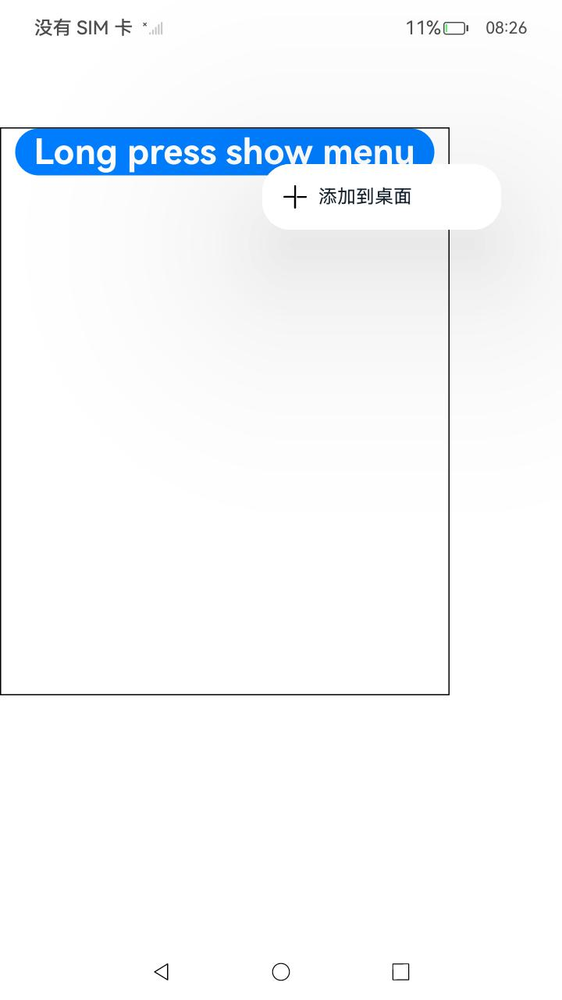
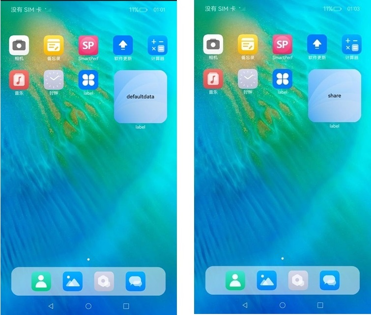

# FormMenu

本组件封装了一个“添加至桌面”菜单，用于实现应用内长按组件生成“添加至桌面”菜单，点击该菜单，触发卡片添加至桌面操作。通过桌面访问该应用快捷卡片，可以直接访问该组件功能。在应用使用过程中，该组件作为留存和复访入口，可吸引用户将功能快捷添加到桌面。

本组件支持应用内支持长按菜单快捷添加卡片到桌面：

1. 开发者将卡片数据以及应用内功能组件ID传给卡片框架。

2. 点击事件会根据组件ID获取应用内功能组件的快照和位置，用于添加到桌面时的过渡动效。

3. 卡片框架通过将加桌数据通知给桌面，触发卡片添加到桌面操作。


> **说明：**
>
> 该组件从API Version 12开始支持。后续版本如有新增内容，则采用上角标单独标记该内容的起始版本。


## 导入模块

```
import { AddFormMenuItem } from '@kit.ArkUI';
```


## 子组件

无

## 属性
不支持[通用属性](ts-universal-attributes-size.md)。

## AddFormMenuItem 


AddFormMenuItem(
  want: Want,
  componentId: string,
  options?: AddFormOptions
): void


**装饰器类型：**@Component

**原子化服务API：** 从API version 12开始，该接口支持在原子化服务中使用。

**系统能力：** SystemCapability.ArkUI.ArkUI.Full

**参数：**

| 名称           | 参数类型                        | 必填 | 装饰器类型 | 说明                                                             |
| -------------- | ------------------------------- | ---- | ---------- | ---------------------------------------------------------------- |
| want           | [Want](../../apis-ability-kit/js-apis-app-ability-want.md#want)                            | 是   | \@Prop     | 待发布功能组件的want信息。                                         |
| componentId    | string                          | 是   | -          | 应用内功能组件ID，组件ID对应的界面与待添加的服务卡片界面相似。 |
| AddFormOptions| [AddFormOptions](#addformoptions) | 否   | -          | 添加卡片选项。                                                         |

## AddFormOptions

**原子化服务API：** 从API version 12开始，该接口支持在原子化服务中使用。

**系统能力：** SystemCapability.ArkUI.ArkUI.Full

**参数：**
| 名称             | 参数类型                | 必填 | 说明                                                      |
| --------------- | ---- | ---- | ---------------------------------------------------------------- |
| formBindingData | [formBindingData.FormBindingData](../../apis-form-kit/js-apis-app-form-formBindingData.md#formbindingdata) | 否 | 卡片数据。 |
| callback        | AsyncCallback\<string>                                                                                                | 否 | 返回结果的回调。  |
| style           | [FormMenuItemStyle](#formmenuitemstyle)                                                                              | 否 | 菜单自定义样式信息。|


## FormMenuItemStyle

**原子化服务API：** 从API version 12开始，该接口支持在原子化服务中使用。

**系统能力：** SystemCapability.ArkUI.ArkUI.Full

**参数：**
| 名称            | 参数类型           | 必填 | 说明 |
| --------------- | ----------------- | ---- | ---- |
| options | [MenuItemOptions](ts-basic-components-menuitem.md#menuitemoptions对象说明) | 否   | 包含设置MenuItem的各项信息。|

> **说明：**
>
> 仅在 style配置为空或不配置时，使用默认的图标和menu文字。

## 事件
支持菜单点击事件。

## 示例

```ts
// index.ets
import { AddFormMenuItem } from '@kit.ArkUI';
import { formBindingData } from '@kit.FormKit';
import { hilog } from '@kit.PerformanceAnalysisKit';

const tag = 'AddFormMenuItem';

@Entry
@Component
struct Index {
  @State message: string = 'Long press show menu';
  private compId: string = 'addforms@d46313145';

  @Builder
  MyMenu() {
    Menu() {
      AddFormMenuItem(
        {
          bundleName: 'com.example.myapplication', // 包名
          abilityName: 'EntryFormAbility', // 模块ability名称
          parameters: {
            'ohos.extra.param.key.form_dimension': 2,
            'ohos.extra.param.key.form_name': 'widget',
            'ohos.extra.param.key.module_name': 'entry'
          },
        },
        this.compId,
        {
          formBindingData: formBindingData.createFormBindingData({}),
          // formBindingData: formBindingData.createFormBindingData({ data: 'share' }),
          callback: (error, formId) => {
            hilog.info(0x3900, tag, `callback info：error = ${JSON.stringify(error)}, formId = ${formId}`);
            if (error?.code === 0) {
              hilog.info(0x3900, tag, "添加至桌面成功")
            } else {
              hilog.info(0x3900, tag, "添加至桌面失败，请尝试其它添加方式")
            }
          },
          style: {
            // options: {
            //   startIcon: $r("app.media.icon"), // 菜单图标,可以自己提供。系统默认采用"sys.media.ic_public_add"
            //   content: "添加到桌面",  // 菜单内容，可以自己提供。默认使用"sys.string.ohos_add_form_to_desktop"
            //   endIcon: $r("app.media.icon") // 菜单图标，可以自己提供
            // }
          }
        }
      )
    }
  }

  build() {
    Row() {
      Column() {
        Image($r("app.media.startIcon"))   // 自定义图片
          .id(this.compId)
          .width(200)
          .height(200)
          .bindContextMenu(this.MyMenu, ResponseType.LongPress, {
            placement: Placement.TopLeft
          })
      }
      .width('100%')
    }
    .height('100%')
  }
}
```

```ts
// WidgetCard.ets
const local = new LocalStorage()

@Entry(local)
@Component
struct WidgetCard {
  @LocalStorageProp('data') data: string = 'defaultdata'; // 定义需要刷新的卡片数据
  /*
   * The action type.
   */
  readonly ACTION_TYPE: string = 'router';
  /*
   * The ability name.
   */
  readonly ABILITY_NAME: string = 'EntryAbility';
  /*
   * The message.
   */
  readonly MESSAGE: string = 'add detail';
  /*
   * The width percentage setting.
   */
  readonly FULL_WIDTH_PERCENT: string = '100%';
  /*
   * The height percentage setting.
   */
  readonly FULL_HEIGHT_PERCENT: string = '100%';

  build() {
    Row() {
      Column() {
        Text(this.data)
          .fontSize($r('app.float.font_size'))
          .fontWeight(FontWeight.Medium)
          .fontColor($r('app.color.item_title_font'))
      }
      .width(this.FULL_WIDTH_PERCENT)
    }
    .height(this.FULL_HEIGHT_PERCENT)
    .backgroundImage($r('app.media.startIcon'))
    .backgroundImageSize({ width: '100%', height: '100%' })
    .onClick(() => {
      postCardAction(this, {
        action: this.ACTION_TYPE,
        abilityName: this.ABILITY_NAME,
        params: {
          message: this.MESSAGE
        }
      });
    })
  }
}
```

**高级自定义控件界面**



**调用高级自定义控件桌面加桌结果**

左侧是formbdingdata为空加桌结果，右侧是formbindingdata为{ data: 'share' }的加桌结果。

