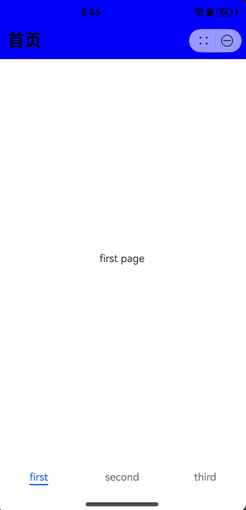

# AtomicServiceNavigation

作为Page页面的根容器使用，其内部默认包含了标题栏、内容区，其中内容区默认首页显示导航内容或非首页显示（[NavDestination](ts-basic-components-navdestination.md)的子组件），首页和非首页通过路由进行切换。

> **说明：**
>
> 该组件从API Version 12开始支持。后续版本如有新增内容，则采用上角标单独标记该内容的起始版本。

## 导入模块

```
import { AtomicServiceNavigation } from '@kit.ArkUI';
```

## 子组件

可以包含子组件。
从API Version 10开始，推荐使用[NavPathStack](ts-basic-components-navigation.md#navpathstack10)进行页面路由。
## AtomicServiceNavigation

```
AtomicServiceNavigation({
    navPathStack?: NavPathStack,
    navigationContent: Callback<void>,
    title?: ResourceStr,
    titleBackgroundColor?: ResourceColor,
    hideTitleBar?: boolean,
    navBarWidth?: Length,
    mode?: NavigationMode,
    navDestinationBuilder?: NavDestinationBuilder,
    navBarWidthRange?: [Dimension, Dimension],
    minContentWidth?: Dimension,
    stateChangeCallback?: Callback<boolean>,
    modeChangeCallback?: Callback<NavigationMode>
})
```

**原子化服务API：** 从API version 12开始，该接口支持在原子化服务中使用。

**装饰器类型：** @Component

**系统能力：** SystemCapability.ArkUI.ArkUI.Full

**参数**：

| 名称 | 类型 | 必填 | 装饰器类型|说明 |
| --------------- | ------ | ---- | ----|----------|
| navPathStack | [NavPathStack](ts-basic-components-navigation.md#navpathstack10) | 否 | @State | 路由栈信息。 |
| navigationContent | Callback\<void\> | 否 | @BuilderParam | Navigation容器内容。 |
| title | [ResourceStr](ts-types.md#resourcestr) | 否 |@Prop | 设置页面标题。|
| titleOptions | [TitleOptions](#titleoptions) | 否 | @Prop | 标题栏选项。|
| hideTitleBar | boolean | 否 | @Prop | 设置是否隐藏标题栏。|
| navBarWidth | [Length](ts-types.md#length)| 否 | @Prop | 设置导航栏宽度。<br>仅在Navigation组件分栏时生效。|
| mode| [NavigationMode](ts-basic-components-navigation.md#navigationmode9枚举说明) | 否 | @Prop |设置导航栏的显示模式。<br>支持Stack、Split与Auto模式。|
| navDestinationBuilder | [NavDestinationBuilder](#navdestinationbuilder) | 否 | @BuilderParam | 创建[NavDestination](ts-basic-components-navdestination.md)组件所需要的Builder数据。 |
| navBarWidthRange | [[Dimension](ts-types.md#dimension10), [Dimension](ts-types.md#dimension10)] | 否 | @Prop |设置导航栏最小和最大宽度（双栏模式下生效）。|
| minContentWidth | [Dimension](ts-types.md#dimension10) | 否 | @Prop | 设置导航栏内容区最小宽度（双栏模式下生效）。|
| stateChangeCallback | Callback\<boolean\> | 否 | - | 导航栏显示状态切换时触发该回调。|
| modeChangeCallback | Callback\<[NavigationMode](ts-basic-components-navigation.md#navigationmode9枚举说明)\> | 否 | - | 当Navigation首次显示或者单双栏状态发生变化时触发该回调。|

## TitleOptions

**原子化服务API：** 从API version 12开始，该接口支持在原子化服务中使用。

**系统能力：** SystemCapability.ArkUI.ArkUI.Full

| 名称 | 类型 | 必填 | 说明 |
| --------------- | ------ | ---- | ---------- |
| backgroundColor | [ResourceColor](ts-types.md#resourcecolor) | 否 | 标题栏背景颜色。 |
| isBlurEnabled | boolean | 否 | 标题栏是否模糊，默认为true。 |
| barStyle | [BarStyle<sup>12+</sup>](ts-basic-components-navigation.md#barstyle12枚举说明)  | 否 | 标题栏样式属性设置。 |

## NavDestinationBuilder

type NavDestinationBuilder = (name: string, param?: Object) => void

**原子化服务API：** 从API version 12开始，该接口支持在原子化服务中使用。

**系统能力：** SystemCapability.ArkUI.ArkUI.Full
    
| 参数名 | 类型 | 必填 | 描述 |
| --------------- | ------ | ---- | ---------- |
| name | string | 是 | [NavDestination](ts-basic-components-navdestination.md)页面名称。 |
| param | Object | 是 | [NavDestination](ts-basic-components-navdestination.md)页面详细参数。 |

## 示例

```ts
// Index.ets
import { AtomicServiceNavigation, NavDestinationBuilder, AtomicServiceTabs, TabBarOptions, TabBarPosition } from '@kit.ArkUI';

@Entry
@Component
struct Index {
  @State message: string = '主题';
  childNavStack: NavPathStack = new NavPathStack();
  @Builder
  tabContent1() {
    Text('first page')
      .onClick(() => {
        this.childNavStack.pushPath({ name: 'page one' })
      })
  }

  @Builder
  tabContent2() {
    Text('second page')
  }

  @Builder
  tabContent3() {
    Text('third page')
  }

  @Builder
  navigationContent() {
    AtomicServiceTabs({
      tabContents: [
        () => {
          this.tabContent1()
        },
        () => {
          this.tabContent2()
        },
        () => {
          this.tabContent3()
        }
      ],
      tabBarOptionsArray: [
        new TabBarOptions($r('sys.media.ohos_ic_public_phone'), '功能1'),
        new TabBarOptions($r('sys.media.ohos_ic_public_location'), '功能2', Color.Green, Color.Red),
        new TabBarOptions($r('sys.media.ohos_ic_public_more'), '功能3')
      ],
      tabBarPosition: TabBarPosition.BOTTOM,
      barBackgroundColor: $r('sys.color.ohos_id_color_bottom_tab_bg'),
      onTabBarClick: (index: Number) => {
        if (index == 0) {
          this.message = '功能1';
        } else if (index == 1) {
          this.message = '功能2';
        } else {
          this.message = '功能3';
        }
      }
    })
  }

  @Builder
  pageMap(name: string) {
    if (name === 'page one') {
      PageOne()
    } else if (name === 'page two') {
      PageTwo()
    }
  }

  build() {
    Row() {
      Column() {
        AtomicServiceNavigation({
          navigationContent: () => {
            this.navigationContent()
          },
          title: this.message,
          titleOptions: {
            backgroundColor: 'rgb(61, 157, 180)',
            isBlurEnabled: false
          },
          navDestinationBuilder: this.pageMap,
          navPathStack: this.childNavStack,
          mode: NavigationMode.Stack
        })
      }
      .width('100%')
    }
    .height('100%')
  }
}

@Component
export struct PageOne {
  pageInfo: NavPathStack = new NavPathStack();

  build() {
    NavDestination() {
      Button('Next')
        .onClick(() => {
          this.pageInfo.pushPath({ name: 'page two'})
        })
    }
    .title('PageOne')
    .onReady((context: NavDestinationContext) => {
      this.pageInfo = context.pathStack;
    })
  }
}

@Component
export struct PageTwo {
  pageInfo: NavPathStack = new NavPathStack();

  build() {
    NavDestination() {
      Button('End')
    }
    .title('PageTwo')
    .onReady((context: NavDestinationContext) => {
      this.pageInfo = context.pathStack;
    })
  }
}
```

