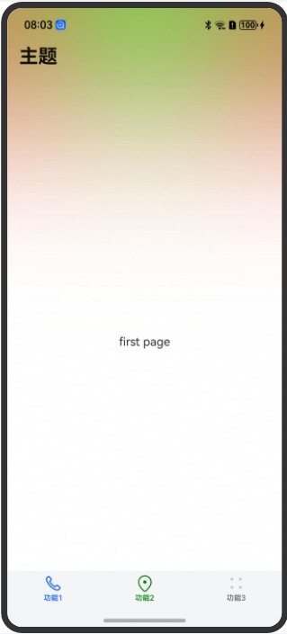
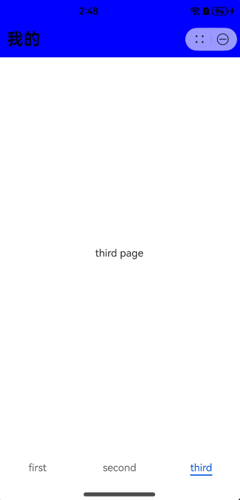
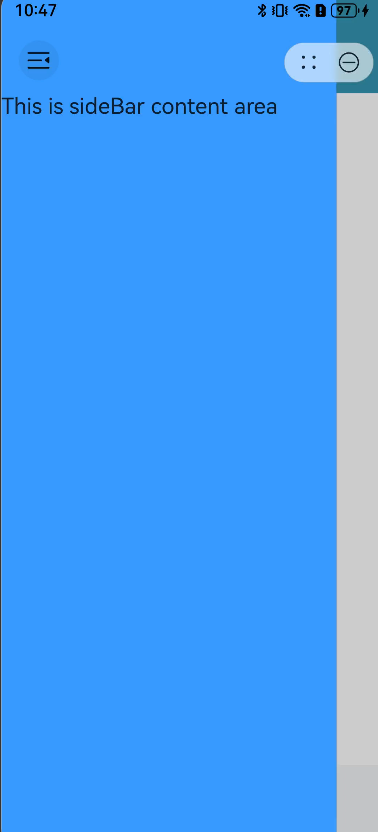

# AtomicServiceNavigation

<!--Kit: ArkUI-->
<!--Subsystem: ArkUI-->
<!--Owner: @qq_36417014-->
<!--Designer: @zhangbeilei-->
<!--Tester: @tinygreyy-->
<!--Adviser: @zengyawen-->

作为Page页面的根容器使用，其内部默认包含了标题栏、内容区，其中内容区默认首页显示导航内容或非首页显示（[NavDestination](ts-basic-components-navdestination.md)的子组件），首页和非首页通过路由进行切换。

> **说明：**
>
> 该组件从API Version 12开始支持。后续版本如有新增内容，则采用上角标单独标记该内容的起始版本。

## 导入模块

```
import { AtomicServiceNavigation } from '@kit.ArkUI';
```

## 子组件

可以包含子组件。
从API Version 10开始，推荐使用[NavPathStack](ts-basic-components-navigation.md#navpathstack10)进行页面路由。
## AtomicServiceNavigation

```
AtomicServiceNavigation({
    navPathStack?: NavPathStack,
    navigationContent: Callback<void>,
    title?: ResourceStr,
    titleOptions?: TitleOptions,
    gradientBackground?: GradientBackground,
    hideTitleBar?: boolean,
    navBarWidth?: Length,
    mode?: NavigationMode,
    navDestinationBuilder?: NavDestinationBuilder,
    navBarWidthRange?: [Dimension, Dimension],
    minContentWidth?: Dimension,
    sideBarOptions?: sideBarOptions,
    sideBarContent?: Callback<void>,
    menus?:	CustomBuilder | Array<NavigationMenuItem>,
    stateChangeCallback?: Callback<boolean>,
    modeChangeCallback?: Callback<NavigationMode>
})
```

**原子化服务API：** 从API version 12开始，该接口支持在原子化服务中使用。

**装饰器类型：** @Component

**系统能力：** SystemCapability.ArkUI.ArkUI.Full

**参数**：

| 名称 | 类型 | 必填 | 装饰器类型|说明 |
| --------------- | ------ | ---- | ----|----------|
| navPathStack | [NavPathStack](ts-basic-components-navigation.md#navpathstack10) | 否 | @State | 路由栈信息。 |
| navigationContent | Callback\<void\> | 否 | @BuilderParam | Navigation容器内容。 |
| title | [ResourceStr](ts-types.md#resourcestr) | 否 |@Prop | 设置页面标题。默认值为空字符串。当titleOptions的titleBarType字段设置为[TitleBarType](#titlebartype18).ROUND_ICON或者[TitleBarType](#titlebartype18).SQUARED_ICON，且设置了titleIcon时，title标题内容将不会显示。 |
| titleOptions | [TitleOptions](#titleoptions) | 否 | @Prop | 标题栏选项。当titleBarType字段设置为[TitleBarType](#titlebartype18).ROUND_ICON或者[TitleBarType](#titlebartype18).SQUARED_ICON，且设置了titleIcon时，title标题内容将不会显示。 |
| gradientBackground<sup>18+</sup> | [GradientBackground](#gradientbackground18) | 否 | @Prop | 背景色选项。|
| hideTitleBar | boolean | 否 | @Prop | 设置是否隐藏标题栏。默认为false。<br>false表示显示标题栏，true表示隐藏标题栏。|
| navBarWidth | [Length](ts-types.md#length)| 否 | @Prop | 设置导航栏宽度。默认值为240vp。<br>仅在Navigation组件分栏时生效。|
| mode| [NavigationMode](ts-basic-components-navigation.md#navigationmode9枚举说明) | 否 | @Prop |设置导航栏的显示模式。<br>支持Stack、Split与Auto模式。|
| navDestinationBuilder | [NavDestinationBuilder](#navdestinationbuilder) | 否 | @BuilderParam | 创建[NavDestination](ts-basic-components-navdestination.md)组件所需要的Builder数据。 |
| navBarWidthRange | [[Dimension](ts-types.md#dimension10), [Dimension](ts-types.md#dimension10)] | 否 | @Prop |设置导航栏最小和最大宽度（双栏模式下生效）。默认值：最小默认值为240vp，最大默认值为组件宽度的40%，且不大于432vp，如果只设置一个值，则未设置的值按照默认值计算。单位：vp。 |
| minContentWidth | [Dimension](ts-types.md#dimension10) | 否 | @Prop | 设置导航栏内容区最小宽度（双栏模式下生效）。|
| sideBarOptions<sup>18+</sup> | [SideBarOptions](#sidebaroptions18) | 否 | @Prop | 侧边栏的功能选项。|
| sideBarContent<sup>18+</sup> | Callback\<void\> | 否 | @BuilderParam | 侧边栏的内容。|
| menus<sup>18+</sup> | [CustomBuilder](ts-types.md#custombuilder8) \| Array\<[NavigationMenuItem](ts-basic-components-navigation.md#navigationmenuitem)\> | 否 | @BuilderParam | 宽屏场景下用户自定义插入的布局样式。默认为空，不显示任何样式。屏幕宽度低于600vp为非宽屏场景，大于等于600vp为宽屏场景。 |
| stateChangeCallback | Callback\<boolean\> | 否 | - | 导航栏显示状态切换时触发该回调。|
| modeChangeCallback | Callback\<[NavigationMode](ts-basic-components-navigation.md#navigationmode9枚举说明)\> | 否 | - | 当Navigation首次显示或者单双栏状态发生变化时触发该回调。|

## TitleOptions
标题栏选项。

**原子化服务API：** 从API version 12开始，该接口支持在原子化服务中使用。

**系统能力：** SystemCapability.ArkUI.ArkUI.Full

| 名称 | 类型 | 必填 | 说明 |
| --------------- | ------ | ---- | ---------- |
| backgroundColor | [ResourceColor](ts-types.md#resourcecolor) | 否 | 标题栏背景颜色。 |
| isBlurEnabled | boolean | 否 | 标题栏是否模糊，默认值：true，表示标题栏模糊。 |
| barStyle | [BarStyle](ts-basic-components-navigation.md#barstyle12枚举说明)  | 否 | 标题栏样式属性设置。 |
| titleBarType<sup>18+</sup> | [TitleBarType](#titlebartype18) | 否 | 设置标题栏类型。默认值为TitleBarType.ROUND_ICON。 |
| titleIcon<sup>18+</sup> | [Resource](ts-types.md#resource) \| [SymbolGlyphModifier](ts-universal-attributes-attribute-modifier.md) | 否 | 设置标题栏的图标。默认值为$r('sys.color.ohos_id_color_titlebar_icon')。 |

## GradientBackground<sup>18+</sup>
供开发者设置品牌渐变色。

**原子化服务API：** 从API version 18开始，该接口支持在原子化服务中使用。

**系统能力：** SystemCapability.ArkUI.ArkUI.Full

| 名称 | 类型 | 必填 | 说明 |
| --------------- | ------ | ---- | ---------- |
| primaryColor | [ResourceColor](ts-types.md#resourcecolor)  | 是 | 单色渐变色彩值和双色渐变第一色彩值。无默认值。|
| secondaryColor |[ResourceColor](ts-types.md#resourcecolor)  | 否 |双色渐变色第二色彩值。无默认值。|
| backgroundTheme |[BackgroundTheme<sup>18+</sup>](#backgroundtheme18)  | 否 |导航栏背景底色。默认值为DEFAULT。|
| mixMode | [MixMode<sup>18+</sup>](#mixmode18)  | 否 |同时设置primaryColor和secondaryColor时此参数生效。代表双色渐变下两种颜色的融合方式。默认值为TOWARDS。|
| alpha | [GradientAlpha<sup>18+</sup>](#gradientalpha18)  | 否 |设置渐变色显示区域的透明度。默认值为OPACITY_20。|

## NavDestinationBuilder

type NavDestinationBuilder = (name: string, param?: Object) => void

NavDestination组件内容。

**原子化服务API：** 从API version 12开始，该接口支持在原子化服务中使用。

**系统能力：** SystemCapability.ArkUI.ArkUI.Full
    
| 参数名 | 类型 | 必填 | 说明 |
| --------------- | ------ | ---- | ---------- |
| name | string | 是 | [NavDestination](ts-basic-components-navdestination.md)页面名称。 |
| param | Object | 否 | [NavDestination](ts-basic-components-navdestination.md)页面详细参数。 |

## MixMode<sup>18+</sup>
背景色颜色混合模式的可选项。

**原子化服务API：** 从API version 18开始，该接口支持在原子化服务中使用。

**系统能力：** SystemCapability.ArkUI.ArkUI.Full

| 名称 | 值 | 说明 |
| --------------- | ------ |-----|
| AVERAGE  | 1 | 两种颜色各占一半。  |
| CROSS  | 2 | 一种颜色从另一种颜色中穿过。 |
| TOWARDS  | 3 | 一种颜色渐变为另一种颜色。 |

## TitleBarType<sup>18+</sup>
标题栏类型的可选项，默认值为ROUND_ICON。

**原子化服务API：** 从API version 18开始，该接口支持在原子化服务中使用。

**系统能力：** SystemCapability.ArkUI.ArkUI.Full

| 名称 | 值 | 说明 |
| --------------- | ------ |-----|
| SQUARED_ICON  | 1 | 方形图标样式。 |
| ROUND_ICON | 2 | 圆形图标样式。 |
| DRAWER | 3 | 抽屉样式。 |

## GradientAlpha<sup>18+</sup>
导航栏背景底色的可选项。

**原子化服务API：** 从API version 18开始，该接口支持在原子化服务中使用。

**系统能力：** SystemCapability.ArkUI.ArkUI.Full

| 名称 | 值 | 说明 |
| --------------- | ------ |-----|
| OPACITY_20| 1 | 不透明度为0.2。 |
| OPACITY_60| 2 | 不透明度为0.6。|
| OPACITY_80| 3 | 不透明度为0.8。 |
| OPACITY_100| 4 | 不透明度为1.0。 |

## BackgroundTheme<sup>18+</sup>
导航栏背景色底色的可选项。

**原子化服务API：** 从API version 18开始，该接口支持在原子化服务中使用。

**系统能力：** SystemCapability.ArkUI.ArkUI.Full

| 名称 | 值 | 说明 |
| --------------- | ------ |-----|
| DARK  | 1 | 背景底色为黑色。 |
| LIGHT  | 2 | 背景底色为白色。|
| DEFAULT  | 3 | 背景底色为灰白色。颜色值`#F1F3F5` 。|

## SideBarOptions<sup>18+</sup>
侧边栏的功能选项。

**原子化服务API：** 从API version 18开始，该接口支持在原子化服务中使用。

**系统能力：** SystemCapability.ArkUI.ArkUI.Full

| 名称 | 类型 | 必填 | 说明 |
| --------------- | ------ | ---- | ---------- |
| sideBarBackground | [ResourceColor](ts-types.md#resourcecolor) | 否 | 设置侧边栏的背景颜色。默认为$r('sys.color.ohos_id_color_sub_background')。 |
| onChange | Callback\<boolean\> | 否 | 侧边栏显示隐藏回调。 |
| sideBarIcon | [Resource](ts-types.md#resource) \| [SymbolGlyphModifier](ts-universal-attributes-attribute-modifier.md) | 否 | 侧边栏里的返回图标。默认值为$r('sys.symbol.open_sidebar')。 |

## 示例

### 示例1（AtomicServiceNavigation页面布局与渐变色背景）
AtomicServiceNavigation的基础样式，并展示渐变色背景。

```ts
import { AtomicServiceNavigation, MixMode, GradientAlpha, BackgroundTheme } from '@kit.ArkUI';
import { AtomicServiceTabs, TabBarOptions, TabBarPosition } from '@kit.ArkUI';
@Entry
@Component
struct Index {
  @State message: string = '主题';
  childNavStack: NavPathStack = new NavPathStack();
  @Builder
  tabContent1() {
    Text('first page')
      .onClick(() => {
        this.childNavStack.pushPath({ name: 'page one' })
      })
  }

  @Builder
  tabContent2() {
    Text('second page')
  }

  @Builder
  tabContent3() {
    Text('third page')
  }

  @Builder
  navigationContent() {
    AtomicServiceTabs({
      tabContents: [
        () => {
          this.tabContent1()
        },
        () => {
          this.tabContent2()
        },
        () => {
          this.tabContent3()
        }
      ],
      tabBarOptionsArray: [
        new TabBarOptions($r('sys.media.ohos_ic_public_phone'), '功能1'),
        new TabBarOptions($r('sys.media.ohos_ic_public_location'), '功能2', Color.Green, Color.Red),
        new TabBarOptions($r('sys.media.ohos_ic_public_more'), '功能3')
      ],
      tabBarPosition: TabBarPosition.BOTTOM,
      barBackgroundColor: $r('sys.color.ohos_id_color_bottom_tab_bg'),
      onTabBarClick: (index: Number) => {
        if (index == 0) {
          this.message = '功能1';
        } else if (index == 1) {
          this.message = '功能2';
        } else {
          this.message = '功能3';
        }
      }
    })
  }

  @Builder
  pageMap(name: string) {
    if (name === 'page one') {
      PageOne()
    } else if (name === 'page two') {
      PageTwo()
    }
  }

  build() {
    Row() {
      Column() {
        AtomicServiceNavigation({
          navigationContent: () => {
            this.navigationContent()
          },
          title: this.message,
          titleOptions: {
            isBlurEnabled: false
          },
          gradientBackground: {
            primaryColor: '#FF0000',
            secondaryColor: '#00FF00',
            backgroundTheme: BackgroundTheme.LIGHT,
            mixMode: MixMode.AVERAGE,
            alpha: GradientAlpha.OPACITY_100
          },
          navDestinationBuilder: this.pageMap,
          navPathStack: this.childNavStack,
          mode: NavigationMode.Stack
        })
      }
      .width('100%')
    }
    .height('100%')
  }
}

@Component
export struct PageOne {
  pageInfo: NavPathStack = new NavPathStack();

  build() {
    NavDestination() {
      Button('Next')
        .onClick(() => {
          this.pageInfo.pushPath({ name: 'page two'})
        })
    }
    .title('PageOne')
    .onReady((context: NavDestinationContext) => {
      this.pageInfo = context.pathStack;
    })
  }
}

@Component
export struct PageTwo {
  pageInfo: NavPathStack = new NavPathStack();

  build() {
    NavDestination() {
      Button('End')
    }
    .title('PageTwo')
    .onReady((context: NavDestinationContext) => {
      this.pageInfo = context.pathStack;
    })
  }
}
```



### 示例2（抽屉模式，宽屏场景下插入自定义布局）

设备宽屏场景（宽度大于600vp）下设置抽屉模式，用户在标题栏插入自定义布局。

```ts
import { AtomicServiceNavigation, TitleBarType } from '@kit.ArkUI';
import { AtomicServiceTabs, TabBarOptions, TabBarPosition } from '@kit.ArkUI';

@Entry
@Component
struct Index {
  @State message: string = 'Hello World';
  childNavStack: NavPathStack = new NavPathStack();

  @Builder
  tabContent1() {
    Text('first page')
      .onClick(() => {
        this.childNavStack.pushPath({ name: 'page one' })
      })
  }

  @Builder
  tabContent2() {
    Text('second page')
  }

  @Builder
  tabContent3() {
    Text('third page')
  }

  @Builder
  navigationContent() {
    AtomicServiceTabs({
      tabContents: [
        () => {
          this.tabContent1()
        },
        () => {
          this.tabContent2()
        },
        () => {
          this.tabContent3()
        }
      ],
      tabBarOptionsArray: [
        new TabBarOptions($r('sys.media.ohos_ic_public_phone'), '功能1'),
        new TabBarOptions($r('sys.media.ohos_ic_public_location'), '功能2', Color.Green, Color.Red),
        new TabBarOptions($r('sys.media.ohos_ic_public_more'), '功能3')
      ],
      tabBarPosition: TabBarPosition.BOTTOM,
      barBackgroundColor: $r('sys.color.ohos_id_color_bottom_tab_bg'),
      onTabBarClick: (index: Number) => {
        if (index == 0) {
          this.message = '功能1';
        } else if (index == 1) {
          this.message = '功能2';
        } else {
          this.message = '功能3';
        }
      }
    })
  }

  @Builder
  pageMap(name: string) {
    if (name === 'page one') {
      PageOne()
    } else if (name === 'page two') {
      PageTwo()
    }
  }

  @State showText: string = 'time: ';
  @State time: number = 0;

  @Builder
  insertComp() {
    Text('This is menus area')
      .fontColor(Color.Red)
      .width(200)
      .height('100%')
  }

  build() {
    Column() {
      AtomicServiceNavigation({
        navigationContent: () => {
          this.navigationContent()
        },
        navDestinationBuilder: this.pageMap,
        navPathStack: this.childNavStack,
        title: this.message,
        titleOptions: {
          titleIcon: $r('app.media.startIcon'),
          backgroundColor: 'rgb(61, 157, 180)',
          titleBarType: TitleBarType.DRAWER
        },
        menus: () => { this.insertComp() },
        mode: NavigationMode.Stack
      })
    }
    .width('100%')
  }
}

@Component
export struct PageOne {
  pageInfo: NavPathStack = new NavPathStack();

  build() {
    NavDestination() {
      Button('Next')
        .onClick(() => {
          this.pageInfo.pushPath({ name: 'page two'})
        })
    }
    .title('PageOne')
    .onReady((context: NavDestinationContext) => {
      this.pageInfo = context.pathStack;
    })
  }
}

@Component
export struct PageTwo {
  pageInfo: NavPathStack = new NavPathStack();

  build() {
    NavDestination() {
      Button('End')
    }
    .title('PageTwo')
    .onReady((context: NavDestinationContext) => {
      this.pageInfo = context.pathStack;
    })
  }
}
```


### 示例3（边栏使用场景）

设置边栏：背景色与内容样式。

```ts
import { AtomicServiceNavigation, TitleBarType } from '@kit.ArkUI';
import { AtomicServiceTabs, TabBarOptions, TabBarPosition } from '@kit.ArkUI';

@Entry
@Component
struct Index {
  @State message: string = 'Hello World';
  childNavStack: NavPathStack = new NavPathStack();

  @Builder
  tabContent1() {
    Text('first page')
      .onClick(() => {
        this.childNavStack.pushPath({ name: 'page one' })
      })
  }

  @Builder
  tabContent2() {
    Text('second page')
  }

  @Builder
  tabContent3() {
    Text('third page')
  }

  @Builder
  navigationContent() {
    AtomicServiceTabs({
      tabContents: [
        () => {
          this.tabContent1()
        },
        () => {
          this.tabContent2()
        },
        () => {
          this.tabContent3()
        }
      ],
      tabBarOptionsArray: [
        new TabBarOptions($r('sys.media.ohos_ic_public_phone'), '功能1'),
        new TabBarOptions($r('sys.media.ohos_ic_public_location'), '功能2', Color.Green, Color.Red),
        new TabBarOptions($r('sys.media.ohos_ic_public_more'), '功能3')
      ],
      tabBarPosition: TabBarPosition.BOTTOM,
      barBackgroundColor: $r('sys.color.ohos_id_color_bottom_tab_bg'),
      onTabBarClick: (index: Number) => {
        if (index == 0) {
          this.message = '功能1';
        } else if (index == 1) {
          this.message = '功能2';
        } else {
          this.message = '功能3';
        }
      }
    })
  }

  @Builder
  pageMap(name: string) {
    if (name === 'page one') {
      PageOne()
    } else if (name === 'page two') {
      PageTwo()
    }
  }

  @State showText: string = 'time: ';
  @State time: number = 0;

  @Builder
  insertComp() {
    Text('This is menus area')
      .fontColor(Color.Red)
      .width(200)
      .height('100%')
  }

  @Builder
  sideBarContentBuilder() {
    Text('This is sideBar content area')
      .fontSize(20)
  }

  build() {
    Column() {
      AtomicServiceNavigation({
        navigationContent: () => {
          this.navigationContent()
        },
        navDestinationBuilder: this.pageMap,
        navPathStack: this.childNavStack,
        title: this.message,
        titleOptions: {
          titleIcon: $r('app.media.startIcon'),
          backgroundColor: 'rgb(61, 157, 180)',
          titleBarType: TitleBarType.DRAWER
        },
        sideBarOptions: {
          sideBarBackground: '#409EFF'
        },
        sideBarContent: () => { this.sideBarContentBuilder() },
        mode: NavigationMode.Stack
      })
    }
    .width('100%')
  }
}

@Component
export struct PageOne {
  pageInfo: NavPathStack = new NavPathStack();

  build() {
    NavDestination() {
      Button('Next')
        .onClick(() => {
          this.pageInfo.pushPath({ name: 'page two'})
        })
    }
    .title('PageOne')
    .onReady((context: NavDestinationContext) => {
      this.pageInfo = context.pathStack;
    })
  }
}

@Component
export struct PageTwo {
  pageInfo: NavPathStack = new NavPathStack();

  build() {
    NavDestination() {
      Button('End')
    }
    .title('PageTwo')
    .onReady((context: NavDestinationContext) => {
      this.pageInfo = context.pathStack;
    })
  }
}
```
