# AtomicServiceSearch

AtomicServiceSearch为开发者提供满足定制化需求的功能，内容包括默认显示的搜索区、可自定义的选择区和功能区（最多两个）。

> **说明：**
>
> 该组件从API version 18开始支持。后续版本如有新增内容，则采用上角标单独标记该内容的起始版本。


## 导入模块

```
import { AtomicServiceSearch } from '@kit.ArkUI';
```


## AtomicServiceSearch
```ts
AtomicServiceSearch({
  value?: ResourceStr,
  placeholder?: ResourceStr,
  controller?: SearchController,
  select?: SelectParams,
  search?: SearchParams,
  operation?: OperationParams,
})
```

**原子化服务API：** 从API version 18开始，该接口支持在原子化服务中使用。

**装饰器类型：** @Component

**系统能力：** SystemCapability.ArkUI.ArkUI.Full

**参数：**

| 名称      | 类型         | 必填 | 装饰器类型 | 说明                                                         |
| ----------- | :--------------- | ---- | ---------- | ------------------------------------------------------------ |
| value       | [ResourceStr](ts-types.md#resourcestr) | 否 | @Prop | 设置当前显示的搜索文本内容。默认值为空字符串。 |
| placeholder | [ResourceStr](ts-types.md#resourcestr) | 否 | @Prop | 搜索框内默认显示的提示文本。默认值为`Search`。 |
| controller  | [SearchController](ts-basic-components-search.md#searchcontroller) | 否   | - | Search组件控制器，用于设置输入光标的位置、退出编辑态等操作。默认值为`undefined`。 |
| select      | [SelectParams](#selectparams) | 否 | @Prop | select选择区的内容、事件及样式。默认值为`undefined`。 |
| search      | [SearchParams](#searchparams) | 否 | @Prop | search搜索区可支持的事件及样式。默认值为`undefined`。 |
| operation   | [OperationParams](#operationparams) | 否 | - | 选择区（右侧）的功能设置项。默认值为`undefined`。 |


## SelectParams

AtomicServiceSearch中“选择区”的可选属性。

**原子化服务API：** 从API version 18开始，该接口支持在原子化服务中使用。

**系统能力：** SystemCapability.ArkUI.ArkUI.Full

| 名称                    | 类型                   | 必填                         | 说明                                                         |
| ----------------------- | -------------------------------------------- | ------------------------------------------------------------ | ---- |
| options                 | Array&lt;[SelectOption](ts-basic-components-select.md#selectoption对象说明)&gt; | 否 | 下拉选项内容。默认值为`undefined`。 |
| selected                | number| 否 | 设置下拉菜单初始选项的索引。第一项的索引为0。当不设置selected属性时，默认选择值为-1，菜单项不选中。 |
| selectValue             | [ResourceStr](ts-types.md#resourcestr) | 否 | 设置下拉按钮本身的文本内容。默认值为`undefined`。 |
| onSelect                | [OnSelectCallback](#onselectcallback) | 否 | 下拉菜单选中某一项的回调。默认值为`undefined`。 |
| menuItemContentModifier | [ContentModifier&lt;MenuItemConfiguration&gt;](ts-basic-components-select.md#menuitemconfiguration12对象说明) | 否 | 	在Select组件上，定制下拉菜单项内容区的方法。在应用了该属性后，下拉菜单的内容将完全由开发者自定义，此时为选择区设置的下拉菜单分割线、背景色及字体样式等属性将不再生效。<br/>modifier: 内容修改器，开发者需要自定义class实现ContentModifier接口。默认值为`undefined`。 |
| divider                 | [Optional](ts-universal-attributes-custom-property.md#optionalt12)&lt;[DividerOptions](ts-basic-components-textpicker.md#divideroptions12对象说明)&gt; \| null | 否 | 1.设置DividerOptions，则按设置的样式显示分割线。默认值：`{strokeWidth: '1px', color: '#33182431'}`。<br/>2.设置为null时，不显示分割线。<br/>3.strokeWidth设置过宽时，会覆盖文字。分割线会从每一个Item底部开始，同时向上向下画分割线。<br/>4.startMargin和endMargin的默认值与不设置divider属性时的分割线样式保持一致。startMargin和endMargin的和与optionWidth的值相等时，不显示分割线。 startMargin和endMargin的和超过optionWidth的值时，按照默认样式显示分割线。 |
| font                    | [Font](ts-types.md#font) | 否 | 下拉按钮本身的文本样式。默认值：`{size: $r('sys.float.ohos_id_text_size_body1')}`。 |
| fontColor               | [ResourceColor](ts-types.md#resourcecolor) | 否 | 下拉菜单选中项的文本颜色。默认值：`{fontColor: $r('sys.color.ohos_id_color_text_primary')}`。   |
| selectedOptionBgColor   | [ResourceColor](ts-types.md#resourcecolor) | 否 | 下拉菜单选中项的背景色。默认值：`$r('sys.color.ohos_id_color_component_activated')`混合`$r('sys.color.ohos_id_alpha_highlight_bg')`的透明度。 |
| selectedOptionFont      | [Font](ts-types.md#font) | 否 | 下拉菜单选中项的文本样式。默认值：`{size:&nbsp;$r('sys.color.ohos_id_text_size_body1'), weight:&nbsp;FontWeight.Regular}`。 |
| selectedOptionFontColor | [ResourceColor](ts-types.md#resourcecolor) | 否 | 下拉菜单选中项的文本颜色。默认值：`$r('sys.color.ohos_id_color_text_primary_activated')`。 |
| optionBgColor           | [ResourceColor](ts-types.md#resourcecolor) | 否 | 下拉菜单项的背景色。默认值：`Color.Transparent`。 |
| optionFont              | [Font](ts-types.md#font) | 否 | 下拉菜单项的文本样式。默认值：`{size:&nbsp;$r('sys.float.ohos_id_text_size_body1'), weight:&nbsp;FontWeight.Regular}`。 |
| optionFontColor         | [ResourceColor](ts-types.md#resourcecolor) | 否 | 下拉菜单项的文本颜色。默认值：`$r('sys.color.ohos_id_color_text_primary')`。 |
| optionWidth             | [Dimension](ts-types.md#dimension10) \| [OptionWidthMode](ts-appendix-enums.md#optionwidthmode11) | 否 | 设置下拉菜单项的宽度，不支持设置百分比。OptionWidthMode类型为枚举类型，OptionWidthMode决定下拉菜单是否继承下拉按钮宽度。当设置为异常值或小于最小宽度56vp时，属性不生效，菜单项宽度设为默认值，即菜单默认宽度为2栅格。 |
| optionHeight            | [Dimension](ts-types.md#dimension10) | 否 | 设置下拉菜单显示的最大高度，不支持设置百分比。下拉菜单的默认最大高度是屏幕可用高度的80%，设置的菜单最大高度不能超过默认最大高度。 |
| space                   | [Length](ts-types.md#length) | 否 | 下拉菜单项的文本与箭头之间的间距。默认值：`8`。 |
| arrowPosition           | [ArrowPosition](ts-basic-components-select.md#arrowposition10枚举说明) | 否 | 下拉菜单项的文本与箭头之间的对齐方式。默认值：`ArrowPosition.END`。 |
| menuAlign               | [MenuAlignParams](#menualignparams) | 否 | 设置下拉按钮与下拉菜单间的对齐方式。默认值：`{alignType: MenuAlignType.START,   offset: {dx: 0, dy: 0}}`。 |
| menuBackgroundColor     | [ResourceColor](ts-types.md#resourcecolor) | 否 | 下拉菜单的背景色。默认值：`Color.Transparent`。   |
| menuBackgroundBlurStyle | [BlurStyle](ts-universal-attributes-background.md#blurstyle9) | 否 | 下拉菜单的背景模糊材质。默认值：`BlurStyle.COMPONENT_ULTRA_THICK`。 |


## SearchParams

AtomicServiceSearch中“搜索区”的可选属性。

**原子化服务API：** 从API version 18开始，该接口支持在原子化服务中使用。

**系统能力：** SystemCapability.ArkUI.ArkUI.Full

| 名称                     | 类型            | 必填                                   | 说明                                                         |
| ------------------------ | ---------------------------------------------- | ------------------------------------------------------------ | ---- |
| searchKey | [ResourceStr](ts-types.md#resourcestr) | 否 | 用作找到一个唯一的search组件。默认值：`undefined`。   |
| componentBackgroundColor | [ResourceColor](ts-types.md#resourcecolor) | 否 | 设置组件的背景色。默认值：`$r('sys.color.ohos_id_color_text_field_sub_bg')`。   |
| pressedBackgroundColor   | [ResourceColor](ts-types.md#resourcecolor) | 否 | 设置组件按压态的背景色。默认值：`$r('sys.color.ohos_id_color_click_effect')`。 |
| searchButton             | [SearchButtonParams](#searchbuttonparams) | 否 | 设置搜索框末尾搜索按钮。点击搜索按钮，同时触发onSubmit与onClick回调。<br />-value：搜索框末尾搜索按钮文本内容。<br /> -option: 配置搜索框文本样式。默认值：`{fontSize: '16fp', fontColor: '#ff3f97e9'}`。 |
| placeholderColor         | [ResourceColor](ts-types.md#resourcecolor) | 否 | placeholder文本颜色。默认值：`$r('sys.color.ohos_id_color_text_secondary')`。   |
| placeholderFont          | [Font](ts-types.md#font) | 否 | 设置placeholder文本样式，包括字体大小，字体粗细，字体族，字体风格。默认值：`{size: $r('sys_float.ohos_id_text_size_body1')}`。 |
| textFont                 | [Font](ts-types.md#font) | 否 | 设置搜索框内输入文本样式，包括字体大小，字体粗细，字体族，字体风格。目前仅支持默认字体族。默认值：`{size: $r('sys_float.ohos_id_text_size_body1')}`。 |
| textAlign                | [TextAlign](ts-appendix-enums.md#textalign) | 否 | 文本在搜索框中的对齐方式。默认值：`TextAlign.Start`。   |
| copyOptions              | [CopyOptions](ts-appendix-enums.md#copyoptions9) | 否 | 输入的文本是否可复制。默认值：`CopyOptions.LocalDevice`，支持设备内复制。   |
| searchIcon               | [IconOptions](ts-basic-components-search.md#iconoptions10对象说明) \| [SymbolGlyphModifier](ts-universal-attributes-attribute-modifier.md) | 否 | 左侧搜索图标样式。<br />浅色模式默认值：`{size: '16vp', color: '#99182431', src: ' '}`。<br />深色模式默认值：`{size: '16vp', color: '#99ffffff', src: ' '}`。  |
| cancelIcon               | [IconOptions](ts-basic-components-search.md#iconoptions10对象说明) | 否 | 右侧清除按钮样式。默认值：`{style: CancelButtonStyle.INPUT, icon: {size: '16vp', color: '#99ffffff', src: ' '}}`。<br/>当style为CancelButtonStyle.CONSTANT时，默认显示清除样式。   |
| fontColor                | [ResourceColor](ts-types.md#resourcecolor) | 否 |  输入文本的字体颜色。默认值：`$r('sys.color.ohos_id_color_text_secondary')`。 |
| caretStyle               | [CaretStyle](ts-text-common.md#caretstyle10) | 否 | 光标样式。默认值：`{width: '1.5vp', color: '#007DFF'}`。   |
| enableKeyboardOnFocus    | boolean | 否 | Search获焦时，是否主动拉起软键盘。默认值：`true`。   |
| hideSelectionMenu        | boolean | 否 | 是否不弹出系统文本选择菜单。<br />设置为true时，单击输入框光标、长按输入框、双击输入框、三击输入框或者右键输入框，不弹出系统文本选择菜单。设置为false时，弹出系统文本选择菜单。默认值：`false`。   |
| type                     | [SearchType](ts-basic-components-search.md#searchtype11枚举说明) | 否 | 输入框类型。默认值：`SearchType.Normal`。   |
| maxLength                | number | 否 | 设置文本的最大输入字符数。默认不设置最大输入字符数限制。到达文本最大字符限制，将无法继续输入字符。默认值：`-1`。  |
| enterKeyType             | [EnterKeyType](ts-basic-components-textinput.md#enterkeytype枚举说明) | 否 | 输入法回车键类型。默认值：`EnterKeyType.Search`。   |
| decoration               | [TextDecorationOptions](ts-types.md#textdecorationoptions12对象说明) | 否 |  文本装饰线对象。默认值：`{type: TextDecorationType.None, color: Color.Black, style: TextDecorationStyle.SOLID}`。   |
| letterSpacing            | number&nbsp;\|&nbsp;string&nbsp;\|&nbsp;[Resource](ts-types.md#resource) | 否 | 设置文本字符间距。正数拉开字符距离，负数则拉近字符距离。浮点数默认值为0.0，单位为物理像素px。若输入类型非number且无法解析为数字，则使用默认值。  |
| fontFeature              | [ResourceStr](ts-types.md#resourcestr) | 否 | 设置文字特性效果，比如数字等宽的特性。<br />格式为：normal \| \<feature-tag-value\><br />\<feature-tag-value\>的格式为：\<string\> \[ \<integer\> \| on \| off ]<br />\<feature-tag-value\>的个数可以有多个，中间用','隔开。<br />例如，使用等宽数字的输入格式为："ss01" on。默认值为`undefined`。   |
| selectedBackgroundColor  | [ResourceColor](ts-types.md#resourcecolor) | 否 | 文本选中底板颜色。默认为20%不透明度。 |
| inputFilter              | [InputFilterParams](#inputfilterparams) | 否 | 通过正则表达式设置输入过滤器。匹配表达式的输入允许显示，不匹配的输入将被过滤。仅支持单个字符匹配，不支持字符串匹配。默认值为`undefined`。<br /> -value: 正则表达式。 <br /> -error: 正则匹配失败时，返回被过滤的内容。 |
| textIndent               | [Dimension](ts-types.md#dimension10) | 否 | 首行文本缩进。默认值：`0`。   |
| minFontSize              | number&nbsp;\|&nbsp;string&nbsp;\|&nbsp;[Resource](ts-types.md#resource) | 否 | 设置文本最小显示字号。需要配合maxFontSize以及布局大小限制使用，单独设置不生效。默认值为`undefined`。   |
| maxFontSize              | number&nbsp;\|&nbsp;string&nbsp;\|&nbsp;[Resource](ts-types.md#resource) | 否 | 设置文本最大显示字号。需要配合minFontSize以及布局大小限制使用，单独设置不生效。默认值为`undefined`。   |
| editMenuOptions          | [EditMenuOptions](ts-text-common.md#editmenuoptions) | 否 | 设置自定义菜单扩展项，允许用户设置扩展项的文本内容、图标、回调方法。默认值为`undefined`。   |
| enablePreviewText        | boolean | 否 | 是否开启输入预上屏。默认值：`true`。 <br/> 需要配合开启输入法的预上屏功能。预上屏内容定义为文字暂存态，目前不支持文字拦截功能，因此该值为true时不触发onWillInsert、onDidInsert回调。  |
| enableHapticFeedback     | boolean | 否 | 是否开启触控反馈。默认值：`true`。   |
| onSubmit                 | Callback&lt;string&gt; \| [SearchSubmitCallback](ts-basic-components-search.md#searchsubmitcallback14) | 否 | 点击搜索图标、搜索按钮或者按下软键盘搜索按钮时触发该回调。默认值为`undefined`。   |
| onChange                 | [EditableTextOnChangeCallback](ts-text-common.md#editabletextonchangecallback12) | 否 | 输入内容发生变化时，触发该回调。默认值为`undefined`。   |
| onCopy                   | Callback&lt;string&gt; | 否 | 进行复制操作时，触发该回调。默认值为`undefined`。   |
| onCut                    | Callback&lt;string&gt; | 否 | 进行剪切操作时，触发该回调。默认值为`undefined`。   |
| onPaste                  | [OnPasteCallback](#onpastecallback) | 否 | 进行粘贴操作时，触发该回调。默认值为`undefined`。   |
| onTextSelectionChange    | [OnTextSelectionChangeCallback](#ontextselectionchangecallback) | 否 | 文本选择的位置发生变化或编辑状态下光标位置发生变化时，触发该回调。默认值为`undefined`。   |
| onContentScroll          | [OnContentScrollCallback](#oncontentscrollcallback) | 否 | 文本内容滚动时，触发该回调。默认值为`undefined`。   |
| onEditChange             | Callback&lt;boolean&gt; | 否 | 输入状态变化时，触发该回调。有光标时为编辑态，无光标时为非编辑态。isEditing为true表示正在输入。默认值为`undefined`。   |
| onWillInsert             | Callback&lt;[InsertValue](ts-text-common.md#insertvalue12对象说明), boolean&gt; | 否 | 在将要输入时，触发该回调。默认值为`undefined`。   |
| onDidInsert              | Callback&lt;[InsertValue](ts-text-common.md#insertvalue12对象说明)&gt; | 否 | 在输入完成时，触发该回调。默认值为`undefined`。   |
| onWillDelete             | Callback&lt;[DeleteValue](ts-text-common.md#deletevalue12对象说明), boolean&gt; | 否 | 在将要删除时，触发该回调。默认值为`undefined`。   |
| onDidDelete              | Callback&lt;[DeleteValue](ts-text-common.md#deletevalue12对象说明)&gt; | 否 | 在删除完成时，触发该回调。默认值为`undefined`。   |

## OperationParams

AtomicServiceSearch中“功能区”的初始化参数。

**原子化服务API：** 从API version 18开始，该接口支持在原子化服务中使用。

**系统能力：** SystemCapability.ArkUI.ArkUI.Full

| 名称          | 类型        | 必填  | 说明                          |
| ------------- | --------------- | ---------------------------- | ---- |
| auxiliaryItem | [OperationOption ](ohos-arkui-advanced-SubHeader.md#operationoption)| 否 | 附属于搜索区（右侧）的功能位。默认值为`undefined`。 |
| independentItem | [OperationOption ](ohos-arkui-advanced-SubHeader.md#operationoption)| 否 | 独立于搜索区（右侧）的功能位。默认值为`undefined`。 |


## InputFilterParams

搜索框过滤设置项。

**原子化服务API：** 从API version 18开始，该接口支持在原子化服务中使用。

**系统能力：** SystemCapability.ArkUI.ArkUI.Full

| 名称             | 类型         | 必填 | 说明                               |
| ---------------- | ---------------- | ---- | ---------------------------------- |
| inputFilterValue | [ResourceStr](ts-types.md#resourcestr) | 是 | 正则表达式。 |
| error | Callback&lt;string&gt; | 否 | 正则匹配失败时，返回被过滤的内容。默认值为`undefined`。 |

## SearchButtonParams

搜索框末尾搜索按钮设置项。

**原子化服务API：** 从API version 18开始，该接口支持在原子化服务中使用。

**系统能力：** SystemCapability.ArkUI.ArkUI.Full

| 名称              | 类型            | 必填 | 说明                                                         |
| ----------------- | ------------------- | ---- | ------------------------------------------------------------ |
| searchButtonValue | [ResourceStr](ts-types.md#resourcestr) | 是   | 搜索框末尾搜索按钮文本内容。 |
| options | [SearchButtonOptions](ts-basic-components-search.md#searchbuttonoptions10对象说明) | 否   | 配置搜索框文本样式。默认值：`{fontSize: '16fp',fontColor: '#ff3f97e9'}`。 |


## MenuAlignParams

下拉按钮与下拉菜单间的对齐方式设置项。

**原子化服务API：** 从API version 18开始，该接口支持在原子化服务中使用。

**系统能力：** SystemCapability.ArkUI.ArkUI.Full

| 名称      | 类型      | 必填 | 说明                                                         |
| --------- | ------------- | ---- | ------------------------------------------------------------ |
| alignType | [MenuAlignType](ts-basic-components-select.md#menualigntype10枚举说明) | 是 | 对齐方式类型。默认值：`MenuAlignType.START`。 |
| offset | [Offset](ts-types.md#offset) | 否 | 按照对齐类型对齐后，下拉菜单相对下拉按钮的偏移量。默认值：`{dx: 0, dy: 0}`。 |


## OnSelectCallback

type OnSelectCallback = (index: number, selectValue: string) => void

下拉菜单选中某一项的回调。

**原子化服务API：** 从API version 18开始，该接口支持在原子化服务中使用。

**系统能力：** SystemCapability.ArkUI.ArkUI.Full

**参数：** 

| 参数名   | 类型                                                         | 必填 | 说明                                                     |
| -------- | ------------------------------------------------------------ | ---- | -------------------------------------------------------- |
| index | number | 是 | 选中项的索引，索引从0开始。 |
| selectValue | string | 是 | 选中项的值。 |


## OnPasteCallback

type OnPasteCallback = (pasteValue: string, event: PasteEvent) => void

进行粘贴操作时，触发该回调。

**原子化服务API：** 从API version 18开始，该接口支持在原子化服务中使用。

**系统能力：** SystemCapability.ArkUI.ArkUI.Full

**参数：** 

| 参数名   | 类型                                                         | 必填 | 说明                                                     |
| -------- | ------------------------------------------------------------ | ---- | -------------------------------------------------------- |
| pasteValue | string | 是 | 要粘贴的文本内容。 |
| event | [PasteEvent](ts-basic-components-richeditor.md#pasteevent11) | 是 | 用户自定义粘贴事件。 |


## OnTextSelectionChangeCallback

type OnTextSelectionChangeCallback = (selectionStart: number, selectionEnd: number) => void

文本选择的位置发生变化或编辑状态下光标位置发生变化时，触发该回调。

**原子化服务API：** 从API version 18开始，该接口支持在原子化服务中使用。

**系统能力：** SystemCapability.ArkUI.ArkUI.Full

**参数：** 

| 参数名   | 类型                                                         | 必填 | 说明                                                     |
| -------- | ------------------------------------------------------------ | ---- | -------------------------------------------------------- |
| selectionStart | number | 是 | 文本选择区域的起始位置。 |
| selectionEnd | number | 是 | 文本选择区域的结束位置。 |


## OnContentScrollCallback

type OnContentScrollCallback = (totalOffsetX: number, totalOffsetY: number) => void

文本内容滚动时，触发该回调。

**原子化服务API：** 从API version 18开始，该接口支持在原子化服务中使用。

**系统能力：** SystemCapability.ArkUI.ArkUI.Full

**参数：** 

| 参数名   | 类型                                                         | 必填 | 说明                                                     |
| -------- | ------------------------------------------------------------ | ---- | -------------------------------------------------------- |
| totalOffsetX | number | 是 | 文本左上角横坐标相较于整个内容输入区左上角横坐标的偏移量。 |
| totalOffsetY | number | 是 | 文本左上角纵坐标相较于整个内容输入区左上角纵坐标的偏移量。 |


## 示例

### 示例1（AtomicServiceSearch添加选择区）
该示例通过select参数为AtomicServiceSearch组件添加左侧选择区。

```ts
import { AtomicServiceSearch } from '@kit.ArkUI';

@Entry
@Component
struct Index {
  build() {
    Column({ space: 6 }) {
      Text('AtomicServiceSearch添加选择区').alignSelf(ItemAlign.Start).decoration({
        type: TextDecorationType.Underline,
        color: Color.Black,
        style: TextDecorationStyle.SOLID
      }).margin({ top: 20, bottom: 20 })

      AtomicServiceSearch({
        select: {
          options: [
            { value: 'Select1', icon: $r("app.media.sweep") }, // 自定义资源
            { value: 'Select2', icon: $r("app.media.sweep") }, // 自定义资源
            { value: 'Select3', icon: $r("app.media.sweep") }, // 自定义资源
            { value: 'Select4', icon: $r("app.media.sweep") } // 自定义资源
          ],
          selected: -1,
          selectValue: 'Select1',
          onSelect: (index: number, selectValue: string) => { // 自定义事件
            if (index === 0) {
              this.alert(`index: ${index}, selectValue: ${selectValue}`);
            } else if (index === 1) {
              this.alert(`index: ${index}, selectValue: ${selectValue}`);
            } else if (index === 2) {
              this.alert(`index: ${index}, selectValue: ${selectValue}`);
            } else if (index === 3) {
              this.alert(`index: ${index}, selectValue: ${selectValue}`);
            }
          },
        }
      })
    }.padding({ left: 16, right: 16 })
  }

  private alert(message: string): void {
    this.getUIContext().showAlertDialog({ message: message });
  }
}
```

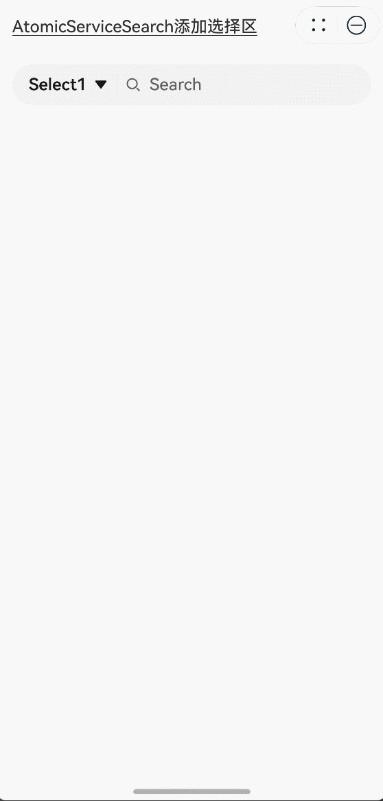


### 示例2（AtomicServiceSearch添加功能位）
该示例通过operation参数为AtomicServiceSearch组件添加右侧功能位。

```ts
import { AtomicServiceSearch } from '@kit.ArkUI';

@Entry
@Component
struct Index {
  build() {
    Column({ space: 6 }) {
      Text('AtomicServiceSearch添加功能位').alignSelf(ItemAlign.Start).decoration({
        type: TextDecorationType.Underline,
        color: Color.Black,
        style: TextDecorationStyle.SOLID
      }).margin({ top: 20, bottom: 20 })
      
      AtomicServiceSearch({
        operation: {
          // 附属于Search组件的功能位
          auxiliaryItem: {
            value: $r("app.media.sweep"), // 自定义资源
            action: () => {
              this.alert('扫一扫'); // 自定义事件
            }
          },
          // 独立于Search组件的功能位
          independentItem: {
            value: $r("app.media.dingding"), // 自定义资源
            action: () => {
              this.alert('通知'); // 自定义事件
            }
          }
        }
      })
    }.padding({ left: 16, right: 16 })
  }

  private alert(message: string): void {
    this.getUIContext().showAlertDialog({ message: message });
  }
}
```

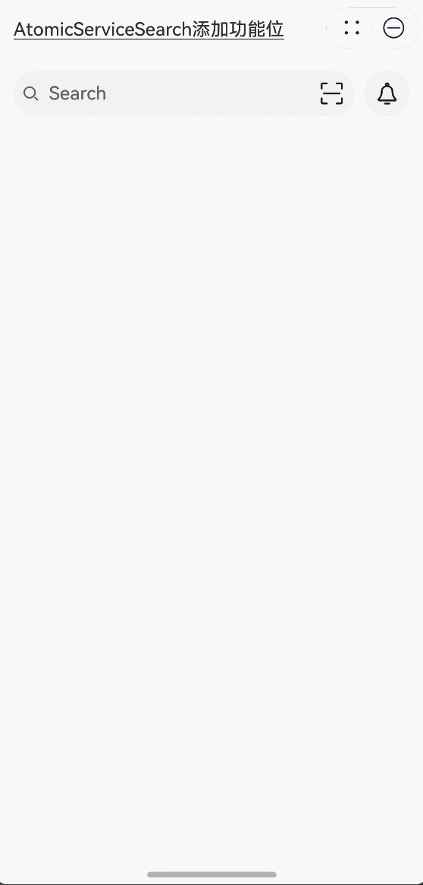


### 示例3（AtomicServiceSearch添加选择区及功能位）
该示例中为AtomicServiceSearch组件同时添加左侧选择区和右侧功能位。

```ts
import { AtomicServiceSearch } from '@kit.ArkUI';

@Entry
@Component
struct Index {
  build() {
    Column({ space: 6 }) {
      Text('AtomicServiceSearch+选择区+功能位').alignSelf(ItemAlign.Start).decoration({
        type: TextDecorationType.Underline,
        color: Color.Black,
        style: TextDecorationStyle.SOLID
      }).margin({ top: 20, bottom: 20 })

      AtomicServiceSearch({
        select: {
          options: [
            { value: 'Select1', icon: $r("app.media.sweep") }, // 自定义资源
            { value: 'Select2', icon: $r("app.media.sweep") }, // 自定义资源
            { value: 'Select3', icon: $r("app.media.sweep") }, // 自定义资源
            { value: 'Select4', icon: $r("app.media.sweep") } // 自定义资源
          ],
          selected: -1,
          selectValue: 'Select1',
          onSelect: (index: number, selectValue:string) => {
            if (index === 0) {
              this.alert(`index: ${index}, selectValue: ${selectValue}`);
            } else if (index === 1) {
              this.alert(`index: ${index}, selectValue: ${selectValue}`);
            } else if (index === 2) {
              this.alert(`index: ${index}, selectValue: ${selectValue}`);
            } else if (index === 3) {
              this.alert(`index: ${index}, selectValue: ${selectValue}`);
            }
          },
        },
        operation: {
          auxiliaryItem: {
            value: $r("app.media.sweep"), // 自定义资源
            action: () => {
              this.alert('扫一扫'); // 自定义事件
            }
          },
          independentItem: {
            value: $r("app.media.dingding"), // 自定义资源
            action: () => {
              this.alert('通知'); // 自定义事件
            }
          }
        }
      })
    }.padding({ left: 16, right: 16 })
  }

  private alert(message: string): void {
    this.getUIContext().showAlertDialog({ message: message });
  }
}
```

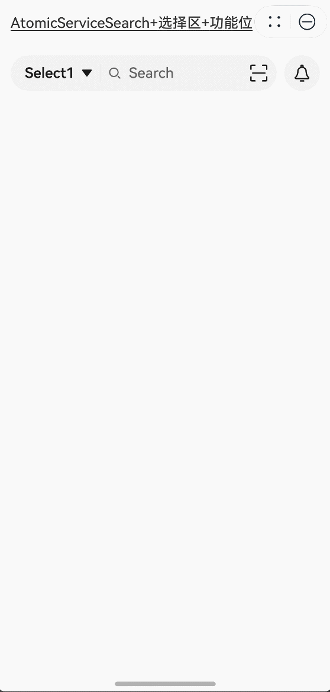


### 示例4（search回调事件）
该示例通过onWillInsert、onDidInsert、onWillDelete、onDidDelete接口实现了插入和删除的功能。
通过onSubmit接口实现了搜索区内容提交的功能。
通过onChange接口实现了监听搜索区内容变化的功能。

```ts
import { AtomicServiceSearch } from '@kit.ArkUI';

@Entry
@Component
struct Index {
  @State insertValue: string = "";
  @State deleteValue: string = "";
  @State insertOffset: number = 0;
  @State deleteOffset: number = 0;
  @State deleteDirection: number = 0;
  @State startIndex: number = 0;
  @State endIndex: number = 0;
  @State offsetX: number = 0;
  @State offsetY: number = 0;
  @State changeValue: string = '';
  @State value: string = 'false';
  @State submitValue: string = '';
  @State text: string = 'Search editMenuOptions';

  build() {
    Column({ space: 6 }) {
      Text('AtomicServiceSearch绑定事件').alignSelf(ItemAlign.Start).decoration({
        type: TextDecorationType.Underline,
        color: Color.Black,
        style: TextDecorationStyle.SOLID
      }).margin({ top: 20, bottom: 20 })

      Column({ space: 6 }) {
        Text('editing: ' + this.value).width('100%').height(25).borderRadius(15).padding({ left: 15 })
          .backgroundColor('rgba(0, 0, 0, 0.1)').maxLines(1).textOverflow({ overflow: TextOverflow.MARQUEE });
        Text('onSubmit:' + this.submitValue).width('100%').height(25).borderRadius(15).padding({ left: 15 })
          .backgroundColor('rgba(0, 0, 0, 0.1)').maxLines(1).textOverflow({ overflow: TextOverflow.MARQUEE });
        Text('onChange:' + this.changeValue).width('100%').height(25).borderRadius(15).padding({ left: 15 })
          .backgroundColor('rgba(0, 0, 0, 0.1)').maxLines(1).textOverflow({ overflow: TextOverflow.MARQUEE });
        Text('offset x:' + this.offsetX + ' y:' + this.offsetY).width('100%').height(25).borderRadius(15).padding({ left: 15 })
          .backgroundColor('rgba(0, 0, 0, 0.1)').maxLines(1).textOverflow({ overflow: TextOverflow.MARQUEE });
        Text("insertValue:" + this.insertValue + "  insertOffset:" + this.insertOffset).width('100%').height(25)
          .borderRadius(15).padding({ left: 15 }).backgroundColor('rgba(0, 0, 0, 0.1)').maxLines(1)
          .textOverflow({ overflow: TextOverflow.MARQUEE });
        Text("deleteValue:" + this.deleteValue + "  deleteOffset:" + this.deleteOffset).width('100%').height(25)
          .borderRadius(15).padding({ left: 15 }).backgroundColor('rgba(0, 0, 0, 0.1)').maxLines(1)
          .textOverflow({ overflow: TextOverflow.MARQUEE });
        Text("deleteDirection:" + (this.deleteDirection == 0 ? "BACKWARD" : "FORWARD")).width('100%').height(25)
          .borderRadius(15).padding({ left: 15 }).backgroundColor('rgba(0, 0, 0, 0.1)').maxLines(1)
          .textOverflow({ overflow: TextOverflow.MARQUEE });
        AtomicServiceSearch({
          select: {
            options: [
              { value: 'Select1', icon: $r("app.media.sweep") },
              { value: 'Select2', icon: $r("app.media.sweep") },
              { value: 'Select3', icon: $r("app.media.sweep") },
              { value: 'Select4', icon: $r("app.media.sweep") }
            ],
            selected: -1,
            selectValue: 'Select1',
            onSelect: (index: number) => {
              if (index === 0) {
                this.alert('Select1');
              } else if (index === 1) {
                this.alert('Select2');
              } else if (index === 2) {
                this.alert('Select3');
              } else if (index === 3) {
                this.alert('Select4');
              }
            },
          },
          search: {
            onSubmit: (value: string) => {
              this.submitValue = value
            },
            onChange: (value: string) => {
              this.changeValue = value
            },
            onCopy: () => {
              this.alert('onCopy');
            },
            onCut: () => {
              this.alert('onCut');
            },
            onPaste: () => {
              this.alert('onPaste');
            },
            onTextSelectionChange: (selectionStart: number, selectionEnd: number) => {
              this.startIndex = selectionStart
              this.endIndex = selectionEnd
            },
            onContentScroll: (totalOffsetX: number, totalOffsetY: number) => {
              this.offsetX = totalOffsetX
              this.offsetY = totalOffsetY
            },
            onEditChange: (data: boolean) => {
              this.value = data ? 'true' : 'false'
            },
            onWillInsert: (info: InsertValue) => {
              this.insertValue = info.insertValue
              return true;
            },
            onDidInsert: (info: InsertValue) => {
              this.insertOffset = info.insertOffset
            },
            onWillDelete: (info: DeleteValue) => {
              this.deleteValue = info.deleteValue
              info.direction
              return true;
            },
            onDidDelete: (info: DeleteValue) => {
              this.deleteOffset = info.deleteOffset
              this.deleteDirection = info.direction
            }
          }
        })
      }
    }.padding({ left: 16, right: 16 })
  }

  private alert(message: string): void {
    this.getUIContext().showAlertDialog({ message: message });
  }
}
```

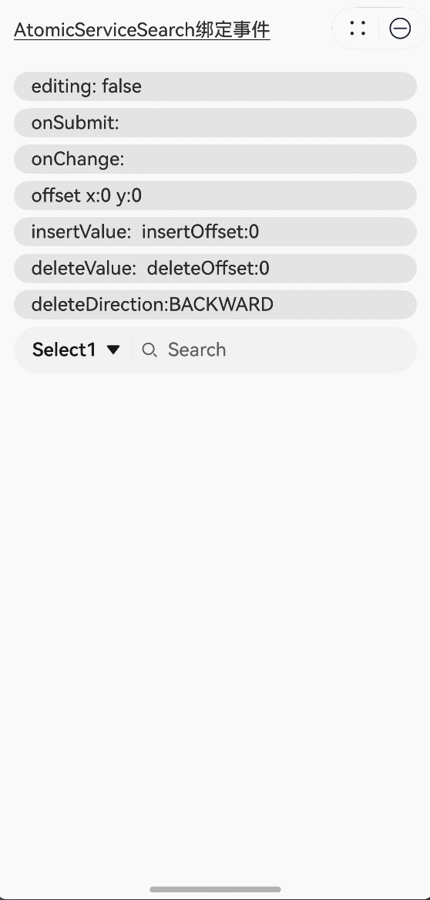


### 示例5（AtomicServiceSearch修改样式）
该示例通过search、select、value、placeholder参数实现了AtomicServiceSearch组件样式的自定义。

```ts
import { AtomicServiceSearch, SearchParams, SelectParams } from '@kit.ArkUI';

@Entry
@Component
struct Index {
  @State private placeholder: string = 'Type to Search...';
  @State private defaultValue: string = 'default';
  @State private search?: SearchParams = {};
  @State private select?: SelectParams = {
    options: [
      { value: 'Select1', icon: $r("app.media.sweep") },
      { value: 'Select2', icon: $r("app.media.sweep") },
      { value: 'Select3', icon: $r("app.media.sweep") },
      { value: 'Select4', icon: $r("app.media.sweep") }
    ],
    selected: -1,
    selectValue: 'Select1',
    onSelect: (index: number) => {
      if (index === 0) {
        this.alert('Select1');
      } else if (index === 1) {
        this.alert('Select2');
      } else if (index === 2) {
        this.alert('Select3');
      } else if (index === 3) {
        this.alert('Select4');
      }
    }
  };

  build() {
    Column({ space: 8 }) {
      Text('AtomicServiceSearch修改样式').alignSelf(ItemAlign.Start).decoration({
        type: TextDecorationType.Underline,
        color: Color.Black,
        style: TextDecorationStyle.SOLID
      }).margin({ top: 20, bottom: 20 })

      AtomicServiceSearch({
        value: this.defaultValue,
        placeholder: this.placeholder,
        select: this.select,
        search: this.search,
        operation: {
          independentItem: {
            value: $r(`app.media.dingding`),
            action: () => {
              this.alert('通知');
            }
          }
        }
      })
      Button("修改placeholder")
        .width('100%')
        .type(ButtonType.Normal)
        .borderRadius(20)
        .onClick(() => {
          if (this.placeholder === 'Search...') {
            this.placeholder = 'Type to Search...';
          } else {
            this.placeholder = 'Search...';
          }
        });
      Button("修改defaultValue")
        .width('100%')
        .type(ButtonType.Normal)
        .borderRadius(20)
        .onClick(() => {
          if (this.defaultValue === 'value') {
            this.defaultValue = 'defaultValue';
          } else {
            this.defaultValue = 'value';
          }
        });
      Button("修改Select样式")
        .width('100%')
        .type(ButtonType.Normal)
        .borderRadius(20)
        .onClick(() => {
          this.select = {
            options: [
              { value: '选项1', icon: $r("app.media.dingding") },
              { value: '选项2', icon: $r("app.media.dingding") },
            ],
            selected: -1,
            selectValue: '选项1',
            onSelect: (index: number) => {
              if (index === 0) {
                this.alert('选项1');
              } else if (index === 1) {
                this.alert('选项2');
              }
            }
          };
        });

      Button("修改Search样式")
        .width('100%')
        .type(ButtonType.Normal)
        .borderRadius(20)
        .onClick(() => {
          this.search = {
            componentBackgroundColor: '#e0eee8'
          }
        });
    }.padding({ left: 16, right: 16 })
  }

  private alert(message: string): void {
    this.getUIContext().showAlertDialog({ message: message });
  }
}
```

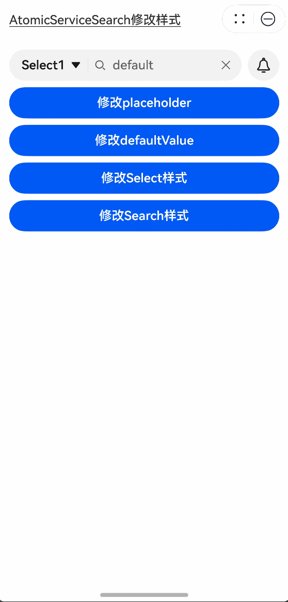


### 示例6（通过controller实现光标位置的设置）
该示例通过controller参数实现了光标位置的设置、选择指定区域中的内容及关闭编辑状态的功能。


```ts
import { AtomicServiceSearch } from '@kit.ArkUI';

@Entry
@Component
struct Index {
  controller: SearchController = new SearchController();

  build() {
    Column({ space : 10 }) {
      Text('通过controller实现光标位置的设置').alignSelf(ItemAlign.Start).decoration({
        type: TextDecorationType.Underline,
        color: Color.Black,
        style: TextDecorationStyle.SOLID
      }).margin({ top: 20, bottom: 20 })

      AtomicServiceSearch(
        {
          value: 'Default Value',
          placeholder: 'Type to Search...',
          controller: this.controller,
          search: {
            searchButton: {
              searchButtonValue: 'SEARCH',
              options: { fontSize: '12fp', fontColor: '#ff0e1216' }
            }
          }
        },
      );
      Button('caretPosition to 1').onClick(() => {
        this.controller.caretPosition(1);
      }).width('100%')
      Button('stopEditing').onClick(() => {
        this.controller.stopEditing();
      }).width('100%')
      Button('Selection [0,3]').onClick(() => {
        this.controller.setTextSelection(0, 3)
      }).width('100%')
    }.padding({ left: 16, right: 16 })
  }

  public alert(message: string): void {
    this.getUIContext().showAlertDialog({ message: message });
  }
}
```

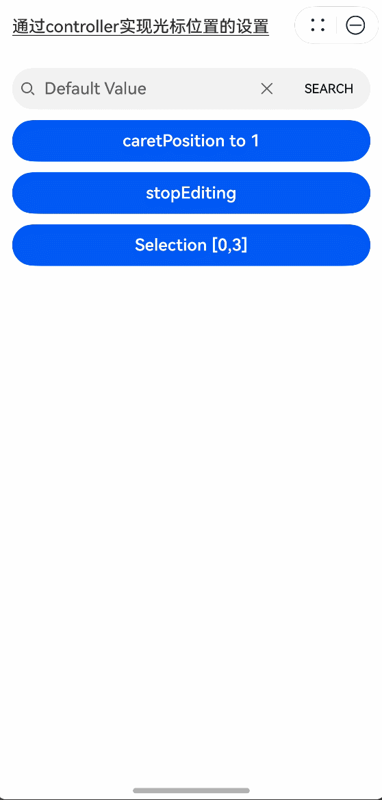


### 示例7（设置输入法回车键类型）
该示例通过enterKeyType属性实现了动态切换输入法回车键的效果。

```ts
import { AtomicServiceSearch } from '@kit.ArkUI';

@Entry
@Component
struct Index {
  @State enterTypes: Array<EnterKeyType> = [EnterKeyType.Go, EnterKeyType.Search, EnterKeyType.Send, EnterKeyType.Done, EnterKeyType.Next, EnterKeyType.PREVIOUS, EnterKeyType.NEW_LINE]
  @State index: number = 0

  build() {
    Column({ space : 10 }) {
      Text('输入法回车键类型为搜索').alignSelf(ItemAlign.Start).decoration({
        type: TextDecorationType.Underline,
        color: Color.Black,
        style: TextDecorationStyle.SOLID
      }).margin({ top: 20, bottom: 20 })

      AtomicServiceSearch({
        placeholder: '输入法回车键类型为搜索',
        search: {
          enterKeyType: this.enterTypes[this.index]
        }
      })

      Button('改变EnterKeyType').onClick(() => {
        this.index = (this.index + 1) % this.enterTypes.length;
      }).width('100%')

    }.padding({ left: 16, right: 16 })
  }

  public alert(message: string): void {
    this.getUIContext().showAlertDialog({ message: message });
  }
}
```

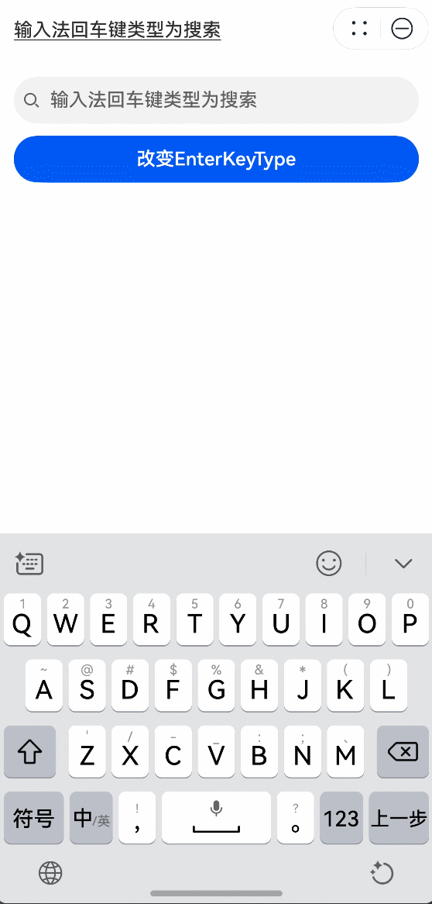


### 示例8（设置文字特性效果）
该示例通过fontFeature属性实现了文本在不同文字特性下的展示效果。

```ts
​​​​import { AtomicServiceSearch } from '@kit.ArkUI';

@Entry
@Component
struct Index {
  build() {
    Column({ space : 10 }) {
      Text('设置文字特性效果').alignSelf(ItemAlign.Start).decoration({
        type: TextDecorationType.Underline,
        color: Color.Black,
        style: TextDecorationStyle.SOLID
      }).margin({ top: 20, bottom: 20 })

      AtomicServiceSearch({
        value: 'This is ss01 on : 0123456789',
        search: {
          fontFeature: "\"ss01\" on"
        }
      });

      AtomicServiceSearch({
        value: 'This is ss01 off : 0123456789',
        search: {
          fontFeature: "\"ss01\" off"
        }
      });

      AtomicServiceSearch({
        value: 'fiabc1234567DEFGHIJKLMN',
        search: {
          fontFeature: "\"frac\" on"
        }
      });

      AtomicServiceSearch({
        value: 'fiabc1234567DEFGHIJKLMN',
        search: {
          fontFeature: "\"frac\" off"
        }
      });
    }.padding({ left: 16, right: 16 })
  }

  public alert(message: string): void {
    this.getUIContext().showAlertDialog({ message: message });
  }
}
```

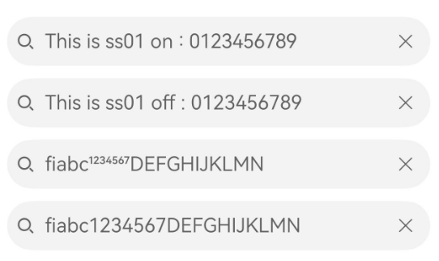


### 示例9（设置文本自适应）
该示例通过minFontSize、maxFontSize属性展示了文本自适应字号的效果。

```ts
import { AtomicServiceSearch } from '@kit.ArkUI';

@Entry
@Component
struct Index {
  build() {
    Column({ space : 10 }) {
      Text('设置文本自适应').alignSelf(ItemAlign.Start).decoration({
        type: TextDecorationType.Underline,
        color: Color.Black,
        style: TextDecorationStyle.SOLID
      }).margin({ top: 20, bottom: 20 })

      AtomicServiceSearch({
        value: 'This is the text without the adaptive font',
      }).width('80%').height(40).borderWidth(1).borderRadius(20)

      AtomicServiceSearch({
        value: 'This is the text without the adaptive font',
        search: {
          minFontSize: 4,
          maxFontSize: 40
        }
      }).width('80%').height(40).borderWidth(1).borderRadius(20)
    }.padding({ left: 16, right: 16 })
  }

  public alert(message: string): void {
    this.getUIContext().showAlertDialog({ message: message });
  }
}
```

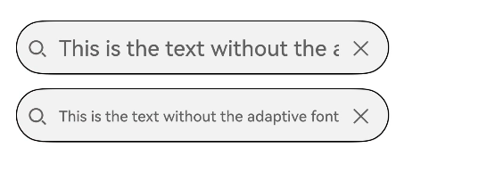


### 示例10（文本扩展自定义菜单）
该示例通过editMenuOptions接口实现了文本设置自定义菜单扩展项的文本内容、图标以及回调的功能。

```ts
import { AtomicServiceSearch } from '@kit.ArkUI';

@Entry
@Component
struct Index {
  onCreateMenu = (menuItems: Array<TextMenuItem>) => {
    let item1: TextMenuItem = {
      content: 'custom1',
      icon: $r('app.media.startIcon'),
      id: TextMenuItemId.of('custom1'),
    }
    let item2: TextMenuItem = {
      content: 'custom2',
      id: TextMenuItemId.of('custom2'),
      icon: $r('app.media.startIcon'),
    }
    menuItems.push(item1)
    menuItems.unshift(item2)
    return menuItems
  }

  onMenuItemClick = (menuItem: TextMenuItem, textRange: TextRange) => {
    if (menuItem.id.equals(TextMenuItemId.of("custom2"))) {
      console.log("拦截 id: custom2 start:" + textRange.start + "; end:" + textRange.end)
      return true
    }
    if (menuItem.id.equals(TextMenuItemId.COPY)) {
      console.log("拦截 COPY start:" + textRange.start + "; end:" + textRange.end)
      return true
    }
    if (menuItem.id.equals(TextMenuItemId.SELECT_ALL)) {
      console.log("不拦截 SELECT_ALL start:" + textRange.start + "; end:" + textRange.end)
      return false
    }
    return false
  }

  @State editMenuOptions: EditMenuOptions = {
    onCreateMenu: this.onCreateMenu, onMenuItemClick: this.onMenuItemClick
  }

  build() {
    Column({ space : 10 }) {
      Text('文本扩展自定义菜单').alignSelf(ItemAlign.Start).decoration({
        type: TextDecorationType.Underline,
        color: Color.Black,
        style: TextDecorationStyle.SOLID
      }).margin({ top: 20, bottom: 20 })

      AtomicServiceSearch({
        value:'Default input',
        search: {
          editMenuOptions : this.editMenuOptions
        }
      })
    }.padding({ left: 16, right: 16 })
  }

  public alert(message: string): void {
    this.getUIContext().showAlertDialog({ message: message });
  }
}
```

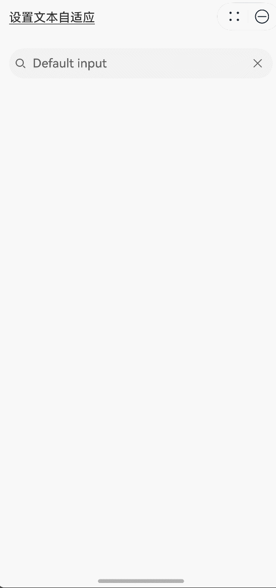


### 示例11（设置文本水平对齐/光标样式/选中背景色）
该示例通过textAlign、caretStyle、selectedBackgroundColor属性展示如何设置文本的水平对齐、光标样式和选中背景色。

```ts
import { AtomicServiceSearch } from '@kit.ArkUI';

@Entry
@Component
struct Index {
  build() {
    Column() {
      Text('设置文本水平对齐/光标样式/选中背景色').alignSelf(ItemAlign.Start).decoration({
        type: TextDecorationType.Underline,
        color: Color.Black,
        style: TextDecorationStyle.SOLID
      }).margin({ top: 20, bottom: 20 })

      AtomicServiceSearch({
        value: 'Search textAlign sample',
        search: {
          textAlign: TextAlign.Center,
          caretStyle: { width: 3, color: Color.Green },
          selectedBackgroundColor: Color.Gray
        }
      })
    }.padding({ left: 16, right: 16 })
  }

  public alert(message: string): void {
    this.getUIContext().showAlertDialog({ message: message });
  }
}
```

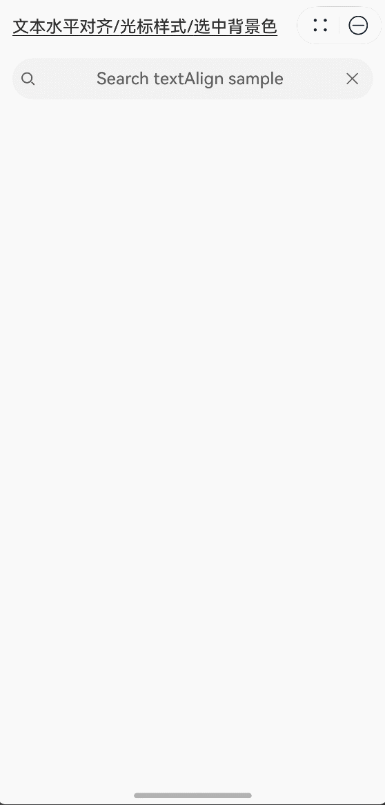


### 示例12（对输入的文本进行过滤）
该示例通过inputFilter属性展示如何对输入的文本进行内容的过滤，以限制输入内容。

```ts
import { AtomicServiceSearch } from '@kit.ArkUI';

@Entry
@Component
struct Index {
  @State filterValue: string = '';

  build() {
    Column() {
      Column({ space: 10 }) {
        Text('对输入的文本进行过滤').alignSelf(ItemAlign.Start).decoration({
          type: TextDecorationType.Underline,
          color: Color.Black,
          style: TextDecorationStyle.SOLID
        }).margin({ top: 20, bottom: 20 })
        AtomicServiceSearch({
          placeholder: 'please enter...',
          search: {
            inputFilter: {
              inputFilterValue : '[a-z]',
              error: (filterValue: string) => {this.filterValue = filterValue}
            }
          }
        })
        Text('Filter:' + this.filterValue).alignSelf(ItemAlign.Start)

      }
    }.padding({ left: 16, right: 16 })
  }

  public alert(message: string): void {
    this.getUIContext().showAlertDialog({ message: message });
  }
}
```

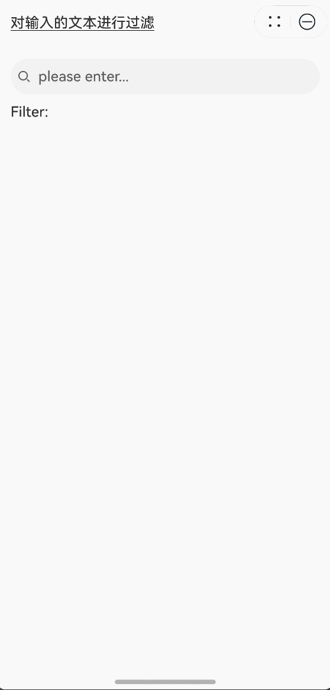
