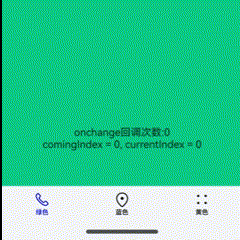

# @ohos.atomicservice.AtomicServiceTabs (用于元服务的页签容器组件)

AtomicServiceTabs高级组件，为元服务提供定制化诉求，对Tabs组件一些不需提供给用户自定义设计的属性进行简化，其中包括限制最多显示5个页签，固定页签样式和位置大小等。

> **说明：**
>
> 该组件从API Version 12开始支持。后续版本如有新增内容，则采用上角标单独标记该内容的起始版本。

## 子组件

无
## AtomicServiceTabs

```
AtomicServiceTabs({
  tabContents?: [ TabContentBuilder?,
                  TabContentBuilder?,
                  TabContentBuilder?,
                  TabContentBuilder?,
                  TabContentBuilder?
                ],
  tabBarOptionsArray: [ TabBarOptions,
                        TabBarOptions,
                        TabBarOptions?,
                        TabBarOptions?,
                        TabBarOptions?
                      ],
  tabBarPosition?: TabBarPosition,
  barBackgroundColor?: ResourceColor,
  index?: number,
  barOverlap?: boolean,
  controller?: TabsController,
  onChange?: Callback<number>,
  onTabBarClick?: Callback<number>,
  onContentWillChange?: OnContentWillChangeCallback,
})
```

**装饰器类型：**@Component

**元服务API：** 从API version 12开始，该接口支持在元服务中使用。

**系统能力：** SystemCapability.ArkUI.ArkUI.Full

**参数**：

| 名称 | 类型 | 必填 | 装饰器类型|描述 |
| --------------- | ------ | ---- | ----|----------|
| tabContents | [[TabContentBuilder?](#TabContentBuilder),[TabContentBuilder?](#TabContentBuilder), [TabContentBuilder?](#TabContentBuilder),[TabContentBuilder?](#TabContentBuilder), [TabContentBuilder?](#TabContentBuilder)] | 否 | @BuilderParam| 内容视图容器数组 |
| tabBarOptionsArray | [[TabBarOptions?](#TabBarOptions),[TabBarOptions?](#TabBarOptions), [TabBarOptions?](#TabBarOptions),[TabBarOptions?](#TabBarOptions), [TabBarOptions?](#TabBarOptions)]  | 是 | @Prop | 页签容器数组。 |
| tabBarPosition | [ResourceColor](ts-types.md#resourcecolor) | 否   |@Prop | 设置页签栏位置。|
| barBackgroundColor | [TabBarOptions](#TabBarOptions) | 否 | @Prop | 设置TabBar的背景颜色。|
| index | number | 否 | @Prop | 设置当前显示页签的索引。|
| barOverlap | boolean| 否 | @Prop | 设置TabBar是否背后变模糊并叠加在TabContent之上。|
| controller|[TabsController](ts-container-tabs#tabscontroller) | 否 | @Prop |Tabs组件的控制器，用于控制Tabs组件进行页签切换。|
| onChange | Callback\<number\> | 否 | - | Tabs页签切换后触发的事件 |
| onTabBarClick | Callback\<number\> | 否 | - |Tabs页签点击后触发的事件|
| onContentWillChange | [OnContentWillChangeCallback](#OnContentWillChangeCallback) | 否 | - | Tabs页面切换拦截事件能力，新页面即将显示时触发该回调。|

## TabContentBuilder

| 类型 | 描述 |
| ---- | ---------- |
| () => void | 内容视图容器 |
## TabBarOptions

| 参数名 | 类型 | 必填 | 描述 |
| --------------- | ------ |------ |------ |
| icon | ResourceStr | TabBarSymbol | 是 | 构造NavDestinationBuilder所用名称。 |
| text | ResourceStr | 是 | 构造NavDestinationBuilder传入的参数。 |
| unselectedColor | ResourceColor | 是 | 构造NavDestinationBuilder传入的参数。 |
| selectedColor | ResourceColor | 是 | 构造NavDestinationBuilder传入的参数。 |


## TabBarPosition 

| 参数名 |  描述 |
| --------------- | ------ |
| LEFT  | 设置TabBar位于屏幕左侧  |
| BOTTOM  | 设置TabBar位于屏幕底部 |

## OnContentWillChangeCallback

| 参数名 | 类型 | 必填 | 描述 |
| --------------- | ------ |------ |------ |
| currentIndex | number | 是 | 当前页签索引。 |
| comingIndex | number | 是 | 即将切换的页签索引。 |

## 示例

```typescript
// Index.ets
import { AtomicServiceTabs, TabBarOptions, TabBarPosition, OnContentWillChangeCallback } from '@ohos.atomicservice.AtomicServiceTabs';

@Entry
@Component
struct Index {
  @State message: string = '首页';
  @State onClickNumber: number = 0;
  @State currentIndex: number = 0;
  @State comingIndex: number = 0;
  childNavStack: NavPathStack = new NavPathStack();
  onContentWillChangeCallBack:  OnContentWillChangeCallback = (currentIndex: number, comingIndex: number): boolean => {
    this.currentIndex = currentIndex;
    this.comingIndex = comingIndex;
    console.log('OnContentWillChangeCallback')
     return true;
  }
  onTabClick: Callback<number> = (index:number)=>{
    this.onClickNumber ++;
    console.log('onTabClick');
  }
  @Builder
  tabContent1() {
    Column().width('100%').height('100%').alignItems(HorizontalAlign.Center).backgroundColor('#00CB87')
  }

  @Builder
  tabContent2() {
    Column().width('100%').height('100%').backgroundColor('#007DFF')
  }

  @Builder
  tabContent3() {
    Column().width('100%').height('100%').backgroundColor('#FFBF00')
  }

  build() {
    Stack() {
    AtomicServiceTabs({
      tabContents: [
        () => {
          this.tabContent1()
        },
        () => {
          this.tabContent2()
        },
        () => {
          this.tabContent3()
        }
      ],
      tabBarOptionsArray: [
        new TabBarOptions($r('sys.media.ohos_ic_public_phone'), '绿色', Color.Black, Color.Blue),
        new TabBarOptions($r('sys.media.ohos_ic_public_location'), '蓝色', Color.Black, Color.Blue),
        new TabBarOptions($r('sys.media.ohos_ic_public_more'), '黄色', Color.Black, Color.Blue)
      ],
      tabBarPosition: TabBarPosition.BOTTOM,
      barBackgroundColor: $r('sys.color.ohos_id_color_bottom_tab_bg'),
      onTabBarClick:this.onTabClick,
      onContentWillChange: this.onContentWillChangeCallBack,
    })
    Column() {
      Text("onchange回调次数:" + this.onClickNumber)
      Text("comingIndex = " + this.comingIndex + ", currentIndex = " + this.currentIndex)
    }.margin({top:500})
    }.height('100%')
  }
}
```
