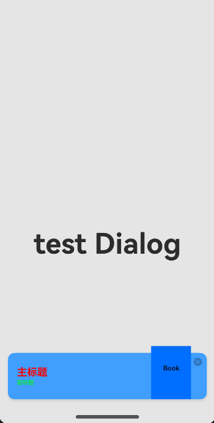
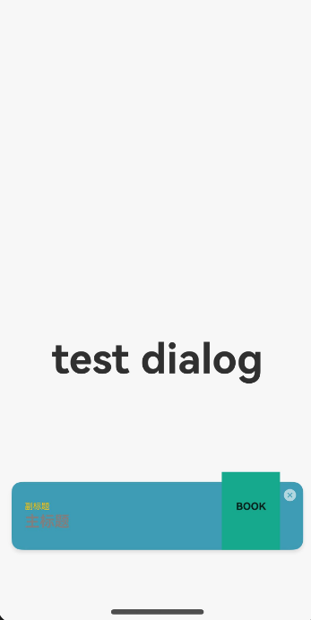

# InterstitialDialogAction

InterstitialDialogAction弹框在原子化服务中用于在保持当前的上下文环境时，临时展示用户需关注的信息或待处理的操作，用户点击弹框的不同区域可以触发相应的动作。

> **说明：**
>
> 该组件从API Version 12开始支持。后续版本如有新增内容，则采用上角标单独标记该内容的起始版本。

## 导入模块

```
import { InterstitialDialogAction, IconStyle, TitlePosition, BottomOffset } from '@kit.ArkUI';
```

## 子组件

无

## 属性

不支持[通用属性](ts-component-general-attributes.md)

## InterstitialDialogAction

对自定义弹框进行封装，用于在保持当前的上下文环境时，临时展示用户需关注的信息或待处理的操作。使用示例参见[示例](#示例)。

### constructor

constructor(dialogOptions: DialogOptions)

InterstitialDialogAction的构造函数

**原子化服务API：** 从API version 12开始，该接口支持在原子化服务中使用。

**系统能力：** SystemCapability.ArkUI.ArkUI.Full

**参数**：

| 参数名 | 类型 | 必填 | 说明 |
| - | - | - | - |
| dialogOptions | [DialogOptions](#dialogoptions)| 是 | 设置弹框特有的属性。 |

### openDialog

openDialog(): void

打开弹框。

**原子化服务API：** 从API version 12开始，该接口支持在原子化服务中使用。

**系统能力：** SystemCapability.ArkUI.ArkUI.Full

### closeDialog

closeDialog(): void

关闭弹框。

**原子化服务API：** 从API version 12开始，该接口支持在原子化服务中使用。

**系统能力：** SystemCapability.ArkUI.ArkUI.Full

## DialogOptions

**原子化服务API：** 从API version 12开始，该接口支持在原子化服务中使用。

**系统能力：** SystemCapability.ArkUI.ArkUI.Full

设置弹框特有的属性以及提供给用户自定义的点击触发动作。

| 名称| 类型 | 必填 | 说明 |
| - | - | - | - |
| uiContext | [UIContext](../js-apis-arkui-UIContext.md#uicontext) | 是 | UI上下文实例。 |
| bottomOffsetType | [BottomOffset](#bottomoffset) | 否 | 弹框距离底部偏移类型。默认值为[BottomOffset](#bottomoffset).OFFSET_FOR_BAR。 |
| title | [ResourceStr](ts-types.md#resourcestr) | 否 | 弹框标题文本。默认为空字符串。 |
| subtitle | [ResourceStr](ts-types.md#resourcestr) | 否 | 弹框副标题文本。默认为空字符串。 |
| titleColor | [ResourceStr](ts-types.md#resourcestr) \| [Color](ts-appendix-enums.md#color) | 否 | 弹框标题文本颜色。默认为$r('sys.color.ohos_id_color_text_primary_contrary')。 |
| subtitleColor | [ResourceStr](ts-types.md#resourcestr) \| [Color](ts-appendix-enums.md#color) | 否 | 弹框副标题文本颜色。默认为$r('sys.color.ohos_id_color_text_secondary_contrary')。 |
| backgroundImage | [Resource](ts-types.md#resource) | 否 | 弹框背景图片。默认为纯色背景，颜色值为#EBEEF5。 |
| foregroundImage | [Resource](ts-types.md#resource) | 否 | 弹框前景图片。默认为空，即不显示前景图片。 |
| iconStyle | [IconStyle](#iconstyle) | 否 | 关闭按钮图标的样式（亮调或者暗调）。<br>默认值：[IconStyle](#iconstyle).Light |
| titlePosition | [TitlePosition](#titleposition) | 否 | 标题在弹框中的位置，在副标题的上方或者在副标题的下方。<br>默认值：[TitlePosition](#titleposition).Top |
| onDialogClick | Callback\<void\> | 否 | 点击弹框任意位置后触发的用户自定义动作。默认为“执行关闭弹框的函数”，即仅关闭弹框。 |
| onDialogClose | Callback\<void\> | 否 | 点击关闭按钮后触发的用户自定义动作。默认为“执行关闭弹框的函数”，即仅关闭弹框。 |

## IconStyle

**原子化服务API：** 从API version 12开始，该接口支持在原子化服务中使用。

**系统能力：** SystemCapability.ArkUI.ArkUI.Full

设置关闭按钮的色调样式，默认设置关闭按钮为亮色。

| 名称 | 值 | 说明 |
| - | - | - |
| DARK | 0 | 设置关闭按钮为暗色调。 |
| LIGHT | 1 | 设置关闭按钮为亮色调。<br>默认值。 |

## TitlePosition

**原子化服务API：** 从API version 12开始，该接口支持在原子化服务中使用。

**系统能力：** SystemCapability.ArkUI.ArkUI.Full

设置主副标题之间的上下相对位置，默认设置为主标题在副标题之上。

| 名称 | 值 | 说明 |
| - | - | - |
| TOP | 0 | 设置主标题位于副标题之上。<br>默认值。 |
| BOTTOM | 1 | 设置副标题位于主标题之上。 |

## BottomOffset

**原子化服务API：** 从API version 12开始，该接口支持在原子化服务中使用。

**系统能力：** SystemCapability.ArkUI.ArkUI.Full

设置不同情景模式下弹框距离底部的距离，判断依据为是否存在菜单栏，默认显示为不存在菜单栏情况下的距离。

| 名称 | 值 | 说明 |
| - | - | - |
| OFFSET_FOR_BAR | 0 | 存在菜单栏情况下与窗口底部的距离。<br>默认值，设置后弹框距离底部88vp。 |
| OFFSET_FOR_NONE | 1 | 不存在菜单栏情况下与窗口底部的距离。<br>设置后弹框距离底部44vp。 |

## 事件
不支持[通用事件](ts-component-general-events.md)

## 示例

### 示例1

为可选属性设置相应值，用两种不同参数类型分别为主标题、副标题设置颜色值，关闭按钮设置为暗色调，
主副标题相对位置设置为主标题在副标题上方，底部距离类型设置为不存在菜单栏情况下的距离。

<!--code_no_check-->
```ts
// ../entryability/EntryAbility
import { AbilityConstant, UIAbility, Want } from '@kit.AbilityKit';
import { hilog } from '@kit.PerformanceAnalysisKit';
import { window } from '@kit.ArkUI';
import { BusinessError } from '@kit.BasicServicesKit';

let dialogUIContext: UIContext | null = null;

export function getDialogUIContext(): UIContext | null {
  return dialogUIContext;
}

export default class EntryAbility extends UIAbility {
  onCreate(want: Want, launchParam: AbilityConstant.LaunchParam): void {
    hilog.info(0x0000, 'testTag', '%{public}s', 'Ability onCreate');
  }

  onDestroy(): void {
    hilog.info(0x0000, 'testTag', '%{public}s', 'Ability onDestroy');
  }

  onWindowStageCreate(windowStage: window.WindowStage): void {
    // Main window is created, set main page for this ability
    hilog.info(0x0000, 'testTag', '%{public}s', 'Ability onWindowStageCreate');

    windowStage.loadContent('pages/Index', (err) => {
      if (err.code) {
        hilog.error(0x0000, 'testTag', 'Failed to load the content. Cause: %{public}s', JSON.stringify(err) ?? '');
        return;
      }
      hilog.info(0x0000, 'testTag', 'Succeeded in loading the content.');
    });

    let windowClass: window.Window | undefined = undefined;
    windowStage.getMainWindow((err: BusinessError, data) => {
      let errCode: number = err.code;
      if (errCode) {
        console.error('Failed to obtain the main window. Cause: ' + JSON.stringify(err));
        return;
      }
      windowClass = data;
      console.info('Succeeded in obtaining the main window. Data: ' + JSON.stringify(data));
      dialogUIContext = windowClass.getUIContext();
    })

    //获取窗口
    windowStage.getMainWindow((err, data) => {
      if (err.code) {
        console.error('Failed to obtain the main window. Cause: ' + JSON.stringify(err));
        return;
      }
      windowClass = data;
      console.info('Succeeded in obtaining the main window. Data: ' + JSON.stringify(data));
      //设置窗口全屏
      windowClass.setWindowLayoutFullScreen(false)
    })
  }

  onWindowStageDestroy(): void {
    // Main window is destroyed, release UI related resources
    hilog.info(0x0000, 'testTag', '%{public}s', 'Ability onWindowStageDestroy');
  }

  onForeground(): void {
    // Ability has brought to foreground
    hilog.info(0x0000, 'testTag', '%{public}s', 'Ability onForeground');
  }

  onBackground(): void {
    // Ability has back to background
    hilog.info(0x0000, 'testTag', '%{public}s', 'Ability onBackground');
  }
}
```

```ts
// Index.ets
import { getDialogUIContext } from '../entryability/EntryAbility';
import { UIContext, InterstitialDialogAction, IconStyle, TitlePosition, BottomOffset } from '@kit.ArkUI';

@Entry
@Component
struct Index {
  build() {
    Row() {
      Column() {
        Text("show dialog")
          .fontSize(50)
          .fontWeight(FontWeight.Bold)
          .onClick(() => {
            let ctx: UIContext | null = getDialogUIContext();
            let interstitialDialogAction: InterstitialDialogAction = new InterstitialDialogAction({
              uiContext: ctx as UIContext,
              title: "主标题",
              subtitle: "副标题",
              titleColor: 'rgb(255, 192, 0)',
              subtitleColor: Color.Red,
              backgroundImage: $r('app.media.testBackgroundImg'),
              foregroundImage: $r('app.media.testForegroundImg'),
              iconStyle: IconStyle.DARK,
              titlePosition: TitlePosition.TOP,
              bottomOffsetType: BottomOffset.OFFSET_FOR_NONE,
              onDialogClick: () => { console.log('outer dialog click action') },
              onDialogClose: () => { console.log('outer close action') }
            });
            interstitialDialogAction.openDialog();
          })
      }
      .width('100%')
    }
    .height('100%')
    .backgroundColor('rgba(0, 0, 0, 0.1)')
  }
}
```



### 示例2

为可选属性设置相应值，用两种不同参数类型分别为主标题，副标题设置颜色值，关闭按钮设置为亮色调，主副标题相对位置设置为主标题在副标题下方，底部距离类型设置为存在菜单栏情况下的距离。

<!--code_no_check-->
```ts
// ../entryability/EntryAbility
import { AbilityConstant, UIAbility, Want } from '@kit.AbilityKit';
import { hilog } from '@kit.PerformanceAnalysisKit';
import { window } from '@kit.ArkUI';
import { BusinessError } from '@kit.BasicServicesKit';

let dialogUIContext: UIContext | null = null;

export function getDialogUIContext(): UIContext | null {
  if (getDialogUIContext === null) {
    hilog.info(0x0000, 'testTag', '%{public}s', 'getDialogUIContext is null');
  }
  return dialogUIContext;
}

export default class EntryAbility extends UIAbility {
  onCreate(want: Want, launchParam: AbilityConstant.LaunchParam): void {
    hilog.info(0x0000, 'testTag', '%{public}s', 'Ability onCreate');
  }

  onDestroy(): void {
    hilog.info(0x0000, 'testTag', '%{public}s', 'Ability onDestroy');
  }

  onWindowStageCreate(windowStage: window.WindowStage): void {
    // Main window is created, set main page for this ability
    hilog.info(0x0000, 'testTag', '%{public}s', 'Ability onWindowStageCreate');

    windowStage.loadContent('pages/Index', (err) => {
      if (err.code) {
        hilog.error(0x0000, 'testTag', 'Failed to load the content. Cause: %{public}s', JSON.stringify(err) ?? '');
        return;
      }
      hilog.info(0x0000, 'testTag', 'Succeeded in loading the content.');
    });

    let windowClass: window.Window | undefined = undefined;
    windowStage.getMainWindow((err: BusinessError, data) => {
      let errCode: number = err.code;
      if (errCode) {
        console.error('Failed to obtain the main window. Cause: ' + JSON.stringify(err));
        return;
      }
      windowClass = data;
      console.info('Succeeded in obtaining the main window. Data: ' + JSON.stringify(data));
      dialogUIContext = windowClass.getUIContext();
    })

    //获取窗口
    windowStage.getMainWindow((err, data) => {
      if (err.code) {
        console.error('Failed to obtain the main window. Cause: ' + JSON.stringify(err));
        return;
      }
      windowClass = data;
      console.info('Succeeded in obtaining the main window. Data: ' + JSON.stringify(data));
      //设置窗口全屏
      windowClass.setWindowLayoutFullScreen(false)
    })
  }

  onWindowStageDestroy(): void {
    // Main window is destroyed, release UI related resources
    hilog.info(0x0000, 'testTag', '%{public}s', 'Ability onWindowStageDestroy');
  }

  onForeground(): void {
    // Ability has brought to foreground
    hilog.info(0x0000, 'testTag', '%{public}s', 'Ability onForeground');
  }

  onBackground(): void {
    // Ability has back to background
    hilog.info(0x0000, 'testTag', '%{public}s', 'Ability onBackground');
  }
}
```

```ts
// Index.ets
import { getDialogUIContext } from '../entryability/EntryAbility';
import { UIContext, InterstitialDialogAction, IconStyle, TitlePosition, BottomOffset } from '@kit.ArkUI';

@Entry
@Component
struct Index {
  build() {
    Row() {
      Column() {
        Text("show dialog")
          .fontSize(50)
          .fontWeight(FontWeight.Bold)
          .onClick(() => {
            let ctx: UIContext | null = getDialogUIContext();
            let interstitialDialogAction: InterstitialDialogAction = new InterstitialDialogAction({
              uiContext: ctx as UIContext,
              title: "主标题",
              subtitle: "副标题",
              titleColor: 'rgb(255, 192, 0)',
              subtitleColor: Color.Red,
              backgroundImage: $r('app.media.testBackgroundImg'),
              foregroundImage: $r('app.media.testForegroundImg'),
              iconStyle: IconStyle.LIGHT,
              titlePosition: TitlePosition.BOTTOM,
              bottomOffsetType: BottomOffset.OFFSET_FOR_BAR,
              onDialogClick: () => { console.log('outer dialog click action') },
              onDialogClose: () => { console.log('outer close action') }
            });
            interstitialDialogAction.openDialog();
          })
      }
      .width('100%')
    }
    .height('100%')
    .backgroundColor('rgba(0, 0, 0, 0.1)')
  }
}
```

