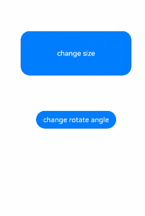

# 属性动画 (animation)
<!--Kit: ArkUI-->
<!--Subsystem: ArkUI-->
<!--Owner: @CCFFWW-->
<!--Designer: @CCFFWW-->
<!--Tester: @lxl007-->
<!--Adviser: @HelloCrease-->

组件的某些通用属性变化时，可以通过属性动画实现渐变过渡效果，提升用户体验。支持的属性包括[width](ts-universal-attributes-size.md#width)、[height](ts-universal-attributes-size.md#height)、[backgroundColor](ts-universal-attributes-background.md#backgroundcolor)、[opacity](ts-universal-attributes-opacity.md#opacity)、[scale](ts-universal-attributes-transformation.md#scale)、[rotate](ts-universal-attributes-transformation.md#rotate)、[translate](ts-universal-attributes-transformation.md#translate)等。布局类改变宽高的动画，内容都是直接到终点状态，例如文字、[Canvas](ts-components-canvas-canvas.md)的内容等，如果要内容跟随宽高变化，可以使用[renderFit](ts-universal-attributes-renderfit.md#renderfit)属性配置。

> **说明：**
>
> 从API version 7开始支持。后续版本如有新增内容，则采用上角标单独标记该内容的起始版本。

## animation

animation(value:AnimateParam): T

设置组件的属性动画。

> **说明：**
>
> 在单一页面上存在大量应用动效的组件时，可以使用renderGroup方法来解决卡顿问题，从而提升动画性能。最佳实践请参考[动画使用指导-使用renderGroup](https://developer.huawei.com/consumer/cn/doc/best-practices/bpta-fair-use-animation#section1223162922415)。

**卡片能力：** 从API version 9开始，该接口支持在ArkTS卡片中使用。

**原子化服务API：** 从API version 11开始，该接口支持在原子化服务中使用。

**系统能力：** SystemCapability.ArkUI.ArkUI.Full

**参数：**
| 参数名   | 类型                                | 必填 | 说明                                    |
| ----- | --------------------------------- | ---- | ------------------------------------- |
| value | [AnimateParam](ts-explicit-animation.md#animateparam对象说明) | 是    | 设置动画效果相关参数。                           |

**返回值：**

| 类型 | 说明 |
| -------- | -------- |
| T | 返回当前组件。 |

属性动画只对写在animation前面的属性生效，且对组件构造器的属性不生效。
```
@Entry
@Component
struct AnimationExample {
  @State widthSize: number = 250;
  @State heightSize: number = 100;
  @State rotateAngle: number = 0;
  @State flag: boolean = true;
  @State space: number = 10;
  
  build() {
    Column() {
      Column({ space: this.space }) // 改变Column构造器中的space动画不生效
        .onClick(() => {
          if (this.flag) {
            this.widthSize = 150;
            this.heightSize = 60;
            this.space = 20; // 改变this.space动画不生效
          } else {
            this.widthSize = 250;
            this.heightSize = 100;
            this.space = 10; // 改变this.space动画不生效
          }
          this.flag = !this.flag;
        })
        .backgroundColor(Color.Black)
        .margin(30)
        .width(this.widthSize) // 只有写在animation前面才生效
        .height(this.heightSize) // 只有写在animation前面才生效
        .animation({
          duration: 2000,
          curve: Curve.EaseOut,
          iterations: 3,
          playMode: PlayMode.Normal
        })
        // .width(this.widthSize) // 动画不生效
        // .height(this.heightSize) // 动画不生效
    }
  }
}
```

## 示例

该示例通过animation实现了组件的属性动画。

```ts
// xxx.ets
@Entry
@Component
struct AttrAnimationExample {
  @State widthSize: number = 250
  @State heightSize: number = 100
  @State rotateAngle: number = 0
  @State flag: boolean = true

  build() {
    Column() {
      Button('change size')
        .onClick(() => {
          if (this.flag) {
            this.widthSize = 150
            this.heightSize = 60
          } else {
            this.widthSize = 250
            this.heightSize = 100
          }
          this.flag = !this.flag
        })
        .margin(30)
        .width(this.widthSize)
        .height(this.heightSize)
        .animation({
          duration: 2000,
          curve: Curve.EaseOut,
          iterations: 3,
          playMode: PlayMode.Normal
        })
      Button('change rotate angle')
        .onClick(() => {
          this.rotateAngle = 90
        })
        .margin(50)
        .rotate({ angle: this.rotateAngle })
        .animation({
          duration: 1200,
          curve: Curve.Friction,
          delay: 500,
          iterations: -1, // 设置-1表示动画无限循环
          playMode: PlayMode.Alternate,
          expectedFrameRateRange: {
            min: 20,
            max: 120,
            expected: 90,
          }
        })
    }.width('100%').margin({ top: 20 })
  }
}
```

