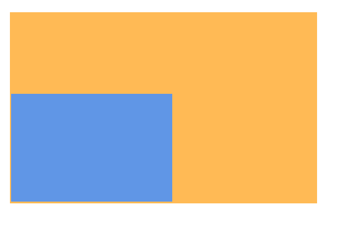
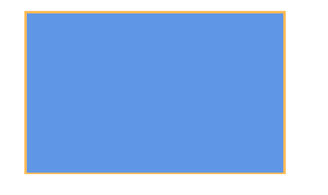
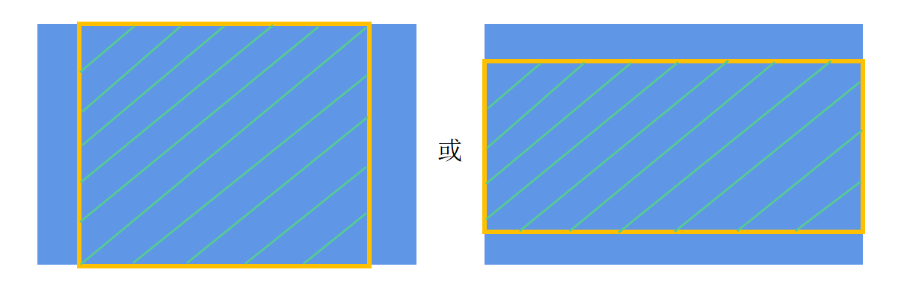
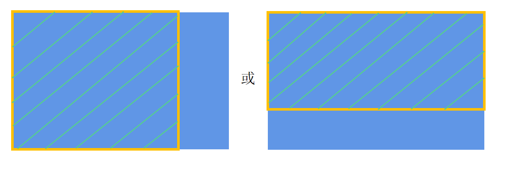
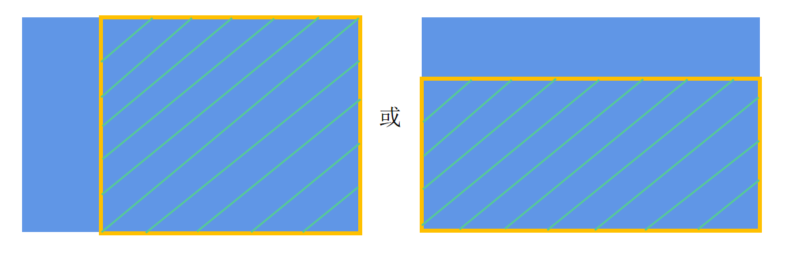

# 枚举说明

<!--Kit: ArkUI-->
<!--Subsystem: ArkUI-->
<!--Owner: @piggyguy; @jiyujia926; @hehongyang3-->
<!--Designer: @piggyguy; @s10021109; @hehongyang3-->
<!--Tester: @fredyuan912-->
<!--Adviser: @Brilliantry_Rui-->

本文档汇总ArkUI开发中的公共枚举，供开发者查询枚举值的含义和适用场景。

>**说明：**
>
>本模块首批接口从API version 7开始支持，后续版本的新增接口，采用上角标单独标记接口的起始版本。

## AccessibilityHoverType12+

**原子化服务API：** 从API version 12开始，该接口支持在原子化服务中使用。

**模型约束：** 此接口仅可在Stage模型下使用。

**系统能力：** SystemCapability.ArkUI.ArkUI.Full

| 名称         | 值 | 说明                                                         |
| ------------ | - | ------------------------------------------------------------ |
| HOVER_ENTER  | 0 | 手指按下时触发。         |
| HOVER_MOVE   | 1 | 触摸移动时触发。         |
| HOVER_EXIT   | 2 | 手指抬起时触发。              |
| HOVER_CANCEL | 3 | 打断取消当前触发的事件。  |

## Alignment

定义容器元素绘制区域内的子元素的对齐方式。

**卡片能力：** 从API version 9开始，该接口支持在ArkTS卡片中使用。

**原子化服务API：** 从API version 11开始，该接口支持在原子化服务中使用。

**系统能力：** SystemCapability.ArkUI.ArkUI.Full

| 名称        | 值 | 说明       |
| ----------- | - | -------- |
| TopStart    | 0 | 顶部起始端。   |
| Top         | 1 | 顶部横向居中。  |
| TopEnd      | 2 | 顶部尾端。    |
| Start       | 3 | 起始端纵向居中。 |
| Center      | 4 | 横向和纵向居中。 |
| End         | 5 | 尾端纵向居中。  |
| BottomStart | 6 | 底部起始端。   |
| Bottom      | 7 |底部横向居中。  |
| BottomEnd   | 8 | 底部尾端。    |

## AnimationPropertyType20+

用于动画的属性类型。

**原子化服务API：** 从API version 20开始，该接口支持在原子化服务中使用。

**模型约束：** 此接口仅可在Stage模型下使用。

**系统能力：** SystemCapability.ArkUI.ArkUI.Full

| 名称    |  值   | 说明                   |
| ------  | ---- | -------------------- |
| ROTATION | 0 | x、y、z方向的旋转角属性。该属性对应参数个数为3，属性的单位为度（°）。 |
| TRANSLATION | 1 | x、y方向的平移属性。该属性对应参数个数为2，属性的单位为px。 |
| SCALE | 2 | x、y方向的缩放属性。该属性对应参数个数为2，属性的取值范围为(-∞, +∞) 。|
| OPACITY | 3 | 透明度属性。该属性对应参数个数为1，属性的取值范围为[0,1]。 |

## AnimationStatus

用于动画播放状态。

**卡片能力：** 从API version 10开始，该接口支持在ArkTS卡片中使用。

**原子化服务API：** 从API version 11开始，该接口支持在原子化服务中使用。

**系统能力：** SystemCapability.ArkUI.ArkUI.Full

| 名称      |值| 说明        |
| ------- |-| --------- |
| Initial |0| 动画初始状态。   |
| Running |1| 动画处于播放状态。 |
| Paused  |2| 动画处于暂停状态。 |
| Stopped |3| 动画处于停止状态。 |

## AppRotation12+

定义应用方向旋转角度。

**原子化服务API：** 从API version 12开始，该接口支持在原子化服务中使用。

**模型约束：** 此接口仅可在Stage模型下使用。

**系统能力：** SystemCapability.ArkUI.ArkUI.Full

| 名称     |值| 说明                            |
| ------ |-----| ----------------------------- |
| ROTATION_0 |0| 应用方向为0度。|
| ROTATION_90 |1|应用方向为90度。|
| ROTATION_180 |2| 应用方向为180度。|
| ROTATION_270 |3| 应用方向为270度。|

## ArrowPointPosition11+

气泡箭头的位置。

**原子化服务API：** 从API version 12开始，该接口支持在原子化服务中使用。

**模型约束：** 此接口仅可在Stage模型下使用。

**系统能力：** SystemCapability.ArkUI.ArkUI.Full

| 名称            | 值           | 说明                                     |
| ------------- | -------------------------------------- | -------------------------------------- |
| START | 'Start' | 水平方向：位于父组件最左侧；垂直方向：位于父组件最上侧。 |
| CENTER | 'Center' | 位于父组件居中位置。 |
| END | 'End' | 水平方向：位于父组件最右侧；垂直方向：位于父组件最下侧。 |

## Axis

定义轴的方向。

**卡片能力：** 从API version 9开始，该接口支持在ArkTS卡片中使用。

**原子化服务API：** 从API version 11开始，该接口支持在原子化服务中使用。

**系统能力：** SystemCapability.ArkUI.ArkUI.Full

| 名称         | 值 | 说明     |
| ---------- | -- | ------ |
| Vertical   | 0 | 方向为纵向。 |
| Horizontal | 1 | 方向为横向。 |

## AxisAction17+

定义轴事件的轴动作类型。

**原子化服务API：** 从API version 17开始，该接口支持在原子化服务中使用。

**模型约束：** 此接口仅可在Stage模型下使用。

**系统能力：** SystemCapability.ArkUI.ArkUI.Full

| 名称    | 值   | 说明                               |
| ------- | ---- | ---------------------------------- |
| NONE   | 0    | 无轴事件。 |
| BEGIN  | 1    | 轴事件开始。 |
| UPDATE | 2    | 轴事件触发中。 |
| END    | 3    | 轴事件结束。 |
| CANCEL | 4    | 轴事件取消。 |

## AxisModel15+

定义焦点轴事件的轴类型。

**模型约束：** 此接口仅可在Stage模型下使用。

**系统能力：**  SystemCapability.ArkUI.ArkUI.Full

| 名称    | 值   | 说明                               |
| ------- | ---- | ---------------------------------- |
| ABS_X  | 0    | 游戏手柄X轴。 **原子化服务API：** 从API version 15开始，该接口支持在原子化服务中使用。 |
| ABS_Y  | 1    | 游戏手柄Y轴。 **原子化服务API：** 从API version 15开始，该接口支持在原子化服务中使用。 |
| ABS_Z  | 2    | 游戏手柄Z轴。 **原子化服务API：** 从API version 15开始，该接口支持在原子化服务中使用。 |
| ABS_RZ | 3    | 游戏手柄RZ轴。 **原子化服务API：** 从API version 15开始，该接口支持在原子化服务中使用。 |
| ABS_GAS | 4    | 游戏手柄GAS轴。 **原子化服务API：** 从API version 15开始，该接口支持在原子化服务中使用。 |
| ABS_BRAKE | 5    | 游戏手柄BRAKE轴。 **原子化服务API：** 从API version 15开始，该接口支持在原子化服务中使用。 |
| ABS_HAT0X | 6    | 游戏手柄HAT0X轴。 **原子化服务API：** 从API version 15开始，该接口支持在原子化服务中使用。 |
| ABS_HAT0Y | 7    | 游戏手柄HAT0Y轴。 **原子化服务API：** 从API version 15开始，该接口支持在原子化服务中使用。 |
| ABS_RX23+ | 8 | 游戏手柄RX轴。 **原子化服务API：** 从API version 23开始，该接口支持在原子化服务中使用。 |
| ABS_RY23+ | 9 | 游戏手柄RY轴。 **原子化服务API：** 从API version 23开始，该接口支持在原子化服务中使用。 |
| ABS_THROTTLE23+ | 10 | 游戏手柄THROTTLE轴。 **原子化服务API：** 从API version 23开始，该接口支持在原子化服务中使用。 |
| ABS_RUDDER23+ | 11 | 游戏手柄RUDDER轴。 **原子化服务API：** 从API version 23开始，该接口支持在原子化服务中使用。 |
| ABS_WHEEL23+ | 12 | 游戏手柄WHEEL轴。 **原子化服务API：** 从API version 23开始，该接口支持在原子化服务中使用。 |
| ABS_HAT1X23+ | 13 | 游戏手柄HAT1X轴。 **原子化服务API：** 从API version 23开始，该接口支持在原子化服务中使用。 |
| ABS_HAT1Y23+ | 14 | 游戏手柄HAT1Y轴。 **原子化服务API：** 从API version 23开始，该接口支持在原子化服务中使用。 |
| ABS_HAT2X23+ | 15 | 游戏手柄HAT2X轴。 **原子化服务API：** 从API version 23开始，该接口支持在原子化服务中使用。 |
| ABS_HAT2Y23+ | 16 | 游戏手柄HAT2Y轴。 **原子化服务API：** 从API version 23开始，该接口支持在原子化服务中使用。 |
| ABS_HAT3X23+ | 17 | 游戏手柄HAT3X轴。 **原子化服务API：** 从API version 23开始，该接口支持在原子化服务中使用。 |
| ABS_HAT3Y23+ | 18 | 游戏手柄HAT3Y轴。 **原子化服务API：** 从API version 23开始，该接口支持在原子化服务中使用。 |

## AxisType22+

定义轴事件的轴类型。

**原子化服务API：** 从API version 22开始，该接口支持在原子化服务中使用。

**模型约束：** 此接口仅可在Stage模型下使用。

**系统能力：**  SystemCapability.ArkUI.ArkUI.Full

| 名称    | 值   | 说明                               |
| ------- | ---- | ---------------------------------- |
| VERTICAL_AXIS   | 0    | 垂直滚动轴。 |
| HORIZONTAL_AXIS  | 1    | 水平滚动轴。 |
| PINCH_AXIS | 2    | 捏合轴。 |

## RawInputEventType

原始输入事件类型。

**起始版本：** 26.0.0

**原子化服务API：** 从API版本26.0.0开始，该接口支持在原子化服务中使用。

**系统能力：** SystemCapability.ArkUI.ArkUI.Full

**模型约束：** 此接口仅可在Stage模型下使用。

| 名称   | 值  | 说明       |
| ------ | --- | ---------- |
| TOUCH  | 0   | 触摸事件。 |
| MOUSE  | 1   | 鼠标事件。 |

## BarState

用于设置滚动条的状态。

**卡片能力：** 从API version 9开始，该接口支持在ArkTS卡片中使用。

**原子化服务API：** 从API version 11开始，该接口支持在原子化服务中使用。

**系统能力：** SystemCapability.ArkUI.ArkUI.Full

| 名称   | 值 | 说明                 |
| ---- | --- | ------------------ |
| Off  | 0 | 不显示。               |
| Auto | 1 | 按需显示（触摸时显示，2s后消失）。 |
| On   | 2 | 常驻显示。              |

## BorderStyle

定义元素的边框线条样式。

**卡片能力：** 从API version 9开始，该接口支持在ArkTS卡片中使用。

**原子化服务API：** 从API version 11开始，该接口支持在原子化服务中使用。

**系统能力：** SystemCapability.ArkUI.ArkUI.Full

| 名称   | 值 | 说明                            |
| ------ | --- | ----------------------------- |
| Dotted | 0 | 显示为一系列圆点，圆点半径为borderWidth的一半。 |
| Dashed | 1 | 显示为一系列短的方形虚线。                 |
| Solid  | 2 |显示为一条实线。                      |

## ClickEffectLevel10+

定义点击效果的级别及对应动效参数。

**原子化服务API：** 从API version 11开始，该接口支持在原子化服务中使用。

**模型约束：** 此接口仅可在Stage模型下使用。

**系统能力：** SystemCapability.ArkUI.ArkUI.Full

| 名称   | 值 | 说明                            |
| ------ | --- | ----------------------------- |
| LIGHT  | 0 | 小面积（轻盈），弹簧动效，刚性：410，阻尼：38，初始速度：1，默认缩放比90%。 |
| MIDDLE | 1 | 中面积（稳定），弹簧动效，刚性：350，阻尼：35，初始速度：0.5，默认缩放比95%。 |
| HEAVY  | 2 | 大面积（厚重），弹簧动效，刚性：240，阻尼：28，初始速度：0，默认缩放比95%。 |

## Color

颜色类型。

**卡片能力：** 从API version 9开始，该接口支持在ArkTS卡片中使用。

**原子化服务API：** 从API version 11开始，该接口支持在原子化服务中使用。

**系统能力：** SystemCapability.ArkUI.ArkUI.Full

| 名称                     | 值            | 说明                                                         |
| ------------------------ | ------------- | ------------------------------------------------------------ |
| Black                    | 0x000000      |  |
| Blue                     | 0x0000ff      |  |
| Brown                    | 0xa52a2a      |  |
| Gray                     | 0x808080      |  |
| Grey                     | 0x808080      |  |
| Green                    | 0x008000      |  |
| Orange                   | 0xffa500      |  |
| Pink                     | 0xffc0cb      |  |
| Red                      | 0xff0000      |  |
| White                    | 0xffffff      |  |
| Yellow                   | 0xffff00      |  |
| Transparent9+ | rgba(0,0,0,0) | 透明色                                                       |

## ColorSpace20+

定义了颜色空间的类型，用于指定颜色显示的模式。

**原子化服务API：** 从API version 20开始，该接口支持在原子化服务中使用。

**模型约束：** 此接口仅可在Stage模型下使用。

**系统能力：** SystemCapability.ArkUI.ArkUI.Full

| 名称    |  值   | 说明                   |
| ------  | ---- | -------------------- |
| SRGB | 0 | SRGB颜色空间，适用于大多数显示设备。 |
| DISPLAY_P3 | 1 | Display-P3颜色空间，具有更广的色域，适用于高端显示设备。 |

## ColoringStrategy10+

智能取色枚举类型。

**模型约束：** 此接口仅可在Stage模型下使用。

**系统能力：** SystemCapability.ArkUI.ArkUI.Full

| 名称     | 值 | 说明              |
| ------ | --- | --------------- |
| INVERT | invert | 设置前景色为控件背景色的反色。仅支持在[foregroundColor](ts-universal-attributes-foreground-color.md#foregroundcolor)中设置该枚举。 **原子化服务API：** 从API version 11开始，该接口支持在原子化服务中使用。 |
| AVERAGE11+ | average | 设置控件背景阴影色为控件背景阴影区域的平均色。仅支持在入参类型为ShadowOptions的[shadow](ts-universal-attributes-image-effect.md#shadow)中设置该枚举。 **原子化服务API：** 从API version 12开始，该接口支持在原子化服务中使用。 |
| PRIMARY11+ | primary | 设置控件背景阴影色为控件背景阴影区域的主色。仅支持在入参类型为ShadowOptions的[shadow](ts-universal-attributes-image-effect.md#shadow)中设置该枚举。 **原子化服务API：** 从API version 12开始，该接口支持在原子化服务中使用。 |

## CopyOptions9+

剪贴板复制范围。

**系统能力：** SystemCapability.ArkUI.ArkUI.Full

| 名称          | 值 | 说明       |
| ----------- | --- | -------- |
| None        | 0 | 不支持复制。 **卡片能力：** 从API version 9开始，该接口支持在ArkTS卡片中使用。 **原子化服务API：** 从API version 11开始，该接口支持在原子化服务中使用。 |
| InApp       | 1 | 支持仅在当前应用内复制粘贴。 **卡片能力：** 从API version 9开始，该接口支持在ArkTS卡片中使用。 **原子化服务API：** 从API version 11开始，该接口支持在原子化服务中使用。 |
| LocalDevice | 2 | 支持复制后在所有应用内粘贴。 **卡片能力：** 从API version 9开始，该接口支持在ArkTS卡片中使用。 **原子化服务API：** 从API version 11开始，该接口支持在原子化服务中使用。 |
| CROSS_DEVICE(deprecated) | 3 | 支持跨设备复制。 **卡片能力：** 从API version 11开始，该接口支持在ArkTS卡片中使用。 **说明：** 从API version 11开始支持，从API version 12开始废弃。 **模型约束：** 此接口仅可在Stage模型下使用。 |

## CheckBoxShape11+

复选框Checkbox的形状。

**卡片能力：** 从API version 11开始，该接口支持在ArkTS卡片中使用。

**原子化服务API：** 从API version 12开始，该接口支持在原子化服务中使用。

**模型约束：** 此接口仅可在Stage模型下使用。

**系统能力：** SystemCapability.ArkUI.ArkUI.Full

| 名称           | 值   | 说明     |
| -------------- | ---- | -------- |
| CIRCLE         | 0    | 圆形     |
| ROUNDED_SQUARE | 1    | 圆角方形 |

## CrownAction18+

旋转表冠动作。

**原子化服务API：** 从API version 18开始，该接口支持在原子化服务中使用。

**模型约束：** 此接口仅可在Stage模型下使用。

**系统能力：** SystemCapability.ArkUI.ArkUI.Full

|名称                | 值 | 说明                                   |
|-------------------| -- | ------------------------------------- |
| BEGIN(deprecated) | 0 | 表冠开始转动。 **说明：** 从API version 18开始支持，从API version 24开始废弃。 |
| UPDATE            | 1  | 表冠转动中。                            |
| END                | 2  | 表冠停止转动。                          |

## CrownSensitivity18+

旋转表冠灵敏度。

**原子化服务API：** 从API version 18开始，该接口支持在原子化服务中使用。

**模型约束：** 此接口仅可在Stage模型下使用。

**系统能力：** SystemCapability.ArkUI.ArkUI.Full

| 名称           | 值  | 说明                                      |
| -------------- | -- | ---------------------------------------- |
| LOW            | 0   | 低灵敏度。                                 |
| MEDIUM         | 1   | 中灵敏度。                                 |
| HIGH           | 2   | 高灵敏度。                                 |

## Curve

插值曲线，动效请参考<!--RP1-->[贝塞尔曲线](../../../../design/ux-design/animation-attributes.md)<!--RP1End-->。

**卡片能力：** 从API version 9开始，该接口支持在ArkTS卡片中使用。

**原子化服务API：** 从API version 11开始，该接口支持在原子化服务中使用。

**系统能力：** SystemCapability.ArkUI.ArkUI.Full

| 名称                  | 值 | 说明                                       |
| ------------------- | ------- | --------------------------------- |
| Linear              | 0 | 表示动画在整个过程中速度保持一致。                        |
| Ease                | 1 | 表示动画以低速开始，然后加快，在结束前减速，CubicBezier(0.25, 0.1, 0.25, 1.0)。 |
| EaseIn              | 2 | 表示动画以低速开始，CubicBezier(0.42, 0.0, 1.0, 1.0)。 |
| EaseOut             | 3 | 表示动画以低速结束，CubicBezier(0.0, 0.0, 0.58, 1.0)。 |
| EaseInOut           | 4 | 表示动画以低速开始和结束，CubicBezier(0.42, 0.0, 0.58, 1.0)。 |
| FastOutSlowIn       | 5 | 标准曲线，CubicBezier(0.4, 0.0, 0.2, 1.0)。   |
| LinearOutSlowIn     | 6 | 减速曲线，CubicBezier(0.0, 0.0, 0.2, 1.0)。   |
| FastOutLinearIn     | 7 | 加速曲线，CubicBezier(0.4, 0.0, 1.0, 1.0)。   |
| ExtremeDeceleration | 8 | 极缓曲线，CubicBezier(0.0, 0.0, 0.0, 1.0)。   |
| Sharp               | 9 | 锐利曲线，CubicBezier(0.33, 0.0, 0.67, 1.0)。 |
| Rhythm              | 10 | 节奏曲线，CubicBezier(0.7, 0.0, 0.2, 1.0)。   |
| Smooth              | 11 | 平滑曲线，CubicBezier(0.4, 0.0, 0.4, 1.0)。   |
| Friction            | 12 | 阻尼曲线，CubicBezier(0.2, 0.0, 0.2, 1.0)。    |

## DialogButtonStyle10+

弹窗按钮的样式。

**原子化服务API：** 从API version 11开始，该接口支持在原子化服务中使用。

**模型约束：** 此接口仅可在Stage模型下使用。

**系统能力：** SystemCapability.ArkUI.ArkUI.Full

| 名称      | 值   | 说明                              |
| --------- | ---- | --------------------------------- |
| DEFAULT   | 0    | 白底蓝字（深色主题下为黑底蓝字）。 |
| HIGHLIGHT | 1    | 蓝底白字。                        |

## DialogDisplayMode

弹窗在子窗口中的显示模式。

**起始版本：** 26.0.0

**原子化服务API：** 从API版本26.0.0开始，该接口支持在原子化服务中使用。

**系统能力：** SystemCapability.ArkUI.ArkUI.Full

**模型约束：** 此接口仅可在Stage模型下使用。

| 名称         | 值   | 说明                 |
| ------------ | ---- | -------------------- |
| SCREEN_BASED | 0    | 弹窗在屏幕居中显示。 |
| WINDOW_BASED | 1    | 弹窗在应用窗口居中显示。 |

## Direction

定义元素水平布局的方向。

**卡片能力：** 从API version 9开始，该接口支持在ArkTS卡片中使用。

**原子化服务API：** 从API version 11开始，该接口支持在原子化服务中使用。

**系统能力：** SystemCapability.ArkUI.ArkUI.Full

| 名称  | 值   | 说明          |
| ---- | ---- | ----------- |
| Ltr  | 0 | 元素从左到右布局。   |
| Rtl  | 1 |元素从右到左布局。   |
| Auto | 2 |使用系统默认布局方向。 |

## DividerMode19+枚举说明

分割线模式。

**原子化服务API：** 从API version 19开始，该接口支持在原子化服务中使用。

**模型约束：** 此接口仅可在Stage模型下使用。

**系统能力：** SystemCapability.ArkUI.ArkUI.Full

| 名称            | 值 | 说明                                       |
| ------------------ | - | ---------------------------------------- |
| FLOATING_ABOVE_MENU| 0 | 悬浮在Menu之上，默认值，不占用高度。      |
| EMBEDDED_IN_MENU   | 1 | 在Menu中展开，参与布局计算，占用高度。    |

## Edge

用于控制滚动组件在布局中的对齐位置。

**系统能力：** SystemCapability.ArkUI.ArkUI.Full

| 名称                             | 值 | 说明                                                         |
| -------------------------------- | --- | ------------------------------------------------------------ |
| Top                              | 0 | 竖直方向上边缘。 **原子化服务API：** 从API version 11开始，该接口支持在原子化服务中使用。 |
| Center(deprecated)    | 1 | 竖直方向居中位置。  从API version 9开始废弃。            |
| Bottom                           | 2 | 竖直方向下边缘。 **原子化服务API：** 从API version 11开始，该接口支持在原子化服务中使用。 |
| Baseline(deprecated)  | 3 | 交叉轴方向文本基线位置。  从API version 9开始废弃。      |
| Start                            | 4 | 水平方向起始位置。 **原子化服务API：** 从API version 11开始，该接口支持在原子化服务中使用。 |
| Middle(deprecated)    | 5 | 水平方向居中位置。  从API version 9开始废弃。            |
| End                              | 6 | 水平方向末尾位置。 **原子化服务API：** 从API version 11开始，该接口支持在原子化服务中使用。 |

## EdgeEffect

定义滚动容器的滑动效果。

**卡片能力：** 从API version 9开始，该接口支持在ArkTS卡片中使用。

**原子化服务API：** 从API version 11开始，该接口支持在原子化服务中使用。

**系统能力：** SystemCapability.ArkUI.ArkUI.Full

| 名称     | 值 | 说明                                       |
| ------ | --- | ---------------------------------------- |
| Spring | 0 | 弹性物理动效，滑动到边缘后可以根据初始速度或通过触摸事件继续滑动一段距离，松手后回弹。 API version 22及之前版本，拖动滚动条，滚动组件的弹性物理动效不生效。 从API version 23开始，通过手指拖动滚动条，滚动组件的弹性物理动效可以生效。通过鼠标拖动滚动条，滚动组件的弹性物理动效不能生效。 |
| Fade   | 1 | 阴影效果，滑动到边缘后会有圆弧状的阴影。                     |
| None   | 2 | 滑动到边缘后无效果。                               |

## EllipsisMode11+

省略的位置。

**模型约束：** 此接口仅可在Stage模型下使用。

**系统能力：** SystemCapability.ArkUI.ArkUI.Full

| 名称  | 值 | 说明                                   |
| ----- | --- | -------------------------------------- |
| START  | 0 | 省略行首内容。适用单行文本场景。 **原子化服务API：** 从API version 12开始，该接口支持在原子化服务中使用。 |
| CENTER | 1 | 省略行中内容。适用单行文本场景。 **原子化服务API：** 从API version 12开始，该接口支持在原子化服务中使用。 |
| END | 2 | 省略行末内容。适用单行文本和多行文本场景。 **原子化服务API：** 从API version 12开始，该接口支持在原子化服务中使用。 |
| MULTILINE_START24+ | 3 | 省略行首内容。适用单行文本和多行文本场景。 **原子化服务API：** 从API version 24开始，该接口支持在原子化服务中使用。 |
| MULTILINE_CENTER24+ | 4 | 省略行中内容。适用单行文本和多行文本场景。 **原子化服务API：** 从API version 24开始，该接口支持在原子化服务中使用。 |

## EmbeddedType12+
枚举类型，用于指定EmbeddedComponent可拉起的提供方类型。

**原子化服务API：** 从API version 12开始，该接口支持在原子化服务中使用。

**模型约束：** 此接口仅可在Stage模型下使用。

**系统能力：** SystemCapability.ArkUI.ArkUI.Full

| 名称                  | 值 | 说明                                                |
| --------------------- | - | ---------------------------------------------------- |
| EMBEDDED_UI_EXTENSION | 0 | 表示当前拉起的提供方类型为EmbeddedUIExtensionAbility。|

## EventQueryType19+

要查询的交互事件类型。

**原子化服务API：** 从API version 19开始，该接口支持在原子化服务中使用。

**模型约束：** 此接口仅可在Stage模型下使用。

**系统能力：** SystemCapability.ArkUI.ArkUI.Full

| 名称 | 值 | 说明 |
| -------- | -------- | -------- |
| ON_CLICK  | 0 | 点击事件。 |

## FunctionKey10+

输入法功能键类型。

**模型约束：** 此接口仅可在Stage模型下使用。

**系统能力：** SystemCapability.ArkUI.ArkUI.Full

| 名称   | 值 | 说明           |
| ---- | ------------ | ------------ |
| ESC  | 0 | 表示键盘上ESC功能键。 **原子化服务API：** 从API version 11开始，该接口支持在原子化服务中使用。 |
| F1   | 1 | 表示键盘上F1功能键。 **原子化服务API：** 从API version 11开始，该接口支持在原子化服务中使用。  |
| F2   | 2 | 表示键盘上F2功能键。 **原子化服务API：** 从API version 11开始，该接口支持在原子化服务中使用。  |
| F3   | 3 | 表示键盘上F3功能键。 **原子化服务API：** 从API version 11开始，该接口支持在原子化服务中使用。  |
| F4   | 4 | 表示键盘上F4功能键。 **原子化服务API：** 从API version 11开始，该接口支持在原子化服务中使用。  |
| F5   | 5 | 表示键盘上F5功能键。 **原子化服务API：** 从API version 11开始，该接口支持在原子化服务中使用。  |
| F6   | 6 | 表示键盘上F6功能键。 **原子化服务API：** 从API version 11开始，该接口支持在原子化服务中使用。  |
| F7   | 7 | 表示键盘上F7功能键。 **原子化服务API：** 从API version 11开始，该接口支持在原子化服务中使用。  |
| F8   | 8 | 表示键盘上F8功能键。 **原子化服务API：** 从API version 11开始，该接口支持在原子化服务中使用。  |
| F9   | 9 | 表示键盘上F9功能键。 **原子化服务API：** 从API version 11开始，该接口支持在原子化服务中使用。  |
| F10  | 10 | 表示键盘上F10功能键。 **原子化服务API：** 从API version 11开始，该接口支持在原子化服务中使用。 |
| F11  | 11 | 表示键盘上F11功能键。 **原子化服务API：** 从API version 11开始，该接口支持在原子化服务中使用。 |
| F12  | 12 | 表示键盘上F12功能键。 **原子化服务API：** 从API version 11开始，该接口支持在原子化服务中使用。 |
| TAB12+  | 13 | 表示键盘上TAB功能键。  **原子化服务API：** 从API version 12开始，该接口支持在原子化服务中使用。|
| DPAD_UP12+   | 14 | 表示键盘上UP方向键。   **原子化服务API：** 从API version 12开始，该接口支持在原子化服务中使用。|
| DPAD_DOWN12+ | 15 | 表示键盘上DOWN方向键。  **原子化服务API：** 从API version 12开始，该接口支持在原子化服务中使用。|
| DPAD_LEFT12+ | 16 | 表示键盘上LEFT方向键。  **原子化服务API：** 从API version 12开始，该接口支持在原子化服务中使用。|
| DPAD_RIGHT12+ | 17 | 表示键盘上RIGHT方向键。  **原子化服务API：** 从API version 12开始，该接口支持在原子化服务中使用。|

## FillMode

设置当前播放方向下，动画开始前和结束后的状态。动画结束后的状态由fillMode和reverse属性共同决定。例如，fillMode为Forwards表示停止时维持动画最后一个关键帧的状态，若reverse为false则维持正播的最后一帧，即最后一张图，若reverse为true则维持逆播的最后一帧，即第一张图。

**卡片能力：** 从API version 10开始，该接口支持在ArkTS卡片中使用。

**原子化服务API：** 从API version 11开始，该接口支持在原子化服务中使用。

**系统能力：** SystemCapability.ArkUI.ArkUI.Full

| 名称        |值| 说明                                       |
| --------- |-| ---------------------------------------- |
| None      |0| 动画未执行时，不应用任何样式到目标；播放完成后，恢复初始默认状态。     |
| Forwards  |1| 目标将保留动画执行期间最后一个关键帧的状态。                   |
| Backwards |2| 动画应用于目标时，立即采用第一个关键帧定义的值，并在delay期间保留此值。第一个关键帧取决于playMode，playMode为Normal或Alternate时，帧为from状态；playMode为Reverse或AlternateReverse时，帧为to状态。 |
| Both      |3| 动画将遵循Forwards和Backwards的规则，从而在两个方向上扩展动画属性。 |

## FlexAlign

定义元素在容器主轴上的对齐格式。

**卡片能力：** 从API version 9开始，该接口支持在ArkTS卡片中使用。

**原子化服务API：** 从API version 11开始，该接口支持在原子化服务中使用。

**系统能力：** SystemCapability.ArkUI.ArkUI.Full

| 名称           | 值 | 说明                                       |
| ------------ | ------ | ---------------------------------------- |
| Start        | 0 | 元素在主轴方向首端对齐，第一个元素与行首对齐，后续元素与前一个对齐。    |
| Center       | 1 | 元素在主轴方向中心对齐，第一个元素与行首的距离和最后一个元素与行尾的距离相同。   |
| End          | 2 | 元素在主轴方向尾部对齐，最后一个元素与行尾对齐，其余元素与后一个对齐。      |
| SpaceBetween | 3 | Flex主轴方向均匀分配弹性元素，相邻元素之间距离相同。第一个元素与行首对齐，最后一个元素与行尾对齐。 |
| SpaceAround  | 4 | Flex主轴方向均匀分配弹性元素，相邻元素之间距离相同。第一个元素到行首的距离和最后一个元素到行尾的距离是相邻元素之间距离的一半。 |
| SpaceEvenly  | 5 | Flex主轴方向均匀分配弹性元素，相邻元素之间的距离、第一个元素与行首的间距、最后一个元素到行尾的间距均相同。 |

## FlexDirection

定义子组件在Flex容器上排列的方向，即主轴的方向。

**卡片能力：** 从API version 9开始，该接口支持在ArkTS卡片中使用。

**原子化服务API：** 从API version 11开始，该接口支持在原子化服务中使用。

**系统能力：** SystemCapability.ArkUI.ArkUI.Full

| 名称            | 值 | 说明               |
| ------------- | ------ | ---------------- |
| Row           | 0 | 主轴与行方向一致作为布局模式。  |
| Column        | 1 | 主轴与列方向一致作为布局模式。  |
| RowReverse    | 2 | 与Row方向相反方向进行布局。  |
| ColumnReverse | 3 | 与Column相反方向进行布局。 |

## FlexWrap

定义Flex容器是单行/列还是多行/列排列。

**卡片能力：** 从API version 9开始，该接口支持在ArkTS卡片中使用。

**原子化服务API：** 从API version 11开始，该接口支持在原子化服务中使用。

**系统能力：** SystemCapability.ArkUI.ArkUI.Full

| 名称          | 值 | 说明                          |
| ----------- | ------ | --------------------------- |
| NoWrap      | 0 | Flex容器的元素以单行/列布局，子元素尽可能约束在容器内。当子元素有最小尺寸约束等设置时，Flex容器不会对其强制弹性压缩。  |
| Wrap        | 1 | Flex容器的元素以多行/列排布，子项允许超出容器。   |
| WrapReverse | 2 | Flex容器的元素以反向多行/列排布，子项允许超出容器。 |

## FontStyle

字体样式。

**卡片能力：** 从API version 9开始，该接口支持在ArkTS卡片中使用。

**原子化服务API：** 从API version 11开始，该接口支持在原子化服务中使用。

**系统能力：** SystemCapability.ArkUI.ArkUI.Full

| 名称     |值| 说明       |
| ------ |-| -------- |
| Normal |0| 标准的字体样式。 |
| Italic |1| 斜体的字体样式。 |

## FontWeight

字体粗细。

**卡片能力：** 从API version 9开始，该接口支持在ArkTS卡片中使用。

**原子化服务API：** 从API version 11开始，该接口支持在原子化服务中使用。

**系统能力：** SystemCapability.ArkUI.ArkUI.Full

| 名称    |   值   |  说明   |
| ------- | ----- |----------- |
| Lighter | - |100字重，字体较细。 |
| Normal  | - |400字重，字体粗细正常。 |
| Regular | - |400字重，字体粗细正常，与Normal效果相同。 |
| Medium  | - |500字重，字体粗细适中。 |
| Bold    | - |700字重，字体较粗。   |
| Bolder  | - |900字重，字体非常粗。 |

FontWeight是字重[fontWeight](./ts-basic-components-text.md#fontweight)入参value的类型之一。value是FontWeight、number、[ResourceStr](./ts-types.md#resourcestr)类型时，映射关系如下。

| FontWeight | number | ResourceStr |
| ---------------- | ------ | ------ |
| Lighter | 100 |'lighter' |
| Normal  | 400 |'normal' |
| Regular | 400 |'regular' |
| Medium  | 500 |'medium' |
| Bold    | 700 |'bold'   |
| Bolder  | 900 |'bolder' |

## FoldStatus11+

定义设备的折叠状态。

**原子化服务API：** 从API version 12开始，该接口支持在原子化服务中使用。

**模型约束：** 此接口仅可在Stage模型下使用。

**系统能力：** SystemCapability.ArkUI.ArkUI.Full

| 名称                      |值| 说明         |
| ----------------------  |----| ---------- |
| FOLD_STATUS_UNKNOWN     |0| 表示设备当前折叠状态未知。 |
| FOLD_STATUS_EXPANDED    |1| 表示设备当前折叠状态为完全展开。   |
| FOLD_STATUS_FOLDED      |2| 表示设备当前折叠状态为折叠。   |
| FOLD_STATUS_HALF_FOLDED |3| 表示设备当前折叠状态为半折叠，即介于完全展开和折叠之间的状态。|

## FocusDrawLevel19+

定义节点获焦框的绘制层级。

**卡片能力：** 从API version 19开始，该接口支持在ArkTS卡片中使用。

**原子化服务API：** 从API version 19开始，该接口支持在原子化服务中使用。

**模型约束：** 此接口仅可在Stage模型下使用。

**系统能力：** SystemCapability.ArkUI.ArkUI.Full

| 名称           | 值  | 说明                                      |
| -------------- | -- | ---------------------------------------- |
| SELF           | 0   | 获焦框绘制在节点自身层级。                                 |
| TOP            | 1   | 获焦框绘制在当前实例Z序的最上层。                                 |

## FocusWrapMode20+

交叉轴方向键走焦模式枚举。

**原子化服务API：** 从API version 20开始，该接口支持在原子化服务中使用。

**模型约束：** 此接口仅可在Stage模型下使用。

**系统能力：** SystemCapability.ArkUI.ArkUI.Full

| 名称            | 值   | 说明                                                         |
| --------------- | ---- | ------------------------------------------------------------ |
| DEFAULT         | 0    | 交叉轴方向键不允许换行。                                       |
| WRAP_WITH_ARROW | 1    | 交叉轴方向键允许换行。 不规则单元格场景下，交叉轴方向键走焦时优先走到同一行的可获焦item。 |

## GradientDirection

线性渐变的方向。

**卡片能力：** 从API version 9开始，该接口支持在ArkTS卡片中使用。

**原子化服务API：** 从API version 11开始，该接口支持在原子化服务中使用。

**系统能力：** SystemCapability.ArkUI.ArkUI.Full

| 名称          | 值 | 说明    |
| ----------- | - | ----- |
| Left        | 0 | 从右向左。 |
| Top         | 1 | 从下向上。 |
| Right       | 2 | 从左向右。 |
| Bottom      | 3 | 从上向下。 |
| LeftTop     | 4 | 从左上向右下。   |
| LeftBottom  | 5 | 从左下向右上。   |
| RightTop    | 6 | 从右上向左下。   |
| RightBottom | 7 | 从右下向左上。   |
| None        | 8 | 无。    |

## GestureCollectIntervention

定义手势和事件收集的干预操作类型，适用于手势和事件收集过程中需要按优先级保留或丢弃部分手势的场景。

**起始版本：** 26.0.0

**原子化服务API：** 从API版本26.0.0开始，该接口支持在原子化服务中使用。

**系统能力：** SystemCapability.ArkUI.ArkUI.Full

**模型约束：** 此接口仅可在Stage模型下使用。

| 名称          | 值 | 说明    |
| ----------- | - | ----- |
| CONTINUE        | 0 | 继续正常的手势和事件收集流程。不进行任何干预。 |
| DISCARD_LOWER         | 1 | 丢弃所有待收集的低优先级手势和事件。丢弃的部分包括左侧兄弟节点以及祖先节点（父节点及以上）的手势。仅保留当前节点和更高优先级节点中已收集的手势。 |
| DISCARD_HIGHER       | 2 | 丢弃已经收集到的高优先级手势和事件。会丢弃已收集的右侧兄弟节点和当前节点上的手势。将继续处理低优先级手势的收集流程（左侧兄弟节点和祖先节点）。 |
| DISCARD_SELF      | 3 | 丢弃当前节点自身的手势和事件。当前节点的手势和事件将从手势树中排除。兄弟节点（左侧和右侧）以及祖先节点的手势仍会继续收集。 |
| DISCARD_LOWER_PRIORITY_SIBLINGS     | 4 | 丢弃左侧兄弟节点中待收集的手势和事件。当前节点以及已收集的右侧兄弟节点的手势和事件将被保留。将继续处理父节点以及祖先节点的收集流程。   |

## GestureShortcut

组件的智慧手势响应优先级枚举。

**起始版本：** 26.0.0

**原子化服务API：** 从API版本26.0.0开始，该接口支持在原子化服务中使用。

**系统能力：** SystemCapability.ArkUI.ArkUI.Full

**模型约束：** 此接口仅可在Stage模型下使用。

| 名称 | 值 | 说明 |
| ---- | -- | ---- |
| PRIMARY | 0 | 智慧手势响应优先级。当前智慧手势响应配置仅支持该取值。 |

## SmartGestureAction

智慧手势操作类型枚举。

**起始版本：** 26.0.0

**原子化服务API：** 从API版本26.0.0开始，该接口支持在原子化服务中使用。

**系统能力：** SystemCapability.ArkUI.ArkUI.Full

**模型约束：** 此接口仅可在Stage模型下使用。

| 名称 | 值 | 说明 |
| ---- | -- | ---- |
| NONE | 0 | 无动作。 |
| PAGE_FORWARD | 1 | 向前翻页。包括向下和向右。 |
| SCROLL_FORWARD | 2 | 向前滚动。包括向下和向右。 |
| SELECT | 3 | 选中组件。 |
| CLICK | 4 | 点击组件。 |
| BACK_PRESS | 5 | 返回。 |

## OperateIntention

智慧手势原始操作意图枚举。

**起始版本：** 26.0.0

**原子化服务API：** 从API版本26.0.0开始，该接口支持在原子化服务中使用。

**系统能力：** SystemCapability.ArkUI.ArkUI.Full

**模型约束：** 此接口仅可在Stage模型下使用。

| 名称 | 值 | 说明 |
| ---- | -- | ---- |
| TAP | 0 | 敲一敲。 |
| SLIDE_FORWARD | 1 | 划一划。 |
| BACK_PRESS | 2 | 翻腕。 |

## HorizontalAlign

定义子组件在水平方向上的对齐方式。

**卡片能力：** 从API version 9开始，该接口支持在ArkTS卡片中使用。

**原子化服务API：** 从API version 11开始，该接口支持在原子化服务中使用。

**系统能力：** SystemCapability.ArkUI.ArkUI.Full

| 名称     | 值 | 说明           |
| ------ | ------ | ------------ |
| Start  | 0 | 按照语言方向起始端对齐。 |
| Center | 1 | 居中对齐，默认对齐方式。 |
| End    | 2 | 按照语言方向末端对齐。  |

## HoverEffect8+

定义组件悬浮效果的类型。

**原子化服务API：** 从API version 11开始，该接口支持在原子化服务中使用。

**系统能力：** SystemCapability.ArkUI.ArkUI.Full

| 名称        | 值 | 说明             |
| --------- | --- | -------------- |
| None      | 0 | 不设置效果。         |
| Scale     | 2 | 放大缩小的效果。        |
| Highlight | 3 | 背景淡入淡出的强调效果。   |
| Auto      | 4 | 使用组件的系统默认悬浮效果。 |

## HitTestMode9+

定义触摸测试的响应逻辑及节点阻塞规则。

> **说明：**
>
> 当Stack组件中有多个节点触摸区域重叠时，如果最上层节点的子组件命中，则默认只会对显示在最上层的节点做触摸测试。此时只有给显示在最上层的节点设置[hitTestBehavior](./ts-universal-attributes-hit-test-behavior.md#hittestbehavior)为HitTestMode.Transparent时，才能使显示在下层的节点触发触摸测试。

**系统能力：** SystemCapability.ArkUI.ArkUI.Full

| 名称          | 值 | 说明                                       |
| ----------- | --- | ---------------------------------------- |
| Default     | 0 | 默认触摸测试效果。自身及子节点响应触摸测试，但阻塞兄弟节点的触摸测试，不影响祖先节点的触摸测试。 **卡片能力：** 从API版本26.0.0开始，该接口支持在ArkTS卡片中使用。  **原子化服务API：** 从API version 11开始，该接口支持在原子化服务中使用。  |
| Block       | 1 | 自身响应触摸测试，阻塞子节点、兄弟节点和祖先节点的触摸测试。  **卡片能力：** 从API版本26.0.0开始，该接口支持在ArkTS卡片中使用。 **原子化服务API：** 从API version 11开始，该接口支持在原子化服务中使用。 |
| Transparent | 2 | 自身和子节点均响应触摸测试，不会阻塞兄弟节点和祖先节点的触摸测试。  **卡片能力：** 从API版本26.0.0开始，该接口支持在ArkTS卡片中使用。 **原子化服务API：** 从API version 11开始，该接口支持在原子化服务中使用。 |
| None        | 3 | 自身不响应触摸测试，不会阻塞子节点、兄弟节点和祖先节点的触摸测试。  **卡片能力：** 从API版本26.0.0开始，该接口支持在ArkTS卡片中使用。 **原子化服务API：** 从API version 11开始，该接口支持在原子化服务中使用。      |
| BLOCK_HIERARCHY20+   | 4 | 自身和子节点响应触摸测试，阻止所有优先级较低的兄弟节点和父节点参与触摸测试。  **卡片能力：** 从API版本26.0.0开始，该接口支持在ArkTS卡片中使用。 **原子化服务API：** 从API version 20开始，该接口支持在原子化服务中使用。 **模型约束：** 此接口仅可在Stage模型下使用。 |
| BLOCK_DESCENDANTS20+ | 5 | 自身不响应触摸测试，并且所有的后代（孩子、孙子等）也不响应触摸测试，不会影响祖先节点的触摸测试。 **卡片能力：** 从API版本26.0.0开始，该接口支持在ArkTS卡片中使用。 **原子化服务API：** 从API version 20开始，该接口支持在原子化服务中使用。 **模型约束：** 此接口仅可在Stage模型下使用。  |

## HeightBreakpoint13+

表示窗口不同高宽比阈值下对应的高度断点枚举值。通过[getWindowHeightBreakpoint](../arkts-apis-uicontext-uicontext.md#getwindowheightbreakpoint13)返回。

**原子化服务API：** 从API version 13开始，该接口支持在原子化服务中使用。

**模型约束：** 此接口仅可在Stage模型下使用。

**系统能力：**  SystemCapability.ArkUI.ArkUI.Full

下表列出了典型设备默认高宽比断点的阈值划分，可在基于窗口高宽比布局设计时作为参考。个别设备可根据需求通过产品化配置调整断点阈值。

| 名称     | 值   | 说明                   |
| -------- | ---- | ---------------------- |
| HEIGHT_SM | 0   | 窗口高宽比小于0.8。 |
| HEIGHT_MD | 1   | 窗口高宽比大于等于0.8，且小于1.2。 |
| HEIGHT_LG | 2   | 窗口高宽比大于等于1.2。 |

## ImageFit

用于设置图片填充效果。

**系统能力：** SystemCapability.ArkUI.ArkUI.Full

| 名称        | 值    | 说明                              |
| --------- | ----- | ------------------------------- |
| Fill      | 0  | 不保持宽高比进行放大缩小，使得图片或视频充满显示边界，对齐方式为水平居中。 **卡片能力：** 从API version 9开始，该接口支持在ArkTS卡片中使用。 **原子化服务API：** 从API version 11开始，该接口支持在原子化服务中使用。  |
| Contain   | 1  | 保持宽高比进行缩小或者放大，使得图片或视频完全显示在显示边界内，对齐方式为水平居中。 **卡片能力：** 从API version 9开始，该接口支持在ArkTS卡片中使用。 **原子化服务API：** 从API version 11开始，该接口支持在原子化服务中使用。  |
| Cover     | 2  | 保持宽高比进行缩小或者放大，使得图片或视频两边都大于或等于显示边界，对齐方式为水平居中。 **卡片能力：** 从API version 9开始，该接口支持在ArkTS卡片中使用。 **原子化服务API：** 从API version 11开始，该接口支持在原子化服务中使用。  |
| Auto      | 3  | 图片或视频会根据其自身尺寸和组件的尺寸进行适当缩放，以在保持比例的同时填充视图，对齐方式为水平居中。 **卡片能力：** 从API version 9开始，该接口支持在ArkTS卡片中使用。 **原子化服务API：** 从API version 11开始，该接口支持在原子化服务中使用。  |
| None      | 5  | 保持原有尺寸进行显示，对齐方式为水平居中。 **卡片能力：** 从API version 9开始，该接口支持在ArkTS卡片中使用。 **原子化服务API：** 从API version 11开始，该接口支持在原子化服务中使用。  |
| ScaleDown | 6  | 保持宽高比进行显示，图片或视频缩小或者保持不变，对齐方式为水平居中。 **卡片能力：** 从API version 9开始，该接口支持在ArkTS卡片中使用。 **原子化服务API：** 从API version 11开始，该接口支持在原子化服务中使用。  |
| TOP_START12+ | 7  | 图片或视频显示在组件的顶部起始端，且保持原有尺寸。 **卡片能力：** 从API version 12开始，该接口支持在ArkTS卡片中使用。 **原子化服务API：** 从API version 12开始，该接口支持在原子化服务中使用。 **模型约束：** 此接口仅可在Stage模型下使用。  |
| TOP12+       | 8  | 图片或视频显示在组件的顶部横向居中，且保持原有尺寸。 **卡片能力：** 从API version 12开始，该接口支持在ArkTS卡片中使用。 **原子化服务API：** 从API version 12开始，该接口支持在原子化服务中使用。 **模型约束：** 此接口仅可在Stage模型下使用。   |
| TOP_END12+   | 9  | 图片或视频显示在组件的顶部尾端，且保持原有尺寸。 **卡片能力：** 从API version 12开始，该接口支持在ArkTS卡片中使用。 **原子化服务API：** 从API version 12开始，该接口支持在原子化服务中使用。 **模型约束：** 此接口仅可在Stage模型下使用。  |
| START12+     | 10  | 图片或视频显示在组件的起始端纵向居中，且保持原有尺寸。 **卡片能力：** 从API version 12开始，该接口支持在ArkTS卡片中使用。 **原子化服务API：** 从API version 12开始，该接口支持在原子化服务中使用。 **模型约束：** 此接口仅可在Stage模型下使用。  |
| CENTER12+    | 11  | 图片或视频显示在组件的横向和纵向居中，且保持原有尺寸。 **卡片能力：** 从API version 12开始，该接口支持在ArkTS卡片中使用。 **原子化服务API：** 从API version 12开始，该接口支持在原子化服务中使用。 **模型约束：** 此接口仅可在Stage模型下使用。  |
| END12+       | 12  | 图片或视频显示在组件的尾端纵向居中，且保持原有尺寸。 **卡片能力：** 从API version 12开始，该接口支持在ArkTS卡片中使用。 **原子化服务API：** 从API version 12开始，该接口支持在原子化服务中使用。 **模型约束：** 此接口仅可在Stage模型下使用。  |
| BOTTOM_START12+ | 13  | 图片或视频显示在组件的底部起始端，且保持原有尺寸。 **卡片能力：** 从API version 12开始，该接口支持在ArkTS卡片中使用。 **原子化服务API：** 从API version 12开始，该接口支持在原子化服务中使用。 **模型约束：** 此接口仅可在Stage模型下使用。  |
| BOTTOM12+    | 14  | 图片或视频显示在组件的底部横向居中，且保持原有尺寸。 **卡片能力：** 从API version 12开始，该接口支持在ArkTS卡片中使用。 **原子化服务API：** 从API version 12开始，该接口支持在原子化服务中使用。 **模型约束：** 此接口仅可在Stage模型下使用。  |
| BOTTOM_END12+| 15  | 图片或视频显示在组件的底部尾端，且保持原有尺寸。 **卡片能力：** 从API version 12开始，该接口支持在ArkTS卡片中使用。 **原子化服务API：** 从API version 12开始，该接口支持在原子化服务中使用。 **模型约束：** 此接口仅可在Stage模型下使用。  |
| MATRIX15+| 16  | 配合[imageMatrix](ts-basic-components-image.md#imagematrix15)使用，使图像在Image组件自定义位置显示，且保持原有尺寸。不支持svg图源。 **原子化服务API：** 从API version 15开始，该接口支持在原子化服务中使用。 **模型约束：** 此接口仅可在Stage模型下使用。 |

## ItemAlign

定义元素在容器中交叉轴的对齐方式。

**卡片能力：** 从API version 9开始，该接口支持在ArkTS卡片中使用。

**原子化服务API：** 从API version 11开始，该接口支持在原子化服务中使用。

**系统能力：** SystemCapability.ArkUI.ArkUI.Full

| 名称       | 值 | 说明                                       |
| -------- | ------ | ---------------------------------------- |
| Auto     | 0 | 使用Flex容器中的默认配置。                           |
| Start    | 1 | 元素在Flex容器中，沿交叉轴方向首部对齐。                    |
| Center   | 2 | 元素在Flex容器中，沿交叉轴方向居中对齐。                    |
| End      | 3 | 元素在Flex容器中，沿交叉轴方向底部对齐。                    |
| Stretch  | 4 | 元素在Flex容器中，沿交叉轴方向拉伸填充。容器为Flex且设置Wrap为FlexWrap.Wrap或FlexWrap.WrapReverse时，元素拉伸到与当前行/列交叉轴长度最长的元素尺寸。其余情况下，无论元素尺寸是否设置，均拉伸到容器尺寸。 |
| Baseline | 5 | 元素在Flex容器中，交叉轴方向文本基线对齐。                  |

## ImageRepeat

用于设置图片重复样式。

**卡片能力：** 从API version 9开始，该接口支持在ArkTS卡片中使用。

**原子化服务API：** 从API version 11开始，该接口支持在原子化服务中使用。

**系统能力：** SystemCapability.ArkUI.ArkUI.Full

| 名称       |值| 说明            |
| -------- |-| ------------- |
| NoRepeat |0| 不重复绘制图片。      |
| X        |1| 只在水平轴上重复绘制图片。 |
| Y        |2| 只在垂直轴上重复绘制图片。 |
| XY       |3| 在两个轴上重复绘制图片。  |

## ImageSize

用于设置图片宽高效果。

**系统能力：** SystemCapability.ArkUI.ArkUI.Full

| 名称    | 值    | 说明                                  |
| ------- | -------------------------- | ----------------------------------- |
| Cover   | 1  | 保持宽高比进行缩小或者放大，使得图片两边都大于或等于显示边界。 **卡片能力：** 从API version 9开始，该接口支持在ArkTS卡片中使用。 **原子化服务API：** 从API version 11开始，该接口支持在原子化服务中使用。 |
| Contain | 2  | 保持宽高比进行缩小或者放大，使得图片完全显示在显示边界内。 **卡片能力：** 从API version 9开始，该接口支持在ArkTS卡片中使用。  **原子化服务API：** 从API version 11开始，该接口支持在原子化服务中使用。      |
| Auto    | 0  | 保持原图的比例不变。 **卡片能力：** 从API version 9开始，该接口支持在ArkTS卡片中使用。  **原子化服务API：** 从API version 11开始，该接口支持在原子化服务中使用。                         |
| FILL12+ | 3  | 不保持宽高比进行放大缩小，使得图片充满显示边界。 **原子化服务API：** 从API version 12开始，该接口支持在原子化服务中使用。 **模型约束：** 此接口仅可在Stage模型下使用。|

## ImageSpanAlignment10+

图片基于行高的对齐方式。

**模型约束：** 此接口仅可在Stage模型下使用。

**系统能力：** SystemCapability.ArkUI.ArkUI.Full

| 名称     | 值 | 说明                           |
| -------- | ------------------------------ |------------------------------ |
| TOP      | 1 | 图片上边沿与行上边沿对齐。 **原子化服务API：** 从API version 11开始，该接口支持在原子化服务中使用。   |
| CENTER   | 2 | 图片中间与行中间对齐。 **原子化服务API：** 从API version 11开始，该接口支持在原子化服务中使用。       |
| BOTTOM   | 3 | 图片下边沿与行下边沿对齐。 **原子化服务API：** 从API version 11开始，该接口支持在原子化服务中使用。   |
| BASELINE | 4 | 图片下边沿与文本BaseLine对齐。 **原子化服务API：** 从API version 11开始，该接口支持在原子化服务中使用。 |
| FOLLOW_PARAGRAPH20+  | 5 |对齐方式跟随Text父组件。 **原子化服务API：** 从API version 20开始，该接口支持在原子化服务中使用。 |

## InteractionHand15+

定义事件是由左手点击触发还是右手点击触发。

**原子化服务API：** 从API version 15开始，该接口支持在原子化服务中使用。

**模型约束：** 此接口仅可在Stage模型下使用。

**系统能力：**  SystemCapability.ArkUI.ArkUI.Full

| 名称     | 值   | 说明                   |
| -------- | ---- | ---------------------- |
| NONE     | 0   | 未定义。 |
| LEFT     | 1   | 左手触发。 |
| RIGHT    | 2   | 右手触发。 |

## KeySource

定义触发按键事件的设备类型。

**原子化服务API：** 从API version 11开始，该接口支持在原子化服务中使用。

**系统能力：** SystemCapability.ArkUI.ArkUI.Full

| 名称       | 值 | 说明         |
| -------- | ---------- | ---------- |
| Unknown  | 0 | 输入设备类型未知。  |
| Keyboard | 4 | 输入设备类型为键盘。 |
| JOYSTICK15+ | 5 | 输入设备类型为游戏手柄。 **原子化服务API：** 从API version 15开始，该接口支持在原子化服务中使用。 **模型约束：** 此接口仅可在Stage模型下使用。|

## KeyType

定义按键操作的状态类型。

**系统能力：** SystemCapability.ArkUI.ArkUI.Full

| 名称   | 值 | 说明    |
| ---- | ----- | ----- |
| Down | 0 | 按键按下。 **原子化服务API：** 从API version 11开始，该接口支持在原子化服务中使用。 |
| Up   | 1 | 按键松开。 **原子化服务API：** 从API version 11开始，该接口支持在原子化服务中使用。 |
| CANCEL   | 3 | 取消按键事件。在[全局基础输入事件监听](ts-inputeventmonitor.md)场景中，当Up事件被阻止传递后自动补发CANCEL事件。 **起始版本：** 26.0.0 **原子化服务API：** 从API版本26.0.0开始，该接口支持在原子化服务中使用。 **模型约束：** 此接口仅可在Stage模型下使用。 |

## LineJoinStyle

线条连接样式。

**卡片能力：** 从API version 9开始，该接口支持在ArkTS卡片中使用。

**原子化服务API：** 从API version 11开始，该接口支持在原子化服务中使用。

**系统能力：** SystemCapability.ArkUI.ArkUI.Full

| 名称 | 值 | 说明 |
| -------- | ---- | ------------- |
| Miter | 0 | 使用尖角连接路径段。  |
| Round | 1 | 使用圆角连接路径段。  |
| Bevel | 2 | 使用斜角连接路径段。  |

## LocalizedAlignment20+

用于支持align、[layoutGravity](ts-universal-attributes-location.md#layoutgravity20)属性镜像特性的枚举类型。

**卡片能力：** 从API version 20开始，该接口支持在ArkTS卡片中使用。

**原子化服务API：** 从API version 20开始，该接口支持在原子化服务中使用。

**模型约束：** 此接口仅可在Stage模型下使用。

**系统能力：** SystemCapability.ArkUI.ArkUI.Full

| 名称          | 值            | 说明       |
| ------------- | ------------- | ------------- |
| TOP_START     | 'top_start'   | 顶部起始端。   |
| TOP           | 'top'         | 顶部横向居中。  |
| TOP_END       | 'top_end'     | 顶部尾端。    |
| START         | 'start'       | 起始端纵向居中。 |
| CENTER        | 'center'      | 横向和纵向居中。 |
| END           | 'end'         | 尾端纵向居中。  |
| BOTTOM_START  | 'bottom_start'| 底部起始端。   |
| BOTTOM        | 'bottom'      | 底部横向居中。  |
| BOTTOM_END    | 'bottom_end'  | 底部尾端。    |

## LineCapStyle

线条端点样式。

**卡片能力：** 从API version 9开始，该接口支持在ArkTS卡片中使用。

**原子化服务API：** 从API version 11开始，该接口支持在原子化服务中使用。

**系统能力：** SystemCapability.ArkUI.ArkUI.Full

| 名称 | 值 | 说明 |
| ------ | ---- | ------------- |
| Butt   | 0 | 线条两端为平行线，不额外扩展。    |
| Round  | 1 | 在线条两端延伸半个圆，直径等于线宽。  |
| Square | 2 | 在线条两端延伸一个矩形，宽度等于线宽的一半，高度等于线宽。   |

## LineBreakStrategy12+

折行规则。

**原子化服务API：** 从API version 12开始，该接口支持在原子化服务中使用。

**模型约束：** 此接口仅可在Stage模型下使用。

**系统能力：** SystemCapability.ArkUI.ArkUI.Full

| 名称         | 值 | 说明                                                         |
| ------------ | --- | ------------------------------------------------------------ |
| GREEDY       | 0 | 使每一行尽可能显示多的字符，直到这一行不能显示更多字符时进行折行。 |
| HIGH_QUALITY | 1 | 在BALANCED的基础上，尽可能填满行，同时最后一行的权重较低，可能出现最后一行留白较多的情形。 |
| BALANCED     | 2 | 在不拆词的情况下，尽量使一个段落中每一行的宽度相同。   |

## MouseButton8+

定义鼠标按键的类型。

**原子化服务API：** 从API version 11开始，该接口支持在原子化服务中使用。

**系统能力：** SystemCapability.ArkUI.ArkUI.Full

| 名称      | 值 | 说明       |
| ------- | -------- | -------- |
| Left    | 1 | 鼠标左键。    |
| Right   | 2 | 鼠标右键。    |
| Middle  | 4 | 鼠标中键。    |
| Back    | 8 | 鼠标左侧后退键。 |
| Forward | 16 | 鼠标左侧前进键。 |
| None    | 0 | 无按键。     |

## MouseAction8+

定义鼠标操作的动作类型。

**系统能力：** SystemCapability.ArkUI.ArkUI.Full

| 名称      |  值  | 说明      |
| ------- | ----- |  ------- |
| Press   |   1   | 鼠标按键按下。 **原子化服务API：** 从API version 11开始，该接口支持在原子化服务中使用。 |
| Release |   2   | 鼠标按键释放。 **原子化服务API：** 从API version 11开始，该接口支持在原子化服务中使用。 |
| Move    |   3   | 鼠标移动。 **原子化服务API：** 从API version 11开始，该接口支持在原子化服务中使用。   |
| Hover   |   4   | 鼠标悬浮。 **说明：** 该枚举值无效。 **原子化服务API：** 从API version 11开始，该接口支持在原子化服务中使用。   |
| ENTER_WINDOW23+   |   4   | 鼠标进入窗口。 **模型约束：** 该接口仅可在Stage模型下使用。 **原子化服务API：** 从API version 23开始，该接口支持在原子化服务中使用。   |
| LEAVE_WINDOW23+   |   5   | 鼠标离开窗口。 **模型约束：** 该接口仅可在Stage模型下使用。 **原子化服务API：** 从API version 23开始，该接口支持在原子化服务中使用。   |
| CANCEL18+  |  13  | 鼠标按键取消。通常在以下场景触发： 1. 组件失去焦点：当前持有焦点的组件因系统事件（如弹窗打断、应用切换）失去焦点时，会触发该动作。 2. 事件中断：鼠标操作过程中发生更高优先级事件（如系统级手势或强制回收事件流），导致当前鼠标操作被强制终止。 3. 异常状态退出：如组件销毁、渲染环境异常等场景下，未完成的鼠标事件会被标记为取消。 **模型约束：** 该接口仅可在Stage模型下使用。 **原子化服务API：** 从API version 18开始，该接口支持在原子化服务中使用。 |

## ModifierKey10+

输入法修饰键类型。

**原子化服务API：** 从API version 11开始，该接口支持在原子化服务中使用。

**模型约束：** 此接口仅可在Stage模型下使用。

**系统能力：** SystemCapability.ArkUI.ArkUI.Full

| 名称    | 值 | 说明           |
| ----- | ------------ | ------------ |
| CTRL  | 0 | 表示键盘上Ctrl键。  |
| SHIFT | 1 | 表示键盘上Shift键。 |
| ALT   | 2 | 表示键盘上Alt键。   |

## MarqueeUpdateStrategy12+

跑马灯组件属性更新后，跑马灯的滚动策略。

**原子化服务API：** 从API version 12开始，该接口支持在原子化服务中使用。

**模型约束：** 此接口仅可在Stage模型下使用。

**系统能力：** SystemCapability.ArkUI.ArkUI.Full

| 名称       | 值      | 说明                     |
| ---------- | ------------------------ | ------------------------ |
| DEFAULT | 0 | 跑马灯组件属性更新后， 从开始位置， 运行跑马灯效果。     |
| PRESERVE_POSITION  | 1 | 跑马灯组件属性更新后， 保持当前位置， 运行跑马灯效果。 |

## NestedScrollMode10+

定义嵌套滚动组件中的嵌套模式。

**原子化服务API：** 从API version 11开始，该接口支持在原子化服务中使用。

**模型约束：** 此接口仅可在Stage模型下使用。

**系统能力：** SystemCapability.ArkUI.ArkUI.Full

| 名称     | 值 | 说明                             |
| ------ | --- | ------------------------------ |
| SELF_ONLY   | 0 | 只自身滚动，不与父组件联动。  |
| SELF_FIRST | 1 | 自身先滚动，自身滚动到边缘以后父组件滚动。父组件滚动到边缘以后，如果父组件有边缘效果，则父组件触发边缘效果，否则子组件触发边缘效果。        |
| PARENT_FIRST  | 2 | 父组件先滚动，父组件滚动到边缘以后自身滚动。自身滚动到边缘后，如果有边缘效果，会触发自身的边缘效果，否则触发父组件的边缘效果。 |
| PARALLEL  | 3 | 自身和父组件同时滚动，自身和父组件都到达边缘以后，如果自身有边缘效果，则自身触发边缘效果，否则父组件触发边缘效果。|

## Nullable\<T>11+

type Nullable\<T> = T \| undefined

在使用该类型时，其值可以是泛型参数T所指定的类型，也可以是undefined。

**原子化服务API：** 从API version 12开始，该接口支持在原子化服务中使用。

**模型约束：** 此接口仅可在Stage模型下使用。

**系统能力**：SystemCapability.ArkUI.ArkUI.Full

| 类型 | 说明                       |
| ---- | -------------------------- |
|  T   | 表示泛型参数T所指定的类型。 |
| undefined | 表示该类型声明的对象是undefined。 |

## ObscuredReasons10+

设置组件内容的遮罩类型。

**原子化服务API：** 从API version 11开始，该接口支持在原子化服务中使用。

**模型约束：** 此接口仅可在Stage模型下使用。

**系统能力：** SystemCapability.ArkUI.ArkUI.Full

| 名称        | 值 | 说明                     |
| ----------- | -- | ------------------------ |
| PLACEHOLDER | 0 |显示的数据为通用占位符。 |

## OptionWidthMode11+

下拉菜单的宽度模式。

**原子化服务API：** 从API version 12开始，该接口支持在原子化服务中使用。

**模型约束：** 此接口仅可在Stage模型下使用。

**系统能力：** SystemCapability.ArkUI.ArkUI.Full

| 名称        | 值       | 说明                           |
| ----------- | ------------------------------ | ------------------------------ |
| FIT_CONTENT | 'fit_content' | 设置该值时，下拉菜单宽度默认为2栅格。            |
| FIT_TRIGGER | 'fit_trigger' | 设置下拉菜单继承下拉按钮宽度。 |

## PlayMode

动画播放模式。

**卡片能力：** 从API version 9开始，该接口支持在ArkTS卡片中使用。

**原子化服务API：** 从API version 11开始，该接口支持在原子化服务中使用。

**系统能力：** SystemCapability.ArkUI.ArkUI.Full

| 名称               | 值 | 说明                                       |
| ---------------- | ----- | ----------------------------------- |
| Normal           | 0 | 动画正向播放。                                 |
| Reverse          | 1 | 动画反向播放。                                  |
| Alternate        | 2 | 动画在奇数次（1、3、5...）正向播放，在偶数次（2、4、6...）反向播放。 |
| AlternateReverse | 3 | 动画在奇数次（1、3、5...）反向播放，在偶数次（2、4、6...）正向播放。 |

## Placement8+

气泡显示的位置。

**原子化服务API：** 从API version 11开始，该接口支持在原子化服务中使用。

**系统能力：** SystemCapability.ArkUI.ArkUI.Full

| 名称                    | 值 | 说明                                                         |
| ------------------------ | ----- | ------------------------------------------------------------ |
| Left                     | 0 | 气泡提示位于组件左侧，与组件左侧中心对齐。                   |
| Right                    | 1 | 气泡提示位于组件右侧，与组件右侧中心对齐。                   |
| Top                      | 2 | 气泡提示位于组件上侧，与组件上侧中心对齐。                   |
| Bottom                   | 3 | 气泡提示位于组件下侧，与组件下侧中心对齐。                   |
| TopLeft                  | 4 | 气泡提示位于组件上侧，从API version 9开始，与组件左侧边缘对齐。 |
| TopRight                 | 5 | 气泡提示位于组件上侧，从API version 9开始，与组件右侧边缘对齐。 |
| BottomLeft               | 6 | 气泡提示位于组件下侧，从API version 9开始，与组件左侧边缘对齐。 |
| BottomRight              | 7 | 气泡提示位于组件下侧，从API version 9开始，与组件右侧边缘对齐。 |
| LeftTop9+     | 8 | 气泡提示位于组件左侧，与组件上侧边缘对齐。                   |
| LeftBottom9+  | 9 | 气泡提示位于组件左侧，与组件下侧边缘对齐。                   |
| RightTop9+    | 10 | 气泡提示位于组件右侧，与组件上侧边缘对齐。                   |
| RightBottom9+ | 11 | 气泡提示位于组件右侧，与组件下侧边缘对齐。                   |

## PixelRoundCalcPolicy11+

组件边界像素取整计算策略。

**卡片能力：** 从API version 11开始，该接口支持在ArkTS卡片中使用。

**原子化服务API：** 从API version 11开始，该接口支持在原子化服务中使用。

**模型约束：** 此接口仅可在Stage模型下使用。

**系统能力：** SystemCapability.ArkUI.ArkUI.Full

| 名称     |值| 说明                            |
| ------ | ----|----------------------------- |
| NO_FORCE_ROUND |0| 非取整计算。|
| FORCE_CEIL |1| 向上取整计算。|
| FORCE_FLOOR |2| 向下取整计算。|

## PageFlipMode15+

表示鼠标滚轮翻页模式。

**卡片能力：** 从API version 15开始，该接口支持在ArkTS卡片中使用。

**原子化服务API：** 从API version 15开始，该接口支持在原子化服务中使用。

**模型约束：** 此接口仅可在Stage模型下使用。

**系统能力：**  SystemCapability.ArkUI.ArkUI.Full

| 名称     | 值   | 说明                   |
| -------- | ---- | ---------------------- |
| CONTINUOUS | 0   | 连续翻页模式，鼠标滚轮连续滚动时翻多页。 |
| SINGLE | 1   | 单次翻页模式，在一次翻页动画结束前不响应滚轮事件。 |

## PixelRoundMode18+

指定像素取整模式。

**卡片能力：** 从API version 18开始，该接口支持在ArkTS卡片中使用。

**原子化服务API：** 从API version 18开始，该接口支持在原子化服务中使用。

**模型约束：** 此接口仅可在Stage模型下使用。

**系统能力：** SystemCapability.ArkUI.ArkUI.Full

| 名称    |  值   | 说明                   |
| ------  |---- | -------------------- |
| PIXEL_ROUND_ON_LAYOUT_FINISH | 0 | 在组件测量大小和位置后进行像素取整，默认值为0。 |
| PIXEL_ROUND_AFTER_MEASURE |  1 | 在组件测量大小结束后进行像素取整。 |

## PresetFillType22+

为不同响应式[栅格容器断点](../../../ui/arkts-layout-development-grid-layout.md#栅格容器断点)指定列数。

**原子化服务API：** 从API version 22开始，该接口支持在原子化服务中使用。

**模型约束：** 此接口仅可在Stage模型下使用。

**系统能力：** SystemCapability.ArkUI.ArkUI.Full

| 名称            | 值   | 说明                                                         |
| --------------- | ---- | ------------------------------------------------------------ |
| BREAKPOINT_DEFAULT         | 0    | 针对List和Swiper组件：在组件宽度属于sm及更小的断点区间时显示1列，属于md断点区间时显示2列，属于lg及更大的断点区间时显示3列。  针对Grid、WaterFlow和LazyVWaterFlowLayout组件：在组件宽度属于sm及更小的断点区间时显示2列，属于md断点区间时显示3列，属于lg及更大的断点区间时显示5列。LazyVWaterFlowLayout组件从API版本26.0.0开始支持。                                       |
| BREAKPOINT_SM1MD2LG3 | 1    | 在组件宽度属于sm及更小的断点区间时显示1列，属于md断点区间时显示2列，属于lg及更大的断点区间时显示3列。 |
| BREAKPOINT_SM2MD3LG5 | 2    | 在组件宽度属于sm及更小的断点区间时显示2列，属于md断点区间时显示3列，属于lg及更大的断点区间时显示5列。 |

## RelateType

定义子组件的填充方式。

**原子化服务API：** 从API version 11开始，该接口支持在原子化服务中使用。

**系统能力：** SystemCapability.ArkUI.ArkUI.Full

| 名称   | 值   | 说明             |
| ---- | ---- | -------------- |
| FILL | 0 | 缩放当前子组件以填充满父组件。 |
| FIT  | 1 | 缩放当前子组件以自适应父组件。 |

## ResponseRegionSupportedTool22+

触摸热区适用的输入工具类型。

**原子化服务API：** 从API version 22开始，该接口支持在原子化服务中使用。

**模型约束：** 此接口仅可在Stage模型下使用。

**系统能力：** SystemCapability.ArkUI.ArkUI.Full

| 名称   | 值 | 说明                             |
| ------ | -----|------------------------------- |
| ALL    | 0 | 所有输入工具类型。   |
| FINGER | 1 | 手指。   |
| PEN    | 2 | 手写笔。 |
| MOUSE  | 3 | 鼠标。   |

## ResponseType8+

菜单显示的触发方式。

**原子化服务API：** 从API version 11开始，该接口支持在原子化服务中使用。

**系统能力：** SystemCapability.ArkUI.ArkUI.Full

| 名称         | 说明            |
| ---------- | ------------- |
| LongPress  | 通过长按触发菜单弹出。   |
| RightClick | 通过鼠标右键点击触发菜单弹出。 |

## RenderFit10+

表示宽高动画过程中组件内容的填充方式。

**卡片能力：** 从API version 18开始，该接口支持在ArkTS卡片中使用。

**原子化服务API：** 从API version 11开始，该接口支持在原子化服务中使用。

**模型约束：** 此接口仅可在Stage模型下使用。

**系统能力：** SystemCapability.ArkUI.ArkUI.Full

| 名称                          | 值                          | 说明                                                                              |
| --------------------------- | -- | ---------------------------------------------------------------------------------- |
| CENTER                      | 0                           | 保持动画终态的内容大小，并且内容始终与组件保持中心对齐。                |
| TOP                         | 1                           | 保持动画终态的内容大小，并且内容始终与组件保持顶部中心对齐。              |
| BOTTOM                      | 2                           | 保持动画终态的内容大小，并且内容始终与组件保持底部中心对齐。              |
| LEFT                        | 3                           | 保持动画终态的内容大小，并且内容始终与组件保持左侧对齐。                |
| RIGHT                       | 4                           | 保持动画终态的内容大小，并且内容始终与组件保持右侧对齐。               |
| TOP_LEFT                    | 5                           | 保持动画终态的内容大小，并且内容始终与组件保持左上角对齐。               |
| TOP_RIGHT                   | 6                           | 保持动画终态的内容大小，并且内容始终与组件保持右上角对齐。              |
| BOTTOM_LEFT                 | 7                           | 保持动画终态的内容大小，并且内容始终与组件保持左下角对齐。               |
| BOTTOM_RIGHT                | 8                           | 保持动画终态的内容大小，并且内容始终与组件保持右下角对齐。               |
| RESIZE_FILL                 | 9                           | 不考虑动画终态内容的宽高比，并且内容始终缩放到组件的大小。               |
| RESIZE_CONTAIN              | 10                          | 保持动画终态内容的宽高比进行缩小或放大，使内容完整显示在组件内，且与组件保持中心对齐。    |
| RESIZE_CONTAIN_TOP_LEFT     | 11                          | 保持动画终态内容的宽高比进行缩小或放大，使内容完整显示在组件内。当组件宽方向有剩余时，内容与组件保持左侧对齐，当组件高方向有剩余时，内容与组件保持顶部对齐。    |
| RESIZE_CONTAIN_BOTTOM_RIGHT | 12                          | 保持动画终态内容的宽高比进行缩小或放大，使内容完整显示在组件内。当组件宽方向有剩余时，内容与组件保持右侧对齐，当组件高方向有剩余时，内容与组件保持底部对齐。    |
| RESIZE_COVER                | 13                          | 保持动画终态内容的宽高比进行缩小或放大，使内容两边都大于或等于组件两边，且与组件保持中心对齐，显示内容的中间部分。    |
| RESIZE_COVER_TOP_LEFT       | 14                          | 保持动画终态内容的宽高比进行缩小或放大，使内容的两边都恰好大于或等于组件两边。当内容宽方向有剩余时，内容与组件保持左侧对齐，显示内容的左侧部分。当内容高方向有剩余时，内容与组件保持顶部对齐，显示内容的顶侧部分。    |
| RESIZE_COVER_BOTTOM_RIGHT   | 15                          | 保持动画终态内容的宽高比进行缩小或放大，使内容的两边都恰好大于或等于组件两边。当内容宽方向有剩余时，内容与组件保持右侧对齐，显示内容的右侧部分。当内容高方向有剩余时，内容与组件保持底部对齐，显示内容的底侧部分。    |

> **说明：**
>
> - 示意图中，蓝色区域表示内容，橙黄色区域表示节点大小。
> - 不同的内容填充方式在宽高动画过程中效果不一致，开发者需要选择合适的内容填充方式以实现需要的动画效果。

## RenderStrategy22+

定义组件绘制圆角的模式。

**原子化服务API：** 从API version 22开始，该接口支持在原子化服务中使用。

**卡片能力：** 从API version 22开始，该接口支持在ArkTS卡片中使用。

**模型约束：** 此接口仅可在Stage模型下使用。

**系统能力：** SystemCapability.ArkUI.ArkUI.Full

| 名称                                 | 值 | 说明                                       |
| ---------------------------------- | --- | ---------------------------------------- |
| FAST | 0 | 在线绘制模式，组件进行圆角内容绘制时，绘制内容被裁剪成圆角，直接绘制到主画布上。  **说明**：使用在线绘制模式，在部分场景下可能会有显示效果异常，例如：圆角组件内叠加模糊效果后背景色会有相互影响，导致出现渐变叠加的效果，具体表现可参考[示例3（设置离屏圆角）](./ts-universal-attributes-border.md#示例3设置离屏圆角)。|
| OFFSCREEN | 1 | 离屏绘制模式，组件进行圆角内容绘制时，绘制内容先不带圆角绘制到离屏画布上，随后对离屏画布上的内容进行一次圆角裁切并绘制到主画布上。  **说明**： 1. 离屏绘制模式相比在线绘制模式会带来额外的性能损失。 2. 离屏绘制模式是指将内容绘制到主画布之前，先在一个额外的画布上完成绘制工作，然后将绘制结果绘制到主画布上。 3. 离屏绘制模式仅针对需要多层组件切圆角的场景使用，单组件需设置[clip](./ts-universal-attributes-sharp-clipping.md#clip12)属性、[背景](./ts-universal-attributes-background.md)或[前景色](./ts-universal-attributes-foreground-color.md)时才可使能离屏绘制模式。  |

## ScrollSource12+

滑动操作的来源。

**原子化服务API：** 从API version 12开始，该接口支持在原子化服务中使用。

**模型约束：** 此接口仅可在Stage模型下使用。

**系统能力：** SystemCapability.ArkUI.ArkUI.Full

| 名称     |  值  | 说明                                       |
| ------ | ------ | ---------------------------------------- |
| DRAG   |  0  | 拖拽事件。 |
| FLING |  1  | 拖拽结束之后的惯性滑动。 |
| EDGE_EFFECT  |  2  | EdgeEffect.Spring的边缘滚动效果。 |
| OTHER_USER_INPUT  |  3  | 除拖拽外的其他用户输入，如鼠标滚轮、键盘事件等。 |
| SCROLL_BAR  |  4  | 滚动条的拖拽事件。 |
| SCROLL_BAR_FLING  |  5  | 滚动条拖拽结束后的带速度的惯性滑动。 |
| SCROLLER  |  6  | Scroller的不带动效方法。 |
| SCROLLER_ANIMATION  |  7  | Scroller的带动效方法。 |

## SharedTransitionEffectType

动画类型。

**原子化服务API：** 从API version 11开始，该接口支持在原子化服务中使用。

**系统能力：** SystemCapability.ArkUI.ArkUI.Full

| 名称       | 说明                                       |
| -------- | ---------------------------------------- |
| Static   | 目标页面元素的位置保持不变，支持配置透明度动画。 目前，仅在重定向到目标页面时配置的静态效果才会生效。 |
| Exchange | 将源页面元素移动到目标页面元素的位置并适当缩放。                  |

## TouchType

定义触摸操作的触发状态类型。

**系统能力：** SystemCapability.ArkUI.ArkUI.Full

| 名称    | 值   | 说明                               |
| ------- | ---- | ---------------------------------- |
| Down   | 0    | 手指按下时触发。 **原子化服务API：** 从API version 11开始，该接口支持在原子化服务中使用。        |
| Up     | 1    | 手指抬起时触发。 **原子化服务API：** 从API version 11开始，该接口支持在原子化服务中使用。        |
| Move   | 2    | 手指按压并在屏幕上移动时触发。 **原子化服务API：** 从API version 11开始，该接口支持在原子化服务中使用。        |
| Cancel | 3    | 触摸事件取消时触发。例如：1、手指按住屏幕同时点击Home键返回桌面，此时会触发Cancel；2、<!--RP2--><!--RP2End-->手指触摸过程中存在手写笔操作，手指的触摸操作会收到Cancel事件。 **原子化服务API：** 从API version 11开始，该接口支持在原子化服务中使用。      |
| HOVER_ENTER20+ | 9    | 无障碍模式下，手指按下时触发。 **原子化服务API：** 从API version 20开始，该接口支持在原子化服务中使用。 **模型约束：** 此接口仅可在Stage模型下使用。        |
| HOVER_MOVE20+   | 10    | 无障碍模式下，触摸移动时触发。 **原子化服务API：** 从API version 20开始，该接口支持在原子化服务中使用。 **模型约束：** 此接口仅可在Stage模型下使用。        |
| HOVER_EXIT20+ | 11    | 无障碍模式下，抬手时触发。 **原子化服务API：** 从API version 20开始，该接口支持在原子化服务中使用。 **模型约束：** 此接口仅可在Stage模型下使用。        |
| HOVER_CANCEL20+ | 12    | 无障碍模式下，取消当前触发的事件。 **原子化服务API：** 从API version 20开始，该接口支持在原子化服务中使用。 **模型约束：** 此接口仅可在Stage模型下使用。        |

## TitleHeight9+

设置标题栏的推荐高度。

**原子化服务API：** 从API version 11开始，该接口支持在原子化服务中使用。

**系统能力：** SystemCapability.ArkUI.ArkUI.Full

| 名称          | 值 |说明                         |
| ----------- | ----| -------------------------- |
| MainOnly    | 0 | 只有主标题时，标题栏的推荐高度（56vp）。      |
| MainWithSub | 1 | 同时有主标题和副标题时，标题栏的推荐高度（82vp）。 |

## TransitionType

指定该转场样式生效的场景。

**卡片能力：** 从API version 9开始，该接口支持在ArkTS卡片中使用。

**原子化服务API：** 从API version 11开始，该接口支持在原子化服务中使用。

**系统能力：** SystemCapability.ArkUI.ArkUI.Full

| 名称     | 值 | 说明                             |
| ------ | ----- | ------------------------- |
| All    | 0 | 指定当前的Transition动效在组件的所有变化场景中生效。 |
| Insert | 1 | 指定当前的Transition动效在组件的插入显示场景中生效。 |
| Delete | 2 | 指定当前的Transition动效在组件的删除隐藏场景中生效。 |

## CompetitionStrategy24+

定义分发的事件是否为竞争手势，竞争场景下手势原始节点和目标节点只有一个节点会响应手势，非竞争场景下手势原始节点和目标节点可以同时响应。

**模型约束：** 此接口仅可在Stage模型下使用。

**原子化服务API：** 从API version 24开始，该接口支持在原子化服务中使用。

**系统能力：** SystemCapability.ArkUI.ArkUI.Full

| 名称                | 值  | 说明                         |
| ------------------- | --- | ---------------------------- |
| DEFAULT | 0   | 表示分发的事件为非竞争手势。 |
| COMPETITION | 1   | 表示分发的事件为竞争手势。 |

## TextAlign

文本段落在水平方向的对齐方式。

**系统能力：** SystemCapability.ArkUI.ArkUI.Full

| 名称     |  值  | 说明                                       |
| ------ | ------ | ---------------------------------------- |
| Start                     |  0  | 水平对齐首部。 **卡片能力：** 从API version 9开始，该接口支持在ArkTS卡片中使用。 **原子化服务API：** 从API version 11开始，该接口支持在原子化服务中使用。 |
| Center                    |  1  | 水平居中对齐。 **卡片能力：** 从API version 9开始，该接口支持在ArkTS卡片中使用。 **原子化服务API：** 从API version 11开始，该接口支持在原子化服务中使用。 |
| End                       |  2  | 水平对齐尾部。 **卡片能力：** 从API version 9开始，该接口支持在ArkTS卡片中使用。 **原子化服务API：** 从API version 11开始，该接口支持在原子化服务中使用。 |
| JUSTIFY10+     |  3  | 双端对齐。 **卡片能力：** 从API version 10开始，该接口支持在ArkTS卡片中使用。 **原子化服务API：** 从API version 11开始，该接口支持在原子化服务中使用。 **模型约束：** 此接口仅可在Stage模型下使用。 |
| LEFT23+        |  4  | 左对齐。 **卡片能力：** 从API version 23开始，该接口支持在ArkTS卡片中使用。 **原子化服务API：** 从API version 23开始，该接口支持在原子化服务中使用。 **模型约束：** 此接口仅可在Stage模型下使用。 |
| RIGHT23+       |  5  | 右对齐。 **卡片能力：** 从API version 23开始，该接口支持在ArkTS卡片中使用。 **原子化服务API：** 从API version 23开始，该接口支持在原子化服务中使用。 **模型约束：** 此接口仅可在Stage模型下使用。 |

## TextOverflow

文本超长时的显示方式。

**原子化服务API：** 从API version 11开始，该接口支持在原子化服务中使用。

**系统能力：** SystemCapability.ArkUI.ArkUI.Full

| 名称                    | 值 | 说明                  |
| --------------------- | ------------ | ------------------- |
| None                  | 0 | 文本超长时按最大行截断显示。 **卡片能力：** 从API version 9开始，该接口支持在ArkTS卡片中使用。 |
| Clip                  | 1 | 文本超长时按最大行截断显示，与None效果相同。 **卡片能力：** 从API version 9开始，该接口支持在ArkTS卡片中使用。 |
| Ellipsis              | 2 | 文本超长时显示不下的文本用省略号代替。 **卡片能力：** 从API version 9开始，该接口支持在ArkTS卡片中使用。 |
| MARQUEE10+ | 3 | 文本超长时以跑马灯的方式展示。 **模型约束：** 此接口仅可在Stage模型下使用。 |

## TextDecorationType

装饰线类型。

**卡片能力：** 从API version 9开始，该接口支持在ArkTS卡片中使用。

**原子化服务API：** 从API version 11开始，该接口支持在原子化服务中使用。

**系统能力：** SystemCapability.ArkUI.ArkUI.Full

| 名称          | 值 | 说明        |
| ----------- | ----------- | --------- |
| None        | 0 | 不使用文本装饰线。 |
| Underline   | 1 | 文字下划线修饰。  |
| Overline    | 2 | 文字上划线修饰。  |
| LineThrough | 3 | 穿过文本的修饰线。 |

## TextCase

文本大小写的样式。

**卡片能力：** 从API version 9开始，该接口支持在ArkTS卡片中使用。

**原子化服务API：** 从API version 11开始，该接口支持在原子化服务中使用。

**系统能力：** SystemCapability.ArkUI.ArkUI.Full

| 名称        | 值 | 说明         |
| --------- | ----------- | ---------- |
| Normal    | 0 | 保持文本原有大小写。 |
| LowerCase | 1 | 文本采用全小写。   |
| UpperCase | 2 | 文本采用全大写。   |

## TextHeightAdaptivePolicy10+

文本自适应布局调整字号的方式。

**原子化服务API：** 从API version 11开始，该接口支持在原子化服务中使用。

**模型约束：** 此接口仅可在Stage模型下使用。

**系统能力：** SystemCapability.ArkUI.ArkUI.Full

| 名称                      | 值 | 说明                       |
| ----------------------- | ----------- | ------------------------ |
| MAX_LINES_FIRST         | 0 | 设置文本高度自适应方式为以[maxLines](ts-basic-components-textarea.md#maxlines10)优先。 |
| MIN_FONT_SIZE_FIRST     | 1 | 设置文本高度自适应方式为以缩小字体优先。     |
| LAYOUT_CONSTRAINT_FIRST | 2 | 设置文本高度自适应方式为以布局约束（高度）优先。 |

## TextContentStyle10+

文本框多态样式。

**原子化服务API：** 从API version 11开始，该接口支持在原子化服务中使用。

**模型约束：** 此接口仅可在Stage模型下使用。

**系统能力：** SystemCapability.ArkUI.ArkUI.Full

| 名称    | 值 | 说明                                                         |
| ------- | ----------- | ------------------------------------------------------------ |
| DEFAULT | - | 默认风格。光标宽度为1.5vp，光标高度与文本选中底板高度和字体大小相关。 |
| INLINE  | - | 内联输入风格。文本选中底板高度与输入框高度相同。 内联输入是在有明显的编辑态/非编辑态的区分场景下使用，例如：文件列表视图中的重命名。 不支持showError属性。 内联模式下，不支持拖入文本。 |

## TextSelectableMode12+

文本可选择、可获焦状态。

**原子化服务API：** 从API version 12开始，该接口支持在原子化服务中使用。

**模型约束：** 此接口仅可在Stage模型下使用。

**系统能力：** SystemCapability.ArkUI.ArkUI.Full

| 名称         | 值 | 说明                                                         |
| ------------ | --- | ------------------------------------------------------------ |
| SELECTABLE_UNFOCUSABLE  | 0 | 文本可选择，但不可获焦，设置属性selection、bindSelectionMenu、copyOption不影响当前行为。 |
| SELECTABLE_FOCUSABLE | 1 | 文本可选择，可获焦并Touch后获得焦点。 |
| UNSELECTABLE     | 2 | 文本不可选择，不可获焦，设置属性selection、bindSelectionMenu、copyOption均不生效。  |

## TextDecorationStyle12+

装饰线样式。

**原子化服务API：** 从API version 12开始，该接口支持在原子化服务中使用。

**模型约束：** 此接口仅可在Stage模型下使用。

**系统能力：** SystemCapability.ArkUI.ArkUI.Full

| 名称          | 值 | 说明        |
| ----------- | --- | --------- |
| SOLID   | 0 | 单实线（默认值）。  |
| DOUBLE | 1 | 双实线。 |
| DOTTED    | 2 | 点线。  |
| DASHED        | 3 | 虚线。 |
| WAVY        | 4 | 波浪线。 |

## TipsAnchorType20+

指定Tips跟随类型。

**原子化服务API：** 从API version 20开始，该接口支持在原子化服务中使用。

**模型约束：** 此接口仅可在Stage模型下使用。

**系统能力：** SystemCapability.ArkUI.ArkUI.Full

| 名称    |  说明                   |
| ------  | -------------------- |
| TARGET | Tips跟随目标物。 |
| CURSOR | Tips跟随鼠标。 |

## VerticalAlign

定义子组件在垂直方向上的对齐格式。

**卡片能力：** 从API version 9开始，该接口支持在ArkTS卡片中使用。

**原子化服务API：** 从API version 11开始，该接口支持在原子化服务中使用。

**系统能力：** SystemCapability.ArkUI.ArkUI.Full

| 名称     | 值 | 说明           |
| ------ | ------ | ------------ |
| Top    | 0 | 顶部对齐。        |
| Center | 1 | 居中对齐，默认对齐方式。 |
| Bottom | 2 | 底部对齐。        |

## Visibility

定义组件的可见性及布局占位状态。

**卡片能力：** 从API version 9开始，该接口支持在ArkTS卡片中使用。

**原子化服务API：** 从API version 11开始，该接口支持在原子化服务中使用。

**系统能力：** SystemCapability.ArkUI.ArkUI.Full

| 名称      | 值 | 说明               |
| ------- | ---------------- | ---------------- |
| Visible | 0 | 显示。              |
| Hidden  | 1 | 隐藏，但参与布局进行占位。    |
| None    | 2 | 隐藏，但不参与布局，不进行占位。 |

## Week

定义星期枚举值。

**原子化服务API：** 从API version 11开始，该接口支持在原子化服务中使用。

**系统能力：** SystemCapability.ArkUI.ArkUI.Full

| 名称   | 值 | 说明   |
| ---- | - | ---- |
| Mon  | 0 | 星期一。  |
| Tue  | 1 | 星期二。  |
| Wed  | 2 | 星期三。  |
| Thur | 3 | 星期四。  |
| Fri  | 4 | 星期五。  |
| Sat  | 5 | 星期六。  |
| Sun  | 6 | 星期日。  |

## WidthBreakpoint13+

表示窗口不同宽度阈值下对应的宽度断点枚举值。通过[getWindowWidthBreakpoint](../arkts-apis-uicontext-uicontext.md#getwindowwidthbreakpoint13)返回。

**原子化服务API：** 从API version 13开始，该接口支持在原子化服务中使用。

**模型约束：** 此接口仅可在Stage模型下使用。

**系统能力：**  SystemCapability.ArkUI.ArkUI.Full

下表列出了典型设备默认宽度断点的阈值划分，可在基于窗口宽度断点布局设计时作为参考。个别设备可根据需求通过产品化配置调整断点阈值。

| 名称     | 值   | 说明                   |
| -------- | ---- | ---------------------- |
| WIDTH_XS | 0   | 窗口宽度小于320vp。 |
| WIDTH_SM | 1   | 窗口宽度大于等于320vp，且小于600vp。 |
| WIDTH_MD | 2   | 窗口宽度大于等于600vp，且小于840vp。 |
| WIDTH_LG | 3   | 窗口宽度大于等于840vp，且小于1440vp。 |
| WIDTH_XL | 4   | 窗口宽度大于等于1440vp。 |

## WordBreak11+

断行规则。

**模型约束：** 此接口仅可在Stage模型下使用。

**系统能力：** SystemCapability.ArkUI.ArkUI.Full

| 名称  | 值 | 说明                                   |
| ----- | --- | -------------------------------------- |
| NORMAL  | 0 | CJK(中文、日文、韩文)文本可以在任意2个字符间断行，而Non-CJK文本（如英文等）只能在空白符处断行。 **原子化服务API：** 从API version 11开始，该接口支持在原子化服务中使用。 |
| BREAK_ALL | 1 | 对于Non-CJK的文本，可在任意2个字符间断行。对于CJK文本，效果与NORMAL一致。 **原子化服务API：** 从API version 11开始，该接口支持在原子化服务中使用。 |
| BREAK_WORD | 2 | 与BREAK_ALL相同，对于Non-CJK的文本可在任意2个字符间断行，一行文本中有断行破发点（如空白符）时，优先按破发点换行，保障单词优先完整显示。若整一行文本均无断行破发点，则在任意2个字符间断行。对于CJK文本，效果与NORMAL一致。 **原子化服务API：** 从API version 11开始，该接口支持在原子化服务中使用。 |
| HYPHENATION18+ | 3 | 每行末尾单词尝试通过连字符“-”进行断行，若无法添加连字符“-”，则跟BREAK_WORD保持一致。 **原子化服务API：** 从API version 18开始，该接口支持在原子化服务中使用。 |

## XComponentType10+

**模型约束：** 此接口仅可在Stage模型下使用。

**系统能力：** SystemCapability.ArkUI.ArkUI.Full

| 名称                             | 值 | 说明                                                         |
| -------------------------------- | - | ------------------------------------------------------------ |
| SURFACE                          | 0 | 用于EGL/OpenGLES和媒体数据写入，单独展示开发者定制的绘制内容到屏幕上。背景色设置为黑色时走显示子系统（DSS）。 **原子化服务API：** 从API version 11开始，该接口支持在原子化服务中使用。 |
| COMPONENT(deprecated) | 1 | 使用[XComponent](../../apis-arkui/arkui-ts/ts-basic-components-xcomponent.md)作为容器组件，支持在其中执行非UI逻辑以动态加载显示内容。 **说明：** 从API version 10开始支持，从API version 12开始废弃，建议使用其他容器组件替代。 **原子化服务API：** 从API version 11开始，该接口支持在原子化服务中使用。 |
| TEXTURE                          | 2 | 用于EGL/OpenGLES和媒体数据写入，开发者定制的绘制内容将与XComponent组件的内容合成后展示到屏幕上。1、保持帧同步，保持在同一帧将图形处理器（GPU）纹理和ArkUI其他的绘制指令统一发给渲染服务(RenderService)。2、动效和系统组件统一。3、走图形处理器（GPU）合成，相比surface可能走显示子系统（DSS）功耗更高。 **原子化服务API：** 从API version 11开始，该接口支持在原子化服务中使用。 |
| NODE(deprecated)      | 3 | 用于Native UI节点的占位容器，开发者通过Native接口开发的页面组件可展示在此容器区域内。 **说明：** 从API version 12开始支持，从API version 20开始废弃，推荐使用[ContentSlot](../../../ui/rendering-control/arkts-rendering-control-contentslot.md)组件替代。 **原子化服务API：** 从API version 12开始，该接口支持在原子化服务中使用。 |

## InputEventSubTypeMask

输入事件子类型掩码枚举，用于标识不同类型的输入事件子类型。

**起始版本：** 26.0.0

**原子化服务API：** 从API版本26.0.0开始，该接口支持在原子化服务中使用。

**系统能力：** SystemCapability.ArkUI.ArkUI.Full

**模型约束：** 此接口仅可在Stage模型下使用。

| 名称 | 值 | 说明 |
| -------- | -------- | ---- |
| LEFT_MOUSE_DOWN | 1 << 0 | 鼠标左键按下。 |
| LEFT_MOUSE_UP | 1 << 1 | 鼠标左键抬起。 |
| RIGHT_MOUSE_DOWN | 1 << 2 | 鼠标右键按下。 |
| RIGHT_MOUSE_UP | 1 << 3 | 鼠标右键抬起。 |
| MIDDLE_MOUSE_DOWN | 1 << 4 | 鼠标中键按下。 |
| MIDDLE_MOUSE_UP | 1 << 5 | 鼠标中键抬起。 |
| LEFT_MOUSE_DRAGGING | 1 << 6 | 鼠标左键按下并移动。 |
| RIGHT_MOUSE_DRAGGING | 1 << 7 | 鼠标右键按下并移动。 |
| MIDDLE_MOUSE_DRAGGING | 1 << 8 | 鼠标中键按下并移动。 |
| TOUCH_DOWN | 1 << 9 | 触控按下。 |
| TOUCH_UP | 1 << 10 | 触控抬起。 |
| KEY_DOWN | 1 << 11 | 物理键盘按下。 |
| KEY_UP | 1 << 12 | 物理键盘抬起。 |

## InputEventInterceptAction

输入事件拦截动作枚举，用于控制输入事件是否继续传递到UI框架，适用于需要按业务规则允许或阻止输入事件继续传递的场景。

**起始版本：** 26.0.0

**原子化服务API：** 从API版本26.0.0开始，该接口支持在原子化服务中使用。

**系统能力：** SystemCapability.ArkUI.ArkUI.Full

**模型约束：** 此接口仅可在Stage模型下使用。

| 名称 | 值 | 说明 |
| -------- | -------- | ---- |
| CONTINUE | 0 | 允许事件继续传递到UI框架。 |
| BLOCK | 1 | 阻止事件传递到UI框架。 |
