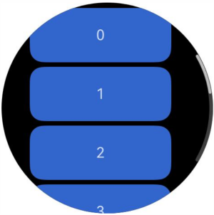

# ArcScrollBar

弧形滚动条组件ArcScrollBar，用于配合可滚动组件使用，如[ArcList](ts-container-arclist.md)、[List](ts-container-list.md)、[Grid](ts-container-grid.md)、[Scroll](ts-container-scroll.md)、[WaterFlow](ts-container-waterflow.md)。

>  **说明：**
>
>  - 该组件从API version 16开始支持。后续版本如有新增内容，则采用上角标单独标记该内容的起始版本。
>  - ArcScrollBar不设置宽高时，采用父组件的宽高。


## 子组件

不包含子组件。

## 接口

ArcScrollBar(options: ArcScrollBarOptions)

ArcScrollBar的构造函数。

**原子化服务API：** 从API version 16开始，该接口支持在原子化服务中使用。

**系统能力：** SystemCapability.ArkUI.ArkUI.Full

**参数：**

| 参数名 | 类型 | 必填 | 说明 |
| -------- | -------- | -------- | -------- |
| options |  [ArcScrollBarOptions](#arcscrollbaroptions)| 是 | 滚动条组件参数。 |

## ArcScrollBarOptions

ArcScrollBar的构造函数参数。

**原子化服务API：** 从API version 16开始，该接口支持在原子化服务中使用。

**系统能力：** SystemCapability.ArkUI.ArkUI.Full

| 名称 | 类型 | 必填 | 说明 |
| -------- | -------- | -------- | -------- |
| scroller | [Scroller](ts-container-scroll.md#scroller) | 是 | 可滚动组件的控制器，用于与可滚动组件进行绑定。 |
| state | [BarState](ts-appendix-enums.md#barstate) | 否 | 滚动条状态。<br/>默认值：BarState.Auto |

>  **说明：**
> 
> ArcScrollBar与可滚动组件需通过scroller进行绑定后方能实现联动，且ArcScrollBar与可滚动组件仅限于一对一的绑定方式。

## 示例

该示例通过ArcScrollBar与Scroll组件联动，设置了弧形外置滚动条。

```ts
import { ArcScrollBar } from '@kit.ArkUI';

@Entry
@Component
struct ArcScrollBarExample {
  private scroller: Scroller = new Scroller()
  private arr: number[] = [0, 1, 2, 3, 4, 5, 6, 7, 8, 9];

  build() {
    Column() {
      Stack({ alignContent: Alignment.Center }) {
        Scroll(this.scroller) {
          Flex({ direction: FlexDirection.Column }) {
            ForEach(this.arr, (item: number) => {
              Row() {
                Text(item.toString())
                  .width('80%')
                  .height(60)
                  .backgroundColor('#3366CC')
                  .borderRadius(15)
                  .fontSize(16)
                  .textAlign(TextAlign.Center)
                  .margin({ top: 5 })
              }
            }, (item: number) => item.toString())
          }.margin({ right: 15 })
        }
        .width('90%')
        .scrollBar(BarState.Off)
        .scrollable(ScrollDirection.Vertical)
        .edgeEffect(EdgeEffect.Spring)

        ArcScrollBar({ scroller: this.scroller, state: BarState.Auto })
      }
      .width('100%')
      .height('100%')
    }
    .justifyContent(FlexAlign.Center)
    .width('100%')
    .height('100%')
    .clip(new Circle({ width: '100%', height: '100%' }))
  }
}
```

