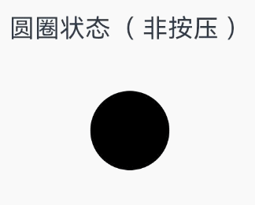
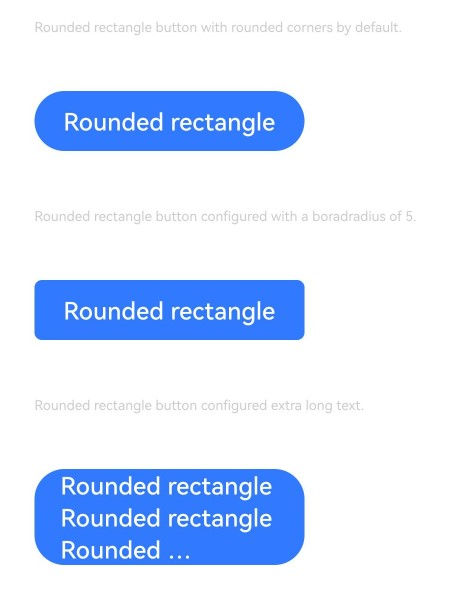

# Button
<!--Kit: ArkUI-->
<!--Subsystem: ArkUI-->
<!--Owner: @liyi0309-->
<!--SE: @liyi0309-->
<!--TSE: @lxl007-->

按钮组件，可快速创建不同样式的按钮。

>  **说明：**
>
>  该组件从API version 7开始支持。后续版本如有新增内容，则采用上角标单独标记该内容的起始版本。


## 子组件

可以包含单个子组件。


## 接口

### Button

Button(options: ButtonOptions)

创建可以包含单个子组件的按钮。

**卡片能力：** 从API version 9开始，该接口支持在ArkTS卡片中使用。

**原子化服务API：** 从API version 11开始，该接口支持在原子化服务中使用。

**系统能力：** SystemCapability.ArkUI.ArkUI.Full

**参数：** 

| 参数名  | 类型                                    | 必填 | 说明                 |
| ------- | --------------------------------------- | ---- | -------------------- |
| options | [ButtonOptions](#buttonoptions对象说明) | 是   | 配置按钮的显示样式。 |

### Button

Button(label: ResourceStr, options?: ButtonOptions)

使用文本内容创建相应的按钮组件，此时Button无法包含子组件。

文本内容默认单行显示。

**卡片能力：** 从API version 9开始，该接口支持在ArkTS卡片中使用。

**原子化服务API：** 从API version 11开始，该接口支持在原子化服务中使用。

**系统能力：** SystemCapability.ArkUI.ArkUI.Full

**参数：** 

| 参数名  | 类型                                    | 必填 | 说明                 |
| ------- | --------------------------------------- | ---- | -------------------- |
| label   | [ResourceStr](ts-types.md#resourcestr)  | 是   | 按钮文本内容。<br/>**说明：** 当文本字符的长度超过按钮本身的宽度时，文本将会被截断。 |
| options | [ButtonOptions](#buttonoptions对象说明) | 否   | 配置按钮的显示样式。 |

### Button

Button()

创建一个空按钮。

**卡片能力：** 从API version 9开始，该接口支持在ArkTS卡片中使用。

**原子化服务API：** 从API version 11开始，该接口支持在原子化服务中使用。

**系统能力：** SystemCapability.ArkUI.ArkUI.Full

## ButtonOptions对象说明

按钮的样式。

**系统能力：** SystemCapability.ArkUI.ArkUI.Full

| 名称                      | 类型                                          | 只读 | 可选 | 说明                                                       |
| ------------------------- | --------------------------------------------- | ---- | ------------------------------------------------------------ | ------------------------------------------------------------ |
| type                      | [ButtonType](#buttontype枚举说明)             | 否   | 是  | 按钮显示样式。<br/>默认值：ButtonType.ROUNDED_RECTANGLE<br/>从API version 18及之后，ButtonType的默认值修改为ButtonType.ROUNDED_RECTANGLE。API version 18之前的版本，ButtonType的默认值为ButtonType.Capsule。<br/>**卡片能力：** 从API version 9开始，该接口支持在ArkTS卡片中使用。<br/>**原子化服务API：** 从API version 11开始，该接口支持在原子化服务中使用。 |
| stateEffect               | boolean                                       | 否   | 是  | 按钮按下时是否开启按压态显示效果，当设置为false时，按压效果关闭。设置为true时，开启按压效果。<br/>默认值：true<br/>**说明：** <br/>当开启按压态显示效果，开发者设置状态样式时，会基于状态样式设置完成后的背景色再进行颜色叠加。<br/>**卡片能力：** 从API version 9开始，该接口支持在ArkTS卡片中使用。<br/>**原子化服务API：** 从API version 11开始，该接口支持在原子化服务中使用。 |
| buttonStyle<sup>11+</sup> | [ButtonStyleMode](#buttonstylemode11枚举说明) | 否   | 是  | 按钮的样式和重要程度。<br/>默认值：ButtonStyleMode.EMPHASIZED <br/>**说明：**  <br/>按钮重要程度：强调按钮>普通按钮>文字按钮。<br/>**卡片能力：** 从API version 11开始，该接口支持在ArkTS卡片中使用。<br/>**原子化服务API：** 从API version 12开始，该接口支持在原子化服务中使用。 |
| controlSize<sup>11+</sup> | [ControlSize](#controlsize11枚举说明)         | 否   | 是  | 按钮的尺寸。<br/>默认值：ControlSize.NORMAL<br/>**卡片能力：** 从API version 11开始，该接口支持在ArkTS卡片中使用。<br/>**原子化服务API：** 从API version 12开始，该接口支持在原子化服务中使用。 |
| role<sup>12+</sup> | [ButtonRole](#buttonrole12枚举说明)         | 否   | 是  | 按钮的角色。<br/>默认值：ButtonRole.NORMAL <br/>**卡片能力：** 从API version 12开始，该接口支持在ArkTS卡片中使用。<br/>**原子化服务API：** 从API version 12开始，该接口支持在原子化服务中使用。 |

## 属性

除支持[通用属性](ts-component-general-attributes.md)外，还支持以下属性：

### type

type(value: ButtonType)

设置Button样式。

**卡片能力：** 从API version 9开始，该接口支持在ArkTS卡片中使用。

**原子化服务API：** 从API version 11开始，该接口支持在原子化服务中使用。

**系统能力：** SystemCapability.ArkUI.ArkUI.Full

**参数：** 

| 参数名 | 类型                              | 必填 | 说明                                        |
| ------ | --------------------------------- | ---- | ------------------------------------------- |
| value  | [ButtonType](#buttontype枚举说明) | 是   | Button样式。<br/>从API version 18及之后，ButtonType的默认值修改为ButtonType.ROUNDED_RECTANGLE。API version 18之前的版本，ButtonType的默认值为ButtonType.Capsule。 |

### fontSize

fontSize(value: Length)

设置文本显示字号。

**卡片能力：** 从API version 9开始，该接口支持在ArkTS卡片中使用。

**原子化服务API：** 从API version 11开始，该接口支持在原子化服务中使用。

**系统能力：** SystemCapability.ArkUI.ArkUI.Full

**参数：** 

| 参数名 | 类型                         | 必填 | 说明                                                         |
| ------ | ---------------------------- | ---- | ------------------------------------------------------------ |
| value  | [Length](ts-types.md#length) | 是   | 文本显示字号。<br/>默认值：当controlSize为ControlSize.NORMAL时，默认值为`$r('sys.float.Body_L')`。<br/>当controlSize为ControlSize.SMALL时，默认值为`$r('sys.float.Body_S')`。<br/>**说明**：设置string类型时，不支持百分比。 |

### fontColor

fontColor(value: ResourceColor)

设置文本显示颜色。

**卡片能力：** 从API version 9开始，该接口支持在ArkTS卡片中使用。

**原子化服务API：** 从API version 11开始，该接口支持在原子化服务中使用。

**系统能力：** SystemCapability.ArkUI.ArkUI.Full

**参数：** 

| 参数名 | 类型                                       | 必填 | 说明                                                         |
| ------ | ------------------------------------------ | ---- | ------------------------------------------------------------ |
| value  | [ResourceColor](ts-types.md#resourcecolor) | 是   | 文本显示颜色。<br/>默认值：$r('sys.color.font_on_primary')，显示为白色字体。 |

### fontWeight

fontWeight(value: number&nbsp;|&nbsp;FontWeight&nbsp;|&nbsp;string)

设置文本的字体粗细。

**卡片能力：** 从API version 9开始，该接口支持在ArkTS卡片中使用。

**原子化服务API：** 从API version 11开始，该接口支持在原子化服务中使用。

**系统能力：** SystemCapability.ArkUI.ArkUI.Full

**参数：** 

| 参数名 | 类型                                                         | 必填 | 说明                                                         |
| ------ | ------------------------------------------------------------ | ---- | ------------------------------------------------------------ |
| value  | number&nbsp;\|&nbsp;[FontWeight](ts-appendix-enums.md#fontweight)&nbsp;\|&nbsp;string | 是   | 文本的字体粗细，number类型取值[100, 900]，取值间隔为100，取值越大，字体越粗。<br>默认值：500<br/>string类型仅支持number类型取值的字符串形式，例如'400'，以及'bold'、'bolder'、'lighter'、'regular'、'medium'，分别对应FontWeight中相应的枚举值。<br/>当值为异常值或非法值时，字体粗细取值为400。 |

### fontStyle<sup>8+</sup>

fontStyle(value: FontStyle)

设置文本的字体样式。

**卡片能力：** 从API version 9开始，该接口支持在ArkTS卡片中使用。

**原子化服务API：** 从API version 11开始，该接口支持在原子化服务中使用。

**系统能力：** SystemCapability.ArkUI.ArkUI.Full

**参数：** 

| 参数名 | 类型                                        | 必填 | 说明                                            |
| ------ | ------------------------------------------- | ---- | ----------------------------------------------- |
| value  | [FontStyle](ts-appendix-enums.md#fontstyle) | 是   | 文本的字体样式。<br/>默认值：FontStyle.Normal |

### stateEffect

stateEffect(value: boolean)

设置是否开启按压态显示效果。

**卡片能力：** 从API version 9开始，该接口支持在ArkTS卡片中使用。

**原子化服务API：** 从API version 11开始，该接口支持在原子化服务中使用。

**系统能力：** SystemCapability.ArkUI.ArkUI.Full

**参数：** 

| 参数名 | 类型    | 必填 | 说明                                                         |
| ------ | ------- | ---- | ------------------------------------------------------------ |
| value  | boolean | 是   | 按钮按下时是否开启按压态显示效果，当设置为false时，按压效果关闭。设置为true时，开启按压效果。<br/>默认值：true |

>  **说明：**
> 
>  使用多态样式设置按压态时，需优先设置stateEffect为false，防止内置按压态与多态样式按压态冲突。

### fontFamily<sup>8+</sup>

fontFamily(value: string | Resource)

设置字体列表。

**卡片能力：** 从API version 9开始，该接口支持在ArkTS卡片中使用。

**原子化服务API：** 从API version 11开始，该接口支持在原子化服务中使用。

**系统能力：** SystemCapability.ArkUI.ArkUI.Full

**参数：** 

| 参数名 | 类型                                                 | 必填 | 说明                                                         |
| ------ | ---------------------------------------------------- | ---- | ------------------------------------------------------------ |
| value  | string&nbsp;\|&nbsp;[Resource](ts-types.md#resource) | 是   | 字体列表。默认字体'HarmonyOS Sans'，当前支持'HarmonyOS Sans'字体和[注册自定义字体](../js-apis-font.md)。 |

### labelStyle<sup>10+</sup>

labelStyle(value: LabelStyle)

设置Button组件label文本和字体的样式。

**原子化服务API：** 从API version 11开始，该接口支持在原子化服务中使用。

**系统能力：** SystemCapability.ArkUI.ArkUI.Full

**参数：** 

| 参数名 | 类型                                | 必填 | 说明                              |
| ------ | ----------------------------------- | ---- | --------------------------------- |
| value  | [LabelStyle](#labelstyle10对象说明) | 是   | Button组件label文本和字体的样式。 |

### buttonStyle<sup>11+</sup>

buttonStyle(value: ButtonStyleMode)

设置Button组件的样式和重要程度。

**卡片能力：** 从API version 11开始，该接口支持在ArkTS卡片中使用。

**原子化服务API：** 从API version 12开始，该接口支持在原子化服务中使用。

**系统能力：** SystemCapability.ArkUI.ArkUI.Full

**参数：** 

| 参数名 | 类型                                          | 必填 | 说明                                                         |
| ------ | --------------------------------------------- | ---- | ------------------------------------------------------------ |
| value  | [ButtonStyleMode](#buttonstylemode11枚举说明) | 是   | Button组件的样式和重要程度。<br/>默认值：ButtonStyleMode.EMPHASIZED |

### controlSize<sup>11+</sup>

controlSize(value: ControlSize)

设置Button组件的尺寸。

**卡片能力：** 从API version 11开始，该接口支持在ArkTS卡片中使用。

**原子化服务API：** 从API version 12开始，该接口支持在原子化服务中使用。

**系统能力：** SystemCapability.ArkUI.ArkUI.Full

**参数：** 

| 参数名 | 类型                                  | 必填 | 说明                                              |
| ------ | ------------------------------------- | ---- | ------------------------------------------------- |
| value  | [ControlSize](#controlsize11枚举说明) | 是   | Button组件的尺寸。<br/>默认值：ControlSize.NORMAL |

### role<sup>12+</sup>

role(value: ButtonRole)

设置Button组件的角色。

**卡片能力：** 从API version 12开始，该接口支持在ArkTS卡片中使用。

**原子化服务API：** 从API version 12开始，该接口支持在原子化服务中使用。

**系统能力：** SystemCapability.ArkUI.ArkUI.Full

**参数：** 

| 参数名 | 类型                                | 必填 | 说明                                                 |
| ------ | ----------------------------------- | ---- | ---------------------------------------------------- |
| value  | [ButtonRole](#buttonrole12枚举说明) | 是   | 设置Button组件的角色。<br/>默认值：ButtonRole.NORMAL |

### contentModifier<sup>12+</sup>

contentModifier(modifier: ContentModifier\<ButtonConfiguration>)

定制Button内容区的方法。

**原子化服务API：** 从API version 12开始，该接口支持在原子化服务中使用。

**系统能力：** SystemCapability.ArkUI.ArkUI.Full

**参数：**

| 参数名 | 类型                                          | 必填 | 说明                                             |
| ------ | --------------------------------------------- | ---- | ------------------------------------------------ |
| modifier  | [ContentModifier\<ButtonConfiguration>](#buttonconfiguration12对象说明) | 是   | 在Button组件上，定制内容区的方法。<br/>modifier：内容修改器，开发者需要自定义class实现ContentModifier接口。 |

### minFontScale<sup>18+</sup>

minFontScale(scale: number | Resource)

设置文本最小的字体缩放倍数。

**原子化服务API：** 从API version 18开始，该接口支持在原子化服务中使用。

**系统能力：** SystemCapability.ArkUI.ArkUI.Full

**参数：** 

| 参数名 | 类型                                          | 必填 | 说明                                          |
| ------ | --------------------------------------------- | ---- | --------------------------------------------- |
| scale  | number \| [Resource](ts-types.md#resource) | 是   | 文本最小的字体缩放倍数。<br/>取值范围：[0, 1]<br/>**说明：** <br/>设置的值小于0时，按值为0处理，设置的值大于1，按值为1处理，异常值默认不生效。 |

### maxFontScale<sup>18+</sup>

maxFontScale(scale: number | Resource)

设置文本最大的字体缩放倍数。

**原子化服务API：** 从API version 18开始，该接口支持在原子化服务中使用。

**系统能力：** SystemCapability.ArkUI.ArkUI.Full

**参数：** 

| 参数名 | 类型                                          | 必填 | 说明                                          |
| ------ | --------------------------------------------- | ---- | --------------------------------------------- |
| scale  | number \| [Resource](ts-types.md#resource) | 是   | 文本最大的字体缩放倍数。<br/>取值范围：[1, +∞)<br/>**说明：** <br/>设置的值小于1时，按值为1处理，异常值默认不生效。<br/>未设置最大缩放倍数时，圆形按钮最大缩放倍数为1倍，胶囊型按钮、普通按钮、圆角矩形按钮最大缩放倍数跟随系统设置。 |

## ButtonType枚举说明

按钮的类型。

**系统能力：** SystemCapability.ArkUI.ArkUI.Full

| 名称      | 说明               |
| ------- | ------------------ |
| Capsule | 胶囊型按钮（圆角默认为高度的一半）。**<br>卡片能力：** 从API version 9开始，该接口支持在ArkTS卡片中使用。**<br>原子化服务API：** 从API version 11开始，该接口支持在原子化服务中使用。 |
| Circle  | 圆形按钮。**<br>卡片能力：** 从API version 9开始，该接口支持在ArkTS卡片中使用。**<br>原子化服务API：** 从API version 11开始，该接口支持在原子化服务中使用。              |
| Normal  | 普通按钮（默认不带圆角）。 **<br>卡片能力：** 从API version 9开始，该接口支持在ArkTS卡片中使用。**<br>原子化服务API：** 从API version 11开始，该接口支持在原子化服务中使用。     |
| ROUNDED_RECTANGLE<sup>15+</sup> | 圆角矩形按钮（默认值：controlSize为NORMAL，圆角大小20vp，controlSize为SMALL，圆角大小14vp）。**<br>卡片能力：** 从API version 15开始，该接口支持在ArkTS卡片中使用。**<br>原子化服务API：** 从API version 15开始，该接口支持在原子化服务中使用。 |

>  **说明：**
>  - 按钮圆角通过[通用属性borderRadius](ts-universal-attributes-border.md#borderradius)设置。
>  - 当按钮类型为Capsule时，borderRadius设置不生效，按钮圆角始终为宽、高中较小值的一半。
>  - 当按钮类型为Circle时，若同时设置了宽和高，则borderRadius不生效，且按钮半径为宽高中较小值的一半；若只设置宽、高中的一个，则borderRadius不生效，且按钮半径为所设宽或所设高值的一半；若不设置宽高，则borderRadius为按钮半径；若borderRadius的值为负，则borderRadius的值按照0处理。
>  - 按钮文本通过[fontSize](#fontsize)、[fontColor](#fontcolor)、[fontStyle](#fontstyle8)、[fontFamily](#fontfamily8)、[fontWeight](#fontweight)进行设置。
>  - 设置[颜色渐变](ts-universal-attributes-gradient-color.md)需先设置[backgroundColor](ts-universal-attributes-background.md#backgroundcolor)为透明色。
>  - 在不设置borderRadius时，圆角矩形按钮的圆角大小保持默认值不变。圆角大小不会随按钮高度变化而变化，和controlSize属性有关，controlSize为NORMAL时圆角大小20vp，controlSize为SMALL时圆角大小14vp。
>  - 设置Button的[border](ts-universal-attributes-border.md#border)时，会有默认的[borderRadius](ts-universal-attributes-border.md#borderradius)值。如果同时使用`border`和`borderRadius`，需将`borderRadius`放在`border`之后，以确保`borderRadius`不会被`border`中的默认`radius`覆盖。
按钮中文本的显示样式。

## LabelStyle<sup>10+</sup>对象说明

**原子化服务API：** 从API version 11开始，该接口支持在原子化服务中使用。

**系统能力：** SystemCapability.ArkUI.ArkUI.Full

| 名称                 | 类型                                                         | 只读 | 可选 | 说明                                                         |
| -------------------- | ------------------------------------------------------------ | ---- | ---- | ------------------------------------------------------------ |
| overflow             | [TextOverflow](ts-appendix-enums.md#textoverflow)            | 否   | 是   | 设置label文本超长时的显示方式。文本截断是按字截断。例如，英文以单词为最小单位进行截断，若需要以字母为单位进行截断，可在字母间添加零宽空格。<br>默认值：TextOverflow.Ellipsis |
| maxLines             | number                                                       | 否   | 是   | 设置label文本的最大行数。如果指定此参数，则文本最多不会超过指定的行。如果有多余的文本，可以通过overflow来指定截断方式。<br>默认值：1 |
| minFontSize          | number \| [ResourceStr](ts-types.md#resourcestr)             | 否   | 是   | 设置label文本最小显示字号。需配合maxFontSize以及maxLines或布局大小限制使用。<br/>**说明：**  <br/>minFontSize小于或等于0时，自适应字号不生效。 |
| maxFontSize          | number \| [ResourceStr](ts-types.md#resourcestr)             | 否   | 是   | 设置label文本最大显示字号。需配合minFontSize以及maxLines或布局大小限制使用。 |
| heightAdaptivePolicy | [TextHeightAdaptivePolicy](ts-appendix-enums.md#textheightadaptivepolicy10) | 否   | 是   | 设置label文本自适应高度的方式。<br>默认值：TextHeightAdaptivePolicy.MAX_LINES_FIRST |
| font                 | [Font](ts-types.md#font)                                     | 否   | 是   | 设置label文本字体样式。<br>默认值：默认值参考[Font](ts-types.md#font)。 |

## ButtonStyleMode<sup>11+</sup>枚举说明

按钮的重要程度。

**卡片能力：** 从API version 11开始，该接口支持在ArkTS卡片中使用。

**原子化服务API：** 从API version 12开始，该接口支持在原子化服务中使用。

**系统能力：** SystemCapability.ArkUI.ArkUI.Full

| 名称      | 值 | 说明               |
| ------- | -- |------------------ |
| NORMAL  | 0 |普通按钮（一般界面操作）。              |
| EMPHASIZED | 1 |强调按钮（用于强调当前操作）。 |
| TEXTUAL  | 2 |文本按钮（纯文本，无背景颜色）。      |

## ControlSize<sup>11+</sup>枚举说明

按钮的尺寸。

**卡片能力：** 从API version 11开始，该接口支持在ArkTS卡片中使用。

**原子化服务API：** 从API version 12开始，该接口支持在原子化服务中使用。

**系统能力：** SystemCapability.ArkUI.ArkUI.Full

| 名称      | 值 |说明               |
| ------- | -- |------------------ |
| SMALL | "small" |小尺寸按钮。 |
| NORMAL  | "normal" |正常尺寸按钮。              |

## ButtonRole<sup>12+</sup>枚举说明

按钮的角色。

**卡片能力：** 从API version 12开始，该接口支持在ArkTS卡片中使用。

**原子化服务API：** 从API version 12开始，该接口支持在原子化服务中使用。

**系统能力：** SystemCapability.ArkUI.ArkUI.Full

| 名称      | 值 |说明               |
| ------- | -- |------------------ |
| NORMAL | 0 |正常按钮。 |
| ERROR  | 1 |警示按钮。              |

## ButtonConfiguration<sup>12+</sup>对象说明

开发者需要自定义class实现ContentModifier接口。

**原子化服务API：** 从API version 12开始，该接口支持在原子化服务中使用。

**系统能力：** SystemCapability.ArkUI.ArkUI.Full

| 名称  | 类型    | 只读  | 可选 | 说明              |
| ------ | ------ | ---------------- | ---------------- | ---------------- |
| label | string | 否 | 否 | Button的文本标签。<br/>**说明**：当文本字符的长度超过按钮本身的宽度时，文本将会被截断。 |
| pressed | boolean | 否 | 否 | 指示是否按下Button。值为true时，表示按下，值为false时，表示未按下。<br/>**说明：**  <br/>此属性指示的是原本Button是否被按压，而非build出来的新组件。若新build出来的组件超过原本组件的大小，那么超出部分按压不触发。<br/>默认值：false |
| triggerClick | [ButtonTriggerClickCallback](#buttontriggerclickcallback12) | 否 | 否 | 使用builder新构建出来组件的点击事件。 |

## ButtonTriggerClickCallback<sup>12+</sup>

type ButtonTriggerClickCallback = (xPos: number, yPos: number) => void

定义ButtonConfiguration中使用的回调类型。

**原子化服务API：** 从API version 12开始，该接口支持在原子化服务中使用。

**系统能力：** SystemCapability.ArkUI.ArkUI.Full

**参数：** 

| 参数名  | 类型    | 必填 | 说明              |
| ------ | ------ | ---- | ---------------- |
| xPos | number | 是 | 点击位置x的坐标。<br/>单位：vp |
| yPos | number | 是 | 点击位置y的坐标。<br/>单位：vp |

## 事件

支持[通用事件](ts-component-general-events.md)。
## 示例

### 示例1（设置按钮的显示样式）

该示例实现了两种创建按钮的方式，包含子组件或使用文本内容创建相应的按钮。

```ts
// xxx.ets
@Entry
@Component
struct ButtonExample {
  build() {
    Flex({ direction: FlexDirection.Column, alignItems: ItemAlign.Start, justifyContent: FlexAlign.SpaceBetween }) {
      Text('Normal button').fontSize(9).fontColor(0xCCCCCC)
      Flex({ alignItems: ItemAlign.Center, justifyContent: FlexAlign.SpaceBetween }) {
        Button('OK', { type: ButtonType.Normal, stateEffect: true })
          .borderRadius(8)
          .backgroundColor(0x317aff)
          .width(90)
          .onClick(() => {
            console.info('ButtonType.Normal');
          })
        Button({ type: ButtonType.Normal, stateEffect: true }) {
          Row() {
            LoadingProgress().width(20).height(20).margin({ left: 12 }).color(0xFFFFFF)
            Text('loading').fontSize(12).fontColor(0xffffff).margin({ left: 5, right: 12 })
          }.alignItems(VerticalAlign.Center)
        }.borderRadius(8).backgroundColor(0x317aff).width(90).height(40)

        Button('Disable', { type: ButtonType.Normal, stateEffect: false }).opacity(0.4)
          .borderRadius(8).backgroundColor(0x317aff).width(90)
      }

      Text('Capsule button').fontSize(9).fontColor(0xCCCCCC)
      Flex({ alignItems: ItemAlign.Center, justifyContent: FlexAlign.SpaceBetween }) {
        Button('OK', { type: ButtonType.Capsule, stateEffect: true }).backgroundColor(0x317aff).width(90)
        Button({ type: ButtonType.Capsule, stateEffect: true }) {
          Row() {
            LoadingProgress().width(20).height(20).margin({ left: 12 }).color(0xFFFFFF)
            Text('loading').fontSize(12).fontColor(0xffffff).margin({ left: 5, right: 12 })
          }.alignItems(VerticalAlign.Center).width(90).height(40)
        }.backgroundColor(0x317aff)

        Button('Disable', { type: ButtonType.Capsule, stateEffect: false }).opacity(0.4)
          .backgroundColor(0x317aff).width(90)
      }

      Text('Circle button').fontSize(9).fontColor(0xCCCCCC)
      Flex({ alignItems: ItemAlign.Center, wrap: FlexWrap.Wrap }) {
        Button({ type: ButtonType.Circle, stateEffect: true }) {
          LoadingProgress().width(20).height(20).color(0xFFFFFF)
        }.width(55).height(55).backgroundColor(0x317aff)

        Button({ type: ButtonType.Circle, stateEffect: true }) {
          LoadingProgress().width(20).height(20).color(0xFFFFFF)
        }.width(55).height(55).margin({ left: 20 }).backgroundColor(0xF55A42)
      }
    }.height(400).padding({ left: 35, right: 35, top: 35 })
  }
}
```


### 示例2 （为按钮添加渲染控制）

该示例通过if/else控制按钮的显示文本。

```ts
// xxx.ets
@Entry
@Component
struct SwipeGestureExample {
  @State count: number = 0;

  build() {
    Column() {
      Text(`${this.count}`)
        .fontSize(30)
        .onClick(() => {
          this.count++;
        })
      if (this.count <= 0) {
        Button('count is negative').fontSize(30).height(50)
      } else if (this.count % 2 === 0) {
        Button('count is even').fontSize(30).height(50)
      } else {
        Button('count is odd').fontSize(30).height(50)
      }
    }.height('100%').width('100%').justifyContent(FlexAlign.Center)
  }
}
```


### 示例3 （设置按钮文本样式）

该示例通过配置labelStyle自定义按钮文本的显示样式。

```ts
// xxx.ets
@Entry
@Component
struct buttonTestDemo {
  @State txt: string = 'overflowTextOverlengthTextOverflow.Clip';
  @State widthShortSize: number = 205;

  build() {
    Row() {
      Column() {
        Button(this.txt)
          .type(ButtonType.Capsule)
          .width(this.widthShortSize)
          .height(100)
          .backgroundColor(0x317aff)
          .labelStyle({ overflow: TextOverflow.Clip,
            maxLines: 1,
            minFontSize: 20,
            maxFontSize: 20,
            font: {
              size: 20,
              weight: FontWeight.Bolder,
              family: 'cursive',
              style: FontStyle.Italic
            }
          })
          .fontSize(40)
      }
      .width('100%')
    }
    .height('100%')
  }
}
```


### 示例4（设置不同尺寸按钮的重要程度）

该示例通过配置controlSize、buttonStyle实现不同尺寸按钮的重要程度。

```ts
// xxx.ets
@Entry
@Component
struct ButtonExample {
  build() {
    Flex({ direction: FlexDirection.Column, alignItems: ItemAlign.Start, justifyContent: FlexAlign.SpaceBetween }) {
      Text('Normal size button').fontSize(9).fontColor(0xCCCCCC)
      Flex({ alignItems: ItemAlign.Center, justifyContent: FlexAlign.SpaceBetween }) {
        Button('Emphasized', { buttonStyle: ButtonStyleMode.EMPHASIZED });
        Button('Normal', { buttonStyle: ButtonStyleMode.NORMAL });
        Button('Textual', { buttonStyle: ButtonStyleMode.TEXTUAL });
      }

      Text('Small size button').fontSize(9).fontColor(0xCCCCCC)
      Flex({ alignItems: ItemAlign.Center, justifyContent: FlexAlign.SpaceBetween }) {
        Button('Emphasized', { controlSize: ControlSize.SMALL, buttonStyle: ButtonStyleMode.EMPHASIZED });
        Button('Normal', { controlSize: ControlSize.SMALL, buttonStyle: ButtonStyleMode.NORMAL });
        Button('Textual', { controlSize: ControlSize.SMALL, buttonStyle: ButtonStyleMode.TEXTUAL });
      }

      Text('Small size button').fontSize(9).fontColor(0xCCCCCC)
      Flex({ alignItems: ItemAlign.Center, justifyContent: FlexAlign.SpaceBetween }) {
        Button('Emphasized').controlSize(ControlSize.SMALL).buttonStyle(ButtonStyleMode.EMPHASIZED);
        Button('Normal').controlSize(ControlSize.SMALL).buttonStyle(ButtonStyleMode.NORMAL);
        Button('Textual').controlSize(ControlSize.SMALL).buttonStyle(ButtonStyleMode.TEXTUAL);
      }

    }.height(400).padding({ left: 35, right: 35, top: 35 })
  }
}
```


### 示例5（设置按钮的角色）

该示例通过配置role实现按钮的角色。

```ts
// xxx.ets
@Entry
@Component
struct ButtonExample {
  build() {
    Flex({ direction: FlexDirection.Column, alignItems: ItemAlign.Start, justifyContent: FlexAlign.SpaceBetween }) {
      Text('Role is Normal button').fontSize(9).fontColor(0xCCCCCC)
      Flex({ alignItems: ItemAlign.Center, justifyContent: FlexAlign.SpaceBetween }) {
        Button('Emphasized', { buttonStyle: ButtonStyleMode.EMPHASIZED, role: ButtonRole.NORMAL });
        Button('Normal', { buttonStyle: ButtonStyleMode.NORMAL, role: ButtonRole.NORMAL });
        Button('Textual', { buttonStyle: ButtonStyleMode.TEXTUAL, role: ButtonRole.NORMAL });
      }
      Text('Role is Error button').fontSize(9).fontColor(0xCCCCCC)
      Flex({ alignItems: ItemAlign.Center, justifyContent: FlexAlign.SpaceBetween }) {
        Button('Emphasized', { buttonStyle: ButtonStyleMode.EMPHASIZED, role: ButtonRole.ERROR});
        Button('Normal', { buttonStyle: ButtonStyleMode.NORMAL, role: ButtonRole.ERROR });
        Button('Textual', { buttonStyle: ButtonStyleMode.TEXTUAL, role: ButtonRole.ERROR });
      }
    }.height(200).padding({ left: 15, right: 15, top: 35 })
  }
}
```


### 示例6（设置自定义样式按钮）
该示例实现了自定义样式的功能，自定义样式实现了一个圆圈替换原本的按钮样式。如果按压，圆圈将变成红色，标题会显示按压字样；如果没有按压，圆圈将变成黑色，标题会显示非按压字样。
```ts
class MyButtonStyle implements ContentModifier<ButtonConfiguration> {
  x: number = 0;
  y: number = 0;
  selectedColor: Color = Color.Black;

  constructor(x: number, y: number, colorType: Color) {
    this.x = x;
    this.y = y;
    this.selectedColor = colorType;
  }

  applyContent(): WrappedBuilder<[ButtonConfiguration]> {
    return wrapBuilder(buildButton1);
  }
}

@Builder
function buildButton1(config: ButtonConfiguration) {
  Column({ space: 30 }) {
    Text(config.enabled ? "enabled true" : "enabled false")
    Text('圆圈状态' + (config.pressed ? "（ 按压 ）" : "（ 非按压 ）"))
    Text('点击位置x坐标：' + (config.enabled ? (config.contentModifier as MyButtonStyle).x : "0"))
    Text('点击位置y坐标：' + (config.enabled ? (config.contentModifier as MyButtonStyle).y : "0"))
    Circle({ width: 50, height: 50 })
      .fill(config.pressed ? (config.contentModifier as MyButtonStyle).selectedColor : Color.Black)
      .gesture(
        TapGesture({ count: 1 }).onAction((event: GestureEvent) => {
          config.triggerClick(event.fingerList[0].localX, event.fingerList[0].localY)
        })).opacity(config.enabled ? 1 : 0.1)
  }
}

@Entry
@Component
struct ButtonExample {
  @State buttonEnabled: boolean = true;
  @State positionX: number = 0;
  @State positionY: number = 0;
  @State state: boolean[] = [true, false];
  @State index: number = 0;

  build() {
    Column() {
      Button('OK')
        .contentModifier(new MyButtonStyle(this.positionX, this.positionY, Color.Red))
        .onClick((event) => {
          console.info('change' + JSON.stringify(event));
          this.positionX = event.displayX;
          this.positionY = event.displayY;
        }).enabled(this.buttonEnabled)
      Row() {
        Toggle({ type: ToggleType.Switch, isOn: true }).onChange((value: boolean) => {
          if (value) {
            this.buttonEnabled = true;
          } else {
            this.buttonEnabled = false;
          }
        }).margin({ left: -80 })
      }
    }.height('100%').width('100%').justifyContent(FlexAlign.Center)
  }
}
```


### 示例7（设置圆角矩形按钮）
该示例通过配置ButtonType.ROUNDED_RECTANGLE创建圆角矩形按钮。
```ts
@Entry
@Component
struct ButtonExample {
  build() {
    Flex({ direction: FlexDirection.Column, alignItems: ItemAlign.Start, justifyContent: FlexAlign.SpaceBetween }) {
      Text('Rounded rectangle button with rounded corners by default.').fontSize(9).fontColor(0xCCCCCC)
      Flex({ alignItems: ItemAlign.Center, justifyContent: FlexAlign.SpaceBetween }) {
        Button('Rounded rectangle')
          .type(ButtonType.ROUNDED_RECTANGLE)
          .backgroundColor(0x317aff)
          .controlSize(ControlSize.NORMAL)
          .width(180)
      }
      Text('Rounded rectangle button configured with a borderRadius of 5.').fontSize(9).fontColor(0xCCCCCC)
      Flex({ alignItems: ItemAlign.Center, justifyContent: FlexAlign.SpaceBetween }) {
        Button('Rounded rectangle')
          .type(ButtonType.ROUNDED_RECTANGLE)
          .backgroundColor(0x317aff)
          .controlSize(ControlSize.NORMAL)
          .width(180)
          .borderRadius(5)
      }
      Text('Rounded rectangle button configured extra long text.').fontSize(9).fontColor(0xCCCCCC)
      Flex({ alignItems: ItemAlign.Center, justifyContent: FlexAlign.SpaceBetween }) {
        Button('Rounded rectangle Rounded rectangle Rounded rectangle Rounded rectangle')
          .type(ButtonType.ROUNDED_RECTANGLE)
          .backgroundColor(0x317aff)
          .width(180)
          .labelStyle({overflow:TextOverflow.Ellipsis, maxLines:3, minFontSize: 0})
      }
    }.height(400).padding({ left: 35, right: 35, top: 35 })
  }
}
```
