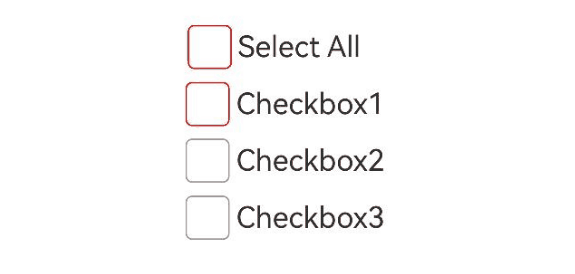
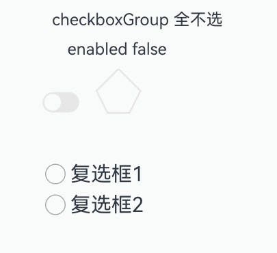
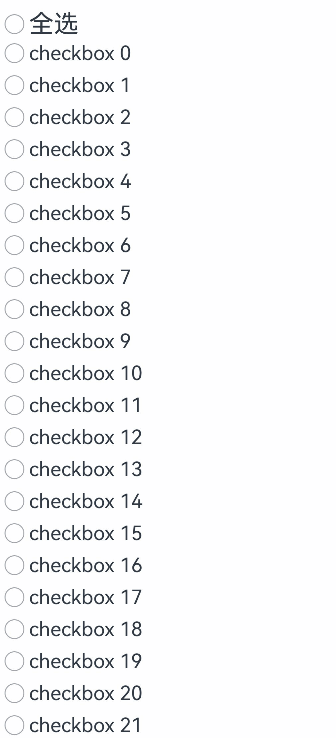

# CheckboxGroup
<!--Kit: ArkUI-->
<!--Subsystem: ArkUI-->
<!--Owner: @houguobiao-->
<!--Designer: @houguobiao-->
<!--Tester: @lxl007-->
<!--Adviser: @HelloCrease-->

多选框群组，用于控制多选框全选或者不全选状态。

>  **说明：**
>
>  该组件从API version 8开始支持。后续版本如有新增内容，则采用上角标单独标记该内容的起始版本。

## 子组件

无

## 接口

CheckboxGroup(options?: CheckboxGroupOptions)

创建多选框群组，用于控制群组内Checkbox的全选或取消全选状态，具有相同group值的Checkbox和CheckboxGroup属于同一群组。

在结合带缓存组件使用时(如List)，未被创建的Checkbox选中状态需要应用手动控制。详细示例请参考[示例4](#示例4设置全选)。

**卡片能力：** 从API version 9开始，该接口支持在ArkTS卡片中使用。

**原子化服务API：** 从API version 11开始，该接口支持在原子化服务中使用。

**系统能力：** SystemCapability.ArkUI.ArkUI.Full

**参数：** 

| 参数名  | 类型                                                  | 必填 | 说明                 |
| ------- | ----------------------------------------------------- | ---- | -------------------- |
| options | [CheckboxGroupOptions](#checkboxgroupoptions对象说明) | 否   | 配置多选框群组参数。 |

## CheckboxGroupOptions对象说明

多选框群组的信息。

**卡片能力：** 从API version 9开始，该接口支持在ArkTS卡片中使用。

**原子化服务API：** 从API version 11开始，该接口支持在原子化服务中使用。

**系统能力：** SystemCapability.ArkUI.ArkUI.Full

| 名称 | 类型 | 只读 | 可选 | 说明 |
| -------- | -------- | -------- | -------- | -------- |
| group | string | 否 | 是 | 群组名称。<br/>**说明：** <br/>具有相同群组名称的多个CheckboxGroup，仅第一个CheckboxGroup生效。 |

## 属性

除支持[通用属性](ts-component-general-attributes.md)外，还支持以下属性：

### selectAll

selectAll(value: boolean)

设置是否全选。若同组的[Checkbox](ts-basic-components-checkbox.md)显式设置了select属性，则Checkbox的优先级高。

在与带有缓存功能的组件（如[List](ts-container-list.md)）配合使用时，未创建的Checkbox选中状态需由开发者控制。

从API version 10开始，该属性支持[$$](../../../ui/state-management/arkts-two-way-sync.md)双向绑定变量。
从API version 18开始，该属性支持[!!](../../../ui/state-management/arkts-new-binding.md#系统组件参数双向绑定)双向绑定变量。

**卡片能力：** 从API version 9开始，该接口支持在ArkTS卡片中使用。

**原子化服务API：** 从API version 11开始，该接口支持在原子化服务中使用。

**系统能力：** SystemCapability.ArkUI.ArkUI.Full

**参数：** 

| 参数名 | 类型    | 必填 | 说明                                                         |
| ------ | ------- | ---- | ------------------------------------------------------------ |
| value  | boolean | 是   | 是否全选。<br/>默认值：false<br/>值为true时，多选框群组将全部被选中；值为false时，多选框群组将全部取消选中。 |

### selectAll<sup>18+</sup>

selectAll(isAllSelected: Optional\<boolean>)

设置是否全选。若同组的[Checkbox](ts-basic-components-checkbox.md)显式设置了select属性，则Checkbox的优先级高。与[selectAll](#selectall)相比，isAllSelected参数新增了对undefined类型的支持。

在与带有缓存功能的组件（如[List](ts-container-list.md)）配合使用时，未创建的Checkbox选中状态需由开发者控制。

该属性支持[$$](../../../ui/state-management/arkts-two-way-sync.md)、[!!](../../../ui/state-management/arkts-new-binding.md#系统组件参数双向绑定)双向绑定变量。

**卡片能力：** 从API version 18开始，该接口支持在ArkTS卡片中使用。

**原子化服务API：** 从API version 18开始，该接口支持在原子化服务中使用。

**系统能力：** SystemCapability.ArkUI.ArkUI.Full

**参数：** 

| 参数名        | 类型                                                         | 必填 | 说明                                                         |
| ------------- | ------------------------------------------------------------ | ---- | ------------------------------------------------------------ |
| isAllSelected | [Optional](ts-universal-attributes-custom-property.md#optionalt12)\<boolean> | 是   | 是否全选。<br/>当isAllSelected的值为undefined时取默认值false。<br/>值为true时，多选框群组将全部被选中；值为false时，多选框群组将全部取消选中。 |

### selectedColor

selectedColor(value: ResourceColor)

设置被选中或部分选中状态的颜色。	

**卡片能力：** 从API version 9开始，该接口支持在ArkTS卡片中使用。

**原子化服务API：** 从API version 11开始，该接口支持在原子化服务中使用。

**系统能力：** SystemCapability.ArkUI.ArkUI.Full

**参数：** 

| 参数名 | 类型                                       | 必填 | 说明                                                         |
| ------ | ------------------------------------------ | ---- | ------------------------------------------------------------ |
| value  | [ResourceColor](ts-types.md#resourcecolor) | 是   | 被选中或部分选中状态的颜色。<br/>默认值：$r('sys.color.ohos_id_color_text_primary_activated')<br/>异常值按照默认值处理。 |

### selectedColor<sup>18+</sup>

selectedColor(resColor: Optional\<ResourceColor>)

设置被选中或部分选中状态的颜色。与[selectedColor](#selectedcolor)相比，resColor参数新增了对undefined类型的支持。

**卡片能力：** 从API version 18开始，该接口支持在ArkTS卡片中使用。

**原子化服务API：** 从API version 18开始，该接口支持在原子化服务中使用。

**系统能力：** SystemCapability.ArkUI.ArkUI.Full

**参数：** 

| 参数名   | 类型                                                         | 必填 | 说明                                                         |
| -------- | ------------------------------------------------------------ | ---- | ------------------------------------------------------------ |
| resColor | [Optional](ts-universal-attributes-custom-property.md#optionalt12)\<[ResourceColor](ts-types.md#resourcecolor)> | 是   | 被选中或部分选中状态的颜色。<br/>当resColor的值为undefined时，默认值：$r('sys.color.ohos_id_color_text_primary_activated')<br/>异常值按照默认值处理。 |

### unselectedColor<sup>10+</sup>

unselectedColor(value: ResourceColor)

设置非选中状态边框颜色。

**原子化服务API：** 从API version 11开始，该接口支持在原子化服务中使用。

**系统能力：** SystemCapability.ArkUI.ArkUI.Full

**参数：** 

| 参数名 | 类型                                       | 必填 | 说明                                                         |
| ------ | ------------------------------------------ | ---- | ------------------------------------------------------------ |
| value  | [ResourceColor](ts-types.md#resourcecolor) | 是   | 非选中状态边框颜色。<br/>默认值：$r('sys.color.ohos_id_color_switch_outline_off')。 |

### unselectedColor<sup>18+</sup>

unselectedColor(resColor: Optional\<ResourceColor>)

设置非选中状态边框颜色。与[unselectedColor](#unselectedcolor10)<sup>10+</sup>相比，resColor参数新增了对undefined类型的支持。

**原子化服务API：** 从API version 18开始，该接口支持在原子化服务中使用。

**系统能力：** SystemCapability.ArkUI.ArkUI.Full

**参数：** 

| 参数名   | 类型                                                         | 必填 | 说明                                                         |
| -------- | ------------------------------------------------------------ | ---- | ------------------------------------------------------------ |
| resColor | [Optional](ts-universal-attributes-custom-property.md#optionalt12)\<[ResourceColor](ts-types.md#resourcecolor)> | 是   | 非选中状态边框颜色。<br/>当resColor的值为undefined时，默认值：$r('sys.color.ohos_id_color_switch_outline_off')。 |

### mark<sup>10+</sup>

mark(value: MarkStyle)

设置多选框内部图标样式。

**原子化服务API：** 从API version 11开始，该接口支持在原子化服务中使用。

**系统能力：** SystemCapability.ArkUI.ArkUI.Full

**参数：** 

| 参数名 | 类型                                         | 必填 | 说明                 |
| ------ | -------------------------------------------- | ---- | -------------------- |
| value  | [MarkStyle](ts-types.md#markstyle10对象说明) | 是   | 多选框内部图标样式。 |

### mark<sup>18+</sup>

mark(style: Optional\<MarkStyle>)

设置多选框内部图标样式。与[mark](#mark10)<sup>10+</sup>相比，style参数新增了对undefined类型的支持。

**原子化服务API：** 从API version 18开始，该接口支持在原子化服务中使用。

**系统能力：** SystemCapability.ArkUI.ArkUI.Full

**参数：** 

| 参数名 | 类型                                                         | 必填 | 说明                                                         |
| ------ | ------------------------------------------------------------ | ---- | ------------------------------------------------------------ |
| style  | [Optional](ts-universal-attributes-custom-property.md#optionalt12)\<[MarkStyle](ts-types.md#markstyle10对象说明)> | 是   | 多选框内部图标样式。<br/>当style的值为undefined时，维持上次取值。 |

### checkboxShape<sup>12+</sup>

checkboxShape(value: CheckBoxShape)

设置CheckboxGroup组件形状，包括圆形和圆角方形。

**卡片能力：** 从API version 12开始，该接口支持在ArkTS卡片中使用。

**原子化服务API：** 从API version 12开始，该接口支持在原子化服务中使用。

**系统能力：** SystemCapability.ArkUI.ArkUI.Full

**参数：** 

| 参数名 | 类型                                                  | 必填 | 说明                                                         |
| ------ | ----------------------------------------------------- | ---- | ------------------------------------------------------------ |
| value  | [CheckBoxShape](ts-appendix-enums.md#checkboxshape11) | 是   | 设置CheckboxGroup组件形状，包括圆形和圆角方形。<br/>默认值：CheckBoxShape.CIRCLE <br />**说明：**<br/>CheckboxGroup组件将按照设置的形状显示。<br/>CheckboxGroup内所有未单独设置shape类型的Checkbox，其形状将与CheckboxGroup保持一致。<br/>CheckboxGroup内已单独设置shape类型的Checkbox，其形状将优先于CheckboxGroup的设置，按照自身设置显示。 |

### checkboxShape<sup>18+</sup>

checkboxShape(shape: Optional\<CheckBoxShape>)

设置CheckboxGroup组件形状，包括圆形和圆角方形。与[checkboxShape](#checkboxshape12)<sup>12+</sup>相比，shape参数新增了对undefined类型的支持。

**卡片能力：** 从API version 18开始，该接口支持在ArkTS卡片中使用。

**原子化服务API：** 从API version 18开始，该接口支持在原子化服务中使用。

**系统能力：** SystemCapability.ArkUI.ArkUI.Full

**参数：** 

| 参数名 | 类型                                                         | 必填 | 说明                                                         |
| ------ | ------------------------------------------------------------ | ---- | ------------------------------------------------------------ |
| shape  | [Optional](ts-universal-attributes-custom-property.md#optionalt12)\<[CheckBoxShape](ts-appendix-enums.md#checkboxshape11)> | 是   | 设置CheckboxGroup组件形状，包括圆形和圆角方形。<br/>当shape的值为undefined时，默认值为CheckBoxShape.CIRCLE。<br />**说明：**<br/>CheckboxGroup组件将按照设置的形状显示。<br/>CheckboxGroup内所有未单独设置shape类型的Checkbox，其形状将与CheckboxGroup保持一致。<br/>CheckboxGroup内已单独设置shape类型的Checkbox，其形状将优先于CheckboxGroup的设置，按照自身设置显示。 |

### contentModifier<sup>21+</sup>

contentModifier(modifier: Optional<ContentModifier\<CheckBoxGroupConfiguration>>)

定制CheckboxGroup内容区的方法。设置该属性时，其他属性设置会失效。

**原子化服务API：** 从API version 21开始，该接口支持在原子化服务中使用。

**系统能力：** SystemCapability.ArkUI.ArkUI.Full

**参数：**

| 参数名   | 类型                                                         | 必填 | 说明                                                         |
| -------- | ------------------------------------------------------------ | ---- | ------------------------------------------------------------ |
| modifier | [Optional](ts-universal-attributes-custom-property.md#optionalt12)\<[ContentModifier\<CheckBoxGroupConfiguration>](#checkboxgroupconfiguration21对象说明)> | 是   | 在CheckboxGroup组件上，定制内容区的方法。<br/>modifier：内容修改器，开发者需要自定义类以实现ContentModifier接口。<br/>当modifier的值为undefined时，不使用内容修改器。 |

## 事件

除支持[通用事件](ts-component-general-events.md)外，还支持以下事件：

### onChange

onChange(callback: OnCheckboxGroupChangeCallback)

CheckboxGroup的选中状态或群组内的Checkbox的选中状态发生变化时，触发回调。

**卡片能力：** 从API version 9开始，该接口支持在ArkTS卡片中使用。

**原子化服务API：** 从API version 11开始，该接口支持在原子化服务中使用。

**系统能力：** SystemCapability.ArkUI.ArkUI.Full

**参数：** 

| 参数名   | 类型                                                         | 必填 | 说明               |
| -------- | ------------------------------------------------------------ | ---- | ------------------ |
| callback | [OnCheckboxGroupChangeCallback](#oncheckboxgroupchangecallback18) | 是   | 多选框群组的信息。 |

### onChange<sup>18+</sup>

onChange(callback: Optional\<OnCheckboxGroupChangeCallback>)

CheckboxGroup的选中状态或群组内的Checkbox的选中状态发生变化时，触发回调。与[onChange](#onchange)相比，callback参数新增了对undefined类型的支持。

**卡片能力：** 从API version 18开始，该接口支持在ArkTS卡片中使用。

**原子化服务API：** 从API version 18开始，该接口支持在原子化服务中使用。

**系统能力：** SystemCapability.ArkUI.ArkUI.Full

**参数：** 

| 参数名   | 类型                                                         | 必填 | 说明                                                         |
| -------- | ------------------------------------------------------------ | ---- | ------------------------------------------------------------ |
| callback | [Optional](ts-universal-attributes-custom-property.md#optionalt12)\<[OnCheckboxGroupChangeCallback](#oncheckboxgroupchangecallback18)> | 是   | 多选框群组的信息。<br/>当callback的值为undefined时，不使用回调函数。 |

## OnCheckboxGroupChangeCallback<sup>18+</sup>

type OnCheckboxGroupChangeCallback  = (value: CheckboxGroupResult) => void

多选框群组的信息。

**卡片能力：** 从API version 18开始，该接口支持在ArkTS卡片中使用。

**原子化服务API：** 从API version 18开始，该接口支持在原子化服务中使用。

**系统能力：** SystemCapability.ArkUI.ArkUI.Full

**参数：** 

| 参数名 | 类型                                                | 必填 | 说明               |
| ------ | --------------------------------------------------- | ---- | ------------------ |
| value  | [CheckboxGroupResult](#checkboxgroupresult对象说明) | 是   | 多选框群组的信息。 |

## CheckboxGroupResult对象说明

多选框群组的名称和状态。

**卡片能力：** 从API version 9开始，该接口支持在ArkTS卡片中使用。

**原子化服务API：** 从API version 11开始，该接口支持在原子化服务中使用。

**系统能力：** SystemCapability.ArkUI.ArkUI.Full

| 名称    | 类型   | 只读 | 可选 | 说明      |
| ------ | ------ | ------- | ------- | ------- |
| name   | Array&lt;string&gt; | 否 | 否 | 群组内所有被选中的多选框名称。 |
| status | [SelectStatus](#selectstatus枚举说明) | 否 | 否 | 选中状态。 |

## SelectStatus枚举说明

多选框群组的选中状态。

**卡片能力：** 从API version 9开始，该接口支持在ArkTS卡片中使用。

**原子化服务API：** 从API version 11开始，该接口支持在原子化服务中使用。

**系统能力：** SystemCapability.ArkUI.ArkUI.Full

| 名称  | 说明 |
| ----- | -------------------- |
| All   | 群组多选择框全部选择。 |
| Part  | 群组多选择框部分选择。 |
| None  | 群组多选择框全部没有选择。 |

## CheckBoxGroupConfiguration<sup>21+</sup>对象说明

开发者必须自定义此类以实现ContentModifier接口，使用方法见[contentModifier](#contentmodifier21)。

**原子化服务API：** 从API version 21开始，该接口支持在原子化服务中使用。

**系统能力：** SystemCapability.ArkUI.ArkUI.Full

| 名称 | 类型    |    只读    |    可选      |  说明              |
| ------ | ------ | ------ |-------------------------------- |-------------------------------- |
| name | string | 否 | 否 |当前多选框群组名称。 |
| status | [SelectStatus](#selectstatus枚举说明)| 否 | 否 | 表示多选框群组的选中状态。 |
| triggerChange |Callback\<boolean>| 否 | 否 |触发多选框群组选中状态变化。true表示从部分选中或未选中变为全部选中，false表示从全部选中或部分选中变为全部未选中。 |

## 示例

### 示例1（设置多选框群组）

该示例用于控制多选框全选或者不全选状态。

```ts
// xxx.ets
@Entry
@Component
struct CheckboxExample {
  build() {
    Scroll() {
      Column() {
        // 全选按钮
        Flex({ justifyContent: FlexAlign.Start, alignItems: ItemAlign.Center }) {
          CheckboxGroup({ group: 'checkboxGroup' })
            .checkboxShape(CheckBoxShape.ROUNDED_SQUARE)
            .selectedColor('#007DFF')
            .onChange((itemName: CheckboxGroupResult) => {
              console.info("checkbox group content" + JSON.stringify(itemName));
            })
          Text('Select All').fontSize(14).lineHeight(20).fontColor('#182431').fontWeight(500)
        }

        // 选项1
        Flex({ justifyContent: FlexAlign.Start, alignItems: ItemAlign.Center }) {
          Checkbox({ name: 'checkbox1', group: 'checkboxGroup' })
            .selectedColor('#007DFF')
            .shape(CheckBoxShape.ROUNDED_SQUARE)
            .onChange((value: boolean) => {
              console.info('Checkbox1 change is' + value);
            })
          Text('Checkbox1').fontSize(14).lineHeight(20).fontColor('#182431').fontWeight(500)
        }.margin({ left: 36 })

        // 选项2
        Flex({ justifyContent: FlexAlign.Start, alignItems: ItemAlign.Center }) {
          Checkbox({ name: 'checkbox2', group: 'checkboxGroup' })
            .selectedColor('#007DFF')
            .shape(CheckBoxShape.ROUNDED_SQUARE)
            .onChange((value: boolean) => {
              console.info('Checkbox2 change is' + value);
            })
          Text('Checkbox2').fontSize(14).lineHeight(20).fontColor('#182431').fontWeight(500)
        }.margin({ left: 36 })

        // 选项3
        Flex({ justifyContent: FlexAlign.Start, alignItems: ItemAlign.Center }) {
          Checkbox({ name: 'checkbox3', group: 'checkboxGroup' })
            .selectedColor('#007DFF')
            .shape(CheckBoxShape.ROUNDED_SQUARE)
            .onChange((value: boolean) => {
              console.info('Checkbox3 change is' + value);
            })
          Text('Checkbox3').fontSize(14).lineHeight(20).fontColor('#182431').fontWeight(500)
        }.margin({ left: 36 })
      }
    }
  }
}
```


### 示例2（自定义勾选样式）

该示例通过配置mark实现自定义多选框群组的勾选样式。

```ts
// xxx.ets
@Entry
@Component
struct Index {

  build() {
    Row() {
      Column() {
        Flex({ justifyContent: FlexAlign.Center, alignItems: ItemAlign.Center }) {
          CheckboxGroup({ group: 'checkboxGroup' })
            .checkboxShape(CheckBoxShape.ROUNDED_SQUARE)
            .selectedColor(Color.Orange)
            .onChange((itemName: CheckboxGroupResult) => {
              console.info("checkbox group content" + JSON.stringify(itemName));
            })
            .mark({
              strokeColor:Color.Black,
              size: 40,
              strokeWidth: 5
            })
            .unselectedColor(Color.Red)
            .width(30)
            .height(30)
          Text('Select All').fontSize(20)
        }.margin({right:15})
        Flex({ justifyContent: FlexAlign.Center, alignItems: ItemAlign.Center }) {
          Checkbox({ name: 'checkbox1', group: 'checkboxGroup' })
            .selectedColor(0x39a2db)
            .shape(CheckBoxShape.ROUNDED_SQUARE)
            .onChange((value: boolean) => {
              console.info('Checkbox1 change is'+ value);
            })
            .mark({
              strokeColor:Color.Black,
              size: 50,
              strokeWidth: 5
            })
            .unselectedColor(Color.Red)
            .width(30)
            .height(30)
          Text('Checkbox1').fontSize(20)
        }
        Flex({ justifyContent: FlexAlign.Center, alignItems: ItemAlign.Center }) {
          Checkbox({ name: 'checkbox2', group: 'checkboxGroup' })
            .selectedColor(0x39a2db)
            .shape(CheckBoxShape.ROUNDED_SQUARE)
            .onChange((value: boolean) => {
              console.info('Checkbox2 change is' + value);
            })
            .width(30)
            .height(30)
          Text('Checkbox2').fontSize(20)
        }
        Flex({ justifyContent: FlexAlign.Center, alignItems: ItemAlign.Center }) {
          Checkbox({ name: 'checkbox3', group: 'checkboxGroup' })
            .selectedColor(0x39a2db)
            .shape(CheckBoxShape.ROUNDED_SQUARE)
            .onChange((value: boolean) => {
              console.info('Checkbox3 change is' + value);
            })
            .width(30)
            .height(30)
          Text('Checkbox3').fontSize(20)
        }
      }
      .width('100%')
    }
    .height('100%')
  }
}
```



### 示例3（自定义多选框样式）

从API version 21开始，该示例通过[contentModifier](#contentmodifier21)属性实现了自定义复选框群组样式的功能。自定义样式实现了一个五边形复选框群组，如果全部选中，内部会出现红色三角图案，标题会显示全选字样；如果部分选中，三角图案显示蓝色，标题会显示部分选中字样；如果未选中，三角图案消失，标题会显示未选中。

```ts
// xxx.ets
class MyCheckboxGroupStyle implements ContentModifier<CheckBoxGroupConfiguration> {
  selectedColor: Color = Color.Black;

  constructor(selectedColor: Color) {
    this.selectedColor = selectedColor;
  }

  applyContent(): WrappedBuilder<[CheckBoxGroupConfiguration]> {
    return wrapBuilder(buildCheckboxgroup);
  }
}
let statusString: string[] = ["全选", "部分选中", "全不选"];
@Builder
function buildCheckboxgroup(config: CheckBoxGroupConfiguration) {
  Column({ space: 10 }) {
    Text(config.name + " " + statusString[config.status ]).margin({ right: 70, top: 50 })
    Text(config.enabled ? "enabled true" : "enabled false").margin({ right: 110 })
    Shape() {
      Path()
        .width(100)
        .height(100)
        .commands('M100 0 L0 100 L50 200 L150 200 L200 100 Z')
        .fillOpacity(0)
        .strokeWidth(3)
        .onClick(() => {
          console.log("checkboxgroup status ", statusString[config.status])
          if (config.status === SelectStatus.All ||  config.status === SelectStatus.Part) {
            config.triggerChange(false);
            console.log("checkboxgroup not selected")
          } else {
            config.triggerChange(true);
            console.log("checkboxgroup selected")
          }
        })
        .opacity(config.enabled ? 1 : 0.1)
      Path()
        .width(10)
        .height(10)
        .commands('M50 0 L100 100 L0 100 Z')
        .visibility(config.status === SelectStatus.All ? Visibility.Visible : Visibility.Hidden)
        .fill(config.status === SelectStatus.All ? (config.contentModifier as MyCheckboxGroupStyle).selectedColor : Color.Black)
        .stroke((config.contentModifier as MyCheckboxGroupStyle).selectedColor)
        .margin({ left: 10, top: 10 })
        .opacity(config.enabled ? 1 : 0.1)
      Path()
        .width(10)
        .height(10)
        .commands('M50 0 L100 100 L0 100 Z')
        .visibility(config.status === SelectStatus.Part ? Visibility.Visible : Visibility.Hidden)
        .fill(config.status === SelectStatus.Part ? Color.Blue : Color.Black)
        .stroke((config.contentModifier as MyCheckboxGroupStyle).selectedColor)
        .margin({ left: 10, top: 10 })
        .opacity(config.enabled ? 1 : 0.1)
    }
    .width(300)
    .height(200)
    .viewPort({
      x: 0,
      y: 0,
      width: 310,
      height: 310
    })
    .strokeLineJoin(LineJoinStyle.Miter)
    .strokeMiterLimit(5)
    .margin({ left: 50 })
  }
}

@Entry
@Component
struct Index {
  @State checkboxEnabled: boolean = true;

  build() {
    Column({ space: 100 }) {
      CheckboxGroup({  group: 'checkboxGroup' })
         .contentModifier(new MyCheckboxGroupStyle(Color.Red))
        .onChange((itemName: CheckboxGroupResult) => {
          console.info(" CheckboxGroup onChange: " + JSON.stringify(itemName));
        })
        .enabled(this.checkboxEnabled)

      Row() {
        Toggle({ type: ToggleType.Switch, isOn: true }).onChange((value: boolean) => {
          if (value) {
            this.checkboxEnabled = true;
          } else {
            this.checkboxEnabled = false;
          }
        })
      }.position({ x: 50, y: 130 })
      Row() {
        Checkbox({ name: '复选框1', group: 'checkboxGroup' })
          .onChange((value: boolean) => {
            console.info('复选框1 change to ' + value);
          })
        Text('复选框1').fontSize(20)
      }
        .position({ x: 50, y: 230 })
      Row() {
        Checkbox({ name: '复选框2', group: 'checkboxGroup' })
          .onChange((value: boolean) => {
            console.info('复选框2 change to ' + value);
          })
        Text('复选框2').fontSize(20)
      }
      .position({ x: 50, y: 260 })
    }.margin({ top: 30 })
  }
}
```



### 示例4（设置全选）

该示例实现了在结合带缓存功能的组件使用时(如List)，未被创建的Checkbox全选的功能。

```ts
class BasicDataSource implements IDataSource {
  private listeners: DataChangeListener[] = [];
  private originDataArray: checkboxItemData[] = [];

  public totalCount(): number {
    return this.originDataArray.length;
  }

  public getData(index: number): checkboxItemData {
    return this.originDataArray[index];
  }

  registerDataChangeListener(listener: DataChangeListener): void {
    if (this.listeners.indexOf(listener) < 0) {
      console.info('add listener');
      this.listeners.push(listener);
    }
  }

  unregisterDataChangeListener(listener: DataChangeListener): void {
    const pos = this.listeners.indexOf(listener);
    if (pos >= 0) {
      console.info('remove listener');
      this.listeners.splice(pos, 1);
    }
  }

  notifyDataReload(): void {
    this.listeners.forEach(listener => {
      listener.onDataReloaded();
    });
  }

  notifyDataAdd(index: number): void {
    this.listeners.forEach(listener => {
      listener.onDataAdd(index);
    });
  }

  notifyDataChange(index: number): void {
    this.listeners.forEach(listener => {
      listener.onDataChange(index);
    });
  }

  notifyDataDelete(index: number): void {
    this.listeners.forEach(listener => {
      listener.onDataDelete(index);
    });
  }

  notifyDataMove(from: number, to: number): void {
    this.listeners.forEach(listener => {
      listener.onDataMove(from, to);
    });
  }

  notifyDatasetChange(operations: DataOperation[]): void {
    this.listeners.forEach(listener => {
      listener.onDatasetChange(operations);
    });
  }
}

interface checkboxItemData {
  isCheck: boolean;
  itemName: string;
}


class MyDataSource extends BasicDataSource {
  private dataArray: checkboxItemData[] = [];

  public totalCount(): number {
    return this.dataArray.length;
  }

  public getData(index: number): checkboxItemData {
    return this.dataArray[index];
  }

  public pushData(data: checkboxItemData): void {
    this.dataArray.push(data);
    this.notifyDataAdd(this.dataArray.length - 1);
  }

  public operateData(isSelect: boolean): void {
    this.dataArray.forEach((item) => {
      item.isCheck = isSelect
    })

    this.notifyDataReload()
  }

  public operateItem(isSelect: boolean, index: number): void {
    this.dataArray[index].isCheck = isSelect
    this.notifyDataChange(index)
  }

  public getDataSource(): checkboxItemData[] {
    return this.dataArray
  }
}

@Entry
@Component
struct MyComponent {
  private data: MyDataSource = new MyDataSource();

  aboutToAppear() {
    for (let i = 0; i <= 100; i++) {
      this.data.pushData({ isCheck: false, itemName: `checkbox ${i}` });
    }
  }

  @State isSelectAll: boolean = false

  build() {
    Column() {
      Flex({ justifyContent: FlexAlign.Start, alignItems: ItemAlign.Center }) {
        CheckboxGroup({ group: "group" })
          .selectAll(this.isSelectAll)
          .hitTestBehavior(HitTestMode.None)
        Text("全选").fontSize(25)
      }.onClick(() => {
        this.isSelectAll = !this.isSelectAll
        this.data.operateData(this.isSelectAll)
      }).padding({ left: 10 })

      List({ space: 3 }) {
        LazyForEach(this.data, (item: checkboxItemData, index: number) => {
          ListItem() {
            Row() {
              Checkbox({ name: `checkbox-${item}` })
                .select(item.isCheck)
                .onChange((value: boolean) => {
                  this.data.operateItem(value, index)
                  let dataSource = this.data.getDataSource()
                  this.isSelectAll = dataSource.every((item) => item.isCheck === true)
                })
              Text(item.itemName).fontSize(20)
            }.margin({ left: 10, right: 10 })
          }

        }, (item: checkboxItemData) => item.itemName + item.isCheck)
      }.cachedCount(5)
    }
  }
}
```

