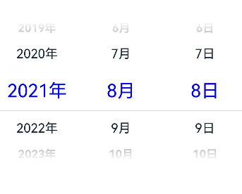
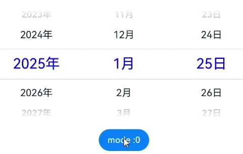
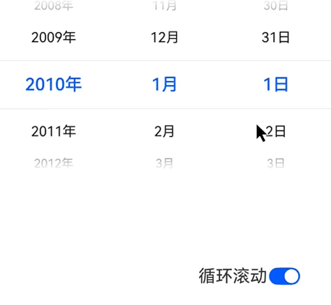

# DatePicker
<!--Kit: ArkUI-->
<!--Subsystem: ArkUI-->
<!--Owner: @luoying_ace_admin-->
<!--Designer: @weixin_52725220-->
<!--Tester: @xiong0104-->
<!--Adviser: @HelloCrease-->

滑动选择日期的组件。

>  **说明：**
>
> - 该组件从API version 8开始支持。后续版本如有新增内容，则采用上角标单独标记该内容的起始版本。
>
> - 该组件不建议开发者在动效过程中修改属性数据。
>
> - 最大显示行数在横、竖屏模式下存在差异。竖屏时默认为5行，横屏时依赖系统配置，未配置时默认显示为3行。可通过如下参数查看具体配置值$r('sys.float.ohos_id_picker_show_count_landscape')。

## 子组件

无


## 接口

DatePicker(options?: DatePickerOptions)

根据指定日期范围创建日期选择器。

**原子化服务API：** 从API version 11开始，该接口支持在原子化服务中使用。

**系统能力：** SystemCapability.ArkUI.ArkUI.Full

**参数：**

| 参数名  | 类型                                            | 必填 | 说明                       |
| ------- | ----------------------------------------------- | ---- | -------------------------- |
| options | [DatePickerOptions](#datepickeroptions对象说明) | 否   | 配置日期选择器组件的参数。 |

## DatePickerOptions对象说明

日期选择器组件的参数说明。

**系统能力：** SystemCapability.ArkUI.ArkUI.Full

| 名称     | 类型 | 只读 | 可选 | 说明                                                         |
| -------- | ---- | ---- | ------------------------------------------------------------ | ------------------------------------------------------------ |
| start    | Date | 否  | 是  | 指定选择器的起始日期。<br/>默认值：Date('1970-1-1')<br/>取值范围：\[Date('1900-01-31'), Date('2100-12-31')]<br />**原子化服务API：** 从API version 11开始，该接口支持在原子化服务中使用。          |
| end      | Date | 否  | 是  | 指定选择器的结束日期。<br/>默认值：Date('2100-12-31')<br/>取值范围：\[Date('1900-01-31'), Date('2100-12-31')]<br />**原子化服务API：** 从API version 11开始，该接口支持在原子化服务中使用。        |
| selected | Date | 否  | 是  | 设置选中项的日期。<br/>默认值：当前系统日期。<br/>取值范围：\[Date('1900-01-31'), Date('2100-12-31')]<br />从API version 10开始，该参数支持[$$](../../../ui/state-management/arkts-two-way-sync.md)双向绑定变量。<br />**原子化服务API：** 从API version 11开始，该接口支持在原子化服务中使用。 |
| mode<sup>18+</sup> | [DatePickerMode](#datepickermode18枚举说明) | 否  | 是  | 设置日期展示模式。<br/>默认值：DatePickerMode.DATE，显示年、月、日三列。<br/>在[DatePickerDialog](ts-methods-datepicker-dialog.md)中，当[DatePickerDialogOptions](ts-methods-datepicker-dialog.md#datepickerdialogoptions对象说明)的showTime设置为true时，此参数不生效，默认显示年、月、日三列。<br />**原子化服务API：** 从API version 18开始，该接口支持在原子化服务中使用。 |

>  **说明：**
>
> - Date的使用请参考[TimePickerOptions](ts-basic-components-timepicker.md#timepickeroptions对象说明)。
>
> - 在DatePicker组件滑动过程中修改DatePickerOptions中的属性，会导致这些属性无法生效。

**起始日期、结束日期和选中日期的异常情形说明：**

| 异常情形   | 对应结果  |
| -------- |  ------------------------------------------------------------ |
| 起始日期晚于结束日期，选中日期未设置。    | 起始日期、结束日期和选中日期都为默认值。 |
| 起始日期晚于结束日期，选中日期早于起始日期默认值。    | 起始日期、结束日期都为默认值，选中日期为起始日期默认值。  |
| 起始日期晚于结束日期，选中日期晚于结束日期默认值。    | 起始日期、结束日期都为默认值，选中日期为结束日期默认值。  |
| 起始日期晚于结束日期，选中日期在起始日期与结束日期默认值范围内。    | 起始日期、结束日期都为默认值，选中日期为设置的值。 |
| 选中日期早于起始日期。    | 选中日期为起始日期。  |
| 选中日期晚于结束日期。    | 选中日期为结束日期。  |
| 起始日期晚于当前系统日期，选中日期未设置。    | 选中日期为起始日期。  |
| 结束日期早于当前系统日期，选中日期未设置。    | 选中日期为结束日期。  |
| 日期格式不符合规范，如‘1999-13-32’。   | 取默认值。  |
| 起始日期或结束日期早于系统有效范围。    | 起始日期或结束日期取起始日期默认值。 |
| 起始日期或结束日期晚于系统有效范围。    | 起始日期或结束日期取结束日期默认值。 |
| 起始日期与结束日期同时早于系统有效范围。 | 起始日期与结束日期取系统有效范围最早日期。 |
| 起始日期与结束日期同时晚于系统有效范围。 | 起始日期与结束日期取系统有效范围最晚日期。 |

>  **说明：**
>
> 先处理起始日期与结束日期的异常情形，再处理选中日期的异常情形。

## DatePickerMode<sup>18+</sup>枚举说明

设置日期展示模式。

**原子化服务API：** 从API version 18开始，该类型支持在原子化服务中使用。

**系统能力：** SystemCapability.ArkUI.ArkUI.Full

| 名称 | 值 | 说明 |
| -------- | - |-------- |
| DATE | 0 | 显示年、月、日三列。|
| YEAR_AND_MONTH | 1 | 显示年、月二列。|
| MONTH_AND_DAY | 2 | 显示月、日二列。<br/>在此模式下，年份始终保持不变。|

## 属性

除支持[通用属性](ts-component-general-attributes.md)外，还支持以下属性：

### lunar

lunar(value: boolean)

设置日期是否显示为农历。

**原子化服务API：** 从API version 11开始，该接口支持在原子化服务中使用。

**系统能力：** SystemCapability.ArkUI.ArkUI.Full

**参数：** 

| 参数名 | 类型    | 必填 | 说明                                                         |
| ------ | ------- | ---- | ------------------------------------------------------------ |
| value  | boolean | 是   | 日期是否显示为农历。<br/>- true：显示为农历。<br/>- false：不显示为农历。<br/>默认值：false |

### lunar<sup>18+</sup>

lunar(isLunar: Optional\<boolean>)

设置弹窗的日期是否显示为农历。与[lunar](#lunar)相比，isLunar参数新增了对undefined类型的支持。

**原子化服务API：** 从API version 18开始，该接口支持在原子化服务中使用。

**系统能力：** SystemCapability.ArkUI.ArkUI.Full

**参数：**

| 参数名 | 类型    | 必填 | 说明                                                         |
| ------ | ------- | ---- | ------------------------------------------------------------ |
| isLunar | [Optional](ts-universal-attributes-custom-property.md#optionalt12)\<boolean> | 是   | 日期是否显示为农历。<br/>- true：显示为农历。<br/>- false：不显示为农历。<br/>默认值：false<br/>当isLunar的值为undefined时，使用默认值。 |

### disappearTextStyle<sup>10+</sup>

disappearTextStyle(value: PickerTextStyle)

设置边缘项（以选中项为基准向上或向下的第二项）的文本样式。

**原子化服务API：** 从API version 11开始，该接口支持在原子化服务中使用。

**系统能力：** SystemCapability.ArkUI.ArkUI.Full

**参数：** 

| 参数名 | 类型                                          | 必填 | 说明                                                         |
| ------ | --------------------------------------------- | ---- | ------------------------------------------------------------ |
| value  | [PickerTextStyle](ts-picker-common.md#pickertextstyle对象说明) | 是   | 边缘项的文本颜色、字号、字体粗细。<br/>默认值：<br/>{<br/>color: '#ff182431',<br/>font: {<br/>size: '14fp', <br/>weight: FontWeight.Regular<br/>}<br/>} |

>  **说明：**
>
> 若选中项向上或向下的可视项数低于两项则无对应边缘项。

### disappearTextStyle<sup>18+</sup>

disappearTextStyle(style: Optional\<PickerTextStyle>)

设置边缘项（以选中项为基准向上或向下的第二项）的文本样式。与[disappearTextStyle<sup>10+</sup>](#disappeartextstyle10)相比，style参数新增了对undefined类型的支持。

**原子化服务API：** 从API version 18开始，该接口支持在原子化服务中使用。

**系统能力：** SystemCapability.ArkUI.ArkUI.Full

**参数：**

| 参数名 | 类型                                                         | 必填 | 说明                                                         |
| ------ | ------------------------------------------------------------ | ---- | ------------------------------------------------------------ |
| style  | [Optional](ts-universal-attributes-custom-property.md#optionalt12)\<[PickerTextStyle](ts-picker-common.md#pickertextstyle对象说明)> | 是   | 边缘项的文本颜色、字号、字体粗细。<br/>默认值：<br/>{<br/>color: '#ff182431',<br/>font: {<br/>size: '14fp', <br/>weight: FontWeight.Regular<br/>}<br/>}<br/>当style的值为undefined时，使用默认值。 |

>  **说明：**
>
> 若选中项向上或向下的可视项数低于两项则无对应边缘项。

### textStyle<sup>10+</sup>

textStyle(value: PickerTextStyle)

设置待选项（以选中项为基准向上或向下的第一项）的文本样式。

**原子化服务API：** 从API version 11开始，该接口支持在原子化服务中使用。

**系统能力：** SystemCapability.ArkUI.ArkUI.Full

**参数：** 

| 参数名 | 类型                                          | 必填 | 说明                                                         |
| ------ | --------------------------------------------- | ---- | ------------------------------------------------------------ |
| value  | [PickerTextStyle](ts-picker-common.md#pickertextstyle对象说明) | 是   | 待选项的文本颜色、字号、字体粗细。<br/>默认值：<br/>{<br/>color: '#ff182431',<br/>font: {<br/>size: '16fp', <br/>weight: FontWeight.Regular<br/>}<br/>} |

>  **说明：**
>
> 若选中项向上或向下可视项数低于一项则无对应待选项。

### textStyle<sup>18+</sup>

textStyle(style: Optional\<PickerTextStyle>)

设置待选项（以选中项为基准向上或向下的第一项）的文本样式。与[textStyle<sup>10+</sup>](#textstyle10)相比，style参数新增了对undefined类型的支持。

**原子化服务API：** 从API version 18开始，该接口支持在原子化服务中使用。

**系统能力：** SystemCapability.ArkUI.ArkUI.Full

**参数：**

| 参数名 | 类型                                          | 必填 | 说明                                                         |
| ------ | --------------------------------------------- | ---- | ------------------------------------------------------------ |
| style | [Optional](ts-universal-attributes-custom-property.md#optionalt12)\<[PickerTextStyle](ts-picker-common.md#pickertextstyle对象说明)> | 是   | 待选项的文本颜色、字号、字体粗细。<br/>默认值：<br/>{<br/>color: '#ff182431',<br/>font: {<br/>size: '16fp', <br/>weight: FontWeight.Regular<br/>}<br/>}<br/>当style的值为undefined时，使用默认值。 |

>  **说明：**
>
> 若选中项向上或向下可视项数低于一项则无对应待选项。

### selectedTextStyle<sup>10+</sup>

selectedTextStyle(value: PickerTextStyle)

设置选中项的文本样式。

**原子化服务API：** 从API version 11开始，该接口支持在原子化服务中使用。

**系统能力：** SystemCapability.ArkUI.ArkUI.Full

**参数：** 

| 参数名 | 类型                                          | 必填 | 说明                                                         |
| ------ | --------------------------------------------- | ---- | ------------------------------------------------------------ |
| value  | [PickerTextStyle](ts-picker-common.md#pickertextstyle对象说明) | 是   | 选中项的文本颜色、字号、字体粗细。<br/>默认值：<br/>{<br/>color: '#ff007dff',<br/>font: {<br/>size: '20fp', <br/>weight: FontWeight.Medium<br/>}<br/>} |

### selectedTextStyle<sup>18+</sup>

selectedTextStyle(style: Optional\<PickerTextStyle>)

设置选中项的文本样式。与[selectedTextStyle<sup>10+</sup>](#selectedtextstyle10)相比，style参数新增了对undefined类型的支持。

**原子化服务API：** 从API version 18开始，该接口支持在原子化服务中使用。

**系统能力：** SystemCapability.ArkUI.ArkUI.Full

**参数：**

| 参数名 | 类型                                                         | 必填 | 说明                                                         |
| ------ | ------------------------------------------------------------ | ---- | ------------------------------------------------------------ |
| style  | [Optional](ts-universal-attributes-custom-property.md#optionalt12)\<[PickerTextStyle](ts-picker-common.md#pickertextstyle对象说明)> | 是   | 选中项的文本颜色、字号、字体粗细。<br/>默认值：<br/>{<br/>color: '#ff007dff',<br/>font: {<br/>size: '20fp', <br/>weight: FontWeight.Medium<br/>}<br/>}<br/>当style的值为undefined时，使用默认值。 |

### enableHapticFeedback<sup>18+</sup>

enableHapticFeedback(enable: Optional\<boolean>)

设置是否开启触控反馈。

**原子化服务API：** 从API version 18开始，该接口支持在原子化服务中使用。

**系统能力：** SystemCapability.ArkUI.ArkUI.Full

**参数：**

| 参数名 | 类型                                          | 必填  | 说明                                                                                  |
| ------ | --------------------------------------------- |-----|-------------------------------------------------------------------------------------|
| enable  | [Optional](ts-universal-attributes-custom-property.md#optionalt12)\<boolean> | 是   | 设置是否开启触控反馈。<br/>- true：开启触控反馈。<br/>- false：不开启触控反馈。<br/>默认值：true<br/>设置为true后，其生效情况取决于系统的硬件是否支持。<br/>当enable的值为undefined时，使用默认值。|

>  **说明：**
>
>  开启触控反馈时，需要在工程的src/main/module.json5文件的"module"内配置requestPermissions字段开启振动权限，配置如下：
>  ```json
>  "requestPermissions": [
>  {
>   "name": "ohos.permission.VIBRATE",
>  }
>  ]
>  ```

### digitalCrownSensitivity<sup>18+</sup>
digitalCrownSensitivity(sensitivity: Optional\<CrownSensitivity>)

设置表冠灵敏度。

**原子化服务API：** 从API version 18开始，该接口支持在原子化服务中使用。

**系统能力：** SystemCapability.ArkUI.ArkUI.Full

**参数：**

| 参数名   | 类型                                     | 必填   | 说明                      |
| ----- | ---------------------------------------- | ---- | ------------------------- |
| sensitivity | [Optional](ts-universal-attributes-custom-property.md#optionalt12)\<[CrownSensitivity](ts-appendix-enums.md#crownsensitivity18)> | 是    | 表冠响应灵敏度。<br/>默认值：CrownSensitivity.MEDIUM，响应速度适中。                    |

>  **说明：**
>
>  用于穿戴设备圆形屏幕使用。组件响应[表冠事件](ts-universal-events-crown.md)，需要先获取焦点。

### canLoop<sup>20+</sup>

canLoop(isLoop: Optional\<boolean>)

设置是否可循环滚动。

**原子化服务API：** 从API version 20开始，该接口支持在原子化服务中使用。

**系统能力：** SystemCapability.ArkUI.ArkUI.Full

**参数：**

| 参数名 | 类型    | 必填 | 说明                                                         |
| ------ | ------- | ---- | ------------------------------------------------------------ |
| isLoop  | [Optional](ts-universal-attributes-custom-property.md#optionalt12)\<boolean> | 是   | 是否可循环滚动。<br/>- true：可循环滚动，年份随着月份的循环滚动进行联动加减，月份随着日的循环滚动进行联动加减。<br/>- false：不可循环滚动，年、月、日到达本列的顶部或底部时，无法再进行滚动，年、月、日之间也无法再联动加减。<br/>默认值：true<br/>当isLoop的值为undefined时，使用默认值。 |

## 事件

除支持[通用事件](ts-component-general-events.md)外，还支持以下事件：

### onChange<sup>(deprecated)</sup>

onChange(callback: (value: DatePickerResult) => void)

滑动DatePicker文本内容后，选项完全归位至选中项位置时，触发该回调。不能通过双向绑定的状态变量触发。

从API version 8 开始支持，从 API version 10 开始废弃，建议使用[onDateChange](#ondatechange10)。

**系统能力：** SystemCapability.ArkUI.ArkUI.Full

**参数：**

| 参数名 | 类型                                          | 必填 | 说明             |
| ------ | --------------------------------------------- | ---- | ---------------- |
| callback | (value: [DatePickerResult](#datepickerresult对象说明)) => void | 是   | 返回选中的时间。 |

### onDateChange<sup>10+</sup>

onDateChange(callback: Callback\<Date>)

滑动DatePicker文本内容后，选项完全归位至选中项位置时，触发该回调。不能通过双向绑定的状态变量触发。

**原子化服务API：** 从API version 11开始，该接口支持在原子化服务中使用。

**系统能力：** SystemCapability.ArkUI.ArkUI.Full

**参数：** 

| 参数名 | 类型 | 必填 | 说明                                                         |
| ------ | ---- | ---- | ------------------------------------------------------------ |
| callback  | [Callback](ts-types.md#callback12)\<Date> | 是   | 返回选中的时间，年、月、日为选中的日期，时、分取决于当前系统时间的时、分，秒恒为00。 |

### onDateChange<sup>18+</sup>

onDateChange(callback: Optional\<Callback\<Date>>)

滑动DatePicker文本内容后，选项完全归位至选中项位置时，触发该回调。不能通过双向绑定的状态变量触发。与[onDateChange<sup>10+</sup>](#ondatechange10)相比，callback参数新增了对undefined类型的支持。

**原子化服务API：** 从API version 18开始，该接口支持在原子化服务中使用。

**系统能力：** SystemCapability.ArkUI.ArkUI.Full

**参数：**

| 参数名   | 类型                                                         | 必填 | 说明                                                         |
| -------- | ------------------------------------------------------------ | ---- | ------------------------------------------------------------ |
| callback | [Optional](ts-universal-attributes-custom-property.md#optionalt12)\<[Callback](ts-types.md#callback12)\<Date>> | 是   | 返回选中的时间，年、月、日为选中的日期，时、分取决于当前系统时间的时、分，秒恒为00。<br/>当callback的值为undefined时，不使用回调函数。 |

## DatePickerResult对象说明

日期选择器返回的时间格式。

**原子化服务API：** 从API version 11开始，该接口支持在原子化服务中使用。

**系统能力：** SystemCapability.ArkUI.ArkUI.Full

| 名称  | 类型   | 只读 | 可选 | 说明                                       |
| ----- | ------ | ---- | ---- | ------------------------------------------ |
| year  | number | 否   | 是   | 选中日期的年。<br/>取值范围：与设置的start、end有关，如果没有设置start、end，取值范围为[1970, 2100]。                             |
| month | number | 否   | 是   | 选中日期的月的索引值，索引从0开始，0表示1月，11表示12月。<br/>取值范围：与设置的start、end有关，如果没有设置start、end，取值范围为[0, 11]。 |
| day   | number | 否   | 是   | 选中日期的日。<br/>取值范围：与设置的start、end有关，如果没有设置start、end，取值范围为[1, 31]。                             |

## 示例

### 示例1（切换公历农历）

该示例实现了日期选择器组件，点击按钮可以切换公历农历。


```ts
// xxx.ets
@Entry
@Component
struct DatePickerExample {
  @State isLunar: boolean = false;
  private selectedDate: Date = new Date('2021-08-08');

  build() {
    Column() {
      Button('切换公历农历')
        .margin({ top: 30, bottom: 30 })
        .onClick(() => {
          this.isLunar = !this.isLunar;
        })
      DatePicker({
        start: new Date('1970-1-1'),
        end: new Date('2100-1-1'),
        selected: this.selectedDate
      })
        .lunar(this.isLunar)
        .onDateChange((value: Date) => {
          this.selectedDate = value;
          console.info('select current date is: ' + value.toString());
        })

    }.width('100%')
  }
}
```


### 示例2（设置文本样式）

该示例通过配置[disappearTextStyle](#disappeartextstyle10)、[textStyle](#textstyle10)、[selectedTextStyle](#selectedtextstyle10)设置文本样式。

```ts
// xxx.ets
@Entry
@Component
struct DatePickerExample {
  private selectedDate: Date = new Date('2021-08-08');

  build() {
    Column() {
      DatePicker({
        start: new Date('1970-1-1'),
        end: new Date('2100-1-1'),
        selected: this.selectedDate
      })
        .disappearTextStyle({ color: Color.Gray, font: { size: '16fp', weight: FontWeight.Bold } })
        .textStyle({ color: '#ff182431', font: { size: '18fp', weight: FontWeight.Normal } })
        .selectedTextStyle({ color: '#ff0000FF', font: { size: '26fp', weight: FontWeight.Regular, family: "HarmonyOS Sans", style: FontStyle.Normal } })
        .onDateChange((value: Date) => {
          this.selectedDate = value;
          console.info('select current date is: ' + value.toString());
        })

    }.width('100%')
  }
}
```



### 示例3（设置显示年、月和月、日列）

该示例通过配置mode参数实现显示年、月和月、日列。

```ts
// xxx.ets
@Entry
@Component
struct DatePickerExample {
  @State isLunar: boolean = false;
  private selectedDate: Date = new Date('2025-01-15');
  @State datePickerModeList: (DatePickerMode)[] = [
    DatePickerMode.DATE,
    DatePickerMode.YEAR_AND_MONTH,
    DatePickerMode.MONTH_AND_DAY,
  ];
  @State datePickerModeIndex: number = 0;

  build() {
    Column() {
      Button('切换公历农历')
        .margin({ top: 30, bottom: 30 })
        .onClick(() => {
          this.isLunar = !this.isLunar;
        })
      DatePicker({
        start: new Date('1970-1-1'),
        end: new Date('2100-1-1'),
        selected: this.selectedDate,
        mode:this.datePickerModeList[this.datePickerModeIndex]
      })
        .lunar(this.isLunar)
        .onDateChange((value: Date) => {
          this.selectedDate = value;
          console.info('select current date is: ' + value.toString());
        })

      Button('mode :' + this.datePickerModeIndex).margin({ top: 20 })
        .onClick(() => {
          this.datePickerModeIndex++;
          if(this.datePickerModeIndex >= this.datePickerModeList.length){
            this.datePickerModeIndex = 0;
          }
        })
    }.width('100%')
  }
}
```


### 示例4（设置循环滚动）

从API version 20开始，可以通过配置[canLoop](#canloop20)参数设置DatePicker是否循环滚动。

```ts
// xxx.ets
@Entry
@Component
struct DatePickerExample {
  @State isLoop: boolean = true;
  selectedDate: Date = new Date("2010-1-1");

  build() {
    Column() {
      DatePicker({
        start: new Date("2000-1-1"),
        end: new Date("2100-12-31"),
        selected: this.selectedDate,
      })
        .canLoop(this.isLoop)
        .onDateChange((value: Date) => {
            console.info("DatePicker:onDateChange()" + value.toString());
        })

      Row() {
        Text('循环滚动').fontSize(20)
        Toggle({ type: ToggleType.Switch, isOn: true })
          .onChange((isOn: boolean) => {
            this.isLoop = isOn;
          })
      }.position({ x: '60%', y: '40%' })
    }.width('100%')
  }
}
```

