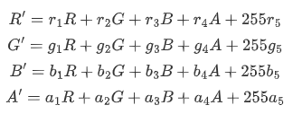
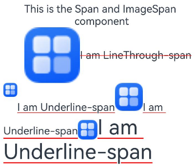
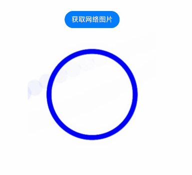

# ImageSpan
<!--Kit: ArkUI-->
<!--Subsystem: ArkUI-->
<!--Owner: @xiangyuan6-->
<!--Designer: @xiangyuan6-->
<!--Tester: @jiaoaozihao-->
<!--Adviser: @Brilliantry_Rui-->

ImageSpan是[Text](ts-basic-components-text.md)、[ContainerSpan](ts-basic-components-containerspan.md)组件的子组件，用于在文本中显示行内图片，支持设置图片对齐方式、缩放类型、加载占位图和颜色滤镜等，适用于需要在文本段落中嵌入图片实现图文混排的场景。

>  **说明：**
>
> - 该组件从API version 10开始支持。后续版本的新增接口，采用上角标单独标记接口的起始版本。
>
> - 本模块接口仅可在Stage模型下使用。


## 子组件

无


## 接口

ImageSpan(value: ResourceStr | PixelMap)

**原子化服务API：** 从API version 11开始，该接口支持在原子化服务中使用。

**系统能力：** SystemCapability.ArkUI.ArkUI.Full

**参数：**

| 参数名 | 类型 | 必填 | 说明 |
| -------- | -------- | -------- | -------- |
| value | [ResourceStr](ts-types.md#resourcestr) \|&nbsp;[PixelMap](../../apis-image-kit/arkts-apis-image-PixelMap.md)&nbsp; | 是 | 图片的数据源，支持本地图片和网络图片。<br>使用网络图片时，需要申请权限ohos.permission.INTERNET。具体申请方式请参考[声明权限](../../../security/AccessToken/declare-permissions.md)。<br>当使用相对路径引用图片资源时，例如`ImageSpan("common/test.jpg")`，不支持跨包/跨模块调用该ImageSpan组件，建议使用`$r`方式来管理需全局使用的图片资源。<br>\- 支持的图片格式包括png、jpg、bmp、svg、gif、webp和heif。<br>\- 支持`Base64`字符串。格式`data:image/[png\|jpeg\|bmp\|webp\|heif];base64,[base64 data]`，其中`[base64 data]`为`Base64`字符串数据。<br>\- 支持file://data/storage路径前缀的字符串，用于读取本应用安装目录下file文件夹下的图片资源。需要保证应用安装目录路径下的文件有可读权限。 |


## 属性

属性继承自[BaseSpan](ts-basic-components-span.md#basespan)，通用属性方法支持[尺寸设置](ts-universal-attributes-size.md)、[背景设置](ts-universal-attributes-background.md)、[边框设置](ts-universal-attributes-border.md)。

### verticalAlign

verticalAlign(value: ImageSpanAlignment)

设置图片基于行高的对齐方式。适用于图文混排场景中调整图片与文字的垂直对齐效果。未通过该接口设置时，默认对齐方式为ImageSpanAlignment.BOTTOM。

**原子化服务API：** 从API version 11开始，该接口支持在原子化服务中使用。

**系统能力：** SystemCapability.ArkUI.ArkUI.Full

**参数：** 

| 参数名 | 类型                                      | 必填 | 说明                                                         |
| ------ | ----------------------------------------- | ---- | ------------------------------------------------------------ |
| value  | [ImageSpanAlignment](ts-appendix-enums.md#imagespanalignment10) | 是   | 图片基于行高的对齐方式。 |

### objectFit

objectFit(value: ImageFit)

设置图片的缩放类型。适用于控制图片在容器中显示方式的场景。未通过该接口设置时，默认缩放类型为ImageFit.Cover。

**原子化服务API：** 从API version 11开始，该接口支持在原子化服务中使用。

**系统能力：** SystemCapability.ArkUI.ArkUI.Full

**参数：** 

| 参数名 | 类型                                      | 必填 | 说明                                        |
| ------ | ----------------------------------------- | ---- | ------------------------------------------- |
| value  | [ImageFit](ts-appendix-enums.md#imagefit) | 是   | 图片的缩放类型。 |

### alt<sup>12+</sup>

alt(value:&nbsp;PixelMap)

设置图片加载过程中显示的占位图。未通过该接口设置时，默认为null，不显示占位图。

**原子化服务API：** 从API version 12开始，该接口支持在原子化服务中使用。

**系统能力：** SystemCapability.ArkUI.ArkUI.Full

**参数：** 

| 参数名 | 类型                                                     | 必填 | 说明                                                         |
| ------ | -------------------------------------------------------- | ---- | ------------------------------------------------------------ |
| value  | [PixelMap](../../apis-image-kit/arkts-apis-image-PixelMap.md) | 是   | 设置图片加载过程中显示的占位图，支持[PixelMap](../../apis-image-kit/arkts-apis-image-PixelMap.md)类型。 |

### colorFilter<sup>14+</sup>

colorFilter(filter: ColorFilter | DrawingColorFilter)

为图像设置颜色滤镜效果。

**原子化服务API：** 从API version 14开始，该接口支持在原子化服务中使用。

**系统能力：** SystemCapability.ArkUI.ArkUI.Full

**参数：**

| 参数名 | 类型                                    | 必填 | 说明                                                         |
| ------ | --------------------------------------- | ---- | ------------------------------------------------------------ |
| filter  | [ColorFilter](ts-types.md#colorfilter9) \| [DrawingColorFilter](ts-basic-components-image.md#drawingcolorfilter12) | 是   | 1. 给图像设置颜色滤镜效果，入参为一个4x5的RGBA转换矩阵。<br>矩阵第一行用于计算R'（新的红色分量），第二行用于计算G'（新的绿色分量），第三行用于计算B'（新的蓝色分量），第四行用于计算A'（新的透明度分量），4行分别代表不同的RGBA的分量。<br>当矩阵对角线值为1，其余值为0时，保持图片原有色彩。<br> **计算规则：**<br>如果输入的滤镜矩阵为：<br><br>像素点为[R, G, B, A]，色值的范围[0, 255]<br>则过滤后的颜色为 [R’, G’, B’, A’]<br><br>2. 支持@ohos.graphics.drawing的ColorFilter类型作为入参。<br>**说明：** <br>该接口中的DrawingColorFilter类型支持在原子化服务中使用。其中，svg类型的图源只对stroke属性生效。|

### supportSvg2<sup>22+</sup>

supportSvg2(enable: Optional\<boolean>)

开启或关闭[SVG标签解析能力增强功能](ts-image-svg2-capabilities.md)，开启后支持SVG解析新能力，适用于需要使用SVG新特性的场景；关闭则保持原有SVG解析能力，适用于兼容旧版本SVG图片显示的场景。未通过该接口设置时，默认保持原有SVG解析能力。

ImageSpan组件创建后，不支持动态修改该属性的值。

**原子化服务API：** 从API version 22开始，该接口支持在原子化服务中使用。

**系统能力：** SystemCapability.ArkUI.ArkUI.Full

**参数：** 

| 参数名 | 类型                                                     | 必填 | 说明                                                         |
| ------ | -------------------------------------------------------- | ---- | ------------------------------------------------------------ |
| enable  | Optional\<boolean> | 是   | 控制是否开启[SVG标签解析能力增强功能](ts-image-svg2-capabilities.md)。<br>true：支持SVG解析新能力；false：保持原有SVG解析能力。 |

## 事件

通用事件仅支持[点击控制事件](ts-universal-attributes-click.md)。还支持以下事件：

### onComplete<sup>12+</sup>

onComplete(callback: ImageCompleteCallback)

图片数据加载成功和解码成功时均触发该回调，返回成功加载的图片尺寸。

**原子化服务API：** 从API version 12开始，该接口支持在原子化服务中使用。

**系统能力：** SystemCapability.ArkUI.ArkUI.Full

**参数：**

| 参数名   | 类型                                       | 必填 | 说明                       |
| -------- | ------------------------------------------ | ---- | -------------------------- |
| callback | [ImageCompleteCallback](#imagecompletecallback12) | 是   | 图片数据加载成功和解码成功时触发的回调。 |

### onError<sup>12+</sup>

onError(callback: ImageErrorCallback)

图片加载异常时触发该回调。

**原子化服务API：** 从API version 12开始，该接口支持在原子化服务中使用。

**系统能力：** SystemCapability.ArkUI.ArkUI.Full

**参数：**

| 参数名   | 类型                                       | 必填 | 说明                       |
| -------- | ------------------------------------------ | ---- | -------------------------- |
| callback | [ImageErrorCallback](ts-basic-components-image.md#imageerrorcallback9) | 是   | 图片加载异常时触发的回调。 |

## ImageCompleteCallback<sup>12+</sup>

type ImageCompleteCallback = (result: ImageLoadResult) => void

图片加载成功和解码成功时均触发的回调。

**原子化服务API：** 从API version 12开始，该接口支持在原子化服务中使用。

**系统能力：** SystemCapability.ArkUI.ArkUI.Full

**参数：**

| 参数名 | 类型                       | 必填 | 说明                               |
| ------ | -------------------------- | ---- | ---------------------------------- |
| result  | [ImageLoadResult](#imageloadresult12对象说明) | 是   | 图片数据加载成功和解码成功触发回调时返回的对象。 |

## ImageLoadResult<sup>12+</sup>对象说明

图片数据加载成功和解码成功触发回调时返回的对象。

**原子化服务API：** 从API version 12开始，该接口支持在原子化服务中使用。

**系统能力：** SystemCapability.ArkUI.ArkUI.Full

| 名称                       | 类型   | 只读 | 可选 | 说明                                                         |
| ---------------------------- | ------ | ---- | ---- | ------------------------------------------------------------ |
| width                        | number | 否   | 否 | 图片的宽。<br>单位：[px](ts-pixel-units.md#基本像素单位)                                    |
| height                       | number | 否   | 否   | 图片的高。<br>单位：[px](ts-pixel-units.md#基本像素单位)                                    |
| componentWidth               | number | 否   | 否   | 组件的宽。<br>单位：[px](ts-pixel-units.md#基本像素单位)                                    |
| componentHeight              | number | 否   | 否   | 组件的高。<br>单位：[px](ts-pixel-units.md#基本像素单位)                                    |
| loadingStatus                | number | 否   | 否   | 图片加载成功的状态值。<br>**说明：**<br>返回的状态值为0时，表示图片数据加载成功。返回的状态值为1时，表示图片解码成功。 |
| contentWidth   | number | 否   | 否   | 图片实际绘制的宽度。<br>单位：[px](ts-pixel-units.md#基本像素单位)<br>**说明：**<br>仅在loadingStatus返回1时有效。 |
| contentHeight  | number | 否   | 否   | 图片实际绘制的高度。<br>单位：[px](ts-pixel-units.md#基本像素单位)<br>**说明：**<br>仅在loadingStatus返回1时有效。 |
| contentOffsetX | number | 否   | 否   | 实际绘制内容相对于组件自身的x轴偏移。<br>单位：[px](ts-pixel-units.md#基本像素单位)<br>**说明：**<br>仅在loadingStatus返回1时有效。 |
| contentOffsetY | number | 否   | 否   | 实际绘制内容相对于组件自身的y轴偏移。<br>单位：[px](ts-pixel-units.md#基本像素单位)<br>**说明：**<br>仅在loadingStatus返回1时有效。 |


## 示例

### 示例1（设置对齐方式）

从API version 10开始，该示例通过[verticalAlign](#verticalalign)、[objectFit](#objectfit)属性展示了ImageSpan组件的对齐方式以及缩放效果。

```ts
// xxx.ets
@Entry
@Component
struct SpanExample {
  build() {
    Flex({ direction: FlexDirection.Column, alignItems: ItemAlign.Center, justifyContent: FlexAlign.Center }) {
      Text() {
        Span('This is the Span and ImageSpan component').fontSize(25).textCase(TextCase.Normal)
          .decoration({ type: TextDecorationType.None, color: Color.Pink })
      }.width('100%').textAlign(TextAlign.Center)

      Text() {
        // $r('app.media.app_icon')需要替换为实际的图像资源文件。
        ImageSpan($r('app.media.app_icon'))
          .width('200px')
          .height('200px')
          .objectFit(ImageFit.Fill)
          .verticalAlign(ImageSpanAlignment.CENTER)
        Span('I am LineThrough-span')
          .decoration({ type: TextDecorationType.LineThrough, color: Color.Red }).fontSize(25)
        ImageSpan($r('app.media.app_icon'))
          .width('50px')
          .height('50px')
          .verticalAlign(ImageSpanAlignment.TOP)
        Span('I am Underline-span')
          .decoration({ type: TextDecorationType.Underline, color: Color.Red }).fontSize(25)
        ImageSpan($r('app.media.app_icon'))
          .size({ width: '100px', height: '100px' })
          .verticalAlign(ImageSpanAlignment.BASELINE)
        Span('I am Underline-span')
          .decoration({ type: TextDecorationType.Underline, color: Color.Red }).fontSize(25)
        ImageSpan($r('app.media.app_icon'))
          .width('70px')
          .height('70px')
          .verticalAlign(ImageSpanAlignment.BOTTOM)
        Span('I am Underline-span')
          .decoration({ type: TextDecorationType.Underline, color: Color.Red }).fontSize(50)
      }
      .width('100%')
      .textIndent(50)
    }.width('100%').height('100%').padding({ left: 0, right: 0, top: 0 })
  }
}
```



### 示例2（设置背景样式）

从API version 11开始，该示例通过[textBackgroundStyle](ts-basic-components-span.md#textbackgroundstyle11)属性展示了文本设置背景样式的效果。

```ts
// xxx.ets
@Component
@Entry
struct Index {
  build() {
    Row() {
      Column() {
        Text() {
          // $r('app.media.sky')需要替换为实际的图像资源文件。
          ImageSpan($r('app.media.sky'))
            .width('60vp')
            .height('60vp')
            .verticalAlign(ImageSpanAlignment.CENTER)
            .borderRadius(20)
            .textBackgroundStyle({ color: '#7F007DFF', radius: '5vp' })
        }
      }.width('100%')
    }.height('100%')
  }
}
```


### 示例3（为图片添加事件）

从API version 12开始，该示例通过[onComplete](#oncomplete12)、[onError](#onerror12)为图片添加加载成功和加载异常的事件。

```ts
// xxx.ets
@Entry
@Component
struct Index {
  // $r('app.media.app_icon')需要替换为实际的图像资源文件。
  @State src: ResourceStr = $r('app.media.app_icon');

  build() {
    Column() {
      Text() {
        ImageSpan(this.src)
          .width(100).height(100)
          .onError((err) => {
            console.error(`Failed to load image. Code: ${err.error?.code}, message: ${err.message}`);
          })
          .onComplete((event) => {
            console.info('onComplete: ' + event.loadingStatus);
          })
      }
    }.width('100%').height('100%')
  }
}
```
### 示例4（设置颜色滤镜）

从API version 14开始，该示例通过[colorFilter](#colorfilter14)属性展示了给ImageSpan图像设置颜色滤镜的效果。

```ts
// xxx.ets
import { drawing } from '@kit.ArkGraphics2D';

@Entry
@Component
struct SpanExample {
  private colorFilterMatrix: number[] = [0.239, 0, 0, 0, 0, 0, 0.616, 0, 0, 0, 0, 0, 0.706, 0, 0, 0, 0, 0, 1, 0];
  @State drawingColorFilterFirst: ColorFilter | undefined = new ColorFilter(this.colorFilterMatrix);

  build() {
    Row() {
      Column({ space: 10 }) {
        // 创建ColorFilter对象的方式为图片设置颜色滤镜。
        Text() {
          // $r('app.media.sky')需要替换为实际的图像资源文件。
          ImageSpan($r('app.media.sky'))
            .width('60vp')
            .height('60vp')
            .colorFilter(this.drawingColorFilterFirst)
        }

        // 通过drawing.ColorFilter的方式为图片设置颜色滤镜。
        Text() {
          // $r('app.media.sky')需要替换为实际的图像资源文件。
          ImageSpan($r('app.media.sky'))
            .width('60vp')
            .height('60vp')
            .colorFilter(drawing.ColorFilter.createBlendModeColorFilter({
              alpha: 255,
              red: 112,
              green: 112,
              blue: 112
            }, drawing.BlendMode.SRC))
        }
      }.width('100%')
    }.height('100%')
  }
}
```


### 示例5（设置加载占位图）

从API version 12开始，该示例通过[alt](#alt12)属性展示了ImageSpan设置加载网络图片时占位图的效果。

使用网络图片时，需要申请权限ohos.permission.INTERNET。具体申请方式请参考[声明权限](../../../security/AccessToken/declare-permissions.md)。

```ts
// xxx.ets
import { http } from '@kit.NetworkKit';
import { image } from '@kit.ImageKit';
import { BusinessError } from '@kit.BasicServicesKit';

@Entry
@Component
struct SpanExample {
  @State imageAlt: PixelMap | undefined = undefined;

  httpRequest() {
    // 直接加载网络地址，请填写一个具体的网络图片地址
    http.createHttp().request('https://www.example.com/xxx.png', (error: BusinessError, data: http.HttpResponse) => {
      if (error) {
        console.error(`http request failed with. Code: ${error.code}, message: ${error.message}`);
      } else {
        console.info('http request success');
        let imageData: ArrayBuffer = data.result as ArrayBuffer;
        let imageSource: image.ImageSource = image.createImageSource(imageData);

        class ImageSize {
          height: number = 100;
          width: number = 100;
        }

        let option: Record<string, number | boolean | ImageSize> = {
          'alphaType': 0, // 透明度
          'editable': false, // 是否可编辑
          'pixelFormat': 3, // 像素格式
          'scaleMode': 1, // 缩略值
          'size': { height: 100, width: 100 }
        };
        // 通过ImageSource创建PixelMap
        imageSource.createPixelMap(option).then((pixelMap: PixelMap) => {
          console.info('image createPixelMap success');
          this.imageAlt = pixelMap;
          imageSource.release();
        }).catch(() => {
          imageSource.release();
        })
      }
    })
  }

  build() {
    Column() {
      Button('获取网络图片')
        .onClick(() => {
          this.httpRequest();
        })

      Text() {
        // 直接加载网络地址，请填写一个具体的网络图片地址
        ImageSpan('https://www.example.com/xxx.png')
          .alt(this.imageAlt)
          .width(300)
          .height(300)
      }

    }.width('100%').height(250).padding({ left: 35, right: 35, top: 35 })
  }
}
```


### 示例6（使用supportSvg2属性时，SVG图片的显示效果）

从API version 22开始，该示例通过设置[supportSvg2](#supportsvg222)属性，使[SVG标签解析能力增强功能](ts-image-svg2-capabilities.md)的[SVG易用性提升](ts-image-svg2-capabilities.md#svg易用性提升)能力生效。

```ts
import { drawing } from '@kit.ArkGraphics2D';
@Entry
@Component
struct Index {
  build() {
    Row() {
      Column() {
        Text('属性字符串不支持svg2')
        // $r('app.media.ice')需要替换为实际的图像资源文件。
        Text() {
          ImageSpan($r('app.media.ice'))
            .width(50)
            .height(50)
            .colorFilter(drawing.ColorFilter.createBlendModeColorFilter(
              drawing.Tool.makeColorFromResourceColor(Color.Blue), drawing.BlendMode.SRC_IN))
        }
        Text('属性字符串支持svg2')
        // $r('app.media.ice')需要替换为实际的图像资源文件。
        Text() {
          ImageSpan($r('app.media.ice'))
            .width(50)
            .height(50)
            .supportSvg2(true)
            .colorFilter(drawing.ColorFilter.createBlendModeColorFilter(
              drawing.Tool.makeColorFromResourceColor(Color.Blue), drawing.BlendMode.SRC_IN))
        }
      }
      .width('100%')
    }
    .height('100%')
  }
}
```


