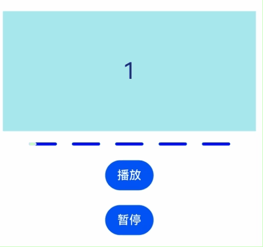

# LinearIndicator

线性导航条组件，可以包含多个进度条，用于显示内容加载或操作处理等进度。

>  **说明：**
>
>  该组件从API Version 18开始支持。后续版本如有新增内容，则采用上角标单独标记该内容的起始版本。


## 子组件

不包含子组件。


## 接口

LinearIndicator(count?: number, controller?: LinearIndicatorController)

线性导航条组件的构造函数，可配置该组件的进度条个数与控制器。

**原子化服务API：** 从API Version 18开始，该接口支持在原子化服务中使用。

**系统能力：** SystemCapability.ArkUI.ArkUI.Full

**参数：**

|参数名|类型|必填|说明|
| ----- | ----- | -- |  --- |
| count | number | 否 |  指定进度条个数。<br/>改变进度条个数时，从尾部开始增加或删除指定个数的进度条。 <br>默认值为5，最小值为2，小于2时按2处理。<br/>指定值有小数时，向下取整。|
| controller |  [LinearIndicatorController](#linearindicatorcontroller) | 否 | 设置控制器，可通过该参数控制进度条播放、暂停、停止、设置进度条的当前索引以及在该索引下进度条的进度。 |

## 属性

除支持[通用属性](ts-component-general-attributes.md)外，还支持以下属性：

### indicatorStyle

indicatorStyle(style: Optional\<LinearIndicatorStyle\>)

设置导航条样式属性。

**原子化服务API：** 从API Version 18开始，该接口支持在原子化服务中使用。

**系统能力：** SystemCapability.ArkUI.ArkUI.Full

**参数：** 

|参数名|类型|必填|说明|
| ----- | ----- | -- |  --- |
| style | Optional\<[LinearIndicatorStyle](#linearindicatorstyle)\> | 是 | 导航条样式。<br/>可通过该参数控制进度条之间的间隔、高度、圆角半径以及已完成播放的进度条颜色与剩余未播放的进度条颜色。 |

### indicatorLoop

indicatorLoop(loop: Optional\<boolean\>)

设置是否支持循环播放。循环播放为true时，当最后一个进度条播放完成，会等待预先设置的间隔毫秒数后，从第一个进度条重新开始播放。

**原子化服务API：** 从API Version 18开始，该接口支持在原子化服务中使用。

**系统能力：** SystemCapability.ArkUI.ArkUI.Full

**参数：** 

|参数名|类型|必填|说明|
| ----- | ----- | -- |  --- |
| loop | Optional\<boolean\> | 是 | 是否支持循环播放。<br>true：支持循环播放。false：不支持循环播放。<br>默认值：true。 |

## 事件

除支持[通用事件](ts-component-general-events.md)外，还支持以下事件：

### onChange

onChange(callback: Optional\<OnLinearIndicatorChangeCallback\>)

设置进度条变化时的回调函数，当进度发生变化时会触发该回调。

**原子化服务API：** 从API Version 18开始，该接口支持在原子化服务中使用。

**系统能力：** SystemCapability.ArkUI.ArkUI.Full

**参数：** 

|参数名|类型|必填|说明|
| ----- | ----- | -- |  --- |
| callback | Optional\<[OnLinearIndicatorChangeCallback](#onlinearindicatorchangecallback)\> | 是 | 回调函数。<br>通过该回调函数可获取当前进度条的索引值与进度值。 |

## LinearIndicatorController

LinearIndicator的控制器。可控制进度条的播放、暂停、停止以及设置指定进度条的指定进度。

### constructor

constructor()

LinearIndicatorController的构造函数。


**原子化服务API：** 从API Version 18开始，该接口支持在原子化服务中使用。

**系统能力：** SystemCapability.ArkUI.ArkUI.Full

### setProgress

setProgress(index: number, progress: number)

为与index相对应的进度条设定进度值。所有小于index的进度条进度将统一调整至100%。而所有大于index的进度条进度则统一调整为0%。

**原子化服务API：** 从API Version 18开始，该接口支持在原子化服务中使用。

**系统能力：** SystemCapability.ArkUI.ArkUI.Full

**参数：**

|参数名|类型|必填|说明|
| ----- | ----- | -- |  --- |
| index | number | 是 | 进度条序号。<br>取值范围：[0, 进度条数量-1]。<br>默认值：0。<br>设置取值范围外的数值时，直接返回不做任何处理。指定值有小数时，向下取整。<br>当设置为undefined或null时，使用默认值。 |
| progress | number | 是 | 播放进度。<br>取值范围：[0, 100]。<br>默认值：0。<br>设置范围外的数值时直接返回不做任何处理。<br>当设置为undefined或null时，使用默认值。|

### start

start(options?: LinearIndicatorStartOptions)

开始自动播放，可以指定自动播放参数，每一个进度条的自动播放参数相同。

**原子化服务API：** 从API Version 18开始，该接口支持在原子化服务中使用。

**系统能力：** SystemCapability.ArkUI.ArkUI.Full

**参数：**

|参数名|类型|必填|说明|
| ----- | ----- | -- |  --- |
| options | [LinearIndicatorStartOptions](#linearindicatorstartoptions) | 否 | 开始播放，指定自动播放参数。 |

### pause

pause()

暂停播放。如果当前为自动播放状态，将切换至暂停播放状态。若已处于暂停播放状态，则维持现状。

**原子化服务API：** 从API Version 18开始，该接口支持在原子化服务中使用。

**系统能力：** SystemCapability.ArkUI.ArkUI.Full

### stop

stop()

停止播放。调用后将恢复成初始状态（当前索引值为0，进度值为0）。

**原子化服务API：** 从API Version 18开始，该接口支持在原子化服务中使用。

**系统能力：** SystemCapability.ArkUI.ArkUI.Full

## LinearIndicatorStyle

组件内置进度条属性信息。

**原子化服务API：** 从API Version 18开始，该接口支持在原子化服务中使用。

**系统能力：** SystemCapability.ArkUI.ArkUI.Full

|名称|类型|必填|说明|
| ----- | ----- | -- | --- |
| space | [LengthMetrics](../js-apis-arkui-graphics.md#lengthmetrics12) | 否 | 进度条之间的间隔。<br>不支持百分比的值。<br>当设置为undefined或null时，使用默认值。<br>默认值：4vp。|
| strokeWidth | [LengthMetrics](../js-apis-arkui-graphics.md#lengthmetrics12) | 否 | 进度条的高度。<br>不支持百分比的值。<br>大于进度条长度时取值为进度条长度。<br>当设置为undefined或null时，使用默认值。<br>默认值：2vp。|
| strokeRadius | [LengthMetrics](../js-apis-arkui-graphics.md#lengthmetrics12) | 否 | 进度条的圆角半径。<br>不支持百分比的值。<br>大于"strokeWidth/2"时，按"strokeWidth/2"处理。小于0时按默认值处理。<br>取值范围：[0, strokeWidth/2]<br>当设置为undefined或null时，使用默认值。<br>默认值：1vp。|
| trackBackgroundColor | [ColorMetrics](../js-apis-arkui-graphics.md#colormetrics12)| 否 | 进度条未播放时的颜色。<br>当设置为undefined或null时，使用默认值。<br>默认值：comp_background_tertiary。|
| trackColor | [ColorMetrics](../js-apis-arkui-graphics.md#colormetrics12) | 否 | 进度条播放时的颜色。<br>当设置为undefined或null时，使用默认值。<br>默认值：comp_background_emphasize |

## LinearIndicatorStartOptions

自动播放参数。

**原子化服务API：** 从API Version 18开始，该接口支持在原子化服务中使用。

**系统能力：** SystemCapability.ArkUI.ArkUI.Full

**参数：**

|名称|类型|必填|说明 |
| ----- | ----- | -- | --- |
| interval | number | 否 | 自动播放时两个进度条切换间隔的时间。默认值为0毫秒，小于0时按默认值处理。 |
| duration | number | 否 | 每个进度条从0%到100%消耗的时间。默认值为4000毫秒，小于0时按1毫秒处理。 |


## OnLinearIndicatorChangeCallback

type OnLinearIndicatorChangeCallback = (index: number, progress: number) => void

进度条变化时的回调函数。

**原子化服务API：** 从API Version 18开始，该接口支持在原子化服务中使用。

**系统能力：** SystemCapability.ArkUI.ArkUI.Full

**参数：**

|参数名|类型|必填|说明|
| ----- | ----- | -- |  --- |
| index | number | 是 | 进度条的当前序号。 |
| progress | number | 是 | 进度条的当前进度。 |

## 示例
### 示例1（控制进度条的播放状态）
该示例通过创建LinearIndicatorController对象并将该对象与LinearIndicator绑定，实现了控制线性导航条的交互功能。
```ts
import { LengthMetrics } from '@kit.ArkUI'
import { ColorMetrics } from '@kit.ArkUI'

@Entry
@Component
struct PageIndicatorStyle {
  controller: LinearIndicatorController = new LinearIndicatorController()
  @State count:number= 5
  @State spaceValue: number|undefined = 4
  @State width1Value: number|undefined = 2
  @State radiusValue: number|undefined = 1
  @State space: LengthMetrics | undefined= LengthMetrics.vp(this.spaceValue)
  @State width1: LengthMetrics | undefined = LengthMetrics.vp(this.width1Value)
  @State radius: LengthMetrics | undefined = LengthMetrics.vp(this.radiusValue)
  @State trackBgColor: ColorMetrics | undefined = ColorMetrics.resourceColor("#19182431")
  @State trackColor1: ColorMetrics | undefined = ColorMetrics.resourceColor("#ff007dff")
  @State loop: boolean = true
  @State interval:number = 0
  @State duration:number = 4000
  @State onChangeIndex : number = 0
  @State onChangeProgress : number = 0
  @State progress:number = 50
  @State index:number = 4

  build() {
    Row() {
      Column() {
        LinearIndicator(this.count,this.controller)
          .indicatorLoop(this.loop)
          .onChange((index:number,progress:number)=>{
            this.onChangeIndex = index;
            this.onChangeProgress = progress;
          })
          .indicatorStyle({
            space:this.space,
            strokeWidth: this.width1,
            strokeRadius: this.radius,
            trackBackgroundColor: this.trackBgColor,
            trackColor: this.trackColor1
          })
          .border({
            width:1,
            color:Color.Red
          })
          .margin({top:20})
        Text("onChangeIndex:"+this.onChangeIndex).width("100%").margin(20)
        Text("onChangeProgress:"+this.onChangeProgress.toFixed(2)).width("100%").margin({bottom:20})
        Row({space:10}){
          Button('开始播放').onClick(() => {
            this.controller.start({interval:Number(this.interval),duration:Number(this.duration)})
          })
          Button('暂停').onClick(() => {
            this.controller.pause()
          })
          Button('停止').onClick(() => {
            this.controller.stop()
          })
        }.margin({bottom:10})
        Row({space:10}){
          Button('设置进度').onClick(() => {
            this.controller.setProgress(Number(this.index),Number(this.progress))
          })
          Button('循环').onClick(() => {
            this.loop = true;
          })
          Button('不循环').onClick(() => {
            this.loop = false;
          })
        }
      }
      .height("100%")
      .justifyContent(FlexAlign.Start)
      .width('100%')
    }
    .height('100%')
  }
}
```


### 示例2（与Swiper联动）
该示例通过Swiper的onChange回调函数控制LinearIndicator的控制器，实现在Swiper页面变动时LinearIndicator的进度条也会随之变化的联动效果。
```ts
import { ColorMetrics, LengthMetrics } from '@kit.ArkUI'

class MyDataSource implements IDataSource {
  private list: number[] = []

  constructor(list: number[]) {
    this.list = list
  }

  totalCount(): number {
    return this.list.length
  }

  getData(index: number): number {
    return this.list[index]
  }

  registerDataChangeListener(listener: DataChangeListener): void {
  }

  unregisterDataChangeListener() {
  }
}

@Entry
@Component
struct SwiperAndLinearIndicator {
  private  controller: LinearIndicatorController = new LinearIndicatorController()
  private swiperController: SwiperController = new SwiperController()
  private data: MyDataSource = new MyDataSource([])
  @State autoPlay:boolean = true

  aboutToAppear(): void {
    let list: number[] = []
    for (let i = 1; i <= 5; i++) {
      list.push(i);
    }
    this.data = new MyDataSource(list)
  }

  onPageShow(): void {
    this.controller.start({ interval: 0, duration: 2500})
  }

  build() {
    Column({ space: 5 }) {
      Swiper(this.swiperController) {
        LazyForEach(this.data, (item: string) => {
          Text(item.toString())
            .width('90%')
            .height(160)
            .backgroundColor(0xAFEEEE)
            .textAlign(TextAlign.Center)
            .fontSize(30)
        }, (item: string) => item)
      }
      .indicator(false)
      .interval(3000)
      .loop(true)
      .autoPlay(this.autoPlay)
      .itemSpace(10)
      .onChange((index)=>{
        this.controller.setProgress(index, 0)
        this.controller.start({ interval:0, duration:2500})
      })
      LinearIndicator(this.data.totalCount(), this.controller)
        .indicatorLoop(true)
        .onChange((index: number, progress:number)=>{
          if (progress == 100) {
            this.controller.pause()
          }
        })
        .indicatorStyle({
          strokeWidth: LengthMetrics.vp(4),
          space: LengthMetrics.vp(20),
          strokeRadius:LengthMetrics.vp(2),
          trackBackgroundColor: ColorMetrics.resourceColor(Color.Blue),
          trackColor: ColorMetrics.resourceColor(Color.Pink)
        })
        .margin({ top:5 })
        .width(300)
      Button('播放')
        .onClick(() => {
          this.autoPlay = true
          this.controller.start({ interval: 0, duration: 2500 })
        })
        .margin(10)
      Button('暂停')
        .onClick(() => {
          this.autoPlay = false
          this.controller.pause()
        })
        .margin(10)
    }
    .width('100%')
    .height('100%')
    .alignItems(HorizontalAlign.Center)
    .justifyContent(FlexAlign.Center)
  }
}
```


