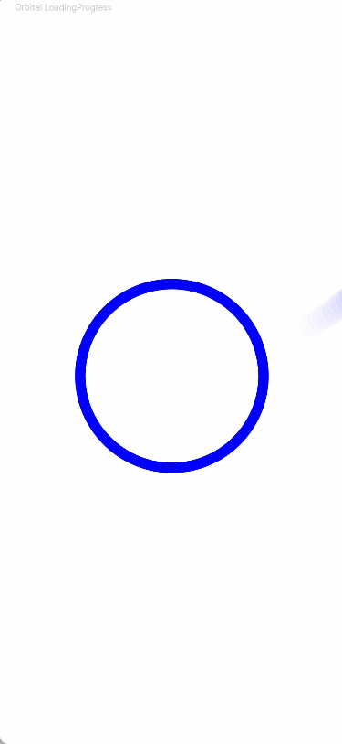

# LoadingProgress

用于显示加载动效的组件。

加载动效在组件不可见时停止，组件的可见状态基于[onVisibleAreaChange](./ts-universal-component-visible-area-change-event.md#onvisibleareachange)处理，可见阈值ratios大于0即视为可见状态。

>  **说明：**
>
> 该组件从API Version 8开始支持。后续版本如有新增内容，则采用上角标单独标记该内容的起始版本。


## 子组件

无


## 接口

LoadingProgress()

创建加载进展组件。

**卡片能力：** 从API version 9开始，该接口支持在ArkTS卡片中使用。

**原子化服务API：** 从API version 11开始，该接口支持在原子化服务中使用。

**系统能力：** SystemCapability.ArkUI.ArkUI.Full

## 属性

除支持[通用属性](ts-component-general-attributes.md)外，还支持以下属性：

>  **说明：**
>
> 组件应设置合理的宽高，当组件宽高设置过大时加载动效可能不符合预期效果。

### color

color(value: ResourceColor)

设置加载进度条前景色。

**卡片能力：** 从API version 9开始，该接口支持在ArkTS卡片中使用。

**原子化服务API：** 从API version 11开始，该接口支持在原子化服务中使用。

**系统能力：** SystemCapability.ArkUI.ArkUI.Full

**参数：** 

| 参数名 | 类型                                       | 必填 | 说明                                                         |
| ------ | ------------------------------------------ | ---- | ------------------------------------------------------------ |
| value  | [ResourceColor](ts-types.md#resourcecolor) | 是   | 加载进度条的前景色。<br/>默认值：<br/>API version 10及以下：'#99666666'<br/>API version 11及以上：'#ff666666' |

### enableLoading<sup>10+</sup>

enableLoading(value: boolean)

设置LoadingProgress动画显示或者不显示。LoadingProgress动画不显示时，该组件依旧占位。通用属性[Visibility.Hidden](ts-universal-attributes-visibility.md#visibility)隐藏的是包括[border](ts-universal-attributes-border.md#border)、[padding](ts-universal-attributes-size.md#padding)等整个组件范围，而enableLoading=false只隐藏LoadingProgress本身动画内容，不包括border等。


**原子化服务API：** 从API version 11开始，该接口支持在原子化服务中使用。

**系统能力：** SystemCapability.ArkUI.ArkUI.Full

**参数：** 

| 参数名 | 类型    | 必填 | 说明                                           |
| ------ | ------- | ---- | ---------------------------------------------- |
| value  | boolean | 是   | LoadingProgress动画是否显示。<br/>默认值：true，true表示显示LoadingProgress动画，false表示不显示LoadingProgress动画。 |

### contentModifier<sup>12+</sup>

contentModifier(modifier: ContentModifier\<LoadingProgressConfiguration>)

定制LoadingProgress内容区的方法。

**原子化服务API：** 从API version 12开始，该接口支持在原子化服务中使用。

**系统能力：** SystemCapability.ArkUI.ArkUI.Full

**参数：**

| 参数名 | 类型                                          | 必填 | 说明                                             |
| ------ | --------------------------------------------- | ---- | ------------------------------------------------ |
| modifier  | [ContentModifier\<LoadingProgressConfiguration>](#loadingprogressconfiguration12对象说明) | 是   | 在LoadingProgress组件上，定制内容区的方法。<br/>modifier： 内容修改器，开发者需要自定义class实现ContentModifier接口。 |

## 事件

支持[通用事件](ts-component-general-events.md)。

## LoadingProgressConfiguration<sup>12+</sup>对象说明

开发者需要自定义class实现ContentModifier接口。

**原子化服务API：** 从API version 12开始，该接口支持在原子化服务中使用。

**系统能力：** SystemCapability.ArkUI.ArkUI.Full

| 名称  | 类型    |    只读    |    可选    |  说明              |
| ------ | ------ | ------ |-------------------------------- |-------------------------------- |
| enableLoading | boolean | 否 | 否 |LoadingProgress动画是否显示。<br/>默认值：true，true表示显示LoadingProgress动画，false表示不显示LoadingProgress动画。 |

## LoadingProgressStyle<sup>(deprecated)</sup>枚举说明

从API version 8开始废弃。

**卡片能力：** 从API version 9开始，该接口支持在ArkTS卡片中使用。

**原子化服务API：** 从API version 11开始，该接口支持在原子化服务中使用。

**系统能力：** SystemCapability.ArkUI.ArkUI.Full

| 名称                     | 说明                                     |
| ---------------------- | ---------------------------------------- |
| Default       | 默认加载样式。API version 8及以后不支持设置。            |
| Circular      | 环形加载样式。API version 8及以后不支持设置。            |
| Orbital       | 彗星形加载样式。API version 8及以后默认为彗星形样式。         |

## 示例

### 示例1（设置颜色）

该示例通过color接口，实现了设置加载动效颜色的功能。

```ts
// xxx.ets
@Entry
@Component
struct LoadingProgressExample {
  build() {
    Column({ space: 5 }) {
      Text('Orbital LoadingProgress ').fontSize(9).fontColor(0xCCCCCC).width('90%')
      LoadingProgress()
        .color(Color.Blue)
        .layoutWeight(1)
    }.width('100%').margin({ top: 5 })
  }
}
```



### 示例2（设置定制内容区）

该示例通过contentModifier接口，实现了定制内容区的功能，并通过enableLoading接口实现了通过按钮切换是否显示LoadingProgress的效果。

```ts
// xxx.ets
import { UIContext } from '@kit.ArkUI'

class MyLoadingProgressStyle implements ContentModifier<LoadingProgressConfiguration> {
  enableLoading: boolean = false
  ctx: UIContext | undefined = undefined

  constructor(enableLoading: boolean, ctx: UIContext) {
    this.enableLoading = enableLoading
    this.ctx = ctx
  }

  applyContent(): WrappedBuilder<[LoadingProgressConfiguration]> {
    return wrapBuilder(buildLoadingProgress)
  }
}

let arr1: string[] =
  ["0", "1", "2", "3", "4", "5", "6", "7", "8", "9", "10", "11", "12", "13", "14", "15", "16", "17", "18", "19"]
let arr2: string[] = ["0", "1", "2", "3", "4", "5", "6", "7", "8", "9"]

@Builder
function buildLoadingProgress(config: LoadingProgressConfiguration) {
  Column({ space: 8 }) {
    Row() {
      Column() {
        Circle({
          width: ((config.contentModifier as MyLoadingProgressStyle).enableLoading) ? 100 : 80,
          height: ((config.contentModifier as MyLoadingProgressStyle).enableLoading) ? 100 : 80
        })
          .fill(((config.contentModifier as MyLoadingProgressStyle).enableLoading) ? Color.Grey : 0x2577e3)
      }.width('50%')

      Column() {
        Button('' + ((config.contentModifier as MyLoadingProgressStyle).enableLoading))
          .onClick((event: ClickEvent) => {
            let uiContext = (config.contentModifier as MyLoadingProgressStyle).ctx;
            if (uiContext) {
              uiContext.getPromptAction().showToast({
                message: ((config.contentModifier as MyLoadingProgressStyle).enableLoading) + ''
              })
            }
          })
          .fontColor(Color.White)
          .backgroundColor(((config.contentModifier as MyLoadingProgressStyle).enableLoading) ? Color.Grey : 0x2577e3)
      }.width('50%')

    }

    Row() {
      Column() {
        Gauge({
          value: (config.contentModifier as MyLoadingProgressStyle).enableLoading ? 50 : 30, min: 11, max: 100
        }) {
          Column() {
            Text('60')
              .maxFontSize("180sp")
              .minFontSize("160.0vp")
              .fontWeight(FontWeight.Medium)
              .fontColor("#ff182431")
              .width('40%')
              .height('30%')
              .textAlign(TextAlign.Center)
              .margin({ top: '22.2%' })
              .textOverflow({ overflow: TextOverflow.Ellipsis })
              .maxLines(1)
          }.width('100%').height('100%')
        }
        .colors(((config.contentModifier as MyLoadingProgressStyle).enableLoading) ? Color.Grey : 0x2577e3)
        .width(200)
        .strokeWidth(18)
        .padding(5)
        .trackShadow({ radius: 7, offsetX: 7, offsetY: 7 })
        .height(200)
      }.width('100%')

    }

    Column() {
      List({ space: 20, initialIndex: 0 }) {
        ForEach(arr2, (item: string) => {
          ListItem() {
            Text((config.contentModifier as MyLoadingProgressStyle).enableLoading ? '' + item : Number(item) * 2 + '')
              .width('100%')
              .height('100%')
              .fontColor((config.contentModifier as MyLoadingProgressStyle).enableLoading ? Color.White : Color.Orange)
              .fontSize((config.contentModifier as MyLoadingProgressStyle).enableLoading ? 16 : 20)
              .textAlign(TextAlign.Center)
              .backgroundColor((config.contentModifier as MyLoadingProgressStyle).enableLoading ? Color.Grey : 0x2577e3)
          }
          .height(110)
          .border({
            width: 2,
            color: Color.White
          })
        }, (item: string) => item)
      }
      .height(200)
      .width('100%')
      .friction(0.6)

      .lanes({
        minLength: (config.contentModifier as MyLoadingProgressStyle).enableLoading ? 40 : 80,
        maxLength: (config.contentModifier as MyLoadingProgressStyle).enableLoading ? 40 : 80
      })
      .scrollBar(BarState.Off)
    }

  }.width("100%").padding(10)
}


@Entry
@Component
struct LoadingProgressDemoExample {
  @State loadingProgressList: (boolean | undefined | null)[] = [undefined, true, null, false]
  @State widthList: (number | string)[] = ['110%', 220, '40%', 80]
  @State loadingProgressIndex: number = 0
  @State clickFlag: number = 0
  scroller: Scroller = new Scroller()

  build() {
    Column() {
      Scroll(this.scroller) {
        Column({ space: 5 }) {
          Column() {
            LoadingProgress()
              .color('#106836')
              .size({ width: '100%' })
              .contentModifier(new MyLoadingProgressStyle(this.loadingProgressList[this.loadingProgressIndex], this.getUIContext()))
          }.width('100%').backgroundColor(0xdcdcdc)
        }.width('100%').margin({ top: 5 })
      }.height('85%')

      Button('点击切换config.enableloading').onClick(() => {
        this.clickFlag++
        this.loadingProgressIndex = (this.loadingProgressIndex + 1) % this.loadingProgressList.length
        console.log('enableLoading:' + this.loadingProgressList[this.loadingProgressIndex])
      }).margin(20)
    }

  }
}
```
