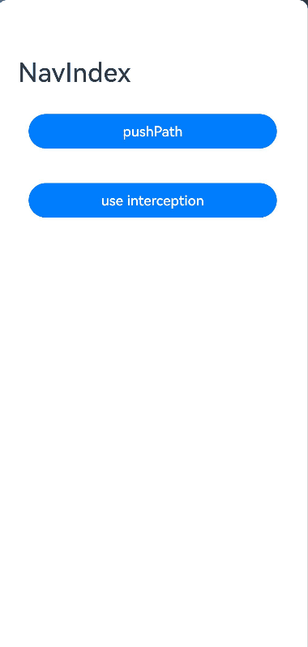
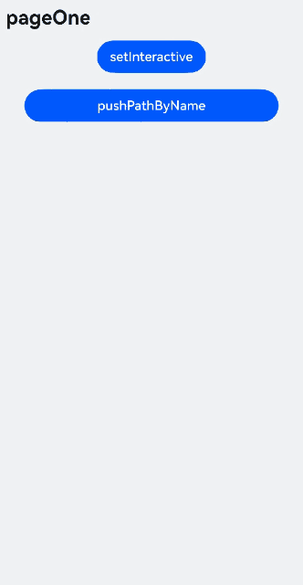
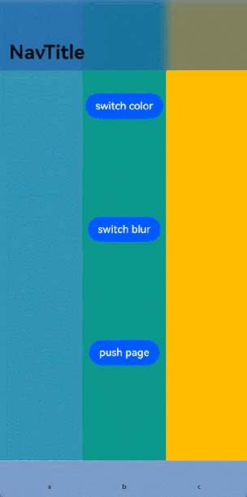
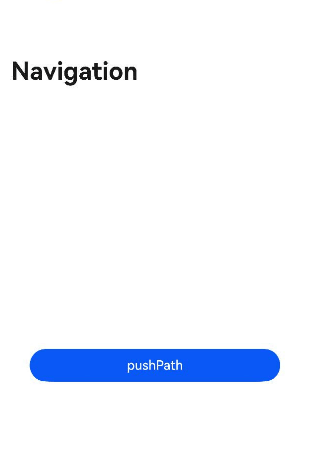
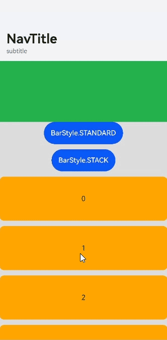
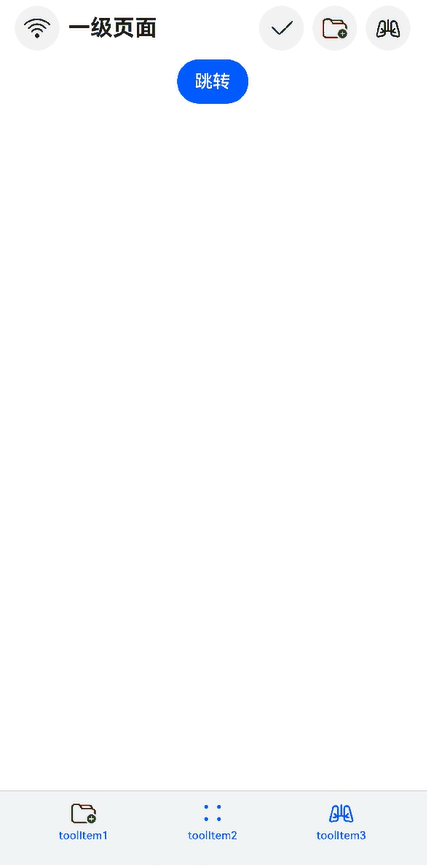
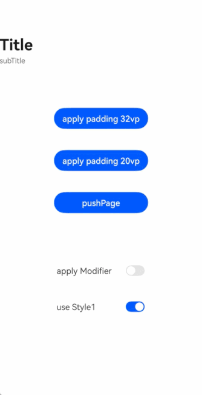

# Navigation

Navigation组件是路由导航的根视图容器，一般作为Page页面的根容器使用，其内部默认包含了标题栏、内容区和工具栏，其中内容区默认首页显示导航内容（Navigation的子组件）或非首页显示（[NavDestination](ts-basic-components-navdestination.md)的子组件），首页和非首页通过路由进行切换。

> **说明：**
>
> 该组件从API Version 8开始支持。后续版本如有新增内容，则采用上角标单独标记该内容的起始版本。
>
> 该组件从API Version 11开始默认支持安全区避让特性(默认值为：expandSafeArea([SafeAreaType.SYSTEM, SafeAreaType.KEYBOARD, SafeAreaType.CUTOUT], [SafeAreaEdge.TOP, SafeAreaEdge.BOTTOM]))，开发者可以重写该属性覆盖默认行为，API Version 11之前的版本需配合[expandSafeArea](ts-universal-attributes-expand-safe-area.md)属性实现安全区避让。


## 子组件

可以包含子组件。

从API Version 9开始，推荐与[NavRouter](ts-basic-components-navrouter.md)组件搭配使用。

从API Version 10开始，推荐使用[NavPathStack](#navpathstack10)配合navDestination属性进行页面路由。

## 接口

### Navigation

Navigation()

**原子化服务API：** 从API version 11开始，该接口支持在原子化服务中使用。

**系统能力：** SystemCapability.ArkUI.ArkUI.Full

### Navigation<sup>10+</sup>

Navigation(pathInfos: NavPathStack)

绑定路由栈到Navigation组件。

**原子化服务API：** 从API version 11开始，该接口支持在原子化服务中使用。

**系统能力：** SystemCapability.ArkUI.ArkUI.Full

**参数：**

| 参数名       | 类型                            | 必填   | 说明   |
| --------- | ------------------------------- | ---- | ------ |
| pathInfos | [NavPathStack](#navpathstack10) | 是    | 路由栈信息。 |

## 属性

除支持[通用属性](ts-universal-attributes-size.md)外，还支持以下属性：

### title

title(value: ResourceStr | CustomBuilder | NavigationCommonTitle | NavigationCustomTitle, options?: NavigationTitleOptions)

设置页面标题。

**原子化服务API：** 从API version 11开始，该接口支持在原子化服务中使用。

**系统能力：** SystemCapability.ArkUI.ArkUI.Full

**参数：** 

| 参数名  | 类型                                                         | 必填 | 说明                                                         |
| ------- | ------------------------------------------------------------ | ---- | ------------------------------------------------------------ |
| value   | [ResourceStr](ts-types.md#resourcestr)<sup>10+</sup>&nbsp;\|&nbsp;[CustomBuilder](ts-types.md#custombuilder8)&nbsp;\|&nbsp;[NavigationCommonTitle](#navigationcommontitle9)<sup>9+</sup>&nbsp;\|&nbsp;[NavigationCustomTitle](#navigationcustomtitle9)<sup>9+</sup> | 是   | 页面标题，使用NavigationCustomTitle类型设置height高度时，[titleMode](#titlemode)属性不会生效。字符串超长时，如果不设置副标题，先缩小再换行（2行）最后...截断。如果设置副标题，先缩小最后...截断。 |
| options | [NavigationTitleOptions](#navigationtitleoptions11)<sup>11+</sup> | 否   | 标题栏选项。                                                   |

### subTitle<sup>(deprecated)</sup>

subTitle(value: string)

设置页面副标题。

从API Version 9开始废弃，建议使用[title](#title)代替。

**系统能力：** SystemCapability.ArkUI.ArkUI.Full

**参数：** 

| 参数名 | 类型   | 必填 | 说明         |
| ------ | ------ | ---- | ------------ |
| value  | string | 是   | 页面副标题。 |

### menus

menus(value: Array&lt;NavigationMenuItem&gt; | CustomBuilder)

> **说明：**
>
> 不支持通过SymbolGlyphModifier对象的fontSize属性修改图标大小、effectStrategy属性修改动效、symbolEffect属性修改动效类型。


设置页面右上角菜单。不设置时不显示菜单项。使用Array<[NavigationMenuItem](#navigationmenuitem)&gt; 写法时，竖屏最多支持显示3个图标，横屏最多支持显示5个图标，多余的图标会被放入自动生成的更多图标。

**原子化服务API：** 从API version 11开始，该接口支持在原子化服务中使用。

**系统能力：** SystemCapability.ArkUI.ArkUI.Full

**参数：** 

| 参数名 | 类型                                                         | 必填 | 说明             |
| ------ | ------------------------------------------------------------ | ---- | ---------------- |
| value  | Array<[NavigationMenuItem](#navigationmenuitem)&gt;&nbsp;\|&nbsp;[CustomBuilder](ts-types.md#custombuilder8) | 是   | 页面右上角菜单。 |

### titleMode

titleMode(value: NavigationTitleMode)

设置页面标题栏显示模式。

**原子化服务API：** 从API version 11开始，该接口支持在原子化服务中使用。

**系统能力：** SystemCapability.ArkUI.ArkUI.Full

**参数：** 

| 参数名 | 类型                                                | 必填 | 说明                                                      |
| ------ | --------------------------------------------------- | ---- | --------------------------------------------------------- |
| value  | [NavigationTitleMode](#navigationtitlemode枚举说明) | 是   | 页面标题栏显示模式。<br/>默认值：NavigationTitleMode.Free |

### toolBar<sup>(deprecated)</sup>

toolBar(value: object | CustomBuilder)

设置工具栏内容。不设置时不显示工具栏。items均分底部工具栏，在每个均分内容区布局文本和图标，文本超长时，逐级缩小，缩小之后换行，最后...截断。

从API version 10开始，该接口不再维护，推荐使用[toolbarConfiguration](#toolbarconfiguration10)代替。

**系统能力：** SystemCapability.ArkUI.ArkUI.Full

**参数：** 

| 参数名 | 类型                                                         | 必填 | 说明         |
| ------ | ------------------------------------------------------------ | ---- | ------------ |
| value  | object&nbsp;\|&nbsp;[CustomBuilder](ts-types.md#custombuilder8) | 是   | 工具栏内容。 |

**object类型说明：** 

| 名称     | 类型            | 必填   | 说明              |
| ------ | ------------- | ---- | --------------- |
| value  | string        | 是    | 工具栏单个选项的显示文本。   |
| icon   | string        | 否    | 工具栏单个选项的图标资源路径。 |
| action | () =&gt; void | 否    | 当前选项被选中的事件回调。   |

### toolbarConfiguration<sup>10+</sup>

toolbarConfiguration(value: Array&lt;ToolbarItem&gt; | CustomBuilder, options?: NavigationToolbarOptions)

> **说明：**
>
> 不支持通过SymbolGlyphModifier对象的fontSize属性修改图标大小、effectStrategy属性修改动效、symbolEffect属性修改动效类型。


设置工具栏内容。不设置时不显示工具栏。

**卡片能力：** 从API version 10开始，该接口支持在ArkTS卡片中使用。

**原子化服务API：** 从API version 11开始，该接口支持在原子化服务中使用。

**系统能力：** SystemCapability.ArkUI.ArkUI.Full

**参数：** 

| 参数名  | 类型                                                         | 必填 | 说明                                                         |
| ------- | ------------------------------------------------------------ | ---- | ------------------------------------------------------------ |
| value   | &nbsp;Array&lt;[ToolbarItem](#toolbaritem10)&gt; &nbsp;\|&nbsp;[CustomBuilder](ts-types.md#custombuilder8) | 是   | 工具栏内容，使用Array&lt;[ToolbarItem](#toolbaritem10)&gt;写法设置的工具栏有如下特性：<br/>工具栏所有选项均分底部工具栏，在每个均分内容区布局文本和图标。<br/>文本超长时，若工具栏选项个数小于5个，优先拓展选项的宽度，最大宽度与屏幕等宽，其次逐级缩小，缩小之后换行，最后...截断。<br/>竖屏最多支持显示5个图标，多余的图标会被放入自动生成的更多图标。横屏时，如果为[Split](#navigationmode9枚举说明)模式，仍按照竖屏规则显示，如果为[Stack](#navigationmode9枚举说明)模式需配合menus属性的Array&lt;[NavigationMenuItem](#navigationmenuitem)&gt;使用，底部工具栏会自动隐藏，同时底部工具栏所有选项移动至页面右上角菜单。<br/>使用[CustomBuilder](ts-types.md#custombuilder8)写法为用户自定义工具栏选项，除均分底部工具栏外不具备以上功能。 |
| options | [NavigationToolbarOptions](#navigationtoolbaroptions11)<sup>11+</sup> | 否   | 工具栏选项。                                                 |

### hideToolBar

hideToolBar(value: boolean)

设置是否隐藏工具栏。

**原子化服务API：** 从API version 11开始，该接口支持在原子化服务中使用。

**系统能力：** SystemCapability.ArkUI.ArkUI.Full

**参数：** 

| 参数名 | 类型    | 必填 | 说明                                                         |
| ------ | ------- | ---- | ------------------------------------------------------------ |
| value  | boolean | 是   | 是否隐藏工具栏。<br/>默认值：false<br/>true: 隐藏工具栏。<br/>false: 显示工具栏。 |

### hideToolBar<sup>13+</sup>

hideToolBar(hide: boolean, animated: boolean)

设置是否隐藏工具栏，设置是否使用动画显隐工具栏。

**原子化服务API：** 从API version 13开始，该接口支持在原子化服务中使用。

**系统能力：** SystemCapability.ArkUI.ArkUI.Full

**参数：** 

| 参数名 | 类型    | 必填 | 说明                                                         |
| ------ | ------- | ---- | ------------------------------------------------------------ |
| hide  | boolean | 是   | 是否隐藏工具栏。<br/>默认值：false<br/>true: 隐藏工具栏。<br/>false: 显示工具栏。 |
| animated  | boolean | 是   | 设置是否使用动画显隐工具栏。<br/>默认值：false<br/>true: 使用动画显示隐藏工具栏。<br/>false: 不使用动画显示隐藏工具栏。 |

### hideTitleBar

hideTitleBar(value: boolean)

设置是否隐藏标题栏。

**原子化服务API：** 从API version 11开始，该接口支持在原子化服务中使用。

**系统能力：** SystemCapability.ArkUI.ArkUI.Full

**参数：** 

| 参数名 | 类型    | 必填 | 说明                                                         |
| ------ | ------- | ---- | ------------------------------------------------------------ |
| value  | boolean | 是   | 是否隐藏标题栏。<br/>默认值：false<br/>true: 隐藏标题栏。<br/>false: 显示标题栏。 |

### hideTitleBar<sup>13+</sup>

hideTitleBar(hide: boolean, animated: boolean)

设置是否隐藏标题栏，设置是否使用动画显隐标题栏。

**原子化服务API：** 从API version 13开始，该接口支持在原子化服务中使用。

**系统能力：** SystemCapability.ArkUI.ArkUI.Full

**参数：** 

| 参数名 | 类型    | 必填 | 说明                                                         |
| ------ | ------- | ---- | ------------------------------------------------------------ |
| hide  | boolean | 是   | 是否隐藏标题栏。<br/>默认值：false<br/>true: 隐藏标题栏。<br/>false: 显示标题栏。 |
| animated  | boolean | 是   | 设置是否使用动画显隐标题栏。<br/>默认值：false<br/>true: 使用动画显示隐藏标题栏。<br/>false: 不使用动画显示隐藏标题栏。 |

### hideBackButton

hideBackButton(value: boolean)

设置是否隐藏标题栏中的返回键。返回键仅针对[titleMode](#titlemode)为NavigationTitleMode.Mini时才生效。

**原子化服务API：** 从API version 11开始，该接口支持在原子化服务中使用。

**系统能力：** SystemCapability.ArkUI.ArkUI.Full

**参数：** 

| 参数名 | 类型    | 必填 | 说明                                                         |
| ------ | ------- | ---- | ------------------------------------------------------------ |
| value  | boolean | 是   | 是否隐藏标题栏中的返回键。 <br/>默认值：false<br/>true: 隐藏返回键。<br/>false: 显示返回键。 |

### navBarWidth<sup>9+</sup>

navBarWidth(value: Length)

设置导航栏宽度。仅在Navigation组件分栏时生效。

**原子化服务API：** 从API version 11开始，该接口支持在原子化服务中使用。

**系统能力：** SystemCapability.ArkUI.ArkUI.Full

**参数：** 

| 参数名 | 类型                         | 必填 | 说明                                      |
| ------ | ---------------------------- | ---- | ----------------------------------------- |
| value  | [Length](ts-types.md#length) | 是   | 导航栏宽度。<br/>默认值：240<br/>单位：vp<br/>undefined：行为不做处理，导航栏宽度与默认值保持一致。 |

### navBarPosition<sup>9+</sup>

navBarPosition(value: NavBarPosition)

设置导航栏位置。仅在Navigation组件分栏时生效。

**原子化服务API：** 从API version 11开始，该接口支持在原子化服务中使用。

**系统能力：** SystemCapability.ArkUI.ArkUI.Full

**参数：** 

| 参数名 | 类型                                       | 必填 | 说明                                          |
| ------ | ------------------------------------------ | ---- | --------------------------------------------- |
| value  | [NavBarPosition](#navbarposition9枚举说明) | 是   | 导航栏位置。<br/>默认值：NavBarPosition.Start |

### mode<sup>9+</sup>

mode(value: NavigationMode)

设置导航栏的显示模式。支持Stack、Split与Auto模式。

**原子化服务API：** 从API version 11开始，该接口支持在原子化服务中使用。

**系统能力：** SystemCapability.ArkUI.ArkUI.Full

**参数：** 

| 参数名 | 类型                                       | 必填 | 说明                                                         |
| ------ | ------------------------------------------ | ---- | ------------------------------------------------------------ |
| value  | [NavigationMode](#navigationmode9枚举说明) | 是   | 导航栏的显示模式。<br/>默认值：NavigationMode.Auto<br/>自适应：基于组件宽度自适应单栏和双栏。 |

### backButtonIcon<sup>9+</sup>

backButtonIcon(value: string | PixelMap | Resource | SymbolGlyphModifier)

> **说明：**
>
> 不支持通过SymbolGlyphModifier对象的fontSize属性修改图标大小、effectStrategy属性修改动效、symbolEffect属性修改动效类型。


设置标题栏中返回键图标。

**原子化服务API：** 从API version 11开始，该接口支持在原子化服务中使用。

**系统能力：** SystemCapability.ArkUI.ArkUI.Full

**参数：** 

| 参数名 | 类型                                                         | 必填 | 说明                 |
| ------ | ------------------------------------------------------------ | ---- | -------------------- |
| value  | string&nbsp;\|&nbsp;[PixelMap](../../apis-image-kit/js-apis-image.md#pixelmap7)&nbsp;\|&nbsp;[Resource](ts-types.md#resource)&nbsp;\|&nbsp;[SymbolGlyphModifier<sup>12+</sup>](ts-universal-attributes-attribute-modifier.md)    | 是   | 标题栏中返回键图标。 |

### hideNavBar<sup>9+</sup>

hideNavBar(value: boolean)

设置是否隐藏导航栏。设置为true时，隐藏Navigation的导航栏，包括标题栏、内容区和工具栏。如果此时路由栈中存在NavDestination页面，则直接显示栈顶NavDestination页面，反之显示空白。

从API Version 9开始到API Version 10仅在双栏模式下生效。从API Version 11开始在单栏、双栏与自适应模式均生效。

**原子化服务API：** 从API version 11开始，该接口支持在原子化服务中使用。

**系统能力：** SystemCapability.ArkUI.ArkUI.Full

**参数：** 

| 参数名 | 类型    | 必填 | 说明                               |
| ------ | ------- | ---- | ---------------------------------- |
| value  | boolean | 是   | 是否隐藏导航栏。<br/>默认值：false |

### navDestination<sup>10+</sup>

navDestination(builder: (name: string, param: unknown) => void)

创建NavDestination组件。使用builder函数，基于name和param构造NavDestination组件。builder下只能有一个根节点。builder中允许在NavDestination组件外包含一层自定义组件， 但自定义组件不允许设置属性和事件，否则仅显示空白。

**原子化服务API：** 从API version 11开始，该接口支持在原子化服务中使用。

**系统能力：** SystemCapability.ArkUI.ArkUI.Full

**参数：** 

| 参数名  | 类型                                   | 必填 | 说明                     |
| ------- | -------------------------------------- | ---- | ------------------------ |
| builder | (name: string, param: unknown) => void | 是   | 创建NavDestination组件。name：NavDestination页面名称。param：NavDestination页面详细参数。 |

### navBarWidthRange<sup>10+</sup>

navBarWidthRange(value: [Dimension, Dimension])

设置导航栏最小和最大宽度（双栏模式下生效）。

**规则：** 优先级规则详见说明。

**原子化服务API：** 从API version 11开始，该接口支持在原子化服务中使用。

**系统能力：** SystemCapability.ArkUI.ArkUI.Full

**参数：** 

| 参数名  | 类型                                                         | 必填 | 说明                                                         |
| ------- | ------------------------------------------------------------ | ---- | ------------------------------------------------------------ |
| value | [[Dimension](ts-types.md#dimension10), [Dimension](ts-types.md#dimension10)] | 是   | 导航栏最小和最大宽度。<br/>默认值：最小默认值 240，最大默认值为组件宽度的40% ，且不大于 432，如果只设置一个值，则未设置的值按照默认值计算。<br/>单位：vp |

### minContentWidth<sup>10+</sup>

minContentWidth(value: Dimension)

设置导航栏内容区最小宽度（双栏模式下生效）。

**规则：** 优先级规则详见说明。

**原子化服务API：** 从API version 11开始，该接口支持在原子化服务中使用。

**系统能力：** SystemCapability.ArkUI.ArkUI.Full

**参数：** 

| 参数名  | 类型                                 | 必填 | 说明                                                         |
| ------- | ------------------------------------ | ---- | ------------------------------------------------------------ |
| value | [Dimension](ts-types.md#dimension10) | 是   | 导航栏内容区最小宽度。<br/>默认值：360<br/>单位：vp<br/>undefined：行为不做处理，导航栏内容区最小宽度与默认值保持一致。<br/>Auto模式断点计算：默认600vp，minNavBarWidth(240vp) + minContentWidth (360vp) |

>  **说明：**
>
>  1. 仅设置navBarWidth，不支持Navigation分割线拖拽。
>
>  2. navBarWidthRange指定分割线可以拖拽范围。如果不设置值，则按照默认值处理。拖拽范围需要满足navBarWidthRange设置的范围和minContentWidth限制。
>
>  3. Navigation显示范围缩小：a. 缩小内容区大小。如果不设置minContentWidth属性，则可以缩小内容区至0， 否则最小缩小至minContentWidth。b. 缩小导航栏大小，缩小时需要满足导航栏宽度大于navBarRange的下限。c. 对显示内容进行裁切。

### ignoreLayoutSafeArea<sup>12+</sup>

ignoreLayoutSafeArea(types?: Array&lt;LayoutSafeAreaType&gt;, edges?: Array&lt;LayoutSafeAreaEdge&gt;)

控制组件的布局，使其扩展到非安全区域

**原子化服务API：** 从API version 12开始，该接口支持在原子化服务中使用。

**系统能力：** SystemCapability.ArkUI.ArkUI.Full

**参数：** 

| 参数名 | 类型                                               | 必填 | 说明                                                         |
| ------ | -------------------------------------------------- | ---- | ------------------------------------------------------------ |
| types  | Array <[LayoutSafeAreaType](ts-types.md#layoutsafeareatype12)> | 否   | 配置扩展安全区域的类型。<br />默认值: <br />[LayoutSafeAreaType.SYSTEM] |
| edges  | Array <[LayoutSafeAreaEdge](ts-types.md#layoutsafeareaedge12)> | 否   | 配置扩展安全区域的方向。<br /> 默认值: <br />[LayoutSafeAreaEdge.TOP, LayoutSafeAreaEdge.BOTTOM]。|

>  **说明：**
>   
>  组件设置LayoutSafeArea之后生效的条件为：   
>  设置LayoutSafeAreaType.SYSTEM时，组件的边界与非安全区域重合时组件能够延伸到非安全区域下。例如：设备顶部状态栏高度100，组件在屏幕中纵向方位的绝对偏移需要在0到100之间。  
>   
>  若组件延伸到非安全区域内，此时在非安全区域里触发的事件（例如：点击事件）等可能会被系统拦截，优先响应状态栏等系统组件。

### systemBarStyle<sup>12+</sup>

systemBarStyle(style: Optional&lt;SystemBarStyle&gt;)

当Navigation中显示Navigation首页时，设置对应系统状态栏的样式。

**原子化服务API：** 从API version 12开始，该接口支持在原子化服务中使用。

**系统能力：** SystemCapability.ArkUI.ArkUI.Full

**参数：** 

| 参数名 | 类型         | 必填 | 说明               |
| ------ | -------------- | ---- | ------------------ |
| style  | Optional&lt;[SystemBarStyle](../js-apis-window.md#systembarstyle12)&gt; | 是   | 系统状态栏样式。 |

>  **使用说明：**
>
> 1. 不建议混合使用systemBarStyle属性和window设置状态栏样式的相关接口，例如：[setWindowSystemBarProperties](../js-apis-window.md#setwindowsystembarproperties9)。
> 2. 初次设置Navigation/NavDestination的systemBarStyle属性时，会备份当前状态栏样式用于后续的恢复场景。
> 3. Navigation总是以首页（页面栈内没有NavDestination时）或者栈顶NavDestination设置的状态栏样式为准。
> 4. Navigation首页或者任何栈顶NavDestination页面，如果设置了有效的systemBarStyle，则会使用设置的样式，反之如果之前已经备份了样式，则使用备份的样式，否则不做任何处理。
> 5. [Split](#navigationmode9枚举说明)模式下的Navigation，如果内容区没有NavDestination，则遵从Navigation首页的设置，反之则遵从栈顶NavDestination的设置。
> 6. 仅支持在主窗口的主页面中使用systemBarStyle设置状态栏样式。
> 7. 仅当Navigation占满整个页面时，设置的样式才会生效，当Navigation没有占满整个页面时，如果有备份的样式，则恢复备份的样式。
> 8. 当页面设置不同样式时，在页面转场开始时生效。
> 9. 非全屏窗口下，Navigation/NavDestination设置的状态栏不生效。

## 事件

### onTitleModeChange

onTitleModeChange(callback: (titleMode: NavigationTitleMode) =&gt; void)

当[titleMode](#titlemode)为NavigationTitleMode.Free时，随着可滚动组件的滑动标题栏模式发生变化时触发此回调。

**原子化服务API：** 从API version 11开始，该接口支持在原子化服务中使用。

**系统能力：** SystemCapability.ArkUI.ArkUI.Full

**参数：** 

| 参数名    | 类型                                                | 必填 | 说明       |
| --------- | --------------------------------------------------- | ---- | ---------- |
| titleMode | [NavigationTitleMode](#navigationtitlemode枚举说明) | 是   | 标题模式。 |

### onNavBarStateChange<sup>9+</sup>

onNavBarStateChange(callback: (isVisible: boolean) =&gt; void) 

导航栏显示状态切换时触发该回调。

**原子化服务API：** 从API version 11开始，该接口支持在原子化服务中使用。

**系统能力：** SystemCapability.ArkUI.ArkUI.Full

**参数：** 

| 参数名    | 类型    | 必填 | 说明                                           |
| --------- | ------- | ---- | ---------------------------------------------- |
| isVisible | boolean | 是   | isVisible为true时表示显示，为false时表示隐藏。 |

### onNavigationModeChange<sup>11+</sup>

onNavigationModeChange(callback: (mode: NavigationMode) =&gt; void) 

当Navigation首次显示或者单双栏状态发生变化时触发该回调。

**原子化服务API：** 从API version 11开始，该接口支持在原子化服务中使用。

**系统能力：** SystemCapability.ArkUI.ArkUI.Full

**参数：** 

| 参数名    | 类型    | 必填 | 说明                                           |
| --------- | ------- | ---- | ---------------------------------------------- |
| mode | [NavigationMode](#navigationmode9枚举说明) | 是   | NavigationMode.Split: 当前Navigation显示为双栏;<br/>NavigationMode.Stack: 当前Navigation显示为单栏。|

### customNavContentTransition<sup>11+</sup>

customNavContentTransition(delegate:(from: NavContentInfo, to: NavContentInfo, operation: NavigationOperation) => NavigationAnimatedTransition | undefined)

自定义转场动画回调。

**原子化服务API：** 从API version 12开始，该接口支持在原子化服务中使用。

**系统能力：** SystemCapability.ArkUI.ArkUI.Full

**参数：** 

| 参数名    | 类型                                                  | 必填 | 说明                    |
| --------- | ----------------------------------------------------- | ---- | ----------------------- |
| from      | [NavContentInfo](#navcontentinfo11)                   | 是   | 退场Destination的页面。 |
| to        | [NavContentInfo](#navcontentinfo11)                   | 是   | 进场Destination的页面。 |
| operation | [NavigationOperation](#navigationoperation11枚举说明) | 是   | 转场类型。              |

**返回值：** 

| 类型                                                         | 说明                                                         |
| ------------------------------------------------------------ | ------------------------------------------------------------ |
| [NavigationAnimatedTransition](#navigationanimatedtransition11)&nbsp;\|&nbsp;undefined | 自定义转场动画协议。<br/>undefined: 返回未定义，执行默认转场动效。 |

## NavPathStack<sup>10+</sup>

Navigation路由栈，允许被继承<sup>12+</sup>。开发者可以在派生类中新增属性方法，也可以重写基类NavPathStack的方法。派生类对象可以替代基类NavPathStack对象使用。使用示例参见[示例10](#示例10)。

### pushPath<sup>10+</sup>

pushPath(info: NavPathInfo, animated?: boolean): void

将info指定的NavDestination页面信息入栈。

**原子化服务API：** 从API version 11开始，该接口支持在原子化服务中使用。

**系统能力：** SystemCapability.ArkUI.ArkUI.Full

**参数：**

| 参数名   | 类型                            | 必填   | 说明                   |
| ---- | ----------------------------- | ---- | -------------------- |
| info | [NavPathInfo](#navpathinfo10) | 是    | NavDestination页面的信息。 |
| animated<sup>11+</sup> | boolean | 否    | 是否支持转场动画，默认值：true。 |

### pushPath<sup>12+</sup>

pushPath(info: NavPathInfo, options?: NavigationOptions): void

将info指定的NavDestination页面信息入栈，具体根据options中指定不同的[LaunchMode](#launchmode12枚举说明)，有不同的行为。

**原子化服务API：** 从API version 12开始，该接口支持在原子化服务中使用。

**系统能力：** SystemCapability.ArkUI.ArkUI.Full

**参数：**

| 参数名   | 类型                            | 必填   | 说明                   |
| ---- | ----------------------------- | ---- | -------------------- |
| info | [NavPathInfo](#navpathinfo10) | 是    | NavDestination页面的信息。 |
| options | [NavigationOptions](#navigationoptions12) | 否    | 页面栈操作选项。 |

### pushPathByName<sup>10+</sup>

pushPathByName(name: string, param: unknown, animated?: boolean): void

将name指定的NavDestination页面信息入栈，传递的数据为param。

**原子化服务API：** 从API version 11开始，该接口支持在原子化服务中使用。

**系统能力：** SystemCapability.ArkUI.ArkUI.Full

**参数：**

| 参数名    | 类型      | 必填   | 说明                    |
| ----- | ------- | ---- | --------------------- |
| name  | string  | 是    | NavDestination页面名称。   |
| param | unknown | 是    | NavDestination页面详细参数。 |
| animated<sup>11+</sup> | boolean | 否    | 是否支持转场动画，默认值：true。 |

### pushPathByName<sup>11+</sup>

pushPathByName(name: string, param: Object, onPop: Callback\<PopInfo>, animated?: boolean): void

将name指定的NavDestination页面信息入栈，传递的数据为param，添加onPop回调接收入栈页面出栈时的返回结果，并进行处理。

**原子化服务API：** 从API version 12开始，该接口支持在原子化服务中使用。

**系统能力：** SystemCapability.ArkUI.ArkUI.Full

**参数：**

| 参数名 | 类型 | 必填 | 说明 |
|------|------|------|------|
| name  | string  | 是    | NavDestination页面名称。   |
| param | Object | 是    | NavDestination页面详细参数。 |
| onPop | Callback\<[PopInfo](#popinfo11)> | 是 | Callback回调，用于页面出栈时触发该回调处理返回结果。仅pop中设置result参数后触发。 |
| animated | boolean | 否    | 是否支持转场动画，默认值：true。 |

### pushDestination<sup>11+</sup>

pushDestination(info: NavPathInfo, animated?: boolean): Promise&lt;void&gt;

将info指定的NavDestination页面信息入栈，使用Promise异步回调返回接口调用结果。

**原子化服务API：** 从API version 12开始，该接口支持在原子化服务中使用。

**系统能力：** SystemCapability.ArkUI.ArkUI.Full

**参数：**

| 参数名   | 类型                            | 必填   | 说明                   |
| ---- | ----------------------------- | ---- | -------------------- |
| info | [NavPathInfo](#navpathinfo10) | 是    | NavDestination页面的信息。 |
| animated | boolean | 否    | 是否支持转场动画，默认值：true。 |

**返回值：**

| 类型                | 说明        |
| ------------------- | --------- |
| Promise&lt;void&gt; | 异常返回结果。 |

**错误码：**

以下错误码的详细介绍请参见[通用错误码](../../errorcode-universal.md)和[ohos.router(页面路由)](../errorcode-router.md)错误码。

| 错误码ID   | 错误信息 |
| --------- | ------- |
| 401      | Parameter error. Possible causes: 1. Mandatory parameters are left unspecified; 2.Incorrect parameters types; 3. Parameter verification failed.   |
| 100001    | Internal error.|
| 100005    | Builder function not registered. |
| 100006    | NavDestination not found.|

### pushDestination<sup>12+</sup>

pushDestination(info: NavPathInfo, options?: NavigationOptions): Promise&lt;void&gt;

将info指定的NavDestination页面信息入栈，使用Promise异步回调返回接口调用结果，具体根据options中指定不同的[LaunchMode](#launchmode12枚举说明)，有不同的行为。

**原子化服务API：** 从API version 12开始，该接口支持在原子化服务中使用。

**系统能力：** SystemCapability.ArkUI.ArkUI.Full

**参数：**

| 参数名   | 类型                            | 必填   | 说明                   |
| ---- | ----------------------------- | ---- | -------------------- |
| info | [NavPathInfo](#navpathinfo10) | 是    | NavDestination页面的信息。 |
| options | [NavigationOptions](#navigationoptions12) | 否    | 页面栈操作选项。 |

**返回值：**

| 类型                | 说明        |
| ------------------- | --------- |
| Promise&lt;void&gt; | 异常返回结果。 |

**错误码：**

以下错误码的详细介绍请参见[通用错误码](../../errorcode-universal.md)和[ohos.router(页面路由)](../errorcode-router.md)错误码。

| 错误码ID   | 错误信息 |
| --------- | ------- |
| 401      | Parameter error. Possible causes: 1. Mandatory parameters are left unspecified; 2.Incorrect parameters types; 3. Parameter verification failed.   |
| 100001    | Internal error.|
| 100005    | Builder function not registered. |
| 100006    | NavDestination not found.|

### pushDestinationByName<sup>11+</sup>

pushDestinationByName(name: string, param: Object, animated?: boolean): Promise&lt;void&gt;

将name指定的NavDestination页面信息入栈，传递的数据为param，使用Promise异步回调返回接口调用结果。

**原子化服务API：** 从API version 12开始，该接口支持在原子化服务中使用。

**系统能力：** SystemCapability.ArkUI.ArkUI.Full

**参数：**

| 参数名    | 类型      | 必填   | 说明                    |
| ----- | ------- | ---- | --------------------- |
| name  | string  | 是    | NavDestination页面名称。   |
| param | Object | 是    | NavDestination页面详细参数。 |
| animated | boolean | 否    | 是否支持转场动画，默认值：true。 |

**返回值：**

| 类型                | 说明        |
| ------------------- | --------- |
| Promise&lt;void&gt; | 异常返回结果。 |

**错误码：**

以下错误码的详细介绍请参见[通用错误码](../../errorcode-universal.md)和[ohos.router(页面路由)](../errorcode-router.md)错误码。

| 错误码ID   | 错误信息 |
| --------- | ------- |
| 401      | Parameter error. Possible causes: 1. Mandatory parameters are left unspecified; 2.Incorrect parameters types; 3. Parameter verification failed.   |
| 100001    | Internal error.|
| 100005    | Builder function not registered. |
| 100006    | NavDestination not found.|

### pushDestinationByName<sup>11+</sup>

pushDestinationByName(name: string, param: Object, onPop: Callback\<PopInfo>, animated?: boolean): Promise&lt;void&gt;

将name指定的NavDestination页面信息入栈，传递的数据为param，并且添加用于页面出栈时处理返回结果的OnPop回调，使用Promise异步回调返回接口调用结果。

**原子化服务API：** 从API version 12开始，该接口支持在原子化服务中使用。

**系统能力：** SystemCapability.ArkUI.ArkUI.Full

**参数：**

| 参数名    | 类型      | 必填   | 说明                    |
| ----- | ------- | ---- | --------------------- |
| name  | string  | 是    | NavDestination页面名称。   |
| param | Object | 是    | NavDestination页面详细参数。 |
| onPop | Callback\<[PopInfo](#popinfo11)> | 是    | Callback回调，用于页面出栈时处理返回结果。仅pop中设置result参数后触发。 |
| animated | boolean | 否    | 是否支持转场动画，默认值：true。 |

**返回值：**

| 类型                | 说明        |
| ------------------- | --------- |
| Promise&lt;void&gt; | 异常返回结果。 |

**错误码：**

以下错误码的详细介绍请参见[通用错误码](../../errorcode-universal.md)和[ohos.router(页面路由)](../errorcode-router.md)错误码。

| 错误码ID   | 错误信息 |
| --------- | ------- |
| 401      | Parameter error. Possible causes: 1. Mandatory parameters are left unspecified; 2.Incorrect parameters types; 3. Parameter verification failed.   |
| 100001    | Internal error.|
| 100005    | Builder function not registered. |
| 100006    | NavDestination not found.|

### replacePath<sup>11+</sup>

replacePath(info: NavPathInfo, animated?: boolean): void

将当前页面栈栈顶退出，将info指定的NavDestination页面信息入栈。

**原子化服务API：** 从API version 12开始，该接口支持在原子化服务中使用。

**系统能力：** SystemCapability.ArkUI.ArkUI.Full

**参数：**

| 参数名   | 类型                            | 必填   | 说明                   |
| ---- | ----------------------------- | ---- | -------------------- |
| info | [NavPathInfo](#navpathinfo10) | 是    | 新栈顶页面参数信息 |
| animated<sup>11+</sup> | boolean | 否    | 是否支持转场动画，默认值：true。 |

### replacePath<sup>12+</sup>

replacePath(info: NavPathInfo, options?: NavigationOptions): void

替换页面栈操作，具体根据options中指定不同的[LaunchMode](#launchmode12枚举说明)，有不同的行为。

**原子化服务API：** 从API version 12开始，该接口支持在原子化服务中使用。

**系统能力：** SystemCapability.ArkUI.ArkUI.Full

**参数：**

| 参数名   | 类型                            | 必填   | 说明                   |
| ---- | ----------------------------- | ---- | -------------------- |
| info | [NavPathInfo](#navpathinfo10) | 是    | 新栈顶页面参数信息。 |
| options | [NavigationOptions](#navigationoptions12) | 否    | 页面栈操作选项。 |

### replacePathByName<sup>11+</sup>

replacePathByName(name: string, param: Object, animated?: boolean): void

将当前页面栈栈顶退出，将name指定的页面入栈。

**原子化服务API：** 从API version 12开始，该接口支持在原子化服务中使用。

**系统能力：** SystemCapability.ArkUI.ArkUI.Full

**参数：**

| 参数名    | 类型      | 必填   | 说明                    |
| ----- | ------- | ---- | --------------------- |
| name  | string  | 是    | NavDestination页面名称。   |
| param | Object | 是    | NavDestination页面详细参数。 |
| animated<sup>11+</sup> | boolean | 否    | 是否支持转场动画，默认值：true。 |

### removeByIndexes<sup>11+</sup>

removeByIndexes(indexes: Array<number\>): number

将页面栈内索引值在indexes中的NavDestination页面删除。

**原子化服务API：** 从API version 12开始，该接口支持在原子化服务中使用。

**系统能力：** SystemCapability.ArkUI.ArkUI.Full

**参数：**

| 参数名    | 类型      | 必填   | 说明                    |
| ----- | ------- | ---- | --------------------- |
| indexes  | Array<number\>  | 是    | 待删除NavDestination页面的索引值数组。   |

**返回值：**

| 类型          | 说明                       |
| ----------- | ------------------------ |
| number | 返回删除的NavDestination页面数量。 |

### removeByName<sup>11+</sup>

removeByName(name: string): number

将页面栈内指定name的NavDestination页面删除。

**原子化服务API：** 从API version 12开始，该接口支持在原子化服务中使用。

**系统能力：** SystemCapability.ArkUI.ArkUI.Full

**参数：**

| 参数名    | 类型      | 必填   | 说明                    |
| ----- | ------- | ---- | --------------------- |
| name  | string  | 是    | 删除的NavDestination页面的名字。   |

**返回值：**

| 类型          | 说明                       |
| ----------- | ------------------------ |
| number | 返回删除的NavDestination页面数量。 |

### removeByNavDestinationId<sup>12+</sup>

removeByNavDestinationId(navDestinationId: string): boolean

将页面栈内指定navDestinationId的NavDestination页面删除。navDestinationId可以在NavDestination的[onReady](ts-basic-components-navdestination.md#onready11)回调中获取，也可以在[NavDestinationInfo](../js-apis-arkui-observer.md#navdestinationinfo)中获取。

**原子化服务API：** 从API version 12开始，该接口支持在原子化服务中使用。

**系统能力：** SystemCapability.ArkUI.ArkUI.Full

**参数：**

| 参数名    | 类型      | 必填   | 说明                    |
| ----- | ------- | ---- | --------------------- |
| navDestinationId  | string  | 是    | 删除的NavDestination页面的唯一标识符navDestinationId。   |

**返回值：**

| 类型          | 说明                       |
| ----------- | ------------------------ |
| boolean | 返回是否成功删除该页面，true为删除成功。 |

### pop<sup>10+</sup>

pop(animated?: boolean): NavPathInfo | undefined

弹出路由栈栈顶元素。

**原子化服务API：** 从API version 11开始，该接口支持在原子化服务中使用。

**系统能力：** SystemCapability.ArkUI.ArkUI.Full

**参数：**

| 参数名   | 类型                            | 必填   | 说明                   |
| ---- | ----------------------------- | ---- | -------------------- |
| animated<sup>11+</sup> | boolean | 否    | 是否支持转场动画，默认值：true。 |

**返回值：**

| 类型          | 说明                       |
| ----------- | ------------------------ |
| [NavPathInfo](#navpathinfo10) | 返回栈顶NavDestination页面的信息。 |
| undefined   | 当路由栈为空时返回undefined。      |

### pop<sup>11+</sup>

pop(result: Object, animated?: boolean): NavPathInfo | undefined

弹出路由栈栈顶元素，并触发onPop回调传入页面处理结果。

**原子化服务API：** 从API version 12开始，该接口支持在原子化服务中使用。

**系统能力：** SystemCapability.ArkUI.ArkUI.Full

**参数：**

| 参数名   | 类型                            | 必填   | 说明                   |
| ---- | ----------------------------- | ---- | -------------------- |
| result | Object | 是 | 页面自定义处理结果。不支持boolean类型。 |
| animated | boolean | 否    | 是否支持转场动画，默认值：true。 |

**返回值：**

| 类型          | 说明                       |
| ----------- | ------------------------ |
| [NavPathInfo](#navpathinfo10) | 返回栈顶NavDestination页面的信息。 |
| undefined   | 当路由栈为空时返回undefined。      |

### popToName<sup>10+</sup>

popToName(name: string, animated?: boolean): number

回退路由栈到由栈底开始第一个名为name的NavDestination页面。

**原子化服务API：** 从API version 11开始，该接口支持在原子化服务中使用。

**系统能力：** SystemCapability.ArkUI.ArkUI.Full

**参数：**

| 参数名   | 类型     | 必填   | 说明                  |
| ---- | ------ | ---- | ------------------- |
| name | string | 是    | NavDestination页面名称。 |
| animated<sup>11+</sup> | boolean | 否    | 是否支持转场动画，默认值：true。 |

**返回值：**

| 类型     | 说明                                       |
| ------ | ---------------------------------------- |
| number | 如果栈中存在名为name的NavDestination页面，则返回由栈底开始第一个名为name的NavDestination页面的索引，否则返回-1。 |

### popToName<sup>11+</sup>

popToName(name: string, result: Object, animated?: boolean): number

回退路由栈到由栈底开始第一个名为name的NavDestination页面，并触发onPop回调传入页面处理结果。

**原子化服务API：** 从API version 12开始，该接口支持在原子化服务中使用。

**系统能力：** SystemCapability.ArkUI.ArkUI.Full

**参数：**

| 参数名   | 类型     | 必填   | 说明                  |
| ---- | ------ | ---- | ------------------- |
| name | string | 是    | NavDestination页面名称。 |
| result | Object | 是 | 页面自定义处理结果。不支持boolean类型。 |
| animated | boolean | 否    | 是否支持转场动画，默认值：true。 |

**返回值：**

| 类型     | 说明                                       |
| ------ | ---------------------------------------- |
| number | 如果栈中存在名为name的NavDestination页面，则返回由栈底开始第一个名为name的NavDestination页面的索引，否则返回-1。 |

### popToIndex<sup>10+</sup>

popToIndex(index: number, animated?: boolean): void

回退路由栈到index指定的NavDestination页面。

**原子化服务API：** 从API version 11开始，该接口支持在原子化服务中使用。

**系统能力：** SystemCapability.ArkUI.ArkUI.Full

**参数：**

| 参数名    | 类型     | 必填   | 说明                     |
| ----- | ------ | ---- | ---------------------- |
| index | number | 是    | NavDestination页面的位置索引。 |
| animated<sup>11+</sup> | boolean | 否    | 是否支持转场动画，默认值：true。 |

### popToIndex<sup>11+</sup>

popToIndex(index: number, result: Object, animated?: boolean): void

回退路由栈到index指定的NavDestination页面，并触发onPop回调传入页面处理结果。

**原子化服务API：** 从API version 11开始，该接口支持在原子化服务中使用。

**系统能力：** SystemCapability.ArkUI.ArkUI.Full

**参数：**

| 参数名    | 类型     | 必填   | 说明                     |
| ----- | ------ | ---- | ---------------------- |
| index | number | 是    | NavDestination页面的位置索引。 |
| result | Object | 是 | 页面自定义处理结果。不支持boolean类型。 |
| animated | boolean | 否    | 是否支持转场动画，默认值：true。 |

### moveToTop<sup>10+</sup>

moveToTop(name: string, animated?: boolean): number

将由栈底开始第一个名为name的NavDestination页面移到栈顶。

**原子化服务API：** 从API version 11开始，该接口支持在原子化服务中使用。

**系统能力：** SystemCapability.ArkUI.ArkUI.Full

**参数：**

| 参数名   | 类型     | 必填   | 说明                  |
| ---- | ------ | ---- | ------------------- |
| name | string | 是    | NavDestination页面名称。 |
| animated<sup>11+</sup> | boolean | 否    | 是否支持转场动画，默认值：true。 |

**返回值：**

| 类型     | 说明                                       |
| ------ | ---------------------------------------- |
| number | 如果栈中存在名为name的NavDestination页面，则返回由栈底开始第一个名为name的NavDestination页面的当前索引，否则返回-1。 |

### moveIndexToTop<sup>10+</sup>

moveIndexToTop(index: number, animated?: boolean): void

将index指定的NavDestination页面移到栈顶。

**原子化服务API：** 从API version 11开始，该接口支持在原子化服务中使用。

**系统能力：** SystemCapability.ArkUI.ArkUI.Full

**参数：**

| 参数名    | 类型     | 必填   | 说明                     |
| ----- | ------ | ---- | ---------------------- |
| index | number | 是    | NavDestination页面的位置索引。 |
| animated<sup>11+</sup> | boolean | 否    | 是否支持转场动画，默认值：true。 |

### clear<sup>10+</sup>

clear(animated?: boolean): void

清除栈中所有页面。

**原子化服务API：** 从API version 11开始，该接口支持在原子化服务中使用。

**系统能力：** SystemCapability.ArkUI.ArkUI.Full

**参数：**

| 参数名    | 类型     | 必填   | 说明                     |
| ----- | ------ | ---- | ---------------------- |
| animated<sup>11+</sup> | boolean | 否    | 是否支持转场动画，默认值：true。 |

### getAllPathName<sup>10+</sup>

getAllPathName(): Array<string\>

获取栈中所有NavDestination页面的名称。

**原子化服务API：** 从API version 11开始，该接口支持在原子化服务中使用。

**系统能力：** SystemCapability.ArkUI.ArkUI.Full

**返回值：**

| 类型             | 说明                         |
| -------------- | -------------------------- |
| Array<string\> | 返回栈中所有NavDestination页面的名称。 |

### getParamByIndex<sup>10+</sup>

getParamByIndex(index: number): unknown | undefined

获取index指定的NavDestination页面的参数信息。

**原子化服务API：** 从API version 11开始，该接口支持在原子化服务中使用。

**系统能力：** SystemCapability.ArkUI.ArkUI.Full

**参数：**

| 参数名    | 类型     | 必填   | 说明                     |
| ----- | ------ | ---- | ---------------------- |
| index | number | 是    | NavDestination页面的位置索引。 |

**返回值：**

| 类型        | 说明                         |
| --------- | -------------------------- |
| unknown   | 返回对应NavDestination页面的参数信息。 |
| undefined | 传入index无效时返回undefined。     |

### getParamByName<sup>10+</sup>

getParamByName(name: string): Array<unknown\>

获取全部名为name的NavDestination页面的参数信息。

**原子化服务API：** 从API version 11开始，该接口支持在原子化服务中使用。

**系统能力：** SystemCapability.ArkUI.ArkUI.Full

**参数：**

| 参数名   | 类型     | 必填   | 说明                  |
| ---- | ------ | ---- | ------------------- |
| name | string | 是    | NavDestination页面名称。 |

**返回值：**

| 类型              | 说明                                |
| --------------- | --------------------------------- |
| Array<unknown\> | 返回全部名为name的NavDestination页面的参数信息。 |

### getIndexByName<sup>10+</sup>

getIndexByName(name: string): Array<number\>

获取全部名为name的NavDestination页面的位置索引。

**原子化服务API：** 从API version 11开始，该接口支持在原子化服务中使用。

**系统能力：** SystemCapability.ArkUI.ArkUI.Full

**参数：**

| 参数名   | 类型     | 必填   | 说明                  |
| ---- | ------ | ---- | ------------------- |
| name | string | 是    | NavDestination页面名称。 |

**返回值：**

| 类型             | 说明                                |
| -------------- | --------------------------------- |
| Array<number\> | 返回全部名为name的NavDestination页面的位置索引。 |

### size<sup>10+</sup>

size(): number

获取栈大小。

**原子化服务API：** 从API version 11开始，该接口支持在原子化服务中使用。

**系统能力：** SystemCapability.ArkUI.ArkUI.Full

**返回值：**

| 类型     | 说明     |
| ------ | ------ |
| number | 返回栈大小。 |

### disableAnimation<sup>11+</sup>

disableAnimation(value: boolean): void

关闭（true）或打开（false）当前Navigation中所有转场动画。

**原子化服务API：** 从API version 12开始，该接口支持在原子化服务中使用。

**系统能力：** SystemCapability.ArkUI.ArkUI.Full

**参数：**

| 参数名    | 类型     | 必填   | 说明                    |
| ----- | ------ | ---- | ---------------------- |
| value | boolean | 是   | 是否关闭转场动画，默认值：false。 |

### getParent<sup>11+</sup>

getParent(): NavPathStack | null

获取父NavPathStack。<br/>当出现Navigation嵌套Navigation的情况时（可以是直接嵌套，也可以是间接嵌套），内部Navigation的NavPathStack能够获取到外层Navigation的NavPathStack。

**原子化服务API：** 从API version 11开始，该接口支持在原子化服务中使用。

**系统能力：** SystemCapability.ArkUI.ArkUI.Full

**返回值：**

| 类型     | 说明     |
| ------ | ------ |
| [NavPathStack](#navpathstack10) \| null | 如果当前NavPathStack所属Navigation的外层有另外的一层Navigation，则能够获取到外层Navigation的NavPathStack。否则获取不到NavPathStack，返回null。 |

### setInterception<sup>12+</sup>

setInterception(interception: NavigationInterception): void

设置Navigation页面跳转拦截回调。

**原子化服务API：** 从API version 12开始，该接口支持在原子化服务中使用。

**系统能力：** SystemCapability.ArkUI.ArkUI.Full

**参数：**

| 参数名    | 类型     | 必填   | 说明                     |
| ---- | ---- | --- | ---|
|interception| [NavigationInterception](#navigationinterception12)| 是 | 设置Navigation跳转拦截对象。|

## NavPathInfo<sup>10+</sup>

路由页面信息。

### constructor

constructor(name: string, param: unknown, onPop?: Callback\<PopInfo>, isEntry?: boolean)

**系统能力：** SystemCapability.ArkUI.ArkUI.Full

| 参数名    | 类型      | 必填   | 说明                   |
| ----- | ------- | ---- | --------------------- |
| name  | string  | 是    | NavDestination页面名称。   |
| param | unknown | 是    | NavDestination页面详细参数。 |
| onPop<sup>11+</sup> | Callback\<[PopInfo](#popinfo11)> | 否 | NavDestination页面触发pop时返回的回调。 |
| isEntry<sup>12+</sup> | boolean | 否 | 标记NavDestination是否为入口页面。<br/>默认值：false <br/>标记清理时机：1、在当前navDestination页面触发一次全局back事件。2、应用退至后台。<br/>**说明**：<br/>入口NavDestination不响应应用内的全局back事件，直接触发应用间的全局back事件。 |

### 属性

**系统能力：** SystemCapability.ArkUI.ArkUI.Full

| 名称    | 类型      | 必填   | 说明                   |
| ----- | ------- | ---- | --------------------- |
| name  | string  | 是    | NavDestination页面名称。<br/>**原子化服务API：** 从API version 11开始，该接口支持在原子化服务中使用。 |
| param | unknown | 否    | NavDestination页面详细参数。<br/>**原子化服务API：** 从API version 11开始，该接口支持在原子化服务中使用。 |
| onPop<sup>11+</sup> | Callback\<[PopInfo](#popinfo11)> | 否 | NavDestination页面触发pop时返回的回调。<br/>**原子化服务API：** 从API version 12开始，该接口支持在原子化服务中使用。 |
| isEntry<sup>12+</sup> | boolean | 否 | 标记NavDestination是否为入口页面。<br/>默认值：false <br/>标记清理时机：1、在当前navDestination页面触发一次全局back事件。2、应用退至后台。<br/>**说明**：<br/>入口NavDestination不响应应用内的全局back事件，直接触发应用间的全局back事件。<br/>**原子化服务API：** 从API version 12开始，该接口支持在原子化服务中使用。 |

## PopInfo<sup>11+</sup>

下一个页面返回的回调信息载体。

**原子化服务API：** 从API version 12开始，该接口支持在原子化服务中使用。

**系统能力：** SystemCapability.ArkUI.ArkUI.Full

| 名称 | 类型 | 必填 | 说明 |
|------|-----|-----|-----|
| info | [NavPathInfo](#navpathinfo10) | 是 | 页面触发返回时的当前页面信息，系统自动获取填入，无需开发者传入。 |
| result | Object | 是 | 页面触发返回时的结果，开发者自定义对象。 |

## NavContentInfo<sup>11+</sup>

跳转Destination信息。

**原子化服务API：** 从API version 12开始，该接口支持在原子化服务中使用。

**系统能力：** SystemCapability.ArkUI.ArkUI.Full

| 名称  | 类型  | 必填  | 说明  |
|-------|-------|------|-------|
| name | string | 否 | NavDestination名称，如果为根视图(NavBar)，则返回值为undefined。|
| index | number | 是 | NavDestination在NavPathStack中的序号， 如果为根视图(NavBar)，则返回值为 -1。|
| mode | [NavDestinationMode](ts-basic-components-navdestination.md#navdestinationmode枚举说明) | 否 | NavDestination的模式，如果是根视图(NavBar)，则返回值为undefined。|
| param<sup>12+</sup> | Object | 否 | NavDestination页面加载的参数。|
| navDestinationId<sup>12+</sup> | string | 否 | NavDestination的唯一标识符。|

## NavigationAnimatedTransition<sup>11+</sup>

自定义转场动画协议，开发者需实现该协议来定义Navigation路由跳转的跳转动画。

**原子化服务API：** 从API version 12开始，该接口支持在原子化服务中使用。

**系统能力：** SystemCapability.ArkUI.ArkUI.Full

| 名称 | 类型 | 必填 | 说明 |
|------|-----|-----|------|
| timeout | number | 否 | 动画超时结束时间。<br> 单位：ms。<br> 默认值：可交互动画无默认值，不可交互动画默认超时时间为1000ms。|
| transition | (transitionProxy : [NavigationTransitionProxy](#navigationtransitionproxy-11)) =&gt; void | 是 | 自定义转场动画执行回调。<br> transitionProxy: 自定义转场动画代理对象。|
| onTransitionEnd | (success: boolean)&nbsp;=>&nbsp;void | 否 | 转场完成回调。<br> success: 转场是否成功。 |
| isInteractive<sup>12+</sup> | boolean | 否 | 本次转场动画是否为可交互转场。<br> 默认值：false。|

## NavigationTransitionProxy <sup>11+</sup>

自定义转场动画代理对象。

**系统能力：** SystemCapability.ArkUI.ArkUI.Full

### 属性

**原子化服务API：** 从API version 12开始，该接口支持在原子化服务中使用。

**系统能力：** SystemCapability.ArkUI.ArkUI.Full

| 名称 | 类型  | 必填 | 说明  |
|------|-------|-----|-------|
| from | [NavContentInfo](#navcontentinfo11) | 是 | 退场页面信息。|
| to | [NavContentInfo](#navcontentinfo11) | 是 | 进场页面信息。|
| isInteractive<sup>12+</sup> | boolean | 否 | 是否为可交互转场动画。|

### finishTransition

finishTransition(): void;

结束本次自定义转场动画，开发者需要主动触发该方法来结束本次转场，否则系统会在timeout的时间后结束本次转场。

**原子化服务API：** 从API version 12开始，该接口支持在原子化服务中使用。

**系统能力：** SystemCapability.ArkUI.ArkUI.Full

### cancelTransition<sup>12+</sup>

cancelTransition?(): void;

取消本次交互转场，恢复到页面跳转前的页面栈(不支持取消不可交互转场动画)。

**原子化服务API：** 从API version 12开始，该接口支持在原子化服务中使用。

**系统能力：** SystemCapability.ArkUI.ArkUI.Full

### updateTransition<sup>12+</sup>

updateTransition?(progress: number): void;

更新交互转场动画进度(不可交互动画不支持动画进度设置)。

**原子化服务API：** 从API version 12开始，该接口支持在原子化服务中使用。

**系统能力：** SystemCapability.ArkUI.ArkUI.Full

**参数：**

| 参数名 | 类型 | 必填 | 说明 |
|------|------|------|-----|
| progress | number | 是 | 设置交互转场动画进度百分比。取值范围 0-1。|

## NavigationInterception<sup>12+</sup>

Navigation跳转拦截对象。

**原子化服务API：** 从API version 12开始，该接口支持在原子化服务中使用。

**系统能力：** SystemCapability.ArkUI.ArkUI.Full

| 名称    | 类型     | 必填 | 说明    |
| ---- | ----- | ----- | ----   |
| willShow | [InterceptionShowCallback](#interceptionshowcallback12) | 否 | 页面跳转前拦截，允许操作栈，在当前跳转中生效。|
| didShow | [InterceptionShowCallback](#interceptionshowcallback12) | 否 | 页面跳转后回调。在该回调中操作栈在下一次跳转中刷新。|
| modeChange | [InterceptionModeCallback](#interceptionmodecallback12) | 否 | Navigation单双栏显示状态发生变更时触发该回调。|

### InterceptionShowCallback<sup>12+</sup>

type InterceptionShowCallback = (from: NavDestinationContext|NavBar, to: NavDestinationContext|NavBar, operation: NavigationOperation, isAnimated: boolean) => void

navigation页面跳转前和页面跳转后的拦截回调。

**原子化服务API：** 从API version 12开始，该接口支持在原子化服务中使用。

**系统能力：** SystemCapability.ArkUI.ArkUI.Full

| 参数名  | 类型    | 必填 | 说明              |
| ------ | ------ | ---- | ---------------- |
| from | [NavDestinationContext](ts-basic-components-navdestination.md#navdestinationcontext11) \|[NavBar](#navbar12) | 是 |  页面跳转之前的栈顶页面信息。参数值为navBar，则表示跳转前的页面为Navigation首页。 |
| to | [NavDestinationContext](ts-basic-components-navdestination.md#navdestinationcontext11) \|[NavBar](#navbar12) | 是 | 页面跳转之后的栈顶页面信息。参数值为navBar，则表示跳转的目标页面为Navigation首页。 |
| operation | [NavigationOperation](#navigationoperation11枚举说明) | 是 | 当前页面跳转类型。 |
| isAnimated | boolean | 是 | 页面跳转是否有动画。 |

### InterceptionModeCallback<sup>12+</sup>

type InterceptionModeCallback = (mode: NavigationMode) => void

navigation单双栏显示状态发生变更时的拦截回调。

**原子化服务API：** 从API version 12开始，该接口支持在原子化服务中使用。

**系统能力：** SystemCapability.ArkUI.ArkUI.Full

| 参数名  | 类型    | 必填 | 说明              |
| ------ | ------ | ---- | ---------------- |
| mode | [NavigationMode](#navigationmode9枚举说明) | 是 |  导航栏的显示模式。 |

## NavBar<sup>12+</sup>

type NavBar = 'navBar'

Navigation首页名字。

**原子化服务API：** 从API version 12开始，该接口支持在原子化服务中使用。

**系统能力：** SystemCapability.ArkUI.ArkUI.Full

| 类型     | 说明             |
| -------- | ---------------- |
| 'navBar' | Navigation首页。 |

## NavigationMenuItem

**系统能力：** SystemCapability.ArkUI.ArkUI.Full

| 名称     | 类型            | 必填   | 说明              |
| ------ | ------------- | ---- | --------------- |
| value  | string \| [Resource<sup>14+<sup>](ts-types.md#resource)       | 是    | API Version 9: 显示菜单栏单个选项的文本。<br> API Version 10: 不显示菜单栏单个选项的文本。  <br/>**原子化服务API：** 从API version 11开始，该接口支持在原子化服务中使用。 |
| icon   | string \| [Resource<sup>14+<sup>](ts-types.md#resource)       | 否    | 菜单栏单个选项的图标资源路径。 <br/>**原子化服务API：** 从API version 11开始，该接口支持在原子化服务中使用。 |
| isEnabled<sup>12+</sup>   | boolean        | 否    | 使能状态，默认使能（false未使能，true使能）。<br/>**原子化服务API：** 从API version 12开始，该接口支持在原子化服务中使用。 |
| action | () =&gt; void | 否    | 当前选项被选中的事件回调。   <br/>**原子化服务API：** 从API version 11开始，该接口支持在原子化服务中使用。 |
| symbolIcon<sup>12+</sup> |  [SymbolGlyphModifier](ts-universal-attributes-attribute-modifier.md)  | 否    |菜单栏单个选项的symbol资源（优先级高于icon）。  <br/>**原子化服务API：** 从API version 12开始，该接口支持在原子化服务中使用。 |

## ToolbarItem<sup>10+</sup>

**原子化服务API：** 从API version 11开始，该接口支持在原子化服务中使用。

**系统能力：** SystemCapability.ArkUI.ArkUI.Full

| 名称         | 类型                                       | 必填   | 说明                                       |
| ---------- | ---------------------------------------- | ---- | ---------------------------------------- |
| value      | ResourceStr                              | 是    | 工具栏单个选项的显示文本。                            |
| icon       | ResourceStr                              | 否    | 工具栏单个选项的图标资源路径。                          |
| action     | () =&gt; void                            | 否    | 当前选项被选中的事件回调。                            |
| status     | [ToolbarItemStatus](#toolbaritemstatus10枚举说明) | 否    | 工具栏单个选项的状态。<br/>默认值：ToolbarItemStatus.NORMAL |
| activeIcon | ResourceStr                              | 否    | 工具栏单个选项处于ACTIVE态时的图标资源路径。                |
| symbolIcon<sup>12+</sup> | [SymbolGlyphModifier](ts-universal-attributes-attribute-modifier.md)        | 否    | 工具栏单个选项的symbol资源（优先级高于icon）。    <br/>**原子化服务API：** 从API version 12开始，该接口支持在原子化服务中使用。           |
| activeSymbolIcon<sup>12+</sup> | [SymbolGlyphModifier](ts-universal-attributes-attribute-modifier.md)              | 否    | 工具栏单个选项处于ACTIVE态时的symbol资源（优先级高于activeIcon）。    <br/>**原子化服务API：** 从API version 12开始，该接口支持在原子化服务中使用。            |

## ToolbarItemStatus<sup>10+</sup>枚举说明

**原子化服务API：** 从API version 11开始，该接口支持在原子化服务中使用。

**系统能力：** SystemCapability.ArkUI.ArkUI.Full

| 名称     | 说明                                                         |
| -------- | ------------------------------------------------------------ |
| NORMAL   | 设置工具栏单个选项为NORMAL态，该选项显示默认样式，可以触发Hover，Press，Focus事件并显示对应的多态样式。 |
| DISABLED | 设置工具栏单个选项为DISABLED态， 该选项显示DISABLED态样式，并且不可交互。 |
| ACTIVE   | 设置工具栏单个选项为ACTIVE态， 该选项通过点击事件可以将icon图标更新为activeIcon对应的图片资源。 |

## NavigationTitleMode枚举说明

**原子化服务API：** 从API version 11开始，该接口支持在原子化服务中使用。

**系统能力：** SystemCapability.ArkUI.ArkUI.Full

| 名称 | 说明                                                         |
| ---- | ------------------------------------------------------------ |
| Free | 当内容为满一屏的可滚动组件时，标题随着内容向上滚动而缩小（子标题的大小不变、淡出）。向下滚动内容到顶时则恢复原样。<br/>**说明：** <br/>标题随着内容滚动大小联动的动效在title设置为ResourceStr和NavigationCommonTitle时生效，设置成其余自定义节点类型时字体样式无法变化，下拉时只影响标题栏偏移。<br/>可滚动组件不满一屏时，如果想使用联动效果，就要使用滚动组件提供的[edgeEffect](ts-container-list.md#edgeeffect)接口将options参数设置为true。未滚动状态，标题栏高度与Full模式一致；滚动时，标题栏的最小高度与Mini模式一致。 |
| Mini | 固定为小标题模式。<br/>默认值：API version 12之前，只有主标题时，标题栏高度为56vp；同时有主标题和副标题时，标题栏高度为82vp。从API version 12开始，该模式下标题栏高度为56vp。 |
| Full | 固定为大标题模式。<br/>默认值：只有主标题时，标题栏高度为112vp；同时有主标题和副标题时，标题栏高度为138vp。 |

## NavigationCommonTitle<sup>9+</sup>

**原子化服务API：** 从API version 11开始，该接口支持在原子化服务中使用。

**系统能力：** SystemCapability.ArkUI.ArkUI.Full

| 名称   | 类型     | 必填   | 说明     |
| ---- | ------ | ---- | ------ |
| main | string \| [Resource<sup>14+<sup>](ts-types.md#resource) | 是    | 设置主标题。 |
| sub  | string \| [Resource<sup>14+<sup>](ts-types.md#resource) | 是    | 设置副标题。 |

## NavigationCustomTitle<sup>9+</sup>

**原子化服务API：** 从API version 11开始，该接口支持在原子化服务中使用。

**系统能力：** SystemCapability.ArkUI.ArkUI.Full

| 名称      | 类型                                       | 必填   | 说明      |
| ------- | ---------------------------------------- | ---- | -------- |
| builder | [CustomBuilder](ts-types.md#custombuilder8) | 是    | 设置标题栏内容。 |
| height  | [TitleHeight](ts-appendix-enums.md#titleheight9) \| [Length](ts-types.md#length) | 是    | 设置标题栏高度。 |

## NavBarPosition<sup>9+</sup>枚举说明

**原子化服务API：** 从API version 11开始，该接口支持在原子化服务中使用。

**系统能力：** SystemCapability.ArkUI.ArkUI.Full

| 名称  | 说明                             |
| ----- | -------------------------------- |
| Start | 双栏显示时，主列在主轴方向首部。 |
| End   | 双栏显示时，主列在主轴方向尾部。 |

## NavigationMode<sup>9+</sup>枚举说明

**原子化服务API：** 从API version 11开始，该接口支持在原子化服务中使用。

**系统能力：** SystemCapability.ArkUI.ArkUI.Full

| 名称  | 说明                                                         |
| ----- | ------------------------------------------------------------ |
| Stack | 导航栏与内容区独立显示，相当于两个页面。                     |
| Split | 导航栏与内容区分两栏显示。<br/>以下navBarWidthRange的值用[minNavBarWidth,maxNavBarWidth]表示<br/>1.当navBarWidth属性的值，在navBarWidthRange属性的值范围以外时，navBarWidth按如下规则显示：<br/>navBarWidth < minNavBarWidth时，navBarWidth修正为minNavBarWidth;<br/>navBarWidth > maxNavBarWidth，且组件宽度 - minContentWidth - 分割线宽度(1vp) > maxNavBarWidth时，navBarWidth修正为maxNavBarWidth;<br/>navBarWidth > maxNavBarWidth，且组件宽度 - minContentWidth - 分割线宽度(1vp) < minNavBarWidth时，navBarWidth修正为minNavBarWidth;<br/>navBarWidth > maxNavBarWidth，且组件宽度 - minContentWidth - 分割线宽度(1vp)在navBarWidthRange范围内，navBarWidth修正为组件宽度 - 分割线宽度(1vp) - minContentWidth。<br/>2.当navBarWidth属性的值，在navBarWidthRange属性的值范围以内时，navBarWidth按如下规则显示：<br/>minNavBarWidth + minContentWidth + 分割线宽度(1vp) >= 组件宽度时，navBarWidth修正为minNavBarWidth；<br/>minNavBarWidth + minContentWidth + 分割线宽度(1vp) < 组件宽度，且navBarWidth + minContentWidth + 分割线宽度(1vp) >= 组件宽度时，navBarWidth修正为组件宽度 - 分割线宽度(1vp) - minContentWidth;<br/>minNavBarWidth + minContentWidth + 分割线宽度(1vp) < 组件宽度，且navBarWidth + minContentWidth + 分割线宽度(1vp) < 组件宽度时，navBarWidth为设置的值。<br/>3.缩小组件尺寸时，先缩小内容区的尺寸至minContentWidth，然后再缩小导航栏的尺寸至minNavBarWidth。若继续缩小，先缩小内容区，内容区消失后再缩小导航栏。<br/>4.设置导航栏为固定尺寸时，若持续缩小组件尺寸，导航栏最后压缩显示。<br/>5.若只设置了navBarWidth属性，则导航栏宽度为navBarWidth，且分割线不可拖动。 |
| Auto  | API version 9之前：窗口宽度>=520vp时，采用Split模式显示；窗口宽度<520vp时，采用Stack模式显示。<br/>API version 10及以上：窗口宽度>=600vp时，采用Split模式显示；窗口宽度<600vp时，采用Stack模式显示，600vp等于minNavBarWidth(240vp) + minContentWidth (360vp)。 |

## NavigationOperation<sup>11+</sup>枚举说明

**原子化服务API：** 从API version 12开始，该接口支持在原子化服务中使用。

**系统能力：** SystemCapability.ArkUI.ArkUI.Full

| 名称    | 说明 |
|---------|------|
|PUSH | 本次转场为页面进场。|
|POP | 本次转场为页面退场。|
| REPLACE | 本次转场为页面替换。|

## BarStyle<sup>12+</sup>枚举说明

**原子化服务API：** 从API version 12开始，该接口支持在原子化服务中使用。

**系统能力：** SystemCapability.ArkUI.ArkUI.Full

| 名称    | 说明 |
|---------|------|
|STANDARD | 标题栏与内容区采用上下布局。|
|STACK | 标题栏与内容区采用层叠布局，标题栏布局在内容区上层。|

## NavigationTitleOptions<sup>11+</sup>

**系统能力：** SystemCapability.ArkUI.ArkUI.Full

| 名称     | 类型            | 必填   | 说明              |
| ------ | ------------- | ---- | --------------- |
| backgroundColor | [ResourceColor](ts-types.md#resourcecolor)  | 否    | 标题栏背景颜色，不设置时为系统默认颜色。<br/>**原子化服务API：** 从API version 11开始，该接口支持在原子化服务中使用。 |
| backgroundBlurStyle   | [BlurStyle](ts-universal-attributes-background.md#blurstyle9)        | 否    | 标题栏背景模糊样式，不设置时关闭背景模糊效果。<br/>**原子化服务API：** 从API version 11开始，该接口支持在原子化服务中使用。 |
| barStyle<sup>12+</sup>   | [BarStyle](#barstyle12枚举说明)        | 否    | 标题栏布局方式设置。<br/>默认值：BarStyle.STANDARD<br/>**原子化服务API：** 从API version 12开始，该接口支持在原子化服务中使用。 |
| paddingStart<sup>12+</sup>   | [LengthMetrics](../js-apis-arkui-graphics.md#lengthmetrics12)        | 否    | 标题栏起始端内间距。<br/>仅支持以下任一场景:<br/>1. 显示返回图标，即[hideBackButton](#hidebackbutton)为false；<br/>2. 使用非自定义标题，即[标题value](#title)类型为ResourceStr或NavigationCommonTitle。<br/>默认值：<br/>LengthMetrics.resource(`$r('sys.float.margin_left')`)。<br/>**原子化服务API：** 从API version 12开始，该接口支持在原子化服务中使用。 |
| paddingEnd<sup>12+</sup>   | [LengthMetrics](../js-apis-arkui-graphics.md#lengthmetrics12)        | 否    | 标题栏结束端内间距。<br/>仅支持以下任一场景:<br/>1. 使用非自定义菜单，即[菜单value](#menus)为Array&lt;NavigationMenuItem&gt;；<br/>2. 没有右上角菜单，且使用非自定义标题，即[标题value](#title)类型为ResourceStr或NavigationCommonTitle。<br/>默认值：<br/>LengthMetrics.resource(`$r('sys.float.margin_right')`)。<br/>**原子化服务API：** 从API version 12开始，该接口支持在原子化服务中使用。 |
| mainTitleModifier<sup>13+</sup>   | [TextModifier](./ts-universal-attributes-attribute-modifier.md)  | 否 | 主标题属性修改器。<br/>有如下几点使用规则：<br/>1. 通过Modifier设置的属性会覆盖系统默认的属性（如果Modifier设置了fontSize, maxFontSize, minFontSize任一属性，则系统设置的大小相关属性不生效，以开发者的设置为准）；<br/>2. 不设该属性或者设置了异常值，则恢复系统默认设置；<br/>3. [Free](#navigationtitlemode枚举说明)模式下设置字体大小时，原有滑动改变标题大小的效果失效。<br/>**原子化服务API：** 从API version 13开始，该接口支持在原子化服务中使用。 |
| subTitleModifier<sup>13+</sup>   | [TextModifier](./ts-universal-attributes-attribute-modifier.md)  | 否 | 子标题属性修改器。<br/>有如下几点使用规则：<br/>1. 通过Modifier设置的属性会覆盖系统默认的属性（如果Modifier设置了fontSize, maxFontSize, minFontSize任一属性，则系统设置的大小相关属性不生效，以开发者的设置为准）；<br/>2. 不设该属性或者设置了异常值，则恢复系统默认设置。<br/>**原子化服务API：** 从API version 13开始，该接口支持在原子化服务中使用。 |
| enableHoverMode<sup>13+</sup>   | boolean | 否 | 是否响应悬停态。<br/>使用规则：<br/>1. 需满足Navigation为全屏大小；<br/>2. 标题栏显示模式为[Free](#navigationtitlemode枚举说明)时或者标题栏布局方式为[STANDARD](#barstyle12枚举说明)时，此接口设置无效。<br/>默认值：false。<br/>**原子化服务API：** 从API version 13开始，该接口支持在原子化服务中使用。 |

## NavigationToolbarOptions<sup>11+</sup>

**原子化服务API：** 从API version 11开始，该接口支持在原子化服务中使用。

**系统能力：** SystemCapability.ArkUI.ArkUI.Full

| 名称     | 类型            | 必填   | 说明              |
| ------ | ------------- | ---- | --------------- |
| backgroundColor | [ResourceColor](ts-types.md#resourcecolor)  | 否    | 工具栏背景颜色，不设置时为系统默认颜色。 |
| backgroundBlurStyle   | [BlurStyle](ts-universal-attributes-background.md#blurstyle9)        | 否    | 工具栏背景模糊样式，不设置时关闭背景模糊效果。 |

## LaunchMode<sup>12+</sup>枚举说明

**原子化服务API：** 从API version 12开始，该接口支持在原子化服务中使用。

**系统能力：** SystemCapability.ArkUI.ArkUI.Full

| 名称    | 说明 |
| --------- | ------ |
| STANDARD | 系统默认的栈操作模式。<br/>push操作会将指定的NavDestination入栈；replace操作会将当前栈顶NavDestination替换。 |
| MOVE_TO_TOP_SINGLETON | 从栈底向栈顶查找，如果指定的名称已经存在，则将对应的NavDestination页面移到栈顶（replace操作会将最后的栈顶替换成指定的NavDestination），否则行为和STANDARD一致。 |
| POP_TO_SINGLETON | 从栈底向栈顶查找，如果指定的名称已经存在，则将其上方的NavDestination页面全部移除（replace操作会将最后的栈顶替换成指定的NavDestination），否则行为和STANDARD一致。 |
| NEW_INSTANCE | 创建新的NavDestination实例。与STANDARD模式相比，该方法不会复用栈中同名实例。 |

## NavigationOptions<sup>12+</sup>

**原子化服务API：** 从API version 12开始，该接口支持在原子化服务中使用。

**系统能力：** SystemCapability.ArkUI.ArkUI.Full

| 名称     | 类型            | 必填   | 说明              |
| ------ | ------------- | ---- | --------------- |
| launchMode | [LaunchMode](#launchmode12枚举说明)  | 否    | 页面栈的操作模式。<br/>默认值：LaunchMode.STANDARD |
| animated   | boolean  | 否    | 是否支持转场动画。<br/>默认值：true。 |

## 示例

示例效果请以真机为准。

### 示例1

该示例主要演示Navigation页面的布局。

```ts
// xxx.ets
class A {
  text: string = ''
  num: number = 0
}

@Entry
@Component
struct NavigationExample {
  private arr: number[] = [0, 1, 2, 3, 4, 5, 6, 7, 8, 9]
  @State currentIndex: number = 0

  @Builder NavigationTitle() {
    Column() {
      Text('Title')
        .fontColor('#182431')
        .fontSize(30)
        .lineHeight(41)
        .fontWeight(700)
      Text('subtitle')
        .fontColor('#182431')
        .fontSize(14)
        .lineHeight(19)
        .opacity(0.4)
        .margin({ top: 2, bottom: 20 })
    }.alignItems(HorizontalAlign.Start)
  }

  @Builder NavigationMenus() {
    Row() {
      Image('resources/base/media/ic_public_add.svg')
        .width(24)
        .height(24)
      Image('resources/base/media/ic_public_add.svg')
        .width(24)
        .height(24)
        .margin({ left: 24 })
      Image('common/ic_public_more.svg')
        .width(24)
        .height(24)
        .margin({ left: 24 })
    }
  }

  build() {
    Column() {
      Navigation() {
        TextInput({ placeholder: 'search...' })
          .width('90%')
          .height(40)
          .backgroundColor('#FFFFFF')
          .margin({ top: 8 })

        List({ space: 12, initialIndex: 0 }) {
          ForEach(this.arr, (item: number) => {
            ListItem() {
              Text('' + item)
                .width('90%')
                .height(72)
                .backgroundColor('#FFFFFF')
                .borderRadius(24)
                .fontSize(16)
                .fontWeight(500)
                .textAlign(TextAlign.Center)
            }
          }, (item: number) => item.toString())
        }
        .height(324)
        .width('100%')
        .margin({ top: 12, left: '10%' })
      }
      .title(this.NavigationTitle)
      .menus(this.NavigationMenus)
      .titleMode(NavigationTitleMode.Full)
      .toolbarConfiguration([
        {
          value: $r("app.string.navigation_toolbar_add"),
          icon: $r("app.media.ic_public_highlightsed")
        },
        {
          value: $r("app.string.navigation_toolbar_app"),
          icon: $r("app.media.ic_public_highlights")
        },
        {
          value: $r("app.string.navigation_toolbar_collect"),
          icon: $r("app.media.ic_public_highlights")
        }
      ])
      .hideTitleBar(false)
      .hideToolBar(false)
      .onTitleModeChange((titleModel: NavigationTitleMode) => {
        console.info('titleMode' + titleModel)
      })
    }.width('100%').height('100%').backgroundColor('#F1F3F5')
  }
}
```


### 示例2

该示例主要演示NavPathStack中方法的使用及路由拦截。

```ts
// Index.ets

@Entry
@Component
struct NavigationExample {
  pageInfos: NavPathStack = new NavPathStack()
  isUseInterception: boolean = false;

  registerInterception() {
    this.pageInfos.setInterception({
      // 页面跳转前拦截，允许操作栈，在当前跳转中生效。
      willShow: (from: NavDestinationContext | "navBar", to: NavDestinationContext | "navBar",
                 operation: NavigationOperation, animated: boolean) => {
        if (!this.isUseInterception) {
          return;
        }
        if (typeof to === "string") {
          console.log("target page is navigation home");
          return;
        }
        // 重定向目标页面，更改为pageTwo页面到pageOne页面。
        let target: NavDestinationContext = to as NavDestinationContext;
        if (target.pathInfo.name === 'pageTwo') {
          target.pathStack.pop();
          target.pathStack.pushPathByName('pageOne', null);
        }
      },
      // 页面跳转后回调，在该回调中操作栈在下一次跳转中刷新。
      didShow: (from: NavDestinationContext | "navBar", to: NavDestinationContext | "navBar",
                operation: NavigationOperation, isAnimated: boolean) => {
        if (!this.isUseInterception) {
          return;
        }
        if (typeof from === "string") {
          console.log("current transition is from navigation home");
        } else {
          console.log(`current transition is from  ${(from as NavDestinationContext).pathInfo.name}`)
        }
        if (typeof to === "string") {
          console.log("current transition to is navBar");
        } else {
          console.log(`current transition is to ${(to as NavDestinationContext).pathInfo.name}`);
        }
      },
      // Navigation单双栏显示状态发生变更时触发该回调。
      modeChange: (mode: NavigationMode) => {
        if (!this.isUseInterception) {
          return;
        }
        console.log(`current navigation mode is ${mode}`);
      }
    })
  }

  build() {
    Navigation(this.pageInfos) {
      Column() {
        Button('pushPath', { stateEffect: true, type: ButtonType.Capsule })
          .width('80%')
          .height(40)
          .margin(20)
          .onClick(() => {
            this.pageInfos.pushPath({ name: 'pageOne' }) //将name指定的NavDestination页面信息入栈
          })
        Button('use interception', { stateEffect: true, type: ButtonType.Capsule })
          .width('80%')
          .height(40)
          .margin(20)
          .onClick(() => {
            this.isUseInterception = !this.isUseInterception;
            if (this.isUseInterception) {
              this.registerInterception();
            } else {
              this.pageInfos.setInterception(undefined);
            }
          })
      }
    }.title('NavIndex')
  }
}
```
```ts
// PageOne.ets
class TmpClass{
  count:number=10
}

@Builder
export function PageOneBuilder(name: string, param: Object) {
  PageOne()
}

@Component
export struct PageOne {

  pageInfos: NavPathStack = new NavPathStack()

  build() {
    NavDestination() {
      Column() {
        Button('pushPathByName', { stateEffect: true, type: ButtonType.Capsule })
          .width('80%')
          .height(40)
          .margin(20)
          .onClick(() => {
            let tmp = new TmpClass()
            this.pageInfos.pushPathByName('pageTwo', tmp) //将name指定的NavDestination页面信息入栈，传递的数据为param
          })
        Button('singletonLaunchMode', { stateEffect: true, type: ButtonType.Capsule })
          .width('80%')
          .height(40)
          .margin(20)
          .onClick(() => {
            this.pageInfos.pushPath({ name: 'pageOne' }, { launchMode: LaunchMode.MOVE_TO_TOP_SINGLETON }) //从栈底向栈顶查找，如果指定的名称已经存在，则将对应的NavDestination页面移到栈顶
          })
        Button('popToname', { stateEffect: true, type: ButtonType.Capsule })
          .width('80%')
          .height(40)
          .margin(20)
          .onClick(() => {
            this.pageInfos.popToName('pageTwo') //回退路由栈到第一个名为name的NavDestination页面
            console.log('popToName' + JSON.stringify(this.pageInfos), '返回值' + JSON.stringify(this.pageInfos.popToName('pageTwo')))
          })
        Button('popToIndex', { stateEffect: true, type: ButtonType.Capsule })
          .width('80%')
          .height(40)
          .margin(20)
          .onClick(() => {
            this.pageInfos.popToIndex(1) // 回退路由栈到index指定的NavDestination页面
            console.log('popToIndex' + JSON.stringify(this.pageInfos))
          })
        Button('moveToTop', { stateEffect: true, type: ButtonType.Capsule })
          .width('80%')
          .height(40)
          .margin(20)
          .onClick(() => {
            this.pageInfos.moveToTop('pageTwo') // 将第一个名为name的NavDestination页面移到栈顶
            console.log('moveToTop' + JSON.stringify(this.pageInfos), '返回值' + JSON.stringify(this.pageInfos.moveToTop('pageTwo')))
          })
        Button('moveIndexToTop', { stateEffect: true, type: ButtonType.Capsule })
          .width('80%')
          .height(40)
          .margin(20)
          .onClick(() => {
            this.pageInfos.moveIndexToTop(1) // 将index指定的NavDestination页面移到栈顶
            console.log('moveIndexToTop' + JSON.stringify(this.pageInfos))
          })
        Button('clear', { stateEffect: true, type: ButtonType.Capsule })
          .width('80%')
          .height(40)
          .margin(20)
          .onClick(() => {
            this.pageInfos.clear() //清除栈中所有页面
          })
        Button('get', { stateEffect: true, type: ButtonType.Capsule })
          .width('80%')
          .height(40)
          .margin(20)
          .onClick(() => {
            console.log('-------------------')
            console.log('获取栈中所有NavDestination页面的名称', JSON.stringify(this.pageInfos.getAllPathName()))
            console.log('获取index指定的NavDestination页面的参数信息', JSON.stringify(this.pageInfos.getParamByIndex(1)))
            console.log('获取全部名为name的NavDestination页面的参数信息', JSON.stringify(this.pageInfos.getParamByName('pageTwo')))
            console.log('获取全部名为name的NavDestination页面的位置索引', JSON.stringify(this.pageInfos.getIndexByName('pageOne')))
            console.log('获取栈大小', JSON.stringify(this.pageInfos.size()))
          })
      }.width('100%').height('100%')
    }.title('pageOne')
    .onBackPressed(() => {
      const popDestinationInfo = this.pageInfos.pop() // 弹出路由栈栈顶元素
      console.log('pop' + '返回值' + JSON.stringify(popDestinationInfo))
      return true
    }).onReady((context: NavDestinationContext) => {
      this.pageInfos = context.pathStack
    })
  }
}
```
```ts
// PageTwo.ets
@Builder
export function PageTwoBuilder(name: string, param: Object) {
  PageTwo()
}

@Component
export struct PageTwo {
  pathStack: NavPathStack = new NavPathStack()

  private menuItems: Array<NavigationMenuItem> = [
    {
      value: "1",
      icon: 'resources/base/media/undo.svg',
    },
    {
      value: "2",
      icon: 'resources/base/media/redo.svg',
      isEnabled: false,
    },
    {
      value: "3",
      icon: 'resources/base/media/ic_public_ok.svg',
      isEnabled: true,
    }
  ]

  build() {
    NavDestination() {
      Column() {
        Button('pushPathByName', { stateEffect: true, type: ButtonType.Capsule })
          .width('80%')
          .height(40)
          .margin(20)
          .onClick(() => {
            this.pathStack.pushPathByName('pageOne', null)
          })
      }.width('100%').height('100%')
    }.title('pageTwo')
    .menus(this.menuItems)
    .onBackPressed(() => {
      this.pathStack.pop()
      return true
    })
    .onReady((context: NavDestinationContext) => {
      this.pathStack = context.pathStack;
      console.log("current page config info is " + JSON.stringify(context.getConfigInRouteMap()))
    })
  }
}
```

```json
// 工程配置文件module.json5中配置 {"routerMap": "$profile:route_map"}
// route_map.json
{
  "routerMap": [
    {
      "name": "pageOne",
      "pageSourceFile": "src/main/ets/pages/PageOne.ets",
      "buildFunction": "PageOneBuilder",
      "data": {
        "description": "this is pageOne"
      }
    },
    {
      "name": "pageTwo",
      "pageSourceFile": "src/main/ets/pages/PageTwo.ets",
      "buildFunction": "PageTwoBuilder"
    }
  ]
}
```


### 示例3

该示例主要演示设置每个NavDestination子页面的自定义转场动画及可交互转场动画。

```ts
// Index.ets
import { CustomTransition, AnimateCallback } from './CustomNavigationUtils'

@Entry
@Component
struct NavigationExample {
  pageInfos: NavPathStack = new NavPathStack();

  aboutToAppear() {
    if (this.pageInfos === undefined) {
      this.pageInfos = new NavPathStack();
    }
    this.pageInfos.pushPath({ name: 'pageOne', param: CustomTransition.getInstance().getAnimationId() });
  }

  build() {
    Navigation(this.pageInfos) {
    }
    .title('NavIndex')
    .hideNavBar(true)
    .customNavContentTransition((from: NavContentInfo, to: NavContentInfo, operation: NavigationOperation) => {
      if (from.mode == NavDestinationMode.DIALOG || to.mode == NavDestinationMode.DIALOG) {
        return undefined;
      }

      // 首页不进行自定义动画
      if (from.index === -1 || to.index === -1) {
        return undefined;
      }

      CustomTransition.getInstance().operation = operation;
      if (CustomTransition.getInstance().interactive) {
        let customAnimation: NavigationAnimatedTransition = {
          onTransitionEnd: (isSuccess: boolean) => {
            console.log("===== current transition is " + isSuccess);
            CustomTransition.getInstance().recoverState();
            CustomTransition.getInstance().proxy = undefined;
          },
          transition: (transitionProxy: NavigationTransitionProxy) => {
            CustomTransition.getInstance().proxy = transitionProxy;
            let targetIndex: string | undefined = operation == NavigationOperation.PUSH ?
              (to.navDestinationId) : (from.navDestinationId);
            if (targetIndex) {
              CustomTransition.getInstance().fireInteractiveAnimation(targetIndex, operation);
            }
          },
          isInteractive: CustomTransition.getInstance().interactive
        }
        return customAnimation;
      }
      let customAnimation: NavigationAnimatedTransition = {
        onTransitionEnd: (isSuccess: boolean)=>{
          console.log(`current transition result is ${isSuccess}`)
        },
        timeout: 7000,
        // 转场开始时系统调用该方法，并传入转场上下文代理对象
        transition: (transitionProxy: NavigationTransitionProxy) => {
          if (!from.navDestinationId || !to.navDestinationId) {
            return;
          }
          // 从封装类CustomTransition中根据子页面的序列获取对应的转场动画回调
          let fromParam: AnimateCallback = CustomTransition.getInstance().getAnimateParam(from.navDestinationId);
          let toParam: AnimateCallback = CustomTransition.getInstance().getAnimateParam(to.navDestinationId);
          if (operation == NavigationOperation.PUSH) {
            if (toParam.start) {
              toParam.start(true, false);
            }
            animateTo({
              duration: 500, onFinish: () => {
                transitionProxy.finishTransition();
              }
            }, () => {
              if (toParam.finish) {
                toParam.finish(true, false);
              }
            })
          } else {
            if (fromParam.start) {
              fromParam.start(true, true);
            }
            animateTo({
              duration: 500, onFinish: () => {
                transitionProxy.finishTransition();
              }
            }, () => {
              if (fromParam.finish) {
                fromParam.finish(true, true);
              }
            })
          }
        }
      };
      return customAnimation;
    })
  }
}
```

```ts
// PageOne.ets
import {CustomTransition} from './CustomNavigationUtils';

@Builder
export function PageOneBuilder(name: string, param: Object) {
  PageOne()
}

@Component
export struct PageOne {
  pageInfos: NavPathStack = new NavPathStack();
  @State translateX: string = '0';
  pageId: string = '';
  rectWidth: number = 0;
  interactive: boolean = false;

  registerCallback() {
    CustomTransition.getInstance().registerNavParam(this.pageId, (isPush: boolean, isExit: boolean) => {
      if (isPush) {
        this.translateX = '100%';
      } else {
        this.translateX = '0';
      }
    }, (isPush: boolean, isExit: boolean) => {
      if (isPush) {
        this.translateX = '0';
      } else {
        this.translateX = '100%';
      }
    }, (isPush: boolean, isExit: boolean) => {
      this.translateX = '0';
    }, (operation: NavigationOperation) => {
      if (operation == NavigationOperation.PUSH) {
        this.translateX = '100%';
        animateTo({
          duration: 1000,
          onFinish: () => {
            this.translateX = '0';
          }
        }, () => {
          this.translateX = '0';
        })
      } else {
        this.translateX = '0';
        animateTo({
          duration: 1000,
          onFinish: () => {
            this.translateX = '0';
          }
        }, () => {
          this.translateX = '100%';
        })
      }
    }, 200);
  }

  build() {
    NavDestination() {
      Column() {
        Button(`setInteractive`)
          .onClick(() => {
            CustomTransition.getInstance().interactive = !CustomTransition.getInstance().interactive;
            this.interactive = CustomTransition.getInstance().interactive;
          })

        Button('pushPathByName', { stateEffect: true, type: ButtonType.Capsule })
          .width('80%')
          .height(40)
          .margin(20)
          .onClick(() => {
            //将name指定的NavDestination页面信息入栈，传递的数据为param
            this.pageInfos.pushDestinationByName('pageTwo', CustomTransition.getInstance().getAnimationId());
          })
      }
      .size({ width: '100%', height: '100%' })
    }
    .title('pageOne')
    .onDisAppear(() => {
      CustomTransition.getInstance().unRegisterNavParam(this.pageId);
    })
    .onReady((context: NavDestinationContext) => {
      this.pageInfos = context.pathStack;
      if (context.navDestinationId) {
        this.pageId = context.navDestinationId;
        this.registerCallback();
      }
    })
    .translate({ x: this.translateX })
    .backgroundColor('#F1F3F5')
    .gesture(PanGesture()
      .onActionStart((event: GestureEvent) => {
        this.rectWidth = event.target.area.width as number;
        if (event.offsetX < 0) {
          this.pageInfos.pushPath({ name: 'pageTwo', param: CustomTransition.getInstance().getAnimationId() });
        } else {
          this.pageInfos.pop();
        }
      })
      .onActionUpdate((event: GestureEvent) => {
        let rate = event.fingerList[0].localX / this.rectWidth;
        CustomTransition.getInstance().updateProgress(rate);
      })
      .onActionEnd((event: GestureEvent) => {
        let rate: number = event.fingerList[0].localX / this.rectWidth;
        CustomTransition.getInstance().finishInteractiveAnimation(rate);
      }))
  }
}
```
```ts
// PageTwo.ets
import {CustomTransition} from './CustomNavigationUtils'

@Builder
export function PageTwoBuilder(name: string, param: Object) {
  PageTwo({param: param as number})
}

@Component
export struct PageTwo {
  pageInfos: NavPathStack = new NavPathStack();
  @State translateX: string = '0';
  pageId: string = '';
  rectWidth: number = 0;
  param: number = 0;

  registerCallback() {
    CustomTransition.getInstance().registerNavParam(this.pageId, (isPush: boolean, isExit: boolean)=>{
      if (isPush) {
        this.translateX =  '100%'
      } else {
        this.translateX = '0';
      }
    }, (isPush: boolean, isExit: boolean)=>{
      if (isPush) {
        this.translateX = '0';
      } else {
        this.translateX = '100%'
      }
    }, (isPush: boolean, isExit: boolean) => {
      this.translateX = '0';
    }, (operation: NavigationOperation)=>{
      if (operation == NavigationOperation.PUSH) {
        this.translateX = '100%';
        animateTo({duration: 500, onFinish: ()=>{
          this.translateX = '0';
        }}, ()=>{
          this.translateX = '0'
        })
      } else {
        this.translateX = '0';
        animateTo({duration: 500, onFinish: ()=>{
          this.translateX = "0"
        }}, ()=>{
          this.translateX = '100%';
        })
      }
    }, 2000)
  }

  build() {
    NavDestination() {
      Column() {
        Button('pushPathByName', { stateEffect: true, type: ButtonType.Capsule })
          .width('80%')
          .height(40)
          .margin(20)
          .onClick(() => {
            //将name指定的NavDestination页面信息入栈，传递的数据为param
            this.pageInfos.pushPath({name:'pageOne', param: CustomTransition.getInstance().getAnimationId()})
          })
      }
      .size({ width: '100%', height: '100%' })
    }
    .title('pageTwo')
    .gesture(PanGesture()
      .onActionStart((event: GestureEvent)=> {
        this.rectWidth = event.target.area.width as number;
        if (event.offsetX < 0) {
          this.pageInfos.pushPath({ name: 'pageOne', param: CustomTransition.getInstance().getAnimationId() });
        } else {
          this.pageInfos.pop();
        }
      })
      .onActionUpdate((event: GestureEvent) => {
        let rate = event.fingerList[0].localX / this.rectWidth;
        CustomTransition.getInstance().updateProgress(rate);
      })
      .onActionEnd((event: GestureEvent)=> {
        let rate = event.fingerList[0].localX / this.rectWidth;
        CustomTransition.getInstance().finishInteractiveAnimation(rate);
      }))
    .onAppear(() => {
      this.registerCallback();
    })
    .onDisAppear(()=>{
      CustomTransition.getInstance().unRegisterNavParam(this.pageId);
    })
    .onReady((context: NavDestinationContext) => {
      this.pageInfos = context.pathStack;
      if (context.navDestinationId) {
        this.pageId = context.navDestinationId;
        this.registerCallback();
      }
    })
    .translate({x: this.translateX})
    .backgroundColor(Color.Yellow)
  }
}
```
```ts
// CustomNavigationUtils.ets
// 自定义接口，用来保存某个页面相关的转场动画回调和参数
export interface AnimateCallback {
  finish: ((isPush: boolean, isExit: boolean) => void | undefined) | undefined;
  start: ((isPush: boolean, isExit: boolean) => void | undefined) | undefined;
  onFinish: ((isPush: boolean, isExit: boolean) => void | undefined) | undefined;
  interactive: ((operation: NavigationOperation) => void | undefined) | undefined;
  timeout: (number | undefined) | undefined;
}
const customTransitionMap: Map<string, AnimateCallback> = new Map();

export class CustomTransition {
  static delegate = new CustomTransition();
  interactive: boolean = false;
  proxy: NavigationTransitionProxy| undefined = undefined;
  private animationId: number = 0;
  operation: NavigationOperation = NavigationOperation.PUSH

  static getInstance() {
    return CustomTransition.delegate;
  }

  /* 注册某个页面的动画回调
   * name: 注册页面的唯一id
   * startCallback：用来设置动画开始时页面的状态
   * endCallback：用来设置动画结束时页面的状态
   * onFinish：用来执行动画结束后页面的其他操作
   * interactiveCallback: 注册的可交互转场的动效
   * timeout：转场结束的超时时间
   */
  registerNavParam(name: string, startCallback: (operation: boolean, isExit: boolean) => void,
    endCallback:(operation: boolean, isExit: boolean) => void,
    onFinish: (operation: boolean, isExit: boolean) => void,
    interactiveCallback: (operation: NavigationOperation) =>void,
    timeout: number): void {
    if (customTransitionMap.has(name)) {
      let param = customTransitionMap.get(name);
      if (param != undefined) {
        param.start = startCallback;
        param.finish = endCallback;
        param.timeout = timeout;
        param.onFinish = onFinish;
        param.interactive = interactiveCallback;
        return;
      }
    }
    let params: AnimateCallback = {timeout: timeout, start: startCallback, finish: endCallback, onFinish: onFinish,
      interactive: interactiveCallback};
    customTransitionMap.set(name, params);
  }

  getAnimationId() {
    return Date.now();
  }

  unRegisterNavParam(name: string): void {
    customTransitionMap.delete(name);
  }

  fireInteractiveAnimation(id: string, operation: NavigationOperation) {
    let animation = customTransitionMap.get(id)?.interactive;
    if (!animation) {
      return;
    }
    animation(operation);
  }

  updateProgress(progress: number) {
    if (!this.proxy?.updateTransition) {
      return;
    }
    progress = this.operation == NavigationOperation.PUSH ? 1 - progress : progress;
    this.proxy?.updateTransition(progress);
  }

  cancelTransition() {
    if (this.proxy?.cancelTransition) {
      this.proxy.cancelTransition();
    }
  }

  recoverState() {
    if (!this.proxy?.from.navDestinationId || !this.proxy?.to.navDestinationId) {
      return;
    }
    let fromParam = customTransitionMap.get(this.proxy.from.navDestinationId);
    if (fromParam?.onFinish) {
      fromParam.onFinish(false, false);
    }
    let toParam = customTransitionMap.get(this.proxy?.to.navDestinationId);
    if (toParam?.onFinish) {
      toParam.onFinish(true, true);
    }
  }

  finishTransition() {
    this.proxy?.finishTransition();
  }

  finishInteractiveAnimation(rate: number) {
    if (this.operation == NavigationOperation.PUSH) {
      if (rate > 0.5) {
        if (this.proxy?.cancelTransition) {
          this.proxy.cancelTransition();
        }
      } else {
        this.proxy?.finishTransition();
      }
    } else {
      if (rate > 0.5) {
        this.proxy?.finishTransition();
      } else {
        if (this.proxy?.cancelTransition) {
          this.proxy.cancelTransition();
        }
      }
    }
  }

  getAnimateParam(name: string): AnimateCallback {
    let result: AnimateCallback = {
      start: customTransitionMap.get(name)?.start,
      finish: customTransitionMap.get(name)?.finish,
      timeout: customTransitionMap.get(name)?.timeout,
      onFinish: customTransitionMap.get(name)?.onFinish,
      interactive: customTransitionMap.get(name)?.interactive,
    };
    return result;
  }
}
```
```json
// 工程配置文件module.json5中配置 {"routerMap": "$profile:route_map"}
// route_map.json
{
  "routerMap": [
    {
      "name": "pageOne",
      "pageSourceFile": "src/main/ets/pages/PageOne.ets",
      "buildFunction": "PageOneBuilder",
      "data": {
        "description": "this is pageOne"
      }
    },
    {
      "name": "pageTwo",
      "pageSourceFile": "src/main/ets/pages/PageTwo.ets",
      "buildFunction": "PageTwoBuilder"
    }
  ]
}
```


### 示例4

该示例主要演示Navigation带参返回。

```ts
// Index.ets

@Entry
@Component
struct NavigationExample {
  pageInfo: NavPathStack = new NavPathStack()

  build() {
    Navigation(this.pageInfo) {
      Column() {
        Button('StartTest', { stateEffect: true, type: ButtonType.Capsule })
          .width('80%')
          .height(40)
          .margin(20)
          .onClick(() => {
            this.pageInfo.pushPath({ name: 'pageOne' }); // 将name指定的NavDestination页面信息入栈。
          })
      }
    }.title('NavIndex')
  }
}
```
```ts
// PageOne.ets
import { BusinessError } from '@kit.BasicServicesKit';

class TmpClass{
  count:number = 10
}

class ParamWithOp {
  operation: number = 1
  count: number = 10
}

@Builder
export function PageOneBuilder(name: string, param: Object) {
  PageOne()
}

@Component
export struct PageOne {
  pageInfo: NavPathStack = new NavPathStack();
  @State message: string = 'Hello World'

  build() {
    NavDestination() {
      Column() {
        Text(this.message)
          .width('80%')
          .height(50)
          .margin(10)

        Button('pushPath', { stateEffect: true, type: ButtonType.Capsule })
          .width('80%')
          .height(40)
          .margin(10)
          .onClick(()=>{
            this.pageInfo.pushPath({name: 'pageTwo', param: new ParamWithOp(), onPop: (popInfo: PopInfo)=>{
              this.message = '[pushPath]last page is: ' + popInfo.info.name + ', result: ' + JSON.stringify(popInfo.result);
            }}); // 将name指定的NavDestination页面信息入栈，传递的数据为param，添加接收处理结果的onPop回调。
          })

        Button('pushPathByName', { stateEffect: true, type: ButtonType.Capsule })
          .width('80%')
          .height(40)
          .margin(10)
          .onClick(() => {
            let tmp = new TmpClass()
            this.pageInfo.pushPathByName('pageTwo', tmp, (popInfo)=>{
              this.message = '[pushPathByName]last page is: ' + popInfo.info.name + ', result: ' + JSON.stringify(popInfo.result);
            }); // 将name指定的NavDestination页面信息入栈，传递的数据为param，添加接收处理结果的onPop回调。
          })

        Button('pushDestination', { stateEffect: true, type: ButtonType.Capsule })
          .width('80%')
          .height(40)
          .margin(10)
          .onClick(()=>{
            let tmp = new TmpClass()
            // 将name指定的NavDestination页面信息入栈，传递的数据为param，添加接收处理结果的onPop回调。
            this.pageInfo.pushDestination({name: 'pageTwo', param: new ParamWithOp(), onPop: (popInfo: PopInfo)=>{
              this.message = '[pushDestination]last page is: ' + popInfo.info.name + ', result: ' + JSON.stringify(popInfo.result);
            }}).catch((error: BusinessError)=>{
              console.error(`[pushDestination]failed, error code = ${error.code}, error.message = ${error.message}.`);
            }).then(()=>{
              console.error('[pushDestination]success.');
            });
          })

        Button('pushDestinationByName', { stateEffect: true, type: ButtonType.Capsule })
          .width('80%')
          .height(40)
          .margin(10)
          .onClick(()=>{
            let tmp = new TmpClass()
            // 将name指定的NavDestination页面信息入栈，传递的数据为param，添加接收处理结果的onPop回调。
            this.pageInfo.pushDestinationByName('pageTwo', tmp, (popInfo)=>{
              this.message = '[pushDestinationByName]last page is: ' + popInfo.info.name + ', result: ' + JSON.stringify(popInfo.result);
            }).catch((error: BusinessError)=>{
              console.error(`[pushDestinationByName]failed, error code = ${error.code}, error.message = ${error.message}.`);
            }).then(()=>{
              console.error('[pushDestinationByName]success.');
            });
          })

        Button('pushPathWithoutOnPop', { stateEffect: true, type: ButtonType.Capsule })
          .width('80%')
          .height(40)
          .margin(10)
          .onClick(()=>{
            this.pageInfo.pushPath({name: 'pageTwo', param: new ParamWithOp()}); // 将name指定的NavDestination页面信息入栈。
          })

        Button('pushPathByNameWithoutOnPop', { stateEffect: true, type: ButtonType.Capsule })
          .width('80%')
          .height(40)
          .margin(10)
          .onClick(() => {
            let tmp = new TmpClass()
            this.pageInfo.pushPathByName('pageTwo', tmp); // 将name指定的NavDestination页面信息入栈，传递的数据为param。
          })

        Button('pushDestinationWithoutOnPop', { stateEffect: true, type: ButtonType.Capsule })
          .width('80%')
          .height(40)
          .margin(10)
          .onClick(()=>{
            let tmp = new TmpClass()
            // 将name指定的NavDestination页面信息入栈，传递的数据为param，添加接收处理结果的onPop回调。
            this.pageInfo.pushDestination({name: 'pageTwo', param: new ParamWithOp()})
              .catch((error: BusinessError)=>{
              console.error(`[pushDestinationWithoutOnPop]failed, error code = ${error.code}, error.message = ${error.message}.`);
            }).then(()=>{
              console.error('[pushDestinationWithoutOnPop]success.');
            });
          })

        Button('pushDestinationByNameWithoutOnPop', { stateEffect: true, type: ButtonType.Capsule })
          .width('80%')
          .height(40)
          .margin(10)
          .onClick(() => {
            let tmp = new TmpClass()
            // 将name指定的NavDestination页面信息入栈，传递的数据为param。
            this.pageInfo.pushDestinationByName('pageTwo', tmp)
              .catch((error: BusinessError)=>{
                console.error(`[pushDestinationByNameWithoutOnPop]failed, error code = ${error.code}, error.message = ${error.message}.`);
              }).then(()=>{
              console.error('[pushDestinationByNameWithoutOnPop]success.');
            });
          })

        Button('clear', { stateEffect: true, type: ButtonType.Capsule })
          .width('80%')
          .height(40)
          .margin(10)
          .onClick(() => {
            this.pageInfo.clear(); // 清除栈中所有页面。
          })
      }.width('100%').height('100%')
    }.title('pageOne')
    .onBackPressed(() => {
      this.pageInfo.pop({number: 1}) // 弹出路由栈栈顶元素。
      return true
    }).onReady((context: NavDestinationContext) => {
      this.pageInfo = context.pathStack;
    })
  }
}
```
```ts
// PageTwo.ets

class resultClass {
  constructor(count: number) {
    this.count = count;
  }
  count: number = 10
}

@Builder
export function PageTwoBuilder() {
  PageTwo()
}

@Component
export struct PageTwo {
  pathStack: NavPathStack = new NavPathStack()

  build() {
    NavDestination() {
      Column() {
        Button('pop', { stateEffect: true, type: ButtonType.Capsule })
          .width('80%')
          .height(40)
          .margin(20)
          .onClick(() => {
            this.pathStack.pop(new resultClass(1)); // 回退到上一个页面，将处理结果传入push的onPop回调中。
          })

        Button('popToName', { stateEffect: true, type: ButtonType.Capsule })
          .width('80%')
          .height(40)
          .margin(20)
          .onClick(() => {
            this.pathStack.popToName('pageOne', new resultClass(11)); // 将第一个名为name的NavDestination页面移到栈顶，将处理结果传入push的onPop回调中。
          })

        Button('popToIndex', { stateEffect: true, type: ButtonType.Capsule })
          .width('80%')
          .height(40)
          .margin(20)
          .onClick(() => {
            this.pathStack.popToIndex(0, new resultClass(111)); // 将index指定的NavDestination页面移到栈顶，将处理结果传入push的onPop回调中。
          })

        Button('popWithoutResult', { stateEffect: true, type: ButtonType.Capsule })
          .width('80%')
          .height(40)
          .margin(20)
          .onClick(() => {
            this.pathStack.pop();
          })

        Button('popToNameWithoutResult', { stateEffect: true, type: ButtonType.Capsule })
          .width('80%')
          .height(40)
          .margin(20)
          .onClick(() => {
            this.pathStack.popToName('pageOne');
          })

        Button('popToIndexWithoutResult', { stateEffect: true, type: ButtonType.Capsule })
          .width('80%')
          .height(40)
          .margin(20)
          .onClick(() => {
            this.pathStack.popToIndex(0);
          })
      }.width('100%').height('100%')
    }.title('pageTwo')
    .onBackPressed(() => {
      this.pathStack.pop(new resultClass(0)); // 回退到上一个页面，将处理结果传入push的onPop回调。
      return true;
    }).onReady((context: NavDestinationContext) => {
      this.pathStack = context.pathStack
    })
  }
}
```
```json
// 工程配置文件module.json5中配置 {"routerMap": "$profile:route_map"}
// route_map.json
{
  "routerMap": [
    {
      "name": "pageOne",
      "pageSourceFile": "src/main/ets/pages/PageOne.ets",
      "buildFunction": "PageOneBuilder",
      "data": {
        "description": "this is pageOne"
      }
    },
    {
      "name": "pageTwo",
      "pageSourceFile": "src/main/ets/pages/PageTwo.ets",
      "buildFunction": "PageTwoBuilder"
    }
  ]
}
```


### 示例5

该示例主要演示设置Navigation主页的标题栏、工具栏和NavDestination页面的标题栏的背景颜色和背景模糊效果。

```ts
let COLOR1: string = "#80004AAF";
let COLOR2: string = "#802787D9";
let BLUR_STYLE_1: BlurStyle = BlurStyle.BACKGROUND_THIN;
let BLUR_STYLE_2: BlurStyle = BlurStyle.BACKGROUND_THICK;

@Component
struct BackComponent {
  build() {
    Row() {
      Column() {}
      .height('100%')
      .backgroundColor("#3D9DB4")
      .layoutWeight(9)
      Column() {}
      .height('100%')
      .backgroundColor("#17A98D")
      .layoutWeight(9)
      Column() {}
      .height('100%')
      .backgroundColor("#FFC000")
      .layoutWeight(9)
    }
    .height('100%')
    .width('100%')
  }
}

@Component
struct ColorAndBlur {
  @State useColor1: boolean = true;
  @State useBlur1: boolean = true;

  build() {
    NavDestination() {
      Stack({alignContent: Alignment.Center}) {
        BackComponent()
          .width('100%')
          .height('100%')
        Column() {
          Stack({alignContent: Alignment.Center}) {
            Button("switch color")
              .onClick(() => {
                this.useColor1 = !this.useColor1;
              })
          }
          .width('100%')
          .layoutWeight(1)
          Stack({alignContent: Alignment.Center}) {
            Button("switch blur")
              .onClick(() => {
                this.useBlur1 = !this.useBlur1;
              })
          }
          .width('100%')
          .layoutWeight(1)
        }
        .width('100%')
        .height('100%')
      }.width('100%')
      .height('100%')
    }
    .width('100%')
    .height('100%')
    // 开发者可以设置标题栏的背景颜色和背景模糊效果
    .title("switch titlebar color and blur", {
      backgroundColor: this.useColor1 ? COLOR1 : COLOR2,
      backgroundBlurStyle: this.useBlur1 ? BLUR_STYLE_1 : BLUR_STYLE_2,
      barStyle: BarStyle.STACK
    })
  }
}

@Entry
@Component
struct Index {
  private stack: NavPathStack = new NavPathStack();
  @State useColor1: boolean = true;
  @State useBlur1: boolean = true;

  @Builder
  PageBuilder(name: string) {
    ColorAndBlur()
  }

  build() {
    Navigation(this.stack) {
      Stack({alignContent: Alignment.Center}) {
        BackComponent()
          .width('100%')
          .height('100%')
        Column() {
          Stack({alignContent: Alignment.Center}) {
            Button("switch color")
              .onClick(() => {
                this.useColor1 = !this.useColor1;
              })
          }
          .width('100%')
          .layoutWeight(1)
          Stack({alignContent: Alignment.Center}) {
            Button("switch blur")
              .onClick(() => {
                this.useBlur1 = !this.useBlur1;
              })
          }
          .width('100%')
          .layoutWeight(1)
          Stack({alignContent: Alignment.Center}) {
            Button("push page")
              .onClick(() => {
                this.stack.pushPath({name: "page"})
              })
          }
          .width('100%')
          .layoutWeight(1)
        }
        .width('100%')
        .height('80%')
      }.width('100%')
      .height('100%')
    }
    .width('100%')
    .height('100%')
    .navDestination(this.PageBuilder)
    // 开发者可以设置标题栏的背景颜色和背景模糊效果
    .title("NavTitle", {
      backgroundColor: this.useColor1 ? COLOR1 : COLOR2,
      backgroundBlurStyle: this.useBlur1 ? BLUR_STYLE_1 : BLUR_STYLE_2,
      barStyle: BarStyle.STACK
    })
    // 开发者可以设置工具栏的背景颜色和背景模糊效果
    .toolbarConfiguration([
      {value: "a"},
      {value: "b"},
      {value: "c"}
    ], {
      backgroundColor: this.useColor1 ? COLOR1 : COLOR2,
      backgroundBlurStyle: this.useBlur1 ? BLUR_STYLE_1 : BLUR_STYLE_2
    })
  }
}
```


### 示例6

该示例主要演示在嵌套Navigation场景下，如何获取父NavPathStack。

```ts
@Entry
@Component
struct NavigationExample1 {
  @State childNavStack: NavPathStack = new NavPathStack();

  build() {
    Navigation() {
      Stack({alignContent: Alignment.Center}) {
        Navigation(this.childNavStack) {
          Button('push Path to parent Navigation', { stateEffect: true, type: ButtonType.Capsule })
            .width('80%')
            .height(40)
            .margin(20)
            .onClick(() => {
              // 可以获取父NavPathStack
              let parentStack = this.childNavStack.getParent();
              parentStack?.pushPath({ name: "pageOne"})
            })
        }
        .clip(true)
        .backgroundColor(Color.Orange)
        .width('80%')
        .height('80%')
        .title('ChildNavigation')
      }
      .width('100%')
      .height('100%')
    }
    .backgroundColor(Color.Green)
    .width('100%')
    .height('100%')
    .title('ParentNavigation')
  }
}
```
```ts
// PageOne.ets
  @Builder
  export function PageOneBuilder(name: string) {
    NavDestination() {
      Text("this is " + name)
    }
    .title(name)
  }
```
```json
// 工程配置文件module.json5中配置 {"routerMap": "$profile:route_map"}
// route_map.json
{
  "routerMap": [
    {
      "name": "pageOne",
      "pageSourceFile": "src/main/ets/pages/PageOne.ets",
      "buildFunction": "PageOneBuilder",
      "data": {
        "description": "this is pageOne"
      }
    }
  ]
}
```


### 示例7

该示例主要演示如下两点功能：

1. NavPathStack无需声明为状态变量，也可以实现页面栈操作功能。

2. NavDestination通过onReady事件能够拿到对应的NavPathInfo和所属的NavPathStack。

```ts
class PageParam {
  constructor(num_: number) {
    this.num = num_;
  }
  num: number = 0;
}

@Builder
export function PageOneBuilder(name: string, param: Object) {
  PageOne()
}

@Component
struct PageOne {
  private stack: NavPathStack | null = null;
  private name: string = "";
  private paramNum: number = 0;

  build() {
    NavDestination() {
      Column() {
        Text("NavPathInfo: name: " + this.name + ", paramNum: " + this.paramNum)
        Button('pushPath', { stateEffect: true, type: ButtonType.Capsule })
          .width('80%')
          .height(40)
          .margin(20)
          .onClick(() => {
            if (this.stack) {
              let p = new PageParam(this.paramNum + 1);
              this.stack.pushPath({name: "pageOne", param: p});
            }
          })
        Button('pop', { stateEffect: true, type: ButtonType.Capsule })
          .width('80%')
          .height(40)
          .margin(20)
          .onClick(() => {
            this.stack?.pop()
          })
      }
      .width('100%')
      .height('100%')
    }
    .title('pageOne')
    .onReady((ctx: NavDestinationContext) => {
      // 在NavDestination中能够拿到传来的NavPathInfo和当前所处的NavPathStack
      try {
        this.name = ctx?.pathInfo?.name;
        this.paramNum = (ctx?.pathInfo?.param as PageParam)?.num;
        this.stack = ctx.pathStack;
      } catch (e) {
        console.log(`testTag onReady catch exception: ${JSON.stringify(e)}`)
      }
    })
  }
}

@Entry
@Component
struct NavigationExample2 {
  private stack : NavPathStack = new NavPathStack();

  build() {
    Navigation(this.stack) {
      Stack({alignContent: Alignment.Center}) {
        Button('pushPath', { stateEffect: true, type: ButtonType.Capsule })
          .width('80%')
          .height(40)
          .margin(20)
          .onClick(() => {
            let p = new PageParam(1);
            this.stack.pushPath({ name: "pageOne", param: p })
          })
      }
      .width('100%')
      .height('100%')
    }
    .width('100%')
    .height('100%')
    .title('Navigation')
  }
}
```
```json
// 工程配置文件module.json5中配置 {"routerMap": "$profile:route_map"}
// route_map.json
{
  "routerMap": [
    {
      "name": "pageOne",
      "pageSourceFile": "src/main/ets/pages/Index.ets",
      "buildFunction": "PageOneBuilder",
      "data": {
        "description": "this is pageOne"
      }
    }
  ]
}
```


### 示例8

该示例演示NavDestination的生命周期时序。

```ts
@Builder
export function PageOneBuilder(name: string, param: Object) {
  PageOneComponent()
}

@Component
struct PageOneComponent {
  private stack: NavPathStack | null = null;
  @State eventStr: string = "";

  build() {
    NavDestination() {
      Column() {
        Text("event: " + this.eventStr)
        Button('pushPath', { stateEffect: true, type: ButtonType.Capsule })
          .width('80%')
          .height(40)
          .margin(20)
          .onClick(() => {
            if (this.stack) {
              this.stack.pushPath({name: "pageOne"});
            }
          })
        Button('pop', { stateEffect: true, type: ButtonType.Capsule })
          .width('80%')
          .height(40)
          .margin(20)
          .onClick(() => {
            this.stack?.pop()
          })
      }
      .width('100%')
      .height('100%')
    }
    .title('pageOne')
    .onAppear(() => { this.eventStr += "<onAppear>"; })
    .onDisAppear(() => { this.eventStr += "<onDisAppear>"; })
    .onShown(() => { this.eventStr += "<onShown>"; })
    .onHidden(() => { this.eventStr += "<onHidden>"; })
    .onWillAppear(() => { this.eventStr += "<onWillAppear>"; })
    .onWillDisappear(() => { this.eventStr += "<onWillDisappear>"; })
    .onWillShow(() => { this.eventStr += "<onWillShow>"; })
    .onWillHide(() => { this.eventStr += "<onWillHide>"; })
    // onReady会在onAppear之前调用
    .onReady((ctx: NavDestinationContext) => {
      try {
        this.eventStr += "<onReady>";
        this.stack = ctx.pathStack;
      } catch (e) {
        console.log(`testTag onReady catch exception: ${JSON.stringify(e)}`)
      }
    })
  }
}

@Entry
@Component
struct NavigationExample3 {
  private stack : NavPathStack = new NavPathStack();

  build() {
    Navigation(this.stack) {
      Stack({alignContent: Alignment.Center}) {
        Button('pushPath', { stateEffect: true, type: ButtonType.Capsule })
          .width('80%')
          .height(40)
          .margin(20)
          .onClick(() => {
            this.stack.pushPath({ name: "pageOne" })
          })
      }
      .width('100%')
      .height('100%')
    }
    .width('100%')
    .height('100%')
    .title('Navigation')
  }
}
```
```json
// 工程配置文件module.json5中配置 {"routerMap": "$profile:route_map"}
// route_map.json
{
  "routerMap": [
    {
      "name": "pageOne",
      "pageSourceFile": "src/main/ets/pages/Index.ets",
      "buildFunction": "PageOneBuilder",
      "data": {
        "description": "this is pageOne"
      }
    }
  ]
}
```



### 示例9

该示例演示Navigation标题栏STACK布局效果。

```ts
@Entry
@Component
struct NavigationExample {
  private arr: number[] = [0, 1, 2, 3, 4, 5, 6, 7, 8, 9, 10, 11];
  private scrollerForScroll: Scroller = new Scroller();
  @State barStyle: BarStyle = BarStyle.STANDARD;

  build() {
    Column() {
      Navigation() {
        Column() {
          Scroll(this.scrollerForScroll) {
            Column() {
              Image($r('app.media.image_1'))
                // 设置与标题栏高度一致，以便观察STACK效果
                .height(138)
                .width('100%')
              Button('BarStyle.STANDARD')
                .height('50vp')
                .onClick(() => {
                  this.barStyle = BarStyle.STANDARD;
                })
              Button('BarStyle.STACK')
                .height('50vp')
                .margin({ top: 12 })
                .onClick(() => {
                  this.barStyle = BarStyle.STACK;
                })

              ForEach(this.arr, (item: number) => {
                ListItem() {
                  Text('' + item)
                    .width('100%')
                    .height(100)
                    .fontSize(16)
                    .textAlign(TextAlign.Center)
                    .borderRadius(10)
                    .backgroundColor(Color.Orange)
                    .margin({ top: 12 })
                }
              }, (item: string) => item)
            }
          }
        }
        .width('100%')
        .height('100%')
        .backgroundColor(0xDCDCDC)
      }
      .title(
        {
          main: 'NavTitle',
          sub: 'subtitle'
        },
        {
          backgroundBlurStyle: BlurStyle.COMPONENT_THICK,
          barStyle: this.barStyle,
        }
      )
      .titleMode(NavigationTitleMode.Free)
      .hideTitleBar(false)
    }.width('100%').height('100%').backgroundColor('#F1F3F5')
  }
}
```



### 示例10

该示例主要演示如何定义NavPathStack的派生类和派生类在Navigation中的基本用法。

```ts
class DerivedNavPathStack extends NavPathStack {
  // usr defined property 'id'
  id: string = "__default__"

  // new function in derived class
  setId(id: string) {
    this.id = id;
  }

  // new function in derived class
  getInfo(): string {
    return "this page used Derived NavPathStack, id: " + this.id
  }

  // overwrite function of NavPathStack
  pushPath(info: NavPathInfo, animated?: boolean): void
  pushPath(info: NavPathInfo, options?: NavigationOptions): void
  pushPath(info: NavPathInfo, secArg?: boolean | NavigationOptions): void {
    console.log('[derive-test] reached DerivedNavPathStack\'s pushPath');
    if (typeof secArg === 'boolean') {
      super.pushPath(info, secArg);
    } else {
      super.pushPath(info, secArg);
    }
  }

  // overwrite and overload function of NavPathStack
  pop(animated?: boolean | undefined): NavPathInfo | undefined
  pop(result: Object, animated?: boolean | undefined): NavPathInfo | undefined
  pop(result?: Object, animated?: boolean | undefined): NavPathInfo | undefined {
    console.log('[derive-test] reached DerivedNavPathStack\'s pop');
    return super.pop(result, animated);
  }

  // other function of base class...
}

class param {
  info: string = "__default_param__";
  constructor(info: string) { this.info = info }
}

@Entry
@Component
struct Index {
  derivedStack: DerivedNavPathStack = new DerivedNavPathStack();

  aboutToAppear(): void {
    this.derivedStack.setId('origin stack');
  }

  @Builder
  pageMap(name: string) {
    PageOne()
  }

  build() {
    Navigation(this.derivedStack) {
      Button('to Page One').margin(20).onClick(() => {
        this.derivedStack.pushPath({
          name: 'pageOne',
          param: new param('push pageOne in homePage when stack size: ' + this.derivedStack.size())
        });
      })
    }.navDestination(this.pageMap)
    .title('Home Page')
  }
}

@Component
struct PageOne {
  derivedStack: DerivedNavPathStack = new DerivedNavPathStack();
  curStringifyParam: string = "NA";

  build() {
    NavDestination() {
      Column() {
        Text(this.derivedStack.getInfo())
          .margin(10)
          .fontSize(25)
          .fontWeight(FontWeight.Bold)
          .textAlign(TextAlign.Start)
        Text('current page param info:')
          .margin(10)
          .fontSize(25)
          .fontWeight(FontWeight.Bold)
          .textAlign(TextAlign.Start)
        Text(this.curStringifyParam)
          .margin(20)
          .fontSize(20)
          .textAlign(TextAlign.Start)
      }.backgroundColor(Color.Pink)
      Button('to Page One').margin(20).onClick(() => {
        this.derivedStack.pushPath({
          name: 'pageOne',
          param: new param('push pageOne in pageOne when stack size: ' + this.derivedStack.size())
        });
      })
    }.title('Page One')
    .onReady((context: NavDestinationContext) => {
      console.log('[derive-test] reached PageOne\'s onReady');
      // get derived stack from navdestinationContext
      this.derivedStack = context.pathStack as DerivedNavPathStack;
      console.log('[derive-test] -- got derivedStack: ' + this.derivedStack.id);
      this.curStringifyParam = JSON.stringify(context.pathInfo.param);
      console.log('[derive-test] -- got param: ' + this.curStringifyParam);
    })
  }
}
```


### 示例11

该示例主要演示Navigation和NavDestination如何使用Symbol组件。

```ts
import { SymbolGlyphModifier } from '@kit.ArkUI';

@Entry
@Component
struct NavigationExample {
  @Provide('navPathStack') navPathStack:NavPathStack = new NavPathStack();
  @State menuItems:Array<NavigationMenuItem> = [
    {
      value:'menuItem1',
      icon:'resources/base/media/ic_public_ok.svg' // 图标资源路径
    },
    {
      value:'menuItem2',
      icon:'resources/base/media/ic_public_ok.svg', // 图标资源路径
      symbolIcon: new SymbolGlyphModifier($r('sys.symbol.ohos_folder_badge_plus')).fontColor([Color.Red,Color.Green]).renderingStrategy(SymbolRenderingStrategy.MULTIPLE_COLOR),
    },
    {
      value:'menuItem3',
      symbolIcon: new SymbolGlyphModifier($r('sys.symbol.ohos_lungs')),
    },
  ]

  @State toolItems:Array<ToolbarItem>= [
    {
      value:'toolItem1',
      icon:'resources/base/media/ic_public_ok.svg', // 图标资源路径
      symbolIcon:new SymbolGlyphModifier($r('sys.symbol.ohos_lungs')),
      status:ToolbarItemStatus.ACTIVE,
      activeSymbolIcon: new SymbolGlyphModifier($r('sys.symbol.ohos_folder_badge_plus')).fontColor([Color.Red,Color.Green]).renderingStrategy(SymbolRenderingStrategy.MULTIPLE_COLOR),
      action:()=>{}
    },
    {
      value:'toolItem2',
      symbolIcon:new SymbolGlyphModifier($r('sys.symbol.ohos_star')),
      status:ToolbarItemStatus.ACTIVE,
      activeIcon: 'resources/base/media/ic_public_more.svg', // 图标资源路径
      action:()=>{}
    },
    {
      value:'toolItem3',
      symbolIcon:new SymbolGlyphModifier($r('sys.symbol.ohos_star')),
      status:ToolbarItemStatus.ACTIVE,
      activeSymbolIcon: new SymbolGlyphModifier($r('sys.symbol.ohos_lungs')),
      action:()=>{}
    }
  ]

  @Builder
  myRouter(name:string,param?:Object) {
    if(name === 'NavigationMenu') {
      NavigationMenu();
    }
  }

  build() {
    Navigation(this.navPathStack) {
      Column() {
        Button('跳转').onClick(()=> {
          this.navPathStack.pushPathByName('NavigationMenu', null);
        })
      }
    }
    .backButtonIcon(new SymbolGlyphModifier($r('sys.symbol.ohos_wifi')))
    .titleMode(NavigationTitleMode.Mini)
    .menus(this.menuItems)
    .toolbarConfiguration(this.toolItems)
    .title('一级页面')
    .navDestination(this.myRouter)
  }
}

@Component
export struct NavigationMenu{
  @Consume('navPathStack') navPathStack:NavPathStack;
  @State menuItems:Array<NavigationMenuItem> = [
    {
      value:'menuItem1',
      icon:'resources/base/media/ic_public_ok.svg', // 图标资源路径
      action:()=>{}
    },
    {
      value:'menuItem2',
      symbolIcon: new SymbolGlyphModifier($r('sys.symbol.ohos_folder_badge_plus')).fontColor([Color.Red,Color.Green]).renderingStrategy(SymbolRenderingStrategy.MULTIPLE_COLOR),
      action:()=>{}
    },
    {
      value:'menuItem3',
      symbolIcon: new SymbolGlyphModifier($r('sys.symbol.repeat_1')),
      action:()=>{}
    },
  ]

  build() {
    NavDestination(){
      Row() {
        Column(){
        }
        .width('100%')
      }
      .height('100%')
    }
    .hideTitleBar(false)
    .title('NavDestination title')
    .backgroundColor($r('sys.color.ohos_id_color_titlebar_sub_bg'))
    .backButtonIcon(new SymbolGlyphModifier($r('sys.symbol.ohos_star')).fontColor([Color.Blue]))
    .menus(this.menuItems)
  }
}
```


### 示例12

该示例主要演示Navigation和NavDestination如何设置自定义标题栏边距，如何通过TextModifier修改主副标题文本样式。

```ts
import { LengthMetrics } from '@kit.ArkUI';
import { TextModifier } from '@ohos.arkui.modifier';

class MainTitleTextModfier extends TextModifier {
  useStyle1: boolean = true;
  applyNormalAttribute(instance: TextModifier): void {
    if (this.useStyle1) {
      console.log(`testTag mainTitle use style1`);
      instance.fontColor('#FFFFC000')
      instance.fontSize(35)
      instance.fontWeight(FontWeight.Bolder)
      instance.fontStyle(FontStyle.Normal)
      instance.textShadow({radius: 5, offsetX: 9})
    } else {
      console.log(`testTag mainTitle use style2`);
      instance.fontColor('#FF23A98D')
      instance.fontSize(20)
      instance.heightAdaptivePolicy(TextHeightAdaptivePolicy.MIN_FONT_SIZE_FIRST)
      instance.fontWeight(FontWeight.Lighter)
      instance.fontStyle(FontStyle.Italic)
      instance.textShadow({radius: 3, offsetX: 3})
    }
  }
}

class SubTitleTextModfier extends TextModifier {
  useStyle1: boolean = true;
  applyNormalAttribute(instance: TextModifier): void {
    if (this.useStyle1) {
      console.log(`testTag subTitle use style1`);
      instance.fontColor('#FFFFC000')
      instance.fontSize(15)
      instance.fontWeight(FontWeight.Bolder)
      instance.fontStyle(FontStyle.Normal)
      instance.textShadow({radius: 5, offsetX: 9})
    } else {
      console.log(`testTag subTitle use style2`);
      instance.fontColor('#FF23A98D')
      instance.fontSize(10)
      instance.fontWeight(FontWeight.Lighter)
      instance.fontStyle(FontStyle.Italic)
      instance.textShadow({radius: 3, offsetX: 3})
    }
  }
}

@Entry
@Component
struct NavigationExample {
  private navPathStack: NavPathStack = new NavPathStack();
  // 初始化标题栏起始端内间距
  @State paddingStart: LengthMetrics = LengthMetrics.vp(0);
  // 初始化标题栏结束端内间距
  @State paddingEnd: LengthMetrics = LengthMetrics.vp(0);
  // 主标题样式修改器
  @State mainTitleModifier: MainTitleTextModfier = new MainTitleTextModfier();
  // 副标题样式修改器
  @State subTitleModifier: SubTitleTextModfier = new SubTitleTextModfier();
  @State applyModifier: boolean = false;
  @State useStyle1: boolean = true;

  @Builder
  myRouter(name: string, param?: Object) {
    if (name === 'NavDestinationExample') {
      NavDestinationExample();
    }
  }

  build() {
    Navigation(this.navPathStack) {
      Column() {
        // 标题栏内间距切换
        Button('apply padding 32vp')
          .onClick(() => {
            this.paddingStart = LengthMetrics.vp(32);
            this.paddingEnd = LengthMetrics.vp(32);
          })
          .margin({top: 70})
          .width(180)
        Button('apply padding 20vp')
          .onClick(() => {
            this.paddingStart = LengthMetrics.vp(20);
            this.paddingEnd = LengthMetrics.vp(20);
          })
          .margin({top: 40})
          .width(180)
        Button('pushPage')
          .onClick(() => {
            this.navPathStack.pushPath({name: 'NavDestinationExample'})
          })
          .margin({top: 40})
          .width(180)
        Row() {
          Text(`apply Modifier`)
          Toggle({isOn: this.applyModifier, type: ToggleType.Switch}).onChange((isOn: boolean) => {
            this.applyModifier = isOn;
          })
        }
        .padding({ top: 95, left: 5, right: 5 })
        .width(180)
        .justifyContent(FlexAlign.SpaceBetween)
        Row() {
          Text(`use Style1`)
          Toggle({isOn: this.useStyle1, type: ToggleType.Switch}).onChange((isOn: boolean) => {
            this.mainTitleModifier.useStyle1 = isOn;
            this.subTitleModifier.useStyle1 = isOn;
            this.useStyle1 = isOn;
          })
        }
        .padding({ top: 40, left: 5, right: 5 })
        .width(180)
        .justifyContent(FlexAlign.SpaceBetween)
      }
      .width('100%')
      .height('100%')
    }
    .titleMode(NavigationTitleMode.Full)
    .title(
      {main: "Title", sub: "subTitle"},
      this.applyModifier ?
        {
          paddingStart: this.paddingStart,
          paddingEnd: this.paddingEnd,
          mainTitleModifier: this.mainTitleModifier,
          subTitleModifier: this.subTitleModifier,
        } : {
          paddingStart: this.paddingStart,
          paddingEnd: this.paddingEnd
        })
    .navDestination(this.myRouter)
  }
}

@Component
export struct NavDestinationExample {
  @State menuItems: Array<NavigationMenuItem> = [
    {
      value: 'menuItem1',
      icon: 'resources/base/media/ic_public_ok.svg', // 图标资源路径
      action: () => {
      }
    }
  ]
  @State paddingStart: LengthMetrics = LengthMetrics.vp(0);
  @State paddingEnd: LengthMetrics = LengthMetrics.vp(0);
  // 主标题样式修改器
  @State mainTitleModifier: MainTitleTextModfier = new MainTitleTextModfier();
  // 副标题样式修改器
  @State subTitleModifier: SubTitleTextModfier = new SubTitleTextModfier();
  @State applyModifier: boolean = false;
  @State useStyle1: boolean = true;

  build() {
    NavDestination() {
      Column() {
        // 标题栏内间距切换
        Button('apply padding 32vp')
          .onClick(() => {
            this.paddingStart = LengthMetrics.vp(32);
            this.paddingEnd = LengthMetrics.vp(32);
          })
          .margin({top: 150})
          .width(180)
        Button('apply padding 20vp')
          .onClick(() => {
            this.paddingStart = LengthMetrics.vp(20);
            this.paddingEnd = LengthMetrics.vp(20);
          })
          .margin({top: 40})
          .width(180)
        Row() {
          Text(`apply Modifier`)
          Toggle({isOn: this.applyModifier, type: ToggleType.Switch}).onChange((isOn: boolean) => {
            this.applyModifier = isOn;
          })
        }
        .padding({ top: 95, left: 5, right: 5 })
        .width(180)
        .justifyContent(FlexAlign.SpaceBetween)
        Row() {
          Text(`use Style1`)
          Toggle({isOn: this.useStyle1, type: ToggleType.Switch}).onChange((isOn: boolean) => {
            this.mainTitleModifier.useStyle1 = isOn;
            this.subTitleModifier.useStyle1 = isOn;
            this.useStyle1 = isOn;
          })
        }
        .padding({ top: 40, left: 5, right: 5 })
        .width(180)
        .justifyContent(FlexAlign.SpaceBetween)
      }
      .width('100%')
      .height('90%')
    }
    .hideTitleBar(false)
    .title(
      {main: "Title", sub: "subTitle"},
      this.applyModifier ?
        {
          paddingStart: this.paddingStart,
          paddingEnd: this.paddingEnd,
          mainTitleModifier: this.mainTitleModifier,
          subTitleModifier: this.subTitleModifier,
        } : {
        paddingStart: this.paddingStart,
        paddingEnd: this.paddingEnd
      })
    .menus(this.menuItems)
  }
}
```


### 示例13

该示例主要实现Navigation简单的自定义转场动画。
```ts
// Index.ets
import { AnimateCallback, CustomTransition } from './CustomTransitionUtils'

@Entry
@Component
struct NavigationCustomTransitionExample {
  pageInfos: NavPathStack = new NavPathStack();

  aboutToAppear() {
    this.pageInfos.pushPath({ name: 'PageOne' }, false);
  }

  build() {
    Navigation(this.pageInfos) {
    }
    .hideNavBar(true)
    .customNavContentTransition((from: NavContentInfo, to: NavContentInfo, operation: NavigationOperation) => {
      // 首页不进行自定义动画
      if (from.index === -1 || to.index === -1) {
        return undefined;
      }

      let customAnimation: NavigationAnimatedTransition = {
        timeout: 2000,
        // 转场开始时系统调用该方法，并传入转场上下文代理对象
        transition: (transitionProxy: NavigationTransitionProxy) => {
          if (!from.navDestinationId || !to.navDestinationId) {
            return;
          }
          // 从封装类CustomTransition中根据子页面的序列获取对应的转场动画回调
          let fromParam: AnimateCallback = CustomTransition.getInstance().getAnimateParam(from.navDestinationId);
          let toParam: AnimateCallback = CustomTransition.getInstance().getAnimateParam(to.navDestinationId);
          // Push动画
          if (operation == NavigationOperation.PUSH) {
            if (fromParam.start && toParam.start) {
              // 设置Push转场的两个页面的动画起点
              fromParam.start(true, true);
              toParam.start(true, false);
            }
            animateTo({
              duration: 500, curve: Curve.Friction, onFinish: () => {
                // 动画结束后需要手动调用finishTransition，否则在timeout时间后由系统调用
                transitionProxy.finishTransition();
              }
            }, () => {
              if (fromParam.finish && toParam.finish) {
                // 设置Push转场的两个页面的动画终点
                fromParam.finish(true, true);
                toParam.finish(true, false);
              }

            })
          } else if (operation == NavigationOperation.POP) {
            // Pop动画
            if (fromParam.start && toParam.start) {
              // 设置Pop转场的两个页面的动画起点
              fromParam.start(false, true);
              toParam.start(false, false);
            }
            animateTo({
              duration: 500, curve: Curve.Friction, onFinish: () => {
                // 动画结束后需要手动调用finishTransition，否则在timeout时间后由系统调用
                transitionProxy.finishTransition();
              }
            }, () => {
              if (fromParam.finish && toParam.finish) {
                // 设置Pop转场的两个页面的动画终点
                fromParam.finish(false, true);
                toParam.finish(false, false);
              }
            })
          } else {
            // Replace不做动画
          }
        }
      };
      return customAnimation;
    })
  }
}


// PageOne
@Builder
export function PageOneBuilder() {
  PageContainer({ title: "PageOne" })
}

// PageTwo
@Builder
export function PageTwoBuilder() {
  PageContainer({ title: "PageTwo" })
}

@Component
export struct PageContainer {
  pageInfos: NavPathStack = new NavPathStack();
  @State translateY: string = '0';
  pageId: string = '';
  title: string = ''

  registerCallback() {
    CustomTransition.getInstance().registerNavParam(this.pageId,
      // 设置转场动画起点，根据不同的转场类型分别设置
      (isPush: boolean, isExit: boolean) => {
        if (isPush) {
          if (isExit) {
            this.translateY = '0';
          } else {
            this.translateY = '100%';
          }
        } else {
          if (isExit) {
            this.translateY = '0';
          } else {
            this.translateY = '0';
          }
        }
      },
      // 设置转场动画终点，根据不同的转场类型分别设置
      (isPush: boolean, isExit: boolean) => {
        if (isPush) {
          if (isExit) {
            this.translateY = '0';
          } else {
            this.translateY = '0';
          }
        } else {
          if (isExit) {
            this.translateY = '100%';
          } else {
            this.translateY = '0';
          }
        }
      });
  }

  build() {
    NavDestination() {
      Column() {
        Button('push next page', { stateEffect: true, type: ButtonType.Capsule })
          .width('80%')
          .height(40)
          .margin(20)
          .onClick(() => {
            this.pageInfos.pushPath({ name: this.title == 'PageOne' ? "PageTwo" : "PageOne" })
          })
      }
      .size({ width: '100%', height: '100%' })
    }
    .title(this.title)
    .onDisAppear(() => {
      // 页面销毁时解注册自定义转场动画参数
      CustomTransition.getInstance().unRegisterNavParam(this.pageId);
    })
    .onReady((context: NavDestinationContext) => {
      this.pageInfos = context.pathStack;
      if (context.navDestinationId) {
        this.pageId = context.navDestinationId;
        // 页面创建时注册自定义转场动画参数
        this.registerCallback();
      }
    })
    .translate({ y: this.translateY })
    .backgroundColor(this.title == 'PageOne' ? '#F1F3F5' : '#ff11dee5')
  }
}
```
```ts
// CustomNavigationUtils.ts 工具类，用来管理所有页面的自定义动画参数注册和获取等

// 自定义接口，用来保存某个页面相关的转场动画回调和参数
export interface AnimateCallback {
  start: ((isPush: boolean, isExit: boolean) => void | undefined) | undefined;
  finish: ((isPush: boolean, isExit: boolean) => void | undefined) | undefined
}

const customTransitionMap: Map<string, AnimateCallback> = new Map();

export class CustomTransition {
  static delegate = new CustomTransition();

  static getInstance() {
    return CustomTransition.delegate;
  }

  /* 注册某个页面的动画回调
   * name: 注册页面的唯一id
   * startCallback：用来设置动画开始时页面的状态
   * endCallback：用来设置动画结束时页面的状态
   */
  registerNavParam(name: string, startCallback: (isPush: boolean, isExit: boolean) => void,
    endCallback: (isPush: boolean, isExit: boolean) => void): void {
    if (customTransitionMap.has(name)) {
      let param = customTransitionMap.get(name);
      if (param != undefined) {
        param.start = startCallback;
        param.finish = endCallback;
        return;
      }
    }
    let params: AnimateCallback = { start: startCallback, finish: endCallback };
    customTransitionMap.set(name, params);
  }

  unRegisterNavParam(name: string): void {
    customTransitionMap.delete(name);
  }

  getAnimateParam(name: string): AnimateCallback {
    let result: AnimateCallback = {
      start: customTransitionMap.get(name)?.start,
      finish: customTransitionMap.get(name)?.finish
    };
    return result;
  }
}
```

```json
// 工程配置文件module.json5中配置 {"routerMap": "$profile:route_map"}
// route_map.json
{
  "routerMap": [
    {
      "name": "PageOne",
      "pageSourceFile": "src/main/ets/pages/Index.ets",
      "buildFunction": "PageOneBuilder",
      "data": {
        "description": "this is pageOne"
      }
    },
    {
      "name": "PageTwo",
      "pageSourceFile": "src/main/ets/pages/Index.ets",
      "buildFunction": "PageTwoBuilder"
    }
  ]
}
```
