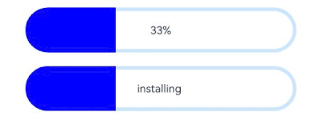
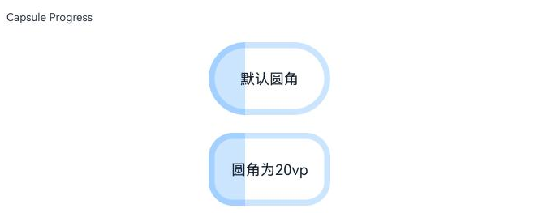

# Progress
<!--Kit: ArkUI-->
<!--Subsystem: ArkUI-->
<!--Owner: @liyujie43-->
<!--Designer: @weixin_52725220-->
<!--Tester: @xiong0104-->
<!--Adviser: @HelloCrease-->

进度条组件，用于显示内容加载或操作处理等进度。

>  **说明：**
>
>  该组件从API version 7开始支持。后续版本如有新增内容，则采用上角标单独标记该内容的起始版本。


## 子组件

无

## 接口

Progress(options: ProgressOptions)

创建进度条组件。

**卡片能力：** 从API version 9开始，该接口支持在ArkTS卡片中使用。

**原子化服务API：** 从API version 11开始，该接口支持在原子化服务中使用。

**系统能力：** SystemCapability.ArkUI.ArkUI.Full

**参数：** 

| 参数名 | 类型 | 必填 | 说明 |
| -------- | -------- | -------- | -------- |
| options |  [ProgressOptions](#progressoptionstype对象说明)| 是 | 按进度条类型不同，设置不同属性的进度条组件参数。 |

## ProgressOptions\<Type>对象说明

进度条选项。

**原子化服务API：** 从API version 11开始，该接口支持在原子化服务中使用。

**系统能力：** SystemCapability.ArkUI.ArkUI.Full

| 名称                        | 类型                                | 只读 | 可选 | 说明                                     |
| -------------------------- | ----------------------------------- | ---- | ---------------------------------------- | ---------------------------------------- |
| value                      | number                              | 否   | 否   | 指定当前进度值。设置小于0的数值时置为0，设置大于total的数值时置为total。<br/>默认值：0<br/>取值范围：[0, total]<br/>**卡片能力：** 从API version 9开始，该接口支持在ArkTS卡片中使用。 |
| total                      | number                              | 否   | 是   | 指定进度总长。设置小于等于0的数值时置为100。<br/>默认值：100<br/>取值范围：[0, 2147483647]<br/>**卡片能力：** 从API version 9开始，该接口支持在ArkTS卡片中使用。 |
| type<sup>8+</sup>          | [ProgressType](#progresstype8枚举说明)   | 否   | 是   | 指定进度条类型。<br/>默认值：ProgressType.Linear<br/>**卡片能力：** 从API version 9开始，该接口支持在ArkTS卡片中使用。 |
| style<sup>(deprecated)</sup> | [ProgressStyle](#progressstyle枚举说明) | 否   | 是   | 指定进度条样式。<br/>该参数从API version8开始废弃，建议使用type替代。<br/>默认值：ProgressStyle.Linear |

## ProgressType<sup>8+</sup>枚举说明

进度条类型。

**卡片能力：** 从API version 9开始，该接口支持在ArkTS卡片中使用。

**原子化服务API：** 从API version 11开始，该接口支持在原子化服务中使用。

**系统能力：** SystemCapability.ArkUI.ArkUI.Full

| 名称                     | 值 | 说明                                     |
| ---------------------- | - | ---------------------------------------- |
| Linear                 | 0 | 线性样式。从API version 9开始，当高度大于宽度时，自适应垂直显示。   |
| Ring      | 1 | 环形无刻度样式，环形圆环逐渐显示直至完全填充。                 |
| Eclipse  | 2 | 圆形样式，显示类似月圆月缺的进度展示效果，从月牙逐渐变化至满月。         |
| ScaleRing | 3 | 环形有刻度样式，显示类似时钟刻度形式的进度展示效果。从API version 9开始，刻度外圈出现重叠时自动转换为环形无刻度进度条。 |
| Capsule   | 4 | 胶囊样式，头尾两端圆弧处的进度展示效果与Eclipse相同，中段的进度展示效果与Linear相同。当高度大于宽度时，自适应垂直显示。 |

##  ProgressStyle枚举说明 

进度条样式。

**卡片能力：** 从API version 9开始，该接口支持在ArkTS卡片中使用。

**原子化服务API：** 从API version 11开始，该接口支持在原子化服务中使用。

**系统能力：** SystemCapability.ArkUI.ArkUI.Full

| 名称        | 值 | 说明                                     |
| --------- | - | ---------------------------------------- |
| Linear    | - | 线性样式。                                    |
| Ring<sup>8+</sup>      | - | 环形圆环逐渐显示直至完全填充。                 |
| Eclipse   | - | 圆形样式，显示类似月圆月缺的进度展示效果，从月牙逐渐变化至满月。         |
| ScaleRing<sup>8+</sup> | - | 环形有刻度样式，显示类似时钟刻度形式的进度展示效果。               |
| Capsule<sup>8+</sup>   | - | 胶囊样式，头尾两端圆弧处的进度展示效果与Eclipse相同，中段的进度展示效果与Linear相同。当高度大于宽度时，自适应垂直显示。 |

##  ProgressStyleMap对象说明 

进度条类型和样式的映射表。

**原子化服务API：** 从API version 11开始，该接口支持在原子化服务中使用。

**系统能力：** SystemCapability.ArkUI.ArkUI.Full

| 名称        | 类型                                      |
| --------- | ---------------------------------------- |
| ProgressType.Linear | [LinearStyleOptions<sup>10+</sup>](#linearstyleoptions10)&nbsp; \| &nbsp;[ProgressStyleOptions<sup>8+</sup>](#progressstyleoptions8)&nbsp; |
| ProgressType.Ring | [RingStyleOptions<sup>10+</sup>](#ringstyleoptions10)&nbsp; \| &nbsp;[ProgressStyleOptions<sup>8+</sup>](#progressstyleoptions8)&nbsp; |
| ProgressType.Eclipse | [EclipseStyleOptions<sup>10+</sup>](#eclipsestyleoptions10)&nbsp;  \| &nbsp;[ProgressStyleOptions<sup>8+</sup>](#progressstyleoptions8)&nbsp; |
| ProgressType.ScaleRing| [ScaleRingStyleOptions<sup>10+</sup>](#scaleringstyleoptions10)&nbsp; \| &nbsp;[ProgressStyleOptions<sup>8+</sup>](#progressstyleoptions8)&nbsp; |
| ProgressType.Capsule | [CapsuleStyleOptions<sup>10+</sup>](#capsulestyleoptions10)&nbsp; \| &nbsp;[ProgressStyleOptions<sup>8+</sup>](#progressstyleoptions8)&nbsp; |

## 属性

除支持[通用属性](ts-component-general-attributes.md)外，还支持以下属性：

> **说明：**
>
> 该组件重写了通用属性[backgroundColor](ts-universal-attributes-background.md)，直接添加在Progress组件上，设置进度条的底色。如需设置整个Progress组件的背景色，需要在外层容器上添加backgroundColor，并用该容器包裹Progress组件。

### value

value(value: number)

设置当前进度值。设置小于0的数值时置为0，设置大于total的数值时置为total。非法数值不生效。

**卡片能力：** 从API version 9开始，该接口支持在ArkTS卡片中使用。

**原子化服务API：** 从API version 11开始，该接口支持在原子化服务中使用。

**系统能力：** SystemCapability.ArkUI.ArkUI.Full

**参数：** 

| 参数名 | 类型   | 必填 | 说明         |
| ------ | ------ | ---- | ------------ |
| value  | number | 是   | 当前进度值。<br/> 默认值：0|

### color

color(value: ResourceColor | LinearGradient)

设置进度条前景色。

从API version 10开始支持利用LinearGradient设置Ring样式的渐变色。Ring类型不建议设置透明度，如需设置透明度，建议使用[DataPanel](ts-basic-components-datapanel.md)。

**卡片能力：** 从API version 9开始，该接口支持在ArkTS卡片中使用，暂不支持LinearGradient。

**原子化服务API：** 从API version 11开始，该接口支持在原子化服务中使用。

**系统能力：** SystemCapability.ArkUI.ArkUI.Full

**参数：** 

| 参数名 | 类型                                                         | 必填 | 说明                                                         |
| ------ | ------------------------------------------------------------ | ---- | ------------------------------------------------------------ |
| value  | [ResourceColor](ts-types.md#resourcecolor)&nbsp;\|&nbsp;[LinearGradient<sup>10+</sup>](ts-basic-components-datapanel.md#lineargradient10) | 是   | 进度条前景色。<br/>默认值：<br/>- Capsule：<br/>&nbsp;&nbsp;&nbsp;API version 9及以下：'\#ff007dff'<br/>&nbsp;&nbsp;&nbsp;API version 10：'\#33006cde'<br/>&nbsp;&nbsp;&nbsp;API version 11及以上：'\#33007dff'<br/>- Ring：<br/>&nbsp;&nbsp;&nbsp;API version 9及以下：'\#ff007dff'<br/>&nbsp;&nbsp;&nbsp;API version 10及以上：起始端：'\#ff86c1ff'，结束端：'\#ff254ff7'<br/>- 其他样式：'\#ff007dff' |

### style<sup>8+</sup>

style(value: ProgressStyleOptions \| CapsuleStyleOptions \| RingStyleOptions \| LinearStyleOptions \| ScaleRingStyleOptions \| EclipseStyleOptions)

设置组件的样式。

**系统能力：** SystemCapability.ArkUI.ArkUI.Full

**参数：** 

| 参数名 | 类型                                                         | 必填 | 说明                                                         |
| ------ | ------------------------------------------------------------ | ---- | ------------------------------------------------------------ |
| value  | [ProgressStyleOptions<sup>8+</sup>](#progressstyleoptions8)&nbsp;\|&nbsp;[CapsuleStyleOptions<sup>10+</sup>](#capsulestyleoptions10)&nbsp;\|&nbsp;<br/>[RingStyleOptions<sup>10+</sup>](#ringstyleoptions10)&nbsp;\|&nbsp;[LinearStyleOptions<sup>10+</sup>](#linearstyleoptions10)&nbsp;\|&nbsp;<br/>[ScaleRingStyleOptions<sup>10+</sup>](#scaleringstyleoptions10)&nbsp;\|&nbsp;[EclipseStyleOptions<sup>10+</sup>](#eclipsestyleoptions10) | 是   | 组件的样式。<br/>- CapsuleStyleOptions：设置Capsule的样式。<br/>- RingStyleOptions：设置Ring的样式。<br/>- LinearStyleOptions：设置Linear的样式。<br/>- ScaleRingStyleOptions：设置ScaleRing的样式。<br/>- EclipseStyleOptions：设置Eclipse的样式。<br/>- ProgressStyleOptions：仅可设置各类型进度条的strokeWidth、scaleCount、scaleWidth，仅对支持这些样式设置的进度条生效。 |

### contentModifier<sup>12+</sup>
contentModifier(modifier:ContentModifier\<ProgressConfiguration\>)

定制progress内容区的方法。

**原子化服务API：** 从API version 12开始，该接口支持在原子化服务中使用。

**系统能力：** SystemCapability.ArkUI.ArkUI.Full

**参数：**
| 参数名 | 类型   | 必填 | 说明         |
| ------ | ------ | ---- | ------------ |
| modifier | [ContentModifier\<ProgressConfiguration\>](#progressconfiguration12) | 是   | 在progress组件上，定制内容区的方法。<br/>modifier： 内容修改器，开发者需要自定义class实现ContentModifier接口。 |

### privacySensitive<sup>12+</sup>

privacySensitive(isPrivacySensitiveMode: Optional\<boolean\>)

设置隐私敏感。

**卡片能力：** 从API version 12开始，该接口支持在ArkTS卡片中使用。

**原子化服务API：** 从API version 12开始，该接口支持在原子化服务中使用。

**系统能力：** SystemCapability.ArkUI.ArkUI.Full

**参数：** 

| 参数名 | 类型                                                      | 必填 | 说明                                                  |
| ------ | --------------------------------------------------------- | ---- | ----------------------------------------------------- |
| isPrivacySensitiveMode  | [Optional\<boolean\>] | 是   | 设置隐私敏感，隐私模式下进度清零，文字将被遮罩。true表示打开隐私敏感，false表示关闭隐私敏感。<br/>**说明：** <br/>设置null表示不敏感。<!--Del--><br/>需要在卡片中使用Progress，并用[FormComponent](./ts-basic-components-formcomponent-sys.md)组件设置[隐私遮罩](./ts-universal-attributes-obscured.md)属性，显示卡片时才有隐私遮罩效果。<!--DelEnd--> |

## ProgressConfiguration<sup>12+</sup>

进度条配置。

**原子化服务API：** 从API version 12开始，该接口支持在原子化服务中使用。

**系统能力：** SystemCapability.ArkUI.ArkUI.Full

| 名称 | 类型  | 只读 | 可选 |说明         |
| ------ | ------ | ------- |------------|------------|
| value  | number | 否 | 否 | 当前进度值。当设置的数值小于0时，将其置为0。当设置的数值大于total时，将其置为total。<br/>默认值：0<br/>取值范围：[0, total] |
| total  | number | 否 | 否 | 进度总长。<br/>取值范围：[0, 2147483647]   |

## CommonProgressStyleOptions<sup>10+</sup>

进度条通用样式选项。

**原子化服务API：** 从API version 11开始，该接口支持在原子化服务中使用。

**系统能力：** SystemCapability.ArkUI.ArkUI.Full

| 名称          | 类型                      | 只读 | 可选 | 说明                                                                                        |
| ------------ | ---------------------------- | ---- | ------------------------------------------------------------------------------------------ | ------------------------------------------------------------------------------------------ |
| enableSmoothEffect | boolean | 否 | 是 | 进度平滑动效的开关。开启平滑动效后设置进度，进度会从当前值渐变至设定值，页面会有进度变化的动效；否则进度从当前值突变至设定值，页面无动效。<br/>默认值：true，true表示开启进度平滑动效，false表示关闭进度平滑动效。 |

## ScanEffectOptions<sup>10+</sup>

扫光效果选项。

**原子化服务API：** 从API version 11开始，该接口支持在原子化服务中使用。

**系统能力：** SystemCapability.ArkUI.ArkUI.Full

| 名称          | 类型 | 只读 | 可选 | 说明 |
| ------------- | ------- | ---- | -------- | -------- |
| enableScanEffect | boolean | 否 | 是 | 扫光效果的开关。<br/>默认值：false，false表示关闭扫光效果，true表示开启扫光效果。仅支持Linear、Ring、Capsule类型的进度条。 |

## ProgressStyleOptions<sup>8+</sup>

进度条样式选项。

继承自[CommonProgressStyleOptions](#commonprogressstyleoptions10)。

**卡片能力：** 从API version 9开始，该接口支持在ArkTS卡片中使用。

**原子化服务API：** 从API version 11开始，该接口支持在原子化服务中使用。

**系统能力：** SystemCapability.ArkUI.ArkUI.Full

| 名称          | 类型                      | 只读 | 可选 | 说明                                                                                        |
| ------------ | ---------------------------- | ---- | ------------------------------------------------------------------------------------------ | ------------------------------------------------------------------------------------------ |
| strokeWidth  | [Length](ts-types.md#length) | 否  | 是  | 设置进度条宽度（不支持百分比设置）。<br/>默认值：4.0vp                                            |
| scaleCount   | number                       | 否  | 是  | 设置环形进度条总刻度数。<br/>默认值：120 <br/>取值范围：[2, min(width, height)/scaleWidth/2/π]，超出取值范围时，样式显示为环形无刻度进度条。默认情况下宽高最小为77vp。                     |
| scaleWidth   | [Length](ts-types.md#length) | 否  | 是  | 设置环形进度条刻度粗细（不支持百分比设置）。刻度粗细大于进度条宽度时，为系统默认粗细。<br/>默认值：2.0vp |

## CapsuleStyleOptions<sup>10+</sup>

胶囊样式选项。

继承自[ScanEffectOptions](#scaneffectoptions10)和[CommonProgressStyleOptions](#commonprogressstyleoptions10)。

**原子化服务API：** 从API version 11开始，该接口支持在原子化服务中使用。

**系统能力：** SystemCapability.ArkUI.ArkUI.Full

| 名称          | 类型 | 只读 | 可选 | 说明 |
| ------------- | ------- | ---- | -------- | -------- |
| borderColor | [ResourceColor](ts-types.md#resourcecolor) | 否 | 是 | 内描边颜色。<br/>默认值：<br/>API version 10：'\#33006cde'<br/>API version 11及以上：'\#33007dff' |
| borderWidth | [Length](ts-types.md#length) | 否 | 是 | 内描边宽度（不支持百分比设置）。<br/>默认值：1vp |
| content | [ResourceStr](ts-types.md#resourcestr) | 否 | 是 | 文本内容，应用可自定义。<br>从API version 20开始，支持Resource类型。 |
| font | [Font](ts-types.md#font) | 否 | 是 | 文本样式。<br/>默认值：<br/>- 文本大小（不支持百分比设置）：12fp <br/>其他文本参数跟随text组件的主题值。|
| fontColor | [ResourceColor](ts-types.md#resourcecolor) | 否 | 是 | 文本颜色。<br/>默认值：'\#ff182431' |
| showDefaultPercentage | boolean | 否 | 是 | 显示百分比文本的开关。开启后，进度条上显示当前进度的百分比。设置了content属性时该属性不生效。<br/>默认值：false，false表示不显示百分比文本，true表示显示百分比文本。 |
| borderRadius<sup>18+</sup> |  [LengthMetrics](../js-apis-arkui-graphics.md#lengthmetrics12) | 否 | 是 | Capsule进度条圆角半径（不支持百分比设置）。<br/>取值范围：[0, height/2]。默认值：height / 2。<br/>设置非法数值时，按照默认值处理。 |

## RingStyleOptions<sup>10+</sup>

环形无刻度样式选项。

继承自[ScanEffectOptions](#scaneffectoptions10)和[CommonProgressStyleOptions](#commonprogressstyleoptions10)。

**原子化服务API：** 从API version 11开始，该接口支持在原子化服务中使用。

**系统能力：** SystemCapability.ArkUI.ArkUI.Full

| 名称           | 类型                      | 只读 | 可选 | 说明                                                                                        |
| ------------- | ---------------------------- | ---- | ------------------------------------------------------------------------------------------ | ------------------------------------------------------------------------------------------ |
| strokeWidth   | [Length](ts-types.md#length) | 否  | 是  | 设置进度条宽度（不支持百分比设置）。当宽度大于等于半径时，宽度默认修改为半径值的二分之一。<br/>默认值：4.0vp |
| shadow        | boolean                      | 否  | 是  | 进度条阴影开关。<br/>默认值：false，false表示关闭进度条阴影，true表示打开进度条阴影。                                                             |
| status        | [ProgressStatus<sup>10+</sup>](#progressstatus10枚举说明) | 否 | 是 | 设置进度条状态。当设置为ProgressStatus.LOADING时会开启检查更新动效，此时设置进度值不生效。当从ProgressStatus.LOADING设置为ProgressStatus.PROGRESSING时，检查更新动效会执行到终点再停止。<br/>默认值：ProgressStatus.PROGRESSING |

## LinearStyleOptions<sup>10+</sup>

线性样式选项。

继承自[ScanEffectOptions](#scaneffectoptions10)和[CommonProgressStyleOptions](#commonprogressstyleoptions10)。

**原子化服务API：** 从API version 11开始，该接口支持在原子化服务中使用。

**系统能力：** SystemCapability.ArkUI.ArkUI.Full

| 名称           | 类型                      | 只读 | 可选 | 说明                                                                                        |
| ------------- | ---------------------------- | ---- | ------------------------------------------------------------------------------------------ | ------------------------------------------------------------------------------------------ |
| strokeWidth   | [Length](ts-types.md#length) | 否  | 是  | 设置进度条宽度（不支持百分比设置）。<br/>默认值：4.0vp |
| strokeRadius   | [PX](ts-types.md#px10)    \| [VP](ts-types.md#vp10)    \| [LPX](ts-types.md#lpx10)    \| [Resource](ts-types.md#resource)| 否  | 是  | 设置线性进度条的圆角半径。<br/>取值范围[0, strokeWidth / 2]。默认值：strokeWidth / 2。 |

## ScaleRingStyleOptions<sup>10+</sup>

环形有刻度样式选项。

继承自[CommonProgressStyleOptions](#commonprogressstyleoptions10)。

**原子化服务API：** 从API version 11开始，该接口支持在原子化服务中使用。

**系统能力：** SystemCapability.ArkUI.ArkUI.Full

| 名称          | 类型                      | 只读 | 可选 | 说明                                                                                        |
| ------------ | ---------------------------- | ---- | ------------------------------------------------------------------------------------------ | ------------------------------------------------------------------------------------------ |
| strokeWidth  | [Length](ts-types.md#length) | 否  | 是  | 设置进度条宽度（不支持百分比设置）。<br/>默认值：4.0vp                                            |
| scaleCount   | number                       | 否  | 是  | 设置环形进度条总刻度数。<br/>默认值：120 <br/>取值范围：[2, min(width, height)/scaleWidth/2/π]，超出取值范围时，样式显示为环形无刻度进度条。默认情况下宽高最小为77vp。                     |
| scaleWidth   | [Length](ts-types.md#length) | 否  | 是  | 设置环形进度条刻度粗细（不支持百分比设置）。刻度粗细大于进度条宽度时，为系统默认粗细。<br/>默认值：2.0vp |

## EclipseStyleOptions<sup>10+</sup>

圆形样式选项。圆形样式的显示类似月圆月缺的进度展示效果，从月牙逐渐变化至满月。

继承自[CommonProgressStyleOptions](#commonprogressstyleoptions10)。

**原子化服务API：** 从API version 11开始，该接口支持在原子化服务中使用。

**系统能力：** SystemCapability.ArkUI.ArkUI.Full

## ProgressStatus<sup>10+</sup>枚举说明

进度条的当前状态。

**原子化服务API：** 从API version 11开始，该接口支持在原子化服务中使用。

**系统能力：** SystemCapability.ArkUI.ArkUI.Full

| 名称                    | 值     | 说明      |
| ----------------------- | ---------------- | ---------------- |
| LOADING  | - | 加载中。 |
| PROGRESSING | - | 进度更新中。 |

## 事件

支持[通用事件](ts-component-general-events.md)。

## 示例

### 示例1（设置进度条的类型）

该示例通过type属性，实现了设置进度条类型的功能。

```ts
// xxx.ets
@Entry
@Component
struct ProgressExample {
  build() {
    Column({ space: 15 }) {
      Text('Linear Progress').fontSize(9).fontColor(0xCCCCCC).width('90%')
      Progress({ value: 10, type: ProgressType.Linear }).width(200)
      Progress({ value: 20, total: 150, type: ProgressType.Linear }).color(Color.Grey).value(50).width(200)


      Text('Eclipse Progress').fontSize(9).fontColor(0xCCCCCC).width('90%')
      Row({ space: 40 }) {
        Progress({ value: 10, type: ProgressType.Eclipse }).width(100)
        Progress({ value: 20, total: 150, type: ProgressType.Eclipse }).color(Color.Grey).value(50).width(100)
      }

      Text('ScaleRing Progress').fontSize(9).fontColor(0xCCCCCC).width('90%')
      Row({ space: 40 }) {
        Progress({ value: 10, type: ProgressType.ScaleRing }).width(100)
        Progress({ value: 20, total: 150, type: ProgressType.ScaleRing })
          .color(Color.Grey).value(50).width(100)
          .style({ strokeWidth: 15, scaleCount: 15, scaleWidth: 5 })
      }

      // scaleCount和scaleWidth效果对比
      Row({ space: 40 }) {
        Progress({ value: 20, total: 150, type: ProgressType.ScaleRing })
          .color(Color.Grey).value(50).width(100)
          .style({ strokeWidth: 20, scaleCount: 20, scaleWidth: 5 })
        Progress({ value: 20, total: 150, type: ProgressType.ScaleRing })
          .color(Color.Grey).value(50).width(100)
          .style({ strokeWidth: 20, scaleCount: 30, scaleWidth: 3 })
      }

      Text('Ring Progress').fontSize(9).fontColor(0xCCCCCC).width('90%')
      Row({ space: 40 }) {
        Progress({ value: 10, type: ProgressType.Ring }).width(100)
        Progress({ value: 20, total: 150, type: ProgressType.Ring })
          .color(Color.Grey).value(50).width(100)
          .style({ strokeWidth: 20 })
      }

      Text('Capsule Progress').fontSize(9).fontColor(0xCCCCCC).width('90%')
      Row({ space: 40 }) {
        Progress({ value: 10, type: ProgressType.Capsule }).width(100).height(50)
        Progress({ value: 20, total: 150, type: ProgressType.Capsule })
          .color(Color.Grey)
          .value(50)
          .width(100)
          .height(50)
      }
    }.width('100%').margin({ top: 30 })
  }
}
```


### 示例2（设置环形进度条属性）

该示例通过[style](#style8)接口的strokeWidth和shadow属性，实现了环形进度条视觉属性设置功能。

```ts
// xxx.ets
@Entry
@Component
struct ProgressExample {
  private gradientColor: LinearGradient = new LinearGradient([{ color: Color.Yellow, offset: 0.5 },
    { color: Color.Orange, offset: 1.0 }])

  build() {
    Column({ space: 15 }) {
      Text('Gradient Color').fontSize(9).fontColor(0xCCCCCC).width('90%')
      Progress({ value: 70, total: 100, type: ProgressType.Ring })
        .width(100).style({ strokeWidth: 20 })
        .color(this.gradientColor)

      Text('Shadow').fontSize(9).fontColor(0xCCCCCC).width('90%')
      Progress({ value: 70, total: 100, type: ProgressType.Ring })
        .width(120).color(Color.Orange)
        .style({ strokeWidth: 20, shadow: true })
    }.width('100%').padding({ top: 5 })
  }
}
```


### 示例3（设置环形进度条动画）

该示例通过[style](#style8)接口的status和enableScanEffect属性，实现了环形进度条动效的开关功能。

```ts
// xxx.ets
@Entry
@Component
struct ProgressExample {
  build() {
    Column({ space: 15 }) {
      Text('Loading Effect').fontSize(9).fontColor(0xCCCCCC).width('90%')
      Progress({ value: 0, total: 100, type: ProgressType.Ring })
        .width(100).color(Color.Blue)
        .style({ strokeWidth: 20, status: ProgressStatus.LOADING })

      Text('Scan Effect').fontSize(9).fontColor(0xCCCCCC).width('90%')
      Progress({ value: 30, total: 100, type: ProgressType.Ring })
        .width(100).color(Color.Orange)
        .style({ strokeWidth: 20, enableScanEffect: true })
    }.width('100%').padding({ top: 5 })
  }
}
```


### 示例4（设置胶囊形进度条属性）

该示例通过[style](#style8)接口的borderColor、borderWidth、content、font、fontColor、enableScanEffect、showDefaultPercentage属性，实现胶囊形进度条的视觉属性设置。

```ts
// xxx.ets
@Entry
@Component
struct ProgressExample {
  build() {
    Column({ space: 15 }) {
      Row({ space: 40 }) {
        Progress({ value: 100, total: 100, type: ProgressType.Capsule }).width(100).height(50)
          .style({
            borderColor: Color.Blue,
            borderWidth: 1,
            content: 'Installing...',
            font: { size: 13, style: FontStyle.Normal },
            fontColor: Color.Gray,
            enableScanEffect: false,
            showDefaultPercentage: false
          })
      }
    }.width('100%').padding({ top: 5 })
  }
}
```


### 示例5（设置进度平滑动效）

该示例通过[style](#style8)接口的enableSmoothEffect属性，实现了进度平滑动效开关的功能。

```ts
// xxx.ets
@Entry
@Component
struct Index {
  @State value: number = 0;

  build() {
    Column({ space: 10 }) {
      Text('enableSmoothEffect: true')
        .fontSize(9)
        .fontColor(0xCCCCCC)
        .width('90%')
        .margin(5)
        .margin({ top: 20 })
      Progress({ value: this.value, total: 100, type: ProgressType.Linear })
        .style({ strokeWidth: 10, enableSmoothEffect: true })

      Text('enableSmoothEffect: false').fontSize(9).fontColor(0xCCCCCC).width('90%').margin(5)
      Progress({ value: this.value, total: 100, type: ProgressType.Linear })
        .style({ strokeWidth: 10, enableSmoothEffect: false })

      Button('value +10').onClick(() => {
        this.value += 10;
      })
        .width(75)
        .height(15)
        .fontSize(9)
    }
    .width('50%')
    .height('100%')
    .margin({ left: 20 })
  }
}

```


### 示例6（设置定制内容区）

该示例通过[contentModifier](#contentmodifier12)接口，实现了自定义进度条的功能，自定义实现星形，其中总进度为3，且当前值可通过按钮进行增减，达到的进度使用自定义颜色填充。

```ts
// xxx.ets
class MyProgressModifier implements ContentModifier<ProgressConfiguration> {
  color: Color = Color.White;

  constructor(color: Color) {
    this.color = color;
  }

  applyContent(): WrappedBuilder<[ProgressConfiguration]> {
    return wrapBuilder(myProgress);
  }
}

@Builder
function myProgress(config: ProgressConfiguration) {

  Column({ space: 30 }) {
    Text("当前进度：" + config.value + "/" + config.total).fontSize(20)
    Row() {
      Flex({ justifyContent: FlexAlign.SpaceBetween }) {
        Path()
          .width('30%')
          .height('30%')
          .commands('M108 0 L141 70 L218 78.3 L162 131 L175 205 L108 170 L41.2 205 L55 131 L1 78 L75 68 L108 0 Z')
          .fill(config.enabled && config.value >= 1 ? (config.contentModifier as MyProgressModifier).color :
          Color.White)
          .stroke(Color.Black)
          .strokeWidth(3)
        Path()
          .width('30%')
          .height('30%')
          .commands('M108 0 L141 70 L218 78.3 L162 131 L175 205 L108 170 L41.2 205 L55 131 L1 78 L75 68 L108 0 Z')
          .fill(config.enabled && config.value >= 2 ? (config.contentModifier as MyProgressModifier).color :
          Color.White)
          .stroke(Color.Black)
          .strokeWidth(3)
        Path()
          .width('30%')
          .height('30%')
          .commands('M108 0 L141 70 L218 78.3 L162 131 L175 205 L108 170 L41.2 205 L55 131 L1 78 L75 68 L108 0 Z')
          .fill(config.enabled && config.value >= 3 ? (config.contentModifier as MyProgressModifier).color :
          Color.White)
          .stroke(Color.Black)
          .strokeWidth(3)
      }.width('100%')
    }
  }.margin({ bottom: 100 })
}

@Entry
@Component
struct Index {
  @State currentValue: number = 0;
  modifier = new MyProgressModifier(Color.Red);
  @State myModifier: (MyProgressModifier | undefined) = this.modifier;

  build() {
    Column() {
      Progress({ value: this.currentValue, total: 3, type: ProgressType.Ring }).contentModifier(this.modifier)
      Button('Progress++').onClick(() => {
        if (this.currentValue < 3) {
          this.currentValue += 1;
        }
      }).width('30%')
      Button('Progress--').onClick(() => {
        if (this.currentValue > 0) {
          this.currentValue -= 1;
        }
      }).width('30%')
    }.width('100%').height('100%')
  }
}

```


### 示例7（设置隐私隐藏）

该示例通过[privacySensitive](#privacysensitive12)属性，实现了隐私隐藏效果。效果展示需要卡片框架支持。

```ts
@Entry
@Component
struct ProgressExample {
  build() {
    Row() {
      Column({ space: 15 }) {
        Progress({ value: 33, total: 100, type: ProgressType.Capsule }).width(300).height(50)
          .color(Color.Blue)
          .style({
            borderWidth: 5,
            font: { size: 13, style: FontStyle.Normal },
            enableScanEffect: false,
            showDefaultPercentage: true
          })
          .privacySensitive(true)
        Progress({ value: 33, total: 100, type: ProgressType.Capsule }).width(300).height(50)
          .color(Color.Blue)
          .style({
            borderWidth: 5,
            content: 'Installing...',
            font: { size: 13, style: FontStyle.Normal },
            enableScanEffect: false,
          })
          .privacySensitive(true)
      }
    }
  }
}
```


### 示例8（设置capsule进度条圆角半径）

该示例通过borderRadius属性，实现了capsule类型进度条圆角半径设置。

```ts
import { LengthMetrics } from '@kit.ArkUI';

@Entry
@Component
struct ProgressExample {
  build() {
    Column({ space: 15 }) {
      Text('Capsule Progress').fontSize(9).width('90%')
      Row({ space: 15 }) {
        Progress({ value: 30, total: 100, type: ProgressType.Capsule })
          .style({ content: "默认圆角", borderWidth: 5 })
          .width(100)
          .height(60)
      }

      Row({ space: 15 }) {
        Progress({ value: 30, total: 100, type: ProgressType.Capsule })
          .style({ content: "圆角为20vp", borderWidth: 5, borderRadius: LengthMetrics.vp(20) })
          .width(100)
          .height(60)
      }
    }
    .width('100%')
    .margin({ top: 30 })
  }
}

```

