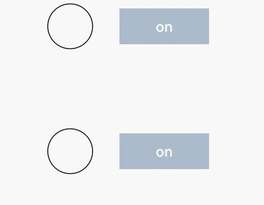

# Radio

单选框，提供相应的用户交互选择项。

>  **说明：**
>
>  API version 12开始，Radio选中默认样式由RadioIndicatorType.DOT变为RadioIndicatorType.TICK。
>
>  该组件从API version 8开始支持。后续版本如有新增内容，则采用上角标单独标记该内容的起始版本。


## 子组件

无


## 接口

Radio(options: RadioOptions)

创建单选框组件。

**卡片能力：** 从API version 9开始，该接口支持在ArkTS卡片中使用。

**原子化服务API：** 从API version 11开始，该接口支持在原子化服务中使用。

**系统能力：** SystemCapability.ArkUI.ArkUI.Full

**参数：** 

| 参数名  | 类型                                  | 必填 | 说明               |
| ------- | ------------------------------------- | ---- | ------------------ |
| options | [RadioOptions](#radiooptions对象说明) | 是   | 配置单选框的参数。 |

## RadioOptions对象说明

**系统能力：** SystemCapability.ArkUI.ArkUI.Full

| 名称 | 类型 | 必填 | 说明 |
| -------- | -------- | -------- | -------- |
| value | string | 是 | 当前单选框的值。 <br/>**卡片能力：** 从API version 9开始，该接口支持在ArkTS卡片中使用。<br/>**原子化服务API：** 从API version 11开始，该接口支持在原子化服务中使用。 |
| group | string | 是 | 当前单选框的所属群组名称，相同group的Radio只能有一个被选中。<br/>**卡片能力：** 从API version 9开始，该接口支持在ArkTS卡片中使用。<br/>**原子化服务API：** 从API version 11开始，该接口支持在原子化服务中使用。 |
| indicatorType<sup>12+</sup> | [RadioIndicatorType](#radioindicatortype12枚举说明) | 否 | 配置单选框的选中样式。未设置时按照RadioIndicatorType.TICK进行显示。<br/>**卡片能力：** 从API version 12开始，该接口支持在ArkTS卡片中使用。<br/>**原子化服务API：** 从API version 12开始，该接口支持在原子化服务中使用。 |
| indicatorBuilder<sup>12+</sup> | [CustomBuilder](ts-types.md#custombuilder8) | 否 | 配置单选框的选中样式为自定义组件。自定义组件与Radio组件为中心点对齐显示。indicatorBuilder设置为undefined时，按照RadioIndicatorType.TICK进行显示。<br/>**卡片能力：** 从API version 12开始，该接口支持在ArkTS卡片中使用。<br/>**原子化服务API：** 从API version 12开始，该接口支持在原子化服务中使用。 |

## RadioIndicatorType<sup>12+</sup>枚举说明

**卡片能力：** 从API version 12开始，该接口支持在ArkTS卡片中使用。

**原子化服务API：** 从API version 12开始，该接口支持在原子化服务中使用。

**系统能力：** SystemCapability.ArkUI.ArkUI.Full

| 名称            | 值           | 说明                           |
| --------------- | -------------------------------- | -------------------------------- |
| TICK            | 0           | 选中样式为系统默认TICK图标。  |
| DOT             | 1            | 选中样式为系统默认DOT图标。   |
| CUSTOM          | 2         | 选中样式为indicatorBuilder中的内容。|

## 属性

除支持[通用属性](ts-component-general-attributes.md)外，还支持以下属性：

### checked

checked(value: boolean)

设置单选框的选中状态。

从API version 10开始，该属性支持[$$](../../../ui/state-management/arkts-two-way-sync.md)双向绑定变量。
从API version 18开始，该属性支持[!!](../../../ui/state-management/arkts-new-binding.md#系统组件参数双向绑定)双向绑定变量。

**卡片能力：** 从API version 9开始，该接口支持在ArkTS卡片中使用。

**原子化服务API：** 从API version 11开始，该接口支持在原子化服务中使用。

**系统能力：** SystemCapability.ArkUI.ArkUI.Full

**参数：** 

| 参数名 | 类型    | 必填 | 说明                                                         |
| ------ | ------- | ---- | ------------------------------------------------------------ |
| value  | boolean | 是   | 单选框的选中状态。<br/>默认值：false<br/>值为true时，单选框被选中。值为false时，单选框不被选中。 |

### checked<sup>18+</sup>

checked(isChecked: Optional\<boolean>)

设置单选框的选中状态。与[checked](#checked)相比，isChecked参数新增了对undefined类型的支持。

该属性支持[$$](../../../ui/state-management/arkts-two-way-sync.md)、[!!](../../../ui/state-management/arkts-new-binding.md#系统组件参数双向绑定)双向绑定变量。

**卡片能力：** 从API version 18开始，该接口支持在ArkTS卡片中使用。

**原子化服务API：** 从API version 18开始，该接口支持在原子化服务中使用。

**系统能力：** SystemCapability.ArkUI.ArkUI.Full

**参数：** 

| 参数名    | 类型                                                         | 必填 | 说明                                                         |
| --------- | ------------------------------------------------------------ | ---- | ------------------------------------------------------------ |
| isChecked | [Optional](ts-universal-attributes-custom-property.md#optional12)\<boolean> | 是   | 单选框的选中状态。<br/>当isChecked的值为undefined时取默认值false。<br/>值为true时，单选框被选中。值为false时，单选框不被选中。 |

### radioStyle<sup>10+</sup>

radioStyle(value?: RadioStyle)

设置单选框选中状态和非选中状态的样式。 

从API version 10开始，该接口支持在ArkTS组件中使用。

**原子化服务API：** 从API version 11开始，该接口支持在原子化服务中使用。

**系统能力：** SystemCapability.ArkUI.ArkUI.Full

**参数：** 

| 参数名 | 类型                                | 必填 | 说明                               |
| ------ | ----------------------------------- | ---- | ---------------------------------- |
| value  | [RadioStyle](#radiostyle10对象说明) | 否   | 单选框选中状态和非选中状态的样式。 |

### contentModifier<sup>12+</sup>

contentModifier(modifier: ContentModifier\<RadioConfiguration>)

定制Radio内容区的方法。

**原子化服务API：** 从API version 12开始，该接口支持在原子化服务中使用。

**系统能力：** SystemCapability.ArkUI.ArkUI.Full

**参数：**

| 参数名 | 类型                                          | 必填 | 说明                                             |
| ------ | --------------------------------------------- | ---- | ------------------------------------------------ |
| modifier  | [ContentModifier\<RadioConfiguration>](#radioconfiguration12对象说明) | 是   | 在Radio组件上，定制内容区的方法。<br/>modifier：内容修改器，开发者需要自定义class实现ContentModifier接口。 |

### contentModifier<sup>18+</sup>

contentModifier(modifier: Optional<ContentModifier\<RadioConfiguration>>)

定制Radio内容区的方法。与[contentModifier](#contentmodifier12)<sup>12+</sup>相比，modifier参数新增了对undefined类型的支持。

**原子化服务API：** 从API version 18开始，该接口支持在原子化服务中使用。

**系统能力：** SystemCapability.ArkUI.ArkUI.Full

**参数：**

| 参数名   | 类型                                                         | 必填 | 说明                                                         |
| -------- | ------------------------------------------------------------ | ---- | ------------------------------------------------------------ |
| modifier | [Optional](ts-universal-attributes-custom-property.md#optional12)\<[ContentModifier\<RadioConfiguration>](#radioconfiguration12对象说明)> | 是   | 在Radio组件上，定制内容区的方法。<br/>modifier：内容修改器，开发者需要自定义class实现ContentModifier接口。<br/>当modifier的值为undefined时，不使用内容修改器。 |

## 事件

除支持[通用事件](ts-component-general-events.md)外，还支持以下事件：

### onChange

onChange(callback: (isChecked: boolean) => void)

单选框选中状态改变时触发回调。

**卡片能力：** 从API version 9开始，该接口支持在ArkTS卡片中使用。

**原子化服务API：** 从API version 11开始，该接口支持在原子化服务中使用。

**系统能力：** SystemCapability.ArkUI.ArkUI.Full

**参数：** 

| 参数名    | 类型    | 必填 | 说明                             |
| --------- | ------- | ---- | -------------------------------- |
| isChecked | boolean | 是   | 单选框选中状态改变时触发该回调。<br/>值为true时，表示从未选中变为选中。值为false时，表示从选中变为未选中。 |

### onChange<sup>18+</sup>

onChange(callback: Optional\<OnRadioChangeCallback>)

单选框选中状态改变时触发回调。与[onChange](#onchange)相比，callback参数新增了对undefined类型的支持。

**卡片能力：** 从API version 18开始，该接口支持在ArkTS卡片中使用。

**原子化服务API：** 从API version 18开始，该接口支持在原子化服务中使用。

**系统能力：** SystemCapability.ArkUI.ArkUI.Full

**参数：** 

| 参数名   | 类型                                                         | 必填 | 说明                                                         |
| -------- | ------------------------------------------------------------ | ---- | ------------------------------------------------------------ |
| callback | [Optional](ts-universal-attributes-custom-property.md#optional12)\<[OnRadioChangeCallback](#onradiochangecallback18)> | 是   | 单选框选中状态改变时触发该回调。<br/>当callback的值为undefined时，不使用回调函数。 |

## OnRadioChangeCallback<sup>18+</sup>

type OnRadioChangeCallback = (isChecked: boolean) => void

单选框选中状态改变时触发回调。

**原子化服务API：** 从API version 18开始，该接口支持在原子化服务中使用。

**系统能力：** SystemCapability.ArkUI.ArkUI.Full

**参数：** 

| 参数名    | 类型    | 必填 | 说明                                                         |
| --------- | ------- | ---- | ------------------------------------------------------------ |
| isChecked | boolean | 是   | 单选框的状态。<br/>值为true时，表示从未选中变为选中。值为false时，表示从选中变为未选中。 |

## RadioStyle<sup>10+</sup>对象说明

**原子化服务API：** 从API version 11开始，该接口支持在原子化服务中使用。

**系统能力：** SystemCapability.ArkUI.ArkUI.Full

| 名称                   | 类型                                       | 必填 | 说明                                                         |
| ---------------------- | ------------------------------------------ | ---- | ------------------------------------------------------------ |
| checkedBackgroundColor | [ResourceColor](ts-types.md#resourcecolor) | 否   | 开启状态底板颜色。<br/>默认值：`$r('sys.color.ohos_id_color_text_primary_activated')`                      |
| uncheckedBorderColor   | [ResourceColor](ts-types.md#resourcecolor) | 否   | 关闭状态描边颜色。<br/>默认值：`$r('sys.color.ohos_id_color_switch_outline_off')`                       |
| indicatorColor         | [ResourceColor](ts-types.md#resourcecolor) | 否   | 开启状态内部圆饼颜色。从API version 12开始，indicatorType设置为RadioIndicatorType.TICK和RadioIndicatorType.DOT时，支持修改内部颜色。indicatorType设置为RadioIndicatorType.CUSTOM时，不支持修改内部颜色。<br/>默认值：`$r('sys.color.ohos_id_color_foreground_contrary')` |

## RadioConfiguration<sup>12+</sup>对象说明

开发者需要自定义class实现ContentModifier接口。

**原子化服务API：** 从API version 12开始，该接口支持在原子化服务中使用。

**系统能力：** SystemCapability.ArkUI.ArkUI.Full

| 名称  | 类型    | 只读 | 可选  |  说明              |
| ------ | ------ |-------------------------------- |-------------------------------- |-------------------------------- |
| value | string | 否 | 否 |当前单选框的值。 |
| checked | boolean| 否 | 否 | 设置单选框的选中状态。<br/>默认值：false<br/>值为true时，单选框被选中。值为false时，单选框不被选中。 |
| triggerChange |Callback\<boolean>|否|否|触发单选框选中状态变化。<br/>值为true时，表示从未选中变为选中。值为false时，表示从选中变为未选中。 |


## 示例
### 示例1 （设置底板颜色）
该示例通过配置checkedBackgroundColor实现自定义单选框的底板颜色。
```ts
// xxx.ets
@Entry
@Component
struct RadioExample {
  build() {
    Flex({ direction: FlexDirection.Row, justifyContent: FlexAlign.Center, alignItems: ItemAlign.Center }) {
      Column() {
        Text('Radio1')
        Radio({ value: 'Radio1', group: 'radioGroup' }).checked(true)
          .radioStyle({
            checkedBackgroundColor: Color.Pink
          })
          .height(50)
          .width(50)
          .onChange((isChecked: boolean) => {
            console.log('Radio1 status is ' + isChecked);
          })
      }
      Column() {
        Text('Radio2')
        Radio({ value: 'Radio2', group: 'radioGroup' }).checked(false)
          .radioStyle({
            checkedBackgroundColor: Color.Pink
          })
          .height(50)
          .width(50)
          .onChange((isChecked: boolean) => {
            console.log('Radio2 status is ' + isChecked);
          })
      }
      Column() {
        Text('Radio3')
        Radio({ value: 'Radio3', group: 'radioGroup' }).checked(false)
          .radioStyle({
            checkedBackgroundColor: Color.Pink
          })
          .height(50)
          .width(50)
          .onChange((isChecked: boolean) => {
            console.log('Radio3 status is ' + isChecked);
          })
      }
    }.padding({ top: 30 })
  }
}
```

### 示例2 （设置选中样式）
该示例通过配置indicatorType、indicatorBuilder实现自定义选中样式。
```ts
// xxx.ets
@Entry
@Component
struct RadioExample {
  @Builder 
  indicatorBuilder() {
    Image($r("app.media.star"))
  }
  build() {
    Flex({ direction: FlexDirection.Row, justifyContent: FlexAlign.Center, alignItems: ItemAlign.Center }) {
      Column() {
        Text('Radio1')
        Radio({ value: 'Radio1', group: 'radioGroup',
          indicatorType:RadioIndicatorType.TICK
        }).checked(true)
          .height(50)
          .width(80)
          .onChange((isChecked: boolean) => {
            console.log('Radio1 status is ' + isChecked);
          })
      }
      Column() {
        Text('Radio2')
        Radio({ value: 'Radio2', group: 'radioGroup',
          indicatorType:RadioIndicatorType.DOT
        }).checked(false)
          .height(50)
          .width(80)
          .onChange((isChecked: boolean) => {
            console.log('Radio2 status is ' + isChecked);
          })
      }
      Column() {
        Text('Radio3')
        Radio({ value: 'Radio3', group: 'radioGroup',
          indicatorType:RadioIndicatorType.CUSTOM,
          indicatorBuilder:()=>{this.indicatorBuilder()}
        }).checked(false)
          .height(50)
          .width(80)
          .onChange((isChecked: boolean) => {
            console.log('Radio3 status is ' + isChecked);
          })
      }
    }.padding({ top: 30 })
  }
}
```

### 示例3（设置自定义样式）
该示例通过contentModifier实现自定义单选框样式。
```ts
class MyRadioStyle implements ContentModifier<RadioConfiguration> {
  type: number = 0;
  selectedColor: ResourceColor = Color.Black;

  constructor(numberType: number, colorType: ResourceColor) {
    this.type = numberType;
    this.selectedColor = colorType;
  }

  applyContent(): WrappedBuilder<[RadioConfiguration]> {
    return wrapBuilder(buildRadio);
  }
}

@Builder
function buildRadio(config: RadioConfiguration) {
  Row({ space: 30 }) {
    Circle({ width: 50, height: 50 })
      .stroke(Color.Black)
      .fill(config.checked ? (config.contentModifier as MyRadioStyle).selectedColor : Color.White)
    Button(config.checked ? "off" : "on")
      .width(100)
      .type(config.checked ? (config.contentModifier as MyRadioStyle).type : ButtonType.Normal)
      .backgroundColor('#2787D9')
      .onClick(() => {
        if (config.checked) {
          config.triggerChange(false);
        } else {
          config.triggerChange(true);
        }
      })
  }
}

@Entry
@Component
struct refreshExample {
  build() {
    Column({ space: 50 }) {
      Row() {
        Radio({ value: 'Radio1', group: 'radioGroup' })
          .contentModifier(new MyRadioStyle(1, '#004AAF'))
          .checked(false)
          .width(300)
          .height(100)
      }

      Row() {
        Radio({ value: 'Radio2', group: 'radioGroup' })
          .checked(true)
          .width(300)
          .height(60)
          .contentModifier(new MyRadioStyle(2, '#004AAF'))
      }
    }
  }
}
```
