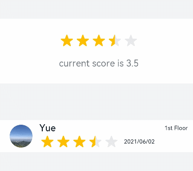
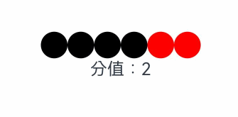

# Rating
<!--Kit: ArkUI-->
<!--Subsystem: ArkUI-->
<!--Owner: @liyi0309-->
<!--Designer: @liyi0309-->
<!--Tester: @lxl007-->
<!--Adviser: @HelloCrease-->

提供在给定范围内选择评分的组件。

>  **说明：**
>
> - 该组件从API version 7开始支持。后续版本如有新增内容，则采用上角标单独标记该内容的起始版本。
>
> - 当Rating的父节点有指定宽高时，需为Rating组件指定宽高，或为父节点设置值为true的[clip](ts-universal-attributes-sharp-clipping.md#clip18)属性。


## 子组件

无


## 接口

Rating(options?: RatingOptions)

**卡片能力：** 从API version 9开始，该接口支持在ArkTS卡片中使用。

**原子化服务API：** 从API version 11开始，该接口支持在原子化服务中使用。

**系统能力：** SystemCapability.ArkUI.ArkUI.Full

**参数：**

| 参数名  | 类型                                      | 必填 | 说明           |
| ------- | ----------------------------------------- | ---- | -------------- |
| options | [RatingOptions](#ratingoptions18对象说明) | 否   | 设置评分组件。 |

## 属性

### stars

stars(value: number)

设置评分总数。设置为小于等于0的值时，按默认值显示。

**卡片能力：** 从API version 9开始，该接口支持在ArkTS卡片中使用。

**原子化服务API：** 从API version 11开始，该接口支持在原子化服务中使用。

**系统能力：** SystemCapability.ArkUI.ArkUI.Full

**参数：** 

| 参数名 | 类型   | 必填 | 说明                         |
| ------ | ------ | ---- | ---------------------------- |
| value  | number | 是   | 设置评分总数。<br/>默认值：5 |

### stars<sup>18+</sup>

stars(starCount: Optional\<number>)

设置评分总数。设置为小于等于0的值时，按默认值显示。与[stars](#stars)相比，starCount参数新增了对undefined类型的支持。

**卡片能力：** 从API version 18开始，该接口支持在ArkTS卡片中使用。

**原子化服务API：** 从API version 18开始，该接口支持在原子化服务中使用。

**系统能力：** SystemCapability.ArkUI.ArkUI.Full

**参数：** 

| 参数名    | 类型                                                         | 必填 | 说明                                                       |
| --------- | ------------------------------------------------------------ | ---- | ---------------------------------------------------------- |
| starCount | [Optional](ts-universal-attributes-custom-property.md#optionalt12)\<number> | 是   | 设置评分总数。<br/>当starCount的值为undefined时，默认值：5 |

### stepSize

stepSize(value: number)

设置操作评级的步长。设置为小于0.1的值时，按默认值显示。

**卡片能力：** 从API version 9开始，该接口支持在ArkTS卡片中使用。

**原子化服务API：** 从API version 11开始，该接口支持在原子化服务中使用。

**系统能力：** SystemCapability.ArkUI.ArkUI.Full

**参数：** 

| 参数名 | 类型   | 必填 | 说明                                                        |
| ------ | ------ | ---- | ----------------------------------------------------------- |
| value  | number | 是   | 操作评级的步长。<br/>默认值：0.5<br/>取值范围：[0.1, stars] |

### stepSize<sup>18+</sup>

stepSize(size: Optional\<number>)

设置操作评级的步长。设置为小于0.1的值时，按默认值显示。与[stepSize](#stepsize)相比，size参数新增了对undefined类型的支持。

**卡片能力：** 从API version 18开始，该接口支持在ArkTS卡片中使用。

**原子化服务API：** 从API version 18开始，该接口支持在原子化服务中使用。

**系统能力：** SystemCapability.ArkUI.ArkUI.Full

**参数：** 

| 参数名 | 类型                                                         | 必填 | 说明                                                         |
| ------ | ------------------------------------------------------------ | ---- | ------------------------------------------------------------ |
| size   | [Optional](ts-universal-attributes-custom-property.md#optionalt12)\<number> | 是   | 操作评级的步长。<br/>当size的值为undefined时，默认值：0.5<br/>取值范围：[0.1, stars] |

### starStyle

starStyle(options: StarStyleOptions)

设置评分的样式。该属性所支持的图片类型能力参考[Image](ts-basic-components-image.md)组件。

支持加载本地图片和网络图片，暂不支持PixelMap类型。

默认图片加载方式为异步，暂不支持同步加载。

**卡片能力：** 从API version 9开始，该接口支持在ArkTS卡片中使用。

**原子化服务API：** 从API version 11开始，该接口支持在原子化服务中使用。

**系统能力：** SystemCapability.ArkUI.ArkUI.Full

**参数：** 

| 参数名  | 类型                                            | 必填 | 说明                                                         |
| ------- | ----------------------------------------------- | ---- | ------------------------------------------------------------ |
| options | [StarStyleOptions](#starstyleoptions18对象说明) | 是   | 评分的样式。<br/>**说明：** <br/>当backgroundUri、foregroundUri或secondaryUri设置的图片路径错误时，图片将不显示。<br/>当backgroundUri或foregroundUri设置为undefined或空字符串时，Rating组件将加载系统默认星型图源。<br/>当secondaryUri未设置或设置为undefined或空字符串时，将优先使用backgroundUri，效果等同于仅设置foregroundUri和backgroundUri。 |

### starStyle<sup>18+</sup>

starStyle(options: Optional\<StarStyleOptions>)

设置评分的样式。该属性所支持的图片类型能力参考[Image](ts-basic-components-image.md)组件。

支持加载本地图片和网络图片，暂不支持PixelMap类型。

默认图片加载方式为异步，暂不支持同步加载。

与[starStyle](#starstyle)相比，options参数新增了对undefined类型的支持。

**卡片能力：** 从API version 18开始，该接口支持在ArkTS卡片中使用。

**原子化服务API：** 从API version 18开始，该接口支持在原子化服务中使用。

**系统能力：** SystemCapability.ArkUI.ArkUI.Full

**参数：** 

| 参数名  | 类型                                                         | 必填 | 说明                                                         |
| ------- | ------------------------------------------------------------ | ---- | ------------------------------------------------------------ |
| options | [Optional](ts-universal-attributes-custom-property.md#optionalt12)\<[StarStyleOptions](#starstyleoptions18对象说明)> | 是   | 评分的样式。<br/>**说明：** <br/>当backgroundUri、foregroundUri或secondaryUri设置的图片路径错误时，图片将不显示。<br/>当backgroundUri或foregroundUri设置为undefined或空字符串时，Rating组件将加载系统默认星型图源。<br/>当secondaryUri未设置或设置为undefined或空字符串时，将优先使用backgroundUri，效果等同于仅设置foregroundUri和backgroundUri。 |

>  **说明：**
>
>  当Rating组件的宽高为[width, height]时，单个图片的绘制区域为[width / stars, height]。
>
>  为确保绘制区域为方形，建议自定义宽高时采用[height * stars, height]，即width = height * stars的方式。

### contentModifier<sup>12+</sup>

contentModifier(modifier: ContentModifier\<RatingConfiguration>)

定制Rating内容区的方法。

**原子化服务API：** 从API version 12开始，该接口支持在原子化服务中使用。

**系统能力：** SystemCapability.ArkUI.ArkUI.Full

**参数：**

| 参数名 | 类型                                          | 必填 | 说明                                             |
| ------ | --------------------------------------------- | ---- | ------------------------------------------------ |
| modifier  | [ContentModifier\<RatingConfiguration>](#ratingconfiguration12对象说明) | 是   | 在Rating组件上，定制内容区的方法。<br/>modifier：内容修改器，开发者需要自定义class实现ContentModifier接口。 |

### contentModifier<sup>18+</sup>

contentModifier(modifier: Optional<ContentModifier\<RatingConfiguration>>)

定制Rating内容区的方法。与[contentModifier](#contentmodifier12)相比，modifier参数新增了对undefined类型的支持。

**原子化服务API：** 从API version 18开始，该接口支持在原子化服务中使用。

**系统能力：** SystemCapability.ArkUI.ArkUI.Full

**参数：**

| 参数名   | 类型                                                         | 必填 | 说明                                                         |
| -------- | ------------------------------------------------------------ | ---- | ------------------------------------------------------------ |
| modifier | [Optional](ts-universal-attributes-custom-property.md#optionalt12)\<[ContentModifier\<RatingConfiguration>](#ratingconfiguration12对象说明)> | 是   | 在Rating组件上，定制内容区的方法。<br/>modifier：内容修改器，开发者需要自定义class实现ContentModifier接口。<br/>当modifier的值为undefined时，不使用内容修改器。 |

## 事件

### onChange

onChange(callback:(value:&nbsp;number)&nbsp;=&gt;&nbsp;void)

当评分条的评星变化时触发该回调。

**卡片能力：** 从API version 9开始，该接口支持在ArkTS卡片中使用。

**原子化服务API：** 从API version 11开始，该接口支持在原子化服务中使用。

**系统能力：** SystemCapability.ArkUI.ArkUI.Full

**参数：** 

| 参数名 | 类型   | 必填 | 说明           |
| ------ | ------ | ---- | -------------- |
| value  | number | 是   | 评分条的评分。 |

### onChange<sup>18+</sup>

onChange(callback:Optional\<OnRatingChangeCallback>)

当评分条的评星变化时触发该回调。与[onChange](#onchange)相比，callback参数新增了对undefined类型的支持。

**卡片能力：** 从API version 18开始，该接口支持在ArkTS卡片中使用。

**原子化服务API：** 从API version 18开始，该接口支持在原子化服务中使用。

**系统能力：** SystemCapability.ArkUI.ArkUI.Full

**参数：** 

| 参数名   | 类型                                                         | 必填 | 说明                                                         |
| -------- | ------------------------------------------------------------ | ---- | ------------------------------------------------------------ |
| callback | [Optional](ts-universal-attributes-custom-property.md#optionalt12)\<[OnRatingChangeCallback](#onratingchangecallback18)> | 是   | 操作评分条的评星变化时触发该回调。<br/>当callback的值为undefined时，不使用回调函数。 |

## OnRatingChangeCallback<sup>18+</sup>

type OnRatingChangeCallback = (rating: number) => void

操作评分条的评星变化时触发该回调。

**原子化服务API：** 从API version 18开始，该接口支持在原子化服务中使用。

**系统能力：** SystemCapability.ArkUI.ArkUI.Full

**参数：** 

| 参数名 | 类型   | 必填 | 说明           |
| ------ | ------ | ---- | -------------- |
| rating | number | 是   | 评分条的评分。 |

## 键盘走焦规格                                    
| 按键         | 功能描述                        |
|------------|-----------------------------|
| Tab        | 组件间切换焦点。                    |
| 左右方向键   | 评分预览增加/减少（步长为step），不改变实际分值。 |
| Home       | 移动到第一个星星， 不改变实际分值。          |
| End        | 移动到最后一个星星， 不改变实际分值。         |
| Space/Enter | 根据当前评分提交评分结果。               |

## RatingConfiguration<sup>12+</sup>对象说明

开发者需要自定义class实现ContentModifier接口。继承自[CommonConfiguration](ts-universal-attributes-content-modifier.md#commonconfigurationt)。

**原子化服务API：** 从API version 12开始，该接口支持在原子化服务中使用。

**系统能力：** SystemCapability.ArkUI.ArkUI.Full

| 名称  | 类型    |    只读    |    可选      |  说明              |
| ------ | ------ | ------ |-------------------------------- |-------------------------------- |
| rating    | number  | 否 | 否 | 设置并接收评分值。<br/>默认值：0<br/>取值范围： [0, stars]<br/>小于0取0，大于[stars](#stars)取最大值stars。<br />该参数支持[$$](../../../ui/state-management/arkts-two-way-sync.md)双向绑定变量。<br />该参数支持[!!](../../../ui/state-management/arkts-new-binding.md#系统组件参数双向绑定)双向绑定变量。 |
| indicator | boolean | 否 | 否 | 评分条是否作为指示器使用。当值为true时，表示作为指示器；当值为false时，表示不作为指示器。<br/>默认值：false |
| stars | number | 否 | 否 |评分条的星级总数。<br/>默认值：5 |
| stepSize | number | 否 | 否 |评分条的评分步长。<br/>默认值：0.5 |
| triggerChange | Callback\<number> | 否 | 否 |触发评分数量变化。 |

## RatingOptions<sup>18+</sup>对象说明

评分组件的信息。

> **说明：**
>
> 为规范匿名对象的定义，API 18版本修改了此处的元素定义。其中，保留了历史匿名对象的起始版本信息，会出现外层元素@since版本号高于内层元素版本号的情况，但这不影响接口的使用。

**卡片能力：** 从API version 18开始，该接口支持在ArkTS卡片中使用。

**原子化服务API：** 从API version 18开始，该接口支持在原子化服务中使用。

**系统能力：** SystemCapability.ArkUI.ArkUI.Full

| 名称                   | 类型    | 只读 | 可选 | 说明                                                         |
| ---------------------- | ------- | ---- | ---- | ------------------------------------------------------------ |
| rating<sup>7+</sup>    | number  | 否   | 否   | 设置并接收评分值。<br/>默认值：0<br/>取值范围： [0, stars]<br/>小于0取0，大于[stars](#stars)取最大值stars。<br />该参数支持[$$](../../../ui/state-management/arkts-two-way-sync.md)双向绑定变量。<br/>**卡片能力：** 从API version 9开始，该接口支持在ArkTS卡片中使用。<br/>**原子化服务API：** 从API version 11开始，该接口支持在原子化服务中使用。 |
| indicator<sup>7+</sup> | boolean | 否   | 是   | 设置评分组件作为指示器使用，值为true时，不可改变评分。<br/>默认值：false，可进行评分<br/>**说明：** <br/>indicator=true时，默认组件高度height=12.0vp，组件width=height * stars。 <br/>indicator=false时，默认组件高度height=28.0vp，组件width=height * stars。<br/>**卡片能力：** 从API version 9开始，该接口支持在ArkTS卡片中使用。<br/>**原子化服务API：** 从API version 11开始，该接口支持在原子化服务中使用。 |

## StarStyleOptions<sup>18+</sup>对象说明

评分组件选中、未选中以及部分选中的星级样式。

> **说明：**
>
> 为规范匿名对象的定义，API 18版本修改了此处的元素定义。其中，保留了历史匿名对象的起始版本信息，会出现外层元素@since版本号高于内层元素版本号的情况，但这不影响接口的使用。

**卡片能力：** 从API version 18开始，该接口支持在ArkTS卡片中使用。

**原子化服务API：** 从API version 18开始，该接口支持在原子化服务中使用。

**系统能力：** SystemCapability.ArkUI.ArkUI.Full

| 名称                       | 类型   | 只读 | 可选 | 说明                                                         |
| -------------------------- | ------ | ---- | ------------------------------------------------------------ | ------------------------------------------------------------ |
| backgroundUri<sup>7+</sup> | [ResourceStr](ts-types.md#resourcestr) | 否  | 否  | 未选中的星级的图片链接，可由用户自定义或使用系统默认图片。<br/>**卡片能力：** 从API version 9开始，该接口支持在ArkTS卡片中使用。<br/>**原子化服务API：** 从API version 11开始，该接口支持在原子化服务中使用。<br/>从API version 20开始，该接口支持设置Resource资源。参考[示例4（通过Resource资源设置评分的样式）](#示例4通过resource资源设置评分的样式)代码。|
| foregroundUri<sup>7+</sup> | [ResourceStr](ts-types.md#resourcestr) | 否  | 否  | 选中的星级的图片路径，可由用户自定义或使用系统默认图片。<br/>**卡片能力：** 从API version 9开始，该接口支持在ArkTS卡片中使用。<br/>**原子化服务API：** 从API version 11开始，该接口支持在原子化服务中使用。<br/>从API version 20开始，该接口支持设置Resource资源。参考[示例4（通过Resource资源设置评分的样式）](#示例4通过resource资源设置评分的样式)代码。|
| secondaryUri<sup>7+</sup>  | [ResourceStr](ts-types.md#resourcestr) | 否   | 是  | 部分选中的星级的图片路径，可由用户自定义或使用系统默认图片。<br/>**卡片能力：** 从API version 9开始，该接口支持在ArkTS卡片中使用。<br/>**原子化服务API：** 从API version 11开始，该接口支持在原子化服务中使用。<br/>从API version 20开始，该接口支持设置Resource资源。参考[示例4（通过Resource资源设置评分的样式）](#示例4通过resource资源设置评分的样式)代码。|

> **说明：** 
>
> string格式可用于加载网络图片和本地图片。当使用相对路径引用本地图片时，例如Image("common/test.jpg")，其中common目录与pages同级，同时支持Base64字符串。

## 示例

### 示例1（设置默认评分样式）

以下示例展示了如何创建默认星型评分样式。

```ts
// xxx.ets
@Entry
@Component
struct RatingExample {
  @State rating: number = 3.5;

  build() {
    Column() {
      Column() {
        Rating({ rating: this.rating, indicator: false })
          .stars(5)
          .stepSize(0.5)
          .margin({ top: 24 })
          .onChange((value: number) => {
            this.rating = value;
          })
        Text('current score is ' + this.rating)
          .fontSize(16)
          .fontColor('rgba(24,36,49,0.60)')
          .margin({ top: 16 })
      }.width(360).height(113).backgroundColor('#FFFFFF').margin({ top: 68 })

      Row() {
        Image('common/testImage.jpg')
          .width(40)
          .height(40)
          .borderRadius(20)
          .margin({ left: 24 })
        Column() {
          Text('Yue')
            .fontSize(16)
            .fontColor('#182431')
            .fontWeight(500)
          Row() {
            Rating({ rating: 3.5, indicator: false }).margin({ top: 1, right: 8 })
            Text('2021/06/02')
              .fontSize(10)
              .fontColor('#182431')
          }
        }.margin({ left: 12 }).alignItems(HorizontalAlign.Start)

        Text('1st Floor')
          .fontSize(10)
          .fontColor('#182431')
          .position({ x: 295, y: 8 })
      }.width(360).height(56).backgroundColor('#FFFFFF').margin({ top: 64 })
    }.width('100%').height('100%').backgroundColor('#F1F3F5')
  }
}
```



### 示例2（设置评分的样式）

以下示例展示了如何通过配置starStyle实现自定义星级的图片链接。

```ts
// xxx.ets
@Entry
@Component
struct RatingExample {
  @State rating: number = 3.5;

  build() {
    Column() {
      Rating({ rating: this.rating, indicator: false })
        .stars(5)
        .stepSize(0.5)
        .starStyle({
          backgroundUri: '/common/imag1.png', // common目录与pages同级
          foregroundUri: '/common/imag2.png',
          secondaryUri: '/common/imag3.png'
        })
        .margin({ top: 24 })
        .onChange((value: number) => {
          this.rating = value;
        })
      Text('current score is ' + this.rating)
        .fontSize(16)
        .fontColor('rgba(24,36,49,0.60)')
        .margin({ top: 16 })
    }.width('100%').height('100%').backgroundColor('#F1F3F5')
  }
}
```


### 示例3（自定义评分条）
以下示例实现了自定义评分条的功能，其中每个圆圈表示0.5分。当ratingIndicator为true时，评分条作为指示器使用，不可改变评分；当为false时，可进行评分。ratingStars用于设置评分总数，ratingStepsize用于设置评分步长。

```ts
// xxx.ets
class MyRatingStyle implements ContentModifier<RatingConfiguration> {
  name: string = "";
  style: number = 0;

  constructor(value1: string, value2: number) {
    this.name = value1;
    this.style = value2;
  }

  applyContent(): WrappedBuilder<[RatingConfiguration]> {
    return wrapBuilder(buildRating);
  }
}

@Builder
function buildRating(config: RatingConfiguration) {
  Column() {
    Row() {
      Circle({ width: 25, height: 25 })
        .fill(config.rating >= 0.4 ? Color.Black : Color.Red)
        .onClick((event: ClickEvent) => {
          if (!config.indicator) {
            if (config.stepSize === 0.5) {
              config.triggerChange(0.5);
              return
            }
            if (config.stepSize === 1.0) {
              config.triggerChange(1);
              return
            }
          }
        }).visibility(config.stars >= 1 ? Visibility.Visible : Visibility.Hidden)
      Circle({ width: 25, height: 25 })
        .fill(config.rating >= 0.9 ? Color.Black : Color.Red)
        .onClick((event: ClickEvent) => {
          if (!config.indicator) {
            config.triggerChange(1);
          }
        }).visibility(config.stars >= 1 ? Visibility.Visible : Visibility.Hidden)
      Circle({ width: 25, height: 25 })
        .fill(config.rating >= 1.4 ? Color.Black : Color.Red)
        .onClick((event: ClickEvent) => {
          if (!config.indicator) {
            if (config.stepSize === 0.5) {
              config.triggerChange(1.5);
              return
            }
            if (config.stepSize === 1.0) {
              config.triggerChange(2);
              return
            }
          }
        }).visibility(config.stars >= 2 ? Visibility.Visible : Visibility.Hidden).margin({ left: 10 })
      Circle({ width: 25, height: 25 })
        .fill(config.rating >= 1.9 ? Color.Black : Color.Red)
        .onClick((event: ClickEvent) => {
          if (!config.indicator) {
            config.triggerChange(2);
          }
        }).visibility(config.stars >= 2 ? Visibility.Visible : Visibility.Hidden)
      Circle({ width: 25, height: 25 })
        .fill(config.rating >= 2.4 ? Color.Black : Color.Red)
        .onClick((event: ClickEvent) => {
          if (!config.indicator) {
            if (config.stepSize === 0.5) {
              config.triggerChange(2.5);
              return
            }
            if (config.stepSize === 1.0) {
              config.triggerChange(3);
              return
            }
          }
        }).visibility(config.stars >= 3 ? Visibility.Visible : Visibility.Hidden).margin({ left: 10 })
      Circle({ width: 25, height: 25 })
        .fill(config.rating >= 2.9 ? Color.Black : Color.Red)
        .onClick((event: ClickEvent) => {
          if (!config.indicator) {
            config.triggerChange(3);
          }
        }).visibility(config.stars >= 3 ? Visibility.Visible : Visibility.Hidden)
      Circle({ width: 25, height: 25 })
        .fill(config.rating >= 3.4 ? Color.Black : Color.Red)
        .onClick((event: ClickEvent) => {
          if (!config.indicator) {
            if (config.stepSize === 0.5) {
              config.triggerChange(3.5);
              return
            }
            if (config.stepSize === 1.0) {
              config.triggerChange(4);
              return
            }
          }
        }).visibility(config.stars >= 4 ? Visibility.Visible : Visibility.Hidden).margin({ left: 10 })
      Circle({ width: 25, height: 25 })
        .fill(config.rating >= 3.9 ? Color.Black : Color.Red)
        .onClick((event: ClickEvent) => {
          if (!config.indicator) {
            config.triggerChange(4);
          }
        }).visibility(config.stars >= 4 ? Visibility.Visible : Visibility.Hidden)
      Circle({ width: 25, height: 25 })
        .fill(config.rating >= 4.4 ? Color.Black : Color.Red)
        .onClick((event: ClickEvent) => {
          if (!config.indicator) {
            if (config.stepSize === 0.5) {
              config.triggerChange(4.5);
              return
            }
            if (config.stepSize === 1.0) {
              config.triggerChange(5);
              return
            }
          }
        }).visibility(config.stars >= 5 ? Visibility.Visible : Visibility.Hidden).margin({ left: 10 })
      Circle({ width: 25, height: 25 })
        .fill(config.rating >= 4.9 ? Color.Black : Color.Red)
        .onClick((event: ClickEvent) => {
          if (!config.indicator) {
            config.triggerChange(5);
          }
        }).visibility(config.stars >= 5 ? Visibility.Visible : Visibility.Hidden)
    }

    Text("分值：" + config.rating)
  }
}

@Entry
@Component
struct ratingExample {
  @State rating: number = 0;
  @State ratingIndicator: boolean = true;
  @State ratingStars: number = 0;
  @State ratingStepSize: number = 0.5;
  @State ratingEnabled: boolean = true;

  build() {
    Row() {
      Column() {
        Rating({
          rating: 0,
          indicator: this.ratingIndicator
        })
          .stepSize(this.ratingStepSize)
          .stars(this.ratingStars)
          .backgroundColor(Color.Transparent)
          .width('100%')
          .height(50)
          .onChange((value: number) => {
            console.info('Rating change is' + value);
            this.rating = value;
          })
          .contentModifier(new MyRatingStyle("hello", 3))
        Button(this.ratingIndicator ? "ratingIndicator : true" : "ratingIndicator : false")
          .onClick((event) => {
            if (this.ratingIndicator) {
              this.ratingIndicator = false;
            } else {
              this.ratingIndicator = true;
            }
          }).margin({ top: 5 })

        Button(this.ratingStars < 5 ? "ratingStars + 1, ratingStars =" + this.ratingStars : "ratingStars最大值为5")
          .onClick((event) => {
            if (this.ratingStars < 5) {
              this.ratingStars += 1;
            }
          }).margin({ top: 5 })

        Button(this.ratingStars > 0 ? "ratingStars - 1, ratingStars =" + this.ratingStars :
          "ratingStars小于等于0时默认等于5")
          .onClick((event) => {
            if (this.ratingStars > 0) {
              this.ratingStars -= 1;
            }
          }).margin({ top: 5 })

        Button(this.ratingStepSize == 0.5 ? "ratingStepSize : 0.5" : "ratingStepSize : 1")
          .onClick((event) => {
            if (this.ratingStepSize == 0.5) {
              this.ratingStepSize = 1;
            } else {
              this.ratingStepSize = 0.5;
            }
          }).margin({ top: 5 })
      }
      .width('100%')
      .height('100%')
      .justifyContent(FlexAlign.Center)
    }
    .height('100%')
  }
}
```



### 示例4（通过Resource资源设置评分的样式）

该示例通过Resource资源配置starStyle，实现自定义星级图片链接。

```ts
// xxx.ets
@Entry
@Component
struct RatingExample {
  @State rating: number = 3.5;

  build() {
    Column() {
      Rating({ rating: this.rating, indicator: false })
        .stars(5)
        .stepSize(0.5)
        .starStyle({
          // $r('app.media.xxx')需要替换为开发者所需的图像资源文件。
          backgroundUri: $r('app.media.imag1'),
          foregroundUri: $r('app.media.imag2'),
          secondaryUri: $r('app.media.imag3')
        })
        .margin({ top: 24 })
        .onChange((value: number) => {
          this.rating = value;
        })
      Text('current score is ' + this.rating)
        .fontSize(16)
        .fontColor('rgba(24,36,49,0.60)')
        .margin({ top: 16 })
    }.width('100%').height('100%').backgroundColor('#F1F3F5')
  }
}
```

