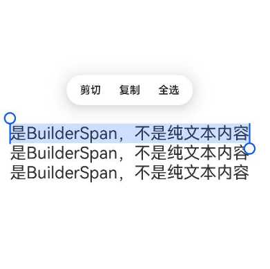

# RichEditor (系统接口)
<!--Kit: ArkUI-->
<!--Subsystem: ArkUI-->
<!--Owner: @carnivore233-->
<!--Designer: @pssea-->
<!--Tester: @mateng_Holtens-->
<!--Adviser: @HelloCrease-->

支持图文混排和文本交互式编辑的组件。

>  **说明：**
>
>  该组件从API Version 10开始支持。后续版本如有新增内容，则采用上角标单独标记该内容的起始版本。
>
>  当前页面仅包含本模块的系统接口，其他公开接口参见[RichEditor](ts-basic-components-richeditor.md)。
> 
## RichEditorBuilderSpanOptions<sup>11+</sup>

添加builder的偏移位置和builder样式信息。

**系统能力：** 此接口为系统接口。

**系统能力：** SystemCapability.ArkUI.ArkUI.Full

| 名称     | 类型     | 必填   | 说明                                    |
| ------ | ------ | ---- | ------------------------------------- |
| dragBackgroundColor<sup>18+</sup> | [ColorMetrics](../js-apis-arkui-graphics.md#colormetrics12) | 否    | 添加builder单独拖拽时的背板背景颜色。不配置或者异常值时，颜色按系统默认配置。  |
| isDragShadowNeeded<sup>18+</sup> | boolean | 否    | 添加builder单独拖拽时是否需要投影。不配置或者异常值时，默认需要投影。true表示需要投影，false表示不需要投影。<br/>默认值： true |

## RichEditorGesture<sup>11+</sup>

用户行为回调。

**系统能力：** 此接口为系统接口。

**系统能力：** SystemCapability.ArkUI.ArkUI.Full

| 名称          | 类型         | 必填   | 说明            |
| ----------- | ---------- | ---- | ------------- |
| onDoubleClick<sup>14+</sup> | Callback\<[GestureEvent](ts-gesture-common.md#gestureevent对象说明)\>  | 否    | [GestureEvent](ts-gesture-common.md#gestureevent对象说明)为用户双击事件。<br/>双击完成时回调事件。|

## RichEditorChangeValue<sup>12+</sup>

**系统能力：** 此接口为系统接口。

**系统能力：** SystemCapability.ArkUI.ArkUI.Full

| 名称 | 类型 | 必填 | 说明 |
| --- | --- | --- | --- |
| changeReason<sup>20+</sup> | [TextChangeReason](ts-text-common-sys.md#textchangereason20) | 否 | 组件内容变化的原因。 |

## 示例

### 示例1（获取组件内容变化原因）
从API version 20开始，该示例通过onWillChange接口返回的changeReason获取组件内容变化的原因。

```ts
@Entry
@Component
struct RichEditorExample {
  controller: RichEditorController = new RichEditorController()
  options: RichEditorOptions = { controller: this.controller }

  build() {
    Column() {
      RichEditor(this.options)
        .height('25%')
        .width('100%')
        .border({ width: 1, color: Color.Blue })
        .onWillChange((value: RichEditorChangeValue) => {
          console.log('onWillChange, changeReason=' + value.changeReason)
          return true
        })
    }
  }
}
```

### 示例2（设置自定义布局拖拽背板及拖拽投影配置）
从API version 18开始，该示例通过使用addBuilderSpan接口中的[dragBackgroundColor](#richeditorbuilderspanoptions11)和[isDragShadowNeeded](#richeditorbuilderspanoptions11)在拖拽场景中为自定义布局的拖拽背板和拖拽投影设置相关参数。

```ts
// xxx.ets
import { ColorMetrics } from '@kit.ArkUI';

@Entry
@Component
struct richEditorNew03 {
  controller: RichEditorController = new RichEditorController();
  options: RichEditorOptions = { controller: this.controller }
  build() {
    Column({ space: 10 }) {
      Column() {
        RichEditor(this.options)
          .onReady(() => {
            this.controller.addBuilderSpan(() => {
              this.placeholderBuilder()
            }, {
              offset: -1,
              dragBackgroundColor: ColorMetrics.rgba(0xff, 0x80, 0, 0xff),
              isDragShadowNeeded: false
            })
            this.controller.addBuilderSpan(() => {
              this.placeholderBuilder()
            }, {
              offset: -1,
              dragBackgroundColor: ColorMetrics.resourceColor("#ffff0000")
                .blendColor(ColorMetrics.resourceColor("#ff00ff00")),
              isDragShadowNeeded: true
            })
            this.controller.addBuilderSpan(() => {
              this.placeholderBuilder()
            }, { offset: -1 })
          })
          .borderWidth(1)
          .width("100%")
          .height("50%")
          .margin(50)
      }
      .width('100%')
      .margin({top:100})
    }
  }

  @Builder
  placeholderBuilder() {
    Row() {
      Text('是BuilderSpan，不是纯文本内容')
        .fontSize(22)
        .copyOption(CopyOptions.InApp)
    }
  }
}
```
