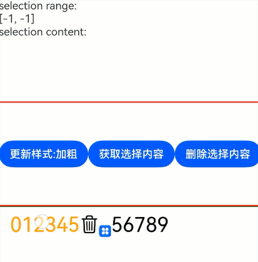
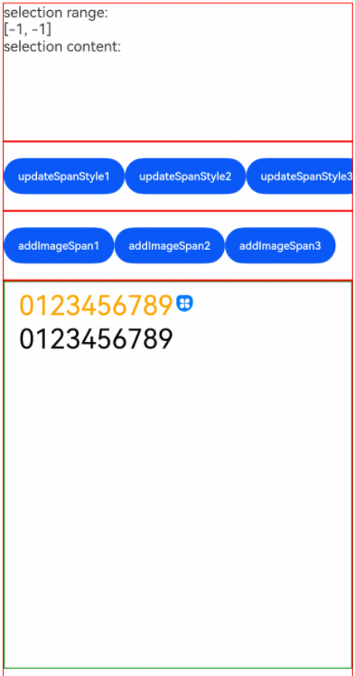
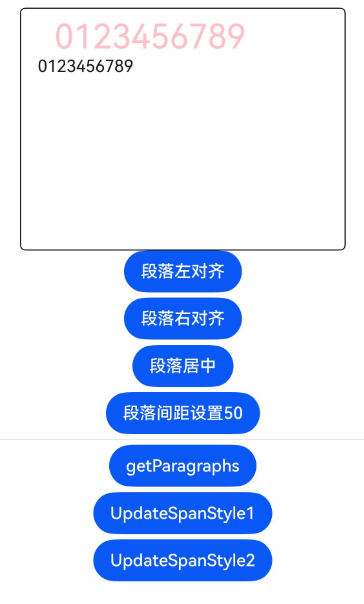
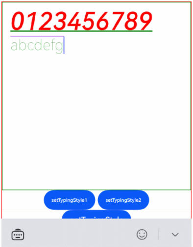
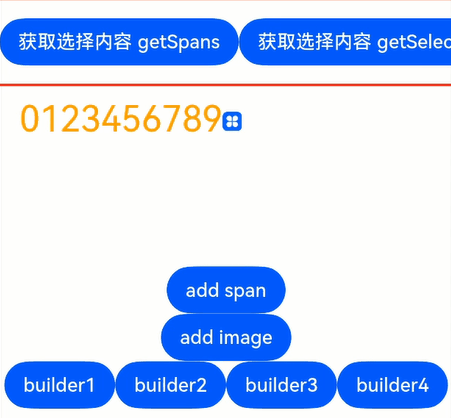
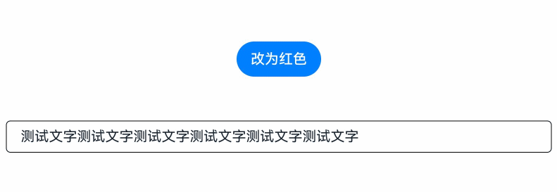
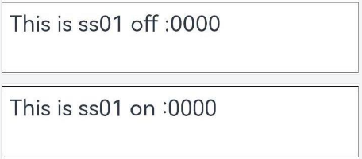
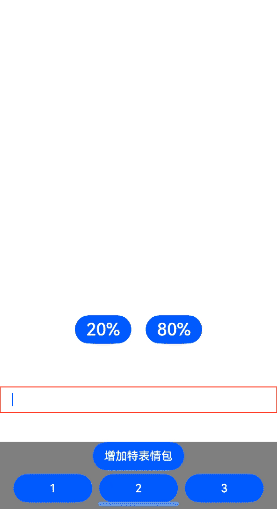
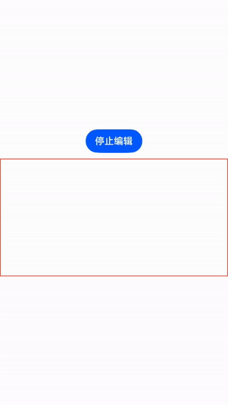
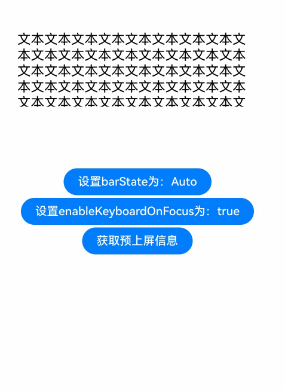

# RichEditor

支持图文混排和文本交互式编辑的组件。

>  **说明：**
>
>  该组件从API Version 10开始支持。后续版本如有新增内容，则采用上角标单独标记该内容的起始版本。


## 子组件

不包含子组件。


## 接口

RichEditor(value: RichEditorOptions)

**原子化服务API：** 从API version 11开始，该接口支持在原子化服务中使用。

**系统能力：** SystemCapability.ArkUI.ArkUI.Full

**参数：**

| 参数名   | 类型                                    | 必填   | 说明        |
| ----- | --------------------------------------- | ---- | ----------- |
| value | [RichEditorOptions](#richeditoroptions) | 是    | 富文本组件初始化选项。 |

RichEditor(options: RichEditorStyledStringOptions)<sup>12+</sup>


**参数：**

| 参数名   | 类型                                    | 必填   | 说明        |
| ----- | --------------------------------------- | ---- | ----------- |
| options | [RichEditorStyledStringOptions](#richeditorstyledstringoptions12) | 是    | 富文本组件初始化选项。 |

## 属性

除支持[通用属性](ts-universal-attributes-size.md)外，还支持以下属性：

>  **说明：**
>
>  align属性只支持上方、中间和下方位置的对齐方式。

### customKeyboard

customKeyboard(value: CustomBuilder, options?: KeyboardOptions)

设置自定义键盘。

当设置自定义键盘时，输入框激活后不会打开系统输入法，而是加载指定的自定义组件。

自定义键盘的高度可以通过自定义组件根节点的height属性设置，宽度不可设置，使用系统默认值。

自定义键盘无法获取焦点，但是会拦截手势事件。

默认在输入控件失去焦点时，关闭自定义键盘。

如果设备支持拍摄输入，设置自定义键盘后，该输入框会不支持拍摄输入。

**原子化服务API：** 从API version 11开始，该接口支持在原子化服务中使用。

**系统能力：** SystemCapability.ArkUI.ArkUI.Full

**参数：** 

| 参数名                | 类型                                        | 必填 | 说明                             |
| --------------------- | ------------------------------------------- | ---- | -------------------------------- |
| value                 | [CustomBuilder](ts-types.md#custombuilder8) | 是   | 自定义键盘。                     <br/>**原子化服务API：** 从API version 11开始，该接口支持在原子化服务中使用。|
| options<sup>12+</sup> | [KeyboardOptions](#keyboardoptions12)       | 否   | 设置自定义键盘是否支持避让功能。 |

### bindSelectionMenu

bindSelectionMenu(spanType: RichEditorSpanType, content: CustomBuilder, responseType: ResponseType | RichEditorResponseType,
    options?: SelectionMenuOptions)

设置自定义选择菜单。自定义菜单超长时，建议内部嵌套[Scroll](./ts-container-scroll.md)组件使用，避免键盘被遮挡。

**原子化服务API：** 从API version 11开始，该接口支持在原子化服务中使用。

**系统能力：** SystemCapability.ArkUI.ArkUI.Full

**参数：** 

| 参数名       | 类型                                                         | 必填 | 说明                                                      |
| ------------ | ------------------------------------------------------------ | ---- | --------------------------------------------------------- |
| spanType     | [RichEditorSpanType](#richeditorspantype)                    | 是   | 菜单的类型。<br/> 默认值：<br/>RichEditorSpanType.TEXT    |
| content      | [CustomBuilder](ts-types.md#custombuilder8)                  | 是   | 菜单的内容。                                              |
| responseType | &nbsp;[ResponseType](ts-appendix-enums.md#responsetype8)&nbsp;\|&nbsp;[RichEditorResponseType](#richeditorresponsetype11) | 是   | 菜单的响应类型。<br/> 默认值：<br/>ResponseType.LongPress |
| options      | [SelectionMenuOptions](#selectionmenuoptions10)              | 否   | 菜单的选项。                                              |

### copyOptions

copyOptions(value: CopyOptions)

设置组件是否支持文本内容可复制粘贴。

copyOptions不为CopyOptions.None时，长按组件内容，会弹出文本选择弹框。如果通过bindSelectionMenu等方式自定义文本选择菜单，则会弹出自定义的菜单。

设置copyOptions为CopyOptions.None，复制、剪切功能不生效。

**原子化服务API：** 从API version 11开始，该接口支持在原子化服务中使用。

**系统能力：** SystemCapability.ArkUI.ArkUI.Full

**参数：** 

| 参数名 | 类型                                             | 必填 | 说明                                                         |
| ------ | ------------------------------------------------ | ---- | ------------------------------------------------------------ |
| value  | [CopyOptions](ts-appendix-enums.md#copyoptions9) | 是   | 组件支持文本内容是否可复制粘贴。<br />默认值：CopyOptions.LocalDevice <br />**卡片能力：** 从API version 10开始，该接口支持在ArkTS卡片中使用。||

### enableDataDetector<sup>11+</sup>

enableDataDetector(enable: boolean)

设置是否进行文本特殊实体识别。

该接口依赖设备底层应具有文本识别能力，否则设置不会生效。

当enableDataDetector设置为true，同时不设置dataDetectorConfig属性时，默认识别所有类型的实体，所识别实体的color和decoration会被更改为如下样式：

```ts
color: '#ff007dff'
decoration:{
  type: TextDecorationType.Underline,
  color: '#ff007dff',
  style: TextDecorationStyle.SOLID
}
```

触摸点击和鼠标右键点击实体，会根据实体类型弹出对应的实体操作菜单，鼠标左键点击实体会直接响应菜单的第一个选项。

对addBuilderSpan的节点文本，该功能不会生效。

当copyOption设置为CopyOptions.None时，点击实体弹出的菜单没有选择文本和复制功能。

**原子化服务API：** 从API version 12开始，该接口支持在原子化服务中使用。

**系统能力：** SystemCapability.ArkUI.ArkUI.Full

**参数：** 

| 参数名 | 类型    | 必填 | 说明                              |
| ------ | ------- | ---- | --------------------------------- |
| enable  | boolean | 是   | 使能文本识别。<br/>默认值： false |

### dataDetectorConfig<sup>11+</sup>

dataDetectorConfig(config: TextDataDetectorConfig)

设置文本识别配置。

需配合[enableDataDetector](#enabledatadetector11)一起使用，设置enableDataDetector为true时，dataDetectorConfig的配置才能生效。

当有两个实体A、B重叠时，按以下规则保留实体：

1.&nbsp;若A&nbsp;⊂&nbsp;B，则保留B，反之则保留A。

2.&nbsp;当A&nbsp;⊄&nbsp;B且B&nbsp;⊄&nbsp;A时，若A.start&nbsp;<&nbsp;B.start，则保留A，反之则保留B。

**原子化服务API：** 从API version 12开始，该接口支持在原子化服务中使用。

**系统能力：** SystemCapability.ArkUI.ArkUI.Full

**参数：** 

| 参数名 | 类型                                                        | 必填 | 说明                                                         |
| ------ | ----------------------------------------------------------- | ---- | ------------------------------------------------------------ |
| config | [TextDataDetectorConfig](ts-text-common.md#textdatadetectorconfig11对象说明) | 是   | 文本识别配置。|

### enablePreviewText<sup>12+</sup>

enablePreviewText(enable: boolean)

设置是否开启预上屏功能。

**原子化服务API：** 从API version 12开始，该接口支持在原子化服务中使用。

**系统能力：** SystemCapability.ArkUI.ArkUI.Full

**参数：** 

| 参数名 | 类型    | 必填 | 说明                              |
| ------ | ------- | ---- | --------------------------------- |
| enable  | boolean | 是   | 使能预上屏功能。<br/>默认值： true |

>  **说明：**
>
>  该接口在CAPI场景使用时下，默认关闭。可以在工程的module.json5中配置[metadata](../../../../application-dev/quick-start/module-structure.md#metadata对象内部结构)字段控制是否启用预上屏，配置如下：
> ```json
> "metadata": [
>  {
>     "name": "can_preview_text",
>     "value": "true",
>  }
> ]
> ```

### placeholder<sup>12+</sup>

placeholder(value: ResourceStr, style?: PlaceholderStyle)

设置无输入时的提示文本。

**原子化服务API：** 从API version 12开始，该接口支持在原子化服务中使用。

**系统能力：** SystemCapability.ArkUI.ArkUI.Full

**参数：** 

| 参数名 | 类型                                    | 必填 | 说明                                                    |
| ------ | --------------------------------------- | ---- | ------------------------------------------------------- |
| value  | [ResourceStr](ts-types.md#resourcestr)  | 是   | 无输入时的提示文本。                                    |
| style  | [PlaceholderStyle](#placeholderstyle12) | 否   | 添加提示文本的字体样式。<br />style缺省时默认跟随主题。 |

### caretColor<sup>12+</sup>

caretColor(value: ResourceColor)

设置输入框光标、手柄颜色。

**原子化服务API：** 从API version 12开始，该接口支持在原子化服务中使用。

**系统能力：** SystemCapability.ArkUI.ArkUI.Full

**参数：** 

| 参数名 | 类型                                       | 必填 | 说明                                   |
| ------ | ------------------------------------------ | ---- | -------------------------------------- |
| value  | [ResourceColor](ts-types.md#resourcecolor) | 是   | 输入框光标、手柄颜色。<br/>默认值：'#007DFF' |

### selectedBackgroundColor<sup>12+</sup>

selectedBackgroundColor(value: ResourceColor)

设置文本选中底板颜色。如果未设置不透明度，默认为20%不透明度。

**原子化服务API：** 从API version 12开始，该接口支持在原子化服务中使用。

**系统能力：** SystemCapability.ArkUI.ArkUI.Full

**参数：** 

| 参数名 | 类型                                       | 必填 | 说明                                       |
| ------ | ------------------------------------------ | ---- | ------------------------------------------ |
| value  | [ResourceColor](ts-types.md#resourcecolor) | 是   | 文本选中底板颜色。<br/>默认为20%不透明度。 |

### editMenuOptions<sup>12+</sup>

editMenuOptions(editMenu: EditMenuOptions)

设置自定义菜单扩展项，允许用户设置扩展项的文本内容、图标、回调方法。

**原子化服务API：** 从API version 12开始，该接口支持在原子化服务中使用。


**元服务API：** 从API version 12开始，该接口支持在元服务中使用。

**系统能力：** SystemCapability.ArkUI.ArkUI.Full

**参数：** 

| 参数名 | 类型                                          | 必填 | 说明                                          |
| ------ | --------------------------------------------- | ---- | --------------------------------------------- |
| editMenu  | [EditMenuOptions](ts-text-common.md#editmenuoptions对象说明) | 是   | 扩展菜单选项。 |

### enterKeyType<sup>12+</sup>

enterKeyType(value: EnterKeyType)

设置软键盘输入法回车键类型。

**原子化服务API：** 从API version 12开始，该接口支持在原子化服务中使用。

**系统能力：** SystemCapability.ArkUI.ArkUI.Full

**参数：** 

| 参数名 | 类型   | 必填 | 说明                                |
| ------ | ------ | ---- | ----------------------------------- |
| value  | [EnterKeyType](ts-types.md#enterkeytype枚举说明) | 是   | 键盘输入法回车键类型。<br/>默认为EnterKeyType.NEW_LINE。 |

### enableKeyboardOnFocus<sup>12+</sup>

enableKeyboardOnFocus(isEnabled: boolean)

设置RichEditor通过点击以外的方式获焦时，是否主动拉起软键盘。


**原子化服务API：** 从API version 12开始，该接口支持在原子化服务中使用。

**系统能力：** SystemCapability.ArkUI.ArkUI.Full

**参数：** 

| 参数名 | 类型 | 必填 | 说明 |
| ------ | ------- | ---- | ----------------------------------------------------------- |
| isEnabled  | boolean | 是   | 通过点击以外的方式获焦时，是否主动拉起软键盘。<br/>默认值：true |

## 事件

除支持[通用事件](ts-universal-events-click.md)外，还支持[OnDidChangeCallback](ts-text-common.md#ondidchangecallback12)、[StyledStringChangedListener](ts-text-common.md#styledstringchangedlistener12)、[StyledStringChangeValue](ts-text-common.md#styledstringchangevalue12)和以下事件：

### onReady

onReady(callback:Callback\<void\>)

富文本组件初始化完成后，触发回调。

**原子化服务API：** 从API version 11开始，该接口支持在原子化服务中使用。

**系统能力：** SystemCapability.ArkUI.ArkUI.Full

**参数：** 

| 参数名   | 类型                                    | 必填   | 说明        |
| ----- | --------------------------------------- | ---- | ----------- |
| callback |Callback\<void\> | 是    | 订阅富文本组件初始化完成的回调。 |

### onSelect

onSelect(callback:Callback\<[RichEditorSelection](#richeditorselection)\>)

鼠标左键双击选中内容时，会触发回调；松开鼠标左键后，会再次触发回调。

手指长按选中内容时，会触发回调；松开手指后，会再次触发回调。

使用[RichEditorStyledStringOptions](#richeditorstyledstringoptions12)构建的RichEditor组件时不支持该回调。

**原子化服务API：** 从API version 11开始，该接口支持在原子化服务中使用。

**系统能力：** SystemCapability.ArkUI.ArkUI.Full

**参数：** 

| 参数名 | 类型                                        | 必填 | 说明                 |
| ------ | ------------------------------------------- | ---- | -------------------- |
| callback | Callback\<[RichEditorSelection](#richeditorselection)\> | 是   | [RichEditorSelection](#richeditorselection)为选中的所有span信息。<br/>选择时触发的回调。 |

### aboutToIMEInput

aboutToIMEInput(callback:Callback\<[RichEditorInsertValue](#richeditorinsertvalue), boolean\>)

输入法输入内容前，触发回调。

使用[RichEditorStyledStringOptions](#richeditorstyledstringoptions12)构建的RichEditor组件时不支持该回调。

**原子化服务API：** 从API version 11开始，该接口支持在原子化服务中使用。

**系统能力：** SystemCapability.ArkUI.ArkUI.Full

**参数：** 

| 参数名 | 类型                                        | 必填 | 说明                 |
| ------ | ------------------------------------------- | ---- | -------------------- |
| callback | Callback\<[RichEditorInsertValue](#richeditorinsertvalue), boolean\> | 是   | [RichEditorInsertValue](#richeditorinsertvalue)为输入法将要输入内容信息。<br/>true:组件执行添加内容操作。<br/>false:组件不执行添加内容操作<br/>输入法输入内容前的回调。|

### onDidIMEInput

onDidIMEInput(callback:Callback\<TextRange>)

输入法完成输入时，触发回调。

使用[RichEditorStyledStringOptions](#richeditorstyledstringoptions12)构建的RichEditor组件时不支持该回调。

**原子化服务API：** 从API version 12开始，该接口支持在原子化服务中使用。

**系统能力：** SystemCapability.ArkUI.ArkUI.Full

**参数：** 

| 参数名 | 类型                                        | 必填 | 说明                 |
| ------ | ------------------------------------------- | ---- | -------------------- |
| callback | Callback\<[TextRange](ts-text-common.md#textrange12)\> | 是 | TextRange为输入法本次输入内容的范围。<br/>输入法完成输入时的回调。|

### onIMEInputComplete

onIMEInputComplete(callback:Callback\<[RichEditorTextSpanResult](#richeditortextspanresult)\>)

输入法完成输入后，触发回调。

使用[RichEditorStyledStringOptions](#richeditorstyledstringoptions12)构建的RichEditor组件时不支持该回调。

**原子化服务API：** 从API version 11开始，该接口支持在原子化服务中使用。

**系统能力：** SystemCapability.ArkUI.ArkUI.Full

**参数：** 

| 参数名 | 类型                                        | 必填 | 说明                 |
| ------ | ------------------------------------------- | ---- | -------------------- |
| callback | Callback\<[RichEditorTextSpanResult](#richeditortextspanresult)\> | 是 | [RichEditorTextSpanResult](#richeditortextspanresult)为输入法完成输入后的文本Span信息。<br/>输入法完成输入后的回调。|

### aboutToDelete

aboutToDelete(callback:Callback\<[RichEditorDeleteValue](#richeditordeletevalue), boolean\>)

输入法删除内容前，触发回调。

使用[RichEditorStyledStringOptions](#richeditorstyledstringoptions12)构建的RichEditor组件时不支持该回调。

**原子化服务API：** 从API version 11开始，该接口支持在原子化服务中使用。

**系统能力：** SystemCapability.ArkUI.ArkUI.Full

**参数：** 

| 参数名 | 类型                                        | 必填 | 说明                 |
| ------ | ------------------------------------------- | ---- | -------------------- |
| callback | Callback\<[RichEditorDeleteValue](#richeditordeletevalue), boolean\> | 是 | [RichEditorDeleteValue](#richeditordeletevalue)为准备删除的内容所在的文本或者图片Span信息。<br/>true:组件执行删除操作。<br/>false:组件不执行删除操作。<br/>输入法删除内容前的回调。|

### onDeleteComplete

onDeleteComplete(callback:Callback\<void\>)

输入法完成删除后，触发回调。

使用[RichEditorStyledStringOptions](#richeditorstyledstringoptions12)构建的RichEditor组件时不支持该回调。

**原子化服务API：** 从API version 11开始，该接口支持在原子化服务中使用。

**系统能力：** SystemCapability.ArkUI.ArkUI.Full

**参数：** 

| 参数名   | 类型                                    | 必填   | 说明        |
| ----- | --------------------------------------- | ---- | ----------- |
| callback |Callback\<void\> | 是    | 订阅输入法完成删除的回调。 |

### onPaste<sup>11+</sup>

onPaste(callback: [PasteEventCallback](#pasteeventcallback12) )

完成粘贴前，触发回调。开发者可以通过该方法，覆盖系统默认行为，实现图文的粘贴。

**原子化服务API：** 从API version 12开始，该接口支持在原子化服务中使用。

**系统能力：** SystemCapability.ArkUI.ArkUI.Full

**参数：** 

| 参数名 | 类型    | 必填 | 说明                          |
| ------ | ------- | ---- | ----------------------------- |
| callback | [PasteEventCallback](#pasteeventcallback12) | 是   | 订阅完成粘贴前的回调。 |

### onSelectionChange<sup>12+</sup>

onSelectionChange(callback:Callback\<[RichEditorRange](#richeditorrange)\>)

组件内所有内容选择区域发生变化或编辑状态下光标位置发生变化时触发该回调。光标位置发生变化回调时，选择区域的起始位置等于终止位置。

**原子化服务API：** 从API version 12开始，该接口支持在原子化服务中使用。

**系统能力：** SystemCapability.ArkUI.ArkUI.Full

**参数：** 

| 参数名   | 类型                                    | 必填   | 说明        |
| ----- | --------------------------------------- | ---- | ----------- |
| callback |Callback\<[RichEditorRange](#richeditorrange)\> | 是    | [RichEditorRange](#richeditorrange)为所有内容的选择区域起始和终止位置。<br/>订阅文本选择区域发生变化或编辑状态下光标位置发生变化时触发的回调|

### onEditingChange<sup>12+</sup>

onEditingChange(callback: Callback\<boolean\>)

组件内所有内容的编辑状态发生改变时触发该回调函数。

**原子化服务API：** 从API version 12开始，该接口支持在原子化服务中使用。

**系统能力：** SystemCapability.ArkUI.ArkUI.Full

**参数：** 

| 参数名   | 类型                                    | 必填   | 说明        |
| ----- | --------------------------------------- | ---- | ----------- |
| callback | Callback\<boolean\> | 是    | true表示编辑态，false表示非编辑态。 |

### onSubmit<sup>12+</sup>

onSubmit(callback: SubmitCallback)

按下软键盘输入法回车键触发该回调。

**原子化服务API：** 从API version 12开始，该接口支持在原子化服务中使用。

**系统能力：** SystemCapability.ArkUI.ArkUI.Full

**参数：** 

| 参数名 | 类型    | 必填 | 说明                          |
| ------ | ------- | ---- | ----------------------------- |
| callback | [SubmitCallback](#submitcallback12) | 是   | 侦听事件的回调。 |

### onWillChange<sup>12+</sup>

onWillChange(callback: Callback\<RichEditorChangeValue, boolean\>)

组件内图文变化前，触发回调。

使用[RichEditorStyledStringOptions](#richeditorstyledstringoptions12)构建的RichEditor组件时不支持该回调。

**原子化服务API：** 从API version 12开始，该接口支持在原子化服务中使用。

**系统能力：** SystemCapability.ArkUI.ArkUI.Full

**参数：** 

| 参数名 | 类型 | 必填 | 说明 |
| -- | -- | -- | -- |
| callback | Callback\<[RichEditorChangeValue](#richeditorchangevalue12) , boolean\> | 是    | [RichEditorChangeValue](#richeditorchangevalue12)为图文变化信息；boolean表示当前图文是否允许被更改，true：允许图文被更改。false：不允许图文被更改。 |

### onDidChange<sup>12+</sup>

onDidChange(callback: OnDidChangeCallback)

图文变化后，触发回调。

使用[RichEditorStyledStringOptions](#richeditorstyledstringoptions12)构建的RichEditor组件时不支持该回调。

**原子化服务API：** 从API version 12开始，该接口支持在原子化服务中使用。

**系统能力：** SystemCapability.ArkUI.ArkUI.Full

**参数：** 

| 参数名 | 类型 | 必填 | 说明 |
| -- | -- | -- | -- |
| callback | [OnDidChangeCallback](ts-text-common.md#ondidchangecallback12) | 是 | 图文变化前后的内容范围。 |

### onCut<sup>12+</sup>

onCut(callback: Callback\<CutEvent\>)

完成剪切前，触发回调。系统的默认剪切行为，只支持纯文本的剪切。开发者可以通过该方法，覆盖系统默认行为，实现图文的剪切。

**原子化服务API：** 从API version 12开始，该接口支持在原子化服务中使用。

**系统能力：** SystemCapability.ArkUI.ArkUI.Full

**参数：** 

| 参数名   | 类型                                    | 必填   | 说明        |
| ----- | --------------------------------------- | ---- | ----------- |
| callback |Callback\<[CutEvent](#cutevent12)\> | 是    | 定义用户剪切事件。 |

### onCopy<sup>12+</sup>

onCopy(callback: Callback\<CopyEvent\>)

完成复制前，触发回调。系统的默认复制行为，只支持纯文本的复制。开发者可以通过该方法，覆盖系统默认行为，实现图文的复制。

**原子化服务API：** 从API version 12开始，该接口支持在原子化服务中使用。

**系统能力：** SystemCapability.ArkUI.ArkUI.Full

**参数：** 

| 参数名   | 类型                                    | 必填   | 说明        |
| ----- | --------------------------------------- | ---- | ----------- |
| callback |Callback\<[CopyEvent](#copyevent12)\> | 是    | 定义用户复制事件。 |

## RichEditorInsertValue

插入文本信息。


**系统能力：** SystemCapability.ArkUI.ArkUI.Full

| 名称           | 类型     | 必填   | 说明         |
| ------------ | ------ | ---- | ---------- |
| insertOffset | number | 是    | 插入的文本偏移位置。<br/>**原子化服务API：** 从API version 11开始，该接口支持在原子化服务中使用。|
| insertValue  | string | 是    | 插入的文本内容。<br/>**原子化服务API：** 从API version 11开始，该接口支持在原子化服务中使用。  |
| previewText<sup>12+</sup> | string | 否    | 插入的预上屏文本内容。<br/> **原子化服务API：** 从API version 12开始，该接口支持在原子化服务中使用。|


## RichEditorDeleteValue

删除操作的信息和被删除内容的信息。

**原子化服务API：** 从API version 11开始，该接口支持在原子化服务中使用。

**系统能力：** SystemCapability.ArkUI.ArkUI.Full

| 名称                    | 类型                                       | 必填   | 说明                  |
| --------------------- | ---------------------------------------- | ---- | ------------------- |
| offset                | number                                   | 是    | 删除内容的偏移位置。          |
| direction             | [RichEditorDeleteDirection](#richeditordeletedirection) | 是    | 删除操作的方向。            |
| length                | number                                   | 是    | 删除内容长度。             |
| richEditorDeleteSpans | Array<[RichEditorTextSpanResult](#richeditortextspanresult) \| [RichEditorImageSpanResult](#richeditorimagespanresult)> | 是    | 删除的文本或者图片Span的具体信息。 |


## RichEditorDeleteDirection

删除操作的方向。

**原子化服务API：** 从API version 11开始，该接口支持在原子化服务中使用。

**系统能力：** SystemCapability.ArkUI.ArkUI.Full

| 名称       | 描述    |
| -------- | ----- |
| BACKWARD | 向后删除。 |
| FORWARD  | 向前删除。 |


## RichEditorTextSpanResult

文本Span信息。

**系统能力：** SystemCapability.ArkUI.ArkUI.Full

| 名称                            | 类型                                       | 必填   | 说明                     |
| ----------------------------- | ---------------------------------------- | ---- | ---------------------- |
| spanPosition                  | [RichEditorSpanPosition](#richeditorspanposition) | 是    | Span位置。                <br/>**原子化服务API：** 从API version 11开始，该接口支持在原子化服务中使用。|
| value                         | string                                   | 是    | 文本Span内容。              <br/>**原子化服务API：** 从API version 11开始，该接口支持在原子化服务中使用。|
| textStyle                     | [RichEditorTextStyleResult](#richeditortextstyleresult) | 是    | 文本Span样式信息。            <br/>**原子化服务API：** 从API version 11开始，该接口支持在原子化服务中使用。|
| offsetInSpan                  | [number, number]                         | 是    | 文本Span内容里有效内容的起始和结束位置。 <br/>**原子化服务API：** 从API version 11开始，该接口支持在原子化服务中使用。|
| valueResource<sup>11+</sup>   | [Resource](ts-types.md#resource)         | 否    | 组件SymbolSpan内容。<br/>**原子化服务API：** 从API version 12开始，该接口支持在原子化服务中使用。        |
| symbolSpanStyle<sup>11+</sup> | [RichEditorSymbolSpanStyle](#richeditorsymbolspanstyle11) | 否    | 组件SymbolSpan样式信息。      <br/>**原子化服务API：** 从API version 12开始，该接口支持在原子化服务中使用。|
| paragraphStyle<sup>12+</sup>  | [RichEditorParagraphStyle](#richeditorparagraphstyle11)  | 否   | 段落样式。<br/>**原子化服务API：** 从API version 12开始，该接口支持在原子化服务中使用。|
| previewText<sup>12+</sup>      | string                                   | 否    | 文本Span预上屏内容。              <br/>**原子化服务API：** 从API version 12开始，该接口支持在原子化服务中使用。|


## RichEditorSpanPosition

Span位置信息。

**原子化服务API：** 从API version 11开始，该接口支持在原子化服务中使用。

**系统能力：** SystemCapability.ArkUI.ArkUI.Full

| 名称        | 类型               | 必填   | 说明                          |
| --------- | ---------------- | ---- | --------------------------- |
| spanIndex | number           | 是    | Span索引值。                    |
| spanRange | [number, number] | 是    | Span内容在RichEditor内的起始和结束位置。 |

## RichEditorSpanType

Span类型信息。

**原子化服务API：** 从API version 11开始，该接口支持在原子化服务中使用。

**系统能力：** SystemCapability.ArkUI.ArkUI.Full

| 名称    | 值     | 描述           |
| ----- | ---- | ------------ |
| TEXT  | 0 | Span为文字类型。   |
| IMAGE | 1 | Span为图像类型。   |
| MIXED | 2 | Span为图文混合类型。 |
| BUILDER<sup>12+</sup> | 3 | Span为BuilderSpan类型。 |

## RichEditorResponseType<sup>11+</sup>

菜单的响应类型。

**原子化服务API：** 从API version 12开始，该接口支持在原子化服务中使用。

| 名称         | 描述            |
| ---------- | ------------- |
| LONG_PRESS  | 通过长按触发菜单弹出。   |
| RIGHT_CLICK | 通过鼠标右键触发菜单弹出。 |
| SELECT | 通过鼠标选中触发菜单弹出。 |

## RichEditorTextStyleResult

后端返回的文本样式信息。

**系统能力：** SystemCapability.ArkUI.ArkUI.Full

| 名称         | 类型                                       | 必填   | 说明           |
| ---------- | ---------------------------------------- | ---- | ------------ |
| fontColor  | [ResourceColor](ts-types.md#resourcecolor) | 是    | 文本颜色。        <br/>**原子化服务API：** 从API version 11开始，该接口支持在原子化服务中使用。|
| fontSize   | number                                   | 是    | 字体大小，默认单位为fp。        <br/>**原子化服务API：** 从API version 11开始，该接口支持在原子化服务中使用。|
| fontStyle  | [FontStyle](ts-appendix-enums.md#fontstyle) | 是    | 字体样式。        <br/>**原子化服务API：** 从API version 11开始，该接口支持在原子化服务中使用。|
| fontWeight | number                                   | 是    | 字体粗细。        <br/>**原子化服务API：** 从API version 11开始，该接口支持在原子化服务中使用。|
| fontFamily | string                                   | 是    | 字体列表。        <br/>**原子化服务API：** 从API version 11开始，该接口支持在原子化服务中使用。|
| decoration | [DecorationStyleResult](ts-universal-styled-string.md#decorationstyleresult) | 是    | 文本装饰线样式信息。 <br/>**原子化服务API：** 从API version 11开始，该接口支持在原子化服务中使用。|
| textShadow<sup>12+</sup> | &nbsp;Array&lt;[ShadowOptions](ts-universal-attributes-image-effect.md#shadowoptions对象说明)> | 否    | 文字阴影效果。<br/>**原子化服务API：** 从API version 12开始，该接口支持在原子化服务中使用。|
| lineHeight<sup>12+</sup> | number       | 否    | 文本行高，默认单位为fp。<br/>**原子化服务API：** 从API version 12开始，该接口支持在原子化服务中使用。|
| letterSpacing<sup>12+</sup>| number       | 否    | 文本字符间距，默认单位为fp。<br/>**原子化服务API：** 从API version 12开始，该接口支持在原子化服务中使用。|
| fontFeature<sup>12+</sup> | string | 否 | 文字特性效果。<br/>**原子化服务API：** 从API version 12开始，该接口支持在原子化服务中使用。|

>  **说明：**
>
>  在RichEditorTextStyle中，fontWeight是设置字体粗细的输入参数。
>  而在RichEditorTextStyleResult中，会将之前设置的字体粗细转换为数字后返回。
>  转换关系如下：
>
>  | RichEditorTextStyle中的fontWeight | RichEditorTextStyleResult中的fontWeight |
>  | ---- | ----------------------------------- |
>  | 100   | 0 |
>  | 200   | 1 |
>  | 300   | 2 |
>  | 400   | 3 |
>  | 500   | 4 |
>  | 600   | 5 |
>  | 700   | 6 |
>  | 800   | 7 |
>  | 900   | 8 |
>  | Lighter   | 12 |
>  | Normal   | 10 |
>  | Regular   | 14 |
>  | Medium   | 13 |
>  | Bold   | 9 |
>  | Bolder   | 11 |
>
>  RichEditorSymbolSpanStyle和RichEditorSymbolSpanStyleResult中fontWeight的转换关系，
>  与RichEditorTextStyle和RichEditorTextStyleResult中fontWeight的转换关系一致。

## RichEditorSymbolSpanStyleResult<sup>11+</sup>

后端返回的SymbolSpan样式信息。

**原子化服务API：** 从API version 12开始，该接口支持在原子化服务中使用。

**系统能力：** SystemCapability.ArkUI.ArkUI.Full

| 名称 | 类型 | 必填 | 说明                               |
| ------ | -------- | ---- | -------------------------------------- |
| fontColor | Array\<[ResourceColor](ts-types.md#resourcecolor)\> | 是 | SymbolSpan组件颜色。<br/> 默认值：不同渲染策略下默认值不同。 |
| fontSize | number \| string \| [Resource](ts-types.md#resource) | 是 | SymbolSpan组件大小，默认单位为fp。<br/>默认值：跟随主题。|
| fontWeight | number \| [FontWeight](ts-appendix-enums.md#fontweight) \| string  | 是 | SymbolSpan组件粗细。<br/>number类型取值[100,900]，取值间隔为100，默认为400，取值越大，字体越粗。<br/>string类型仅支持number类型取值的字符串形式，例如“400”，以及“bold”、“bolder”、“lighter”、“regular” 、“medium”分别对应FontWeight中相应的枚举值。<br/>默认值：FontWeight.Normal。|
| renderingStrategy | [SymbolRenderingStrategy](ts-basic-components-symbolGlyph.md#symbolrenderingstrategy11枚举说明)	| 是 | SymbolSpan组件渲染策略。<br/>默认值：SymbolRenderingStrategy.SINGLE。|
| effectStrategy | [SymbolEffectStrategy](ts-basic-components-symbolGlyph.md#symboleffectstrategy11枚举说明)	| 是 | SymbolSpan组件动效策略。<br/>默认值：SymbolEffectStrategy.NONE。|

## RichEditorImageSpanResult

后端返回的图片信息。

**原子化服务API：** 从API version 11开始，该接口支持在原子化服务中使用。

**系统能力：** SystemCapability.ArkUI.ArkUI.Full

| 名称               | 类型                                                                | 必填  | 说明               |
|------------------|-------------------------------------------------------------------|-----|------------------|
| spanPosition     | [RichEditorSpanPosition](#richeditorspanposition)                 | 是   | Span位置。|
| valuePixelMap    | [PixelMap](../../apis-image-kit/js-apis-image.md#pixelmap7)                    | 否   | 图片内容。|
| valueResourceStr | [ResourceStr](ts-types.md#resourcestr)                            | 否   | 图片资源id。|
| imageStyle       | [RichEditorImageSpanStyleResult](#richeditorimagespanstyleresult) | 是 | 图片样式。|
| offsetInSpan     | [number, number] | 是 | Span里图片的起始和结束位置。|

## RichEditorImageSpanStyleResult

后端返回的图片样式信息。

**系统能力：** SystemCapability.ArkUI.ArkUI.Full

| 名称            | 类型                                       | 必填   | 说明        |
| ------------- | ---------------------------------------- | ---- | --------- |
| size          | [number, number]                         | 是    | 图片的宽度和高度，单位为px。默认值：size的默认值与objectFit的值有关，不同的objectFit值对应的size默认值也不同。objectFit的值为Cover时，图片高度为组件高度减去组件上下内边距，图片宽度为组件宽度减去组件左右内边距。 <br/>**原子化服务API：** 从API version 11开始，该接口支持在原子化服务中使用。|
| verticalAlign | [ImageSpanAlignment](ts-basic-components-imagespan.md#imagespanalignment) | 是    | 图片垂直对齐方式。 <br/>**原子化服务API：** 从API version 11开始，该接口支持在原子化服务中使用。|
| objectFit     | [ImageFit](ts-appendix-enums.md#imagefit) | 是    | 图片缩放类型。   <br/>**原子化服务API：** 从API version 11开始，该接口支持在原子化服务中使用。|
| layoutStyle<sup>12+</sup> | [RichEditorLayoutStyle](#richeditorlayoutstyle11)     | 否   | 图片布局风格。 <br/>**原子化服务API：** 从API version 12开始，该接口支持在原子化服务中使用。 ||

## RichEditorLayoutStyle<sup>11+</sup> 

**原子化服务API：** 从API version 12开始，该接口支持在原子化服务中使用。

**系统能力：** SystemCapability.ArkUI.ArkUI.Full

|名称	|类型	|必填|	说明|
| -------------  | -----------------------            | ---- | ------------------------------------------------------------ |
|margin	         |  [Dimension](ts-types.md#dimension10) \| [Margin](ts-types.md#margin)	                       |  否  |	外边距类型，用于描述组件不同方向的外边距。<br/>参数为Dimension类型时，四个方向外边距同时生效。|
|borderRadius	   |  [Dimension](ts-types.md#dimension10) \| [BorderRadiuses](ts-types.md#borderradiuses9)  |  否  |	圆角类型，用于描述组件边框圆角半径。<br/>参数为Dimension类型时，不支持以Percentage形式设置。|

## RichEditorOptions

RichEditor初始化参数。

**原子化服务API：** 从API version 11开始，该接口支持在原子化服务中使用。

**系统能力：** SystemCapability.ArkUI.ArkUI.Full

| 名称         | 类型                                       | 必填   | 说明      |
| ---------- | ---------------------------------------- | ---- | ------- |
| controller | [RichEditorController](#richeditorcontroller) | 是    | 富文本控制器。 |

## RichEditorStyledStringOptions<sup>12+</sup>

RichEditor初始化参数。

**原子化服务API：** 从API version 12开始，该接口支持在原子化服务中使用。

**系统能力：** SystemCapability.ArkUI.ArkUI.Full

| 名称         | 类型                                       | 必填   | 说明      |
| ---------- | ---------------------------------------- | ---- | ------- |
| controller | [RichEditorStyledStringController](#richeditorstyledstringcontroller12) | 是    | 富文本控制器。 |

## RichEditorChangeValue<sup>12+</sup>

**原子化服务API：** 从API version 12开始，该接口支持在原子化服务中使用。

**系统能力：** SystemCapability.ArkUI.ArkUI.Full

| 名称                    | 类型                                       | 必填   | 说明                  |
| --------------------- | ---------------------------------------- | ---- | ------------------- |
| rangeBefore | [TextRange](ts-universal-attributes-text-style.md#textrange12) | 是    | 即将被替换内容的开始和结束索引。 |
| replacedSpans | Array<[RichEditorTextSpanResult](#richeditortextspanresult)> | 是    | 替换后文本Span的具体信息。 |
| replacedImageSpans | Array<[RichEditorImageSpanResult](#richeditorimagespanresult)> | 是    | 替换后ImageSpan的具体信息。 |
| replacedSymbolSpans | Array<[RichEditorTextSpanResult](#richeditortextspanresult)> | 是    | 替换后SymbolSpan的具体信息。 |

## RichEditorBaseController<sup>12+</sup>

RichEditor组件控制器基类。

### getCaretOffset<sup>12+</sup>

getCaretOffset(): number

返回当前光标所在位置。

**原子化服务API：** 从API version 11开始，该接口支持在原子化服务中使用。

**系统能力：** SystemCapability.ArkUI.ArkUI.Full

**返回值：**

| 类型     | 说明        |
| ------ | --------- |
| number | 当前光标所在位置。 |

### setCaretOffset<sup>12+</sup>

setCaretOffset(offset: number): boolean

设置光标位置。

**原子化服务API：** 从API version 11开始，该接口支持在原子化服务中使用。

**系统能力：** SystemCapability.ArkUI.ArkUI.Full

**参数：**

| 参数名    | 类型   | 必填   | 说明                 |
| ------ | ------ | ---- | -------------------- |
| offset | number | 是    | 光标偏移位置。超出所有内容范围时，设置失败。 |

**返回值：**

| 类型      | 说明        |
| ------- | --------- |
| boolean | 光标是否设置成功。 |

### closeSelectionMenu<sup>12+</sup>

closeSelectionMenu(): void

关闭自定义选择菜单或系统默认选择菜单。

**原子化服务API：** 从API version 11开始，该接口支持在原子化服务中使用。

**系统能力：** SystemCapability.ArkUI.ArkUI.Full

### getTypingStyle<sup>12+</sup>

getTypingStyle(): RichEditorTextStyle

获得用户预设的样式。

**原子化服务API：** 从API version 12开始，该接口支持在原子化服务中使用。

**系统能力：** SystemCapability.ArkUI.ArkUI.Full

**返回值：**

| 类型                                       | 说明      |
| ---------------------------------------- | ------- |
| [RichEditorTextStyle](#richeditortextstyle) | 用户预设样式。 |

### setTypingStyle<sup>12+</sup>

setTypingStyle(value: RichEditorTextStyle): void

设置用户预设的样式。

**原子化服务API：** 从API version 12开始，该接口支持在原子化服务中使用。

**系统能力：** SystemCapability.ArkUI.ArkUI.Full

**参数：**

| 参数名   | 类型                                     | 必填   | 说明  |
| ----- | ---------------------------------------- | ---- | ----- |
| value | [RichEditorTextStyle](#richeditortextstyle) | 是    | 预设样式。 |

### setSelection<sup>12+</sup>

setSelection(selectionStart:&nbsp;number, selectionEnd:&nbsp;number, options?:&nbsp;SelectionOptions): void

支持设置组件内的内容选中，选中部分背板高亮。

selectionStart和selectionEnd均为-1时表示全选。

未获焦时调用该接口不产生选中效果。

从API version 12开始，在2in1设备中，无论options取何值，调用setSelection接口都不会弹出菜单，此外，如果组件中已经存在菜单，调用setSelection接口会关闭菜单。

在非2in1设备中，options取值为MenuPolicy.DEFAULT时，遵循以下规则：

1. 组件内有手柄菜单时，接口调用后不关闭菜单，并且调整菜单位置。

2. 组件内有不带手柄的菜单时，接口调用后不关闭菜单，并且菜单位置不变。

3. 组件内无菜单时，接口调用后也无菜单显示。

**原子化服务API：** 从API version 12开始，该接口支持在原子化服务中使用。

**系统能力：** SystemCapability.ArkUI.ArkUI.Full

**参数：**

| 参数名            | 类型   | 必填   | 说明    |
| -------------- | ------ | ---- | ------- |
| selectionStart | number | 是    | 选中开始位置。 |
| selectionEnd   | number | 是    | 选中结束位置。 |
| options<sup>12+</sup>   | [SelectionOptions](ts-types.md#selectionoptions12对象说明) | 否    | 选择项配置。 |

### isEditing<sup>12+</sup>

isEditing(): boolean

获取当前富文本的编辑状态。

**原子化服务API：** 从API version 12开始，该接口支持在原子化服务中使用。

**系统能力：** SystemCapability.ArkUI.ArkUI.Full

**返回值：**

| 类型    | 说明                          |
| ------- | ----------------------------- |
| boolean | true为编辑态，false为非编辑态。 |

### stopEditing<sup>12+</sup>

stopEditing(): void

退出编辑态。

**原子化服务API：** 从API version 12开始，该接口支持在原子化服务中使用。

**系统能力：** SystemCapability.ArkUI.ArkUI.Full

### getLayoutManager<sup>12+</sup>

getLayoutManager(): LayoutManager

获取布局管理器对象。

**原子化服务API：** 从API version 12开始，该接口支持在原子化服务中使用。

**系统能力：** SystemCapability.ArkUI.ArkUI.Full

**返回值：**

| 类型                                       | 说明      |
| ---------------------------------------- | ------- |
| [LayoutManager](ts-text-common.md#LayoutManager12) | 布局管理器对象。 |

### getPreviewText<sup>12+</sup>

getPreviewText(): PreviewText

获取预上屏信息。

**原子化服务API：** 从API version 12开始，该接口支持在原子化服务中使用。

**系统能力：** SystemCapability.ArkUI.ArkUI.Full

**返回值：**

| 类型                                       | 说明      |
| ---------------------------------------- | ------- |
| [PreviewText](ts-text-common.md#previewtext12) | 预上屏信息。 |

## RichEditorController

RichEditor组件的控制器，继承自[RichEditorBaseController](#richeditorbasecontroller12)。

### 导入对象

```
controller: RichEditorController = new RichEditorController()
```

### getCaretOffset

getCaretOffset(): number

返回当前光标所在位置。

**原子化服务API：** 从API version 11开始，该接口支持在原子化服务中使用。

**系统能力：** SystemCapability.ArkUI.ArkUI.Full

**返回值：**

| 类型     | 说明        |
| ------ | --------- |
| number | 当前光标所在位置。 |

### setCaretOffset

setCaretOffset(offset: number): boolean

设置光标位置。

**原子化服务API：** 从API version 11开始，该接口支持在原子化服务中使用。

**系统能力：** SystemCapability.ArkUI.ArkUI.Full

**参数：**

| 参数名    | 类型   | 必填   | 说明                 |
| ------ | ------ | ---- | -------------------- |
| offset | number | 是    | 光标偏移位置。超出文本范围时，设置失败。 |

**返回值：**

| 类型      | 说明        |
| ------- | --------- |
| boolean | 光标是否设置成功。 |

### addTextSpan

addTextSpan(value: string, options?: RichEditorTextSpanOptions): number

添加文本内容，如果组件光标闪烁，插入后光标位置更新为新插入文本的后面。

**原子化服务API：** 从API version 11开始，该接口支持在原子化服务中使用。

**系统能力：** SystemCapability.ArkUI.ArkUI.Full

**参数：**

| 参数名     | 类型                                     | 必填   | 说明  |
| ------- | ---------------------------------------- | ---- | ----- |
| value   | string                                   | 是    | 文本内容。 |
| options | [RichEditorTextSpanOptions](#richeditortextspanoptions) | 否    | 文本选项。 |

**返回值：**

| 类型     | 说明                   |
| ------ | -------------------- |
| number | 添加完成的TextSpan所在的位置。 |

### addImageSpan

addImageSpan(value: PixelMap | ResourceStr, options?: RichEditorImageSpanOptions): number

添加图片内容，如果组件光标闪烁，插入后光标位置更新为新插入图片的后面。

不建议直接添加网络图片。

**原子化服务API：** 从API version 11开始，该接口支持在原子化服务中使用。

**系统能力：** SystemCapability.ArkUI.ArkUI.Full

**参数：**

| 参数名     | 类型                                     | 必填   | 说明  |
| ------- | ---------------------------------------- | ---- | ----- |
| value   | [PixelMap](../../apis-image-kit/js-apis-image.md#pixelmap7)\|[ResourceStr](ts-types.md#resourcestr) | 是    | 图片内容。 |
| options | [RichEditorImageSpanOptions](#richeditorimagespanoptions) | 否    | 图片选项。 |

**返回值：**

| 类型     | 说明                   |
| ------ | -------------------- |
| number | 添加完成的ImageSpan所在的位置。 |

### addBuilderSpan<sup>11+</sup>

addBuilderSpan(value: CustomBuilder, options?: RichEditorBuilderSpanOptions): number

> **说明：**
>
> - RichEditor组件添加占位Span，占位Span调用系统的measure方法计算真实的长宽和位置。
> - 可通过[RichEditorBuilderSpanOptions](#richeditorbuilderspanoptions11)设置此builder在RichEditor中的index（一个文字为一个单位）。
> - 此占位Span不可获焦，支持拖拽，支持部分通用属性，占位、删除等能力等同于ImageSpan，长度视为一个文字。
> - 不支持通过[bindSelectionMenu](#bindselectionmenu)设置自定义菜单。
> - 不支持通过[getSpans](#getspans)，[getSelection](#getselection11)，[onSelect](#onselect)，[aboutToDelete](#abouttodelete)获取builderSpan信息。
> - 不支持通过[updateSpanStyle](#updatespanstyle)，[updateParagraphStyle](#updateparagraphstyle11)等方式更新builder。
> - 对此builder节点进行复制或粘贴不生效。
> - builder的布局约束由RichEditor传入，如果builder里最外层组件不设置大小，则会用RichEditor的大小作为maxSize。
> - builder的手势相关事件机制与通用手势事件相同，如果builder中未设置透传，则仅有builder中的子组件响应。
> - 如果组件光标闪烁，插入后光标位置更新为新插入builder的后面。

通用属性仅支持[size](ts-universal-attributes-size.md#size)、[padding](ts-universal-attributes-size.md#padding)、[margin](ts-universal-attributes-size.md#margin)、[aspectRatio](ts-universal-attributes-layout-constraints.md#aspectratio)、[borderStyle](ts-universal-attributes-border.md#borderstyle)、[borderWidth](ts-universal-attributes-border.md#borderwidth)、[borderColor](ts-universal-attributes-border.md#bordercolor)、[borderRadius](ts-universal-attributes-border.md#borderradius)、[backgroundColor](ts-universal-attributes-background.md#backgroundcolor)、[backgroundBlurStyle](ts-universal-attributes-background.md#backgroundblurstyle9)、[opacity](ts-universal-attributes-opacity.md)、[blur](ts-universal-attributes-image-effect.md#blur)、[backdropBlur](ts-universal-attributes-background.md#backdropblur)、[shadow](ts-universal-attributes-image-effect.md#shadow)、[grayscale](ts-universal-attributes-image-effect.md#grayscale)、[brightness](ts-universal-attributes-image-effect.md#brightness)、[saturate](ts-universal-attributes-image-effect.md#saturate)、
[contrast](ts-universal-attributes-image-effect.md#contrast)、[invert](ts-universal-attributes-image-effect.md#invert)、[sepia](ts-universal-attributes-image-effect.md#sepia)、[hueRotate](ts-universal-attributes-image-effect.md#huerotate)、[colorBlend](ts-universal-attributes-image-effect.md#colorblend7)、[linearGradientBlur](ts-universal-attributes-image-effect.md#lineargradientblur12)、[clip](ts-universal-attributes-sharp-clipping.md#clip)、[mask](ts-universal-attributes-sharp-clipping.md#mask)、[foregroundBlurStyle](ts-universal-attributes-foreground-blur-style.md#foregroundblurstyle)、[accessibilityGroup](ts-universal-attributes-accessibility.md#accessibilitygroup)、[accessibilityText](ts-universal-attributes-accessibility.md#accessibilitytext)、[accessibilityDescription](ts-universal-attributes-accessibility.md#accessibilitydescription)、[accessibilityLevel](ts-universal-attributes-accessibility.md#accessibilitylevel)、[sphericalEffect](ts-universal-attributes-image-effect.md#sphericaleffect12)、[lightUpEffect](ts-universal-attributes-image-effect.md#lightupeffect12)、[pixelStretchEffect](ts-universal-attributes-image-effect.md#pixelstretcheffect12)。

**原子化服务API：** 从API version 12开始，该接口支持在原子化服务中使用。

**系统能力：** SystemCapability.ArkUI.ArkUI.Full

**参数：**

| 参数名     | 类型                                     | 必填   | 说明       |
| ------- | ---------------------------------------- | ---- | ---------- |
| value   | [CustomBuilder](ts-types.md#custombuilder8) | 是    | 自定义组件。     |
| options | [RichEditorBuilderSpanOptions](#richeditorbuilderspanoptions11) | 否    | builder选项。 |

**返回值：**

| 类型     | 说明                     |
| ------ | ---------------------- |
| number | 添加完成的builderSpan所在的位置。 |

### addSymbolSpan<sup>11+</sup>

addSymbolSpan(value: Resource, options?: RichEditorSymbolSpanOptions ): number

在Richeditor中添加SymbolSpan，如果组件光标闪烁，插入后光标位置更新为新插入Symbol的后面。

暂不支持手势、复制、拖拽处理。

**原子化服务API：** 从API version 12开始，该接口支持在原子化服务中使用。

**系统能力：** SystemCapability.ArkUI.ArkUI.Full

**参数：**

| 参数名     | 类型                                     | 必填   | 说明  |
| ------- | ---------------------------------------- | ---- | ----- |
| value   | [Resource](ts-types.md#resource)         | 是    | 组件内容。 |
| options | [RichEditorSymbolSpanOptions](#richeditorsymbolspanoptions11) | 否    | 组件选项。 |

**返回值：**

| 类型     | 说明                    |
| ------ | --------------------- |
| number | 添加完成的SymbolSpan所在的位置。 |

### getTypingStyle<sup>11+</sup>

getTypingStyle(): RichEditorTextStyle

获得用户预设的样式。

**原子化服务API：** 从API version 12开始，该接口支持在原子化服务中使用。

**系统能力：** SystemCapability.ArkUI.ArkUI.Full

**返回值：**

| 类型                                       | 说明      |
| ---------------------------------------- | ------- |
| [RichEditorTextStyle](#richeditortextstyle) | 用户预设样式。 |

### setTypingStyle<sup>11+</sup>

setTypingStyle(value: RichEditorTextStyle): void

设置用户预设的样式。

当开发者设置默认值（undefined/null）或未调用该接口时：</br>
- 使用键盘往无文本内容的RichEditor输入内容时，输入的文本样式是按照默认样式显示，默认样式请参照[RichEditorTextStyle](#richeditortextstyle)内容。</br>
- 使用键盘往有文本内容的RichEditor输入内容时，输入的文本是跟随前一个文本样式，不按照默认样式显示。

当开发者设置非默认值时：</br>
- 使用键盘往RichEditor输入内容均按照开发者设置的样式显示，如果预设样式中有未设置的属性则按照[RichEditorTextStyle](#richeditortextstyle)默认值显示。

**原子化服务API：** 从API version 12开始，该接口支持在原子化服务中使用。

**系统能力：** SystemCapability.ArkUI.ArkUI.Full

**参数：**

| 参数名   | 类型                                     | 必填   | 说明  |
| ----- | ---------------------------------------- | ---- | ----- |
| value | [RichEditorTextStyle](#richeditortextstyle) | 是    | 预设样式。 |

### updateSpanStyle

updateSpanStyle(value: RichEditorUpdateTextSpanStyleOptions | RichEditorUpdateImageSpanStyleOptions | RichEditorUpdateSymbolSpanStyleOptions): void

更新文本、图片或SymbolSpan样式。<br/>若只更新了一个Span的部分内容，则会根据更新部分、未更新部分将该Span拆分为多个Span。

使用该接口更新文本、图片或SymbolSpan样式时默认不会关闭自定义文本选择菜单。

**原子化服务API：** 从API version 11开始，该接口支持在原子化服务中使用。

**系统能力：** SystemCapability.ArkUI.ArkUI.Full

**参数：**

| 参数名 | 类型 | 必填 | 说明                               |
| ------ | -------- | ---- | -------------------------------------- |
| value | [RichEditorUpdateTextSpanStyleOptions](#richeditorupdatetextspanstyleoptions) \| [RichEditorUpdateImageSpanStyleOptions](#richeditorupdateimagespanstyleoptions) \| [RichEditorUpdateSymbolSpanStyleOptions](#richeditorupdatesymbolspanstyleoptions11) | 是 | 文本、图片或SymbolSpan的样式选项信息。 |

### updateParagraphStyle<sup>11+</sup>

updateParagraphStyle(value: RichEditorParagraphStyleOptions): void

更新段落的样式。

**原子化服务API：** 从API version 12开始，该接口支持在原子化服务中使用。

**系统能力：** SystemCapability.ArkUI.ArkUI.Full

**参数：**

| 参数名    | 类型                                       | 必填   | 说明         |
| ----- | ---------------------------------------- | ---- | ---------- |
| value | [RichEditorParagraphStyleOptions](#richeditorparagraphstyleoptions11) | 是    | 段落的样式选项信息。 |

### getSpans

getSpans(value?: RichEditorRange): Array<RichEditorImageSpanResult| RichEditorTextSpanResult>

获取span信息。

**原子化服务API：** 从API version 11开始，该接口支持在原子化服务中使用。

**系统能力：** SystemCapability.ArkUI.ArkUI.Full

**参数：**

| 参数名   | 类型                                | 必填   | 说明        |
| ----- | ----------------------------------- | ---- | ----------- |
| value | [RichEditorRange](#richeditorrange) | 否    | 需要获取span范围。 |

**返回值：**

| 类型                                       | 说明           |
| ---------------------------------------- | ------------ |
| Array<[RichEditorTextSpanResult](#richeditortextspanresult) \| [RichEditorImageSpanResult](#richeditorimagespanresult)> | 文本和图片Span信息。 |

### deleteSpans

deleteSpans(value?: RichEditorRange): void

删除指定范围内的文本和图片。

**原子化服务API：** 从API version 11开始，该接口支持在原子化服务中使用。

**系统能力：** SystemCapability.ArkUI.ArkUI.Full

**参数：**

| 参数名   | 类型                                | 必填   | 说明                |
| ----- | ----------------------------------- | ---- | ------------------- |
| value | [RichEditorRange](#richeditorrange) | 否    | 删除范围。省略时，删除所有文本和图片。 |

### getParagraphs<sup>11+</sup>

getParagraphs(value?: RichEditorRange): Array\<RichEditorParagraphResult>

获得指定返回的段落。

**原子化服务API：** 从API version 12开始，该接口支持在原子化服务中使用。

**系统能力：** SystemCapability.ArkUI.ArkUI.Full

**参数：**

| 参数名   | 类型                                | 必填   | 说明       |
| ----- | ----------------------------------- | ---- | ---------- |
| value | [RichEditorRange](#richeditorrange) | 否    | 需要获取段落的范围。 |

**返回值：**

| 类型                                       | 说明       |
| ---------------------------------------- | -------- |
| Array\<[RichEditorParagraphResult](#richeditorparagraphresult11)> | 选中段落的信息。 |

### closeSelectionMenu

closeSelectionMenu(): void

关闭自定义选择菜单或系统默认选择菜单。

**原子化服务API：** 从API version 11开始，该接口支持在原子化服务中使用。

**系统能力：** SystemCapability.ArkUI.ArkUI.Full

### setSelection<sup>11+</sup>

setSelection(selectionStart:&nbsp;number, selectionEnd:&nbsp;number, options?:&nbsp;SelectionOptions): void

支持设置文本选中，选中部分背板高亮。

selectionStart和selectionEnd均为-1时表示全选。

未获焦时调用该接口不产生选中效果。

从API version 12开始，在2in1设备中，无论options取何值，调用setSelection接口都不会弹出菜单，此外，如果组件中已经存在菜单，调用setSelection接口会关闭菜单。

在非2in1设备中，options取值为MenuPolicy.DEFAULT时，遵循以下规则：

1. 组件内有手柄菜单时，接口调用后不关闭菜单，并且调整菜单位置。

2. 组件内有不带手柄的菜单时，接口调用后不关闭菜单，并且菜单位置不变。

3. 组件内无菜单时，接口调用后也无菜单显示。

使用[示例](ohos-arkui-advanced-SelectionMenu.md#示例)。

**原子化服务API：** 从API version 12开始，该接口支持在原子化服务中使用。

**系统能力：** SystemCapability.ArkUI.ArkUI.Full

**参数：**

| 参数名            | 类型   | 必填   | 说明    |
| -------------- | ------ | ---- | ------- |
| selectionStart | number | 是    | 选中开始位置。 |
| selectionEnd   | number | 是    | 选中结束位置。 |
| options<sup>12+</sup>   | [SelectionOptions](ts-types.md#selectionoptions12对象说明) | 否    | 选择项配置。 |

### getSelection<sup>11+</sup>

getSelection(): RichEditorSelection

获取选中内容。如果未选中内容，返回光标所在span信息。

**原子化服务API：** 从API version 12开始，该接口支持在原子化服务中使用。

**系统能力：** SystemCapability.ArkUI.ArkUI.Full

**返回值：**

| 类型                                       | 说明      |
| ---------------------------------------- | ------- |
| [RichEditorSelection](#richeditorselection) | 选中内容信息。 |

### fromStyledString<sup>12+</sup>

fromStyledString(value: StyledString): Array\<RichEditorSpan>

将属性字符串转换成span信息。

**原子化服务API：** 从API version 12开始，该接口支持在原子化服务中使用。

**系统能力：** SystemCapability.ArkUI.ArkUI.Full

**参数：**

| 参数名   | 类型                                | 必填   | 说明       |
| ----- | ----------------------------------- | ---- | ---------- |
| value | [StyledString](ts-universal-styled-string.md#styledstring) | 是    | 转换前的属性字符串。 |

**返回值：**

| 类型                                       | 说明      |
| ---------------------------------------- | ------- |
| Array<[RichEditorSpan](#richeditorspan12)>  | 文本和图片Span信息。 |

**错误码：**

以下错误码详细介绍请参考[通用错误码](../../errorcode-universal.md)。

| 错误码ID | 错误信息                        |
| -------- | ------------------------------ |
| 401      | The parameter check failed.  |

### toStyledString<sup>12+</sup>

toStyledString(value: RichEditorRange): StyledString

将给定范围的组件内容转换成属性字符串。

**原子化服务API：** 从API version 12开始，该接口支持在原子化服务中使用。

**系统能力：** SystemCapability.ArkUI.ArkUI.Full

**参数：**

| 参数名   | 类型                                | 必填   | 说明       |
| ----- | ----------------------------------- | ---- | ---------- |
| value | [RichEditorRange](#richeditorrange) | 是    | 需要获取的范围。 |

**返回值：**

| 类型                                       | 说明       |
| ---------------------------------------- | -------- |
| [StyledString](ts-universal-styled-string.md#styledstring) | 转换后的属性字符串 |

**错误码：**

以下错误码详细介绍请参考[通用错误码](../../errorcode-universal.md)。

| 错误码ID | 错误信息                        |
| -------- | ------------------------------ |
| 401      | The parameter check failed.  |

## RichEditorStyledStringController<sup>12+</sup>

使用属性字符串构建的RichEditor组件的控制器，继承自[RichEditorBaseController](#richeditorbasecontroller12)。

### 导入对象

```
controller: RichEditorStyledStringController = new RichEditorStyledStringController()
```

### getSelection<sup>12+</sup>

getSelection(): RichEditorRange

获取当前富文本当前的选中区域范围。

**原子化服务API：** 从API version 12开始，该接口支持在原子化服务中使用。

**系统能力：** SystemCapability.ArkUI.ArkUI.Full

**返回值：**

| 类型                                       | 说明      |
| ---------------------------------------- | ------- |
| [RichEditorRange](#richeditorrange) | 选中区域范围。 |

### setStyledString<sup>12+</sup>

setStyledString(styledString: StyledString): void

设置富文本组件显示的属性字符串。

**原子化服务API：** 从API version 12开始，该接口支持在原子化服务中使用。

**系统能力：** SystemCapability.ArkUI.ArkUI.Full

**参数：**

| 参数名   | 类型   | 必填   | 说明                |
| ----- | ------ | ---- | ------------------- |
| styledString | [StyledString](ts-universal-styled-string.md#styledstring) | 是    | 属性字符串。<br/>**说明：** <br/>StyledString的子类[MutableStyledString](ts-universal-styled-string.md#mutablestyledstring)也可以作为入参值。 |

### getStyledString<sup>12+</sup>

getStyledString(): MutableStyledString;

获取富文本组件显示的属性字符串。

**原子化服务API：** 从API version 12开始，该接口支持在原子化服务中使用。

**系统能力：** SystemCapability.ArkUI.ArkUI.Full

**返回值：**

| 类型    | 说明                          |
| ------- | ----------------------------- |
| [MutableStyledString](ts-universal-styled-string.md#mutablestyledstring) | 富文本组件显示的属性字符串 |

### onContentChanged<sup>12+</sup>

onContentChanged(listener: StyledStringChangedListener): void

注册文本内容变化回调，该回调会在后端程序导致文本内容变更时触发

**原子化服务API：** 从API version 12开始，该接口支持在原子化服务中使用。

**系统能力：** SystemCapability.ArkUI.ArkUI.Full

**参数：**

| 参数名   | 类型   | 必填   | 说明                |
| ----- | ------ | ---- | ------------------- |
| listener | [StyledStringChangedListener](ts-text-common.md#styledstringchangedlistener12) | 是    | 文本内容变化回调监听器。 |

## RichEditorSelection

选中内容信息。

**原子化服务API：** 从API version 11开始，该接口支持在原子化服务中使用。

**系统能力：** SystemCapability.ArkUI.ArkUI.Full

| 名称        | 类型                                       | 必填   | 说明      |
| --------- | ---------------------------------------- | ---- | ------- |
| selection | [number, number]                         | 是    | 选中范围。   |
| spans     | Array<[RichEditorTextSpanResult](#richeditortextspanresult)\| [RichEditorImageSpanResult](#richeditorimagespanresult)> | 是    | span信息。 |


## RichEditorUpdateTextSpanStyleOptions

文本样式选项。

继承自[RichEditorRange](#richeditorrange)。

**原子化服务API：** 从API version 11开始，该接口支持在原子化服务中使用。

**系统能力：** SystemCapability.ArkUI.ArkUI.Full

| 名称        | 类型                                       | 必填   | 说明                              |
| --------- | ---------------------------------------- | ---- | ------------------------------- |
| textStyle | [RichEditorTextStyle](#richeditortextstyle) | 是    | 文本样式。                           |

## RichEditorUpdateImageSpanStyleOptions

图片样式选项。

继承自[RichEditorRange](#richeditorrange)。

**原子化服务API：** 从API version 11开始，该接口支持在原子化服务中使用。

**系统能力：** SystemCapability.ArkUI.ArkUI.Full

| 名称         | 类型                                       | 必填   | 说明                              |
| ---------- | ---------------------------------------- | ---- | ------------------------------- |
| imageStyle | [RichEditorImageSpanStyle](#richeditorimagespanstyle) | 是    | 图片样式。                           |

## RichEditorUpdateSymbolSpanStyleOptions<sup>11+</sup>

SymbolSpan样式选项。

继承自[RichEditorRange](#richeditorrange)。

**原子化服务API：** 从API version 12开始，该接口支持在原子化服务中使用。

**系统能力：** SystemCapability.ArkUI.ArkUI.Full

| 名称          | 类型                                       | 必填   | 说明                              |
| ----------- | ---------------------------------------- | ---- | ------------------------------- |
| symbolStyle | [RichEditorSymbolSpanStyle](#richeditorsymbolspanstyle11) | 是    | 组件样式。                           |

## RichEditorParagraphStyleOptions<sup>11+</sup>

段落样式选项。

继承自[RichEditorRange](#richeditorrange)。

**原子化服务API：** 从API version 12开始，该接口支持在原子化服务中使用。

**系统能力：** SystemCapability.ArkUI.ArkUI.Full

| 名称    | 类型                                       | 必填   | 说明                                 |
| ----- | ---------------------------------------- | ---- | ---------------------------------- |
| style | [RichEditorParagraphStyle](#richeditorparagraphstyle11) | 是    | 段落样式。                              |

>  **说明：**
>
>  接口作用的范围：设定的区间所涉及的段落。

## RichEditorParagraphStyle<sup>11+</sup>

段落样式。

**原子化服务API：** 从API version 12开始，该接口支持在原子化服务中使用。

**系统能力：** SystemCapability.ArkUI.ArkUI.Full

| 名称            | 类型                                       | 必填   | 说明                 |
| ------------- | ---------------------------------------- | ---- | ------------------ |
| textAlign     | [TextAlign](ts-appendix-enums.md#textalign) | 否    | 设置文本段落在水平方向的对齐方式。默认值：TextAlign.START  <br/>**原子化服务API：** 从API version 12开始，该接口支持在原子化服务中使用。|
| leadingMargin | [Dimension](ts-types.md#dimension10) \| [LeadingMarginPlaceholder](#leadingmarginplaceholder11) | 否    | 设置文本段落缩进，当段落仅存在ImageSpan或BuilderSpan时，此属性值不生效。参数为Dimension类型时，不支持以Percentage形式设置。默认值：{"size":["0.00px","0.00px"]} <br/>**原子化服务API：** 从API version 12开始，该接口支持在原子化服务中使用。|
| wordBreak<sup>12+</sup> |  [WordBreak](ts-appendix-enums.md#wordbreak11) | 否    | 设置断行规则。 <br />默认值：WordBreak.BREAK_WORD  |
| lineBreakStrategy<sup>12+</sup> | [LineBreakStrategy](ts-appendix-enums.md#linebreakstrategy12) | 否 | 设置折行规则。 <br />默认值：LineBreakStrategy.GREEDY<br />在wordBreak不等于breakAll的时候生效，不支持连字符。 |

## LeadingMarginPlaceholder<sup>11+</sup>

前导边距占位符，用于表示文本段落左侧与组件边缘之间的距离。

**系统能力：** SystemCapability.ArkUI.ArkUI.Full

| 名称       | 类型                                       | 必填   | 说明             |
| -------- | ---------------------------------------- | ---- | -------------- |
| pixelMap | [PixelMap](../../apis-image-kit/js-apis-image.md#pixelmap7) | 是    | 图片内容。<br/>**原子化服务API：** 从API version 12开始，该接口支持在原子化服务中使用。|
| size     | \[[Dimension](ts-types.md#dimension10), [Dimension](ts-types.md#dimension10)\] | 是    | 图片大小，不支持设置百分比。<br/>**原子化服务API：** 从API version 12开始，该接口支持在原子化服务中使用。 |

## RichEditorParagraphResult<sup>11+</sup>

后端返回的段落信息。

**原子化服务API：** 从API version 12开始，该接口支持在原子化服务中使用。

**系统能力：** SystemCapability.ArkUI.ArkUI.Full

| 名称    | 类型                                       | 必填   | 说明      |
| ----- | ---------------------------------------- | ---- | ------- |
| style | [RichEditorParagraphStyle](#richeditorparagraphstyle11) | 是    | 段落样式。   |
| range | \[number, number\]                       | 是    | 段落起始和结束位置。 |

## RichEditorTextSpanOptions

添加文本的偏移位置和文本样式信息。

**系统能力：** SystemCapability.ArkUI.ArkUI.Full

| 名称                           | 类型                                       | 必填   | 说明                         |
| ---------------------------- | ---------------------------------------- | ---- | -------------------------- |
| offset                       | number                                   | 否    | 添加文本的位置。省略时，添加到所有内容的最后。<br/>当值小于0时，放在所有内容最前面；当值大于所有内容长度时，放在所有内容最后面。 <br/>**原子化服务API：** 从API version 11开始，该接口支持在原子化服务中使用。|
| style                        | [RichEditorTextStyle](#richeditortextstyle) | 否    | 文本样式信息。省略时，使用系统默认文本信息。     <br/>**原子化服务API：** 从API version 11开始，该接口支持在原子化服务中使用。|
| paragraphStyle<sup>11+</sup> | [RichEditorParagraphStyle](#richeditorparagraphstyle11) | 否    | 段落样式。                     <br/>**原子化服务API：** 从API version 12开始，该接口支持在原子化服务中使用。 |
| gesture<sup>11+</sup>        | [RichEditorGesture](#richeditorgesture11) | 否    | 行为触发回调。省略时，仅使用系统默认行为。      <br/>**原子化服务API：** 从API version 12开始，该接口支持在原子化服务中使用。|

## RichEditorTextStyle

文本样式信息。

**系统能力：** SystemCapability.ArkUI.ArkUI.Full

| 名称                       | 类型                                       | 必填   | 说明                                       |
| ------------------------ | ---------------------------------------- | ---- | ---------------------------------------- |
| fontColor                | [ResourceColor](ts-types.md#resourcecolor) | 否    | 文本颜色。<br/> 默认值：$r('sys.color.font_primary')。<br/>**原子化服务API：** 从API version 11开始，该接口支持在原子化服务中使用。|
| fontSize                 | [Length](ts-types.md#length) \| number            | 否    | 设置字体大小，Length为number类型时，使用fp单位。字体默认大小16。不支持设置百分比字符串。字体大小设置为0时，显示默认字体大小。<br/>**原子化服务API：** 从API version 11开始，该接口支持在原子化服务中使用。|
| fontStyle                | [FontStyle](ts-appendix-enums.md#fontstyle) | 否    | 字体样式。<br/>默认值：FontStyle.Normal。          <br/>**原子化服务API：** 从API version 11开始，该接口支持在原子化服务中使用。|
| fontWeight               |  number \|  [FontWeight](ts-appendix-enums.md#fontweight) \| string | 否    | 字体粗细。<br/>number类型取值[100,900]，取值间隔为100，默认为400，取值越大，字体越粗。<br/>string类型仅支持number类型取值的字符串形式，例如“400”，以及“bold”、“bolder”、“lighter”、“regular” 、“medium”分别对应FontWeight中相应的枚举值。<br/>默认值：FontWeight.Normal。 <br/>**原子化服务API：** 从API version 11开始，该接口支持在原子化服务中使用。|
| fontFamily               | [ResourceStr](ts-types.md#resourcestr) | 否    | 设置字体列表。默认字体'HarmonyOS Sans'，当前支持'HarmonyOS Sans'字体和[注册自定义字体](../js-apis-font.md)。 <br/>默认字体:'HarmonyOS Sans'。 <br/>**原子化服务API：** 从API version 11开始，该接口支持在原子化服务中使用。|
| decoration               | [DecorationStyleInterface](ts-universal-styled-string.md#decorationstyleinterface对象说明) | 否    | 设置文本装饰线样式及其颜色。<br/>type默认值:TextDecorationType.None。<br/>color默认值：跟随字体颜色。<br/>style默认值:TextDecorationStyle.SOLID。<br/>**原子化服务API：** 从API version 11开始，该接口支持在原子化服务中使用。|
| textShadow<sup>11+</sup> | [ShadowOptions](ts-universal-attributes-image-effect.md#shadowoptions对象说明)&nbsp;\|&nbsp;Array&lt;[ShadowOptions](ts-universal-attributes-image-effect.md#shadowoptions对象说明)> | 否    | 设置文字阴影效果。该接口支持以数组形式入参，实现多重文字阴影。<br/>**说明：**<br/>仅支持设置阴影模糊半径、阴影的颜色、阴影的偏移量。 <br/>**原子化服务API：** 从API version 12开始，该接口支持在原子化服务中使用。|
| lineHeight<sup>12+</sup>    | number \| string \| [Resource](ts-types.md#resource) | 否     |设置文本的文本行高，设置值不大于0时，不限制文本行高，自适应字体大小，number类型时单位为fp，不支持设置百分比字符串。 <br/>**原子化服务API：** 从API version 12开始，该接口支持在原子化服务中使用。|
| letterSpacing<sup>12+</sup> | number \| string             | 否     | 设置文本字符间距，当取值为负值时，文字会发生压缩，负值过小时会将组件内容区大小压缩为0，导致无内容显示，number类型时单位为fp, 不支持设置百分比字符串。<br/>**原子化服务API：** 从API version 12开始，该接口支持在原子化服务中使用。|
| fontFeature<sup>12+</sup> | string | 否 | 设置文字特性效果，比如数字等宽的特性。如果未设置，默认为变宽数字。设置无效字符保持默认。<br/>格式为：normal \| \<feature-tag-value\><br/>\<feature-tag-value\>的格式为：\<string\> \[ \<integer\> \| on \| off ]<br/>\<feature-tag-value\>的个数可以有多个，中间用','隔开。<br/>例如，使用等宽时钟数字的输入格式为："ss01" on。<br/>Font Feature当前支持的属性见 [fontFeature属性列表](ts-basic-components-text.md#fontfeature12)。<br/>设置 Font Feature 属性，Font Feature 是 OpenType 字体的高级排版能力，如支持连字、数字等宽等特性，一般用在自定义字体中，其能力需要字体本身支持。<br/>更多 Font Feature 能力介绍可参考 https://www.w3.org/TR/css-fonts-3/#font-feature-settings-prop 和 https://sparanoid.com/lab/opentype-features/<br/>**原子化服务API：** 从API version 12开始，该接口支持在原子化服务中使用。|

## PlaceholderStyle<sup>12+</sup>

添加提示文本的字体样式。

**原子化服务API：** 从API version 12开始，该接口支持在原子化服务中使用。

**系统能力：** SystemCapability.ArkUI.ArkUI.Full

| 名称                           | 类型                                       | 必填   | 说明                         |
| ---------------------------- | ---------------------------------------- | ---- | -------------------------- |
| font                         | [Font](ts-types.md#font)                    | 否    | 设置placeholder文本样式。<br/>默认值跟随主题。|
| fontColor                    | [ResourceColor](ts-types.md#resourcecolor)  | 否    | 设置placeholder文本颜色。<br/>默认值跟随主题。|

## RichEditorImageSpanOptions

添加图片的偏移位置和图片样式信息。

**系统能力：** SystemCapability.ArkUI.ArkUI.Full

| 名称                    | 类型                                       | 必填   | 说明                         |
| --------------------- | ---------------------------------------- | ---- | -------------------------- |
| offset                | number                                   | 否    | 添加图片的位置。省略时，添加到所有内容的最后。<br/>当值小于0时，放在所有内容最前面；当值大于所有内容长度时，放在所有内容最后面。 <br/>**原子化服务API：** 从API version 11开始，该接口支持在原子化服务中使用。|
| imageStyle            | [RichEditorImageSpanStyle](#richeditorimagespanstyle) | 否    | 图片样式信息。省略时，使用系统默认图片信息。     <br/>**原子化服务API：** 从API version 11开始，该接口支持在原子化服务中使用。|
| gesture<sup>11+</sup> | [RichEditorGesture](#richeditorgesture11) | 否    | 行为触发回调。省略时，仅使用系统默认行为。      <br/>**原子化服务API：** 从API version 12开始，该接口支持在原子化服务中使用。|

## RichEditorImageSpanStyle

图片样式。

**系统能力：** SystemCapability.ArkUI.ArkUI.Full

| 名称                        | 类型                                       | 必填   | 说明                                       |
| ------------------------- | ---------------------------------------- | ---- | ---------------------------------------- |
| size                      | [[Dimension](ts-types.md#dimension10), [Dimension](ts-types.md#dimension10)] | 否    | 图片宽度和高度。默认值：size的默认值与objectFit的值有关，不同的objectFit值对应的size默认值也不同。objectFit的值为Cover时，图片高度为组件高度减去组件上下内边距，图片宽度为组件宽度减去组件左右内边距。  <br/>**原子化服务API：** 从API version 11开始，该接口支持在原子化服务中使用。                               |
| verticalAlign             | [ImageSpanAlignment](ts-basic-components-imagespan.md#imagespanalignment) | 否    | 图片垂直对齐方式。<br/>默认值:ImageSpanAlignment.BASELINE <br/>**原子化服务API：** 从API version 11开始，该接口支持在原子化服务中使用。|
| objectFit                 | [ImageFit](ts-appendix-enums.md#imagefit) | 否    | 图片缩放类型。<br/> 默认值:ImageFit.Cover。  <br/>**原子化服务API：** 从API version 11开始，该接口支持在原子化服务中使用。       |
| layoutStyle<sup>11+</sup> | [RichEditorLayoutStyle](#richeditorlayoutstyle11) | 否    | 图片布局风格。默认值：{"borderRadius":"","margin":""}<br/>   <br/>**原子化服务API：** 从API version 12开始，该接口支持在原子化服务中使用。                          |

## RichEditorSymbolSpanOptions<sup>11+</sup>

添加SymbolSpan组件的偏移位置和SymbolSpan组件样式信息。

**原子化服务API：** 从API version 12开始，该接口支持在原子化服务中使用。

**系统能力：** SystemCapability.ArkUI.ArkUI.Full

| 名称     | 类型                                       | 必填   | 说明                         |
| ------ | ---------------------------------------- | ---- | -------------------------- |
| offset | number                                   | 否    | 添加组件的位置。省略时，添加到所有内容的最后。<br/>当值小于0时，放在所有内容最前面；当值大于所有内容长度时，放在所有内容最后面。 |
| style  | [RichEditorSymbolSpanStyle](#richeditorsymbolspanstyle11) | 否    | 组件样式信息。省略时，使用系统默认样式信息。     |

## RichEditorSymbolSpanStyle<sup>11+</sup>

组件SymbolSpan样式信息。

**原子化服务API：** 从API version 12开始，该接口支持在原子化服务中使用。

**系统能力：** SystemCapability.ArkUI.ArkUI.Full

| 名称 | 类型 | 必填 | 说明                               |
| ------ | -------- | ---- | -------------------------------------- |
| fontColor | Array\<[ResourceColor](ts-types.md#resourcecolor)\> | 否 | 设置SymbolSpan组件颜色。<br/> 默认值：不同渲染策略下默认值不同。 |
| fontSize | number \| string \| [Resource](ts-types.md#resource) | 否 | 设置SymbolSpan组件大小，默认单位为fp。<br/>默认值：跟随主题。 |
| fontWeight | number \| [FontWeight](ts-appendix-enums.md#fontweight) \| string | 否 | 设置SymbolSpan组件粗细。<br/>number类型取值[100,900]，取值间隔为100，默认为400，取值越大，字体越粗。<br/>string类型仅支持number类型取值的字符串形式，例如“400”，以及“bold”、“bolder”、“lighter”、“regular” 、“medium”分别对应FontWeight中相应的枚举值。<br/>默认值：FontWeight.Normal。 |
| renderingStrategy | [SymbolRenderingStrategy](ts-basic-components-symbolGlyph.md#symbolrenderingstrategy11枚举说明)	| 否 | 设置SymbolSpan组件渲染策略。<br/>默认值：SymbolRenderingStrategy.SINGLE。 |
| effectStrategy | [SymbolEffectStrategy](ts-basic-components-symbolGlyph.md#symboleffectstrategy11枚举说明)	| 否 | 设置SymbolSpan组件动效策略。<br/>默认值：SymbolEffectStrategy.NONE。 |

## RichEditorBuilderSpanOptions<sup>11+</sup>

添加图片的偏移位置和图片样式信息。

**原子化服务API：** 从API version 12开始，该接口支持在原子化服务中使用。

**系统能力：** SystemCapability.ArkUI.ArkUI.Full

| 名称     | 类型     | 必填   | 说明                                    |
| ------ | ------ | ---- | ------------------------------------- |
| offset | number | 否    | 添加builder的位置。省略或者为异常值时，添加到所有内容的最后。 |

## RichEditorSpan<sup>12+</sup>

type RichEditorSpan = RichEditorImageSpanResult | RichEditorTextSpanResult

RichEditor span信息。

**原子化服务API：** 从API version 12开始，该接口支持在原子化服务中使用。

**系统能力：** SystemCapability.ArkUI.ArkUI.Full

| 类型   | 说明       |
| ------ | ---------- |
| [RichEditorImageSpanResult](#richeditorimagespanresult) | 后端返回的图片信息。 |
| [RichEditorTextSpanResult](#richeditortextspanresult) | 后端返回的文本样式信息。 |

## RichEditorRange

范围信息。

**原子化服务API：** 从API version 11开始，该接口支持在原子化服务中使用。

**系统能力：** SystemCapability.ArkUI.ArkUI.Full

| 名称    | 类型     | 必填   | 说明                     |
| ----- | ------ | ---- | ---------------------- |
| start | number | 否    | 起始位置，省略或者设置负值时表示从0开始。  |
| end   | number | 否    | 结束位置，省略或者超出所有内容范围时表示无穷大。 |

>  **说明：**
>
>  当start大于end时为异常情况，此时start为0，end为无穷大。

## SelectionMenuOptions<sup>10+</sup>

菜单的选项。

**原子化服务API：** 从API version 11开始，该接口支持在原子化服务中使用。

**系统能力：** SystemCapability.ArkUI.ArkUI.Full

| 名称          | 类型         | 必填   | 说明            |
| ----------- | ---------- | ---- | ------------- |
| onAppear    | [MenuOnAppearCallback](#menuonappearcallback12) | 否    | 自定义选择菜单弹出时回调。 |
| onDisappear | Callback\<void\>  | 否    | 自定义选择菜单关闭时回调。 |

## PasteEvent<sup>11+</sup>

定义用户粘贴事件。

**原子化服务API：** 从API version 11开始，该接口支持在原子化服务中使用。

**系统能力：** SystemCapability.ArkUI.ArkUI.Full

| 名称             | 类型          | 必填   | 说明                            |
| -------------- | ----------- | ---- | ----------------------------- |
| preventDefault | Callback\<void\> | 否    | 阻止系统默认粘贴事件。 |

## CutEvent<sup>12+</sup>

定义用户剪切事件。

**原子化服务API：** 从API version 12开始，该接口支持在原子化服务中使用。

**系统能力：** SystemCapability.ArkUI.ArkUI.Full

| 名称             | 类型          | 必填   | 说明                            |
| -------------- | ----------- | ---- | ----------------------------- |
| preventDefault | Callback\<void\>  | 否    | 阻止系统默认剪切事件。 |

## CopyEvent<sup>12+</sup>

定义用户拷贝事件。

**原子化服务API：** 从API version 12开始，该接口支持在原子化服务中使用。

**系统能力：** SystemCapability.ArkUI.ArkUI.Full

| 名称             | 类型          | 必填   | 说明                            |
| -------------- | ----------- | ---- | ----------------------------- |
| preventDefault | Callback\<void\>  | 否    | 阻止系统默认拷贝事件。 |

## RichEditorGesture<sup>11+</sup>

用户行为回调。

**原子化服务API：** 从API version 12开始，该接口支持在原子化服务中使用。

**系统能力：** SystemCapability.ArkUI.ArkUI.Full

| 名称          | 类型         | 必填   | 说明            |
| ----------- | ---------- | ---- | ------------- |
| onClick    | Callback\<[ClickEvent](ts-universal-events-click.md#clickevent对象说明)\> | 否    | [ClickEvent](ts-universal-events-click.md#clickevent对象说明)为用户点击事件。<br/>点击完成时回调事件。<br/>双击时，第一次点击触发回调事件。|
| onLongPress | Callback\<[GestureEvent](ts-gesture-settings.md#gestureevent对象说明)\>  | 否    | [GestureEvent](ts-gesture-settings.md#gestureevent对象说明)为用户长按事件。<br/>长按完成时回调事件。 |

## KeyboardOptions<sup>12+</sup>

设置自定义键盘是否支持避让功能。

**原子化服务API：** 从API version 12开始，该接口支持在原子化服务中使用。

**系统能力：** SystemCapability.ArkUI.ArkUI.Full

| 名称            | 类型              | 必填   | 说明                               |
| --------------- | ---------------  |---- | ------------------------------------  |
| supportAvoidance |  boolean      | 否 | 设置自定义键盘是否支持避让功能；默认值为false不支持避让，true为支持避让。 |

## SubmitCallback<sup>12+</sup>

type SubmitCallback = (enterKey: EnterKeyType, event: SubmitEvent) => void

软键盘按下回车键时的回调事件。

**原子化服务API：** 从API version 12开始，该接口支持在原子化服务中使用。

**系统能力：** SystemCapability.ArkUI.ArkUI.Full

| 名称     | 类型                                             | 必填 | 说明                                                     |
| -------- | ------------------------------------------------ | ---- | -------------------------------------------------------- |
| enterKey | [EnterKeyType](ts-types.md#enterkeytype枚举说明) | 是   | 软键盘输入法回车键类型。具体类型见EnterKeyType枚举说明。 |
| event    | [SubmitEvent](ts-basic-components-textinput.md#submitevent11对象说明)         | 是   | 当提交的时候，提供保持RichEditor编辑状态的方法。         |

## MenuOnAppearCallback<sup>12+</sup>

type MenuOnAppearCallback = (start: number, end: number) => void

自定义选择菜单弹出时触发的回调事件。

**原子化服务API：** 从API version 12开始，该接口支持在原子化服务中使用。

**系统能力：** SystemCapability.ArkUI.ArkUI.Full

| 名称     | 类型                                             | 必填 | 说明                                                     |
| -------- | ------------------------------------------------ | ---- | -------------------------------------------------------- |
| start | number | 是   | 选中内容的起始位置。 |
| end    | number         | 是   | 选中内容的终止位置。         |

## PasteEventCallback<sup>12+</sup>

完成粘贴前，触发回调。<br/>

type PasteEventCallback = (event?: PasteEvent) => void

**系统能力：** SystemCapability.ArkUI.ArkUI.Full

| 参数名     | 类型                                             | 必填 | 说明                                                     |
| -------- | ------------------------------------------------ | ---- | -------------------------------------------------------- |
| event  | [PasteEvent](#pasteevent11) | 否   | 定义用户粘贴事件。 |

## 示例

### 示例1

```ts
// xxx.ets
@Entry
@Component
struct Index {
  controller: RichEditorController = new RichEditorController();
  options: RichEditorOptions = { controller: this.controller };
  private start: number = -1;
  private end: number = -1;
  @State message: string = "[-1, -1]"
  @State content: string = ""

  build() {
    Column() {
      Column() {
        Text("selection range:").width("100%")
        Text() {
          Span(this.message)
        }.width("100%")
        Text("selection content:").width("100%")
        Text() {
          Span(this.content)
        }.width("100%")
      }
      .borderWidth(1)
      .borderColor(Color.Red)
      .width("100%")
      .height("20%")

      Row() {
        Button("更新样式:加粗").onClick(() => {
          this.controller.updateSpanStyle({
            start: this.start,
            end: this.end,
            textStyle:
            {
              fontWeight: FontWeight.Bolder
            }
          })
        })
        Button("获取选择内容").onClick(() => {
          this.content = "";
          this.controller.getSpans({
            start: this.start,
            end: this.end
          }).forEach(item => {
            if(typeof(item as RichEditorImageSpanResult)['imageStyle'] != 'undefined'){
              this.content += (item as RichEditorImageSpanResult).valueResourceStr;
              this.content += "\n"
            } else {
              if(typeof(item as RichEditorTextSpanResult)['symbolSpanStyle'] != 'undefined') {
                this.content += (item as RichEditorTextSpanResult).symbolSpanStyle?.fontSize;
                this.content += "\n"
              }else {
                this.content += (item as RichEditorTextSpanResult).value;
                this.content += "\n"
              }
            }
          })
        })
        Button("删除选择内容").onClick(() => {
          this.controller.deleteSpans({
            start: this.start,
            end: this.end
          })
          this.start = -1;
          this.end = -1;
          this.message = "[" + this.start + ", " + this.end + "]"
        })
      }
      .borderWidth(1)
      .borderColor(Color.Red)
      .width("100%")
      .height("10%")

      Column() {
        RichEditor(this.options)
          .onReady(() => {
            this.controller.addTextSpan("012345",
              {
                style:
                {
                  fontColor: Color.Orange,
                  fontSize: 30
                }
              })
            this.controller.addSymbolSpan($r("sys.symbol.ohos_trash"),
              {
                style:
                {
                  fontSize: 30
                }
              })
            this.controller.addImageSpan($r("app.media.icon"),
              {
                imageStyle:
                {
                  size: ["57px", "57px"]
                }
              })
            this.controller.addTextSpan("56789",
              {
                style:
                {
                  fontColor: Color.Black,
                  fontSize: 30
                }
              })
          })
          .onSelect((value: RichEditorSelection) => {
            this.start = value.selection[0];
            this.end = value.selection[1];
            this.message = "[" + this.start + ", " + this.end + "]"
          })
          .aboutToIMEInput((value: RichEditorInsertValue) => {
            console.log("---------------------- aboutToIMEInput ----------------------")
            console.log("insertOffset:" + value.insertOffset)
            console.log("insertValue:" + value.insertValue)
            return true;
          })
          .onIMEInputComplete((value: RichEditorTextSpanResult) => {
            console.log("---------------------- onIMEInputComplete ---------------------")
            console.log("spanIndex:" + value.spanPosition.spanIndex)
            console.log("spanRange:[" + value.spanPosition.spanRange[0] + "," + value.spanPosition.spanRange[1] + "]")
            console.log("offsetInSpan:[" + value.offsetInSpan[0] + "," + value.offsetInSpan[1] + "]")
            console.log("value:" + value.value)
          })
          .aboutToDelete((value: RichEditorDeleteValue) => {
            console.log("---------------------- aboutToDelete --------------------------")
            console.log("offset:" + value.offset)
            console.log("direction:" + value.direction)
            console.log("length:" + value.length)
            value.richEditorDeleteSpans.forEach(item => {
              console.log("---------------------- item --------------------------")
              console.log("spanIndex:" + item.spanPosition.spanIndex)
              console.log("spanRange:[" + item.spanPosition.spanRange[0] + "," + item.spanPosition.spanRange[1] + "]")
              console.log("offsetInSpan:[" + item.offsetInSpan[0] + "," + item.offsetInSpan[1] + "]")
              if (typeof(item as RichEditorImageSpanResult)['imageStyle'] != 'undefined') {
                console.log("image:" + (item as RichEditorImageSpanResult).valueResourceStr)
              } else {
                console.log("text:" + (item as RichEditorTextSpanResult).value)
              }
            })
            return true;
          })
          .onDeleteComplete(() => {
            console.log("---------------------- onDeleteComplete ------------------------")
          })
          .placeholder("input...", {
            fontColor: Color.Gray,
            font: {
              size: 16,
              weight: FontWeight.Normal,
              family: "HarmonyOS Sans",
              style: FontStyle.Normal
            }
          })
          .borderWidth(1)
          .borderColor(Color.Green)
          .width("100%")
          .height("30%")
      }
      .borderWidth(1)
      .borderColor(Color.Red)
      .width("100%")
      .height("70%")
    }
  }
}
```


### 示例2

```ts
// xxx.ets
@Entry
@Component
struct RichEditorExample {
  controller: RichEditorController = new RichEditorController()

  // 自定义键盘组件
  @Builder CustomKeyboardBuilder() {
    Column() {
      Grid() {
        ForEach([1, 2, 3, 4, 5, 6, 7, 8, 9, '*', 0, '#'], (item: number | string) => {
          GridItem() {
            Button(item + "")
              .width(110).onClick(() => {
              this.controller.addTextSpan(item + '', {
                offset: this.controller.getCaretOffset(),
                style:
                {
                  fontColor: Color.Orange,
                  fontSize: 30
                }
              })
              this.controller.setCaretOffset(this.controller.getCaretOffset() + item.toString().length)
            })
          }
        })
      }.maxCount(3).columnsGap(10).rowsGap(10).padding(5)
    }.backgroundColor(Color.Gray)
  }

  build() {
    Column() {
      RichEditor({ controller: this.controller })
        // 绑定自定义键盘
        .customKeyboard(this.CustomKeyboardBuilder()).margin(10).border({ width: 1 })
        .height(200)
        .borderWidth(1)
        .borderColor(Color.Red)
        .width("100%")
    }
  }
}
```


### 示例3

```ts
// xxx.ets
import { BusinessError, pasteboard } from '@kit.BasicServicesKit';

export interface SelectionMenuTheme {
  imageSize: number;
  buttonSize: number;
  menuSpacing: number;
  editorOptionMargin: number;
  expandedOptionPadding: number;
  defaultMenuWidth: number;
  imageFillColor: Resource;
  backGroundColor: Resource;
  iconBorderRadius: Resource;
  containerBorderRadius: Resource;
  cutIcon: Resource;
  copyIcon: Resource;
  pasteIcon: Resource;
  selectAllIcon: Resource;
  shareIcon: Resource;
  translateIcon: Resource;
  searchIcon: Resource;
  arrowDownIcon: Resource;
  iconPanelShadowStyle: ShadowStyle;
  iconFocusBorderColor: Resource;
}

export const defaultTheme: SelectionMenuTheme = {
  imageSize: 24,
  buttonSize: 48,
  menuSpacing: 8,
  editorOptionMargin: 1,
  expandedOptionPadding: 3,
  defaultMenuWidth: 256,
  imageFillColor: $r('sys.color.ohos_id_color_primary'),
  backGroundColor: $r('sys.color.ohos_id_color_dialog_bg'),
  iconBorderRadius: $r('sys.float.ohos_id_corner_radius_default_m'),
  containerBorderRadius: $r('sys.float.ohos_id_corner_radius_card'),
  cutIcon: $r("sys.media.ohos_ic_public_cut"),
  copyIcon: $r("sys.media.ohos_ic_public_copy"),
  pasteIcon: $r("sys.media.ohos_ic_public_paste"),
  selectAllIcon: $r("sys.media.ohos_ic_public_select_all"),
  shareIcon: $r("sys.media.ohos_ic_public_share"),
  translateIcon: $r("sys.media.ohos_ic_public_translate_c2e"),
  searchIcon: $r("sys.media.ohos_ic_public_search_filled"),
  arrowDownIcon: $r("sys.media.ohos_ic_public_arrow_down"),
  iconPanelShadowStyle: ShadowStyle.OUTER_DEFAULT_MD,
  iconFocusBorderColor: $r('sys.color.ohos_id_color_focused_outline'),
}

@Entry
@Component
struct SelectionMenu {
  @State message: string = 'Hello World'
  @State textSize: number = 40
  @State sliderShow: boolean = false
  @State start: number = -1
  @State end: number = -1
  @State colorTransparent: Color = Color.Transparent
  controller: RichEditorController = new RichEditorController();
  options: RichEditorOptions = { controller: this.controller }
  private iconArr: Array<Resource> =
    [$r('app.media.icon'), $r("app.media.icon"), $r('app.media.icon'),
    $r("app.media.icon"), $r('app.media.icon')]
  @State iconBgColor: ResourceColor[] = new Array(this.iconArr.length).fill(this.colorTransparent)
  @State pasteEnable: boolean = false
  @State visibilityValue: Visibility = Visibility.Visible
  @State textStyle: RichEditorTextStyle = {}
  private fontWeightTable: string[] = ["100", "200", "300", "400", "500", "600", "700", "800", "900", "bold", "normal", "bolder", "lighter", "medium", "regular"]
  private theme: SelectionMenuTheme = defaultTheme;

  aboutToAppear() {
    if (this.controller) {
      let richEditorSelection = this.controller.getSelection()
      if (richEditorSelection) {
        let start = richEditorSelection.selection[0]
        let end = richEditorSelection.selection[1]
        if (start === 0 && this.controller.getSpans({ start: end + 1, end: end + 1 }).length === 0) {
          this.visibilityValue = Visibility.None
        } else {
          this.visibilityValue = Visibility.Visible
        }
      }
    }
    let sysBoard = pasteboard.getSystemPasteboard()
    if (sysBoard && sysBoard.hasDataSync()) {
      this.pasteEnable = true
    } else {
      this.pasteEnable = false
    }
  }

  build() {
    Column() {
      Column() {
        RichEditor(this.options)
          .onReady(() => {
            this.controller.addTextSpan(this.message, { style: { fontColor: Color.Orange, fontSize: 30 } })
          })
          .onSelect((value: RichEditorSelection) => {
            if (value.selection[0] == -1 && value.selection[1] == -1) {
              return
            }
            this.start = value.selection[0]
            this.end = value.selection[1]
          })
          .bindSelectionMenu(RichEditorSpanType.TEXT, this.panel, ResponseType.LongPress, { onDisappear: () => {
            this.sliderShow = false
          }})
          .bindSelectionMenu(RichEditorSpanType.TEXT, this.panel, ResponseType.RightClick, { onDisappear: () => {
            this.sliderShow = false
          }})
          .borderWidth(1)
          .borderColor(Color.Red)
          .width(200)
          .height(200)
      }.width('100%').backgroundColor(Color.White)
    }.height('100%')
  }

  PushDataToPasteboard(richEditorSelection: RichEditorSelection) {
    let sysBoard = pasteboard.getSystemPasteboard()
    let pasteData = pasteboard.createData(pasteboard.MIMETYPE_TEXT_PLAIN, '')
    if (richEditorSelection.spans && richEditorSelection.spans.length > 0) {
      let count = richEditorSelection.spans.length
      for (let i = count - 1; i >= 0; i--) {
        let item = richEditorSelection.spans[i]
        if ((item as RichEditorTextSpanResult)?.textStyle) {
          let span = item as RichEditorTextSpanResult
          let style = span.textStyle
          let data = pasteboard.createRecord(pasteboard.MIMETYPE_TEXT_PLAIN, span.value.substring(span.offsetInSpan[0], span.offsetInSpan[1]))
          let prop = pasteData.getProperty()
          let temp: Record<string, Object> = {
            'color': style.fontColor,
            'size': style.fontSize,
            'style': style.fontStyle,
            'weight': this.fontWeightTable[style.fontWeight],
            'fontFamily': style.fontFamily,
            'decorationType': style.decoration.type,
            'decorationColor': style.decoration.color
          }
          prop.additions[i] = temp;
          pasteData.addRecord(data)
          pasteData.setProperty(prop)
        }
      }
    }
    sysBoard.clearData()
    sysBoard.setData(pasteData).then(() => {
      console.info('SelectionMenu copy option, Succeeded in setting PasteData.');
      this.pasteEnable = true;
    }).catch((err: BusinessError) => {
      console.error('SelectionMenu copy option, Failed to set PasteData. Cause:' + err.message);
    })
  }

  PopDataFromPasteboard(richEditorSelection: RichEditorSelection) {
    let start = richEditorSelection.selection[0]
    let end = richEditorSelection.selection[1]
    if (start == end && this.controller) {
      start = this.controller.getCaretOffset()
      end = this.controller.getCaretOffset()
    }
    let moveOffset = 0
    let sysBoard = pasteboard.getSystemPasteboard()
    sysBoard.getData((err, data) => {
      if (err) {
        return
      }
      let count = data.getRecordCount()
      for (let i = 0; i < count; i++) {
        const element = data.getRecord(i);
        let tex: RichEditorTextStyle = {
          fontSize: 16,
          fontColor: Color.Black,
          fontWeight: FontWeight.Normal,
          fontFamily: "HarmonyOS Sans",
          fontStyle: FontStyle.Normal,
          decoration: { type: TextDecorationType.None, color: "#FF000000", style: TextDecorationStyle.SOLID }
        }
        if (data.getProperty() && data.getProperty().additions[i]) {
          const tmp = data.getProperty().additions[i] as Record<string, Object | undefined>;
          if (tmp.color) {
            tex.fontColor = tmp.color as ResourceColor;
          }
          if (tmp.size) {
            tex.fontSize = tmp.size as Length | number;
          }
          if (tmp.style) {
            tex.fontStyle = tmp.style as FontStyle;
          }
          if (tmp.weight) {
            tex.fontWeight = tmp.weight as number | FontWeight | string;
          }
          if (tmp.fontFamily) {
            tex.fontFamily = tmp.fontFamily as ResourceStr;
          }
          if (tmp.decorationType && tex.decoration) {
            tex.decoration.type = tmp.decorationType as TextDecorationType;
          }
          if (tmp.decorationColor && tex.decoration) {
            tex.decoration.color = tmp.decorationColor as ResourceColor;
          }
          if (tex.decoration) {
            tex.decoration = { type: tex.decoration.type, color: tex.decoration.color }
          }
        }
        if (element && element.plainText && element.mimeType === pasteboard.MIMETYPE_TEXT_PLAIN && this.controller) {
          this.controller.addTextSpan(element.plainText,
            {
              style: tex,
              offset: start + moveOffset
            }
          )
          moveOffset += element.plainText.length
        }
      }
      if (this.controller) {
        this.controller.setCaretOffset(start + moveOffset)
        this.controller.closeSelectionMenu()
      }
      if (start != end && this.controller) {
        this.controller.deleteSpans({ start: start + moveOffset, end: end + moveOffset })
      }
    })
  }

  @Builder
  panel() {
    Column() {
      this.iconPanel()
      if (!this.sliderShow) {
        this.SystemMenu()
      } else {
        this.sliderPanel()
      }
    }.width(256)
  }

  @Builder iconPanel() {
    Column() {
      Row({ space: 2 }) {
        ForEach(this.iconArr, (item:Resource, index ?: number) => {
          Flex({ justifyContent: FlexAlign.Center, alignItems: ItemAlign.Center }) {
            Image(item).fillColor(this.theme.imageFillColor).width(24).height(24).focusable(true).draggable(false)
          }
          .borderRadius(this.theme.iconBorderRadius)
          .width(this.theme.buttonSize)
          .height(this.theme.buttonSize)
          .onClick(() => {
            if (index as number == 0) {
              this.sliderShow = false
              if (this.controller) {
                let selection = this.controller.getSelection();
                let spans = selection.spans
                spans.forEach((item: RichEditorTextSpanResult | RichEditorImageSpanResult, index) => {
                  if (typeof (item as RichEditorTextSpanResult)['textStyle'] != 'undefined') {
                    let span = item as RichEditorTextSpanResult
                    this.textStyle = span.textStyle
                    let start = span.offsetInSpan[0]
                    let end = span.offsetInSpan[1]
                    let offset = span.spanPosition.spanRange[0]
                    if (this.textStyle.fontWeight != 11) {
                      this.textStyle.fontWeight = FontWeight.Bolder
                    } else {
                      this.textStyle.fontWeight = FontWeight.Normal
                    }
                    this.controller.updateSpanStyle({
                      start: offset + start,
                      end: offset + end,
                      textStyle: this.textStyle
                    })
                  }
                })
              }
            } else if (index as number == 1) {
              this.sliderShow = false
              if (this.controller) {
                let selection = this.controller.getSelection();
                let spans = selection.spans
                spans.forEach((item: RichEditorTextSpanResult | RichEditorImageSpanResult, index) => {
                  if (typeof (item as RichEditorTextSpanResult)['textStyle'] != 'undefined') {
                    let span = item as RichEditorTextSpanResult
                    this.textStyle = span.textStyle
                    let start = span.offsetInSpan[0]
                    let end = span.offsetInSpan[1]
                    let offset = span.spanPosition.spanRange[0]
                    if (this.textStyle.fontStyle == FontStyle.Italic) {
                      this.textStyle.fontStyle = FontStyle.Normal
                    } else {
                      this.textStyle.fontStyle = FontStyle.Italic
                    }
                    this.controller.updateSpanStyle({
                      start: offset + start,
                      end: offset + end,
                      textStyle: this.textStyle
                    })
                  }
                })
              }
            } else if (index as number == 2) {
              this.sliderShow = false
              if (this.controller) {
                let selection = this.controller.getSelection();
                let spans = selection.spans
                spans.forEach((item: RichEditorTextSpanResult | RichEditorImageSpanResult, index) => {
                  if (typeof (item as RichEditorTextSpanResult)['textStyle'] != 'undefined') {
                    let span = item as RichEditorTextSpanResult
                    this.textStyle = span.textStyle
                    let start = span.offsetInSpan[0]
                    let end = span.offsetInSpan[1]
                    let offset = span.spanPosition.spanRange[0]
                    if (this.textStyle.decoration) {
                      if (this.textStyle.decoration.type == TextDecorationType.Underline) {
                        this.textStyle.decoration.type = TextDecorationType.None
                      } else {
                        this.textStyle.decoration.type = TextDecorationType.Underline
                      }
                    } else {
                      this.textStyle.decoration = { type: TextDecorationType.Underline, color: Color.Black, style: TextDecorationStyle.SOLID }
                    }
                    this.controller.updateSpanStyle({
                      start: offset + start,
                      end: offset + end,
                      textStyle: this.textStyle
                    })
                  }
                })
              }
            } else if (index as number == 3) {
              this.sliderShow = !this.sliderShow
            } else if (index as number == 4) {
              this.sliderShow = false
              if (this.controller) {
                let selection = this.controller.getSelection();
                let spans = selection.spans
                spans.forEach((item: RichEditorTextSpanResult | RichEditorImageSpanResult, index) => {
                  if (typeof (item as RichEditorTextSpanResult)['textStyle'] != 'undefined') {
                    let span = item as RichEditorTextSpanResult
                    this.textStyle = span.textStyle
                    let start = span.offsetInSpan[0]
                    let end = span.offsetInSpan[1]
                    let offset = span.spanPosition.spanRange[0]
                    if (this.textStyle.fontColor == Color.Orange || this.textStyle.fontColor == '#FFFFA500') {
                      this.textStyle.fontColor = Color.Black
                    } else {
                      this.textStyle.fontColor = Color.Orange
                    }
                    this.controller.updateSpanStyle({
                      start: offset + start,
                      end: offset + end,
                      textStyle: this.textStyle
                    })
                  }
                })
              }
            }
          })
          .onTouch((event?: TouchEvent | undefined) => {
            if(event != undefined){
              if (event.type === TouchType.Down) {
                this.iconBgColor[index as number] = $r('sys.color.ohos_id_color_click_effect')
              }
              if (event.type === TouchType.Up) {
                this.iconBgColor[index as number] = this.colorTransparent
              }
            }
          })
          .onHover((isHover?: boolean, event?: HoverEvent) => {
            this.iconBgColor.forEach((icon:ResourceColor, index1) => {
              this.iconBgColor[index1] = this.colorTransparent
            })
            if(isHover != undefined) {
              this.iconBgColor[index as number] = $r('sys.color.ohos_id_color_hover')
            }
          })
          .backgroundColor(this.iconBgColor[index as number])
        })
      }
    }
    .clip(true)
    .width(this.theme.defaultMenuWidth)
    .padding(this.theme.expandedOptionPadding)
    .borderRadius(this.theme.containerBorderRadius)
    .margin({ bottom: this.theme.menuSpacing })
    .backgroundColor(this.theme.backGroundColor)
    .shadow(this.theme.iconPanelShadowStyle)
  }

  @Builder
  SystemMenu() {
    Column() {
      Menu() {
        if (this.controller) {
          MenuItemGroup() {
            MenuItem({ startIcon: this.theme.cutIcon, content: "剪切", labelInfo: "Ctrl+X" })
              .onClick(() => {
                if (!this.controller) {
                  return
                }
                let richEditorSelection = this.controller.getSelection()
                this.PushDataToPasteboard(richEditorSelection);
                this.controller.deleteSpans({
                  start: richEditorSelection.selection[0],
                  end: richEditorSelection.selection[1]
                })
              })
            MenuItem({ startIcon: this.theme.copyIcon, content: "复制", labelInfo: "Ctrl+C" })
              .onClick(() => {
                if (!this.controller) {
                  return
                }
                let richEditorSelection = this.controller.getSelection()
                this.PushDataToPasteboard(richEditorSelection);
                this.controller.closeSelectionMenu()
              })
            MenuItem({ startIcon: this.theme.pasteIcon, content: "粘贴", labelInfo: "Ctrl+V" })
              .enabled(this.pasteEnable)
              .onClick(() => {
                if (!this.controller) {
                  return
                }
                let richEditorSelection = this.controller.getSelection()
                this.PopDataFromPasteboard(richEditorSelection)
              })
            MenuItem({ startIcon: this.theme.selectAllIcon, content: "全选", labelInfo: "Ctrl+A" })
              .visibility(this.visibilityValue)
              .onClick(() => {
                if (!this.controller) {
                  return
                }
                this.controller.setSelection(-1, -1)
                this.visibilityValue = Visibility.None
              })
            MenuItem({ startIcon: this.theme.shareIcon, content: "分享", labelInfo: "" })
              .enabled(false)
            MenuItem({ startIcon: this.theme.translateIcon, content: "翻译", labelInfo: "" })
              .enabled(false)
            MenuItem({ startIcon: this.theme.searchIcon, content: "搜索", labelInfo: "" })
              .enabled(false)
          }
        }
      }
      .onVisibleAreaChange([0.0, 1.0], () => {
        if (!this.controller) {
          return
        }
        let richEditorSelection = this.controller.getSelection()
        let start = richEditorSelection.selection[0]
        let end = richEditorSelection.selection[1]
        if (start === 0 && this.controller.getSpans({ start: end + 1, end: end + 1 }).length === 0) {
          this.visibilityValue = Visibility.None
        } else {
          this.visibilityValue = Visibility.Visible
        }
      })
      .radius(this.theme.containerBorderRadius)
      .clip(true)
      .backgroundColor(Color.White)
      .width(this.theme.defaultMenuWidth)
    }
    .width(this.theme.defaultMenuWidth)
  }

  @Builder sliderPanel() {
    Column() {
      Flex({ justifyContent: FlexAlign.SpaceBetween, alignItems: ItemAlign.Center }) {
        Text('A').fontSize(15)
        Slider({ value: this.textSize, step: 10, style: SliderStyle.InSet })
          .width(210)
          .onChange((value: number, mode: SliderChangeMode) => {
            if (this.controller) {
              let selection = this.controller.getSelection();
              if (mode == SliderChangeMode.End) {
                if (this.textSize == undefined) {
                  this.textSize = 0
                }
                let spans = selection.spans
                spans.forEach((item: RichEditorTextSpanResult | RichEditorImageSpanResult, index) => {
                  if (typeof (item as RichEditorTextSpanResult)['textStyle'] != 'undefined') {
                    this.textSize = Math.max(this.textSize, (item as RichEditorTextSpanResult).textStyle.fontSize)
                  }
                })
              }
              if (mode == SliderChangeMode.Moving || mode == SliderChangeMode.Click) {
                this.start = selection.selection[0]
                this.end = selection.selection[1]
                this.textSize = value
                this.controller.updateSpanStyle({
                  start: this.start,
                  end: this.end,
                  textStyle: { fontSize: this.textSize }
                })
              }
            }
          })
        Text('A').fontSize(20).fontWeight(FontWeight.Medium)
      }.borderRadius(this.theme.containerBorderRadius)
    }
    .shadow(ShadowStyle.OUTER_DEFAULT_MD)
    .backgroundColor(Color.White)
    .borderRadius(this.theme.containerBorderRadius)
    .padding(15)
    .height(48)
  }
}
```
> **说明：**
>
> 系统暂未预置加粗、斜体等图标，示例代码使用系统默认图标，开发者使用时需自行替换iconArr中的资源。


### 示例4

```ts
// xxx.ets
@Entry
@Component
struct Index {
  controller: RichEditorController = new RichEditorController();
  options: RichEditorOptions = { controller: this.controller };
  private start: number = -1;
  private end: number = -1;
  @State message: string = "[-1, -1]"
  @State content: string = ""
  @State paddingVal: number = 5
  @State borderRad: number = 4

  build() {
    Column() {
      Column() {
        Text("selection range:").width("100%")
        Text() {
          Span(this.message)
        }.width("100%")
        Text("selection content:").width("100%")
        Text() {
          Span(this.content)
        }.width("100%")
      }
      .borderWidth(1)
      .borderColor(Color.Red)
      .width("100%")
      .height("20%")

      Row() {
        Button("updateSpanStyle1")
          .fontSize(12)
          .onClick(() => {
            this.controller.updateSpanStyle({
              start: this.start,
              textStyle:
              {
                fontWeight: FontWeight.Bolder
              },
              imageStyle: {
                size: ["80px", "80px"],
                layoutStyle: {
                  borderRadius: undefined,
                  margin: undefined
                }
              }
            })
          })

        Button("updateSpanStyle2")
          .fontSize(12)
          .onClick(() => {
            this.controller.updateSpanStyle({
              start: this.start,
              textStyle:
              {
                fontWeight: FontWeight.Bolder
              },
              imageStyle: {
                size: ["70px", "70px"],
                layoutStyle: {
                  borderRadius: { topLeft: '100px', topRight: '20px', bottomLeft: '100px', bottomRight: '20px' },
                  margin: { left: '30px', top: '20px', right: '20px', bottom: '20px' }
                }
              }
            })
          })

        Button("updateSpanStyle3")
          .fontSize(12)
          .onClick(() => {
            this.controller.updateSpanStyle({
              start: this.start,
              textStyle:
              {
                fontWeight: FontWeight.Bolder
              },
              imageStyle: {
                size: ["60px", "60px"],
                layoutStyle: {
                  borderRadius: '-10px',
                  margin: '-10px'
                }
              }
            })
          })
      }
      .borderWidth(1)
      .borderColor(Color.Red)
      .width("100%")
      .height("10%")

      Row() {
        Button('addImageSpan1')
          .fontSize(12)
          .onClick(() => {
            this.controller.addImageSpan($r('app.media.app_icon'), {
              imageStyle: {
                size: ["80px", "80px"],
                layoutStyle: {
                  borderRadius: '50px',
                  margin: '40px'
                }
              }
            })
          })

        Button('addImageSpan2')
          .fontSize(12)
          .onClick(() => {
            this.controller.addImageSpan($r('app.media.app_icon'), {
              imageStyle: {
                size: ["100px", "100px"],
                verticalAlign: ImageSpanAlignment.BOTTOM,
                layoutStyle: {
                  borderRadius: undefined,
                  margin: undefined
                }
              }
            })
          })

        Button('addImageSpan3')
          .fontSize(12)
          .onClick(() => {
            this.controller.addImageSpan($r('app.media.app_icon'), {
              imageStyle: {
                size: ["60px", "60px"],
                verticalAlign: ImageSpanAlignment.BOTTOM,
                layoutStyle: {
                  borderRadius: { topLeft: '10px', topRight: '20px', bottomLeft: '30px', bottomRight: '40px' },
                  margin: { left: '10px', top: '20px', right: '30px', bottom: '40px' }
                }
              }
            })
          })
      }
      .borderWidth(1)
      .borderColor(Color.Red)
      .width("100%")
      .height("10%")

      Column() {
        RichEditor(this.options)
          .onReady(() => {
            this.controller.addTextSpan("0123456789",
              {
                style:
                {
                  fontColor: Color.Orange,
                  fontSize: 30
                }
              })

            this.controller.addImageSpan($r("app.media.app_icon"),
              {
                imageStyle:
                {
                  size: ["60px", "60px"],
                  verticalAlign: ImageSpanAlignment.BOTTOM,
                  layoutStyle: {
                    borderRadius: { topLeft: '10px', topRight: '20px', bottomLeft: '30px', bottomRight: '40px' },
                    margin: { left: '10px', top: '20px', right: '30px', bottom: '40px' }
                  }
                }
              })

            this.controller.addTextSpan("0123456789",
              {
                style:
                {
                  fontColor: Color.Black,
                  fontSize: 30
                }
              })
          })
          .onSelect((value: RichEditorSelection) => {
            this.start = value.selection[0];
            this.end = value.selection[1];
            this.message = "[" + this.start + ", " + this.end + "]"
          })
          .aboutToIMEInput((value: RichEditorInsertValue) => {
            console.log("---------------------- aboutToIMEInput ----------------------")
            console.log("insertOffset:" + value.insertOffset)
            console.log("insertValue:" + value.insertValue)
            return true;
          })
          .onIMEInputComplete((value: RichEditorTextSpanResult) => {
            console.log("---------------------- onIMEInputComplete ---------------------")
            console.log("spanIndex:" + value.spanPosition.spanIndex)
            console.log("spanRange:[" + value.spanPosition.spanRange[0] + "," + value.spanPosition.spanRange[1] + "]")
            console.log("offsetInSpan:[" + value.offsetInSpan[0] + "," + value.offsetInSpan[1] + "]")
            console.log("value:" + value.value)
          })
          .aboutToDelete((value: RichEditorDeleteValue) => {
            console.log("---------------------- aboutToDelete --------------------------")
            console.log("offset:" + value.offset)
            console.log("direction:" + value.direction)
            console.log("length:" + value.length)
            value.richEditorDeleteSpans.forEach(item => {
              console.log("---------------------- item --------------------------")
              console.log("spanIndex:" + item.spanPosition.spanIndex)
              console.log("spanRange:[" + item.spanPosition.spanRange[0] + "," + item.spanPosition.spanRange[1] + "]")
              console.log("offsetInSpan:[" + item.offsetInSpan[0] + "," + item.offsetInSpan[1] + "]")
              if (typeof (item as RichEditorImageSpanResult)['imageStyle'] != 'undefined') {
                console.log("image:" + (item as RichEditorImageSpanResult).valueResourceStr)
              } else {
                console.log("text:" + (item as RichEditorTextSpanResult).value)
              }
            })
            return true;
          })
          .onDeleteComplete(() => {
            console.log("---------------------- onDeleteComplete ------------------------")
          })
          .borderWidth(1)
          .borderColor(Color.Green)
          .width("100%")
          .height('80.00%')
      }
      .borderWidth(1)
      .borderColor(Color.Red)
      .width("100%")
      .height("70%")
    }
  }
}
```


### 示例5

```ts
// xxx.ets
@Entry
@Component
struct Index {
  controller: RichEditorController = new RichEditorController()
  options: RichEditorOptions = { controller: this.controller };
  @State textFlag: string = "TextFlag";

  build() {
    Column() {
      Column() {
        Text(this.textFlag)
          .copyOption(CopyOptions.InApp)
          .fontSize(50)
      }
      Divider()
      Column() {
        RichEditor(this.options)
          .onReady(() => {
            this.controller.addTextSpan('Area1\n', {
              style:
              {
                fontColor: Color.Orange,
                fontSize: 50
              },
              gesture:
              {
                onClick: () => {
                  this.textFlag = "Area1 is onClick."
                },
                onLongPress: () => {
                  this.textFlag = "Area1 is onLongPress."
                }
              }
            })

            this.controller.addTextSpan('Area2\n', {
              style:
              {
                fontColor: Color.Blue,
                fontSize: 50
              },
              gesture:
              {
                onClick: () => {
                  this.textFlag = "Area2 is onClick."
                },
                onLongPress: () => {
                  this.textFlag = "Area2 is onLongPress."
                }
              }
            })

            this.controller.addImageSpan($r("app.media.icon"),
              {
                imageStyle:
                {
                  size: ["100px", "100px"],
                  layoutStyle: {
                    margin: 5,
                    borderRadius: 15
                  }
                },
                gesture:
                {
                  onClick: () => {
                    this.textFlag = "ImageSpan is onClick."
                  },
                  onLongPress: () => {
                    this.textFlag = "ImageSpan is onLongPress."
                  }
                }
              })
          })
      }
      .borderWidth(1)
      .borderColor(Color.Red)
      .width("100%")
      .height("70%")
    }
  }
}
```


### 示例6

```ts
// xxx.ets
@Entry
@Component
struct Index {
  controller: RichEditorController = new RichEditorController();
  private spanParagraphs: RichEditorParagraphResult[] = [];

  build() {
    Column() {
      RichEditor({ controller: this.controller })
        .onReady(() => {
          this.controller.addTextSpan("0123456789\n", {
            style: {
              fontColor: Color.Pink,
              fontSize: "32",
            },
            paragraphStyle: {
              textAlign: TextAlign.Start,
              leadingMargin: 16
            }
          })
          this.controller.addTextSpan("0123456789")
        })
        .width("80%")
        .height("30%")
        .border({ width: 1, radius: 5 })
        .draggable(false)

      Column({ space: 5 }) {
        Button("段落左对齐").onClick(() => {
          this.controller.updateParagraphStyle({ start: -1, end: -1,
            style: {
              textAlign: TextAlign.Start,
            }
          })
        })

        Button("段落右对齐").onClick(() => {
          this.controller.updateParagraphStyle({ start: -1, end: -1,
            style: {
              textAlign: TextAlign.End,
            }
          })
        })

        Button("段落居中").onClick(() => {
          this.controller.updateParagraphStyle({ start: -1, end: -1,
            style: {
              textAlign: TextAlign.Center,
            }
          })
        })
        Divider()
        Button("getParagraphs").onClick(() => {
          this.spanParagraphs = this.controller.getParagraphs({ start: -1, end: -1 })
          console.log("RichEditor getParagraphs:" + JSON.stringify(this.spanParagraphs))
        })

        Button("UpdateSpanStyle1").onClick(() => {
          this.controller.updateSpanStyle({ start: -1, end: -1,
            textStyle: {
              fontColor: Color.Brown,
              fontSize: 20
            }
          })
        })

        Button("UpdateSpanStyle2").onClick(() => {
          this.controller.updateSpanStyle({ start: -1, end: -1,
            textStyle: {
              fontColor: Color.Green,
              fontSize: 30
            }
          })
        })
      }
    }
  }
}
```


### 示例7

```ts
// xxx.ets
import { font } from '@kit.ArkUI'

const canvasWidth = 1000
const canvasHeight = 100
const Indentation = 40
class LeadingMarginCreator {
  private settings: RenderingContextSettings = new RenderingContextSettings(true)
  private offscreenCanvas: OffscreenCanvas = new OffscreenCanvas(canvasWidth, canvasHeight)
  private offContext: OffscreenCanvasRenderingContext2D = this.offscreenCanvas.getContext("2d", this.settings)
  public static instance: LeadingMarginCreator = new LeadingMarginCreator()

  // 获得字体字号级别，分别是从0到4级
  public getFontSizeLevel(fontSize: number) {
    const fontScaled: number = Number(fontSize) / 16

    enum FontSizeScaleThreshold {
      SMALL = 0.9,
      NORMAL = 1.1,
      LEVEL_1_LARGE = 1.2,
      LEVEL_2_LARGE = 1.4,
      LEVEL_3_LARGE = 1.5
    }

    let fontSizeLevel: number = 1

    if (fontScaled < FontSizeScaleThreshold.SMALL) {
      fontSizeLevel = 0
    } else if (fontScaled < FontSizeScaleThreshold.NORMAL) {
      fontSizeLevel = 1
    } else if (fontScaled < FontSizeScaleThreshold.LEVEL_1_LARGE) {
      fontSizeLevel = 2
    } else if (fontScaled < FontSizeScaleThreshold.LEVEL_2_LARGE) {
      fontSizeLevel = 3
    } else if (fontScaled < FontSizeScaleThreshold.LEVEL_3_LARGE) {
      fontSizeLevel = 4
    } else {
      fontSizeLevel = 1
    }

    return fontSizeLevel
  }
  // 获得字体字号级别，分别是从0到4级
  public getmarginLevel(Width: number) {
    let marginlevel: number = 1
    if (Width == 40) {
      marginlevel = 2.0
    } else if (Width == 80) {
      marginlevel = 1.0
    } else if (Width == 120) {
      marginlevel = 2/3
    } else if (Width == 160) {
      marginlevel = 0.5
    } else if (Width == 200) {
      marginlevel = 0.4
    }
    return marginlevel
  }

  public genStrMark(fontSize: number, str: string): PixelMap {
    this.offContext = this.offscreenCanvas.getContext("2d", this.settings)
    this.clearCanvas()
    this.offContext.font = fontSize + 'vp sans-serif'
    this.offContext.fillText(str + '.', 0, fontSize * 0.9)
    return this.offContext.getPixelMap(0, 0, fontSize * (str.length + 1) / 1.75, fontSize)
  }

  public genSquareMark(fontSize: number): PixelMap {
    this.offContext = this.offscreenCanvas.getContext("2d", this.settings)
    this.clearCanvas()
    const coordinate = fontSize * (1 - 1 / 1.5) / 2
    const sideLength = fontSize / 1.5
    this.offContext.fillRect(coordinate, coordinate, sideLength, sideLength)
    return this.offContext.getPixelMap(0, 0, fontSize, fontSize)
  }

  // 生成圆圈符号
  public genCircleMark(fontSize: number, width: number, level?: number ): PixelMap {
    const indentLevel = level ?? 1
    const offsetLevel = [22, 28, 32, 34, 38]
    const fontSizeLevel = this.getFontSizeLevel(fontSize)
    const marginlevel = this.getmarginLevel(width)
    const newCanvas = new OffscreenCanvas(canvasWidth, canvasHeight)
    const newOffContext: OffscreenCanvasRenderingContext2D = newCanvas.getContext("2d", this.settings)
    const centerCoordinate = 50
    const radius = 10
    this.clearCanvas()
    newOffContext.ellipse(100 * (indentLevel + 1) - centerCoordinate * marginlevel, offsetLevel[fontSizeLevel], radius * marginlevel, radius, 0, 0, 2 * Math.PI)
    newOffContext.fillStyle = '66FF0000'
    newOffContext.fill()
    return newOffContext.getPixelMap(0, 0, 100 + 100 * indentLevel, 100)
  }

  private clearCanvas() {
    this.offContext.clearRect(0, 0, canvasWidth, canvasHeight)
  }
}

@Entry
@Component
struct Index {
  controller: RichEditorController = new RichEditorController()
  options: RichEditorOptions = { controller: this.controller }
  private leadingMarkCreatorInstance = LeadingMarginCreator.instance
  private fontNameRawFile: string = 'MiSans-Bold'
  @State fs: number = 30
  @State cl: number = Color.Black
  private leftMargin: Dimension = 0
  private richEditorTextStyle: RichEditorTextStyle = {}

  aboutToAppear() {
    font.registerFont({
      familyName: 'MiSans-Bold',
      familySrc: '/font/MiSans-Bold.ttf'
    })
  }

  build() {
    Scroll() {
      Column() {
        RichEditor(this.options)
          .onReady(() => {
            this.controller.addTextSpan("0123456789\n",
              {
                style:
                {
                  fontWeight: 'medium',
                  fontFamily: this.fontNameRawFile,
                  fontColor: Color.Red,
                  fontSize: 50,
                  fontStyle: FontStyle.Italic,
                  decoration: { type: TextDecorationType.Underline, color: Color.Green }
                }
              })

            this.controller.addTextSpan("abcdefg",
              {
                style:
                {
                  fontWeight: FontWeight.Lighter,
                  fontFamily: 'HarmonyOS Sans',
                  fontColor: 'rgba(0,128,0,0.5)',
                  fontSize: 30,
                  fontStyle: FontStyle.Normal,
                  decoration: { type: TextDecorationType.Overline, color: 'rgba(169, 26, 246, 0.50)' }
                }
              })
          })
          .borderWidth(1)
          .borderColor(Color.Green)
          .width("100%")
          .height("50%")

        Row({ space: 5 }) {
          Button('setTypingStyle1')
            .fontSize(10)
            .onClick(() => {
              this.controller.setTypingStyle(
                {
                  fontWeight: 'medium',
                  fontFamily: this.fontNameRawFile,
                  fontColor: Color.Blue,
                  fontSize: 50,
                  fontStyle: FontStyle.Italic,
                  decoration: { type: TextDecorationType.Underline, color: Color.Green }
                })
            })

          Button('setTypingStyle2')
            .fontSize(10)
            .onClick(() => {
              this.controller.setTypingStyle(
                {
                  fontWeight: FontWeight.Lighter,
                  fontFamily: 'HarmonyOS Sans',
                  fontColor: Color.Green,
                  fontSize: '30',
                  fontStyle: FontStyle.Normal,
                  decoration: { type: TextDecorationType.Overline, color: 'rgba(169, 26, 246, 0.50)' }
                })
            })
        }
        Divider()
        Button("getTypingStyle").onClick(() => {
          this.richEditorTextStyle = this.controller.getTypingStyle()
          console.log("RichEditor getTypingStyle:" + JSON.stringify(this.richEditorTextStyle))
        })
        Divider()
        Row({ space: 5 }) {
          Button("向右列表缩进").onClick(() => {
            let margin = Number(this.leftMargin)
            if (margin < 200) {
              margin += Indentation
              this.leftMargin = margin
            }
            this.controller.updateParagraphStyle({
              start: -10,
              end: -10,
              style: {
                leadingMargin : {
                  pixelMap : this.leadingMarkCreatorInstance.genCircleMark(100, margin, 1),
                  size: [margin, 40]
                }
              }
            })
          })

          Button("向左列表缩进").onClick(() => {
            let margin = Number(this.leftMargin)
            if (margin > 0) {
              margin -= Indentation
              this.leftMargin = margin
            }
            this.controller.updateParagraphStyle({
              start: -10,
              end: -10,
              style: {
                leadingMargin : {
                  pixelMap : this.leadingMarkCreatorInstance.genCircleMark(100, margin, 1),
                  size: [margin, 40]
                }
              }
            })
          })
        }
        Divider()
        Row({ space: 5 }) {
          Button("向右空白缩进").onClick(() => {
            let margin = Number(this.leftMargin)
            if (margin < 200) {
              margin += Indentation
              this.leftMargin = margin
            }
            this.controller.updateParagraphStyle({
              start: -10,
              end: -10,
              style: {
                leadingMargin: margin
              }
            })
          })

          Button("向左空白缩进").onClick(() => {
            let margin = Number(this.leftMargin)
            if (margin > 0) {
              margin -= Indentation
              this.leftMargin = margin
            }
            this.controller.updateParagraphStyle({
              start: -10,
              end: -10,
              style: {
                leadingMargin: margin
              }
            })
          })
        }
      }.borderWidth(1).borderColor(Color.Red)
    }
  }
}
```


### 示例8
``` ts
@Entry
@Component
struct Index {
  controller: RichEditorController = new RichEditorController();
  options: RichEditorOptions = { controller: this.controller };
  private start: number = -1;
  private end: number = -1;
  @State message: string = "[-1, -1]"
  @State content: string = ""
  @State visable :number = 0;
  @State index:number = 0;
  @State offsetx: number = 0;
  @State textShadows : (ShadowOptions | Array<ShadowOptions> ) =
    [{ radius: 10, color: Color.Red, offsetX: 10, offsetY: 0 },{ radius: 10, color: Color.Black, offsetX: 20, offsetY: 0 },
      { radius: 10, color: Color.Brown, offsetX: 30, offsetY: 0 },{ radius: 10, color: Color.Green, offsetX: 40, offsetY: 0 },
      { radius: 10, color: Color.Yellow, offsetX: 100, offsetY: 0 }]
  @State textshadowOf : ShadowOptions[] = []
  build() {
    Column() {
      Column() {
        Text("selection range:").width("100%")
        Text() {
          Span(this.message)
        }.width("100%")
        Text("selection content:").width("100%")
        Text() {
          Span(this.content)
        }.width("100%")
      }
      .borderWidth(1)
      .borderColor(Color.Red)
      .width("100%")
      .height("20%")
      Row() {
        Button("更新样式: 加粗 & 文本阴影").onClick(() => {
          this.controller.updateSpanStyle({
            start: this.start,
            end: this.end,
            textStyle:
            {
              fontWeight: FontWeight.Bolder,
              textShadow: this.textShadows
            }
          })
        })
      }
      .borderWidth(1)
      .borderColor(Color.Red)
      .width("100%")
      .height("10%")
      Column() {
        RichEditor(this.options)
          .onReady(() => {
            this.controller.addTextSpan("0123456789",
              {
                style:
                {
                  fontColor: Color.Orange,
                  fontSize: 30,
                  textShadow: { radius: 10, color: Color.Blue, offsetX: 10, offsetY: 0 }
                }
              })
          })
          .borderWidth(1)
          .borderColor(Color.Green)
          .width("100%")
          .height("30%")
      }
      .borderWidth(1)
      .borderColor(Color.Red)
      .width("100%")
      .height("70%")
    }
  }
}
```


### 示例9
``` ts
@Builder
function placeholderBuilder2() {
  Row({ space: 2 }) {
    Image($r("app.media.icon")).width(24).height(24).margin({ left: -5 })
    Text('okokokok').fontSize(10)
  }.width('20%').height(50).padding(10).backgroundColor(Color.Red)
}

// xxx.ets
@Entry
@Component
struct Index {
  controller: RichEditorController = new RichEditorController();
  option: RichEditorOptions = { controller: this.controller };
  private start: number = 2;
  private end: number = 4;
  @State message: string = "[-1, -1]"
  @State content: string = ""
  private my_offset: number | undefined = undefined
  private my_builder: CustomBuilder = undefined

  @Builder
  placeholderBuilder() {
    Row({ space: 2 }) {
      Image($r("app.media.icon")).width(24).height(24).margin({ left: -5 })
      Text('Custom Popup').fontSize(10)
    }.width(100).height(50).padding(5)
  }

  @Builder
  placeholderBuilder3() {
    Text("hello").padding('20').borderWidth(1).width('100%')
  }

  @Builder
  placeholderBuilder4() {
    Column() {
      Column({ space: 5 }) {
        Text('direction:Row').fontSize(9).fontColor(0xCCCCCC).width('90%')
        Flex({ direction: FlexDirection.Row }) { // 子组件在容器主抽上行布局
          Text('1').width('20%').height(50).backgroundColor(0xF5DEB3)
          Text('1').width('20%').height(50).backgroundColor(0xD2B48C)
          Text('1').width('20%').height(50).backgroundColor(0xF5DEB3)
          Text('1').width('20%').height(50).backgroundColor(0xD2B48C)
        }
        .height(70)
        .width('90%')
        .padding(10)
        .backgroundColor(0xAFEEEE)

        Text('direction:RowReverse').fontSize(9).fontColor(0xCCCCCC).width('90%')
        Flex({ direction: FlexDirection.RowReverse }) { // 子组件在容器主抽上反向行布局
          Text('1').width('20%').height(50).backgroundColor(0xF5DEB3)
          Text('1').width('20%').height(50).backgroundColor(0xD2B48C)
          Text('1').width('20%').height(50).backgroundColor(0xF5DEB3)
          Text('1').width('20%').height(50).backgroundColor(0xD2B48C)
        }
        .height(70)
        .width('90%')
        .padding(10)
        .backgroundColor(0xAFEEEE)

        Text('direction:Column').fontSize(9).fontColor(0xCCCCCC).width('90%')
        Flex({ direction: FlexDirection.Column }) { // 子组件在容器主抽上列布局
          Text('1').width('20%').height(40).backgroundColor(0xF5DEB3)
          Text('1').width('20%').height(40).backgroundColor(0xD2B48C)
          Text('1').width('20%').height(40).backgroundColor(0xF5DEB3)
          Text('1').width('20%').height(40).backgroundColor(0xD2B48C)
        }
        .height(160)
        .width('90%')
        .padding(10)
        .backgroundColor(0xAFEEEE)

        Text('direction:ColumnReverse').fontSize(9).fontColor(0xCCCCCC).width('90%')
        Flex({ direction: FlexDirection.ColumnReverse }) { // 子组件在容器主抽上反向列布局
          Text('1').width('20%').height(40).backgroundColor(0xF5DEB3)
          Text('1').width('20%').height(40).backgroundColor(0xD2B48C)
          Text('1').width('20%').height(40).backgroundColor(0xF5DEB3)
          Text('1').width('20%').height(40).backgroundColor(0xD2B48C)
        }
        .height(160)
        .width('90%')
        .padding(10)
        .backgroundColor(0xAFEEEE)
      }.width('100%').margin({ top: 5 })
    }.width('100%')
  }

  @Builder
  MyMenu() {
    Menu() {
      MenuItem({ startIcon: $r("app.media.icon"), content: "菜单选项1" })
      MenuItem({ startIcon: $r("app.media.icon"), content: "菜单选项2" })
        .enabled(false)
    }
  }

  build() {
    Column() {
      Column() {
        Text("selection range:").width("100%")
        Text() {
          Span(this.message)
        }.width("100%")

        Text("selection content:").width("100%")
        Text() {
          Span(this.content)
        }.width("100%")
      }
      .borderWidth(1)
      .borderColor(Color.Red)
      .width("100%")
      .height("20%")

      Row() {
        Button("获取选择内容 getSpans").onClick(() => {
          console.info('getSpans='+JSON.stringify(this.controller.getSpans({ start:1, end:5 })))
          console.info('getParagraphs='+JSON.stringify(this.controller.getParagraphs({ start:1, end:5 })))
          this.content = ""
          this.controller.getSpans({
            start: this.start,
            end: this.end
          }).forEach(item => {
            if (typeof (item as RichEditorImageSpanResult)['imageStyle'] != 'undefined') {
              if ((item as RichEditorImageSpanResult).valueResourceStr == "") {
                console.info("builder span index " + (item as RichEditorImageSpanResult).spanPosition.spanIndex + ", range : " + (item as RichEditorImageSpanResult).offsetInSpan[0] + ", " +
                  (item as RichEditorImageSpanResult).offsetInSpan[1] + ", size : " + (item as RichEditorImageSpanResult).imageStyle[0] + ", " + (item as RichEditorImageSpanResult).imageStyle[1])
              } else {
                console.info("image span " + (item as RichEditorImageSpanResult).valueResourceStr + ", index : " + (item as RichEditorImageSpanResult).spanPosition.spanIndex + ", range: " +
                  (item as RichEditorImageSpanResult).offsetInSpan[0] + ", " + (item as RichEditorImageSpanResult).offsetInSpan[1] + ", size : " +
                  (item as RichEditorImageSpanResult).imageStyle.size[0] + ", " + (item as RichEditorImageSpanResult).imageStyle.size[1])
              }
            } else {
              this.content += (item as RichEditorTextSpanResult).value;
              this.content += "\n"
              console.info("text span: " + (item as RichEditorTextSpanResult).value)
            }
          })
        })
        Button("获取选择内容 getSelection").onClick(() => {
          this.content = "";
          let select = this.controller.getSelection()
          console.info("selection start " + select.selection[0] + " end " + select.selection[1])
          select.spans.forEach(item => {
            if (typeof (item as RichEditorImageSpanResult)['imageStyle'] != 'undefined') {
              if ((item as RichEditorImageSpanResult).valueResourceStr == "") {
                console.info("builder span index " + (item as RichEditorImageSpanResult).spanPosition.spanIndex + ", range : " + (item as RichEditorImageSpanResult).offsetInSpan[0] + ", " +
                  (item as RichEditorImageSpanResult).offsetInSpan[1] + ", size : " + (item as RichEditorImageSpanResult).imageStyle[0] + ", " + (item as RichEditorImageSpanResult).imageStyle[1])
              } else {
                console.info("image span " + (item as RichEditorImageSpanResult).valueResourceStr + ", index : " + (item as RichEditorImageSpanResult).spanPosition.spanIndex + ", range: " +
                  (item as RichEditorImageSpanResult).offsetInSpan[0] + ", " + (item as RichEditorImageSpanResult).offsetInSpan[1] + ", size : " +
                  (item as RichEditorImageSpanResult).imageStyle.size[0] + ", " + (item as RichEditorImageSpanResult).imageStyle.size[1])
              }
            } else {
              this.content += (item as RichEditorTextSpanResult).value;
              this.content += "\n"
              console.info("text span: " + (item as RichEditorTextSpanResult).value)
            }
          })
        })
        Button("删除选择内容").onClick(() => {
          this.controller.deleteSpans({
            start: this.start,
            end: this.end
          })
        })
      }
      .borderWidth(1)
      .borderColor(Color.Red)
      .width("100%")
      .height("10%")

      Column() {
        RichEditor(this.option)
          .onReady(() => {
            this.controller.addTextSpan("0123456789",
              {
                style:
                {
                  fontColor: Color.Orange,
                  fontSize: 30
                }
              })
            this.controller.addImageSpan($r("app.media.icon"),
              {
                imageStyle:
                {
                  size: ["57px", "57px"]
                }
              })
          })
          .onSelect((value: RichEditorSelection) => {
            this.start = value.selection[0];
            this.end = value.selection[1];
            this.message = "[" + this.start + ", " + this.end + "]"
            console.info("onSelect="+JSON.stringify(value))
          })
          .aboutToIMEInput((value: RichEditorInsertValue) => {
            console.log("---------------------- aboutToIMEInput --------------------")
            console.info("aboutToIMEInput="+JSON.stringify(value))
            console.log("insertOffset:" + value.insertOffset)
            console.log("insertValue:" + value.insertValue)
            return true;
          })
          .onIMEInputComplete((value: RichEditorTextSpanResult) => {
            console.log("---------------------- onIMEInputComplete --------------------")
            console.info("onIMEInputComplete="+JSON.stringify(value))
            console.log("spanIndex:" + value.spanPosition.spanIndex)
            console.log("spanRange:[" + value.spanPosition.spanRange[0] + "," + value.spanPosition.spanRange[1] + "]")
            console.log("offsetInSpan:[" + value.offsetInSpan[0] + "," + value.offsetInSpan[1] + "]")
            console.log("value:" + value.value)
          })
          .aboutToDelete((value: RichEditorDeleteValue) => {
            value.richEditorDeleteSpans.forEach(item => {
              console.log("---------------------- item --------------------")
              console.info("spanIndex=" + item.spanPosition.spanIndex)
              console.log("spanRange:[" + item.spanPosition.spanRange[0] + "," + item.spanPosition.spanRange[1] + "]")
              console.log("offsetInSpan:[" + item.offsetInSpan[0] + "," + item.offsetInSpan[1] + "]")
              if (typeof (item as RichEditorImageSpanResult)['imageStyle'] != 'undefined') {
                if ((item as RichEditorImageSpanResult).valueResourceStr == "") {
                  console.info("builder span index " + (item as RichEditorImageSpanResult).spanPosition.spanIndex + ", range : " + (item as RichEditorImageSpanResult).offsetInSpan[0] + ", " +
                  (item as RichEditorImageSpanResult).offsetInSpan[1] + ", size : " + (item as RichEditorImageSpanResult).imageStyle[0] + ", " + (item as RichEditorImageSpanResult).imageStyle[1])
                } else {
                  console.info("image span " + (item as RichEditorImageSpanResult).valueResourceStr + ", index : " + (item as RichEditorImageSpanResult).spanPosition.spanIndex + ", range: " +
                  (item as RichEditorImageSpanResult).offsetInSpan[0] + ", " + (item as RichEditorImageSpanResult).offsetInSpan[1] + ", size : " +
                  (item as RichEditorImageSpanResult).imageStyle.size[0] + ", " + (item as RichEditorImageSpanResult).imageStyle.size[1])
                }
              } else {
                console.info("delete text: " + (item as RichEditorTextSpanResult).value)
              }
            })
            return true;
          })
          .borderWidth(1)
          .borderColor(Color.Green)
          .width("100%")
          .height("30%")

        Button("add span")
          .onClick(() => {
            let num = this.controller.addBuilderSpan(this.my_builder, { offset: this.my_offset })
            console.info('addBuilderSpan return ' + num)
          })
        Button("add image")
          .onClick(() => {
            let num = this.controller.addImageSpan($r("app.media.icon"), {
              imageStyle: {
                size: ["50px", "50px"],
                verticalAlign: ImageSpanAlignment.BOTTOM,
                layoutStyle: {
                  borderRadius: undefined,
                  margin: undefined
                }
              }
            })
            console.info('addImageSpan return' + num)
          })
        Row() {
          Button('builder1').onClick(() => {
            this.my_builder = () => {
              this.placeholderBuilder()
            }
          })
          Button('builder2').onClick(() => {
            this.my_builder = placeholderBuilder2.bind(this)
          })
          Button('builder3').onClick(() => {
            this.my_builder = () => {
              this.placeholderBuilder3()
            }
          })
          Button('builder4').onClick(() => {
            this.my_builder = () => {
              this.placeholderBuilder4()
            }
          })
        }
      }
      .borderWidth(1)
      .borderColor(Color.Red)
      .width("100%")
      .height("70%")
    }
  }
}
```


### 示例10
enableDataDetector和dataDetectorConfig使用示例

```ts
@Entry
@Component
struct TextExample7 {
  controller: RichEditorController = new RichEditorController();
  options: RichEditorOptions = { controller: this.controller };
  @State phoneNumber: string = '(86) (755) ********';
  @State url: string = 'www.********.com';
  @State email: string = '***@example.com';
  @State address: string = 'XX省XX市XX区XXXX';
  @State enableDataDetector: boolean = true;
  @State enablePreviewText: boolean = false;
  @State types: TextDataDetectorType[] = [];

  build() {
    Row() {
      Column() {
        RichEditor(this.options)
          .onReady(() => {
            this.controller.addTextSpan('电话号码：' + this.phoneNumber + '\n',
              {
                style:
                {
                  fontSize: 30
                }
              })
            this.controller.addTextSpan('链接：' + this.url + '\n',
              {
                style:
                {
                  fontSize: 30
                }
              })
            this.controller.addTextSpan('邮箱：' + this.email + '\n',
              {
                style:
                {
                  fontSize: 30
                }
              })
            this.controller.addTextSpan('地址：' + this.address,
              {
                style:
                {
                  fontSize: 30
                }
              })
          })
          .copyOptions(CopyOptions.InApp)
          .enableDataDetector(this.enableDataDetector)
          .dataDetectorConfig({types : this.types, onDetectResultUpdate: (result: string)=>{}})
          .enablePreviewText(this.enablePreviewText)
          .borderWidth(1)
          .padding(10)
          .width('100%')
      }
      .width('100%')
    }
  }
}
```
### 示例11
caretColor和selectedBackgroundColor使用示例
``` ts
@Entry
@Component
struct RichEditorDemo {
  @State color: Color|string = ""
  controller: RichEditorController = new RichEditorController();
  build() {
    Column() {
      Row(){
        Button("改为红色").onClick(() => {
          this.color = Color.Red
        })
      }.margin({top:50})
      RichEditor({ controller: this.controller })
        .onReady(()=>{
          this.controller.addTextSpan('测试文字测试文字测试文字测试文字测试文字测试文字')
        })
        .width("100%")
        .border({ width: 1, radius: 5 })
        .key('RichEditor')
        .caretColor(this.color)  //光标颜色
        .selectedBackgroundColor(this.color)  //选中背景色
        .margin({top:50})
    }
    .width('100%')
  }
}
```


### 示例12
lineHeight和letterSpacing使用示例
```ts
@Entry
@Component
struct RichEditorDemo03 {
  controller: RichEditorController = new RichEditorController();
  options: RichEditorOptions = { controller: this.controller };
  @State start: number = -1;
  @State end: number = -1;
  @State LH:number = 50
  @State LS:number = 20

  build() {
    Column() {
      Scroll(){
        Column(){
          Row() {
            Button("行高++").onClick(()=>{
              this.LH = this.LH + 5
              this.controller.updateSpanStyle({
                start: this.start,
                end: this.end,
                textStyle:
                {
                  lineHeight: this.LH
                }
              })
            })
            Button("行高--").onClick(()=>{
              this.LH = this.LH - 5
              this.controller.updateSpanStyle({
                start: this.start,
                end: this.end,
                textStyle:
                {
                  lineHeight: this.LH
                }
              })
            })
            Button("字符间距++").onClick(()=>{
              this.LS = this.LS + 5
              this.controller.updateSpanStyle({
                start: this.start,
                end: this.end,
                textStyle:
                {
                  letterSpacing: this.LS
                }
              })
            })
            Button("字符间距--").onClick(()=>{
              this.LS = this.LS - 5
              this.controller.updateSpanStyle({
                start: this.start,
                end: this.end,
                textStyle:
                {
                  letterSpacing: this.LS
                }
              })
            })
          }
        }
      }.borderWidth(1)
      .borderColor(Color.Red)
      .width("100%")
      .height("20%")
      .margin({top: 20})

      Scroll(){
        Column() {
          Text("LineHeight:" + this.LH).width("100%")
          Text("LetterSpacing:" + this.LS).width("100%")
        }
      }
      .borderWidth(1)
      .borderColor(Color.Red)
      .width("100%")
      .height("20%")
      .margin({bottom: 20})

      Column() {
        RichEditor(this.options).clip(true).padding(10)
          .onReady(() => {
            this.controller.addTextSpan("012345",
              {
                style:
                {
                  fontColor: Color.Orange,
                  fontSize: 30,
                  lineHeight: this.LH,
                  letterSpacing: this.LS
                }
              })
            this.controller.addTextSpan("6789",
              {
                style:
                {
                  fontColor: Color.Black,
                  fontSize: 30,
                  lineHeight: this.LH,
                  letterSpacing: this.LS
                }
              })
          })
          .borderWidth(1)
          .borderColor(Color.Green)
          .width(400)
          .height(400)
      }
      .borderWidth(1)
      .borderColor(Color.Red)
      .width("100%")
      .height("60%")
    }
  }
}
```


### 示例13
preventDefault使用示例
```ts
@Entry
@Component
struct RichEditorDemo {
  controller: RichEditorController = new RichEditorController();
  options: RichEditorOptions = { controller: this.controller };

  build() {
    Column({ space: 2 }) {
      RichEditor(this.options)
        .onReady(() => {
          this.controller.addTextSpan('RichEditor preventDefault')
        })
        .onPaste((event?: PasteEvent) => {
          if (event != undefined && event.preventDefault) {
            event.preventDefault();
          }
        })
        .borderWidth(1)
        .borderColor(Color.Green)
        .width('100%')
        .height('40%')
    }
  }
}
```


### 示例14

当添加“ss01”特性的FontFeature属性时，数字“0”由原来的椭圆形改变为带有倒圆角形。

```ts
@Entry
@Component
struct RichEditorExample {
  controller: RichEditorController = new RichEditorController();
  options: RichEditorOptions = { controller: this.controller };
  @State enableDataDetector: boolean = true;
  @State types: TextDataDetectorType[] = [];
  build() {
    Row() {
      Column() {
        RichEditor(this.options)
          .onReady(() => {
            this.controller.addTextSpan('This is ss01 off :' + '0000' + '\n',
              {
                style:
                {
                  fontSize: 30
                }
              })
            this.controller.addTextSpan('This is ss01 on :' + '0000' + '\n',
              {
                style:
                {
                  fontSize: 30,
                  fontFeature: "\"ss01\" 1"
                }
              })
          })
          .copyOptions(CopyOptions.InApp)
          .enableDataDetector(this.enableDataDetector)
          .dataDetectorConfig({types : this.types, onDetectResultUpdate: (result: string)=>{}})
          .borderWidth(1)
          .padding(10)
          .width('100%')
      }
      .width('100%')
      .margin({top:150})
    }
  }
}
```


### 示例15

自定义键盘弹出发生避让示例。

```ts
@Entry
@Component
struct RichEditorExample {
  controller: RichEditorController = new RichEditorController()
  @State height1:string|number = '80%'
  @State height2:number = 100
  @State supportAvoidance:boolean = true;

  // 自定义键盘组件
  @Builder CustomKeyboardBuilder() {
    Column() {
      Row(){
        Button('增加特表情包').onClick(() => {
          this.controller.addTextSpan("\uD83D\uDE0A",
            {
              style:
              {
                fontColor: Color.Orange,
              }
            })
        })
      }
      Grid() {
        ForEach([1, 2, 3, 4, 5, 6, 7, 8, 9, '*', 0, '#'], (item: number | string) => {
          GridItem() {
            Button(item + "")
              .width(110).onClick(() => {
              this.controller.addTextSpan(item + '', {
                offset: this.controller.getCaretOffset(),
                style:
                {
                  fontColor: Color.Orange,
                  fontSize: 30
                }
              })
              this.controller.setCaretOffset(this.controller.getCaretOffset() + item.toString().length)
            })
          }
        })
      }.maxCount(3).columnsGap(10).rowsGap(10).padding(5)
    }.backgroundColor(Color.Gray)
  }

  build() {
    Column() {
      Row(){
        Button("20%")
          .fontSize(24)
          .onClick(()=>{
            this.height1 = "20%"
          })
        Button("80%")
          .fontSize(24)
          .margin({left:20})
          .onClick(()=>{
            this.height1 = "80%"
          })
      }
      .justifyContent(FlexAlign.Center)
      .alignItems(VerticalAlign.Bottom)
      .height(this.height1)
      .width("100%")
      .padding({bottom:50})
      RichEditor({ controller: this.controller })
        // 绑定自定义键盘
        .customKeyboard(this.CustomKeyboardBuilder(),{ supportAvoidance: this.supportAvoidance }).margin(10).border({ width: 1 })
        .borderWidth(1)
        .borderColor(Color.Red)
        .width("100%")
    }
  }
}
```


### 示例16

onEditingChange，isEditing使用示例。

```ts
@Entry
@Component
struct RichEditor_onEditingChange {
  controller: RichEditorController = new RichEditorController()
  @State controllerIsEditing: boolean = false
  @Builder

  build() {
    Column() {
      Row() {
        Button("点击查看编辑状态isEditing()：").onClick(() => {
          this.controllerIsEditing = this.controller.isEditing()
        })
          .padding(5)
        Text('' + this.controllerIsEditing)
          .width('100%')
          .padding(5)
          .fontColor(Color.Orange)
          .fontSize(20)
      }
      RichEditor({ controller: this.controller })
        .onEditingChange((isEditing: boolean) => {
          console.log("Current Editing Status:" + isEditing)
        })
        .height(400)
        .borderWidth(1)
        .borderColor(Color.Red)
        .width("100%")
    }
  }
}
```


### 示例17

onWillChange，onDidChange，onCut，onCopy使用示例。

```ts
@Entry
@Component
struct RichEditorExample {
  controller: RichEditorController = new RichEditorController()
  build() {
    Column() {
      RichEditor({ controller: this.controller })
        .height(200)
        .borderWidth(1)
        .borderColor(Color.Red)
        .width("100%")
        .onReady(() => {
          this.controller.addTextSpan('测试文字TestWord', { style: { fontColor: Color.Orange, fontSize: 30 } })
          this.controller.updateSpanStyle({
            start: -1,
            end: -1,
            textStyle:
            {
              fontWeight: FontWeight.Bolder
            }
          })
        })
        .onWillChange((value: RichEditorChangeValue) => {
          console.log('测试log: onWillChange')
          console.log('rangeBefore: ' + JSON.stringify(value.rangeBefore))
          console.log('print replacedSpans')
          value.replacedSpans.forEach((item: RichEditorTextSpanResult) => {
            console.log('spanPosition:' + JSON.stringify(item.spanPosition))
            console.log('value:' + item.value)
            console.log('textStyle:' + JSON.stringify(item.textStyle))
            console.log('offsetInSpan:' + item.offsetInSpan)
            console.log('valueResource:' + item.valueResource)
            console.log('paragraphStyle:' + JSON.stringify(item.paragraphStyle))
          })
          console.log('print replacedImageSpans')
          value.replacedImageSpans.forEach((item: RichEditorImageSpanResult) => {
            console.log('spanPosition:' + JSON.stringify(item.spanPosition))
            console.log('valuePixelMap:' + JSON.stringify(item.valuePixelMap))
            console.log('valueResourceStr:' + item.valueResourceStr)
            console.log('imageStyle:' + JSON.stringify(item.imageStyle))
            console.log('offsetInSpan:' + item.offsetInSpan)
          })
          console.log('print replacedSymbolSpans')
          value.replacedSymbolSpans.forEach((item: RichEditorTextSpanResult) => {
            console.log('spanPosition:' + JSON.stringify(item.spanPosition))
            console.log('value:' + item.value)
            console.log('offsetInSpan:' + item.offsetInSpan)
            console.log('symbolSpanStyle:' + JSON.stringify(item.symbolSpanStyle))
            console.log('valueResource:' + item.valueResource)
            console.log('paragraphStyle:' + JSON.stringify(item.paragraphStyle))
          })
          return true
        })
        .onDidChange((rangeBefore: TextRange, rangeAfter: TextRange) => {
          console.log('测试log: onDidChange')
          console.log('rangeBefore:' + JSON.stringify(rangeBefore))
          console.log('rangeAfter:' + JSON.stringify(rangeAfter))
        })
        .onCut((event:CutEvent) => {
          event.preventDefault!()
          console.log('测试log：onCut')
        })
        .onCopy((event:CopyEvent) => {
          event.preventDefault!()
          console.log('测试log：onCopy')
        })
        .onPaste(()=>{
          console.log('测试log：onPaste')
        })
      Text('测试文字去Hellow')
        .lineHeight(50)
        .fontSize(24)
        .draggable(true)
        .onDragStart(()=>{})
      TextInput({text:'测试文字NiHao'})
        .draggable(true)
        .margin(20)
    }
  }
}
```
### 示例18

enterKeyType，onSubmit，stopEditing使用示例。

```ts
@Entry
@Component
struct SoftKeyboardEnterTypeExample {
  controller: RichEditorController = new RichEditorController()

    build() {
    Column() {
      Button("停止编辑").onClick(()=>{
        this.controller.stopEditing()
      })
      RichEditor({ controller: this.controller })
        .margin(10)
        .border({ width: 1 })
        .height(200)
        .borderWidth(1)
        .borderColor(Color.Red)
        .width("100%")
        .enterKeyType(EnterKeyType.Search)
        .onSubmit((enterKey: EnterKeyType, event: SubmitEvent) => {
          console.log("trigger richeditor onsubmit" + enterKey);
          this.controller.addTextSpan(" type["+ enterKey +"] triggerred")
          event.keepEditableState();
        })
    }.height("100%").justifyContent(FlexAlign.Center)
  }
}
```



### 示例19
lineBreakStrategy属性值设置、更新、查询使用示例。

```ts
@Entry
@Component
struct LineBreakStrategyExample {
  controller: RichEditorController = new RichEditorController();
  private spanParagraphs: RichEditorParagraphResult[] = [];
  @State lineBreakOptionStr: string[] = ['GREEDY', 'HIGH_QUALITY', 'BALANCED']
  @State attributeValue: string = ""
  @State testStr: string = "0123456789,0123456789,0123456789,0123456789,0123456789."
  build() {
    Column() {
      RichEditor({ controller: this.controller })
        .onReady(() => {
          this.controller.addTextSpan(this.testStr, {
            style: {
              fontColor: Color.Black,
              fontSize: "32",
            },
            paragraphStyle: {
              textAlign: TextAlign.Start,
              lineBreakStrategy: LineBreakStrategy.GREEDY
            }
          })
        })
        .width(400)
        .height(300)
        .margin({bottom:20})
        .draggable(false)
      Column(){
        Text('linebreak属性值为：' + this.attributeValue).fontSize(20).fontColor(Color.Black)
      }.margin({bottom: 10})
      Column({ space: 10 }) {
        Button("设置折行类型GREEDY").onClick(() => {
          this.controller.updateParagraphStyle({ start: -1, end: -1,
            style: {
              lineBreakStrategy: LineBreakStrategy.GREEDY,
            }
          })
        })
        Button("设置折行类型HIGH_QUALITY").onClick(() => {
          this.controller.updateParagraphStyle({ start: -1, end: -1,
            style: {
              lineBreakStrategy: LineBreakStrategy.HIGH_QUALITY,
            }
          })
        })
        Button("设置折行类型BALANCED").onClick(() => {
          this.controller.updateParagraphStyle({ start: -1, end: -1,
            style: {
              lineBreakStrategy: LineBreakStrategy.BALANCED,
            }
          })
        })
        Divider()
        Row(){
          Button("获取linebreak属性值").onClick(() => {
            this.spanParagraphs = this.controller.getParagraphs({ start: -1, end: -1 })
            console.log("RichEditor getParagraphs:" + JSON.stringify(this.spanParagraphs))
            this.spanParagraphs.forEach(item => {
              if(typeof(item as RichEditorParagraphResult)['style'] != 'undefined'){
                this.attributeValue = ""
                console.info('lineBreakStrategy:'+ JSON.stringify((item as RichEditorParagraphResult)['style']))
                this.attributeValue += this.lineBreakOptionStr[Number((item as RichEditorParagraphResult)['style'].lineBreakStrategy)];
              }
            })
          })
        }
      }
    }
  }
}
```


### 示例20
属性字符串使用示例。

```ts
// xxx.ets
import { LengthMetrics } from '@kit.ArkUI'
import { image } from '@kit.ImageKit'

@Entry
@Component
struct Index {
  stringLength: number = 0;
  imagePixelMap: image.PixelMap | undefined = undefined;
  @State selection: string = "";
  @State content: string = "";
  @State range: string = "";
  @State replaceString: string = "";
  @State rangeBefore: string = "";
  @State rangeAfter: string = "";
  richEditorStyledString: MutableStyledString = new MutableStyledString("");
  textStyle: TextStyle = new TextStyle({
    fontWeight: FontWeight.Lighter,
    fontFamily: 'HarmonyOS Sans',
    fontColor: Color.Green,
    fontSize: LengthMetrics.vp(30),
    fontStyle: FontStyle.Normal
  })
  fontStyle1: TextStyle = new TextStyle({ fontColor: Color.Blue });
  fontStyle2: TextStyle = new TextStyle({
    fontWeight: FontWeight.Bolder,
    fontFamily: 'Arial',
    fontColor: Color.Orange,
    fontSize: LengthMetrics.vp(30),
    fontStyle: FontStyle.Italic
  })

  controller1: RichEditorController = new RichEditorController()
  options1: RichEditorOptions = { controller: this.controller1 };
  // 创建属性字符串对象
  mutableStyledString: MutableStyledString = new MutableStyledString("初始属性字符串",
    [{ start: 0, length: 5, styledKey: StyledStringKey.FONT, styledValue: this.fontStyle1 }]);
  styledString: StyledString = new StyledString("插入属性字符串",
    [{ start: 2, length: 4, styledKey: StyledStringKey.FONT, styledValue: this.fontStyle2 }]);
  controller: RichEditorStyledStringController = new RichEditorStyledStringController();
  options: RichEditorStyledStringOptions = {controller: this.controller};
  // 文本内容变化回调
  contentChangedListener: StyledStringChangedListener = {
    onWillChange: (value: StyledStringChangeValue) => {
      this.range = '[ ' + value.range.start + ' , ' + value.range.end + ' ]';
      this.replaceString = value.replacementString.getString();
      return true;
    },
    onDidChange: (rangeBefore, rangeAfter) => {
      this.rangeBefore = '[ ' + rangeBefore.start + ' , ' + rangeBefore.end + ' ]';
      this.rangeAfter = '[ ' + rangeAfter.start + ' , ' + rangeAfter.end + ' ]';
    }
  }

  async aboutToAppear() {
    console.info("aboutToAppear initial imagePixelMap");
    this.imagePixelMap = await this.getPixmapFromMedia($r('app.media.app_icon'));
  }

  private async getPixmapFromMedia(resource: Resource) {
    let unit8Array = await getContext(this)?.resourceManager?.getMediaContent({
      bundleName: resource.bundleName,
      moduleName: resource.moduleName,
      id: resource.id
    })
    let imageSource = image.createImageSource(unit8Array.buffer.slice(0, unit8Array.buffer.byteLength))
    let createPixelMap: image.PixelMap = await imageSource.createPixelMap({
      desiredPixelFormat: image.PixelMapFormat.RGBA_8888
    })
    await imageSource.release()
    return createPixelMap
  }


  build() {
    Column({space:6}) {
      Column() {
        Text("选中区信息")
          .fontSize(20)
          .width("100%")
        Text("selection range: " + this.selection).width("100%")
        Text("selection content: " + this.content).width("100%")
      }
      .width("100%")
      .height("10%")

      Column() {
        Text("onWillChange回调信息")
          .fontSize(20)
          .width("100%")
        Text("range: " + this.range).width("100%")
        Text("replacementString: " + this.replaceString).width("100%")
        Text("onWillChange回调信息")
          .fontSize(20)
          .width("100%")
        Text("rangeBefore: " + this.rangeBefore).width("100%")
        Text("rangeAfter: " + this.rangeAfter).width("100%")
      }
      .borderWidth(1)
      .borderColor(Color.Black)
      .width("100%")
      .height("20%")

      RichEditor(this.options)
        .onReady(() => {
          // 注册文本变化回调
          this.controller.onContentChanged(this.contentChangedListener);
          // 设定组件展示的属性字符串
          this.controller.setStyledString(this.mutableStyledString);
        })
        .height("20%")
        .width("100%")

      RichEditor(this.options1)
        .onReady(() => {
        this.controller1.addTextSpan("把这些文字转换成属性字符串");
      })
        .height("10%")
        .width("100%")
        .borderWidth(1)
        .borderColor(Color.Black)

        Row({space:2}) {
          Button("插入图片")
            .stateEffect(true)
            .onClick(() => {
            if (this.imagePixelMap !== undefined) {
              let imageStyledString = new MutableStyledString(new ImageAttachment({
                value: this.imagePixelMap,
                size: { width: 50, height: 50 },
                layoutStyle: { borderRadius: LengthMetrics.vp(10) },
                verticalAlign: ImageSpanAlignment.BASELINE,
                objectFit: ImageFit.Contain
              }))
              // 获取组件展示的属性字符串
              this.richEditorStyledString = this.controller.getStyledString();
              this.richEditorStyledString.appendStyledString(imageStyledString);
              // 使插入图片后的属性字符串展示在组件上
              this.controller.setStyledString(this.richEditorStyledString);
              this.controller.setCaretOffset(this.richEditorStyledString.length);
            }
          })
          Button("插入文本").onClick(() => {
            // 获取组件展示的属性字符串
            this.richEditorStyledString = this.controller.getStyledString();
            this.richEditorStyledString.appendStyledString(this.styledString);
            // 使插入文本后的属性字符串展示在组件上
            this.controller.setStyledString(this.richEditorStyledString);
            this.controller.setCaretOffset(this.richEditorStyledString.length);
          })
          Button("删除选中内容").onClick(() => {
            // 获取选中范围
            let richEditorSelection = this.controller.getSelection();
            let start = richEditorSelection.start ? richEditorSelection.start : 0;
            let end = richEditorSelection.end ? richEditorSelection.end : 0;
            // 获取组件展示的属性字符串
            this.richEditorStyledString = this.controller.getStyledString();
            this.richEditorStyledString.removeString(start, end - start);
            // 使删除内容后的属性字符串展示在组件上
            this.controller.setStyledString(this.richEditorStyledString);
          })
        }
        Row({space:2}) {
          Button("获取选中内容").onClick(() => {
            // 获取选中范围
            let richEditorSelection = this.controller.getSelection();
            let start = richEditorSelection.start ? richEditorSelection.start : 0;
            let end = richEditorSelection.end ? richEditorSelection.end : 0;
            // 获取组件展示的属性字符串
            this.richEditorStyledString = this.controller.getStyledString();
            this.selection = '[ ' + start + ' , ' + end + ' ]';
            if (start == end) {
              this.content = "";
            } else {
              this.content = this.richEditorStyledString.subStyledString(start, end - start).getString();
            }
          })
          Button("更新选中样式").onClick(() => {
            // 获取选中范围
            let richEditorSelection = this.controller.getSelection();
            let start = richEditorSelection.start ? richEditorSelection.start : 0;
            let end = richEditorSelection.end ? richEditorSelection.end : 0;
            // 获取组件展示的属性字符串
            this.richEditorStyledString = this.controller.getStyledString();
            this.richEditorStyledString.setStyle({
              start: start,
              length: end - start,
              styledKey: StyledStringKey.FONT,
              styledValue: this.textStyle
            })
            // 使变更样式后的属性字符串展示在组件上
            this.controller.setStyledString(this.richEditorStyledString);
          })
        }
        Row({space:2}){
          //将属性字符串转换成span信息
          Button("调用fromStyledString").onClick(() => {
            this.controller1.addTextSpan("调用fromStyledString：" +JSON.stringify(this.controller1.fromStyledString(this.mutableStyledString)))
          })
          //将给定范围的组件内容转换成属性字符串
          Button("调用toStyledString").onClick(() => {
            this.controller.setStyledString(this.controller1.toStyledString({start:0,end:13}))
          })
        }
    }
  }
}
```

.gif)

### 示例21
LayoutManager使用示例

```ts
@Entry
@Component
export struct Index {
  @State lineCount: string = ""
  @State glyphPositionAtCoordinate: string = ""
  @State lineMetrics: string = ""
  controller: RichEditorController = new RichEditorController();
  @State textStr: string =
    'Hello World! 你好，世界！'

  build() {
    Scroll() {
      Column() {
        Text('RichEditor组件getLayoutManager接口获取相对于组件的布局信息')
          .fontSize(9)
          .fontColor(0xCCCCCC)
          .width('90%')
          .padding(10)
        RichEditor({ controller: this.controller })
          .borderColor(Color.Red)
          .borderWidth(1)
          .onReady(() => {
            this.controller.addTextSpan(this.textStr)
          })
          .onAreaChange(() => {
            let layoutManager = this.controller.getLayoutManager();
            this.lineCount = "LineCount: " + layoutManager.getLineCount()
          })

        Text('LineCount').fontSize(9).fontColor(0xCCCCCC).width('90%').padding(10)
        Text(this.lineCount)

        Text('GlyphPositionAtCoordinate').fontSize(9).fontColor(0xCCCCCC).width('90%').padding(10)
        Button("相对组件坐标[150,50]字形信息")
          .onClick(() => {
            let layoutManager: LayoutManager = this.controller.getLayoutManager()
            let position = layoutManager.getGlyphPositionAtCoordinate(150, 50)
            this.glyphPositionAtCoordinate =
            "相对组件坐标[150,50] glyphPositionAtCoordinate position: " + position.position + " affinity: " +
            position.affinity
          })
          .margin({ bottom: 20, top: 10 })
        Text(this.glyphPositionAtCoordinate)

        Text('LineMetrics').fontSize(9).fontColor(0xCCCCCC).width('90%').padding(10)
        Button("首行行信息、文本样式信息、以及字体属性信息")
          .onClick(() => {
            let layoutManager: LayoutManager = this.controller.getLayoutManager()
            let lineMetrics = layoutManager.getLineMetrics(0)
            this.lineMetrics = "lineMetrics is " + JSON.stringify(lineMetrics) + '\n\n'
            let runMetrics = lineMetrics.runMetrics
            runMetrics.forEach((value, key) => {
              this.lineMetrics += "runMetrics key is " + key + " " + JSON.stringify(value) + "\n\n"
            });
          })
          .margin({ bottom: 20, top: 10 })
        Text(this.lineMetrics)
      }
      .margin({ top: 100, left: 8, right: 8 })
    }
  }
}
```


### 示例22

editMenuOptions 使用示例，展示设置自定义菜单扩展项的文本内容、图标、回调方法。

```ts
// xxx.ets
@Entry
@Component
struct RichEditorExample {
  controller: RichEditorController = new RichEditorController();
  options: RichEditorOptions = { controller: this.controller }

  onCreateMenu(menuItems: Array<TextMenuItem>) {
    console.log('menuItems size=' + menuItems.length);
    menuItems.forEach((value, index) => {
      console.log('menuItem' + index + ', id=' + JSON.stringify(value));
    })
    let extensionMenuItems: Array<TextMenuItem> = [
      {
        content: 'RichEditor扩展1', icon: $r('app.media.startIcon'), id: TextMenuItemId.of('extension1')
      },
      {
        content: 'RichEditor扩展2', icon: $r('app.media.startIcon'), id: TextMenuItemId.of('extension2')
      },
      {
        content: 'RichEditor扩展3', icon: $r('app.media.startIcon'), id: TextMenuItemId.of('extension3')
      },
      {
        content: 'RichEditor扩展4', icon: $r('app.media.startIcon'), id: TextMenuItemId.of('extension4')
      }
    ]
    return menuItems.concat(extensionMenuItems)
  }
  onMenuItemClicked(menuItem: TextMenuItem, textRange: TextRange) {
    if (menuItem.id.equals(TextMenuItemId.of('extension1'))) {
      console.log('click' + menuItem.content + ', textRange=' + JSON.stringify(textRange))
      return true;
    }
    return false;
  }

  build() {
    Row() {
      RichEditor(this.options)
        .onReady(() => {
          this.controller.addTextSpan("RichEditor扩展")
        })
        .editMenuOptions({
          onCreateMenu: (menuItems: Array<TextMenuItem>) => {
            return this.onCreateMenu(menuItems)
          },
          onMenuItemClick: (menuItem: TextMenuItem, textRange: TextRange) => {
            return this.onMenuItemClicked(menuItem, textRange)
          }
        })
        .height(200)
        .borderWidth(1)
        .borderColor(Color.Red)
    }
  }
}
```


### 示例23

barState、enableKeyboardOnFocus、getPreviewText使用示例。

```ts
// xxx.ets
import { JSON } from '@kit.ArkTS';

@Entry
@Component
struct RichEditor_example {
  controller: RichEditorController = new RichEditorController()
  options: RichEditorOptions = { controller: this.controller };

  controller1: RichEditorController = new RichEditorController()
  options1: RichEditorOptions = { controller: this.controller1 };

  @State e: boolean = true
  @State bs_num: number = 0
  @State bs: (BarState | undefined)[] = [BarState.Auto, BarState.On, BarState.Off, undefined]
  @State bs_string: (String)[] = ["Auto", "On", "Off", "undefined"]

  build() {
    Column({space: 3}) {
      RichEditor(this.options)
        .onReady(() => {
          this.controller.addTextSpan('文本文本文本文本文本文本文本文本文本文本文本文本文本文本文本文本文本文本文本文本文本文本文本文本', {
            style: {
              fontColor: Color.Black,
              fontSize: 15
            }
          })
        })
        .onDidIMEInput((value: TextRange) => {
          this.controller1.addTextSpan("\n" + "触发了onDidIMEInput回调,输入法本次输入内容范围为：(" + value.start + "," + value.end + ")", {
            style: {
              fontColor: Color.Gray,
              fontSize: 10
            }
          })
        })
        .onSelectionChange((value: RichEditorRange) => {
          this.controller1.addTextSpan("\n" + "触发了onSelectionChange回调，起始范围信息为：(" + value.start + "," + value.end + ")", {
            style: {
              fontColor: Color.Gray,
              fontSize: 10
            }
          })
        })
        .width(300)
        .height(100)
        .margin(20)
        .barState(this.bs[this.bs_num])
        .enableKeyboardOnFocus(this.e)
        .enableHapticFeedback(true)

      RichEditor(this.options1).width(300)

      Button('设置barState为：' + this.bs_string[this.bs_num])
        .height(30)
        .fontSize(13)
        .onClick(() => {
          this.bs_num++
          if (this.bs_num > (this.bs.length - 1)) {
            this.bs_num = 0
          }
        })

      Button('设置enableKeyboardOnFocus为：' + this.e)
        .height(30)
        .fontSize(13)
        .onClick(() => {
          this.e = !this.e
        })

      Button('获取预上屏信息')
        .height(30)
        .fontSize(13)
        .onClick(() => {
          this.controller1.addTextSpan("\n获取预上屏信息:" + JSON.stringify(this.controller.getPreviewText()))
        })
    }
  }
}

```

