# RichEditor
<!--Kit: ArkUI-->
<!--Subsystem: ArkUI-->
<!--Owner: @carnivore233-->
<!--Designer: @xiangyuan6-->
<!--Tester: @mateng_Holtens-->
<!--Adviser: @Brilliantry_Rui-->

支持图文混排和文本交互式编辑的组件。

>  **说明：**
>
> - 该组件从API version 10开始支持。后续版本新增内容，采用上角标单独标记该内容的起始版本。
>
> - 本模块接口仅可在Stage模型下使用。
>
> - 该组件从API版本26.0.0开始支持[WithTheme](./ts-container-with-theme.md)。


## 子组件

不包含子组件。


## 接口

### RichEditor

RichEditor(value: RichEditorOptions)

**原子化服务API：** 从API version 11开始，该接口支持在原子化服务中使用。

**系统能力：** SystemCapability.ArkUI.ArkUI.Full

**参数：**

| 参数名   | 类型                                    | 必填   | 说明        |
| ----- | --------------------------------------- | ---- | ----------- |
| value | [RichEditorOptions](#richeditoroptions) | 是    | 富文本组件初始化选项。 |

### RichEditor<sup>12+</sup>

RichEditor(options: RichEditorStyledStringOptions)

**原子化服务API：** 从API version 12开始，该接口支持在原子化服务中使用。

**系统能力：** SystemCapability.ArkUI.ArkUI.Full

**参数：**

| 参数名   | 类型                                    | 必填   | 说明        |
| ----- | --------------------------------------- | ---- | ----------- |
| options | [RichEditorStyledStringOptions](#richeditorstyledstringoptions12) | 是    | 富文本组件初始化选项。 |

## 属性

除支持[通用属性](ts-component-general-attributes.md)外，还支持以下属性：

> **说明：**
>
> - align属性只支持上方、中间和下方位置的对齐方式。
> - 不支持[borderImage](ts-universal-attributes-border-image.md#borderimage)属性。
> - 组件水平方向默认padding为16vp，竖直方向默认padding为8vp。

### customKeyboard

customKeyboard(value: CustomBuilder | ComponentContent | undefined, options?: KeyboardOptions | undefined)

设置自定义键盘。

当设置自定义键盘时，输入框激活后不会打开系统输入法，而是加载指定的自定义组件。

自定义键盘的高度可以通过自定义组件根节点的height属性设置，宽度不可设置，使用系统默认键盘宽度。

自定义键盘无法获取焦点，但是会拦截手势事件。

默认在输入控件失去焦点时，关闭自定义键盘。

自定义键盘支持接续功能，使用[setCustomKeyboardContinueFeature](../arkts-apis-uicontext-uicontext.md#setcustomkeyboardcontinuefeature23)接口，可以设置自定义键盘之间切换时是否接续。

> **说明：**
>
> 从API version 23开始，该接口支持在[attributeModifier](ts-universal-attributes-attribute-modifier.md#attributemodifier)中调用。

**原子化服务API：** 从API version 11开始，该接口支持在原子化服务中使用。

**系统能力：** SystemCapability.ArkUI.ArkUI.Full

**参数：** 

| 参数名                | 类型                                        | 必填 | 说明                             |
| --------------------- | ------------------------------------------- | ---- | -------------------------------- |
| value                 | [CustomBuilder](ts-types.md#custombuilder8) \| [ComponentContent](../js-apis-arkui-ComponentContent.md#componentcontent-1)<sup>23+</sup> \| undefined<sup>23+</sup> | 是   | 自定义键盘。                     <br/>传入undefined时默认使用系统键盘。|
| options<sup>12+</sup> | [KeyboardOptions](#keyboardoptions12) \| undefined<sup>23+</sup>      | 否   | 设置自定义键盘是否支持避让功能。 <br>传入undefined或省略时默认不支持避让。|

### bindSelectionMenu

bindSelectionMenu(spanType: RichEditorSpanType, content: CustomBuilder, responseType: ResponseType | RichEditorResponseType, options?: SelectionMenuOptions)

设置自定义选择菜单。支持自定义菜单风格和触发条件，适合需要深度自定义菜单的场景。自定义菜单超长时，建议内部嵌套[Scroll](./ts-container-scroll.md)组件使用，避免键盘被遮挡。

**原子化服务API：** 从API version 11开始，该接口支持在原子化服务中使用。

**系统能力：** SystemCapability.ArkUI.ArkUI.Full

**参数：** 

| 参数名       | 类型                                                         | 必填 | 说明                                                      |
| ------------ | ------------------------------------------------------------ | ---- | --------------------------------------------------------- |
| spanType | [RichEditorSpanType](#richeditorspantype) | 是 | 菜单的类型。<br>默认值：RichEditorSpanType.TEXT|
| content      | [CustomBuilder](ts-types.md#custombuilder8)                  | 是   | 菜单的内容。                                              |
| responseType | &nbsp;[ResponseType](ts-appendix-enums.md#responsetype8)&nbsp; \| &nbsp;[RichEditorResponseType](#richeditorresponsetype11) | 是 | 菜单的响应类型。<br> 默认值：<br>ResponseType.LongPress |
| options | [SelectionMenuOptions](#selectionmenuoptions) | 否 | 菜单的选项。<br>当需要自定义菜单弹出/关闭回调、指定菜单类型等信息时传入此参数；不传入时，使用默认选择菜单选项配置。|

### copyOptions

copyOptions(value: CopyOptions)

设置组件是否支持复制和粘贴文本内容。

从API version 20开始，RichEditor组件在执行复制或剪切操作时，会将HTML格式的内容添加到剪贴板中。

- 仅支持[TextSpan](#richeditortextspanoptions)和[ImageSpan](#richeditorimagespanoptions)向剪贴板中添加HTML内容，其他Span类型（如[BuilderSpan](#richeditorbuilderspanoptions11)、[SymbolSpan](#richeditorsymbolspanoptions11)、[CustomSpan](ts-universal-styled-string.md#customspan)）则不能添加。

- 设置RichEditor组件的属性字符串时，请参考属性字符串[toHtml](ts-universal-styled-string.md#tohtml14)接口文档，以了解支持转换为HTML的范围。

copyOptions不为CopyOptions.None时，长按组件内容，会弹出文本选择菜单。如果通过[bindSelectionMenu](#bindselectionmenu)等方式自定义文本选择菜单，则会弹出自定义的菜单。

设置copyOptions为CopyOptions.None时，禁用复制、剪切、翻译、分享、搜索、帮写功能，且不支持拖拽操作，同时[enableDataDetector](#enabledatadetector11)的实体识别菜单和[enableSelectedDataDetector](#enableselecteddatadetector22)的AI菜单功能将受限。

**原子化服务API：** 从API version 11开始，该接口支持在原子化服务中使用。

**系统能力：** SystemCapability.ArkUI.ArkUI.Full

**参数：** 

| 参数名 | 类型                                             | 必填 | 说明                                                         |
| ------ | ------------------------------------------------ | ---- | ------------------------------------------------------------ |
| value  | [CopyOptions](ts-appendix-enums.md#copyoptions9) | 是   | 文本内容是否支持复制和粘贴。<br>默认值：CopyOptions.LocalDevice |

### enableDataDetector<sup>11+</sup>

enableDataDetector(enable: boolean)

设置是否进行文本特殊实体识别，识别的类型包括电话号码、邮箱地址、网址链接、日期、地址等。具体识别类型可通过[dataDetectorConfig](#datadetectorconfig11)属性配置。

该接口依赖设备系统具备文本实体识别能力，否则设置不会生效。

当enableDataDetector设置为true且未指定[dataDetectorConfig](#datadetectorconfig11)属性时，系统将默认识别所有类型的实体，并将这些实体的color和decoration更改为预设样式：

```ts
color: '#ff007dff'
decoration:{
  type: TextDecorationType.Underline,
  color: '#ff007dff',
  style: TextDecorationStyle.SOLID
}
```

触摸点击或鼠标右键点击实体时，会根据实体类型弹出对应的实体操作菜单，鼠标左键点击实体会直接响应菜单的第一个选项。

对[addBuilderSpan](#addbuilderspan11)的节点文本，该功能不会生效。

当copyOptions设置为CopyOptions.None时，点击实体弹出的菜单没有选择文本和复制功能。
<!--RP1--><!--RP1End-->

**原子化服务API：** 从API version 12开始，该接口支持在原子化服务中使用。

**系统能力：** SystemCapability.ArkUI.ArkUI.Full

**参数：** 

| 参数名 | 类型    | 必填 | 说明                              |
| ------ | ------- | ---- | --------------------------------- |
| enable  | boolean | 是   | 是否启用文本识别。<br>true表示启用文本特殊实体识别，false表示不启用文本特殊实体识别。<br>默认值： false |

### dataDetectorConfig<sup>11+</sup>

dataDetectorConfig(config: TextDataDetectorConfig)

设置文本特殊实体识别配置，可配置识别类型、实体显示样式，并可选择是否开启长按预览功能。

需配合[enableDataDetector](#enabledatadetector11)一起使用，设置enableDataDetector为true时，dataDetectorConfig的配置才能生效。

当有两个实体A、B重叠时，按以下规则保留实体：

1.&nbsp;若A&nbsp;⊂&nbsp;B，则保留B，反之则保留A。

2.&nbsp;当A&nbsp;⊄&nbsp;B且B&nbsp;⊄&nbsp;A时，若A.start&nbsp;<&nbsp;B.start，则保留A，反之则保留B。

**原子化服务API：** 从API version 12开始，该接口支持在原子化服务中使用。

**系统能力：** SystemCapability.ArkUI.ArkUI.Full

**参数：** 

| 参数名 | 类型                                                        | 必填 | 说明                                                         |
| ------ | ----------------------------------------------------------- | ---- | ------------------------------------------------------------ |
| config | [TextDataDetectorConfig](ts-text-common.md#textdatadetectorconfig11对象说明) | 是   | 文本识别配置。|

### enableSelectedDataDetector<sup>22+</sup>

enableSelectedDataDetector(enable: boolean | undefined)

设置是否启用文本选择的AI菜单功能。启用后可识别选区中的邮件、电话、网址、日期、地址等，并在文本选择菜单中展示对应的AI菜单项。默认启用AI菜单功能。

AI菜单功能启用时，在组件中选中文本后，文本选择菜单能够展示对应的AI菜单项，包括[TextMenuItemId](ts-text-common.md#textmenuitemid12)中的url（打开链接）、email（新建邮件）、phoneNumber（呼叫）、address（导航前往）、dateTime（新建日程）。

AI菜单生效时，选中范围内需包括且仅包括一个完整的AI实体，才能展示对应的选项。该菜单项与[TextMenuItemId](ts-text-common.md#textmenuitemid12)中的askAI菜单项不同时出现。

本功能仅在[copyOptions](#copyoptions)为CopyOptions.LocalDevice或CopyOptions.CROSS_DEVICE时生效。

该接口依赖设备底层具有文本识别能力，否则设置不会生效。

**原子化服务API：** 从API version 22开始，该接口支持在原子化服务中使用。

**系统能力：** SystemCapability.ArkUI.ArkUI.Full

**参数：** 

| 参数名 | 类型    | 必填 | 说明                              |
| ------ | ------- | ---- | --------------------------------- |
| enable | boolean \| undefined | 是 | 是否启用选择文本识别，true表示启用，false表示不启用。<br>默认值：true。<br>设置为undefined或null时，取默认值。 |

### enablePreviewText<sup>12+</sup>

enablePreviewText(enable: boolean)

设置是否开启预上屏功能。

开启后，组件内显示输入法输入过程中的拼音、笔画字符。

>**说明：**
>
> 从API version 18开始，该接口支持在[attributeModifier](ts-universal-attributes-attribute-modifier.md#attributemodifier)中调用。

**原子化服务API：** 从API version 12开始，该接口支持在原子化服务中使用。

**系统能力：** SystemCapability.ArkUI.ArkUI.Full

**参数：** 

| 参数名 | 类型    | 必填 | 说明                              |
| ------ | ------- | ---- | --------------------------------- |
| enable  | boolean | 是   | 是否启用预上屏功能。<br>true表示启用，false表示不启用。<br>默认值： true |

该接口在CAPI场景使用时默认关闭。可以在工程的module.json5中配置[metadata](../../../../application-dev/quick-start/module-structure.md#metadata对象内部结构)字段控制是否启用预上屏，配置如下：
```json
"metadata": [
  {
    "name": "can_preview_text",
    "value": "true"
  }
]
```

### placeholder<sup>12+</sup>

placeholder(value: ResourceStr, style?: PlaceholderStyle)

设置无输入时的提示文本。<br>设置后，组件无内容时显示提示文本，用户开始输入内容后提示文本自动消失。

>**说明：**
>
> 从API version 18开始，该接口支持在[attributeModifier](ts-universal-attributes-attribute-modifier.md#attributemodifier)中调用。

**原子化服务API：** 从API version 12开始，该接口支持在原子化服务中使用。

**系统能力：** SystemCapability.ArkUI.ArkUI.Full

**参数：** 

| 参数名 | 类型                                    | 必填 | 说明                                                    |
| ------ | --------------------------------------- | ---- | ------------------------------------------------------- |
| value  | [ResourceStr](ts-types.md#resourcestr)  | 是   | 无输入时的提示文本。                                    |
| style  | [PlaceholderStyle](#placeholderstyle12) | 否   | 提示文本的字体样式。<br>当需要自定义placeholder的颜色、字体大小等样式时传入此参数；缺省时，默认跟随主题样式。 |

### caretColor<sup>12+</sup>

caretColor(value: ResourceColor)

设置输入框光标、手柄颜色。

**原子化服务API：** 从API version 12开始，该接口支持在原子化服务中使用。

**系统能力：** SystemCapability.ArkUI.ArkUI.Full

**参数：** 

| 参数名 | 类型                                       | 必填 | 说明                                   |
| ------ | ------------------------------------------ | ---- | -------------------------------------- |
| value  | [ResourceColor](ts-types.md#resourcecolor) | 是   | 输入框光标、手柄颜色。<br/>默认值：'#007DFF' |

### selectedBackgroundColor<sup>12+</sup>

selectedBackgroundColor(value: ResourceColor)

设置文本选中的底板颜色。如果未设置不透明度，默认为20%不透明度。

**原子化服务API：** 从API version 12开始，该接口支持在原子化服务中使用。

**系统能力：** SystemCapability.ArkUI.ArkUI.Full

**参数：** 

| 参数名 | 类型                                       | 必填 | 说明                                       |
| ------ | ------------------------------------------ | ---- | ------------------------------------------ |
| value  | [ResourceColor](ts-types.md#resourcecolor) | 是   | 文本选中的底板颜色。<br/>默认为20%不透明度。 |

### editMenuOptions<sup>12+</sup>

editMenuOptions(editMenu: EditMenuOptions)

设置系统默认菜单的扩展项，允许配置扩展项的文本内容、图标和回调方法。

与[bindSelectionMenu](#bindselectionmenu)的区别：editMenuOptions在系统默认菜单风格基础上添加扩展项，触发条件不变，适合仅需扩展菜单项的场景；bindSelectionMenu完全自定义菜单风格和触发条件，适合需要深度自定义菜单的场景。

调用[disableMenuItems](../arkts-apis-uicontext-textmenucontroller.md#disablemenuitems20)或[disableSystemServiceMenuItems](../arkts-apis-uicontext-textmenucontroller.md#disablesystemservicemenuitems20)接口屏蔽文本选择菜单内的系统服务菜单项时，editMenuOptions接口内回调方法[onCreateMenu](./ts-text-common.md#oncreatemenu12)的入参列表中不包含被屏蔽的菜单选项。

>**说明：**
>
> 从API version 18开始，该接口支持在[attributeModifier](ts-universal-attributes-attribute-modifier.md#attributemodifier)中调用。

**原子化服务API：** 从API version 12开始，该接口支持在原子化服务中使用。

**系统能力：** SystemCapability.ArkUI.ArkUI.Full

**参数：** 

| 参数名 | 类型                                          | 必填 | 说明                                          |
| ------ | --------------------------------------------- | ---- | --------------------------------------------- |
| editMenu  | [EditMenuOptions](ts-text-common.md#editmenuoptions) | 是   | 扩展菜单选项。 |

### enterKeyType<sup>12+</sup>

enterKeyType(value: EnterKeyType)

设置软键盘输入法回车键类型。

设置后，软键盘回车键的图标和触发行为将根据指定类型变化，不同EnterKeyType对应不同的回车键样式。

**原子化服务API：** 从API version 12开始，该接口支持在原子化服务中使用。

**系统能力：** SystemCapability.ArkUI.ArkUI.Full

**参数：** 

| 参数名 | 类型   | 必填 | 说明                                |
| ------ | ------ | ---- | ----------------------------------- |
| value | [EnterKeyType](ts-basic-components-textinput.md#enterkeytype枚举说明) | 是 | 软键盘输入法回车键类型。<br>默认为EnterKeyType.NEW_LINE。<br>各枚举值适用场景请参考EnterKeyType枚举说明。|

### enableKeyboardOnFocus<sup>12+</sup>

enableKeyboardOnFocus(isEnabled: boolean)

设置RichEditor通过点击以外的方式获焦时，是否主动拉起软键盘。

>**说明：**
>
> 从API version 18开始，该接口支持在[attributeModifier](ts-universal-attributes-attribute-modifier.md#attributemodifier)中调用。

**原子化服务API：** 从API version 12开始，该接口支持在原子化服务中使用。

**系统能力：** SystemCapability.ArkUI.ArkUI.Full

**参数：** 

| 参数名 | 类型 | 必填 | 说明 |
| ------ | ------- | ---- | ----------------------------------------------------------- |
| isEnabled  | boolean | 是   | 通过点击以外的方式获焦时，是否主动拉起软键盘。<br/>true表示主动拉起软键盘，false表示不主动拉起软键盘。<br/>默认值： true |

### barState<sup>13+</sup>

barState(state: BarState)

RichEditor滚动条的显示模式。

>**说明：**
>
> 从API version 18开始，该接口支持在[attributeModifier](ts-universal-attributes-attribute-modifier.md#attributemodifier)中调用。

**原子化服务API：** 从API version 13开始，该接口支持在原子化服务中使用。

**系统能力：** SystemCapability.ArkUI.ArkUI.Full

**参数：** 

| 参数名 | 类型 | 必填 | 说明 |
| ------ | ----------------------------------------- | ---- | ------------------------------------------------------ |
| state | [BarState](ts-appendix-enums.md#barstate) | 是   | RichEditor滚动条的显示模式。<br>默认值：BarState.Auto |

### maxLength<sup>18+</sup>

maxLength(maxLength: Optional\<number\>)

设置组件内容的最大长度。

**原子化服务API：** 从API version 18开始，该接口支持在原子化服务中使用。

**系统能力：** SystemCapability.ArkUI.ArkUI.Full

**参数：** 

| 参数名 | 类型   | 必填 | 说明                                                         |
| ------ | ------ | ---- | ------------------------------------------------------------ |
| maxLength  | [Optional](ts-universal-attributes-custom-property.md#optionalt)\<number> | 是   | 内容的最大输入长度。当内容（包含文本、图片、Symbol和Builder）的总长度达到此值时，将无法继续添加内容。<br>默认值：Infinity，可以无限输入。<br>**说明：** <br>取值范围：[0, +∞)。当不设置该属性或设置为undefined或负数时，取默认值Infinity；设置为0时，无法输入内容；设置小数时，取整数部分。 |

### maxLines<sup>18+</sup>

maxLines(maxLines: Optional\<number\>)

设置组件可显示的最大行数。

**原子化服务API：** 从API version 18开始，该接口支持在原子化服务中使用。

**系统能力：** SystemCapability.ArkUI.ArkUI.Full

**参数：** 

| 参数名 | 类型                                      | 必填 | 说明                                                         |
| ------ | ----------------------------------------- | ---- | ------------------------------------------------------------ |
| maxLines  | [Optional](ts-universal-attributes-custom-property.md#optionalt)\<number> | 是   | 设置富文本可显示的最大行数。maxLines为可显示行数，当设置maxLines时，超出内容可滚动显示。同时设置组件高度和最大行数，组件高度优先生效。<br>取值范围：(0, UINT32_MAX]。<br>默认值：UINT32_MAX，可以无限输入。<br>设置为0、负数、undefined或null时，取默认值。 |

### enableHapticFeedback<sup>13+</sup>

enableHapticFeedback(isEnabled: boolean)

设置RichEditor是否支持触感反馈。

>**说明：**
>
> 从API version 20开始，该接口支持在[attributeModifier](ts-universal-attributes-attribute-modifier.md#attributemodifier)中调用。

**原子化服务API：** 从API version 13开始，该接口支持在原子化服务中使用。

**系统能力：** SystemCapability.ArkUI.ArkUI.Full

**参数：**

| 参数名 | 类型                                          | 必填  | 说明                                                                                  |
| ------ | --------------------------------------------- |-----|-------------------------------------------------------------------------------------|
| isEnabled | boolean | 是 | 控制触感反馈的开关。<br>默认值：true。true表示开启触感反馈，false表示关闭触感反馈。<br>**说明：**<br>触感反馈需应用具备ohos.permission.VIBRATE权限，用户已启用触感反馈，且系统硬件支持时才会生效。<br>不同设备品类对振动硬件的支持情况存在差异，无振动硬件的设备品类上触感反馈功能不可用。 |

### keyboardAppearance<sup>15+</sup>

keyboardAppearance(appearance: Optional\<KeyboardAppearance\>)

设置键盘外观。

适用于需要根据应用主题或沉浸式场景调整键盘视觉风格的场景，如深色模式下使用DARK外观。

**原子化服务API：** 从API version 15开始，该接口支持在原子化服务中使用。

**系统能力：** SystemCapability.ArkUI.ArkUI.Full

**参数：** 

| 参数名 | 类型 | 必填 | 说明 |
| ------ | ----------------------------------------- | ---- | ------------------------------------------------------ |
| appearance | [Optional](ts-universal-attributes-custom-property.md#optionalt)\<[KeyboardAppearance](ts-text-common.md#keyboardappearance15枚举说明)\> | 是 | 键盘外观。<br>默认值：KeyboardAppearance.NONE_IMMERSIVE。<br>各枚举值适用场景请参考KeyboardAppearance枚举说明。<br>设置为undefined或null时，取默认值。 |

### stopBackPress<sup>18+</sup>

stopBackPress(isStopped: Optional&lt;boolean&gt;)

设置是否阻止返回键传递。适用于编辑内容未保存时阻止返回避免数据丢失、弹窗编辑等需要防止用户误操作退出编辑的场景。

**原子化服务API：** 从API version 18开始，该接口支持在原子化服务中使用。

**系统能力：** SystemCapability.ArkUI.ArkUI.Full

**参数：**

| 参数名 | 类型                                          | 必填  | 说明                                                                                  |
| ------ | --------------------------------------------- |-----|-------------------------------------------------------------------------------------|
| isStopped  | [Optional](ts-universal-attributes-custom-property.md#optionalt)&lt;boolean&gt; | 是   | 是否阻止返回键。<br/>true表示阻止，false表示不阻止。<br/>默认值：true。异常值取默认值。|

### undoStyle<sup>20+</sup>

undoStyle(style: Optional&lt;UndoStyle&gt;)

设置撤销还原时是否保留原内容的样式。

使用[RichEditorStyledStringOptions](#richeditorstyledstringoptions12)构建RichEditor组件时，撤销还原时默认保留原内容样式，不受该接口设置的属性影响。

**原子化服务API：** 从API version 20开始，该接口支持在原子化服务中使用。

**系统能力：** SystemCapability.ArkUI.ArkUI.Full

**参数：**

| 参数名 | 类型                                          | 必填  | 说明                                                                                  |
| ------ | --------------------------------------------- |-----|-------------------------------------------------------------------------------------|
| style  | [Optional](ts-universal-attributes-custom-property.md#optionalt)&lt;[UndoStyle](#undostyle20-1)&gt; | 是   | 撤销还原是否保留原样式选项。<br>默认值：UndoStyle.CLEAR_STYLE。<br>设置为undefined或null时，取默认值。 |

### enableAutoSpacing<sup>20+</sup>

enableAutoSpacing(enable: Optional\<boolean>)

设置是否开启中文与西文的自动间距。适用于混排中英文内容（如新闻文章、技术文档）等需要改善中西文之间阅读体验的场景。开启后，中文字符与西文字符之间将自动插入间距；关闭后不自动插入间距。

**原子化服务API：** 从API version 20开始，该接口支持在原子化服务中使用。

**系统能力：** SystemCapability.ArkUI.ArkUI.Full

**参数：**

| 参数名 | 类型    | 必填 | 说明                               |
| ------ | ------- | ---- | ---------------------------------- |
| enable | [Optional](ts-universal-attributes-custom-property.md#optionalt)\<boolean> | 是   | 是否开启中文与西文的自动间距。<br>true表示开启自动间距，false表示不开启自动间距。<br>默认值：false |

### scrollBarColor<sup>21+</sup>

scrollBarColor(color: Optional\<ColorMetrics>)

设置组件滚动条颜色。

**原子化服务API：** 从API version 21开始，该接口支持在原子化服务中使用。

**系统能力：** SystemCapability.ArkUI.ArkUI.Full

**参数：** 

| 参数名 | 类型                                                         | 必填 | 说明                                     |
| ------ | ------------------------------------------------------------ | ---- | ---------------------------------------- |
| color  | [Optional](ts-universal-attributes-custom-property.md#optionalt)\<[ColorMetrics](../js-apis-arkui-graphics.md#colormetrics12)> | 是   | 设置组件滚动条颜色。<br />默认值：'#66182431'，显示为灰色。<br />**说明：** 设置异常值时按默认值处理。 |

### includeFontPadding<sup>23+</sup>

includeFontPadding(include: Optional\<boolean>)

设置是否在首行和尾行增加间距以避免文字截断。适用于自定义字体行高较小导致文字被裁剪、紧凑排版等场景。不通过该接口设置，默认不增加间距。

**原子化服务API：** 从API version 23开始，该接口支持在原子化服务中使用。

**系统能力：** SystemCapability.ArkUI.ArkUI.Full

**参数：**

| 参数名  | 类型                                                         | 必填 | 说明                                                         |
| ------- | ------------------------------------------------------------ | ---- | ------------------------------------------------------------ |
| include | [Optional](ts-universal-attributes-custom-property.md#optionalt)\<boolean> | 是 | 是否在首行和尾行增加间距以避免文字截断。<br>true表示在首行和尾行增加间距，false表示在首行和尾行不增加间距。<br>默认值：false。<br>设置为undefined或null时，取默认值。 |

### fallbackLineSpacing<sup>23+</sup>

fallbackLineSpacing(enabled: Optional\<boolean>)

在多行文字叠加场景下，设置行高是否基于文字实际高度自适应。

适用于混排不同字号文字、聊天消息气泡等需要避免文字重叠的场景。不通过该接口设置，默认行高不基于文字实际高度自适应。

该接口依赖[RichEditorTextStyle](#richeditortextstyle)的lineHeight属性。当lineHeight设置值小于当前字号下文本渲染出的实际高度时，fallbackLineSpacing属性将生效。

**原子化服务API：** 从API version 23开始，该接口支持在原子化服务中使用。

**系统能力：** SystemCapability.ArkUI.ArkUI.Full

**参数：**

| 参数名  | 类型                                                         | 必填 | 说明                                                         |
| ------- | ------------------------------------------------------------ | ---- | ------------------------------------------------------------ |
| enabled | [Optional](ts-universal-attributes-custom-property.md#optionalt)\<boolean> | 是  | 行高是否基于文字实际高度自适应。<br>true表示行高基于文字实际高度自适应，false表示行高不基于文字实际高度自适应。<br>默认值：false。<br>设置为undefined或null时，取默认值。 |

### compressLeadingPunctuation<sup>23+</sup>

compressLeadingPunctuation(enabled: Optional\<boolean>)

设置是否开启行首标点符号压缩。

适用于行首标点符号需要与正文内容对齐的场景。

>  **说明：**
>
>  行首标点符号默认不压缩。
>
> 支持压缩的标点符号，请参考[ParagraphStyle](../../apis-arkgraphics2d/js-apis-graphics-text.md#paragraphstyle)的行首压缩的标点范围。

**原子化服务API：** 从API version 23开始，该接口支持在原子化服务中使用。

**系统能力：** SystemCapability.ArkUI.ArkUI.Full

**参数：**

| 参数名 | 类型    | 必填 | 说明                               |
| ------ | ------- | ---- | ---------------------------------- |
| enabled | [Optional](ts-universal-attributes-custom-property.md#optionalt)\<boolean> | 是 | 是否开启行首标点符号压缩。<br>true表示开启行首标点符号压缩，false表示不开启行首标点符号压缩。<br>默认值：false。<br>设置为undefined或null时，取默认值。 |

### selectedDragPreviewStyle<sup>23+</sup>

selectedDragPreviewStyle(value: SelectedDragPreviewStyle | undefined)

设置拖动预览样式。适用于需要自定义拖拽内容外观的场景，如匹配应用主题风格的拖拽预览效果。

**原子化服务API：** 从API version 23开始，该接口支持在原子化服务中使用。

**系统能力：** SystemCapability.ArkUI.ArkUI.Full

**参数：**

| 参数名  | 类型                                                         | 必填 | 说明                                                         |
| ------- | ------------------------------------------------------------ | ---- | ------------------------------------------------------------ |
| value | [SelectedDragPreviewStyle](ts-text-common.md#selecteddragpreviewstyle23对象说明) \| undefined | 是   | 拖动预览样式。如果设置为undefined，样式将被重置。 |

### singleLine<sup>23+</sup>

singleLine(isEnable: boolean | undefined)

设置是否启用单行模式。未通过该接口设置时，默认不启用单行模式。

> **说明：**
>
> 单行模式下换行符会显示为空格。
>

**原子化服务API：** 从API version 23开始，该接口支持在原子化服务中使用。

**系统能力：** SystemCapability.ArkUI.ArkUI.Full

**参数：**

| 参数名  | 类型               | 必填 | 说明                                                         |
| ----- | -------------------- | --- | ------------------------------------------------------------ |
| isEnable | boolean \| undefined | 是 | 是否启用单行模式。<br>true表示启用单行模式，false表示不启用单行模式。<br>设置为undefined或null时，按照false处理，不启用单行模式。 |

### orphanCharOptimization

orphanCharOptimization(enabled: Optional\<boolean>)

设置文本排版时是否启用孤字优化。

适用于长文排版、电子书阅读等需要避免段落末行仅剩一个字影响阅读体验的场景。不通过该接口设置，默认不启用孤字优化。

孤字优化通过更高效地处理孤立字符（段落尾行首字符）来改善文本布局。启用后，它会调整换行点以尽可能避免孤立字符。孤字优化特性需在[RichEditorParagraphStyle](#richeditorparagraphstyle11)的wordBreak属性为非BREAK_ALL并且待排版文本首个[TextStyle](../../apis-arkgraphics2d/js-apis-graphics-text.md#textstyle)的[locale](../../apis-arkgraphics2d/js-apis-graphics-text.md#textstyle)为“zh-Hans”或“zh-Hant”时生效。

**起始版本：** 26.0.0

**原子化服务API：** 从API版本26.0.0开始，该接口支持在原子化服务中使用。

**系统能力：** SystemCapability.ArkUI.ArkUI.Full

**参数：**

| 参数名 | 类型    | 必填 | 说明                               |
| ------ | ------- | ---- | ---------------------------------- |
| enabled | [Optional](ts-universal-attributes-custom-property.md#optionalt)\<boolean> | 是   | 段落最后一行是否启用孤字优化。<br>true表示启用孤字优化，false表示不启用孤字优化。<br>默认值：false。设置为undefined或null时，不启用孤字优化。 |

### horizontalScrolling

horizontalScrolling(enabled: Optional\<boolean>)

设置当文本宽度超过内容区宽度时是否启用水平滚动。适用于需要显示长文本内容（如代码片段、长URL等）而不希望自动换行的场景。不通过该接口设置，默认禁用水平滚动。

**起始版本：** 26.0.0

**原子化服务API：** 从API版本26.0.0开始，该接口支持在原子化服务中使用。

**模型约束：** 此接口仅可在Stage模型下使用。

**系统能力：** SystemCapability.ArkUI.ArkUI.Full

**参数：**

| 参数名 | 类型 | 必填 | 说明 |
| ------ | ----- | ---- | ---- |
| enabled | [Optional](ts-universal-attributes-custom-property.md#optionalt)\<boolean> | 是 | 是否启用水平滚动。<br>true表示启用水平滚动，false表示禁用水平滚动，文本将自动换行。<br>默认值：false。设置为undefined或null时，不启用水平滚动。|

### punctuationOverflow

punctuationOverflow(enabled: Optional\<boolean>)

设置是否启用行尾标点符号悬挂。

启用后，允许行尾单个标点符号超出排版宽度而不换行，适用于需要避免行尾标点符号换行至下一行行首以提升排版美观度的场景。不通过该接口设置，默认标点符号不悬挂。

**起始版本：** 26.0.0

**原子化服务API：** 从API版本26.0.0开始，该接口支持在原子化服务中使用。

**模型约束：** 此接口仅可在Stage模型下使用。

**系统能力：** SystemCapability.ArkUI.ArkUI.Full

**参数：**

| 参数名 | 类型 | 必填 | 说明 |
| ------ | ----- | ---- | ---- |
| enabled | [Optional](ts-universal-attributes-custom-property.md#optionalt)\<boolean> | 是 | 是否启用行尾标点符号悬挂。<br>true表示启用行尾标点符号悬挂，false表示不启用行尾标点符号悬挂。<br>默认值：false。设置为undefined或null时，不启用标点符号悬挂。|

## 事件

除支持[通用事件](ts-component-general-events.md)外，还支持[OnDidChangeCallback](ts-text-common.md#ondidchangecallback12)、[StyledStringChangedListener](ts-text-common.md#styledstringchangedlistener12)、[StyledStringChangeValue](ts-text-common.md#styledstringchangevalue12)和以下事件：

### onReady

onReady(callback:Callback\<void\>)

富文本组件初始化完成后触发回调。初始化完成后组件可正常响应输入和交互。

**原子化服务API：** 从API version 11开始，该接口支持在原子化服务中使用。

**系统能力：** SystemCapability.ArkUI.ArkUI.Full

**参数：** 

| 参数名   | 类型                                    | 必填   | 说明        |
| ----- | --------------------------------------- | ---- | ----------- |
| callback |Callback\<void\> | 是    | 订阅富文本组件初始化完成的回调。 |

### onSelect

onSelect(callback:Callback\<[RichEditorSelection](#richeditorselection)\>)

鼠标左键双击选中内容触发回调；松开鼠标左键再次触发回调。

手指长按选中内容触发回调；松开手指再次触发回调。

通过手指或鼠标连续修改选中区、三击选段场景，不回调onSelect。

需要实时感知选中区变化的场景和使用[RichEditorStyledStringOptions](#richeditorstyledstringoptions12)构建的RichEditor组件，请使用onSelectionChange接口。

**原子化服务API：** 从API version 11开始，该接口支持在原子化服务中使用。

**系统能力：** SystemCapability.ArkUI.ArkUI.Full

**参数：** 

| 参数名 | 类型                                        | 必填 | 说明                 |
| ------ | ------------------------------------------- | ---- | -------------------- |
| callback | Callback\<[RichEditorSelection](#richeditorselection)\> | 是   | [RichEditorSelection](#richeditorselection)为选中的所有span信息。<br/>选择时触发的回调。 |

### aboutToIMEInput

aboutToIMEInput(callback:Callback\<[RichEditorInsertValue](#richeditorinsertvalue), boolean\>)

输入法输入内容前触发回调。

可用于需要拦截输入内容的场景，如过滤敏感词、限制输入格式、实时校验输入合法性等。

使用[RichEditorStyledStringOptions](#richeditorstyledstringoptions12)构建的RichEditor组件不支持该回调。

**原子化服务API：** 从API version 11开始，该接口支持在原子化服务中使用。

**系统能力：** SystemCapability.ArkUI.ArkUI.Full

**参数：** 

| 参数名 | 类型                                        | 必填 | 说明                 |
| ------ | ------------------------------------------- | ---- | -------------------- |
| callback | Callback\<[RichEditorInsertValue](#richeditorinsertvalue), boolean\> | 是   | [RichEditorInsertValue](#richeditorinsertvalue)为输入法将要输入内容信息。<br>true表示组件执行添加内容操作，false表示组件不执行添加内容操作。<br>输入法输入内容前的回调。 |

### onDidIMEInput<sup>12+</sup>

onDidIMEInput(callback:Callback\<TextRange>)

输入法输入完成后，触发回调。

使用[RichEditorStyledStringOptions](#richeditorstyledstringoptions12)构建的RichEditor组件不支持该回调。

>**说明：**
>
> 从API version 20开始，该接口支持在[attributeModifier](ts-universal-attributes-attribute-modifier.md#attributemodifier)中调用。

**原子化服务API：** 从API version 12开始，该接口支持在原子化服务中使用。

**系统能力：** SystemCapability.ArkUI.ArkUI.Full

**参数：** 

| 参数名 | 类型                                        | 必填 | 说明                 |
| ------ | ------------------------------------------- | ---- | -------------------- |
| callback | Callback\<[TextRange](ts-text-common.md#textrange12)\> | 是 | TextRange为输入法本次输入内容的范围。<br/>输入法完成输入时的回调。|


### onIMEInputComplete

onIMEInputComplete(callback:Callback\<[RichEditorTextSpanResult](#richeditortextspanresult)\>)

输入法输入完成后，触发回调。

该接口仅支持返回一个文本span的信息，当编辑操作涉及返回多个文本span信息时，建议使用[onDidIMEInput](#ondidimeinput12)接口。

使用[RichEditorStyledStringOptions](#richeditorstyledstringoptions12)构建的RichEditor组件不支持该回调。

**原子化服务API：** 从API version 11开始，该接口支持在原子化服务中使用。

**系统能力：** SystemCapability.ArkUI.ArkUI.Full

**参数：** 

| 参数名 | 类型                                        | 必填 | 说明                 |
| ------ | ------------------------------------------- | ---- | -------------------- |
| callback | Callback\<[RichEditorTextSpanResult](#richeditortextspanresult)\> | 是 | [RichEditorTextSpanResult](#richeditortextspanresult)为输入法完成输入后的文本Span信息。<br/>输入法完成输入后的回调。|

### aboutToDelete

aboutToDelete(callback:Callback\<[RichEditorDeleteValue](#richeditordeletevalue), boolean\>)

输入法删除内容前，触发回调。

适用于需要拦截删除操作的场景，如阻止删除关键内容、删除前保存历史记录以支持撤销等。与[onDeleteComplete](#ondeletecomplete)形成will/did时序模式：aboutToDelete在删除前触发，onDeleteComplete在删除完成后触发；aboutToDelete返回false时，组件不执行删除操作，onDeleteComplete不会触发。两者可同时使用。

使用[RichEditorStyledStringOptions](#richeditorstyledstringoptions12)构建的RichEditor组件不支持该回调。

**原子化服务API：** 从API version 11开始，该接口支持在原子化服务中使用。

**系统能力：** SystemCapability.ArkUI.ArkUI.Full

**参数：** 

| 参数名 | 类型                                        | 必填 | 说明                 |
| ------ | ------------------------------------------- | ---- | -------------------- |
| callback | Callback\<[RichEditorDeleteValue](#richeditordeletevalue), boolean\> | 是 | [RichEditorDeleteValue](#richeditordeletevalue)为准备删除的内容所在的文本或者图片Span信息。<br>true表示组件执行删除操作，false表示组件不执行删除操作。<br>输入法删除内容前的回调，英文预上屏点击候选词时会执行该回调。|

### onDeleteComplete

onDeleteComplete(callback:Callback\<void\>)

输入法删除内容后，触发回调。

使用[RichEditorStyledStringOptions](#richeditorstyledstringoptions12)构建的RichEditor组件不支持该回调。

**原子化服务API：** 从API version 11开始，该接口支持在原子化服务中使用。

**系统能力：** SystemCapability.ArkUI.ArkUI.Full

**参数：** 

| 参数名   | 类型                                    | 必填   | 说明        |
| ----- | --------------------------------------- | ---- | ----------- |
| callback |Callback\<void\> | 是    | 订阅输入法完成删除内容的回调。 |

### onPaste<sup>11+</sup>

onPaste(callback: [PasteEventCallback](#pasteeventcallback12) )

粘贴完成前，触发回调。

开发者可以通过该方法，覆盖系统默认行为，实现图文的粘贴。

**原子化服务API：** 从API version 12开始，该接口支持在原子化服务中使用。

**系统能力：** SystemCapability.ArkUI.ArkUI.Full

**参数：** 

| 参数名 | 类型    | 必填 | 说明                          |
| ------ | ------- | ---- | ----------------------------- |
| callback | [PasteEventCallback](#pasteeventcallback12) | 是   | 订阅粘贴时的回调。 |

### onSelectionChange<sup>12+</sup>

onSelectionChange(callback:Callback\<[RichEditorRange](#richeditorrange)\>)

内容选择区域或编辑状态下的光标位置发生变化时，将触发该回调。光标位置变化时，回调中选择区域的起始和终止位置相等。

**原子化服务API：** 从API version 12开始，该接口支持在原子化服务中使用。

**系统能力：** SystemCapability.ArkUI.ArkUI.Full

**参数：** 

| 参数名   | 类型                                    | 必填   | 说明        |
| ----- | --------------------------------------- | ---- | ----------- |
| callback |Callback\<[RichEditorRange](#richeditorrange)\> | 是    | [RichEditorRange](#richeditorrange)为所有内容的选择区域起始和终止位置。<br/>订阅文本选择区域发生变化或编辑状态下光标位置发生变化时触发的回调。|

### onEditingChange<sup>12+</sup>

onEditingChange(callback: Callback\<boolean\>)

组件内容的编辑状态发生变化时触发该回调函数。

**原子化服务API：** 从API version 12开始，该接口支持在原子化服务中使用。

**系统能力：** SystemCapability.ArkUI.ArkUI.Full

**参数：** 

| 参数名   | 类型                                    | 必填   | 说明        |
| ----- | --------------------------------------- | ---- | ----------- |
| callback | Callback\<boolean\> | 是    | 编辑状态变化时触发的回调。<br>true表示编辑态，false表示非编辑态。 |

### onSubmit<sup>12+</sup>

onSubmit(callback: SubmitCallback)

按下软键盘输入法回车键时触发该回调。

**原子化服务API：** 从API version 12开始，该接口支持在原子化服务中使用。

**系统能力：** SystemCapability.ArkUI.ArkUI.Full

**参数：** 

| 参数名 | 类型    | 必填 | 说明                          |
| ------ | ------- | ---- | ----------------------------- |
| callback | [SubmitCallback](#submitcallback12) | 是   | 按下软键盘回车键时的回调，用于接收回车键类型和提交事件信息。 |

### onWillChange<sup>12+</sup>

onWillChange(callback: Callback\<[RichEditorChangeValue](#richeditorchangevalue12) , boolean\>)

在组件执行增删操作前，触发回调。与[onDidChange](#ondidchange12)形成will/did时序模式：onWillChange在增删操作前触发，onDidChange在增删操作后触发；onWillChange返回false时，组件不执行增删操作，onDidChange不会触发。两者可同时使用。

使用[RichEditorStyledStringOptions](#richeditorstyledstringoptions12)构建的RichEditor组件不支持该回调。

>**说明：**
>
> 从API version 18开始，该接口支持在[attributeModifier](ts-universal-attributes-attribute-modifier.md#attributemodifier)中调用。

**原子化服务API：** 从API version 12开始，该接口支持在原子化服务中使用。

**系统能力：** SystemCapability.ArkUI.ArkUI.Full

**参数：** 

| 参数名 | 类型 | 必填 | 说明 |
| -- | -- | -- | -- |
| callback | Callback\<[RichEditorChangeValue](#richeditorchangevalue12) , boolean\> | 是    | [RichEditorChangeValue](#richeditorchangevalue12)为图文变化信息；boolean表示当前图文是否允许被更改，true：允许图文被更改；false：不允许图文被更改。 |

### onDidChange<sup>12+</sup>

onDidChange(callback: OnDidChangeCallback)

在组件执行增删操作后，触发回调。如果文本实际未发生增删，则不触发该回调。

使用[RichEditorStyledStringOptions](#richeditorstyledstringoptions12)构建的RichEditor组件不支持该回调。

>**说明：**
>
> 从API version 18开始，该接口支持在[attributeModifier](ts-universal-attributes-attribute-modifier.md#attributemodifier)中调用。

**原子化服务API：** 从API version 12开始，该接口支持在原子化服务中使用。

**系统能力：** SystemCapability.ArkUI.ArkUI.Full

**参数：** 

| 参数名 | 类型 | 必填 | 说明 |
| -- | -- | -- | -- |
| callback | [OnDidChangeCallback](ts-text-common.md#ondidchangecallback12) | 是 | 图文变化后触发的回调，用于获取变化前后的内容范围。 |

### onCut<sup>12+</sup>

onCut(callback: Callback\<CutEvent\>)

剪切时触发回调。开发者可以通过该方法，覆盖系统默认行为，实现图文的剪切。

使用[RichEditorStyledStringOptions](#richeditorstyledstringoptions12)构建的RichEditor组件，默认支持图文的剪切。

**原子化服务API：** 从API version 12开始，该接口支持在原子化服务中使用。

**系统能力：** SystemCapability.ArkUI.ArkUI.Full

**参数：** 

| 参数名   | 类型                                    | 必填   | 说明        |
| ----- | --------------------------------------- | ---- | ----------- |
| callback |Callback\<[CutEvent](#cutevent12)\> | 是    | 定义用户剪切事件。 |

### onCopy<sup>12+</sup>

onCopy(callback: Callback\<CopyEvent\>)

复制时触发回调。开发者可以通过该方法，覆盖系统默认行为，实现图文的复制。

使用[RichEditorStyledStringOptions](#richeditorstyledstringoptions12)构建的RichEditor组件，默认支持图文的复制。

**原子化服务API：** 从API version 12开始，该接口支持在原子化服务中使用。

**系统能力：** SystemCapability.ArkUI.ArkUI.Full

**参数：** 

| 参数名   | 类型                                    | 必填   | 说明        |
| ----- | --------------------------------------- | ---- | ----------- |
| callback |Callback\<[CopyEvent](#copyevent12)\> | 是    | 定义用户复制事件。 |

### onWillAttachIME<sup>22+</sup>

onWillAttachIME(callback: Callback\<IMEClient> \| undefined)

在组件绑定输入法前，触发回调。

适用于需要定制输入法行为的场景，如设置输入法扩展配置以实现特定输入模式、自定义输入法功能等。

调用[IMEClient](ts-text-common.md#imeclient20对象说明)的[setExtraConfig](ts-text-common.md#setextraconfig22)方法设置输入法扩展信息。在绑定输入法成功后，输入法会收到扩展信息，输入法可以依据此信息实现自定义功能。

<!--Del-->
从API版本26.0.0开始，在输入框将要绑定输入法前，可以通过`UIContext`的系统接口[setKeyboardAppearanceConfig](../js-apis-arkui-UIContext-sys.md#setkeyboardappearanceconfig20)设置键盘的样式。<!--DelEnd-->

**原子化服务API：** 从API version 22开始，该接口支持在原子化服务中使用。

**系统能力：** SystemCapability.ArkUI.ArkUI.Full

**参数：**

| 参数名 | 类型                                                         | 必填 | 说明               |
| ------ | ------------------------------------------------------------ | ---- | ------------------ |
| callback  | Callback\<[IMEClient](ts-text-common.md#imeclient20对象说明)\> \| undefined | 是   | 在组件绑定输入法前触发的回调。<br>值为undefined时清除已绑定的回调事件。 |

## RichEditorInsertValue

插入文本的信息。

**系统能力：** SystemCapability.ArkUI.ArkUI.Full

| 名称           | 类型      | 只读 | 可选   | 说明         |
| ------------ | ------ | ---- | ----|------ |
| insertOffset | number | 否| 否    | 插入的文本偏移位置。<br/>**原子化服务API：** 从API version 11开始，该接口支持在原子化服务中使用。|
| insertValue  | string | 否| 否    | 插入的文本内容。<br/>**原子化服务API：** 从API version 11开始，该接口支持在原子化服务中使用。  |
| previewText<sup>12+</sup> | string | 否| 是    | 插入的预上屏文本内容。<br>默认值：空字符串。<br> **原子化服务API：** 从API version 12开始，该接口支持在原子化服务中使用。|


## RichEditorDeleteValue

删除操作和被删除内容的信息。

**原子化服务API：** 从API version 11开始，该接口支持在原子化服务中使用。

**系统能力：** SystemCapability.ArkUI.ArkUI.Full

| 名称                    | 类型                                        | 只读 | 可选   | 说明                  |
| --------------------- | ---------------------------------------- | ---- | -----|-------------- |
| offset                | number                                   | 否 | 否    | 删除内容的偏移位置。          |
| direction             | [RichEditorDeleteDirection](#richeditordeletedirection) | 否 | 否    | 删除操作的方向。            |
| length                | number                                   | 否 | 否    | 删除内容长度。             |
| richEditorDeleteSpans | Array<[RichEditorTextSpanResult](#richeditortextspanresult) \| [RichEditorImageSpanResult](#richeditorimagespanresult)> | 否 | 否    | 删除的文本或图片Span的信息。 |


## RichEditorDeleteDirection

删除方向。

**原子化服务API：** 从API version 11开始，该接口支持在原子化服务中使用。

**系统能力：** SystemCapability.ArkUI.ArkUI.Full

| 名称     | 值     | 说明       |
| -------- | ---- | ---------- |
| BACKWARD | 0    | 向后删除。 |
| FORWARD  | 1    | 向前删除。 |


## RichEditorTextSpanResult

文本Span信息。

**系统能力：** SystemCapability.ArkUI.ArkUI.Full

<!--Table: 20%; 25%; 8%; 8%; 49%-->
| 名称                            | 类型                                          | 只读 | 可选   | 说明                     |
| ----------------------------- | ---------------------------------------- | ---- | ------------|---------- |
| spanPosition                  | [RichEditorSpanPosition](#richeditorspanposition) | 否 | 否    | Span位置。                <br/>**原子化服务API：** 从API version 11开始，该接口支持在原子化服务中使用。|
| value                         | string                                    | 否 | 否    | 文本Span内容或Symbol的id。              <br/>**原子化服务API：** 从API version 11开始，该接口支持在原子化服务中使用。|
| textStyle                     | [RichEditorTextStyleResult](#richeditortextstyleresult)  | 否 | 否   | 文本Span样式信息。            <br/>**原子化服务API：** 从API version 11开始，该接口支持在原子化服务中使用。|
| offsetInSpan                  | [number, number]                          | 否 | 否    | 文本Span内容里有效内容的起始和结束位置。 <br/>**原子化服务API：** 从API version 11开始，该接口支持在原子化服务中使用。|
| valueResource<sup>11+</sup>   | [Resource](ts-types.md#resource)          | 否 | 是    | SymbolSpan资源内容。<br>默认值：undefined。<br>**原子化服务API：** 从API version 12开始，该接口支持在原子化服务中使用。        |
| symbolSpanStyle<sup>11+</sup> | [RichEditorSymbolSpanStyle](#richeditorsymbolspanstyle11)  | 否 | 是    | 组件SymbolSpan样式信息。      <br/>**原子化服务API：** 从API version 12开始，该接口支持在原子化服务中使用。|
| paragraphStyle<sup>12+</sup>  | [RichEditorParagraphStyle](#richeditorparagraphstyle11)   | 否 | 是   | 段落样式。<br>省略时，使用系统默认段落样式。<br>**原子化服务API：** 从API version 12开始，该接口支持在原子化服务中使用。|
| previewText<sup>12+</sup>      | string                                    | 否 | 是    | 文本Span预上屏内容。              <br/>**原子化服务API：** 从API version 12开始，该接口支持在原子化服务中使用。|
| urlStyle<sup>19+</sup> | [RichEditorUrlStyle](#richeditorurlstyle19) | 否 | 是 | url信息。<br>默认值：undefined。<br>当需要为文本设置超链接样式时传入此参数。<br>**原子化服务API：** 从API version 19开始，该接口支持在原子化服务中使用。|


## RichEditorSpanPosition

Span位置信息。

**原子化服务API：** 从API version 11开始，该接口支持在原子化服务中使用。

**系统能力：** SystemCapability.ArkUI.ArkUI.Full

| 名称        | 类型           | 只读 | 可选   | 说明                          |
| --------- | ---------------- |----| ---- | --------------------------- |
| spanIndex | number           | 否 | 否    | Span索引值。                    |
| spanRange | [number, number] | 否 | 否    | Span内容在RichEditor内的起始和结束位置。 |

## RichEditorSpanType

Span类型信息。

**系统能力：** SystemCapability.ArkUI.ArkUI.Full

| 名称    | 值     | 说明         |
| ----- | ---- | ------------ |
| TEXT  | 0 | Span类型为文字。 <br/>**原子化服务API：** 从API version 11开始，该接口支持在原子化服务中使用。  |
| IMAGE | 1 | Span类型为图像。  <br/>**原子化服务API：** 从API version 11开始，该接口支持在原子化服务中使用。   |
| MIXED | 2 | Span类型为图文混合。 <br/>**原子化服务API：** 从API version 11开始，该接口支持在原子化服务中使用。  |
| BUILDER<sup>12+</sup> | 3 | Span类型为BuilderSpan。 <br/>**原子化服务API：** 从API version 12开始，该接口支持在原子化服务中使用。  |
| DEFAULT<sup>15+</sup> | 4 | 注册此类型的菜单，但未注册TEXT、IMAGE、MIXED、BUILDER菜单时，文字类型、图像类型、图文混合类型、BuilderSpan类型都会触发并显示此类型对应的菜单。 <br/>**原子化服务API：** 从API version 15开始，该接口支持在原子化服务中使用。|

## RichEditorResponseType<sup>11+</sup>

菜单的响应类型。

**系统能力：** SystemCapability.ArkUI.ArkUI.Full

| 名称    | 值     | 说明         |
| ----- | ---- | ------------ |
| RIGHT_CLICK  | 0 | 通过鼠标右键触发菜单弹出。 <br/>**原子化服务API：** 从API version 12开始，该接口支持在原子化服务中使用。   |
| LONG_PRESS | 1 | 通过长按触发菜单弹出。 <br/>**原子化服务API：** 从API version 12开始，该接口支持在原子化服务中使用。   |
| SELECT | 2 | 通过鼠标选中触发菜单弹出。 <br/>**原子化服务API：** 从API version 12开始，该接口支持在原子化服务中使用。  |
| DEFAULT<sup>15+</sup> | 3 | 注册此响应类型的菜单，但未注册RIGHT_CLICK、LONG_PRESS、SELECT响应类型的菜单时，通过鼠标右键、长按、鼠标选中都会触发菜单弹出。 <br/>**原子化服务API：** 从API version 15开始，该接口支持在原子化服务中使用。  |

## UndoStyle<sup>20+</sup>

撤销还原是否保留原样式选项。

**原子化服务API：** 从API version 20开始，该接口支持在原子化服务中使用。

**系统能力：** SystemCapability.ArkUI.ArkUI.Full

| 名称    | 值     | 说明         |
| ----- | ---- | ------------ |
| CLEAR_STYLE  | 0 | 撤销还原内容不保留原样式。   |
| KEEP_STYLE | 1 | 撤销还原内容保留原样式。   |

## RichEditorTextStyleResult

后端返回的文本样式信息。

**系统能力：** SystemCapability.ArkUI.ArkUI.Full

| 名称         | 类型                                        | 只读 | 可选   | 说明           |
| ---------- | ---------------------------------------- | ---- | -------|----- |
| fontColor  | [ResourceColor](ts-types.md#resourcecolor) | 否| 否    | 文本颜色。        <br/>**原子化服务API：** 从API version 11开始，该接口支持在原子化服务中使用。|
| fontSize   | number                                   | 否| 否    | 字体大小，默认单位为fp。        <br/>**原子化服务API：** 从API version 11开始，该接口支持在原子化服务中使用。|
| fontStyle  | [FontStyle](ts-appendix-enums.md#fontstyle) | 否| 否    | 字体样式。        <br/>**原子化服务API：** 从API version 11开始，该接口支持在原子化服务中使用。|
| fontWeight | number                                   | 否| 否    | 字体粗细。        <br/>**原子化服务API：** 从API version 11开始，该接口支持在原子化服务中使用。|
| fontFamily | string                                   | 否| 否    | 字体列表。        <br/>**原子化服务API：** 从API version 11开始，该接口支持在原子化服务中使用。|
| decoration | [DecorationStyleResult](ts-text-common.md#decorationstyleresult12) | 否| 否    | 文本装饰线样式信息。 <br/>**原子化服务API：** 从API version 11开始，该接口支持在原子化服务中使用。|
| textShadow<sup>12+</sup> | &nbsp;Array&lt;[ShadowOptions](ts-universal-attributes-image-effect.md#shadowoptions对象说明)> | 否| 是    | 文字阴影效果。<br/>**说明：**<br/>仅支持查询阴影模糊半径、颜色和偏移量。 <br/>**原子化服务API：** 从API version 12开始，该接口支持在原子化服务中使用。|
| lineHeight<sup>12+</sup> | number       | 否| 是    | 文本行高，默认单位为fp。<br/>**原子化服务API：** 从API version 12开始，该接口支持在原子化服务中使用。|
| letterSpacing<sup>12+</sup>| number       | 否 | 是    | 文本字符间距，默认单位为fp。<br/>**原子化服务API：** 从API version 12开始，该接口支持在原子化服务中使用。|
| fontFeature<sup>12+</sup> | string | 否| 是 | 文字特性效果。<br/>**原子化服务API：** 从API version 12开始，该接口支持在原子化服务中使用。|
| halfLeading<sup>18+</sup> | boolean  | 否 | 是 | 文本是否将行间距平分至行的顶部与底部。<br/>true表示将行间距平分至行的顶部与底部，false则不平分。<br/>默认值：false。<br/>**原子化服务API：** 从API version 18开始，该接口支持在原子化服务中使用。|
| textBackgroundStyle<sup>18+</sup> | [TextBackgroundStyle](ts-basic-components-span.md#textbackgroundstyle11对象说明) | 否 | 是    | 文本背景样式。<br/>**原子化服务API：** 从API version 18开始，该接口支持在原子化服务中使用。|
| strokeWidth<sup>23+</sup> | number                                   | 否   | 是   | 文本描边宽度。<br/>单位为[vp](ts-pixel-units.md#基本像素单位)。<br/>**原子化服务API：** 从API version 23开始，该接口支持在原子化服务中使用。 |
| strokeColor<sup>23+</sup> | [ResourceColor](ts-types.md#resourcecolor)  | 否   | 是   | 文本描边颜色。<br/>**原子化服务API：** 从API version 23开始，该接口支持在原子化服务中使用。 |
| strokeJoinStyle | [StrokeJoinStyle](ts-text-common.md#strokejoinstyle) | 否 | 是 | 文本描边拐角样式。<br/>默认值：StrokeJoinStyle.MITER_JOIN。<br/>**起始版本：** 26.0.0<br/>**模型约束：** 此接口仅可在Stage模型下使用。<br/>**原子化服务API：** 从API版本26.0.0开始，该接口支持在原子化服务中使用。 |

在RichEditorTextStyle中，fontWeight是设置字体粗细的输入参数。

而在RichEditorTextStyleResult中，会将之前设置的字体粗细转换为数字后返回。

转换关系如下：

| RichEditorTextStyle中的fontWeight | RichEditorTextStyleResult中的fontWeight |
| ---- | ----------------------------------- |
| 100   | 0 |
| 200   | 1 |
| 300   | 2 |
| 400   | 3 |
| 500   | 4 |
| 600   | 5 |
| 700   | 6 |
| 800   | 7 |
| 900   | 8 |
| Lighter   | 12 |
| Normal   | 10 |
| Regular   | 14 |
| Medium   | 13 |
| Bold   | 9 |
| Bolder   | 11 |

RichEditorSymbolSpanStyle和RichEditorSymbolSpanStyleResult中fontWeight的转换关系，与RichEditorTextStyle和RichEditorTextStyleResult中fontWeight的转换关系一致。

## RichEditorSymbolSpanStyleResult<sup>11+</sup>

后端返回的SymbolSpan样式信息。

**原子化服务API：** 从API version 12开始，该接口支持在原子化服务中使用。

**系统能力：** SystemCapability.ArkUI.ArkUI.Full

<!--Table: 20%; 25%; 8%; 8%; 49%-->
| 名称 | 类型  | 只读 | 可选 | 说明                               |
| ------ | -------- | ---- | ------------------------------|-------- |
| fontColor | Array\<[ResourceColor](ts-types.md#resourcecolor)\> | 否 | 否 | SymbolSpan组件颜色。<br/> 默认值：不同渲染策略下默认值不同。 |
| fontSize | number \| string \| [Resource](ts-types.md#resource) | 否 | 否 | SymbolSpan组件大小，默认单位为fp。<br/>默认值：跟随主题。|
| fontWeight | number \| [FontWeight](ts-appendix-enums.md#fontweight) \| string  | 否 | 否 | SymbolSpan组件粗细。<br/>number类型取值[100,900]，取值间隔为100，默认为400，取值越大，字体越粗。<br/>string类型仅支持number类型取值的字符串形式，例如“400”，以及“bold”、“bolder”、“lighter”、“regular” 、“medium”分别对应FontWeight中相应的枚举值。<br/>默认值：FontWeight.Normal。|
| renderingStrategy | [SymbolRenderingStrategy](ts-basic-components-symbolGlyph.md#symbolrenderingstrategy11枚举说明) | 否 | 否 | SymbolSpan组件渲染策略。<br/>默认值：SymbolRenderingStrategy.SINGLE。|
| effectStrategy | [SymbolEffectStrategy](ts-basic-components-symbolGlyph.md#symboleffectstrategy11枚举说明) | 否 | 否 | SymbolSpan组件动效策略。<br/>默认值：SymbolEffectStrategy.NONE。|

## RichEditorImageSpanResult

后端返回的图片信息。

**原子化服务API：** 从API version 11开始，该接口支持在原子化服务中使用。

**系统能力：** SystemCapability.ArkUI.ArkUI.Full

| 名称               | 类型                                                                   | 只读 | 可选  | 说明               |
|------------------|-------------------------------------------------------------------|-----|-------|-----------|
| spanPosition     | [RichEditorSpanPosition](#richeditorspanposition)                 | 否 | 否   | Span位置。|
| valuePixelMap    | [PixelMap](../../apis-image-kit/arkts-apis-image-PixelMap.md)                    | 否 | 是   | 图片内容。|
| valueResourceStr | [ResourceStr](ts-types.md#resourcestr)                            | 否 | 是   | 图片资源id。|
| imageStyle       | [RichEditorImageSpanStyleResult](#richeditorimagespanstyleresult) | 否 | 否 | 图片样式。|
| offsetInSpan     | [number, number] | 否 | 否 | Span里图片的起始和结束位置。|

## RichEditorImageSpanStyleResult

后端返回的图片样式信息。

**系统能力：** SystemCapability.ArkUI.ArkUI.Full

<!--Table: 20%; 21%; 8%; 8%; 43%-->
| 名称            | 类型                                          | 只读 | 可选   | 说明        |
| ------------- | ---------------------------------------- | ---- | -----|---- |
| size          | [number, number]                         | 否 | 否    | 图片的宽度和高度，单位为px。默认值：size的默认值与objectFit的值有关，不同的objectFit值对应的size默认值也不同。objectFit的值为Cover时，图片高度为组件高度减去组件上下内边距，图片宽度为组件宽度减去组件左右内边距。 <br/>**原子化服务API：** 从API version 11开始，该接口支持在原子化服务中使用。|
| verticalAlign | [ImageSpanAlignment](ts-appendix-enums.md#imagespanalignment10) | 否 | 否    | 图片垂直对齐方式。 <br/>**原子化服务API：** 从API version 11开始，该接口支持在原子化服务中使用。|
| objectFit     | [ImageFit](ts-appendix-enums.md#imagefit) | 否 | 否    | 图片缩放类型。   <br/>**原子化服务API：** 从API version 11开始，该接口支持在原子化服务中使用。|
| layoutStyle<sup>12+</sup> | [RichEditorLayoutStyle](#richeditorlayoutstyle11)     | 否 | 是   | 图片布局样式。<br>**原子化服务API：** 从API version 12开始，该接口支持在原子化服务中使用。 |

## RichEditorLayoutStyle<sup>11+</sup> 

图片布局信息。

**原子化服务API：** 从API version 12开始，该接口支持在原子化服务中使用。

**系统能力：** SystemCapability.ArkUI.ArkUI.Full

| 名称 |类型 | 只读 | 可选 | 说明|
| -------------  | -----------------------            | ---- | ----------|-------------------------------------------------- |
| margin | [Dimension](ts-types.md#dimension10) \| [Margin](ts-types.md#margin) | 否 | 是 | 外边距类型，用于描述组件不同方向的外边距。<br>默认值：四个方向外边距均为0。<br>参数为Dimension类型时，四个方向外边距同时生效。|
| borderRadius | [Dimension](ts-types.md#dimension10) \| [BorderRadiuses](ts-types.md#borderradiuses9) | 否 | 是 | 圆角类型，用于描述组件边框圆角半径。<br>默认值：圆角半径为0。<br>参数为Dimension类型时，不支持以Percentage形式设置。 |

## RichEditorOptions

RichEditor初始化参数。

**原子化服务API：** 从API version 11开始，该接口支持在原子化服务中使用。

**系统能力：** SystemCapability.ArkUI.ArkUI.Full

| 名称         | 类型                                        | 只读 | 可选  | 说明      |
| ---------- | ---------------------------------------- | ---- | ----|--- |
| controller | [RichEditorController](#richeditorcontroller) | 否 | 否    | 富文本控制器。 |

## RichEditorStyledStringOptions<sup>12+</sup>

RichEditor初始化参数。

**原子化服务API：** 从API version 12开始，该接口支持在原子化服务中使用。

**系统能力：** SystemCapability.ArkUI.ArkUI.Full

| 名称         | 类型                                       | 只读 | 可选   | 说明      |
| ---------- | ---------------------------------------- | ---- | ----|--- |
| controller | [RichEditorStyledStringController](#richeditorstyledstringcontroller12) | 否 | 否    | 富文本控制器。 |

## RichEditorChangeValue<sup>12+</sup>

图文变化信息。

**原子化服务API：** 从API version 12开始，该接口支持在原子化服务中使用。

**系统能力：** SystemCapability.ArkUI.ArkUI.Full

| 名称                    | 类型                                        | 只读 | 可选   | 说明                  |
| --------------------- | ---------------------------------------- | ---- | -------|------------ |
| rangeBefore | [TextRange](ts-text-common.md#textrange12) | 否 | 否    | 即将被替换内容的开始和结束索引。 |
| replacedSpans | Array<[RichEditorTextSpanResult](#richeditortextspanresult)> | 否 | 否    | 替换后文本Span的具体信息。 |
| replacedImageSpans | Array<[RichEditorImageSpanResult](#richeditorimagespanresult)> | 否 | 否    | 替换后ImageSpan的具体信息。 |
| replacedSymbolSpans | Array<[RichEditorTextSpanResult](#richeditortextspanresult)> | 否 | 否    | 替换后SymbolSpan的具体信息。 |

## RichEditorBaseController<sup>12+</sup>

RichEditor组件控制器基类。

### getCaretOffset<sup>10+</sup>

getCaretOffset(): number

返回当前光标所在位置。

当无法获取光标位置时（例如controller未与组件绑定时），该接口返回-1。

**原子化服务API：** 从API version 11开始，该接口支持在原子化服务中使用。

**系统能力：** SystemCapability.ArkUI.ArkUI.Full

**返回值：**

| 类型     | 说明        |
| ------ | --------- |
| number | 当前光标所在位置。 |

### setCaretOffset<sup>10+</sup>

setCaretOffset(offset: number): boolean

设置光标位置。

当controller未绑定组件或绑定controller的组件被释放时，该接口返回false，设置不成功。

**原子化服务API：** 从API version 11开始，该接口支持在原子化服务中使用。

**系统能力：** SystemCapability.ArkUI.ArkUI.Full

**参数：**

| 参数名    | 类型   | 必填   | 说明                |
| ------ | ------ | ---- | -------------------- |
| offset | number | 是    | 光标偏移位置。超出所有内容范围时，设置失败。 |

**返回值：**

| 类型      | 说明        |
| ------- | --------- |
| boolean | 光标是否设置成功。<br/>true表示光标位置设置成功，false表示未成功。 |

### closeSelectionMenu<sup>10+</sup>

closeSelectionMenu(): void

关闭自定义选择菜单或系统默认选择菜单。<br>当controller未绑定组件或绑定controller的组件被释放时，该接口调用无效。

**原子化服务API：** 从API version 11开始，该接口支持在原子化服务中使用。

**系统能力：** SystemCapability.ArkUI.ArkUI.Full

### getTypingStyle<sup>11+</sup>

getTypingStyle(): RichEditorTextStyle

获取用户预设的文本样式。

**原子化服务API：** 从API version 12开始，该接口支持在原子化服务中使用。

**系统能力：** SystemCapability.ArkUI.ArkUI.Full

**返回值：**

| 类型                                       | 说明      |
| ---------------------------------------- | ------- |
| [RichEditorTextStyle](#richeditortextstyle) | 用户预设的文本输入样式对象，包含字体颜色、大小、粗细等样式属性，可用于查询当前组件的输入文本样式配置。<br>当controller未绑定组件或绑定controller的组件被释放时，返回undefined。 |

### setTypingStyle<sup>11+</sup>

setTypingStyle(value: RichEditorTextStyle): void

设置用户预设的文本样式。

当controller未绑定组件或绑定controller的组件被释放时，该接口调用无效。

**原子化服务API：** 从API version 12开始，该接口支持在原子化服务中使用。

**系统能力：** SystemCapability.ArkUI.ArkUI.Full

**参数：**

| 参数名   | 类型                                     | 必填   | 说明  |
| ----- | ---------------------------------------- | ---- | ----- |
| value | [RichEditorTextStyle](#richeditortextstyle) | 是    | 预设的文本输入样式，包含字体颜色、大小、粗细等属性，用于设置后续输入文本的默认样式。 |

### setTypingParagraphStyle<sup>20+</sup>

setTypingParagraphStyle(style: RichEditorParagraphStyle): void

设置用户预设的段落样式。仅在组件内容为空或组件末尾换行后，输入文本生效。当controller未绑定组件或绑定controller的组件被释放时，该接口调用无效。

**原子化服务API：** 从API version 20开始，该接口支持在原子化服务中使用。

**系统能力：** SystemCapability.ArkUI.ArkUI.Full

**参数：**

| 参数名   | 类型                                     | 必填   | 说明  |
| ----- | ---------------------------------------- | ---- | ----- |
| style | [RichEditorParagraphStyle](#richeditorparagraphstyle11) | 是    | 预设段落样式。 |

### setSelection<sup>11+</sup>

setSelection(selectionStart:&nbsp;number, selectionEnd:&nbsp;number, options?:&nbsp;SelectionOptions): void

设置组件内的内容选中，选中部分背板高亮。

selectionStart和selectionEnd均为-1时表示全选，均为0时可以清空选中区。

未获焦时调用该接口不产生选中效果。

从API version 12开始，在PC/2in1设备（可通过deviceInfo.deviceType获取设备类型进行判断）中，无论options取何值，调用setSelection接口都不会弹出菜单；如果组件中已经存在菜单，调用setSelection接口会关闭菜单。在非PC/2in1设备中，options取值为MenuPolicy.DEFAULT时，遵循以下规则：

1. 组件内有手柄菜单时，接口调用后不关闭菜单，并且调整菜单位置。

2. 组件内有不带手柄的菜单时，接口调用后不关闭菜单，并且菜单位置不变。

3. 组件内无菜单时，接口调用后也无菜单显示。

**原子化服务API：** 从API version 12开始，该接口支持在原子化服务中使用。

**系统能力：** SystemCapability.ArkUI.ArkUI.Full

**参数：**

| 参数名            | 类型   | 必填   | 说明    |
| -------------- | ------ | ---- | ------- |
| selectionStart | number | 是    | 选中开始位置。 |
| selectionEnd   | number | 是    | 选中结束位置。 |
| options<sup>12+</sup>   | [SelectionOptions](ts-universal-attributes-text-style.md#selectionoptions12对象说明) | 否    | 选择项配置，用于控制选中操作时的菜单弹出策略。<br>当需要自定义菜单弹出行为（如强制显示或隐藏菜单）时传入此参数；<br>省略时默认使用MenuPolicy.DEFAULT，遵循系统默认菜单弹出策略。<br>各MenuPolicy取值的适用场景请参考SelectionOptions对象说明。 |

### isEditing<sup>12+</sup>

isEditing(): boolean

获取当前富文本的编辑状态。当controller未绑定组件或绑定controller的组件被释放时，返回false。

**原子化服务API：** 从API version 12开始，该接口支持在原子化服务中使用。

**系统能力：** SystemCapability.ArkUI.ArkUI.Full

**返回值：**

| 类型    | 说明                          |
| ------- | ----------------------------- |
| boolean | true表示编辑态，false表示非编辑态。 |

### stopEditing<sup>12+</sup>

stopEditing(): void

退出编辑态。

当controller未绑定组件或绑定controller的组件被释放时，该接口调用无效。

**原子化服务API：** 从API version 12开始，该接口支持在原子化服务中使用。

**系统能力：** SystemCapability.ArkUI.ArkUI.Full

### getLayoutManager<sup>12+</sup>

getLayoutManager(): LayoutManager

获取布局管理器对象。

**原子化服务API：** 从API version 12开始，该接口支持在原子化服务中使用。

**系统能力：** SystemCapability.ArkUI.ArkUI.Full

**返回值：**

| 类型                                       | 说明      |
| ---------------------------------------- | ------- |
| [LayoutManager](ts-text-common.md#layoutmanager12) | 布局管理器对象，可用于获取组件内容的布局位置等信息。<br>当controller未绑定组件或绑定controller的组件被释放时，返回undefined。 |

### getPreviewText<sup>12+</sup>

getPreviewText(): PreviewText

获取预上屏信息。

**原子化服务API：** 从API version 12开始，该接口支持在原子化服务中使用。

**系统能力：** SystemCapability.ArkUI.ArkUI.Full

**返回值：**

| 类型                                       | 说明      |
| ---------------------------------------- | ------- |
| [PreviewText](ts-text-common.md#previewtext12) | 预上屏文本信息，包含输入法预显示的候选文本内容及起始位置。<br>当controller未绑定组件或绑定controller的组件被释放时，返回undefined。 |

### getCaretRect<sup>18+</sup>

getCaretRect(): RectResult | undefined

返回当前光标与RichEditor组件的相对位置。如果光标不闪烁或controller未绑定组件，返回undefined。

**原子化服务API：** 从API version 18开始，该接口支持在原子化服务中使用。

**系统能力：** SystemCapability.ArkUI.ArkUI.Full

**返回值：**

| 类型     | 说明        |
| ------ | --------- |
| [RectResult](ts-universal-attributes-on-child-touch-test.md#rectresult) \| undefined | 当前光标与RichEditor的相对位置。 |

### deleteBackward<sup>23+</sup>

deleteBackward(): void

删除光标前字符或选中内容。没有内容被选中时，删除当前光标位置前的1个字符；有内容被选中时，删除选中内容。

该接口不支持预上屏场景使用。

**原子化服务API：** 从API version 23开始，该接口支持在原子化服务中使用。

**系统能力：** SystemCapability.ArkUI.ArkUI.Full

### setStyledPlaceholder<sup>24+</sup>

setStyledPlaceholder(styledString: StyledString): void

设置无输入时的属性字符串样式的提示文本。

**原子化服务API：** 从API version 24开始，该接口支持在原子化服务中使用。

**系统能力：** SystemCapability.ArkUI.ArkUI.Full

**参数：**

| 参数名  | 类型   | 必填   | 说明  |
| ------- | ------ | ---- | ----- |
| styledString | [StyledString](ts-universal-styled-string.md#styledstring) | 是 | 设置属性字符串样式的提示文本，其优先级高于[placeholder](#placeholder12)属性设置的提示文本。<br>提示文本不支持触发属性字符串[GestureStyle](./ts-universal-styled-string.md#gesturestyle)样式绑定的手势事件，以及[UrlStyle](./ts-universal-styled-string.md#urlstyle14)样式的超链接跳转能力。|

### scrollToVisible

scrollToVisible(range?: TextRange): void

将指定范围内的内容滚动到可视区域。

**起始版本：** 26.0.0

**原子化服务API：** 从API版本26.0.0开始，该接口支持在原子化服务中使用。

**模型约束：** 此接口仅可在Stage模型下使用。

**系统能力：** SystemCapability.ArkUI.ArkUI.Full

**参数：**

| 参数名  | 类型   | 必填   | 说明  |
| ------- | ------ | ---- | ----- |
| range | [TextRange](ts-text-common.md#textrange12) | 否    | 滚动到可视区域的内容范围，包括内容起始位置和终止位置。<br>起始位置应小于等于结束位置，否则接口调用无效。起始位置小于0视为0，结束位置大于全文长度视为全文长度。<br>未指定范围时，默认为全部内容。未指定起始位置，默认起始位置为0；未指定结束位置，默认结束位置为全文长度。 |

## RichEditorController

RichEditor组件的控制器，继承自[RichEditorBaseController](#richeditorbasecontroller12)。


> **说明：**
>
> 当内容的长度超过组件显示区域的高度时，调用插入接口（例如[addTextSpan](#addtextspan)、[addImageSpan](#addimagespan)、[addBuilderSpan](#addbuilderspan11)、[addSymbolSpan](#addsymbolspan11)），组件会自动滚动内容使得插入内容末尾可见。

### 导入对象

```ts
controller: RichEditorController = new RichEditorController();
```

### addTextSpan

addTextSpan(content: ResourceStr, options?: RichEditorTextSpanOptions): number

添加文本内容。如果组件光标闪烁，插入后光标位置更新为新插入文本的后面。当controller未绑定组件或绑定controller的组件被释放时，该接口调用无效。

**原子化服务API：** 从API version 11开始，该接口支持在原子化服务中使用。

**系统能力：** SystemCapability.ArkUI.ArkUI.Full

**参数：**

| 参数名     | 类型                                     | 必填   | 说明  |
| ------- | ---------------------------------------- | ---- | ----- |
| content   | [ResourceStr](ts-types.md#resourcestr)   | 是    | 文本内容。 <br>从API version 20开始，支持Resource类型。|
| options | [RichEditorTextSpanOptions](#richeditortextspanoptions) | 否 | 文本选项。<br>当需要设置偏移位置、文本样式、段落样式等信息时传入此参数；不传入时，文本将使用默认样式插入到内容末尾。|

**返回值：**

| 类型     | 说明                   |
| ------ | -------------------- |
| number | 添加完成的TextSpan在所有Span中的索引位置。 |

### addImageSpan

addImageSpan(value: PixelMap | ResourceStr, options?: RichEditorImageSpanOptions): number

添加图片内容。如果组件光标闪烁，插入后光标位置更新为新插入图片的后面。当controller未绑定组件或绑定controller的组件被释放时，该接口调用无效。

该接口为同步接口，在弱网环境下，直接添加网络图片可能会阻塞UI线程造成冻屏问题。不建议直接添加网络图片。

**原子化服务API：** 从API version 11开始，该接口支持在原子化服务中使用。

**系统能力：** SystemCapability.ArkUI.ArkUI.Full

**参数：**

| 参数名     | 类型                                     | 必填   | 说明  |
| ------- | ---------------------------------------- | ---- | ----- |
| value   | [PixelMap](../../apis-image-kit/arkts-apis-image-PixelMap.md) \| [ResourceStr](ts-types.md#resourcestr) | 是    | 图片内容。 |
| options | [RichEditorImageSpanOptions](#richeditorimagespanoptions) | 否 | 图片选项。<br>当需要设置图片样式、偏移位置或段落样式时传入此参数；不传入时，图片将使用默认样式插入到内容末尾。|

**返回值：**

| 类型     | 说明                   |
| ------ | -------------------- |
| number | 添加完成的ImageSpan在所有Span中的索引位置。 |

### addBuilderSpan<sup>11+</sup>

addBuilderSpan(value: CustomBuilder, options?: RichEditorBuilderSpanOptions): number

在RichEditor中添加用户自定义布局（BuilderSpan）。

> **说明：**
>
> - RichEditor组件添加占位Span，占位Span调用系统的measure方法计算真实的长宽和位置。
> - 可通过[RichEditorBuilderSpanOptions](#richeditorbuilderspanoptions11)设置此builder在RichEditor中的index（一个文字为一个单位）。
> - 此占位Span不可获焦，支持拖拽，支持部分通用属性，占位、删除等能力等同于ImageSpan，长度视为一个文字。
> - 支持通过[bindSelectionMenu](#bindselectionmenu)设置自定义菜单。
> - 不支持通过[getSpans](#getspans)，[getSelection](#getselection11)，[onSelect](#onselect)，[aboutToDelete](#abouttodelete)获取builderSpan信息。
> - 不支持通过[updateSpanStyle](#updatespanstyle)，[updateParagraphStyle](#updateparagraphstyle11)等方式更新builder。
> - 对此builder节点进行复制或粘贴不生效。
> - builder的布局约束由RichEditor传入，如果builder里最外层组件不设置大小，则会用RichEditor的大小作为maxSize。
> - builder的手势相关事件机制与通用手势事件相同，如果builder中未设置透传，则仅有builder中的子组件响应。
> - 如果组件光标闪烁，插入后光标位置更新为新插入builder的后面。
> - 对[addBuilderSpan](#addbuilderspan11)的节点文本，[enableDataDetector](#enabledatadetector11)、[dataDetectorConfig](#datadetectorconfig11)、[enableSelectedDataDetector](#enableselecteddatadetector22)功能不会生效。

通用属性仅支持[size](ts-universal-attributes-size.md#size)、[padding](ts-universal-attributes-size.md#padding)、[margin](ts-universal-attributes-size.md#margin)、[aspectRatio](ts-universal-attributes-layout-constraints.md#aspectratio)、[borderStyle](ts-universal-attributes-border.md#borderstyle)、[borderWidth](ts-universal-attributes-border.md#borderwidth)、[borderColor](ts-universal-attributes-border.md#bordercolor)、[borderRadius](ts-universal-attributes-border.md#borderradius)、[backgroundColor](ts-universal-attributes-background.md#backgroundcolor)、[backgroundBlurStyle](ts-universal-attributes-background.md#backgroundblurstyle9)、[opacity](ts-universal-attributes-opacity.md#opacity)、[blur](ts-universal-attributes-image-effect.md#blur)、[backdropBlur](ts-universal-attributes-background.md#backdropblur)、[shadow](ts-universal-attributes-image-effect.md#shadow)、[grayscale](ts-universal-attributes-image-effect.md#grayscale)、[brightness](ts-universal-attributes-image-effect.md#brightness)、[saturate](ts-universal-attributes-image-effect.md#saturate)、[contrast](ts-universal-attributes-image-effect.md#contrast)、[invert](ts-universal-attributes-image-effect.md#invert)、[sepia](ts-universal-attributes-image-effect.md#sepia)、[hueRotate](ts-universal-attributes-image-effect.md#huerotate)、[colorBlend](ts-universal-attributes-image-effect.md#colorblend)、[linearGradientBlur](ts-universal-attributes-image-effect.md#lineargradientblur12)、[clip](ts-universal-attributes-sharp-clipping.md#clip12)、[mask](ts-universal-attributes-sharp-clipping.md#mask12)、[foregroundBlurStyle](ts-universal-attributes-foreground-blur-style.md#foregroundblurstyle)、[accessibilityGroup](ts-universal-attributes-accessibility.md#accessibilitygroup)、[accessibilityText](ts-universal-attributes-accessibility.md#accessibilitytext)、[accessibilityDescription](ts-universal-attributes-accessibility.md#accessibilitydescription)、[accessibilityLevel](ts-universal-attributes-accessibility.md#accessibilitylevel)、[sphericalEffect](ts-universal-attributes-image-effect.md#sphericaleffect12)、[lightUpEffect](ts-universal-attributes-image-effect.md#lightupeffect12)、[pixelStretchEffect](ts-universal-attributes-image-effect.md#pixelstretcheffect12)。

**原子化服务API：** 从API version 12开始，该接口支持在原子化服务中使用。

**系统能力：** SystemCapability.ArkUI.ArkUI.Full

**参数：**

| 参数名     | 类型                                     | 必填   | 说明       |
| ------- | ---------------------------------------- | ---- | ---------- |
| value   | [CustomBuilder](ts-types.md#custombuilder8) | 是    | 自定义布局内容，用于在RichEditor中创建BuilderSpan占位组件。     |
| options | [RichEditorBuilderSpanOptions](#richeditorbuilderspanoptions11) | 否    | builder选项。当需要设置builder的偏移位置或无障碍属性时传入此参数；省略时，builder添加到所有内容末尾。 |

**返回值：**

| 类型     | 说明                     |
| ------ | ---------------------- |
| number | 添加完成的builderSpan在所有Span中的索引位置。 |

### addSymbolSpan<sup>11+</sup>

addSymbolSpan(value: Resource, options?: RichEditorSymbolSpanOptions ): number

在RichEditor中添加图标小符号（SymbolSpan）。如果组件光标闪烁，插入后光标位置更新为新插入SymbolSpan的后面。

SymbolSpan暂不支持手势、复制操作和拖拽处理。

**原子化服务API：** 从API version 12开始，该接口支持在原子化服务中使用。

**系统能力：** SystemCapability.ArkUI.ArkUI.Full

**参数：**

| 参数名     | 类型                                     | 必填   | 说明  |
| ------- | ---------------------------------------- | ---- | ----- |
| value   | [Resource](ts-types.md#resource)         | 是    | SymbolSpan图标资源引用，用于指定系统预置或自定义的Symbol图标。 |
| options | [RichEditorSymbolSpanOptions](#richeditorsymbolspanoptions11) | 否 | symbol选项。<br>当需要设置SymbolSpan的偏移位置或样式时传入此参数；不传入时，SymbolSpan将使用默认样式插入到内容末尾。|

**返回值：**

| 类型     | 说明                    |
| ------ | --------------------- |
| number | 添加完成的SymbolSpan在所有Span中的索引位置。 |

### updateSpanStyle

updateSpanStyle(value: RichEditorUpdateTextSpanStyleOptions | RichEditorUpdateImageSpanStyleOptions | RichEditorUpdateSymbolSpanStyleOptions): void

更新文本、图片或SymbolSpan样式。<br>若只更新了一个Span的部分内容，则会根据更新部分、未更新部分将该Span拆分为多个Span。当controller未绑定组件或绑定controller的组件被释放时，该接口调用无效。

使用该接口更新文本、图片或SymbolSpan样式时默认不会关闭自定义文本选择菜单。

**原子化服务API：** 从API version 11开始，该接口支持在原子化服务中使用。

**系统能力：** SystemCapability.ArkUI.ArkUI.Full

**参数：**

| 参数名 | 类型 | 必填 | 说明                               |
| ------ | -------- | ---- | -------------------------------------- |
| value | [RichEditorUpdateTextSpanStyleOptions](#richeditorupdatetextspanstyleoptions) \| [RichEditorUpdateImageSpanStyleOptions](#richeditorupdateimagespanstyleoptions) \| [RichEditorUpdateSymbolSpanStyleOptions](#richeditorupdatesymbolspanstyleoptions11) | 是 | 文本、图片或SymbolSpan的样式选项信息。 |

>  **说明：**
>
>  当start大于end时为异常情况，此时start为0，end为无穷大。

### updateParagraphStyle<sup>11+</sup>

updateParagraphStyle(value: RichEditorParagraphStyleOptions): void

更新段落的样式。

**原子化服务API：** 从API version 12开始，该接口支持在原子化服务中使用。

**系统能力：** SystemCapability.ArkUI.ArkUI.Full

**参数：**

| 参数名    | 类型                                       | 必填   | 说明         |
| ----- | ---------------------------------------- | ---- | ---------- |
| value | [RichEditorParagraphStyleOptions](#richeditorparagraphstyleoptions11) | 是    | 段落的样式选项信息。 |

### getSpans

getSpans(value?: RichEditorRange): Array<RichEditorImageSpanResult | RichEditorTextSpanResult>

获取span信息。

**原子化服务API：** 从API version 11开始，该接口支持在原子化服务中使用。

**系统能力：** SystemCapability.ArkUI.ArkUI.Full

**参数：**

| 参数名   | 类型                                | 必填   | 说明        |
| ----- | ----------------------------------- | ---- | ----------- |
| value | [RichEditorRange](#richeditorrange) | 否 | 需要获取span的范围。<br>省略时，获取所有span信息。 |

**返回值：**

| 类型                                       | 说明           |
| ---------------------------------------- | ------------ |
| Array<[RichEditorImageSpanResult](#richeditorimagespanresult) \| [RichEditorTextSpanResult](#richeditortextspanresult)> | 指定范围内的文本和图片Span详细信息，包含各Span的位置、内容、样式等属性，可用于查询和操作组件内的文本与图片内容。<br>当controller未绑定组件或绑定controller的组件被释放时，返回undefined。 |

### deleteSpans

deleteSpans(value?: RichEditorRange): void

删除指定范围内的文本和图片。当controller未绑定组件或绑定controller的组件被释放时，该接口调用无效。

**原子化服务API：** 从API version 11开始，该接口支持在原子化服务中使用。

**系统能力：** SystemCapability.ArkUI.ArkUI.Full

**参数：**

| 参数名   | 类型                                | 必填   | 说明                |
| ----- | ----------------------------------- | ---- | ------------------- |
| value | [RichEditorRange](#richeditorrange) | 否    | 删除范围。省略时，删除所有文本和图片。 |

### getParagraphs<sup>11+</sup>

getParagraphs(value?: RichEditorRange): Array\<RichEditorParagraphResult>

获取指定范围的段落信息。

**原子化服务API：** 从API version 12开始，该接口支持在原子化服务中使用。

**系统能力：** SystemCapability.ArkUI.ArkUI.Full

**参数：**

| 参数名   | 类型                                | 必填   | 说明       |
| ----- | ----------------------------------- | ---- | ---------- |
| value | [RichEditorRange](#richeditorrange) | 否 | 需要获取段落的范围。<br>省略时，获取所有段落信息。 |

**返回值：**

| 类型                                       | 说明       |
| ---------------------------------------- | -------- |
| Array\<[RichEditorParagraphResult](#richeditorparagraphresult11)> | 选中范围内的段落信息，包含各段落的样式和起始结束位置，可用于查询段落排版属性或进行段落样式更新。<br>当controller未绑定组件或绑定controller的组件被释放时，返回undefined。 |

### getSelection<sup>11+</sup>

getSelection(): RichEditorSelection

获取选中内容的范围和span信息。未选中时，返回光标所在span信息。

**原子化服务API：** 从API version 12开始，该接口支持在原子化服务中使用。

**系统能力：** SystemCapability.ArkUI.ArkUI.Full

**返回值：**

| 类型                                       | 说明      |
| ---------------------------------------- | ------- |
| [RichEditorSelection](#richeditorselection) | 选中区域起始/结束位置及选中文本和图片的详细信息。<br>当controller未绑定组件或绑定controller的组件被释放时，返回undefined。 |

### fromStyledString<sup>12+</sup>

fromStyledString(value: StyledString): Array\<RichEditorSpan>

将属性字符串转换为span信息。

**原子化服务API：** 从API version 12开始，该接口支持在原子化服务中使用。

**系统能力：** SystemCapability.ArkUI.ArkUI.Full

**参数：**

| 参数名   | 类型                                | 必填   | 说明       |
| ----- | ----------------------------------- | ---- | ---------- |
| value | [StyledString](ts-universal-styled-string.md#styledstring) | 是    | 转换前的属性字符串。 |

**返回值：**

| 类型                                       | 说明      |
| ---------------------------------------- | ------- |
| Array<[RichEditorSpan](#richeditorspan12)>  | 将属性字符串解析后得到的文本和图片Span信息，可用于查询属性字符串中各Span的内容、样式和位置。<br>当controller未绑定组件或绑定controller的组件被释放时，返回undefined。 |

**错误码：**

以下错误码的详细介绍请参考[通用错误码](../../errorcode-universal.md)。

| 错误码ID | 错误信息                        |
| -------- | ------------------------------ |
| 401      | The parameter check failed.  |

### toStyledString<sup>12+</sup>

toStyledString(value: RichEditorRange): StyledString

将给定范围的组件内容转换成属性字符串，SymbolSpan和BuilderSpan不支持转换。

**原子化服务API：** 从API version 12开始，该接口支持在原子化服务中使用。

**系统能力：** SystemCapability.ArkUI.ArkUI.Full

**参数：**

| 参数名   | 类型                                | 必填   | 说明       |
| ----- | ----------------------------------- | ---- | ---------- |
| value | [RichEditorRange](#richeditorrange) | 是   | 需要获取的范围。 |

**返回值：**

| 类型                                       | 说明       |
| ---------------------------------------- | -------- |
| [StyledString](ts-universal-styled-string.md#styledstring) | 组件指定范围内容转换后的属性字符串，可用于跨组件传递富文本内容或进行样式编辑操作。<br>当controller未绑定组件或绑定controller的组件被释放时，返回undefined。 |

**错误码：**

以下错误码的详细介绍请参考[通用错误码](../../errorcode-universal.md)。

| 错误码ID | 错误信息                        |
| -------- | ------------------------------ |
| 401      | The parameter check failed.  |


## RichEditorStyledStringController<sup>12+</sup>

使用属性字符串构建的RichEditor组件的控制器，继承自[RichEditorBaseController](#richeditorbasecontroller12)。

### 导入对象

```ts
controller: RichEditorStyledStringController = new RichEditorStyledStringController();
```

### getSelection<sup>12+</sup>

getSelection(): RichEditorRange

获取富文本当前的选中区域范围。

**原子化服务API：** 从API version 12开始，该接口支持在原子化服务中使用。

**系统能力：** SystemCapability.ArkUI.ArkUI.Full

**返回值：**

| 类型                                       | 说明      |
| ---------------------------------------- | ------- |
| [RichEditorRange](#richeditorrange) | 选中区域范围。<br>当controller未绑定组件或绑定controller的组件被释放时，返回undefined。 |

### setStyledString<sup>12+</sup>

setStyledString(styledString: StyledString): void

设置富文本组件显示的属性字符串。

> **说明：**
>
> - 调用该接口时，会全量替换富文本组件的StyledString，并重新渲染。
> - 当内容超过组件本身区域时，组件会自动向上滚动内容直到末尾处可见。

**原子化服务API：** 从API version 12开始，该接口支持在原子化服务中使用。

**系统能力：** SystemCapability.ArkUI.ArkUI.Full

**参数：**

| 参数名   | 类型   | 必填   | 说明                |
| ----- | ------ | ---- | ------------------- |
| styledString | [StyledString](ts-universal-styled-string.md#styledstring) | 是    | 属性字符串。<br/>**说明：** <br/>StyledString的子类[MutableStyledString](ts-universal-styled-string.md#mutablestyledstring)也可以作为入参值。 |

### getStyledString<sup>12+</sup>

getStyledString(): MutableStyledString

获取富文本组件显示的属性字符串。

**原子化服务API：** 从API version 12开始，该接口支持在原子化服务中使用。

**系统能力：** SystemCapability.ArkUI.ArkUI.Full

**返回值：**

| 类型    | 说明                          |
| ------- | ----------------------------- |
| [MutableStyledString](ts-universal-styled-string.md#mutablestyledstring) | 富文本组件显示的属性字符串。<br>当controller未绑定组件或绑定controller的组件被释放时，返回undefined。 |

### onContentChanged<sup>12+</sup>

onContentChanged(listener: StyledStringChangedListener): void

注册文本内容变化回调，该回调仅在后端程序导致文本内容变更时触发，调用[setStyledString](#setstyledstring12)时不会触发。

**原子化服务API：** 从API version 12开始，该接口支持在原子化服务中使用。

**系统能力：** SystemCapability.ArkUI.ArkUI.Full

**参数：**

| 参数名   | 类型   | 必填   | 说明                |
| ----- | ------ | ---- | ------------------- |
| listener | [StyledStringChangedListener](ts-text-common.md#styledstringchangedlistener12) | 是    | 文本内容变化回调监听器。 |

## RichEditorSelection

选中内容信息。

**原子化服务API：** 从API version 11开始，该接口支持在原子化服务中使用。

**系统能力：** SystemCapability.ArkUI.ArkUI.Full

| 名称        | 类型                                        | 只读 | 可选   | 说明      |
| --------- | ---------------------------------------- | ---- | ---|---- |
| selection | [number, number]                        | 否 | 否    | 选中范围。   |
| spans     | Array<[RichEditorTextSpanResult](#richeditortextspanresult) \| [RichEditorImageSpanResult](#richeditorimagespanresult)> | 否 | 否    | span信息。 |

## RichEditorRange

定义RichEditor的范围。

**原子化服务API：** 从API version 11开始，该接口支持在原子化服务中使用。

**系统能力：** SystemCapability.ArkUI.ArkUI.Full

| 名称  | 类型      | 只读 | 可选 | 说明                                                         |
| ----- | ------ | ---- | ---------|--------------------------------------------------- |
| start | number | 否 | 是   | 文本的起始位置，省略或者设置负值时表示从0开始。  |
| end   | number | 否 | 是   | 文本的结束位置，省略或者超出文本范围时表示无穷大。 |


## RichEditorSpanStyleOptions

文本样式选项。

继承自[RichEditorRange](#richeditorrange)。

**原子化服务API：** 从API version 11开始，该接口支持在原子化服务中使用。

**系统能力：** SystemCapability.ArkUI.ArkUI.Full

## RichEditorUpdateTextSpanStyleOptions

文本样式选项。

继承自[RichEditorSpanStyleOptions](#richeditorspanstyleoptions)。

**系统能力：** SystemCapability.ArkUI.ArkUI.Full

| 名称      | 类型                                         | 只读 | 可选| 说明       |
| --------- | ------------------------------------------- | ---- | -----|----- |
| textStyle | [RichEditorTextStyle](#richeditortextstyle) | 否 | 否   | 文本样式。 <br/>**原子化服务API：** 从API version 11开始，该接口支持在原子化服务中使用。|
| urlStyle<sup>19+</sup>  | [RichEditorUrlStyle](#richeditorurlstyle19)   | 否 | 是   | url信息。<br/>默认值：undefined <br/>**原子化服务API：** 从API version 19开始，该接口支持在原子化服务中使用。|

## RichEditorUpdateImageSpanStyleOptions

图片的样式选项。

继承自[RichEditorSpanStyleOptions](#richeditorspanstyleoptions)。

**原子化服务API：** 从API version 11开始，该接口支持在原子化服务中使用。

**系统能力：** SystemCapability.ArkUI.ArkUI.Full

| 名称         | 类型                                        | 只读 | 可选   | 说明                              |
| ---------- | ---------------------------------------- | ---- | ----------|--------------------- |
| imageStyle | [RichEditorImageSpanStyle](#richeditorimagespanstyle) | 否| 否    | 图片样式。                           |

## RichEditorUpdateSymbolSpanStyleOptions<sup>11+</sup>

SymbolSpan样式选项。

继承自[RichEditorSpanStyleOptions](#richeditorspanstyleoptions)。

**原子化服务API：** 从API version 12开始，该接口支持在原子化服务中使用。

**系统能力：** SystemCapability.ArkUI.ArkUI.Full

| 名称        | 类型                                                       | 只读 | 可选 | 说明       |
| ----------- | --------------------------------------------------------- | ---- | ----|------ |
| symbolStyle | [RichEditorSymbolSpanStyle](#richeditorsymbolspanstyle11) | 否 | 否   | SymbolSpan的样式信息。 |

## RichEditorParagraphStyleOptions<sup>11+</sup>

段落样式选项。

继承自[RichEditorRange](#richeditorrange)。

**原子化服务API：** 从API version 12开始，该接口支持在原子化服务中使用。

**系统能力：** SystemCapability.ArkUI.ArkUI.Full

| 名称    | 类型                                       | 只读 | 可选   | 说明                                 |
| ----- | ---------------------------------------- | ---- | ------------|---------------------- |
| style | [RichEditorParagraphStyle](#richeditorparagraphstyle11) | 否 | 否    | 段落样式。                              |

>  **说明：**
>
>  接口作用的范围：设定的区间所覆盖的段落，即区间起始位置和结束位置所在的段落及其之间的所有段落。


## RichEditorParagraphStyle<sup>11+</sup>

段落样式。

**系统能力：** SystemCapability.ArkUI.ArkUI.Full

<!--Table: 20%; 20%; 8%; 8%; 44%-->
| 名称            | 类型                                       | 只读 | 可选   | 说明                 |
| ------------- | ---------------------------------------- | ---- | --------|---------- |
| textAlign     | [TextAlign](ts-appendix-enums.md#textalign) | 否    | 是 | 设置文本段落在水平方向的对齐方式。默认值：TextAlign.START  <br/>**原子化服务API：** 从API version 12开始，该接口支持在原子化服务中使用。|
| leadingMargin | [Dimension](ts-types.md#dimension10) \| [LeadingMarginPlaceholder](#leadingmarginplaceholder11) | 否    | 是 | 设置文本段落缩进，当段落仅存在ImageSpan或BuilderSpan时，此属性值不生效。参数为Dimension类型时，不支持以Percentage形式设置，默认单位为vp。默认值：{"size":["0.00px","0.00px"]} <br>**原子化服务API：** 从API version 12开始，该接口支持在原子化服务中使用。|
| wordBreak<sup>12+</sup> |  [WordBreak](ts-appendix-enums.md#wordbreak11) | 否    | 是 | 设置断行规则。<br>默认值：WordBreak.BREAK_WORD。<br>**原子化服务API：** 从API version 12开始，该接口支持在原子化服务中使用。|
| lineBreakStrategy<sup>12+</sup> | [LineBreakStrategy](ts-appendix-enums.md#linebreakstrategy12) | 否 | 是 | 设置折行规则。 <br />默认值：LineBreakStrategy.GREEDY<br />在wordBreak不等于breakAll的时候生效，不支持连字符。<br/>**原子化服务API：** 从API version 12开始，该接口支持在原子化服务中使用。|
| paragraphSpacing<sup>19+</sup> | number | 否    | 是 | 设置段落间距大小。<br>单位：fp<br>取值范围：[0, +∞)。传入负值时，按默认值处理。<br>段落间距默认大小为0。<br>**原子化服务API：** 从API version 19开始，该接口支持在原子化服务中使用。|
| textVerticalAlign<sup>20+</sup> | [TextVerticalAlign](ts-text-common.md#textverticalalign20) |  否  | 是 | 设置文本段落在垂直方向的对齐方式。<br/>默认值：TextVerticalAlign.BASELINE <br/>**原子化服务API：** 从API version 20开始，该接口支持在原子化服务中使用。|
| textDirection<sup>23+</sup> | [TextDirection](ts-text-common.md#textdirection22) |  否  | 是 | 设置文本方向。<br/>默认值：TextDirection.DEFAULT<br/>**原子化服务API：** 从API version 23开始，该接口支持在原子化服务中使用。|
| shaderStyle  | [ShaderStyle](ts-text-common.md#shaderstyle20) |  否  |  是  | 设置文本着色器效果。<br>默认值：undefined，不设置着色器效果。<br>该接口与[RichEditorTextStyle](#richeditortextstyle)中的strokeWidth同时设置时，该接口不生效，shaderStyle的优先级高于[RichEditorTextStyle](#richeditortextstyle)的fontColor。<br>**起始版本：** 26.0.0<br>**模型约束：** 此接口仅可在Stage模型下使用。<br>**原子化服务API：** 从API版本26.0.0开始，该接口支持在原子化服务中使用。|

## LeadingMarginPlaceholder<sup>11+</sup>

前导边距占位符，用于表示文本段落左侧与组件边缘之间的距离。

**系统能力：** SystemCapability.ArkUI.ArkUI.Full

| 名称       | 类型                                      | 只读 | 可选   | 说明             |
| -------- | ---------------------------------------- | ---- | ---------|----- |
| pixelMap | [PixelMap](../../apis-image-kit/arkts-apis-image-PixelMap.md)  | 否 | 否    | 图片内容。<br/>**原子化服务API：** 从API version 12开始，该接口支持在原子化服务中使用。|
| size     | \[[Dimension](ts-types.md#dimension10), [Dimension](ts-types.md#dimension10)\]  | 否 | 否    | 图片大小，默认单位为vp。不支持设置百分比。<br>**原子化服务API：** 从API version 12开始，该接口支持在原子化服务中使用。 |

## RichEditorParagraphResult<sup>11+</sup>

后端返回的段落信息。

**原子化服务API：** 从API version 12开始，该接口支持在原子化服务中使用。

**系统能力：** SystemCapability.ArkUI.ArkUI.Full

| 名称    | 类型                                        | 只读 | 可选   | 说明      |
| ----- | ---------------------------------------- | ---- | ---|---- |
| style | [RichEditorParagraphStyle](#richeditorparagraphstyle11) |否| 否    | 段落样式。   |
| range | \[number, number\]                      |否 | 否    | 段落起始和结束位置。 |

## RichEditorTextSpanOptions

添加文本的偏移位置和文本样式信息。

**系统能力：** SystemCapability.ArkUI.ArkUI.Full

<!--Table: 20%; 20%; 8%; 8%; 44%-->
| 名称                           | 类型                                         | 只读 | 可选  | 说明                         |
| ---------------------------- | ---------------------------------------- | ---- | ------|-------------------- |
| offset                       | number                                   | 否 | 是    | 添加文本的位置。省略时，添加到所有内容的最后。<br/>当值小于0时，放在所有内容最前面；当值大于所有内容长度时，放在所有内容最后面。 <br/>**原子化服务API：** 从API version 11开始，该接口支持在原子化服务中使用。|
| style                        | [RichEditorTextStyle](#richeditortextstyle) | 否 | 是    | 文本样式信息。当需要设置文本的颜色、字体大小、粗细等自定义样式时传入此参数。省略时，使用系统默认文本信息。     <br>**原子化服务API：** 从API version 11开始，该接口支持在原子化服务中使用。|
| paragraphStyle<sup>11+</sup> | [RichEditorParagraphStyle](#richeditorparagraphstyle11) | 否 | 是    | 段落样式。当需要设置文本的对齐方式、缩进、断行规则等段落级排版属性时传入此参数。不传入时，使用系统默认段落样式（左对齐、无缩进、按单词断行）。                     <br>**原子化服务API：** 从API version 12开始，该接口支持在原子化服务中使用。 |
| gesture<sup>11+</sup>        | [RichEditorGesture](#richeditorgesture11) | 否  | 是    | 行为触发回调。当需要自定义文本Span的点击或长按交互行为时传入此参数；省略时，仅使用系统默认行为。      <br>**原子化服务API：** 从API version 12开始，该接口支持在原子化服务中使用。|
| urlStyle<sup>19+</sup>  | [RichEditorUrlStyle](#richeditorurlstyle19)  | 否  | 是   | url信息。<br/>默认值：undefined <br/>**原子化服务API：** 从API version 19开始，该接口支持在原子化服务中使用。|

## RichEditorTextStyle

文本样式信息。

**系统能力：** SystemCapability.ArkUI.ArkUI.Full

<!--Table: 20%; 20%; 8%; 8%; 44%-->
| 名称                       | 类型                                      |  只读  | 可选   | 说明                           |
| ------------------------ | ---------------------------------------- | ---- | ---------|------------------------------- |
| fontColor                | [ResourceColor](ts-types.md#resourcecolor) | 否 | 是    | 文本颜色。<br> 默认值：$r('sys.color.font_primary')。当[shaderStyle](#richeditorparagraphstyle11)同时设置时，shaderStyle优先级高于fontColor。<br>**原子化服务API：** 从API version 11开始，该接口支持在原子化服务中使用。|
| fontSize                |  [Length](ts-types.md#length) \| number  | 否 | 是    | 设置字体大小，Length为number类型时，使用fp单位。number类型取值范围：(0, +∞)。设置为0或负值时，按默认值处理。字体默认大小为16fp。不支持设置百分比字符串。<br>**原子化服务API：** 从API version 11开始，该接口支持在原子化服务中使用。|
| fontStyle                | [FontStyle](ts-appendix-enums.md#fontstyle) | 否 | 是    | 字体样式。<br/>默认值：FontStyle.Normal。          <br/>**原子化服务API：** 从API version 11开始，该接口支持在原子化服务中使用。|
| fontWeight               | number \| [FontWeight](ts-appendix-enums.md#fontweight) \| string | 否 | 是    | 字体粗细。<br>number类型取值[100,900]，取值间隔为100，默认为400，取值越大，字体越粗。超出范围时按默认值400生效。<br>string类型仅支持number类型取值的字符串形式，例如"400"，以及"bold"、"bolder"、"lighter"、"regular"、"medium"分别对应FontWeight中相应的枚举值。<br>默认值：FontWeight.Normal。<br>**原子化服务API：** 从API version 11开始，该接口支持在原子化服务中使用。|
| fontFamily               | [ResourceStr](ts-types.md#resourcestr) | 否 | 是    | 设置字体列表，当前支持'HarmonyOS Sans'字体和[注册自定义字体](../js-apis-font.md)。默认字体:'HarmonyOS Sans'。 <br>**原子化服务API：** 从API version 11开始，该接口支持在原子化服务中使用。|
| decoration               | [DecorationStyleInterface](ts-universal-styled-string.md#decorationstyleinterface) | 否 | 是    | 设置文本装饰线的样式、颜色和粗细。<br/>type默认值：TextDecorationType.None <br/>color默认值：跟随字体颜色。<br/>style默认值：TextDecorationStyle.SOLID <br/>thicknessScale默认值：1.0 <br/>**原子化服务API：** 从API version 11开始，该接口支持在原子化服务中使用。|
| textShadow<sup>11+</sup> | [ShadowOptions](ts-universal-attributes-image-effect.md#shadowoptions对象说明)&nbsp;\|&nbsp;Array&lt;[ShadowOptions](ts-universal-attributes-image-effect.md#shadowoptions对象说明)> | 否 | 是    | 设置文字阴影效果。<br>默认值：undefined，不设置文字阴影效果。<br>该接口支持以数组形式入参，实现多重文字阴影。<br>**说明：**<br>仅支持设置阴影模糊半径、颜色和偏移量，不支持智能取色。 <br>**原子化服务API：** 从API version 12开始，该接口支持在原子化服务中使用。|
| lineHeight<sup>12+</sup>    | number \| string \| [Resource](ts-types.md#resource) | 否 | 是    | 设置文本的文本行高。<br>默认值：不设置时自适应字体大小。<br>number类型取值范围：(0, +∞)，设置值不大于0时，不限制文本行高，自适应字体大小。number类型时单位为fp，不支持设置百分比字符串。当lineHeight设置值小于当前字号下文本渲染出的实际高度时，[fallbackLineSpacing](#fallbacklinespacing23)属性将生效。 <br>**原子化服务API：** 从API version 12开始，该接口支持在原子化服务中使用。|
| letterSpacing<sup>12+</sup> | number \| string             | 否 | 是    | 设置文本字符间距，默认单位为fp。默认值：0。当取值为负值时，文字会发生压缩。 <br>**原子化服务API：** 从API version 12开始，该接口支持在原子化服务中使用。|
| fontFeature<sup>12+</sup> | string | 否 | 是 | 设置文字特性效果，比如数字等宽的特性。如果未设置，默认为变宽数字。设置无效字符保持默认。<br/>格式为：normal \| \<feature-tag-value\><br/>\<feature-tag-value\>的格式为：\<string\> \[ \<integer\> \| on \| off ]<br/>\<feature-tag-value\>的个数可以有多个，中间用','隔开。<br/>例如，使用等宽时钟数字的输入格式为："ss01" on。<br/>Font Feature当前支持的属性见[fontFeature](ts-basic-components-text.md#fontfeature12)属性列表。<br/>设置 Font Feature 属性，Font Feature 是 OpenType 字体的高级排版能力，如支持连字、数字等宽等特性，一般用在自定义字体中，其能力需要字体本身支持。<br/>更多 Font Feature 能力介绍可参考 https://www.w3.org/TR/css-fonts-3/#font-feature-settings-prop 和 https://sparanoid.com/lab/opentype-features/<br/>**原子化服务API：** 从API version 12开始，该接口支持在原子化服务中使用。|
| halfLeading<sup>18+</sup> | boolean |否 | 是    | 文本是否将行间距平分至行的顶部与底部。<br/>true表示将行间距平分至行的顶部与底部，false则不平分。<br/>默认值：false。<br/>**原子化服务API：** 从API version 18开始，该接口支持在原子化服务中使用。|
| textBackgroundStyle<sup>18+</sup> | [TextBackgroundStyle](ts-basic-components-span.md#textbackgroundstyle11对象说明) | 否 | 是    | 文本背景样式。<br />默认值：<br />{<br />  color: Color.Transparent,<br />  radius: 0<br />} <br/>**原子化服务API：** 从API version 18开始，该接口支持在原子化服务中使用。|
| strokeWidth<sup>23+</sup> | [LengthMetrics](../js-apis-arkui-graphics.md#lengthmetrics12) \| number    | 否   | 是 | 文本描边宽度。如果LengthMetrics的unit值是[PERCENT](../js-apis-arkui-graphics.md#lengthunit12)，当前设置不生效，作为0处理。<br>值小于0时为实体字，大于0时为轮廓字，等于0时无描边效果。<br>默认值：0。<br>单位：LengthMetrics类型时跟随LengthMetrics，number类型时是vp。<br>取值范围：(-∞, +∞)<br>与[shaderStyle](#richeditorparagraphstyle11)同时设置时，shaderStyle不生效。<br>**原子化服务API：** 从API version 23开始，该接口支持在原子化服务中使用。<br>**模型约束：** 此接口仅可在Stage模型下使用。 |
| strokeColor<sup>23+</sup> | [ResourceColor](ts-types.md#resourcecolor)                       | 否   | 是 | 文本描边颜色。<br/>默认值：跟随字体颜色。<br/>设置异常值时跟随字体颜色。<br/>**原子化服务API：** 从API version 23开始，该接口支持在原子化服务中使用。 |
| strokeJoinStyle | [StrokeJoinStyle](ts-text-common.md#strokejoinstyle) | 否 | 是 | 文本描边拐角样式。<br/>默认值：StrokeJoinStyle.MITER_JOIN。<br/>**起始版本：** 26.0.0<br/>**模型约束：** 此接口仅可在Stage模型下使用。<br/>**原子化服务API：** 从API版本26.0.0开始，该接口支持在原子化服务中使用。 |

## PlaceholderStyle<sup>12+</sup>

设置提示文本的字体样式。

**原子化服务API：** 从API version 12开始，该接口支持在原子化服务中使用。

**系统能力：** SystemCapability.ArkUI.ArkUI.Full

| 名称                           | 类型                                       | 只读 | 可选   | 说明                         |
| ---------------------------- | ---------------------------------------- | ---- | ----------|---------------- |
| font                         | [Font](ts-types.md#font)                    | 否 | 是    | 设置提示文本样式。<br>默认值遵循主题设置。|
| fontColor                    | [ResourceColor](ts-types.md#resourcecolor)  | 否 | 是    | 设置提示文本颜色。<br>默认值遵循主题设置。|

## RichEditorImageSpanOptions

设置图片的偏移位置和图片样式信息。

**系统能力：** SystemCapability.ArkUI.ArkUI.Full

<!--Table: 20%; 20%; 8%; 8%; 44%-->
| 名称                    | 类型                                        | 只读 | 可选   | 说明                         |
| --------------------- | ---------------------------------------- | ---- | --------|------------------ |
| offset                | number                                   | 否 | 是    | 添加图片的位置。省略时，添加到所有内容的末尾。<br/>当值小于0时，设置在所有内容最前面；当值大于所有内容长度时，设置在所有内容最后面。 <br/>**原子化服务API：** 从API version 11开始，该接口支持在原子化服务中使用。|
| imageStyle            | [RichEditorImageSpanStyle](#richeditorimagespanstyle) | 否 | 是    | 图片样式信息。当需要自定义图片的大小、垂直对齐方式、缩放类型等样式时传入此参数；省略时，使用系统默认图片样式。     <br>**原子化服务API：** 从API version 11开始，该接口支持在原子化服务中使用。|
| gesture<sup>11+</sup> | [RichEditorGesture](#richeditorgesture11) | 否 | 是    | 行为触发回调。省略时，仅使用系统默认行为。      <br/>**原子化服务API：** 从API version 12开始，该接口支持在原子化服务中使用。|
| onHover<sup>14+</sup> | [OnHoverCallback](#onhovercallback14) | 否 | 是    | 鼠标悬停触发回调。省略时，不执行鼠标悬停回调行为。     <br>**原子化服务API：** 从API version 14开始，该接口支持在原子化服务中使用。|

## RichEditorImageSpanStyle

图片样式。

**系统能力：** SystemCapability.ArkUI.ArkUI.Full

<!--Table: 19%; 21%; 8%; 8%; 44%-->
| 名称                        | 类型                                      | 只读 | 可选   | 说明                                       |
| ------------------------- | ---------------------------------------- | ---- | -------|-------------------------------- |
| size                      | [[Dimension](ts-types.md#dimension10), [Dimension](ts-types.md#dimension10)] | 否| 是    | 图片宽度和高度，默认单位为vp。默认值：与objectFit的值相关，不同的objectFit值有不同的默认尺寸。objectFit的值为Cover时，图片高度为组件高度减去组件上下内边距，宽度为组件宽度减去组件左右内边距。不支持以Percentage形式设置。  <br>**原子化服务API：** 从API version 11开始，该接口支持在原子化服务中使用。                               |
| verticalAlign             | [ImageSpanAlignment](ts-appendix-enums.md#imagespanalignment10)| 否| 是    | 图片垂直对齐方式。<br>默认值：ImageSpanAlignment.BOTTOM <br>**原子化服务API：** 从API version 11开始，该接口支持在原子化服务中使用。|
| objectFit                 | [ImageFit](ts-appendix-enums.md#imagefit) | 否| 是    | 图片缩放类型。<br> 默认值：ImageFit.Cover。  <br>**原子化服务API：** 从API version 11开始，该接口支持在原子化服务中使用。       |
| layoutStyle<sup>11+</sup> | [RichEditorLayoutStyle](#richeditorlayoutstyle11) | 否| 是    | 图片布局样式。默认值：{"borderRadius":"","margin":""}<br>   <br>**原子化服务API：** 从API version 12开始，该接口支持在原子化服务中使用。                          |

## RichEditorSymbolSpanOptions<sup>11+</sup>

设置SymbolSpan组件的偏移位置和样式。

**原子化服务API：** 从API version 12开始，该接口支持在原子化服务中使用。

**系统能力：** SystemCapability.ArkUI.ArkUI.Full

| 名称     | 类型                                       | 只读 | 可选   | 说明                         |
| ------ | ---------------------------------------- | ---- | ----------------|---------- |
| offset | number                                   | 否 | 是    | 添加SymbolSpan的位置。省略时，添加到所有内容的最后。<br/>如果值小于0，添加到所有内容的最前面；如果值大于所有内容的长度，添加到所有内容的最后面。 |
| style  | [RichEditorSymbolSpanStyle](#richeditorsymbolspanstyle11)  | 否 | 是    | SymbolSpan样式信息。当需要自定义SymbolSpan的颜色、大小、粗细、渲染策略等样式时传入此参数；省略时，使用系统默认样式信息。     |

## RichEditorSymbolSpanStyle<sup>11+</sup>

组件SymbolSpan样式信息。

**原子化服务API：** 从API version 12开始，该接口支持在原子化服务中使用。

**系统能力：** SystemCapability.ArkUI.ArkUI.Full

<!--Table: 19%; 21%; 8%; 8%; 44%-->
| 名称 | 类型  | 只读 | 可选 | 说明                               |
| ------ | -------- | ---- | --------------------|------------------ |
| fontColor | Array\<[ResourceColor](ts-types.md#resourcecolor)\> | 否| 是 | 设置SymbolSpan组件颜色。<br/> 默认值：不同渲染策略下默认值不同。 |
| fontSize | number \| string \| [Resource](ts-types.md#resource) | 否| 是 | 设置SymbolSpan组件大小，默认单位为fp。<br>number类型取值范围：(0, +∞)，设置为0时显示默认字体大小。<br>默认值：跟随主题。 |
| fontWeight | number \| [FontWeight](ts-appendix-enums.md#fontweight) \| string | 否| 是 | 设置SymbolSpan组件粗细。<br/>number类型取值[100,900]，取值间隔为100，默认为400，取值越大，字体越粗。<br/>string类型仅支持number类型取值的字符串形式，例如“400”，以及“bold”、“bolder”、“lighter”、“regular” 、“medium”分别对应FontWeight中相应的枚举值。<br/>默认值：FontWeight.Normal。 |
| renderingStrategy | [SymbolRenderingStrategy](ts-basic-components-symbolGlyph.md#symbolrenderingstrategy11枚举说明) | 否| 是 | 设置SymbolSpan组件渲染策略。<br/>默认值：SymbolRenderingStrategy.SINGLE。 |
| effectStrategy | [SymbolEffectStrategy](ts-basic-components-symbolGlyph.md#symboleffectstrategy11枚举说明) | 否| 是 | 设置SymbolSpan组件动效策略。<br/>默认值：SymbolEffectStrategy.NONE。 |

## RichEditorBuilderSpanOptions<sup>11+</sup>

设置builder的偏移位置和样式。

**系统能力：** SystemCapability.ArkUI.ArkUI.Full

| 名称     | 类型      | 只读 | 可选   | 说明                                    |
| ------ | ------ | ---- | ----------|--------------------------- |
| offset | number | 否 | 是    | 添加builder的位置。取值范围：[0, 所有内容长度]。省略或当值小于0或大于所有内容长度时，添加到所有内容最后面。<br>**原子化服务API：** 从API version 12开始，该接口支持在原子化服务中使用。|
| accessibilitySpanOptions<sup>23+</sup> | [AccessibilitySpanOptions](ts-text-common.md#accessibilityspanoptions23对象说明) | 否 | 是    | 无障碍朗读功能属性。缺省时，取[AccessibilitySpanOptions](ts-text-common.md#accessibilityspanoptions23对象说明)的默认值。  <br/>**原子化服务API：** 从API version 23开始，该接口支持在原子化服务中使用。 <br/>**模型约束：** 此接口仅可在Stage模型下使用。|

## RichEditorSpan<sup>12+</sup>

type RichEditorSpan = RichEditorImageSpanResult | RichEditorTextSpanResult

RichEditor span信息。

**原子化服务API：** 从API version 12开始，该接口支持在原子化服务中使用。

**系统能力：** SystemCapability.ArkUI.ArkUI.Full

| 类型   | 说明       |
| ------ | ---------- |
| [RichEditorImageSpanResult](#richeditorimagespanresult) | 后端返回的图片信息。 |
| [RichEditorTextSpanResult](#richeditortextspanresult) | 后端返回的文本信息。 |

## SelectionMenuOptions

菜单的选项。

**系统能力：** SystemCapability.ArkUI.ArkUI.Full

<!--Table: 20%; 20%; 8%; 8%; 44%-->
| 名称          | 类型          | 只读 | 可选   | 说明            |
| ----------- | ---------- | ---- | -------|------ |
| onAppear    | [MenuOnAppearCallback](#menuonappearcallback12) | 否 | 是    | 自定义选择菜单弹出时回调。若需在菜单弹出时执行自定义逻辑（如记录用户操作、动态调整菜单内容），可传入此参数；不传入则无额外回调触发。<br>**原子化服务API：** 从API version 11开始，该接口支持在原子化服务中使用。 |
| onDisappear | Callback\<void\>  | 否 | 是    | 自定义选择菜单关闭时回调。若需在菜单关闭时执行自定义逻辑（如恢复界面状态、清理临时数据），可传入此参数；不传入则无额外回调触发。<br>**原子化服务API：** 从API version 11开始，该接口支持在原子化服务中使用。 |
| menuType<sup>13+</sup> | [MenuType](ts-text-common.md#menutype13枚举说明) | 否 | 是 | 自定义选择菜单类型。<br/>**原子化服务API：** 从API version 13开始，该接口支持在原子化服务中使用。<br/>默认值：MenuType.SELECTION_MENU。 |
| onMenuShow<sup>15+</sup> | [MenuCallback](#menucallback15) | 否 | 是 |  自定义选择菜单显示时回调。若需在菜单显示时执行自定义逻辑，可传入此参数；不传入则无回调触发。<br>**原子化服务API：** 从API version 15开始，该接口支持在原子化服务中使用。 |
| onMenuHide<sup>15+</sup> | [MenuCallback](#menucallback15) | 否 | 是 |  自定义选择菜单隐藏时回调。若需在菜单隐藏时执行自定义逻辑，可传入此参数；不传入则无回调触发。<br>**原子化服务API：** 从API version 15开始，该接口支持在原子化服务中使用。 |
| previewMenuOptions<sup>18+</sup> | [PreviewMenuOptions](#previewmenuoptions18) | 否 | 是 |  预览菜单的选项。该参数只在RichEditor中生效。<br>从API版本26.0.0开始，该参数在Text组件中也生效。<br>不传入时，预览菜单使用默认配置。<br>**原子化服务API：** 从API version 18开始，该接口支持在原子化服务中使用。 |

## PreviewMenuOptions<sup>18+</sup>

预览菜单的选项。

**原子化服务API：** 从API version 18开始，该接口支持在原子化服务中使用。

**系统能力：** SystemCapability.ArkUI.ArkUI.Full

<!--Table: 20%; 21%; 8%; 8%; 43%-->
| 名称          | 类型          | 只读 | 可选   | 说明            |
| ----------- | ---------- | ---- | ----|--------- |
| hapticFeedbackMode | [HapticFeedbackMode](ts-universal-attributes-menu.md#hapticfeedbackmode18)| 否 | 是 | 菜单弹出时振动效果，当ImageSpan或BuilderSpan绑定预览菜单时生效。<br>默认值：HapticFeedbackMode.DISABLED，菜单弹出时不振动。<br>**说明：** 仅当应用具备ohos.permission.VIBRATE权限，用户已启用触感反馈，且系统硬件支持时才会生效。|

## PasteEvent<sup>11+</sup>

定义用户粘贴事件。

**原子化服务API：** 从API version 11开始，该接口支持在原子化服务中使用。

**系统能力：** SystemCapability.ArkUI.ArkUI.Full

| 名称            |类型   | 只读 | 可选   | 说明                            |
| -------------- | ----------- | ---- | -----|------------------------ |
| preventDefault | Callback\<void\>  | 否  | 是  | 阻止系统默认粘贴事件。<br>省略时，执行系统默认粘贴行为。 |

## CutEvent<sup>12+</sup>

定义用户剪切事件。

**原子化服务API：** 从API version 12开始，该接口支持在原子化服务中使用。

**系统能力：** SystemCapability.ArkUI.ArkUI.Full

| 名称             | 类型          | 只读 | 可选   | 说明                            |
| -------------- | ----------- | ---- | -------|---------------------- |
| preventDefault | Callback\<void\>  | 否 | 是 | 阻止系统默认剪切事件。<br>省略时，执行系统默认剪切行为。|

## CopyEvent<sup>12+</sup>

定义用户复制事件。

**原子化服务API：** 从API version 12开始，该接口支持在原子化服务中使用。

**系统能力：** SystemCapability.ArkUI.ArkUI.Full

| 名称             | 类型           | 只读 | 可选   | 说明                            |
| -------------- | ----------- | ---- | ---------|-------------------- |
| preventDefault | Callback\<void\>  | 否 | 是 |  阻止系统默认复制事件。<br>省略时，执行系统默认复制行为。 |

## RichEditorGesture<sup>11+</sup>

用户手势事件。

**原子化服务API：** 从API version 12开始，该接口支持在原子化服务中使用。

**系统能力：** SystemCapability.ArkUI.ArkUI.Full

| 名称          | 类型            | 只读 | 可选   | 说明            |
| ----------- | ---------- | ---- | ------|------- |
| onClick    | Callback\<[ClickEvent](ts-universal-events-click.md#clickevent)\> | 否 | 是    | [ClickEvent](ts-universal-events-click.md#clickevent)为用户点击事件。<br/>点击完成时回调事件。<br/>双击时，第一次点击触发回调事件。|
| onLongPress | Callback\<[GestureEvent](ts-gesture-common.md#gestureevent对象说明)\>  | 否 | 是    | [GestureEvent](ts-gesture-common.md#gestureevent对象说明)为用户长按事件。<br/>长按完成时回调事件。 |

## KeyboardOptions<sup>12+</sup>

设置自定义键盘是否支持避让功能。

**原子化服务API：** 从API version 12开始，该接口支持在原子化服务中使用。

**系统能力：** SystemCapability.ArkUI.ArkUI.Full

| 名称            | 类型                 | 只读 | 可选   | 说明                               |
| --------------- | ---------------  |---- | -------|-----------------------------  |
| supportAvoidance | boolean | 否 | 是 | 设置自定义键盘是否支持避让功能。默认值为 `false`，表示不支持避让；`true` 表示支持避让。 |

## SubmitCallback<sup>12+</sup>

type SubmitCallback = (enterKey: EnterKeyType, event: SubmitEvent) => void

软键盘按下回车键时的回调事件。

**原子化服务API：** 从API version 12开始，该接口支持在原子化服务中使用。

**系统能力：** SystemCapability.ArkUI.ArkUI.Full

**参数：** 

| 参数名   | 类型                                                         | 必填 | 说明                                                     |
| -------- | ------------------------------------------------------------ | ---- | -------------------------------------------------------- |
| enterKey | [EnterKeyType](ts-basic-components-textinput.md#enterkeytype枚举说明)             | 是   | 软键盘输入法回车键类型。具体类型见EnterKeyType枚举说明。 |
| event    | [SubmitEvent](ts-basic-components-textinput.md#submitevent11) | 是   | 当提交的时候，提供保持组件编辑状态的方法。EnterKeyType指定为NEW_LINE时，默认保持编辑态。         |

## MenuOnAppearCallback<sup>12+</sup>

type MenuOnAppearCallback = (start: number, end: number) => void

自定义选择菜单弹出时触发的回调事件。

**原子化服务API：** 从API version 12开始，该接口支持在原子化服务中使用。

**系统能力：** SystemCapability.ArkUI.ArkUI.Full

**参数：** 

| 参数名  | 类型                                             | 必填 | 说明                                                     |
| -------- | ------------------------------------------------ | ---- | -------------------------------------------------------- |
| start | number | 是   | 选中内容的起始位置。 |
| end    | number         | 是   | 选中内容的终止位置。         |

## MenuCallback<sup>15+</sup>

type MenuCallback = (start: number, end: number) => void

自定义选择菜单显示或隐藏时触发的回调事件。

**原子化服务API：** 从API version 15开始，该接口支持在原子化服务中使用。

**系统能力：** SystemCapability.ArkUI.ArkUI.Full

**参数：** 

| 参数名  | 类型                                             | 必填 | 说明                                                     |
| -------- | ------------------------------------------------ | ---- | -------------------------------------------------------- |
| start | number | 是   | 选中内容的起始位置。 |
| end    | number         | 是   | 选中内容的终止位置。         |

## PasteEventCallback<sup>12+</sup>

type PasteEventCallback = (event?: PasteEvent) => void

粘贴完成前，触发回调。

**原子化服务API：** 从API version 12开始，该接口支持在原子化服务中使用。

**系统能力：** SystemCapability.ArkUI.ArkUI.Full

**参数：** 

| 参数名     | 类型                                             | 必填 | 说明                                                     |
| -------- | ------------------------------------------------ | ---- | -------------------------------------------------------- |
| event  | [PasteEvent](#pasteevent11) | 否   | 定义用户粘贴事件。省略时，不接收粘贴事件信息。 |

## OnHoverCallback<sup>14+</sup>

type OnHoverCallback = (status: boolean, event: HoverEvent) => void

鼠标悬浮触发回调。

**原子化服务API：** 从API version 14开始，该接口支持在原子化服务中使用。

**系统能力：** SystemCapability.ArkUI.ArkUI.Full

**参数：** 

| 参数名     | 类型                                             | 必填 | 说明                                                     |
| -------- | ------------------------------------------------ | ---- | -------------------------------------------------------- |
| status  | boolean                            | 是   | 表示鼠标是否悬浮在组件上。true表示鼠标悬浮在组件上，false表示鼠标离开组件。|
| event   | [HoverEvent](ts-universal-events-hover.md#hoverevent10对象说明) | 是   | 鼠标悬浮事件对象，包含悬浮事件的详细信息（如鼠标位置等）。 |

## RichEditorTextSpan

文本Span信息。

**原子化服务API：** 从API version 11开始，该接口支持在原子化服务中使用。

**系统能力：** SystemCapability.ArkUI.ArkUI.Full

| 名称                            | 类型                                        | 只读 | 可选   | 说明                     |
| ----------------------------- | ---------------------------------------- | ---- | ---------|------------- |
| spanPosition                  | [RichEditorSpanPosition](#richeditorspanposition) | 否| 否    | Span位置。|
| value                         | string                                  | 否 | 否    | 文本Span内容。|
| textStyle                     | [RichEditorTextStyle](#richeditortextstyle) | 否| 是    | 文本Span样式信息。|

## RichEditorImageSpan

图片Span信息。

**原子化服务API：** 从API version 11开始，该接口支持在原子化服务中使用。

**系统能力：** SystemCapability.ArkUI.ArkUI.Full

| 名称               | 类型                                                                   | 只读 | 可选  | 说明               |
|------------------|-------------------------------------------------------------------|-----|----------|--------|
| spanPosition     | [RichEditorSpanPosition](#richeditorspanposition)                 | 否 | 否   | Span位置。|
| value            | [PixelMap](../../apis-image-kit/arkts-apis-image-PixelMap.md) \| [ResourceStr](ts-types.md#resourcestr)  | 否 | 否   | 图片内容。|
| imageStyle       | [RichEditorImageSpanStyle](#richeditorimagespanstyle) | 否 | 是 | 图片样式。|

## RichEditorUrlStyle<sup>19+</sup>

Url信息。

**原子化服务API：** 从API version 19开始，该接口支持在原子化服务中使用。

**系统能力：** SystemCapability.ArkUI.ArkUI.Full

| 名称    | 类型                                          | 只读 | 可选| 说明    |
|---------|---------------------------------------------|------|----|-----|
| url     | [ResourceStr](ts-types.md#resourcestr)      | 否 | 是   | url地址。<br/>默认值：undefined|

## 示例

### 示例1（更新文本样式）
通过[updateSpanStyle](#updatespanstyle)接口更新已有文本样式，更改样式后，使用[getSpans](#getspans)获取文本新的样式信息。

```ts
// xxx.ets
@Entry
@Component
struct Index {
  controller: RichEditorController = new RichEditorController();
  options: RichEditorOptions = { controller: this.controller };
  private start: number = -1;
  private end: number = -1;
  @State message: string = "[-1, -1]";
  @State content: string = "";

  build() {
    Column() {
      Column() {
        Text("selection range:").width("100%")
        Text() {
          Span(this.message)
        }.width("100%")
        Text("selection content:").width("100%")
        Text() {
          Span(this.content)
        }.width("100%")
      }
      .borderWidth(1)
      .borderColor(Color.Red)
      .width("100%")
      .height("20%")

      Row() {
        Button("更新样式:加粗").onClick(() => {
          // 更新选中文本样式，将字体加粗
          this.controller.updateSpanStyle({
            start: this.start,
            end: this.end,
            textStyle:
            {
              fontWeight: FontWeight.Bolder
            }
          })
        })
        Button("获取选择内容").onClick(() => {
          this.content = "";
          // 获取选中范围内的span信息
          this.controller.getSpans({
            start: this.start,
            end: this.end
          }).forEach(item => {
            if (typeof(item as RichEditorImageSpanResult)['imageStyle'] != 'undefined') {
              this.content += (item as RichEditorImageSpanResult).valueResourceStr;
              this.content += "\n";
            } else {
              if (typeof(item as RichEditorTextSpanResult)['symbolSpanStyle'] != 'undefined') {
                this.content += (item as RichEditorTextSpanResult).symbolSpanStyle?.fontSize;
                this.content += "\n";
              } else {
                this.content += (item as RichEditorTextSpanResult).value;
                this.content += "\n";
              }
            }
          })
        })
        Button("删除选择内容").onClick(() => {
          // 删除选中范围内的文本和图片内容
          this.controller.deleteSpans({
            start: this.start,
            end: this.end
          })
          this.start = -1;
          this.end = -1;
          this.message = "[" + this.start + ", " + this.end + "]";
        })
      }
      .borderWidth(1)
      .borderColor(Color.Red)
      .width("100%")
      .height("10%")

      Column() {
        RichEditor(this.options)
          .onReady(() => {
            this.controller.addTextSpan("012345",
              {
                style:
                {
                  fontColor: Color.Orange,
                  fontSize: 30
                }
              })
            this.controller.addSymbolSpan($r('sys.symbol.ohos_trash'),
              {
                style:
                {
                  fontSize: 30
                }
              })
            // $r('app.media.startIcon')需要替换为开发者所需的图像资源文件。
            this.controller.addImageSpan($r('app.media.startIcon'),
              {
                imageStyle:
                {
                  size: ["57px", "57px"]
                }
              })
            this.controller.addTextSpan("56789",
              {
                style:
                {
                  fontColor: Color.Black,
                  fontSize: 30
                }
              })
          })
          .onSelect((value: RichEditorSelection) => {
            this.start = value.selection[0];
            this.end = value.selection[1];
            this.message = "[" + this.start + ", " + this.end + "]";
          })
          .aboutToIMEInput((value: RichEditorInsertValue) => {
            console.info("---------------------- aboutToIMEInput ----------------------");
            console.info("insertOffset:" + value.insertOffset);
            console.info("insertValue:" + value.insertValue);
            return true;
          })
          .onIMEInputComplete((value: RichEditorTextSpanResult) => {
            console.info("---------------------- onIMEInputComplete ---------------------");
            console.info("spanIndex:" + value.spanPosition.spanIndex);
            console.info("spanRange:[" + value.spanPosition.spanRange[0] + "," + value.spanPosition.spanRange[1] + "]");
            console.info("offsetInSpan:[" + value.offsetInSpan[0] + "," + value.offsetInSpan[1] + "]");
            console.info("value:" + value.value);
          })
          .aboutToDelete((value: RichEditorDeleteValue) => {
            console.info("---------------------- aboutToDelete --------------------------");
            console.info("offset:" + value.offset);
            console.info("direction:" + value.direction);
            console.info("length:" + value.length);
            value.richEditorDeleteSpans.forEach(item => {
              console.info("---------------------- item --------------------------");
              console.info("spanIndex:" + item.spanPosition.spanIndex);
              console.info("spanRange:[" + item.spanPosition.spanRange[0] + "," + item.spanPosition.spanRange[1] + "]");
              console.info("offsetInSpan:[" + item.offsetInSpan[0] + "," + item.offsetInSpan[1] + "]");
              if (typeof(item as RichEditorImageSpanResult)['imageStyle'] != 'undefined') {
                console.info("image:" + (item as RichEditorImageSpanResult).valueResourceStr);
              } else {
                console.info("text:" + (item as RichEditorTextSpanResult).value);
              }
            })
            return true;
          })
          .onDeleteComplete(() => {
            console.info("---------------------- onDeleteComplete ------------------------");
          })
          .placeholder("input...", {
            fontColor: Color.Gray,
            font: {
              size: 16,
              weight: FontWeight.Normal,
              family: "HarmonyOS Sans",
              style: FontStyle.Normal
            }
          })
          .borderWidth(1)
          .borderColor(Color.Green)
          .width("100%")
          .height("30%")
      }
      .borderWidth(1)
      .borderColor(Color.Red)
      .width("100%")
      .height("70%")
    }
  }
}
```
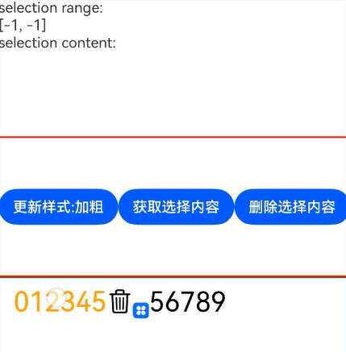

### 示例2（绑定自定义键盘）
通过[customKeyboard](#customkeyboard)给组件绑定自定义键盘。

```ts
// xxx.ets
@Entry
@Component
struct RichEditorExample {
  controller: RichEditorController = new RichEditorController();

  // 自定义键盘组件
  @Builder
  CustomKeyboardBuilder() {
    Column() {
      Grid() {
        ForEach(['1', '2', '3', '4', '5', '6', '7', '8', '9', '*', '0', '#'], (item: string) => {
          GridItem() {
            Button(item).width(110).onClick(() => {
              this.controller.addTextSpan(item + '', {
                offset: this.controller.getCaretOffset(),
                style:
                {
                  fontColor: Color.Orange,
                  fontSize: 30
                }
              });
            })
          }
        })
      }.maxCount(3).columnsGap(10).rowsGap(10).padding(5)
    }.backgroundColor(Color.Gray)
  }

  build() {
    Column() {
      RichEditor({ controller: this.controller }) // 绑定自定义键盘
        .customKeyboard(this.CustomKeyboardBuilder())
        .border({ width: 1 })
        .borderWidth(1)
        .borderColor(Color.Red)
        .margin(10)
        .height(200)
        .width("100%")
    }
  }
}
```

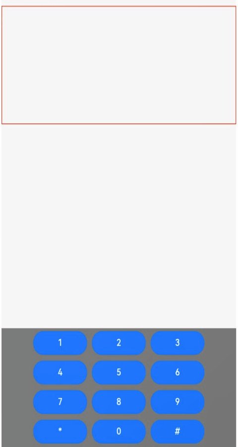

### 示例3（绑定自定义菜单）
通过[bindSelectionMenu](#bindselectionmenu)给组件绑定自定义菜单。

示例中的粘贴菜单项涉及读取剪贴板数据，因此需按规范[申请访问剪贴板权限](../../../basic-services/pasteboard/get-pastedata-permission-guidelines.md)。

```ts
// xxx.ets
import { BusinessError, pasteboard } from '@kit.BasicServicesKit';

export interface SelectionMenuTheme {
  imageSize: number;
  buttonSize: number;
  menuSpacing: number;
  editorOptionMargin: number;
  expandedOptionPadding: number;
  defaultMenuWidth: number;
  imageFillColor: Resource;
  backgroundColor: Resource;
  iconBorderRadius: Resource;
  containerBorderRadius: Resource;
  cutIcon: Resource;
  copyIcon: Resource;
  pasteIcon: Resource;
  selectAllIcon: Resource;
  shareIcon: Resource;
  translateIcon: Resource;
  searchIcon: Resource;
  arrowDownIcon: Resource;
  iconPanelShadowStyle: ShadowStyle;
  iconFocusBorderColor: Resource;
}

export const defaultTheme: SelectionMenuTheme = {
  imageSize: 24,
  buttonSize: 48,
  menuSpacing: 8,
  editorOptionMargin: 1,
  expandedOptionPadding: 3,
  defaultMenuWidth: 256,
  imageFillColor: $r('sys.color.ohos_id_color_primary'),
  backgroundColor: $r('sys.color.ohos_id_color_dialog_bg'),
  iconBorderRadius: $r('sys.float.ohos_id_corner_radius_default_m'),
  containerBorderRadius: $r('sys.float.ohos_id_corner_radius_card'),
  cutIcon: $r('sys.media.ohos_ic_public_cut'),
  copyIcon: $r('sys.media.ohos_ic_public_copy'),
  pasteIcon: $r('sys.media.ohos_ic_public_paste'),
  selectAllIcon: $r('sys.media.ohos_ic_public_select_all'),
  shareIcon: $r('sys.media.ohos_ic_public_share'),
  translateIcon: $r('sys.media.ohos_ic_public_translate_c2e'),
  searchIcon: $r('sys.media.ohos_ic_public_search_filled'),
  arrowDownIcon: $r('sys.media.ohos_ic_public_arrow_down'),
  iconPanelShadowStyle: ShadowStyle.OUTER_DEFAULT_MD,
  iconFocusBorderColor: $r('sys.color.ohos_id_color_focused_outline')
}

@Entry
@Component
struct SelectionMenu {
  @State message: string = 'Hello World';
  @State textStyleConfigtSize: number = 40;
  @State sliderShow: boolean = false;
  @State start: number = -1;
  @State end: number = -1;
  @State colorTransparent: Color = Color.Transparent;
  controller: RichEditorController = new RichEditorController();
  options: RichEditorOptions = { controller: this.controller };
  // $r('app.media.startIcon')需要替换为开发者所需的图像资源文件。
  private icons: Array<Resource> =
    [$r('app.media.startIcon'), $r('app.media.startIcon'), $r('app.media.startIcon'),
    $r('app.media.startIcon'), $r('app.media.startIcon')];
  @State iconBgColor: ResourceColor[] = new Array(this.icons.length).fill(this.colorTransparent);
  @State pasteEnable: boolean = false;
  @State visibilityValue: Visibility = Visibility.Visible;
  @State textStyle: RichEditorTextStyle = {};
  private fontWeightTable: string[] = ["100", "200", "300", "400", "500", "600", "700", "800", "900", "bold", "normal", "bolder", "lighter", "medium", "regular"];
  private theme: SelectionMenuTheme = defaultTheme;

  aboutToAppear() {
    if (this.controller) {
      let richEditorSelection = this.controller.getSelection();
      if (richEditorSelection) {
        let start = richEditorSelection.selection[0];
        let end = richEditorSelection.selection[1];
        if (start === 0 && this.controller.getSpans({ start: end + 1, end: end + 1 }).length === 0) {
          this.visibilityValue = Visibility.None;
        } else {
          this.visibilityValue = Visibility.Visible;
        }
      }
    }
    let sysBoard = pasteboard.getSystemPasteboard();
    try {
      if (sysBoard && sysBoard.hasDataSync()) {
        this.pasteEnable = true;
      } else {
        this.pasteEnable = false;
      }
    } catch (err) {
      console.error(`Failed to check the PasteData. Code: ${err.code}, message: ${err.message}`);
    }
  }

  build() {
    Column() {
      Column() {
        RichEditor(this.options)
          .onReady(() => {
            this.controller.addTextSpan(this.message, { style: { fontColor: Color.Orange, fontSize: 30 } })
          })
          .onSelect((value: RichEditorSelection) => {
            if (value.selection[0] == -1 && value.selection[1] == -1) {
              return;
            }
            this.start = value.selection[0];
            this.end = value.selection[1];
          })
          // 为TEXT类型Span绑定长按触发的自定义选择菜单
          .bindSelectionMenu(RichEditorSpanType.TEXT, this.panel, ResponseType.LongPress, { onDisappear: () => {
            this.sliderShow = false;
          }})
          .bindSelectionMenu(RichEditorSpanType.TEXT, this.panel, ResponseType.RightClick, { onDisappear: () => {
            this.sliderShow = false;
          }})
          .bindSelectionMenu(RichEditorSpanType.IMAGE, this.panel, ResponseType.LongPress, { 
            menuType : MenuType.PREVIEW_MENU,
            previewMenuOptions : {
              hapticFeedbackMode : HapticFeedbackMode.ENABLED
            }
          })
          .borderWidth(1)
          .borderColor(Color.Red)
          .width(200)
          .height(200)
      }.width('100%').backgroundColor(Color.White)
    }.height('100%')
  }

  // 将选中内容的文本和样式信息写入剪贴板，支持粘贴时还原样式
  pushDataToPasteboard(richEditorSelection: RichEditorSelection) {
    let sysBoard = pasteboard.getSystemPasteboard();
    let pasteData = pasteboard.createData(pasteboard.MIMETYPE_TEXT_PLAIN, '');
    if (richEditorSelection.spans && richEditorSelection.spans.length > 0) {
      let count = richEditorSelection.spans.length;
      for (let i = count - 1; i >= 0; i--) {
        let item = richEditorSelection.spans[i]
        if ((item as RichEditorTextSpanResult)?.textStyle) {
          let span = item as RichEditorTextSpanResult;
          let style = span.textStyle;
          let data = pasteboard.createRecord(pasteboard.MIMETYPE_TEXT_PLAIN, span.value.substring(span.offsetInSpan[0], span.offsetInSpan[1]));
          let prop = pasteData.getProperty();
          let fontStyleRecord: Record<string, Object> = {
            'color': style.fontColor,
            'size': style.fontSize,
            'style': style.fontStyle,
            'weight': this.fontWeightTable[style.fontWeight],
            'fontFamily': style.fontFamily,
            'decorationType': style.decoration.type,
            'decorationColor': style.decoration.color
          };
          prop.additions[i] = fontStyleRecord;
          pasteData.addRecord(data);
          pasteData.setProperty(prop);
        }
      }
    }
    sysBoard.clearData()
    sysBoard.setData(pasteData).then(() => {
      console.info('SelectionMenu copy option, Succeeded in setting PasteData.');
      this.pasteEnable = true;
    }).catch((err: BusinessError) => {
      console.error(`SelectionMenu copy option, Failed to set PasteData. Code: ${err.code}, message: ${err.message}`);
    })
  }

  // 从剪贴板读取内容和样式信息，还原样式后插入到组件中
  popDataFromPasteboard(richEditorSelection: RichEditorSelection) {
    let start = richEditorSelection.selection[0];
    let end = richEditorSelection.selection[1];
    if (start == end && this.controller) {
      start = this.controller.getCaretOffset();
      end = this.controller.getCaretOffset();
    }
    let moveOffset = 0;
    let sysBoard = pasteboard.getSystemPasteboard();
    sysBoard.getData((err, data) => {
      if (err) {
        return;
      }
      let count = data.getRecordCount();
      for (let i = 0; i < count; i++) {
        const element = data.getRecord(i);
        let textStyleConfig: RichEditorTextStyle = {
          fontSize: 16,
          fontColor: Color.Black,
          fontWeight: FontWeight.Normal,
          fontFamily: "HarmonyOS Sans",
          fontStyle: FontStyle.Normal,
          decoration: { type: TextDecorationType.None, color: "#FF000000", style: TextDecorationStyle.SOLID }
        }
        if (data.getProperty() && data.getProperty().additions[i]) {
          const styleAddition = data.getProperty().additions[i] as Record<string, Object | undefined>;
          if (styleAddition.color) {
            textStyleConfig.fontColor = styleAddition.color as ResourceColor;
          }
          if (styleAddition.size) {
            textStyleConfig.fontSize = styleAddition.size as Length | number;
          }
          if (styleAddition.style) {
            textStyleConfig.fontStyle = styleAddition.style as FontStyle;
          }
          if (styleAddition.weight) {
            textStyleConfig.fontWeight = styleAddition.weight as number | FontWeight | string;
          }
          if (styleAddition.fontFamily) {
            textStyleConfig.fontFamily = styleAddition.fontFamily as ResourceStr;
          }
          if (styleAddition.decorationType && textStyleConfig.decoration) {
            textStyleConfig.decoration.type = styleAddition.decorationType as TextDecorationType;
          }
          if (styleAddition.decorationColor && textStyleConfig.decoration) {
            textStyleConfig.decoration.color = styleAddition.decorationColor as ResourceColor;
          }
          if (textStyleConfig.decoration) {
            textStyleConfig.decoration = { type: textStyleConfig.decoration.type, color: textStyleConfig.decoration.color };
          }
        }
        if (element && element.plainText && element.mimeType === pasteboard.MIMETYPE_TEXT_PLAIN && this.controller) {
          this.controller.addTextSpan(element.plainText,
            {
              style: textStyleConfig,
              offset: start + moveOffset
            }
          );
          moveOffset += element.plainText.length;
        }
      }
      if (this.controller) {
        this.controller.setCaretOffset(start + moveOffset);
        this.controller.closeSelectionMenu();
      }
      if (start != end && this.controller) {
        this.controller.deleteSpans({ start: start + moveOffset, end: end + moveOffset });
      }
    })
  }

  @Builder
  panel() {
    Column() {
      this.iconPanel()
      if (!this.sliderShow) {
        this.SystemMenu()
      } else {
        this.sliderPanel()
      }
    }.width(256)
  }

  // 图标面板：5个图标分别对应加粗切换(0)、斜体切换(1)、下划线切换(2)、字号滑块(3)、颜色切换(4)
  @Builder iconPanel() {
    Column() {
      Row({ space: 2 }) {
        ForEach(this.icons, (item:Resource, index ?: number) => {
          Flex({ justifyContent: FlexAlign.Center, alignItems: ItemAlign.Center }) {
            Image(item).fillColor(this.theme.imageFillColor).width(24).height(24).focusable(true).draggable(false)
          }
          .borderRadius(this.theme.iconBorderRadius)
          .width(this.theme.buttonSize)
          .height(this.theme.buttonSize)
          .onClick(() => {
            if (index as number == 0) {
              this.sliderShow = false;
              if (this.controller) {
                let selection = this.controller.getSelection();
                let spans = selection.spans;
                spans.forEach((item: RichEditorTextSpanResult | RichEditorImageSpanResult, index) => {
                  if (typeof (item as RichEditorTextSpanResult)['textStyle'] != 'undefined') {
                    let span = item as RichEditorTextSpanResult;
                    this.textStyle = span.textStyle;
                    let start = span.offsetInSpan[0];
                    let end = span.offsetInSpan[1];
                    let offset = span.spanPosition.spanRange[0];
                    if (this.textStyle.fontWeight != 11) {
                      this.textStyle.fontWeight = FontWeight.Bolder;
                    } else {
                      this.textStyle.fontWeight = FontWeight.Normal;
                    }
                    this.controller.updateSpanStyle({
                      start: offset + start,
                      end: offset + end,
                      textStyle: this.textStyle
                    })
                  }
                })
              }
            } else if (index as number == 1) {
              this.sliderShow = false;
              if (this.controller) {
                let selection = this.controller.getSelection();
                let spans = selection.spans;
                spans.forEach((item: RichEditorTextSpanResult | RichEditorImageSpanResult, index) => {
                  if (typeof (item as RichEditorTextSpanResult)['textStyle'] != 'undefined') {
                    let span = item as RichEditorTextSpanResult;
                    this.textStyle = span.textStyle;
                    let start = span.offsetInSpan[0];
                    let end = span.offsetInSpan[1];
                    let offset = span.spanPosition.spanRange[0];
                    if (this.textStyle.fontStyle == FontStyle.Italic) {
                      this.textStyle.fontStyle = FontStyle.Normal;
                    } else {
                      this.textStyle.fontStyle = FontStyle.Italic;
                    }
                    this.controller.updateSpanStyle({
                      start: offset + start,
                      end: offset + end,
                      textStyle: this.textStyle
                    })
                  }
                })
              }
            } else if (index as number == 2) {
              this.sliderShow = false;
              if (this.controller) {
                let selection = this.controller.getSelection();
                let spans = selection.spans;
                spans.forEach((item: RichEditorTextSpanResult | RichEditorImageSpanResult, index) => {
                  if (typeof (item as RichEditorTextSpanResult)['textStyle'] != 'undefined') {
                    let span = item as RichEditorTextSpanResult;
                    this.textStyle = span.textStyle;
                    let start = span.offsetInSpan[0];
                    let end = span.offsetInSpan[1];
                    let offset = span.spanPosition.spanRange[0];
                    if (this.textStyle.decoration) {
                      if (this.textStyle.decoration.type == TextDecorationType.Underline) {
                        this.textStyle.decoration.type = TextDecorationType.None;
                      } else {
                        this.textStyle.decoration.type = TextDecorationType.Underline;
                      }
                    } else {
                      this.textStyle.decoration = { type: TextDecorationType.Underline, color: Color.Black, style: TextDecorationStyle.SOLID };
                    }
                    this.controller.updateSpanStyle({
                      start: offset + start,
                      end: offset + end,
                      textStyle: this.textStyle
                    })
                  }
                })
              }
            } else if (index as number == 3) {
              this.sliderShow = !this.sliderShow;
            } else if (index as number == 4) {
              this.sliderShow = false;
              if (this.controller) {
                let selection = this.controller.getSelection();
                let spans = selection.spans;
                spans.forEach((item: RichEditorTextSpanResult | RichEditorImageSpanResult, index) => {
                  if (typeof (item as RichEditorTextSpanResult)['textStyle'] != 'undefined') {
                    let span = item as RichEditorTextSpanResult;
                    this.textStyle = span.textStyle;
                    let start = span.offsetInSpan[0];
                    let end = span.offsetInSpan[1];
                    let offset = span.spanPosition.spanRange[0];
                    if (this.textStyle.fontColor == Color.Orange || this.textStyle.fontColor == '#FFFFA500') {
                      this.textStyle.fontColor = Color.Black;
                    } else {
                      this.textStyle.fontColor = Color.Orange;
                    }
                    this.controller.updateSpanStyle({
                      start: offset + start,
                      end: offset + end,
                      textStyle: this.textStyle
                    })
                  }
                })
              }
            }
          })
          .onTouch((event?: TouchEvent | undefined) => {
            if (event != undefined) {
              if (event.type === TouchType.Down) {
                this.iconBgColor[index as number] = $r('sys.color.ohos_id_color_click_effect');
              }
              if (event.type === TouchType.Up) {
                this.iconBgColor[index as number] = this.colorTransparent;
              }
            }
          })
          .onHover((isHover?: boolean, event?: HoverEvent) => {
            this.iconBgColor.forEach((icon:ResourceColor, index1) => {
              this.iconBgColor[index1] = this.colorTransparent;
            })
            if (isHover != undefined) {
              this.iconBgColor[index as number] = $r('sys.color.ohos_id_color_hover');
            }
          })
          .backgroundColor(this.iconBgColor[index as number])
        })
      }
    }
    .clip(true)
    .width(this.theme.defaultMenuWidth)
    .padding(this.theme.expandedOptionPadding)
    .borderRadius(this.theme.containerBorderRadius)
    .margin({ bottom: this.theme.menuSpacing })
    .backgroundColor(this.theme.backgroundColor)
    .shadow(this.theme.iconPanelShadowStyle)
  }

  @Builder
  SystemMenu() {
    Column() {
      Menu() {
        if (this.controller) {
          MenuItemGroup() {
            MenuItem({ startIcon: this.theme.cutIcon, content: "剪切", labelInfo: "Ctrl+X" })
              .onClick(() => {
                if (!this.controller) {
                  return;
                }
                let richEditorSelection = this.controller.getSelection();
                this.pushDataToPasteboard(richEditorSelection);
                this.controller.deleteSpans({
                  start: richEditorSelection.selection[0],
                  end: richEditorSelection.selection[1]
                })
              })
            MenuItem({ startIcon: this.theme.copyIcon, content: "复制", labelInfo: "Ctrl+C" })
              .onClick(() => {
                if (!this.controller) {
                  return;
                }
                let richEditorSelection = this.controller.getSelection();
                this.pushDataToPasteboard(richEditorSelection)
                this.controller.closeSelectionMenu()
              })
            MenuItem({ startIcon: this.theme.pasteIcon, content: "粘贴", labelInfo: "Ctrl+V" })
              .enabled(this.pasteEnable)
              .onClick(() => {
                if (!this.controller) {
                  return;
                }
                let richEditorSelection = this.controller.getSelection();
                this.popDataFromPasteboard(richEditorSelection)
              })
            MenuItem({ startIcon: this.theme.selectAllIcon, content: "全选", labelInfo: "Ctrl+A" })
              .visibility(this.visibilityValue)
              .onClick(() => {
                if (!this.controller) {
                  return;
                }
                this.controller.setSelection(-1, -1)
                this.visibilityValue = Visibility.None;
              })
            MenuItem({ startIcon: this.theme.shareIcon, content: "分享", labelInfo: "" })
              .enabled(false)
            MenuItem({ startIcon: this.theme.translateIcon, content: "翻译", labelInfo: "" })
              .enabled(false)
            MenuItem({ startIcon: this.theme.searchIcon, content: "搜索", labelInfo: "" })
              .enabled(false)
          }
        }
      }
      .onVisibleAreaChange([0.0, 1.0], () => {
        if (!this.controller) {
          return;
        }
        let richEditorSelection = this.controller.getSelection();
        let start = richEditorSelection.selection[0];
        let end = richEditorSelection.selection[1];
        if (start === 0 && this.controller.getSpans({ start: end + 1, end: end + 1 }).length === 0) {
          this.visibilityValue = Visibility.None;
        } else {
          this.visibilityValue = Visibility.Visible;
        }
      })
      .radius(this.theme.containerBorderRadius)
      .clip(true)
      .backgroundColor(Color.White)
      .width(this.theme.defaultMenuWidth)
    }
    .width(this.theme.defaultMenuWidth)
  }

  @Builder sliderPanel() {
    Column() {
      Flex({ justifyContent: FlexAlign.SpaceBetween, alignItems: ItemAlign.Center }) {
        Text('A').fontSize(15)
        Slider({ value: this.textStyleConfigtSize, step: 10, style: SliderStyle.InSet })
          .width(210)
          .onChange((value: number, mode: SliderChangeMode) => {
            if (this.controller) {
              let selection = this.controller.getSelection();
              if (mode == SliderChangeMode.End) {
                if (this.textStyleConfigtSize == undefined) {
                  this.textStyleConfigtSize = 0;
                }
                let spans = selection.spans;
                spans.forEach((item: RichEditorTextSpanResult | RichEditorImageSpanResult, index) => {
                  if (typeof (item as RichEditorTextSpanResult)['textStyle'] != 'undefined') {
                    this.textStyleConfigtSize = Math.max(this.textStyleConfigtSize, (item as RichEditorTextSpanResult).textStyle.fontSize);
                  }
                })
              }
              if (mode == SliderChangeMode.Moving || mode == SliderChangeMode.Click) {
                this.start = selection.selection[0];
                this.end = selection.selection[1];
                this.textStyleConfigtSize = value;
                this.controller.updateSpanStyle({
                  start: this.start,
                  end: this.end,
                  textStyle: { fontSize: this.textStyleConfigtSize }
                })
              }
            }
          })
        Text('A').fontSize(20).fontWeight(FontWeight.Medium)
      }.borderRadius(this.theme.containerBorderRadius)
    }
    .shadow(ShadowStyle.OUTER_DEFAULT_MD)
    .backgroundColor(Color.White)
    .borderRadius(this.theme.containerBorderRadius)
    .padding(15)
    .height(48)
  }
}
```
> **说明：**
>
> 系统暂未预置加粗、斜体等图标，示例代码使用系统默认图标，开发者使用时需自行替换icons中的资源。

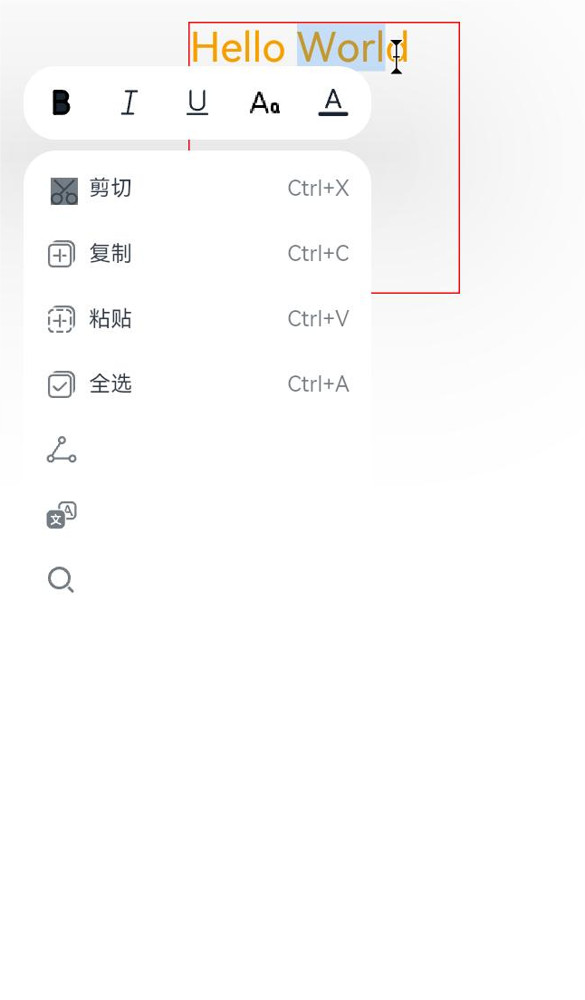

### 示例4（更新图片样式）
通过[updateSpanStyle](#updatespanstyle)接口更新图片样式。

```ts
// xxx.ets
@Entry
@Component
struct Index {
  controller: RichEditorController = new RichEditorController();
  options: RichEditorOptions = { controller: this.controller };
  private start: number = -1;
  private end: number = -1;
  @State message: string = "[-1, -1]";
  @State content: string = "";

  build() {
    Column() {
      Column() {
        Text("selection range:").width("100%")
        Text() {
          Span(this.message)
        }.width("100%")
        Text("selection content:").width("100%")
        Text() {
          Span(this.content)
        }.width("100%")
      }
      .borderWidth(1)
      .borderColor(Color.Red)
      .width("100%")
      .height("20%")

      Row() {
        Button("updateSpanStyle1")
          .fontSize(12)
          .onClick(() => {
            this.controller.updateSpanStyle({
              start: this.start,
              textStyle:
              {
                fontWeight: FontWeight.Bolder,
                fontSize:15
              },
              imageStyle: {
                size: ["80px", "80px"],
                layoutStyle: {
                  borderRadius: undefined,
                  margin: undefined
                }
              }
            });
          })

        Button("updateSpanStyle2")
          .fontSize(12)
          .onClick(() => {
            this.controller.updateSpanStyle({
              start: this.start,
              textStyle:
              {
                fontWeight: FontWeight.Bolder,
                fontSize:15
              },
              imageStyle: {
                size: ["70px", "70px"],
                layoutStyle: {
                  borderRadius: { topLeft: '100px', topRight: '20px', bottomLeft: '100px', bottomRight: '20px' },
                  margin: { left: '30px', top: '20px', right: '20px', bottom: '20px' }
                }
              }
            });
          })

        Button("updateSpanStyle3")
          .fontSize(12)
          .onClick(() => {
            this.controller.updateSpanStyle({
              start: this.start,
              textStyle:
              {
                fontWeight: FontWeight.Bolder,
                fontSize:15
              },
              imageStyle: {
                size: ["60px", "60px"],
                layoutStyle: {
                  borderRadius: '-10px',
                  margin: '-10px'
                }
              }
            });
          })
      }
      .borderWidth(1)
      .borderColor(Color.Red)
      .width("100%")
      .height("10%")

      Row() {
        Button('addImageSpan1')
          .fontSize(12)
          .onClick(() => {
            // $r('app.media.startIcon')需要替换为开发者所需的图像资源文件。
            this.controller.addImageSpan($r('app.media.startIcon'), {
              imageStyle: {
                size: ["80px", "80px"],
                layoutStyle: {
                  borderRadius: '50px',
                  margin: '40px'
                }
              }
            });
          })

        Button('addImageSpan2')
          .fontSize(12)
          .onClick(() => {
            // $r('app.media.startIcon')需要替换为开发者所需的图像资源文件。
            this.controller.addImageSpan($r('app.media.startIcon'), {
              imageStyle: {
                size: ["100px", "100px"],
                verticalAlign: ImageSpanAlignment.BOTTOM,
                layoutStyle: {
                  borderRadius: undefined,
                  margin: undefined
                }
              }
            });
          })

        Button('addImageSpan3')
          .fontSize(12)
          .onClick(() => {
            // $r('app.media.startIcon')需要替换为开发者所需的图像资源文件。
            this.controller.addImageSpan($r('app.media.startIcon'), {
              imageStyle: {
                size: ["60px", "60px"],
                verticalAlign: ImageSpanAlignment.BOTTOM,
                layoutStyle: {
                  borderRadius: { topLeft: '10px', topRight: '20px', bottomLeft: '30px', bottomRight: '40px' },
                  margin: { left: '10px', top: '20px', right: '30px', bottom: '40px' }
                }
              }
            })
          })
      }
      .borderWidth(1)
      .borderColor(Color.Red)
      .width("100%")
      .height("10%")

      Column() {
        RichEditor(this.options)
          .onReady(() => {
            this.controller.addTextSpan("0123456789",
              {
                style:
                {
                  fontColor: Color.Orange,
                  fontSize: 30
                }
              })

            // $r('app.media.startIcon')需要替换为开发者所需的图像资源文件。
            this.controller.addImageSpan($r('app.media.startIcon'),
              {
                imageStyle:
                {
                  size: ["60px", "60px"],
                  verticalAlign: ImageSpanAlignment.BOTTOM,
                  layoutStyle: {
                    borderRadius: { topLeft: '10px', topRight: '20px', bottomLeft: '30px', bottomRight: '40px' },
                    margin: { left: '10px', top: '20px', right: '30px', bottom: '40px' }
                  }
                }
              })

            this.controller.addTextSpan("0123456789",
              {
                style:
                {
                  fontColor: Color.Black,
                  fontSize: 30
                }
              })
          })
          .onSelect((value: RichEditorSelection) => {
            this.start = value.selection[0];
            this.end = value.selection[1];
            this.message = "[" + this.start + ", " + this.end + "]";
          })
          .aboutToIMEInput((value: RichEditorInsertValue) => {
            console.info("---------------------- aboutToIMEInput ----------------------");
            console.info("insertOffset:" + value.insertOffset);
            console.info("insertValue:" + value.insertValue);
            return true;
          })
          .onIMEInputComplete((value: RichEditorTextSpanResult) => {
            console.info("---------------------- onIMEInputComplete ---------------------");
            console.info("spanIndex:" + value.spanPosition.spanIndex);
            console.info("spanRange:[" + value.spanPosition.spanRange[0] + "," + value.spanPosition.spanRange[1] + "]");
            console.info("offsetInSpan:[" + value.offsetInSpan[0] + "," + value.offsetInSpan[1] + "]");
            console.info("value:" + value.value);
          })
          .aboutToDelete((value: RichEditorDeleteValue) => {
            console.info("---------------------- aboutToDelete --------------------------");
            console.info("offset:" + value.offset);
            console.info("direction:" + value.direction);
            console.info("length:" + value.length);
            value.richEditorDeleteSpans.forEach(item => {
              console.info("---------------------- item --------------------------");
              console.info("spanIndex:" + item.spanPosition.spanIndex);
              console.info("spanRange:[" + item.spanPosition.spanRange[0] + "," + item.spanPosition.spanRange[1] + "]");
              console.info("offsetInSpan:[" + item.offsetInSpan[0] + "," + item.offsetInSpan[1] + "]");
              if (typeof (item as RichEditorImageSpanResult)['imageStyle'] != 'undefined') {
                console.info("image:" + (item as RichEditorImageSpanResult).valueResourceStr);
              } else {
                console.info("text:" + (item as RichEditorTextSpanResult).value);
              }
            })
            return true;
          })
          .onDeleteComplete(() => {
            console.info("---------------------- onDeleteComplete ------------------------");
          })
          .borderWidth(1)
          .borderColor(Color.Green)
          .width("100%")
          .height('80.00%')
      }
      .borderWidth(1)
      .borderColor(Color.Red)
      .width("100%")
      .height("70%")
    }
  }
}
```
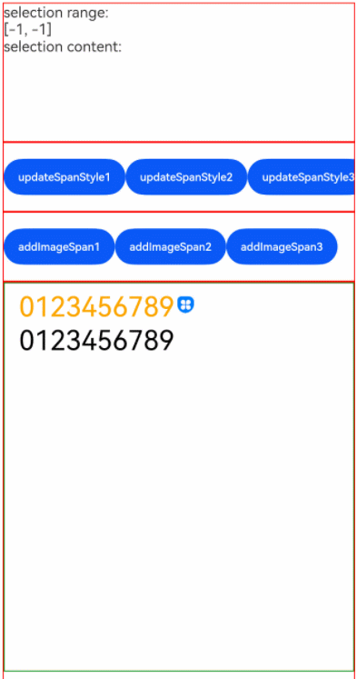

### 示例5（Span绑定手势事件）
为Span绑定[gesture](#richeditorgesture11)回调。

```ts
// xxx.ets
@Entry
@Component
struct Index {
  controller: RichEditorController = new RichEditorController();
  options: RichEditorOptions = { controller: this.controller };
  @State textFlag: string = "TextFlag";

  build() {
    Column() {
      Column() {
        Text(this.textFlag)
          .copyOption(CopyOptions.InApp)
          .fontSize(50)
          .height(150)
      }
      Divider()
      Column() {
        RichEditor(this.options)
          .onReady(() => {
            // 为文本Span绑定点击和长按手势回调
            this.controller.addTextSpan('Area1\n', {
              style:
              {
                fontColor: Color.Orange,
                fontSize: 50,
              },
              gesture:
              {
                // 点击时更新文本标识
                onClick: () => {
                  this.textFlag = "Area1 is onClick.";
                },
                // 长按时更新文本标识
                onLongPress: () => {
                  this.textFlag = "Area1 is onLongPress.";
                }
              }
            })

            this.controller.addTextSpan('Area2\n', {
              style:
              {
                fontColor: Color.Blue,
                fontSize: 50
              },
              gesture:
              {
                // 点击时更新文本标识
                onClick: () => {
                  this.textFlag = "Area2 is onClick.";
                },
                // 长按时更新文本标识
                onLongPress: () => {
                  this.textFlag = "Area2 is onLongPress.";
                }
              }
            })

            // $r('app.media.startIcon')需要替换为开发者所需的图像资源文件。
            this.controller.addImageSpan($r('app.media.startIcon'),
              {
                imageStyle:
                {
                  size: ["100px", "100px"],
                  layoutStyle: {
                    margin: 5,
                    borderRadius: 15
                  }
                },
                gesture:
                {
                  onClick: () => {
                    this.textFlag = "ImageSpan is onClick.";
                  },
                  onLongPress: () => {
                    this.textFlag = "ImageSpan is onLongPress.";
                  }
                },
                onHover : (status) => {
                  this.textFlag = "ImageSpan is onHover :" + status;
                }
              })
          })
      }
      .borderWidth(1)
      .borderColor(Color.Red)
      .width("100%")
      .height("70%")
    }
  }
}
```
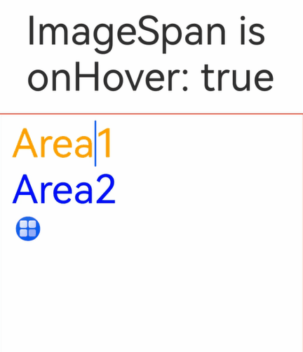

### 示例6（更新和获取段落样式）
通过[updateParagraphStyle](#updateparagraphstyle11)接口更新段落样式，通过[getParagraphs](#getparagraphs11)接口获取指定范围段落的信息。

```ts
// xxx.ets
@Entry
@Component
struct Index {
  controller: RichEditorController = new RichEditorController();
  private spanParagraphs: RichEditorParagraphResult[] = [];

  build() {
    Column() {
      RichEditor({ controller: this.controller })
        .onReady(() => {
          this.controller.addTextSpan("0123456789\n", {
            style: {
              fontColor: Color.Pink,
              fontSize: "32"
            },
            paragraphStyle: {
              textAlign: TextAlign.Start,
              textVerticalAlign: TextVerticalAlign.BASELINE,
              leadingMargin: 16
            }
          });
          this.controller.addTextSpan("0123456789");
        })
        .width("80%")
        .height("30%")
        .border({ width: 1, radius: 5 })
        .draggable(false)

      Column({ space: 5 }) {
        Button("段落左对齐").onClick(() => {
          // 设置段落文本左对齐
          this.controller.updateParagraphStyle({ start: -1, end: -1,
            style: {
              textAlign: TextAlign.Start
            }
          });
        })

        Button("段落右对齐").onClick(() => {
          this.controller.updateParagraphStyle({ start: -1, end: -1,
            style: {
              textAlign: TextAlign.End
            }
          });
        })

        Button("段落居中").onClick(() => {
          this.controller.updateParagraphStyle({ start: -1, end: -1,
            style: {
              textAlign: TextAlign.Center
            }
          });
        })

        Button("段落间距设置50").onClick(() => {
          this.controller.updateParagraphStyle({ start: -1, end: -1,
            style: {
              paragraphSpacing: 50
            }
          });
        })
        Divider()
        Button("getParagraphs").onClick(() => {
          this.spanParagraphs = this.controller.getParagraphs({ start: -1, end: -1 });
          console.info("RichEditor getParagraphs:" + JSON.stringify(this.spanParagraphs));
        })

        Button("UpdateSpanStyle1").onClick(() => {
          this.controller.updateSpanStyle({ start: -1, end: -1,
            textStyle: {
              fontColor: Color.Brown,
              fontSize: 20
            }
          });
        })

        Button("UpdateSpanStyle2").onClick(() => {
          this.controller.updateSpanStyle({ start: -1, end: -1,
            textStyle: {
              fontColor: Color.Green,
              fontSize: 30
            }
          });
        })
      }
    }
  }
}
```
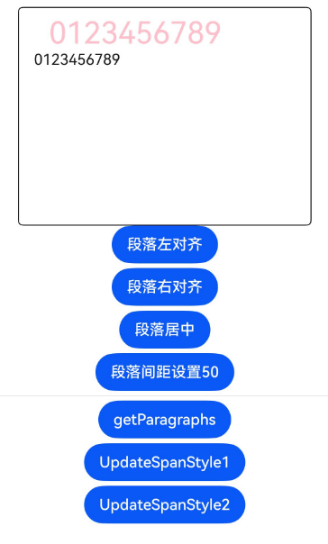

### 示例7（更新预设样式与缩进）
通过[setTypingStyle](#settypingstyle11)接口更新文本预设样式，通过[updateParagraphStyle](#updateparagraphstyle11)接口设置段落缩进。

```ts
// xxx.ets

const CANVAS_WIDTH = 1000;
const CANVAS_HEIGHT = 100;
const INDENTATION = 40;
class LeadingMarginCreator {
  private settings: RenderingContextSettings = new RenderingContextSettings(true);
  private offscreenCanvas: OffscreenCanvas = new OffscreenCanvas(CANVAS_WIDTH, CANVAS_HEIGHT);
  private offscreenContext: OffscreenCanvasRenderingContext2D = this.offscreenCanvas.getContext("2d", this.settings);
  public static instance: LeadingMarginCreator = new LeadingMarginCreator();

  // 获得字体字号级别，分别是从0到4级
  public getFontSizeLevel(fontSize: number) {
    const fontScaled: number = Number(fontSize) / 16;

    enum FontSizeScaleThreshold {
      SMALL = 0.9,
      NORMAL = 1.1,
      LEVEL_1_LARGE = 1.2,
      LEVEL_2_LARGE = 1.4,
      LEVEL_3_LARGE = 1.5
    }

    let fontSizeLevel: number = 1;

    if (fontScaled < FontSizeScaleThreshold.SMALL) {
      fontSizeLevel = 0;
    } else if (fontScaled < FontSizeScaleThreshold.NORMAL) {
      fontSizeLevel = 1;
    } else if (fontScaled < FontSizeScaleThreshold.LEVEL_1_LARGE) {
      fontSizeLevel = 2;
    } else if (fontScaled < FontSizeScaleThreshold.LEVEL_2_LARGE) {
      fontSizeLevel = 3;
    } else if (fontScaled < FontSizeScaleThreshold.LEVEL_3_LARGE) {
      fontSizeLevel = 4;
    } else {
      fontSizeLevel = 1;
    }

    return fontSizeLevel;
  }

  // 获得外边距比例级别
  public getMarginLevel(Width: number) {
    let marginLevel: number = 1;
    if (Width == 40) {
      marginLevel = 2.0;
    } else if (Width == 80) {
      marginLevel = 1.0;
    } else if (Width == 120) {
      marginLevel = 2 / 3;
    } else if (Width == 160) {
      marginLevel = 0.5;
    } else if (Width == 200) {
      marginLevel = 0.4;
    }
    return marginLevel;
  }

  public genStrMark(fontSize: number, str: string): PixelMap {
    this.offscreenContext = this.offscreenCanvas.getContext("2d", this.settings);
    this.clearCanvas();
    this.offscreenContext.font = fontSize + 'vp sans-serif';
    this.offscreenContext.fillText(str + '.', 0, fontSize * 0.9);
    return this.offscreenContext.getPixelMap(0, 0, fontSize * (str.length + 1) / 1.75, fontSize);
  }

  public genSquareMark(fontSize: number): PixelMap {
    this.offscreenContext = this.offscreenCanvas.getContext("2d", this.settings);
    this.clearCanvas();
    const coordinate = fontSize * (1 - 1 / 1.5) / 2;
    const sideLength = fontSize / 1.5;
    this.offscreenContext.fillRect(coordinate, coordinate, sideLength, sideLength);
    return this.offscreenContext.getPixelMap(0, 0, fontSize, fontSize);
  }

  // 生成圆圈符号
  public genCircleMark(fontSize: number, width: number, level?: number ): PixelMap {
    const indentLevel = level ?? 1;
    const offsetLevel = [22, 28, 32, 34, 38];
    const fontSizeLevel = this.getFontSizeLevel(fontSize);
    const marginLevel = this.getMarginLevel(width);
    const newCanvas = new OffscreenCanvas(CANVAS_WIDTH, CANVAS_HEIGHT);
    const newOffContext: OffscreenCanvasRenderingContext2D = newCanvas.getContext("2d", this.settings);
    const centerCoordinate = 50;
    const radius = 10;
    this.clearCanvas();
    newOffContext.ellipse(100 * (indentLevel + 1) - centerCoordinate * marginLevel, offsetLevel[fontSizeLevel], radius * marginLevel, radius, 0, 0, 2 * Math.PI);
    newOffContext.fillStyle = '66FF0000';
    newOffContext.fill();
    return newOffContext.getPixelMap(0, 0, 100 + 100 * indentLevel, 100);
  }

  private clearCanvas() {
    this.offscreenContext.clearRect(0, 0, CANVAS_WIDTH, CANVAS_HEIGHT);
  }
}

@Entry
@Component
struct Index {
  controller: RichEditorController = new RichEditorController();
  options: RichEditorOptions = { controller: this.controller };
  private leadingMarkCreatorInstance = LeadingMarginCreator.instance;
  private fontNameRawFile: string = 'MiSans-Bold';
  @State fontSize: number = 30;

  private leftMargin: Dimension = 0;
  private richEditorTextStyle: RichEditorTextStyle = {};

  aboutToAppear() {
    this.getUIContext().getFont().registerFont({
      familyName: 'MiSans-Bold',
      familySrc: '/font/MiSans-Bold.ttf'
    });
  }

  build() {
    Scroll() {
      Column() {
        RichEditor(this.options)
          .onReady(() => {
            this.controller.addTextSpan("0123456789\n",
              {
                style:
                {
                  fontWeight: 'medium',
                  fontFamily: this.fontNameRawFile,
                  fontColor: Color.Red,
                  fontSize: 50,
                  fontStyle: FontStyle.Italic,
                  decoration: { type: TextDecorationType.Underline, color: Color.Green }
                }
              });

            this.controller.addTextSpan("abcdefg",
              {
                style:
                {
                  fontWeight: FontWeight.Lighter,
                  fontFamily: 'HarmonyOS Sans',
                  fontColor: 'rgba(0,128,0,0.5)',
                  fontSize: 30,
                  fontStyle: FontStyle.Normal,
                  decoration: { type: TextDecorationType.Overline, color: 'rgba(169, 26, 246, 0.50)' }
                }
              });
          })
          .borderWidth(1)
          .borderColor(Color.Green)
          .width("100%")
          .height("50%")

        Row({ space: 5 }) {
          Button('setTypingStyle1')
            .fontSize(10)
            .onClick(() => {
              this.controller.setTypingStyle(
                {
                  fontWeight: 'medium',
                  fontFamily: this.fontNameRawFile,
                  fontColor: Color.Blue,
                  fontSize: 50,
                  fontStyle: FontStyle.Italic,
                  decoration: { type: TextDecorationType.Underline, color: Color.Green }
                });
            })

          Button('setTypingStyle2')
            .fontSize(10)
            .onClick(() => {
              this.controller.setTypingStyle(
                {
                  fontWeight: FontWeight.Lighter,
                  fontFamily: 'HarmonyOS Sans',
                  fontColor: Color.Green,
                  fontSize: '30',
                  fontStyle: FontStyle.Normal,
                  decoration: { type: TextDecorationType.Overline, color: 'rgba(169, 26, 246, 0.50)' }
                });
            })
        }
        Divider()
        Button("getTypingStyle").onClick(() => {
          this.richEditorTextStyle = this.controller.getTypingStyle();
          console.info("RichEditor getTypingStyle:" + JSON.stringify(this.richEditorTextStyle));
        })
        Divider()
        Row({ space: 5 }) {
          Button("向右列表缩进").onClick(() => {
            let margin = Number(this.leftMargin);
            if (margin < 200) {
              margin += INDENTATION;
              this.leftMargin = margin;
            }
            this.controller.updateParagraphStyle({
              start: -10,
              end: -10,
              style: {
                leadingMargin : {
                  pixelMap : this.leadingMarkCreatorInstance.genCircleMark(100, margin, 1),
                  size: [margin, 40]
                }
              }
            });
          })

          Button("向左列表缩进").onClick(() => {
            let margin = Number(this.leftMargin);
            if (margin > 0) {
              margin -= INDENTATION;
              this.leftMargin = margin;
            }
            this.controller.updateParagraphStyle({
              start: -10,
              end: -10,
              style: {
                leadingMargin : {
                  pixelMap : this.leadingMarkCreatorInstance.genCircleMark(100, margin, 1),
                  size: [margin, 40]
                }
              }
            });
          })
        }
        Divider()
        Row({ space: 5 }) {
          Button("向右空白缩进").onClick(() => {
            let margin = Number(this.leftMargin);
            if (margin < 200) {
              margin += INDENTATION;
              this.leftMargin = margin;
            }
            this.controller.updateParagraphStyle({
              start: -10,
              end: -10,
              style: {
                leadingMargin: margin
              }
            });
          })

          Button("向左空白缩进").onClick(() => {
            let margin = Number(this.leftMargin);
            if (margin > 0) {
              margin -= INDENTATION;
              this.leftMargin = margin;
            }
            this.controller.updateParagraphStyle({
              start: -10,
              end: -10,
              style: {
                leadingMargin: margin
              }
            });
          })
        }
      }.borderWidth(1).borderColor(Color.Red)
    }
  }
}
```
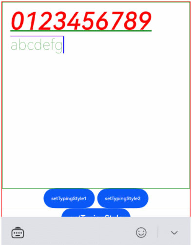

### 示例8（设置文本字重与阴影）
通过[updateSpanStyle](#updatespanstyle)接口设置文本字重与阴影。

``` ts
@Entry
@Component
struct Index {
  controller: RichEditorController = new RichEditorController();
  options: RichEditorOptions = { controller: this.controller };
  private start: number = -1;
  private end: number = -1;
  @State message: string = "[-1, -1]"
  @State content: string = ""
  @State textShadows : Array<ShadowOptions> = [
    { radius: 10, color: Color.Red, offsetX: 10, offsetY: 0 },
    { radius: 10, color: Color.Black, offsetX: 20, offsetY: 0 },
    { radius: 10, color: Color.Brown, offsetX: 30, offsetY: 0 },
    { radius: 10, color: Color.Green, offsetX: 40, offsetY: 0 },
    { radius: 10, color: Color.Yellow, offsetX: 100, offsetY: 0 }
  ];

  build() {
    Column() {
      Column() {
        Text("selection range:").width("100%")
        Text() {
          Span(this.message)
        }.width("100%")
        Text("selection content:").width("100%")
        Text() {
          Span(this.content)
        }.width("100%")
      }
      .borderWidth(1)
      .borderColor(Color.Red)
      .width("100%")
      .height("20%")
      Row() {
        Button("更新样式: 加粗 & 文本阴影").onClick(() => {
          this.controller.updateSpanStyle({
            start: this.start,
            end: this.end,
            textStyle:
            {
              fontWeight: FontWeight.Bolder,
              textShadow: this.textShadows
            }
          });
        })
      }
      .borderWidth(1)
      .borderColor(Color.Red)
      .width("100%")
      .height("10%")
      Column() {
        RichEditor(this.options)
          .onReady(() => {
            this.controller.addTextSpan("0123456789",
              {
                style:
                {
                  fontColor: Color.Orange,
                  fontSize: 30,
                  textShadow: { radius: 10, color: Color.Blue, offsetX: 10, offsetY: 0 }
                }
              });
          })
          .borderWidth(1)
          .borderColor(Color.Green)
          .width("100%")
          .height("30%")
      }
      .borderWidth(1)
      .borderColor(Color.Red)
      .width("100%")
      .height("70%")
    }
  }
}
```

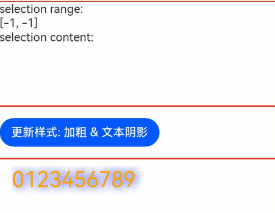

### 示例9（添加用户自定义布局Span）
通过[addBuilderSpan](#addbuilderspan11)接口添加用户自定义布局Span。

``` ts
@Builder
function placeholderBuilder2() {
  Row({ space: 2 }) {
    // $r('app.media.startIcon')需要替换为开发者所需的图像资源文件。
    Image($r('app.media.startIcon')).width(24).height(24).margin({ left: -5 })
    Text('okokokok').fontSize(10)
  }.width('20%').height(50).padding(10).backgroundColor(Color.Red)
}

// xxx.ets
@Entry
@Component
struct Index {
  controller: RichEditorController = new RichEditorController();
  option: RichEditorOptions = { controller: this.controller };
  private start: number = 2;
  private end: number = 4;
  @State message: string = "[-1, -1]";
  @State content: string = "";
  private myOffset: number | undefined = undefined;
  private myBuilder: CustomBuilder = undefined;
  @BuilderParam myBuilder2:() => void = placeholderBuilder2;

  @Builder
  placeholderBuilder() {
    Row({ space: 2 }) {
      // $r('app.media.startIcon')需要替换为开发者所需的图像资源文件。
      Image($r('app.media.startIcon')).width(24).height(24).margin({ left: -5 })
      Text('Custom Popup').fontSize(10)
    }.width(100).height(50).padding(5)
  }

  @Builder
  placeholderBuilder3() {
    Text("hello").padding('20').borderWidth(1).width('100%')
  }

  @Builder
  placeholderBuilder4() {
    Column() {
      Column({ space: 5 }) {
        Text('direction:Row').fontSize(9).fontColor(0xCCCCCC).width('90%')
        Flex({ direction: FlexDirection.Row }) { // 子组件在容器主轴上行布局
          Text('1').width('20%').height(50).backgroundColor(0xF5DEB3)
          Text('1').width('20%').height(50).backgroundColor(0xD2B48C)
          Text('1').width('20%').height(50).backgroundColor(0xF5DEB3)
          Text('1').width('20%').height(50).backgroundColor(0xD2B48C)
        }
        .height(70)
        .width('90%')
        .padding(10)
        .backgroundColor(0xAFEEEE)

        Text('direction:RowReverse').fontSize(9).fontColor(0xCCCCCC).width('90%')
        Flex({ direction: FlexDirection.RowReverse }) { // 子组件在容器主轴上反向行布局
          Text('1').width('20%').height(50).backgroundColor(0xF5DEB3)
          Text('1').width('20%').height(50).backgroundColor(0xD2B48C)
          Text('1').width('20%').height(50).backgroundColor(0xF5DEB3)
          Text('1').width('20%').height(50).backgroundColor(0xD2B48C)
        }
        .height(70)
        .width('90%')
        .padding(10)
        .backgroundColor(0xAFEEEE)

        Text('direction:Column').fontSize(9).fontColor(0xCCCCCC).width('90%')
        Flex({ direction: FlexDirection.Column }) { // 子组件在容器主轴上列布局
          Text('1').width('20%').height(40).backgroundColor(0xF5DEB3)
          Text('1').width('20%').height(40).backgroundColor(0xD2B48C)
          Text('1').width('20%').height(40).backgroundColor(0xF5DEB3)
          Text('1').width('20%').height(40).backgroundColor(0xD2B48C)
        }
        .height(160)
        .width('90%')
        .padding(10)
        .backgroundColor(0xAFEEEE)

        Text('direction:ColumnReverse').fontSize(9).fontColor(0xCCCCCC).width('90%')
        Flex({ direction: FlexDirection.ColumnReverse }) { // 子组件在容器主轴上反向列布局
          Text('1').width('20%').height(40).backgroundColor(0xF5DEB3)
          Text('1').width('20%').height(40).backgroundColor(0xD2B48C)
          Text('1').width('20%').height(40).backgroundColor(0xF5DEB3)
          Text('1').width('20%').height(40).backgroundColor(0xD2B48C)
        }
        .height(160)
        .width('90%')
        .padding(10)
        .backgroundColor(0xAFEEEE)
      }.width('100%').margin({ top: 5 })
    }.width('100%')
  }
  build() {
    Column() {
      Column() {
        Text("selection range:").width("100%")
        Text() {
          Span(this.message)
        }.width("100%")

        Text("selection content:").width("100%")
        Text() {
          Span(this.content)
        }.width("100%")
      }
      .borderWidth(1)
      .borderColor(Color.Red)
      .width("100%")
      .height("20%")

      Row() {
        Button("获取选择内容 getSpans").onClick(() => {
          console.info('getSpans='+JSON.stringify(this.controller.getSpans({ start:1, end:5 })));
          console.info('getParagraphs='+JSON.stringify(this.controller.getParagraphs({ start:1, end:5 })));
          this.content = "";
          this.controller.getSpans({
            start: this.start,
            end: this.end
          }).forEach(item => {
            if (typeof (item as RichEditorImageSpanResult)['imageStyle'] != 'undefined') {
              if ((item as RichEditorImageSpanResult).valueResourceStr == "") {
                console.info("builder span index " + (item as RichEditorImageSpanResult).spanPosition.spanIndex + ", range : " + (item as RichEditorImageSpanResult).offsetInSpan[0] + ", " +
                  (item as RichEditorImageSpanResult).offsetInSpan[1] + ", size : " + (item as RichEditorImageSpanResult).imageStyle[0] + ", " + (item as RichEditorImageSpanResult).imageStyle[1]);
              } else {
                console.info("image span " + (item as RichEditorImageSpanResult).valueResourceStr + ", index : " + (item as RichEditorImageSpanResult).spanPosition.spanIndex + ", range: " +
                  (item as RichEditorImageSpanResult).offsetInSpan[0] + ", " + (item as RichEditorImageSpanResult).offsetInSpan[1] + ", size : " +
                  (item as RichEditorImageSpanResult).imageStyle.size[0] + ", " + (item as RichEditorImageSpanResult).imageStyle.size[1]);
              }
            } else {
              this.content += (item as RichEditorTextSpanResult).value;
              this.content += "\n";
              console.info("text span: " + (item as RichEditorTextSpanResult).value);
            }
          })
        })
        Button("获取选择内容 getSelection").onClick(() => {
          this.content = "";
          let select = this.controller.getSelection();
          console.info("selection start " + select.selection[0] + " end " + select.selection[1]);
          select.spans.forEach(item => {
            if (typeof (item as RichEditorImageSpanResult)['imageStyle'] != 'undefined') {
              if ((item as RichEditorImageSpanResult).valueResourceStr == "") {
                console.info("builder span index " + (item as RichEditorImageSpanResult).spanPosition.spanIndex + ", range : " + (item as RichEditorImageSpanResult).offsetInSpan[0] + ", " +
                  (item as RichEditorImageSpanResult).offsetInSpan[1] + ", size : " + (item as RichEditorImageSpanResult).imageStyle[0] + ", " + (item as RichEditorImageSpanResult).imageStyle[1]);
              } else {
                console.info("image span " + (item as RichEditorImageSpanResult).valueResourceStr + ", index : " + (item as RichEditorImageSpanResult).spanPosition.spanIndex + ", range: " +
                  (item as RichEditorImageSpanResult).offsetInSpan[0] + ", " + (item as RichEditorImageSpanResult).offsetInSpan[1] + ", size : " +
                  (item as RichEditorImageSpanResult).imageStyle.size[0] + ", " + (item as RichEditorImageSpanResult).imageStyle.size[1]);
              }
            } else {
              this.content += (item as RichEditorTextSpanResult).value;
              this.content += "\n";
              console.info("text span: " + (item as RichEditorTextSpanResult).value);
            }
          })
        })
        Button("删除选择内容").onClick(() => {
          this.controller.deleteSpans({
            start: this.start,
            end: this.end
          });
        })
      }
      .borderWidth(1)
      .borderColor(Color.Red)
      .width("100%")
      .height("10%")

      Column() {
        RichEditor(this.option)
          .onReady(() => {
            this.controller.addTextSpan("0123456789",
              {
                style:
                {
                  fontColor: Color.Orange,
                  fontSize: 30
                }
              });
            // $r('app.media.startIcon')需要替换为开发者所需的图像资源文件。
            this.controller.addImageSpan($r('app.media.startIcon'),
              {
                imageStyle:
                {
                  size: ["57px", "57px"]
                }
              });
          })
          .onSelect((value: RichEditorSelection) => {
            this.start = value.selection[0];
            this.end = value.selection[1];
            this.message = "[" + this.start + ", " + this.end + "]";
            console.info("onSelect="+JSON.stringify(value));
          })
          .aboutToIMEInput((value: RichEditorInsertValue) => {
            console.info("---------------------- aboutToIMEInput --------------------");
            console.info("aboutToIMEInput="+JSON.stringify(value));
            console.info("insertOffset:" + value.insertOffset);
            console.info("insertValue:" + value.insertValue);
            return true;
          })
          .onIMEInputComplete((value: RichEditorTextSpanResult) => {
            console.info("---------------------- onIMEInputComplete --------------------");
            console.info("onIMEInputComplete="+JSON.stringify(value));
            console.info("spanIndex:" + value.spanPosition.spanIndex);
            console.info("spanRange:[" + value.spanPosition.spanRange[0] + "," + value.spanPosition.spanRange[1] + "]");
            console.info("offsetInSpan:[" + value.offsetInSpan[0] + "," + value.offsetInSpan[1] + "]");
            console.info("value:" + value.value);
          })
          .aboutToDelete((value: RichEditorDeleteValue) => {
            value.richEditorDeleteSpans.forEach(item => {
              console.info("---------------------- item --------------------");
              console.info("spanIndex=" + item.spanPosition.spanIndex);
              console.info("spanRange:[" + item.spanPosition.spanRange[0] + "," + item.spanPosition.spanRange[1] + "]");
              console.info("offsetInSpan:[" + item.offsetInSpan[0] + "," + item.offsetInSpan[1] + "]");
              if (typeof (item as RichEditorImageSpanResult)['imageStyle'] != 'undefined') {
                if ((item as RichEditorImageSpanResult).valueResourceStr == "") {
                  console.info("builder span index " + (item as RichEditorImageSpanResult).spanPosition.spanIndex + ", range : " + (item as RichEditorImageSpanResult).offsetInSpan[0] + ", " +
                  (item as RichEditorImageSpanResult).offsetInSpan[1] + ", size : " + (item as RichEditorImageSpanResult).imageStyle[0] + ", " + (item as RichEditorImageSpanResult).imageStyle[1]);
                } else {
                  console.info("image span " + (item as RichEditorImageSpanResult).valueResourceStr + ", index : " + (item as RichEditorImageSpanResult).spanPosition.spanIndex + ", range: " +
                  (item as RichEditorImageSpanResult).offsetInSpan[0] + ", " + (item as RichEditorImageSpanResult).offsetInSpan[1] + ", size : " +
                  (item as RichEditorImageSpanResult).imageStyle.size[0] + ", " + (item as RichEditorImageSpanResult).imageStyle.size[1]);
                }
              } else {
                console.info("delete text: " + (item as RichEditorTextSpanResult).value);
              }
            })
            return true;
          })
          .borderWidth(1)
          .borderColor(Color.Green)
          .width("100%")
          .height("30%")

        Button("add span")
          .onClick(() => {
            let num = this.controller.addBuilderSpan(this.myBuilder,
              { 
                offset: this.myOffset,
                accessibilitySpanOptions: { accessibilityText:"hello", accessibilityDescription:"world", accessibilityLevel:"yes" } 
              });
            console.info('addBuilderSpan return ' + num);
          })
        Button("add image")
          .onClick(() => {
            // $r('app.media.startIcon')需要替换为开发者所需的图像资源文件。
            let num = this.controller.addImageSpan($r('app.media.startIcon'), {
              imageStyle: {
                size: ["50px", "50px"],
                verticalAlign: ImageSpanAlignment.BOTTOM,
                layoutStyle: {
                  borderRadius: undefined,
                  margin: undefined
                }
              }
            })
            console.info('addImageSpan return' + num);
          })
        Row() {
          Button('builder1').onClick(() => {
            this.myBuilder = () => {
              this.placeholderBuilder()
            };
          })
          Button('builder2').onClick(() => {
            this.myBuilder = () => {
              this.myBuilder2()
            };
          })
          Button('builder3').onClick(() => {
            this.myBuilder = () => {
              this.placeholderBuilder3()
            };
          })
          Button('builder4').onClick(() => {
            this.myBuilder = () => {
              this.placeholderBuilder4()
            };
          })
        }
      }
      .borderWidth(1)
      .borderColor(Color.Red)
      .width("100%")
      .height("70%")
    }
  }
}
```
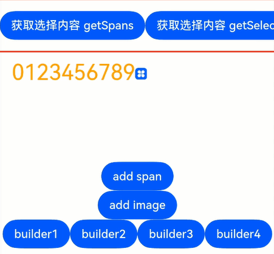

### 示例10（使用和管理组件内的BuilderSpan）
通过[addBuilderSpan](#addbuilderspan11)接口添加的自定义布局Span，[getSpans](#getspans)、[onWillChange](#onwillchange12)等API不会返回BuilderSpan内部的信息。开发者需要自行维护BuilderSpan的状态，并且在组件内容发生变化时同步更新。

```ts
const TAG = 'BuilderSpanDemo';

class BuilderObject {
  content: string
  imageUri?: string
  type: string
  id?: string

  constructor(content: string, type: string, imageUri?: string, id?: string) {
    this.content = content;
    this.imageUri = imageUri;
    this.type = type;
    this.id = id;
  }
}

@Entry
@Component
struct Index {
  controller: RichEditorController = new RichEditorController();
  option: RichEditorOptions = { controller: this.controller }
  @State content: string = "";
  @State start: number = 0;
  @State end: number = 0;
  private customBuilder: CustomBuilder = undefined;
  private builderArray: BuilderObject[] = [];
  private indicesToRemove: number[] = [];
  private builderId: number = 0;

  @Builder
  imageTextBuilder(builder: BuilderObject) {
    Row({ space: 2 }) {
      Image($r(builder.imageUri)).width(24).height(24).margin({ left: -5 })
      Text(builder.content).fontSize(10)
    }.width(110).height(50).padding(5)
  }

  @Builder
  chipBuilder(builder: BuilderObject) {
    Row() {
      Text(builder.content)
        .fontSize(14)
        .fontColor(Color.Black)
        .fontFamily('HarmonyHeiTi')
        .margin({ right: 4 })

      SymbolGlyph($r('sys.symbol.xmark'))
        .width(16)
        .height(16)
        .id(builder.id)
        .onClick((event: ClickEvent) => {
          this.deleteChipBuilder(event.target.id);
        })
    }
    .width('auto')
    .height(28)
    .backgroundColor(Color.Gray)
    .borderRadius(10)
    .padding({
      top: 4,
      bottom: 4,
      left: 12,
      right: 12
    })
  }

  private deleteChipBuilder(builderId?: string) {
    if (builderId == null || builderId == "") {
      console.info(TAG, "delete chipBuilder error");
      return
    }
    let deleteRange: number[] = this.getTargetBuilderSpanRange(builderId);
    if (deleteRange.length == 0) {
      console.error(TAG, "getTargetBuilderSpanRange failed" + builderId);
      return
    }
    this.builderArray = this.builderArray.filter(item => item.id !== builderId);
    this.controller.deleteSpans({ start: deleteRange[0], end: deleteRange[1] });
    console.info(TAG, `deleteChipBuilder start = ${deleteRange[0]}, end = ${deleteRange[1]}`);
    console.info(TAG, `deleteChipBuilder builderArray + ${this.builderArray.length}`);
  }

  private getTargetBuilderSpanRange(builderId: string): number[] {
    let allSpans = this.controller.getSpans();
    let result: number[] = [];
    let chipBuilderIndex = 0;
    for (let spanIndex = 0; spanIndex < allSpans.length; spanIndex++) {
      if (!this.isBuilderSpanResult(allSpans[spanIndex])) {
        continue;
      }
      if (this.builderArray.length <= chipBuilderIndex) {
        break;
      }
      if (this.builderArray[chipBuilderIndex].id === builderId) {
        result = allSpans[spanIndex].spanPosition.spanRange;
        break;
      }
      chipBuilderIndex++;
    }
    return result;
  }

  private isTextSpanResult(item: RichEditorImageSpanResult | RichEditorTextSpanResult): boolean {
    return typeof (item as RichEditorImageSpanResult)['imageStyle'] == 'undefined';
  }

  private isBuilderSpanResult(item: RichEditorImageSpanResult | RichEditorTextSpanResult): boolean {
    return typeof (item as RichEditorImageSpanResult)['imageStyle'] != 'undefined'
      && ((item as RichEditorImageSpanResult).valueResourceStr == " "
      || (item as RichEditorImageSpanResult).valueResourceStr == "");
  }

  build() {
    Column() {
      Scroll() {
        Column() {
          Text("Builder Info:").width("100%")
          Text() {
            Span(this.content)
          }.width("100%")
        }
      }
      .borderWidth(1)
      .borderColor(Color.Red)
      .width("100%")
      .height("20%")

      // 添加Builder时，记录builder的相对顺序，以及builder信息
      // getSpans接口valueResourceStr == " "或""的Span是builderSpan，并且会按顺序返回builder
      // 可以根据上面两点，在查询时还原builder信息
      Button("addImageTextBuilder")
        .onClick(() => {
          let insertOffset = this.controller.getCaretOffset();
          // 'app.media.startIcon'需要替换为开发者所需的图像资源文件。
          let builder = new BuilderObject('Custom PopUP ' + this.builderId, 'imageTextBuilder', 'app.media.startIcon');
          this.customBuilder = () => {
            this.imageTextBuilder(builder);
          }
          let addIndex = this.addBuilderByIndex(insertOffset);
          console.info(TAG, "add imageTextBuilder index = " + addIndex);
          this.builderArray.splice(addIndex, 0, builder);
          this.controller.addBuilderSpan(this.customBuilder, { offset: insertOffset });
          this.builderId++;
          console.info(TAG, "add imageTextBuilder success");
        })
      Button("addChipBuilder")
        .onClick(() => {
          let insertOffset = this.controller.getCaretOffset();
          let builder = new BuilderObject('Hello World ' + this.builderId, 'chipBuilder', '',
            'chipBuilder' + this.builderId);
          this.customBuilder = () => {
            this.chipBuilder(builder);
          }
          let addIndex = this.addBuilderByIndex(insertOffset);
          console.info(TAG, "add addChipBuilder index = " + addIndex);
          this.builderArray.splice(addIndex, 0, builder);
          this.controller.addBuilderSpan(this.customBuilder, { offset: insertOffset });
          this.builderId++;
          console.info(TAG, "add chipBuilder success");
        })

      Row() {
        Button("getSpans").onClick(() => {
          console.info(TAG, "getSpans = " + JSON.stringify(this.controller.getSpans()));
          this.content = "";
          let allSpans = this.controller.getSpans();
          let builderSpanIndex = 0;
          allSpans.forEach(item => {
            if (this.isTextSpanResult(item)) {
              console.info(TAG, "text span value: " + (item as RichEditorTextSpanResult).value);
            } else if (this.isBuilderSpanResult(item)) {
              let builderOrder = "This is builderSpan " + builderSpanIndex + ":"
              console.info(TAG, builderOrder);
              this.content += builderOrder + "\n";
              let builderResult = (item as RichEditorImageSpanResult);
              let builderIndex = "index: " + builderResult.spanPosition.spanIndex
                + ", range: " + builderResult.spanPosition.spanRange[0] + ", "
                + builderResult.spanPosition.spanRange[1];
              console.info(TAG, builderIndex);
              this.content += builderIndex + "\n";
              if (builderSpanIndex >= this.builderArray.length) {
                console.error(TAG, "getSpans error,  builderSpanIndex = " + builderSpanIndex
                  + ", builderArray.length = " + this.builderArray.length);
                return;
              }
              let builderInfo = "content: " + this.builderArray[builderSpanIndex].content
                + ", image uri: " + this.builderArray[builderSpanIndex].imageUri
                + ", id: " + this.builderArray[builderSpanIndex].id + "\n\n";
              console.info(TAG, builderInfo);
              this.content += builderInfo;
              builderSpanIndex++;
            } else {
              let imageResult = (item as RichEditorImageSpanResult);
              console.info(TAG, "image span " + imageResult.valueResourceStr + ", index: " +
              imageResult.spanPosition.spanIndex + ", range: " +
              imageResult.offsetInSpan[0] + ", " + imageResult.offsetInSpan[1] + ", size: " +
              imageResult.imageStyle.size[0] + ", " + imageResult.imageStyle.size[1]);
            }
          })
        })
        Button("deleteSelectedSpans")
          .onClick(() => {
            this.start = this.controller.getSelection().selection[0];
            this.end = this.controller.getSelection().selection[1];
            if (this.start == this.end) {
              return;
            }
            let allSpans = this.controller.getSpans();
            let needRemoveIndex = 0;
            for (let i = 0; i < allSpans.length; i++) {
              if (!this.isBuilderSpanResult(allSpans[i])) {
                continue;
              }
              let builderIndex = (allSpans[i] as RichEditorImageSpanResult).spanPosition.spanRange[0];
              if (builderIndex < this.start || builderIndex >= this.end) {
                needRemoveIndex++;
                continue;
              }
              this.indicesToRemove.push(needRemoveIndex);
              needRemoveIndex++;
            }
            console.info(TAG, "deleteSpans indicesToRemove = " + this.indicesToRemove.toString());
            this.deleteBuilderByIndices();
            console.info(TAG, "deleteSpans builderArray = " + this.builderArray.length);
            this.controller.deleteSpans({ start: this.start, end: this.end });
          })
      }
      .borderWidth(1)
      .borderColor(Color.Red)
      .width("100%")
      .height("5%")

      Column() {
        RichEditor(this.option)
          .onReady(() => {
            this.controller.addTextSpan("0123456789",
              {
                style:
                {
                  fontColor: Color.Orange,
                  fontSize: 30
                }
              });
          })
          .aboutToDelete((value: RichEditorDeleteValue) => {
            console.info(TAG, "aboutToDelete = " + JSON.stringify(value));
            let isBuilderAboutToDelete = this.isBuilderAboutToDelete(value);
            console.info(TAG, "aboutToDelete isBuilderAboutToDelete = " + isBuilderAboutToDelete);
            this.getIndicesToRemove(value, isBuilderAboutToDelete);
            console.info(TAG, "indicesToRemove = " + this.indicesToRemove.toString());
            this.deleteBuilderByIndices();
            console.info(TAG, "builderArray = " + this.builderArray.length);
            return true;
          })
          .borderWidth(1)
          .borderColor(Color.Green)
          .width("100%")
          .height("30%")
      }
      .margin({ top: 60 })
      .borderWidth(1)
      .borderColor(Color.Red)
      .width("100%")
      .height("70%")
    }
  }

  private isBuilderAboutToDelete(value: RichEditorDeleteValue): boolean {
    let flag = false;
    for (let i = 0; i < value.richEditorDeleteSpans.length; i++) {
      if (this.isBuilderSpanResult(value.richEditorDeleteSpans[i])) {
        flag = true;
        break;
      }
    }
    return flag;
  }

  private getIndicesToRemove(value: RichEditorDeleteValue, isBuilderAboutToDelete: boolean): void {
    if (!isBuilderAboutToDelete) {
      return
    }
    let allSpans = this.controller.getSpans();
    for (let i = 0; i < value.richEditorDeleteSpans.length; i++) {
      let needRemoveIndex = 0;
      let item = value.richEditorDeleteSpans[i];
      if (!this.isBuilderSpanResult(item)) {
        continue;
      }
      let aboutToDeleteBuilderIndex = (item as RichEditorImageSpanResult).spanPosition.spanIndex
      for (let j = 0; j < allSpans.length; j++) {
        if (!this.isBuilderSpanResult(allSpans[j])) {
          continue;
        }
        let builderIndex = (allSpans[j] as RichEditorImageSpanResult).spanPosition.spanIndex
        if (builderIndex == aboutToDeleteBuilderIndex) {
          this.indicesToRemove.push(needRemoveIndex);
          break;
        }
        needRemoveIndex++;
      }
    }
  }

  private deleteBuilderByIndices(): void {
    let indicesSet: Set<number> = new Set(this.indicesToRemove);
    let newLength = 0;
    for (let i = 0; i < this.builderArray.length; i++) {
      if (!indicesSet.has(i)) {
        this.builderArray[newLength] = this.builderArray[i];
        newLength++;
      }
    }
    this.builderArray.length = newLength;
    this.indicesToRemove.length = 0;
  }

  private addBuilderByIndex(insertOffset: number): number {
    if (insertOffset == 0 || this.builderArray.length == 0) {
      return 0;
    }
    let allSpans = this.controller.getSpans();
    let addIndex = 0;
    for (let i = 0; i < allSpans.length; i++) {
      if (!this.isBuilderSpanResult(allSpans[i])) {
        continue;
      }
      let builderIndex = (allSpans[i] as RichEditorImageSpanResult).spanPosition.spanRange[0];
      if (builderIndex < insertOffset) {
        addIndex++;
        continue;
      }
      break;
    }
    return addIndex;
  }
}
```
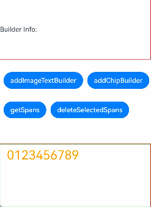

### 示例11（设置文本识别配置）
设置[enableDataDetector](#enabledatadetector11)为true时，通过[dataDetectorConfig](#datadetectorconfig11)接口设置文本识别配置。

```ts
@Entry
@Component
struct TextExample7 {
  controller: RichEditorController = new RichEditorController();
  options: RichEditorOptions = { controller: this.controller };
  @State phoneNumber: string = '(86) (755) ********';
  @State url: string = 'www.********.com';
  @State email: string = '***@example.com';
  @State address: string = 'XX省XX市XX区XXXX';
  @State enableDataDetector: boolean = true;
  @State types: TextDataDetectorType[] = [];

  build() {
    Row() {
      Column() {
        RichEditor(this.options)
          .onReady(() => {
            this.controller.addTextSpan('电话号码：' + this.phoneNumber + '\n',
              {
                style:
                {
                  fontSize: 30
                }
              });
            this.controller.addTextSpan('链接：' + this.url + '\n',
              {
                style:
                {
                  fontSize: 30
                }
              });
            this.controller.addTextSpan('邮箱：' + this.email + '\n',
              {
                style:
                {
                  fontSize: 30
                }
              });
            this.controller.addTextSpan('地址：' + this.address,
              {
                style:
                {
                  fontSize: 30
                }
              });
          })
          .copyOptions(CopyOptions.InApp)
          // 启用文本特殊实体识别功能
          .enableDataDetector(this.enableDataDetector)
          // 配置文本识别类型和识别结果更新回调
          .dataDetectorConfig({types : this.types, onDetectResultUpdate: (result: string)=>{}})
          .borderWidth(1)
          .padding(10)
          .width('100%')
      }
      .width('100%')
    }
  }
}
```
### 示例12（设置光标、手柄和底板颜色）
通过[caretColor](#caretcolor12)属性设置输入框光标、手柄颜色，通过[selectedBackgroundColor](#selectedbackgroundcolor12)属性设置文本选中底板颜色。

``` ts
@Entry
@Component
struct RichEditorDemo {
  @State color: Color = Color.Black;
  controller: RichEditorController = new RichEditorController();

  build() {
    Column() {
      Row() {
        Button("改为红色").onClick(() => {
          this.color = Color.Red;
        })
      }.margin({ top: 50 })

      RichEditor({ controller: this.controller })
        .onReady(() => {
          this.controller.addTextSpan('通过caretColor和selectedBackgroundColor属性设置光标和选中背景色');
        })
        .width("100%")
        .border({ width: 1, radius: 5 })
        .key('RichEditor')
        .caretColor(this.color) // 光标颜色
        .selectedBackgroundColor(this.color) // 选中背景色
        .margin({ top: 50 })
    }
    .width('100%')
  }
}
```
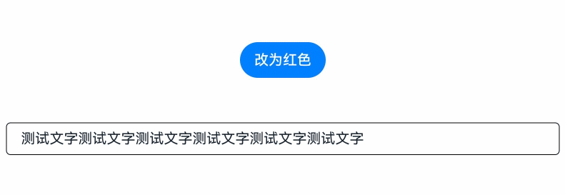

### 示例13（设置行高和字符间距）
通过[updateSpanStyle](#updatespanstyle)接口配置文本行高（[lineHeight](#richeditortextstyle)）和字符间距（[letterSpacing](#richeditortextstyle)）。

```ts
@Entry
@Component
struct RichEditorDemo03 {
  controller: RichEditorController = new RichEditorController();
  options: RichEditorOptions = { controller: this.controller };
  @State start: number = -1;
  @State end: number = -1;
  @State lineHeight:number = 50;
  @State letterSpacing:number = 20;

  build() {
    Column() {
      Scroll() {
        Column() {
          Row() {
            Button("行高++").onClick(()=>{
              this.lineHeight = this.lineHeight + 5;
              this.controller.updateSpanStyle({
                start: this.start,
                end: this.end,
                textStyle:
                {
                  lineHeight: this.lineHeight
                }
              });
            })
            Button("行高--").onClick(()=>{
              this.lineHeight = this.lineHeight - 5;
              this.controller.updateSpanStyle({
                start: this.start,
                end: this.end,
                textStyle:
                {
                  lineHeight: this.lineHeight
                }
              });
            })
            Button("字符间距++").onClick(()=>{
              this.letterSpacing = this.letterSpacing + 5
              this.controller.updateSpanStyle({
                start: this.start,
                end: this.end,
                textStyle:
                {
                  letterSpacing: this.letterSpacing
                }
              });
            })
            Button("字符间距--").onClick(()=>{
              this.letterSpacing = this.letterSpacing - 5
              this.controller.updateSpanStyle({
                start: this.start,
                end: this.end,
                textStyle:
                {
                  letterSpacing: this.letterSpacing
                }
              });
            })
          }
        }
      }.borderWidth(1)
      .borderColor(Color.Red)
      .width("100%")
      .height("20%")
      .margin({top: 20})

      Scroll() {
        Column() {
          Text("LineHeight:" + this.lineHeight).width("100%")
          Text("LetterSpacing:" + this.letterSpacing).width("100%")
        }
      }
      .borderWidth(1)
      .borderColor(Color.Red)
      .width("100%")
      .height("20%")
      .margin({bottom: 20})

      Column() {
        RichEditor(this.options).clip(true).padding(10)
          .onReady(() => {
            this.controller.addTextSpan("012345",
              {
                style:
                {
                  fontColor: Color.Orange,
                  fontSize: 30,
                  lineHeight: this.lineHeight,
                  letterSpacing: this.letterSpacing
                }
              });
            this.controller.addTextSpan("6789",
              {
                style:
                {
                  fontColor: Color.Black,
                  fontSize: 30,
                  lineHeight: this.lineHeight,
                  letterSpacing: this.letterSpacing
                }
              });
          })
          .borderWidth(1)
          .borderColor(Color.Green)
          .width(400)
          .height(400)
      }
      .borderWidth(1)
      .borderColor(Color.Red)
      .width("100%")
      .height("60%")
    }
  }
}
```
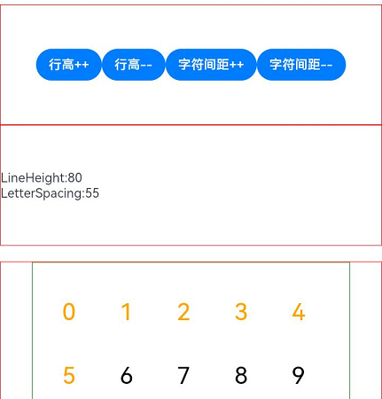

### 示例14（自定义粘贴事件）
为组件添加[onPaste](#onpaste11)事件，通过[PasteEvent](#pasteevent11)自定义用户粘贴事件。

```ts
@Entry
@Component
struct RichEditorDemo {
  controller: RichEditorController = new RichEditorController();
  options: RichEditorOptions = { controller: this.controller };

  build() {
    Column({ space: 2 }) {
      RichEditor(this.options)
        .onReady(() => {
          this.controller.addTextSpan('RichEditor preventDefault');
        })
        // 自定义粘贴事件，阻止系统默认粘贴行为
        .onPaste((event?: PasteEvent) => {
          if (event != undefined && event.preventDefault) {
            // 阻止系统默认粘贴操作
            event.preventDefault();
          }
        })
        .borderWidth(1)
        .borderColor(Color.Green)
        .width('100%')
        .height('40%')
    }
  }
}
```
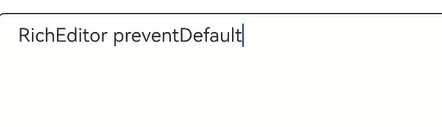

### 示例15（配置文字特性效果）
该示例通过[addTextSpan](#addtextspan)接口设置文字特性效果（[fontFeature](#richeditortextstyle)）。当添加“ss01”特性的FontFeature属性时，数字“0”由原来的椭圆形改变为带有倒圆角形。同时通过[RichEditorTextStyle](#richeditortextstyle)的strokeJoinStyle接口设置文本描边拐角样式。

从API版本26.0.0开始，[RichEditorTextStyle](#richeditortextstyle)新增strokeJoinStyle接口。

```ts
@Entry
@Component
struct RichEditorExample {
  controller: RichEditorController = new RichEditorController();
  options: RichEditorOptions = { controller: this.controller };
  @State enableDataDetector: boolean = true;
  @State types: TextDataDetectorType[] = [];
  build() {
    Row() {
      Column() {
        RichEditor(this.options)
          .onReady(() => {
            this.controller.addTextSpan('This is ss01 off :' + '0000' + '\n',
              {
                style:
                {
                  fontSize: 30
                }
              });
            this.controller.addTextSpan('This is ss01 on :' + '0000' + '\n',
              {
                style:
                {
                  fontSize: 30,
                  fontFeature: "\"ss01\" 1",
                  strokeJoinStyle: StrokeJoinStyle.MITER_JOIN
                }
              });
          })
          .copyOptions(CopyOptions.InApp)
          .enableDataDetector(this.enableDataDetector)
          .dataDetectorConfig({types : this.types, onDetectResultUpdate: (result: string)=>{}})
          .borderWidth(1)
          .padding(10)
          .width('100%')
      }
      .width('100%')
      .margin({top:150})
    }
  }
}
```
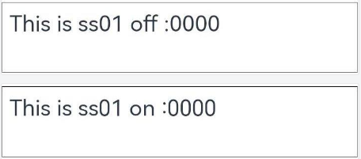

### 示例16（自定义键盘避让）
通过[customKeyboard](#customkeyboard)属性绑定自定义键盘，通过参数[KeyboardOptions](#keyboardoptions12)设置自定义键盘是否支持避让功能。

```ts
@Entry
@Component
struct RichEditorExample {
  controller: RichEditorController = new RichEditorController();
  @State keyboardHeight: string | number = '80%';

  @State supportAvoidance: boolean = true;

  // 自定义键盘组件
  @Builder
  CustomKeyboardBuilder() {
    Column() {
      Row() {
        Button('增加表情包').onClick(() => {
          this.controller.addTextSpan("\uD83D\uDE0A",
            {
              style:
              {
                fontColor: Color.Orange
              }
            });
        })
      }

      Grid() {
        ForEach(['1', '2', '3', '4', '5', '6', '7', '8', '9', '*', '0', '#'], (item: string) => {
          GridItem() {
            Button(item).width(110).onClick(() => {
              this.controller.addTextSpan(item, {
                offset: this.controller.getCaretOffset(),
                style:
                {
                  fontColor: Color.Orange,
                  fontSize: 30
                }
              });
              this.controller.setCaretOffset(this.controller.getCaretOffset() + item.toString().length);
            })
          }
        })
      }.maxCount(3).columnsGap(10).rowsGap(10).padding(5)
    }.backgroundColor(Color.Gray)
  }

  build() {
    Column() {
      Row() {
        Button("20%")
          .fontSize(24)
          .onClick(() => {
            this.keyboardHeight = "20%";
          })
        Button("80%")
          .fontSize(24)
          .margin({ left: 20 })
          .onClick(() => {
            this.keyboardHeight = "80%";
          })
      }
      .justifyContent(FlexAlign.Center)
      .alignItems(VerticalAlign.Bottom)
      .height(this.keyboardHeight)
      .width("100%")
      .padding({ bottom: 50 })

      RichEditor({ controller: this.controller }) // 绑定自定义键盘
        .customKeyboard(this.CustomKeyboardBuilder(), { supportAvoidance: this.supportAvoidance })
        .margin(10)
        .border({ width: 1 })
        .borderWidth(1)
        .borderColor(Color.Red)
        .width("100%")
    }
  }
}
```
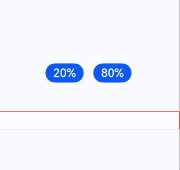

### 示例17（查看编辑状态）
通过[isEditing](#isediting12)接口获取当前富文本的编辑状态。为组件添加[onEditingChange](#oneditingchange12)事件，可通过打印日志，获取当前组件是否在编辑态。

```ts
@Entry
@Component
struct RichEditorOnEditingChange {
  controller: RichEditorController = new RichEditorController();
  @State controllerIsEditing: boolean = false;

  build() {
    Column() {
      Row() {
        Button("点击查看编辑状态isEditing()：").onClick(() => {
          // 获取当前富文本的编辑状态
          this.controllerIsEditing = this.controller.isEditing();
        })
          .padding(5)
        Text('' + this.controllerIsEditing)
          .width('100%')
          .padding(5)
          .fontColor(Color.Orange)
          .fontSize(20)
      }
      RichEditor({ controller: this.controller })
        .onEditingChange((isEditing: boolean) => {
          console.info("Current Editing Status:" + isEditing);
        })
        .height(400)
        .borderWidth(1)
        .borderColor(Color.Red)
        .width("100%")
    }
  }
}
```

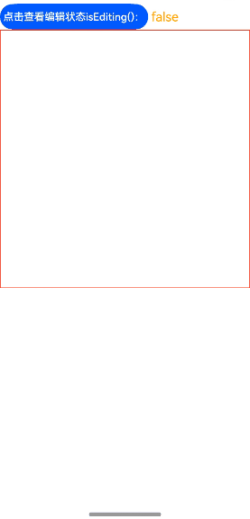

### 示例18（配置文本变化回调）
为组件添加[onWillChange](#onwillchange12)事件，能够在组件执行增删操作前，触发回调。

```ts
@Entry
@Component
struct RichEditorExample {
  controller: RichEditorController = new RichEditorController();
  scroll: Scroller = new Scroller();
  @State logContent: string = '';

  build() {
    Column() {
      Scroll(this.scroll) {
        Text(this.logContent).fontSize(15)
      }
      .height(300)
      .scrollable(ScrollDirection.FREE)
      .border({ color: Color.Red, width: 1 })

      RichEditor({ controller: this.controller })
        .height(50)
        .borderWidth(1)
        .borderColor(Color.Red)
        .width("100%")
        .onReady(() => {
          this.controller.addTextSpan('测试文字TestWord', { style: { fontColor: Color.Orange, fontSize: 30 } });
          this.controller.updateSpanStyle({
            start: -1,
            end: -1,
            textStyle:
            {
              fontWeight: FontWeight.Bolder
            }
          });
        })
        .onWillChange((value: RichEditorChangeValue) => {
          this.logContent += '\n测试log: onWillChange';
          this.logContent += '\n  rangeBefore: ' + JSON.stringify(value.rangeBefore);
          this.logContent += '\n  print replacedSpans';
          value.replacedSpans.forEach((item: RichEditorTextSpanResult, index: number) => {
            this.logContent += '\n    spanPosition:' + JSON.stringify(item.spanPosition);
            this.logContent += '\n    value:' + item.value;
            this.logContent += '\n    textStyle:' + JSON.stringify(item.textStyle);
            this.logContent += '\n    offsetInSpan:' + item.offsetInSpan;
            this.logContent += '\n    valueResource:' + item.valueResource;
            this.logContent += '\n    paragraphStyle:' + JSON.stringify(item.paragraphStyle);
          });
          this.logContent += '\n  print replacedImageSpans';
          value.replacedImageSpans.forEach((item: RichEditorImageSpanResult) => {
            this.logContent += '\n    spanPosition:' + JSON.stringify(item.spanPosition);
            this.logContent += '\n    valuePixelMap:' + JSON.stringify(item.valuePixelMap);
            this.logContent += '\n    valueResourceStr:' + item.valueResourceStr;
            this.logContent += '\n    imageStyle:' + JSON.stringify(item.imageStyle);
            this.logContent += '\n    offsetInSpan:' + item.offsetInSpan;
          });
          this.logContent += '\n  print replacedSymbolSpans';
          value.replacedSymbolSpans.forEach((item: RichEditorTextSpanResult) => {
            this.logContent += '\n    spanPosition:' + JSON.stringify(item.spanPosition);
            this.logContent += '\n    value:' + item.value;
            this.logContent += '\n    offsetInSpan:' + item.offsetInSpan;
            this.logContent += '\n    symbolSpanStyle:' + JSON.stringify(item.symbolSpanStyle);
            this.logContent += '\n    valueResource:' + item.valueResource;
            this.logContent += '\n    paragraphStyle:' + JSON.stringify(item.paragraphStyle);
          });
          this.logContent += '\n  ===========================================';
          return true;
        })
        .onDidChange((rangeBefore: TextRange, rangeAfter: TextRange) => {
          this.logContent += '\n测试log: onDidChange';
          this.logContent += '\n  rangeBefore: ' + JSON.stringify(rangeBefore);
          this.logContent += '\n  rangeAfter: ' + JSON.stringify(rangeAfter);
          this.logContent += '\n  ===========================================';
          setTimeout(() => {
            this.scroll.scrollEdge(Edge.Bottom);
          }, 100);
        })
        .onCut((event: CutEvent) => {
          event.preventDefault?.();
          console.info('测试log：onCut');
        })
        .onCopy((event: CopyEvent) => {
          event.preventDefault!();
          console.info('测试log：onCopy');
        })
        .onPaste(() => {
          console.info('测试log：onPaste');
        })

      Text('测试文字Hello')
        .lineHeight(50)
        .fontSize(24)
        .draggable(true)
        .onDragStart(() => {
        })
      TextInput({ text: '测试文字NiHao' })
        .draggable(true)
        .margin(20)
    }
  }
}
```


### 示例19（配置输入法回车键功能）
通过[enterKeyType](#enterkeytype12)属性设置软键盘输入法回车键类型。

```ts
@Entry
@Component
struct SoftKeyboardEnterTypeExample {
  controller: RichEditorController = new RichEditorController();

    build() {
    Column() {
      Button("停止编辑").onClick(()=>{
        this.controller.stopEditing();
      })
      RichEditor({ controller: this.controller })
        .margin(10)
        .border({ width: 1 })
        .height(200)
        .borderWidth(1)
        .borderColor(Color.Red)
        .width("100%")
        .enterKeyType(EnterKeyType.Search)
        .onSubmit((enterKey: EnterKeyType, event: SubmitEvent) => {
          console.info("trigger richeditor onsubmit" + enterKey);
          this.controller.addTextSpan(" type["+ enterKey +"] triggered");
          event.keepEditableState();
        })
    }.height("100%").justifyContent(FlexAlign.Center)
  }
}
```

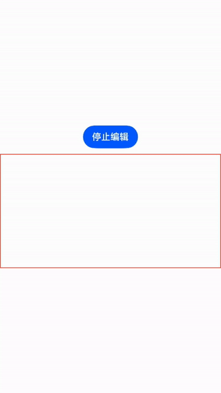

### 示例20（设置段落折行规则）
通过[updateParagraphStyle](#updateparagraphstyle11)接口设置折行类型（[lineBreakStrategy](#richeditorparagraphstyle11)），通过[getParagraphs](#getparagraphs11)接口获取当前段落的折行类型。

```ts
@Entry
@Component
struct LineBreakStrategyExample {
  controller: RichEditorController = new RichEditorController();
  private spanParagraphs: RichEditorParagraphResult[] = [];
  @State lineBreakOptionStr: string[] = ['GREEDY', 'HIGH_QUALITY', 'BALANCED'];
  @State attributeValue: string = "";
  @State testStr: string = "0123456789,0123456789,0123456789,0123456789,0123456789.";
  build() {
    Column() {
      RichEditor({ controller: this.controller })
        .onReady(() => {
          this.controller.addTextSpan(this.testStr, {
            style: {
              fontColor: Color.Black,
              fontSize: "32"
            },
            paragraphStyle: {
              textAlign: TextAlign.Start,
              lineBreakStrategy: LineBreakStrategy.GREEDY
            }
          })
        })
        .width(400)
        .height(300)
        .margin({bottom:20})
        .draggable(false)
      Column() {
        Text('linebreak属性值为：' + this.attributeValue).fontSize(20).fontColor(Color.Black)
      }.margin({bottom: 10})
      Column({ space: 10 }) {
        Button("设置折行类型GREEDY").onClick(() => {
          this.controller.updateParagraphStyle({ start: -1, end: -1,
            style: {
              lineBreakStrategy: LineBreakStrategy.GREEDY
            }
          });
        })
        Button("设置折行类型HIGH_QUALITY").onClick(() => {
          this.controller.updateParagraphStyle({ start: -1, end: -1,
            style: {
              lineBreakStrategy: LineBreakStrategy.HIGH_QUALITY
            }
          });
        })
        Button("设置折行类型BALANCED").onClick(() => {
          this.controller.updateParagraphStyle({ start: -1, end: -1,
            style: {
              lineBreakStrategy: LineBreakStrategy.BALANCED
            }
          });
        })
        Divider()
        Row() {
          Button("获取linebreak属性值").onClick(() => {
            this.spanParagraphs = this.controller.getParagraphs({ start: -1, end: -1 });
            console.info("RichEditor getParagraphs:" + JSON.stringify(this.spanParagraphs));
            this.spanParagraphs.forEach(item => {
              if (typeof(item as RichEditorParagraphResult)['style'] != 'undefined') {
                this.attributeValue = "";
                console.info('lineBreakStrategy:'+ JSON.stringify((item as RichEditorParagraphResult)['style']));
                this.attributeValue += this.lineBreakOptionStr[Number((item as RichEditorParagraphResult)['style'].lineBreakStrategy)];
              }
            });
          })
        }
      }
    }
  }
}
```


### 示例21（属性字符串基本功能）
从API version 20开始，该示例中[属性字符串](./ts-universal-styled-string.md)通过[RichEditorStyledStringController](#richeditorstyledstringcontroller12)中的[setStyledString](#setstyledstring12)方法与RichEditor组件绑定。通过[getStyledString](#getstyledstring12)接口获取富文本组件显示的属性字符串。

```ts
// xxx.ets
import { LengthMetrics } from '@kit.ArkUI'

@Entry
@Component
struct Index {
  @State selection: string = "";
  @State content: string = "";
  @State range: string = "";
  @State replaceString: string = "";
  @State rangeBefore: string = "";
  @State rangeAfter: string = "";
  richEditorStyledString: MutableStyledString = new MutableStyledString("");
  textStyle: TextStyle = new TextStyle({
    fontWeight: FontWeight.Lighter,
    fontFamily: 'HarmonyOS Sans',
    fontColor: Color.Green,
    fontSize: LengthMetrics.vp(30),
    fontStyle: FontStyle.Normal
  });
  blueTextStyle: TextStyle = new TextStyle({ fontColor: Color.Blue });
  orangeItalicTextStyle: TextStyle = new TextStyle({
    fontWeight: FontWeight.Bolder,
    fontFamily: 'Arial',
    fontColor: Color.Orange,
    fontSize: LengthMetrics.vp(30),
    fontStyle: FontStyle.Italic
  });

  secondaryController: RichEditorController = new RichEditorController();
  secondaryOptions: RichEditorOptions = { controller: this.secondaryController };
  // 创建属性字符串对象
  mutableStyledString: MutableStyledString = new MutableStyledString("初始属性字符串",
    [{ start: 0, length: 5, styledKey: StyledStringKey.FONT, styledValue: this.blueTextStyle }]);
  styledString: StyledString = new StyledString("插入属性字符串",
    [{ start: 2, length: 4, styledKey: StyledStringKey.FONT, styledValue: this.orangeItalicTextStyle }]);
  controller: RichEditorStyledStringController = new RichEditorStyledStringController();
  options: RichEditorStyledStringOptions = {controller: this.controller};
  // 文本内容变化回调
  contentChangedListener: StyledStringChangedListener = {
    onWillChange: (value: StyledStringChangeValue) => {
      this.range = '[ ' + value.range.start + ' , ' + value.range.end + ' ]';
      this.replaceString = value.replacementString.getString();
      return true;
    },
    onDidChange: (rangeBefore, rangeAfter) => {
      this.rangeBefore = '[ ' + rangeBefore.start + ' , ' + rangeBefore.end + ' ]';
      this.rangeAfter = '[ ' + rangeAfter.start + ' , ' + rangeAfter.end + ' ]';
    }
  }

  build() {
    Column({space:6}) {
      Column() {
        Text("选中区信息")
          .fontSize(20)
          .width("100%")
        Text("selection range: " + this.selection).width("100%")
        Text("selection content: " + this.content).width("100%")
      }
      .width("100%")
      .height("10%")

      Column() {
        Text("onWillChange回调信息")
          .fontSize(20)
          .width("100%")
        Text("range: " + this.range).width("100%")
        Text("replacementString: " + this.replaceString).width("100%")
        Text("onWillChange回调信息")
          .fontSize(20)
          .width("100%")
        Text("rangeBefore: " + this.rangeBefore).width("100%")
        Text("rangeAfter: " + this.rangeAfter).width("100%")
      }
      .borderWidth(1)
      .borderColor(Color.Black)
      .width("100%")
      .height("20%")

      RichEditor(this.options)
        .onReady(() => {
          // 注册文本变化回调
          this.controller.onContentChanged(this.contentChangedListener);
          // 设定组件展示的属性字符串
          this.controller.setStyledString(this.mutableStyledString);
        })
        .height("20%")
        .width("100%")

      RichEditor(this.secondaryOptions)
        .onReady(() => {
        this.secondaryController.addTextSpan("把这些文字转换成属性字符串");
      })
        .height("10%")
        .width("100%")
        .borderWidth(1)
        .borderColor(Color.Black)

        Row({space:2}) {
          Button("插入图片")
            .stateEffect(true)
            .onClick(() => {
              // $r('app.media.startIcon')需要替换为开发者所需的图像资源文件。
              let imageStyledString = new MutableStyledString(new ImageAttachment({
                resourceValue: $r('app.media.startIcon'),
                size: { width: 50, height: 50 },
                layoutStyle: { borderRadius: LengthMetrics.vp(10) },
                verticalAlign: ImageSpanAlignment.BASELINE,
                objectFit: ImageFit.Contain,
                syncLoad: true
              }));
              // 获取组件展示的属性字符串
              this.richEditorStyledString = this.controller.getStyledString();
              this.richEditorStyledString.appendStyledString(imageStyledString);
              // 使插入图片后的属性字符串展示在组件上
              this.controller.setStyledString(this.richEditorStyledString);
              this.controller.setCaretOffset(this.richEditorStyledString.length);
          })
          Button("插入文本").onClick(() => {
            // 获取组件展示的属性字符串
            this.richEditorStyledString = this.controller.getStyledString();
            this.richEditorStyledString.appendStyledString(this.styledString);
            // 使插入文本后的属性字符串展示在组件上
            this.controller.setStyledString(this.richEditorStyledString);
            this.controller.setCaretOffset(this.richEditorStyledString.length);
          })
          Button("删除选中内容").onClick(() => {
            // 获取选中范围
            let richEditorSelection = this.controller.getSelection();
            let start = richEditorSelection.start ? richEditorSelection.start : 0;
            let end = richEditorSelection.end ? richEditorSelection.end : 0;
            if (start < 0 || end <= start) {
              return;
            }
            // 获取组件展示的属性字符串
            this.richEditorStyledString = this.controller.getStyledString();
            this.richEditorStyledString.removeString(start, end - start);
            // 使删除内容后的属性字符串展示在组件上
            this.controller.setStyledString(this.richEditorStyledString);
          })
        }
        Row({space:2}) {
          Button("获取选中内容").onClick(() => {
            // 获取选中范围
            let richEditorSelection = this.controller.getSelection();
            let start = richEditorSelection.start ? richEditorSelection.start : 0;
            let end = richEditorSelection.end ? richEditorSelection.end : 0;
            // 获取组件展示的属性字符串
            this.richEditorStyledString = this.controller.getStyledString();
            this.selection = '[ ' + start + ' , ' + end + ' ]';
            if (start == end) {
              this.content = "";
            } else {
              this.content = this.richEditorStyledString.subStyledString(start, end - start).getString();
            }
          })
          Button("更新选中样式").onClick(() => {
            // 获取选中范围
            let richEditorSelection = this.controller.getSelection();
            let start = richEditorSelection.start ? richEditorSelection.start : 0;
            let end = richEditorSelection.end ? richEditorSelection.end : 0;
            if (start < 0 || end <= start) {
              return;
            }
            // 获取组件展示的属性字符串
            this.richEditorStyledString = this.controller.getStyledString();
            this.richEditorStyledString.setStyle({
              start: start,
              length: end - start,
              styledKey: StyledStringKey.FONT,
              styledValue: this.textStyle
            });
            // 使变更样式后的属性字符串展示在组件上
            this.controller.setStyledString(this.richEditorStyledString);
          });
        }
        Row({space:2}) {
          // 将属性字符串转换成span信息
          Button("调用fromStyledString").onClick(() => {
            this.secondaryController.addTextSpan("调用fromStyledString：" +JSON.stringify(this.secondaryController.fromStyledString(this.mutableStyledString)));
          })
          // 将给定范围的组件内容转换成属性字符串
          Button("调用toStyledString").onClick(() => {
            this.controller.setStyledString(this.secondaryController.toStyledString({start:0,end:13}));
          })
        }
    }
  }
}
```

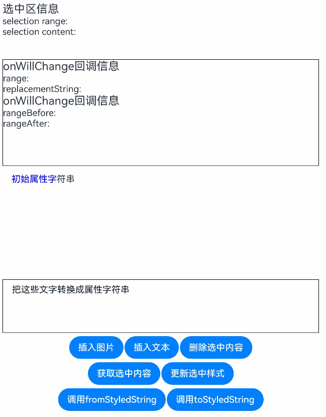

### 示例22（获取布局信息）
通过[getLayoutManager](#getlayoutmanager12)接口获取布局管理器对象，通过[getLineCount](ts-text-common.md#getlinecount12)接口获取组件内容或[placeholder](#placeholder12)的总行数，通过[getGlyphPositionAtCoordinate](ts-text-common.md#getglyphpositionatcoordinate12)接口获取较为接近给定坐标的字形的位置信息，通过[getLineMetrics](ts-text-common.md#getlinemetrics12)接口获取指定行的行信息、文本样式信息、以及字体属性信息。

```ts
@Entry
@Component
struct Index {
  @State lineCount: string = ""
  @State glyphPositionAtCoordinate: string = ""
  @State lineMetrics: string = ""
  controller: RichEditorController = new RichEditorController();
  @State textStr: string =
    'Hello World! 你好，世界！'

  build() {
    Scroll() {
      Column() {
        Text('RichEditor组件getLayoutManager接口获取相对于组件的布局信息')
          .fontSize(9)
          .fontColor(0xCCCCCC)
          .width('90%')
          .padding(10)
        RichEditor({ controller: this.controller })
          .borderColor(Color.Red)
          .borderWidth(1)
          .onReady(() => {
            this.controller.addTextSpan(this.textStr);
          })
          .onAreaChange(() => {
            let layoutManager = this.controller.getLayoutManager();
            this.lineCount = "LineCount: " + layoutManager.getLineCount();
          })

        Text('LineCount').fontSize(9).fontColor(0xCCCCCC).width('90%').padding(10)
        Text(this.lineCount)

        Text('GlyphPositionAtCoordinate').fontSize(9).fontColor(0xCCCCCC).width('90%').padding(10)
        Button("相对组件坐标[150,50]字形信息")
          .onClick(() => {
            let layoutManager: LayoutManager = this.controller.getLayoutManager();
            let position = layoutManager.getGlyphPositionAtCoordinate(150, 50);
            this.glyphPositionAtCoordinate =
            "相对组件坐标[150,50] glyphPositionAtCoordinate position: " + position.position + " affinity: " +
            position.affinity;
          })
          .margin({ bottom: 20, top: 10 })
        Text(this.glyphPositionAtCoordinate)

        Text('LineMetrics').fontSize(9).fontColor(0xCCCCCC).width('90%').padding(10)
        Button("首行行信息、文本样式信息、以及字体属性信息")
          .onClick(() => {
            let layoutManager: LayoutManager = this.controller.getLayoutManager();
            let lineMetrics = layoutManager.getLineMetrics(0);
            this.lineMetrics = "lineMetrics is " + JSON.stringify(lineMetrics) + '\n\n';
            let runMetrics = lineMetrics.runMetrics;
            runMetrics.forEach((value, key) => {
              this.lineMetrics += "runMetrics key is " + key + " " + JSON.stringify(value) + "\n\n";
            });
          })
          .margin({ bottom: 20, top: 10 })
        Text(this.lineMetrics)
      }
      .margin({ top: 100, left: 8, right: 8 })
    }
  }
}
```

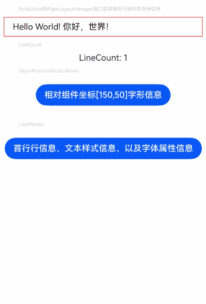

### 示例23（设置系统默认菜单扩展项）
从API version 20开始，该示例通过[editMenuOptions](#editmenuoptions12)属性设置系统默认菜单的扩展项，允许配置扩展项的文本内容、图标和回调方法。

```ts
// xxx.ets
@Entry
@Component
struct RichEditorExample {
  controller: RichEditorController = new RichEditorController();
  options: RichEditorOptions = { controller: this.controller };
  @State endIndex: number | undefined = 0;
  onCreateMenu = (menuItems: Array<TextMenuItem>) => {
    const idsToFilter: TextMenuItemId[] = [
      TextMenuItemId.TRANSLATE,
      TextMenuItemId.SHARE,
      TextMenuItemId.SEARCH,
      TextMenuItemId.AI_WRITER,
      // 从API version 23开始支持TextMenuItemId.autoFill
      TextMenuItemId.autoFill
    ]
    const items = menuItems.filter(item => !idsToFilter.some(id => id.equals(item.id)));
    // $r('app.media.startIcon')需要替换为开发者所需的图像资源文件。
    let createMenuOption1: TextMenuItem = {
      content: 'create1',
      icon: $r('app.media.startIcon'),
      id: TextMenuItemId.of('create1'),
    };
    let item2: TextMenuItem = {
      content: 'create2',
      id: TextMenuItemId.of('create2'),
      icon: $r('app.media.startIcon'),
    };
    items.push(createMenuOption1);
    items.unshift(item2);
    return items;
  }
  onMenuItemClick = (menuItem: TextMenuItem, textRange: TextRange) => {
    if (menuItem.id.equals(TextMenuItemId.of("create2"))) {
      console.info("拦截 id: create2 start:" + textRange.start + "; end:" + textRange.end);
      return true;
    }
    if (menuItem.id.equals(TextMenuItemId.of("prepare1"))) {
      console.info("拦截 id: prepare1 start:" + textRange.start + "; end:" + textRange.end);
      return true;
    }
    if (menuItem.id.equals(TextMenuItemId.COPY)) {
      console.info("拦截 COPY start:" + textRange.start + "; end:" + textRange.end);
      return true;
    }
    if (menuItem.id.equals(TextMenuItemId.SELECT_ALL)) {
      console.info("不拦截 SELECT_ALL start:" + textRange.start + "; end:" + textRange.end);
      return false;
    }
    return false;
  }
  // $r('app.media.startIcon')需要替换为开发者所需的图像资源文件。
  onPrepareMenu = (menuItems: Array<TextMenuItem>) => {
    let item1: TextMenuItem = {
      content: 'prepare1_' + this.endIndex,
      icon: $r('app.media.startIcon'),
      id: TextMenuItemId.of('prepare1'),
    };
    menuItems.unshift(item1);
    return menuItems;
  }
  @State editMenuOptions: EditMenuOptions = {
    onCreateMenu: this.onCreateMenu,
    onMenuItemClick: this.onMenuItemClick,
    onPrepareMenu: this.onPrepareMenu
  };

  build() {
    Column() {
      RichEditor(this.options)
        .onReady(() => {
          this.controller.addTextSpan("RichEditor editMenuOptions");
        })
        .editMenuOptions(this.editMenuOptions)
        .onSelectionChange((range: RichEditorRange) => {
          console.info("onSelectionChange, (" + range.start + "," + range.end + ")");
          this.endIndex = range.end
        })
        .height(50)
        .margin({ top: 100 })
        .borderWidth(1)
        .borderColor(Color.Red)
    }
    .width("90%")
    .margin("5%")
  }
}
```

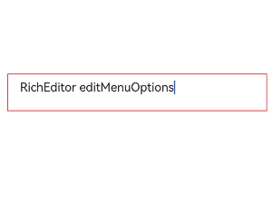

### 示例24（组件部分常用属性）
从API version 18开始，该示例通过[barState](#barstate13)属性设置组件滚动条的显示模式。通过[enableKeyboardOnFocus](#enablekeyboardonfocus12)属性设置组件通过点击以外的方式获焦时，是否主动拉起软键盘。通过[enableHapticFeedback](#enablehapticfeedback13)属性设置组件是否支持触感反馈。通过[getPreviewText](#getpreviewtext12)接口获取组件预上屏信息。通过[stopBackPress](#stopbackpress18)属性设置是否阻止返回键向其他组件或应用侧传递。<br>
从API version 21开始，该示例通过[scrollBarColor](#scrollbarcolor21)属性设置RichEditor组件滚动条颜色。

```ts
// xxx.ets
import { JSON } from '@kit.ArkTS';
import { ColorMetrics } from '@kit.ArkUI';

@Entry
@Component
struct RichEditorExample {
  controller: RichEditorController = new RichEditorController();
  options: RichEditorOptions = { controller: this.controller };

  secondaryController: RichEditorController = new RichEditorController();
  secondaryOptions: RichEditorOptions = { controller: this.secondaryController };

  @State isEnabled: boolean = true;
  @State barStateIndex: number = 0;
  @State barStates: (BarState | undefined)[] = [BarState.Auto, BarState.On, BarState.Off, undefined];
  @State barStateStrings: string[] = ["Auto", "On", "Off", "undefined"];

  build() {
    Column({space: 3}) {
      RichEditor(this.options)
        .onReady(() => {
          this.controller.addTextSpan('文本文本文本文本文本文本文本文本文本文本文本文本文本文本文本文本文本文本文本文本文本文本文本文本', {
            style: {
              fontColor: Color.Black,
              fontSize: 20
            }
          });
        })
        .onDidIMEInput((value: TextRange) => {
          this.secondaryController.addTextSpan("\n" + "触发了onDidIMEInput回调,输入法本次输入内容范围为：(" + value.start + "," + value.end + ")", {
            style: {
              fontColor: Color.Gray,
              fontSize: 10
            }
          });
        })
        .onSelectionChange((value: RichEditorRange) => {
          this.secondaryController.addTextSpan("\n" + "触发了onSelectionChange回调，起始范围信息为：(" + value.start + "," + value.end + ")", {
            style: {
              fontColor: Color.Gray,
              fontSize: 10
            }
          });
        })
        .width(300)
        .height(100)
        .margin(20)
        .barState(this.barStates[this.barStateIndex])
        .enableKeyboardOnFocus(this.isEnabled)
        .enableHapticFeedback(true)
        .stopBackPress(false)
        .scrollBarColor(ColorMetrics.resourceColor("#2787D9"));

      RichEditor(this.secondaryOptions).width(300)

      Button('设置barState为：' + this.barStateStrings[this.barStateIndex])
        .height(30)
        .fontSize(13)
        .onClick(() => {
          this.barStateIndex++;
          if (this.barStateIndex > (this.barStates.length - 1)) {
            this.barStateIndex = 0;
          }
        })

      Button('设置enableKeyboardOnFocus为：' + this.isEnabled)
        .height(30)
        .fontSize(13)
        .onClick(() => {
          this.isEnabled = !this.isEnabled;
        })

      Button('获取预上屏信息')
        .height(30)
        .fontSize(13)
        .onClick(() => {
          this.secondaryController.addTextSpan("\n获取预上屏信息:" + JSON.stringify(this.controller.getPreviewText()));
        })
    }
  }
}

```

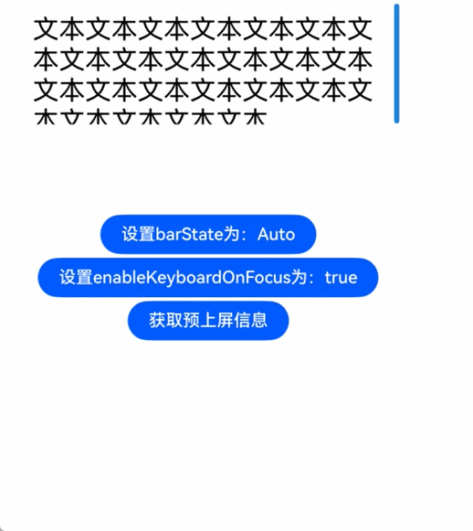

### 示例25（获取光标相对组件位置的矩形）
从API version 18开始，该示例通过RichEditorBaseController的[getCaretRect](#getcaretrect18)方法来获取当前光标相对于组件位置的Rect。

```ts
// xxx.ets
@Entry
@Component
struct Index {
  controller: RichEditorController = new RichEditorController();
  options: RichEditorOptions = { controller: this.controller };
  @State caretRect: string = "not found";

  build() {
    Column() {
      Button('get caret rect')
        .onClick(() => {
          let rectCaret = this.controller.getCaretRect();
          if (rectCaret == undefined) {
            this.caretRect = 'undefined';
          } else {
            this.caretRect = 'X: ' + rectCaret.x + '\nY: ' + rectCaret.y
              + '\nWidth: ' + rectCaret.width + '\nHeight: ' + rectCaret.height;
          }
        })
        .fontSize(24)
        .width("60%")
        .height("10%")

      Text(this.caretRect)
        .margin(12)
        .fontSize(24)

      RichEditor(this.options)
        .onReady(() => {
          this.controller.addTextSpan('12345678901234567890', {
            style:
            {
              fontColor: Color.Orange,
              fontSize: 50
            }
          })
        })
        .borderWidth(1)
        .borderColor(Color.Red)
        .width("100%")
        .height("60%")
    }
  }
}

```


### 示例26（设置最大行数和最大字符数）
从API version 18开始，该示例通过[maxLength](#maxlength18)设置可输入的最大字符数，通过[maxLines](#maxlines18)设置可输入的最大行数。

```ts
@Entry
@Component
struct RichEditorExample {
  @State text: string = "As the sun begins to set, casting a warm golden hue across the sky," +
    "the world seems to slow down and breathe a sigh of relief. The sky is painted with hues of orange, " +
    " pink, and lavender, creating a breathtaking tapestry that stretches as far as the eye can see." +
    "The air is filled with the sweet scent of blooming flowers, mingling with the earthy aroma of freshly turned soil." +
    "it casts a warm," +
    "golden hue that spreads like liquid amber across the vast expanse of the sky." +
    "The once-blue heavens gradually transform, " +
    "now painted in a breathtaking palette of soft oranges, pinks, " +
    "and purples, each color blending seamlessly into the next. Wisps of clouds, tinged with fiery edges, " +
    "float lazily amidst this celestial canvas," +
    "creating a scene so serene and beautiful that it almost seems to pause time itself." +
    "As the sun begins to set, casting a warm golden hue across the sky," +
    "the world seems to slow down and breathe a sigh of relief. The sky is painted with hues of orange, " +
    " pink, and lavender, creating a breathtaking tapestry that stretches as far as the eye can see." +
    "The air is filled with the sweet scent of blooming flowers, mingling with the earthy aroma of freshly turned soil." +
    "it casts a warm," +
    "golden hue that spreads like liquid amber across the vast expanse of the sky." +
    "The once-blue heavens gradually transform, ";
  @State maxLineList: (number | undefined)[] = [2, 6, undefined];
  @State maxLineIndex: number = 0;
  @State maxLineStringList: (string)[] = ["2", "6", "undefined"];
  controller1: RichEditorController = new RichEditorController();
  controller3: RichEditorController = new RichEditorController();

  build() {
    Column() {
      Text("当前的maxLength为7 ")
        .margin(10)
        .fontSize(25)
      Row() {
        Button("插入占1字符数的图片")
          .onClick(() => {
            // $r('app.media.startIcon')需要替换为开发者所需的图像资源文件。
            this.controller1.addImageSpan($r('app.media.startIcon'),
              {
                imageStyle:
                {
                  size: ["57px", "57px"]
                }
              })
          })
        Button("插入占2字符数图片")
          .onClick(() => {
            this.controller1.addSymbolSpan($r("sys.symbol.ohos_trash"),
              {
                style:
                {
                  fontSize: 30
                }
              })
          })
          .margin({ left: 20 })
      }

      RichEditor({ controller: this.controller1 })
        .width('95%')
        .margin(10)
        .height(60)
        .maxLength(7)
        .backgroundColor('rgb(240,250,255)')
      Text("当前的maxLine为 " + this.maxLineStringList[this.maxLineIndex]).margin(10)
        .fontSize(25)
      Button("更改maxLines").onClick(() => {
        this.maxLineIndex++;
        if (this.maxLineIndex > this.maxLineList.length - 1) {
          this.maxLineIndex = 0;
        }
      })
      RichEditor({ controller: this.controller3 })
        .onReady(() => {
          this.controller3.addTextSpan(this.text,
            {
              style:
              {
                fontColor: 'rgb(0,74,175)'
              }
            })
        })
        .margin(10)
        .width('95%')
        .maxLines(this.maxLineList[this.maxLineIndex])
        .backgroundColor('rgb(240,250,255)')
    }
  }
}
```
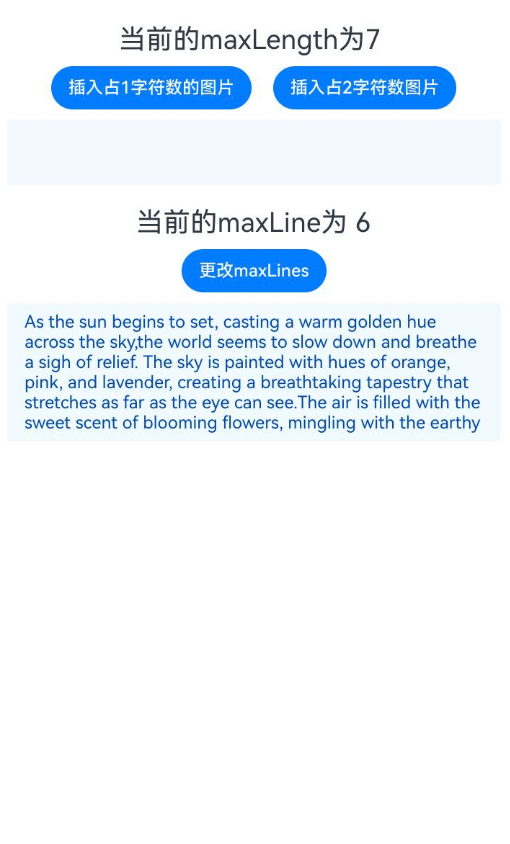

### 示例27（文本设置Url样式）
从API version 19开始，该示例通过在addTextSpan和UpdateSpanStyle接口中加入[UrlStyle](#richeditorurlstyle19)，来实现文本点击时跳转到指定链接的功能。

```ts
// xxx.ets

@Entry
@Component
struct RichEditorExample {
  controller: RichEditorController = new RichEditorController();
  options: RichEditorOptions = { controller: this.controller };

  build() {
    Column() {
      Row() {
        Button("Add Example Url").onClick(() => {
          this.controller.addTextSpan("示例网址", {
            urlStyle: { url: "https://www.example.com" }
          });
        })
        Button("Clear Url").onClick(() => {
          this.controller.updateSpanStyle({
            start: 0,
            textStyle: {},
            urlStyle: { url: "" }
          });
        })
      }

      Row() {
        RichEditor(this.options)
          .height('35%')
          .border({ width: 1, color: Color.Blue })
      }
    }
  }
}
```


### 示例28（开启带样式的撤销还原能力）
从API version 20开始，该示例对于不使用属性字符串的富文本组件，可以通过配置[undoStyle](#undostyle20)属性为UndoStyle.KEEP_STYLE，以支持撤销还原时保留原内容的样式。

```ts
// xxx.ets

@Entry
@Component
struct StyledUndo {
  controller: RichEditorController = new RichEditorController();
  options: RichEditorOptions = { controller: this.controller };
  private start: number = 0;
  private end: number = 0;
  @State undoStyle: UndoStyle = UndoStyle.KEEP_STYLE;
  build() {
    Column() {
      Column() {
        Row({space:2}) {
          Button("插入文本").onClick(() => {
            this.controller.addTextSpan("插入文本",
              {
                style:
                {
                  fontColor: Color.Orange,
                  fontSize: 32
                }
              });
          })
          Button("插入图片").onClick(() => {
            // $r('app.media.startIcon')需要替换为开发者所需的图像资源文件。
            this.controller.addImageSpan($r('app.media.startIcon'),
              {
                imageStyle:
                {
                  size: ["100px", "100px"]
                }
              });
          })
          Button("插入Symbol").onClick(() => {
            this.controller.addSymbolSpan($r("sys.symbol.ohos_trash"),
              {
                style:
                {
                  fontSize: 32
                }
              });
          })
        }
        .borderWidth(1)
        .borderColor(Color.Red)
        .justifyContent(FlexAlign.Center)
        .width("100%")
        .height("10%")
        Row({space:2}) {
          Button("更新选中范围样式").onClick(() => {
            if (this.start < this.end) {
              this.controller.updateSpanStyle({
                start: this.start,
                end: this.end,
                textStyle:
                {
                  fontColor: Color.Red,
                  fontWeight: FontWeight.Bolder
                }
              });
            }
          })
          Button("删除选中范围内容").onClick(() => {
            if (this.start < this.end) {
              this.controller.deleteSpans({
                start: this.start,
                end: this.end
              });
            }
          })
        }
        .borderWidth(1)
        .borderColor(Color.Red)
        .justifyContent(FlexAlign.Center)
        .width("100%")
        .height("10%")
        Row({space:2}) {
          Button("撤销时不还原样式").onClick(() => {
            this.undoStyle = UndoStyle.CLEAR_STYLE;
          })
          Button("撤销时还原样式").onClick(() => {
            this.undoStyle = UndoStyle.KEEP_STYLE;
          })
        }
        .borderWidth(1)
        .borderColor(Color.Red)
        .justifyContent(FlexAlign.Center)
        .width("100%")
        .height("10%")
      }
      Column() {
        RichEditor(this.options)
          .onReady(()=>{
            // $r('app.media.startIcon')需要替换为开发者所需的图像资源文件。
            this.controller.addImageSpan($r('app.media.startIcon'),
            {
              imageStyle:
              {
                size: ["100px", "100px"]
              }
            });
            this.controller.addTextSpan("初始化图文混排内容",
              {
                style:
                {
                  fontColor: Color.Orange,
                  fontSize: 32
                }
              });
            this.controller.addSymbolSpan($r("sys.symbol.ohos_trash"),
              {
                style:
                {
                  fontSize: 32
                }
              });
          })
          .undoStyle(this.undoStyle)
          .onSelect((value: RichEditorSelection) => {
            this.start = value.selection[0];
            this.end = value.selection[1];
          })
          .borderWidth(1)
          .borderColor(Color.Green)
          .width("100%")
          .height("50%")
      }
    }
  }
}
```
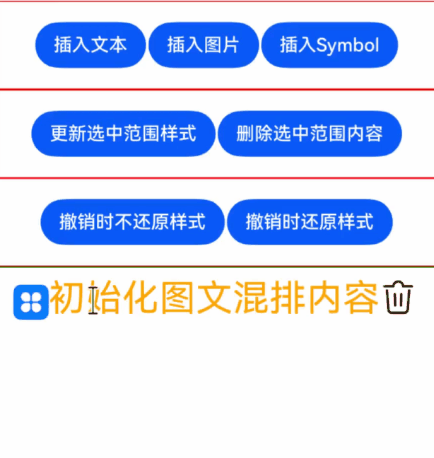

### 示例29（文本设置预设段落样式）
从API version 20开始，该示例通过[setTypingParagraphStyle](#settypingparagraphstyle20)接口设置预设段落样式。

```ts
@Entry
@Component
struct RichEditorExample {
  controller: RichEditorController = new RichEditorController();
  options: RichEditorOptions = { controller: this.controller }
  styledStringController: RichEditorStyledStringController = new RichEditorStyledStringController();
  styledStringOptions: RichEditorStyledStringOptions = { controller: this.styledStringController }
  contentChangedListener: StyledStringChangedListener = {
    onWillChange: (value: StyledStringChangeValue) => {
      let range = '[ ' + value.range.start + ' , ' + value.range.end + ' ]';
      let replaceString = value.replacementString.getString();
      console.info('styledString, onWillChange, range=' + range);
      console.info('styledString, onWillChange, replaceString=' + replaceString);
      let styles: Array<SpanStyle> = [];
      if (replaceString.length != 0) {
        styles = value.replacementString.getStyles(0, replaceString.length, StyledStringKey.PARAGRAPH_STYLE);
      }
      styles.forEach((style) => {
        let value = style.styledValue
        let paraStyle: ParagraphStyle = value as ParagraphStyle
        if (paraStyle != undefined) {
          console.info('styledString, onWillChange, textAlign=' + JSON.stringify(paraStyle.textAlign)
            + ', textIndent=' + JSON.stringify(paraStyle.textIndent)
            + ', maxLines=' + JSON.stringify(paraStyle.maxLines)
            + ', overflow=' + JSON.stringify(paraStyle.overflow)
            + ', wordBreak=' + JSON.stringify(paraStyle.wordBreak)
            + ', leadingMargin=' + JSON.stringify(paraStyle.leadingMargin)
            + ', paragraphSpacing=' + JSON.stringify(paraStyle.paragraphSpacing)
          );
        }
      });
      return true;
    }
  }

  build() {
    Column() {
      Row() {
        Text('ParaStyle')
        // 设置预设段落样式为居中对齐
        Button('setStyle1').onClick(() => {
          let paragraphStyle: RichEditorParagraphStyle = {
            textAlign: TextAlign.Center
          }
          this.controller.setTypingParagraphStyle(paragraphStyle);
          this.styledStringController.setTypingParagraphStyle(paragraphStyle);
        })
        // 设置预设段落样式为左对齐、带有缩进
        Button('setStyle2').onClick(() => {
          let paragraphStyle: RichEditorParagraphStyle = {
            textAlign: TextAlign.Start,
            leadingMargin: 80
          }
          this.controller.setTypingParagraphStyle(paragraphStyle);
          this.styledStringController.setTypingParagraphStyle(paragraphStyle);
        })
        // 清除预设段落样式
        Button('clearParaStyle').onClick(() => {
          this.controller.setTypingParagraphStyle(undefined);
          this.styledStringController.setTypingParagraphStyle(undefined);
        })
      }

      Row() {
        Column() {
          RichEditor(this.options)
            .height('25%')
            .width('100%')
            .border({ width: 1, color: Color.Blue })
            .onWillChange((value: RichEditorChangeValue) => {
              console.info('controller, onWillChange, rangeBefore=' + JSON.stringify(value.rangeBefore));
              value.replacedSpans.forEach((item: RichEditorTextSpanResult) => {
                console.info('controller, onWillChange, replacedTextSpans=' + JSON.stringify(item));
              });
              return true
            })
          RichEditor(this.styledStringOptions)
            .height('25%')
            .width('100%')
            .onReady(() => {
              this.styledStringController.onContentChanged(this.contentChangedListener);
            })
        }
      }
    }
  }
}
```


### 示例30（设置装饰线粗细和多装饰线）
从API version 20开始，该示例通过[DecorationStyle](ts-universal-styled-string.md#decorationstyle)中的thicknessScale设置装饰线粗细，通过[enableMultiType](ts-universal-styled-string.md#decorationoptions20)设置多装饰线。

```ts
import { LengthMetrics } from '@kit.ArkUI';

@Entry
@Component
struct Index {
  private controller: RichEditorController = new RichEditorController();
  private styledStringController: RichEditorStyledStringController = new RichEditorStyledStringController();

  build() {
    Column({ space: 20 }) {
      RichEditor({ controller: this.controller })
        .onReady(() => {
          // 预置一段文本
          this.controller.addTextSpan('一段预置的文本', {
            style: {
              fontSize: 25,
              decoration: {
                type: TextDecorationType.LineThrough,
                // 设置装饰线粗细比例为2
                thicknessScale: 2
              }
            }
          });
        })

      // 设置富文本多装饰线
      RichEditor({ controller: this.styledStringController })

      Button('追加粗细比例为8的文本')
        .fontSize(20)
        .onClick(() => {
          this.controller.addTextSpan('追加的文本', {
            style: {
              fontSize: 25,
              decoration: {
                type: TextDecorationType.LineThrough,
                // 设置装饰线粗细比例为8
                thicknessScale: 8
              }
            }
          });
        })

      Button('修改全段文本的粗细比例为4')
        .fontSize(20)
        .onClick(() => {
          this.controller.updateSpanStyle({
            start: 0,
            end: 1000, // 下标超过文本长度时，会更新整段文本
            textStyle: {
              decoration: {
                type: TextDecorationType.LineThrough,
                // 设置装饰线粗细比例为4
                thicknessScale: 4
              }
            }
          })
        })

      Button('多装饰线文本')
        .fontSize(20)
        .onClick(() => {
          let mutableString: MutableStyledString = new MutableStyledString('设置富文本多装饰线', [
            {
              start: 0,
              length: 9,
              styledKey: StyledStringKey.FONT,
              styledValue: new TextStyle({ fontSize: LengthMetrics.vp(25) })
            },
            {
              start: 0,
              length: 5,
              styledKey: StyledStringKey.DECORATION,
              styledValue: new DecorationStyle(
                {
                  type: TextDecorationType.Underline,
                },
                {
                  // 开启多装饰线
                  enableMultiType: true
                }
              )
            },
            {
              start: 2,
              length: 4,
              styledKey: StyledStringKey.DECORATION,
              styledValue: new DecorationStyle(
                {
                  type: TextDecorationType.LineThrough,
                },
                {
                  // 开启多装饰线
                  enableMultiType: true
                }
              )
            },
            {
              start: 4,
              length: 5,
              styledKey: StyledStringKey.DECORATION,
              styledValue: new DecorationStyle(
                {
                  type: TextDecorationType.Overline,
                },
                {
                  // 开启多装饰线
                  enableMultiType: true
                }
              )
            },
          ]);
          this.styledStringController.setStyledString(mutableString);
        })
    }
    .height('100%')
    .width('100%')
    .justifyContent(FlexAlign.Center)
    .alignItems(HorizontalAlign.Center)
  }
}
```
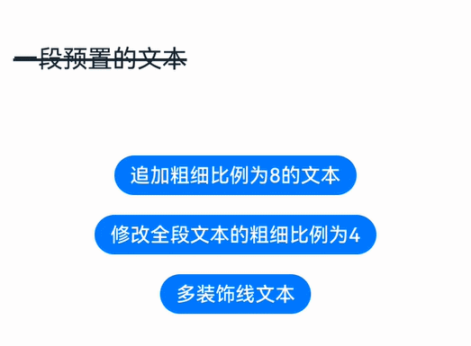


### 示例31（设置开启中西文自动间距）
从API version 20开始，该示例通过[enableAutoSpacing](#enableautospacing20)属性设置中西文自动间距。

```ts
@Entry
@Component
struct AutoSpacing {
  controller: RichEditorController = new RichEditorController();
  options: RichEditorOptions = { controller: this.controller };
  @State enableAutoSpace: boolean = false;

  build() {
    Column() {
      Column() {
        Row({ space: 2 }) {
          Button("插入中西文内容").onClick(() => {
            this.controller.addTextSpan("Add文本Span",
              {
                style:
                {
                  fontColor: Color.Orange,
                  fontSize: 20
                }
              });
          })
          Button("插入图片").onClick(() => {
            // $r('app.media.startIcon')需要替换为开发者所需的图像资源文件。
            this.controller.addImageSpan($r('app.media.startIcon'),
              {
                imageStyle:
                {
                  size: ["100px", "100px"]
                }
              });
          })
          Button("插入Symbol").onClick(() => {
            this.controller.addSymbolSpan($r("sys.symbol.ohos_trash"),
              {
                style:
                {
                  fontSize: 32
                }
              });
          })
        }
        .borderWidth(1)
        .borderColor(Color.Red)
        .justifyContent(FlexAlign.Center)
        .width("100%")
        .height("10%")

        Row({ space: 2 }) {
          Button("开启中西文自动间距").onClick(() => {
            this.enableAutoSpace = true;
          })
          Button("关闭中西文自动间距").onClick(() => {
            this.enableAutoSpace = false;
          })
        }
        .borderWidth(1)
        .borderColor(Color.Red)
        .justifyContent(FlexAlign.Center)
        .width("100%")
        .height("10%")
      }

      Column() {
        RichEditor(this.options)
          .onReady(() => {
            // $r('app.media.startIcon')需要替换为开发者所需的图像资源文件。
            this.controller.addImageSpan($r('app.media.startIcon'),
              {
                imageStyle:
                {
                  size: ["100px", "100px"]
                }
              });
            this.controller.addTextSpan("中西文Auto Spacing自动间距",
              {
                style:
                {
                  fontColor: Color.Orange,
                  fontSize: 20
                }
              });
            this.controller.addSymbolSpan($r("sys.symbol.ohos_trash"),
              {
                style:
                {
                  fontSize: 20
                }
              });
          })
          .enableAutoSpacing(this.enableAutoSpace)
          .borderWidth(1)
          .borderColor(Color.Green)
          .width("100%")
          .height("50%")
      }
    }
  }
}
```
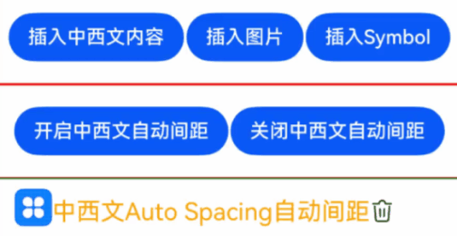

### 示例32（设置文本选择的AI菜单）
从API version 22开始，该示例通过[enableSelectedDataDetector](#enableselecteddatadetector22)，配置文本选择AI菜单功能。

```ts
@Entry
@Component
struct SelectedDataDetectorDemo {
  controller: RichEditorController = new RichEditorController();
  textSpanOptions: RichEditorTextSpanOptions = { style: { fontSize: 20 } };
  exampleText: string = '示例网址：www.example.com';

  build() {
    Column() {
      Row() {
        RichEditor({ controller: this.controller })
          .onReady(() => {
            this.controller.addTextSpan(this.exampleText, this.textSpanOptions);
          })
          .copyOptions(CopyOptions.LocalDevice)
          .enableSelectedDataDetector(true)
          .border({ width: 1, color: Color.Black })
          .height(300)
          .margin(10)
      }
    }
  }
}
```
<!--RP2--><!--RP2End-->

### 示例33（设置监听输入法绑定事件）
从API version 22开始，该示例通过[onWillAttachIME](#onwillattachime22)事件监听输入法绑定事件。

```ts
@Entry
@Component
struct SetOnWillAttachIME {
  controller: RichEditorController = new RichEditorController();
  options: RichEditorOptions = { controller: this.controller };
  @State message: string = "RichEditor未绑定输入法"

  build() {
    Column() {
      Text(this.message)
        .fontSize(24)
        .width("100%")
        .textAlign(TextAlign.Center)
      RichEditor(this.options)
        .onReady(() => {
          this.controller.addTextSpan("RichEditor组件",
            {
              style:
              {
                fontColor: Color.Orange,
                fontSize: 30
              }
            });
        })
        .onWillAttachIME((value:IMEClient) => {
          // 给输入法传递自定义消息
          const inputConfig: InputMethodExtraConfig = {
            customSettings: {
              component: 'RichEditor',
              id: 8 as number,
              isEnable: true
            }
          };
          value.setExtraConfig(inputConfig);
          this.message = "RichEditor已绑定输入法"
        })
        .borderWidth(1)
        .borderColor(Color.Green)
        .width("100%")
        .height("20%")
    }
    .height("100%")
    .justifyContent(FlexAlign.Center)
  }
}
```


### 示例34（删除输入框文本尾部字符）
从API version 23开始，该示例通过[deleteBackward](#deletebackward23)事件在编辑态用自定义键盘删除光标前字符。

```ts
@Entry
@Component
struct RichEditorExample {
  controller: RichEditorController = new RichEditorController();

  // 自定义键盘删除键
  @Builder
  CustomKeyboardBuilder() {
    Column() {
      Button('DELETE')
        .width(200)
        .height(60)
        .backgroundColor(Color.Blue)
        .fontColor(Color.White)
        .fontSize(16)
        .onClick(() => {
          // 调用deleteBackward接口删除字符
          this.controller.deleteBackward();
        })
    }
    .padding(10)
    .backgroundColor(Color.Gray)
  }

  build() {
    Column() {
      Blank()
        .height(400)
      RichEditor({ controller: this.controller })
        .customKeyboard(this.CustomKeyboardBuilder())
        .margin(10)
        .border({ width: 1 })
        .height(150)
        .borderWidth(1)
        .borderColor(Color.Blue)
        .width("100%")
        .onReady(() => {
          // 设置初始文本用于测试
          this.controller.addTextSpan('点击DELETE键测试删除功能', {
            style: {
              fontColor: Color.Black,
              fontSize: 16
            }
          });
        })
    }.margin(90)
  }
}
```


### 示例35（优化小语种文字显示）
该示例通过[includeFontPadding](#includefontpadding23)属性，在首行文字顶部和尾行文字底部添加文字内边距，同时通过[fallbackLineSpacing](#fallbacklinespacing23)属性实现行高自适应，基于文字实际高度动态调整。

从API version 23开始，新增includeFontPadding、fallbackLineSpacing属性。

```ts
@Entry
@Component
struct RichEditorExample {
  controller: RichEditorController = new RichEditorController();
  @State fallbackLineSpacing: boolean = true;
  @State includeFontPadding: boolean = true;

  build() {
    Column() {
      RichEditor({ controller: this.controller })
        .onReady(() => {
          this.controller.addTextSpan('བོད་ཀྱི་སྐད་ཡིག་ནི་བོད་མིའི་རྒྱུན་ལྡན་པའི་སྐད་ཡིག་དང་།\n འཇིག་རྟེན་གྱི་ཆོས་ལུགས་དང་རྒྱུན་ལྡན་པའི་ཆོས་ལུགས་ཀྱི་དོན་ཚན་གྱི་སྐད་ཡིག་རེད།\n',
            {
              style: {
                fontColor: Color.Black,
                fontSize: "30",
                lineHeight: 10
              },
              paragraphStyle: {
                textAlign: TextAlign.Start,
              }
            });
          this.controller.addTextSpan('བོད་ཀྱི་སྐད་ཡིག་ནི་བོད་མིའི་རྒྱུན་ལྡན་པའི་སྐད་ཡིག་དང་།\n འཇིག་རྟེན་གྱི་ཆོས་ལུགས་དང་རྒྱུན་ལྡན་པའི་ཆོས་ལུགས་ཀྱི་དོན་ཚན་གྱི་སྐད་ཡིག་རེད།',
            {
              style: {
                fontColor: Color.Black,
                fontSize: "30",
              },
              paragraphStyle: {
                textAlign: TextAlign.Start,
              }
            });
        })
        .width("100%")
        .height("35%")
        .border({ width: 1, radius: 5 })
        .draggable(false)
        .includeFontPadding(this.includeFontPadding)
        .fallbackLineSpacing(this.fallbackLineSpacing)
      Row() {
        Button('开启文字行间自适应')
          .onClick(() => {
            this.fallbackLineSpacing = true;
          })
          .width("45%")
          .height("10%")
          .margin({ right: 10 })
        Button('关闭文字行间自适应')
          .onClick(() => {
            this.fallbackLineSpacing = false;
          })
          .width("45%")
          .height("10%")
          .margin({ left: 5 })
      }
      .margin({ top: 20 })

      Row() {
        Button('开启段落首行尾行边距增高')
          .onClick(() => {
            this.includeFontPadding = true;
          })
          .width("45%")
          .height("10%")
          .margin({ right: 10 })
        Button('关闭段落首行尾行边距增高')
          .onClick(() => {
            this.includeFontPadding = false;
          })
          .width("45%")
          .height("10%")
          .margin({ left: 5 })
      }
      .margin({ top: 20 })
    }
  }
}
```


### 示例36（设置行首标点符号压缩和行尾标点符号悬挂）

本示例通过[compressLeadingPunctuation](#compressleadingpunctuation23)设置行首标点符号压缩，通过[punctuationOverflow](#punctuationoverflow)设置行尾标点符号悬挂。

文本自动换行后，剩余内容（含标点符号）需能放入上一行，标点符号悬挂才生效。

从API version 23开始，新增compressLeadingPunctuation接口。

从API版本26.0.0开始，新增punctuationOverflow接口。

```ts
@Entry
@Component
struct PunctuationDemo {
  controller: RichEditorController = new RichEditorController();
  textSpanOptions: RichEditorTextSpanOptions = { style: { fontSize: '20fp' } };
  @State compressLeadingPunctuation: boolean = false;
  @State punctuationOverflow: boolean = false;
  @State text: string = '「0123456789！\n『0123456789：\n（0123456789；\n《0123456789）\n〈0123456789】\n【0123456789、\n〖0123456789。\n〔0123456789﹑\n［0123456789〞\n｛0123456789';

  build() {
    Column() {
      RichEditor({ controller: this.controller })
        .onReady(() => {
          this.controller.addTextSpan(this.text, this.textSpanOptions);
        })
        .compressLeadingPunctuation(this.compressLeadingPunctuation)
        .punctuationOverflow(this.punctuationOverflow)
        .border({ width: 1, color: Color.Black })
        .align(Alignment.Center)
        .height('35%')
        .width('50%')

      Column() {
        Button('开启行首标点符号压缩').onClick(() => {
          this.compressLeadingPunctuation = true;
        }).margin(5)
        Button('关闭行首标点符号压缩').onClick(() => {
          this.compressLeadingPunctuation = false;
        }).margin(5)
        Button('开启行尾标点符号悬挂').onClick(() => {
          this.punctuationOverflow = true;
        }).margin(5)
        Button('关闭行尾标点符号悬挂').onClick(() => {
          this.punctuationOverflow = false;
        }).margin(5)
      }
    }.width('100%').padding(20)
  }
}
```


### 示例37（设置拖动预览样式）
该示例通过[selectedDragPreviewStyle](#selecteddragpreviewstyle23)接口设置拖动预览样式。

从API version 23开始，新增selectedDragPreviewStyle接口。

```ts
@Entry
@Component
struct RichEditorDemo {
  controller: RichEditorController = new RichEditorController();
  options: RichEditorOptions = { controller: this.controller };

  build() {
    Column({ space: 2 }) {
      RichEditor(this.options)
        .onReady(() => {
          this.controller.addTextSpan('RichEditor selectedDragPreviewStyle');
        })
        .borderWidth(1)
        .borderColor(Color.Green)
        .draggable(true)
        .selectedDragPreviewStyle({ color: Color.Gray })
        .width('100%')
        .height('20%')
    }
  }
}
```


### 示例38（设置单行模式）

该示例通过[singleLine](#singleline23)接口设置单行模式。

从API version 23开始，新增singleLine接口。

``` ts
@Entry
@Component
struct SingleLineDemo {
  controller: RichEditorController = new RichEditorController();
  textSpanOptions: RichEditorTextSpanOptions = { style: { fontSize: 30 } };
  exampleText: string = '这是一段示例文本\n这是一段示例文本\n这是一段示例文本';
  @State enableSingleLine: boolean = false;

  build() {
    Column() {
      Row() {
        RichEditor({ controller: this.controller })
          .onReady(() => {
            this.controller.addTextSpan(this.exampleText, this.textSpanOptions);
          })
          .singleLine(this.enableSingleLine)
          .border({ width: 1, color: Color.Black })
          .margin(10)
      }
      Row() {
        Button('切换单行模式').onClick((event: ClickEvent) => {
          this.enableSingleLine = true;
        }).margin(5)
        Button('切换多行模式').onClick((event: ClickEvent) => {
          this.enableSingleLine = false;
        }).margin(5)
      }
    }
  }
}
```


### 示例39（设置属性字符串样式的提示文本）

该示例通过[setStyledPlaceholder](#setstyledplaceholder24)接口设置属性字符串样式的提示文本。

从API version 24开始，新增setStyledPlaceholder接口。

``` ts
import { LengthMetrics } from '@kit.ArkUI';

@Entry
@Component
struct RichEditorExample {
  styledString: MutableStyledString = new MutableStyledString("Placeholder：文本",
    [
      {
        start: 0,
        length: 12,
        styledKey: StyledStringKey.FONT,
        styledValue: new TextStyle({
          fontColor: Color.Orange,
          fontSize: LengthMetrics.fp(24)
        })
      },
      {
        start: 12,
        length: 4,
        styledKey: StyledStringKey.FONT,
        styledValue: new TextStyle({
          fontColor: Color.Gray,
          fontSize: LengthMetrics.fp(20),
          fontWeight: FontWeight.Bold
        })
      },
      {
        start: 0,
        length: 1,
        styledKey: StyledStringKey.PARAGRAPH_STYLE,
        styledValue: new ParagraphStyle({
          textVerticalAlign: TextVerticalAlign.CENTER
        })
      }
    ]);
  imageStyledString = new MutableStyledString(new ImageAttachment(
    {
      // $r('app.media.startIcon')需要替换为开发者所需的图像资源文件。
      resourceValue: $r('app.media.startIcon'),
      size: { width: 50, height: 50 },
      verticalAlign: ImageSpanAlignment.BASELINE,
      objectFit: ImageFit.Fill
    } as ResourceImageAttachmentOptions
  ));

  controller: RichEditorController = new RichEditorController();

  aboutToAppear() {
    this.styledString.appendStyledString(this.imageStyledString);
    this.controller.setStyledPlaceholder(this.styledString);
  }

  build() {
    Column() {
      Text("RichEditor placeholder支持富文本样式")
        .fontSize(16)
        .fontWeight(FontWeight.Bold)
      RichEditor({ controller: this.controller })
        .width('80%')
        .height('20%')
        .margin(10)
        .borderWidth(1)
        .borderColor(Color.Blue)
    }
    .justifyContent(FlexAlign.Center)
    .width('100%')
    .height('70%')
  }
}
```


### 示例40（设置孤立字符不成行）

该示例通过[orphanCharOptimization](#orphancharoptimization)接口启用孤字优化，确保段落最后一行不出现孤字。

从API版本26.0.0开始，新增orphanCharOptimization接口。

``` ts
// xxx.ets
@Entry
@Component
struct RichEditorDemo {
  controller1: RichEditorController = new RichEditorController();
  controller2: RichEditorController = new RichEditorController();
  @State text: string = 'aaaaaaaaaaaaaaaaaaaaaaaaaaaaaaaaaaaaaaaaaaaaaaaaaaaaaaaaaaaaaaaaaaaaa文本';
  textSpanOptions: RichEditorTextSpanOptions = { style: { fontSize: 20 } };

  build() {
    Column({ space: 10 }) {
      Text('orphanCharOptimization: true')
        .fontSize(12).width('90%')
      RichEditor({ controller: this.controller1 })
        .onReady(() => {
          this.controller1.addTextSpan(this.text, this.textSpanOptions);
        })
        .orphanCharOptimization(true)
        .width(430)
        .borderWidth(1)

      Divider()

      Text('orphanCharOptimization: false')
        .fontSize(12).width('90%')

      RichEditor({ controller: this.controller2 })
        .onReady(() => {
          this.controller2.addTextSpan(this.text, this.textSpanOptions);
        })
        .orphanCharOptimization(false)
        .width(430)
        .borderWidth(1)
    }
    .width('100%')
    .height('100%')
  }
}
```


### 示例41（设置水平滚动）

本示例通过[horizontalScrolling](#horizontalscrolling)设置水平滚动。

从API版本26.0.0开始，新增horizontalScrolling接口。

``` ts
// xxx.ets
@Entry
@Component
struct HorizontalScrollDemo {
  controller: RichEditorController = new RichEditorController();
  textSpanOptions: RichEditorTextSpanOptions = { style: { fontSize: 30 } };
  exampleText: string = '这是一段超长示例文本\n';
  @State enableHorizontalScroll: boolean = false;

  build() {
    Column() {
      Row() {
        RichEditor({ controller: this.controller })
          .onReady(() => {
            this.controller.addTextSpan(this.exampleText, this.textSpanOptions);
          })
          .width('220vp')
          .height('160vp')
          .horizontalScrolling(this.enableHorizontalScroll)
          .border({ width: 1, color: Color.Black })
          .margin(10)
      }
      Row() {
        Button('启用水平滚动').onClick((event: ClickEvent) => {
          this.enableHorizontalScroll = true
        }).margin(5)
        Button('禁用水平滚动').onClick((event: ClickEvent) => {
          this.enableHorizontalScroll = false
        }).margin(5)
      }
    }
  }
}
```


### 示例42（设置文本着色器效果）

该示例通过[RichEditorParagraphStyle](#richeditorparagraphstyle11)中shaderStyle接口实现文本着色效果。

从API版本26.0.0开始，RichEditorParagraphStyle新增shaderStyle接口。

```ts
@Entry
@Component
struct ShaderColorStyle {
  @State message: string = 'Hello World';
  @State linearGradientOptions1: LinearGradientOptions =
    {
      angle: 45,
      colors: [[Color.Red, 0.0], [Color.Blue, 0.3], [Color.Green, 0.5]]
    };
  @State linearGradientOptions2: LinearGradientOptions =
    {
      direction: GradientDirection.LeftTop,
      colors: [[Color.Red, 0.0], [Color.Blue, 0.3], [Color.Green, 0.5]],
      repeating: true,
    };
  @State radialGradientOptions: RadialGradientOptions =
    {
      center: [50, 50],
      radius: 20,
      colors: [[Color.Red, 0.0], [Color.Blue, 0.3], [Color.Green, 0.5]],
      repeating: true,
    };
  @State colorShaderStyle: ColorShaderStyle =
    {
      color: Color.Blue
    };
  controller: RichEditorController = new RichEditorController();
  options: RichEditorOptions = { controller: this.controller };
  secondaryController: RichEditorController = new RichEditorController();
  secondaryOptions: RichEditorOptions = { controller: this.secondaryController };
  controller2: RichEditorController = new RichEditorController();
  options2: RichEditorOptions = { controller: this.controller2 };
  controller3: RichEditorController = new RichEditorController();
  options3: RichEditorOptions = { controller: this.controller3 };

  build() {
    Column({ space: 5 }) {
      Text('angle为45°的线性渐变').fontSize(18).width('90%')
        .margin({ top: 40, left: 40 })
      RichEditor(this.options)
        .width('80%')
        .margin({ top: 10 })
        .onReady(() => {
          this.controller.addTextSpan(this.message, { paragraphStyle: { shaderStyle: this.linearGradientOptions1 } });
          let spans: Array<RichEditorImageSpanResult | RichEditorTextSpanResult> =
            this.controller.getSpans();
          if (spans.length > 0 && (spans[0] as RichEditorTextSpanResult).paragraphStyle) {
            let shaderStyle: ShaderStyle | undefined =
              (spans[0] as RichEditorTextSpanResult).paragraphStyle?.shaderStyle;
            if (!shaderStyle) {
              return;
            }
            if (typeof (shaderStyle as ColorShaderStyle)['color'] != 'undefined') {
              console.info(' color shaderStyle : ' + JSON.stringify(shaderStyle));
            } else if (typeof (shaderStyle as RadialGradientStyle)['options']['center'] != 'undefined') {
              console.info(' radial gradient shaderStyle : ' + JSON.stringify(shaderStyle));
            } else if (typeof (shaderStyle as LinearGradientStyle)['options']['colors'] != 'undefined') {
              console.info(' linear gradient shaderStyle : ' + JSON.stringify(shaderStyle));
            }
          }
        }).borderWidth(1)
      Text('direction为LeftTop的线性渐变').fontSize(18).width('90%')
        .margin({ top: 40, left: 40 })
      RichEditor(this.secondaryOptions)
        .width('80%')
        .margin({ top: 10 })
        .borderWidth(1)
        .onReady(() => {
          this.secondaryController.addTextSpan(this.message,
            { paragraphStyle: { shaderStyle: this.linearGradientOptions2 } });
        })
      Text('径向渐变').fontSize(18).width('90%')
        .margin({ top: 40, left: 40 })
      RichEditor(this.options2)
        .width('80%')
        .margin({ top: 10 })
        .borderWidth(1)
        .onReady(() => {
          this.controller2.addTextSpan(this.message, { paragraphStyle: { shaderStyle: this.radialGradientOptions } });
        })
      Text('纯色').fontSize(18).width('90%')
        .margin({ top: 40, left: 40 })
      RichEditor(this.options3)
        .width('80%')
        .margin({ top: 10 })
        .borderWidth(1)
        .onReady(() => {
          this.controller3.addTextSpan(this.message, { paragraphStyle: { shaderStyle: this.colorShaderStyle } });
        })
    }
  }
}
```


### 示例43（将指定范围的文字滚动到可视区内）

本示例通过[scrollToVisible](#scrolltovisible)将可视区外的文本滚动到可视区内。

从API版本26.0.0开始，新增scrollToVisible接口。

```ts
@Entry
@Component
struct ScrollToVisibleDemo {
  controller: RichEditorController = new RichEditorController();
  textSpanOptions: RichEditorTextSpanOptions = { style: { fontSize: 30 } };
  exampleText: string = '第一段示例文本\n第二段示例文本\n第三段示例文本\n第四段示例文本' +
    '\n第五段示例文本\n第六段示例文本\n第七段示例文本\n第八段示例文本';

  build() {
    Column() {
      RichEditor({ controller: this.controller })
        .onReady(() => {
          this.controller.addTextSpan(this.exampleText, this.textSpanOptions);
        })
        .width('250vp')
        .height('150vp')
        .border({ width: 1, color: Color.Black })
        .margin(10)
      Button('滚动首段文本至可视区').onClick((event: ClickEvent) => {
        this.controller.scrollToVisible({start: 0, end: 7});
      }).margin(5)
      Button('滚动末段文本至可视区').onClick((event: ClickEvent) => {
        this.controller.scrollToVisible({start: 64, end: 71});
      }).margin(5)
    }
  }
}
```


