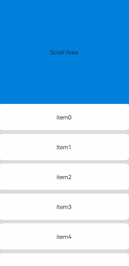

# ScrollBar

滚动条组件ScrollBar，用于配合可滚动组件使用，如[ArcList](ts-container-arclist.md)、[List](ts-container-list.md)、[Grid](ts-container-grid.md)、[Scroll](ts-container-scroll.md)、[WaterFlow](ts-container-waterflow.md)。

>  **说明：**
>
>  - 该组件从API version 8开始支持。后续版本如有新增内容，则采用上角标单独标记该内容的起始版本。
>  - ScrollBar主轴方向不设置大小时，采用父组件[布局约束](../js-apis-arkui-frameNode.md#layoutconstraint12)中的maxSize作为主轴方向大小。如果ScrollBar的父组件存在可滚动组件，如[ArcList](ts-container-arclist.md)、[List](ts-container-list.md)、[Grid](ts-container-grid.md)、[Scroll](ts-container-scroll.md)、[WaterFlow](ts-container-waterflow.md)，建议设置ScrollBar主轴方向大小，否则ScrollBar主轴方向大小可能为无穷大。


## 子组件

可以包含单个子组件。


## 接口

ScrollBar(value: ScrollBarOptions)

创建滚动条组件。

**原子化服务API：** 从API version 11开始，该接口支持在原子化服务中使用。

**系统能力：** SystemCapability.ArkUI.ArkUI.Full

**参数：**

| 参数名 | 类型 | 必填 | 说明 |
| -------- | -------- | -------- | -------- |
| value |  [ScrollBarOptions](#scrollbaroptions对象说明)| 是 | 滚动条组件参数。 |

## 属性

除支持[通用属性](ts-component-general-attributes.md)外，还支持以下属性：

### enableNestedScroll<sup>14+</sup>

enableNestedScroll(enabled: Optional\<boolean>)

设置滚动条是否嵌套滚动。

**原子化服务API：** 从API version 14开始，该接口支持在原子化服务中使用。

**系统能力：** SystemCapability.ArkUI.ArkUI.Full

**参数：** 

| 参数名 | 类型    | 必填 | 说明                                  |
| ------ | ------- | ---- | ------------------------------------- |
| enabled  | Optional\<boolean> | 是   | 是否执行嵌套滚动。设置为true执行嵌套滚动，设置为false不嵌套滚动。 <br/>默认值：false |

>  **说明：**
>
> 滚动条使能嵌套滚动时，滚动条的滚动偏移量会先发给绑定的内层滚动组件，内层滚动组件再根据设置的嵌套滚动优先级依次传递给外层父滚动组件。
>
> WaterFlow组件的布局模式为移动窗口式（SLIDING_WINDOW）时，不支持嵌套滚动。
>
> 设置嵌套滚动模式为PARALLEL时，父子组件同时滚动，需要开发者在onScrollFrameBegin中按照所需逻辑，自行设置父子组件滚动顺序。

## ScrollBarOptions对象说明

滚动条组件参数。

**原子化服务API：** 从API version 11开始，该接口支持在原子化服务中使用。

**系统能力：** SystemCapability.ArkUI.ArkUI.Full

| 名称 | 类型 | 必填 | 说明 |
| -------- | -------- | -------- | -------- |
| scroller | [Scroller](ts-container-scroll.md#scroller) | 是 | 可滚动组件的控制器。用于与可滚动组件进行绑定。 |
| direction | [ScrollBarDirection](#scrollbardirection枚举说明) | 否 | 滚动条的方向，控制可滚动组件对应方向的滚动。<br/>默认值：ScrollBarDirection.Vertical |
| state | [BarState](ts-appendix-enums.md#barstate) | 否 | 滚动条状态。<br/>默认值：BarState.Auto |

>  **说明：**
>
> ScrollBar组件负责定义可滚动区域的行为样式，ScrollBar的子节点负责定义滚动条的行为样式。
> 
> 滚动条组件与可滚动组件通过Scroller进行绑定，且只有当两者方向相同时，才能联动，ScrollBar与可滚动组件仅支持一对一绑定。
>
> 从API version 12开始，ScrollBar组件没有子节点时，支持显示默认样式的滚动条。

## ScrollBarDirection枚举说明

滚动条方向枚举。

**原子化服务API：** 从API version 11开始，该接口支持在原子化服务中使用。

**系统能力：** SystemCapability.ArkUI.ArkUI.Full

| 名称 | 说明 |
| -------- | -------- |
| Vertical | 纵向滚动条。 |
| Horizontal | 横向滚动条。 |


## 示例1（设置子节点）

该示例为ScrollBar组件有子节点时的滚动条样式。

```ts
// xxx.ets
@Entry
@Component
struct ScrollBarExample {
  private scroller: Scroller = new Scroller();
  private arr: number[] = [0, 1, 2, 3, 4, 5, 6, 7, 8, 9, 10, 11, 12, 13, 14, 15];

  build() {
    Column() {
      Stack({ alignContent: Alignment.End }) {
        Scroll(this.scroller) {
          Flex({ direction: FlexDirection.Column }) {
            ForEach(this.arr, (item: number) => {
              Row() {
                Text(item.toString())
                  .width('80%')
                  .height(60)
                  .backgroundColor('#3366CC')
                  .borderRadius(15)
                  .fontSize(16)
                  .textAlign(TextAlign.Center)
                  .margin({ top: 5 })
              }
            }, (item:number) => item.toString())
          }.margin({ right: 15 })
        }
        .width('90%')
        .scrollBar(BarState.Off)
        .scrollable(ScrollDirection.Vertical)
        ScrollBar({ scroller: this.scroller, direction: ScrollBarDirection.Vertical,state: BarState.Auto }) {
          Text()
            .width(20)
            .height(100)
            .borderRadius(10)
            .backgroundColor('#C0C0C0')
        }.width(20).backgroundColor('#ededed')
      }
    }
  }
}
```


## 示例2（不设置子节点）

该示例为ScrollBar组件没有子节点时的滚动条样式。

```ts
@Entry
@Component
struct ScrollBarExample {
  private scroller: Scroller = new Scroller();
  private arr: number[] = [0, 1, 2, 3, 4, 5, 6, 7, 8, 9, 10, 11, 12, 13, 14, 15];

  build() {
    Column() {
      Stack({ alignContent: Alignment.End }) {
        Scroll(this.scroller) {
          Flex({ direction: FlexDirection.Column }) {
            ForEach(this.arr, (item: number) => {
              Row() {
                Text(item.toString())
                  .width('80%')
                  .height(60)
                  .backgroundColor('#3366CC')
                  .borderRadius(15)
                  .fontSize(16)
                  .textAlign(TextAlign.Center)
                  .margin({ top: 5 })
              }
            }, (item:number) => item.toString())
          }.margin({ right: 15 })
        }
        .width('90%')
        .scrollBar(BarState.Off)
        .scrollable(ScrollDirection.Vertical)
        ScrollBar({ scroller: this.scroller, direction: ScrollBarDirection.Vertical,state: BarState.Auto })
      }
    }
  }
}
```


## 示例3（支持嵌套滚动）

该示例通过enableNestedScroll属性使ScrollBar组件支持嵌套滚动。
```ts
@Entry
@Component
struct StickyNestedScroll {
  listScroller: Scroller = new Scroller();
  @State array: number[] = [];

  @Styles
  listCard() {
    .backgroundColor(Color.White)
    .height(72)
    .width('100%')
    .borderRadius(12)
  }

  build() {
    Stack() {
      Scroll() {
        Column() {
          Text('Scroll Area')
            .width('100%')
            .height('40%')
            .backgroundColor('#0080DC')
            .textAlign(TextAlign.Center)
          List({ space: 10, scroller: this.listScroller }) {
            ForEach(this.array, (item: number) => {
              ListItem() {
                Text('item' + item)
                  .fontSize(16)
              }
              .listCard()
            }, (item: string) => item)
          }
          .scrollBar(BarState.Off)
          .nestedScroll({
            scrollForward: NestedScrollMode.PARENT_FIRST,
            scrollBackward: NestedScrollMode.SELF_FIRST
          })
          .height('100%')
        }
        .width('100%')
      }
      .edgeEffect(EdgeEffect.Spring)
      .backgroundColor('#DCDCDC')
      .scrollBar(BarState.Off)
      .width('100%')
      .height('100%')
      ScrollBar({ scroller: this.listScroller})
        .position({right:0})
        .enableNestedScroll(true)
    }
  }

  aboutToAppear() {
    for (let i = 0; i < 15; i++) {
      this.array.push(i);
    }
  }
}
```
