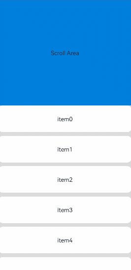

# ScrollBar

<!--Kit: ArkUI-->
<!--Subsystem: ArkUI-->
<!--Owner: @shengu_lancer; @rongShao-Z-->
<!--Designer: @yangcan18-->
<!--Tester: @leiyuqian-->
<!--Adviser: @Brilliantry_Rui-->

滚动条组件ScrollBar，用于配合可滚动组件使用，如[ArcList](ts-container-arclist.md)、[List](ts-container-list.md)、[Grid](ts-container-grid.md)、[Scroll](ts-container-scroll.md)、[WaterFlow](ts-container-waterflow.md)，提供可视化的滚动指示和控制能力，支持自定义滚动条样式。

>  **说明：**
>
>  - 该组件从API version 8开始支持。后续版本如有新增内容，则采用上角标单独标记该内容的起始版本。
>  - ScrollBar主轴方向不设置大小时，采用父组件[布局约束](../js-apis-arkui-frameNode.md#layoutconstraint12)中的maxSize作为主轴方向大小。如果ScrollBar的父组件存在可滚动组件，如[ArcList](ts-container-arclist.md)、[List](ts-container-list.md)、[Grid](ts-container-grid.md)、[Scroll](ts-container-scroll.md)、[WaterFlow](ts-container-waterflow.md)，建议设置ScrollBar主轴方向大小，否则ScrollBar主轴方向大小可能为无穷大。


## 子组件

可以包含单个子组件。


## 接口

ScrollBar(value: ScrollBarOptions)

创建滚动条组件。

**原子化服务API：** 从API version 11开始，该接口支持在原子化服务中使用。

**系统能力：** SystemCapability.ArkUI.ArkUI.Full

**参数：**

| 参数名 | 类型 | 必填 | 说明 |
| -------- | -------- | -------- | -------- |
| value |  [ScrollBarOptions](#scrollbaroptions对象说明)| 是 | 滚动条组件参数。 |

## 属性

除支持[通用属性](ts-component-general-attributes.md)外，还支持以下属性：

### enableNestedScroll<sup>14+</sup>

enableNestedScroll(enabled: Optional\<boolean>)

设置滚动条是否嵌套滚动。用于多层滚动容器、嵌套列表等需要通过滚动条拖动内层可滚动组件并联动父级滚动的场景，仅当ScrollBar通过Scroller与可滚动组件绑定时生效。

**原子化服务API：** 从API version 14开始，该接口支持在原子化服务中使用。

**模型约束：** 此接口仅可在Stage模型下使用。

**系统能力：** SystemCapability.ArkUI.ArkUI.Full

**参数：** 

| 参数名 | 类型    | 必填 | 说明                                  |
| ------ | ------- | ---- | ------------------------------------- |
| enabled  | [Optional](ts-universal-attributes-custom-property.md#optionalt)\<boolean> | 是   | 是否执行嵌套滚动。当需要在多层滚动容器之间传递滚动事件时设置为true；不需要嵌套滚动时设置为false。<br/>默认值：false |

>  **说明：**
>
> 滚动条使能嵌套滚动时，滚动条偏移量会先发送给绑定的内层滚动组件，内层滚动组件再根据设置的嵌套滚动优先级依次传递给外层父滚动组件。
>
> WaterFlow组件的布局模式为移动窗口式（[WaterFlowLayoutMode.SLIDING_WINDOW](ts-container-waterflow.md#waterflowlayoutmode12枚举说明)）时，不支持嵌套滚动。
>
> 设置嵌套滚动模式为[PARALLEL](ts-appendix-enums.md#nestedscrollmode10)时，父子组件同时滚动，需要开发者在[onScrollFrameBegin](ts-container-scroll.md#onscrollframebegin9)中按照所需逻辑，自行设置父子组件滚动顺序。

### scrollBarColor<sup>20+</sup>

scrollBarColor(color: Optional\<ColorMetrics\>)

设置滚动条的颜色，仅滚动条不放置子组件时生效。

**原子化服务API：** 从API version 20开始，该接口支持在原子化服务中使用。

**模型约束：** 此接口仅可在Stage模型下使用。

**系统能力：** SystemCapability.ArkUI.ArkUI.Full

**参数：** 

| 参数名 | 类型                                                         | 必填 | 说明           |
| ------ | ------------------------------------------------------------ | ---- | -------------- |
| color  |  [Optional](ts-universal-attributes-custom-property.md#optionalt)\<[ColorMetrics](../js-apis-arkui-graphics.md#colormetrics12)\> | 是   | 滚动条的颜色，仅滚动条不放置子组件时生效。<br/>默认值：ColorMetrics.numeric(0x66182431)   |

## ScrollBarOptions对象说明

滚动条组件参数。

>  **说明：**
>
>  - ScrollBar组件用于显示并控制所绑定可滚动组件的滚动位置。设置子组件时，该子组件作为自定义滚动条滑块，并随可滚动组件的滚动位置移动。
>  - 滚动条组件与可滚动组件通过Scroller进行绑定，且只有当两者方向相同时，才能联动。一个可滚动组件可以绑定多个ScrollBar组件，一个ScrollBar组件只能绑定一个可滚动组件。
>  - 从API version 12开始，ScrollBar组件没有子节点时，支持显示默认样式的滚动条。
>  - ScrollBar组件的显隐是通过BarState设置，组件内部会自动根据BarState设置调整opacity来控制显隐，因此ScrollBar组件设置[opacity](./ts-universal-attributes-opacity.md#opacity18)属性不生效。

**原子化服务API：** 从API version 11开始，该接口支持在原子化服务中使用。

**系统能力：** SystemCapability.ArkUI.ArkUI.Full

| 名称 | 类型 | 只读 | 可选 | 说明 |
| -------- | -------- | -------- | -- | -------- |
| scroller | [Scroller](ts-container-scroll.md#scroller) | 否 | 否 | 可滚动组件的控制器。用于与可滚动组件进行绑定，且仅当ScrollBar与可滚动组件方向相同时才能联动。一个可滚动组件可以绑定多个ScrollBar组件，一个ScrollBar组件只能绑定一个可滚动组件。 |
| direction | [ScrollBarDirection](#scrollbardirection枚举说明) | 否 | 是 | 滚动条的方向，控制可滚动组件对应方向的滚动。可滚动内容为纵向布局时设置为ScrollBarDirection.Vertical；可滚动内容为横向布局时设置为ScrollBarDirection.Horizontal。<br/>默认值：ScrollBarDirection.Vertical |
| state | [BarState](ts-appendix-enums.md#barstate) | 否 | 是 | 滚动条状态。BarState.Auto表示按需显示，BarState.On表示常驻显示，BarState.Off表示不显示。<br/>默认值：BarState.Auto |

## ScrollBarDirection枚举说明

滚动条方向枚举。

**原子化服务API：** 从API version 11开始，该接口支持在原子化服务中使用。

**系统能力：** SystemCapability.ArkUI.ArkUI.Full

| 名称 | 值 | 说明 |
| -------- | ---- | -------- |
| Vertical | 0 | 纵向滚动条。 |
| Horizontal | 1 | 横向滚动条。 |


## 示例1（设置子节点）

该示例为ScrollBar组件有子节点时的滚动条样式。

```ts
// xxx.ets
@Entry
@Component
struct ScrollBarExample {
  private scroller: Scroller = new Scroller();
  private arr: number[] = [0, 1, 2, 3, 4, 5, 6, 7, 8, 9, 10, 11, 12, 13, 14, 15];

  build() {
    Column() {
      Stack({ alignContent: Alignment.End }) {
        Scroll(this.scroller) {
          Flex({ direction: FlexDirection.Column }) {
            ForEach(this.arr, (item: number) => {
              Row() {
                Text(item.toString())
                  .width('80%')
                  .height(60)
                  .backgroundColor('#3366CC')
                  .borderRadius(15)
                  .fontSize(16)
                  .textAlign(TextAlign.Center)
                  .margin({ top: 5 })
              }
            }, (item: number) => item.toString())
          }.margin({ right: 15 })
        }
        .width('90%')
        .scrollBar(BarState.Off)
        .scrollable(ScrollDirection.Vertical)

        ScrollBar({ scroller: this.scroller, direction: ScrollBarDirection.Vertical, state: BarState.Auto }) {
          Text()
            .width(20)
            .height(100)
            .borderRadius(10)
            .backgroundColor('#C0C0C0')
        }.width(20).backgroundColor('#ededed')
      }
    }
  }
}
```


## 示例2（不设置子节点）

该示例为ScrollBar组件没有子节点时的滚动条样式。从API version 20开始，可通过[scrollBarColor](#scrollbarcolor20)设置滚动条颜色。

```ts
import { ColorMetrics } from '@kit.ArkUI'

@Entry
@Component
struct ScrollBarExample {
  private scroller: Scroller = new Scroller();
  private arr: number[] = [0, 1, 2, 3, 4, 5, 6, 7, 8, 9, 10, 11, 12, 13, 14, 15];
  @State scrollBarColor: ColorMetrics = ColorMetrics.rgba(24, 35, 48, 0.4);

  build() {
    Column() {
      Stack({ alignContent: Alignment.End }) {
        Scroll(this.scroller) {
          Flex({ direction: FlexDirection.Column }) {
            ForEach(this.arr, (item: number) => {
              Row() {
                Text(item.toString())
                  .width('80%')
                  .height(60)
                  .backgroundColor('#3366CC')
                  .borderRadius(15)
                  .fontSize(16)
                  .textAlign(TextAlign.Center)
                  .margin({ top: 5 })
              }
            }, (item: number) => item.toString())
          }.margin({ right: 15 })
        }
        .width('90%')
        .scrollBar(BarState.Off)
        .scrollable(ScrollDirection.Vertical)

        ScrollBar({ scroller: this.scroller, direction: ScrollBarDirection.Vertical, state: BarState.Auto })
          .scrollBarColor(this.scrollBarColor)
      }
    }
  }
}
```


## 示例3（支持嵌套滚动）

从API version 14开始，可通过[enableNestedScroll](#enablenestedscroll14)属性使ScrollBar组件支持嵌套滚动。本示例同时使用从API version 20开始支持的[scrollBarColor](#scrollbarcolor20)属性设置滚动条颜色。
```ts
import { ColorMetrics } from '@kit.ArkUI'

@Entry
@Component
struct StickyNestedScroll {
  listScroller: Scroller = new Scroller();
  @State array: number[] = [];
  @State scrollBarColor: ColorMetrics = ColorMetrics.rgba(24, 35, 48, 0.4);

  @Styles
  listCard() {
    .backgroundColor(Color.White)
    .height(72)
    .width('100%')
    .borderRadius(12)
  }

  build() {
    Stack() {
      Scroll() {
        Column() {
          Text('Scroll Area')
            .width('100%')
            .height('40%')
            .backgroundColor('#0080DC')
            .textAlign(TextAlign.Center)
          List({ space: 10, scroller: this.listScroller }) {
            ForEach(this.array, (item: number) => {
              ListItem() {
                Text('item' + item)
                  .fontSize(16)
              }
              .listCard()
            }, (item: number) => item.toString())
          }
          .scrollBar(BarState.Off)
          .nestedScroll({
            scrollForward: NestedScrollMode.PARENT_FIRST,
            scrollBackward: NestedScrollMode.SELF_FIRST
          })
          .height('100%')
        }
        .width('100%')
      }
      .edgeEffect(EdgeEffect.Spring)
      .backgroundColor('#DCDCDC')
      .scrollBar(BarState.Off)
      .width('100%')
      .height('100%')

      ScrollBar({ scroller: this.listScroller })
        .position({ right: 0 })
        .enableNestedScroll(true)
        .scrollBarColor(this.scrollBarColor)
    }
  }

  aboutToAppear() {
    for (let i = 0; i < 15; i++) {
      this.array.push(i);
    }
  }
}
```

