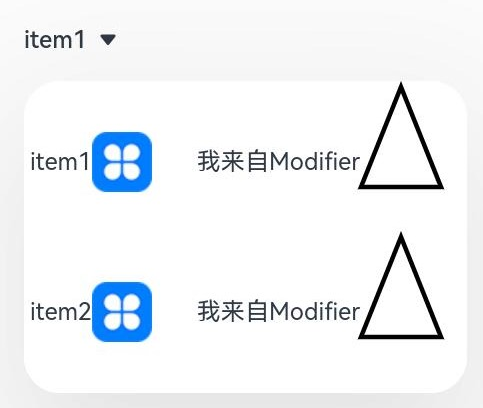

#  Select

提供下拉选择菜单，可以让用户在多个选项之间选择。

>  **说明：**
>
>  该组件从API Version 8开始支持。后续版本如有新增内容，则采用上角标单独标记该内容的起始版本。

## 子组件

无

## 接口

Select(options: Array\<[SelectOption](#selectoption对象说明)\>)

**元服务API：** 从API version 11开始，该接口支持在元服务中使用。

**参数：**

| 参数名  | 参数类型                                       | 必填 | 参数描述       |
| ------- | ---------------------------------------------- | ---- | -------------- |
| options | Array\<[SelectOption](#selectoption对象说明)\> | 是   | 设置下拉选项。 |

## SelectOption对象说明

**元服务API：** 从API version 11开始，该接口支持在元服务中使用。

| 参数名 | 参数类型                            | 必填 | 参数描述       |
| ------ | ----------------------------------- | ---- | -------------- |
| value  | [ResourceStr](ts-types.md#resourcestr) | 是   | 下拉选项内容。 |
| icon   | [ResourceStr](ts-types.md#resourcestr) | 否   | 下拉选项图片。 |

## 属性

除支持[通用属性](ts-universal-attributes-size.md)外，还支持以下属性：

### selected

selected(value: number | Resource)

设置下拉菜单初始选项的索引，第一项的索引为0。当不设置selected属性或设置异常值时，默认选择值为-1，菜单项不选中；当设置为undefined、null时，选中第一项。

从API version 10开始，该属性支持[$$](../../../quick-start/arkts-two-way-sync.md)双向绑定变量。

**元服务API：** 从API version 11开始，该接口支持在元服务中使用。

**系统能力：** SystemCapability.ArkUI.ArkUI.Full

**参数：** 

| 参数名 | 类型                                                         | 必填 | 说明                     |
| ------ | ------------------------------------------------------------ | ---- | ------------------------ |
| value  | number&nbsp;\|&nbsp;[Resource](ts-types.md#resource)<sup>11+</sup> | 是   | 下拉菜单初始选项的索引。 |

### value

value(value: ResourceStr)

设置下拉按钮本身的文本内容。当菜单选中时默认会替换为菜单项文本内容。

从API version 10开始，该参数支持[$$](../../../quick-start/arkts-two-way-sync.md)双向绑定变量。

**元服务API：** 从API version 11开始，该接口支持在元服务中使用。

**系统能力：** SystemCapability.ArkUI.ArkUI.Full

**参数：** 

| 参数名 | 类型                                                 | 必填 | 说明                     |
| ------ | ---------------------------------------------------- | ---- | ------------------------ |
| value  | [ResourceStr](ts-types.md#resourcestr)<sup>11+</sup> | 是   | 下拉按钮本身的文本内容。 |

### controlSize<sup>12+</sup>

controlSize(value: ControlSize)

设置Select组件的尺寸。

**系统能力：** SystemCapability.ArkUI.ArkUI.Full

**参数：** 

| 参数名 | 类型                                          | 必填 | 说明                                             |
| ------ | --------------------------------------------- | ---- | ------------------------------------------------ |
| value  | [ControlSize](ts-basic-components-button.md#controlsize11枚举说明)<sup>11+</sup> | 是   | Select组件的尺寸。<br/>默认值:ControlSize.NORMAL |

controlSize、width、height接口作用优先级：

   1）如果开发者只设置了width和height，当文字大小设置的是比较大的值的时候，文字超出组件大小，且以省略号方式显示；

   2）如果开发者只设置了controlSize，没有设置width和height，组件宽高自适应文字，文字不超出组件，并设置最小宽度minWidth和最小高度minHeight；

   3）如果controlSize、width、height接口都设置了，width和height设置的值生效，但如果width和height设置的值小于controlSize设置的最小宽度minWidth和最小高度minHeight，width和height设置的值不生效，宽高仍保持controlSize设置的最小宽度minWidth和最小高度minHeight。

### menuItemContentModifier<sup>12+</sup>

menuItemContentModifier(modifier: ContentModifier\<MenuItemConfiguration>)

定制Select下拉菜单项内容区的方法。

**系统能力：** SystemCapability.ArkUI.ArkUI.Full

**参数：**

| 参数名 | 类型                                          | 必填 | 说明                                             |
| ------ | --------------------------------------------- | ---- | ------------------------------------------------ |
| modifier  | [ContentModifier\<MenuItemConfiguration>](#menuitemconfiguration12对象说明) | 是   | 在Select组件上，定制下拉菜单项内容区的方法。<br/>modifier: 内容修改器，开发者需要自定义class实现ContentModifier接口。 |

### font

font(value: Font)

设置下拉按钮本身的文本样式。当size为0的时候，文本不显示，当size为负值的时候，文本的size按照默认值显示。

**元服务API：** 从API version 11开始，该接口支持在元服务中使用。

**系统能力：** SystemCapability.ArkUI.ArkUI.Full

**参数：** 

| 参数名 | 类型                     | 必填 | 说明                                                         |
| ------ | ------------------------ | ---- | ------------------------------------------------------------ |
| value  | [Font](ts-types.md#font) | 是   | 下拉按钮本身的文本样式。<br/>API Version 11及以前默认值：<br/>{<br/>size:&nbsp;'16fp',<br/>weight:&nbsp;FontWeight.Medium<br/>} <br/>从API Version 12以后，<br/>如果设置controlSize的值为：controlSize.SMALL，size默认值是'14fp'，否则还是'16fp'。|

### fontColor

fontColor(value: ResourceColor)

设置下拉按钮本身的文本颜色。

**元服务API：** 从API version 11开始，该接口支持在元服务中使用。

**系统能力：** SystemCapability.ArkUI.ArkUI.Full

**参数：** 

| 参数名 | 类型                                       | 必填 | 说明                                              |
| ------ | ------------------------------------------ | ---- | ------------------------------------------------- |
| value  | [ResourceColor](ts-types.md#resourcecolor) | 是   | 下拉按钮本身的文本颜色。<br/>默认值：'\#E5182431' |

### selectedOptionBgColor

selectedOptionBgColor(value: ResourceColor)

设置下拉菜单选中项的背景色。

**元服务API：** 从API version 11开始，该接口支持在元服务中使用。

**系统能力：** SystemCapability.ArkUI.ArkUI.Full

**参数：** 

| 参数名 | 类型                                       | 必填 | 说明                                              |
| ------ | ------------------------------------------ | ---- | ------------------------------------------------- |
| value  | [ResourceColor](ts-types.md#resourcecolor) | 是   | 下拉菜单选中项的背景色。<br/>默认值：'\#33007DFF' |

### selectedOptionFont

selectedOptionFont(value: Font)

设置下拉菜单选中项的文本样式。当size为0的时候，文本不显示，当size为负值的时候，文本的size按照默认值显示。

**元服务API：** 从API version 11开始，该接口支持在元服务中使用。

**系统能力：** SystemCapability.ArkUI.ArkUI.Full

**参数：** 

| 参数名 | 类型                     | 必填 | 说明                                                         |
| ------ | ------------------------ | ---- | ------------------------------------------------------------ |
| value  | [Font](ts-types.md#font) | 是   | 下拉菜单选中项的文本样式。<br/>默认值：<br/>{<br/>size:&nbsp;'16fp',<br/>weight:&nbsp;FontWeight.Regular<br/>} |

### selectedOptionFontColor

selectedOptionFontColor(value: ResourceColor)

设置下拉菜单选中项的文本颜色。

**元服务API：** 从API version 11开始，该接口支持在元服务中使用。

**系统能力：** SystemCapability.ArkUI.ArkUI.Full

**参数：** 

| 参数名 | 类型                                       | 必填 | 说明                                                |
| ------ | ------------------------------------------ | ---- | --------------------------------------------------- |
| value  | [ResourceColor](ts-types.md#resourcecolor) | 是   | 下拉菜单选中项的文本颜色。<br/>默认值：'\#ff007dff' |

### optionBgColor

optionBgColor(value: ResourceColor)

设置下拉菜单项的背景色。

**元服务API：** 从API version 11开始，该接口支持在元服务中使用。

**系统能力：** SystemCapability.ArkUI.ArkUI.Full

**参数：** 

| 参数名 | 类型                                       | 必填 | 说明                                          |
| ------ | ------------------------------------------ | ---- | --------------------------------------------- |
| value  | [ResourceColor](ts-types.md#resourcecolor) | 是   | 下拉菜单项的背景色。<br/>默认值：'\#ffffffff' |

### optionFont

optionFont(value: Font)

设置下拉菜单项的文本样式。当size为0的时候，文本不显示，当size为负值的时候，文本的size按照默认值显示。

**元服务API：** 从API version 11开始，该接口支持在元服务中使用。

**系统能力：** SystemCapability.ArkUI.ArkUI.Full

**参数：** 

| 参数名 | 类型                     | 必填 | 说明                                                         |
| ------ | ------------------------ | ---- | ------------------------------------------------------------ |
| value  | [Font](ts-types.md#font) | 是   | 下拉菜单项的文本样式。<br/>默认值：<br/>{<br/>size:&nbsp;'16fp',<br/>weight:&nbsp;FontWeight.Regular<br/>} |

### optionFontColor

optionFontColor(value: ResourceColor)

设置下拉菜单项的文本颜色。

**元服务API：** 从API version 11开始，该接口支持在元服务中使用。

**系统能力：** SystemCapability.ArkUI.ArkUI.Full

**参数：** 

| 参数名 | 类型                                       | 必填 | 说明                                            |
| ------ | ------------------------------------------ | ---- | ----------------------------------------------- |
| value  | [ResourceColor](ts-types.md#resourcecolor) | 是   | 下拉菜单项的文本颜色。<br/>默认值：'\#ff182431' |

### space<sup>10+</sup>

space(value: Length)

设置下拉菜单项的文本与箭头之间的间距。不支持设置百分比。设置为null、undefined，或者小于等于8的值，取默认值。

**元服务API：** 从API version 11开始，该接口支持在元服务中使用。

**系统能力：** SystemCapability.ArkUI.ArkUI.Full

**参数：** 

| 参数名 | 类型                         | 必填 | 说明                                             |
| ------ | ---------------------------- | ---- | ------------------------------------------------ |
| value  | [Length](ts-types.md#length) | 是   | 下拉菜单项的文本与箭头之间的间距。<br/>默认值：8 |

### arrowPosition<sup>10+</sup>

arrowPosition(value: ArrowPosition)

设置下拉菜单项的文本与箭头之间的对齐方式。

**元服务API：** 从API version 11开始，该接口支持在元服务中使用。

**系统能力：** SystemCapability.ArkUI.ArkUI.Full

**参数：** 

| 参数名 | 类型                                      | 必填 | 说明                                                         |
| ------ | ----------------------------------------- | ---- | ------------------------------------------------------------ |
| value  | [ArrowPosition](#arrowposition10枚举说明) | 是   | 下拉菜单项的文本与箭头之间的对齐方式。<br/>默认值：ArrowPosition.END |

### menuAlign<sup>10+</sup>

menuAlign(alignType: MenuAlignType, offset?: Offset)

设置下拉按钮与下拉菜单间的对齐方式。

**元服务API：** 从API version 11开始，该接口支持在元服务中使用。

**系统能力：** SystemCapability.ArkUI.ArkUI.Full

**参数：** 

| 参数名    | 类型                                      | 必填 | 说明                                                         |
| --------- | ----------------------------------------- | ---- | ------------------------------------------------------------ |
| alignType | [MenuAlignType](#menualigntype10枚举说明) | 是   | 对齐方式类型。<br/>默认值：MenuAlignType.START               |
| offset    | [Offset](ts-types.md#offset)              | 否   | 按照对齐类型对齐后，下拉菜单相对下拉按钮的偏移量。<br/> 默认值：{dx: 0, dy: 0} |

### optionWidth<sup>11+</sup>

optionWidth(value: Dimension | OptionWidthMode )

设置下拉菜单项的宽度，不支持设置百分比。OptionWidthMode类型为枚举类型，OptionWidthMode决定下拉菜单是否继承下拉按钮宽度。

当设置为undefined、null、负数时，属性不生效，菜单项宽度设为默认值，即菜单默认宽度为2栅格。

当菜单项设置宽度小于最小宽度56vp时，菜单宽度回弹至2栅格。正常值范围大于等于0。

**元服务API：** 从API version 12开始，该接口支持在元服务中使用。

**系统能力：** SystemCapability.ArkUI.ArkUI.Full

**参数：** 

| 参数名 | 类型                                                         | 必填 | 说明               |
| ------ | ------------------------------------------------------------ | ---- | ------------------ |
| value  | [Dimension](ts-types.md#dimension10)&nbsp;\|&nbsp;[OptionWidthMode](#optionwidthmode11枚举说明) | 是   | 下拉菜单项的宽度。 |

### optionHeight<sup>11+</sup>

optionHeight(value: Dimension)

设置下拉菜单显示的最大高度，不支持设置百分比。下拉菜单的默认最大高度是屏幕可用高度的80%，设置的菜单最大高度不能超过默认最大高度。

当设置为undefined、null、负数与零时，属性不生效，下拉菜单最大高度设为默认值，即下拉菜单最大高度默认值为屏幕可用高度的80%。

正常值范围大于0。如果下拉菜单所有选项的实际高度没有设定的高度大，下拉菜单的高度按实际高度显示。

**元服务API：** 从API version 12开始，该接口支持在元服务中使用。

**系统能力：** SystemCapability.ArkUI.ArkUI.Full

**参数：** 

| 参数名 | 类型                                 | 必填 | 说明                     |
| ------ | ------------------------------------ | ---- | ------------------------ |
| value  | [Dimension](ts-types.md#dimension10) | 是   | 下拉菜单显示的最大高度。 |

### menuBackgroundColor<sup>11+</sup>

menuBackgroundColor(value: ResourceColor)

设置下拉菜单的背景色。

**系统能力：** SystemCapability.ArkUI.ArkUI.Full

**参数：** 

| 参数名 | 类型                                       | 必填 | 说明                                             |
| ------ | ------------------------------------------ | ---- | ------------------------------------------------ |
| value  | [ResourceColor](ts-types.md#resourcecolor) | 是   | 下拉菜单的背景色。<br/>默认值：Color.Transparent |

### menuBackgroundBlurStyle<sup>11+</sup>

menuBackgroundBlurStyle(value: BlurStyle)

设置下拉菜单的背景模糊材质。

**系统能力：** SystemCapability.ArkUI.ArkUI.Full

**参数：** 

| 参数名 | 类型                                         | 必填 | 说明                                                         |
| ------ | -------------------------------------------- | ---- | ------------------------------------------------------------ |
| value  | [BlurStyle](ts-appendix-enums.md#blurstyle9) | 是   | 下拉菜单的背景模糊材质。<br/>默认值：BlurStyle.COMPONENT_ULTRA_THICK |

## OptionWidthMode<sup>11+</sup>枚举说明

**元服务API：** 从API version 12开始，该接口支持在元服务中使用。

| 名称        | 描述                           |
| ----------- | ------------------------------ |
| FIT_CONTENT | 设置该值时，下拉菜单宽度按默认2栅格显示。            |
| FIT_TRIGGER | 设置下拉菜单继承下拉按钮宽度。 |

## ArrowPosition<sup>10+</sup>枚举说明

**元服务API：** 从API version 11开始，该接口支持在元服务中使用。

| 名称                | 描述               |
| ------------------- | ------------------ |
| END<sup>10+</sup>   | 文字在前，箭头在后。 |
| START<sup>10+</sup> | 箭头在前，文字在后。 |

## MenuAlignType<sup>10+</sup>枚举说明

**元服务API：** 从API version 11开始，该接口支持在元服务中使用。

| 名称                | 描述               |
| ------------------- | ------------------ |
| START               | 按照语言方向起始端对齐。 |
| CENTER              | 居中对齐。 |
| END                 | 按照语言方向末端对齐。 |

## MenuItemConfiguration<sup>12+</sup>对象说明

| 参数名 | 类型                                         | 必填 | 说明                                                         |
| ------ | -------------------------------------------- | ---- | ------------------------------------------------------------ |
| value  | [ResourceStr](ts-types.md#resourcestr) | 是   | 下拉菜单项的文本内容。 |
| icon  | [ResourceStr](ts-types.md#resourcestr) | 否   | 下拉菜单项的图片内容。 |
| selected  | boolean | 是   | 下拉菜单项是否被选中。<br/>默认值：false |
| index  | number | 是   | 下拉菜单项的索引。 |
| triggerSelect  | (index: number, value: string) => void | 是   | 下拉菜单选中某一项的回调函数。<br/>index: 选中菜单项的索引。<br/>value: 选中菜单项的文本。<br/>说明: index会赋值给事件[onSelect](#onselect)回调中的索引参数； value会返回给Select组件显示，同时会赋值给事件[onSelect](#onselect)回调中的文本参数。 |

## 事件

### onSelect

onSelect(callback: (index: number, value:&nbsp;string) => void)

下拉菜单选中某一项的回调。

**元服务API：** 从API version 11开始，该接口支持在元服务中使用。

**系统能力：** SystemCapability.ArkUI.ArkUI.Full

**参数：** 

| 参数名 | 类型   | 必填 | 说明           |
| ------ | ------ | ---- | -------------- |
| index  | number | 是   | 选中项的索引。 |
| value  | string | 是   | 选中项的值。   |

##  示例1

```ts
// xxx.ets
@Entry
@Component
struct SelectExample {
  @State text: string = "TTTTT"
  @State index: number = 2
  @State space: number = 8
  @State arrowPosition: ArrowPosition = ArrowPosition.END
  build() {
    Column() {
      Select([{ value: 'aaa', icon: $r("app.media.selecticon") },
        { value: 'bbb', icon: $r("app.media.selecticon") },
        { value: 'ccc', icon: $r("app.media.selecticon") },
        { value: 'ddd', icon: $r("app.media.selecticon") }])
        .selected(this.index)
        .value(this.text)
        .font({ size: 16, weight: 500 })
        .fontColor('#182431')
        .selectedOptionFont({ size: 16, weight: 400 })
        .optionFont({ size: 16, weight: 400 })
        .space(this.space)
        .arrowPosition(this.arrowPosition)
        .menuAlign(MenuAlignType.START, {dx:0, dy:0})
        .optionWidth(200)
        .optionHeight(300)
        .onSelect((index:number, text?: string | undefined)=>{
          console.info('Select:' + index)
          this.index = index;
          if(text){
            this.text = text;
          }
        })
    }.width('100%')
  }
}
```


##  示例2
该示例实现了一个自定义下拉菜选项的Select组件。自定义下拉菜单选项样式为“文本 + 图片 + 空白间隔 + 文本 + 绘制三角形”，点击菜单选项后Select组件显示菜单选项的文本内容。

```ts
import { MenuItemModifier } from '@ohos.arkui.modifier'

class MyMenuItemContentModifier implements ContentModifier<MenuItemConfiguration> {
  modifierText: string = ""
  constructor(text: string) {
    this.modifierText = text;
  }
  applyContent(): WrappedBuilder<[MenuItemConfiguration]> {
    return wrapBuilder(MenuItemBuilder)
  }
}

@Builder
function MenuItemBuilder(configuration: MenuItemConfiguration) {
  Row() {
    Text(configuration.value)
    Blank()
    Image(configuration.icon).size({ width: 40, height: 40 })
    Blank(30)
    Text((configuration.contentModifier as MyMenuItemContentModifier).modifierText)
    Path()
      .width('100px')
      .height('150px')
      .commands('M40 0 L80 100 L0 100 Z')
      .fillOpacity(0)
      .stroke(Color.Black)
      .strokeWidth(3)
  }
  .onClick(() => {
    configuration.triggerSelect(configuration.index, configuration.value.valueOf().toString())
  })
}

@Entry
@Component
struct SelectExample {
  @State text: string = "有modifier"
  build() {
    Column() {
      Row() {
        Select([{ value: 'item1', icon: $r("app.media.icon") },
          { value: 'item2', icon: $r("app.media.icon") }])
          .value(this.text)
          .onSelect((index:number, text?: string)=>{
            console.info('Select index:' + index)
            console.info('Select text:' + text)
          })
          .menuItemContentModifier(new MyMenuItemContentModifier("我来自Modifier"))

      }.alignItems(VerticalAlign.Center).height("50%")
    }
  }
}
```

