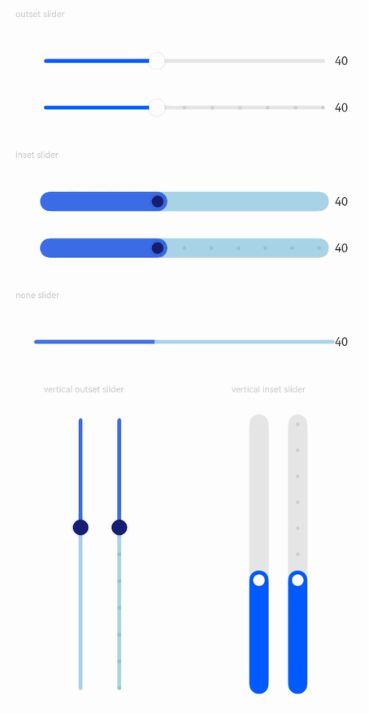
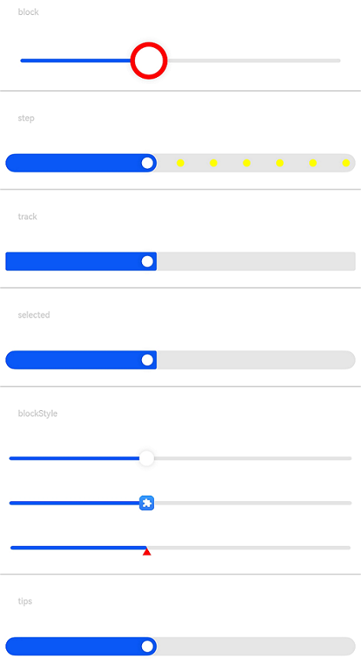
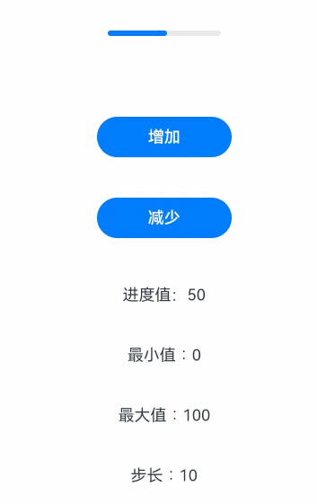

# Slider

滑动条组件，通常用于快速调节设置值，如音量调节、亮度调节等应用场景。

>  **说明：**
>
>  该组件从API Version 7开始支持。后续版本如有新增内容，则采用上角标单独标记该内容的起始版本。


## 子组件

无


## 接口

Slider(options?: SliderOptions)

**卡片能力：** 从API version 9开始，该接口支持在ArkTS卡片中使用。

**原子化服务API：** 从API version 11开始，该接口支持在原子化服务中使用。

**系统能力：** SystemCapability.ArkUI.ArkUI.Full

**参数：** 

| 参数名  | 类型                                    | 必填 | 说明               |
| ------- | --------------------------------------- | ---- | ------------------ |
| options | [SliderOptions](#slideroptions对象说明) | 否   | 配置滑动条的参数。 |

## SliderOptions对象说明

**卡片能力：** 从API version 9开始，该接口支持在ArkTS卡片中使用。

**原子化服务API：** 从API version 11开始，该接口支持在原子化服务中使用。

**系统能力：** SystemCapability.ArkUI.ArkUI.Full

| 名称 | 类型 | 必填 | 说明 |
| -------- | -------- | -------- | -------- |
| value | number | 否 | 当前进度值。<br/>默认值：与参数min的取值一致。<br />从API version 10开始，该参数支持[$$](../../../quick-start/arkts-two-way-sync.md)双向绑定变量。 |
| min | number | 否 | 设置最小值。<br/>默认值：0 |
| max | number | 否 | 设置最大值。<br/>默认值：100<br/>**说明：** <br/>min >= max异常情况，min取默认值0，max取默认值100。<br/>value不在[min, max]范围之内，取min或者max，靠近min取min，靠近max取max。 |
| step | number | 否 | 设置Slider滑动步长。<br/>默认值：1<br/>取值范围：[0.01, max - min]<br/>**说明：** <br/>若设置的step值小于0或大于max值时，则按默认值显示。 |
| style | [SliderStyle](#sliderstyle枚举说明) | 否 | 设置Slider的滑块与滑轨显示样式。<br/>默认值：SliderStyle.OutSet |
| direction<sup>8+</sup> | [Axis](ts-appendix-enums.md#axis) | 否 | 设置滑动条滑动方向为水平或竖直方向。<br/>默认值：Axis.Horizontal |
| reverse<sup>8+</sup> | boolean | 否 | 设置滑动条取值范围是否反向，横向Slider默认为从左往右滑动，竖向Slider默认为从上往下滑动。<br/>默认值：false |

## SliderStyle枚举说明

**系统能力：** SystemCapability.ArkUI.ArkUI.Full

| 名称 | 说明 |
| -------- | -------- |
| OutSet | 滑块在滑轨上。<br/>**卡片能力：** 从API version 9开始，该接口支持在ArkTS卡片中使用。<br/>**原子化服务API：** 从API version 11开始，该接口支持在原子化服务中使用。 |
| InSet | 滑块在滑轨内。<br/>**卡片能力：** 从API version 9开始，该接口支持在ArkTS卡片中使用。<br/>**原子化服务API：** 从API version 11开始，该接口支持在原子化服务中使用。 |
| NONE<sup>12+</sup> | 无滑块 <br/>**卡片能力：** 从API version 12开始，该接口支持在ArkTS卡片中使用。<br/>**原子化服务API：** 从API version 12开始，该接口支持在原子化服务中使用。 |

## 属性

支持除触摸热区以外的[通用属性](ts-universal-attributes-size.md)。

### blockColor

blockColor(value: ResourceColor)

设置滑块的颜色。

当滑块形状设置为SliderBlockType.DEFAULT时，blockColor可设置默认圆形滑块颜色。

当滑块形状设置为SliderBlockType.IMAGE时，滑块无填充，设置blockColor不生效。

当滑块形状设置为SliderBlockType.SHAPE时，blockColor可设置自定义形状的填充颜色。

**卡片能力：** 从API version 9开始，该接口支持在ArkTS卡片中使用。

**原子化服务API：** 从API version 11开始，该接口支持在原子化服务中使用。

**系统能力：** SystemCapability.ArkUI.ArkUI.Full

**参数：** 

| 参数名 | 类型                                       | 必填 | 说明                                |
| ------ | ------------------------------------------ | ---- | ----------------------------------- |
| value  | [ResourceColor](ts-types.md#resourcecolor) | 是   | 滑块的颜色。 <br/>默认值：`$r('sys.color.ohos_id_color_foreground_contrary')` |

### trackColor

trackColor(value: ResourceColor | LinearGradient)

设置滑轨的背景颜色。

从API version 12开始支持利用LinearGradient设置滑轨的渐变色。

**卡片能力：** 从API version 9开始，该接口支持在ArkTS卡片中使用。

**原子化服务API：** 从API version 11开始，该接口支持在原子化服务中使用。

**系统能力：** SystemCapability.ArkUI.ArkUI.Full

**参数：** 

| 参数名 | 类型                                                         | 必填 | 说明                                                         |
| ------ | ------------------------------------------------------------ | ---- | ------------------------------------------------------------ |
| value  | [ResourceColor](ts-types.md#resourcecolor)&nbsp;\|&nbsp;[LinearGradient<sup>12+</sup>](ts-basic-components-datapanel.md#lineargradient10) | 是   | 滑轨的背景颜色。<br/>**说明：** 设置渐变色时，若颜色断点颜色值为非法值或者渐变色断点为空时，渐变色不起效果。<br/>默认值：`$r('sys.color.ohos_id_color_component_normmal')`<br/>该接口中的LinearGradient类型不支持在原子化服务中使用。 |

### selectedColor

selectedColor(value: ResourceColor)

设置滑轨的已滑动部分颜色。

**卡片能力：** 从API version 9开始，该接口支持在ArkTS卡片中使用。

**原子化服务API：** 从API version 11开始，该接口支持在原子化服务中使用。

**系统能力：** SystemCapability.ArkUI.ArkUI.Full

**参数：** 

| 参数名 | 类型                                       | 必填 | 说明                                          |
| ------ | ------------------------------------------ | ---- | --------------------------------------------- |
| value  | [ResourceColor](ts-types.md#resourcecolor) | 是   | 滑轨的已滑动部分颜色。 <br/>默认值：`$r('sys.color.ohos_id_color_emphasize')` |

### showSteps

showSteps(value: boolean)

设置当前是否显示步长刻度值。

**卡片能力：** 从API version 9开始，该接口支持在ArkTS卡片中使用。

**原子化服务API：** 从API version 11开始，该接口支持在原子化服务中使用。

**系统能力：** SystemCapability.ArkUI.ArkUI.Full

**参数：** 

| 参数名 | 类型    | 必填 | 说明                                       |
| ------ | ------- | ---- | ------------------------------------------ |
| value  | boolean | 是   | 当前是否显示步长刻度值。<br/>默认值：false |

### showTips

showTips(value: boolean, content?: ResourceStr)

设置滑动时是否显示气泡提示。

当direction的值为Axis.Horizontal时，tip显示在滑块上方，如果上方空间不够，则在下方显示。值为Axis.Vertical时，tip显示在滑块左边，如果左边空间不够，则在右边显示。不设置周边边距或者周边边距比较小时，tip会被截断。

tip的绘制区域为Slider自身节点的overlay。

**卡片能力：** 从API version 9开始，该接口支持在ArkTS卡片中使用。

**原子化服务API：** 从API version 11开始，该接口支持在原子化服务中使用。

**系统能力：** SystemCapability.ArkUI.ArkUI.Full

**参数：** 

| 参数名                | 类型                                   | 必填 | 说明                                       |
| --------------------- | -------------------------------------- | ---- | ------------------------------------------ |
| value                 | boolean                                | 是   | 滑动时是否显示气泡提示。<br/>默认值：false |
| content<sup>10+</sup> | [ResourceStr](ts-types.md#resourcestr) | 否   | 气泡提示的文本内容，默认显示当前百分比。   |

### trackThickness<sup>8+</sup>

trackThickness(value: Length)

设置滑轨的粗细。设置为小于等于0的值时，取默认值。

为保证滑块和滑轨的[SliderStyle](#sliderstyle枚举说明)样式，[blockSize](#blocksize10)跟随trackThickness同比例增减。

当style为[SliderStyle](#sliderstyle枚举说明).OutSet时，trackThickness ：[blockSize](#blocksize10) = 1 ：4，当style为[SliderStyle](#sliderstyle枚举说明).InSet时，trackThickness ：[blockSize](#blocksize10) = 5 ：3。

在变更trackThickness过程中，若trackThickness的大小或者[blockSize](#blocksize10)的大小超过slider组件的width或者height([SliderStyle](#sliderstyle枚举说明).OutSet时可能trackThickness没超过，但是[blockSize](#blocksize10)超过了)，取默认值。

**卡片能力：** 从API version 9开始，该接口支持在ArkTS卡片中使用。

**原子化服务API：** 从API version 11开始，该接口支持在原子化服务中使用。

**系统能力：** SystemCapability.ArkUI.ArkUI.Full

**参数：** 

| 参数名 | 类型                         | 必填 | 说明                                                         |
| ------ | ---------------------------- | ---- | ------------------------------------------------------------ |
| value  | [Length](ts-types.md#length) | 是   | 滑轨的粗细。<br/>默认值：当参数style的值设置[SliderStyle](#sliderstyle枚举说明).OutSet 时为 4.0vp，[SliderStyle](#sliderstyle枚举说明).InSet时为20.0vp。 |

### blockBorderColor<sup>10+</sup>

blockBorderColor(value: ResourceColor)

设置滑块描边颜色。

当滑块形状设置为SliderBlockType.DEFAULT时，blockBorderColor可设置默认圆形滑块描边颜色。

当滑块形状设置为SliderBlockType.IMAGE时，滑块无描边，设置blockBorderColor不生效。

当滑块形状设置为SliderBlockType.SHAPE时，blockBorderColor可设置自定义形状中线的颜色。

**原子化服务API：** 从API version 11开始，该接口支持在原子化服务中使用。

**系统能力：** SystemCapability.ArkUI.ArkUI.Full

**参数：** 

| 参数名 | 类型                                       | 必填 | 说明                                   |
| ------ | ------------------------------------------ | ---- | -------------------------------------- |
| value  | [ResourceColor](ts-types.md#resourcecolor) | 是   | 滑块描边颜色。<br/>默认值：'#00000000' |

### blockBorderWidth<sup>10+</sup>

blockBorderWidth(value: Length)

设置滑块描边粗细。

当滑块形状设置为SliderBlockType.DEFAULT时，blockBorderWidth可设置默认圆形滑块描边粗细。

当滑块形状设置为SliderBlockType.IMAGE时，滑块无描边，设置blockBorderWidth不生效。

当滑块形状设置为SliderBlockType.SHAPE时，blockBorderWidth可设置自定义形状中线的粗细。

**原子化服务API：** 从API version 11开始，该接口支持在原子化服务中使用。

**系统能力：** SystemCapability.ArkUI.ArkUI.Full

**参数：** 

| 参数名 | 类型                         | 必填 | 说明           |
| ------ | ---------------------------- | ---- | -------------- |
| value  | [Length](ts-types.md#length) | 是   | 滑块描边粗细。 |

### stepColor<sup>10+</sup>

stepColor(value: ResourceColor)

设置刻度颜色。

**原子化服务API：** 从API version 11开始，该接口支持在原子化服务中使用。

**系统能力：** SystemCapability.ArkUI.ArkUI.Full

**参数：** 

| 参数名 | 类型                                       | 必填 | 说明                               |
| ------ | ------------------------------------------ | ---- | ---------------------------------- |
| value  | [ResourceColor](ts-types.md#resourcecolor) | 是   | 刻度颜色。<br/>默认值：<br/>`$r('sys.color.ohos_id_color_foreground')`混合<br/>`$r('sys.color.ohos_id_alpha_normal_bg')`透明度的颜色 |

### trackBorderRadius<sup>10+</sup>

trackBorderRadius(value: Length)

设置底板圆角半径。

**原子化服务API：** 从API version 11开始，该接口支持在原子化服务中使用。

**系统能力：** SystemCapability.ArkUI.ArkUI.Full

**参数：** 

| 参数名 | 类型                         | 必填 | 说明                             |
| ------ | ---------------------------- | ---- | -------------------------------- |
| value  | [Length](ts-types.md#length) | 是   | 底板圆角半径。<br/>默认值：<br/>style值为SliderStyle.OutSet默认值为'2vp'<br/>style值为SliderStyle.InSet默认值为'10vp'。 |

### selectedBorderRadius<sup>12+</sup>

selectedBorderRadius(value: Dimension)

设置已滑动部分（高亮）圆角半径。

**原子化服务API：** 从API version 12开始，该接口支持在原子化服务中使用。

**系统能力：** SystemCapability.ArkUI.ArkUI.Full

**参数：** 

| 参数名 | 类型                         | 必填 | 说明                             |
| ------ | ---------------------------- | ---- | -------------------------------- |
| value  | [Dimension](ts-types.md#dimension10)| 是   | 已选择部分圆角半径。<br/>默认值：style值为SliderStyle.InSet或SliderStyle.OutSet时，跟随底板圆角；style值为SliderStyle.NONE时，为0。|

### blockSize<sup>10+</sup>

blockSize(value: SizeOptions)

设置滑块大小。

当滑块形状设置为SliderBlockType.DEFAULT时，取宽高的最小值作为圆形半径。

当滑块形状设置为SliderBlockType.IMAGE时，用于设置图片的尺寸大小，图片采用ObjectFit.Cover策略进行缩放。

当滑块形状设置为SliderBlockType.SHAPE时，用于设置自定义形状的大小，自定义形状也会采用ObjectFit.Cover策略进行缩放。

**原子化服务API：** 从API version 11开始，该接口支持在原子化服务中使用。

**系统能力：** SystemCapability.ArkUI.ArkUI.Full

**参数：** 

| 参数名 | 类型                                   | 必填 | 说明                                                         |
| ------ | -------------------------------------- | ---- | ------------------------------------------------------------ |
| value  | [SizeOptions](ts-types.md#sizeoptions) | 是   | 滑块大小。<br/>默认值：当参数style的值设置为[SliderStyle](#sliderstyle枚举说明).OutSet时为{width: 16, height: 16}，当参数style的值设置为[SliderStyle](#sliderstyle枚举说明).InSet时为{width: 12, height: 12}，当参数style的值设置为[SliderStyle](#sliderstyle枚举说明).NONE时为，此字段不生效。<br/>当设置的blockSize的宽高值不相等时，取较小值的尺寸，当设置的宽高值中有一个或两个都小于等于0的时候，取默认值。 |

### blockStyle<sup>10+</sup>

blockStyle(value: SliderBlockStyle)

设置滑块形状参数。

**原子化服务API：** 从API version 11开始，该接口支持在原子化服务中使用。

**系统能力：** SystemCapability.ArkUI.ArkUI.Full

**参数：** 

| 参数名 | 类型                                            | 必填 | 说明                                                         |
| ------ | ----------------------------------------------- | ---- | ------------------------------------------------------------ |
| value  | [SliderBlockStyle](#sliderblockstyle10对象说明) | 是   | 滑块形状参数。<br/>默认值：SliderBlockType.DEFAULT，使用圆形滑块。 |

### stepSize<sup>10+</sup>

stepSize(value: Length)

设置刻度大小（直径）。当值为0时，刻度点不显示，当值小于0时，取默认值。

**原子化服务API：** 从API version 11开始，该接口支持在原子化服务中使用。

**系统能力：** SystemCapability.ArkUI.ArkUI.Full

**参数：** 

| 参数名 | 类型                         | 必填 | 说明                                  |
| ------ | ---------------------------- | ---- | ------------------------------------- |
| value  | [Length](ts-types.md#length) | 是   | 刻度大小（直径）。 <br/>默认值：'4vp'<br/>取值范围：[0, trackThickness) |

### minLabel<sup>(deprecated)</sup>

minLabel(value: string)

设置最小值。

从API Version 9开始废弃，使用min替代。

**系统能力：** SystemCapability.ArkUI.ArkUI.Full

**参数：** 

| 参数名 | 类型   | 必填 | 说明     |
| ------ | ------ | ---- | -------- |
| value  | string | 是   | 最小值。 |

### maxLabel<sup>(deprecated)</sup>

maxLabel(value: string)

设置最大值。

从API Version 9开始废弃，使用max替代。

**系统能力：** SystemCapability.ArkUI.ArkUI.Full

**参数：** 

| 参数名 | 类型   | 必填 | 说明     |
| ------ | ------ | ---- | -------- |
| value  | string | 是   | 最大值。 |

>  **说明：** 
>
>  - Slider无默认padding。
>  - 当Slider为水平滑动条时，Slider默认高度为40vp，宽度为父容器的宽度，滑动条居中显示，左右间距为分别为10vp，若设置padding，padding不会覆盖左右间距。
>  - 当Slider为竖直滑动条时，Slider默认宽度为40vp，高度为父容器的高度，滑动条居中显示，上下间距为分别为6vp，若设置padding，padding不会覆盖上下间距。

### sliderInteractionMode<sup>12+</sup>

sliderInteractionMode(value: SliderInteraction)

设置用户与滑动条组件交互方式。

**原子化服务API：** 从API version 12开始，该接口支持在原子化服务中使用。

**系统能力：** SystemCapability.ArkUI.ArkUI.Full

**参数：**

| 参数名 | 类型                                              | 必填 | 说明                                                         |
| ------ | ------------------------------------------------- | ---- | ------------------------------------------------------------ |
| value  | [SliderInteraction](#sliderinteraction12枚举说明) | 是   | 用户与滑动条组件交互方式。 <br /> 默认值：SliderInteraction.SLIDE_AND_CLICK。 |

### minResponsiveDistance<sup>12+</sup>

minResponsiveDistance(value: number)

设置滑动响应的最小距离。

**原子化服务API：** 从API version 12开始，该接口支持在原子化服务中使用。

**系统能力：** SystemCapability.ArkUI.ArkUI.Full

**参数：**

| 参数名 | 类型    | 必填 | 说明                                       |
| ------ | ------- | ---- | ------------------------------------------ |
| value  | number | 是   | 设置滑动响应的最小距离，滑动超过此距离后才响应使滑块滑动。<br/>**说明：** <br/>单位与参数min和max一致。<br/>当value小于0、大于MAX-MIN或非法值时，取默认值。<br/>默认值：0。 |

### contentModifier<sup>12+</sup>

contentModifier(modifier: ContentModifier\<SliderConfiguration>)

定制Slider内容区的方法。

**原子化服务API：** 从API version 12开始，该接口支持在原子化服务中使用。

**系统能力：** SystemCapability.ArkUI.ArkUI.Full

**参数：**

| 参数名 | 类型                                          | 必填 | 说明                                             |
| ------ | --------------------------------------------- | ---- | ------------------------------------------------ |
| modifier  | [ContentModifier\<SliderConfiguration>](#sliderconfiguration12对象说明) | 是   | 在Slider组件上，定制内容区的方法。<br/>modifier: 内容修改器，开发者需要自定义class实现ContentModifier接口。 |

>  **说明：**
>
>  - 如果设置了contentModifier，则在自定义区域内点击和手势滑动均不可触发原slider组件的onChange事件。
>  - 仅当调用triggerChange函数且传递正确的参数值时才可以触发原slider组件的onChange事件。

### slideRange<sup>12+</sup>

slideRange(value: SlideRange)

设置有效滑动区间。

**原子化服务API：** 从API version 12开始，该接口支持在原子化服务中使用。

**系统能力：** SystemCapability.ArkUI.ArkUI.Full

**参数：**

| 参数名 | 类型                                | 必填 | 说明             |
| ------ | ----------------------------------- | ---- | ---------------- |
| value  | [SlideRange](#sliderange12对象说明) | 是   | 设置有效滑动区间 |

## SliderBlockStyle<sup>10+</sup>对象说明

Slider组件滑块形状参数。

**原子化服务API：** 从API version 11开始，该接口支持在原子化服务中使用。

**系统能力：** SystemCapability.ArkUI.ArkUI.Full

| 名称  | 类型                                                         | 必填 | 说明                                                         |
| ----- | ------------------------------------------------------------ | ---- | ------------------------------------------------------------ |
| type  | [SliderBlockType](#sliderblocktype10枚举说明)                | 是   | 设置滑块形状。<br/>默认值：SliderBlockType.DEFAULT，使用圆形滑块。 |
| image | [ResourceStr](ts-types.md#resourcestr)                       | 否   | 设置滑块图片资源。<br />图片显示区域大小由blockSize属性控制，请勿输入尺寸过大的图片。 |
| shape | [Circle](ts-drawing-components-circle.md)&nbsp;\|&nbsp;[Ellipse](ts-drawing-components-ellipse.md)&nbsp;\|&nbsp;[Path](ts-drawing-components-path.md)&nbsp;\|&nbsp;[Rect](ts-drawing-components-rect.md)&nbsp; | 否   | 设置滑块使用的自定义形状。                                   |

## SliderBlockType<sup>10+</sup>枚举说明

Slider组件滑块形状枚举。

**原子化服务API：** 从API version 11开始，该接口支持在原子化服务中使用。

**系统能力：** SystemCapability.ArkUI.ArkUI.Full

| 名称    | 说明                 |
| ------- | ---------------------- |
| DEFAULT | 使用默认滑块（圆形）。   |
| IMAGE   | 使用图片资源作为滑块。   |
| SHAPE   | 使用自定义形状作为滑块。 |

## SliderInteraction<sup>12+</sup>枚举说明

用户与滑动条组件交互方式

**原子化服务API：** 从API version 12开始，该接口支持在原子化服务中使用。

**系统能力：** SystemCapability.ArkUI.ArkUI.Full

| 名称     | 说明                          |
| ------ | ----------------------------- |
| SLIDE_AND_CLICK | 用户可拖拽滑块或者点击滑轨使滑块移动，鼠标或手指按下即发生移动。|
| SLIDE_ONLY | 不允许用户通过点击滑轨使滑块移动。|
| SLIDE_AND_CLICK_UP | 用户可拖拽滑块或者点击滑轨使滑块移动，鼠标或手指抬起时，若与屏幕按压位置一致，则触发移动。|

## SlideRange<sup>12+</sup>对象说明

定义SlideRange中使用的回调类型。

**原子化服务API：** 从API version 12开始，该接口支持在原子化服务中使用。

**系统能力：** SystemCapability.ArkUI.ArkUI.Full

| 名称 | 类型     | 必填 | 说明           |
|----|--------| ---- |--------------|
| from | number | 否 | 设置有效滑动区间的开始。 |
| to | number | 否 | 设置有效滑动区间的结束。 |

>  **说明：**
>
>  - 当前仅当MIN<=from<=to<=MAX时该接口生效(MIN和MAX不依赖于其设置的值, 而取决于其实际生效的值)。
>  - 可只设置from或者to, 也可以同时设置from和to。
>  - 当接口生效, 设置的from处于紧邻的step整数倍的值之间, 则from实际取左区间step整数倍的那个值或者MIN作为修正后的值。
>  - 当接口生效, 设置的to处于紧邻的step整数倍的值之间, 则to实际取右区间step整数倍的那个值或者MAX作为修正后的值。
>  - 在from和to取修正值后, 当value是undefined或null时, 其取值与from一致; 当value是数值型, 且value <= from, 则取from; value > to, 则取to。

## 事件

支持[通用事件](ts-universal-events-click.md)外，还支持以下事件：

### onChange

onChange(callback:&nbsp;(value:&nbsp;number,&nbsp;mode:&nbsp;SliderChangeMode)&nbsp;=&gt;&nbsp;void)

Slider拖动或点击时触发事件回调。

Begin和End状态当手势点击时都会触发，Moving和Click状态当value值发生变化时触发。

当连贯动作为拖动动作时，不触发Click状态。

**卡片能力：** 从API version 9开始，该接口支持在ArkTS卡片中使用。

**原子化服务API：** 从API version 11开始，该接口支持在原子化服务中使用。

**系统能力：** SystemCapability.ArkUI.ArkUI.Full

**参数：** 

| 参数名 | 类型                                          | 必填 | 说明                                                         |
| ------ | --------------------------------------------- | ---- | ------------------------------------------------------------ |
| value  | number                                        | 是   | 当前滑动进度值，变化范围为对应步长steps数组。若返回值有小数，可使用number.toFixed()方法将数据处理为预期的精度。 |
| mode   | [SliderChangeMode](#sliderchangemode枚举说明) | 是   | 事件触发的相关状态值。                                       |

## SliderChangeMode枚举说明

**卡片能力：** 从API version 9开始，该接口支持在ArkTS卡片中使用。

**原子化服务API：** 从API version 11开始，该接口支持在原子化服务中使用。

**系统能力：** SystemCapability.ArkUI.ArkUI.Full

| 名称 | 值 | 说明 |
| -------- | -------- | -------- |
| Begin | 0 | 手势/鼠标接触或者按下滑块。 |
| Moving | 1 | 正在拖动滑块过程中。 |
| End | 2 | 手势/鼠标离开滑块。<br/>**说明：** <br/>异常值恢复成默认值时触发，即value设置小于min或大于max。 |
| Click<sup>8+</sup> | 3    | 点击滑动条使滑块位置移动。 |

## SliderConfiguration<sup>12+</sup>对象说明

开发者需要自定义class实现ContentModifier接口。

**原子化服务API：** 从API version 12开始，该接口支持在原子化服务中使用。

**系统能力：** SystemCapability.ArkUI.ArkUI.Full

| 名称  | 类型    | 只读  | 可选  | 说明              |
| ------ | ------ | ---------------- | ---------------- | ---------------- |
| value | number | 否 | 否 | 当前进度值。 |
| min | number | 否 | 否 | 最小值。 |
| max | number | 否 | 否 | 最大值。 |
| step | number | 否 | 否 | Slider滑动步长。 |
| triggerChange | [SliderTriggerChangeCallback](#slidertriggerchangecallback12对象说明) | 否 | 否 | 触发Slider变化。 |

## SliderTriggerChangeCallback<sup>12+</sup>对象说明

type SliderTriggerChangeCallback = (value: number, mode: SliderChangeMode) => void

定义SliderConfiguration中使用的回调类型。

**原子化服务API：** 从API version 12开始，该接口支持在原子化服务中使用。

**系统能力：** SystemCapability.ArkUI.ArkUI.Full

**参数：** 

| 参数名 | 类型    | 只读 | 可选 | 说明              |
| ------ | ------ | ---- | ---------------- | ---------------- |
| value | number | 否 | 否 | 设置当前的进度值。 |
| mode | [SliderChangeMode](#sliderchangemode枚举说明) | 否 | 否 | 设置事件触发的相关状态值。 |

## 示例

### 示例1

```ts
// xxx.ets
@Entry
@Component
struct SliderExample {
  @State outSetValueOne: number = 40
  @State inSetValueOne: number = 40
  @State noneValueOne: number = 40
  @State outSetValueTwo: number = 40
  @State inSetValueTwo: number = 40
  @State vOutSetValueOne: number = 40
  @State vInSetValueOne: number = 40
  @State vOutSetValueTwo: number = 40
  @State vInSetValueTwo: number = 40

  build() {
    Column({ space: 8 }) {
      Text('outset slider').fontSize(9).fontColor(0xCCCCCC).width('90%').margin(15)
      Row() {
        Slider({
          value: this.outSetValueOne,
          min: 0,
          max: 100,
          style: SliderStyle.OutSet
        })
          .showTips(true)
          .onChange((value: number, mode: SliderChangeMode) => {
            this.outSetValueOne = value
            console.info('value:' + value + 'mode:' + mode.toString())
          })
        // toFixed(0)将滑动条返回值处理为整数精度
        Text(this.outSetValueOne.toFixed(0)).fontSize(12)
      }
      .width('80%')
      Row() {
        Slider({
          value: this.outSetValueTwo,
          step: 10,
          style: SliderStyle.OutSet
        })
          .showSteps(true)
          .onChange((value: number, mode: SliderChangeMode) => {
            this.outSetValueTwo = value
            console.info('value:' + value + 'mode:' + mode.toString())
          })
        Text(this.outSetValueTwo.toFixed(0)).fontSize(12)
      }
      .width('80%')

      Text('inset slider').fontSize(9).fontColor(0xCCCCCC).width('90%').margin(15)
      Row() {
        Slider({
          value: this.inSetValueOne,
          min: 0,
          max: 100,
          style: SliderStyle.InSet
        })
          .blockColor('#191970')
          .trackColor('#ADD8E6')
          .selectedColor('#4169E1')
          .showTips(true)
          .onChange((value: number, mode: SliderChangeMode) => {
            this.inSetValueOne = value
            console.info('value:' + value + 'mode:' + mode.toString())
          })
        Text(this.inSetValueOne.toFixed(0)).fontSize(12)
      }
      .width('80%')
      Row() {
        Slider({
          value: this.inSetValueTwo,
          step: 10,
          style: SliderStyle.InSet
        })
          .blockColor('#191970')
          .trackColor('#ADD8E6')
          .selectedColor('#4169E1')
          .showSteps(true)
          .onChange((value: number, mode: SliderChangeMode) => {
            this.inSetValueTwo = value
            console.info('value:' + value + 'mode:' + mode.toString())
          })
        Text(this.inSetValueTwo.toFixed(0)).fontSize(12)
      }
      .width('80%')

      Text('none slider').fontSize(9).fontColor(0xCCCCCC).width('90%').margin(15)
      Row() {
        Slider({
          value: this.noneValueOne,
          min: 0,
          max: 100,
          style: SliderStyle.NONE
        })
          .blockColor('#191970')
          .trackColor('#ADD8E6')
          .selectedColor('#4169E1')
          .showTips(true)
          .onChange((value: number, mode: SliderChangeMode) => {
            this.noneValueOne = value
            console.info('value:' + value + 'mode:' + mode.toString())
          })
        Text(this.noneValueOne.toFixed(0)).fontSize(12)
      }
      .width('80%')

      Row() {
        Column() {
          Text('vertical outset slider').fontSize(9).fontColor(0xCCCCCC).width('50%').margin(15)
          Row() {
            Text().width('10%')
            Slider({
              value: this.vOutSetValueOne,
              style: SliderStyle.OutSet,
              direction: Axis.Vertical
            })
              .blockColor('#191970')
              .trackColor('#ADD8E6')
              .selectedColor('#4169E1')
              .showTips(true)
              .onChange((value: number, mode: SliderChangeMode) => {
                this.vOutSetValueOne = value
                console.info('value:' + value + 'mode:' + mode.toString())
              })
            Slider({
              value: this.vOutSetValueTwo,
              step: 10,
              style: SliderStyle.OutSet,
              direction: Axis.Vertical
            })
              .blockColor('#191970')
              .trackColor('#ADD8E6')
              .selectedColor('#4169E1')
              .showSteps(true)
              .onChange((value: number, mode: SliderChangeMode) => {
                this.vOutSetValueTwo = value
                console.info('value:' + value + 'mode:' + mode.toString())
              })
          }
        }.width('50%').height(300)

        Column() {
          Text('vertical inset slider').fontSize(9).fontColor(0xCCCCCC).width('50%').margin(15)
          Row() {
            Slider({
              value: this.vInSetValueOne,
              style: SliderStyle.InSet,
              direction: Axis.Vertical,
              reverse: true // 竖向的Slider默认是上端是min值，下端是max值，因此想要从下往上滑动，需要设置reverse为true
            })
              .showTips(true)
              .onChange((value: number, mode: SliderChangeMode) => {
                this.vInSetValueOne = value
                console.info('value:' + value + 'mode:' + mode.toString())
              })
            Slider({
              value: this.vInSetValueTwo,
              step: 10,
              style: SliderStyle.InSet,
              direction: Axis.Vertical,
              reverse: true
            })
              .showSteps(true)
              .onChange((value: number, mode: SliderChangeMode) => {
                this.vInSetValueTwo = value
                console.info('value:' + value + 'mode:' + mode.toString())
              })
          }
        }.width('50%').height(300)
      }
    }.width('100%')
  }
}
```



### 示例2

```ts
@Entry
@Component
struct SliderExample {
  @State tipsValue: number = 40

  build() {
    Column({ space: 8 }) {
      Text('block').fontSize(9).fontColor(0xCCCCCC).margin(15).width('90%')
      Slider({ style: SliderStyle.OutSet, value: 40 })
        .blockSize({ width: 40, height: 40 })
        .blockBorderColor(Color.Red)
        .blockBorderWidth(5)
      Divider()
      Text('step').fontSize(9).fontColor(0xCCCCCC).margin(15).width('90%')
      Slider({ style: SliderStyle.InSet, value: 40, step: 10 })
        .showSteps(true)
        .stepSize(8)
        .stepColor(Color.Yellow)
      Divider()
      Text('track').fontSize(9).fontColor(0xCCCCCC).margin(15).width('90%')
      Slider({ style: SliderStyle.InSet, value: 40 })
        .trackBorderRadius(2)
      Divider()
      Text('selected').fontSize(9).fontColor(0xCCCCCC).margin(15).width('90%')
      Slider({ style: SliderStyle.InSet, value: 40 })
        .selectedBorderRadius(2)
      Divider()
      Text('blockStyle').fontSize(9).fontColor(0xCCCCCC).margin(15).width('90%')
      Slider({ style: SliderStyle.OutSet, value: 40 })
        .blockStyle({ type: SliderBlockType.DEFAULT })
      Slider({ style: SliderStyle.OutSet, value: 40 })
        .blockStyle({ type: SliderBlockType.IMAGE, image: $r('sys.media.ohos_app_icon') })
      Slider({ style: SliderStyle.OutSet, value: 40 })
        .blockSize({ width: '60px', height: '60px' })
        .blockColor(Color.Red)
        .blockStyle({ type: SliderBlockType.SHAPE, shape: new Path({ commands: 'M60 60 M30 30 L15 56 L45 56 Z' }) })
      Divider()
      Text('tips').fontSize(9).fontColor(0xCCCCCC).margin(15).width('90%')
      Slider({ style: SliderStyle.InSet, value: this.tipsValue })
        .showTips(true, this.tipsValue.toFixed())
        .onChange(value => {
          this.tipsValue = value
        })
    }
  }
}
```




### 示例3

```ts
// xxx.ets
//该示例实现了Slider组件通过样式Builder定制内容区。点击增加按钮，进度条会按照原Slider设置的步长增加，反之点减少按钮进度条会减少，并触发原组件的onChange事件。
@Builder function buildSlider(config: SliderConfiguration) {
  Row() {
    Column({space: 30}) {
      Progress({value: config.value, total: config.max, type:ProgressType.Ring})
        .margin({ top:20 })

      Button('增加').onClick(() => {
        config.value = config.value + config.step
        config.triggerChange(config.value, SliderChangeMode.Click)
      })
        .width(100)
        .height(25)
        .fontSize(10)
        .enabled(config.value<config.max)

      Button('减少').onClick(() => {
        config.value=config.value-config.step
        config.triggerChange(config.value, SliderChangeMode.Click)
      })
        .width(100)
        .height(25)
        .fontSize(10)
        .enabled(config.value>config.min)

      Slider({
        value: config.value,
        min: config.min,
        max: config.max,
        step:config.step,
      })
        .width(config.max)
        .visibility((config.contentModifier as MySliderStyle).showSlider?Visibility.Visible:Visibility.Hidden)
        .showSteps(true)
        .onChange((value: number, mode: SliderChangeMode) => {
          config.triggerChange(value, mode)
        })
      Text('当前状态：'+ ((config.contentModifier as MySliderStyle).sliderChangeMode==0?"Begin"
        :((config.contentModifier as MySliderStyle).sliderChangeMode==1?"Moving"
          :((config.contentModifier as MySliderStyle).sliderChangeMode==2?"End"
            :((config.contentModifier as MySliderStyle).sliderChangeMode==3?"Click":"无")))))
        .fontSize(10)
      Text('进度值：'+ config.value)
        .fontSize(10)
      Text('最小值：'+ config.min)
        .fontSize(10)
      Text('最大值：'+ config.max)
        .fontSize(10)
      Text('步长：'+ config.step)
        .fontSize(10)
    }
    .width('80%')

  }
  .width('100%')
}

class MySliderStyle implements ContentModifier<SliderConfiguration> {
  showSlider:boolean=true
  sliderChangeMode:number=0
  constructor(showSlider: boolean,sliderChangeMode:number) {
    this.showSlider = showSlider
    this.sliderChangeMode = sliderChangeMode
  }
  applyContent() : WrappedBuilder<[SliderConfiguration]> {
    return wrapBuilder(buildSlider)
  }
}


@Entry
@Component
struct SliderExample {
  @State showSlider:boolean=true
  @State sliderValue: number = 0
  @State sliderMin: number = 10
  @State sliderMax: number = 100
  @State sliderStep: number = 20
  @State sliderChangeMode: number = 0

  build() {
    Column({ space: 8 }) {

      Row() {
        Slider({
          value: this.sliderValue,
          min: this.sliderMin,
          max: this.sliderMax,
          step:this.sliderStep,
        })
          .showSteps(true)
          .onChange((value: number, mode: SliderChangeMode) => {
            this.sliderValue = value
            this.sliderChangeMode=mode
            console.info('【SliderLog】value:' + value + 'mode:' + mode.toString())
          })
          .contentModifier(new MySliderStyle(this.showSlider,this.sliderChangeMode))

      }
      .width('100%')

    }.width('100%')
  }
}
```



