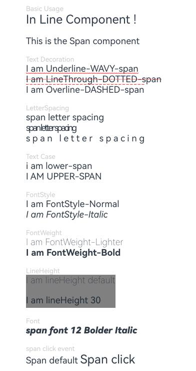
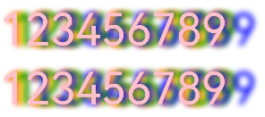
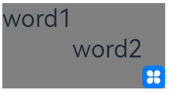

# Span
<!--Kit: ArkUI-->
<!--Subsystem: ArkUI-->
<!--Owner: @xiangyuan6-->
<!--Designer: @pssea-->
<!--Tester: @jiaoaozihao-->
<!--Adviser: @HelloCrease-->

作为[Text](ts-basic-components-text.md)、[ContainerSpan](ts-basic-components-containerspan.md)组件的子组件，用于显示行内文本的组件。

>  **说明：**
>
>  该组件从API version 7开始支持。后续版本如有新增内容，则采用上角标单独标记该内容的起始版本。
>
>  该组件从API version 10开始支持继承父组件Text的属性，即如果子组件未设置属性且父组件设置属性，则继承父组件设置的属性。支持继承的属性仅包括：fontColor、fontSize、fontStyle、fontWeight、decoration、letterSpacing、textCase、fontFamily、textShadow。
>
>  不支持[通用属性](ts-component-general-attributes.md)。若需设置通用属性，应使用[Text](ts-basic-components-text.md)进行设置，或改用[属性字符串](ts-universal-styled-string.md)中的[CustomSpan](ts-universal-styled-string.md#customspan)自行绘制。
>
>  [通用事件](ts-component-general-events.md)只支持点击事件[onClick](ts-universal-events-click.md#onclick)和悬浮事件[onHover](ts-universal-events-hover.md#onhover)。


## 子组件

无


## 接口

Span(value: string | Resource)

**卡片能力：** 从API version 9开始，该接口支持在ArkTS卡片中使用。

**原子化服务API：** 从API version 11开始，该接口支持在原子化服务中使用。

**系统能力：** SystemCapability.ArkUI.ArkUI.Full

**参数：**

| 参数名 | 类型 | 必填 | 说明 |
| -------- | -------- | -------- | -------- |
| value | string \| [Resource](ts-types.md#resource) | 是 | 文本内容。 |


## 属性

属性继承自[BaseSpan](#basespan)。

### decoration

decoration(value: DecorationStyleInterface)

设置文本装饰线样式及其颜色。

**卡片能力：** 从API version 9开始，该接口支持在ArkTS卡片中使用。

**原子化服务API：** 从API version 11开始，该接口支持在原子化服务中使用。

**系统能力：** SystemCapability.ArkUI.ArkUI.Full

**参数：** 

| 参数名 | 类型      | 必填 | 说明     |
| ------ | -------- | ---- | -------------- |
| value  | [DecorationStyleInterface<sup>12+</sup>](ts-universal-styled-string.md#decorationstyleinterface) | 是   | 文本装饰线样式对象。<br/>默认值：<br/>{<br/>&nbsp;type:&nbsp;TextDecorationType.None,<br/>&nbsp;color:&nbsp;Color.Black,<br/>&nbsp;style:&nbsp;TextDecorationStyle.SOLID&nbsp;<br/>}<br/>**说明：** <br/>style参数不支持卡片能力。 |

>  **说明：**
>
>  当文字的下边缘轮廓与装饰线位置相交时，会触发下划线避让规则，下划线将在这些字符处避让文字。常见“gjyqp”等英文字符。
>
>  当文本装饰线的颜色设置为Color.Transparent时，装饰线颜色设置为跟随每行第一个字的字体颜色。当文本装饰线的颜色设置为透明色16进制对应值“#00FFFFFF”时，装饰线颜色设置为透明色。

### letterSpacing

letterSpacing(value: number | ResourceStr)

设置文本字符间距。取值小于0，字符聚集重叠，取值大于0且随着数值变大，字符间距越来越大，稀疏分布。string类型支持number类型取值的字符串形式，可以附带单位，例如"10"、"10fp"。

**卡片能力：** 从API version 9开始，该接口支持在ArkTS卡片中使用。

**原子化服务API：** 从API version 11开始，该接口支持在原子化服务中使用。

**系统能力：** SystemCapability.ArkUI.ArkUI.Full

**参数：** 

| 参数名 | 类型     | 必填 |  说明   |
| ------ | ------- | ---- | -------------- |
| value  | number&nbsp;\|&nbsp;[ResourceStr](ts-types.md#resourcestr) | 是   | 文本字符间距。<br/>单位：[fp](ts-pixel-units.md) <br>从API version 20开始，支持Resource类型。|

### textCase

textCase(value: TextCase)

设置文本大小写。

**卡片能力：** 从API version 9开始，该接口支持在ArkTS卡片中使用。

**原子化服务API：** 从API version 11开始，该接口支持在原子化服务中使用。

**系统能力：** SystemCapability.ArkUI.ArkUI.Full

**参数：** 

| 参数名 | 类型   | 必填 | 说明   |
| ------ | ------- | ---- | ------- |
| value  | [TextCase](ts-appendix-enums.md#textcase) | 是   | 文本大小写。<br/>默认值：TextCase.Normal |

### fontColor

fontColor(value: ResourceColor)

设置字体颜色。

**卡片能力：** 从API version 9开始，该接口支持在ArkTS卡片中使用。

**原子化服务API：** 从API version 11开始，该接口支持在原子化服务中使用。

**系统能力：** SystemCapability.ArkUI.ArkUI.Full

**参数：** 

| 参数名 | 类型                                       | 必填 | 说明       |
| ------ | ------------------------------------------ | ---- | ---------- |
| value  | [ResourceColor](ts-types.md#resourcecolor) | 是   | 字体颜色。<br/>默认值：'e6182431'<br/>Wearable设备上默认值为：'#c5ffffff' |

### fontSize

fontSize(value: number | string | Resource)

设置字体大小。

**卡片能力：** 从API version 9开始，该接口支持在ArkTS卡片中使用。

**原子化服务API：** 从API version 11开始，该接口支持在原子化服务中使用。

**系统能力：** SystemCapability.ArkUI.ArkUI.Full

**参数：** 

| 参数名 | 类型                                                         | 必填 | 说明                                                         |
| ------ | ------------------------------------------------------------ | ---- | ------------------------------------------------------------ |
| value  | number&nbsp;\|&nbsp;string&nbsp;\|&nbsp;[Resource](ts-types.md#resource) | 是   | 字体大小。fontSize为number类型时，使用fp单位。字体默认大小16fp。string类型支持number类型取值的字符串形式，可以附带单位，例如"10"、"10fp"，不支持设置百分比字符串。<br/>Wearable设备上默认值为：15fp |

### fontStyle

fontStyle(value: FontStyle)

设置字体样式。

**卡片能力：** 从API version 9开始，该接口支持在ArkTS卡片中使用。

**原子化服务API：** 从API version 11开始，该接口支持在原子化服务中使用。

**系统能力：** SystemCapability.ArkUI.ArkUI.Full

**参数：** 

| 参数名 | 类型                                        | 必填 | 说明                                    |
| ------ | ------------------------------------------- | ---- | --------------------------------------- |
| value  | [FontStyle](ts-appendix-enums.md#fontstyle) | 是   | 字体样式。<br/>默认值：FontStyle.Normal |

### fontWeight

fontWeight(value: number | FontWeight | ResourceStr)

设置文本的字体粗细，设置过大可能会在不同字体下有截断。

**卡片能力：** 从API version 9开始，该接口支持在ArkTS卡片中使用。

**原子化服务API：** 从API version 11开始，该接口支持在原子化服务中使用。

**系统能力：** SystemCapability.ArkUI.ArkUI.Full

**参数：** 

| 参数名 | 类型                                                         | 必填 | 说明                                                         |
| ------ | ------------------------------------------------------------ | ---- | ------------------------------------------------------------ |
| value  | number&nbsp;\|&nbsp;[FontWeight](ts-appendix-enums.md#fontweight)&nbsp;\|&nbsp;[ResourceStr](ts-types.md#resourcestr) | 是   | 文本的字体粗细，number类型取值[100,&nbsp;900]，取值间隔为100，默认为400，取值越大，字体越粗。string类型仅支持number类型取值的字符串形式，例如"400"，以及"bold"、"bolder"、"lighter"、"regular"、"medium"，分别对应FontWeight中相应的枚举值。<br/>默认值：FontWeight.Normal <br>从API version 20开始，支持Resource类型。|

### fontFamily

fontFamily(value: string | Resource)

设置字体列表。

**卡片能力：** 从API version 9开始，该接口支持在ArkTS卡片中使用。

**原子化服务API：** 从API version 11开始，该接口支持在原子化服务中使用。

**系统能力：** SystemCapability.ArkUI.ArkUI.Full

**参数：** 

| 参数名 | 类型                                                 | 必填 | 说明                                                         |
| ------ | ---------------------------------------------------- | ---- | ------------------------------------------------------------ |
| value  | string&nbsp;\|&nbsp;[Resource](ts-types.md#resource) | 是   | 字体列表。<br>默认字体'HarmonyOS Sans'。<br>使用多个字体时，请用逗号','分隔，字体的优先级按顺序生效。例如：'Arial, HarmonyOS Sans'。|

> **说明：**
>
> 可以使用[loadFontSync](../../apis-arkgraphics2d/js-apis-graphics-text.md#loadfontsync)注册自定义字体。

### lineHeight<sup>10+</sup>

lineHeight(value: Length)

设置文本行高。设置string类型时，支持number类型取值的字符串形式，可以附带单位，例如"10"、"10fp"。

**原子化服务API：** 从API version 11开始，该接口支持在原子化服务中使用。

**系统能力：** SystemCapability.ArkUI.ArkUI.Full

**参数：** 

| 参数名 | 类型    | 必填 | 说明  |
| ------ | ------ | ---- | ---- |
| value  | [Length](ts-types.md#length) | 是   | 文本行高。 |

### font<sup>10+</sup>

font(value: Font)

设置文本样式。包括字体大小、字体粗细、字体族和字体风格。

**原子化服务API：** 从API version 11开始，该接口支持在原子化服务中使用。

**系统能力：** SystemCapability.ArkUI.ArkUI.Full

**参数：** 

| 参数名 | 类型                     | 必填 | 说明       |
| ------ | ------------------------ | ---- | ---------- |
| value  | [Font](ts-types.md#font) | 是   | 文本样式。 |

### textShadow<sup>11+</sup>

textShadow(value: ShadowOptions | Array&lt;ShadowOptions&gt;)

设置文字阴影效果。该接口支持以数组形式入参，实现多重文字阴影。不支持fill字段, 不支持智能取色模式。

**原子化服务API：** 从API version 12开始，该接口支持在原子化服务中使用。

**系统能力：** SystemCapability.ArkUI.ArkUI.Full

**参数：** 

| 参数名 | 类型 | 必填 | 说明 |
| ------ | ----- | ---- | --- |
| value  | [ShadowOptions](ts-universal-attributes-image-effect.md#shadowoptions对象说明)&nbsp;\|&nbsp;&nbsp;Array&lt;[ShadowOptions](ts-universal-attributes-image-effect.md#shadowoptions对象说明)> | 是   | 文字阴影效果。 |

## 事件

通用事件支持[点击事件onClick](ts-universal-events-click.md#onclick)、[悬浮事件onHover](ts-universal-events-hover.md#onhover)。

>  **说明：**
>
>  由于Span组件无尺寸信息，因此点击事件返回的ClickEvent对象的target属性无效。

## BaseSpan

定义BaseSpan基础类，包含Span的通用属性。

**系统能力：** SystemCapability.ArkUI.ArkUI.Full

**原子化服务API：** 从API version 12开始，该接口支持在原子化服务中使用。

### textBackgroundStyle<sup>11+</sup>

textBackgroundStyle(style: TextBackgroundStyle): T

设置背景样式。作为[ContainerSpan](ts-basic-components-containerspan.md)的子组件时可以继承它的此属性值，优先使用其自身的此属性。

**原子化服务API：** 从API version 12开始，该接口支持在原子化服务中使用。

**系统能力：** SystemCapability.ArkUI.ArkUI.Full

**参数：** 

| 参数名 | 类型  | 必填 | 说明 |
| ----- | ---- | ---- | ---- |
| style  | [TextBackgroundStyle](#textbackgroundstyle11对象说明) | 是   | 背景样式。<br />默认值:<br />{<br />  color: Color.Transparent,<br />  radius: 0<br />} |

**返回值：**

| 类型                                       | 说明      |
| ---------------------------------------- | ------- |
| T | 返回当前Span的属性。 |

### baselineOffset<sup>12+</sup>

baselineOffset(value: LengthMetrics): T

设置Span基线的偏移量。此属性与父组件的baselineOffset是共存的。

**原子化服务API：** 从API version 12开始，该接口支持在原子化服务中使用。

**系统能力：** SystemCapability.ArkUI.ArkUI.Full

**参数：** 

| 参数名 | 类型 | 必填 | 说明  |
| ----- | ---- | ---- | ---- |
| value  | [LengthMetrics](../js-apis-arkui-graphics.md#lengthmetrics12) | 是   | 设置Span基线的偏移量，设置该值为百分比时，按默认值显示。<br/>正数内容向上偏移，负数向下偏移。<br/>默认值：0<br/>在ImageSpan中，设置为非0时，[verticalAlign](ts-basic-components-imagespan.md#verticalalign)将固定为ImageSpanAlignment.BASELINE对齐；设置为0时，要使基线对齐策略生效，需同时设置[verticalAlign](ts-basic-components-imagespan.md#verticalalign)为ImageSpanAlignment.BASELINE。 |

**返回值：**

| 类型                                       | 说明      |
| ---------------------------------------- | ------- |
| T | 返回当前Span的属性。 |

## TextBackgroundStyle<sup>11+</sup>对象说明

**原子化服务API：** 从API version 12开始，该接口支持在原子化服务中使用。

**系统能力：** SystemCapability.ArkUI.ArkUI.Full

| 名称   | 类型     | 只读 | 可选 | 说明         |
| ------ | ------- | ---- | ---- | ------------ |
| color  | [ResourceColor](ts-types.md#resourcecolor)                                  | 否   | 是 | 文本背景色。 |
| radius | [Dimension](ts-types.md#dimension10) \| [BorderRadiuses](./ts-types.md#borderradiuses9) | 否   | 是 | 文本背景圆角。 |

## 示例
### 示例1（设置文本样式）

该示例展示了设置不同样式的文本效果以及span配置点击事件。

```ts
// xxx.ets
@Entry
@Component
struct SpanExample {
  build() {
    Flex({ direction: FlexDirection.Column, alignItems: ItemAlign.Start }) {
      Text('Basic Usage').fontSize(9).fontColor(0xCCCCCC)
      Text() {
        Span('In Line')
        Span(' Component')
        Span(' !')
      }

      Text() {
        Span('This is the Span component').fontSize(12).textCase(TextCase.Normal)
          .decoration({ type: TextDecorationType.None, color: Color.Red })
          .fontFamily('HarmonyOS Sans')
      }.margin({ top: 12 })

      // 文本横线添加
      Text('Text Decoration').fontSize(9).fontColor(0xCCCCCC).margin({ top: 12 })
      Text() {
        Span('I am Underline-WAVY-span')
          .decoration({ type: TextDecorationType.Underline, color: Color.Red, style: TextDecorationStyle.WAVY })
          .fontSize(12)
      }

      Text() {
        Span('I am LineThrough-DOTTED-span')
          .decoration({ type: TextDecorationType.LineThrough, color: Color.Red, style: TextDecorationStyle.DOTTED })
          .fontSize(12)
      }

      Text() {
        Span('I am Overline-DASHED-span')
          .decoration({ type: TextDecorationType.Overline, color: Color.Red, style: TextDecorationStyle.DASHED })
          .fontSize(12)
      }

      // 文本字符间距
      Text('LetterSpacing').fontSize(9).fontColor(0xCCCCCC).margin({ top: 12 })
      Text() {
        Span('span letter spacing')
          .letterSpacing(0)
          .fontSize(12)
      }

      Text() {
        Span('span letter spacing')
          .letterSpacing(-2)
          .fontSize(12)
      }

      Text() {
        Span('span letter spacing')
          .letterSpacing(3)
          .fontSize(12)
      }

      // 文本大小写展示设置
      Text('Text Case').fontSize(9).fontColor(0xCCCCCC).margin({ top: 12 })
      Text() {
        Span('I am Lower-span').fontSize(12)
          .textCase(TextCase.LowerCase)
          .decoration({ type: TextDecorationType.None })
      }

      Text() {
        Span('I am Upper-span').fontSize(12)
          .textCase(TextCase.UpperCase)
          .decoration({ type: TextDecorationType.None })
      }

      // 文本字体样式设置
      Text('FontStyle').fontSize(9).fontColor(0xCCCCCC).margin({ top: 12 })
      Text() {
        Span('I am FontStyle-Normal').fontSize(12)
          .fontStyle(FontStyle.Normal)
      }

      Text() {
        Span('I am FontStyle-Italic').fontSize(12)
          .fontStyle(FontStyle.Italic)
      }

      // 文本字体粗细设置
      Text('FontWeight').fontSize(9).fontColor(0xCCCCCC).margin({ top: 12 })
      Text() {
        Span('I am FontWeight-Lighter').fontSize(12)
          .fontWeight(FontWeight.Lighter)
      }

      Text() {
        Span('I am FontWeight-Bold').fontSize(12)
          .fontWeight(FontWeight.Bold)
      }

      // 文本行高设置
      Text('LineHeight').fontSize(9).fontColor(0xCCCCCC).margin({ top: 12 })
      Text() {
        Span('I am lineHeight default\n').fontSize(12)
          .fontWeight(FontWeight.Lighter)
        Span('I am lineHeight 30').fontSize(12)
          .lineHeight(30)
      }
      .backgroundColor(Color.Gray)

      // 文本样式设置
      Text('Font').fontSize(9).fontColor(0xCCCCCC).margin({ top: 12 })
      Text() {
        Span('span font 12 Bolder Italic')
          .font({
            size: 12,
            weight: FontWeight.Bolder,
            style: FontStyle.Italic,
            family: "HarmonyOS Sans"
          })
      }

      // span点击事件设置
      Text('span click event').fontSize(9).fontColor(0xCCCCCC).margin({ top: 12 })
      Text() {
        Span('Span default ').fontSize(12)
        Span('Span click')
          .onClick((event) => {
            console.info("span onClick")
          })
      }
    }.width('100%').padding({ left: 35, right: 35, top: 35 })
  }
}
```



### 示例2（设置文本阴影）

从API version 11开始，该示例通过[textShadow](#textshadow11)属性展示了文本设置阴影的效果。

``` ts
// xxx.ets
@Entry
@Component
struct SpanExample {
  @State textShadows: ShadowOptions | Array<ShadowOptions> = [{
    radius: 10,
    color: Color.Red,
    offsetX: 10,
    offsetY: 0
  }, {
    radius: 10,
    color: Color.Orange,
    offsetX: 20,
    offsetY: 0
  },
    {
      radius: 10,
      color: Color.Yellow,
      offsetX: 30,
      offsetY: 0
    }, {
      radius: 10,
      color: Color.Green,
      offsetX: 40,
      offsetY: 0
    },
    {
      radius: 10,
      color: Color.Blue,
      offsetX: 100,
      offsetY: 0
    }]

  build() {
    Column({ space: 8 }) {
      Text() {
        Span('123456789').fontSize(50).textShadow(this.textShadows).fontColor(Color.Pink)
      }

      Text() {
        Span('123456789') // span can inherit text shadow & font size from outer text
      }.fontSize(50).textShadow(this.textShadows).fontColor(Color.Pink)
    }
  }
}
```


### 示例3（设置背景样式）

从API version 11开始，该示例通过[textBackgroundStyle](#textbackgroundstyle11)属性展示了文本设置背景样式的效果。

``` ts
// xxx.ets
@Component
@Entry
struct SpanExample {
  build() {
    Column() {
      Text() {
        Span('   Hello World !   ')
          .fontSize('20fp')
          .textBackgroundStyle({ color: "#7F007DFF", radius: "5vp" })
          .fontColor(Color.White)
      }
    }.width('100%').margin({ bottom: '5vp' }).alignItems(HorizontalAlign.Center)
  }
}
```


### 示例4（设置文本基线偏移量）

从API version 12开始，该示例通过[baselineOffset](#baselineoffset12)属性展示了文本设置不同基线偏移量的效果。

```ts
// xxx.ets
import { LengthUnit, LengthMetrics } from '@kit.ArkUI';

@Entry
@Component
struct SpanExample {
  build() {
    Row() {
      Column() {
        Text() {
          Span('SpanOne')
            .fontSize(10)
            .baselineOffset(new LengthMetrics(20, LengthUnit.VP))
          Span('SpanTwo')
            .fontSize(10)
            .baselineOffset(new LengthMetrics(0, LengthUnit.VP))
          // $r('app.media.sky')需要替换为开发者所需的图像资源文件。
          ImageSpan($r("app.media.sky"))
            .width('80px')
            .baselineOffset(new LengthMetrics(-20, LengthUnit.VP))
        }
        .backgroundColor('#7F007DFF')
      }
      .width('100%')
    }
    .height('100%')
  }
}
```



