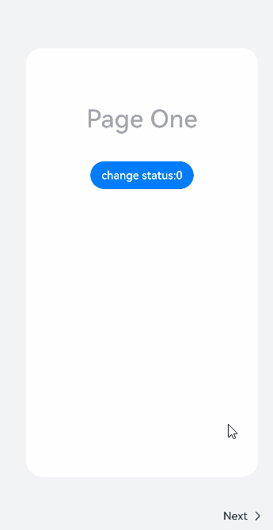

# Stepper

步骤导航器组件，适用于引导用户按照步骤完成任务的导航场景。


>  **说明：**
>
> 该组件从API version 8开始支持。后续版本如有新增内容，则采用上角标单独标记该内容的起始版本。


## 子组件

仅能包含子组件[StepperItem](ts-basic-components-stepperitem.md)。


## 接口

Stepper(value?: { index?: number })

创建步骤导航器组件。

**原子化服务API：** 从API version 11开始，该接口支持在原子化服务中使用。

**系统能力：** SystemCapability.ArkUI.ArkUI.Full

**参数：**

| 参数名 | 类型 | 必填  | 说明 |
| ------| -------- | --------------- | -------- |
| value | { index?: number }   | 否 | 设置步骤导航器当前显示StepperItem的索引值。<br/>默认值：0<br />从API version 10开始，该参数支持[$$](../../../ui/state-management/arkts-two-way-sync.md)双向绑定变量。 |


## 属性

无

## 事件

### onFinish

onFinish(callback: () => void)

步骤导航器最后一个StepperItem的nextLabel被点击时，并且ItemState属性为Normal时，触发该回调。

**原子化服务API：** 从API version 11开始，该接口支持在原子化服务中使用。

**系统能力：** SystemCapability.ArkUI.ArkUI.Full

### onSkip

onSkip(callback:&nbsp;()&nbsp;=&gt;&nbsp;void)

当前显示的StepperItem状态为ItemState.Skip时，nextLabel被点击时触发该回调。

**原子化服务API：** 从API version 11开始，该接口支持在原子化服务中使用。

**系统能力：** SystemCapability.ArkUI.ArkUI.Full

### onChange

onChange(callback:&nbsp;(prevIndex:&nbsp;number,&nbsp;index:&nbsp;number)&nbsp;=&gt;&nbsp;void)

点击当前StepperItem的prevLabel进行步骤切换时触发该回调；或点击当前StepperItem的nextLabel，当前页面不为步骤导航器最后一个StepperItem且ItemState属性为Normal时，触发该回调。

**原子化服务API：** 从API version 11开始，该接口支持在原子化服务中使用。

**系统能力：** SystemCapability.ArkUI.ArkUI.Full

**参数：** 

| 参数名    | 类型   | 必填 | 说明                                       |
| --------- | ------ | ---- | ------------------------------------------ |
| prevIndex | number | 是   | 切换前的步骤页索引值。<br/>取值范围：[0, +∞) |
| index     | number | 是   | 切换后的步骤页（前一页或者下一页）索引值。<br/>取值范围：[0, +∞) |

### onNext

onNext(callback:&nbsp;(index:&nbsp;number,&nbsp;pendingIndex:&nbsp;number)&nbsp;=&gt;&nbsp;void)

点击StepperItem的nextLabel切换下一步骤时，当前页面不为步骤导航器最后一个StepperItem且ItemState属性为Normal时，触发该回调。

**原子化服务API：** 从API version 11开始，该接口支持在原子化服务中使用。

**系统能力：** SystemCapability.ArkUI.ArkUI.Full

**参数：** 

| 参数名       | 类型   | 必填 | 说明               |
| ------------ | ------ | ---- | ------------------ |
| index        | number | 是   | 当前步骤页索引值。 |
| pendingIndex | number | 是   | 下一步骤页索引值。 |

### onPrevious

onPrevious(callback:&nbsp;(index:&nbsp;number,&nbsp;pendingIndex:&nbsp;number)&nbsp;=&gt;&nbsp;void)

点击StepperItem的prevLabel切换上一步骤时触发该回调。

**原子化服务API：** 从API version 11开始，该接口支持在原子化服务中使用。

**系统能力：** SystemCapability.ArkUI.ArkUI.Full

**参数：** 

| 参数名       | 类型   | 必填 | 说明               |
| ------------ | ------ | ---- | ------------------ |
| index        | number | 是   | 当前步骤页索引值。 |
| pendingIndex | number | 是   | 上一步骤页索引值。 |


## 示例

该示例主要演示如何使用步骤导航器组件。

```ts
// xxx.ets
@Styles function itemStyle () {
  .width(336)
  .height(621)
  .margin({ top: 48, left: 12 })
  .borderRadius(24)
  .backgroundColor('#FFFFFF')
}

@Extend(Text) function itemTextStyle () {
  .fontColor('#182431')
  .fontSize(36)
  .fontWeight(500)
  .opacity(0.4)
  .margin({ top: 82, bottom: 40 })
}

@Entry
@Component
struct StepperExample {
  @State currentIndex: number = 0;
  @State firstState: ItemState = ItemState.Normal;
  @State secondState: ItemState = ItemState.Normal;
  @State thirdState: ItemState = ItemState.Normal;

  build() {
    Stepper({
      index: this.currentIndex
    }) {
      // 第一个步骤页
      StepperItem() {
        Column() {
          Text('Page One')
            .itemTextStyle()
          Button('change status:' + this.firstState)
            .backgroundColor('#007dFF')
            .onClick(() => {
              this.firstState = this.firstState === ItemState.Skip ? ItemState.Normal : ItemState.Skip;
            })
        }.itemStyle()
      }
      .nextLabel('Next')
      .status(this.firstState)
      // 第二个步骤页
      StepperItem() {
        Column() {
          Text('Page Two')
            .itemTextStyle()
          Button('change status:' + this.secondState)
            .backgroundColor('#007dFF')
            .onClick(() => {
              this.secondState = this.secondState === ItemState.Disabled ? ItemState.Normal : ItemState.Disabled;
            })
        }.itemStyle()
      }
      .nextLabel('Next')
      .prevLabel('Previous')
      .status(this.secondState)
      // 第三个步骤页
      StepperItem() {
        Column() {
          Text('Page Three')
            .itemTextStyle()
          Button('change status:' + this.thirdState)
            .backgroundColor('#007dFF')
            .onClick(() => {
              this.thirdState = this.thirdState === ItemState.Waiting ? ItemState.Normal : ItemState.Waiting;
            })
        }.itemStyle()
      }
      .status(this.thirdState)
      // 第四个步骤页
      StepperItem() {
        Column() {
          Text('Page Four')
            .itemTextStyle()
        }.itemStyle()
      }
    }
    .backgroundColor('#F1F3F5')
    .onFinish(() => {
      // 此处可处理点击最后一页的Finish时的逻辑，例如路由跳转等
      console.info('onFinish');
    })
    .onSkip(() => {
      // 此处可处理点击跳过时的逻辑，例如动态修改Stepper的index值使其跳转到某一步骤页等
      console.info('onSkip');
    })
    .onChange((prevIndex?: number, index?: number) => {
      if(index){
        this.currentIndex = index;
      }
    })
  }
}
```




