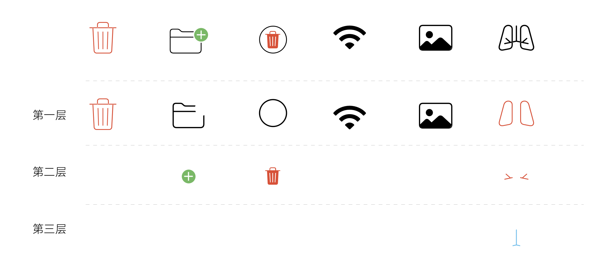
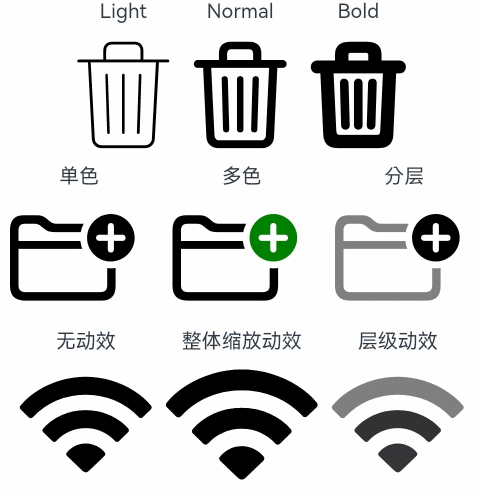
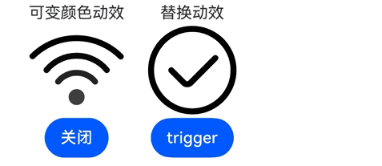

# SymbolGlyph

显示图标小符号的组件。

>  **说明：**
>
>  该组件从API Version 11开始支持。后续版本如有新增内容，则采用上角标单独标记该内容的起始版本。

## 子组件

不支持子组件。

## 接口

SymbolGlyph(value?: Resource)

**卡片能力：** 从API version 12开始，该接口支持在ArkTS卡片中使用。

**原子化服务API：** 从API version 12开始，该接口支持在原子化服务中使用。

**系统能力：** SystemCapability.ArkUI.ArkUI.Full

**参数：**

| 参数名 | 类型 | 必填 | 说明 |
| -------- | -------- | -------- | -------- |
| value | [Resource](ts-types.md#resource)| 否 | SymbolGlyph组件的资源名,如 $r('sys.symbol.ohos_wifi')。 |

>  **说明：**
>
>  $r('sys.symbol.ohos_wifi')中引用的资源为系统预置，SymbolGlyph仅支持系统预置的symbol资源名，引用非symbol资源将显示异常。

## 属性

支持[通用属性](ts-universal-attributes-size.md)，不支持文本通用属性，仅支持以下特有属性：

### fontColor

fontColor(value: Array&lt;ResourceColor&gt;)

设置SymbolGlyph组件颜色。

**卡片能力：** 从API version 12开始，该接口支持在ArkTS卡片中使用。

**原子化服务API：** 从API version 12开始，该接口支持在原子化服务中使用。

**系统能力：** SystemCapability.ArkUI.ArkUI.Full

**参数：** 

| 参数名 | 类型 | 必填 | 说明  |
| ------ | ---- | ---- | ----- |
| value  | Array\<[ResourceColor](ts-types.md#resourcecolor)\> | 是   | SymbolGlyph组件颜色。<br/> 默认值：不同渲染策略下默认值不同。 |

### fontSize

fontSize(value: number | string | Resource)

设置SymbolGlyph组件大小。

组件的图标显示大小由fontSize控制，设置width或height后，其他通用属性仅对组件的占位大小生效。

**卡片能力：** 从API version 12开始，该接口支持在ArkTS卡片中使用。

**原子化服务API：** 从API version 12开始，该接口支持在原子化服务中使用。

**系统能力：** SystemCapability.ArkUI.ArkUI.Full

**参数：** 

| 参数名 | 类型 | 必填 | 说明  |
| ------ | ---- | ---- | ----- |
| value  | number&nbsp;\|&nbsp;string&nbsp;\|&nbsp;[Resource](ts-types.md#resource) | 是   | SymbolGlyph组件大小。<br/>默认值：系统默认值。 |

### fontWeight

fontWeight(value: number | FontWeight | string)

设置SymbolGlyph组件粗细。number类型取值[100,900]，取值间隔为100，默认为400，取值越大，字体越粗。string类型仅支持number类型取值的字符串形式，例如“400”，以及“bold”、“bolder”、“lighter”、“regular” 、“medium”分别对应FontWeight中相应的枚举值。

sys.symbol.ohos_lungs图标不支持设置fontWeight。

**卡片能力：** 从API version 12开始，该接口支持在ArkTS卡片中使用。

**原子化服务API：** 从API version 12开始，该接口支持在原子化服务中使用。

**系统能力：** SystemCapability.ArkUI.ArkUI.Full

**参数：** 

| 参数名 | 类型                                                         | 必填 | 说明                                                |
| ------ | ------------------------------------------------------------ | ---- | --------------------------------------------------- |
| value  | number&nbsp;\|&nbsp;[FontWeight](ts-appendix-enums.md#fontweight)&nbsp;\|&nbsp;string | 是   | SymbolGlyph组件粗细。<br/>默认值：FontWeight.Normal |

### renderingStrategy

renderingStrategy(value: SymbolRenderingStrategy)

设置SymbolGlyph组件渲染策略。

**卡片能力：** 从API version 12开始，该接口支持在ArkTS卡片中使用。

**原子化服务API：** 从API version 12开始，该接口支持在原子化服务中使用。

**系统能力：** SystemCapability.ArkUI.ArkUI.Full

**参数：** 

| 参数名 | 类型 | 必填 | 说明  |
| ------ | ---- | ---- | ----- |
| value  | [SymbolRenderingStrategy](#symbolrenderingstrategy11枚举说明) | 是   | SymbolGlyph组件渲染策略。<br/>默认值：SymbolRenderingStrategy.SINGLE |

不同渲染策略效果可参考以下示意图。



### effectStrategy

effectStrategy(value: SymbolEffectStrategy)

设置SymbolGlyph组件动效策略。

**卡片能力：** 从API version 12开始，该接口支持在ArkTS卡片中使用。

**原子化服务API：** 从API version 12开始，该接口支持在原子化服务中使用。

**系统能力：** SystemCapability.ArkUI.ArkUI.Full

**参数：** 

| 参数名 | 类型 | 必填 | 说明  |
| ------ | ---- | ---- | ----- |
| value  | [SymbolEffectStrategy](#symboleffectstrategy11枚举说明) | 是   | SymbolGlyph组件动效策略。<br/>默认值：SymbolEffectStrategy.NONE |

### symbolEffect<sup>12+</sup>

symbolEffect(symbolEffect: SymbolEffect, isActive?: boolean)

设置SymbolGlyph组件动效策略及播放状态。

**卡片能力：** 从API version 12开始，该接口支持在ArkTS卡片中使用。

**原子化服务API：** 从API version 12开始，该接口支持在原子化服务中使用。

**系统能力：** SystemCapability.ArkUI.ArkUI.Full

**参数：** 

| 参数名 | 类型 | 必填 | 说明  |
| ------ | ---- | ---- | ----- |
| symbolEffect  | [SymbolEffect](#symboleffect12对象说明) | 是   | SymbolGlyph组件动效策略。<br/>默认值：[SymbolEffect](#symboleffect12对象说明) |
| isActive  | boolean | 否   | SymbolGlyph组件动效播放状态。<br/>默认值：false |

### symbolEffect<sup>12+</sup>

symbolEffect(symbolEffect: SymbolEffect, triggerValue?: number)

设置SymbolGlyph组件动效策略及播放触发器。

**卡片能力：** 从API version 12开始，该接口支持在ArkTS卡片中使用。

**原子化服务API：** 从API version 12开始，该接口支持在原子化服务中使用。

**系统能力：** SystemCapability.ArkUI.ArkUI.Full

**参数：** 

| 参数名 | 类型 | 必填 | 说明  |
| ------ | ---- | ---- | ----- |
| symbolEffect | [SymbolEffect](#symboleffect12对象说明) | 是   | SymbolGlyph组件动效策略。<br/>默认值：[SymbolEffect](#symboleffect12对象说明) |
| triggerValue | number | 否   | SymbolGlyph组件动效播放触发器，在数值变更时触发动效。<br/>如果首次不希望触发动效，设置-1。 |

>  **说明：**
>
>  动效属性，仅支持使用effectStrategy属性或单个symbolEffect属性，不支持多种动效属性混合使用。

## SymbolEffect<sup>12+</sup>对象说明

定义SymbolEffect类。

**卡片能力：** 从API version 12开始，该接口支持在ArkTS卡片中使用。

**原子化服务API：** 从API version 12开始，该接口支持在原子化服务中使用。

**系统能力：** SystemCapability.ArkUI.ArkUI.Full

## ScaleSymbolEffect<sup>12+</sup>对象说明

ScaleSymbolEffect继承自父类SymbolEffect。

**卡片能力：** 从API version 12开始，该接口支持在ArkTS卡片中使用。

**原子化服务API：** 从API version 12开始，该接口支持在原子化服务中使用。

**系统能力：** SystemCapability.ArkUI.ArkUI.Full

### 属性

| 名称 | 类型 | 必填 | 说明  |
| ---- | ---- | ---- | ---- |
| scope     | [EffectScope](#effectscope12枚举说明)  |  否   | 动效范围。<br/>默认值：EffectScope.LAYER    |
| direction | [EffectDirection](#effectdirection12枚举说明) |  否   | 动效方向。<br/>默认值：EffectDirection.DOWN |

### constructor<sup>12+</sup>

constructor(scope?: EffectScope, direction?: EffectDirection)

ScaleSymbolEffect的构造函数，缩放动效。

**卡片能力：** 从API version 12开始，该接口支持在ArkTS卡片中使用。

**原子化服务API：** 从API version 12开始，该接口支持在原子化服务中使用。

**系统能力：** SystemCapability.ArkUI.ArkUI.Full

**参数：**

| 参数名 | 类型 | 必填 | 说明  |
| ---- | ---- | ---- | ---- |
| scope     | [EffectScope](#effectscope12枚举说明)         | 否   | 动效范围。<br/>默认值：EffectScope.LAYER    |
| direction | [EffectDirection](#effectdirection12枚举说明) | 否   | 动效方向。<br/>默认值：EffectDirection.DOWN |

## HierarchicalSymbolEffect<sup>12+</sup>对象说明

HierarchicalSymbolEffect继承自父类SymbolEffect。

**卡片能力：** 从API version 12开始，该接口支持在ArkTS卡片中使用。

**原子化服务API：** 从API version 12开始，该接口支持在原子化服务中使用。

**系统能力：** SystemCapability.ArkUI.ArkUI.Full

### 属性

| 名称 | 类型 | 必填 | 说明  |
| ---- | ---- | ---- | ---- |
| fillStyle | [EffectFillStyle](#effectfillstyle12枚举说明) | 否   | 动效模式。<br/>默认值：EffectFillStyle.CUMULATIVE |

### constructor<sup>12+</sup>

constructor(fillStyle?: EffectFillStyle)

HierarchicalSymbolEffect的构造函数，层级动效。

**卡片能力：** 从API version 12开始，该接口支持在ArkTS卡片中使用。

**原子化服务API：** 从API version 12开始，该接口支持在原子化服务中使用。

**系统能力：** SystemCapability.ArkUI.ArkUI.Full

**参数：**

| 参数名 | 类型 | 必填 | 说明  |
| ---- | ---- | ---- | ---- |
| fillStyle | [EffectFillStyle](#effectfillstyle12枚举说明) | 否   | 动效模式。<br/>默认值：EffectFillStyle.CUMULATIVE |

## AppearSymbolEffect<sup>12+</sup>对象说明

AppearSymbolEffect继承自父类SymbolEffect。

**卡片能力：** 从API version 12开始，该接口支持在ArkTS卡片中使用。

**原子化服务API：** 从API version 12开始，该接口支持在原子化服务中使用。

**系统能力：** SystemCapability.ArkUI.ArkUI.Full

### 属性

| 名称 | 类型 | 必填 | 说明  |
| ---- | ---- | ---- | ---- |
| scope | [EffectScope](#effectscope12枚举说明) | 否   | 动效范围。<br/>默认值：EffectScope.LAYER |

### constructor<sup>12+</sup>

constructor(scope?: EffectScope)

AppearSymbolEffect的构造函数，出现动效。

**卡片能力：** 从API version 12开始，该接口支持在ArkTS卡片中使用。

**原子化服务API：** 从API version 12开始，该接口支持在原子化服务中使用。

**系统能力：** SystemCapability.ArkUI.ArkUI.Full

**参数：**

| 参数名 | 类型 | 必填 | 说明  |
| ---- | ---- | ---- | ---- |
| scope  | [EffectScope](#effectscope12枚举说明) | 否   | 动效范围。<br/>默认值：EffectScope.LAYER |

## DisappearSymbolEffect<sup>12+</sup>对象说明

DisappearSymbolEffect继承自父类SymbolEffect。

**卡片能力：** 从API version 12开始，该接口支持在ArkTS卡片中使用。

**原子化服务API：** 从API version 12开始，该接口支持在原子化服务中使用。

**系统能力：** SystemCapability.ArkUI.ArkUI.Full

### 属性

| 名称 | 类型 | 必填 | 说明  |
| ---- | ---- | ---- | ---- |
| scope | [EffectScope](#effectscope12枚举说明) | 否   | 动效范围。<br/>默认值：EffectScope.LAYER |

### constructor<sup>12+</sup>

constructor(scope?: EffectScope)

DisappearSymbolEffect的构造函数，消失动效。

**卡片能力：** 从API version 12开始，该接口支持在ArkTS卡片中使用。

**原子化服务API：** 从API version 12开始，该接口支持在原子化服务中使用。

**系统能力：** SystemCapability.ArkUI.ArkUI.Full

**参数：**

| 参数名 | 类型 | 必填 | 说明  |
| ---- | ---- | ---- | ---- |
| scope  | [EffectScope](#effectscope12枚举说明) | 否   | 动效范围。<br/>默认值：EffectScope.LAYER |

## BounceSymbolEffect<sup>12+</sup>对象说明

BounceSymbolEffect继承自父类SymbolEffect。

**卡片能力：** 从API version 12开始，该接口支持在ArkTS卡片中使用。

**原子化服务API：** 从API version 12开始，该接口支持在原子化服务中使用。

**系统能力：** SystemCapability.ArkUI.ArkUI.Full

### 属性

| 名称 | 类型 | 必填 | 说明  |
| ---- | ---- | ---- | ---- |
| scope     | [EffectScope](#effectscope12枚举说明)         | 否   | 动效范围。<br/>默认值：EffectScope.LAYER    |
| direction | [EffectDirection](#effectdirection12枚举说明) | 否   | 动效方向。<br/>默认值：EffectDirection.DOWN |

### constructor<sup>12+</sup>

constructor(scope?: EffectScope, direction?: EffectDirection)

BounceSymbolEffect的构造函数，弹跳动效。

**卡片能力：** 从API version 12开始，该接口支持在ArkTS卡片中使用。

**原子化服务API：** 从API version 12开始，该接口支持在原子化服务中使用。

**系统能力：** SystemCapability.ArkUI.ArkUI.Full

**参数：**

| 参数名 | 类型 | 必填 | 说明  |
| ---- | ---- | ---- | ---- |
| scope     | [EffectScope](#effectscope12枚举说明)         | 否   | 动效范围。<br/>默认值：EffectScope.LAYER    |
| direction | [EffectDirection](#effectdirection12枚举说明) | 否   | 动效方向。<br/>默认值：EffectDirection.DOWN |

## ReplaceSymbolEffect<sup>12+</sup>对象说明

ReplaceSymbolEffect继承自父类SymbolEffect。

**卡片能力：** 从API version 12开始，该接口支持在ArkTS卡片中使用。

**原子化服务API：** 从API version 12开始，该接口支持在原子化服务中使用。

**系统能力：** SystemCapability.ArkUI.ArkUI.Full

### 属性

| 名称 | 类型 | 必填 | 说明  |
| ---- | ---- | ---- | ---- |
| scope | [EffectScope](#effectscope12枚举说明) | 否   | 动效范围。<br/>默认值：EffectScope.LAYER |

### constructor<sup>12+</sup>

constructor(scope?: EffectScope)

ReplaceSymbolEffect的构造函数，替换动效。

**卡片能力：** 从API version 12开始，该接口支持在ArkTS卡片中使用。

**原子化服务API：** 从API version 12开始，该接口支持在原子化服务中使用。

**系统能力：** SystemCapability.ArkUI.ArkUI.Full

**参数：**

| 参数名 | 类型 | 必填 | 说明  |
| ---- | ---- | ---- | ---- |
| scope  | [EffectScope](#effectscope12枚举说明) | 否   | 动效范围。<br/>默认值：EffectScope.LAYER |

## PulseSymbolEffect<sup>12+</sup>对象说明

PulseSymbolEffect的构造函数，脉冲动效。

**卡片能力：** 从API version 12开始，该接口支持在ArkTS卡片中使用。

**原子化服务API：** 从API version 12开始，该接口支持在原子化服务中使用。

**系统能力：** SystemCapability.ArkUI.ArkUI.Full

## EffectDirection<sup>12+</sup>枚举说明

**卡片能力：** 从API version 12开始，该接口支持在ArkTS卡片中使用。

**原子化服务API：** 从API version 12开始，该接口支持在原子化服务中使用。

**系统能力：** SystemCapability.ArkUI.ArkUI.Full

| 名称 | 值   | 说明             |
| ---- | ---- | ---------------- |
| DOWN | 0    | 图标缩小再复原。 |
| UP   | 1    | 图标放大再复原。 |

## EffectScope<sup>12+</sup>枚举说明

**卡片能力：** 从API version 12开始，该接口支持在ArkTS卡片中使用。

**原子化服务API：** 从API version 12开始，该接口支持在原子化服务中使用。

**系统能力：** SystemCapability.ArkUI.ArkUI.Full

| 名称  | 值   | 说明       |
| ----- | ---- | ---------- |
| LAYER | 0    | 分层模式。 |
| WHOLE | 1    | 整体模式。 |

## EffectFillStyle<sup>12+</sup>枚举说明

**卡片能力：** 从API version 12开始，该接口支持在ArkTS卡片中使用。

**原子化服务API：** 从API version 12开始，该接口支持在原子化服务中使用。

**系统能力：** SystemCapability.ArkUI.ArkUI.Full

| 名称       | 值   | 说明       |
| ---------- | ---- | ---------- |
| CUMULATIVE | 0    | 累加模式。 |
| ITERATIVE  | 1    | 迭代模式。 |

## SymbolEffectStrategy<sup>11+</sup>枚举说明

动效类型的枚举值。设置动效后启动即生效，无需触发。

**卡片能力：** 从API version 12开始，该接口支持在ArkTS卡片中使用。

**原子化服务API：** 从API version 12开始，该接口支持在原子化服务中使用。

**系统能力：** SystemCapability.ArkUI.ArkUI.Full

| 名称     | 说明                          |
| ------ | ----------------------------- |
| NONE | 无动效（默认值）。 |
| SCALE | 整体缩放动效。                 |
|  HIERARCHICAL  | 层级动效。  |

## SymbolRenderingStrategy<sup>11+</sup>枚举说明

渲染模式的枚举值。

**卡片能力：** 从API version 12开始，该接口支持在ArkTS卡片中使用。

**原子化服务API：** 从API version 12开始，该接口支持在原子化服务中使用。

**系统能力：** SystemCapability.ArkUI.ArkUI.Full

| 名称     | 说明                          |
| ------ | ----------------------------- |
| SINGLE  | 单色模式（默认值）。<br/> 默认为黑色，可以设置一个颜色。<br/> 当用户设置多个颜色时，仅生效第一个颜色。 |
| MULTIPLE_COLOR  |  多色模式。<br/> 最多可以设置三个颜色。当用户只设置一个颜色时，修改第一层颜色，其他颜色保持默认颜色。<br/> 颜色设置顺序与图标分层顺序匹配，当颜色数量大于图标分层时，多余的颜色不生效。<br/> 仅支持设置颜色，不透明度设置不生效。|
|  MULTIPLE_OPACITY   | 分层模式。<br/> 默认为黑色，可以设置一个颜色。当用户设置多个颜色时，仅生效第一个颜色。<br/> 不透明度与图层相关，第一层100%、第二层50%、第三层20%。  |

## 事件

支持[通用事件](ts-universal-events-click.md)。

## 示例

###  示例1

```ts
// xxx.ets
@Entry
@Component
struct Index {
  build() {
    Column() {
      Row() {
        Column() {
          Text("Light")
          SymbolGlyph($r('sys.symbol.ohos_trash'))
            .fontWeight(FontWeight.Lighter)
            .fontSize(96)
        }

        Column() {
          Text("Normal")
          SymbolGlyph($r('sys.symbol.ohos_trash'))
            .fontWeight(FontWeight.Normal)
            .fontSize(96)
        }

        Column() {
          Text("Bold")
          SymbolGlyph($r('sys.symbol.ohos_trash'))
            .fontWeight(FontWeight.Bold)
            .fontSize(96)
        }
      }

      Row() {
        Column() {
          Text("单色")
          SymbolGlyph($r('sys.symbol.ohos_folder_badge_plus'))
            .fontSize(96)
            .renderingStrategy(SymbolRenderingStrategy.SINGLE)
            .fontColor([Color.Black, Color.Green, Color.White])
        }

        Column() {
          Text("多色")
          SymbolGlyph($r('sys.symbol.ohos_folder_badge_plus'))
            .fontSize(96)
            .renderingStrategy(SymbolRenderingStrategy.MULTIPLE_COLOR)
            .fontColor([Color.Black, Color.Green, Color.White])
        }

        Column() {
          Text("分层")
          SymbolGlyph($r('sys.symbol.ohos_folder_badge_plus'))
            .fontSize(96)
            .renderingStrategy(SymbolRenderingStrategy.MULTIPLE_OPACITY)
            .fontColor([Color.Black, Color.Green, Color.White])
        }
      }

      Row() {
        Column() {
          Text("无动效")
          SymbolGlyph($r('sys.symbol.ohos_wifi'))
            .fontSize(96)
            .effectStrategy(SymbolEffectStrategy.NONE)
        }

        Column() {
          Text("整体缩放动效")
          SymbolGlyph($r('sys.symbol.ohos_wifi'))
            .fontSize(96)
            .effectStrategy(1)
        }

        Column() {
          Text("层级动效")
          SymbolGlyph($r('sys.symbol.ohos_wifi'))
            .fontSize(96)
            .effectStrategy(2)
        }
      }
    }
  }
}
```


###  示例2

SymbolGlyph使用symbolEffect属性实现可变颜色动效和替换动效。

```ts
// xxx.ets
@Entry
@Component
struct Index {
  @State isActive: boolean = true;
  @State triggerValueReplace: number = 0;
  replaceFlag: boolean = true;

  build() {
    Column() {
      Row() {
        Column() {
          Text("可变颜色动效")
          SymbolGlyph($r('sys.symbol.ohos_wifi'))
            .fontSize(96)
            .symbolEffect(new HierarchicalSymbolEffect(EffectFillStyle.ITERATIVE), this.isActive)
          Button(this.isActive ? '关闭' : '播放').onClick(() => {
            this.isActive = !this.isActive;
          })
        }.margin({right:20})

        Column() {
          Text("替换动效")
          SymbolGlyph(this.replaceFlag ? $r('sys.symbol.checkmark_circle') : $r('sys.symbol.repeat_1'))
            .fontSize(96)
            .symbolEffect(new ReplaceSymbolEffect(EffectScope.WHOLE), this.triggerValueReplace)
          Button('trigger').onClick(() => {
            this.replaceFlag = !this.replaceFlag;
            this.triggerValueReplace = this.triggerValueReplace + 1;
          })
        }
      }
    }.margin({
      left:30,
      top:50
    })
  }
}
```
