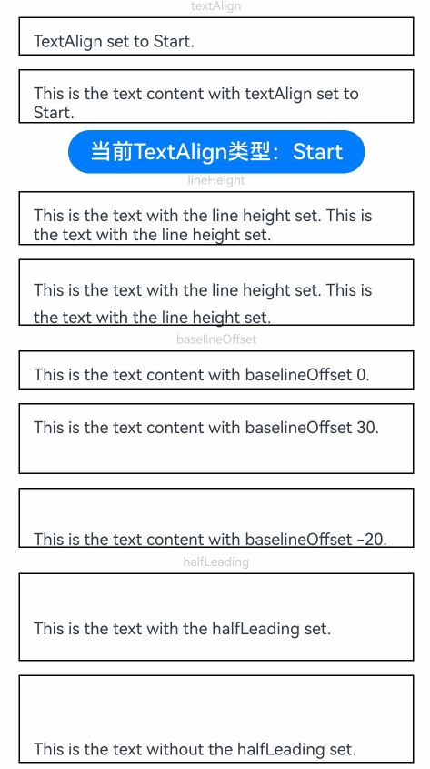
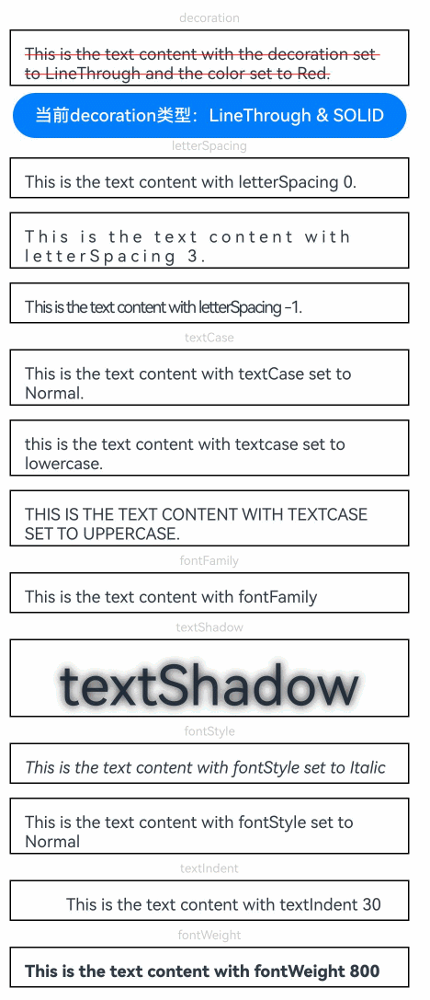
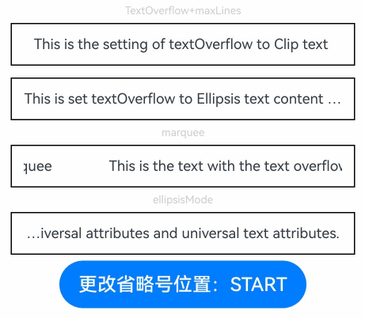
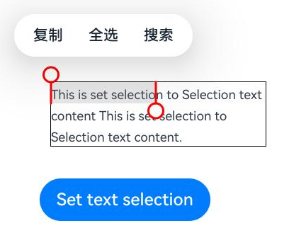
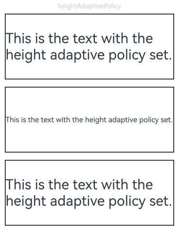
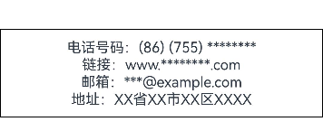
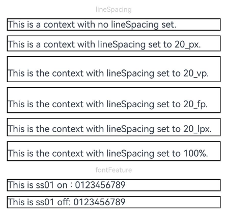
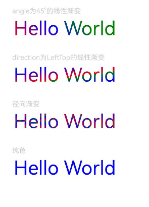
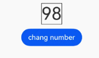

# Text
<!--Kit: ArkUI-->
<!--Subsystem: ArkUI-->
<!--Owner: @xiangyuan6-->
<!--Designer: @pssea-->
<!--Tester: @jiaoaozihao-->
<!--Adviser: @HelloCrease-->

显示一段文本的组件。

>  **说明：**
>
>  该组件从API version 7开始支持。后续版本如有新增内容，则采用上角标单独标记该内容的起始版本。
>
>  <!--RP3--><!--RP3End-->


## 子组件

可以包含[Span](ts-basic-components-span.md)、[ImageSpan](ts-basic-components-imagespan.md)、[SymbolSpan](ts-basic-components-symbolSpan.md)和[ContainerSpan](ts-basic-components-containerspan.md)子组件。

>  **说明：**
>
>  使用[子组件](#子组件)实现[图文混排](../../../ui/arkts-text-image-layout.md)场景。

## 接口

Text(content?: string | Resource , value?: TextOptions)

**卡片能力：** 从API version 9开始，该接口支持在ArkTS卡片中使用。

**原子化服务API：** 从API version 11开始，该接口支持在原子化服务中使用。

**系统能力：** SystemCapability.ArkUI.ArkUI.Full

**参数：**

| 参数名 | 类型 | 必填 | 说明 |
| -------- | -------- | -------- | -------- |
| content | string \| [Resource](ts-types.md#resource) | 否 | 文本内容。当不包含子组件[Span](ts-basic-components-span.md)和未设置[属性字符串](ts-universal-styled-string.md)时该参数生效。<br/>默认值：' '<br/>**说明：** <br/>显示内容的优先级：属性字符串>Span>Text的文本内容。 |
| value<sup>11+</sup> | [TextOptions](#textoptions11) | 否 | 文本组件初始化选项。|

## 属性

除支持[通用属性](ts-component-general-attributes.md)，还支持以下属性：

### textAlign

textAlign(value: TextAlign)

设置文本段落在水平方向的对齐方式。

文本段落宽度占满Text组件宽度。

可通过[align](ts-universal-attributes-location.md#align)属性控制文本段落在垂直方向上的位置，此组件中不可通过align属性控制文本段落在水平方向上的位置，具体效果如下：

- Alignment.TopStart、Alignment.Top、Alignment.TopEnd：内容顶部对齐。

- Alignment.Start、Alignment.Center、Alignment.End：内容垂直居中。

- Alignment.BottomStart、Alignment.Bottom、Alignment.BottomEnd：内容底部对齐。

当textAlign属性设置为TextAlign.JUSTIFY时，需要根据文本内容设置[wordBreak](#wordbreak11)属性，且最后一行文本水平对齐首部，不参与两端对齐。

**卡片能力：** 从API version 9开始，该接口支持在ArkTS卡片中使用。

**原子化服务API：** 从API version 11开始，该接口支持在原子化服务中使用。

**系统能力：** SystemCapability.ArkUI.ArkUI.Full

**参数：** 

| 参数名 | 类型                                        | 必填 | 说明                                                       |
| ------ | ------------------------------------------- | ---- | ---------------------------------------------------------- |
| value  | [TextAlign](ts-appendix-enums.md#textalign) | 是   | 文本段落在水平方向的对齐方式。<br/>默认值：TextAlign.Start<br/>Wearable设备上默认值为：TextAlign.Center |

>  **说明：**  
>
>  textAlign只能调整文本整体的布局，不影响字符的显示顺序。若需要调整字符的显示顺序，请参考[镜像状态字符对齐](../../../ui/arkts-internationalization.md#镜像状态字符对齐)。

### textVerticalAlign<sup>20+</sup>

textVerticalAlign(textVerticalAlign: Optional\<TextVerticalAlign>)

设置文本段落在垂直方向的对齐方式。

与[halfLeading](#halfleading12)同时配置时，halfLeading不生效。

**原子化服务API：** 从API version 20开始，该接口支持在原子化服务中使用。

**系统能力：** SystemCapability.ArkUI.ArkUI.Full

**参数：**

| 参数名 | 类型                                        | 必填 | 说明                                                       |
| ------ | ------------------------------------------- | ---- | ---------------------------------------------------------- |
| textVerticalAlign  | [Optional](ts-universal-attributes-custom-property.md#optionalt12)\<[TextVerticalAlign](ts-text-common.md#textverticalalign20)> | 是   | 文本段落在垂直方向的对齐方式。<br/>默认值：TextVerticalAlign.BASELINE |

### textOverflow

textOverflow(options: TextOverflowOptions)

设置文本超长时的显示方式。

当[TextOverflowOptions](#textoverflowoptions18对象说明)设置为TextOverflow.None、TextOverflow.Clip或TextOverflow.Ellipsis时：

- 设置为TextOverflow.None、TextOverflow.Clip，文本超长时按最大行截断显示。

- 设置为TextOverflow.Ellipsis，文本超长时显示不下的文本用省略号代替。

- 需配合[maxLines](#maxlines)使用，单独设置不生效。

- 断行规则参考[wordBreak](#wordbreak11)。默认情况下参考WordBreak.BREAK_WORD的截断方式，文本截断按字进行。例如，英文以单词为最小单位进行截断。若需要以字母为单位进行截断，可设置wordBreak属性为WordBreak.BREAK_ALL。

- 折行规则参考[lineBreakStrategy](#linebreakstrategy12)。该属性在[wordBreak](#wordbreak11)不等于WordBreak.BREAK_ALL的时候生效，不支持连词符。

- 从API version 11开始，建议优先组合[textOverflow](#textoverflow)和[wordBreak](#wordbreak11)属性来设置截断方式，具体详见[示例4设置文本断行及折行](#示例4设置文本断行及折行)<!--RP1--><!--RP1End-->。

当TextOverflowOptions设置为TextOverflow.MARQUEE时：

- 文本在一行内滚动显示。

- 设置[maxLines](#maxlines)及[copyOption](#copyoption9)属性均不生效。

- Text组件[clip](ts-universal-attributes-sharp-clipping.md#clip12)属性默认为true。

- 属性字符串的[CustomSpan](ts-universal-styled-string.md#customspan)不支持跑马灯模式。

- [textAlign](#textalign)属性的生效规则：当文本不可滚动时，textAlign属性生效；当文本可滚动时，textAlign属性不生效。

- 从API version 12开始，当TextOverflowOptions设置为TextOverflow.MARQUEE时，支持ImageSpan组件，文本和图片可在一行内滚动显示。

**卡片能力：** 从API version 9开始，该接口支持在ArkTS卡片中使用。

**原子化服务API：** 从API version 11开始，该接口支持在原子化服务中使用。

**系统能力：** SystemCapability.ArkUI.ArkUI.Full

**参数：** 

| 参数名 | 类型                                                         | 必填 | 说明                                                         |
| ------ | ------------------------------------------------------------ | ---- | ------------------------------------------------------------ |
| options | [TextOverflowOptions](#textoverflowoptions18对象说明) | 是   | 文本超长显示方式对象 |

### maxLines

maxLines(value: number)

设置文本的最大行数。

默认情况下，文本是自动折行的，如果指定此属性，则文本最多不会超过指定的行。如果有多余的文本，可以通过[textOverflow](#textoverflow)来指定截断方式。

**卡片能力：** 从API version 9开始，该接口支持在ArkTS卡片中使用。

**原子化服务API：** 从API version 11开始，该接口支持在原子化服务中使用。

**系统能力：** SystemCapability.ArkUI.ArkUI.Full

**参数：** 

| 参数名 | 类型   | 必填 | 说明             |
| ------ | ------ | ---- | ---------------- |
| value  | number | 是   | 文本的最大行数。<br/>**说明：** <br/>取值范围：[0, INT32_MAX]<br/>设置为0时，不显示文本内容。 |

### lineHeight

lineHeight(value: number | string | Resource)

设置文本的文本行高。

设置值不大于0时，不限制文本行高，自适应字体大小，number类型时单位为fp。string类型支持number类型取值的字符串形式，可以附带单位，例如"10"、"10fp"。

**卡片能力：** 从API version 9开始，该接口支持在ArkTS卡片中使用。

**原子化服务API：** 从API version 11开始，该接口支持在原子化服务中使用。

**系统能力：** SystemCapability.ArkUI.ArkUI.Full

**参数：** 

| 参数名 | 类型                                                         | 必填 | 说明             |
| ------ | ------------------------------------------------------------ | ---- | ---------------- |
| value  | number&nbsp;\|&nbsp;string&nbsp;\|&nbsp;[Resource](ts-types.md#resource) | 是   | 文本的文本行高。 |

>  **说明：**
>  
>  特殊字符字体高度远超出同行的其他字符高度时，文本框出现截断、遮挡、内容相对位置发生变化等不符合预期的显示异常，需要开发者调整组件高度、行高等属性，修改对应的页面布局。

### decoration

decoration(value: DecorationStyleInterface)

设置文本装饰线样式及其颜色。

**卡片能力：** 从API version 9开始，该接口支持在ArkTS卡片中使用。

**原子化服务API：** 从API version 11开始，该接口支持在原子化服务中使用。

**系统能力：** SystemCapability.ArkUI.ArkUI.Full

**参数：** 

| 参数名 | 类型                                                         | 必填 | 说明                                                         |
| ------ | ------------------------------------------------------------ | ---- | ------------------------------------------------------------ |
| value  | [DecorationStyleInterface<sup>12+</sup>](ts-universal-styled-string.md#decorationstyleinterface) | 是   | 文本装饰线样式对象。<br/>默认值：<br/>{<br/>&nbsp;type:&nbsp;TextDecorationType.None,<br/>&nbsp;color:&nbsp;Color.Black,<br/>&nbsp;style:&nbsp;TextDecorationStyle.SOLID&nbsp;<br/>}<br/>**说明：** <br/>style参数不支持卡片能力。 |

>  **说明：**
>
>  当文字的下边缘轮廓与装饰线位置相交时，会触发下划线避让规则，下划线将在这些字符处避让文字。常见“gjyqp”等英文字符。

### baselineOffset

baselineOffset(value: number | ResourceStr)

设置文本基线的偏移量。

设置该值为百分比时，按默认值显示。

正数内容向上偏移，负数向下偏移。

**卡片能力：** 从API version 9开始，该接口支持在ArkTS卡片中使用。

**原子化服务API：** 从API version 11开始，该接口支持在原子化服务中使用。

**系统能力：** SystemCapability.ArkUI.ArkUI.Full

**参数：** 

| 参数名 | 类型                       | 必填 | 说明                             |
| ------ | -------------------------- | ---- | -------------------------------- |
| value  | number&nbsp;\|&nbsp;[ResourceStr](ts-types.md#resourcestr) | 是   | 文本基线的偏移量。<br/>默认值：0 <br>从API version 20开始，支持Resource类型。|

### letterSpacing

letterSpacing(value: number | ResourceStr)

设置文本字符间距。

设置该值为百分比时，按默认值显示。设置该值为0时，按默认值显示。string类型支持number类型取值的字符串形式，可以附带单位，例如"10"、"10fp"。

当取值为负值时，文字会被压缩。负值过小时会将组件内容区大小压缩为0，导致内容无法显示。

对每个字符生效，包括行尾字符。

**卡片能力：** 从API version 9开始，该接口支持在ArkTS卡片中使用。

**原子化服务API：** 从API version 11开始，该接口支持在原子化服务中使用。

**系统能力：** SystemCapability.ArkUI.ArkUI.Full

**参数：** 

| 参数名 | 类型                       | 必填 | 说明           |
| ------ | -------------------------- | ---- | -------------- |
| value  | number&nbsp;\|&nbsp;[ResourceStr](ts-types.md#resourcestr) | 是   | 文本字符间距。<br/>默认值：0<br/>单位：[fp](ts-pixel-units.md) <br>从API version 20开始，支持Resource类型。|

### minFontSize

minFontSize(value: number | string | Resource)

设置文本最小显示字号。

string类型支持number类型取值的字符串形式，可以附带单位，例如"10"、"10fp"。

需配合[maxFontSize](#maxfontsize)以及[maxLines](#maxlines)或布局大小限制使用，单独设置不生效。

自适应字号生效时，fontSize设置不生效。

minFontSize小于或等于0时，自适应字号不生效，此时按照[fontSize](#fontsize)属性的值生效，未设置时按照其默认值生效。

从API version 18开始，支持在子组件和属性字符串上生效，未设置字号的部分会自适应。

**卡片能力：** 从API version 9开始，该接口支持在ArkTS卡片中使用。

**原子化服务API：** 从API version 11开始，该接口支持在原子化服务中使用。

**系统能力：** SystemCapability.ArkUI.ArkUI.Full

**参数：** 

| 参数名 | 类型                                                         | 必填 | 说明               |
| ------ | ------------------------------------------------------------ | ---- | ------------------ |
| value  | number&nbsp;\|&nbsp;string&nbsp;\|&nbsp;[Resource](ts-types.md#resource) | 是   | 文本最小显示字号。<br/>单位：[fp](ts-pixel-units.md) |

### maxFontSize

maxFontSize(value: number | string | Resource)

设置文本最大显示字号。

string类型支持number类型取值的字符串形式，可以附带单位，例如"10"、"10fp"。

需配合[minFontSize](#minfontsize)以及[maxLines](#maxlines)或布局大小限制使用，单独设置不生效。

自适应字号生效时，fontSize设置不生效。

maxFontSize小于等于0或者maxFontSize小于minFontSize时，自适应字号不生效，此时按照[fontSize](#fontsize)属性的值生效，未设置时按照其默认值生效。

从API version 18开始支持在子组件和属性字符串上生效，未设置字号的部分会自适应。

**卡片能力：** 从API version 9开始，该接口支持在ArkTS卡片中使用。

**原子化服务API：** 从API version 11开始，该接口支持在原子化服务中使用。

**系统能力：** SystemCapability.ArkUI.ArkUI.Full

**参数：** 

| 参数名 | 类型                                                         | 必填 | 说明               |
| ------ | ------------------------------------------------------------ | ---- | ------------------ |
| value  | number&nbsp;\|&nbsp;string&nbsp;\|&nbsp;[Resource](ts-types.md#resource) | 是   | 文本最大显示字号。<br/>单位：[fp](ts-pixel-units.md) |

### textCase

textCase(value: TextCase)

设置文本大小写。

**卡片能力：** 从API version 9开始，该接口支持在ArkTS卡片中使用。

**原子化服务API：** 从API version 11开始，该接口支持在原子化服务中使用。

**系统能力：** SystemCapability.ArkUI.ArkUI.Full

**参数：** 

| 参数名 | 类型                                      | 必填 | 说明                                      |
| ------ | ----------------------------------------- | ---- | ----------------------------------------- |
| value  | [TextCase](ts-appendix-enums.md#textcase) | 是   | 文本大小写。<br />默认值：TextCase.Normal |

### fontColor

fontColor(value: ResourceColor)

设置字体颜色。

**卡片能力：** 从API version 9开始，该接口支持在ArkTS卡片中使用。

**原子化服务API：** 从API version 11开始，该接口支持在原子化服务中使用。

**系统能力：** SystemCapability.ArkUI.ArkUI.Full

**参数：** 

| 参数名 | 类型                                       | 必填 | 说明       |
| ------ | ------------------------------------------ | ---- | ---------- |
| value  | [ResourceColor](ts-types.md#resourcecolor) | 是   | 字体颜色。<br />默认值：'#e6182431'<br />Wearable设备上默认值为：'#c5ffffff' |

### fontSize

fontSize(value: number | string | Resource)

设置字体大小。

**卡片能力：** 从API version 9开始，该接口支持在ArkTS卡片中使用。

**原子化服务API：** 从API version 11开始，该接口支持在原子化服务中使用。

**系统能力：** SystemCapability.ArkUI.ArkUI.Full

**参数：** 

| 参数名 | 类型                                                         | 必填 | 说明                                                         |
| ------ | ------------------------------------------------------------ | ---- | ------------------------------------------------------------ |
| value  | number&nbsp;\|&nbsp;string&nbsp;\|&nbsp;[Resource](ts-types.md#resource) | 是   | 字体大小。fontSize为number类型时，使用fp单位。不支持设置百分比字符串。<br />默认值：16fp<br />Wearable设备上默认值为：15fp |

### fontStyle

fontStyle(value: FontStyle)

设置字体样式。

**卡片能力：** 从API version 9开始，该接口支持在ArkTS卡片中使用。

**原子化服务API：** 从API version 11开始，该接口支持在原子化服务中使用。

**系统能力：** SystemCapability.ArkUI.ArkUI.Full

**参数：** 

| 参数名 | 类型                                        | 必填 | 说明                                    |
| ------ | ------------------------------------------- | ---- | --------------------------------------- |
| value  | [FontStyle](ts-appendix-enums.md#fontstyle) | 是   | 字体样式。<br/>默认值：FontStyle.Normal |

### fontWeight

fontWeight(value: number | FontWeight | ResourceStr)

设置文本的字体粗细，设置过大可能会在不同字体下有截断。

**卡片能力：** 从API version 9开始，该接口支持在ArkTS卡片中使用。

**原子化服务API：** 从API version 11开始，该接口支持在原子化服务中使用。

**系统能力：** SystemCapability.ArkUI.ArkUI.Full

**参数：** 

| 参数名 | 类型                                                         | 必填 | 说明                                                         |
| ------ | ------------------------------------------------------------ | ---- | ------------------------------------------------------------ |
| value  | number&nbsp;\|&nbsp;[FontWeight](ts-appendix-enums.md#fontweight)&nbsp;\|&nbsp;[ResourceStr](ts-types.md#resourcestr) | 是   | 文本的字体粗细，number类型取值[100,&nbsp;900]，取值间隔为100，默认为400，取值越大，字体越粗。string类型仅支持number类型取值的字符串形式，例如"400"，以及"bold"、"bolder"、"lighter"、"regular"、"medium"，分别对应FontWeight中相应的枚举值。<br/>默认值：FontWeight.Normal<br/>Wearable设备上默认值为：FontWeight.Regular <br>从API version 20开始，支持Resource类型。|

### fontFamily

fontFamily(value: string | Resource)

设置字体族。

**卡片能力：** 从API version 9开始，该接口支持在ArkTS卡片中使用。

**原子化服务API：** 从API version 11开始，该接口支持在原子化服务中使用。

**系统能力：** SystemCapability.ArkUI.ArkUI.Full

**参数：** 

| 参数名 | 类型                                                 | 必填 | 说明                                                         |
| ------ | ---------------------------------------------------- | ---- | ------------------------------------------------------------ |
| value  | string&nbsp;\|&nbsp;[Resource](ts-types.md#resource) | 是   | 字体族。默认字体'HarmonyOS Sans'。<br>使用多个字体时，请用逗号','分隔，字体的优先级按顺序生效。例如：'Arial, HarmonyOS Sans'。<br>应用当前支持'HarmonyOS Sans'字体和注册自定义字体[loadFontSync](../../apis-arkgraphics2d/js-apis-graphics-text.md#loadfontsync)。<br>卡片当前仅支持'HarmonyOS Sans'字体。 |

### copyOption<sup>9+</sup>

copyOption(value: CopyOptions)

设置组件是否支持文本可复制粘贴。

从API version 20开始，当Text组件执行复制操作时，会将HTML格式的内容添加到剪贴板中。

- 当Text组件包含子组件时，仅支持[Span](ts-basic-components-span.md)和[ImageSpan](ts-basic-components-imagespan.md)子组件向剪贴板中添加HTML格式的内容。

- 设置Text组件的属性字符串时，请参考属性字符串[toHtml](ts-universal-styled-string.md#tohtml14)接口文档，以了解支持转换为HTML的范围。

设置copyOption为CopyOptions.InApp或者CopyOptions.LocalDevice时：

- 长按文本，会弹出文本选择菜单，可选中文本并进行复制、全选操作。

- 默认情况下，长按选中文本可拖拽。若要取消此功能，可将 `draggable` 设置为 `false`。

- 若需要支持Ctrl+C复制，需同时设置[textSelectable](#textselectable12)为TextSelectableMode.SELECTABLE_FOCUSABLE。

此时Text会监听onClick事件，手势事件为非冒泡事件，若需要点击Text组件区域响应父组件的点击手势事件，建议在父组件上使用[parallelGesture](ts-gesture-settings.md#parallelgesture)绑定手势识别，也可参考[示例7设置文本识别](#示例7设置文本识别)。

由于卡片没有长按事件，此场景下长按文本，不会弹出文本选择菜单。

**卡片能力：** 从API version 9开始，该接口支持在ArkTS卡片中使用。

**原子化服务API：** 从API version 11开始，该接口支持在原子化服务中使用。

**系统能力：** SystemCapability.ArkUI.ArkUI.Full

**参数：** 

| 参数名 | 类型                                             | 必填 | 说明                                                       |
| ------ | ------------------------------------------------ | ---- | ---------------------------------------------------------- |
| value  | [CopyOptions](ts-appendix-enums.md#copyoptions9) | 是   | 组件是否支持文本可复制粘贴。<br />默认值：CopyOptions.None |

### contentTransition<sup>20+</sup>

contentTransition(transition: Optional\<ContentTransition>)

可以设置为数字翻牌动效[NumericTextTransition](../arkui-ts/ts-text-common.md#numerictexttransition20)。

**原子化服务API：** 从API version 20开始，该接口支持在原子化服务中使用。

**系统能力：** SystemCapability.ArkUI.ArkUI.Full

**参数：** 

| 参数名 | 类型                                             | 必填 | 说明                                                       |
| ------ | ------------------------------------------------ | ---- | ---------------------------------------------------------- |
| transition  | Optional\<[ContentTransition](../arkui-ts/ts-text-common.md#contenttransition20)> | 是   | 文本动效属性。 |

### draggable<sup>9+</sup>

draggable(value: boolean)

设置选中文本拖拽效果。

不能和[onDragStart](ts-universal-events-drag-drop.md#ondragstart)事件同时使用。

当draggable设置为true时，需配合[CopyOptions](ts-appendix-enums.md#copyoptions9)使用，设置copyOptions为CopyOptions.InApp或者CopyOptions.LocalDevice，支持对选中文本的拖拽及复制到输入框。

**原子化服务API：** 从API version 11开始，该接口支持在原子化服务中使用。

**系统能力：** SystemCapability.ArkUI.ArkUI.Full

**参数：** 

| 参数名 | 类型    | 必填 | 说明                                 |
| ------ | ------- | ---- | ------------------------------------ |
| value  | boolean | 是   | 选中文本拖拽效果。<br/>true表示选中文本可拖拽，false表示不可拖拽。<br/>默认值：false |

### font<sup>10+</sup>

font(value: Font)

设置文本样式。

包括字体大小、字体粗细、字体族和字体风格。

**原子化服务API：** 从API version 11开始，该接口支持在原子化服务中使用。

**系统能力：** SystemCapability.ArkUI.ArkUI.Full

**参数：** 

| 参数名 | 类型    | 必填 | 说明       |
| ------ | ------- | ---- | ---------- |
| value  | [Font](ts-types.md#font) | 是   | 文本样式。 |

### textShadow<sup>10+</sup>

textShadow(value: ShadowOptions | Array&lt;ShadowOptions&gt;)

设置文字阴影效果。

不支持fill字段和智能取色模式。

从API version 11开始，该接口支持以数组形式入参，实现多重文字阴影。

**卡片能力：** 从API version 10开始，该接口支持在ArkTS卡片中使用。

**原子化服务API：** 从API version 11开始，该接口支持在原子化服务中使用。

**系统能力：** SystemCapability.ArkUI.ArkUI.Full

**参数：** 

| 参数名 | 类型                                                         | 必填 | 说明           |
| ------ | ------------------------------------------------------------ | ---- | -------------- |
| value  | [ShadowOptions](ts-universal-attributes-image-effect.md#shadowoptions对象说明)&nbsp;\|&nbsp;&nbsp;Array&lt;[ShadowOptions](ts-universal-attributes-image-effect.md#shadowoptions对象说明)&gt;<sup>11+</sup> | 是   | 文字阴影效果。 |

### heightAdaptivePolicy<sup>10+</sup>

heightAdaptivePolicy(value: TextHeightAdaptivePolicy)

设置文本自适应布局调整字号的方式。

规则如下：

- MAX_LINES_FIRST模式：优先使用[maxLines](#maxlines)属性来调整文本高度。如果使用maxLines属性的布局大小超过了布局约束，则尝试在[minFontSize](#minfontsize)和[maxFontSize](#maxfontsize)的范围内缩小字体以显示更多文本。

- MIN_FONT_SIZE_FIRST模式：优先使用minFontSize属性来调整文本高度。如果使用minFontSize属性可以将文本布局在一行中，则尝试在minFontSize和maxFontSize的范围内增大字体并使用最大可能的字体大小在一行内显示，否则按minFontSize显示。

- LAYOUT_CONSTRAINT_FIRST模式：优先使用布局约束来调整文本高度。如果布局大小超过布局约束，则尝试在minFontSize和maxFontSize的范围内缩小字体以满足布局约束。如果将字体大小缩小到minFontSize后，布局大小仍然超过布局约束，则删除超过布局约束的行。

**原子化服务API：** 从API version 11开始，该接口支持在原子化服务中使用。

**系统能力：** SystemCapability.ArkUI.ArkUI.Full

**参数：** 

| 参数名 | 类型                                                         | 必填 | 说明                                                         |
| ------ | ------------------------------------------------------------ | ---- | ------------------------------------------------------------ |
| value  | [TextHeightAdaptivePolicy](ts-appendix-enums.md#textheightadaptivepolicy10) | 是   | 文本自适应高度的方式。<br/>默认值：TextHeightAdaptivePolicy.MAX_LINES_FIRST |

### textIndent<sup>10+</sup>

textIndent(value: Length)

设置首行文本缩进。

**原子化服务API：** 从API version 11开始，该接口支持在原子化服务中使用。

**系统能力：** SystemCapability.ArkUI.ArkUI.Full

**参数：** 

| 参数名 | 类型                         | 必填 | 说明                         |
| ------ | ---------------------------- | ---- | ---------------------------- |
| value  | [Length](ts-types.md#length) | 是   | 首行文本缩进。<br/>默认值：0 |

### wordBreak<sup>11+</sup>

wordBreak(value: WordBreak)

设置断行规则。

默认情况下，不调用wordBreak或者设置WordBreak.BREAK_WORD时，文本截断按字进行。例如，英文以单词为最小单位进行截断。

WordBreak.BREAK_ALL与{overflow:&nbsp;TextOverflow.Ellipsis}、maxLines组合使用，可实现英文单词按字母截断，超出部分以省略号显示。

**原子化服务API：** 从API version 11开始，该接口支持在原子化服务中使用。

**系统能力：** SystemCapability.ArkUI.ArkUI.Full

**参数：** 

| 参数名 | 类型                                          | 必填 | 说明                                          |
| ------ | --------------------------------------------- | ---- | --------------------------------------------- |
| value  | [WordBreak](ts-appendix-enums.md#wordbreak11) | 是   | 断行规则。 <br />默认值：WordBreak.BREAK_WORD |

### selection<sup>11+</sup>

selection(selectionStart: number, selectionEnd: number)

设置选中区域。

选中区域高亮且显示手柄和文本选择菜单。

当copyOption设置为CopyOptions.None时，设置selection属性不生效。

当overflow设置为TextOverflow.MARQUEE时，设置selection属性不生效。

当selectionStart大于等于selectionEnd时不选中。可选范围为[0, textSize]，其中textSize为文本内容最大字符数，入参小于0时处理为0，大于textSize时处理为textSize。

当selectionStart或selectionEnd位于截断的不可见区域时，文本不选中。截断为false时，超出父组件的文本选中区域生效。

可通过[onTextSelectionChange](#ontextselectionchange11)接口获取选区位置变化结果。

**原子化服务API：** 从API version 11开始，该接口支持在原子化服务中使用。

**系统能力：** SystemCapability.ArkUI.ArkUI.Full

**参数：** 

| 参数名         | 类型   | 必填 | 说明                                 |
| -------------- | ------ | ---- | ------------------------------------ |
| selectionStart | number | 是   | 所选文本的起始位置。<br />默认值：-1 |
| selectionEnd   | number | 是   | 所选文本的结束位置。<br />默认值：-1 |

### ellipsisMode<sup>11+</sup>

ellipsisMode(value: EllipsisMode)

设置省略位置。

ellipsisMode属性需要与overflow设置为TextOverflow.Ellipsis以及maxLines使用，单独设置ellipsisMode属性不生效。

EllipsisMode.START和EllipsisMode.CENTER仅在单行超长文本生效。

**原子化服务API：** 从API version 12开始，该接口支持在原子化服务中使用。

**系统能力：** SystemCapability.ArkUI.ArkUI.Full

**参数：** 

| 参数名 | 类型                                                | 必填 | 说明                                      |
| ------ | --------------------------------------------------- | ---- | ----------------------------------------- |
| value  | [EllipsisMode](ts-appendix-enums.md#ellipsismode11) | 是   | 省略位置。 <br />默认值：EllipsisMode.END |

### enableDataDetector<sup>11+</sup>

enableDataDetector(enable: boolean)

设置是否进行文本特殊实体识别。

该接口依赖设备底层应具有文本识别能力，否则设置不会生效。

当enableDataDetector设置为true，同时不设置[dataDetectorConfig](#datadetectorconfig11)属性时，默认识别所有类型的实体，所识别实体的color和decoration会被更改为如下样式：

```ts
color: '#ff007dff'
decoration:{
  type: TextDecorationType.Underline,
  color: '#ff007dff',
  style: TextDecorationStyle.SOLID
}
```

触摸点击和鼠标右键点击实体，会根据实体类型弹出对应的实体操作菜单，鼠标左键点击实体会直接响应菜单的第一个选项。

当overflow设置为TextOverflow.MARQUEE时，该功能不会生效。

当copyOption设置为CopyOptions.None时，点击实体弹出的菜单不包含选择文本、复制、翻译、分享和搜索功能。当copyOption不为CopyOptions.None，且textSelectable设置为TextSelectableMode.UNSELECTABLE时，仍然具有实体复制功能，但不包含选择文本功能。
<!--RP2--><!--RP2End-->

**原子化服务API：** 从API version 12开始，该接口支持在原子化服务中使用。

**系统能力：** SystemCapability.ArkUI.ArkUI.Full

**参数：** 

| 参数名 | 类型    | 必填 | 说明                              |
| ------ | ------- | ---- | --------------------------------- |
| enable  | boolean | 是   | 使能文本识别。<br/>true表示文本可实体识别，false表示不可识别。<br/>默认值：false |

### dataDetectorConfig<sup>11+</sup>

dataDetectorConfig(config: TextDataDetectorConfig)

设置文本识别配置，可配置识别类型、实体显示样式，以及是否开启长按预览等。

需配合[enableDataDetector](#enabledatadetector11)一起使用，设置enableDataDetector为true时，dataDetectorConfig的配置才能生效。

**原子化服务API：** 从API version 12开始，该接口支持在原子化服务中使用。

**系统能力：** SystemCapability.ArkUI.ArkUI.Full

**参数：** 

| 参数名 | 类型                                                        | 必填 | 说明                                                         |
| ------ | ----------------------------------------------------------- | ---- | ------------------------------------------------------------ |
| config | [TextDataDetectorConfig](ts-text-common.md#textdatadetectorconfig11对象说明) | 是   | 文本识别配置。|

### bindSelectionMenu<sup>11+</sup>

bindSelectionMenu(spanType: TextSpanType, content: CustomBuilder, responseType: TextResponseType,
    options?: SelectionMenuOptions)

设置自定义选择菜单。

bindSelectionMenu的长按响应时长为600ms，bindContextMenu的长按响应时长为800ms，当两者同时绑定且触发方式均为长按时，优先响应bindSelectionMenu。

自定义菜单超长时，建议内部嵌套使用[Scroll](./ts-container-scroll.md)组件，避免键盘被遮挡。

**原子化服务API：** 从API version 12开始，该接口支持在原子化服务中使用。

**系统能力：** SystemCapability.ArkUI.ArkUI.Full

**参数：** 

| 参数名       | 类型                                                         | 必填 | 说明                                                         |
| ------------ | ------------------------------------------------------------ | ---- | ------------------------------------------------------------ |
| spanType     | [TextSpanType](#textspantype11枚举说明)          | 是   | 选择菜单的类型。<br/>默认值：TextSpanType.TEXT               |
| content      | [CustomBuilder](ts-types.md#custombuilder8)                  | 是   | 选择菜单的内容。                                             |
| responseType | [TextResponseType](#textresponsetype11枚举说明)  | 是   | 选择菜单的响应类型。<br/>默认值：TextResponseType.LONG_PRESS |
| options      | [SelectionMenuOptions](ts-basic-components-richeditor.md#selectionmenuoptions) | 否   | 选择菜单的选项。                                             |

>  **说明：**
>
>  通过[editMenuOptions](#editmenuoptions12)设置文本选择菜单时，保留系统默认的风格，触发菜单弹出的条件不变。
>
>  通过[bindSelectionMenu](#bindselectionmenu11)设置文本选择菜单时，风格由开发者定义，触发菜单弹出的条件由开发者定义。

### fontFeature<sup>12+</sup>

fontFeature(value: string)

设置文字特性效果，比如数字等宽的特性。

格式为：normal \| \<feature-tag-value\>

\<feature-tag-value\>的格式为：\<string\> \[ \<integer\> \| on \| off ]

\<feature-tag-value\>的个数可以有多个，中间用','隔开。

例如，使用等宽数字的输入格式为："ss01" on。

**卡片能力：** 从API version 12开始，该接口支持在ArkTS卡片中使用。

**原子化服务API：** 从API version 12开始，该接口支持在原子化服务中使用。

**系统能力：** SystemCapability.ArkUI.ArkUI.Full

**参数：** 

| 参数名 | 类型   | 必填 | 说明           |
| ------ | ------ | ---- | -------------- |
| value  | string | 是   | 文字特性效果。 |

fontFeature属性列表：


设置fontFeature属性，fontFeature是OpenType字体的高级排版能力，如支持连字、数字等宽等特性，一般用在自定义字体中，其能力需要字体本身支持。
更多fontFeature能力介绍可参考[font-feature-settings property](https://www.w3.org/TR/css-fonts-3/#font-feature-settings-prop)和[OpenType Features](https://sparanoid.com/lab/opentype-features/)。

>  **说明：**
>
>  不支持Text内同时存在文本内容和Span或ImageSpan子组件。如果同时存在，只显示Span或ImageSpan内的内容。
>
>  字体排版引擎会对开发者传入的宽度[width](ts-universal-attributes-size.md#width)进行向下取整，保证是整型像素后进行排版。如果向上取整，可能会出现文字右侧被截断。
>
>  当多个Text组件在[Row](ts-container-row.md)容器内布局且没有设置具体的布局分配信息时，Text会以Row的最大尺寸进行布局。如果需要子组件主轴累加的尺寸不超过Row容器主轴的尺寸，可以设置[layoutWeight](ts-universal-attributes-size.md#layoutweight)或者是以[Flex](ts-universal-attributes-flex-layout.md)布局来约束子组件的主轴尺寸。
>
>  系统默认字体支持的liga连字：Th fb ff fb ffb ffh ffi ffk ffl fh fi fk。常导致Span、属性字符串的效果不符合预期，关闭liga连字特性可以规避。
>
>  文字特性效果与使用的字体文件密切相关。例如，8标点挤压功能在当前系统默认字体中仅对左侧标点符号生效，而右侧标点符号及感叹号、顿号、问号均不生效。

### lineSpacing<sup>12+</sup>

lineSpacing(value: LengthMetrics)

设置文本的行间距，设置值不大于0时，取默认值0。

**原子化服务API：** 从API version 12开始，该接口支持在原子化服务中使用。

**系统能力：** SystemCapability.ArkUI.ArkUI.Full

**参数：** 

| 参数名 | 类型                                                         | 必填 | 说明             |
| ------ | ------------------------------------------------------------ | ---- | ---------------- |
| value  | [LengthMetrics](../js-apis-arkui-graphics.md#lengthmetrics12) | 是   | 文本的行间距。默认值：0 |

### lineSpacing<sup>20+</sup>

lineSpacing(value: LengthMetrics, options?: LineSpacingOptions)

设置文本的行间距。当不配置LineSpacingOptions时，首行上方和尾行下方默认会有行间距。

**原子化服务API：** 从API version 20开始，该接口支持在原子化服务中使用。

**系统能力：** SystemCapability.ArkUI.ArkUI.Full

**参数：** 

| 参数名 | 类型                                                         | 必填 | 说明             |
| ------ | ------------------------------------------------------------ | ---- | ---------------- |
| value  | [LengthMetrics](../js-apis-arkui-graphics.md#lengthmetrics12) | 是   | 文本的行间距。设置值不大于0时，取默认值0。 |
| options  | [LineSpacingOptions](ts-text-common.md#linespacingoptions20对象说明) | 否   | 设置行间距配置项。<br/>默认值：{&nbsp;onlyBetweenLines:&nbsp;false&nbsp;} |

### privacySensitive<sup>12+</sup>

privacySensitive(supported: boolean)

设置是否支持卡片敏感隐私信息。

**卡片能力：** 从API version 12开始，该接口支持在ArkTS卡片中使用。

**原子化服务API：** 从API version 12开始，该接口支持在原子化服务中使用。

**系统能力：** SystemCapability.ArkUI.ArkUI.Full

**参数：**

| 参数名    | 类型    | 必填 | 说明                                                         |
| --------- | ------- | ---- | ------------------------------------------------------------ |
| supported | boolean | 是   | 是否支持卡片敏感隐私信息。<br/>默认值为false，当设置为true时，隐私模式下文字将被遮罩为横杠“-”样式。<br/>**说明：** <br/>设置为null则表示不敏感。<br/>进入隐私模式需要[卡片框架支持](./ts-universal-attributes-obscured.md)。 |

### lineBreakStrategy<sup>12+</sup>

lineBreakStrategy(strategy: LineBreakStrategy)

设置折行规则。该属性在[wordBreak](#wordbreak11)不等于WordBreak.BREAK_ALL的时候生效，且不支持连词符。

**原子化服务API：** 从API version 12开始，该接口支持在原子化服务中使用。

**系统能力：** SystemCapability.ArkUI.ArkUI.Full

**参数：** 

| 参数名   | 类型                                                         | 必填 | 说明                                                    |
| -------- | ------------------------------------------------------------ | ---- | ------------------------------------------------------- |
| strategy | [LineBreakStrategy](ts-appendix-enums.md#linebreakstrategy12) | 是   | 文本的折行规则。 <br />默认值：LineBreakStrategy.GREEDY |

### textSelectable<sup>12+</sup>

textSelectable(mode: TextSelectableMode)

设置是否支持文本可选择、可获焦。

需配合[copyOption](#copyoption9)使用。

**原子化服务API：** 从API version 12开始，该接口支持在原子化服务中使用。

**系统能力：** SystemCapability.ArkUI.ArkUI.Full

**参数：** 

| 参数名 | 类型                                          | 必填 | 说明                                          |
| ------ | --------------------------------------------- | ---- | --------------------------------------------- |
| mode  | [TextSelectableMode](ts-appendix-enums.md#textselectablemode12) | 是   | 文本是否支持可选择、可获焦。 <br />默认值：TextSelectableMode.SELECTABLE_UNFOCUSABLE |

### editMenuOptions<sup>12+</sup>

editMenuOptions(editMenu: EditMenuOptions)

设置自定义菜单扩展项，允许用户设置扩展项的文本内容、图标、回调方法。

调用[disableMenuItems](../arkts-apis-uicontext-textmenucontroller.md#disablemenuitems20)或[disableSystemServiceMenuItems](../arkts-apis-uicontext-textmenucontroller.md#disablesystemservicemenuitems20)接口屏蔽文本选择菜单内的系统服务菜单项时，editMenuOptions接口内回调方法[onCreateMenu](./ts-text-common.md#oncreatemenu12)的入参列表中不包含被屏蔽的菜单选项。

**原子化服务API：** 从API version 12开始，该接口支持在原子化服务中使用。

**系统能力：** SystemCapability.ArkUI.ArkUI.Full

**参数：** 

| 参数名 | 类型                                          | 必填 | 说明                                          |
| ------ | --------------------------------------------- | ---- | --------------------------------------------- |
| editMenu  | [EditMenuOptions](ts-text-common.md#editmenuoptions) | 是   | 扩展菜单选项。 |

>  **说明：**
>
>  通过[editMenuOptions](#editmenuoptions12)设置文本选择菜单时，保留系统默认的风格，触发菜单弹出的条件不变。
>
>  通过[bindSelectionMenu](#bindselectionmenu11)设置文本选择菜单时，风格由开发者定义，触发菜单弹出的条件由开发者定义。

### minFontScale<sup>12+</sup>

minFontScale(scale: number | Resource)

设置文本最小的字体缩放倍数。

**原子化服务API：** 从API version 12开始，该接口支持在原子化服务中使用。

**系统能力：** SystemCapability.ArkUI.ArkUI.Full

**参数：** 

| 参数名 | 类型                                          | 必填 | 说明                                          |
| ------ | --------------------------------------------- | ---- | --------------------------------------------- |
| scale  | number \| [Resource](ts-types.md#resource) | 是   | 文本最小的字体缩放倍数。<br/>取值范围：[0, 1]<br/>**说明：** <br/>设置的值小于0时按0处理，大于1时按1处理，其余异常值默认不生效。 |

### maxFontScale<sup>12+</sup>

maxFontScale(scale: number | Resource)

设置文本最大的字体缩放倍数。

**原子化服务API：** 从API version 12开始，该接口支持在原子化服务中使用。

**系统能力：** SystemCapability.ArkUI.ArkUI.Full

**参数：** 

| 参数名 | 类型                                          | 必填 | 说明                                          |
| ------ | --------------------------------------------- | ---- | --------------------------------------------- |
| scale  | number \| [Resource](ts-types.md#resource) | 是   | 文本最大的字体缩放倍数。<br/>取值范围：[1, +∞)<br/>**说明：** <br/>设置的值小于1时，按值为1处理，其余异常值默认不生效。 |

### halfLeading<sup>12+</sup>

halfLeading(halfLeading: boolean)

设置文本是否将行间距平分至行的顶部与底部。

**原子化服务API：** 从API version 12开始，该接口支持在原子化服务中使用。

**系统能力：** SystemCapability.ArkUI.ArkUI.Full

**参数：** 

| 参数名 | 类型                                          | 必填 | 说明                                          |
| ------ | --------------------------------------------- | ---- | --------------------------------------------- |
| halfLeading | boolean | 是  | 文本是否将行间距平分至行的顶部与底部。<br/>true表示将行间距平分至行的顶部与底部，false则不平分。<br/>默认值：false |

### font<sup>12+</sup>

font(fontValue: Font, options?: FontSettingOptions)

设置文本样式，支持设置字体配置项。

仅Text组件生效，其子组件不生效。

**卡片能力：** 从API version 12开始，该接口支持在ArkTS卡片中使用。

**原子化服务API：** 从API version 12开始，该接口支持在原子化服务中使用。

**系统能力：** SystemCapability.ArkUI.ArkUI.Full

**参数：** 

| 参数名 | 类型                                          | 必填 | 说明                                          |
| ------ | --------------------------------------------- | ---- | --------------------------------------------- |
| fontValue | [Font](ts-types.md#font) | 是  | 设置文本样式。 |
| options | [FontSettingOptions](ts-text-common.md#fontsettingoptions12对象说明) | 否  | 设置字体配置项。 |

### fontWeight<sup>12+</sup>

fontWeight(weight: number | FontWeight | ResourceStr, options?: FontSettingOptions)

设置文本字重，支持设置字体配置项。

仅Text组件生效，其子组件不生效。

**卡片能力：** 从API version 12开始，该接口支持在ArkTS卡片中使用。

**原子化服务API：** 从API version 12开始，该接口支持在原子化服务中使用。

**系统能力：** SystemCapability.ArkUI.ArkUI.Full

**参数：** 

| 参数名 | 类型                                          | 必填 | 说明                                          |
| ------ | --------------------------------------------- | ---- | --------------------------------------------- |
| weight | number&nbsp;\|&nbsp;[FontWeight](ts-appendix-enums.md#fontweight)&nbsp;\|&nbsp;[ResourceStr](ts-types.md#resourcestr) | 是  | 设置文本字重。number类型取值[100,&nbsp;900]，取值间隔为100，默认为400，取值越大，字体越粗。string类型仅支持number类型取值的字符串形式，例如"400"，以及"bold"、"bolder"、"lighter"、"regular"、"medium"，分别对应FontWeight中相应的枚举值。 <br>从API version 20开始，支持Resource类型。|
| options | [FontSettingOptions](ts-text-common.md#fontsettingoptions12对象说明) | 否  | 设置字体配置项。 |

### enableHapticFeedback<sup>13+</sup>

enableHapticFeedback(isEnabled: boolean)

设置是否开启触控反馈。

**原子化服务API：** 从API version 13开始，该接口支持在原子化服务中使用。

**系统能力：** SystemCapability.ArkUI.ArkUI.Full

**参数：** 

| 参数名 | 类型    | 必填 | 说明                               |
| ------ | ------- | ---- | ---------------------------------- |
| isEnabled | boolean | 是   | 是否开启触控反馈。<br/>true表示开启，false表示不开启。<br/>默认值：true |

>  **说明：**
>
>  开启触控反馈时，需要在工程的module.json5中配置requestPermissions字段开启振动权限，配置如下：
> ```json
> "requestPermissions": [
>  {
>     "name": "ohos.permission.VIBRATE",
>  }
> ]
> ```

### optimizeTrailingSpace<sup>20+</sup>

optimizeTrailingSpace(optimize: Optional\<boolean>)

设置是否在文本布局过程中优化每行末尾的空格，可解决行尾空格影响对齐显示效果问题。

设置Text.optimizeTrailingSpace为true时：

* 多行、单行、图文混排等多种情况下均会优化行尾空格（TextAlign.Center或TextAlign.End时，优化效果明显）；

* 纯空格文本时，修饰线、阴影、背景色跟随空格文本显示；

* 行首空格不在优化范围内，行尾文本强制换行，每行行尾空格根据组件宽度优化行尾空格。

当纯空格文本设置优化行尾空格[optimizeTrailingSpace](#optimizetrailingspace20)为true时，不允许同时设置文本背景色[backgroundColor](ts-universal-attributes-background.md#backgroundcolor)、空格装饰线[decoration](#decoration)和对齐[textAlign](#textalign)三个属性。

**原子化服务API：** 从API version 20开始，该接口支持在原子化服务中使用。

**系统能力：** SystemCapability.ArkUI.ArkUI.Full

**参数：**

| 参数名           | 类型             | 必填 | 说明                                            |
| ---------------- | ------- | ---- | ----------------------------------------------- |
| optimize         | [Optional](ts-universal-attributes-custom-property.md#optionalt12)\<boolean> | 是   | 是否优化每行末尾的空格。<br/>true表示优化末尾空格，false则不优化。<br/>默认值：false |

### caretColor<sup>14+</sup>

caretColor(color: ResourceColor)

设置文本框选中区域手柄颜色。

**原子化服务API：** 从API version 14开始，该接口支持在原子化服务中使用。

**系统能力：** SystemCapability.ArkUI.ArkUI.Full

**参数：**

| 参数名 | 类型                                       | 必填 | 说明                                   |
| ------ | ------------------------------------------ | ---- | -------------------------------------- |
| color  | [ResourceColor](ts-types.md#resourcecolor) | 是   | 文本选中手柄颜色。<br/>默认值：'#007DFF' |

### selectedBackgroundColor<sup>14+</sup>

selectedBackgroundColor(color: ResourceColor)

设置文本选中底板颜色。如果未设置不透明度，默认为20%不透明度。

**原子化服务API：** 从API version 14开始，该接口支持在原子化服务中使用。

**系统能力：** SystemCapability.ArkUI.ArkUI.Full

**参数：**

| 参数名 | 类型                                       | 必填 | 说明                                       |
| ------ | ------------------------------------------ | ---- | ------------------------------------------ |
| color  | [ResourceColor](ts-types.md#resourcecolor) | 是   | 文本选中底板颜色。<br/>默认值：'#007DFF' |

### marqueeOptions<sup>18+</sup>

marqueeOptions(options: Optional\<TextMarqueeOptions>)

设置文本跑马灯模式的配置项。

当textOverflow设置为TextOverflow.MARQUEE时，marqueeOptions的设置才能生效。

**原子化服务API：** 从API version 18开始，该接口支持在原子化服务中使用。

**系统能力：** SystemCapability.ArkUI.ArkUI.Full

**参数：**

| 参数名 | 类型                                       | 必填 | 说明                                       |
| ------ | ------------------------------------------ | ---- | ------------------------------------------ |
| options | [Optional](ts-universal-attributes-custom-property.md#optionalt12)\<[TextMarqueeOptions](#textmarqueeoptions18对象说明)> | 是 | 当Text组件的textOverflow属性设置为MARQUEE时，可通过marqueeOptions设置跑马灯动效具体的属性，如开关、步长、循环次数、方向等。 |

### enableAutoSpacing<sup>20+</sup>

enableAutoSpacing(enabled: Optional\<boolean>)

设置是否开启中文与西文的自动间距。

**原子化服务API：** 从API version 20开始，该接口支持在原子化服务中使用。

**系统能力：** SystemCapability.ArkUI.ArkUI.Full

**参数：**

| 参数名 | 类型    | 必填 | 说明                               |
| ------ | ------- | ---- | ---------------------------------- |
| enabled | [Optional](ts-universal-attributes-custom-property.md#optionalt12)\<boolean> | 是   | 是否开启中文与西文的自动间距。<br/>true为开启自动间距，false为不开启。<br />默认值：false |

### shaderStyle<sup>20+</sup>

shaderStyle(shader: ShaderStyle)

可以显示为径向渐变[RadialGradientStyle](../arkui-ts/ts-text-common.md#radialgradientstyle20)或线性渐变[LinearGradientStyle](../arkui-ts/ts-text-common.md#lineargradientstyle20)或纯色[ColorShaderStyle](../arkui-ts/ts-text-common.md#colorshaderstyle20)的效果，shaderStyle的优先级高于[fontColor](../arkui-ts/ts-basic-components-symbolSpan.md#fontcolor)和AI识别，纯色建议使用[fontColor](../arkui-ts/ts-basic-components-symbolSpan.md#fontcolor)。

**原子化服务API：** 从API version 20开始，该接口支持在原子化服务中使用。

**系统能力：** SystemCapability.ArkUI.ArkUI.Full

**参数：**

| 参数名     | 类型                                         | 必填                             | 说明                               |
| -------------- | -------------------------------------------- | ----------------------------------- | ----------------------------------- |
| shader | [ShaderStyle](../arkui-ts/ts-text-common.md#shaderstyle20) | 是 | 径向渐变或线性渐变或纯色。<br/>根据传入的参数区分处理径向渐变[RadialGradientStyle](../arkui-ts/ts-text-common.md#radialgradientstyle20)或线性渐变[LinearGradientStyle](../arkui-ts/ts-text-common.md#lineargradientstyle20)或纯色[ColorShaderStyle](../arkui-ts/ts-text-common.md#colorshaderstyle20)，最终设置到Text文本上显示为渐变色效果。<br/>**说明：** <br/>当设置为径向渐变[RadialGradientStyle](../arkui-ts/ts-text-common.md#radialgradientstyle20)时，若[RadialGradientOptions](./ts-universal-attributes-gradient-color.md#radialgradientoptions18对象说明)的center参数设置到组件范围外时，可将repeating参数设置为true，此时渐变效果会更明显。 |

### textContentAlign<sup>21+</sup>

textContentAlign(textContentAlign: Optional\<TextContentAlign>)

设置文本内容区在组件内的垂直对齐方式。

此接口可以在文本内容区高度大于组件高度时生效，确保文本内容区的对齐方式正确显示。

**原子化服务API：** 从API version 21开始，该接口支持在原子化服务中使用。

**系统能力：** SystemCapability.ArkUI.ArkUI.Full

**参数：** 

| 参数名 | 类型                                        | 必填 | 说明                                                       |
| ------ | ------------------------------------------- | ---- | ---------------------------------------------------------- |
| textContentAlign  | [Optional](ts-universal-attributes-custom-property.md#optionalt12)\<[TextContentAlign](../arkui-ts/ts-text-common.md#textcontentalign21)> | 是   | 文本段落在垂直方向的对齐方式。<br/>默认(undefined和异常值情况下)和align属性设置为Center效果一致。|

## TextSpanType<sup>11+</sup>枚举说明

[Span](ts-basic-components-span.md)类型信息。

**系统能力：** SystemCapability.ArkUI.ArkUI.Full

| 名称 | 值 | 说明 |
| -------- | ---- | -------- |
| TEXT | 0 | Span为文字类型。<br/>**原子化服务API：** 从API version 12开始，该接口支持在原子化服务中使用。 |
| IMAGE | 1 | Span为图像类型。<br/>**原子化服务API：** 从API version 12开始，该接口支持在原子化服务中使用。 |
| MIXED | 2 | Span为图文混合类型。<br/>**原子化服务API：** 从API version 12开始，该接口支持在原子化服务中使用。 |
| DEFAULT<sup>15+</sup> | 3 | 注册此类型菜单但未注册TEXT、IMAGE、MIXED菜单时，文字类型、图片类型、图文混合类型都会触发并显示此类型对应的菜单。<br/>**原子化服务API：** 从API version 15开始，该接口支持在原子化服务中使用。 |

>  **说明：**
>
>  菜单类型的匹配顺序如下。例如，用户长按文本时，根据以下规则查找：
>  1. 查找是否注册了TextSpanType.TEXT、TextResponseType.LONG_PRESS菜单
>  2. 查找是否注册了TextSpanType.TEXT、TextResponseType.DEFAULT菜单
>  3. 查找是否注册了TextSpanType.DEFAULT、TextResponseType.LONG_PRESS菜单
>  4. 查找是否注册了TextSpanType.DEFAULT、TextResponseType.DEFAULT菜单

## TextResponseType<sup>11+</sup>枚举说明

选择菜单的响应类型。

**系统能力：** SystemCapability.ArkUI.ArkUI.Full

| 名称         | 值 |  说明          |
| ---------- | --- | ------------- |
| RIGHT_CLICK | 0 | 通过鼠标右键触发菜单弹出。<br/>**原子化服务API：** 从API version 12开始，该接口支持在原子化服务中使用。 |
| LONG_PRESS  | 1 | 通过长按触发菜单弹出。<br/>**原子化服务API：** 从API version 12开始，该接口支持在原子化服务中使用。 |
| SELECT | 2 | 通过鼠标选中触发菜单弹出。<br/>**原子化服务API：** 从API version 12开始，该接口支持在原子化服务中使用。 |
| DEFAULT<sup>15+</sup> | 3 | 注册此类型的菜单，但未注册RIGHT_CLICK、LONG_PRESS、SELECT时，右键、长按、鼠标选中均会触发并显示此类型对应的菜单。<br/>**原子化服务API：** 从API version 15开始，该接口支持在原子化服务中使用。 |

>  **说明：**
>
>  菜单类型的匹配顺序如下。例如，用户长按文本时，根据以下规则查找：
>  1. 查找是否注册了TextSpanType.TEXT、TextResponseType.LONG_PRESS菜单
>  2. 查找是否注册了TextSpanType.TEXT、TextResponseType.DEFAULT菜单
>  3. 查找是否注册了TextSpanType.DEFAULT、TextResponseType.LONG_PRESS菜单
>  4. 查找是否注册了TextSpanType.DEFAULT、TextResponseType.DEFAULT菜单

## TextOverflowOptions<sup>18+</sup>对象说明

文本超长显示方式对象。

> **说明：**
>
> 为规范匿名对象的定义，API 18版本修改了此处的元素定义。其中，保留了历史匿名对象的起始版本信息，会出现外层元素@since版本号高于内层元素版本号的情况，但这不影响接口的使用。

**卡片能力：** 从API version 18开始，该接口支持在ArkTS卡片中使用。

**原子化服务API：** 从API version 18开始，该接口支持在原子化服务中使用。

**系统能力：** SystemCapability.ArkUI.ArkUI.Full

| 名称 | 类型                                                         | 只读 | 可选 | 说明                                                         |
| ------ | ------------------------------------------------------------ | ---- |---- | ------------------------------------------------------------ |
| overflow<sup>7+</sup>  | [TextOverflow](ts-appendix-enums.md#textoverflow) | 否 | 否  | 文本超长时的显示方式。<br/>默认值：TextOverflow.Clip <br/>**卡片能力：** 从API version 9开始，该接口支持在ArkTS卡片中使用。<br/>**原子化服务API：** 从API version 11开始，该接口支持在原子化服务中使用。 |

## 事件

除支持[通用事件](ts-component-general-events.md)外，还支持以下事件：

### onCopy<sup>11+</sup>

onCopy(callback:(value:&nbsp;string)&nbsp;=&gt;&nbsp;void)

长按文本内部区域弹出剪贴板后，点击剪贴板复制按钮，触发该回调。目前只有文本可以复制。

**原子化服务API：** 从API version 11开始，该接口支持在原子化服务中使用。

**系统能力：** SystemCapability.ArkUI.ArkUI.Full

**参数：** 

| 参数名 | 类型   | 必填 | 说明             |
| ------ | ------ | ---- | ---------------- |
| value  | string | 是   | 复制的文本内容。 |

### onTextSelectionChange<sup>11+</sup>

onTextSelectionChange(callback: (selectionStart: number, selectionEnd: number) => void)

文本选择的位置发生变化时，触发该回调。

**原子化服务API：** 从API version 12开始，该接口支持在原子化服务中使用。

**系统能力：** SystemCapability.ArkUI.ArkUI.Full

**参数：** 

| 参数名         | 类型   | 必填 | 说明                 |
| -------------- | ------ | ---- | -------------------- |
| selectionStart | number | 是   | 所选文本的起始位置。 |
| selectionEnd   | number | 是   | 所选文本的结束位置。 |

### onMarqueeStateChange<sup>18+</sup>

onMarqueeStateChange(callback: Callback\<MarqueeState\>)

跑马灯动画进行到特定的阶段时，触发该回调。

**原子化服务API：** 从API version 18开始，该接口支持在原子化服务中使用。

**系统能力：** SystemCapability.ArkUI.ArkUI.Full

**参数：**

| 参数名    | 类型                                             | 必填  | 说明                       |
|--------|---------------------------------------------------|-----|--------------------------|
| callback  | Callback\<[MarqueeState](#marqueestate18枚举说明)\> | 是   | 通过callback参数指定触发回调的状态，状态由MarqueeState枚举定义，例如开始滚动、滚动一次、滚动完成。 |

## TextOptions<sup>11+</sup>

Text初始化参数。

**原子化服务API：** 从API version 12开始，该接口支持在原子化服务中使用。

**系统能力：** SystemCapability.ArkUI.ArkUI.Full

| 名称 | 类型 | 只读 | 可选 | 说明 |
| -------- | -------- | -------- | -------- | -------- |
| controller | [TextController](#textcontroller11)  | 否 | 否 | 文本控制器。 |

## TextController<sup>11+</sup>

Text组件的控制器。

**原子化服务API：** 从API version 12开始，该接口支持在原子化服务中使用。

**系统能力：** SystemCapability.ArkUI.ArkUI.Full

### 导入对象

```
controller: TextController = new TextController()
```

### closeSelectionMenu<sup>11+</sup>

closeSelectionMenu(): void

关闭自定义选择菜单或系统默认选择菜单。

**原子化服务API：** 从API version 12开始，该接口支持在原子化服务中使用。

**系统能力：** SystemCapability.ArkUI.ArkUI.Full

### setStyledString<sup>12+</sup>

setStyledString(value: StyledString): void

触发绑定或更新属性字符串。

**原子化服务API：** 从API version 12开始，该接口支持在原子化服务中使用。

**系统能力：** SystemCapability.ArkUI.ArkUI.Full

**参数：**

| 参数名   | 类型   | 必填   | 说明                |
| ----- | ------ | ---- | ------------------- |
| value | [StyledString](ts-universal-styled-string.md#styledstring) | 是    | 属性字符串。<br/>**说明：** <br/>StyledString的子类[MutableStyledString](ts-universal-styled-string.md#mutablestyledstring)也可以作为入参值。 |

>  **说明：**    
>  多次调用setStyledString，会用新的入参覆盖已绑定的属性字符串，而不是叠加新的入参。
> 
>  属性字符串通过controller绑定时，需要等待布局完成后，绑定生效。当[measure](../js-apis-arkui-frameNode.md#measure12)和setStyledString同时使用，开发者需要通过[@ohos.arkui.inspector (布局回调)](../js-apis-arkui-inspector.md)判断布局完成，再绑定属性字符串。
>
>  在API version 14及以下版本，开发者调用TextController的setStyledString接口设置属性字符串，如果调用时TextController还未绑定对应的Text，则此次设置无效。
>
>  从API version 15开始，TextController会保存设置的属性字符串。当TextController已经和Text绑定，则Text会自动设置属性字符串，显示对应的样式。
>  
>  这一区别体现在[aboutToAppear](./ts-custom-component-lifecycle.md#abouttoappear)中设置属性字符串，API 14及以下版本不生效，API 15及以上版本生效，推荐用法请参考[创建并应用StyledString和MutableStyledString](../../../ui/arkts-styled-string.md#创建并应用styledstring和mutablestyledstring)。


### getLayoutManager<sup>12+</sup>

getLayoutManager(): LayoutManager

获取布局管理器对象。

**原子化服务API：** 从API version 12开始，该接口支持在原子化服务中使用。

**系统能力：** SystemCapability.ArkUI.ArkUI.Full

**返回值：**

| 类型                                       | 说明      |
| ---------------------------------------- | ------- |
| [LayoutManager](ts-text-common.md#layoutmanager12) | 布局管理器对象。 |

## TextMarqueeOptions<sup>18+</sup>对象说明

Marquee初始化参数。

**原子化服务API：** 从API version 18开始，该接口支持在原子化服务中使用。

**系统能力：** SystemCapability.ArkUI.ArkUI.Full

| 名称                | 类型                                              | 只读 | 可选 | 说明                                                                                  |
|--------------------|-------------------------------------------------|----|----|-------------------------------------------------------------------------------------|
| start              | boolean                                         | 否  | 否 | 控制跑马灯进入播放状态。<br/>true表示播放，false表示不播放。                           |
| step               | number                                          | 否  | 是 | 滚动动画文本滚动步长。<br/>默认值：4.0vp                                                           |
| loop               | number                                          | 否  | 是 | 设置重复滚动的次数，小于等于零时无限循环。<br/>默认值：-1                                                    |
| fromStart          | boolean                                         | 否  | 是 | 设置文本从头开始滚动或反向滚动。<br/>true表示从头开始滚动，false表示反向滚动。<br/>默认值：true                                                  |
| delay              | number                                          | 否  | 是 | 设置每次滚动的时间间隔。<br/>默认值：0 <br/>单位：毫秒                                                             |
| fadeout            | boolean                                         | 否  | 是 | 设置文字超长时的渐隐效果。<br/>true表示支持渐隐效果，false表示不支持渐隐效果。<br/>当Text内容超出显示范围时，未完全展现的文字边缘将应用渐隐效果。若两端均有文字未完全显示，则两端同时应用渐隐效果。在渐隐效果开启状态下，clip属性将自动锁定为true，不允许设置为false。<br/>默认值：false  |
| marqueeStartPolicy | [MarqueeStartPolicy](#marqueestartpolicy18枚举说明) | 否  | 是 | 设置跑马灯启动策略。<br/>默认值：MarqueeStartPolicy.DEFAULT                                       |

## MarqueeStartPolicy<sup>18+</sup>枚举说明

Marquee的滚动方式，可选择默认持续滚动或条件触发滚动。

**原子化服务API：** 从API version 18开始，该接口支持在原子化服务中使用。

**系统能力：** SystemCapability.ArkUI.ArkUI.Full

| 名称        | 值 | 说明            |
|----------|----|---------------|
| DEFAULT  | 0  | 默认持续滚动。       |
| ON_FOCUS | 1  | 获焦以及鼠标悬浮时开始滚动。 |

## MarqueeState<sup>18+</sup>枚举说明

Marquee状态回调的返回值。

**原子化服务API：** 从API version 18开始，该接口支持在原子化服务中使用。

**系统能力：** SystemCapability.ArkUI.ArkUI.Full

| 名称     | 值 | 说明                            |
|--------|----|-------------------------------|
| START  | 0  | 跑马灯滚动开始。                     |
| BOUNCE | 1  | 完成一次跑马灯滚动，如果循环次数不是1，将会多次返回。 |
| FINISH | 2  | 跑马灯全部循环次数完成。              |

## 示例

### 示例1（设置文本布局）
该示例通过[textAlign](#textalign)、[lineHeight](#lineheight)、[baselineOffset](#baselineoffset)、[halfLeading](#halfleading12)（从API version 12开始）属性展示了文本布局的效果。
```ts
// xxx.ets
@Extend(Text)
function style(TextAlign: TextAlign) {
  .textAlign(TextAlign)
  .fontSize(12)
  .border({ width: 1 })
  .padding(10)
  .width('100%')
  .margin(5)
}

@Entry
@Component
struct TextExample1 {
  @State changeTextAlignIndex: number = 0;
  @State changeDecorationIndex: number = 0;
  @State textAlign: TextAlign[] = [TextAlign.Start, TextAlign.Center, TextAlign.End];
  @State textAlignStr: string[] = ['Start', 'Center', 'End'];

  build() {
    Flex({ direction: FlexDirection.Column, alignItems: ItemAlign.Center }) {
      // 设置文本水平方向对齐方式
      // 单行文本
      Text('textAlign').fontSize(9).fontColor(0xCCCCCC)
      Text(`TextAlign set to ${this.textAlignStr[this.changeTextAlignIndex]}.`)
        .style(this.textAlign[this.changeTextAlignIndex])

      // 多行文本
      Text(`This is the text content with textAlign set to ${this.textAlignStr[this.changeTextAlignIndex]}.`)
        .style(this.textAlign[this.changeTextAlignIndex])
        .margin(5)

      Row() {
        Button('当前TextAlign类型：' + this.textAlignStr[this.changeTextAlignIndex]).onClick(() => {
          this.changeTextAlignIndex++;
          if (this.changeTextAlignIndex > (this.textAlignStr.length - 1)) {
            this.changeTextAlignIndex = 0;
          }
        })
      }.justifyContent(FlexAlign.Center).width('100%')

      // 设置文本行高
      Text('lineHeight').fontSize(9).fontColor(0xCCCCCC)
      Text('This is the text with the line height set. This is the text with the line height set.')
        .style(TextAlign.Start)
      Text('This is the text with the line height set. This is the text with the line height set.')
        .style(TextAlign.Start)
        .lineHeight(20)

      // 设置文本基线偏移
      Text('baselineOffset').fontSize(9).fontColor(0xCCCCCC)
      Text('This is the text content with baselineOffset 0.')
        .baselineOffset(0)
        .style(TextAlign.Start)
      Text('This is the text content with baselineOffset 30.')
        .baselineOffset(30)
        .style(TextAlign.Start)
      Text('This is the text content with baselineOffset -20.')
        .baselineOffset(-20)
        .style(TextAlign.Start)

      // 设置文本是否居中对齐
      Text('halfLeading').fontSize(9).fontColor(0xCCCCCC)
      Text("This is the text with the halfLeading set.")
        .lineHeight(60)
        .halfLeading(true)
        .style(TextAlign.Start)
      Text("This is the text without the halfLeading set.")
        .lineHeight(60)
        .halfLeading(false)
        .style(TextAlign.Start)
    }.height(600).width('100%').padding({ left: 35, right: 35, top: 35 })
  }
}
```


### 示例2（设置文本样式）

该示例通过[decoration](#decoration)、[letterSpacing](#letterspacing)、[textCase](#textcase)、[fontFamily](#fontfamily)、[textShadow](#textshadow10)（从API version 10开始）、fontStyle、[textIndent](#textindent10)（从API version 10开始）、[fontWeight](#fontweight12)（从API version 12开始，支持设置字重无极调节配置项）属性展示了不同样式的文本效果。

```ts
// xxx.ets
@Extend(Text)
function style() {
  .font({ size: 12 })
  .border({ width: 1 })
  .padding(10)
  .width('100%')
  .margin(5)
}

@Entry
@Component
struct TextExample2 {
  @State changeDecorationIndex: number = 0;
  @State textDecorationType: TextDecorationType[] =
    [TextDecorationType.LineThrough, TextDecorationType.Overline, TextDecorationType.Underline];
  @State textDecorationTypeStr: string[] = ['LineThrough', 'Overline', 'Underline'];
  @State textDecorationStyle: TextDecorationStyle[] =
    [TextDecorationStyle.SOLID, TextDecorationStyle.DOTTED, TextDecorationStyle.WAVY];
  @State textDecorationStyleStr: string[] = ['SOLID', 'DOTTED', 'WAVY'];

  build() {
    Flex({ direction: FlexDirection.Column, alignItems: ItemAlign.Center }) {
      Text('decoration').fontSize(9).fontColor(0xCCCCCC)
      Text('This is the text content with the decoration set to LineThrough and the color set to Red.')
        .decoration({
          type: this.textDecorationType[this.changeDecorationIndex],
          color: Color.Red,
          style: this.textDecorationStyle[this.changeDecorationIndex]
        })
        .style()
        .margin(5)

      Row() {
        Button('decoration type：' + this.textDecorationTypeStr[this.changeDecorationIndex] + ' & ' +
        this.textDecorationStyleStr[this.changeDecorationIndex]).onClick(() => {
          this.changeDecorationIndex++;
          if (this.changeDecorationIndex > (this.textDecorationTypeStr.length - 1)) {
            this.changeDecorationIndex = 0;
          }
        })
      }.justifyContent(FlexAlign.Center).width('100%')

      // 文本字符间距
      Text('letterSpacing').fontSize(9).fontColor(0xCCCCCC)
      Text('This is the text content with letterSpacing 0.')
        .letterSpacing(0)
        .style()
      Text('This is the text content with letterSpacing 3.')
        .letterSpacing(3)
        .style()
      Text('This is the text content with letterSpacing -1.')
        .letterSpacing(-1)
        .style()

      Text('textCase').fontSize(9).fontColor(0xCCCCCC)
      Text('This is the text content with textCase set to Normal.')
        .textCase(TextCase.Normal)
        .style()
      // 文本全小写展示
      Text('This is the text content with textCase set to LowerCase.')
        .textCase(TextCase.LowerCase)
        .style()
      // 文本全大写展示
      Text('This is the text content with textCase set to UpperCase.')
        .textCase(TextCase.UpperCase)
        .style()

      Text('fontFamily').fontSize(9).fontColor(0xCCCCCC)
      // 设置字体列表
      Text('This is the text content with fontFamily')
        .style()
        .fontFamily('HarmonyOS Sans')

      Text('textShadow').fontSize(9).fontColor(0xCCCCCC)
      // 设置文字阴影效果
      Text('textShadow')
        .style()
        .textAlign(TextAlign.Center)
        .fontSize(40)
        .textShadow({
          radius: 10,
          color: Color.Black,
          offsetX: 0,
          offsetY: 0
        })

      Text('fontStyle').fontSize(9).fontColor(0xCCCCCC)
      // 设置字体样式
      Text('This is the text content with fontStyle set to Italic')
        .style()
        .fontStyle(FontStyle.Italic)
      Text('This is the text content with fontStyle set to Normal')
        .style()
        .fontStyle(FontStyle.Normal)

      Text('textIndent').fontSize(9).fontColor(0xCCCCCC)
      // 设置文字缩进
      Text('This is the text content with textIndent 30')
        .style()
        .textIndent(30)

      Text('fontWeight').fontSize(9).fontColor(0xCCCCCC)
      // 设置文本的字体粗细
      Text('This is the text content with fontWeight 800')
        .style()
        .fontWeight('800', { enableVariableFontWeight: true })

    }.width('100%').padding({ left: 35, right: 35 })
  }
}
```


### 示例3（设置文本超长省略）

该示例通过[maxLines](#maxlines)、[textOverflow](#textoverflow)、[ellipsisMode](#ellipsismode11)（从API version 11开始）属性展示了文本超长省略以及调整省略位置的效果，同时，可以通过[marqueeOptions](#marqueeoptions18)（从API version 18开始）配置跑马灯模式下的配置项以及跑马灯动画进行到特定的阶段时，触发的回调[onMarqueeStateChange](#onmarqueestatechange18)（从API version 18开始）。

```ts
// xxx.ets
@Extend(Text)
function style() {
  .textAlign(TextAlign.Center)
  .fontSize(12)
  .border({ width: 1 })
  .padding(10)
  .width('100%')
  .margin(5)
}

@Entry
@Component
struct TextExample3 {
  @State text: string =
    'The text component is used to display a piece of textual information.Support universal attributes and universal text attributes.';
  @State ellipsisModeIndex: number = 0;
  @State ellipsisMode: EllipsisMode[] = [EllipsisMode.START, EllipsisMode.CENTER, EllipsisMode.END];
  @State ellipsisModeStr: string[] = ['START', 'CENTER', 'END'];

  build() {
    Flex({ direction: FlexDirection.Column, alignItems: ItemAlign.Center }) {
      // 文本超长时显示方式
      Text('TextOverflow+maxLines').fontSize(9).fontColor(0xCCCCCC)
      // 超出maxLines截断内容展示
      Text('This is the setting of textOverflow to Clip text content This is the setting of textOverflow to None text content. This is the setting of textOverflow to Clip text content This is the setting of textOverflow to None text content.')
        .textOverflow({ overflow: TextOverflow.Clip })
        .maxLines(1)
        .style()

      // 超出maxLines展示省略号
      Text('This is set textOverflow to Ellipsis text content This is set textOverflow to Ellipsis text content.')
        .textOverflow({ overflow: TextOverflow.Ellipsis })
        .maxLines(1)
        .style()

      Text('marquee').fontSize(9).fontColor(0xCCCCCC)
      // 设置文本超长时以跑马灯的方式展示
      Text('This is the text with the text overflow set marquee')
        .textOverflow({ overflow: TextOverflow.MARQUEE })
        .style()
        .marqueeOptions({
          start: true,
          fromStart: true,
          step: 6,
          loop: -1,
          delay: 0,
          fadeout: false,
          marqueeStartPolicy: MarqueeStartPolicy.DEFAULT
        })
        .onMarqueeStateChange((state: MarqueeState) => {
          if (state == MarqueeState.START) {
            // "收到状态: START";
          } else if (state == MarqueeState.BOUNCE) {
            // "收到状态: BOUNCE";
          } else if (state == MarqueeState.FINISH) {
            // "收到状态: FINISH";
          }
        })

      Text('ellipsisMode').fontSize(9).fontColor(0xCCCCCC)
      // 设置文本超长时省略号的位置
      Text(this.text)
        .textOverflow({ overflow: TextOverflow.Ellipsis })
        .ellipsisMode(this.ellipsisMode[this.ellipsisModeIndex])
        .maxLines(1)
        .style()

      Row() {
        Button('更改省略号位置：' + this.ellipsisModeStr[this.ellipsisModeIndex]).onClick(() => {
          this.ellipsisModeIndex++;
          if (this.ellipsisModeIndex > (this.ellipsisModeStr.length - 1)) {
            this.ellipsisModeIndex = 0;
          }
        })
      }
    }.height(600).width('100%').padding({ left: 35, right: 35, top: 35 })
  }
}
```



### 示例4（设置文本断行及折行）

该示例通过[wordBreak](#wordbreak11)（从API version 11开始）、[lineBreakStrategy](#linebreakstrategy12)（从API version 12开始）、[clip](ts-universal-attributes-sharp-clipping.md#clip12)属性展示了文本在不同断行、折行规则下的效果以及文本超长时是否截断。

```ts
// xxx.ets
@Extend(Text)
function style() {
  .fontSize(12)
  .border({ width: 1 })
  .padding(10)
  .width('100%')
  .margin(5)
}

@Entry
@Component
struct TextExample4 {
  @State text: string =
    'The text component is used to display a piece of textual information.Support universal attributes and universal text attributes.';
  @State text2: string =
    "They can be classified as built-in components–those directly provided by the ArkUI framework and custom components – those defined by developers" +
      "The built-in components include buttons radio buttons progress indicators and text You can set the rendering effect of these components in method chaining mode," +
      "page components are divided into independent UI units to implement independent creation development and reuse of different units on pages making pages more engineering-oriented.";
  @State textClip: boolean = false;
  @State wordBreakIndex: number = 0;
  @State wordBreak: WordBreak[] = [WordBreak.NORMAL, WordBreak.BREAK_ALL, WordBreak.BREAK_WORD];
  @State wordBreakStr: string[] = ['NORMAL', 'BREAK_ALL', 'BREAK_WORD'];
  @State lineBreakStrategyIndex: number = 0;
  @State lineBreakStrategy: LineBreakStrategy[] =
    [LineBreakStrategy.GREEDY, LineBreakStrategy.HIGH_QUALITY, LineBreakStrategy.BALANCED];
  @State lineBreakStrategyStr: string[] = ['GREEDY', 'HIGH_QUALITY', 'BALANCED'];

  build() {
    Flex({ direction: FlexDirection.Column, alignItems: ItemAlign.Center }) {
      Text('wordBreak').fontSize(9).fontColor(0xCCCCCC)
      // 设置文本断行规则
      Text(this.text)
        .maxLines(2)
        .textOverflow({ overflow: TextOverflow.Ellipsis })
        .wordBreak(this.wordBreak[this.wordBreakIndex])
        .style()

      Row() {
        Button('当前wordBreak模式：' + this.wordBreakStr[this.wordBreakIndex]).onClick(() => {
          this.wordBreakIndex++;
          if (this.wordBreakIndex > (this.wordBreakStr.length - 1)) {
            this.wordBreakIndex = 0;
          }
        })
      }

      Text('clip').fontSize(9).fontColor(0xCCCCCC)
      // 设置文本是否超长截断
      Text('This is set wordBreak to WordBreak text Taumatawhakatangihangakoauauotamateaturipukakapikimaungahoronukupokaiwhenuakitanatahu.')
        .wordBreak(WordBreak.NORMAL)
        .maxLines(2)
        .clip(this.textClip)
        .style()
      Row() {
        Button('切换clip：' + this.textClip).onClick(() => {
          this.textClip = !this.textClip;
        })
      }

      Text('lineBreakStrategy').fontSize(9).fontColor(0xCCCCCC)
      // 设置文本折行规则
      Text(this.text2)
        .lineBreakStrategy(this.lineBreakStrategy[this.lineBreakStrategyIndex])
        .style()
      Row() {
        Button('当前lineBreakStrategy模式：' + this.lineBreakStrategyStr[this.lineBreakStrategyIndex]).onClick(() => {
          this.lineBreakStrategyIndex++;
          if (this.lineBreakStrategyIndex > (this.lineBreakStrategyStr.length - 1)) {
            this.lineBreakStrategyIndex = 0;
          }
        })
      }
    }.height(600).width('100%').padding({ left: 35, right: 35, top: 35 })
  }
}
```


### 示例5（设置文本选中和复制）

该示例通过[selection](#selection11)（从API version 11开始）、[onCopy](#oncopy11)（从API version 11开始）、[draggable](#draggable9)（从API version 9开始）、[caretColor](#caretcolor14)（从API version 14开始）、[selectedBackgroundColor](#selectedbackgroundcolor14)（从API version 14开始）接口展示了文本选中、触发复制回调、设置文本选中可拖拽以及修改手柄和选中颜色的效果。

```ts
// xxx.ets
@Entry
@Component
struct TextExample5 {
  @State onCopy: string = '';
  @State text: string =
    'This is set selection to Selection text content This is set selection to Selection text content.';
  @State start: number = 0;
  @State end: number = 20;

  build() {
    Flex({ direction: FlexDirection.Column, alignItems: ItemAlign.Start, justifyContent: FlexAlign.Start }) {
      Text(this.text)
        .fontSize(12)
        .border({ width: 1 })
        .lineHeight(20)
        .margin(30)
        .copyOption(CopyOptions.InApp)
        .selection(this.start, this.end)
        .onCopy((value: string) => {
          this.onCopy = value;
        })
        .draggable(true)
        .caretColor(Color.Red)
        .selectedBackgroundColor(Color.Grey)
        .enableHapticFeedback(true)
      Button('Set text selection')
        .margin({ left: 20 })
        .onClick(() => {
          // 变更文本选中起始点、终点
          this.start = 10;
          this.end = 30;
        })
      Text(this.onCopy).fontSize(12).margin(10).key('copy')
    }.height(600).width(335).padding({ left: 35, right: 35, top: 35 })
  }
}
```


### 示例6（设置文本自适应和缩放倍数限制范围）

该示例通过[heightAdaptivePolicy](#heightadaptivepolicy10)（从API version 10开始）属性展示文本自适应效果以及通过[minFontScale](#minfontscale12)（从API version 12开始）、[maxFontScale](#maxfontscale12)（从API version 12开始）展示设置字体缩放倍数限制范围。

```ts
// xxx.ets
@Extend(Text)
function style(HeightAdaptivePolicy: TextHeightAdaptivePolicy) {
  .width('80%')
  .height(90)
  .borderWidth(1)
  .minFontSize(10)
  .maxFontSize(30)
  .maxLines(2)
  .margin(5)
  .textOverflow({ overflow: TextOverflow.Ellipsis })
  .heightAdaptivePolicy(HeightAdaptivePolicy)
}

@Entry
@Component
struct TextExample6 {
  build() {
    Flex({ direction: FlexDirection.Column, alignItems: ItemAlign.Center }) {
      // 设置文本自适应高度的方式
      Text('heightAdaptivePolicy').fontSize(9).fontColor(0xCCCCCC)
      Text('This is the text with the height adaptive policy set.')
        .style(TextHeightAdaptivePolicy.MAX_LINES_FIRST)
      Text('This is the text with the height adaptive policy set.')
        .style(TextHeightAdaptivePolicy.MIN_FONT_SIZE_FIRST)
      Text('This is the text with the height adaptive policy set.')
        .style(TextHeightAdaptivePolicy.LAYOUT_CONSTRAINT_FIRST)

      Text('fontScale').fontSize(9).fontColor(0xCCCCCC)
      Text('This is the text content with minFontScale set to 1 and maxFontScale set to 1.2')
        .style(TextHeightAdaptivePolicy.MAX_LINES_FIRST)
        .minFontScale(1)
        .maxFontScale(1.2)
    }.height(600).width('100%').padding({ left: 35, right: 35, top: 35 })
  }
}
```



### 示例7（设置文本识别）

从API version 11开始，该示例通过[enableDataDetector](#enabledatadetector11)、[dataDetectorConfig](#datadetectorconfig11)接口实现了文本识别的功能。

```ts
// xxx.ets
@Entry
@Component
struct TextExample7 {
  @State phoneNumber: string = '(86) (755) ********';
  @State url: string = 'www.********.com';
  @State email: string = '***@example.com';
  @State address: string = 'XX省XX市XX区XXXX';
  @State datetime: string = 'XX年XX月XX日XXXX';
  @State enableDataDetector: boolean = true;
  @State types: TextDataDetectorType[] = [];

  build() {
    Row() {
      Column() {
        Text(
          '电话号码：' + this.phoneNumber + '\n' +
            '链接：' + this.url + '\n' +
            '邮箱：' + this.email + '\n' +
            '地址：' + this.address + '\n' +
            '时间：' + this.datetime
        )
          .fontSize(16)
          .copyOption(CopyOptions.InApp)
          .enableDataDetector(this.enableDataDetector)
          .dataDetectorConfig({
            types: this.types, onDetectResultUpdate: (result: string) => {
            }
          })
          .textAlign(TextAlign.Center)
          .borderWidth(1)
          .padding(10)
          .width('100%')
      }
      .width('100%')
      // 使用parallelGesture中的TapGesture替代onClick属性，达到非冒泡事件类似冒泡
      // 的效果，点击Text组件区域Column上的点击事件正常响应
      .parallelGesture(TapGesture().onAction((event: GestureEvent) => {
        console.info('test column onClick timestamp:' + event.timestamp);
      }), GestureMask.Normal)
    }
    .height('100%')
  }
}
```



### 示例8（文本绑定自定义菜单）

从API version 11开始，该示例通过[bindSelectionMenu](#bindselectionmenu11)、[onTextSelectionChange](#ontextselectionchange11)、[closeSelectionMenu](#closeselectionmenu11)接口实现了文本绑定自定义菜单的功能。

```ts
// xxx.ets
@Entry
@Component
struct TextExample8 {
  controller: TextController = new TextController();
  options: TextOptions = { controller: this.controller };

  build() {
    Column() {
      Column() {
        Text(undefined, this.options) {
          Span('Hello World')
          // $r('app.media.startIcon')需要替换为开发者所需的图像资源文件。
          ImageSpan($r('app.media.startIcon'))
            .width(50)
            .height(50)
            .objectFit(ImageFit.Fill)
            .verticalAlign(ImageSpanAlignment.CENTER)
        }
        .copyOption(CopyOptions.InApp)
        .bindSelectionMenu(TextSpanType.IMAGE, this.LongPressImageCustomMenu, TextResponseType.LONG_PRESS, {
          onDisappear: () => {
            console.info(`自定义选择菜单关闭时回调`);
          },
          onAppear: () => {
            console.info(`自定义选择菜单弹出时回调`);
          }
        })
        .bindSelectionMenu(TextSpanType.TEXT, this.RightClickTextCustomMenu, TextResponseType.RIGHT_CLICK)
        .bindSelectionMenu(TextSpanType.MIXED, this.SelectMixCustomMenu, TextResponseType.SELECT)
        .onTextSelectionChange((selectionStart: number, selectionEnd: number) => {
          console.info(`文本选中区域变化回调, selectionStart: ${selectionStart}, selectionEnd: ${selectionEnd}`);
        })
        .borderWidth(1)
        .borderColor(Color.Red)
        .width(200)
        .height(100)
      }
      .width('100%')
      .backgroundColor(Color.White)
      .alignItems(HorizontalAlign.Start)
      .padding(25)
    }
    .height('100%')
  }

  @Builder
  RightClickTextCustomMenu() {
    Column() {
      Menu() {
        MenuItemGroup() {
          // $r('app.media.startIcon')需要替换为开发者所需的图像资源文件。
          MenuItem({ startIcon: $r('app.media.startIcon'), content: "Right Click Menu 1", labelInfo: "" })
            .onClick((event) => {
              this.controller.closeSelectionMenu();
            })
          MenuItem({ startIcon: $r('app.media.startIcon'), content: "Right Click Menu 2", labelInfo: "" })
          MenuItem({ startIcon: $r('app.media.startIcon'), content: "Right Click Menu 3", labelInfo: "" })
        }
      }
      .MenuStyles()
    }
  }

  @Builder
  LongPressImageCustomMenu() {
    Column() {
      Menu() {
        MenuItemGroup() {
          // $r('app.media.startIcon')需要替换为开发者所需的图像资源文件。
          MenuItem({ startIcon: $r('app.media.startIcon'), content: "Long Press Image Menu 1", labelInfo: "" })
            .onClick((event) => {
              this.controller.closeSelectionMenu();
            })
          MenuItem({ startIcon: $r('app.media.startIcon'), content: "Long Press Image Menu 2", labelInfo: "" })
          MenuItem({ startIcon: $r('app.media.startIcon'), content: "Long Press Image Menu 3", labelInfo: "" })
        }
      }
      .MenuStyles()
    }
  }

  @Builder
  SelectMixCustomMenu() {
    Column() {
      Menu() {
        MenuItemGroup() {
          // $r('app.media.startIcon')需要替换为开发者所需的图像资源文件。
          MenuItem({ startIcon: $r('app.media.startIcon'), content: "Select Mixed Menu 1", labelInfo: "" })
            .onClick((event) => {
              this.controller.closeSelectionMenu();
            })
          MenuItem({ startIcon: $r('app.media.startIcon'), content: "Select Mixed Menu 2", labelInfo: "" })
          MenuItem({ startIcon: $r('app.media.startIcon'), content: "Select Mixed Menu 3", labelInfo: "" })
        }
      }
      .MenuStyles()
    }
  }
}

@Extend(Menu)
function MenuStyles() {
  .radius($r('sys.float.ohos_id_corner_radius_card'))
  .clip(true)
  .backgroundColor('#F0F0F0')
}
```


### 示例9（设置文本特性与行间距）

从API version 12开始，该示例通过[fontFeature](#fontfeature12)、[lineSpacing](#linespacing12)接口展示了设置文本特性与行间距的效果，同时，配置[LineSpacingOptions](ts-text-common.md#linespacingoptions20对象说明)中的onlyBetweenLines（从API version 20开始）属性，可以设置文本的行间距，是否仅在行与行之间生效。

```ts
// xxx.ets
import { LengthMetrics } from '@kit.ArkUI';

@Extend(Text)
function style() {
  .fontSize(12)
  .border({ width: 1 })
  .width('100%')
}

@Entry
@Component
struct TextExample9 {
  build() {
    Flex({ direction: FlexDirection.Column, alignItems: ItemAlign.Center, justifyContent: FlexAlign.SpaceBetween }) {
      Text('lineSpacing').fontSize(9).fontColor(0xCCCCCC)
      // 设置文本行间距
      Text('This is a context with no lineSpacing set.')
        .lineSpacing(undefined)
        .style()
      Text('This is a context with lineSpacing set to 20_px.')
        .lineSpacing(LengthMetrics.px(20))
        .style()
      Text('This is the context with lineSpacing set to 20_vp.')
        .lineSpacing(LengthMetrics.vp(20))
        .style()
      Text('This is the context with lineSpacing set to 20_fp.')
        .lineSpacing(LengthMetrics.fp(20))
        .style()
      Text('This is the context with lineSpacing set to 20_lpx.')
        .lineSpacing(LengthMetrics.lpx(20))
        .style()
      Text('This is the context with lineSpacing set to 100%.')
        .lineSpacing(LengthMetrics.percent(1))
        .style()
      Text('The line spacing of this context is set to 20_px, and the spacing is effective only between the lines.')
        .lineSpacing(LengthMetrics.px(20), { onlyBetweenLines: true })
        .style()

      Text('fontFeature').fontSize(9).fontColor(0xCCCCCC)
      // 设置文本特性
      Text('This is ss01 on : 0123456789')
        .fontFeature("\"ss01\" on")
        .style()
      Text('This is ss01 off: 0123456789')
        .fontFeature("\"ss01\" off")
        .style()
    }.height(300).width(350).padding({ left: 35, right: 35, top: 35 })
  }
}
```



### 示例10（获取文本信息）

从API version 12开始，该示例通过[getLayoutManager](#getlayoutmanager12)接口调用文本的布局管理对象获取文本信息，同时，[LayoutManager](ts-text-common.md#layoutmanager12)中的[getRectsForRange](./ts-text-common.md#getrectsforrange14)（从API version 14开始）接口可以获取指定矩形宽度和高度下，文本中任意区间范围内字符或占位符的绘制区域信息。

```ts
// xxx.ets
import { text } from '@kit.ArkGraphics2D';

@Entry
@Component
struct TextExample10 {
  @State lineCount: string = "";
  @State glyphPositionAtCoordinate: string = "";
  @State lineMetrics: string = "";
  @State rectsForRangeStr: string = "";
  controller: TextController = new TextController();
  @State textStr: string =
    'Hello World! 您好，世界！';

  build() {
    Scroll() {
      Column() {
        Text('Text组件getLayoutManager接口获取段落相对组件的信息')
          .fontSize(15)
          .fontColor(0xCCCCCC)
          .width('90%')
          .padding(10)
        Text(this.textStr, { controller: this.controller })
          .fontSize(25)
          .borderWidth(1)
          .onAreaChange(() => {
            let layoutManager: LayoutManager = this.controller.getLayoutManager();
            this.lineCount = "LineCount: " + layoutManager.getLineCount();
          })

        Text('LineCount').fontSize(15).fontColor(0xCCCCCC).width('90%').padding(10)
        Text(this.lineCount)

        Text('GlyphPositionAtCoordinate').fontSize(15).fontColor(0xCCCCCC).width('90%').padding(10)
        Button("相对组件坐标[150,50]字形信息")
          .onClick(() => {
            let layoutManager: LayoutManager = this.controller.getLayoutManager();
            let position: PositionWithAffinity = layoutManager.getGlyphPositionAtCoordinate(150, 50);
            this.glyphPositionAtCoordinate =
              "相对组件坐标[150,50] glyphPositionAtCoordinate position: " + position.position + " affinity: " +
              position.affinity;
          })
          .margin({ bottom: 20, top: 10 })
        Text(this.glyphPositionAtCoordinate)

        Text('LineMetrics').fontSize(15).fontColor(0xCCCCCC).width('90%').padding(10)
        Button("首行行信息、文本样式信息、以及字体属性信息")
          .onClick(() => {
            let layoutManager: LayoutManager = this.controller.getLayoutManager();
            let lineMetrics: LineMetrics = layoutManager.getLineMetrics(0);
            this.lineMetrics = "lineMetrics is " + JSON.stringify(lineMetrics) + "\n\n";
            let runMetrics = lineMetrics.runMetrics;
            runMetrics.forEach((value, key) => {
              this.lineMetrics += "runMetrics key is " + key + " " + JSON.stringify(value) + "\n\n";
            })
          })
          .margin({ bottom: 20, top: 10 })
        Text(this.lineMetrics)

        Text('getRectsForRange').fontSize(15).fontColor(0xCCCCCC).width('90%').padding(10)
        Button("获取指定矩形宽度和高度下，文本中任意区间范围内字符或占位符的绘制区域信息")
          .onClick(() => {
            let layoutManager: LayoutManager = this.controller.getLayoutManager();
            let range: TextRange = { start: 0, end: 1 };
            let rectsForRangeInfo: text.TextBox[] =
              layoutManager.getRectsForRange(range, text.RectWidthStyle.TIGHT, text.RectHeightStyle.TIGHT);
            this.rectsForRangeStr = "getRectsForRange result is " + "\n\n";
            rectsForRangeInfo.forEach((value, key) => {
              this.rectsForRangeStr += "rectsForRange key is " + key + " " + JSON.stringify(value) + "\n\n";
            })
          })
          .margin({ bottom: 20, top: 10 })
        Text(this.rectsForRangeStr)
      }
      .margin({ top: 100, left: 8, right: 8 })
    }
  }
}
```


### 示例11（实现键盘框选文本）

从API version 12开始，该示例通过[textSelectable](#textselectable12)属性实现了设置TextSelectMode.SELECTABLE_FOCUSABLE时能够触发键盘框选文本功能。

```ts
// xxx.ets
@Entry
@Component
struct TextExample11 {
  @State message: string =
    'TextTextTextTextTextTextTextText' + 'TextTextTextTextTextTextTextTextTextTextTextTextTextTextTextText';

  build() {
    Column() {
      Text(this.message)
        .width(300)
        .height(100)
        .maxLines(5)
        .fontColor(Color.Black)
        .copyOption(CopyOptions.InApp)
        .selection(3, 8)
        .textSelectable(TextSelectableMode.SELECTABLE_FOCUSABLE)
    }.width('100%').margin({ top: 100 })
  }
}
```


### 示例12（文本扩展自定义菜单）

从API version 12开始，该示例通过[editMenuOptions](#editmenuoptions12)接口实现了文本设置自定义菜单扩展项的文本内容、图标以及回调的功能，同时，可以在[onPrepareMenu](ts-text-common.md#onpreparemenu20)（从API version 20开始）回调中，进行菜单数据的设置。

```ts
// xxx.ets
@Entry
@Component
struct TextExample12 {
  @State text: string = 'Text editMenuOptions'
  @State endIndex: number = 0;
  onCreateMenu = (menuItems: Array<TextMenuItem>) => {
    // $r('app.media.startIcon')需要替换为开发者所需的图像资源文件。
    let item1: TextMenuItem = {
      content: 'create1',
      icon: $r('app.media.startIcon'),
      id: TextMenuItemId.of('create1'),
    };
    let item2: TextMenuItem = {
      content: 'create2',
      id: TextMenuItemId.of('create2'),
      icon: $r('app.media.startIcon'),
    };
    menuItems.push(item1);
    menuItems.unshift(item2);
    return menuItems;
  }
  onMenuItemClick = (menuItem: TextMenuItem, textRange: TextRange) => {
    if (menuItem.id.equals(TextMenuItemId.of("create2"))) {
      console.info("拦截 id: create2 start:" + textRange.start + "; end:" + textRange.end);
      return true;
    }
    if (menuItem.id.equals(TextMenuItemId.of("prepare1"))) {
      console.info("拦截 id: prepare1 start:" + textRange.start + "; end:" + textRange.end);
      return true;
    }
    if (menuItem.id.equals(TextMenuItemId.COPY)) {
      console.info("拦截 COPY start:" + textRange.start + "; end:" + textRange.end);
      return true;
    }
    if (menuItem.id.equals(TextMenuItemId.SELECT_ALL)) {
      console.info("不拦截 SELECT_ALL start:" + textRange.start + "; end:" + textRange.end);
      return false;
    }
    return false;
  }
  // $r('app.media.startIcon')需要替换为开发者所需的图像资源文件。
  onPrepareMenu = (menuItems: Array<TextMenuItem>) => {
    let item1: TextMenuItem = {
      content: 'prepare1_' + this.endIndex,
      icon: $r('app.media.startIcon'),
      id: TextMenuItemId.of('prepare1'),
    };
    menuItems.unshift(item1);
    return menuItems;
  }
  @State editMenuOptions: EditMenuOptions = {
    onCreateMenu: this.onCreateMenu,
    onMenuItemClick: this.onMenuItemClick,
    onPrepareMenu: this.onPrepareMenu
  };

  build() {
    Column() {
      Text(this.text)
        .fontSize(20)
        .copyOption(CopyOptions.LocalDevice)
        .editMenuOptions(this.editMenuOptions)
        .margin({ top: 100 })
        .onTextSelectionChange((selectionStart: number, selectionEnd: number) => {
          this.endIndex = selectionEnd;
        })
    }
    .width("90%")
    .margin("5%")
  }
}
```


### 示例13（配置隐私隐藏）

从API version 12开始，该示例通过[privacySensitive](#privacysensitive12)属性展示了文本如何配置隐私隐藏的效果，实际显示需要卡片框架支持。

```ts
// xxx.ets
@Entry
@Component
struct TextExample13 {
  build() {
    Column({ space: 10 }) {
      Text("privacySensitive")
        .privacySensitive(true)
        .margin({ top: 30 })
    }
    .alignItems(HorizontalAlign.Center)
    .width("100%")
  }
}
```


### 示例14（设置中西文自动间距）

从API version 20开始，该示例通过[enableAutoSpacing](#enableautospacing20)属性设置中西文自动间距。

```ts
// xxx.ets
@Entry
@Component
struct TextExample {
  build() {
    Row() {
      Column() {
        Text('开启中西文自动间距').margin(5)
        Text('中西文Auto Spacing自动间距')
          .enableAutoSpacing(true)
        Text('关闭中西文自动间距').margin(5)
        Text('中西文Auto Spacing自动间距')
          .enableAutoSpacing(false)
      }.height('100%')
    }
    .width('60%')
  }
}
```


### 示例15（文本颜色按线性或径向渐变）

从API version 20开始，该示例通过[shaderStyle](#shaderstyle20)接口实现了对Text组件显示为渐变色和纯色的功能。

```ts
@Entry
@Component
struct ShaderColorStyle {
  @State message: string = 'Hello World';
  @State linearGradientOptions1: LinearGradientOptions =
    {
      angle: 45,
      colors: [[Color.Red, 0.0], [Color.Blue, 0.3], [Color.Green, 0.5]]
    };
  @State linearGradientOptions2: LinearGradientOptions =
    {
      direction: GradientDirection.LeftTop,
      colors: [[Color.Red, 0.0], [Color.Blue, 0.3], [Color.Green, 0.5]],
      repeating: true,
    };
  @State radialGradientOptions: RadialGradientOptions =
    {
      center: [50, 50],
      radius: 20,
      colors: [[Color.Red, 0.0], [Color.Blue, 0.3], [Color.Green, 0.5]],
      repeating: true,
    };
  @State colorShaderStyle: ColorShaderStyle =
    {
      color: Color.Blue
    };
  build() {
    Column({ space: 5 }) {
      Text('angle为45°的线性渐变').fontSize(18).width('90%').fontColor(0xCCCCCC)
        .margin({ top: 40, left: 40 })
      Text(this.message)
        .fontSize(50)
        .width('80%')
        .height(50)
        .shaderStyle(this.linearGradientOptions1)
      Text('direction为LeftTop的线性渐变').fontSize(18).width('90%').fontColor(0xCCCCCC)
        .margin({ top: 40, left: 40 })
      Text(this.message)
        .fontSize(50)
        .width('80%')
        .height(50)
        .shaderStyle(this.linearGradientOptions2)
      Text('径向渐变').fontSize(18).width('90%').fontColor(0xCCCCCC)
        .margin({ top: 40, left: 40 })
      Text(this.message)
        .fontSize(50)
        .width('80%')
        .height(50)
        .shaderStyle(this.radialGradientOptions)
      Text('纯色').fontSize(18).width('90%').fontColor(0xCCCCCC)
        .margin({ top: 40, left: 40 })
      Text(this.message)
        .fontSize(50)
        .width('80%')
        .height(50)
        .shaderStyle(this.colorShaderStyle)
    }
  }
}
```


### 示例16（配置除去行尾空格）

从API version 20开始，该示例通过[optimizeTrailingSpace](#optimizetrailingspace20)属性展示了文本如何配置除去行尾空格的效果，一般需要与对齐功能搭配使用，实际显示需要字体引擎支持。

```ts
// xxx.ets
@Entry
@Component
struct TextExample16 {
  build() {
    Column() {
      Text("Trimmed space enabled     ")
        .fontSize(30)
        .fontWeight(FontWeight.Bold)
        .margin({ top: 20 })
        .optimizeTrailingSpace(true)
        .textAlign(TextAlign.Center)
      Text("Trimmed space disabled     ")
        .fontSize(30)
        .fontWeight(FontWeight.Bold)
        .margin({ top: 20 })
        .optimizeTrailingSpace(false)
        .textAlign(TextAlign.Center)
    }
    .width("100%")
  }
}
```


### 示例17（文本垂直对齐）

从API version 20开始，该示例通过[textVerticalAlign](#textverticalalign20)属性展示了文本如何设置文本垂直对齐效果。

```ts
// xxx.ets
@Entry
@Component
struct TextExample14 {
  build() {
    Column({ space: 10 }) {
      Text() {
        Span("Hello")
          .fontSize(50)
        // $r('app.media.startIcon')需要替换为开发者所需的图像资源文件。
        ImageSpan($r('app.media.startIcon'))
          .width(30).height(30)
          .verticalAlign(ImageSpanAlignment.FOLLOW_PARAGRAPH)// 从API version 20开始，支持ImageSpanAlignment.FOLLOW_PARAGRAPH
        Span("World")
      }
      .textVerticalAlign(TextVerticalAlign.CENTER)
      .borderWidth(1)
    }
    .alignItems(HorizontalAlign.Center)
    .width("100%")
  }
}
```


### 示例18（文本翻牌动效）

从API version 20开始，该示例通过[contentTransition](#contenttransition20)属性展示了数字翻牌效果。

```ts
// xxx.ets
@Entry
@Component
struct TextNumberTransition {
  @State number: number = 98;
  @State numberTransition: NumericTextTransition = new NumericTextTransition({ flipDirection: FlipDirection.DOWN, enableBlur: false });

  build() {
    Column() {
      Text(this.number + "")
        .borderWidth(1)
        .fontSize(40)
        .contentTransition(this.numberTransition)
      Button("chang number")
        .onClick(() => {
          this.number++;
        })
        .margin(10)
    }
    .height('100%')
    .width('100%')
  }
}
```



### 示例19（文本内容区垂直对齐）

从API version 21开始，该示例通过[textContentAlign](#textcontentalign21)属性展示了当文本内容区高度大于组件高度时文本内容区的垂直对齐。

```ts
@Entry
@Component
struct TextContentAlignExample {

  build() {
    Column() {
      Row() {
        Text('这是一段展示文字')
          .fontSize(30)
          .backgroundColor(Color.Gray)
          .width('80%')
          .height(20)
          .textContentAlign(TextContentAlign.CENTER)
      }.height('60%')
    }
  }
}
```

