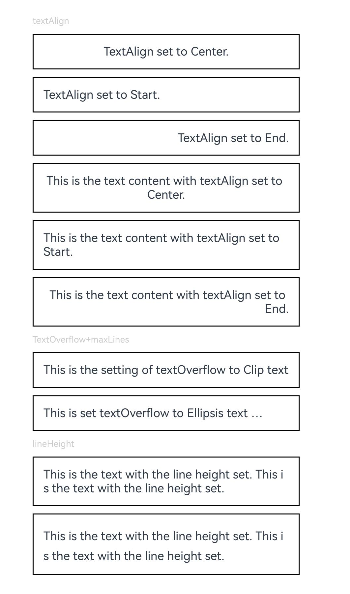
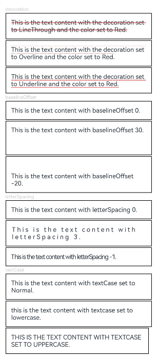
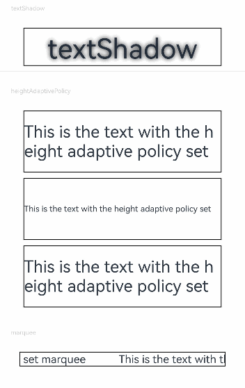
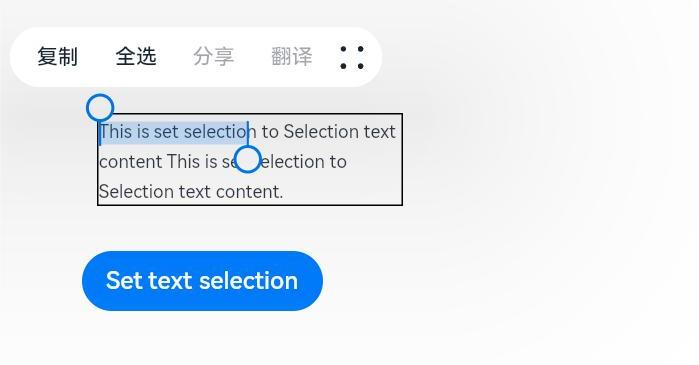
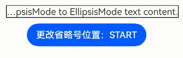
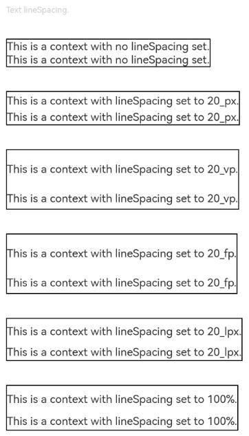
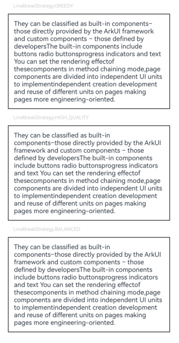

# Text

显示一段文本的组件。

>  **说明：**
>
>  该组件从API Version 7开始支持。后续版本如有新增内容，则采用上角标单独标记该内容的起始版本。


## 子组件

可以包含[Span](ts-basic-components-span.md)、[ImageSpan](ts-basic-components-imagespan.md)、[SymbolSpan](ts-basic-components-symbolSpan.md)和[ContainerSpan](ts-basic-components-containerspan.md)子组件。

## 接口

Text(content?: string | Resource , value?: TextOptions)

**卡片能力：** 从API version 9开始，该接口支持在ArkTS卡片中使用。

**元服务API：** 从API version 11开始，该接口支持在元服务中使用。

**参数：**

| 参数名 | 参数类型 | 必填 | 参数描述 |
| -------- | -------- | -------- | -------- |
| content | string \| [Resource](ts-types.md#resource) | 否 | 文本内容。包含子组件Span且未设置[属性字符串](ts-universal-styled-string.md#属性字符串)时不生效，显示Span内容，并且此时text组件的样式不生效。<br/>默认值：' ' |
| value<sup>11+</sup> | [TextOptions](#textoptions11) | 否 | 文本组件初始化选项。|

## 属性

除支持[通用属性](ts-universal-attributes-size.md)和[文本通用属性](ts-universal-attributes-text-style.md)外，还支持以下属性：

### textAlign

textAlign(value: TextAlign)

设置文本段落在水平方向的对齐方式。

文本段落宽度占满Text组件宽度。

可通过[align](ts-universal-attributes-location.md)属性控制文本段落在垂直方向上的位置，此组件中不可通过align属性控制文本段落在水平方向上的位置，即align属性中Alignment.TopStart、Alignment.Top、Alignment.TopEnd效果相同，控制内容在顶部，Alignment.Start、Alignment.Center、Alignment.End效果相同，控制内容垂直居中，Alignment.BottomStart、Alignment.Bottom、Alignment.BottomEnd效果相同，控制内容在底部。结合TextAlign属性可控制内容在水平方向的位置。

当textAlign属性设置为TextAlign.JUSTIFY时，最后一行文本不参与两端对齐，为水平对齐首部效果。

**卡片能力：** 从API version 9开始，该接口支持在ArkTS卡片中使用。

**元服务API：** 从API version 11开始，该接口支持在元服务中使用。

**系统能力：** SystemCapability.ArkUI.ArkUI.Full

**参数：** 

| 参数名 | 类型                                        | 必填 | 说明                                                       |
| ------ | ------------------------------------------- | ---- | ---------------------------------------------------------- |
| value  | [TextAlign](ts-appendix-enums.md#textalign) | 是   | 文本段落在水平方向的对齐方式。<br/>默认值：TextAlign.Start |

### textOverflow

textOverflow(value: { overflow: TextOverflow })

设置文本超长时的显示方式。

文本截断是按字截断。例如，英文以单词为最小单位进行截断，若需要以字母为单位进行截断，可在字母间添加零宽空格：\u200B。从API version 11开始，建议优先组合wordBreak属性设置为WordBreak.BREAK_ALL方式实现字母为单位进行截断，使用[示例](#示例4)。

当overflow设置为TextOverflow.None、TextOverflow.Clip、TextOverflow.Ellipsis时，需配合maxLines使用，单独设置不生效。设置TextOverflow.None与TextOverflow.Clip效果一样。

当overflow设置为TextOverflow.MARQUEE时，文本在一行内滚动显示，设置maxLines及copyOption属性均不生效，此时不支持ImageSpan组件，并且在文本不可滚动时，设置textAlign属性生效；在文本可滚动时，设置textAlign属性不生效。在跑马灯模式下，Text组件clip属性默认为true。

从API version 12开始，当overflow设置为TextOverflow.MARQUEE时，支持ImageSpan组件，文本和图片在一行内滚动显示。

**卡片能力：** 从API version 9开始，该接口支持在ArkTS卡片中使用。

**元服务API：** 从API version 11开始，该接口支持在元服务中使用。

**系统能力：** SystemCapability.ArkUI.ArkUI.Full

**参数：** 

| 参数名 | 类型                                                         | 必填 | 说明                                                         |
| ------ | ------------------------------------------------------------ | ---- | ------------------------------------------------------------ |
| value  | {overflow:&nbsp;[TextOverflow](ts-appendix-enums.md#textoverflow)} | 是   | 文本超长时的显示方式。<br/>默认值：{overflow:&nbsp;TextOverflow.Clip} |

### maxLines

maxLines(value: number)

设置文本的最大行数。默认情况下，文本是自动折行的，如果指定此属性，则文本最多不会超过指定的行。如果有多余的文本，可以通过[textOverflow](#textoverflow)来指定截断方式。

**卡片能力：** 从API version 9开始，该接口支持在ArkTS卡片中使用。

**元服务API：** 从API version 11开始，该接口支持在元服务中使用。

**系统能力：** SystemCapability.ArkUI.ArkUI.Full

**参数：** 

| 参数名 | 类型   | 必填 | 说明             |
| ------ | ------ | ---- | ---------------- |
| value  | number | 是   | 文本的最大行数。 |

### lineHeight

lineHeight(value: number | string | Resource)

设置文本的文本行高，设置值不大于0时，不限制文本行高，自适应字体大小，number类型时单位为fp。

**卡片能力：** 从API version 9开始，该接口支持在ArkTS卡片中使用。

**元服务API：** 从API version 11开始，该接口支持在元服务中使用。

**系统能力：** SystemCapability.ArkUI.ArkUI.Full

**参数：** 

| 参数名 | 类型                                                         | 必填 | 说明             |
| ------ | ------------------------------------------------------------ | ---- | ---------------- |
| value  | number&nbsp;\|&nbsp;string&nbsp;\|&nbsp;[Resource](ts-types.md#resource) | 是   | 文本的文本行高。 |

### decoration

decoration(value: DecorationStyleInterface)

设置文本装饰线样式及其颜色。

**卡片能力：** 从API version 9开始，该接口支持在ArkTS卡片中使用。

**元服务API：** 从API version 11开始，该接口支持在元服务中使用。

**系统能力：** SystemCapability.ArkUI.ArkUI.Full

**参数：** 

| 参数名 | 类型                                                         | 必填 | 说明                                                         |
| ------ | ------------------------------------------------------------ | ---- | ------------------------------------------------------------ |
| value  | [DecorationStyleInterface<sup>12+</sup>](ts-universal-styled-string.md#decorationstyleinterface对象说明) | 是   | 文本装饰线样式对象。<br/>默认值：<br/>{<br/>&nbsp;type:&nbsp;TextDecorationType.None,<br/>&nbsp;color:&nbsp;Color.Black,<br/>&nbsp;style:&nbsp;TextDecorationStyle.SOLID&nbsp;<br/>} |

### baselineOffset

baselineOffset(value: number | string)

设置文本基线的偏移量，设置该值为百分比时，按默认值显示。

**卡片能力：** 从API version 9开始，该接口支持在ArkTS卡片中使用。

**元服务API：** 从API version 11开始，该接口支持在元服务中使用。

**系统能力：** SystemCapability.ArkUI.ArkUI.Full

**参数：** 

| 参数名 | 类型                       | 必填 | 说明                             |
| ------ | -------------------------- | ---- | -------------------------------- |
| value  | number&nbsp;\|&nbsp;string | 是   | 文本基线的偏移量。<br/>默认值：0 |

### letterSpacing

letterSpacing(value: number | string)

设置文本字符间距。设置该值为百分比时，按默认值显示。设置该值为0时，按默认值显示。

当取值为负值时，文字会发生压缩，负值过小时会将组件内容区大小压缩为0，导致无内容显示。

**卡片能力：** 从API version 9开始，该接口支持在ArkTS卡片中使用。

**元服务API：** 从API version 11开始，该接口支持在元服务中使用。

**系统能力：** SystemCapability.ArkUI.ArkUI.Full

**参数：** 

| 参数名 | 类型                       | 必填 | 说明           |
| ------ | -------------------------- | ---- | -------------- |
| value  | number&nbsp;\|&nbsp;string | 是   | 文本字符间距。 |

### minFontSize

minFontSize(value: number | string | Resource)

设置文本最小显示字号。

需配合[maxFontSize](#maxfontsize)以及[maxlines](#maxlines)或布局大小限制使用，单独设置不生效，对子组件和属性字符串不生效。

自适应字号生效时，fontSize设置不生效。

minFontSize小于或等于0时，自适应字号不生效。

**卡片能力：** 从API version 9开始，该接口支持在ArkTS卡片中使用。

**元服务API：** 从API version 11开始，该接口支持在元服务中使用。

**系统能力：** SystemCapability.ArkUI.ArkUI.Full

**参数：** 

| 参数名 | 类型                                                         | 必填 | 说明               |
| ------ | ------------------------------------------------------------ | ---- | ------------------ |
| value  | number&nbsp;\|&nbsp;string&nbsp;\|&nbsp;[Resource](ts-types.md#resource) | 是   | 文本最小显示字号。 |

### maxFontSize

maxFontSize(value: number | string | Resource)

设置文本最大显示字号。

需配合[minFontSize](#minfontsize)以及[maxlines](#maxlines)或布局大小限制使用，单独设置不生效，对子组件和属性字符串不生效。

自适应字号生效时，fontSize设置不生效。

**卡片能力：** 从API version 9开始，该接口支持在ArkTS卡片中使用。

**元服务API：** 从API version 11开始，该接口支持在元服务中使用。

**系统能力：** SystemCapability.ArkUI.ArkUI.Full

**参数：** 

| 参数名 | 类型                                                         | 必填 | 说明               |
| ------ | ------------------------------------------------------------ | ---- | ------------------ |
| value  | number&nbsp;\|&nbsp;string&nbsp;\|&nbsp;[Resource](ts-types.md#resource) | 是   | 文本最大显示字号。 |

### textCase

textCase(value: TextCase)

设置文本大小写。

**卡片能力：** 从API version 9开始，该接口支持在ArkTS卡片中使用。

**元服务API：** 从API version 11开始，该接口支持在元服务中使用。

**系统能力：** SystemCapability.ArkUI.ArkUI.Full

**参数：** 

| 参数名 | 类型                                      | 必填 | 说明                                      |
| ------ | ----------------------------------------- | ---- | ----------------------------------------- |
| value  | [TextCase](ts-appendix-enums.md#textcase) | 是   | 文本大小写。<br />默认值：TextCase.Normal |

### copyOption<sup>9+</sup>

copyOption(value: CopyOptions)

设置组件是否支持文本可复制粘贴。设置copyOptions为CopyOptions.InApp或者CopyOptions.LocalDevice，长按文本，会弹出文本选择菜单，可选中文本并进行复制、全选操作。

**卡片能力：** 从API version 9开始，该接口支持在ArkTS卡片中使用。

**元服务API：** 从API version 11开始，该接口支持在元服务中使用。

**系统能力：** SystemCapability.ArkUI.ArkUI.Full

**参数：** 

| 参数名 | 类型                                             | 必填 | 说明                                                       |
| ------ | ------------------------------------------------ | ---- | ---------------------------------------------------------- |
| value  | [CopyOptions](ts-appendix-enums.md#copyoptions9) | 是   | 组件是否支持文本可复制粘贴。<br />默认值：CopyOptions.None |

### draggable<sup>9+</sup>

draggable(value: boolean)

设置选中文本拖拽效果。

不能和[onDragStart](ts-universal-events-drag-drop.md)事件同时使用。

需配合[CopyOptions](ts-appendix-enums.md#copyoptions9)一起使用，设置copyOptions为CopyOptions.InApp或者CopyOptions.LocalDevice，并且draggable设置为true时，支持对选中文本的拖拽以及选中内容复制到输入框。

**元服务API：** 从API version 11开始，该接口支持在元服务中使用。

**系统能力：** SystemCapability.ArkUI.ArkUI.Full

**参数：** 

| 参数名 | 类型    | 必填 | 说明                                 |
| ------ | ------- | ---- | ------------------------------------ |
| value  | boolean | 是   | 选中文本拖拽效果。<br/>默认值：false |

### font<sup>10+</sup>

font(value: Font)

设置文本样式。包括字体大小、字体粗细、字体族和字体风格。

**元服务API：** 从API version 11开始，该接口支持在元服务中使用。

**系统能力：** SystemCapability.ArkUI.ArkUI.Full

**参数：** 

| 参数名 | 类型    | 必填 | 说明       |
| ------ | ------- | ---- | ---------- |
| value  | [Font](ts-types.md#font) | 是   | 文本样式。 |

### textShadow<sup>10+</sup>

textShadow(value: ShadowOptions | Array&lt;ShadowOptions&gt;)

设置文字阴影效果。

不支持fill字段,不支持智能取色模式。

从API version 11开始，该接口支持以数组形式入参，实现多重文字阴影。

**卡片能力：** 从API version 10开始，该接口支持在ArkTS卡片中使用。

**元服务API：** 从API version 11开始，该接口支持在元服务中使用。

**系统能力：** SystemCapability.ArkUI.ArkUI.Full

**参数：** 

| 参数名 | 类型                                                         | 必填 | 说明           |
| ------ | ------------------------------------------------------------ | ---- | -------------- |
| value  | [ShadowOptions](ts-universal-attributes-image-effect.md#shadowoptions对象说明)&nbsp;\|&nbsp;&nbsp;Array&lt;[ShadowOptions](ts-universal-attributes-image-effect.md#shadowoptions对象说明)&gt;<sup>11+</sup> | 是   | 文字阴影效果。 |

### heightAdaptivePolicy<sup>10+</sup>

heightAdaptivePolicy(value: TextHeightAdaptivePolicy)

设置文本自适应高度的方式。

当设置为TextHeightAdaptivePolicy.MAX_LINES_FIRST时，优先使用[maxlines](#maxlines)属性来调整文本高度。如果使用maxLines属性的布局大小超过了布局约束，则尝试在[minFontSize](#minfontsize)和[maxFontSize](#maxfontsize)的范围内缩小字体以显示更多文本。

当设置为TextHeightAdaptivePolicy.MIN_FONT_SIZE_FIRST时，优先使用minFontSize属性来调整文本高度。如果使用minFontSize属性可以将文本布局在一行中，则尝试在minFontSize和maxFontSize的范围内增大字体并使用最大可能的字体大小。

当设置为TextHeightAdaptivePolicy.LAYOUT_CONSTRAINT_FIRST时，优先使用布局约束来调整文本高度。如果布局大小超过布局约束，则尝试在minFontSize和maxFontSize的范围内缩小字体以满足布局约束。如果将字体大小缩小到minFontSize后，布局大小仍然超过布局约束，则删除超过布局约束的行。

**元服务API：** 从API version 11开始，该接口支持在元服务中使用。

**系统能力：** SystemCapability.ArkUI.ArkUI.Full

**参数：** 

| 参数名 | 类型                                                         | 必填 | 说明                                                         |
| ------ | ------------------------------------------------------------ | ---- | ------------------------------------------------------------ |
| value  | [TextHeightAdaptivePolicy](ts-appendix-enums.md#textheightadaptivepolicy10) | 是   | 文本自适应高度的方式。<br/>默认值：TextHeightAdaptivePolicy.MAX_LINES_FIRST |

### textIndent<sup>10+</sup>

textIndent(value: Length)

设置首行文本缩进。

**元服务API：** 从API version 11开始，该接口支持在元服务中使用。

**系统能力：** SystemCapability.ArkUI.ArkUI.Full

**参数：** 

| 参数名 | 类型                         | 必填 | 说明                         |
| ------ | ---------------------------- | ---- | ---------------------------- |
| value  | [Length](ts-types.md#length) | 是   | 首行文本缩进。<br/>默认值：0 |

### wordBreak<sup>11+</sup>

wordBreak(value: WordBreak)

设置断行规则。WordBreak.BREAK_ALL与{overflow:&nbsp;TextOverflow.Ellipsis}，maxLines组合使用可实现英文单词按字母截断，超出部分以省略号显示

**卡片能力：** 从API version 11开始，该接口支持在ArkTS卡片中使用。

**元服务API：** 从API version 11开始，该接口支持在元服务中使用。

**系统能力：** SystemCapability.ArkUI.ArkUI.Full

**参数：** 

| 参数名 | 类型                                          | 必填 | 说明                                          |
| ------ | --------------------------------------------- | ---- | --------------------------------------------- |
| value  | [WordBreak](ts-appendix-enums.md#wordbreak11) | 是   | 断行规则。 <br />默认值：WordBreak.BREAK_WORD |

### selection<sup>11+</sup>

selection(selectionStart: number, selectionEnd: number)

设置选中区域。选中区域高亮且显示手柄和文本选择菜单。

当copyOption设置为CopyOptions.None时，设置selection属性不生效。

当overflow设置为TextOverflow.MARQUEE时，设置selection属性不生效。

当selectionStart大于等于selectionEnd时不选中。可选范围为[0, textSize],textSize为文本内容最大字符数，入参小于0处理为0，大于textSize处理为textSize。

当selectionStart或selectionEnd在截断不可见区域时不选中。截断为false时超出父组件的文本选中区域生效。

**卡片能力：** 从API version 11开始，该接口支持在ArkTS卡片中使用。

**元服务API：** 从API version 11开始，该接口支持在元服务中使用。

**系统能力：** SystemCapability.ArkUI.ArkUI.Full

**参数：** 

| 参数名         | 类型   | 必填 | 说明                                 |
| -------------- | ------ | ---- | ------------------------------------ |
| selectionStart | number | 是   | 所选文本的起始位置。<br />默认值：-1 |
| selectionEnd   | number | 是   | 所选文本的结束位置。<br />默认值：-1 |

### ellipsisMode<sup>11+</sup>

ellipsisMode(value: EllipsisMode)

设置省略位置。ellipsisMode属性需要配合overflow设置为TextOverflow.Ellipsis以及maxLines使用，单独设置ellipsisMode属性不生效。

EllipsisMode.START和EllipsisMode.CENTER仅在单行超长文本生效。

**卡片能力：** 从API version 11开始，该接口支持在ArkTS卡片中使用。

**元服务API：** 从API version 11开始，该接口支持在元服务中使用。

**系统能力：** SystemCapability.ArkUI.ArkUI.Full

**参数：** 

| 参数名 | 类型                                                | 必填 | 说明                                      |
| ------ | --------------------------------------------------- | ---- | ----------------------------------------- |
| value  | [EllipsisMode](ts-appendix-enums.md#ellipsismode11) | 是   | 省略位置。 <br />默认值：EllipsisMode.END |

### enableDataDetector<sup>11+</sup>

enableDataDetector(enable: boolean)

设置使能文本识别。所识别实体的fontColor和decoration会被更改为如下样式：

fontColor：Color.Blue<br/>decoration:&nbsp;{<br/>type:&nbsp;TextDecorationType.Underline,<br/>color:&nbsp;Color.Blue,<br/>style:&nbsp;TextDecorationStyle.SOLID<br/>}

该接口依赖设备底层应具有文本识别能力，否则设置不会生效。

当enableDataDetector设置为true，同时不设置dataDetectorConfig属性时，默认识别所有类型的实体。

当copyOption设置为CopyOptions.None时，该功能不会生效。

**元服务API：** 从API version 12开始，该接口支持在元服务中使用。

**系统能力：** SystemCapability.ArkUI.ArkUI.Full

**参数：** 

| 参数名 | 类型    | 必填 | 说明                              |
| ------ | ------- | ---- | --------------------------------- |
| value  | boolean | 是   | 使能文本识别。<br/>默认值： false |

### dataDetectorConfig<sup>11+</sup>

dataDetectorConfig(config: TextDataDetectorConfig)

设置文本识别配置。

需配合enableDataDetector一起使用，设置enableDataDetector为true时，dataDetectorConfig的配置才能生效。

当有两个实体A、B重叠时，按以下规则保留实体：

1.&nbsp;若A&nbsp;⊂&nbsp;B，则保留B，反之则保留A。

2.&nbsp;当A&nbsp;⊄&nbsp;B且B&nbsp;⊄&nbsp;A时，若A.start&nbsp;<&nbsp;B.start，则保留A，反之则保留B。

**元服务API：** 从API version 12开始，该接口支持在元服务中使用。

**系统能力：** SystemCapability.ArkUI.ArkUI.Full

**参数：** 

| 参数名 | 类型                                                        | 必填 | 说明                                                         |
| ------ | ----------------------------------------------------------- | ---- | ------------------------------------------------------------ |
| config | [TextDataDetectorConfig](#textdatadetectorconfig11对象说明) | 是   | 文本识别配置。 <br/>默认值：{<br/>types:&nbsp;[ ],<br/>onDetectResultUpdate:&nbsp;null<br/>} |

### bindSelectionMenu<sup>11+</sup>

bindSelectionMenu(spanType: TextSpanType, content: CustomBuilder, responseType: TextResponseType,
    options?: SelectionMenuOptions)

设置自定义选择菜单。

bindSelectionMenu长按响应时长为600ms，bindContextMenu长按响应时长为800ms，同时绑定且触发方式均为长按时，优先响应bindSelectionMenu。

自定义菜单超长时，建议内部嵌套[Scroll](./ts-container-scroll.md)组件使用，避免键盘被遮挡。

**元服务API：** 从API version 12开始，该接口支持在元服务中使用。

**系统能力：** SystemCapability.ArkUI.ArkUI.Full

**参数：** 

| 参数名       | 类型                                                         | 必填 | 说明                                                         |
| ------------ | ------------------------------------------------------------ | ---- | ------------------------------------------------------------ |
| spantype     | [TextSpanType](ts-appendix-enums.md#textspantype11)          | 是   | 选择菜单的类型。<br/>默认值：TextSpanType.TEXT               |
| content      | [CustomBuilder](ts-types.md#custombuilder8)                  | 是   | 选择菜单的内容。                                             |
| responseType | [TextResponseType](ts-appendix-enums.md#textresponsetype11)  | 是   | 选择菜单的响应类型。<br/>默认值：TextResponseType.LONG_PRESS |
| options      | [SelectionMenuOptions](ts-appendix-enums.md#selectionmenuoptions11) | 否   | 选择菜单的选项。                                             |

### fontFeature<sup>12+</sup>

fontFeature(value: string)

设置文字特性效果，比如数字等宽的特性。

格式为：normal \| \<feature-tag-value\>

\<feature-tag-value\>的格式为：\<string\> \[ \<integer\> \| on \| off ]

\<feature-tag-value\>的个数可以有多个，中间用','隔开。

例如，使用等宽数字的输入格式为："ss01" on。

**系统能力：** SystemCapability.ArkUI.ArkUI.Full

**参数：** 

| 参数名 | 类型   | 必填 | 说明           |
| ------ | ------ | ---- | -------------- |
| value  | string | 是   | 文字特性效果。 |

设置 Font Feature 属性，Font Feature 是 OpenType 字体的高级排版能力，如支持连字、数字等宽等特性，一般用在自定义字体中，其能力需要字体本身支持。
更多 Font Feature 能力介绍可参考 https://www.w3.org/TR/css-fonts-3/#font-feature-settings-prop 和 https://sparanoid.com/lab/opentype-features/

>  **说明：**
>
>  不支持Text内同时存在文本内容和Span或ImageSpan子组件。如果同时存在，只显示Span或ImageSpan内的内容。
>
>  字体排版引擎会对开发者传入的宽度[width](ts-universal-attributes-size.md#width)进行向下取整，保证是整型像素后进行排版。如果字体排版引擎向上取整，可能会出现文字右侧被截断。
>
>  当多个Text组件在[Row](ts-container-row.md)容器内布局且没有设置具体的布局分配信息时，Text会以Row的最大尺寸进行布局。如果需要子组件主轴累加的尺寸不超过Row容器主轴的尺寸，可以设置[layoutWeight](ts-universal-attributes-size.md#layoutweight)或者是以[Flex](ts-universal-attributes-flex-layout.md)布局来约束子组件的主轴尺寸。

### lineSpacing<sup>12+</sup>

lineSpacing(value: LengthMetrics)

设置文本的行间距，设置值不大于0时，取默认值0。

**卡片能力：** 从API version 12开始，该接口支持在ArkTS卡片中使用。

**系统能力：** SystemCapability.ArkUI.ArkUI.Full

**参数：** 

| 参数名 | 类型                                                         | 必填 | 说明             |
| ------ | ------------------------------------------------------------ | ---- | ---------------- |
| value  | [LengthMetrics](ts-types.md#lengthmetrics12) | 是   | 文本的行间距。默认值：0 |

### privacySensitive<sup>12+</sup>

privacySensitive(supported: boolean)

设置是否支持卡片敏感隐私信息。

**卡片能力：** 从API version 12开始，该接口支持在ArkTS卡片中使用。

**系统能力：** SystemCapability.ArkUI.ArkUI.Full

**参数：**

| 参数名    | 类型    | 必填 | 说明                     |
| --------- | ------- | ---- | ------------------------ |
| supported | boolean | 是   | 是否支持卡片敏感隐私信息 |

### lineBreakStrategy<sup>12+</sup>

lineBreakStrategy(value: LineBreakStrategy)

设置折行规则。该属性在wordBreak不等于breakAll的时候生效，不支持连词符。

**元服务API：** 从API version 12开始，该接口支持在元服务中使用。

**系统能力：** SystemCapability.ArkUI.ArkUI.Full

**参数：** 

| 参数名 | 类型                                          | 必填 | 说明                                          |
| ------ | --------------------------------------------- | ---- | --------------------------------------------- |
| value  | [LineBreakStrategy](ts-appendix-enums.md#linebreakstrategy12) | 否   | 文本的折行规则。 <br />默认值：LineBreakStrategy.GREEDY |

## TextDataDetectorConfig<sup>11+</sup>对象说明

**元服务API：** 从API version 12开始，该接口支持在元服务中使用。

| 参数名 | 类型  | 必填 | 说明  |
| ------ | -------- | ---- | ------------------------------------------- |
| types   | [TextDataDetectorType](ts-appendix-enums.md#textdatadetectortype11) | 是   | 设置文本识别的实体类型。设置types为null或者[]时，识别所有类型的实体，否则只识别指定类型的实体。 |
| onDetectResultUpdate   | (callback:(result: string) => void) | 是   | 文本识别成功后，触发onDetectResultUpdate回调。<br/>-&nbsp;result：文本识别的结果，Json格式。 |

## 事件

除支持[通用事件](ts-universal-events-click.md)外，还支持以下事件：

### onCopy<sup>11+</sup>

onCopy(callback:(value:&nbsp;string)&nbsp;=&gt;&nbsp;void)

长按文本内部区域弹出剪贴板后，点击剪切板复制按钮，触发该回调。目前文本复制仅支持文本。

**卡片能力：** 从API version 11开始，该接口支持在ArkTS卡片中使用。

**元服务API：** 从API version 11开始，该接口支持在元服务中使用。

**系统能力：** SystemCapability.ArkUI.ArkUI.Full

**参数：** 

| 参数名 | 类型   | 必填 | 说明             |
| ------ | ------ | ---- | ---------------- |
| value  | string | 是   | 复制的文本内容。 |

### onTextSelectionChange<sup>11+</sup>

onTextSelectionChange(callback: (selectionStart: number, selectionEnd: number) => void)

文本选择的位置发生变化时，触发该回调。

**卡片能力：** 从API version 11开始，该接口支持在ArkTS卡片中使用。

**元服务API：** 从API version 12开始，该接口支持在元服务中使用。

**系统能力：** SystemCapability.ArkUI.ArkUI.Full

**参数：** 

| 参数名         | 类型   | 必填 | 说明                 |
| -------------- | ------ | ---- | -------------------- |
| selectionStart | number | 是   | 所选文本的起始位置。 |
| selectionEnd   | number | 是   | 所选文本的结束位置。 |

### onMarqueeStateChange<sup>12+</sup>

onMarqueeStateChange(callback: Callback<MarqueeState>)

跑马灯动画在开始、完成一次滚动和停止时，触发该回调。

**卡片能力：** 从API version 12开始，该接口支持在ArkTS卡片中使用。

**系统能力：** SystemCapability.ArkUI.ArkUI.Full

**参数：**

| 参数名    | 类型                                  | 必填  | 说明                       |
|--------|-------------------------------------|-----|--------------------------|
| state  | [MarqueeState](#marqueestate12枚举说明) | 是   | 开始滚动时、每一次滚动时以及在滚动结束时触发。 |

## TextOptions<sup>11+</sup>

Text初始化参数。

| 名称 | 类型 | 必填 | 说明 |
| -------- | -------- | -------- | -------- |
| controller | [TextController](#textcontroller11)  | 是 | 文本控制器。 |

## TextController<sup>11+</sup>

Text组件的控制器。

**元服务API：** 从API version 12开始，该接口支持在元服务中使用。

### 导入对象

```
controller: TextController = new TextController()
```

### closeSelectionMenu

closeSelectionMenu(): void

关闭自定义选择菜单或系统默认选择菜单。

**元服务API：** 从API version 12开始，该接口支持在元服务中使用。

### setStyledString<sup>12+</sup>

setStyledString(value: StyledString): void

触发绑定或更新属性字符串。

**元服务API：** 从API version 12开始，该接口支持在元服务中使用。

**参数：**

| 参数名   | 参数类型   | 必填   | 参数描述                |
| ----- | ------ | ---- | ------------------- |
| value | [StyledString](ts-universal-styled-string.md#styledstring) | 是    | 属性字符串。<br/>**说明：** <br/>StyledString的子类[MutableStyledString](ts-universal-styled-string.md#mutablestyledstring)也可以作为入参值。 |

## marqueeOptions<sup>12+</sup>

当overflow设置为TextOverflow.MARQUEE时，可以进行初始化。

| 名称             | 类型                                             | 必填 | 说明            |
|----------------|------------------------------------------------| -------- |---------------|
| marqueeOptions | [MarqueeOptions](#marqueeoptions12) | 是 | marquee自定义选项。 |

## MarqueeOptions<sup>12+</sup>

marquee初始化参数。

**系统能力：** SystemCapability.ArkUI.ArkUI.Full

**参数：**

| 参数名                | 类型                                              | 必填 | 说明                                                                                  |
|--------------------|-------------------------------------------------|----|-------------------------------------------------------------------------------------|
| start              | boolean                                         | 是  | 控制跑马灯进入播放状态。                                                                        |
| step               | number                                          | 否  | 滚动动画文本滚动步长。<br/>默认值：4.0vp                                                           |
| loop               | number                                          | 否  | 设置重复滚动的次数，小于等于零时无限循环。<br/>默认值：-1                                                    |
| fromStart          | boolean                                         | 否  | 设置文本从头开始滚动或反向滚动。<br/>默认值：true                                                       |
| delay              | number                                          | 否  | 设置每次滚动的时间间隔。<br/>默认值：0                                                              |
| fadeout            | boolean                                         | 否  | 设置文字超长渐隐。开启默认渐隐后，在非输入态默认使能；输入态超长时，有未展示的文字的一侧生效渐隐，两侧都有未展示的文字时，两侧同时渐隐。<br/>默认值：false  |
| marqueeStartPolicy | [MarqueeStartPolicy](#marqueestartpolicy12枚举说明) | 否  | 设置跑马灯启动策略。<br/>默认值：MarqueeStartPolicy.DEFAULT                                       |

## MarqueeStartPolicy<sup>12+</sup>枚举说明

| 名称       | 描述            |
|----------|---------------|
| DEFAULT  | 默认持续滚动。       |
| ON_FOCUS | 获焦以及鼠标悬浮时开始滚动。 |

## MarqueeState<sup>12+</sup>枚举说明

| 名称     | 描述                            |
|--------|-------------------------------|
| START  | 滚动开始时触发。                      |
| BOUNCE | 完成一次滚动时触发，若循环次数不为1，则该事件会多次触发。 |
| FINISH | 滚动全部循环次数完成时触发回调。              |

## 示例

### 示例1

```ts
// xxx.ets
@Entry
@Component
struct TextExample1 {
  build() {
    Flex({ direction: FlexDirection.Column, alignItems: ItemAlign.Start, justifyContent: FlexAlign.SpaceBetween }) {
      // 文本水平方向对齐方式设置
      // 单行文本
      Text('textAlign').fontSize(9).fontColor(0xCCCCCC)
      Text('TextAlign set to Center.')
        .textAlign(TextAlign.Center)
        .fontSize(12)
        .border({ width: 1 })
        .padding(10)
        .width('100%')
      Text('TextAlign set to Start.')
        .textAlign(TextAlign.Start)
        .fontSize(12)
        .border({ width: 1 })
        .padding(10)
        .width('100%')
      Text('TextAlign set to End.')
        .textAlign(TextAlign.End)
        .fontSize(12)
        .border({ width: 1 })
        .padding(10)
        .width('100%')

      // 多行文本
      Text('This is the text content with textAlign set to Center.')
        .textAlign(TextAlign.Center)
        .fontSize(12)
        .border({ width: 1 })
        .padding(10)
        .width('100%')
      Text('This is the text content with textAlign set to Start.')
        .textAlign(TextAlign.Start)
        .fontSize(12)
        .border({ width: 1 })
        .padding(10)
        .width('100%')
      Text('This is the text content with textAlign set to End.')
        .textAlign(TextAlign.End)
        .fontSize(12)
        .border({ width: 1 })
        .padding(10)
        .width('100%')


      // 文本超长时显示方式
      Text('TextOverflow+maxLines').fontSize(9).fontColor(0xCCCCCC)
      // 超出maxLines截断内容展示
      Text('This is the setting of textOverflow to Clip text content This is the setting of textOverflow to None text content. This is the setting of textOverflow to Clip text content This is the setting of textOverflow to None text content.')
        .textOverflow({ overflow: TextOverflow.Clip })
        .maxLines(1)
        .fontSize(12)
        .border({ width: 1 })
        .padding(10)

      // 超出maxLines展示省略号
      Text('This is set textOverflow to Ellipsis text content This is set textOverflow to Ellipsis text content.'.split('')
        .join('\u200B'))
        .textOverflow({ overflow: TextOverflow.Ellipsis })
        .maxLines(1)
        .fontSize(12)
        .border({ width: 1 })
        .padding(10)

      Text('lineHeight').fontSize(9).fontColor(0xCCCCCC)
      Text('This is the text with the line height set. This is the text with the line height set.')
        .fontSize(12).border({ width: 1 }).padding(10)
      Text('This is the text with the line height set. This is the text with the line height set.')
        .fontSize(12).border({ width: 1 }).padding(10)
        .lineHeight(20)
    }.height(600).width(350).padding({ left: 35, right: 35, top: 35 })
  }
}
```


### 示例2

decoration、baselineOffset、letterSpacing、textCase属性接口使用示例

```ts
@Entry
@Component
struct TextExample2 {
  build() {
    Flex({ direction: FlexDirection.Column, alignItems: ItemAlign.Start, justifyContent: FlexAlign.SpaceBetween }) {
      Text('decoration').fontSize(9).fontColor(0xCCCCCC)
      Text('This is the text content with the decoration set to LineThrough and the color set to Red.')
        .decoration({
          type: TextDecorationType.LineThrough,
          color: Color.Red
        })
        .fontSize(12)
        .border({ width: 1 })
        .padding(10)
        .width('100%')


      Text('This is the text content with the decoration set to Overline and the color set to Red.')
        .decoration({
          type: TextDecorationType.Overline,
          color: Color.Red,
          style: TextDecorationStyle.DOTTED
        })
        .fontSize(12)
        .border({ width: 1 })
        .padding(10)
        .width('100%')


      Text('This is the text content with the decoration set to Underline and the color set to Red.')
        .decoration({
          type: TextDecorationType.Underline,
          color: Color.Red,
          style: TextDecorationStyle.WAVY
        })
        .fontSize(12)
        .border({ width: 1 })
        .padding(10)
        .width('100%')

      // 文本基线偏移
      Text('baselineOffset').fontSize(9).fontColor(0xCCCCCC)
      Text('This is the text content with baselineOffset 0.')
        .baselineOffset(0)
        .fontSize(12)
        .border({ width: 1 })
        .padding(10)
        .width('100%')
      Text('This is the text content with baselineOffset 30.')
        .baselineOffset(30)
        .fontSize(12)
        .border({ width: 1 })
        .padding(10)
        .width('100%')
      Text('This is the text content with baselineOffset -20.')
        .baselineOffset(-20)
        .fontSize(12)
        .border({ width: 1 })
        .padding(10)
        .width('100%')

      // 文本字符间距
      Text('letterSpacing').fontSize(9).fontColor(0xCCCCCC)
      Text('This is the text content with letterSpacing 0.')
        .letterSpacing(0)
        .fontSize(12)
        .border({ width: 1 })
        .padding(10)
        .width('100%')
      Text('This is the text content with letterSpacing 3.')
        .letterSpacing(3)
        .fontSize(12)
        .border({ width: 1 })
        .padding(10)
        .width('100%')
      Text('This is the text content with letterSpacing -1.')
        .letterSpacing(-1)
        .fontSize(12)
        .border({ width: 1 })
        .padding(10)
        .width('100%')

      Text('textCase').fontSize(9).fontColor(0xCCCCCC)
      Text('This is the text content with textCase set to Normal.')
        .textCase(TextCase.Normal)
        .fontSize(12)
        .border({ width: 1 })
        .padding(10)
        .width('100%')
      // 文本全小写展示
      Text('This is the text content with textCase set to LowerCase.')
        .textCase(TextCase.LowerCase)
        .fontSize(12)
        .border({ width: 1 })
        .padding(10)
        .width('100%')
      // 文本全大写展示
      Text('This is the text content with textCase set to UpperCase.')
        .textCase(TextCase.UpperCase)
        .fontSize(12).border({ width: 1 }).padding(10)

    }.height(700).width(350).padding({ left: 35, right: 35, top: 35 })
  }
}
```


### 示例3

textShadow，heightAdaptivePolicy，TextOverflow.MARQUEE使用示例：

```ts
@Entry
@Component
struct TextExample {
  build() {
    Column({ space: 8 }) {
      Text('textShadow').fontSize(9).fontColor(0xCCCCCC).margin(15).width('90%')
      // 设置文字阴影效果
      Text('textShadow')
        .width('80%')
        .height(55)
        .fontSize(40)
        .lineHeight(55)
        .textAlign(TextAlign.Center)
        .textShadow({ radius: 10, color: Color.Black, offsetX: 0, offsetY: 0 })
        .borderWidth(1)
      Divider()
      // 设置文本自适应高度的方式
      Text('heightAdaptivePolicy').fontSize(9).fontColor(0xCCCCCC).margin(15).width('90%')
      Text('This is the text with the height adaptive policy set')
        .width('80%')
        .height(90)
        .borderWidth(1)
        .minFontSize(10)
        .maxFontSize(30)
        .maxLines(3)
        .textOverflow({ overflow: TextOverflow.Ellipsis })
        .heightAdaptivePolicy(TextHeightAdaptivePolicy.MAX_LINES_FIRST)
      Text('This is the text with the height adaptive policy set')
        .width('80%')
        .height(90)
        .borderWidth(1)
        .minFontSize(10)
        .maxFontSize(30)
        .maxLines(3)
        .textOverflow({ overflow: TextOverflow.Ellipsis })
        .heightAdaptivePolicy(TextHeightAdaptivePolicy.MIN_FONT_SIZE_FIRST)
      Text('This is the text with the height adaptive policy set')
        .width('80%')
        .height(90)
        .borderWidth(1)
        .minFontSize(10)
        .maxFontSize(30)
        .maxLines(3)
        .textOverflow({ overflow: TextOverflow.Ellipsis })
        .heightAdaptivePolicy(TextHeightAdaptivePolicy.LAYOUT_CONSTRAINT_FIRST)
      Divider()
      Text('marquee').fontSize(9).fontColor(0xCCCCCC).margin(15).width('90%')
      // 设置文本超长时以跑马灯的方式展示
      Text('This is the text with the text overflow set marquee')
        .width(300)
        .borderWidth(1)
        .textOverflow({ overflow: TextOverflow.MARQUEE })
        .marqueeOptions({
            start:true,
            fromStart: true,
            step:6,
            loop:-1,
            delay:0,
            fadeout:false,
            marqueeStartPolicy:MarqueeStartPolicy.DEFAULT
          })
        .onMarqueeStateChange((state:MarqueeState)=>{
            if(state == MarqueeState.START){
              //"收到状态: START";
            }else if(state == MarqueeState.BOUNCE){
              //"收到状态: BOUNCE";
            }else if(state == MarqueeState.FINISH){
              //"收到状态: FINISH";
            }
          })
    }
  }
}
```



### 示例4
wordBreak使用示例

```ts
@Entry
@Component
struct TextExample4 {
  @State type: string = 'WordBreakType:Normal且clip为true'
  @State text: string = 'This is set wordBreak to WordBreak text content This is set wordBreak to WordBreak text content.'

  build() {
    Flex({ direction: FlexDirection.Column, alignItems: ItemAlign.Start, justifyContent: FlexAlign.SpaceBetween }) {
      Text(this.type).fontSize(9).fontColor(0xCCCCCC)
      Text('This is set wordBreak to WordBreak text Taumatawhakatangihangakoauauotamateaturipukakapikimaungahoronukupokaiwhenuakitanatahu.')
        .fontSize(12)
        .border({ width: 1 })
        .wordBreak(WordBreak.NORMAL)
        .lineHeight(20)
        .maxLines(2)
        .clip(true)
      Text('WordBreakType:Normal且clip为false').fontSize(9).fontColor(0xCCCCCC)
      Text('This is set wordBreak to WordBreak text Taumatawhakatangihangakoauauotamateaturipukakapikimaungahoronukupokaiwhenuakitanatahu.')
        .fontSize(12)
        .border({ width: 1 })
        .wordBreak(WordBreak.NORMAL)
        .lineHeight(20)
        .maxLines(2)
        .clip(false)
      Text("WordBreakType:BreakAll").fontSize(9).fontColor(0xCCCCCC)
      Text(this.text)
        .fontSize(12)
        .border({ width: 1 })
        .maxLines(2)
        .textOverflow({ overflow: TextOverflow.Ellipsis })
        .wordBreak(WordBreak.BREAK_ALL)
        .lineHeight(20)
      Text("WordBreakType:BreakWord").fontSize(9).fontColor(0xCCCCCC)
      Text(this.text)
        .fontSize(12)
        .border({ width: 1 })
        .maxLines(2)
        .textOverflow({ overflow: TextOverflow.Ellipsis })
        .wordBreak(WordBreak.BREAK_WORD)
        .lineHeight(20)
    }.height(300).width(335).padding({ left: 35, right: 35, top: 35 })
  }
}
```


### 示例5
selection, onCopy使用示例

```ts
@Entry
@Component
struct TextExample5 {
  @State onCopy: string = ''
  @State text: string = 'This is set selection to Selection text content This is set selection to Selection text content.'
  @State start: number = 0
  @State end: number = 20

  build() {
    Flex({ direction: FlexDirection.Column, alignItems: ItemAlign.Start, justifyContent: FlexAlign.Start }) {
      Text(this.text)
        .fontSize(12)
        .border({ width: 1 })
        .lineHeight(20)
        .margin(30)
        .copyOption(CopyOptions.InApp)
        .selection(this.start, this.end)
        .onCopy((value: string) => {
          this.onCopy = value
        })
      Button('Set text selection')
        .margin({left:20})
        .onClick(() => {
          // 变更文本选中起始点、终点
          this.start = 10
          this.end = 30
        })
      Text(this.onCopy).fontSize(12).margin(10).key('copy')
    }.height(600).width(335).padding({ left: 35, right: 35, top: 35 })
  }
}
```


### 示例6
ellipsisMode使用示例

```ts
@Entry
@Component
struct TextExample6 {
  @State text: string = 'This is set ellipsisMode to EllipsisMode text content This is set ellipsisMode to EllipsisMode text content.'
  @State ellipsisModeIndex: number = 0;
  @State ellipsisMode: EllipsisMode[] = [EllipsisMode.START, EllipsisMode.CENTER, EllipsisMode.END]
  @State ellipsisModeStr: string[] = ['START', 'CENTER', 'END']
  build() {
    Column() {
      Text(this.text)
        .fontSize(16)
        .border({ width: 1 })
        .lineHeight(20)
        .maxLines(1)
        .textOverflow({overflow:TextOverflow.Ellipsis})
        .ellipsisMode(this.ellipsisMode[this.ellipsisModeIndex])
        .width(300)
        .margin({ left: 20, top: 20 })

      Row() {
        Button('更改省略号位置：' + this.ellipsisModeStr[this.ellipsisModeIndex]).onClick(() => {
          this.ellipsisModeIndex++
          if(this.ellipsisModeIndex > (this.ellipsisModeStr.length - 1)) {
            this.ellipsisModeIndex = 0
          }
        })
      }.margin({ top: 10 })
    }
  }
}
```


### 示例7
enableDataDetector和dataDetectorConfig使用示例

```ts
@Entry
@Component
struct TextExample7 {
  @State phoneNumber: string = '(86) (755) ********';
  @State url: string = 'www.********.com';
  @State email: string = '***@example.com';
  @State address: string = 'XX省XX市XX区XXXX';
  @State enableDataDetector: boolean = true;
  @State types: TextDataDetectorType[] = [];

  build() {
    Row() {
      Column() {
        Text(
          '电话号码：' + this.phoneNumber + '\n' +
          '链接：' + this.url + '\n' +
          '邮箱：' + this.email + '\n' +
          '地址：' + this.address
        )
          .fontSize(16)
          .copyOption(CopyOptions.InApp)
          .enableDataDetector(this.enableDataDetector)
          .dataDetectorConfig({types : this.types, onDetectResultUpdate: (result: string)=>{}})
          .textAlign(TextAlign.Center)
          .borderWidth(1)
          .padding(10)
          .width('100%')
      }
      .width('100%')
    }
    .height('100%')
  }
}
```


### 示例8

bindSelectionMenu，onTextSelectionChange及closeSelectionMenu使用示例

```ts
@Entry
@Component
struct Demo {
  controller: TextController = new TextController();
  options: TextOptions = { controller: this.controller };

  build() {
    Column() {
      Column() {
        Text(undefined, this.options) {
          Span('Hello World')
          ImageSpan($r('app.media.icon'))
            .width('100px')
            .height('100px')
            .objectFit(ImageFit.Fill)
            .verticalAlign(ImageSpanAlignment.CENTER)
        }
        .copyOption(CopyOptions.InApp)
        .bindSelectionMenu(TextSpanType.IMAGE, this.LongPressImageCustomMenu, TextResponseType.LONG_PRESS, {
          onDisappear: () => {
            console.info(`自定义选择菜单关闭时回调`);
          },
          onAppear: () => {
            console.info(`自定义选择菜单弹出时回调`);
          }
        })
        .bindSelectionMenu(TextSpanType.TEXT, this.RightClickTextCustomMenu, TextResponseType.RIGHT_CLICK)
        .bindSelectionMenu(TextSpanType.MIXED, this.SelectMixCustomMenu, TextResponseType.SELECT)
        .onTextSelectionChange((selectionStart: number, selectionEnd: number) => {
          console.info(`文本选中区域变化回调, selectionStart: ${selectionStart}, selectionEnd: ${selectionEnd}`);
        })
        .borderWidth(1)
        .borderColor(Color.Red)
        .width(200)
        .height(100)
      }
      .width('100%')
      .backgroundColor(Color.White)
      .alignItems(HorizontalAlign.Start)
      .padding(25)
    }
    .height('100%')
  }

  @Builder
  RightClickTextCustomMenu() {
    Column() {
      Menu() {
        MenuItemGroup() {
          MenuItem({ startIcon: $r('app.media.app_icon'), content: "Right Click Menu 1", labelInfo: "" })
            .onClick((event) => {
              this.controller.closeSelectionMenu();
            })
          MenuItem({ startIcon: $r('app.media.app_icon'), content: "Right Click Menu 2", labelInfo: "" })
          MenuItem({ startIcon: $r('app.media.app_icon'), content: "Right Click Menu 3", labelInfo: "" })
        }
      }
      .MenuStyles()
    }
  }

  @Builder
  LongPressImageCustomMenu() {
    Column() {
      Menu() {
        MenuItemGroup() {
          MenuItem({ startIcon: $r('app.media.app_icon'), content: "Long Press Image Menu 1", labelInfo: "" })
            .onClick((event) => {
              this.controller.closeSelectionMenu();
            })
          MenuItem({ startIcon: $r('app.media.app_icon'), content: "Long Press Image Menu 2", labelInfo: "" })
          MenuItem({ startIcon: $r('app.media.app_icon'), content: "Long Press Image Menu 3", labelInfo: "" })
        }
      }
      .MenuStyles()
    }
  }

  @Builder
  SelectMixCustomMenu() {
    Column() {
      Menu() {
        MenuItemGroup() {
          MenuItem({ startIcon: $r('app.media.app_icon'), content: "Select Mixed Menu 1", labelInfo: "" })
            .onClick((event) => {
              this.controller.closeSelectionMenu();
            })
          MenuItem({ startIcon: $r('app.media.app_icon'), content: "Select Mixed Menu 2", labelInfo: "" })
          MenuItem({ startIcon: $r('app.media.app_icon'), content: "Select Mixed Menu 3", labelInfo: "" })
        }
      }
      .MenuStyles()
    }
  }
}

@Extend(Menu)
function MenuStyles() {
  .radius($r('sys.float.ohos_id_corner_radius_card'))
  .clip(true)
  .backgroundColor('#F0F0F0')
}
```


### 示例9
fontFeature属性使用示例，对比了fontFeature使用ss01属性和不使用ss01属性的效果

```ts
@Entry
@Component
struct text {
  @State text1: string = 'This is ss01 on : 0123456789'
  @State text2: string = 'This is ss01 off: 0123456789'

  build() {
    Column(){
      Text(this.text1)
        .fontSize(20)
        .margin({top:200})
        .fontFeature("\"ss01\" on")
      Text(this.text2)
        .margin({top:10})
        .fontSize(20)
        .fontFeature("\"ss01\" off")
    }
    .width("90%")
    .margin("5%")
  }
}
```


### 示例10
lineSpacing使用示例，对比了不设置lineSpacing与lineSpacing设置不同单位的效果。

```ts
import { LengthMetrics } from '@ohos.arkui.node'

@Entry
@Component
struct LineSpacingExample {
  build() {
      Flex({ direction: FlexDirection.Column, alignItems: ItemAlign.Start, justifyContent: FlexAlign.SpaceBetween }) {
        Text('TextArea lineSpacing.').fontSize(9).fontColor(0xCCCCCC)
        Text('This is a context with no lineSpacing set.\nThis is a context with no lineSpacing set.')
          .fontSize(12)
          .border({ width: 1 })
        Text( 'This is a context with lineSpacing set to 20_px.\nThis is a context with lineSpacing set to 20_px.')
          .fontSize(12)
          .border({ width: 1 })
          .lineSpacing(LengthMetrics.px(20))
        Text('This is the TextArea with lineSpacing set to 20_vp.\nThis is the TextArea with lineSpacing set to 20_vp.')
          .fontSize(12)
          .border({ width: 1 })
          .lineSpacing(LengthMetrics.vp(20))
        Text('This is the TextArea with lineSpacing set to 20_fp.\nThis is the TextArea with lineSpacing set to 20_fp.')
          .fontSize(12)
          .border({ width: 1 })
          .lineSpacing(LengthMetrics.fp(20))
        Text('This is the TextArea with lineSpacing set to 20_lpx.\nThis is the TextArea with lineSpacing set to 20_lpx.')
          .fontSize(12)
          .border({ width: 1 })
          .lineSpacing(LengthMetrics.lpx(20))
        Text('This is the TextArea with lineSpacing set to 100%.\nThis is the TextArea with lineSpacing set to 100%.')
          .fontSize(12)
          .border({ width: 1 })
          .lineSpacing(LengthMetrics.percent(1))
      }.height(600).width(350).padding({ left: 35, right: 35, top: 35 })
  }
}
```



### 示例11
lineBreakStrategy使用示例，对比了不设置lineBreakStrategy与lineBreakStrategy设置不同挡位的效果。

```ts
@Entry
@Component
struct TextExample1 {
  @State message1: string = "They can be classified as built-in components–those directly provided by the ArkUI framework and custom components – those defined by developers" +
    "The built-in components include buttons radio buttonsprogress indicators and text You can set the rendering effectof thesecomponents in method chaining mode," +
    "page components are divided into independent UI units to implementindependent creation development and reuse of different units on pages making pages more engineering-oriented.";

  build() {
    Flex({ direction: FlexDirection.Column, alignItems: ItemAlign.Start }) {
      Text('LineBreakStrategy.GREEDY').fontSize(9).fontColor(0xCCCCCC).width('90%').padding(10)
      Text(this.message1)
        .fontSize(12)
        .border({ width: 1 })
        .padding(10)
        .width('100%')
        .lineBreakStrategy(LineBreakStrategy.GREEDY)
      Text('LineBreakStrategy.HIGH_QUALITY').fontSize(9).fontColor(0xCCCCCC).width('90%').padding(10)
      Text(this.message1)
        .fontSize(12)
        .border({ width: 1 })
        .padding(10)
        .width('100%')
        .lineBreakStrategy(LineBreakStrategy.HIGH_QUALITY)
      Text('LineBreakStrategy.BALANCED').fontSize(9).fontColor(0xCCCCCC).width('90%').padding(10)
      Text(this.message1)
        .fontSize(12)
        .border({ width: 1 })
        .padding(10)
        .width('100%')
        .lineBreakStrategy(LineBreakStrategy.BALANCED)
    }.height(700).width(370).padding({ left: 35, right: 35, top: 35 })
  }
}
```


