# Text
<!--Kit: ArkUI-->
<!--Subsystem: ArkUI-->
<!--Owner: @xiangyuan6-->
<!--Designer: @xiangyuan6-->
<!--Tester: @jiaoaozihao-->
<!--Adviser: @Brilliantry_Rui-->

Text组件用于显示文本内容，支持设置字体样式、文本对齐、行高、装饰线等属性，支持图文混排、文本选择、文本识别等功能，适用于需要展示文本信息的各类应用场景。

>  **说明：**
>
>  该组件从API version 7开始支持。后续版本的新增接口，采用上角标单独标记接口的起始版本。
>
>  <!--RP3--><!--RP3End-->


## 子组件

可以包含[Span](ts-basic-components-span.md)、[ImageSpan](ts-basic-components-imagespan.md)、[SymbolSpan](ts-basic-components-symbolSpan.md)和[ContainerSpan](ts-basic-components-containerspan.md)子组件。

>  **说明：**
>
>  使用[子组件](#子组件)实现[图文混排](../../../ui/arkts-text-image-layout.md)场景。

## 接口

Text(content?: string \| Resource , value?: TextOptions)

**卡片能力：** 从API version 9开始，该接口支持在ArkTS卡片中使用。

**原子化服务API：** 从API version 11开始，该接口支持在原子化服务中使用。

**系统能力：** SystemCapability.ArkUI.ArkUI.Full

**参数：**

| 参数名 | 类型 | 必填 | 说明 |
| -------- | -------- | -------- | -------- |
| content | string \| [Resource](ts-types.md#resource) | 否 | 文本内容。当需要直接显示文本内容时传入此参数。包含子组件[Span](ts-basic-components-span.md)或设置了[属性字符串](ts-universal-styled-string.md)时，该参数不生效。<br>默认值：' '<br>**说明：** <br>显示内容的优先级：属性字符串>Span>Text的文本内容。 |
| value<sup>11+</sup> | [TextOptions](#textoptions11) | 否 | 文本组件初始化选项，用于配置文本控制器。当需要使用TextController的功能控制文本内容和选择时，传入此参数。<br>默认值：不设置时，不使用文本控制器。<br>**模型约束：** 此接口仅可在Stage模型下使用。|

## 属性

除支持[通用属性](ts-component-general-attributes.md)，还支持以下属性：

**布局与对齐**

| 属性 | 说明 |
|------|------|
| baselineOffset | 设置文本基线的偏移量。 |
| halfLeading<sup>12+</sup> | 设置文本是否垂直居中。与[textVerticalAlign](#textverticalalign20)同时配置时，halfLeading不生效。 |
| textAlign | 设置文本段落在水平方向的对齐方式。当[textOverflow](#textoverflow)设置为TextOverflow.MARQUEE且文本可滚动时，textAlign属性不生效。 |
| textContentAlign<sup>21+</sup> | 设置文本内容区在组件内的垂直对齐方式。 |
| textVerticalAlign<sup>20+</sup> | 设置文本段落在垂直方向的对齐方式。 |

**字体样式**

| 属性 | 说明 |
|------|------|
| decoration | 设置文本装饰线样式及其颜色。 |
| font<sup>10+</sup> | 设置文本样式。 |
| font<sup>12+</sup> | 设置文本样式，支持设置字体配置项。 |
| fontColor | 设置字体颜色。 |
| fontFamily | 设置字体族。 |
| fontFeature<sup>12+</sup> | 设置文字特性效果，比如数字等宽的特性。 |
| fontSize | 设置字体大小。自适应字号生效时，fontSize设置不生效。 |
| fontStyle | 设置字体样式。 |
| fontWeight | 设置文本的字体粗细。 |
| fontWeight<sup>12+</sup> | 设置文本字重，支持设置字体配置项。 |
| fontVariations | 设置可变字体的属性。**起始版本：** 26.0.0 |
| letterSpacing | 设置文本字符间距。 |
| shaderStyle<sup>20+</sup> | 设置文本渐变或纯色效果。 |
| textCase | 设置文本大小写。 |
| textShadow<sup>10+</sup> | 设置文字阴影效果。 |

**文本溢出、断行与折行**

| 属性 | 说明 |
|------|------|
| ellipsisMode<sup>11+</sup> | 设置省略位置。 |
| lineBreakStrategy<sup>12+</sup> | 设置折行规则。 |
| marqueeOptions<sup>18+</sup> | 设置文本跑马灯模式的配置项。 |
| textOverflow | 设置文本超长时的显示方式。 |
| wordBreak<sup>11+</sup> | 设置断行规则。 |
| punctuationOverflow | 设置是否启用行尾标点符号悬挂。<br>**起始版本：** 26.0.0 |

**行与段落**

| 属性 | 说明 |
|------|------|
| enableAutoSpacing<sup>20+</sup> | 设置是否开启中文与西文的自动间距。 |
| lineHeight | 设置文本的行高。 |
| lineHeightMultiple<sup>22+</sup> | 设置文本的行高倍数。 |
| lineSpacing<sup>12+</sup> | 设置文本的行间距。 |
| lineSpacing<sup>20+</sup> | 设置文本的行间距。当不配置LineSpacingOptions时，首行上方和尾行下方默认会有行间距。当与lineHeightMultiple同时设置且lineHeightMultiple使用有效值时，仅lineHeightMultiple生效。 |
| maxLineHeight<sup>22+</sup> | 设置文本的最大行高。 |
| maxLines | 设置文本的最大行数。 |
| minLineHeight<sup>22+</sup> | 设置文本的最小行高。 |
| minLines<sup>22+</sup> | 设置文本显示的最小行数。 |
| optimizeTrailingSpace<sup>20+</sup> | 优化行尾空格。 |
| textIndent<sup>10+</sup> | 设置首行文本缩进。 |
| tailIndents | 设置文本尾部缩进。<br>**起始版本：** 26.0.0 |

**字体自适应**

| 属性 | 说明 |
|------|------|
| heightAdaptivePolicy<sup>10+</sup> | 设置文本自适应布局调整字号的方式。 |
| maxFontScale<sup>12+</sup> | 设置文本最大的字体缩放倍数。 |
| maxFontSize | 设置文本最大显示字号。 |
| minFontScale<sup>12+</sup> | 设置文本最小的字体缩放倍数。 |
| minFontSize | 设置文本最小显示字号。 |

**文本选择与复制**

| 属性 | 说明 |
|------|------|
| caretColor<sup>14+</sup> | 设置文本组件选中区域手柄颜色。 |
| copyOption<sup>9+</sup> | 设置组件是否支持文本可复制粘贴。 |
| draggable<sup>9+</sup> | 设置选中文本拖拽效果。 |
| selectedBackgroundColor<sup>14+</sup> | 设置文本选中底板颜色。 |
| selection<sup>11+</sup> | 设置选中区域。 |
| textSelectable<sup>12+</sup> | 设置是否支持文本可选择、可获焦。 |

**文本识别**

| 属性 | 说明 |
|------|------|
| dataDetectorConfig<sup>11+</sup> | 设置文本识别配置。 |
| enableDataDetector<sup>11+</sup> | 设置是否进行文本实体识别，可自动识别电话号码、网址、邮箱、地址、日期等。 |
| enableSelectedDataDetector<sup>22+</sup> | 设置是否对选中文本进行实体识别。 |

**自定义菜单**

| 属性 | 说明 |
|------|------|
| bindSelectionMenu<sup>11+</sup> | 设置自定义选择菜单。 |
| editMenuOptions<sup>12+</sup> | 设置自定义菜单扩展项。 |

**其他功能**

| 属性 | 说明 |
|------|------|
| contentTransition<sup>20+</sup> | 文本动效属性。 |
| enableHapticFeedback<sup>13+</sup> | 设置是否开启触控反馈。 |
| incrementalUpdatePolicy | 设置文本渲染的增量更新策略。<br>**起始版本：** 26.0.0 |
| privacySensitive<sup>12+</sup> | 设置是否支持卡片敏感隐私信息。 |

以下是详细的接口说明：

### baselineOffset

baselineOffset(value: number \| ResourceStr)

设置文本基线的偏移量，可用于调整文本与其他元素（如图片、图标）的基线对齐，或在图文混排、数学公式、化学公式等需要精确垂直对齐的特殊排版场景中使用。未通过该接口设置时，默认偏移量为0。

正数内容向上偏移，负数向下偏移。

**卡片能力：** 从API version 9开始，该接口支持在ArkTS卡片中使用。

**原子化服务API：** 从API version 11开始，该接口支持在原子化服务中使用。

**系统能力：** SystemCapability.ArkUI.ArkUI.Full

**参数：** 

| 参数名 | 类型                       | 必填 | 说明                             |
| ------ | -------------------------- | ---- | -------------------------------- |
| value  | number&nbsp;\|&nbsp;[ResourceStr](ts-types.md#resourcestr) | 是   | 文本基线的偏移量。设置该值为百分比时，按0显示。<br>单位：fp <br>从API version 20开始，支持[Resource](ts-types.md#resource)类型。|

### bindSelectionMenu<sup>11+</sup>

bindSelectionMenu(spanType: TextSpanType, content: CustomBuilder, responseType: TextResponseType, options?: SelectionMenuOptions)

设置自定义选择菜单。未通过该接口设置时，默认菜单类型为TextSpanType.TEXT，响应类型为TextResponseType.LONG_PRESS。

bindSelectionMenu的长按响应时长为600ms，[bindContextMenu](ts-universal-attributes-menu.md#bindcontextmenu8)的长按响应时长为800ms，当两者同时绑定且触发方式均为长按时，优先响应bindSelectionMenu。

自定义菜单超长时，建议内部嵌套使用[Scroll](./ts-container-scroll.md)组件，避免键盘被遮挡。

从API版本26.0.0开始，文本组件调用该接口时，options中的menuType属性传入MenuType.PREVIEW_MENU，设置图片预览菜单的能力生效。

如果要使用图片预览菜单，需要同时把spanType设置为TextSpanType.IMAGE，responseType设置为TextResponseType.LONG_PRESS，options中的menuType设置为MenuType.PREVIEW_MENU才会生效。

当[copyOption](#copyoption9)为CopyOptions.None时，设置图片预览菜单将不会生效。

> **说明：**
>
> 该接口不支持在[attributeModifier](ts-universal-attributes-attribute-modifier.md#attributemodifier)中调用。
>
>  通过[editMenuOptions](#editmenuoptions12)设置文本选择菜单时，保留系统默认的风格，触发菜单弹出的条件不变。
>
>  通过[bindSelectionMenu](#bindselectionmenu11)设置文本选择菜单时，风格由开发者定义，触发菜单弹出的条件由开发者定义。

**原子化服务API：** 从API version 12开始，该接口支持在原子化服务中使用。

**模型约束：** 此接口仅可在Stage模型下使用。

**系统能力：** SystemCapability.ArkUI.ArkUI.Full

**参数：** 

| 参数名       | 类型                                                         | 必填 | 说明                                                         |
| ------------ | ------------------------------------------------------------ | ---- | ------------------------------------------------------------ |
| spanType     | [TextSpanType](#textspantype11枚举说明)          | 是   | 选择菜单的类型。               |
| content      | [CustomBuilder](ts-types.md#custombuilder8)                  | 是   | 选择菜单的内容。                                             |
| responseType | [TextResponseType](#textresponsetype11枚举说明)  | 是   | 选择菜单的响应类型。 |
| options      | [SelectionMenuOptions](ts-basic-components-richeditor.md#selectionmenuoptions) | 否   | 选择菜单的配置选项，用于自定义选择菜单的行为。包含菜单出现、消失、显示、隐藏等回调配置项。<br>默认值：不设置时，使用系统默认的选择菜单配置。                                             |

### caretColor<sup>14+</sup>

caretColor(color: ResourceColor)

设置文本组件选中区域手柄颜色。未通过该接口设置时，默认选中手柄颜色为'#007DFF'（蓝色）。

**原子化服务API：** 从API version 14开始，该接口支持在原子化服务中使用。

**模型约束：** 此接口仅可在Stage模型下使用。

**系统能力：** SystemCapability.ArkUI.ArkUI.Full

**参数：**

| 参数名 | 类型                                       | 必填 | 说明                                   |
| ------ | ------------------------------------------ | ---- | -------------------------------------- |
| color  | [ResourceColor](ts-types.md#resourcecolor) | 是   | 文本选中手柄颜色。 |

### contentTransition<sup>20+</sup>

contentTransition(transition: Optional\<ContentTransition>)

可以设置为数字翻牌动效[NumericTextTransition](ts-text-common.md#numerictexttransition20)。

**原子化服务API：** 从API version 20开始，该接口支持在原子化服务中使用。

**模型约束：** 此接口仅可在Stage模型下使用。

**系统能力：** SystemCapability.ArkUI.ArkUI.Full

**参数：** 

| 参数名 | 类型                                             | 必填 | 说明                                                       |
| ------ | ------------------------------------------------ | ---- | ---------------------------------------------------------- |
| transition  | [Optional](ts-universal-attributes-custom-property.md#optionalt)\<[ContentTransition](ts-text-common.md#contenttransition20)> | 是   | 文本动效属性，用于配置文本内容变化时的过渡动画效果。可设置为数字翻牌动效[NumericTextTransition](ts-text-common.md#numerictexttransition20)，实现数字变化时的翻牌动画效果。<br>值为undefined时，无翻牌效果。 |

### copyOption<sup>9+</sup>

copyOption(value: CopyOptions)

设置组件是否支持文本可复制粘贴。未通过该接口设置时，默认值为CopyOptions.None，不支持文本可复制粘贴。

多个属性的功能依赖copyOption的设置，包括[selection](#selection11)、[setTextSelection](#settextselection23)、[draggable](#draggable9)、[enableSelectedDataDetector](#enableselecteddatadetector22)、[textSelectable](#textselectable12)等，具体依赖条件请参考各属性说明。

从API version 20开始，当Text组件执行复制操作时，会将HTML格式的内容添加到剪贴板中。

- 当Text组件包含子组件时，仅支持[Span](ts-basic-components-span.md)和[ImageSpan](ts-basic-components-imagespan.md)子组件向剪贴板中添加HTML格式的内容。

- 设置Text组件的属性字符串时，请参考属性字符串[toHtml](ts-universal-styled-string.md#tohtml14)接口文档，以了解支持转换为HTML的范围。

设置copyOption为CopyOptions.InApp或者CopyOptions.LocalDevice时：

- 长按文本，会弹出文本选择菜单，可选中文本并进行复制、全选操作。

- 默认情况下，长按选中文本可拖拽。若要取消此功能，可将 `draggable` 设置为 `false`。

- 若需要支持Ctrl+C复制，需同时设置[textSelectable](#textselectable12)为TextSelectableMode.SELECTABLE_FOCUSABLE。

此时Text会监听onClick事件，手势事件为非冒泡事件，若需要点击Text组件区域响应父组件的点击手势事件，建议在父组件上使用[parallelGesture](ts-gesture-settings.md#parallelgesture)绑定手势识别，也可参考[示例7（设置文本识别）](#示例7设置文本识别)。

由于卡片没有长按事件，此场景下长按文本，不会弹出文本选择菜单。

**卡片能力：** 从API version 9开始，该接口支持在ArkTS卡片中使用。

**原子化服务API：** 从API version 11开始，该接口支持在原子化服务中使用。

**系统能力：** SystemCapability.ArkUI.ArkUI.Full

**参数：** 

| 参数名 | 类型                                             | 必填 | 说明                                                       |
| ------ | ------------------------------------------------ | ---- | ---------------------------------------------------------- |
| value  | [CopyOptions](ts-appendix-enums.md#copyoptions9) | 是   | 组件是否支持文本可复制粘贴。 |

### dataDetectorConfig<sup>11+</sup>

dataDetectorConfig(config: TextDataDetectorConfig)

设置文本识别配置，可配置识别类型、实体显示样式，以及是否开启长按预览等。

需配合[enableDataDetector](#enabledatadetector11)一起使用，设置enableDataDetector为true时，dataDetectorConfig的配置才能生效。

**原子化服务API：** 从API version 12开始，该接口支持在原子化服务中使用。

**模型约束：** 此接口仅可在Stage模型下使用。

**系统能力：** SystemCapability.ArkUI.ArkUI.Full

**参数：** 

| 参数名 | 类型                                                        | 必填 | 说明                                                         |
| ------ | ----------------------------------------------------------- | ---- | ------------------------------------------------------------ |
| config | [TextDataDetectorConfig](ts-text-common.md#textdatadetectorconfig11对象说明) | 是   | 文本识别配置对象，用于配置文本识别的具体行为。可配置识别类型（如电话号码、网址、邮箱、地址、日期等）、实体显示样式，以及是否开启长按预览等。需配合[enableDataDetector](#enabledatadetector11)一起使用。|

### decoration

decoration(value: DecorationStyleInterface)

设置文本装饰线样式及其颜色。未通过该接口设置时，默认文本装饰线样式为：<br>{<br>&nbsp;type:&nbsp;TextDecorationType.None,<br>&nbsp;color:&nbsp;Color.Black,<br>&nbsp;style:&nbsp;TextDecorationStyle.SOLID&nbsp;<br>}

>  **说明：**
>
>  当文字的下边缘轮廓与装饰线位置相交时，会触发下划线避让规则，下划线将在这些字符处避让文字。常见"gjyqp"等英文字符。
>
>  当装饰线颜色设置为Color.Transparent时，装饰线会显示为每行第一个字的字体颜色。设置为透明色16进制值"#00FFFFFF"时，装饰线会显示为透明色。

**卡片能力：** 从API version 9开始，该接口支持在ArkTS卡片中使用。

**原子化服务API：** 从API version 11开始，该接口支持在原子化服务中使用。

**系统能力：** SystemCapability.ArkUI.ArkUI.Full

**参数：** 

| 参数名 | 类型                                                         | 必填 | 说明                                                         |
| ------ | ------------------------------------------------------------ | ---- | ------------------------------------------------------------ |
| value  | [DecorationStyleInterface<sup>12+</sup>](ts-universal-styled-string.md#decorationstyleinterface) | 是   | 文本装饰线样式对象。<br>**说明：**<br>style参数不支持卡片能力。 |

### draggable<sup>9+</sup>

draggable(value: boolean)

设置选中文本拖拽效果。未通过该接口设置时，默认选中文本不可拖拽。

不能和[onDragStart](ts-universal-events-drag-drop.md#ondragstart)事件同时使用。

当draggable设置为true时，需配合[CopyOptions](ts-appendix-enums.md#copyoptions9)使用，设置copyOptions为CopyOptions.InApp或者CopyOptions.LocalDevice，支持对选中文本的拖拽及复制到输入框。

**原子化服务API：** 从API version 11开始，该接口支持在原子化服务中使用。

**系统能力：** SystemCapability.ArkUI.ArkUI.Full

**参数：** 

| 参数名 | 类型    | 必填 | 说明                                 |
| ------ | ------- | ---- | ------------------------------------ |
| value  | boolean | 是   | 选中文本拖拽效果。<br>true表示选中文本可拖拽，false表示不可拖拽。 |

### editMenuOptions<sup>12+</sup>

editMenuOptions(editMenu: EditMenuOptions)

设置自定义菜单扩展项，允许用户设置扩展项的文本内容、图标、回调方法。

调用[disableMenuItems](../arkts-apis-uicontext-textmenucontroller.md#disablemenuitems20)或[disableSystemServiceMenuItems](../arkts-apis-uicontext-textmenucontroller.md#disablesystemservicemenuitems20)接口屏蔽文本选择菜单内的系统服务菜单项时，editMenuOptions接口内回调方法[onCreateMenu](./ts-text-common.md#oncreatemenu12)的入参列表中不包含被屏蔽的菜单选项。

>  **说明：**
>
>  通过[editMenuOptions](#editmenuoptions12)设置文本选择菜单时，保留系统默认的风格，触发菜单弹出的条件不变。
>
>  通过[bindSelectionMenu](#bindselectionmenu11)设置文本选择菜单时，风格由开发者定义，触发菜单弹出的条件由开发者定义。

**原子化服务API：** 从API version 12开始，该接口支持在原子化服务中使用。

**模型约束：** 此接口仅可在Stage模型下使用。

**系统能力：** SystemCapability.ArkUI.ArkUI.Full

**参数：** 

| 参数名 | 类型                                          | 必填 | 说明                                          |
| ------ | --------------------------------------------- | ---- | --------------------------------------------- |
| editMenu  | [EditMenuOptions](ts-text-common.md#editmenuoptions) | 是   | 扩展菜单选项，用于自定义文本选择菜单的扩展项。可设置扩展项的文本内容、图标、回调方法等配置，允许开发者添加自定义菜单项。 |

### ellipsisMode<sup>11+</sup>

ellipsisMode(value: EllipsisMode)

设置省略位置。未通过该接口设置时，默认在行尾省略（EllipsisMode.END）。

ellipsisMode属性需要与overflow设置为TextOverflow.Ellipsis以及maxLines属性一起使用，单独设置ellipsisMode属性不生效。

EllipsisMode.START和EllipsisMode.CENTER仅在单行文本超长时生效。

**原子化服务API：** 从API version 12开始，该接口支持在原子化服务中使用。

**模型约束：** 此接口仅可在Stage模型下使用。

**系统能力：** SystemCapability.ArkUI.ArkUI.Full

**参数：** 

| 参数名 | 类型                                                | 必填 | 说明                                      |
| ------ | --------------------------------------------------- | ---- | ----------------------------------------- |
| value  | [EllipsisMode](ts-appendix-enums.md#ellipsismode11) | 是   | 省略位置。 |

### enableAutoSpacing<sup>20+</sup>

enableAutoSpacing(enabled: Optional\<boolean>)

设置是否开启中文与西文的自动间距。未通过该接口设置时，默认不开启中文与西文的自动间距。

**原子化服务API：** 从API version 20开始，该接口支持在原子化服务中使用。

**模型约束：** 此接口仅可在Stage模型下使用。

**系统能力：** SystemCapability.ArkUI.ArkUI.Full

**参数：**

| 参数名 | 类型    | 必填 | 说明                               |
| ------ | ------- | ---- | ---------------------------------- |
| enabled | [Optional](ts-universal-attributes-custom-property.md#optionalt)\<boolean> | 是   | 是否开启中文与西文的自动间距。<br>true为开启自动间距，false为不开启。<br>值为undefined时，不开启中文与西文的自动间距。 |

### enableDataDetector<sup>11+</sup>

enableDataDetector(enable: boolean)

设置是否进行文本特殊实体识别，可自动识别文本中的电话号码、网址、邮箱、地址、日期等实体信息，适用于聊天消息、评论内容、文章正文等需要智能识别和交互的场景。未通过该接口设置时，默认不进行文本特殊实体识别。当enableDataDetector设置为true时，识别特殊实体。

所识别实体的样式如下，即字体颜色改为蓝色、并添加蓝色下划线。

```ts
color: '#ff007dff'
decoration:{
  type: TextDecorationType.Underline,
  color: '#ff007dff',
  style: TextDecorationStyle.SOLID
}
```

> **说明：**
>
> - 设备底层需要具备文本识别能力，该接口才能生效。
> 
> - 当[textOverflow](#textoverflow)设置为TextOverflow.MARQUEE时，不进行文本特殊实体识别。
<!--RP2--><!--RP2End-->

**原子化服务API：** 从API version 12开始，该接口支持在原子化服务中使用。

**模型约束：** 此接口仅可在Stage模型下使用。

**系统能力：** SystemCapability.ArkUI.ArkUI.Full

**参数：** 

| 参数名 | 类型    | 必填 | 说明                              |
| ------ | ------- | ---- | --------------------------------- |
| enable  | boolean | 是   | 是否可进行文本特殊实体识别。<br>true表示可识别，false表示不可识别。 |

### enableHapticFeedback<sup>13+</sup>

enableHapticFeedback(isEnabled: boolean)

设置是否开启触控反馈。未通过该接口设置时，默认开启触控反馈。

开启触控反馈时，需要在工程的[module.json5配置文件](../../../quick-start/module-configuration-file.md)中配置requestPermissions字段开启振动权限，配置如下：

```json
"requestPermissions": [
  {
    "name": "ohos.permission.VIBRATE"
  }
]
```

> **说明：**
>
> 从API version 18开始，该接口支持在[attributeModifier](ts-universal-attributes-attribute-modifier.md#attributemodifier)中调用。

**原子化服务API：** 从API version 13开始，该接口支持在原子化服务中使用。

**模型约束：** 此接口仅可在Stage模型下使用。

**系统能力：** SystemCapability.ArkUI.ArkUI.Full

**参数：** 

| 参数名 | 类型    | 必填 | 说明                               |
| ------ | ------- | ---- | ---------------------------------- |
| isEnabled | boolean | 是   | 是否开启触控反馈。<br>true表示开启，false表示不开启。 |

### enableSelectedDataDetector<sup>22+</sup>

enableSelectedDataDetector(enable: boolean \| undefined)

设置是否对选中文本进行实体识别。该接口依赖设备底层应具有文本识别能力，否则设置不会生效。未通过该接口设置时，默认对选中文本进行实体识别。

启用后可识别选区中的邮件、电话、网址、日期、地址等，并在文本选择菜单中展示对应的AI菜单项。默认启用AI菜单功能。

AI菜单功能启用时，在组件中选中文本后，文本选择菜单能够展示对应的AI菜单项，包括[TextMenuItemId](ts-text-common.md#textmenuitemid12)中的url（打开链接）、email（新建邮件）、phoneNumber（呼叫）、address（导航前往）、dateTime（新建日程）。

AI菜单生效时，选中范围内需包括且仅包括一个完整的AI实体，才能展示对应的选项。该菜单项与[TextMenuItemId](ts-text-common.md#textmenuitemid12)中的askAI菜单项不同时出现。

需要[CopyOptions](ts-appendix-enums.md#copyoptions9)为CopyOptions.LocalDevice或CopyOptions.CROSS_DEVICE时，本功能生效。

在[SelectionContainer](ts-basic-components-selectioncontainer.md)跨节点选中场景中该属性无效，在文本选择菜单中不会展示对应的AI菜单项。

**原子化服务API：** 从API version 22开始，该接口支持在原子化服务中使用。

**模型约束：** 此接口仅可在Stage模型下使用。

**系统能力：** SystemCapability.ArkUI.ArkUI.Full

**参数：**

| 参数名 | 类型    | 必填 | 说明                              |
| ------ | ------- | ---- | --------------------------------- |
| enable  | boolean \| undefined | 是   | 是否对选中文本进行实体识别。<br>true：开启识别，false：关闭识别。默认值为：true。<br>取值为undefined时，按默认值处理。 |

### font<sup>10+</sup>

font(value: Font)

设置文本样式。未通过该接口设置时，使用系统默认字体样式配置。

包括字体大小、字体粗细、字体族和字体风格。

仅Text组件生效，其子组件不生效。

**原子化服务API：** 从API version 11开始，该接口支持在原子化服务中使用。

**模型约束：** 此接口仅可在Stage模型下使用。

**系统能力：** SystemCapability.ArkUI.ArkUI.Full

**参数：** 

| 参数名 | 类型    | 必填 | 说明       |
| ------ | ------- | ---- | ---------- |
| value  | [Font](ts-types.md#font) | 是   | 文本样式。 |

### font<sup>12+</sup>

font(fontValue: Font, options?: FontSettingOptions)

设置文本样式，支持设置字体配置项。

仅Text组件生效，其子组件不生效。

**卡片能力：** 从API version 12开始，该接口支持在ArkTS卡片中使用。

**原子化服务API：** 从API version 12开始，该接口支持在原子化服务中使用。

**模型约束：** 此接口仅可在Stage模型下使用。

**系统能力：** SystemCapability.ArkUI.ArkUI.Full

**参数：** 

| 参数名 | 类型                                          | 必填 | 说明                                          |
| ------ | --------------------------------------------- | ---- | --------------------------------------------- |
| fontValue | [Font](ts-types.md#font) | 是  | 设置文本样式。 |
| options | [FontSettingOptions](ts-text-common.md#fontsettingoptions12对象说明) | 否  | 设置字体配置项。<br>默认值：不设置时，使用默认字体配置，详见FontSettingOptions。 |

### fontColor

fontColor(value: ResourceColor)

设置字体颜色。未通过该接口设置时，默认字体颜色为'#e6182431'（深灰色，不透明度为90%）。Wearable设备上默认字体颜色为'#c5ffffff'（白色，不透明度为77%）。

**卡片能力：** 从API version 9开始，该接口支持在ArkTS卡片中使用。

**原子化服务API：** 从API version 11开始，该接口支持在原子化服务中使用。

**系统能力：** SystemCapability.ArkUI.ArkUI.Full

**参数：** 

| 参数名 | 类型                                       | 必填 | 说明       |
| ------ | ------------------------------------------ | ---- | ---------- |
| value  | [ResourceColor](ts-types.md#resourcecolor) | 是   | 字体颜色。 |

### fontFamily

fontFamily(value: string | Resource)

设置字体族。未通过该接口设置时，默认字体为'HarmonyOS Sans'。Wearable设备上默认字体也为'HarmonyOS Sans'。

> **说明：**
>
> 可以使用[loadFontSync](../../apis-arkgraphics2d/js-apis-graphics-text.md#loadfontsync)注册自定义字体。

**卡片能力：** 从API version 9开始，该接口支持在ArkTS卡片中使用。

**原子化服务API：** 从API version 11开始，该接口支持在原子化服务中使用。

**系统能力：** SystemCapability.ArkUI.ArkUI.Full

**参数：** 

| 参数名 | 类型                                                 | 必填 | 说明                                                         |
| ------ | ---------------------------------------------------- | ---- | ------------------------------------------------------------ |
| value  | string&nbsp;\|&nbsp;[Resource](ts-types.md#resource) | 是   | 字体族。使用多个字体时，请用逗号','分隔，字体的优先级按顺序生效。例如：'Arial,HarmonyOS Sans'。|

### fontFeature<sup>12+</sup>

fontFeature(value: string)

设置文字特性效果，比如数字等宽的特性。

格式为：normal \| \<feature-tag-value\>

\<feature-tag-value\>的格式为：\<string\> \[ \<integer\> \| on \| off ]

\<feature-tag-value\>的个数可以有多个，中间用','隔开。

例如，使用等宽数字的输入格式为："ss01" on。

>  **说明：**
>
>  不支持Text内同时存在文本内容和Span或ImageSpan子组件。如果同时存在，只显示Span或ImageSpan内的内容。
>
>  字体排版引擎会对开发者传入的宽度[width](ts-universal-attributes-size.md#width)进行向下取整，保证是整型像素后进行排版。如果向上取整，可能会出现文字右侧被截断。
>
>  当多个Text组件在[Row](ts-container-row.md)容器内布局且没有设置具体的布局分配信息时，Text会以Row的最大尺寸进行布局。如果需要子组件主轴累加的尺寸不超过Row容器主轴的尺寸，可以设置[layoutWeight](ts-universal-attributes-size.md#layoutweight)或者是以[Flex](ts-universal-attributes-flex-layout.md)布局来约束子组件的主轴尺寸。
>
>  系统默认字体支持的liga连字：Th fb ff fb ffb ffh ffi ffk ffl fh fi fk fl rf rt rv rx ry。常导致Span、属性字符串的效果不符合预期，关闭liga连字特性可以规避。
>
>  文字特性效果与使用的字体文件密切相关。例如，8标点挤压功能需要字体文件中字符支持"ss08"特性，否则无法压缩，在当前系统默认字体中右侧标点符号及感叹号、顿号、问号均不生效。

**卡片能力：** 从API version 12开始，该接口支持在ArkTS卡片中使用。

**原子化服务API：** 从API version 12开始，该接口支持在原子化服务中使用。

**模型约束：** 此接口仅可在Stage模型下使用。

**系统能力：** SystemCapability.ArkUI.ArkUI.Full

**参数：** 

| 参数名 | 类型   | 必填 | 说明           |
| ------ | ------ | ---- | -------------- |
| value  | string | 是   | 文字特性效果，格式为：normal \| \<feature-tag-value\>。\<feature-tag-value\>的格式为：\<string\> [\<integer\> \| on \| off]，多个之间用','隔开。例如："ss01" on。 |

fontFeature属性列表：


设置fontFeature属性，fontFeature是OpenType字体的高级排版能力，如支持连字、数字等宽等特性，一般用在自定义字体中，其能力需要字体本身支持。

更多fontFeature能力介绍可参考[font-feature-settings property](https://www.w3.org/TR/css-fonts-3/#font-feature-settings-prop)和[OpenType Features](https://sparanoid.com/lab/opentype-features/)。

### fontSize

fontSize(value: number | string | Resource)

设置字体大小。未通过该接口设置时，默认字体大小为16fp。Wearable设备上默认字体大小为15fp。

> **说明：**
>
> 自适应字号生效时，fontSize设置不生效。

**卡片能力：** 从API version 9开始，该接口支持在ArkTS卡片中使用。

**原子化服务API：** 从API version 11开始，该接口支持在原子化服务中使用。

**系统能力：** SystemCapability.ArkUI.ArkUI.Full

**参数：** 

| 参数名 | 类型                                                         | 必填 | 说明                                                         |
| ------ | ------------------------------------------------------------ | ---- | ------------------------------------------------------------ |
| value  | number&nbsp;\|&nbsp;string&nbsp;\|&nbsp;[Resource](ts-types.md#resource) | 是   | 字体大小。fontSize为number类型时，使用fp单位。string类型支持number类型取值的字符串形式，可以附带单位，例如"10"、"10fp"。不支持设置百分比字符串。 |

### fontStyle

fontStyle(value: FontStyle)

设置字体样式。未通过该接口设置时，默认字体样式为FontStyle.Normal。Wearable设备上默认字体样式也为FontStyle.Normal。

**卡片能力：** 从API version 9开始，该接口支持在ArkTS卡片中使用。

**原子化服务API：** 从API version 11开始，该接口支持在原子化服务中使用。

**系统能力：** SystemCapability.ArkUI.ArkUI.Full

**参数：** 

| 参数名 | 类型                                        | 必填 | 说明                                    |
| ------ | ------------------------------------------- | ---- | --------------------------------------- |
| value  | [FontStyle](ts-appendix-enums.md#fontstyle) | 是   | 字体样式。 |

### fontWeight

fontWeight(value: number \| FontWeight \| ResourceStr)

设置文本的字体粗细，设置过大可能会在不同字体下有截断。未通过该接口设置时，默认字体粗细为FontWeight.Normal。Wearable设备上默认字体粗细为FontWeight.Regular。

仅Text组件生效，其子组件不生效。

**卡片能力：** 从API version 9开始，该接口支持在ArkTS卡片中使用。

**原子化服务API：** 从API version 11开始，该接口支持在原子化服务中使用。

**系统能力：** SystemCapability.ArkUI.ArkUI.Full

**参数：** 

<!--Table: 10%; 25%; 10%; 55%-->
| 参数名 | 类型                                                         | 必填 | 说明                                                         |
| ------ | ------------------------------------------------------------ | ---- | ------------------------------------------------------------ |
| value  | number&nbsp;\|&nbsp;[FontWeight](ts-appendix-enums.md#fontweight)&nbsp;\|&nbsp;[ResourceStr](ts-types.md#resourcestr) | 是   | 文本的字体粗细。<br>number类型取值[100,&nbsp;900]，取值间隔为100，默认为400，取值越大，字体越粗。string类型仅支持number类型取值的字符串形式，例如“400”，以及“bold”、“bolder”、“lighter”、“regular”、“medium”，分别对应FontWeight中相应的枚举值。设置过大可能会在不同字体下有截断。传入超出取值范围或不符合间隔要求的值时取默认值。<br>从API version 20开始，支持[Resource](ts-types.md#resource)类型。|

### fontWeight<sup>12+</sup>

fontWeight(weight: number \| FontWeight \| ResourceStr, options?: FontSettingOptions)

设置文本字重，支持设置字体配置项。设置过大可能会在不同字体下有截断。[fontVariations](#fontvariations)属性的优先级高于本属性，同时设置时以fontVariations的值为准。未通过该接口设置时，默认文本字重为FontWeight.Normal。Wearable设备上默认文本字重为FontWeight.Regular。

仅Text组件生效，其子组件不生效。<!--RP4--><!--RP4End-->

**卡片能力：** 从API version 12开始，该接口支持在ArkTS卡片中使用。

**原子化服务API：** 从API version 12开始，该接口支持在原子化服务中使用。

**模型约束：** 此接口仅可在Stage模型下使用。

**系统能力：** SystemCapability.ArkUI.ArkUI.Full

**参数：** 

| 参数名 | 类型                                          | 必填 | 说明                                          |
| ------ | --------------------------------------------- | ---- | --------------------------------------------- |
| weight | number&nbsp;\|&nbsp;[FontWeight](ts-appendix-enums.md#fontweight)&nbsp;\|&nbsp;[ResourceStr](ts-types.md#resourcestr) | 是  | 设置文本字重<br>number类型取值[100,&nbsp;900]，取值间隔为100，默认为400，取值越大，字体越粗。string类型仅支持number类型取值的字符串形式，例如“400”，以及“bold”、“bolder”、“lighter”、“regular”、“medium”，分别对应FontWeight中相应的枚举值。设置过大可能会在不同字体下有截断。<br>传入超出取值范围的值时取默认值。传入不符合间隔要求的值时，若设置fontWeightConfigs的enableVariableFontWeight为true，使用传入值；若设置为false，使用默认值。<br>从API version 20开始，支持[Resource](ts-types.md#resource)类型。|
| options | [FontSettingOptions](ts-text-common.md#fontsettingoptions12对象说明) | 否  | 设置字体配置项，用于启用可变字重调节功能。当需要使用可变字体的字重属性进行精细调节时传入此参数（设置enableVariableFontWeight为true）。不传入时使用默认字体配置（禁用可变字重调节，仅支持整百字重值）。<br>enableVariableFontWeight为false时禁用可变字重调节，weight取整百值时字重为weight，非整百值时字重为400；enableVariableFontWeight为true时启用可变字重调节，weight取任意整数时字重为weight。 |

### fontVariations

fontVariations(fontVariations: Array&lt;FontVariation&gt;)

设置可变字体的属性。

**起始版本：** 26.0.0

**模型约束：** 此接口仅可在Stage模型下使用。

**原子化服务API：** 从API版本26.0.0开始，该接口支持在原子化服务中使用。

**系统能力：** SystemCapability.ArkUI.ArkUI.Full

**参数：** 

| 参数名 | 类型                                          | 必填 | 说明                                          |
| ------ | --------------------------------------------- | ---- | --------------------------------------------- |
| fontVariations | Array&lt;[FontVariation](../../apis-arkgraphics2d/js-apis-graphics-text.md#fontvariation)&gt; | 是 | 可变字体的属性数组，数组成员为可变字体的各种属性。fontVariations属性的优先级高于[fontWeight](#fontweight12)。 |

### halfLeading<sup>12+</sup>

halfLeading(halfLeading: boolean)

设置文本是否垂直居中。未通过该接口设置时，默认文本不平分至行的顶部与底部。

> **说明：**
>
> 与[textVerticalAlign](#textverticalalign20)同时配置时，halfLeading不生效。

**原子化服务API：** 从API version 12开始，该接口支持在原子化服务中使用。

**模型约束：** 此接口仅可在Stage模型下使用。

**系统能力：** SystemCapability.ArkUI.ArkUI.Full

**参数：** 

| 参数名 | 类型                                          | 必填 | 说明                                          |
| ------ | --------------------------------------------- | ---- | --------------------------------------------- |
| halfLeading | boolean | 是  | 设置文本是否垂直居中。与[textVerticalAlign](#textverticalalign20)同时配置时，halfLeading不生效。<br>true表示将行间距平分至行的顶部与底部，false则不平分。 |

### heightAdaptivePolicy<sup>10+</sup>

heightAdaptivePolicy(value: TextHeightAdaptivePolicy)

设置文本自适应布局调整字号的方式。未通过该接口设置时，默认文本自适应高度的方式为TextHeightAdaptivePolicy.MAX_LINES_FIRST。

规则如下：

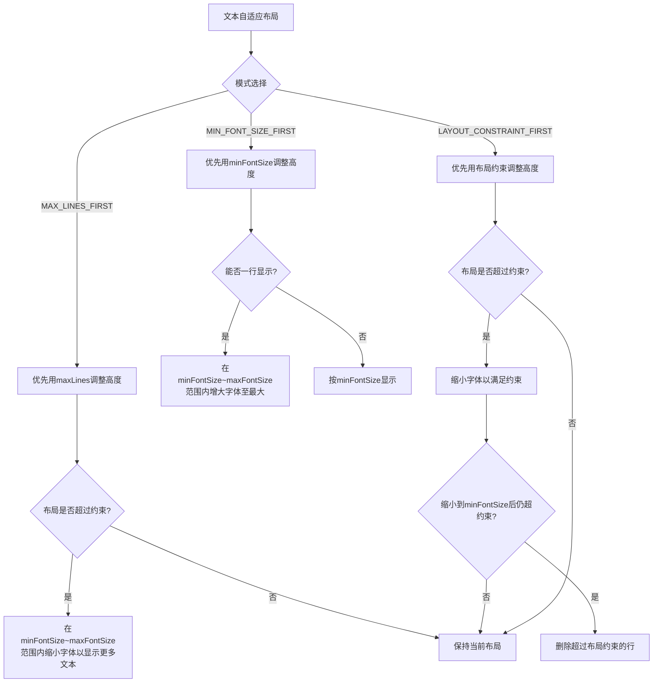
```mermaid
graph TD
  A[文本自适应布局] --> B{模式选择}
  B -->|MAX_LINES_FIRST| C[优先用maxLines调整高度]
  C --> D{布局是否超过约束?}
  D -->|是| E[在minFontSize~maxFontSize范围内缩小字体以显示更多文本]
  D -->|否| F[保持当前布局]
  B -->|MIN_FONT_SIZE_FIRST| G[优先用minFontSize调整高度]
  G --> H{能否一行显示?}
  H -->|是| I[在minFontSize~maxFontSize范围内增大字体至最大]
  H -->|否| J[按minFontSize显示]
  B -->|LAYOUT_CONSTRAINT_FIRST| K[优先用布局约束调整高度]
  K --> L{布局是否超过约束?}
  L -->|是| M[缩小字体以满足约束]
  M --> N{缩小到minFontSize后仍超约束?}
  N -->|是| O[删除超过布局约束的行]
  N -->|否| F
  L -->|否| F
```

- MAX_LINES_FIRST模式：优先使用[maxLines](#maxlines)属性来调整文本高度。如果使用maxLines属性的布局大小超过了布局约束，则尝试在[minFontSize](#minfontsize)和[maxFontSize](#maxfontsize)的范围内缩小字体以显示更多文本。

- MIN_FONT_SIZE_FIRST模式：优先使用minFontSize属性来调整文本高度。如果使用minFontSize属性可以将文本布局在一行中，则尝试在minFontSize和maxFontSize的范围内增大字体并使用最大限度的字体大小在一行内显示，否则按minFontSize显示。

- LAYOUT_CONSTRAINT_FIRST模式：优先使用布局约束来调整文本高度。如果布局大小超过布局约束，则尝试在minFontSize和maxFontSize的范围内缩小字体以满足布局约束。如果将字体大小缩小到minFontSize后，布局大小仍然超过布局约束，则删除超过布局约束的行。

**原子化服务API：** 从API version 11开始，该接口支持在原子化服务中使用。

**模型约束：** 此接口仅可在Stage模型下使用。

**系统能力：** SystemCapability.ArkUI.ArkUI.Full

**参数：** 

| 参数名 | 类型                                                         | 必填 | 说明                                                         |
| ------ | ------------------------------------------------------------ | ---- | ------------------------------------------------------------ |
| value  | [TextHeightAdaptivePolicy](ts-appendix-enums.md#textheightadaptivepolicy10) | 是   | 文本自适应高度的方式。 |

### incrementalUpdatePolicy

incrementalUpdatePolicy(policy: IncrementalUpdatePolicy \| undefined)

设置文本渲染的增量更新策略。未通过该接口设置时，默认为IncrementalUpdatePolicy.NONE。

该接口仅在Text内容包含属性字符串（StyledString）时生效。

**起始版本：** 26.0.0

**模型约束：** 此接口仅可在Stage模型下使用。

**原子化服务API：** 从API版本26.0.0开始，该接口支持在原子化服务中使用。

**系统能力：** SystemCapability.ArkUI.ArkUI.Full

**参数：**

| 参数名 | 类型                                                        | 必填 | 说明                                                         |
| ------ | ----------------------------------------------------------- | ---- | ------------------------------------------------------------ |
| policy | [IncrementalUpdatePolicy](ts-text-common.md#incrementalupdatepolicy) \| undefined | 是   | 文本渲染的增量更新策略。<br>设置为undefined时，按IncrementalUpdatePolicy.NONE处理。 |

### letterSpacing

letterSpacing(value: number \| ResourceStr)

设置文本字符间距。未通过该接口设置时，默认文本字符间距为0。

设置该值为百分比时，按默认值显示。设置该值为0时，按默认值显示。string类型支持number类型取值的字符串形式，可以附带单位，例如"10"、"10fp"。

当取值为负值时，文字会被压缩。负值过小时会将组件内容区大小压缩为0，导致内容无法显示。

对每个字符生效，包括行尾字符。

**卡片能力：** 从API version 9开始，该接口支持在ArkTS卡片中使用。

**原子化服务API：** 从API version 11开始，该接口支持在原子化服务中使用。

**系统能力：** SystemCapability.ArkUI.ArkUI.Full

**参数：** 

| 参数名 | 类型                       | 必填 | 说明           |
| ------ | -------------------------- | ---- | -------------- |
| value  | number&nbsp;\|&nbsp;[ResourceStr](ts-types.md#resourcestr) | 是   | 文本字符间距。<br>单位：[fp](ts-pixel-units.md#基本像素单位) <br>从API version 20开始，支持[Resource](ts-types.md#resource)类型。|

### lineBreakStrategy<sup>12+</sup>

lineBreakStrategy(strategy: LineBreakStrategy)

设置折行规则。该属性在[wordBreak](#wordbreak11)不等于WordBreak.BREAK_ALL的时候生效，且不支持连词符。未通过该接口设置时，默认折行规则为LineBreakStrategy.GREEDY。

**原子化服务API：** 从API version 12开始，该接口支持在原子化服务中使用。

**模型约束：** 此接口仅可在Stage模型下使用。

**系统能力：** SystemCapability.ArkUI.ArkUI.Full

**参数：** 

| 参数名   | 类型                                                         | 必填 | 说明                                                    |
| -------- | ------------------------------------------------------------ | ---- | ------------------------------------------------------- |
| strategy | [LineBreakStrategy](ts-appendix-enums.md#linebreakstrategy12) | 是   | 文本的折行规则。具体值及其说明请参考LineBreakStrategy。 |

### lineHeight

lineHeight(value: number \| string \| Resource)

设置文本行高。

当与[lineHeightMultiple](#lineheightmultiple22)同时设置且lineHeightMultiple使用有效值时，lineHeight的设置不生效，以lineHeightMultiple为准。

设置值不大于0时，不限制文本行高，自适应字体大小，number类型时单位为fp。string类型支持number类型取值的字符串形式，可以附带单位，例如"10"、"10fp"。

>  **说明：**
>  
>  特殊字符字体高度远超出同行的其他字符高度时，文本框出现截断、遮挡、内容相对位置发生变化等不符合预期的显示异常，需要开发者调整组件高度、行高等属性，修改对应的页面布局。

**卡片能力：** 从API version 9开始，该接口支持在ArkTS卡片中使用。

**原子化服务API：** 从API version 11开始，该接口支持在原子化服务中使用。

**系统能力：** SystemCapability.ArkUI.ArkUI.Full

**参数：** 

| 参数名 | 类型                                                         | 必填 | 说明             |
| ------ | ------------------------------------------------------------ | ---- | ---------------- |
| value  | number&nbsp;\|&nbsp;string&nbsp;\|&nbsp;[Resource](ts-types.md#resource) | 是   | 文本行高。number类型时单位为fp。 |

### lineHeightMultiple<sup>22+</sup>

lineHeightMultiple(value: number \| undefined)

使用倍数模式设置文本的行高。

设置行高为入参（value）与字高（fontHeight）的乘积。

>  **说明：**
>  
>  当lineHeightMultiple使用有效值和[lineHeight](#lineheight)或[lineSpacing](#linespacing12)同时设置时，仅lineHeightMultiple生效。lineHeightMultiple小于0时，lineHeightMultiple不生效，使用[lineHeight](#lineheight)和[lineSpacing](#linespacing12)设置行高和行间距。

**卡片能力：** 从API version 22开始，该接口支持在ArkTS卡片中使用。

**原子化服务API：** 从API version 22开始，该接口支持在原子化服务中使用。

**模型约束：** 此接口仅可在Stage模型下使用。

**系统能力：** SystemCapability.ArkUI.ArkUI.Full

**参数：** 

| 参数名 | 类型                                                         | 必填 | 说明             |
| ------ | ------------------------------------------------------------ | ---- | ---------------- |
| value  | number&nbsp;\|&nbsp;undefined | 是   | 使用行高的倍数数值。<br>取值范围：[0, +∞)<br>**说明：**<br>- 设置的值小于0时，lineHeightMultiple不生效。<br>- 设置的值等于0时，等效于设置为1，表现为行高没有变化。<br>- 支持小数输入。<br>- 值为undefined时，使用默认行高高度。 |

### lineSpacing<sup>12+</sup>

lineSpacing(value: LengthMetrics)

设置文本的行间距，设置值小于0时，取默认值0。未通过该接口设置时，默认行间距为0。

当与[lineHeightMultiple](#lineheightmultiple22)同时设置且lineHeightMultiple使用有效值时，lineSpacing的设置不生效，以lineHeightMultiple为准。

**原子化服务API：** 从API version 12开始，该接口支持在原子化服务中使用。

**模型约束：** 此接口仅可在Stage模型下使用。

**系统能力：** SystemCapability.ArkUI.ArkUI.Full

**参数：** 

| 参数名 | 类型                                                         | 必填 | 说明             |
| ------ | ------------------------------------------------------------ | ---- | ---------------- |
| value  | [LengthMetrics](../js-apis-arkui-graphics.md#lengthmetrics12) | 是   | 文本的行间距。<br>取值范围：[0, +∞)。设置值小于0时，取默认值0。 |

### lineSpacing<sup>20+</sup>

lineSpacing(value: LengthMetrics, options?: LineSpacingOptions)

设置文本的行间距。当不配置LineSpacingOptions时，首行上方和尾行下方默认会有行间距。

当与[lineHeightMultiple](#lineheightmultiple22)同时设置且lineHeightMultiple使用有效值时，lineSpacing的设置不生效，以lineHeightMultiple为准。

**原子化服务API：** 从API version 20开始，该接口支持在原子化服务中使用。

**模型约束：** 此接口仅可在Stage模型下使用。

**系统能力：** SystemCapability.ArkUI.ArkUI.Full

**参数：** 

| 参数名 | 类型                                                         | 必填 | 说明             |
| ------ | ------------------------------------------------------------ | ---- | ---------------- |
| value  | [LengthMetrics](../js-apis-arkui-graphics.md#lengthmetrics12) | 是   | 文本的行间距。设置值不大于0时，取默认值0。 |
| options  | [LineSpacingOptions](ts-text-common.md#linespacingoptions20对象说明) | 否   | 设置行间距配置项。<br>默认值：{&nbsp;onlyBetweenLines:&nbsp;false&nbsp;} |

### marqueeOptions<sup>18+</sup>

marqueeOptions(options: Optional\<TextMarqueeOptions>)

设置文本跑马灯模式的配置项。

当textOverflow设置为TextOverflow.MARQUEE时，marqueeOptions的设置才能生效。

**原子化服务API：** 从API version 18开始，该接口支持在原子化服务中使用。

**模型约束：** 此接口仅可在Stage模型下使用。

**系统能力：** SystemCapability.ArkUI.ArkUI.Full

**参数：**

| 参数名 | 类型                                       | 必填 | 说明                                       |
| ------ | ------------------------------------------ | ---- | ------------------------------------------ |
| options | [Optional](ts-universal-attributes-custom-property.md#optionalt)\<[TextMarqueeOptions](#textmarqueeoptions18对象说明)> | 是 | 当Text组件的textOverflow属性设置为MARQUEE时，可通过marqueeOptions设置跑马灯动效具体的属性，如开关、步长、循环次数、方向等。<br>取值为undefined时，按[TextMarqueeOptions](#textmarqueeoptions18对象说明)中的默认值处理。 |

### maxFontScale<sup>12+</sup>

maxFontScale(scale: number \| Resource)

设置文本最大的字体缩放倍数。

**原子化服务API：** 从API version 12开始，该接口支持在原子化服务中使用。

**模型约束：** 此接口仅可在Stage模型下使用。

**系统能力：** SystemCapability.ArkUI.ArkUI.Full

**参数：** 

| 参数名 | 类型                                          | 必填 | 说明                                          |
| ------ | --------------------------------------------- | ---- | --------------------------------------------- |
| scale  | number \| [Resource](ts-types.md#resource) | 是   | 文本最大的字体缩放倍数。<br>取值范围：[1, +∞)<br>**说明：** <br>设置的值小于1时，按值为1处理，其余异常值默认不生效。 |

### maxFontSize

maxFontSize(value: number \| string \| Resource)

设置文本最大显示字号。

string类型支持number类型取值的字符串形式，可以附带单位，例如"10"、"10fp"。

需配合[minFontSize](#minfontsize)以及[maxLines](#maxlines)或布局大小限制使用，单独设置不生效。

自适应字号生效时，fontSize设置不生效。

maxFontSize小于等于0或者maxFontSize小于minFontSize时，自适应字号不生效，此时按照[fontSize](#fontsize)属性的值生效，未设置时按照其默认值生效。

从API version 18开始支持在子组件和属性字符串上生效，未设置字号的部分会自适应。

**卡片能力：** 从API version 9开始，该接口支持在ArkTS卡片中使用。

**原子化服务API：** 从API version 11开始，该接口支持在原子化服务中使用。

**系统能力：** SystemCapability.ArkUI.ArkUI.Full

**参数：** 

| 参数名 | 类型                                                         | 必填 | 说明               |
| ------ | ------------------------------------------------------------ | ---- | ------------------ |
| value  | number&nbsp;\|&nbsp;string&nbsp;\|&nbsp;[Resource](ts-types.md#resource) | 是   | 文本最大显示字号。<br>取值范围：大于0且大于等于minFontSize。<br>单位：[fp](ts-pixel-units.md#基本像素单位)<br>**说明：** <br>设置的值≤0或小于minFontSize时，自适应字号不生效，此时按照fontSize属性的值生效。 |

### maxLineHeight<sup>22+</sup>

maxLineHeight(value: LengthMetrics \| undefined)

设置文本的最大行高，设置值不大于0时，最大行高不受限制。未通过该接口设置时，最大行高不受限制（值为undefined）。

maxLineHeight小于minLineHeight时，maxLineHeight按照minLineHeight属性的值生效。

**卡片能力：** 从API version 22开始，该接口支持在ArkTS卡片中使用。

**原子化服务API：** 从API version 22开始，该接口支持在原子化服务中使用。

**模型约束：** 此接口仅可在Stage模型下使用。

**系统能力：** SystemCapability.ArkUI.ArkUI.Full

**参数：** 

| 参数名 | 类型                                                         | 必填 | 说明             |
| ------ | ------------------------------------------------------------ | ---- | ---------------- |
| value  | [LengthMetrics](../js-apis-arkui-graphics.md#lengthmetrics12)&nbsp;\|&nbsp;undefined | 是   | 文本的最大行高，不支持百分比。<br>设置的值不大于0时按0处理，设置为0时，最大行高不受限制。<br>取值为undefined时，不生效。 |

### selectedDragPreviewStyle<sup>23+</sup>

selectedDragPreviewStyle(value: SelectedDragPreviewStyle \| undefined)

设置文本拖拽时的背板样式。

**原子化服务API：** 从API version 23开始，该接口支持在原子化服务中使用。

**模型约束：** 此接口仅可在Stage模型下使用。

**系统能力：** SystemCapability.ArkUI.ArkUI.Full

**参数：** 

| 参数名 | 类型                                             | 必填 | 说明                                                       |
| ------ | ------------------------------------------------ | ---- | ---------------------------------------------------------- |
| value  | [SelectedDragPreviewStyle](ts-text-common.md#selecteddragpreviewstyle23对象说明) \| undefined | 是   | 文本拖拽时的背板样式。<br>设置为undefined时：背板颜色跟随主题，浅色模式显示白色，深色模式显示黑色。|

### maxLines

maxLines(value: number)

设置文本的最大行数。与[minLines](#minlines22)同时配置时，最小行数显示范围不会超过maxLines设置的限制。

默认情况下，文本是自动折行的，如果指定此属性，则文本最多不会超过指定的行数。如果有多余的文本，可以通过[textOverflow](#textoverflow)来指定截断方式。

**卡片能力：** 从API version 9开始，该接口支持在ArkTS卡片中使用。

**原子化服务API：** 从API version 11开始，该接口支持在原子化服务中使用。

**系统能力：** SystemCapability.ArkUI.ArkUI.Full

**参数：** 

| 参数名 | 类型   | 必填 | 说明             |
| ------ | ------ | ---- | ---------------- |
| value  | number | 是   | 文本的最大行数。<br>**说明：** <br>取值范围：[0, INT32_MAX]<br>设置为0时，不显示文本内容。 |

### minFontScale<sup>12+</sup>

minFontScale(scale: number \| Resource)

设置文本最小的字体缩放倍数。

**原子化服务API：** 从API version 12开始，该接口支持在原子化服务中使用。

**模型约束：** 此接口仅可在Stage模型下使用。

**系统能力：** SystemCapability.ArkUI.ArkUI.Full

**参数：** 

| 参数名 | 类型                                          | 必填 | 说明                                          |
| ------ | --------------------------------------------- | ---- | --------------------------------------------- |
| scale  | number \| [Resource](ts-types.md#resource) | 是   | 文本最小的字体缩放倍数。<br>取值范围：[0, 1]<br>**说明：** <br>设置的值小于0时按0处理，大于1时按1处理，其余异常值默认不生效。 |

### minFontSize

minFontSize(value: number \| string \| Resource)

设置文本最小显示字号。

string类型支持number类型取值的字符串形式，可以附带单位，例如"10"、"10fp"。

需配合[maxFontSize](#maxfontsize)以及[maxLines](#maxlines)或布局大小限制使用，单独设置不生效。

自适应字号生效时，fontSize设置不生效。

minFontSize小于或等于0时，自适应字号不生效，此时按照[fontSize](#fontsize)属性的值生效，未设置时按照其默认值生效。

从API version 18开始，支持在子组件和属性字符串上生效，未设置字号的部分会自适应。

**卡片能力：** 从API version 9开始，该接口支持在ArkTS卡片中使用。

**原子化服务API：** 从API version 11开始，该接口支持在原子化服务中使用。

**系统能力：** SystemCapability.ArkUI.ArkUI.Full

**参数：** 

| 参数名 | 类型                                                         | 必填 | 说明               |
| ------ | ------------------------------------------------------------ | ---- | ------------------ |
| value  | number&nbsp;\|&nbsp;string&nbsp;\|&nbsp;[Resource](ts-types.md#resource) | 是   | 文本最小显示字号。<br>取值范围：大于0。<br>单位：[fp](ts-pixel-units.md#基本像素单位)<br>**说明：** <br>设置的值≤0时，自适应字号不生效，此时按照fontSize属性的值生效。 |

### minLineHeight<sup>22+</sup>

minLineHeight(value: LengthMetrics \| undefined)

设置文本的最小行高，设置值不大于0时，取默认值0。当[maxLineHeight](#maxlineheight22)的设置值小于minLineHeight时，maxLineHeight会按照minLineHeight的值生效。

**卡片能力：** 从API version 22开始，该接口支持在ArkTS卡片中使用。

**原子化服务API：** 从API version 22开始，该接口支持在原子化服务中使用。

**模型约束：** 此接口仅可在Stage模型下使用。

**系统能力：** SystemCapability.ArkUI.ArkUI.Full

**参数：** 

| 参数名 | 类型                                                         | 必填 | 说明             |
| ------ | ------------------------------------------------------------ | ---- | ---------------- |
| value  | [LengthMetrics](../js-apis-arkui-graphics.md#lengthmetrics12)&nbsp;\|&nbsp;undefined | 是   | 文本的最小行高，不支持百分比。<br>设置的值不大于0时按0处理。<br>取值为undefined时，不生效。 |

### minLines<sup>22+</sup>

minLines(minLines: Optional\<number>)

设置文本显示的最小行数。

如果实际文本高度小于最小行数对应的高度，最后显示高度为最小行数对应的高度。

与[maxLines](#maxlines)同时配置时，最小行数对应的显示高度不会超过最大行数对应的高度限制。

如果文本设置了[constraintSize](ts-universal-attributes-size.md#constraintsize)，那么组件最后显示高度会在[constraintSize](ts-universal-attributes-size.md#constraintsize)约束内。

**卡片能力：** 从API version 22开始，该接口支持在ArkTS卡片中使用。

**原子化服务API：** 从API version 22开始，该接口支持在原子化服务中使用。

**模型约束：** 此接口仅可在Stage模型下使用。

**系统能力：** SystemCapability.ArkUI.ArkUI.Full

**参数：** 

| 参数名 | 类型                                      | 必填 | 说明                                                         |
| ------ | ----------------------------------------- | ---- | ------------------------------------------------------------ |
| minLines  | [Optional](ts-universal-attributes-custom-property.md#optionalt)\<number> | 是   | 文本最小行数。<br>取值范围：[0, INT32_MAX]<br>设置的值小于0时按0处理。<br>值为undefined时，最小行数无限制。<br>**说明：** <br>与[maxLines](#maxlines)同时配置时，最小行数对应的显示高度不会超过最大行数对应的高度限制。 |

### includeFontPadding<sup>23+</sup>

includeFontPadding(include: Optional\<boolean>)

设置是否在首行和尾行增加间距以避免文字截断。不通过该接口设置，默认不增加间距。

**原子化服务API：** 从API version 23开始，该接口支持在原子化服务中使用。

**模型约束：** 此接口仅可在Stage模型下使用。

**系统能力：** SystemCapability.ArkUI.ArkUI.Full

**参数：**

| 参数名  | 类型                                                         | 必填 | 说明                                                         |
| ------- | ------------------------------------------------------------ | ---- | ------------------------------------------------------------ |
| include | [Optional](ts-universal-attributes-custom-property.md#optionalt)\<boolean> | 是   | 是否在首行和尾行增加间距以避免文字截断。<br>true表示在首行和尾行增加间距；false表示在首行和尾行不增加间距。<br>undefined表示在首行和尾行不增加间距。 |

### fallbackLineSpacing<sup>23+</sup>

fallbackLineSpacing(enabled: Optional\<boolean>)

针对多行文字叠加，支持行高基于文字实际高度自适应。此接口仅当行高小于文字实际高度时生效。不通过该接口设置，默认行高不基于文字实际高度自适应。

**原子化服务API：** 从API version 23开始，该接口支持在原子化服务中使用。

**模型约束：** 此接口仅可在Stage模型下使用。

**系统能力：** SystemCapability.ArkUI.ArkUI.Full

**参数：**

| 参数名  | 类型                                                         | 必填 | 说明                                                         |
| ------- | ------------------------------------------------------------ | ---- | ------------------------------------------------------------ |
| enabled | [Optional](ts-universal-attributes-custom-property.md#optionalt)\<boolean> | 是   | 行高是否基于文字实际高度自适应。<br>true表示行高基于文字实际高度自适应；false表示行高不基于文字实际高度自适应。<br>undefined表示行高不基于文字实际高度自适应。 |

### optimizeTrailingSpace<sup>20+</sup>

optimizeTrailingSpace(optimize: Optional\<boolean>)

设置是否在文本布局过程中优化每行末尾的空格，可解决行尾空格影响对齐显示效果问题。未通过该接口设置时，默认不优化每行末尾的空格。

设置Text.optimizeTrailingSpace为true时：

* 多行、单行、图文混排等多种情况下均会优化行尾空格（TextAlign.Center或TextAlign.End时，优化效果明显）；

* 纯空格文本时，修饰线、阴影、背景色跟随空格文本显示；

* 行首空格不在优化范围内，行尾文本强制换行，每行行尾空格根据组件宽度优化行尾空格。

当纯空格文本设置优化行尾空格[optimizeTrailingSpace](#optimizetrailingspace20)为true时，不允许同时设置文本背景色[backgroundColor](ts-universal-attributes-background.md#backgroundcolor)、空格装饰线[decoration](#decoration)和对齐[textAlign](#textalign)三个属性。

**原子化服务API：** 从API version 20开始，该接口支持在原子化服务中使用。

**模型约束：** 此接口仅可在Stage模型下使用。

**系统能力：** SystemCapability.ArkUI.ArkUI.Full

**参数：**

| 参数名           | 类型             | 必填 | 说明                                            |
| ---------------- | ------- | ---- | ----------------------------------------------- |
| optimize         | [Optional](ts-universal-attributes-custom-property.md#optionalt)\<boolean> | 是   | 是否优化每行末尾的空格。<br>true表示优化末尾空格，false则不优化。<br>值为undefined时，不优化末尾空格。 |

### compressLeadingPunctuation<sup>23+</sup>

compressLeadingPunctuation(enabled: Optional\<boolean>)

设置是否开启行首标点符号压缩。

> **说明：**
>
> - 行首标点符号默认不压缩。
>
> - 支持压缩的标点符号，请参考[ParagraphStyle](../../apis-arkgraphics2d/js-apis-graphics-text.md#paragraphstyle)的行首压缩的标点范围。

**原子化服务API：** 从API version 23开始，该接口支持在原子化服务中使用。

**模型约束：** 此接口仅可在Stage模型下使用。

**系统能力：** SystemCapability.ArkUI.ArkUI.Full

**参数：**

| 参数名 | 类型    | 必填 | 说明                               |
| ------ | ------- | ---- | ---------------------------------- |
| enabled | [Optional](ts-universal-attributes-custom-property.md#optionalt)\<boolean> | 是   | 是否开启行首标点符号压缩。<br>true表示开启行首标点符号压缩；false表示不开启行首标点符号压缩；undefined表示不开启。 |

### orphanCharOptimization

orphanCharOptimization(enabled: Optional\<boolean>)

设置文本排版时是否使能孤字优化。不通过该接口设置，默认不使能孤字优化。

孤字优化通过更高效地处理孤立字符（段落尾行首字符）来改善文本布局。使能后，它会调整换行点以尽可能避免孤立字符。孤字优化特性需在[wordBreak](#wordbreak11)为非BREAK_ALL并且待排版文本首个[TextStyle](../../apis-arkgraphics2d/js-apis-graphics-text.md#textstyle)的[locale](../../apis-arkgraphics2d/js-apis-graphics-text.md#textstyle)为“zh-Hans”或“zh-Hant”时生效。

**起始版本：** 26.0.0

**原子化服务API：** 从API版本26.0.0开始，该接口支持在原子化服务中使用。

**系统能力：** SystemCapability.ArkUI.ArkUI.Full

**参数：**

| 参数名           | 类型             | 必填 | 说明                                            |
| ---------------- | ------- | ---- | ----------------------------------------------- |
| enabled         | [Optional](ts-universal-attributes-custom-property.md#optionalt)\<boolean> | 是 | 段落最后一行是否使能孤字优化。<br>true表示使能孤字优化，false表示不使能孤字优化。<br>值为undefined或null时，不使能孤字优化。 |

### privacySensitive<sup>12+</sup>

privacySensitive(supported: boolean)

设置是否支持卡片敏感隐私信息。未通过该接口设置时，默认不支持卡片敏感隐私信息。

**卡片能力：** 从API version 12开始，该接口支持在ArkTS卡片中使用。

**原子化服务API：** 从API version 12开始，该接口支持在原子化服务中使用。

**模型约束：** 此接口仅可在Stage模型下使用。

**系统能力：** SystemCapability.ArkUI.ArkUI.Full

**参数：**

| 参数名    | 类型    | 必填 | 说明                                                         |
| --------- | ------- | ---- | ------------------------------------------------------------ |
| supported | boolean | 是   | 是否支持卡片敏感隐私信息。<br>true表示支持卡片敏感隐私信息，隐私模式下文字将被遮罩为横杠"-"样式；false表示不支持卡片敏感隐私信息，隐私模式下文字正常显示。<br>**说明：** <br>设置为null则表示不敏感。<br>进入隐私模式需要卡片框架支持。隐私遮罩的类型可以通过[obscured](./ts-universal-attributes-obscured.md#obscured)配置。 |

### punctuationOverflow

punctuationOverflow(enabled: Optional\<boolean>)

设置是否启用行尾标点符号悬挂。不通过该接口设置，默认标点符号不悬挂。

**起始版本：** 26.0.0

**原子化服务API：** 从API版本26.0.0开始，该接口支持在原子化服务中使用。

**模型约束：** 此接口仅可在Stage模型下使用。

**系统能力：** SystemCapability.ArkUI.ArkUI.Full

**参数：**

| 参数名 | 类型 | 必填 | 说明 |
| ------ | ----- | ---- | ---- |
| enabled | [Optional](ts-universal-attributes-custom-property.md#optionalt)\<boolean> | 是 | 是否启用行尾标点符号悬挂。<br>true表示启用行尾标点符号悬挂，false表示不启用行尾标点符号悬挂。设置为undefined或null时，不启用标点符号悬挂。 |

### selectedBackgroundColor<sup>14+</sup>

selectedBackgroundColor(color: ResourceColor)

设置文本选中底板颜色。如果未设置不透明度，默认不透明度为20%。未通过该接口设置时，默认文本选中底板颜色为'#007DFF'（蓝色）。

**原子化服务API：** 从API version 14开始，该接口支持在原子化服务中使用。

**模型约束：** 此接口仅可在Stage模型下使用。

**系统能力：** SystemCapability.ArkUI.ArkUI.Full

**参数：**

| 参数名 | 类型                                       | 必填 | 说明                                       |
| ------ | ------------------------------------------ | ---- | ------------------------------------------ |
| color  | [ResourceColor](ts-types.md#resourcecolor) | 是   | 文本选中底板颜色。 |

### selection<sup>11+</sup>

selection(selectionStart: number, selectionEnd: number)

设置选中区域。未通过该接口设置时，默认不设置选中区域（selectionStart和selectionEnd均为-1）。

选中区域高亮且显示手柄和文本选择菜单。

当[copyOption](#copyoption9)设置为CopyOptions.None时，设置selection属性不生效。

当[textOverflow](#textoverflow)设置为TextOverflow.MARQUEE时，设置selection属性不生效。

当selectionStart大于等于selectionEnd时不选中。可选范围为[0, textSize]，其中textSize为文本内容最大字符数，入参小于0时处理为0，大于textSize时处理为textSize。

当selectionStart或selectionEnd位于截断的不可见区域时，文本不选中。当[clip](./ts-universal-attributes-sharp-clipping.md#clip12)设置为false时，超出父组件的文本可以被选中。

可通过[onTextSelectionChange](#ontextselectionchange11)接口获取选中区域位置变化结果。

**原子化服务API：** 从API version 11开始，该接口支持在原子化服务中使用。

**模型约束：** 此接口仅可在Stage模型下使用。

**系统能力：** SystemCapability.ArkUI.ArkUI.Full

**参数：** 

| 参数名         | 类型   | 必填 | 说明                                 |
| -------------- | ------ | ---- | ------------------------------------ |
| selectionStart | number | 是   | 所选文本的起始位置。<br>取值范围：[0, textSize]，其中textSize为文本内容最大字符数。入参小于0时处理为0，大于textSize时处理为textSize。 |
| selectionEnd   | number | 是   | 所选文本的结束位置。<br>取值范围：[0, textSize]，其中textSize为文本内容最大字符数。入参小于0时处理为0，大于textSize时处理为textSize。 |

### shaderStyle<sup>20+</sup>

shaderStyle(shader: ShaderStyle)

可以显示为径向渐变[RadialGradientStyle](ts-text-common.md#radialgradientstyle20)或线性渐变[LinearGradientStyle](ts-text-common.md#lineargradientstyle20)或纯色[ColorShaderStyle](ts-text-common.md#colorshaderstyle20)的效果，shaderStyle的优先级高于[fontColor](#fontcolor)和AI识别，纯色建议使用[fontColor](#fontcolor)。

**原子化服务API：** 从API version 20开始，该接口支持在原子化服务中使用。

**模型约束：** 此接口仅可在Stage模型下使用。

**系统能力：** SystemCapability.ArkUI.ArkUI.Full

**参数：**

<!--Table: 10%; auto; 10%; auto-->
| 参数名     | 类型                                         | 必填                             | 说明                               |
| -------------- | -------------------------------------------- | ----------------------------------- | ----------------------------------- |
| shader | [ShaderStyle](ts-text-common.md#shaderstyle20) | 是 | 径向渐变或线性渐变或纯色。<br>根据传入的参数区分处理径向渐变[RadialGradientStyle](ts-text-common.md#radialgradientstyle20)或线性渐变[LinearGradientStyle](ts-text-common.md#lineargradientstyle20)或纯色[ColorShaderStyle](ts-text-common.md#colorshaderstyle20)，最终设置到Text文本上显示为渐变色效果。<br>**说明：** <br>当设置为径向渐变[RadialGradientStyle](ts-text-common.md#radialgradientstyle20)时，若[RadialGradientOptions](./ts-universal-attributes-gradient-color.md#radialgradientoptions18对象说明)的center参数设置到组件范围外时，可将repeating参数设置为true，此时渐变效果会更明显。 |

### textAlign

textAlign(value: TextAlign)

设置文本段落在水平方向的对齐方式。未通过该接口设置时，默认文本段落在水平方向的对齐方式为TextAlign.Start。Wearable设备上默认为TextAlign.Center。

当[textOverflow](#textoverflow)设置为TextOverflow.MARQUEE且文本可滚动时，textAlign属性不生效。

文本段落宽度占满Text组件宽度。

可通过[align](ts-universal-attributes-location.md#align)属性控制文本段落在垂直方向上的位置，此组件中不可通过align属性控制文本段落在水平方向上的位置，具体效果如下：

- Alignment.TopStart、Alignment.Top、Alignment.TopEnd：内容顶部对齐。

- Alignment.Start、Alignment.Center、Alignment.End：内容垂直居中。

- Alignment.BottomStart、Alignment.Bottom、Alignment.BottomEnd：内容底部对齐。

当textAlign属性设置为TextAlign.JUSTIFY时，需要根据文本内容设置[wordBreak](#wordbreak11)属性，且最后一行文本水平对齐首部，不参与两端对齐。

>  **说明：**  
>
>  textAlign只能调整文本整体的布局，不影响字符的显示顺序。若需要调整字符的显示顺序，请参考[镜像状态字符对齐](../../../ui/arkts-internationalization.md#镜像状态字符对齐)。

**卡片能力：** 从API version 9开始，该接口支持在ArkTS卡片中使用。

**原子化服务API：** 从API version 11开始，该接口支持在原子化服务中使用。

**系统能力：** SystemCapability.ArkUI.ArkUI.Full

**参数：** 

| 参数名 | 类型                                        | 必填 | 说明                                                       |
| ------ | ------------------------------------------- | ---- | ---------------------------------------------------------- |
| value  | [TextAlign](ts-appendix-enums.md#textalign) | 是   | 文本段落在水平方向的对齐方式。<br>**说明：** <br>当设置为TextAlign.JUSTIFY时，需要根据文本内容设置[wordBreak](#wordbreak11)属性，且最后一行文本水平对齐首部，不参与两端对齐。 |

### textCase

textCase(value: TextCase)

设置文本大小写。未通过该接口设置时，默认文本大小写行为为TextCase.Normal。

**卡片能力：** 从API version 9开始，该接口支持在ArkTS卡片中使用。

**原子化服务API：** 从API version 11开始，该接口支持在原子化服务中使用。

**系统能力：** SystemCapability.ArkUI.ArkUI.Full

**参数：** 

| 参数名 | 类型                                      | 必填 | 说明                                      |
| ------ | ----------------------------------------- | ---- | ----------------------------------------- |
| value  | [TextCase](ts-appendix-enums.md#textcase) | 是   | 文本大小写。 |

### textContentAlign<sup>21+</sup>

textContentAlign(textContentAlign: Optional\<TextContentAlign>)

设置文本内容区在组件内的垂直对齐方式。

此接口可以在文本内容区高度大于组件高度时生效，确保文本内容区的对齐方式正确显示。

**原子化服务API：** 从API version 21开始，该接口支持在原子化服务中使用。

**模型约束：** 此接口仅可在Stage模型下使用。

**系统能力：** SystemCapability.ArkUI.ArkUI.Full

**参数：** 

| 参数名 | 类型                                        | 必填 | 说明                                                       |
| ------ | ------------------------------------------- | ---- | ---------------------------------------------------------- |
| textContentAlign  | [Optional](ts-universal-attributes-custom-property.md#optionalt)\<[TextContentAlign](ts-text-common.md#textcontentalign21)> | 是   | 文本内容区在组件内的垂直对齐方式。<br>默认(undefined和异常值情况下)和align属性设置为Center效果一致。|

### textDirection<sup>23+</sup>

textDirection(direction: TextDirection \| undefined)

指定文本排版方向，未通过该接口设置时，默认文本排版方向遵循组件布局方向。

**原子化服务API：** 从API version 23开始，该接口支持在原子化服务中使用。

**模型约束：** 此接口仅可在Stage模型下使用。

**系统能力：** SystemCapability.ArkUI.ArkUI.Full

**参数：**

| 参数名 | 类型                                        | 必填 | 说明                                                       |
| ------ | ------------------------------------------- | ---- | ---------------------------------------------------------- |
| direction  | [TextDirection](ts-text-common.md#textdirection22) \| undefined | 是   | 文本排版方向。<br>设置为undefined时，按照TextDirection.DEFAULT处理，表现为文本排版方向遵循组件布局方向。 |

### textIndent<sup>10+</sup>

textIndent(value: Length)

设置首行文本缩进。未通过该接口设置时，默认首行文本缩进为0。

**原子化服务API：** 从API version 11开始，该接口支持在原子化服务中使用。

**模型约束：** 此接口仅可在Stage模型下使用。

**系统能力：** SystemCapability.ArkUI.ArkUI.Full

**参数：** 

| 参数名 | 类型                         | 必填 | 说明                         |
| ------ | ---------------------------- | ---- | ---------------------------- |
| value  | [Length](ts-types.md#length) | 是   | 首行文本缩进。<br>单位：[fp](ts-pixel-units.md#基本像素单位) <br>取值范围：大于等于0。设置负数时，按默认值处理。|

### tailIndents

tailIndents(value: Optional\<LengthMetrics \| Array\<LengthMetrics>>)

设置文本尾部缩进。未通过该接口设置时，文本尾部缩进为0fp。

**起始版本：** 26.0.0

**原子化服务API：** 从API版本26.0.0开始，该接口支持在原子化服务中使用。

**模型约束：** 此接口仅可在Stage模型下使用。

**系统能力：** SystemCapability.ArkUI.ArkUI.Full

**参数：** 

| 参数名 | 类型                         | 必填 | 说明                         |
| ------ | ---------------------------- | ---- | ---------------------------- |
| value  | [Optional](ts-universal-attributes-custom-property.md#optionalt)&lt;[LengthMetrics](../js-apis-arkui-graphics.md#lengthmetrics12) \| Array&lt;[LengthMetrics](../js-apis-arkui-graphics.md#lengthmetrics12)&gt;&gt; | 是   | 指定文本每一行尾部缩进。当提供一个单独的LengthMetrics值时，所有行共享相同的尾部缩进；当提供一个数组时，第i个元素指定第i行的尾部缩进；如果文本行数超过数组长度，则数组中的最后一个元素将用于剩余的行。不支持百分比。<br>取值范围：大于等于0。设置负数时，按默认值处理。 |

### textOverflow

textOverflow(options: TextOverflowOptions)

设置文本超长时的显示方式。

当[TextOverflowOptions](#textoverflowoptions18对象说明)设置为TextOverflow.None、TextOverflow.Clip或TextOverflow.Ellipsis时：

- 设置为TextOverflow.None、TextOverflow.Clip，文本超长时按最大行截断显示。

- 设置为TextOverflow.Ellipsis，文本超长时超出显示区域的文本用省略号代替。

- 需配合[maxLines](#maxlines)使用，单独设置不生效。

- 断行规则参考[wordBreak](#wordbreak11)。默认情况下参考WordBreak.BREAK_WORD的截断方式，文本截断按字进行。例如，英文以单词为最小单位进行截断。若需要以字母为单位进行截断，可设置wordBreak属性为WordBreak.BREAK_ALL。

- 折行规则参考[lineBreakStrategy](#linebreakstrategy12)。该属性在[wordBreak](#wordbreak11)不等于WordBreak.BREAK_ALL的时候生效，不支持连词符。

- 从API version 11开始，建议优先组合[textOverflow](#textoverflow)和[wordBreak](#wordbreak11)属性来设置截断方式，具体详见[示例4（设置文本断行及折行）](#示例4设置文本断行及折行)<!--RP1--><!--RP1End-->。

当TextOverflowOptions设置为TextOverflow.MARQUEE时：

- 文本在一行内滚动显示。

- 设置[maxLines](#maxlines)、[copyOption](#copyoption9)、[selection](#selection11)属性均不生效，且不能进行文本特殊实体识别（即[enableDataDetector](#enabledatadetector11)设置enable为true时不生效）。

- Text组件[clip](ts-universal-attributes-sharp-clipping.md#clip12)属性默认为true。

- 属性字符串的[CustomSpan](ts-universal-styled-string.md#customspan)不支持跑马灯模式。

- [textAlign](#textalign)属性的生效规则：当文本不可滚动时，textAlign属性生效；当文本可滚动时，textAlign属性不生效。

- 从API version 12开始，当TextOverflowOptions设置为TextOverflow.MARQUEE时，支持ImageSpan组件，文本和图片可在一行内滚动显示。

**卡片能力：** 从API version 9开始，该接口支持在ArkTS卡片中使用。

**原子化服务API：** 从API version 11开始，该接口支持在原子化服务中使用。

**系统能力：** SystemCapability.ArkUI.ArkUI.Full

**参数：** 

| 参数名 | 类型                                                         | 必填 | 说明                                                         |
| ------ | ------------------------------------------------------------ | ---- | ------------------------------------------------------------ |
| options | [TextOverflowOptions](#textoverflowoptions18对象说明) | 是   | 文本超长显示方式配置对象，用于配置文本超长时的显示方式，包含overflow属性指定截断、省略号或跑马灯等显示行为。 |

### textSelectable<sup>12+</sup>

textSelectable(mode: TextSelectableMode)

设置是否支持文本可选择、可获焦。未通过该接口设置时，默认文本可选择、不可获焦（TextSelectableMode.SELECTABLE_UNFOCUSABLE）。

需配合[copyOption](#copyoption9)使用。当copyOption设置为CopyOptions.None时，设置textSelectable属性不生效。

**原子化服务API：** 从API version 12开始，该接口支持在原子化服务中使用。

**模型约束：** 此接口仅可在Stage模型下使用。

**系统能力：** SystemCapability.ArkUI.ArkUI.Full

**参数：** 

| 参数名 | 类型                                          | 必填 | 说明                                          |
| ------ | --------------------------------------------- | ---- | --------------------------------------------- |
| mode  | [TextSelectableMode](ts-appendix-enums.md#textselectablemode12) | 是   | 文本是否支持可选择、可获焦。 |

### textShadow<sup>10+</sup>

textShadow(value: ShadowOptions \| Array&lt;ShadowOptions&gt;)

设置文字阴影效果。

不支持ShadowOptions对象中的type、fill字段和color字段的智能取色模式。

从API version 11开始，该接口支持以数组形式入参，实现多重文字阴影。

**卡片能力：** 从API version 10开始，该接口支持在ArkTS卡片中使用。

**原子化服务API：** 从API version 11开始，该接口支持在原子化服务中使用。

**模型约束：** 此接口仅可在Stage模型下使用。

**系统能力：** SystemCapability.ArkUI.ArkUI.Full

**参数：** 

| 参数名 | 类型                                                         | 必填 | 说明           |
| ------ | ------------------------------------------------------------ | ---- | -------------- |
| value  | [ShadowOptions](ts-universal-attributes-image-effect.md#shadowoptions对象说明)&nbsp;\|&nbsp;&nbsp;Array&lt;[ShadowOptions](ts-universal-attributes-image-effect.md#shadowoptions对象说明)&gt;<sup>11+</sup> | 是   | 文字阴影效果，用于配置文字阴影的视觉表现。ShadowOptions包含radius（阴影半径）、color（阴影颜色）、offsetX（水平偏移）、offsetY（垂直偏移）等配置项。不支持type、fill字段和color字段的智能取色模式。从API version 11开始支持以数组形式入参，实现多重文字阴影。 |

### textVerticalAlign<sup>20+</sup>

textVerticalAlign(textVerticalAlign: Optional\<TextVerticalAlign>)

设置文本段落在垂直方向的对齐方式。未通过该接口设置时，默认文本段落在垂直方向的对齐方式为TextVerticalAlign.BASELINE。

> **说明：**
>
> - 与[halfLeading](#halfleading12)同时配置时，halfLeading不生效。
> - 一个段落下使用同一字号必须同时设置行高[lineHeight](#lineheight)或者同一个段落不同字号文本混排时才有效果差异，否则设置了该属性任意枚举值和未设置该属性都是一样的排版效果。属性字符串[TextStyle](ts-universal-styled-string.md#textstyle)中的SuperscriptStyle上下角标样式仅在[TextVerticalAlign](ts-text-common.md#textverticalalign20)属性值为TextVerticalAlign.BASELINE时生效，其余垂直对齐方式下上下角标文本和普通文本表现一致，无上下角标效果。

**原子化服务API：** 从API version 20开始，该接口支持在原子化服务中使用。

**模型约束：** 此接口仅可在Stage模型下使用。

**系统能力：** SystemCapability.ArkUI.ArkUI.Full

**参数：**

| 参数名 | 类型                                        | 必填 | 说明                                                       |
| ------ | ------------------------------------------- | ---- | ---------------------------------------------------------- |
| textVerticalAlign  | [Optional](ts-universal-attributes-custom-property.md#optionalt)\<[TextVerticalAlign](ts-text-common.md#textverticalalign20)> | 是   | 文本段落在垂直方向的对齐方式。<br/>默认值：TextVerticalAlign.BASELINE<br/>取值为undefined时，按照TextVerticalAlign.BASELINE处理，对齐文本基线。 |

### wordBreak<sup>11+</sup>

wordBreak(value: WordBreak)

设置断行规则。未通过该接口设置时，默认断行规则为WordBreak.BREAK_WORD。

默认情况下，不调用wordBreak或者设置WordBreak.BREAK_WORD时，文本截断按字进行。例如，英文以单词为最小单位进行截断。

WordBreak.BREAK_ALL与{overflow:&nbsp;TextOverflow.Ellipsis}、maxLines组合使用，可实现英文单词按字母截断，超出部分以省略号显示。

**原子化服务API：** 从API version 11开始，该接口支持在原子化服务中使用。

**模型约束：** 此接口仅可在Stage模型下使用。

**系统能力：** SystemCapability.ArkUI.ArkUI.Full

**参数：** 

| 参数名 | 类型                                          | 必填 | 说明                                          |
| ------ | --------------------------------------------- | ---- | --------------------------------------------- |
| value  | [WordBreak](ts-appendix-enums.md#wordbreak11) | 是   | 断行规则。 |

## TextSpanType<sup>11+</sup>枚举说明

[Span](ts-basic-components-span.md)类型信息。

**模型约束：** 此接口仅可在Stage模型下使用。

**系统能力：** SystemCapability.ArkUI.ArkUI.Full

| 名称 | 值 | 说明 |
| -------- | ---- | -------- |
| TEXT | 0 | Span为文字类型。<br>**原子化服务API：** 从API version 12开始，该接口支持在原子化服务中使用。 |
| IMAGE | 1 | Span为图像类型。<br>**原子化服务API：** 从API version 12开始，该接口支持在原子化服务中使用。 |
| MIXED | 2 | Span为图文混合类型。<br>**原子化服务API：** 从API version 12开始，该接口支持在原子化服务中使用。 |
| DEFAULT<sup>15+</sup> | 3 | 注册此类型菜单但未注册TEXT、IMAGE、MIXED菜单时，文字类型、图片类型、图文混合类型都会触发并显示此类型对应的菜单。<br>**原子化服务API：** 从API version 15开始，该接口支持在原子化服务中使用。 |

>  **说明：**
>
>  菜单类型的匹配顺序如下。例如，用户长按文本时，根据以下规则查找：
>  1. 查找是否注册了TextSpanType.TEXT、TextResponseType.LONG_PRESS菜单
>  2. 查找是否注册了TextSpanType.TEXT、TextResponseType.DEFAULT菜单
>  3. 查找是否注册了TextSpanType.DEFAULT、TextResponseType.LONG_PRESS菜单
>  4. 查找是否注册了TextSpanType.DEFAULT、TextResponseType.DEFAULT菜单

## TextResponseType<sup>11+</sup>枚举说明

选择菜单的响应类型。

**模型约束：** 此接口仅可在Stage模型下使用。

**系统能力：** SystemCapability.ArkUI.ArkUI.Full

| 名称         | 值 |  说明          |
| ---------- | --- | ------------- |
| RIGHT_CLICK | 0 | 通过鼠标右键触发菜单弹出。<br>**原子化服务API：** 从API version 12开始，该接口支持在原子化服务中使用。 |
| LONG_PRESS  | 1 | 通过长按触发菜单弹出。<br>**原子化服务API：** 从API version 12开始，该接口支持在原子化服务中使用。 |
| SELECT | 2 | 通过鼠标选中触发菜单弹出。<br>**原子化服务API：** 从API version 12开始，该接口支持在原子化服务中使用。 |
| DEFAULT<sup>15+</sup> | 3 | 注册此类型的菜单，但未注册RIGHT_CLICK、LONG_PRESS、SELECT时，右键、长按、鼠标、[selection](#selection11)选中均会触发并显示此类型对应的菜单。<br>**原子化服务API：** 从API version 15开始，该接口支持在原子化服务中使用。 |

>  **说明：**
>
>  菜单类型的匹配顺序如下。例如，用户长按文本时，根据以下规则查找：
>  1. 查找是否注册了TextSpanType.TEXT、TextResponseType.LONG_PRESS菜单
>  2. 查找是否注册了TextSpanType.TEXT、TextResponseType.DEFAULT菜单
>  3. 查找是否注册了TextSpanType.DEFAULT、TextResponseType.LONG_PRESS菜单
>  4. 查找是否注册了TextSpanType.DEFAULT、TextResponseType.DEFAULT菜单

## TextOverflowOptions<sup>18+</sup>对象说明

文本超长显示方式对象。

> **说明：**
>
> 为规范匿名对象的定义，API 18版本修改了此处的元素定义。其中，保留了历史匿名对象的起始版本信息，会出现外层元素@since版本号高于内层元素版本号的情况，但这不影响接口的使用。

**卡片能力：** 从API version 18开始，该接口支持在ArkTS卡片中使用。

**原子化服务API：** 从API version 18开始，该接口支持在原子化服务中使用。

**模型约束：** 此接口仅可在Stage模型下使用。

**系统能力：** SystemCapability.ArkUI.ArkUI.Full

| 名称 | 类型                                                         | 只读 | 可选 | 说明                                                         |
| ------ | ------------------------------------------------------------ | ---- |---- | ------------------------------------------------------------ |
| overflow<sup>7+</sup>  | [TextOverflow](ts-appendix-enums.md#textoverflow) | 否 | 否  | 文本超长时的显示方式。<br>默认值：TextOverflow.Clip <br>**卡片能力：** 从API version 9开始，该接口支持在ArkTS卡片中使用。<br>**原子化服务API：** 从API version 11开始，该接口支持在原子化服务中使用。 |

## 事件

除支持[通用事件](ts-component-general-events.md)外，还支持以下事件：

### onCopy<sup>11+</sup>

onCopy(callback:(value:&nbsp;string)&nbsp;=&gt;&nbsp;void)

长按文本内部区域弹出剪贴板后，点击剪贴板复制按钮，触发该回调。目前只有文本可以复制。

**原子化服务API：** 从API version 11开始，该接口支持在原子化服务中使用。

**模型约束：** 此接口仅可在Stage模型下使用。

**系统能力：** SystemCapability.ArkUI.ArkUI.Full

**参数：** 

| 参数名 | 类型   | 必填 | 说明             |
| ------ | ------ | ---- | ---------------- |
| value  | string | 是   | 复制的文本内容。 |

### onWillCopy

onWillCopy(callback: Callback\<string, boolean>)

在进行复制操作前，触发该回调。

> **说明：**
> 
> onWillCopy和onCopy形成will/did时序模式：
> - onWillCopy在复制操作前触发，可通过返回false拦截复制操作；返回true则允许复制，随后触发onCopy。
> - onCopy在复制操作完成后触发，无法拦截。
> - 两者可以同时使用，onWillCopy用于拦截控制，onCopy用于获取复制结果。

**起始版本：** 26.0.0

**模型约束：** 此接口仅可在Stage模型下使用。

**原子化服务API：** 从API版本26.0.0开始，该接口支持在原子化服务中使用。

**系统能力：** SystemCapability.ArkUI.ArkUI.Full

**参数：** 

| 参数名 | 类型   | 必填 | 说明             |
| ------ | ------ | ---- | ---------------- |
| callback  | Callback\<string, boolean> | 是   | string为将要被复制的文本内容；boolean表示当前文本是否允许被复制，true：允许文本被复制；false：不允许文本被复制。 |

### onTextSelectionChange<sup>11+</sup>

onTextSelectionChange(callback: (selectionStart: number, selectionEnd: number) => void)

文本选择的位置发生变化时，触发该回调。

**原子化服务API：** 从API version 12开始，该接口支持在原子化服务中使用。

**模型约束：** 此接口仅可在Stage模型下使用。

**系统能力：** SystemCapability.ArkUI.ArkUI.Full

**参数：** 

| 参数名         | 类型   | 必填 | 说明                 |
| -------------- | ------ | ---- | -------------------- |
| selectionStart | number | 是   | 所选文本的起始位置。 |
| selectionEnd   | number | 是   | 所选文本的结束位置。 |

### onMarqueeStateChange<sup>18+</sup>

onMarqueeStateChange(callback: Callback\<MarqueeState\>)

跑马灯动画进行到特定的阶段时，触发该回调。

**原子化服务API：** 从API version 18开始，该接口支持在原子化服务中使用。

**模型约束：** 此接口仅可在Stage模型下使用。

**系统能力：** SystemCapability.ArkUI.ArkUI.Full

**参数：**

| 参数名    | 类型                                             | 必填  | 说明                       |
|--------|---------------------------------------------------|-----|--------------------------|
| callback  | Callback\<[MarqueeState](#marqueestate18枚举说明)\> | 是   | 通过callback参数指定触发回调的状态，状态由MarqueeState枚举定义，例如开始滚动、完成一次滚动、滚动完成。 |

## TextOptions<sup>11+</sup>

Text初始化参数。

**原子化服务API：** 从API version 12开始，该接口支持在原子化服务中使用。

**模型约束：** 此接口仅可在Stage模型下使用。

**系统能力：** SystemCapability.ArkUI.ArkUI.Full

| 名称 | 类型 | 只读 | 可选 | 说明 |
| -------- | -------- | -------- | -------- | -------- |
| controller | [TextController](#textcontroller11)  | 否 | 否 | 文本控制器。 |

## TextController<sup>11+</sup>

Text组件的控制器。

**原子化服务API：** 从API version 12开始，该接口支持在原子化服务中使用。

**模型约束：** 此接口仅可在Stage模型下使用。

**系统能力：** SystemCapability.ArkUI.ArkUI.Full

### 导入对象

```ts
controller: TextController = new TextController()
```

### closeSelectionMenu<sup>11+</sup>

closeSelectionMenu(): void

关闭自定义选择菜单或系统默认选择菜单。

**原子化服务API：** 从API version 12开始，该接口支持在原子化服务中使用。

**模型约束：** 此接口仅可在Stage模型下使用。

**系统能力：** SystemCapability.ArkUI.ArkUI.Full

### setStyledString<sup>12+</sup>

setStyledString(value: StyledString): void

触发绑定或更新属性字符串。

**原子化服务API：** 从API version 12开始，该接口支持在原子化服务中使用。

**模型约束：** 此接口仅可在Stage模型下使用。

**系统能力：** SystemCapability.ArkUI.ArkUI.Full

**参数：**

| 参数名   | 类型   | 必填   | 说明                |
| ----- | ------ | ---- | ------------------- |
| value | [StyledString](ts-universal-styled-string.md#styledstring) | 是    | 属性字符串。<br>**说明：** <br>StyledString的子类[MutableStyledString](ts-universal-styled-string.md#mutablestyledstring)也可以作为入参值。 |

>  **说明：**    
>  多次调用setStyledString，会用新的入参覆盖已绑定的属性字符串，而不是叠加新的入参。
> 
>  属性字符串通过controller绑定时，需要等待布局完成后，绑定生效。当[measure](../js-apis-arkui-frameNode.md#measure12)和setStyledString同时使用，开发者需要通过[@ohos.arkui.inspector (布局回调)](../js-apis-arkui-inspector.md)判断布局完成，再绑定属性字符串。
>
>  在API version 14及以下版本，开发者调用TextController的setStyledString接口设置属性字符串，如果调用时TextController还未绑定对应的Text，则此次设置无效。
>
>  从API version 15开始，TextController会保存设置的属性字符串。当TextController已经和Text绑定，则Text会自动设置属性字符串，显示对应的样式。
>  
>  这一区别体现在[aboutToAppear](./ts-custom-component-lifecycle.md#abouttoappear)中设置属性字符串，API 14及以下版本不生效，API 15及以上版本生效，推荐用法请参考[创建并应用StyledString和MutableStyledString](../../../ui/arkts-styled-string.md#创建并应用styledstring和mutablestyledstring)。

### getLayoutManager<sup>12+</sup>

getLayoutManager(): LayoutManager

获取布局管理器对象。

**原子化服务API：** 从API version 12开始，该接口支持在原子化服务中使用。

**模型约束：** 此接口仅可在Stage模型下使用。

**系统能力：** SystemCapability.ArkUI.ArkUI.Full

**返回值：**

| 类型                                       | 说明      |
| ---------------------------------------- | ------- |
| [LayoutManager](ts-text-common.md#layoutmanager12) | 布局管理器对象，用于获取文本布局信息，包括行数、字形位置、行信息、字符绘制区域等。 |

### setTextSelection<sup>23+</sup>

setTextSelection(selectionStart:&nbsp;number \| undefined, selectionEnd:&nbsp;number \| undefined, options?:&nbsp;SelectionOptions): void

设置文本选择区域并高亮显示。

>  **说明：**
> 
> 当[copyOption](#copyoption9)设置为CopyOptions.None时，设置setTextSelection不生效。
> 
> 当[textOverflow](#textoverflow)设置为TextOverflow.MARQUEE时，设置setTextSelection不生效。
> 
> 当selectionStart大于等于selectionEnd时不选中。可选范围为[0, textSize]，其中textSize为文本内容最大字符数，入参小于0时处理为0，大于textSize时处理为textSize。
> 
> 当selectionStart或selectionEnd位于截断的不可见区域时，文本不选中。clip设置为false时，超出父组件的文本选中区域生效。
>
> 如果设备为PC/2in1，即使options被赋值为MenuPolicy.SHOW，调用setTextSelection也不弹出菜单。
>
> 当emoji表情被选中区域截断时，若表情的起始位置包含在设置的文本选中区域内，该表情就会被选中。

**原子化服务API：** 从API version 23开始，该接口支持在原子化服务中使用。

**模型约束：** 此接口仅可在Stage模型下使用。

**系统能力：** SystemCapability.ArkUI.ArkUI.Full

**参数：**

| 参数名  | 类型   | 必填   | 说明  |
| ------- | ------ | ---- | ----- |
| selectionStart | number \| undefined | 是    | 文本选择区域起始位置。<br>取值范围：[0, +∞），值为负数或undefined时按0处理。 |
| selectionEnd   | number \| undefined | 是    | 文本选择区域结束位置。<br>取值范围：[0, +∞），值为负数或undefined时按0处理。 |
| options | [SelectionOptions](ts-universal-attributes-text-style.md#selectionoptions12对象说明) | 否    | 选中文字时的配置。<br>默认值：SelectionOptions中MenuPolicy.DEFAULT |

## TextMarqueeOptions<sup>18+</sup>对象说明

Marquee初始化参数。

**模型约束：** 此接口仅可在Stage模型下使用。

**系统能力：** SystemCapability.ArkUI.ArkUI.Full

| 名称                | 类型                                              | 只读 | 可选 | 说明                                                                                  |
|--------------------|-------------------------------------------------|----|----|-------------------------------------------------------------------------------------|
| start              | boolean                                         | 否  | 否 | 控制跑马灯进入播放状态。<br>true表示播放，false表示不播放。<br>**原子化服务API：** 从API version 18开始，该接口支持在原子化服务中使用。 |
| step               | number                                          | 否  | 是 | 滚动动画文本滚动步长。<br>单位：vp<br>取值范围：(0, 文本宽度]。设置小于等于0的值时按默认值处理。<br>默认值：4.0vp <br>**原子化服务API：** 从API version 18开始，该接口支持在原子化服务中使用。                                                         |
| spacing<sup>23+</sup> | [LengthMetrics](../js-apis-arkui-graphics.md#lengthmetrics12) | 否  | 是 | 两轮跑马灯之间的间距。单位：vp。如果LengthMetrics的unit值是PERCENT，当前设置不生效，按默认值处理。<br>默认值：48.0vp <br>**原子化服务API：** 从API version 23开始，该接口支持在原子化服务中使用。 |
| loop               | number                                          | 否  | 是 | 设置重复滚动的次数，小于等于零时无限循环。<br>默认值：-1  <br>**原子化服务API：** 从API version 18开始，该接口支持在原子化服务中使用。                                          |
| fromStart          | boolean                                         | 否  | 是 | 设置文本从头开始滚动或反向滚动。<br>true表示从头开始滚动，false表示反向滚动。<br>默认值：true <br>**原子化服务API：** 从API version 18开始，该接口支持在原子化服务中使用。 |
| delay              | number                                          | 否  | 是 | 设置每次滚动的时间间隔。<br>取值范围：[0, +∞)。设置负数时按默认值处理。<br>默认值：0 <br>单位：毫秒  <br>**原子化服务API：** 从API version 18开始，该接口支持在原子化服务中使用。   |
| fadeout            | boolean                                         | 否  | 是 | 设置文字超长时的渐隐效果。<br>true表示支持渐隐效果，false表示不支持渐隐效果。<br>当Text内容超出显示范围时，未完全展现的文字边缘将应用渐隐效果。若两端均有文字未完全显示，则两端同时应用渐隐效果。在渐隐效果开启状态下，clip属性将自动锁定为true，不允许设置为false。<br>默认值：false<br>**原子化服务API：** 从API version 18开始，该接口支持在原子化服务中使用。 |
| marqueeStartPolicy | [MarqueeStartPolicy](#marqueestartpolicy18枚举说明) | 否  | 是 | 设置跑马灯启动策略，该属性值生效需将start设置为true。<br>默认值：TV设备上默认值为MarqueeStartPolicy.ON_FOCUS，其他设备默认值为MarqueeStartPolicy.DEFAULT <br>**原子化服务API：** 从API version 18开始，该接口支持在原子化服务中使用。  |
| marqueeUpdatePolicy<sup>23+</sup> | [MarqueeUpdatePolicy](#marqueeupdatepolicy23枚举说明) | 否  | 是 | 跑马灯组件属性更新后，跑马灯的滚动策略。<br>当跑马灯为播放状态，且文本内容宽度超过跑马灯组件宽度时，该属性生效。<br>默认值：MarqueeUpdatePolicy.DEFAULT <br>**原子化服务API：** 从API version 23开始，该接口支持在原子化服务中使用。 |

## MarqueeStartPolicy<sup>18+</sup>枚举说明

Marquee的滚动方式，可选择默认持续滚动或条件触发滚动。

**原子化服务API：** 从API version 18开始，该接口支持在原子化服务中使用。

**模型约束：** 此接口仅可在Stage模型下使用。

**系统能力：** SystemCapability.ArkUI.ArkUI.Full

| 名称        | 值 | 说明            |
|----------|----|---------------|
| DEFAULT  | 0  | 默认持续滚动。       |
| ON_FOCUS | 1  | 获焦以及鼠标悬浮时开始滚动。 |

## MarqueeUpdatePolicy<sup>23+</sup>枚举说明

跑马灯组件属性更新后，跑马灯的滚动策略。

**原子化服务API：** 从API version 23开始，该接口支持在原子化服务中使用。

**模型约束：** 此接口仅可在Stage模型下使用。

**系统能力：** SystemCapability.ArkUI.ArkUI.Full

| 名称       | 值      | 说明                     |
| ---------- | ------------------------ | ------------------------ |
| DEFAULT | 0 | 跑马灯组件属性更新后，从开始位置，运行跑马灯效果。     |
| PRESERVE_POSITION  | 1 | 跑马灯组件属性更新后，保持当前位置，运行跑马灯效果。 |

## MarqueeState<sup>18+</sup>枚举说明

Marquee状态回调的返回值。

**原子化服务API：** 从API version 18开始，该接口支持在原子化服务中使用。

**模型约束：** 此接口仅可在Stage模型下使用。

**系统能力：** SystemCapability.ArkUI.ArkUI.Full

| 名称     | 值 | 说明                            |
|--------|----|-------------------------------|
| START  | 0  | 跑马灯滚动开始。                     |
| BOUNCE | 1  | 完成一次跑马灯滚动，如果循环次数不是1，将会多次返回。 |
| FINISH | 2  | 跑马灯全部循环次数完成。              |

## 示例

### 示例1（设置文本布局）
该示例通过[textAlign](#textalign)、[lineHeight](#lineheight)、[baselineOffset](#baselineoffset)、[halfLeading](#halfleading12)（从API version 12开始）属性展示了文本布局的效果。
```ts
// xxx.ets
@Extend(Text)
function style(textAlign: TextAlign) {
  .textAlign(textAlign)
  .fontSize(12)
  .border({ width: 1 })
  .padding(10)
  .width('100%')
  .margin(5)
}

@Entry
@Component
struct TextExample1 {
  @State changeTextAlignIndex: number = 0;
  @State textAlign: TextAlign[] = [TextAlign.Start, TextAlign.Center, TextAlign.End];
  @State textAlignStr: string[] = ['Start', 'Center', 'End'];

  build() {
    Flex({ direction: FlexDirection.Column, alignItems: ItemAlign.Center }) {
      // 设置文本水平方向对齐方式
      // 单行文本
      Text('textAlign').fontSize(9).fontColor(0xCCCCCC)
      Text(`TextAlign set to ${this.textAlignStr[this.changeTextAlignIndex]}.`)
        .style(this.textAlign[this.changeTextAlignIndex])

      // 多行文本
      Text(`This is the text content with textAlign set to ${this.textAlignStr[this.changeTextAlignIndex]}.`)
        .style(this.textAlign[this.changeTextAlignIndex])
        .margin(5)

      Row() {
        Button('当前TextAlign类型：' + this.textAlignStr[this.changeTextAlignIndex]).onClick(() => {
          this.changeTextAlignIndex++;
          if (this.changeTextAlignIndex > (this.textAlignStr.length - 1)) {
            this.changeTextAlignIndex = 0;
          }
        })
      }.justifyContent(FlexAlign.Center).width('100%')

      // 设置文本行高
      Text('lineHeight').fontSize(9).fontColor(0xCCCCCC)
      Text('This is the text with the line height set. This is the text with the line height set.')
        .style(TextAlign.Start)
      Text('This is the text with the line height set. This is the text with the line height set.')
        .style(TextAlign.Start)
        .lineHeight(20)

      // 设置文本基线偏移
      Text('baselineOffset').fontSize(9).fontColor(0xCCCCCC)
      Text('This is the text content with baselineOffset 0.')
        .baselineOffset(0)
        .style(TextAlign.Start)
      Text('This is the text content with baselineOffset 30.')
        .baselineOffset(30)
        .style(TextAlign.Start)
      Text('This is the text content with baselineOffset -20.')
        .baselineOffset(-20)
        .style(TextAlign.Start)

      // 设置文本是否居中对齐
      Text('halfLeading').fontSize(9).fontColor(0xCCCCCC)
      Text('This is the text with the halfLeading set.')
        .lineHeight(60)
        .halfLeading(true)
        .style(TextAlign.Start)
      Text('This is the text without the halfLeading set.')
        .lineHeight(60)
        .halfLeading(false)
        .style(TextAlign.Start)
    }.height(600).width('100%').padding({ left: 35, right: 35, top: 35 })
  }
}
```
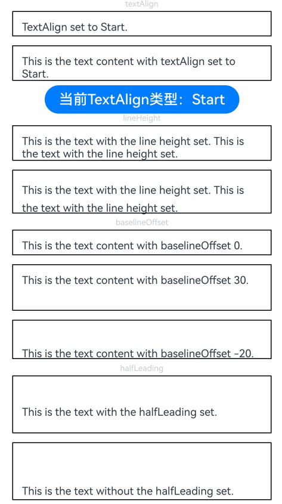

### 示例2（设置文本样式）

该示例通过[decoration](#decoration)、[letterSpacing](#letterspacing)、[textCase](#textcase)、[fontFamily](#fontfamily)、[textShadow](#textshadow10)（从API version 10开始）、[fontStyle](#fontstyle)、[textIndent](#textindent10)（从API version 10开始）、[fontWeight](#fontweight12)（从API version 12开始，支持设置字重无极调节配置项）属性展示了不同样式的文本效果。

```ts
// xxx.ets
@Extend(Text)
function style() {
  .font({ size: 12 }, { enableVariableFontWeight: true })
  .border({ width: 1 })
  .padding(10)
  .width('100%')
  .margin(5)
}

@Entry
@Component
struct TextExample2 {
  @State changeDecorationIndex: number = 0;
  @State textDecorationType: TextDecorationType[] =
    [TextDecorationType.LineThrough, TextDecorationType.Overline, TextDecorationType.Underline];
  @State textDecorationTypeStr: string[] = ['LineThrough', 'Overline', 'Underline'];
  @State textDecorationStyle: TextDecorationStyle[] =
    [TextDecorationStyle.SOLID, TextDecorationStyle.DOTTED, TextDecorationStyle.WAVY];
  @State textDecorationStyleStr: string[] = ['SOLID', 'DOTTED', 'WAVY'];

  build() {
    Flex({ direction: FlexDirection.Column, alignItems: ItemAlign.Center }) {
      Text('decoration').fontSize(9).fontColor(0xCCCCCC)
      Text('This is the text content with the decoration set to LineThrough and the color set to Red.')
        .decoration({
          type: this.textDecorationType[this.changeDecorationIndex],
          color: Color.Red,
          style: this.textDecorationStyle[this.changeDecorationIndex]
        })
        .style()
        .margin(5)

      Row() {
        Button('decoration type：' + this.textDecorationTypeStr[this.changeDecorationIndex] + ' & ' +
        this.textDecorationStyleStr[this.changeDecorationIndex]).onClick(() => {
          this.changeDecorationIndex++;
          if (this.changeDecorationIndex > (this.textDecorationTypeStr.length - 1)) {
            this.changeDecorationIndex = 0;
          }
        })
      }.justifyContent(FlexAlign.Center).width('100%')

      // 文本字符间距
      Text('letterSpacing').fontSize(9).fontColor(0xCCCCCC)
      Text('This is the text content with letterSpacing 0.')
        .letterSpacing(0)
        .style()
      Text('This is the text content with letterSpacing 3.')
        .letterSpacing(3)
        .style()
      Text('This is the text content with letterSpacing -1.')
        .letterSpacing(-1)
        .style()

      Text('textCase').fontSize(9).fontColor(0xCCCCCC)
      Text('This is the text content with textCase set to Normal.')
        .textCase(TextCase.Normal)
        .style()
      // 文本全小写展示
      Text('This is the text content with textCase set to LowerCase.')
        .textCase(TextCase.LowerCase)
        .style()
      // 文本全大写展示
      Text('This is the text content with textCase set to UpperCase.')
        .textCase(TextCase.UpperCase)
        .style()

      Text('fontFamily').fontSize(9).fontColor(0xCCCCCC)
      // 设置字体列表
      Text('This is the text content with fontFamily')
        .style()
        .fontFamily('HarmonyOS Sans')

      Text('textShadow').fontSize(9).fontColor(0xCCCCCC)
      // 设置文字阴影效果
      Text('textShadow')
        .style()
        .textAlign(TextAlign.Center)
        .fontSize(40)
        .textShadow({
          radius: 10,
          color: Color.Black,
          offsetX: 0,
          offsetY: 0
        })

      Text('fontStyle').fontSize(9).fontColor(0xCCCCCC)
      // 设置字体样式
      Text('This is the text content with fontStyle set to Italic')
        .style()
        .fontStyle(FontStyle.Italic)
      Text('This is the text content with fontStyle set to Normal')
        .style()
        .fontStyle(FontStyle.Normal)

      Text('textIndent').fontSize(9).fontColor(0xCCCCCC)
      // 设置文字缩进
      Text('This is the text content with textIndent 30')
        .style()
        .textIndent(30)

      Text('fontWeight').fontSize(9).fontColor(0xCCCCCC)
      // 设置文本的字体粗细
      Text('This is the text content with fontWeight 800')
        .style()
        .fontWeight('800', { enableVariableFontWeight: true })

    }.width('100%').padding({ left: 35, right: 35 })
  }
}
```
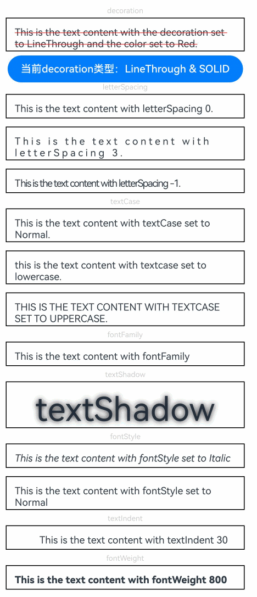

### 示例3（设置文本超长省略）

该示例通过[maxLines](#maxlines)、[textOverflow](#textoverflow)、[ellipsisMode](#ellipsismode11)属性展示了文本超长省略以及调整省略位置的效果，通过MULTILINE_START和MULTILINE_CENTER两种类型实现了单行文本和多行文本场景下的省略号在行首和行中的效果。同时，可以通过[marqueeOptions](#marqueeoptions18)配置跑马灯模式下的配置项以及跑马灯动画进行到特定的阶段时，触发的回调[onMarqueeStateChange](#onmarqueestatechange18)。

从API version 11开始，通过[ellipsisMode](#ellipsismode11)属性设置文本超长时的显示方式。

从API version 18开始，新增[marqueeOptions](#marqueeoptions18)属性设置跑马灯模式下的配置项，同时新增回调[onMarqueeStateChange](#onmarqueestatechange18)。

从API version 24开始，[EllipsisMode](ts-appendix-enums.md#ellipsismode11)新增了MULTILINE_START和MULTILINE_CENTER枚举。

```ts
// xxx.ets
import { LengthMetrics } from '@kit.ArkUI';

@Extend(Text)
function style() {
  .textAlign(TextAlign.Center)
  .fontSize(15)
  .border({ width: 1 })
  .padding(10)
  .width('100%')
  .margin(5)
}

@Entry
@Component
struct TextExample3 {
  @State text: string =
    'The text component is used to display a piece of textual information.' +
      'Support universal attributes and universal text attributes.' +
      'The text component is used to display a piece of textual information.' +
      'Support universal attributes and universal text attributes.';
  @State ellipsisModeIndex: number = 0;
  @State ellipsisMode: EllipsisMode[] =
    [EllipsisMode.START, EllipsisMode.CENTER, EllipsisMode.END, EllipsisMode.MULTILINE_START,
      EllipsisMode.MULTILINE_CENTER]; // 从API version 24开始新增MULTILINE_START和MULTILINE_CENTER
  @State ellipsisModeStr: string[] = ['START', 'CENTER', 'END', 'MULTILINE_START',
    'MULTILINE_CENTER'];

  build() {
    Flex({ direction: FlexDirection.Column, alignItems: ItemAlign.Center }) {
      // 文本超长时显示方式
      Text('TextOverflow+maxLines').fontSize(12).fontColor(Color.Black)
      // 超出maxLines截断内容展示
      Text('This is the setting of textOverflow to Clip text content This is the setting of textOverflow to None text content. This is the setting of textOverflow to Clip text content This is the setting of textOverflow to None text content.')
        .textOverflow({ overflow: TextOverflow.Clip })
        .maxLines(1)
        .style()

      // 超出maxLines展示省略号
      Text('This is set textOverflow to Ellipsis text content This is set textOverflow to Ellipsis text content.')
        .textOverflow({ overflow: TextOverflow.Ellipsis })
        .maxLines(1)
        .style()

      Text('marquee').fontSize(12).fontColor(Color.Black)
      // 设置文本超长时以跑马灯的方式展示
      Text('This is the text with the text overflow set marquee')
        .textOverflow({ overflow: TextOverflow.MARQUEE })
        .style()
        .marqueeOptions({
          start: true,
          fromStart: true,
          step: 6,
          spacing: LengthMetrics.vp(48), // 从API version 23开始新增
          loop: -1,
          delay: 0,
          fadeout: false,
          marqueeStartPolicy: MarqueeStartPolicy.DEFAULT,
          marqueeUpdatePolicy: MarqueeUpdatePolicy.DEFAULT // 从API version 23开始新增
        })
        .onMarqueeStateChange((state: MarqueeState) => {
          if (state == MarqueeState.START) {
            // "收到状态: START";
          } else if (state == MarqueeState.BOUNCE) {
            // "收到状态: BOUNCE";
          } else if (state == MarqueeState.FINISH) {
            // "收到状态: FINISH";
          }
        })

      // 设置文本超长时省略号的位置
      Text('ellipsisMode(单行文本)').fontSize(12).fontColor(Color.Black)
      Text(this.text)
        .textOverflow({ overflow: TextOverflow.Ellipsis })
        .ellipsisMode(this.ellipsisMode[this.ellipsisModeIndex])
        .maxLines(1)
        .style()
      Text('ellipsisMode(多行文本)').fontSize(12).fontColor(Color.Black)
      Text(this.text)
        .textOverflow({ overflow: TextOverflow.Ellipsis })
        .ellipsisMode(this.ellipsisMode[this.ellipsisModeIndex])
        .maxLines(3)
        .style()

      Row() {
        Button('更改省略号位置：' + this.ellipsisModeStr[this.ellipsisModeIndex]).onClick(() => {
          this.ellipsisModeIndex++;
          if (this.ellipsisModeIndex > (this.ellipsisModeStr.length - 1)) {
            this.ellipsisModeIndex = 0;
          }
        })
      }
    }.height(600).width('100%').padding({ left: 35, right: 35, top: 35 })
  }
}
```

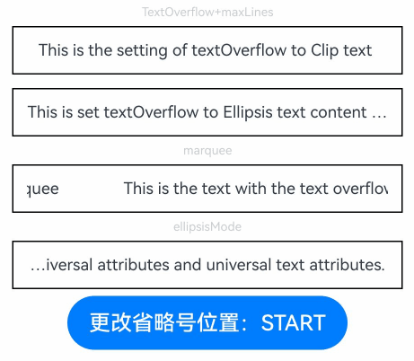

### 示例4（设置文本断行及折行）

该示例通过[wordBreak](#wordbreak11)（从API version 11开始）、[lineBreakStrategy](#linebreakstrategy12)（从API version 12开始）、[clip](ts-universal-attributes-sharp-clipping.md#clip12)属性展示了文本在不同断行、折行规则下的效果以及文本超长时是否截断。

```ts
// xxx.ets
@Extend(Text)
function style() {
  .fontSize(12)
  .border({ width: 1 })
  .padding(10)
  .width('100%')
  .margin(5)
}

@Entry
@Component
struct TextExample4 {
  @State text: string =
    'The text component is used to display a piece of textual information.Support universal attributes and universal text attributes.';
  @State longText: string =
    'They can be classified as built-in components–those directly provided by the ArkUI framework and custom components – those defined by developers' +
      'The built-in components include buttons radio buttons progress indicators and text You can set the rendering effect of these components in method chaining mode,' +
      'page components are divided into independent UI units to implement independent creation development and reuse of different units on pages making pages more engineering-oriented.';
  @State textClip: boolean = false;
  @State wordBreakIndex: number = 0;
  @State wordBreak: WordBreak[] = [WordBreak.NORMAL, WordBreak.BREAK_ALL, WordBreak.BREAK_WORD];
  @State wordBreakStr: string[] = ['NORMAL', 'BREAK_ALL', 'BREAK_WORD'];
  @State lineBreakStrategyIndex: number = 0;
  @State lineBreakStrategy: LineBreakStrategy[] =
    [LineBreakStrategy.GREEDY, LineBreakStrategy.HIGH_QUALITY, LineBreakStrategy.BALANCED];
  @State lineBreakStrategyStr: string[] = ['GREEDY', 'HIGH_QUALITY', 'BALANCED'];

  build() {
    Flex({ direction: FlexDirection.Column, alignItems: ItemAlign.Center }) {
      Text('wordBreak').fontSize(9).fontColor(0xCCCCCC)
      // 设置文本断行规则
      Text(this.text)
        .maxLines(2)
        .textOverflow({ overflow: TextOverflow.Ellipsis })
        .wordBreak(this.wordBreak[this.wordBreakIndex])
        .style()

      Row() {
        Button('当前wordBreak模式：' + this.wordBreakStr[this.wordBreakIndex]).onClick(() => {
          this.wordBreakIndex++;
          if (this.wordBreakIndex > (this.wordBreakStr.length - 1)) {
            this.wordBreakIndex = 0;
          }
        })
      }

      Text('clip').fontSize(9).fontColor(0xCCCCCC)
      // 设置文本是否超长截断
      Text('This is set wordBreak to WordBreak text Taumatawhakatangihangakoauauotamateaturipukakapikimaungahoronukupokaiwhenuakitanatahu.')
        .wordBreak(WordBreak.NORMAL)
        .maxLines(2)
        .clip(this.textClip)
        .style()
      Row() {
        Button('切换clip：' + this.textClip).onClick(() => {
          this.textClip = !this.textClip;
        })
      }

      Text('lineBreakStrategy').fontSize(9).fontColor(0xCCCCCC)
      // 设置文本折行规则
      Text(this.longText)
        .lineBreakStrategy(this.lineBreakStrategy[this.lineBreakStrategyIndex])
        .style()
      Row() {
        Button('当前lineBreakStrategy模式：' + this.lineBreakStrategyStr[this.lineBreakStrategyIndex]).onClick(() => {
          this.lineBreakStrategyIndex++;
          if (this.lineBreakStrategyIndex > (this.lineBreakStrategyStr.length - 1)) {
            this.lineBreakStrategyIndex = 0;
          }
        })
      }
    }.height(600).width('100%').padding({ left: 35, right: 35, top: 35 })
  }
}
```

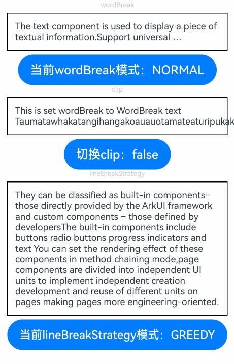

### 示例5（设置文本选中和复制）

该示例通过[selection](#selection11)（从API version 11开始）、[onCopy](#oncopy11)（从API version 11开始）、[draggable](#draggable9)（从API version 9开始）、[caretColor](#caretcolor14)（从API version 14开始）、[selectedBackgroundColor](#selectedbackgroundcolor14)（从API version 14开始）、[onWillCopy](#onwillcopy)接口展示了文本选中、触发复制回调、设置文本选中可拖拽、修改手柄和选中颜色的效果以及如何拦截系统复制。

从API版本26.0.0开始，新增[onWillCopy](#onwillcopy)接口。

```ts
// xxx.ets
@Entry
@Component
struct TextExample5 {
  @State onCopy: string = '';
  @State text: string =
    'This is set selection to Selection text content This is set selection to Selection text content.';
  @State start: number = 0;
  @State end: number = 20;

  build() {
    Column() {
      Flex({ direction: FlexDirection.Column, alignItems: ItemAlign.Center, justifyContent: FlexAlign.Start }) {
        Text(this.text)
          .fontSize(12)
          .border({ width: 1 })
          .lineHeight(20)
          .margin(30)
          .copyOption(CopyOptions.InApp)
          .selection(this.start, this.end)
          .onCopy((value: string) => {
            this.onCopy = value;
          })
          // 从API版本26.0.0开始支持onWillCopy
          .onWillCopy((value: string) => {
            // 根据业务逻辑判断是否允许复制
            return true; // 允许复制时返回true，随后onCopy会被触发
          })
          .draggable(true)
          .caretColor(Color.Red)
          .selectedBackgroundColor(Color.Grey)
          .enableHapticFeedback(true)
        Button('Set text selection')
          .onClick(() => {
            // 变更文本选中起始点、终点
            this.start = 10;
            this.end = 30;
          })
        Text(this.onCopy).fontSize(12).margin(10).key('copy')
      }.height(600).width(335).padding({ left: 35, right: 35, top: 35 })
    }.width('100%')
  }
}
```


### 示例6（设置文本自适应和缩放倍数限制范围）

该示例通过[heightAdaptivePolicy](#heightadaptivepolicy10)（从API version 10开始）属性展示文本自适应效果以及通过[minFontScale](#minfontscale12)（从API version 12开始）、[maxFontScale](#maxfontscale12)（从API version 12开始）展示设置字体缩放倍数限制范围。

```ts
// xxx.ets
@Extend(Text)
function style(heightAdaptivePolicy: TextHeightAdaptivePolicy) {
  .width('80%')
  .height(90)
  .borderWidth(1)
  .minFontSize(10)
  .maxFontSize(30)
  .maxLines(2)
  .margin(5)
  .textOverflow({ overflow: TextOverflow.Ellipsis })
  .heightAdaptivePolicy(heightAdaptivePolicy)
}

@Entry
@Component
struct TextExample6 {
  build() {
    Flex({ direction: FlexDirection.Column, alignItems: ItemAlign.Center }) {
      // 设置文本自适应高度的方式
      Text('heightAdaptivePolicy').fontSize(9).fontColor(0xCCCCCC)
      Text('This is the text with the height adaptive policy set.')
        .style(TextHeightAdaptivePolicy.MAX_LINES_FIRST)
      Text('This is the text with the height adaptive policy set.')
        .style(TextHeightAdaptivePolicy.MIN_FONT_SIZE_FIRST)
      Text('This is the text with the height adaptive policy set.')
        .style(TextHeightAdaptivePolicy.LAYOUT_CONSTRAINT_FIRST)

      Text('fontScale').fontSize(9).fontColor(0xCCCCCC)
      Text('This is the text content with minFontScale set to 1 and maxFontScale set to 1.2')
        .style(TextHeightAdaptivePolicy.MAX_LINES_FIRST)
        .minFontScale(1)
        .maxFontScale(1.2)
    }.height(600).width('100%').padding({ left: 35, right: 35, top: 35 })
  }
}
```

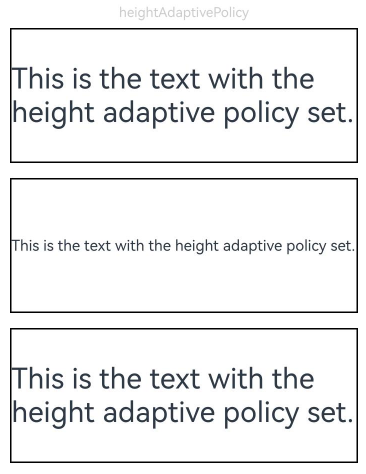

### 示例7（设置文本识别）

从API version 11开始，该示例通过[enableDataDetector](#enabledatadetector11)、[dataDetectorConfig](#datadetectorconfig11)接口实现了文本识别的功能。当[enableDataDetector](#enabledatadetector11)设为true且不设置[dataDetectorConfig](#datadetectorconfig11)时，系统会识别所有实体类型，并将识别实体的字体颜色改为蓝色、添加蓝色下划线。

```ts
// xxx.ets
@Entry
@Component
struct TextExample7 {
  @State phoneNumber: string = '(86) (755) ********';
  @State url: string = 'www.********.com';
  @State email: string = '***@example.com';
  @State address: string = 'XX省XX市XX区XXXX';
  @State datetime: string = 'XX年XX月XX日XXXX';
  @State enableDataDetector: boolean = true;
  @State types: TextDataDetectorType[] = [];

  build() {
    Row() {
      Column() {
        Text(
          '电话号码：' + this.phoneNumber + '\n' +
            '链接：' + this.url + '\n' +
            '邮箱：' + this.email + '\n' +
            '地址：' + this.address + '\n' +
            '时间：' + this.datetime
        )
          .fontSize(16)
          .copyOption(CopyOptions.InApp)
          .enableDataDetector(this.enableDataDetector)
          .dataDetectorConfig({
            types: this.types, onDetectResultUpdate: (result: string) => {
            }
          })
          .textAlign(TextAlign.Center)
          .borderWidth(1)
          .padding(10)
          .width('100%')
        Text(
          '电话号码：' + this.phoneNumber + '\n' +
            '时间：' + this.datetime
        )
          .fontSize(16)
          .copyOption(CopyOptions.LocalDevice)
          .textAlign(TextAlign.Center)
          .borderWidth(1)
          .padding(10)
          .width('100%')
      }
      .width('100%')
      // 使用parallelGesture中的TapGesture替代onClick属性，达到非冒泡事件类似冒泡
      // 的效果，点击Text组件区域Column上的点击事件正常响应
      .parallelGesture(TapGesture().onAction((event: GestureEvent) => {
        console.info('test column onClick timestamp:' + event.timestamp);
      }), GestureMask.Normal)
    }
    .height('100%')
  }
}
```

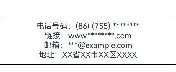

### 示例8（文本绑定自定义菜单）

从API version 11开始，该示例通过[bindSelectionMenu](#bindselectionmenu11)、[onTextSelectionChange](#ontextselectionchange11)、[closeSelectionMenu](#closeselectionmenu11)接口实现了文本绑定自定义菜单的功能。

```ts
// xxx.ets
@Entry
@Component
struct TextExample8 {
  controller: TextController = new TextController();
  options: TextOptions = { controller: this.controller };

  build() {
    Column() {
      Column() {
        Text(undefined, this.options) {
          Span('Hello World')
          // $r('app.media.startIcon')需要替换为开发者所需的图像资源文件。
          ImageSpan($r('app.media.startIcon'))
            .width(50)
            .height(50)
            .objectFit(ImageFit.Fill)
            .verticalAlign(ImageSpanAlignment.CENTER)
        }
        .copyOption(CopyOptions.InApp)
        .bindSelectionMenu(TextSpanType.IMAGE, this.LongPressImageCustomMenu, TextResponseType.LONG_PRESS, {
          onDisappear: () => {
            console.info(`自定义选择菜单关闭时回调`);
          },
          onAppear: () => {
            console.info(`自定义选择菜单弹出时回调`);
          },
          onMenuShow: () => {
            console.info(`自定义选择菜单显示时回调`);
          },
          onMenuHide: () => {
            console.info(`自定义选择菜单隐藏时回调`);
          }
        })
        .bindSelectionMenu(TextSpanType.TEXT, this.RightClickTextCustomMenu, TextResponseType.RIGHT_CLICK)
        .bindSelectionMenu(TextSpanType.MIXED, this.SelectMixCustomMenu, TextResponseType.SELECT)
        .onTextSelectionChange((selectionStart: number, selectionEnd: number) => {
          console.info(`文本选中区域变化回调, selectionStart: ${selectionStart}, selectionEnd: ${selectionEnd}`);
        })
        .borderWidth(1)
        .borderColor(Color.Red)
        .width(200)
        .height(100)
      }
      .width('100%')
      .backgroundColor(Color.White)
      .alignItems(HorizontalAlign.Start)
      .padding(25)
    }
    .height('100%')
  }

  @Builder
  RightClickTextCustomMenu() {
    Column() {
      Menu() {
        MenuItemGroup() {
          // $r('app.media.startIcon')需要替换为开发者所需的图像资源文件。
          MenuItem({ startIcon: $r('app.media.startIcon'), content: 'Right Click Menu 1', labelInfo: '' })
            .onClick((event) => {
              this.controller.closeSelectionMenu();
            })
          MenuItem({ startIcon: $r('app.media.startIcon'), content: 'Right Click Menu 2', labelInfo: '' })
          MenuItem({ startIcon: $r('app.media.startIcon'), content: 'Right Click Menu 3', labelInfo: '' })
        }
      }
      .MenuStyles()
    }
  }

  @Builder
  LongPressImageCustomMenu() {
    Column() {
      Menu() {
        MenuItemGroup() {
          // $r('app.media.startIcon')需要替换为开发者所需的图像资源文件。
          MenuItem({ startIcon: $r('app.media.startIcon'), content: 'Long Press Image Menu 1', labelInfo: '' })
            .onClick((event) => {
              this.controller.closeSelectionMenu();
            })
          MenuItem({ startIcon: $r('app.media.startIcon'), content: 'Long Press Image Menu 2', labelInfo: '' })
          MenuItem({ startIcon: $r('app.media.startIcon'), content: 'Long Press Image Menu 3', labelInfo: '' })
        }
      }
      .MenuStyles()
    }
  }

  @Builder
  SelectMixCustomMenu() {
    Column() {
      Menu() {
        MenuItemGroup() {
          // $r('app.media.startIcon')需要替换为开发者所需的图像资源文件。
          MenuItem({ startIcon: $r('app.media.startIcon'), content: 'Select Mixed Menu 1', labelInfo: '' })
            .onClick((event) => {
              this.controller.closeSelectionMenu();
            })
          MenuItem({ startIcon: $r('app.media.startIcon'), content: 'Select Mixed Menu 2', labelInfo: '' })
          MenuItem({ startIcon: $r('app.media.startIcon'), content: 'Select Mixed Menu 3', labelInfo: '' }) 
        }
      }
      .MenuStyles()
    }
  }
}

@Extend(Menu)
function MenuStyles() {
  .radius($r('sys.float.ohos_id_corner_radius_card'))
  .clip(true)
  .backgroundColor('#F0F0F0')
}
```


### 示例9（设置文本特性与行间距）

从API version 12开始，该示例通过[fontFeature](#fontfeature12)、[lineSpacing](#linespacing12)接口展示了设置文本特性与行间距的效果，同时，配置[LineSpacingOptions](ts-text-common.md#linespacingoptions20对象说明)中的onlyBetweenLines（从API version 20开始）属性，可以设置文本的行间距，是否仅在行与行之间生效。

```ts
// xxx.ets
import { LengthMetrics } from '@kit.ArkUI';

@Extend(Text)
function style() {
  .fontSize(12)
  .border({ width: 1 })
  .width('100%')
}

@Entry
@Component
struct TextExample9 {
  build() {
    Flex({ direction: FlexDirection.Column, alignItems: ItemAlign.Center, justifyContent: FlexAlign.SpaceBetween }) {
      Text('lineSpacing').fontSize(9).fontColor(0xCCCCCC)
      // 设置文本行间距
      Text('This is a context with no lineSpacing set.')
        .lineSpacing(undefined)
        .style()
      Text('This is a context with lineSpacing set to 20_px.')
        .lineSpacing(LengthMetrics.px(20))
        .style()
      Text('This is the context with lineSpacing set to 20_vp.')
        .lineSpacing(LengthMetrics.vp(20))
        .style()
      Text('This is the context with lineSpacing set to 20_fp.')
        .lineSpacing(LengthMetrics.fp(20))
        .style()
      Text('This is the context with lineSpacing set to 20_lpx.')
        .lineSpacing(LengthMetrics.lpx(20))
        .style()
      Text('This is the context with lineSpacing set to 100%.')
        .lineSpacing(LengthMetrics.percent(1))
        .style()
      Text('The line spacing of this context is set to 20_px, and the spacing is effective only between the lines.')
        .lineSpacing(LengthMetrics.px(20), { onlyBetweenLines: true })
        .style()

      Text('fontFeature').fontSize(9).fontColor(0xCCCCCC)
      // 设置文本特性
      Text('This is frac on : 1/2 2/3 3/4')
        .fontFeature('"frac" on')
        .style()
      Text('This is frac off: 1/2 2/3 3/4')
        .fontFeature('"frac" off')
        .style()
    }.height(300).width(350).padding({ left: 35, right: 35, top: 35 })
  }
}
```


### 示例10（获取文本信息）

从API version 12开始，该示例通过[getLayoutManager](#getlayoutmanager12)接口调用文本的布局管理对象获取文本信息，同时，[LayoutManager](ts-text-common.md#layoutmanager12)中的[getRectsForRange](./ts-text-common.md#getrectsforrange14)（从API version 14开始）接口可以获取指定矩形宽度和高度下，文本中任意区间范围内字符或占位符的绘制区域信息。

```ts
// xxx.ets
import { text } from '@kit.ArkGraphics2D';

@Entry
@Component
struct TextExample10 {
  @State lineCount: string = "";
  @State glyphPositionAtCoordinate: string = "";
  @State lineMetrics: string = "";
  @State rectsForRangeStr: string = "";
  controller: TextController = new TextController();
  @State textStr: string =
    'Hello World! 您好，世界！';

  build() {
    Scroll() {
      Column() {
        Text('Text组件getLayoutManager接口获取段落相对组件的信息')
          .fontSize(15)
          .fontColor(0xCCCCCC)
          .width('90%')
          .padding(10)
        Text(this.textStr, { controller: this.controller })
          .fontSize(25)
          .borderWidth(1)
          .onAreaChange(() => {
            let layoutManager: LayoutManager = this.controller.getLayoutManager();
            this.lineCount = 'LineCount: ' + layoutManager.getLineCount();
          })

        Text('LineCount').fontSize(15).fontColor(0xCCCCCC).width('90%').padding(10)
        Text(this.lineCount)

        Text('GlyphPositionAtCoordinate').fontSize(15).fontColor(0xCCCCCC).width('90%').padding(10)
        Button("相对组件坐标[150,50]字形信息")
          .onClick(() => {
            let layoutManager: LayoutManager = this.controller.getLayoutManager();
            let position: PositionWithAffinity = layoutManager.getGlyphPositionAtCoordinate(150, 50);
            this.glyphPositionAtCoordinate =
              '相对组件坐标[150,50] glyphPositionAtCoordinate position: ' + position.position + ' affinity: ' +
              position.affinity;
          })
          .margin({ bottom: 20, top: 10 })
        Text(this.glyphPositionAtCoordinate)

        Text('LineMetrics').fontSize(15).fontColor(0xCCCCCC).width('90%').padding(10)
        Button('首行行信息、文本样式信息、以及字体属性信息')
          .onClick(() => {
            let layoutManager: LayoutManager = this.controller.getLayoutManager();
            let lineMetrics: LineMetrics = layoutManager.getLineMetrics(0);
            this.lineMetrics = 'lineMetrics is ' + JSON.stringify(lineMetrics) + '\n\n';
            let runMetrics = lineMetrics.runMetrics;
            runMetrics.forEach((value, key) => {
              this.lineMetrics += 'runMetrics key is ' + key + ' ' + JSON.stringify(value) + '\n\n';
            })
          })
          .margin({ bottom: 20, top: 10 })
        Text(this.lineMetrics)

        Text('getRectsForRange').fontSize(15).fontColor(0xCCCCCC).width('90%').padding(10)
        Button('获取指定矩形宽度和高度下，文本中任意区间范围内字符或占位符的绘制区域信息')
          .onClick(() => {
            let layoutManager: LayoutManager = this.controller.getLayoutManager();
            let range: TextRange = { start: 0, end: 1 };
            let rectsForRangeInfo: text.TextBox[] =
              layoutManager.getRectsForRange(range, text.RectWidthStyle.TIGHT, text.RectHeightStyle.TIGHT);
            this.rectsForRangeStr = 'getRectsForRange result is ' + '\n\n';
            rectsForRangeInfo.forEach((value, key) => {
              this.rectsForRangeStr += 'rectsForRange key is ' + key + ' ' + JSON.stringify(value) + '\n\n';
            })
          })
          .margin({ bottom: 20, top: 10 })
        Text(this.rectsForRangeStr)
      }
      .margin({ top: 100, left: 8, right: 8 })
    }
  }
}
```


### 示例11（实现键盘框选文本）

从API version 12开始，该示例通过[textSelectable](#textselectable12)属性实现了设置TextSelectMode.SELECTABLE_FOCUSABLE时能够触发键盘框选文本功能。

```ts
// xxx.ets
@Entry
@Component
struct TextExample11 {
  @State message: string =
    'TextTextTextTextTextTextTextText' + 'TextTextTextTextTextTextTextTextTextTextTextTextTextTextTextText';

  build() {
    Column() {
      Text(this.message)
        .width(300)
        .height(100)
        .maxLines(5)
        .fontColor(Color.Black)
        .copyOption(CopyOptions.InApp)
        .selection(3, 8)
        .textSelectable(TextSelectableMode.SELECTABLE_FOCUSABLE)
    }.width('100%').margin({ top: 100 })
  }
}
```

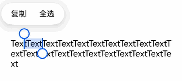

### 示例12（文本扩展自定义菜单）

从API version 12开始，该示例通过[editMenuOptions](#editmenuoptions12)接口实现了文本设置自定义菜单扩展项的文本内容、图标以及回调的功能，同时，可以在[onPrepareMenu](ts-text-common.md#属性-1)（从API version 20开始）回调中，进行菜单数据的设置。

```ts
// xxx.ets
@Entry
@Component
struct TextExample12 {
  @State text: string = 'Text editMenuOptions'
  @State endIndex: number = 0;
  onCreateMenu = (menuItems: Array<TextMenuItem>) => {
    // $r('app.media.startIcon')需要替换为开发者所需的图像资源文件。
    let item1: TextMenuItem = {
      content: 'create1',
      icon: $r('app.media.startIcon'),
      id: TextMenuItemId.of('create1'),
    };
    let item2: TextMenuItem = {
      content: 'create2',
      id: TextMenuItemId.of('create2'),
      icon: $r('app.media.startIcon'),
    };
    menuItems.push(item1);
    menuItems.unshift(item2);
    let targetIndex = menuItems.findIndex(item => item.id.equals(TextMenuItemId.askAI));
    if (targetIndex !== -1) {
      menuItems.splice(targetIndex, 1); // 从目标索引删除1个元素
    }
    targetIndex = menuItems.findIndex(item => item.id.equals(TextMenuItemId.TRANSLATE));
    if (targetIndex !== -1) {
      menuItems.splice(targetIndex, 1);
    }
    return menuItems;
  }
  onMenuItemClick = (menuItem: TextMenuItem, textRange: TextRange) => {
    if (menuItem.id.equals(TextMenuItemId.of("create2"))) {
      console.info('拦截 id: create2 start:' + textRange.start + '; end:' + textRange.end);
      return true;
    }
    if (menuItem.id.equals(TextMenuItemId.of("prepare1"))) {
      console.info('拦截 id: prepare1 start:' + textRange.start + '; end:' + textRange.end);
      return true;
    }
    if (menuItem.id.equals(TextMenuItemId.COPY)) {
      console.info('拦截 COPY start:' + textRange.start + '; end:' + textRange.end);
      return true;
    }
    if (menuItem.id.equals(TextMenuItemId.SELECT_ALL)) {
      console.info('不拦截 SELECT_ALL start:' + textRange.start + '; end:' + textRange.end);
      return false;
    }
    return false;
  }
  // $r('app.media.startIcon')需要替换为开发者所需的图像资源文件。
  onPrepareMenu = (menuItems: Array<TextMenuItem>) => {
    let item1: TextMenuItem = {
      content: 'prepare1_' + this.endIndex,
      icon: $r('app.media.startIcon'),
      id: TextMenuItemId.of('prepare1'),
    };
    menuItems.unshift(item1);
    return menuItems;
  }
  @State editMenuOptions: EditMenuOptions = {
    onCreateMenu: this.onCreateMenu,
    onMenuItemClick: this.onMenuItemClick,
    onPrepareMenu: this.onPrepareMenu
  };

  build() {
    Column() {
      Text(this.text)
        .fontSize(20)
        .copyOption(CopyOptions.LocalDevice)
        .editMenuOptions(this.editMenuOptions)
        .margin({ top: 100 })
        .onTextSelectionChange((selectionStart: number, selectionEnd: number) => {
          this.endIndex = selectionEnd;
        })
    }
    .width('90%')
    .margin('5%')
  }
}
```


### 示例13（配置隐私隐藏）

从API version 12开始，该示例通过[privacySensitive](#privacysensitive12)属性展示了文本如何配置隐私隐藏的效果，实际显示需要卡片框架支持。

```ts
// xxx.ets
@Entry
@Component
struct TextExample13 {
  build() {
    Column({ space: 10 }) {
      Text('privacySensitive')
        .privacySensitive(true)
        .margin({ top: 30 })
    }
    .alignItems(HorizontalAlign.Center)
    .width('100%')
  }
}
```

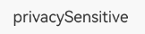

### 示例14（设置中西文自动间距）

从API version 20开始，该示例通过[enableAutoSpacing](#enableautospacing20)属性设置中西文自动间距。

```ts
// xxx.ets
@Entry
@Component
struct TextExample {
  build() {
    Row() {
      Column() {
        Text('开启中西文自动间距').margin(5)
        Text('中西文Auto Spacing自动间距')
          .enableAutoSpacing(true)
        Text('关闭中西文自动间距').margin(5)
        Text('中西文Auto Spacing自动间距')
          .enableAutoSpacing(false)
      }.height('100%')
    }
    .width('60%')
  }
}
```


### 示例15（文本颜色按线性或径向渐变）

从API version 20开始，该示例通过[shaderStyle](#shaderstyle20)接口实现了对Text组件显示为渐变色和纯色的功能。

```ts
@Entry
@Component
struct ShaderColorStyle {
  @State message: string = 'Hello World';
  @State linearGradientOptionsAngle: LinearGradientOptions =
    {
      angle: 45,
      colors: [[Color.Red, 0.0], [Color.Blue, 0.3], [Color.Green, 0.5]]
    };
  @State linearGradientOptionsDirection: LinearGradientOptions =
    {
      direction: GradientDirection.LeftTop,
      colors: [[Color.Red, 0.0], [Color.Blue, 0.3], [Color.Green, 0.5]],
      repeating: true,
    };
  @State radialGradientOptions: RadialGradientOptions =
    {
      center: [50, 50],
      radius: 20,
      colors: [[Color.Red, 0.0], [Color.Blue, 0.3], [Color.Green, 0.5]],
      repeating: true,
    };
  @State colorShaderStyle: ColorShaderStyle =
    {
      color: Color.Blue
    };
  build() {
    Column({ space: 5 }) {
      Text('angle为45°的线性渐变').fontSize(18).width('90%').fontColor(0xCCCCCC)
        .margin({ top: 40, left: 40 })
      Text(this.message)
        .fontSize(50)
        .width('80%')
        .height(50)
        .shaderStyle(this.linearGradientOptionsAngle)
      Text('direction为LeftTop的线性渐变').fontSize(18).width('90%').fontColor(0xCCCCCC)
        .margin({ top: 40, left: 40 })
      Text(this.message)
        .fontSize(50)
        .width('80%')
        .height(50)
        .shaderStyle(this.linearGradientOptionsDirection)
      Text('径向渐变').fontSize(18).width('90%').fontColor(0xCCCCCC)
        .margin({ top: 40, left: 40 })
      Text(this.message)
        .fontSize(50)
        .width('80%')
        .height(50)
        .shaderStyle(this.radialGradientOptions)
      Text('纯色').fontSize(18).width('90%').fontColor(0xCCCCCC)
        .margin({ top: 40, left: 40 })
      Text(this.message)
        .fontSize(50)
        .width('80%')
        .height(50)
        .shaderStyle(this.colorShaderStyle)
    }
  }
}
```
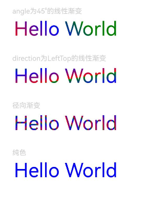

### 示例16（配置除去行尾空格）

从API version 20开始，该示例通过[optimizeTrailingSpace](#optimizetrailingspace20)属性展示了文本如何配置除去行尾空格的效果，一般需要与对齐功能搭配使用，实际显示需要字体引擎支持。

```ts
// xxx.ets
@Entry
@Component
struct TextExample16 {
  build() {
    Column() {
      Text('Trimmed space enabled     ')
        .fontSize(30)
        .fontWeight(FontWeight.Bold)
        .margin({ top: 20 })
        .optimizeTrailingSpace(true)
        .textAlign(TextAlign.Center)
      Text('Trimmed space disabled     ')
        .fontSize(30)
        .fontWeight(FontWeight.Bold)
        .margin({ top: 20 })
        .optimizeTrailingSpace(false)
        .textAlign(TextAlign.Center)
    }
    .width("100%")
  }
}
```


### 示例17（文本垂直对齐）

从API version 20开始，该示例通过[textVerticalAlign](#textverticalalign20)属性展示了文本如何设置文本垂直对齐效果。

```ts
// xxx.ets
@Entry
@Component
struct TextExample14 {
  build() {
    Column({ space: 10 }) {
      Text() {
        Span("Hello")
          .fontSize(50)
        // $r('app.media.startIcon')需要替换为开发者所需的图像资源文件。
        ImageSpan($r('app.media.startIcon'))
          .width(30).height(30)
          .verticalAlign(ImageSpanAlignment.FOLLOW_PARAGRAPH)// 从API version 20开始，支持ImageSpanAlignment.FOLLOW_PARAGRAPH
        Span("World")
      }
      .textVerticalAlign(TextVerticalAlign.CENTER)
      .borderWidth(1)
    }
    .alignItems(HorizontalAlign.Center)
    .width("100%")
  }
}
```


### 示例18（文本翻牌动效）

从API version 20开始，该示例通过[contentTransition](#contenttransition20)属性展示了数字翻牌效果。

``` ts
// xxx.ets
@Entry
@Component
struct TextNumberTransition {
  @State number: number = 98;
  @State numberTransition: NumericTextTransition =
    new NumericTextTransition({ flipDirection: FlipDirection.DOWN, enableBlur: false });

  build() {
    Column() {
      Text(this.number + '')
        .borderWidth(1)
        .fontSize(40)
        .contentTransition(this.numberTransition)
      Button("change number")
        .onClick(() => {
          this.number++;
        })
        .margin(10)
    }
    .justifyContent(FlexAlign.Center)
    .height('100%')
    .width('100%')
  }
}
```

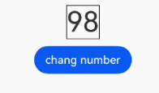

### 示例19（文本内容区垂直对齐）

从API version 21开始，该示例通过[textContentAlign](#textcontentalign21)属性展示了当文本内容区高度大于组件高度时文本内容区的垂直对齐。

```ts
@Entry
@Component
struct TextContentAlignExample {

  build() {
    Column() {
      Row() {
        Text('这是一段展示文字')
          .fontSize(30)
          .backgroundColor(Color.Gray)
          .width('80%')
          .height(20)
          .textContentAlign(TextContentAlign.CENTER)
      }.height('60%')
    }
  }
}
```


### 示例20（倍数行高和最大最小行高）

从API version 22开始，该示例通过[lineHeightMultiple](#lineheightmultiple22)属性展示了使用倍数模式设置行高，同时通过[minLineHeight](#minlineheight22)和[maxLineHeight](#maxlineheight22)来设置最小和最大行高值。

```ts
import { LengthUnit } from '@kit.ArkUI';

@Entry
@Component
struct Index {
  @State message: string = 'hello';

  build() {
    Scroll() {
      Column() {
        Row() {
          Text(this.message)
            .lineHeight(176)
            .backgroundColor(0xffc0c0c0)
            .fontSize(50)
          Text(this.message)
            .lineHeightMultiple(3)
            .backgroundColor(0xffc0c0c0)
            .fontSize(50)
          Text(this.message)
            .lineHeight(300)
            .maxLineHeight({value:176,unit:LengthUnit.FP})
            .backgroundColor(0xffc0c0c0)
            .fontSize(50)
          Text(this.message)
            .lineHeight(10)
            .minLineHeight({value:176,unit:LengthUnit.FP})
            .backgroundColor(0xffc0c0c0)
            .fontSize(50)
        }
      }
    }.height('100%')
    .width('100%')
  }
}
```


### 示例21（文本设置显示最小行数）

从API version 22开始，该示例使用[minLines](#minlines22)属性设置文本显示的最小行数。

```ts

@Entry
@Component
struct TextExample1 {
  @State shortMessage: string = 'Hello world!';
  @State longMessage: string = 'The minimum number of lines displayed for this text setting is 1';

  build() {
    Column() {
      Text(this.shortMessage)
        .minLines(3)
        .fontSize(20)
        .margin(10)
        .width('95%')
        .border({ width: 1 })
      Text(this.longMessage)
        .minLines(1)
        .fontSize(20)
        .margin(10)
        .width('95%')
        .border({ width: 1 })
    }.height(100).width('90%').margin(10)
  }
}
```


### 示例22（设置文本选择区域并高亮显示）

从API version 23开始，该示例使用[TextController](#textcontroller11)中的[setTextSelection](#settextselection23)设置文本选择区域并高亮显示。

```ts

@Entry
@Component
struct Index {
  controller: TextController = new TextController();
  @State textStr: string = 'Hello World! 你好，世界！';

  build() {
    Scroll() {
      Column() {
        Text(this.textStr, { controller: this.controller })
          .fontSize(25)
          .borderWidth(1)
          .copyOption(CopyOptions.LocalDevice)
        Button("setTextSelection")
          .onClick(() => {
            this.controller.setTextSelection(1, 6, { menuPolicy: MenuPolicy.HIDE })
          })
          .margin({ bottom: 20, top: 10 } as Margin)
      }
      .margin({ top: 100, left: 8, right: 8 } as Margin)
    }
  }
}
```


### 示例23（设置行首标点符号压缩和行尾标点符号悬挂）

本示例通过[compressLeadingPunctuation](#compressleadingpunctuation23)接口设置行首标点符号压缩，通过[punctuationOverflow](#punctuationoverflow)设置行尾标点符号悬挂。

左侧有间距的标点符号位于行首时，标点会直接压缩间距至左侧边界。

文本自动换行后，剩余内容（含标点符号）需要能够放入上一行，标点符号悬挂才生效。

从API版本23开始，新增compressLeadingPunctuation接口。

从API版本26.0.0开始，新增punctuationOverflow接口。

```ts
@Entry
@Component
struct PunctuationDemo {
  @State compressLeadingPunctuation: boolean = false;
  @State punctuationOverflow: boolean = false;
  @State text: string = '「0123456789！\n『0123456789：\n（0123456789；\n《0123456789）\n〈0123456789】';

  build() {
    Column() {
      Text(this.text)
        .compressLeadingPunctuation(this.compressLeadingPunctuation)
        .punctuationOverflow(this.punctuationOverflow)
        .border({ width: 1, color: Color.Black })
        .copyOption(CopyOptions.LocalDevice)
        .fontSize('20fp')
        .align(Alignment.Center)
        .height('35%')
        .width('40%')

      Column() {
        Button('开启行首标点符号压缩').onClick(() => {
          this.compressLeadingPunctuation = true
        }).margin(5)
        Button('关闭行首标点符号压缩').onClick(() => {
          this.compressLeadingPunctuation = false
        }).margin(5)
        Button('开启行尾标点符号悬挂').onClick(() => {
          this.punctuationOverflow = true
        }).margin(5)
        Button('关闭行尾标点符号悬挂').onClick(() => {
          this.punctuationOverflow = false
        }).margin(5)
      }
    }.width('100%').padding(20)
  }
}
```


### 示例24（设置自适应间距）

该示例通过[includeFontPadding](#includefontpadding23)接口增加首行尾行间距和[fallbackLineSpacing](#fallbacklinespacing23)接口设置自适应行间距。

从API version 23开始，新增[includeFontPadding](#includefontpadding23)和[fallbackLineSpacing](#fallbacklinespacing23)接口。

```ts
// xxx.ets

const UYGHUR_TEXT: string = 'ياخشىمۇسەنياخشىمۇسەنياخشىمۇسەنياخشىمۇسەنياخشىمۇسەنياخشىمۇسەنياخشىمۇسەن';
@Entry
@Component
struct Index {
  @State include: boolean | null | undefined = false;
  @State fallback: boolean | null | undefined = false;
  @State displayText: string = UYGHUR_TEXT;

  build() {
    Column() {
      Text(this.displayText)
        .includeFontPadding(this.include)
        .fallbackLineSpacing(this.fallback)
        .lineHeight(5)
        .width('100%')
        .height(100)
        .backgroundColor('#eee')
        .borderWidth(1)
        .borderColor('#dddddd')

      Scroll() {
        Column() {
          // --- IncludeFontPadding相关按钮 ---
          Button('设置includePadding: ' + this.include)
            .onClick(() => {
              this.include = this.include === false ? true : false;
            })
            .margin({ bottom: 10 })

          // --- FallbackLineSpacing相关按钮 ---
          Button('设置fallbackLineSpacing: ' + this.fallback)
            .onClick(() => {
              this.fallback = this.fallback === false ? true : false;
            })
            .margin({ bottom: 10 })

        }
        .width('100%')
        .padding(5)
      }
      .height(250)
      .backgroundColor('transparent')
      .scrollBarWidth(2)
      .scrollBarColor('#888')

    }
    .width('100%')
    .height('100%')
    .padding(20)
  }
}
```


### 示例25（设置文本拖拽时的背板样式）

该示例通过[selectedDragPreviewStyle](#selecteddragpreviewstyle23)接口设置文本拖拽时的背板样式。

从API version 23开始，新增selectedDragPreviewStyle接口。

```ts
@Entry
@Component
struct TextTest {
  build() {
    Column() {
      Text('This is drag text')
        .copyOption(CopyOptions.InApp)
        .width(200)
        .height(100)
        .margin(150)
        .draggable(true)
        .selectedDragPreviewStyle({color: 'rgba(227, 248, 249, 1)'})
    }
    .height('100%')
  }
}
```


### 示例26（设置文本排版方向）

该示例通过[textDirection](#textdirection23)接口设置文本排版方向。

从API version 23开始，新增textDirection接口。

``` ts
// xxx.ets
@Entry
@Component
struct TextExample {
  @State text: string = 'Text文本排版方向示例';

  build() {
    Column({ space: 3 }) {
      Text('Text文本排版方向DEFAULT')
        .fontSize(12).width('90%').margin(5)
      Text(this.text)
        .width('95%')
        .borderWidth(1)
      Text('Text文本排版方向RTL')
        .fontSize(12).width('90%').margin(5)
      Text(this.text)
        .width('95%')
        .borderWidth(1)
        .textDirection(TextDirection.RTL)
      Text('Text文本排版方向RTL，文本水平方向对齐方式LEFT')
        .fontSize(12).width('90%').margin(5)
      Text(this.text)
        .width('95%')
        .borderWidth(1)
        .textDirection(TextDirection.RTL)
        .textAlign(TextAlign.LEFT)
    }
    .width('100%')
    .height('100%')
  }
}
```


### 示例27（获取指定坐标和范围对应的文本信息）

从API version 24开始，支持[getCharacterPositionAtCoordinate](ts-text-common.md#getcharacterpositionatcoordinate24)，[getGlyphRangeForCharacterRange](ts-text-common.md#getglyphrangeforcharacterrange24)，[getCharacterRangeForGlyphRange](ts-text-common.md#getcharacterrangeforglyphrange24)接口。该示例通过[getLayoutManager](#getlayoutmanager12)接口调用文本的布局管理对象获取文本信息，通过[LayoutManager](ts-text-common.md#layoutmanager12)中的[getCharacterPositionAtCoordinate](ts-text-common.md#getcharacterpositionatcoordinate24)获取坐标字符的位置信息，通过[getGlyphRangeForCharacterRange](ts-text-common.md#getglyphrangeforcharacterrange24)根据字符索引范围获取字形索引范围和实际的字符索引范围，通过[getCharacterRangeForGlyphRange](ts-text-common.md#getcharacterrangeforglyphrange24)根据字形索引范围获取字符索引范围和实际的字形索引范围。

```ts
// xxx.ets
import { LengthMetrics } from '@kit.ArkUI';

@Entry
@Component
struct TextExample10 {
  @State start: number = 10;
  @State end: number = 20;
  textController: TextController = new TextController();
  textStr: string = 'Hello World! 您好，世界!';
  @State str1: string = ''
  @State str2: string = ''
  @State str3: string = ''
  @State str4: string = ''
  titleParagraphStyleAttr: ParagraphStyle =
    new ParagraphStyle({ paragraphSpacing: LengthMetrics.px(50), textIndent: LengthMetrics.vp(15) });
  mutableStyledString: MutableStyledString =
    new MutableStyledString('属性字符串TextStyle测试\n属性字符串测试\n属性字符串TextStyle测试');

  build() {
    Column() {
      Text(this.textStr, { controller: this.textController }) {
        Span('Hello World 123 \n')
        Span('Hello World 456 \n')
        Span('Hello World 789 \n')
      }
      .fontSize(25)
      .borderWidth(1)

      Text(this.str1)
      Text(this.str2)
      Text(this.str3)
      Text(this.str4)

      Button('点击可增加属性字符串').onClick(() => {
        this.textController.setStyledString(this.mutableStyledString)
      })

      Button('相对组件坐标[150,50]字形信息')
        .onClick(() => {
          let layoutManager: LayoutManager = this.textController.getLayoutManager();
          let position1: PositionWithAffinity = layoutManager.getGlyphPositionAtCoordinate(150, 50);
          this.str1 = '相对组件坐标[150,50] glyphPosition position: ' + position1.position +
            ' affinity: ' +
          position1.affinity;

          let position2: PositionWithAffinity =
            layoutManager.getCharacterPositionAtCoordinate(150, 50) as PositionWithAffinity;
          this.str2 = '相对组件坐标[150,50] characterPosition position: ' + position2.position +
            ' affinity: ' +
          position2.affinity;

          let range1: TextRange = { start: this.start, end: this.end };
          let ranges1: Array<TextRange> = layoutManager.getGlyphRangeForCharacterRange(range1) as Array<TextRange>
          this.str3 = 'getGlyphRangeForCharacterRange 字形数 ' + ranges1[0].start + ' ' + ranges1[0].end + '\n' +
            'getGlyphRangeForCharacterRange 实际字符数 ' + ranges1[1].start + ' ' + ranges1[1].end

          let range2: TextRange = { start: this.start, end: this.end };
          let ranges2: Array<TextRange> = layoutManager.getCharacterRangeForGlyphRange(range2) as Array<TextRange>
          this.str4 = 'getCharacterRangeForGlyphRange 字符数 ' + ranges2[0].start + ' ' + ranges2[0].end + '\n' +
            'getCharacterRangeForGlyphRange 实际字形数 ' + ranges2[1].start + ' ' + ranges2[1].end
        })
        .margin({ bottom: 20, top: 10 })
    }.justifyContent(FlexAlign.Center).width('100%').height('100%')
  }
}
```


### 示例28（设置文本排版时是否使能孤字优化）

该示例通过[orphanCharOptimization](#orphancharoptimization)接口设置使能孤字优化，确保段落最后一行不出现孤字。

从API版本26.0.0开始，新增orphanCharOptimization接口。

``` ts
// xxx.ets
@Entry
@Component
struct TextExample {
  @State text: string = 'aaaaaaaaaaaaaaaaaaaaaaaaaaaaaaaaaaaaaa文本aaaaaaaaaaaaa';

  build() {
    Column({ space: 3 }) {
      Text('Text不使能孤字优化')
        .fontSize(12).width('90%').margin(5)
      Text(this.text)
        .fontSize(20)
        .width('456')
        .borderWidth(1)
      Text('Text使能孤字优化')
        .fontSize(12).width('90%').margin(5)
      Text(this.text)
        .fontSize(20)
        .width('456')
        .borderWidth(1)
        .orphanCharOptimization(true)
    }
    .width('100%')
    .height('100%')
  }
}
```
该效果图会因设备尺寸差异有显示区别，仅供参考。


### 示例29（设置可变字体的属性）

该示例通过[fontVariations](#fontvariations)接口设置可变字体的属性。

从API版本26.0.0开始，新增[fontVariations](#fontvariations)接口。

```ts
// xxx.ets
@Entry
@Component
struct TextExample {
  @State weightValue: number = 400;

  build() {
    Column() {
      Text('Hello World !')
        // wght代表可变字体的字重属性
        .fontVariations([{ axis: 'wght', value: this.weightValue }])
      Button('字重: ' + this.weightValue)
        .margin(10)
        .onClick(() => {
          this.weightValue += 100;
        })
    }.width('100%')
  }
}
```


### 示例30（设置图片预览菜单）

该示例通过[bindSelectionMenu](#bindselectionmenu11)接口实现了文本设置图片预览菜单的功能。

从API版本26.0.0开始，文本组件调用该接口时，options中的menuType属性传入MenuType.PREVIEW_MENU，设置图片预览菜单的能力生效。

```ts
// xxx.ets
@Entry
@Component
struct TextExample {
  @Builder
  panel() {
    Column() {
      Text('abc').backgroundColor('#F0F0F0')
    }.width(256)
  }

  build() {
    Column() {
      Column() {
        Text() {
          Span('Hello')
            .fontSize(50)
          // $r('app.media.startIcon')需要替换为开发者所需的图像资源文件。
          ImageSpan($r('app.media.startIcon'))
            .width(30).height(30)
            .verticalAlign(ImageSpanAlignment.FOLLOW_PARAGRAPH)// 从API version 20开始，支持ImageSpanAlignment.FOLLOW_PARAGRAPH
          Span('World')
        }
        .textVerticalAlign(TextVerticalAlign.CENTER)
        .borderWidth(1)
        .copyOption(CopyOptions.InApp)
        .bindSelectionMenu(TextSpanType.IMAGE, this.panel, TextResponseType.LONG_PRESS, {
          menuType : MenuType.PREVIEW_MENU,
          previewMenuOptions : {
            hapticFeedbackMode : HapticFeedbackMode.ENABLED
          }
        })
      }.width('100%').backgroundColor(Color.White)
    }.height('100%')
  }
}
```


### 示例31（设置属性字符串段落缓存策略）

该示例通过[incrementalUpdatePolicy](#incrementalupdatepolicy)接口设置文本渲染的增量更新策略，使用段落级缓存优化渲染性能。

从API版本26.0.0开始，新增incrementalUpdatePolicy属性。

```ts
// xxx.ets
import { LengthMetrics } from '@kit.ArkUI';

@Entry
@Component
struct StyledStringAppend {
  textController: TextController = new TextController();
  scroller: Scroller = new Scroller();
  @State index: number = 0
  // 段落标题样式：居中、加粗
  titleParagraphStyle: ParagraphStyle = new ParagraphStyle({ textAlign: TextAlign.Center });
  // 第一段落样式：首行缩进20vp
  paragraphStyleAttr1: ParagraphStyle = new ParagraphStyle({ textIndent: LengthMetrics.vp(20) });
  // 第二段落样式：左对齐、首行缩进20vp
  paragraphStyleAttr2: ParagraphStyle =
    new ParagraphStyle({ textAlign: TextAlign.Start, textIndent: LengthMetrics.vp(20) });
  // 行高样式
  lineHeightStyle: LineHeightStyle = new LineHeightStyle(new LengthMetrics(30));
  str: string = '属性字符串段落缓存示例'
  styledString1: MutableStyledString = new MutableStyledString(this.str, [{
    start: 0,
    length: this.str.length,
    styledKey: StyledStringKey.PARAGRAPH_STYLE,
    styledValue: this.titleParagraphStyle
  }, {
    start: 0,
    length: this.str.length,
    styledKey: StyledStringKey.LINE_HEIGHT,
    styledValue: this.lineHeightStyle
  }, {
    start: 0,
    length: this.str.length,
    styledKey: StyledStringKey.FONT,
    styledValue: new TextStyle({
      fontColor: Color.Blue,
      fontWeight: FontWeight.Bolder
    })
  }]);

  aboutToAppear() {
    // 追加初始段落内容，设置段落缩进和行高
    let str1: string = '\n首段落：'
    let str2: string = '属性字符串支持段落样式缓存，单击下方按钮追加新段落，验证段落缓存效果。'
    let paragraph1: StyledString =
      new StyledString(str1 + str2, [{
        start: 0,
        length: str1.length,
        styledKey: StyledStringKey.PARAGRAPH_STYLE,
        styledValue: this.paragraphStyleAttr1
      }, {
        start: 0,
        length: str1.length,
        styledKey: StyledStringKey.FONT,
        styledValue: new TextStyle({
          fontColor: Color.Blue,
          fontWeight: FontWeight.Bold
        })
      }, {
        start: 0,
        length: str1.length + str2.length,
        styledKey: StyledStringKey.LINE_HEIGHT,
        styledValue: this.lineHeightStyle
      }]);
    this.styledString1.appendStyledString(paragraph1);
    this.textController.setStyledString(this.styledString1);
  }

  build() {
    Column() {
      Scroll(this.scroller) {
        Column() {
          Text('示例：属性字符串段落缓存\n单击"追加文本"追加新段落，后端走段落缓存\n')
            .fontSize(16)
            .fontColor(Color.Gray)
            .margin({ bottom: 5 })
            .width("100%")

          Text(undefined, { controller: this.textController })
            .width('100%')
            .borderWidth(1)
            .padding(10)
            .copyOption(CopyOptions.InApp)
            .incrementalUpdatePolicy(IncrementalUpdatePolicy.PARAGRAPH_CACHE)
        }
        .width('100%')
        .padding({ left: 20, right: 20 })
      }
      .width('100%')

      Button("追加文本")
        .width('80%')
        .margin({ top: 10, bottom: 15 })
        .onClick(() => {
          this.index++;
          // 追加新段落，每个段落带有段落缩进样式，触发后端段落缓存
          let str1: string = '\n第' + this.index + '段落：'
          let str2: string = '这是追加的文本内容，用于验证段落缓存机制。'
          let newParagraph: StyledString = new StyledString(
            str1 + str2,
            [{
              start: 0,
              length: str1.length,
              styledKey: StyledStringKey.PARAGRAPH_STYLE,
              styledValue: this.paragraphStyleAttr2
            }, {
              start: 0,
              length: str1.length + str2.length,
              styledKey: StyledStringKey.LINE_HEIGHT,
              styledValue: this.lineHeightStyle
            }, {
              start: 0,
              length: str1.length,
              styledKey: StyledStringKey.FONT,
              styledValue: new TextStyle({
                fontColor: Color.Blue,
                fontWeight: FontWeight.Bold
              })
            }]);
          this.styledString1.appendStyledString(newParagraph);
          this.textController.setStyledString(this.styledString1);
        })
    }
    .width('100%')
    .height('70%')
  }
}
```


### 示例32（设置文本尾部缩进）

该示例通过[tailIndents](#tailindents)接口实现了文本尾部缩进的功能。

从API版本26.0.0开始，通过tailIndents属性设置文本尾部缩进。

```ts
import { LengthMetrics } from '@kit.ArkUI';

@Entry
@Component
struct TailIndentsExample {
  build() {
    Column() {
      Text('未设置tailIndents\n未设置tailIndents\n未设置tailIndents\n未设置tailIndents\n未设置tailIndents')
        .fontSize(20)
        .borderWidth(1)
        .borderColor(Color.Blue)
        .textAlign(TextAlign.End)
        .width('100%')

      Text('设置tailIndents单值\n设置tailIndents单值\n设置tailIndents单值\n设置tailIndents单值\n设置tailIndents单值')
        .fontSize(20)
        .borderWidth(1)
        .borderColor(Color.Blue)
        .textAlign(TextAlign.End)
        .width('100%')
        .tailIndents(LengthMetrics.vp(100))

      Text('设置tailIndents数组\n设置tailIndents数组\n设置tailIndents数组\n设置tailIndents数组\n设置tailIndents数组')
        .fontSize(20)
        .borderWidth(1)
        .borderColor(Color.Blue)
        .textAlign(TextAlign.End)
        .width('100%')
        .tailIndents([LengthMetrics.vp(100), LengthMetrics.vp(50), LengthMetrics.vp(20)])

    }
    .height('100%')
    .width('100%')
  }
}
```


### 示例33（设置文本选择的AI菜单）

该示例通过[enableSelectedDataDetector](#enableselecteddatadetector22)，配置文本选择AI菜单功能。

从API version 22开始，新增enableSelectedDataDetector。

```ts
@Entry
@Component
struct DataDetectorDemo {
  exampleText: string = '示例网址：www.example.com';

  build() {
    Column() {
      Row(){
        Text(this.exampleText)
          .copyOption(CopyOptions.LocalDevice)
          .enableSelectedDataDetector(true)
          .border({ width: 1, color: Color.Black })
          .padding(10)
          .margin(10)
      }
    }.width('100%')
  }
}
```
<!--RP5--><!--RP5End-->