# TextArea

多行文本输入框组件，当输入的文本内容超过组件宽度时会自动换行显示。

高度未设置时，组件无默认高度，自适应内容高度。宽度未设置时，默认撑满最大宽度。

>  **说明：**
>
>  该组件从API version 7开始支持。后续版本如有新增内容，则采用上角标单独标记该内容的起始版本。


## 子组件

无


## 接口

TextArea(value?: TextAreaOptions)

**原子化服务API：** 从API version 11开始，该接口支持在原子化服务中使用。

**系统能力：** SystemCapability.ArkUI.ArkUI.Full

**参数：**

| 参数名 | 类型 | 必填 | 说明 |
| ----- | ----- | ---- | ---- |
| value | [TextAreaOptions](#textareaoptions对象说明) | 否  | TextArea组件参数。 |

## TextAreaOptions对象说明

TextArea初始化参数。

**原子化服务API：** 从API version 11开始，该接口支持在原子化服务中使用。

**系统能力：** SystemCapability.ArkUI.ArkUI.Full

| 名称 | 类型  | 必填   | 说明 |
| ---- | ----- | ---- | ---- |
| placeholder      | [ResourceStr](ts-types.md#resourcestr)  | 否    | 设置无输入时的提示文本。输入内容后，提示文本不显示。<br/>仅设置placeholder属性时，手柄依然跟随拖动，手柄松开后光标停留在文字开头位置。     |
| text             | [ResourceStr](ts-types.md#resourcestr)  | 否    | 设置输入框当前的文本内容。</br>建议通过onChange事件将状态变量与文本实时绑定，</br>避免组件刷新时TextArea中的文本内容异常。<br />从API version 10开始，该参数支持[$$](../../../ui/state-management/arkts-two-way-sync.md)双向绑定变量。<br />从API version 18开始，该参数支持[!!](../../../ui/state-management/arkts-new-binding.md#系统组件参数双向绑定)双向绑定变量。|
| controller<sup>8+</sup> | [TextAreaController](#textareacontroller8) | 否    | 设置TextArea控制器。 |


## 属性

除支持[通用属性](ts-component-general-attributes.md)，还支持以下属性：

>  **说明：**
>
>  [通用属性padding](ts-universal-attributes-size.md#padding)的默认值为：<br>{<br>&nbsp;top: '8vp',<br>&nbsp;right: '16vp',<br>&nbsp;bottom: '8vp',<br>&nbsp;left: '16vp'<br> }
>
>  从API version 11开始，多行输入框可设置.width('auto')使组件宽度自适应文本宽度，自适应时组件宽度受constraintSize属性以及父容器传递的最大最小宽度限制，其余使用方式参考[尺寸设置](ts-universal-attributes-size.md)。

### placeholderColor

placeholderColor(value: ResourceColor)

设置placeholder文本颜色。

**原子化服务API：** 从API version 11开始，该接口支持在原子化服务中使用。

**系统能力：** SystemCapability.ArkUI.ArkUI.Full

**参数：** 

| 参数名 | 类型                                       | 必填 | 说明                                         |
| ------ | ------------------------------------------ | ---- | -------------------------------------------- |
| value  | [ResourceColor](ts-types.md#resourcecolor) | 是   | placeholder文本颜色。<br/>默认值：跟随主题。 |

### placeholderFont

placeholderFont(value: Font)

设置placeholder文本样式，包括字体大小、字体粗细、字体族、字体风格。当前支持'HarmonyOS Sans'字体和[注册自定义字体](../js-apis-font.md)。

**原子化服务API：** 从API version 11开始，该接口支持在原子化服务中使用。

**系统能力：** SystemCapability.ArkUI.ArkUI.Full

**参数：** 

| 参数名 | 类型                     | 必填 | 说明                  |
| ------ | ------------------------ | ---- | --------------------- |
| value  | [Font](ts-types.md#font) | 是   | placeholder文本样式。 |

### textAlign

textAlign(value: TextAlign)

设置文本在输入框中的水平对齐方式。

支持TextAlign.Start、TextAlign.Center和TextAlign.End。

可通过[align](ts-universal-attributes-location.md)属性控制文本段落在垂直方向上的位置，此组件中不可通过align属性控制文本段落在水平方向上的位置，即align属性中Alignment.TopStart、Alignment.Top、Alignment.TopEnd效果相同，控制内容在顶部，Alignment.Start、Alignment.Center、Alignment.End效果相同，控制内容垂直居中，Alignment.BottomStart、Alignment.Bottom、Alignment.BottomEnd效果相同，控制内容在底部。

当textAlign属性设置为TextAlign.JUSTIFY时，最后一行文本不参与两端对齐，为水平对齐首部效果。

从API version 11开始，textAlign可设置TextAlign.JUSTIFY

**原子化服务API：** 从API version 11开始，该接口支持在原子化服务中使用。

**系统能力：** SystemCapability.ArkUI.ArkUI.Full

**参数：** 

| 参数名 | 类型                                        | 必填 | 说明                                                       |
| ------ | ------------------------------------------- | ---- | ---------------------------------------------------------- |
| value  | [TextAlign](ts-appendix-enums.md#textalign) | 是   | 文本在输入框中的水平对齐方式。<br/>默认值：TextAlign.Start |

>  **说明：**  
>
>  textAlign只能调整文本整体的布局，不影响字符的显示顺序。若需要调整字符的显示顺序，请参考[镜像状态字符对齐](../../../ui/arkts-mirroring-display.md#镜像状态字符对齐)。

### caretColor

caretColor(value: ResourceColor)

设置输入框光标颜色。

**原子化服务API：** 从API version 11开始，该接口支持在原子化服务中使用。

**系统能力：** SystemCapability.ArkUI.ArkUI.Full

**参数：** 

| 参数名 | 类型                                       | 必填 | 说明                                   |
| ------ | ------------------------------------------ | ---- | -------------------------------------- |
| value  | [ResourceColor](ts-types.md#resourcecolor) | 是   | 输入框光标颜色。<br/>默认值：'#007DFF' |

>  **说明：**
>   从API version 12开始，此接口支持设置文本手柄颜色，光标和文本手柄颜色保持一致。

### fontColor

fontColor(value: ResourceColor)

设置字体颜色。

**原子化服务API：** 从API version 11开始，该接口支持在原子化服务中使用。

**系统能力：** SystemCapability.ArkUI.ArkUI.Full

**参数：** 

| 参数名 | 类型                                       | 必填 | 说明       |
| ------ | ------------------------------------------ | ---- | ---------- |
| value  | [ResourceColor](ts-types.md#resourcecolor) | 是   | 字体颜色。 |

### fontSize

fontSize(value: Length)

设置字体大小。

**原子化服务API：** 从API version 11开始，该接口支持在原子化服务中使用。

**系统能力：** SystemCapability.ArkUI.ArkUI.Full

**参数：** 

| 参数名 | 类型                         | 必填 | 说明                                                         |
| ------ | ---------------------------- | ---- | ------------------------------------------------------------ |
| value  | [Length](ts-types.md#length) | 是   | 字体大小。fontSize为number类型时，使用fp单位。字体默认大小16fp，Wearable设备上默认值为：18fp。不支持设置百分比字符串。 |

### fontStyle

fontStyle(value: FontStyle)

设置字体样式。

**原子化服务API：** 从API version 11开始，该接口支持在原子化服务中使用。

**系统能力：** SystemCapability.ArkUI.ArkUI.Full

**参数：** 

| 参数名 | 类型                                        | 必填 | 说明                                    |
| ------ | ------------------------------------------- | ---- | --------------------------------------- |
| value  | [FontStyle](ts-appendix-enums.md#fontstyle) | 是   | 字体样式。<br/>默认值：FontStyle.Normal |

### fontWeight

fontWeight(value: number | FontWeight | ResourceStr)

设置文本的字体粗细，设置过大可能会在不同字体下有截断。

**原子化服务API：** 从API version 11开始，该接口支持在原子化服务中使用。

**系统能力：** SystemCapability.ArkUI.ArkUI.Full

**参数：** 

| 参数名 | 类型                                                         | 必填 | 说明                                                         |
| ------ | ------------------------------------------------------------ | ---- | ------------------------------------------------------------ |
| value  | number&nbsp;\|&nbsp;[FontWeight](ts-appendix-enums.md#fontweight)&nbsp;\|&nbsp;[ResourceStr](ts-types.md#resourcestr) | 是   | 文本的字体粗细，number类型取值[100,&nbsp;900]，取值间隔为100，默认为400，取值越大，字体越粗。string类型仅支持number类型取值的字符串形式，例如"400"，以及"bold"、"bolder"、"lighter"、"regular"、"medium"，分别对应FontWeight中相应的枚举值。<br/>默认值：FontWeight.Normal <br>从API version 20开始，支持Resource类型。|

### fontFamily

fontFamily(value: ResourceStr)

设置字体列表。

**原子化服务API：** 从API version 11开始，该接口支持在原子化服务中使用。

**系统能力：** SystemCapability.ArkUI.ArkUI.Full

**参数：** 

| 参数名 | 类型                                   | 必填 | 说明                                                         |
| ------ | -------------------------------------- | ---- | ------------------------------------------------------------ |
| value  | [ResourceStr](ts-types.md#resourcestr) | 是   | 字体列表。默认字体'HarmonyOS Sans'。<br>使用多个字体时，请用逗号','分隔，字体的优先级按顺序生效。例如：'Arial, HarmonyOS Sans'。<br>应用当前支持'HarmonyOS Sans'字体和[注册自定义字体](../js-apis-font.md)。<br>卡片当前仅支持'HarmonyOS Sans'字体。 |

### inputFilter<sup>8+</sup>

inputFilter(value: ResourceStr, error?: (value: string) => void)

通过正则表达式设置输入过滤器。匹配表达式的输入允许显示，不匹配的输入将被过滤。仅支持单个字符匹配，不支持字符串匹配。

**原子化服务API：** 从API version 11开始，该接口支持在原子化服务中使用。

**系统能力：** SystemCapability.ArkUI.ArkUI.Full

**参数：** 

| 参数名 | 类型                                   | 必填 | 说明                               |
| ------ | -------------------------------------- | ---- | ---------------------------------- |
| value  | [ResourceStr](ts-types.md#resourcestr) | 是   | 正则表达式。                       |
| error  | (value: string) => void                | 否   | 正则匹配失败时，返回被过滤的内容。 |

### copyOption<sup>9+</sup>

copyOption(value: CopyOptions)

设置输入的文本是否可复制。设置CopyOptions.None时，当前TextArea中的文字无法被复制、剪切、翻译、分享、搜索和帮写，仅支持粘贴。

设置CopyOptions.None时，不支持拖拽操作。

**原子化服务API：** 从API version 11开始，该接口支持在原子化服务中使用。

**系统能力：** SystemCapability.ArkUI.ArkUI.Full

**参数：** 

| 参数名 | 类型                                             | 必填 | 说明                                                         |
| ------ | ------------------------------------------------ | ---- | ------------------------------------------------------------ |
| value  | [CopyOptions](ts-appendix-enums.md#copyoptions9) | 是   | 输入的文本是否可复制。<br/>默认值：CopyOptions.LocalDevice，支持设备内复制。 |

### maxLength<sup>10+</sup>

maxLength(value: number)

设置文本的最大输入字符数。默认不设置最大输入字符数限制。到达文本最大字符限制，将无法继续输入字符，同时边框变为红色。

**原子化服务API：** 从API version 11开始，该接口支持在原子化服务中使用。

**系统能力：** SystemCapability.ArkUI.ArkUI.Full

**参数：** 

| 参数名 | 类型   | 必填 | 说明                   |
| ------ | ------ | ---- | ---------------------- |
| value  | number | 是   | 文本的最大输入字符数。 |

### showCounter<sup>10+</sup>

showCounter(value: boolean, options?: InputCounterOptions)

设置当通过InputCounterOptions输入的字符数超过阈值时显示计数器。

参数value为true时，才能设置options，文本框开启计数器功能，需要配合maxLength（设置最大字符限制）一起使用。字符计数器显示的效果是当前输入字符数/最大可输入字符数。

当输入字符数大于最大字符数乘百分比值时，显示字符计数器。如果用户设置计数器时不设置InputCounterOptions，那么当前输入字符数达到最大字符数时，边框和计数器下标将变为红色。用户同时设置参数value为true和InputCounterOptions，当thresholdPercentage数值在有效区间内，且输入字符数超过最大字符数时，边框和计数器下标将变为红色，框体抖动。highlightBorder设置为false，则不显示红色边框，计数器默认显示红色边框。内联模式下字符计数器不显示。

**原子化服务API：** 从API version 11开始，该接口支持在原子化服务中使用。

**系统能力：** SystemCapability.ArkUI.ArkUI.Full

**参数：** 

| 参数名                | 类型                                                         | 必填 | 说明             |
| --------------------- | ------------------------------------------------------------ | ---- | ---------------- |
| value                 | boolean                                                      | 是   | 是否显示计数器。<br/>true表示显示计时器，false表示不显示。 |
| options<sup>11+</sup> | [InputCounterOptions](ts-types.md#inputcounteroptions11对象说明) | 否   | 计数器的配置项。 |

### style<sup>10+</sup>

style(value: TextContentStyle)

设置文本框多态样式，内联输入风格只支持TextAreaType.Normal类型。

**原子化服务API：** 从API version 11开始，该接口支持在原子化服务中使用。

**系统能力：** SystemCapability.ArkUI.ArkUI.Full

**参数：** 

| 参数名 | 类型                                                        | 必填 | 说明                                                  |
| ------ | ----------------------------------------------------------- | ---- | ----------------------------------------------------- |
| value  | [TextContentStyle](ts-appendix-enums.md#textcontentstyle10) | 是   | 文本框多态样式。<br/>默认值：TextContentStyle.DEFAULT |

### enableKeyboardOnFocus<sup>10+</sup>

enableKeyboardOnFocus(value: boolean)

设置TextArea通过点击以外的方式获焦时，是否主动拉起软键盘。

从API version 10开始，获焦默认绑定输入法。

**原子化服务API：** 从API version 11开始，该接口支持在原子化服务中使用。

**系统能力：** SystemCapability.ArkUI.ArkUI.Full

**参数：** 

| 参数名 | 类型    | 必填 | 说明                                                        |
| ------ | ------- | ---- | ----------------------------------------------------------- |
| value  | boolean | 是   | 通过点击以外的方式获焦时，是否主动拉起软键盘。<br/>true表示主动拉起，false表示不主动拉起。<br/>默认值：true |

### selectionMenuHidden<sup>10+</sup>

selectionMenuHidden(value: boolean)

设置是否不弹出系统文本选择菜单。

**原子化服务API：** 从API version 11开始，该接口支持在原子化服务中使用。

**系统能力：** SystemCapability.ArkUI.ArkUI.Full

**参数：** 

| 参数名 | 类型    | 必填 | 说明                                                         |
| ------ | ------- | ---- | ------------------------------------------------------------ |
| value  | boolean | 是   | 是否不弹出系统文本选择菜单。<br />设置为true时，单击输入框光标、长按输入框、双击输入框、三击输入框或者右键输入框，不弹出系统文本选择菜单。<br />设置为false时，弹出系统文本选择菜单。<br />默认值：false |

### barState<sup>10+</sup>

barState(value: BarState)

设置输入框滚动条的显示模式。

**原子化服务API：** 从API version 11开始，该接口支持在原子化服务中使用。

**系统能力：** SystemCapability.ArkUI.ArkUI.Full

**参数：** 

| 参数名 | 类型                                      | 必填 | 说明                                                         |
| ------ | ----------------------------------------- | ---- | ------------------------------------------------------------ |
| value  | [BarState](ts-appendix-enums.md#barstate) | 是   | 输入框滚动条的显示模式。<br/>默认值：BarState.Auto |

### maxLines<sup>10+</sup>

maxLines(value: number)

配置textOverflow一起使用时，maxLines为可显示行数，超出截断；未配置textOverflow时，内联模式获焦状态下内容超出maxLines时，文本可滚动显示，内联模式非获焦状态下不生效maxLines，非内联模式按行截断。

**原子化服务API：** 从API version 11开始，该接口支持在原子化服务中使用。

**系统能力：** SystemCapability.ArkUI.ArkUI.Full

**参数：** 

| 参数名 | 类型                                      | 必填 | 说明                                                         |
| ------ | ----------------------------------------- | ---- | ------------------------------------------------------------ |
| value  | number | 是   | 内联输入风格编辑态时文本可显示的最大行数。<br/>默认值：3，非内联模式下，默认值为+∞，不限制最大行数。 <br/>取值范围：(0, +∞) |

### maxLines<sup>20+</sup>

maxLines(lines: number, options: MaxLinesOptions)

配置[textOverflow](#textoverflow12)一起使用时，maxLines为可显示行数，超出可配置为截断或滚动。未配置textOverflow时，内联模式获焦状态下内容超出maxLines时，文本可滚动显示。内联模式非获焦状态下，maxLines不生效。

**原子化服务API：** 从API version 20开始，该接口支持在原子化服务中使用。

**系统能力：** SystemCapability.ArkUI.ArkUI.Full

**参数：** 

| 参数名 | 类型                                      | 必填 | 说明                                                         |
| ------ | ----------------------------------------- | ---- | ------------------------------------------------------------ |
| lines  | number | 是   | 内联输入风格编辑态时文本可显示的最大行数。<br/>默认值：3，非内联模式下，默认值为+∞，不限制最大行数。 <br/>取值范围：(0, +∞) |
|options | [MaxLinesOptions](ts-text-common.md#maxlinesoptions20对象说明) | 是   | 文本超长时显示效果。<br/>默认值：MaxLinesMode.CLIP |

### minLines<sup>20+</sup>

minLines(lines: Optional\<number>)

设置节点显示的最小行数，若传入值小于1，则自动取值为1。如果节点设置了[constraintSize](ts-universal-attributes-size.md#constraintsize)，那么组件最后显示高度会在[constraintSize](ts-universal-attributes-size.md#constraintsize)约束内。

**原子化服务API：** 从API version 20开始，该接口支持在原子化服务中使用。

**系统能力：** SystemCapability.ArkUI.ArkUI.Full

**参数：** 

| 参数名 | 类型                                      | 必填 | 说明                                                         |
| ------ | ----------------------------------------- | ---- | ------------------------------------------------------------ |
| lines  | [Optional](ts-universal-attributes-custom-property.md#optional12)\<number> | 是   | 节点最小行数。 |

### customKeyboard<sup>10+</sup>

customKeyboard(value: CustomBuilder, options?: KeyboardOptions)

设置自定义键盘。

当设置自定义键盘时，输入框激活后不会打开系统输入法，而是加载指定的自定义组件。

自定义键盘的高度可以通过自定义组件根节点的height属性设置，宽度则使用系统默认值。

自定义键盘采用覆盖原始界面的方式呈现，当没有开启避让模式或者输入框不需要避让的场景，不会对应用原始界面产生压缩或者上提。

自定义键盘无法获取焦点，但是会拦截手势事件。

默认在输入控件失去焦点时，关闭自定义键盘，开发者也可以通过[TextAreaController](#textareacontroller8).[stopEditing](#stopediting10)方法控制键盘关闭。

如果设备支持拍摄输入，设置自定义键盘后，输入框将不再支持拍摄输入。

当设置自定义键盘时，可以通过绑定[onKeyPrelme](ts-universal-events-key.md#onkeypreime12)事件规避物理键盘的输入。

**原子化服务API：** 从API version 11开始，该接口支持在原子化服务中使用。

**系统能力：** SystemCapability.ArkUI.ArkUI.Full

**参数：** 

| 参数名                | 类型                                        | 必填 | 说明                                                         |
| --------------------- | ------------------------------------------- | ---- | ------------------------------------------------------------ |
| value                 | [CustomBuilder](ts-types.md#custombuilder8) | 是   | 自定义键盘。<br/>**原子化服务API：** 从API version 11开始，该接口支持在原子化服务中使用。 |
| options<sup>12+</sup> | [KeyboardOptions](ts-basic-components-richeditor.md#keyboardoptions12)       | 否   | 设置自定义键盘是否支持避让功能。                             |

### type<sup>11+</sup>

type(value: TextAreaType)

设置输入框类型。

**原子化服务API：** 从API version 12开始，该接口支持在原子化服务中使用。

**系统能力：** SystemCapability.ArkUI.ArkUI.Full

**参数：** 

| 参数名 | 类型                                    | 必填 | 说明                                         |
| ------ | --------------------------------------- | ---- | -------------------------------------------- |
| value  | [TextAreaType](#textareatype11枚举说明) | 是   | 输入框类型。<br/>默认值：TextAreaType.Normal |

### enterKeyType<sup>11+</sup>

enterKeyType(value: EnterKeyType)

设置输入法回车键类型。

**原子化服务API：** 从API version 12开始，该接口支持在原子化服务中使用。

**系统能力：** SystemCapability.ArkUI.ArkUI.Full

**参数：** 

| 参数名 | 类型                                             | 必填 | 说明                                                 |
| ------ | ------------------------------------------------ | ---- | ---------------------------------------------------- |
| value  | [EnterKeyType](ts-basic-components-textinput.md#enterkeytype枚举说明) | 是   | 输入法回车键类型。<br/>默认值：EnterKeyType.NEW_LINE |

### enableAutoFill<sup>12+</sup>

enableAutoFill(value: boolean)

设置是否启用自动填充。

**原子化服务API：** 从API version 12开始，该接口支持在原子化服务中使用。

**系统能力：** SystemCapability.ArkUI.ArkUI.Full

**参数：**

| 参数名 | 类型    | 必填 | 说明                                                         |
| ------ | ------- | ---- | ------------------------------------------------------------ |
| value  | boolean | 是   | 是否启用自动填充。<br/>true表示启用，false表示不启用。<br/>默认值：true |

### contentType<sup>12+</sup>

contentType(contentType: ContentType)

设置自动填充类型。

**原子化服务API：** 从API version 12开始，该接口支持在原子化服务中使用。

**系统能力：** SystemCapability.ArkUI.ArkUI.Full

**参数：**

| 参数名      | 类型                                  | 必填 | 说明           |
| ----------- | ------------------------------------- | ---- | -------------- |
| contentType | [ContentType](ts-basic-components-textinput.md#contenttype12枚举说明) | 是   | 自动填充类型。 |

### lineHeight<sup>12+</sup>

lineHeight(value: number | string | Resource)

设置文本的文本行高，设置值不大于0时，不限制文本行高，自适应字体大小，number类型时单位为fp。

**原子化服务API：** 从API version 12开始，该接口支持在原子化服务中使用。

**系统能力：** SystemCapability.ArkUI.ArkUI.Full

**参数：**

| 参数名 | 类型                                                         | 必填 | 说明             |
| ------ | ------------------------------------------------------------ | ---- | ---------------- |
| value  | number&nbsp;\|&nbsp;string&nbsp;\|&nbsp;[Resource](ts-types.md#resource) | 是   | 文本的文本行高。 |

>  **说明：**
>  
>  特殊字符字体高度远超出同行的其他字符高度时，文本框出现截断、遮挡、内容相对位置发生变化等不符合预期的显示异常，需要开发者调整组件高度、行高等属性，修改对应的页面布局。

### decoration<sup>12+</sup>

decoration(value: TextDecorationOptions)

设置文本装饰线类型样式及其颜色。

**原子化服务API：** 从API version 12开始，该接口支持在原子化服务中使用。

**系统能力：** SystemCapability.ArkUI.ArkUI.Full

**参数：**

| 参数名 | 类型                                                         | 必填 | 说明                                                         |
| ------ | ------------------------------------------------------------ | ---- | ------------------------------------------------------------ |
| value  | [TextDecorationOptions](ts-types.md#textdecorationoptions12对象说明) | 是   | 文本装饰线对象。<br />默认值：{<br/>&nbsp;type:&nbsp;TextDecorationType.None,<br/>&nbsp;color:&nbsp;Color.Black,<br/>&nbsp;style:&nbsp;TextDecorationStyle.SOLID&nbsp;<br/>} |

### letterSpacing<sup>12+</sup>

letterSpacing(value: number | string | Resource)

设置文本字符间距。设置该值为百分比时，按默认值显示。当设置该值为0时，使用默认值。string类型支持number类型取值的字符串形式，可以附带单位，例如"10"、"10fp"。

当取值为负值时，文字会发生压缩，负值过小时会将组件内容区大小压缩为0，导致无内容显示。

对每个字符生效，包括行尾字符。

**原子化服务API：** 从API version 12开始，该接口支持在原子化服务中使用。

**系统能力：** SystemCapability.ArkUI.ArkUI.Full

**参数：**

| 参数名 | 类型                       | 必填 | 说明           |
| ------ | -------------------------- | ---- | -------------- |
| value  | number&nbsp;\|&nbsp;string&nbsp;\|&nbsp;[Resource](ts-types.md#resource) | 是   | 文本字符间距。<br/>单位：[fp](ts-pixel-units.md) |

### fontFeature<sup>12+</sup>

fontFeature(value: string)

设置文字特性效果，比如数字等宽的特性。

格式为：normal \| \<feature-tag-value\>

\<feature-tag-value\>的格式为：\<string\> \[ \<integer\> \| on \| off ]

\<feature-tag-value\>的个数可以有多个，中间用','隔开。

例如，使用等宽数字的输入格式为："ss01" on。

**原子化服务API：** 从API version 12开始，该接口支持在原子化服务中使用。

**系统能力：** SystemCapability.ArkUI.ArkUI.Full

**参数：** 

| 参数名 | 类型   | 必填 | 说明           |
| ------ | ------ | ---- | -------------- |
| value  | string | 是   | 文字特性效果。 |

Font Feature当前支持的属性见 [fontFeature属性列表](ts-basic-components-text.md#fontfeature12)。
设置 Font Feature 属性，Font Feature 是 OpenType 字体的高级排版能力，如支持连字、数字等宽等特性，一般用在自定义字体中，其能力需要字体本身支持。
更多 Font Feature 能力介绍可参考 https://www.w3.org/TR/css-fonts-3/#font-feature-settings-prop 和 https://sparanoid.com/lab/opentype-features/
### wordBreak<sup>12+</sup>

wordBreak(value: WordBreak)

设置文本断行规则。该属性对placeholder文本无效。

**原子化服务API：** 从API version 12开始，该接口支持在原子化服务中使用。

**系统能力：** SystemCapability.ArkUI.ArkUI.Full

**参数：** 

| 参数名 | 类型                                          | 必填 | 说明                                          |
| ------ | --------------------------------------------- | ---- | --------------------------------------------- |
| value  | [WordBreak](ts-appendix-enums.md#wordbreak11) | 是   | 文本断行规则。 <br />默认值：WordBreak.BREAK_WORD |

>  **说明：**
>
>  组件不支持clip属性设置，设置该属性任意枚举值对组件文本截断无影响。

### selectedBackgroundColor<sup>12+</sup>

selectedBackgroundColor(value: ResourceColor)

设置文本选中底板颜色。如果未设置不透明度，默认为20%不透明度。

**原子化服务API：** 从API version 12开始，该接口支持在原子化服务中使用。

**系统能力：** SystemCapability.ArkUI.ArkUI.Full

**参数：**

| 参数名 | 类型                                       | 必填 | 说明                                       |
| ------ | ------------------------------------------ | ---- | ------------------------------------------ |
| value  | [ResourceColor](ts-types.md#resourcecolor) | 是   | 文本选中底板颜色。 |

### caretStyle<sup>12+</sup>

caretStyle(value: CaretStyle)

设置光标风格。

**原子化服务API：** 从API version 12开始，该接口支持在原子化服务中使用。

**系统能力：** SystemCapability.ArkUI.ArkUI.Full

**参数：**

| 参数名 | 类型                                | 必填 | 说明         |
| ------ | ----------------------------------- | ---- | ------------ |
| value  | [CaretStyle](ts-text-common.md#caretstyle10) | 是   | 光标的风格。 |

### textIndent<sup>12+</sup>

textIndent(value: Dimension)

设置首行文本缩进。

**原子化服务API：** 从API version 12开始，该接口支持在原子化服务中使用。

**系统能力：** SystemCapability.ArkUI.ArkUI.Full

**参数：** 

| 参数名 | 类型                                 | 必填 | 说明                         |
| ------ | ----------------------------------- | ---- | ---------------------------- |
| value  | [Dimension](ts-types.md#dimension10)| 是   | 首行文本缩进。<br/>默认值：0 |

### textOverflow<sup>12+</sup>

textOverflow(value: TextOverflow)

设置文本超长时的显示方式。

内联模式，主动配置textoverflow才会生效按maxline截断效果，不配置时，默认不截断。

文本截断是按字截断。例如，英文以单词为最小单位进行截断，若需要以字母为单位进行截断，wordBreak属性可设置为WordBreak.BREAK_ALL。

当overflow设置为TextOverflow.None、TextOverflow.Clip、TextOverflow.Ellipsis时，需配合maxLines使用，单独设置不生效。设置TextOverflow.None与TextOverflow.Clip效果一样。

**卡片能力：** 该接口支持在ArkTS卡片中使用。

**原子化服务API：** 从API version 12开始，该接口支持在原子化服务中使用。

**系统能力：** SystemCapability.ArkUI.ArkUI.Full

**参数：** 

| 参数名 | 类型                                                          | 必填 | 说明                                                         |
| ------ | ------------------------------------------------------------ | ---- | ------------------------------------------------------------ |
| value  | [TextOverflow](ts-appendix-enums.md#textoverflow)            | 是   | 文本超长时的显示方式。<br/>默认值：TextOverflow.Clip           |

>  **说明：**     
>   TextArea组件不支持设置TextOverflow.MARQUEE模式,当设置为TextOverflow.MARQUEE模式时 显示为TextOverflow.Clip

### minFontSize<sup>12+</sup>

minFontSize(value: number | string | Resource)

设置文本最小显示字号。string类型支持number类型取值的字符串形式，可以附带单位，例如"10"、"10fp"。

需配合[maxFontSize](#maxfontsize12)以及[maxLines](#maxlines10)或布局大小限制使用，单独设置不生效。

自适应字号生效时，fontSize设置不生效。

**原子化服务API：** 从API version 12开始，该接口支持在原子化服务中使用。

**系统能力：** SystemCapability.ArkUI.ArkUI.Full

**参数：**

| 参数名 | 类型                                                         | 必填 | 说明               |
| ------ | ------------------------------------------------------------ | ---- | ------------------ |
| value  | number&nbsp;\|&nbsp;string&nbsp;\|&nbsp;[Resource](ts-types.md#resource) | 是   | 文本最小显示字号。<br/>单位：[fp](ts-pixel-units.md) |

### maxFontSize<sup>12+</sup>

maxFontSize(value: number | string | Resource)

设置文本最大显示字号。string类型支持number类型取值的字符串形式，可以附带单位，例如"10"、"10fp"。

需配合[minFontSize](#minfontsize12)以及[maxLines](#maxlines10)或布局大小限制使用，单独设置不生效。

自适应字号生效时，fontSize设置不生效。

**原子化服务API：** 从API version 12开始，该接口支持在原子化服务中使用。

**系统能力：** SystemCapability.ArkUI.ArkUI.Full

**参数：**

| 参数名 | 类型                                                         | 必填 | 说明               |
| ------ | ------------------------------------------------------------ | ---- | ------------------ |
| value  | number&nbsp;\|&nbsp;string&nbsp;\|&nbsp;[Resource](ts-types.md#resource) | 是   | 文本最大显示字号。<br/>单位：[fp](ts-pixel-units.md) |

### heightAdaptivePolicy<sup>12+</sup>

heightAdaptivePolicy(value: TextHeightAdaptivePolicy)

设置文本自适应高度的方式。

当设置为TextHeightAdaptivePolicy.MAX_LINES_FIRST时，优先使用[maxLines](#maxlines10)属性来调整文本高度。如果使用maxLines属性的布局大小超过了布局约束，则尝试在[minFontSize](#minfontsize12)和[maxFontSize](#maxfontsize12)的范围内缩小字体以显示更多文本。
组件设置为内联输入风格，编辑态与非编辑态存在字体大小不一致情况。

当设置为TextHeightAdaptivePolicy.MIN_FONT_SIZE_FIRST时，优先使用minFontSize属性来调整文本高度。如果使用minFontSize属性可以将文本布局在一行中，则尝试在minFontSize和maxFontSize的范围内增大字体并使用最大可能的字体大小。

当设置为TextHeightAdaptivePolicy.LAYOUT_CONSTRAINT_FIRST时，优先使用布局约束来调整文本高度。如果布局大小超过布局约束，则尝试在minFontSize和maxFontSize的范围内缩小字体以满足布局约束。

**原子化服务API：** 从API version 12开始，该接口支持在原子化服务中使用。

**系统能力：** SystemCapability.ArkUI.ArkUI.Full

**参数：** 

| 参数名 | 类型                                                         | 必填 | 说明                                                         |
| ------ | ------------------------------------------------------------ | ---- | ------------------------------------------------------------ |
| value  | [TextHeightAdaptivePolicy](ts-appendix-enums.md#textheightadaptivepolicy10) | 是   | 文本自适应高度的方式。<br/>默认值：TextHeightAdaptivePolicy.MAX_LINES_FIRST |

### lineSpacing<sup>12+</sup>

lineSpacing(value: LengthMetrics)

设置文本的行间距，设置值不大于0时，取默认值0。

**原子化服务API：** 从API version 12开始，该接口支持在原子化服务中使用。

**系统能力：** SystemCapability.ArkUI.ArkUI.Full

**参数：** 

| 参数名 | 类型                                                         | 必填 | 说明             |
| ------ | ------------------------------------------------------------ | ---- | ---------------- |
| value  | [LengthMetrics](../js-apis-arkui-graphics.md#lengthmetrics12) | 是   | 文本的行间距。默认值：0 |

### lineSpacing<sup>20+</sup>

lineSpacing(value: LengthMetrics, options?: LineSpacingOptions)

设置文本的行间距。当不配置LineSpacingOptions时，首行上方和尾行下方默认会有行间距。

**原子化服务API：** 从API version 20开始，该接口支持在原子化服务中使用。

**系统能力：** SystemCapability.ArkUI.ArkUI.Full

**参数：** 

| 参数名 | 类型                                                         | 必填 | 说明             |
| ------ | ------------------------------------------------------------ | ---- | ---------------- |
| value  | [LengthMetrics](../js-apis-arkui-graphics.md#lengthmetrics12) | 是   | 文本的行间距。设置值不大于0时，取默认值0。 |
| options  | [LineSpacingOptions](ts-text-common.md#linespacingoptions20对象说明) | 否   | 设置行间距配置项。<br/>默认值：{&nbsp;onlyBetweenLines:&nbsp;false&nbsp;} |

### lineBreakStrategy<sup>12+</sup>

lineBreakStrategy(strategy: LineBreakStrategy)

设置折行规则。该属性在wordBreak不等于breakAll的时候生效，不支持连词符。

**原子化服务API：** 从API version 12开始，该接口支持在原子化服务中使用。

**系统能力：** SystemCapability.ArkUI.ArkUI.Full

**参数：** 

| 参数名   | 类型                                                         | 必填 | 说明                                                    |
| -------- | ------------------------------------------------------------ | ---- | ------------------------------------------------------- |
| strategy | [LineBreakStrategy](ts-appendix-enums.md#linebreakstrategy12) | 是   | 文本的折行规则。 <br />默认值：LineBreakStrategy.GREEDY |

### editMenuOptions<sup>12+</sup>

editMenuOptions(editMenu: EditMenuOptions)

设置自定义菜单扩展项，允许用户设置扩展项的文本内容、图标、回调方法。

**原子化服务API：** 从API version 12开始，该接口支持在原子化服务中使用。

**系统能力：** SystemCapability.ArkUI.ArkUI.Full

**参数：** 

| 参数名 | 类型                                          | 必填 | 说明                                          |
| ------ | --------------------------------------------- | ---- | --------------------------------------------- |
| editMenu  | [EditMenuOptions](ts-text-common.md#editmenuoptions) | 是   | 扩展菜单选项。 |

### enablePreviewText<sup>12+</sup>

enablePreviewText(enable: boolean)

设置是否开启输入预上屏。

预上屏内容定义为文字暂存态，目前不支持文字拦截功能，因此不触发onWillInsert、onDidInsert、onWillDelete、onDidDelete回调。

**原子化服务API：** 从API version 12开始，该接口支持在原子化服务中使用。

**系统能力：** SystemCapability.ArkUI.ArkUI.Full

**参数：** 

| 参数名 | 类型    | 必填 | 说明                               |
| ------ | ------- | ---- | ---------------------------------- |
| enable | boolean | 是   | 是否开启输入预上屏。<br/>true表示开启，false表示不开启。<br/>默认值：true |

>  **说明：**
>  
>  “预上屏”描述的是一种文字暂存状态。需要在输入法中开启预上屏功能，在输入文本过程中，未确认输入候选词时，文本框中显示标记文本。例如，通过拼音输入中文时，未确定候选词之前，在输入框中显示拼音字母，该状态称为文字预上屏。

### enableHapticFeedback<sup>13+</sup>

enableHapticFeedback(isEnabled: boolean)

设置是否开启触控反馈。

**原子化服务API：** 从API version 13开始，该接口支持在原子化服务中使用。

**系统能力：** SystemCapability.ArkUI.ArkUI.Full

**参数：** 

| 参数名 | 类型    | 必填 | 说明                               |
| ------ | ------- | ---- | ---------------------------------- |
| isEnabled | boolean | 是   | 是否开启触控反馈。<br/>true表示开启，false表示不开启。<br/>默认值：true |

>  **说明：**
>
>  开启触控反馈时，需要在工程的module.json5中配置requestPermissions字段以开启振动权限，配置如下：
> ```json
> "requestPermissions": [
>  {
>     "name": "ohos.permission.VIBRATE",
>  }
> ]
> ```

### autoCapitalizationMode<sup>20+</sup>

autoCapitalizationMode(mode: AutoCapitalizationMode)

设置自动大小写模式的文本模式，只提供接口能力，具体实现以输入法应用为主。

**原子化服务API：** 从API version 20开始，该接口支持在原子化服务中使用。

**系统能力：** SystemCapability.ArkUI.ArkUI.Full

**参数：**

| 参数名   | 类型                                      | 必填 | 说明                       |
| -------- | ----------------------------------------- | ---- | -------------------------- |
| mode | [AutoCapitalizationMode](ts-text-common.md#autocapitalizationmode20枚举说明) | 是   | 自动大小写模式，默认状态无效。 |

### keyboardAppearance<sup>15+</sup>

keyboardAppearance(appearance: Optional\<KeyboardAppearance>)

设置输入框拉起的键盘样式。

**原子化服务API：** 从API version 15开始，该接口支持在原子化服务中使用。

**系统能力：** SystemCapability.ArkUI.ArkUI.Full

**参数：**

| 参数名 | 类型 | 必填 | 说明 |
| ------ | ----------------------------------------- | ---- | ------------------------------------------------------ |
| appearance | [Optional](ts-universal-attributes-custom-property.md#optional12)\<[KeyboardAppearance](ts-text-common.md#keyboardappearance15枚举说明)> | 是   | 键盘样式。<br/>默认值：KeyboardAppearance.NONE_IMMERSIVE |

### strokeWidth<sup>20+</sup>

strokeWidth(width: Optional\<LengthMetrics>)

设置文本描边的宽度。

**原子化服务API：** 从API version 20开始，该接口支持在原子化服务中使用。

**系统能力：** SystemCapability.ArkUI.ArkUI.Full

**参数：**

| 参数名 | 类型                                                         | 必填 | 说明             |
| ------ | ------------------------------------------------------------ | ---- | ---------------- |
| width  | [Optional](ts-universal-attributes-custom-property.md#optional12)\<[LengthMetrics](../js-apis-arkui-graphics.md#lengthmetrics12)> | 是   | 文本描边的宽度。当LengthMetrics的单位为px时，<br/>若设置值小于0，显示实心字；若大于0，显示空心字。<br/>默认值为0，不做描边处理。 |

### strokeColor<sup>20+</sup>

strokeColor(color: Optional\<ResourceColor>)

设置文本描边的颜色。

**原子化服务API：** 从API version 20开始，该接口支持在原子化服务中使用。

**系统能力：** SystemCapability.ArkUI.ArkUI.Full

**参数：**

| 参数名 | 类型                                       | 必填 | 说明       |
| ------ | ------------------------------------------ | ---- | ---------- |
| color  | [Optional](ts-universal-attributes-custom-property.md#optional12)\<[ResourceColor](ts-types.md#resourcecolor)> | 是   | 描边颜色。默认值为字体颜色，设置异常值时取默认值。|

### stopBackPress<sup>15+</sup>

stopBackPress(isStopped: Optional\<boolean>)

设置是否阻止返回键向其它组件或应用侧传递。

**原子化服务API：** 从API version 15开始，该接口支持在原子化服务中使用。

**系统能力：** SystemCapability.ArkUI.ArkUI.Full

**参数：**

| 参数名 | 类型                                                | 必填 | 说明                                      |
| ------ | --------------------------------------------------- | ---- | ----------------------------------------- |
| isStopped  | [Optional](ts-universal-attributes-custom-property.md#optional12)\<boolean> | 是   | 是否阻止返回键。<br/>true表示阻止返回键向其它组件或应用侧传递，false表示不阻止。<br />默认值：true |

### halfLeading<sup>18+</sup>

halfLeading(halfLeading: Optional\<boolean>)

设置文本是否将行间距平分至行的顶部与底部。

**原子化服务API：** 从API version 18开始，该接口支持在原子化服务中使用。

**系统能力：** SystemCapability.ArkUI.ArkUI.Full

**参数：**

| 参数名 | 类型                                          | 必填 | 说明                                          |
| ------ | --------------------------------------------- | ---- | --------------------------------------------- |
| halfLeading | [Optional](ts-universal-attributes-custom-property.md#optional12)\<boolean> | 是  | 文本是否将行间距平分至行的顶部与底部。<br/>true表示将行间距平分至行的顶部与底部，false则不平分。<br/>默认值：false |

### minFontScale<sup>18+</sup>

minFontScale(scale: Optional\<number | Resource>)

设置文本最小的字体缩放倍数。

**原子化服务API：** 从API version 18开始，该接口支持在原子化服务中使用。

**系统能力：** SystemCapability.ArkUI.ArkUI.Full

**参数：** 

| 参数名 | 类型                                          | 必填 | 说明                                          |
| ------ | --------------------------------------------- | ---- | --------------------------------------------- |
| scale  | [Optional](ts-universal-attributes-custom-property.md#optional12)\<number \| [Resource](ts-types.md#resource)> | 是   | 文本最小的字体缩放倍数，支持undefined类型。<br/>取值范围：[0, 1]<br/>**说明：** <br/>设置的值小于0时，按值为0处理。设置的值大于1，按值为1处理。异常值默认不生效。<br/>使用前需在工程中配置configuration.json文件和app.json5文件，具体详见[示例17设置最小字体范围与最大字体范围](#示例17设置最小字体范围与最大字体范围)。 |

### maxFontScale<sup>18+</sup>

maxFontScale(scale: Optional\<number | Resource>)

设置文本最大的字体缩放倍数。

**原子化服务API：** 从API version 18开始，该接口支持在原子化服务中使用。

**系统能力：** SystemCapability.ArkUI.ArkUI.Full

**参数：** 

| 参数名 | 类型                                          | 必填 | 说明                                          |
| ------ | --------------------------------------------- | ---- | --------------------------------------------- |
| scale  | [Optional](ts-universal-attributes-custom-property.md#optional12)\<number \| [Resource](ts-types.md#resource)> | 是   | 文本最大的字体缩放倍数，支持undefined类型。<br/>取值范围：[1, +∞)<br/>**说明：** <br/>设置的值小于1时，按值为1处理。异常值默认不生效。<br/>使用前需在工程中配置configuration.json文件和app.json5文件，具体详见[示例17设置最小字体范围与最大字体范围](#示例17设置最小字体范围与最大字体范围)。 |

### ellipsisMode<sup>18+</sup>

ellipsisMode(mode: Optional\<EllipsisMode>)

设置省略位置。ellipsisMode属性需要配合overflow设置为TextOverflow.Ellipsis以及maxLines使用，单独设置ellipsisMode属性不生效。

EllipsisMode.START和EllipsisMode.CENTER仅在maxLines设置为1生效。

**原子化服务API：** 从API version 18开始，该接口支持在原子化服务中使用。

**系统能力：** SystemCapability.ArkUI.ArkUI.Full

**参数：** 

| 参数名 | 类型                                                | 必填 | 说明                                      |
| ------ | --------------------------------------------------- | ---- | ----------------------------------------- |
| mode  | [Optional](ts-universal-attributes-custom-property.md#optional12)\<[EllipsisMode](ts-appendix-enums.md#ellipsismode11)> | 是   | 省略位置。 <br />默认值：EllipsisMode.END |

### enableAutoSpacing<sup>20+</sup>

enableAutoSpacing(enabled: Optional\<boolean>)

设置是否开启中文与西文的自动间距。

**原子化服务API：** 从API version 20开始，该接口支持在原子化服务中使用。

**系统能力：** SystemCapability.ArkUI.ArkUI.Full

**参数：**

| 参数名 | 类型    | 必填 | 说明                               |
| ------ | ------- | ---- | ---------------------------------- |
| enabled | [Optional](ts-universal-attributes-custom-property.md#optional12)\<boolean> | 是   | 是否开启中文与西文的自动间距。<br/>true为开启自动间距，false为不开启。<br />默认值：false |

## 事件

除支持[通用事件](ts-component-general-events.md)外，还支持以下事件：

### onChange

onChange(callback:&nbsp;EditableTextOnChangeCallback)

输入内容发生变化时，触发该回调。

在本回调中，若执行了光标操作，需要开发者在预上屏场景下依据previewText参数调整光标逻辑，以适应预上屏场景。

**原子化服务API：** 从API version 11开始，该接口支持在原子化服务中使用。

**系统能力：** SystemCapability.ArkUI.ArkUI.Full

**参数：** 

| 参数名 | 类型   | 必填 | 说明                 |
| ------ | ------ | ---- | -------------------- |
| callback  | [EditableTextOnChangeCallback](ts-text-common.md#editabletextonchangecallback12) | 是   | 当前输入文本内容变化时的回调。 |

### onEditChange<sup>10+</sup>

onEditChange(callback:&nbsp;(isEditing:&nbsp;boolean)&nbsp;=&gt;&nbsp;void)

输入状态变化时，触发该回调。有光标时为编辑态，无光标时为非编辑态。

**原子化服务API：** 从API version 11开始，该接口支持在原子化服务中使用。

**系统能力：** SystemCapability.ArkUI.ArkUI.Full

**参数：** 

| 参数名    | 类型    | 必填 | 说明                 |
| --------- | ------- | ---- | -------------------- |
| isEditing | boolean | 是   | 为true表示正在输入。 |

### onCopy<sup>8+</sup>

onCopy(callback:&nbsp;(value:&nbsp;string)&nbsp;=&gt;&nbsp;void)

进行复制操作时，触发该回调。

**原子化服务API：** 从API version 11开始，该接口支持在原子化服务中使用。

**系统能力：** SystemCapability.ArkUI.ArkUI.Full

**参数：** 

| 参数名 | 类型   | 必填 | 说明             |
| ------ | ------ | ---- | ---------------- |
| value  | string | 是   | 复制的文本内容。 |

### onCut<sup>8+</sup>

onCut(callback:&nbsp;(value:&nbsp;string)&nbsp;=&gt;&nbsp;void)

进行剪切操作时，触发该回调。

**原子化服务API：** 从API version 11开始，该接口支持在原子化服务中使用。

**系统能力：** SystemCapability.ArkUI.ArkUI.Full

**参数：** 

| 参数名 | 类型   | 必填 | 说明             |
| ------ | ------ | ---- | ---------------- |
| value  | string | 是   | 剪切的文本内容。 |

### onPaste

onPaste(callback:&nbsp;(value:&nbsp;string, event:&nbsp;PasteEvent)&nbsp;=&gt;&nbsp;void)

进行粘贴操作时，触发该回调。

**原子化服务API：** 从API version 11开始，该接口支持在原子化服务中使用。

**系统能力：** SystemCapability.ArkUI.ArkUI.Full

**参数：** 

| 参数名              | 类型                                                         | 必填 | 说明                   |
| ------------------- | ------------------------------------------------------------ | ---- | ---------------------- |
| value               | string                                                       | 是   | 粘贴的文本内容。       |
| event<sup>11+</sup> | [PasteEvent](ts-basic-components-richeditor.md#pasteevent11) | 是   | 用户自定义的粘贴事件。 |

### onTextSelectionChange<sup>10+</sup>

onTextSelectionChange(callback: (selectionStart: number, selectionEnd: number) => void)

文本选择的位置或编辑状态下光标位置发生变化时，触发该回调。

**原子化服务API：** 从API version 11开始，该接口支持在原子化服务中使用。

**系统能力：** SystemCapability.ArkUI.ArkUI.Full

**参数：** 

| 参数名         | 类型   | 必填 | 说明                                    |
| -------------- | ------ | ---- | --------------------------------------- |
| selectionStart | number | 是   | 所选文本的起始位置，文字的起始位置为0。 |
| selectionEnd   | number | 是   | 所选文本的结束位置。                    |

### onContentScroll<sup>10+</sup>

onContentScroll(callback: (totalOffsetX: number, totalOffsetY: number) => void)

文本内容滚动时，触发该回调。

**原子化服务API：** 从API version 11开始，该接口支持在原子化服务中使用。

**系统能力：** SystemCapability.ArkUI.ArkUI.Full

**参数：** 

| 参数名       | 类型   | 必填 | 说明                               |
| ------------ | ------ | ---- | ---------------------------------- |
| totalOffsetX | number | 是   | 文本在内容区的横坐标偏移。<br/>单位：[px](ts-pixel-units.md) |
| totalOffsetY | number | 是   | 文本在内容区的纵坐标偏移。<br/>单位：[px](ts-pixel-units.md) |

### onSubmit<sup>11+</sup>

onSubmit(callback:&nbsp;(enterKey:&nbsp;EnterKeyType)&nbsp;=&gt;&nbsp;void)

按下软键盘输入法回车键时，触发该回调。

**原子化服务API：** 从API version 12开始，该接口支持在原子化服务中使用。

**系统能力：** SystemCapability.ArkUI.ArkUI.Full

**参数：** 

| 参数名   | 类型                                             | 必填 | 说明                                                         |
| -------- | ------------------------------------------------ | ---- | ------------------------------------------------------------ |
| enterKey | [EnterKeyType](ts-basic-components-textinput.md#enterkeytype枚举说明) | 是   | 输入法回车键类型，类型为EnterKeyType.NEW_LINE时不触发onSubmit。 |

### onSubmit<sup>14+</sup>

onSubmit(callback: TextAreaSubmitCallback)

按下软键盘输入法回车键触发该回调事件，提交事件时提供保持TextArea编辑状态的方法。

**原子化服务API：** 从API version 14开始，该接口支持在原子化服务中使用。

**系统能力：** SystemCapability.ArkUI.ArkUI.Full

**参数：** 

| 参数名 | 类型    | 必填 | 说明                          |
| ------ | ------- | ---- | ----------------------------- |
| callback | [TextAreaSubmitCallback](#textareasubmitcallback14) | 是   | 按下软键盘输入法回车键时的回调事件。 |

### onWillInsert<sup>12+</sup>

onWillInsert(callback: Callback\<InsertValue, boolean>)

在将要输入时，触发该回调。

**原子化服务API：** 从API version 12开始，该接口支持在原子化服务中使用。

**系统能力：** SystemCapability.ArkUI.ArkUI.Full

**参数：**

| 参数名 | 类型                                                         | 必填 | 说明               |
| ------ | ------------------------------------------------------------ | ---- | ------------------ |
| callback  | Callback\<[InsertValue](ts-text-common.md#insertvalue12对象说明), boolean> | 是   | 在将要输入时调用的回调。<br/>在返回true时，表示正常插入，返回false时，表示不插入。<br/>在预上屏和候选词操作时，该回调不触发。<br/>仅支持系统输入法输入的场景。 |

### onDidInsert<sup>12+</sup>

onDidInsert(callback: Callback\<InsertValue>)

在输入完成时，触发该回调。

**原子化服务API：** 从API version 12开始，该接口支持在原子化服务中使用。

**系统能力：** SystemCapability.ArkUI.ArkUI.Full

**参数：**

| 参数名 | 类型                                                         | 必填 | 说明               |
| ------ | ------------------------------------------------------------ | ---- | ------------------ |
| callback  | Callback\<[InsertValue](ts-text-common.md#insertvalue12对象说明)> | 是   | 在输入完成时调用的回调。<br/>仅支持系统输入法输入的场景。 |

### onWillDelete<sup>12+</sup>

onWillDelete(callback: Callback\<DeleteValue, boolean>)

在将要删除时，触发该回调。

**原子化服务API：** 从API version 12开始，该接口支持在原子化服务中使用。

**系统能力：** SystemCapability.ArkUI.ArkUI.Full

**参数：**

| 参数名 | 类型                                                         | 必填 | 说明               |
| ------ | ------------------------------------------------------------ | ---- | ------------------ |
| callback  | Callback\<[DeleteValue](ts-text-common.md#deletevalue12对象说明), boolean> | 是   | 在将要删除时调用的回调。<br/>在返回true时，表示正常删除，返回false时，表示不删除。<br/>在预上屏删除操作时，该回调不触发。<br/>仅支持系统输入法输入的场景。 |

### onDidDelete<sup>12+</sup>

onDidDelete(callback: Callback\<DeleteValue>)

在删除完成时，触发该回调。

**原子化服务API：** 从API version 12开始，该接口支持在原子化服务中使用。

**系统能力：** SystemCapability.ArkUI.ArkUI.Full

**参数：**

| 参数名 | 类型                                                         | 必填 | 说明               |
| ------ | ------------------------------------------------------------ | ---- | ------------------ |
| callback  | Callback\<[DeleteValue](ts-text-common.md#deletevalue12对象说明)> | 是   | 在删除完成时调用的回调。<br/>仅支持系统输入法输入的场景。 |

>  **说明：**
>
>  点击清除按钮不触发onDidDelete回调。

### onWillChange<sup>15+</sup>

onWillChange(callback: Callback\<EditableTextChangeValue, boolean>)

在文本内容将要发生变化时，触发该回调。

onWillChange的回调时序晚于onWillInsert、onWillDelete，早于onDidInsert、onDidDelete。

**原子化服务API：** 从API version 15开始，该接口支持在原子化服务中使用。

**系统能力：** SystemCapability.ArkUI.ArkUI.Full

**参数：**

| 参数名 | 类型                                                         | 必填 | 说明               |
| ------ | ------------------------------------------------------------ | ---- | ------------------ |
| callback  | Callback\<[EditableTextChangeValue](ts-text-common.md#editabletextchangevalue15), boolean> | 是   | 在文本内容将要发生变化时的回调。<br/>返回true时，表示正常修改。返回false时，表示拦截此次触发。 |

## TextAreaController<sup>8+</sup>

TextArea组件的控制器继承自[TextContentControllerBase](ts-types.md#textcontentcontrollerbase10)。

**原子化服务API：** 从API version 11开始，该接口支持在原子化服务中使用。

**系统能力：** SystemCapability.ArkUI.ArkUI.Full

### 导入对象

```
controller: TextAreaController = new TextAreaController()
```

### constructor<sup>8+</sup>

constructor()

TextAreaController的构造函数。

**原子化服务API：** 从API version 11开始，该接口支持在原子化服务中使用。

**系统能力：** SystemCapability.ArkUI.ArkUI.Full

### caretPosition<sup>8+</sup>

caretPosition(value: number): void

设置输入光标的位置。

**原子化服务API：** 从API version 11开始，该接口支持在原子化服务中使用。

**系统能力：** SystemCapability.ArkUI.ArkUI.Full

**参数：**

| 参数名 | 类型 | 必填 | 说明  |
| ------ | ---- | ---- | ---- |
| value  | number   | 是   | 从字符串开始到光标所在位置的字符长度。 |

### setTextSelection<sup>10+</sup>

setTextSelection(selectionStart: number, selectionEnd: number, options?: SelectionOptions): void

组件在获焦状态下，调用该接口设置文本选择区域并高亮显示，且只有在selectionStart小于selectionEnd时，文字才会被选取、高亮显示。

**原子化服务API：** 从API version 11开始，该接口支持在原子化服务中使用。

**系统能力：** SystemCapability.ArkUI.ArkUI.Full

**参数：**

| 参数名 | 类型 | 必填 | 说明  |
| ------ | ---- | ---- | ---- |
| selectionStart | number   | 是   | 文本选择区域起始位置，文本框中文字的起始位置为0。<br/>当selectionStart小于0时，按0处理；当selectionStart大于文字最大长度时，按照文字最大长度处理。<br/>**原子化服务API：** 从API version 11开始，该接口支持在原子化服务中使用。 |
| selectionEnd   | number   | 是   | 文本选择区域结束位置。<br/>当selectionEnd小于0时，按0处理；当selectionEnd大于文字最大长度时，按照文字最大长度处理。<br/>**原子化服务API：** 从API version 11开始，该接口支持在原子化服务中使用。 |
| options<sup>12+</sup>   | [SelectionOptions](ts-types.md#selectionoptions12对象说明) | 否    | 选中文字时的配置。<br />默认值：MenuPolicy.DEFAULT<br/>**原子化服务API：** 从API version 12开始，该接口支持在原子化服务中使用。 |

>  **说明：**
>
>  如果selectionMenuHidden被赋值为true或设备为2in1时，即使options被赋值为MenuPolicy.SHOW，调用setTextSelection也不弹出菜单。
>
>  如果选中的文本含有emoji表情时，表情的起始位置包含在设置的文本选中区域内就会被选中。

### stopEditing<sup>10+</sup>

stopEditing(): void

退出编辑态。

**原子化服务API：** 从API version 11开始，该接口支持在原子化服务中使用。

**系统能力：** SystemCapability.ArkUI.ArkUI.Full

## TextAreaType<sup>11+</sup>枚举说明

**系统能力：** SystemCapability.ArkUI.ArkUI.Full

| 名称   | 值  | 说明 |
| ------ | ----- | ------ |
| NORMAL   | 0 | 基本输入模式。<br/>支持输入数字、字母、下划线、空格、特殊字符。<br/>**原子化服务API：** 从API version 12开始，该接口支持在原子化服务中使用。 |
| NUMBER   | 2 | 纯数字输入模式。<br/>**原子化服务API：** 从API version 12开始，该接口支持在原子化服务中使用。 |
| PHONE_NUMBER | 3 | 电话号码输入模式。<br/>支持输入数字、空格、+ 、-、*、#、(、)，长度不限。<br/>**原子化服务API：** 从API version 12开始，该接口支持在原子化服务中使用。 |
| EMAIL    | 5 | 邮箱地址输入模式。<br/>支持数字，字母，下划线、小数点、!、#、$、%、&、'、*、+、-、/、=、?、^、`、\{、\|、\}、~，以及@字符（只能存在一个@字符）。<br/>**原子化服务API：** 从API version 12开始，该接口支持在原子化服务中使用。 |
| NUMBER_DECIMAL<sup>12+</sup>  | 12 | 带小数点的数字输入模式。<br/>支持数字，小数点（只能存在一个小数点）。<br/>**原子化服务API：** 从API version 12开始，该接口支持在原子化服务中使用。|
| URL<sup>12+</sup>  | 13 | 带URL的输入模式。<br/>**原子化服务API：** 从API version 12开始，该接口支持在原子化服务中使用。 |
| ONE_TIME_CODE<sup>20+</sup>  | 14 | 验证码输入模式。<br/>**原子化服务API：** 从API version 20开始，该接口支持在原子化服务中使用。 |

## TextAreaSubmitCallback<sup>14+</sup>

type TextAreaSubmitCallback = (enterKeyType: EnterKeyType, event?: SubmitEvent) => void

软键盘按下回车键时的回调事件。

**原子化服务API：** 从API version 14开始，该接口支持在原子化服务中使用。

**系统能力：** SystemCapability.ArkUI.ArkUI.Full

**参数：** 

| 参数名   | 类型                                                         | 必填 | 说明                                                     |
| -------- | ------------------------------------------------------------ | ---- | -------------------------------------------------------- |
| enterKeyType | [EnterKeyType](ts-basic-components-textinput.md#enterkeytype枚举说明)             | 是   | 软键盘输入法回车键类型。<br>类型为EnterKeyType.NEW_LINE时不触发onSubmit。 |
| event    | [SubmitEvent](ts-basic-components-textinput.md#submitevent11) | 否   | 提交事件。         |

## 示例

### 示例1（设置与获取光标位置）

该示例通过controller实现了光标位置的设置与获取。

```ts
// xxx.ets
@Entry
@Component
struct TextAreaExample {
  @State text: string = '';
  @State positionInfo: CaretOffset = { index: 0, x: 0, y: 0 };
  controller: TextAreaController = new TextAreaController();

  build() {
    Column() {
      TextArea({
        text: this.text,
        placeholder: 'The text area can hold an unlimited amount of text. input your word...',
        controller: this.controller
      })
        .placeholderFont({ size: 16, weight: 400 })
        .width(336)
        .height(56)
        .margin(20)
        .fontSize(16)
        .fontColor('#182431')
        .backgroundColor('#FFFFFF')
        .onChange((value: string) => {
          this.text = value;
        })
      Text(this.text)
      Button('Set caretPosition 1')
        .backgroundColor('#007DFF')
        .margin(15)
        .onClick(() => {
          // 设置光标位置到第一个字符后
          this.controller.caretPosition(1);
        })
      Button('Get CaretOffset')
        .backgroundColor('#007DFF')
        .margin(15)
        .onClick(() => {
          this.positionInfo = this.controller.getCaretOffset();
        })
    }.width('100%').height('100%').backgroundColor('#F1F3F5')
  }
}
```


### 示例2（设置计数器）

该示例通过maxLength、showCounter属性实现了计数器的功能。

```ts
// xxx.ets
@Entry
@Component
struct TextAreaExample {
  @State text: string = '';
  controller: TextAreaController = new TextAreaController();

  build() {
    Column() {
      TextArea({
        text: this.text,
        placeholder: 'The text area can hold an unlimited amount of text. input your word...',
        controller: this.controller
      })
        .placeholderFont({ size: 16, weight: 400 })
        .width(336)
        .height(56)
        .margin(20)
        .fontSize(16)
        .fontColor('#182431')
        .backgroundColor('#FFFFFF')
        .maxLength(4)
        .showCounter(true, { thresholdPercentage: 50, highlightBorder: true })
          //计数器显示效果为用户当前输入字符数/最大字符限制数。最大字符限制数通过maxLength()接口设置。
          //如果用户当前输入字符数达到最大字符限制乘50%（thresholdPercentage）。字符计数器显示。
          //用户设置highlightBorder为false时，配置取消红色边框。不设置此参数时，默认为true。
        .onChange((value: string) => {
          this.text = value;
        })
    }.width('100%').height('100%').backgroundColor('#F1F3F5')
  }
}
```


### 示例3（设置自定义键盘）

该示例通过customKeyboard属性实现了自定义键盘的功能。

```ts
// xxx.ets
@Entry
@Component
struct TextAreaExample {
  controller: TextAreaController = new TextAreaController();
  @State inputValue: string = "";

  // 自定义键盘组件
  @Builder CustomKeyboardBuilder() {
    Column() {
      Button('x').onClick(() => {
        // 关闭自定义键盘
        this.controller.stopEditing();
      })
      Grid() {
        ForEach([1, 2, 3, 4, 5, 6, 7, 8, 9, '*', 0, '#'], (item: number | string) => {
          GridItem() {
            Button(item + "")
              .width(110).onClick(() => {
              this.inputValue += item;
            })
          }
        })
      }.maxCount(3).columnsGap(10).rowsGap(10).padding(5)
    }.backgroundColor(Color.Gray)
  }

  build() {
    Column() {
      TextArea({ controller: this.controller, text: this.inputValue })
        // 绑定自定义键盘
        .customKeyboard(this.CustomKeyboardBuilder()).margin(10).border({ width: 1 })
        .height(200)
    }
  }
}
```


### 示例4（设置输入法回车键类型）

该示例通过enterKeyType属性实现了动态切换输入法回车键的效果。

```ts
// xxx.ets
@Entry
@Component
struct TextAreaExample {
  @State text: string = '';
  @State enterTypes: Array<EnterKeyType> =
    [EnterKeyType.Go, EnterKeyType.Search, EnterKeyType.Send, EnterKeyType.Done, EnterKeyType.Next,
      EnterKeyType.PREVIOUS, EnterKeyType.NEW_LINE];
  @State index: number = 0;

  build() {
    Column({ space: 20 }) {
      TextArea({ placeholder: '请输入用户名', text: this.text })
        .width(380)
        .enterKeyType(this.enterTypes[this.index])
        .onChange((value: string) => {
          this.text = value;
        })
        .onSubmit((enterKey: EnterKeyType) => {
          console.log("trigger area onsubmit" + enterKey);
        })
      Button('改变EnterKeyType').onClick(() => {
        this.index = (this.index + 1) % this.enterTypes.length;
      })

    }.width('100%')
  }
}
```


### 示例5（设置文本断行规则）

该示例通过wordBreak属性实现了TextArea不同断行规则下的效果。

```ts
// xxx.ets
@Entry
@Component
struct TextAreaExample {
  build() {
    Column() {
      Text("属性WordBreakType为NORMAL的样式：").fontSize(16).fontColor(0xFF0000)
      TextArea({
        text: 'This is set wordBreak to WordBreak text Taumatawhakatangihangakoauauotamateaturipukakapikimaungahoronukupokaiwhenuakitanatahu.'
      })
        .fontSize(16)
        .border({ width: 1 })
        .wordBreak(WordBreak.NORMAL)
      Text("英文文本，属性WordBreakType为BREAK_ALL的样式：").fontSize(16).fontColor(0xFF0000)
      TextArea({
        text: 'This is set wordBreak to WordBreak text Taumatawhakatangihangakoauauotamateaturipukakapikimaungahoronukupokaiwhenuakitanatahu.'
      })
        .fontSize(16)
        .border({ width: 1 })
        .wordBreak(WordBreak.BREAK_ALL)
      Text("中文文本，属性WordBreakType为BREAK_ALL的样式：").fontSize(16).fontColor(0xFF0000)
      TextArea({
        text: '多行文本输入框组件，当输入的文本内容超过组件宽度时会自动换行显示。\n高度未设置时，组件无默认高度，自适应内容高度。宽度未设置时，默认撑满最大宽度。'
      })
        .fontSize(16)
        .border({ width: 1 })
        .wordBreak(WordBreak.BREAK_ALL)
      Text("属性WordBreakType为BREAK_WORD的样式：").fontSize(16).fontColor(0xFF0000)
      TextArea({
        text: 'This is set wordBreak to WordBreak text Taumatawhakatangihangakoauauotamateaturipukakapikimaungahoronukupokaiwhenuakitanatahu.'
      })
        .fontSize(16)
        .border({ width: 1 })
        .wordBreak(WordBreak.BREAK_WORD)
    }
  }
}
```

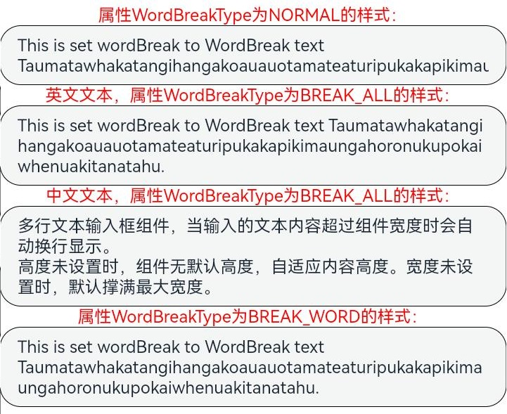

### 示例6（设置文本样式）

该示例通过lineHeight、letterSpacing、decoration属性展示了不同样式的文本效果。

```ts
// xxx.ets
@Entry
@Component
struct TextAreaExample {
  build() {
    Row() {
      Column() {
        Text('lineHeight').fontSize(9).fontColor(0xCCCCCC)
        TextArea({ text: 'lineHeight unset' })
          .border({ width: 1 }).padding(10).margin(5)
        TextArea({ text: 'lineHeight 15' })
          .border({ width: 1 }).padding(10).margin(5).lineHeight(15)
        TextArea({ text: 'lineHeight 30' })
          .border({ width: 1 }).padding(10).margin(5).lineHeight(30)

        Text('letterSpacing').fontSize(9).fontColor(0xCCCCCC)
        TextArea({ text: 'letterSpacing 0' })
          .border({ width: 1 }).padding(5).margin(5).letterSpacing(0)
        TextArea({ text: 'letterSpacing 3' })
          .border({ width: 1 }).padding(5).margin(5).letterSpacing(3)
        TextArea({ text: 'letterSpacing -1' })
          .border({ width: 1 }).padding(5).margin(5).letterSpacing(-1)

        Text('decoration').fontSize(9).fontColor(0xCCCCCC)
        TextArea({ text: 'LineThrough, Red\nsecond line' })
          .border({ width: 1 }).padding(5).margin(5)
          .decoration({ type: TextDecorationType.LineThrough, color: Color.Red })
        TextArea({ text: 'Overline, Red, DOTTED\nsecond line' })
          .border({ width: 1 }).padding(5).margin(5)
          .decoration({ type: TextDecorationType.Overline, color: Color.Red, style: TextDecorationStyle.DOTTED })
        TextArea({ text: 'Underline, Red, WAVY\nsecond line' })
          .border({ width: 1 }).padding(5).margin(5)
          .decoration({ type: TextDecorationType.Underline, color: Color.Red, style: TextDecorationStyle.WAVY })
      }.height('90%')
    }
    .width('90%')
    .margin(10)
  }
}
```

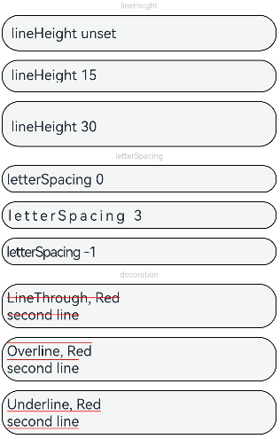

### 示例7（设置文字特性效果）

该示例通过fontFeature属性实现了文本在不同文字特性下的展示效果。

```ts
// xxx.ets
@Entry
@Component
struct TextAreaExample {
  @State text1: string = 'This is ss01 on : 0123456789';
  @State text2: string = 'This is ss01 off: 0123456789';

  build() {
    Column() {
      TextArea({ text: this.text1 })
        .fontSize(20)
        .margin({ top: 200 })
        .fontFeature("\"ss01\" on")
      TextArea({ text: this.text2 })
        .margin({ top: 10 })
        .fontSize(20)
        .fontFeature("\"ss01\" off")
    }
    .width("90%")
    .margin("5%")
  }
}
```
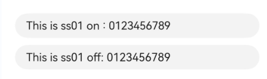

### 示例8（自定义键盘避让）

该示例通过自定义键盘实现了键盘避让的功能。

```ts
// xxx.ets
@Entry
@Component
struct TextAreaExample {
  controller: TextAreaController = new TextAreaController();
  @State inputValue: string = "";
  @State height1: string | number = '80%';
  @State height2: number = 100;
  @State supportAvoidance: boolean = true;

  // 自定义键盘组件
  @Builder
  CustomKeyboardBuilder() {
    Column() {
      Row() {
        Button('x').onClick(() => {
          // 关闭自定义键盘
          this.controller.stopEditing();
        }).margin(10)
      }

      Grid() {
        ForEach([1, 2, 3, 4, 5, 6, 7, 8, 9, '*', 0, '#'], (item: number | string) => {
          GridItem() {
            Button(item + "")
              .width(110).onClick(() => {
              this.inputValue += item;
            })
          }
        })
      }.maxCount(3).columnsGap(10).rowsGap(10).padding(5)
    }.backgroundColor(Color.Gray)
  }

  build() {
    Column() {
      Row() {
        Button("20%")
          .fontSize(24)
          .onClick(() => {
            this.height1 = "20%";
          })
        Button("80%")
          .fontSize(24)
          .margin({ left: 20 })
          .onClick(() => {
            this.height1 = "80%";
          })
      }
      .justifyContent(FlexAlign.Center)
      .alignItems(VerticalAlign.Bottom)
      .height(this.height1)
      .width("100%")
      .padding({ bottom: 50 })

      TextArea({ controller: this.controller, text: this.inputValue })
        .height(100)
        .customKeyboard(this.CustomKeyboardBuilder(), { supportAvoidance: this.supportAvoidance })// 绑定自定义键盘
        .margin(10)
        .border({ width: 1 })
    }
  }
}
```
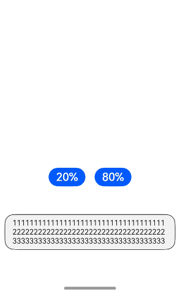

### 示例9（设置文本自适应）

该示例通过minFontSize、maxFontSize、heightAdaptivePolicy属性展示了文本自适应字号的效果。

```ts
// xxx.ets
@Entry
@Component
struct TextAreaExample {
  build() {
    Row() {
      Column() {
        Text('heightAdaptivePolicy').fontSize(9).fontColor(0xCCCCCC)
        TextArea({text: 'This is the text with the height adaptive policy set'})
          .width('80%').height(90).borderWidth(1).margin(1)
          .minFontSize(4)
          .maxFontSize(40)
          .maxLines(3)
          .heightAdaptivePolicy(TextHeightAdaptivePolicy.MAX_LINES_FIRST)
        TextArea({text: 'This is the text with the height adaptive policy set'})
          .width('80%').height(90).borderWidth(1).margin(1)
          .minFontSize(4)
          .maxFontSize(40)
          .maxLines(3)
          .heightAdaptivePolicy(TextHeightAdaptivePolicy.MIN_FONT_SIZE_FIRST)
        TextArea({text: 'This is the text with the height adaptive policy set'})
          .width('80%').height(90).borderWidth(1).margin(1)
          .minFontSize(4)
          .maxFontSize(40)
          .maxLines(3)
          .heightAdaptivePolicy(TextHeightAdaptivePolicy.LAYOUT_CONSTRAINT_FIRST)
      }.height('90%')
    }
    .width('90%')
    .margin(10)
  }
}
```


### 示例10（设置文本行间距）

该示例通过lineSpacing属性展示了文本在不同行间距下的展示效果。

```ts
// xxx.ets
import { LengthMetrics } from '@kit.ArkUI';

@Entry
@Component
struct TextAreaExample {
  build() {
    Flex({ direction: FlexDirection.Column, alignItems: ItemAlign.Start, justifyContent: FlexAlign.SpaceBetween }) {
      Text('TextArea lineSpacing.').fontSize(9).fontColor(0xCCCCCC)
      TextArea({ text: 'This is the TextArea with no lineSpacing set.' })
        .fontSize(12)
      TextArea({ text: 'This is the TextArea with lineSpacing set to 20_px.' })
        .fontSize(12)
        .lineSpacing(LengthMetrics.px(20))
      TextArea({ text: 'This is the TextArea with lineSpacing set to 20_vp.' })
        .fontSize(12)
        .lineSpacing(LengthMetrics.vp(20))
      TextArea({ text: 'This is the TextArea with lineSpacing set to 20_fp.' })
        .fontSize(12)
        .lineSpacing(LengthMetrics.fp(20))
      TextArea({ text: 'This is the TextArea with lineSpacing set to 20_lpx.' })
        .fontSize(12)
        .lineSpacing(LengthMetrics.lpx(20))
      TextArea({ text: 'This is the TextArea with lineSpacing set to 100%.' })
        .fontSize(12)
        .lineSpacing(LengthMetrics.percent(1))
      TextArea({ text: 'The line spacing of this TextArea is set to 20_px, and the spacing is effective only between the lines.' })
        .fontSize(12)
        .lineSpacing(LengthMetrics.px(20), { onlyBetweenLines: true })
    }.height(600).width(350).padding({ left: 35, right: 35, top: 35 })
  }
}
```

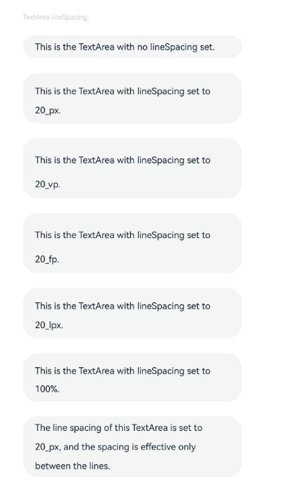

### 示例11（设置自动填充）

该示例通过contentType、enableAutoFill属性实现了文本自动填充的功能。

```ts
// xxx.ets
@Entry
@Component
struct TextAreaExample {
  @State text: string = '';

  build() {
    Column() {
      // 邮箱地址自动填充类型
      TextArea({ placeholder: 'input your email...' })
        .width('95%')
        .height(40)
        .margin(20)
        .contentType(ContentType.EMAIL_ADDRESS)
        .enableAutoFill(true)
        .maxLength(20)
      // 街道地址自动填充类型
      TextArea({ placeholder: 'input your street address...' })
        .width('95%')
        .height(40)
        .margin(20)
        .contentType(ContentType.FULL_STREET_ADDRESS)
        .enableAutoFill(true)
        .maxLength(20)
    }.width('100%').height('100%').backgroundColor('#F1F3F5')
  }
}
```


### 示例12（设置折行规则）

该示例通过lineBreakStrategy属性实现了TextArea不同折行规则下的效果。

```ts
// xxx.ets
@Entry
@Component
struct TextAreaExample {
  @State message1: string =
    "They can be classified as built-in components–those directly provided by the ArkUI framework and custom components – those defined by developers" +
      "The built-in components include buttons radio buttonsprogress indicators and text You can set the rendering effectof thesecomponents in method chaining mode," +
      "page components are divided into independent UI units to implementindependent creation development and reuse of different units on pages making pages more engineering-oriented.";
  @State lineBreakStrategyIndex: number = 0;
  @State lineBreakStrategy: LineBreakStrategy[] =
    [LineBreakStrategy.GREEDY, LineBreakStrategy.HIGH_QUALITY, LineBreakStrategy.BALANCED];
  @State lineBreakStrategyStr: string[] = ['GREEDY', 'HIGH_QUALITY', 'BALANCED'];

  build() {
    Flex({ direction: FlexDirection.Column, alignItems: ItemAlign.Start }) {
      Text('lineBreakStrategy').fontSize(9).fontColor(0xCCCCCC)
      TextArea({ text: this.message1 })
        .fontSize(12)
        .border({ width: 1 })
        .padding(10)
        .width('100%')
        .lineBreakStrategy(this.lineBreakStrategy[this.lineBreakStrategyIndex])
      Row() {
        Button('当前lineBreakStrategy模式：' + this.lineBreakStrategyStr[this.lineBreakStrategyIndex]).onClick(() => {
          this.lineBreakStrategyIndex++;
          if (this.lineBreakStrategyIndex > (this.lineBreakStrategyStr.length - 1)) {
            this.lineBreakStrategyIndex = 0;
          }
        })
      }.padding({ top: 10 })
    }.height(700).width(370).padding({ left: 35, right: 35, top: 35 })
  }
}
```

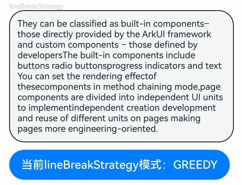

### 示例13（支持插入和删除回调）

该示例通过onWillInsert、onDidInsert、onWillDelete、onDidDelete接口实现了插入和删除的功能。

```ts
// xxx.ets
@Entry
@Component
struct TextAreaExample {
  @State insertValue: string = "";
  @State deleteValue: string = "";
  @State insertOffset: number = 0;
  @State deleteOffset: number = 0;
  @State deleteDirection: number = 0;

  build() {
    Row() {
      Column() {
        TextArea({ text: "TextArea支持插入回调文本" })
          .width(300)
          .height(60)
          .onWillInsert((info: InsertValue) => {
            this.insertValue = info.insertValue;
            return true;
          })
          .onDidInsert((info: InsertValue) => {
            this.insertOffset = info.insertOffset;
          })

        Text("insertValue:" + this.insertValue + "  insertOffset:" + this.insertOffset).height(30)

        TextArea({ text: "TextArea支持删除回调文本b" })
          .width(300)
          .height(60)
          .onWillDelete((info: DeleteValue) => {
            this.deleteValue = info.deleteValue;
            info.direction;
            return true;
          })
          .onDidDelete((info: DeleteValue) => {
            this.deleteOffset = info.deleteOffset;
            this.deleteDirection = info.direction;
          })

        Text("deleteValue:" + this.deleteValue + "  deleteOffset:" + this.deleteOffset).height(30)
        Text("deleteDirection:" + (this.deleteDirection == 0 ? "BACKWARD" : "FORWARD")).height(30)

      }.width('100%')
    }
    .height('100%')
  }
}
```

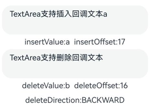

### 示例14（文本扩展自定义菜单）

该示例通过editMenuOptions接口实现了文本设置自定义菜单扩展项的文本内容、图标以及回调的功能。

```ts
// xxx.ets
@Entry
@Component
struct TextAreaExample {
  @State text: string = 'TextArea editMenuOptions';
  @State endIndex: number = 0;
  onCreateMenu = (menuItems: Array<TextMenuItem>) => {
    let item1: TextMenuItem = {
      content: 'create1',
      icon: $r('app.media.startIcon'),
      id: TextMenuItemId.of('create1'),
    };
    let item2: TextMenuItem = {
      content: 'create2',
      id: TextMenuItemId.of('create2'),
      icon: $r('app.media.startIcon'),
    };
    menuItems.push(item1);
    menuItems.unshift(item2);
    return menuItems;
  }
  onMenuItemClick = (menuItem: TextMenuItem, textRange: TextRange) => {
    if (menuItem.id.equals(TextMenuItemId.of("create2"))) {
      console.log("拦截 id: create2 start:" + textRange.start + "; end:" + textRange.end);
      return true;
    }
    if (menuItem.id.equals(TextMenuItemId.of("prepare1"))) {
      console.log("拦截 id: prepare1 start:" + textRange.start + "; end:" + textRange.end);
      return true;
    }
    if (menuItem.id.equals(TextMenuItemId.COPY)) {
      console.log("拦截 COPY start:" + textRange.start + "; end:" + textRange.end);
      return true;
    }
    if (menuItem.id.equals(TextMenuItemId.SELECT_ALL)) {
      console.log("不拦截 SELECT_ALL start:" + textRange.start + "; end:" + textRange.end);
      return false;
    }
    return false;
  }
  onPrepareMenu = (menuItems: Array<TextMenuItem>) => {
    let item1: TextMenuItem = {
      content: 'prepare1_' + this.endIndex,
      icon: $r('app.media.startIcon'),
      id: TextMenuItemId.of('prepare1'),
    };
    menuItems.unshift(item1);
    return menuItems;
  }
  @State editMenuOptions: EditMenuOptions = {
    onCreateMenu: this.onCreateMenu,
    onMenuItemClick: this.onMenuItemClick,
    onPrepareMenu: this.onPrepareMenu
  };

  build() {
    Column() {
      TextArea({ text: this.text })
        .width('95%')
        .height(56)
        .editMenuOptions(this.editMenuOptions)
        .margin({ top: 100 })
        .onTextSelectionChange((selectionStart: number, selectionEnd: number) => {
          this.endIndex = selectionEnd;
        })
    }
    .width("90%")
    .margin("5%")
  }
}
```

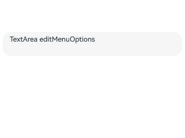

### 示例15（文本设置省略模式）

该示例通过textOverflow、ellipsisMode、maxlines属性展示了文本超长省略以及调整省略位置的效果。

```ts
// xxx.ets
@Entry
@Component
struct EllipsisModeExample {
  @State textIndex: number = 0;
  @State text: string = "As the sun begins to set, casting a warm golden hue across the sky," +
    "the world seems to slow down and breathe a sigh of relief. The sky is painted with hues of orange, " +
    " pink, and lavender, creating a breath taking tapestry that stretches as far as the eye can see." +
    "The air is filled with the sweet scent of blooming flowers, mingling with the earthy aroma of freshly turned soil.";
  @State ellipsisModeIndex: number = 0;
  @State ellipsisMode: (EllipsisMode | undefined | null)[] =
    [EllipsisMode.START, EllipsisMode.END, EllipsisMode.CENTER, undefined, null];
  @State ellipsisModeStr: string[] = ['START ', 'END', 'CENTER', 'undefined', 'null'];
  @State textOverflowIndex: number = 0;
  @State textOverflow: TextOverflow[] = [TextOverflow.Ellipsis, TextOverflow.Clip];
  @State textOverflowStr: string[] = ['Ellipsis', 'Clip'];
  @State maxLinesIndex: number = 0;
  @State maxLines: number[] = [1, 2, 3];
  @State maxLinesStr: string[] = ['1', '2', '3'];
  @State styleAreaIndex: number = 0;
  @State styleArea: TextContentStyle[] = [TextContentStyle.INLINE, TextContentStyle.DEFAULT];
  @State styleAreaStr: string[] = ['INLINE', 'DEFAULT'];

  build() {
    Column({ space: 20 }) {
      TextArea({ text: this.text })
        .textOverflow(this.textOverflow[this.textOverflowIndex])
        .ellipsisMode(this.ellipsisMode[this.ellipsisModeIndex])
        .maxLines(this.maxLines[this.maxLinesIndex])
        .style(this.styleArea[this.styleAreaIndex])
        .fontSize(30)
        .margin(30)

      Button('更改ellipsisMode模式：' + this.ellipsisModeStr[this.ellipsisModeIndex]).onClick(() => {
        this.ellipsisModeIndex++;
        if (this.ellipsisModeIndex > (this.ellipsisModeStr.length - 1)) {
          this.ellipsisModeIndex = 0;
        }
      }).fontSize(20)
      Button('更改textOverflow模式：' + this.textOverflowStr[this.textOverflowIndex]).onClick(() => {
        this.textOverflowIndex++;
        if (this.textOverflowIndex > (this.textOverflowStr.length - 1)) {
          this.textOverflowIndex = 0;
        }
      }).fontSize(20)
      Button('更改maxLines大小：' + this.maxLinesStr[this.maxLinesIndex]).onClick(() => {
        this.maxLinesIndex++;
        if (this.maxLinesIndex > (this.maxLinesStr.length - 1)) {
          this.maxLinesIndex = 0;
        }
      }).fontSize(20)
      Button('更改Style大小：' + this.styleAreaStr[this.styleAreaIndex]).onClick(() => {
        this.styleAreaIndex++;
        if (this.styleAreaIndex > (this.styleAreaStr.length - 1)) {
          this.styleAreaIndex = 0;
        }
      }).fontSize(20)
    }.height(600).width('100%')
  }
}
```

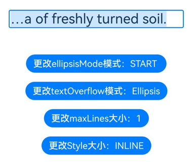

### 示例16（自定义复制、剪切、粘贴）

该示例展示如何监听文本选择菜单的复制、剪切、粘贴按钮，以及如何屏蔽系统粘贴功能并实现自定义的粘贴能力。

```ts
// xxx.ets
@Entry
@Component
struct TextAreaExample {
  @State text: string = '';
  controller: TextAreaController = new TextAreaController();

  build() {
    Column() {
      TextArea({
        text: this.text,
        placeholder: 'placeholder',
        controller: this.controller
      })
        .placeholderColor(Color.Red)
        .textAlign(TextAlign.Center)
        .caretColor(Color.Green)
        .caretStyle({ width: '2vp' })
        .fontStyle(FontStyle.Italic)
        .fontWeight(FontWeight.Bold)
        .fontFamily('HarmonyOS Sans')
        .inputFilter('[a-zA-Z]+', (value) => { // 只允许字母输入
          console.error(`unsupport char ${value}`);
        })
        .copyOption(CopyOptions.LocalDevice)
        .enableKeyboardOnFocus(false)
        .selectionMenuHidden(false)
        .barState(BarState.On)
        .type(TextAreaType.NORMAL)
        .selectedBackgroundColor(Color.Orange)
        .textIndent(2)
        .halfLeading(true)
        .minFontScale(1)
        .maxFontScale(2)
        .enablePreviewText(true)
        .enableHapticFeedback(true)
        .stopBackPress(false)//返回键交给其他组件处理
        .width(336)
        .height(56)
        .margin(20)
        .fontSize(16)
        .onEditChange((isEditing: boolean) => {
          console.log(`isEditing ${isEditing}`);
        })
        .onCopy((value) => {
          console.log(`copy ${value}`);
        })
        .onCut((value) => {
          console.log(`cut ${value}`);
        })
        .onPaste((value, event) => {
          // 阻止系统粘贴功能，开发者可自行实现
          if (event.preventDefault) {
            event.preventDefault();
          }
          console.log(`paste:${value}`);
          this.text = value;
        })
        .onTextSelectionChange((start: number, end: number) => {
          console.log(`onTextSelectionChange start ${start}, end ${end}`);
        })
        .onContentScroll((totalOffsetX: number, totalOffsetY: number) => {
          console.log(`onContentScroll offsetX ${totalOffsetX}, offsetY ${totalOffsetY}`);
        })
    }.width('100%').height('100%').backgroundColor('#F1F3F5')
  }
}
```
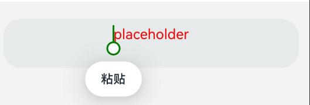

### 示例17（设置最小字体范围与最大字体范围）

该示例通过minFontScale、maxFontScale设置字体显示最小与最大范围<!--Del-->（该示例使用系统接口，应用类型需调整为系统应用，可参考HarmonyAppProvision的[系统接口说明](../../../reference/development-intro-api.md#系统接口说明)）<!--DelEnd-->。

```json
// 开启应用缩放跟随系统
// AppScope/resources/base，新建文件夹profile。
// AppScope/resources/base/profile，新建文件configuration.json。
// AppScope/resources/base/profile/configuration.json，增加如下代码。
{
  "configuration": {
    "fontSizeScale": "followSystem",
    "fontSizeMaxScale": "3.2"
  }
}
```

```json
// AppScope/app.json5，修改如下代码。
{
  "app": {
    "bundleName": "com.example.myapplication",
    "vendor": "example",
    "versionCode": 1000000,
    "versionName": "1.0.0",
    "icon": "$media:app_icon",
    "label": "$string:app_name",
    "configuration": "$profile:configuration"
  }
}
```
<!--RP1-->
```ts
// xxx.ets
import { abilityManager, Configuration } from '@kit.AbilityKit';
import { BusinessError } from '@kit.BasicServicesKit';

@Entry
@Component
struct TextAreaExample {
  @State currentFontSizeScale: number = 1;
  @State minFontScale: number = 0.85;
  @State maxFontScale: number = 2;

  // 设置字体大小
  async setFontScale(scale: number): Promise<void> {
    let configInit: Configuration = {
      language: 'zh-Ch',
      fontSizeScale: scale,
    };
    // 更新配置-字体大小，调用系统接口更新字体配置
    // 需在工程的module.json5文件的requestPermissions字段配置权限：ohos.permission.UPDATE_CONFIGURATION
    abilityManager.updateConfiguration(configInit, (err: BusinessError) => {
      if (err) {
        console.error(`updateConfiguration fail, err: ${JSON.stringify(err)}`);
      } else {
        this.currentFontSizeScale = scale;
        console.log('updateConfiguration success.');
      }
    });
  }

  build() {
    Column() {
      Column({ space: 30 }) {
        Text("通过minFontScale、maxFontScale调整文本显示的最大和最小字体缩放倍数。")
        TextArea({
          placeholder: 'The text area can hold an unlimited amount of text. input your word...',
          text: '通过minFontScale、maxFontScale调整文本显示的最大和最小字体缩放倍数。'
        })
          .minFontScale(this.minFontScale)// 设置最小字体缩放倍数，参数为undefined则跟随系统默认倍数缩放
          .maxFontScale(this.maxFontScale) // 设置最大字体缩放倍数，参数为undefined则跟随系统默认倍数缩放
      }.width('100%')

      Column() {
        Row() {
          Button('1倍').onClick(() => {
            this.setFontScale(1)
          }).margin(10)
          Button('1.75倍').onClick(() => {
            this.setFontScale(1.75)
          }).margin(10)
        }

        Row() {
          Button('2倍').onClick(() => {
            this.setFontScale(2)
          }).margin(10)
          Button('3.2倍').onClick(() => {
            this.setFontScale(3.2)
          }).margin(10)
        }
      }.margin({ top: 50 })
    }
  }
}
```
| 系统字体缩放倍数为2倍 | 系统字体缩放倍数为3.2倍 |
| ---------------------------------- | ------------------------------------ |
| 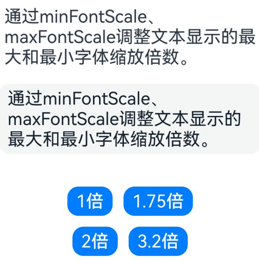  |   |
<!--RP1End-->
### 示例18（设置选中指定区域的文本内容）

该示例通过setTextSelection方法展示如何设置选中指定区域的文本内容以及菜单的显隐策略。

```ts
// xxx.ets

@Entry
@Component
struct TextAreaExample {
  controller: TextAreaController = new TextAreaController();
  @State startIndex: number = 0;
  @State endIndex: number = 0;

  build() {
    Column({ space: 3 }) {
      Text('Selection start:' + this.startIndex + ' end:' + this.endIndex)
      TextArea({ text: 'Hello World', controller: this.controller })
        .width('95%')
        .height(80)
        .margin(10)
        .defaultFocus(true)
        .enableKeyboardOnFocus(true)
        .onTextSelectionChange((selectionStart: number, selectionEnd: number) => {
          this.startIndex = selectionStart;
          this.endIndex = selectionEnd;
        })

      Button('setTextSelection [0,3], set menuPolicy is MenuPolicy.SHOW')
        .onClick(() => {
          this.controller.setTextSelection(0, 3, { menuPolicy: MenuPolicy.SHOW });
        })
    }
    .width('100%')
    .height('100%')
  }
}
```

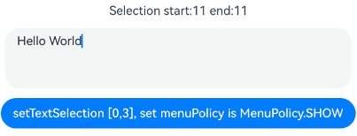

### 示例19（设置文本描边）

该示例通过strokeWidth和strokeColor属性设置文本的描边宽度及颜色。

```ts
// xxx.ets
import { LengthMetrics } from '@kit.ArkUI';

@Entry
@Component
struct TextAreaExample {
  build() {
    Row() {
      Column() {
        Text('stroke feature').fontSize(9).fontColor(0xCCCCCC)

        TextArea({ text: 'Text without stroke' })
          .width('100%')
          .height(60)
          .borderWidth(1)
          .fontSize(40)
        TextArea({ text: 'Text with stroke' })
          .width('100%')
          .height(60)
          .borderWidth(1)
          .fontSize(40)
          .strokeWidth(LengthMetrics.px(-3.0))
          .strokeColor(Color.Red)
        TextArea({ text: 'Text with stroke' })
          .width('100%')
          .height(60)
          .borderWidth(1)
          .fontSize(40)
          .strokeWidth(LengthMetrics.px(3.0))
          .strokeColor(Color.Red)
      }.height('90%')
    }
    .width('90%')
    .margin(10)
  }
}
```

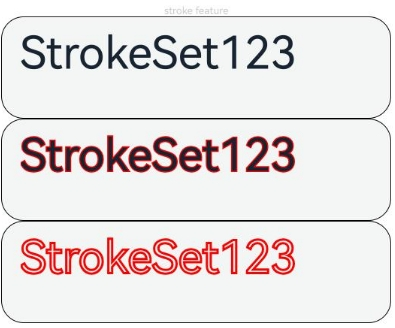

### 示例20（设置中西文自动间距）

该示例通过enableAutoSpacing属性设置中西文自动间距。

```ts
// xxx.ets
@Entry
@Component
struct TextAreaExample {
  build() {
    Row() {
      Column() {
        Text('开启中西文自动间距').margin(5)
        TextArea({text: '中西文Auto Spacing自动间距'})
          .enableAutoSpacing(true)
        Text('关闭中西文自动间距').margin(5)
        TextArea({text: '中西文Auto Spacing自动间距'})
          .enableAutoSpacing(false)
      }.height('100%')
    }
    .width('60%')
  }
}
```

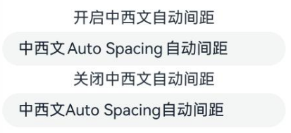

### 示例21（设置最大行数）

该示例通过maxLines属性设置显示最大行数，超出最大行数后可滚动。

```ts
// xxx.ets
@Entry
@Component
struct TextAreaExample {
  build() {
    Row() {
      Column() {
        TextArea({ text: '1 2 3 4 5 6 7 8 9 10 11 12 13 14 15 16 17 18 19 20' })
          .fontSize(50)
          .width('50%')
          .borderWidth(1)
          .margin(100)
          .textOverflow(TextOverflow.Clip)
          .maxLines(3, { overflowMode: MaxLinesMode.SCROLL })
      }.height('90%')
    }
    .width('90%')
    .margin(10)
  }
}

```
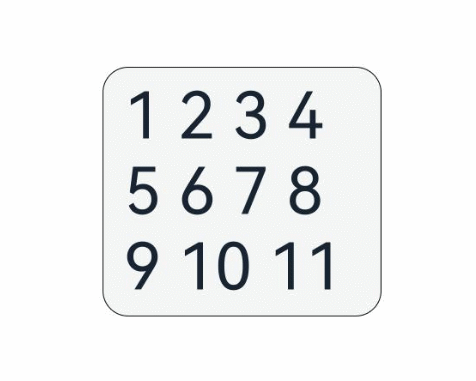

### 示例22（设置最小行数）

该示例通过minLines属性设置显示的最小行数。

```ts
// xxx.ets
@Entry
@Component
struct Index {
  @State message: string = 'Hello World';

  build() {
    Row() {
      Column() {
        TextArea({ text: this.message })
          .width('95%')
          .fontSize(20)
          .margin(10)
          .minLines(3)
      }
    }
    .width('90%')
    .margin(10)
  }
}
```


