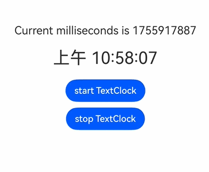
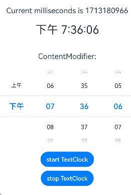

# TextClock

TextClock组件通过文本将当前系统时间显示在设备上。支持不同时区的时间显示，最高精度到秒级。

在组件不可见时时间变动将停止，组件的可见状态基于[onVisibleAreaChange](./ts-universal-component-visible-area-change-event.md#onvisibleareachange)处理，可见阈值ratios大于0即视为可见状态。

>**说明：**
>
>该组件从API Version 8开始支持。后续版本如有新增内容，则采用上角标单独标记该内容的起始版本。
>

## 子组件

无

## 接口

TextClock(options?: TextClockOptions)

**卡片能力：** 从API version 11开始，该接口支持在ArkTS卡片中使用。

**原子化服务API：** 从API version 11开始，该接口支持在原子化服务中使用。

**系统能力：** SystemCapability.ArkUI.ArkUI.Full

**参数：** 

| 参数名 | 类型 | 必填 | 说明 |
| -------- | -------- | -------- | -------- |
| options |  [TextClockOptions](#textclockoptions14对象说明)| 否 | 通过文本显示当前系统时间的组件参数。 |

## TextClockOptions<sup>14+</sup>对象说明

**卡片能力：** 从API version 14开始，该接口支持在ArkTS卡片中使用。

**原子化服务API：** 从API version 14开始，该接口支持在原子化服务中使用。

**系统能力：** SystemCapability.ArkUI.ArkUI.Full

| 参数名            | 类型      | 必填     | 说明                                                     |
| -------------- | -------- | ------ | --------------------------------------------------------------------------- |
| timeZoneOffset | number   | 否     | 设置时区偏移量。<br>取值范围为[-14, 12]，表示东十二区到西十二区，其中负值表示东时区，正值表示西时区，比如东八区为-8。设置值为该取值范围内的浮点数时会进行取整，舍弃小数部分。<br>对横跨国际日界线的国家或地区，用-13（UTC+13）和-14（UTC+14）来保证整个国家或者区域处在相同的时间，当设置的值不在取值范围内时，将使用当前系统的时区偏移量。<br/>默认值：当前系统的时区偏移量 <br/>设置值为{ 9.5, 3.5, -3.5, -4.5, -5.5, -5.75, -6.5, -9.5, -10.5, -12.75 }集合中的浮点数时不进行取整。|
| controller     | [TextClockController](#textclockcontroller) | 否      | 绑定一个控制器，用来控制文本时钟的状态。|

## 属性

除支持[通用属性](ts-universal-attributes-size.md)外，还支持以下属性：

### format

format(value: string)

设置显示时间格式，如“yyyy/MM/dd”、“yyyy-MM-dd”。

y：年（yyyy表示完整年份，yy表示年份后两位）<br />M：月（若想使用01月则使用MM）<br />d：日（若想使用01日则使用dd）<br />E：星期（若想使用星期六则使用EEEE，若想使用周六则使用E、EE、EEE）H：小时（24小时制）   h：小时（12小时制）    <br/>m：分钟<br/>s：秒<br/>SS：厘秒(format中S个数<3，全部按厘秒处理)<br />SSS：毫秒(format中S个数>=3，全部按毫秒处理)<br/>a：上午/下午（当设置小时制式为H时，该参数不生效）

日期间隔符："年月日"、“/”、"-"、"."（可以自定义间隔符样式，间隔符不可以为字母，汉字则作为间隔符处理）

允许自行拼接组合显示格式，即：年、月、日、星期、时、分、秒、毫秒可拆分为子元素，可自行排布组合。时间更新频率最高为一秒一次，不建议单独设置厘秒和毫秒格式。

当设置无效字母时（非上述字母被认为是无效字母），该字母会被忽略。如果format全是无效字母时，显示格式跟随系统语言和系统小时制。例如系统语言为中文时，12小时制显示格式为yyyy/MM/dd aa hh:mm:ss.SSS，24小时制显示格式为yyyy/MM/dd HH:mm:ss.SSS。

若format为空或者undefined，则使用默认值。

非卡片中默认值：12小时制：aa hh:mm:ss，24小时制：HH:mm:ss。<br />卡片中默认值：12小时制：hh:mm，24小时制：HH:mm 。<br />卡片中使用时，最小时间单位为分钟。如果设置格式中有秒或厘秒按默认值处理。

**卡片能力：** 从API version 11开始，该接口支持在ArkTS卡片中使用。

**原子化服务API：** 从API version 11开始，该接口支持在原子化服务中使用。

**系统能力：** SystemCapability.ArkUI.ArkUI.Full

**参数：** 

| 参数名 | 类型   | 必填 | 说明           |
| ------ | ------ | ---- | -------------- |
| value  | string | 是   | 显示时间格式。 |

以下是format输入的格式样式及对应的显示效果：

| 输入格式                | 显示效果            |
| ----------------------- | ------------------- |
| yyyy年M月d日 EEEE       | 2023年2月4日 星期六 |
| yyyy年M月d日            | 2023年2月4日        |
| M月d日 EEEE             | 2月4日 星期六       |
| M月d日                  | 2月4日              |
| MM/dd/yyyy              | 02/04/2023          |
| EEEE MM月dd日           | 星期六 02月04日     |
| yyyy（完整年份）        | 2023年              |
| yy（年份后两位）        | 23年                |
| MM（完整月份）          | 02月                |
| M（月份）               | 2月                 |
| dd（完整日期）          | 04日                |
| d（日期）               | 4日                 |
| EEEE（完整星期）        | 星期六              |
| E、EE、EEE（简写星期）  | 周六                |
| yyyy年M月d日            | 2023年2月4日        |
| yyyy/M/d                | 2023/2/4            |
| yyyy-M-d                | 2023-2-4            |
| yyyy.M.d                | 2023.2.4            |
| HH:mm:ss（时:分:秒）    | 17:00:04            |
| aa hh:mm:ss（时:分:秒） | 上午 5:00:04        |
| hh:mm:ss（时:分:秒）    | 5:00:04             |
| HH:mm（时:分）          | 17:00               |
| aa hh:mm（时:分）       | 上午 5:00           |
| hh:mm（时:分）          | 5:00                |
| mm:ss（分:秒）          | 00:04               |
| mm:ss.SS（分:秒.厘秒）  | 00:04.91            |
| mm:ss.SSS（分:秒.毫秒） | 00:04.536           |
| hh:mm:ss aa             | 5:00:04 上午        |
| HH                      | 17                  |

### fontColor

fontColor(value: ResourceColor)

设置字体颜色。

**卡片能力：** 从API version 11开始，该接口支持在ArkTS卡片中使用。

**原子化服务API：** 从API version 11开始，该接口支持在原子化服务中使用。

**系统能力：** SystemCapability.ArkUI.ArkUI.Full

**参数：** 

| 参数名 | 类型                                       | 必填 | 说明       |
| ------ | ------------------------------------------ | ---- | ---------- |
| value  | [ResourceColor](ts-types.md#resourcecolor) | 是   | 字体颜色。 |

### fontSize

fontSize(value: Length)

设置字体大小。

**卡片能力：** 从API version 11开始，该接口支持在ArkTS卡片中使用。

**原子化服务API：** 从API version 11开始，该接口支持在原子化服务中使用。

**系统能力：** SystemCapability.ArkUI.ArkUI.Full

**参数：** 

| 参数名 | 类型                         | 必填 | 说明                                                         |
| ------ | ---------------------------- | ---- | ------------------------------------------------------------ |
| value  | [Length](ts-types.md#length) | 是   | 字体大小。fontSize为number类型时，使用fp单位。字体默认大小16fp。不支持设置百分比字符串。 |

### fontStyle

fontStyle(value: FontStyle)

设置字体样式。

**卡片能力：** 从API version 11开始，该接口支持在ArkTS卡片中使用。

**原子化服务API：** 从API version 11开始，该接口支持在原子化服务中使用。

**系统能力：** SystemCapability.ArkUI.ArkUI.Full

**参数：** 

| 参数名 | 类型                                        | 必填 | 说明                                    |
| ------ | ------------------------------------------- | ---- | --------------------------------------- |
| value  | [FontStyle](ts-appendix-enums.md#fontstyle) | 是   | 字体样式。<br/>默认值：FontStyle.Normal |

### fontWeight

fontWeight(value: number | FontWeight | string)

设置文本的字体粗细，设置过大可能会在不同字体下有截断。

**卡片能力：** 从API version 11开始，该接口支持在ArkTS卡片中使用。

**原子化服务API：** 从API version 11开始，该接口支持在原子化服务中使用。

**系统能力：** SystemCapability.ArkUI.ArkUI.Full

**参数：** 

| 参数名 | 类型                                                         | 必填 | 说明                                                         |
| ------ | ------------------------------------------------------------ | ---- | ------------------------------------------------------------ |
| value  | number&nbsp;\|&nbsp;[FontWeight](ts-appendix-enums.md#fontweight)&nbsp;\|&nbsp;string | 是   | 文本的字体粗细，number类型取值[100,&nbsp;900]，取值间隔为100，默认为400，取值越大，字体越粗。string类型仅支持number类型取值的字符串形式，例如"400"，以及"bold"、"bolder"、"lighter"、"regular"、"medium"，分别对应FontWeight中相应的枚举值。<br/>默认值：FontWeight.Normal |

### fontFamily

fontFamily(value: ResourceStr)

设置字体列表。

**卡片能力：** 从API version 11开始，该接口支持在ArkTS卡片中使用。

**原子化服务API：** 从API version 11开始，该接口支持在原子化服务中使用。

**系统能力：** SystemCapability.ArkUI.ArkUI.Full

**参数：** 

| 参数名 | 类型                                   | 必填 | 说明                                                         |
| ------ | -------------------------------------- | ---- | ------------------------------------------------------------ |
| value  | [ResourceStr](ts-types.md#resourcestr) | 是   | 字体列表。默认字体'HarmonyOS Sans'。<br>应用当前支持'HarmonyOS Sans'字体和[注册自定义字体](../js-apis-font.md)。<br>卡片当前仅支持'HarmonyOS Sans'字体。 |

### textShadow<sup>11+</sup>

textShadow(value: ShadowOptions | Array&lt;ShadowOptions&gt;)

设置文字阴影效果。该接口支持以数组形式入参，实现多重文字阴影。不支持fill字段, 不支持智能取色模式。

**卡片能力：** 从API version 11开始，该接口支持在ArkTS卡片中使用。

**原子化服务API：** 从API version 12开始，该接口支持在原子化服务中使用。

**系统能力：** SystemCapability.ArkUI.ArkUI.Full

**参数：** 

| 参数名 | 类型                                                         | 必填 | 说明           |
| ------ | ------------------------------------------------------------ | ---- | -------------- |
| value  | [ShadowOptions](ts-universal-attributes-image-effect.md#shadowoptions对象说明)&nbsp;\|&nbsp;Array&lt;[ShadowOptions](ts-universal-attributes-image-effect.md#shadowoptions对象说明)> | 是   | 文字阴影效果。 |

### fontFeature<sup>11+</sup>

fontFeature(value: string)

设置文字特性效果，比如数字等宽的特性。

格式为：normal \| \<feature-tag-value\>

\<feature-tag-value\>的格式为：\<string\> \[ \<integer\> \| on \| off ]

\<feature-tag-value\>的个数可以有多个，中间用','隔开。

例如，使用等宽时钟数字的输入格式为："ss01" on。

**卡片能力：** 从API version 11开始，该接口支持在ArkTS卡片中使用。

**原子化服务API：** 从API version 12开始，该接口支持在原子化服务中使用。

**系统能力：** SystemCapability.ArkUI.ArkUI.Full

**参数：** 

| 参数名 | 类型   | 必填 | 说明           |
| ------ | ------ | ---- | -------------- |
| value  | string | 是   | 文字特性效果。 |

### contentModifier<sup>12+</sup>

contentModifier(modifier: ContentModifier\<TextClockConfiguration>)

定制TextClock内容区的方法。

**原子化服务API：** 从API version 12开始，该接口支持在原子化服务中使用。

**系统能力：** SystemCapability.ArkUI.ArkUI.Full

**参数：**

| 参数名 | 类型                                          | 必填 | 说明                                             |
| ------ | --------------------------------------------- | ---- | ------------------------------------------------ |
| modifier  | [ContentModifier\<TextClockConfiguration>](#textclockconfiguration12对象说明) | 是   | 在TextClock组件上，定制内容区的方法。<br/>modifier: 内容修改器，开发者需要自定义class实现ContentModifier接口。 |

### dateTimeOptions<sup>12+</sup>

dateTimeOptions(dateTimeOptions: Optional\<DateTimeOptions>)

设置小时是否显示前导0。

**卡片能力：** 从API version 12开始，该接口支持在ArkTS卡片中使用。

**原子化服务API：** 从API version 12开始，该接口支持在原子化服务中使用。

**系统能力：** SystemCapability.ArkUI.ArkUI.Full

**参数：** 

| 参数名 | 类型                                                         | 必填 | 说明                                                         |
| ------ | ------------------------------------------------------------ | ---- | ------------------------------------------------------------ |
| dateTimeOptions  | Optional<[DateTimeOptions](../../apis-localization-kit/js-apis-intl.md#datetimeoptions)> | 是   | 设置小时是否显示前导0，只支持设置hour参数，参数值为{hour: "2-digit"}时表示显示前导0，参数值为{hour: "numeric"}时表示不显示前导0。<br/>默认值：undefined，由组件根据应用设置格式自行判断是否显示前导0。|

## 事件

除支持[通用事件](ts-universal-events-click.md)外，还支持以下事件：

### onDateChange

onDateChange(event: (value: number) => void)

提供时间变化回调，该事件回调间隔为秒。

组件不可见时不回调。

非卡片中使用时，该事件回调间隔为秒。

卡片中使用时，该事件回调间隔为分钟。

**卡片能力：** 从API version 11开始，该接口支持在ArkTS卡片中使用。

**原子化服务API：** 从API version 11开始，该接口支持在原子化服务中使用。

**系统能力：** SystemCapability.ArkUI.ArkUI.Full

**参数：** 

| 参数名 | 类型   | 必填 | 说明                                                   |
| ------ | ------ | ---- | ------------------------------------------------------ |
| value  | number | 是   | Unix Time Stamp，即自1970年1月1日（UTC）起经过的秒数。 |

## TextClockController

TextClock容器组件的控制器，可以将该控制器绑定到TextClock组件，通过它控制文本时钟的启动与停止。一个TextClock组件仅支持绑定一个控制器。

**卡片能力：** 从API version 11开始，该接口支持在ArkTS卡片中使用。

**原子化服务API：** 从API version 11开始，该接口支持在原子化服务中使用。

**系统能力：** SystemCapability.ArkUI.ArkUI.Full

### 导入对象

```ts
controller: TextClockController = new TextClockController();
```

### constructor

constructor()

TextClockController的构造函数。

**卡片能力：** 从API version 11开始，该接口支持在ArkTS卡片中使用。

**原子化服务API：** 从API version 11开始，该接口支持在原子化服务中使用。

**系统能力：** SystemCapability.ArkUI.ArkUI.Full

### start

start()

启动文本时钟。

**卡片能力：** 从API version 11开始，该接口支持在ArkTS卡片中使用。

**原子化服务API：** 从API version 11开始，该接口支持在原子化服务中使用。

**系统能力：** SystemCapability.ArkUI.ArkUI.Full

### stop

stop()

停止文本时钟。

**卡片能力：** 从API version 11开始，该接口支持在ArkTS卡片中使用。

**原子化服务API：** 从API version 11开始，该接口支持在原子化服务中使用。

**系统能力：** SystemCapability.ArkUI.ArkUI.Full

## TextClockConfiguration<sup>12+</sup>对象说明

开发者需要自定义class实现ContentModifier接口。

**原子化服务API：** 从API version 12开始，该接口支持在原子化服务中使用。

**系统能力：** SystemCapability.ArkUI.ArkUI.Full

| 名称 | 类型    |    必填      |  说明              |
| ------ | ------ | ------ |-------------------------------- |
| timeZoneOffset | number | 是 | 当前文本时钟时区偏移量。 |
| started | boolean | 是 | 指示文本时钟是否启动。<br>默认值：true。 |
| timeValue | number | 是 | 当前文本时钟时区的UTC秒数。 |

## 示例
### 示例1（支持启停的文本样式时钟）

该示例展示了TextClock组件的基本使用方法，通过format属性设置时钟文本的格式。

点击"start TextClock"按钮，按钮回调函数会调用TextClockController启动文本时钟。点击"stop TextClock"按钮，会调用TextClockController暂停文本时钟。

示例中的组件通过设置onDateChange回调函数，在文本时钟更新时，持续修改accumulateTime的内容。

```ts
@Entry
@Component
struct Second {
  @State accumulateTime: number = 0
  // 导入对象
  controller: TextClockController = new TextClockController()
  build() {
    Flex({ direction: FlexDirection.Column, alignItems: ItemAlign.Center, justifyContent: FlexAlign.Center }) {
      Text('Current milliseconds is ' + this.accumulateTime)
        .fontSize(20)
      // 以12小时制显示东八区的系统时间，精确到秒。
      TextClock({ timeZoneOffset: -8, controller: this.controller })
        .format('aa hh:mm:ss')
        .onDateChange((value: number) => {
          this.accumulateTime = value
        })
        .margin(20)
        .fontSize(30)
      Button("start TextClock")
        .margin({ bottom: 10 })
        .onClick(() => {
          // 启动文本时钟
          this.controller.start()
        })
      Button("stop TextClock")
        .onClick(() => {
          // 停止文本时钟
          this.controller.stop()
        })
    }
    .width('100%')
    .height('100%')
  }
}
```


### 示例2（设定文本阴影样式）

该示例通过textShadow属性设置文本时钟的文本阴影样式。

``` ts
@Entry
@Component
struct TextClockExample {
  @State textShadows : ShadowOptions | Array<ShadowOptions> = [{ radius: 10, color: Color.Red, offsetX: 10, offsetY: 0 },{ radius: 10, color: Color.Black, offsetX: 20, offsetY: 0 },
      { radius: 10, color: Color.Brown, offsetX: 30, offsetY: 0 },{ radius: 10, color: Color.Green, offsetX: 40, offsetY: 0 },
      { radius: 10, color: Color.Yellow, offsetX: 100, offsetY: 0 }]
  build() {
    Column({ space: 8 }) {
      TextClock().fontSize(50).textShadow(this.textShadows)
    }
  }
}
```


### 示例3（设定自定义内容区）
该示例实现了自定义文本时钟样式的功能，自定义样式实现了一个时间选择器组件：通过文本时钟的时区偏移量与UTC秒数，来动态改变时间选择器的选中值，实现时钟效果。同时，根据文本时钟的启动状态，实现文本选择器的12小时制与24小时制的切换。

``` ts
class MyTextClockStyle implements ContentModifier<TextClockConfiguration> {
  currentTimeZoneOffset: number = new Date().getTimezoneOffset() / 60
  title: string = ''

  constructor(title: string) {
    this.title = title
  }

  applyContent(): WrappedBuilder<[TextClockConfiguration]> {
    return wrapBuilder(buildTextClock)
  }
}

@Builder
function buildTextClock(config: TextClockConfiguration) {
  Row() {
    Column() {
      Text((config.contentModifier as MyTextClockStyle).title)
        .fontSize(20)
        .margin(20)
      TimePicker({
        selected: (new Date(config.timeValue * 1000 + ((config.contentModifier as MyTextClockStyle).currentTimeZoneOffset - config.timeZoneOffset) * 60 * 60 * 1000)),
        format: TimePickerFormat.HOUR_MINUTE_SECOND
      })
        .useMilitaryTime(!config.started)
    }
  }
}

@Entry
@Component
struct TextClockExample {
  @State accumulateTime1: number = 0
  @State timeZoneOffset: number = -8
  controller1: TextClockController = new TextClockController()
  controller2: TextClockController = new TextClockController()

  build() {
    Flex({ direction: FlexDirection.Column, alignItems: ItemAlign.Center, justifyContent: FlexAlign.Center }) {
      Text('Current milliseconds is ' + this.accumulateTime1)
        .fontSize(20)
        .margin({ top: 20 })
      TextClock({ timeZoneOffset: this.timeZoneOffset, controller: this.controller1 })
        .format('aa hh:mm:ss')
        .onDateChange((value: number) => {
          this.accumulateTime1 = value
        })
        .margin(20)
        .fontSize(30)
      TextClock({ timeZoneOffset: this.timeZoneOffset, controller: this.controller2 })
        .format('aa hh:mm:ss')
        .fontSize(30)
        .contentModifier(new MyTextClockStyle('ContentModifier:'))
      Button("start TextClock")
        .margin({ top: 20, bottom: 10 })
        .onClick(() => {
          // 启动文本时钟
          this.controller1.start()
          this.controller2.start()
        })
      Button("stop TextClock")
        .margin({ bottom: 30 })
        .onClick(() => {
          // 停止文本时钟
          this.controller1.stop()
          this.controller2.stop()
        })

    }
    .width('100%')
    .height('100%')
  }
}
```


### 示例4（设置前导零）
该示例演示了dateTimeOptions属性为小时字段增加或去除前导0的功能。24小时制的小时字段默认带有前导0，可通过dateTimeOptions属性去除前导0，12小时制的小时字段默认不带有前导0，可通过dateTimeOptions属性增加前导0。
``` ts
@Entry
@Component
struct TextClockExample {
  build() {
    Column({ space: 8 }) {
      Row() {
        Text("24小时制去除前导0：")
          .fontSize(20)
        TextClock()
          .fontSize(20)
          .format("HH:mm:ss")
          .dateTimeOptions({hour: "numeric"})
      }
      Row() {
        Text("12小时制增加前导0：")
          .fontSize(20)
        TextClock()
          .fontSize(20)
          .format("aa hh:mm:ss")
          .dateTimeOptions({hour: "2-digit"})
      }
    }
    .alignItems(HorizontalAlign.Start)
  }
}
```
