# TextInput
<!--Kit: ArkUI-->
<!--Subsystem: ArkUI-->
<!--Owner: @kangshihui-->
<!--Designer: @pssea-->
<!--Tester: @jiaoaozihao-->
<!--Adviser: @HelloCrease-->

单行文本输入框组件。

>  **说明：**
>
>  该组件从API version 7开始支持。后续版本如有新增内容，则采用上角标单独标记该内容的起始版本。
>
>  该组件仅支持单文本样式，若需实现富文本样式，建议使用[RichEditor](ts-basic-components-richeditor.md)组件。


## 子组件

无


## 接口

TextInput(value?: TextInputOptions)

**原子化服务API：** 从API version 11开始，该接口支持在原子化服务中使用。

**系统能力：** SystemCapability.ArkUI.ArkUI.Full

**参数：**

| 参数名 | 类型 | 必填 | 说明 |
| ----- | ----- | ---- | ---- |
| value | [TextInputOptions](#textinputoptions对象说明) | 否  | TextInput组件参数。 |

## TextInputOptions对象说明

TextInput初始化参数。

**原子化服务API：** 从API version 11开始，该接口支持在原子化服务中使用。

**系统能力：** SystemCapability.ArkUI.ArkUI.Full

| 名称 | 类型  | 只读 | 可选   | 说明 |
| ---- | ----- | ---- | ---- | ---- |
| placeholder             | [ResourceStr](ts-types.md#resourcestr)   | 否    | 是 | 设置无输入时的提示文本。                             |
| text                    | [ResourceStr](ts-types.md#resourcestr)   | 否    | 是 | 设置输入框当前的文本内容。</br>建议通过onChange事件将状态变量与文本实时绑定，</br>避免组件刷新时TextInput中的文本内容异常。<br />从API version 10开始，该参数支持[$$](../../../ui/state-management/arkts-two-way-sync.md)双向绑定变量。<br />从API version 18开始，该参数支持[!!](../../../ui/state-management/arkts-new-binding.md#系统组件参数双向绑定)双向绑定变量。 |
| controller<sup>8+</sup> | [TextInputController](#textinputcontroller8) | 否    | 是 | 设置TextInput控制器。                          |

## 属性

除支持[通用属性](ts-component-general-attributes.md)，还支持以下属性：

>  **说明：**    
>  默认情况下，通用属性[padding](ts-universal-attributes-size.md#padding)的默认值为：<br>{<br>&nbsp;top: '8vp',<br>&nbsp;right: '16vp',<br>&nbsp;bottom: '8vp',<br>&nbsp;left: '16vp'<br> } 
>  
>  输入框开启下划线模式时，通用属性padding的默认值为：<br>{<br>&nbsp;top: '12vp',<br>&nbsp;right: '0vp',<br>&nbsp;bottom: '12vp',<br>&nbsp;left: '0vp'<br> }
>
>  当输入框设置padding为0时，可设置[borderRadius](ts-universal-attributes-border.md#borderradius)为0避免光标被截断。当光标在文本框边缘显示异常时，请检查是否是padding、borderRadius属性影响造成。
>
>   从API version 10开始，单行输入框可设置.width('auto')使组件宽度自适应文本宽度，自适应时组件宽度受constraintSize属性以及父容器传递的最大最小宽度限制，其余使用方式参考[尺寸设置](ts-universal-attributes-size.md)。

### type

type(value: InputType)

设置输入框类型。

**原子化服务API：** 从API version 11开始，该接口支持在原子化服务中使用。

**系统能力：** SystemCapability.ArkUI.ArkUI.Full

**参数：** 

| 参数名 | 类型                            | 必填 | 说明                                      |
| ------ | ------------------------------- | ---- | ----------------------------------------- |
| value  | [InputType](#inputtype枚举说明) | 是   | 输入框类型。<br/>默认值：InputType.Normal |

>  **说明：**    
>  密码填充服务需要特定的输入框类型。<!--RP2--><!--RP2End-->

### placeholderColor

placeholderColor(value: ResourceColor)

设置placeholder文本颜色。

**原子化服务API：** 从API version 11开始，该接口支持在原子化服务中使用。

**系统能力：** SystemCapability.ArkUI.ArkUI.Full

**参数：** 

| 参数名 | 类型                                       | 必填 | 说明                                         |
| ------ | ------------------------------------------ | ---- | -------------------------------------------- |
| value  | [ResourceColor](ts-types.md#resourcecolor) | 是   | placeholder文本颜色。<br/>默认值：跟随主题。<br/>Wearable设备上默认值为：'#99ffffff' |

### placeholderFont

placeholderFont(value?: Font)

设置placeholder文本样式，包括字体大小，字体粗细，字体族，字体风格。当前支持'HarmonyOS Sans'字体和注册自定义字体[loadFontSync](../../apis-arkgraphics2d/js-apis-graphics-text.md#loadfontsync)。

**原子化服务API：** 从API version 11开始，该接口支持在原子化服务中使用。

**系统能力：** SystemCapability.ArkUI.ArkUI.Full

**参数：** 

| 参数名 | 类型                     | 必填 | 说明                  |
| ------ | ------------------------ | ---- | --------------------- |
| value  | [Font](ts-types.md#font) | 否   | placeholder文本样式。<br/>Wearable设备上默认值为：18fp |

### enterKeyType

enterKeyType(value: EnterKeyType)

设置输入法回车键类型。

**原子化服务API：** 从API version 11开始，该接口支持在原子化服务中使用。

**系统能力：** SystemCapability.ArkUI.ArkUI.Full

**参数：** 

| 参数名 | 类型                                             | 必填 | 说明                                             |
| ------ | ------------------------------------------------ | ---- | ------------------------------------------------ |
| value  | [EnterKeyType](#enterkeytype枚举说明) | 是   | 输入法回车键类型。<br/>默认值：EnterKeyType.Done |

### caretColor

caretColor(value: ResourceColor)

设置输入框光标颜色。

**原子化服务API：** 从API version 11开始，该接口支持在原子化服务中使用。

**系统能力：** SystemCapability.ArkUI.ArkUI.Full

**参数：** 

| 参数名 | 类型                                       | 必填 | 说明                                   |
| ------ | ------------------------------------------ | ---- | -------------------------------------- |
| value  | [ResourceColor](ts-types.md#resourcecolor) | 是   | 输入框光标颜色。<br/>默认值：'#007DFF' |

>  **说明：**     
>   从API version 12开始，此接口支持设置文本手柄颜色，光标和文本手柄颜色保持一致。

### maxLength

maxLength(value: number)

设置文本的最大输入字符数。

**原子化服务API：** 从API version 11开始，该接口支持在原子化服务中使用。

**系统能力：** SystemCapability.ArkUI.ArkUI.Full

**参数：** 

| 参数名 | 类型   | 必填 | 说明                                                         |
| ------ | ------ | ---- | ------------------------------------------------------------ |
| value  | number | 是   | 文本的最大输入字符数。<br/>默认值：Infinity，可以无限输入。<br/>**说明：** <br/>当不设置该属性或设置异常值时，取默认值，设置小数时，取整数部分。 |

### fontColor

fontColor(value: ResourceColor)

设置字体颜色。

**原子化服务API：** 从API version 11开始，该接口支持在原子化服务中使用。

**系统能力：** SystemCapability.ArkUI.ArkUI.Full

**参数：** 

| 参数名 | 类型                                       | 必填 | 说明       |
| ------ | ------------------------------------------ | ---- | ---------- |
| value  | [ResourceColor](ts-types.md#resourcecolor) | 是   | 字体颜色。<br/>Wearable设备上默认值为：'#dbffffff' |

### fontSize

fontSize(value: Length)

设置字体大小。

**原子化服务API：** 从API version 11开始，该接口支持在原子化服务中使用。

**系统能力：** SystemCapability.ArkUI.ArkUI.Full

**参数：** 

| 参数名 | 类型                         | 必填 | 说明                                                         |
| ------ | ---------------------------- | ---- | ------------------------------------------------------------ |
| value  | [Length](ts-types.md#length) | 是   | 字体大小。fontSize为number类型时，使用fp单位。字体默认大小16fp。不支持设置百分比字符串。<br/>Wearable设备上默认值为：18fp |

### fontStyle

fontStyle(value: FontStyle)

设置字体样式。

**原子化服务API：** 从API version 11开始，该接口支持在原子化服务中使用。

**系统能力：** SystemCapability.ArkUI.ArkUI.Full

**参数：** 

| 参数名 | 类型                                        | 必填 | 说明                                    |
| ------ | ------------------------------------------- | ---- | --------------------------------------- |
| value  | [FontStyle](ts-appendix-enums.md#fontstyle) | 是   | 字体样式。<br/>默认值：FontStyle.Normal |

### fontWeight

fontWeight(value: number | FontWeight | ResourceStr)

设置文本的字体粗细，设置过大可能会在不同字体下有截断。

**原子化服务API：** 从API version 11开始，该接口支持在原子化服务中使用。

**系统能力：** SystemCapability.ArkUI.ArkUI.Full

**参数：** 

| 参数名 | 类型                                                         | 必填 | 说明                                                         |
| ------ | ------------------------------------------------------------ | ---- | ------------------------------------------------------------ |
| value  | number&nbsp;\|&nbsp;[FontWeight](ts-appendix-enums.md#fontweight)&nbsp;\|&nbsp;[ResourceStr](ts-types.md#resourcestr) | 是   | 文本的字体粗细，number类型取值[100,&nbsp;900]，取值间隔为100，默认为400，取值越大，字体越粗。string类型仅支持number类型取值的字符串形式，例如"400"，以及"bold"、"bolder"、"lighter"、"regular"、"medium"，分别对应FontWeight中相应的枚举值。<br/>默认值：FontWeight.Normal <br>从API version 20开始，支持Resource类型。|

### fontFamily

fontFamily(value: ResourceStr)

设置字体列表。

**原子化服务API：** 从API version 11开始，该接口支持在原子化服务中使用。

**系统能力：** SystemCapability.ArkUI.ArkUI.Full

**参数：** 

| 参数名 | 类型                                   | 必填 | 说明                                                         |
| ------ | -------------------------------------- | ---- | ------------------------------------------------------------ |
| value  | [ResourceStr](ts-types.md#resourcestr) | 是   | 字体列表。默认字体'HarmonyOS Sans'。<br>使用多个字体时，请用逗号','分隔，字体的优先级按顺序生效。例如：'Arial, HarmonyOS Sans'。<br>应用当前支持'HarmonyOS Sans'字体和注册自定义字体[loadFontSync](../../apis-arkgraphics2d/js-apis-graphics-text.md#loadfontsync)。<br>卡片当前仅支持'HarmonyOS Sans'字体。 |

### inputFilter<sup>8+</sup>

inputFilter(value: ResourceStr, error?: Callback\<string>)

通过正则表达式设置输入过滤器。匹配表达式的输入允许显示，不匹配的输入将被过滤。

单字符输入场景仅支持单字符匹配，多字符输入场景支持字符串匹配，例如粘贴。

从API version 11开始，设置inputFilter且输入的字符不为空字符，会导致设置输入框类型(即type接口)附带的文本过滤效果失效。

**原子化服务API：** 从API version 11开始，该接口支持在原子化服务中使用。

**系统能力：** SystemCapability.ArkUI.ArkUI.Full

**参数：** 

| 参数名 | 类型                                   | 必填 | 说明                               |
| ------ | -------------------------------------- | ---- | ---------------------------------- |
| value  | [ResourceStr](ts-types.md#resourcestr) | 是   | 正则表达式。                       |
| error  | Callback\<string>                | 否   | 正则匹配失败时，返回被过滤的内容。 |

### copyOption<sup>9+</sup>

copyOption(value: CopyOptions)

设置输入的文本是否可复制。设置CopyOptions.None时，当前TextInput中的文字无法被复制、剪切、翻译、分享、搜索和帮写，支持粘贴和全选。

设置CopyOptions.None时，不允许拖拽。

**原子化服务API：** 从API version 11开始，该接口支持在原子化服务中使用。

**系统能力：** SystemCapability.ArkUI.ArkUI.Full

**参数：** 

| 参数名 | 类型                                             | 必填 | 说明                                                         |
| ------ | ------------------------------------------------ | ---- | ------------------------------------------------------------ |
| value  | [CopyOptions](ts-appendix-enums.md#copyoptions9) | 是   | 输入的文本是否可复制。<br/>默认值：CopyOptions.LocalDevice，支持设备内复制。 |

### showPasswordIcon<sup>9+</sup>

showPasswordIcon(value: boolean)

设置当密码输入模式时，输入框末尾的图标是否显示。

**原子化服务API：** 从API version 11开始，该接口支持在原子化服务中使用。

**系统能力：** SystemCapability.ArkUI.ArkUI.Full

**参数：** 

| 参数名 | 类型    | 必填 | 说明                                                        |
| ------ | ------- | ---- | ----------------------------------------------------------- |
| value  | boolean | 是   | 密码输入模式时，输入框末尾的图标是否显示。<br/>true表示显示，false表示不显示。<br/>默认值：true |

### style<sup>9+</sup>

style(value: TextInputStyle &nbsp;|&nbsp;TextContentStyle)

设置输入框为默认风格或内联输入风格，内联输入风格只支持InputType.Normal类型。<br>输入框类型介绍请参考[type](#type)接口。

**原子化服务API：** 从API version 11开始，该接口支持在原子化服务中使用。

**系统能力：** SystemCapability.ArkUI.ArkUI.Full

**参数：** 

| 参数名 | 类型                                                         | 必填 | 说明                                                         |
| ------ | ------------------------------------------------------------ | ---- | ------------------------------------------------------------ |
| value  | [TextInputStyle](#textinputstyle9枚举说明)&nbsp;\|&nbsp;[TextContentStyle](ts-appendix-enums.md#textcontentstyle10) | 是   | 输入框为默认风格或内联输入风格。<br/>默认值：TextInputStyle.Default |

### textAlign<sup>9+</sup>

textAlign(value: TextAlign)

设置文本在输入框中的水平对齐方式。

仅支持TextAlign.Start、TextAlign.Center和TextAlign.End。

可通过[align](ts-universal-attributes-location.md)属性控制文本段落在垂直方向上的位置，此组件中不可通过align属性控制文本段落在水平方向上的位置，即align属性中Alignment.TopStart、Alignment.Top、Alignment.TopEnd效果相同，控制内容在顶部，Alignment.Start、Alignment.Center、Alignment.End效果相同，控制内容垂直居中，Alignment.BottomStart、Alignment.Bottom、Alignment.BottomEnd效果相同，控制内容在底部。

**原子化服务API：** 从API version 11开始，该接口支持在原子化服务中使用。

**系统能力：** SystemCapability.ArkUI.ArkUI.Full

**参数：** 

| 参数名 | 类型                                        | 必填 | 说明                                                       |
| ------ | ------------------------------------------- | ---- | ---------------------------------------------------------- |
| value  | [TextAlign](ts-appendix-enums.md#textalign) | 是   | 文本在输入框中的水平对齐方式。<br/>默认值：TextAlign.Start |

>  **说明：**  
>
>  textAlign只能调整文本整体的布局，不影响字符的显示顺序。若需要调整字符的显示顺序，请参考[镜像状态字符对齐](../../../ui/arkts-internationalization.md#镜像状态字符对齐)。

### selectedBackgroundColor<sup>10+</sup>

selectedBackgroundColor(value: ResourceColor)

设置文本选中底板颜色。如果未设置不透明度，默认为20%不透明度。

**原子化服务API：** 从API version 11开始，该接口支持在原子化服务中使用。

**系统能力：** SystemCapability.ArkUI.ArkUI.Full

**参数：** 

| 参数名 | 类型                                       | 必填 | 说明                                       |
| ------ | ------------------------------------------ | ---- | ------------------------------------------ |
| value  | [ResourceColor](ts-types.md#resourcecolor) | 是   | 文本选中底板颜色。 |

### caretStyle<sup>10+</sup>

caretStyle(value: CaretStyle)

设置光标风格。

**原子化服务API：** 从API version 11开始，该接口支持在原子化服务中使用。

**系统能力：** SystemCapability.ArkUI.ArkUI.Full

**参数：** 

| 参数名 | 类型                                | 必填 | 说明         |
| ------ | ----------------------------------- | ---- | ------------ |
| value  | [CaretStyle](ts-text-common.md#caretstyle10) | 是   | 光标的风格。 |

>  **说明：**
>
>   当同时设置caretColor属性和caretStyle属性中的color参数时，遵循后设置生效原则。
>     
>   从API version 12开始，此接口支持设置文本手柄颜色，光标和文本手柄颜色保持一致。

### caretPosition<sup>10+</sup>

caretPosition(value: number)

设置光标位置。

**原子化服务API：** 从API version 11开始，该接口支持在原子化服务中使用。

**系统能力：** SystemCapability.ArkUI.ArkUI.Full

**参数：** 

| 参数名 | 类型   | 必填 | 说明         |
| ------ | ------ | ---- | ------------ |
| value  | number | 是   | 光标的位置。<br/>第一个字符前的位置是0。 |

### showUnit<sup>10+</sup>

showUnit(value: CustomBuilder)

设置控件作为文本框单位。需搭配[showUnderline](#showunderline10)使用，当showUnderline为true时生效。

**原子化服务API：** 从API version 11开始，该接口支持在原子化服务中使用。

**系统能力：** SystemCapability.ArkUI.ArkUI.Full

**参数：** 

| 参数名 | 类型                                        | 必填 | 说明                           |
| ------ | ------------------------------------------- | ---- | ------------------------------ |
| value  | [CustomBuilder](ts-types.md#custombuilder8) | 是   | 文本输入时，文本框的显示单位。 |

### showError<sup>10+</sup>

showError(value?: ResourceStr | undefined)

设置错误状态下提示的错误文本或者不显示错误状态。

当参数类型为ResourceStr并且输入内容不符合定义规范时，提示错误文本，当提示错误单行文本超长时，末尾以省略号显示。当参数类型为undefined时，不显示错误状态。请参考[示例2](#示例2设置下划线)。

**原子化服务API：** 从API version 11开始，该接口支持在原子化服务中使用。

**系统能力：** SystemCapability.ArkUI.ArkUI.Full

**参数：** 

| 参数名 | 类型                          | 必填 | 说明                                                         |
| ------ | ----------------------------- | ---- | ------------------------------------------------------------ |
| value  | [ResourceStr](ts-types.md#resourcestr)&nbsp;\|&nbsp;undefined | 否   | 错误状态下提示的错误文本或者不显示错误状态。<br/>默认不显示错误状态。<br/>Wearable设备上字体大小为：13fp，对齐方式为：居中对齐<br/>**说明：** <br/>从API version 12开始，value支持Resource类型。 |

### showUnderline<sup>10+</sup>

showUnderline(value: boolean)

设置是否开启下划线。

**原子化服务API：** 从API version 11开始，该接口支持在原子化服务中使用。

**系统能力：** SystemCapability.ArkUI.ArkUI.Full

**参数：** 

| 参数名 | 类型    | 必填 | 说明                               |
| ------ | ------- | ---- | ---------------------------------- |
| value  | boolean | 是   | 是否开启下划线。<br/>true表示开启，false表示不开启。<br/>默认值：false<br/>下划线默认颜色为'#33182431'，默认粗细为1px，文本框尺寸48vp，下划线只支持InputType.Normal类型。 |

### passwordIcon<sup>10+</sup>

passwordIcon(value: PasswordIcon)

设置当密码输入模式时，输入框末尾的图标。

支持jpg、png、bmp、heic和webp类型的图片格式。

**原子化服务API：** 从API version 11开始，该接口支持在原子化服务中使用。

**系统能力：** SystemCapability.ArkUI.ArkUI.Full

**参数：** 

| 参数名 | 类型                                    | 必填 | 说明                                                         |
| ------ | --------------------------------------- | ---- | ------------------------------------------------------------ |
| value  | [PasswordIcon](#passwordicon10对象说明) | 是   | 密码输入模式时，输入框末尾的图标。<br/>默认为系统提供的密码图标。<br/>该图标的固定尺寸为24vp，Wearable设备上默认值为28vp，若引用的图标过大或过小，均显示为固定尺寸。 |

### enableKeyboardOnFocus<sup>10+</sup>

enableKeyboardOnFocus(value: boolean)

设置TextInput通过点击以外的方式获焦时，是否主动拉起软键盘。

从API version 10开始，获焦默认绑定输入法。

**原子化服务API：** 从API version 11开始，该接口支持在原子化服务中使用。

**系统能力：** SystemCapability.ArkUI.ArkUI.Full

**参数：** 

| 参数名 | 类型    | 必填 | 说明                                                        |
| ------ | ------- | ---- | ----------------------------------------------------------- |
| value  | boolean | 是   | 通过点击以外的方式获焦时，是否主动拉起软键盘。<br/>true表示主动拉起软键盘，false表示不主动拉起。<br/>默认值：true |

### selectionMenuHidden<sup>10+</sup>

selectionMenuHidden(value: boolean)

设置是否隐藏系统文本选择菜单。

**原子化服务API：** 从API version 11开始，该接口支持在原子化服务中使用。

**系统能力：** SystemCapability.ArkUI.ArkUI.Full

**参数：** 

| 参数名 | 类型    | 必填 | 说明                                                         |
| ------ | ------- | ---- | ------------------------------------------------------------ |
| value  | boolean | 是   | 是否隐藏系统文本选择菜单。<br />设置为true时，单击输入框光标、长按输入框、双击输入框、三击输入框或者右键输入框，隐藏系统文本选择菜单。<br />设置为false时，显示系统文本选择菜单。<br />默认值：false |

### barState<sup>10+</sup>

barState(value: BarState)

设置内联输入风格编辑态时滚动条的显示模式。

**原子化服务API：** 从API version 11开始，该接口支持在原子化服务中使用。

**系统能力：** SystemCapability.ArkUI.ArkUI.Full

**参数：** 

| 参数名 | 类型                                      | 必填 | 说明                                                         |
| ------ | ----------------------------------------- | ---- | ------------------------------------------------------------ |
| value  | [BarState](ts-appendix-enums.md#barstate) | 是   | 内联输入风格编辑态时滚动条的显示模式。<br/>默认值：BarState.Auto |

### maxLines<sup>10+</sup>

maxLines(value: number)

设置内联输入风格编辑态时文本可显示的最大行数。

**原子化服务API：** 从API version 11开始，该接口支持在原子化服务中使用。

**系统能力：** SystemCapability.ArkUI.ArkUI.Full

**参数：** 

| 参数名 | 类型                                      | 必填 | 说明                                                         |
| ------ | ----------------------------------------- | ---- | ------------------------------------------------------------ |
| value  | number | 是   | 内联输入风格编辑态时文本可显示的最大行数。<br/>默认值：3 <br/>取值范围：(0, +∞) |

### customKeyboard<sup>10+</sup>

customKeyboard(value: CustomBuilder, options?: KeyboardOptions)

设置自定义键盘。

当设置自定义键盘时，输入框激活后不会打开系统输入法，而是加载指定的自定义组件。

自定义键盘的高度可以通过自定义组件根节点的height属性设置，宽度不可设置，使用系统默认值。

自定义键盘采用覆盖原始界面的方式呈现，当没有开启避让模式或者输入框不需要避让的场景不会对应用原始界面产生压缩或者上提。

自定义键盘无法获取焦点，但是会拦截手势事件。

默认在输入控件失去焦点时，关闭自定义键盘，开发者也可以通过[TextInputController](#textinputcontroller8).[stopEditing](#stopediting10)方法控制键盘关闭。

如果设备支持拍摄输入，设置自定义键盘后，该输入框会不支持拍摄输入。

当设置自定义键盘时，可以通过绑定[onKeyPrelme](ts-universal-events-key.md#onkeypreime12)事件规避物理键盘的输入。

**原子化服务API：** 从API version 11开始，该接口支持在原子化服务中使用。

**系统能力：** SystemCapability.ArkUI.ArkUI.Full

**参数：** 

| 参数名                | 类型                                        | 必填 | 说明                                                         |
| --------------------- | ------------------------------------------- | ---- | ------------------------------------------------------------ |
| value                 | [CustomBuilder](ts-types.md#custombuilder8) | 是   | 自定义键盘。<br/>**原子化服务API：** 从API version 11开始，该接口支持在原子化服务中使用。 |
| options<sup>12+</sup> | [KeyboardOptions](ts-basic-components-richeditor.md#keyboardoptions12)       | 否   | 设置自定义键盘是否支持避让功能。                             |

### enableAutoFill<sup>11+</sup>

enableAutoFill(value: boolean)

设置是否启用自动填充。

**原子化服务API：** 从API version 12开始，该接口支持在原子化服务中使用。

**系统能力：** SystemCapability.ArkUI.ArkUI.Full

**参数：** 

| 参数名 | 类型    | 必填 | 说明                                                         |
| ------ | ------- | ---- | ------------------------------------------------------------ |
| value  | boolean | 是   | 是否启用自动填充。<br/>true表示启用，false表示不启用。<br/>默认值：true |

### passwordRules<sup>11+</sup>

passwordRules(value: string)

定义生成密码的规则。在触发自动填充时，所设置的密码规则会透传给密码保险箱，用于新密码的生成。<!--RP1--><!--RP1End-->

**原子化服务API：** 从API version 12开始，该接口支持在原子化服务中使用。

**系统能力：** SystemCapability.ArkUI.ArkUI.Full

**参数：** 

| 参数名 | 类型   | 必填 | 说明                 |
| ------ | ------ | ---- | -------------------- |
| value  | string | 是   | 定义生成密码的规则。 |

### cancelButton<sup>11+</sup>

cancelButton(options: CancelButtonOptions)

设置右侧清除按钮样式。不支持内联模式。

**原子化服务API：** 从API version 12开始，该接口支持在原子化服务中使用。

**系统能力：** SystemCapability.ArkUI.ArkUI.Full

**参数：** 

| 参数名 | 类型                                                         | 必填 | 说明                                                         |
| ------ | ------------------------------------------------------------ | ---- | ------------------------------------------------------------ |
| options  | [CancelButtonOptions](ts-basic-components-search.md#cancelbuttonoptions12对象说明) | 是   | 右侧清除按钮样式选项。<br />默认值：<br />{<br />style: CancelButtonStyle.INPUT<br />}<br/>Wearable设备上默认值为：28vp |

### selectAll<sup>11+</sup>

selectAll(value: boolean)

设置当初始状态，是否全选文本。不支持内联模式。

**原子化服务API：** 从API version 12开始，该接口支持在原子化服务中使用。

**系统能力：** SystemCapability.ArkUI.ArkUI.Full

**参数：** 

| 参数名 | 类型    | 必填 | 说明                              |
| ------ | ------- | ---- | --------------------------------- |
| value  | boolean | 是   | 是否全选文本。<br/>true表示会全选文本，false表示不会全选文本。<br />默认值：false |

### showCounter<sup>11+</sup>

showCounter(value: boolean, options?: InputCounterOptions)

设置当通过InputCounterOptions输入的字符数超过阈值时显示计数器。

参数value为true时，才能设置options，文本框开启计数下标功能，需要配合[maxLength](#maxlength)（设置最大字符限制）一起使用。字符计数器显示的效果是当前输入字符数/最大可输入字符数。

当输入字符数大于最大字符数乘百分比值时，显示字符计数器。如果用户设置计数器时不设置InputCounterOptions，那么当前输入字符数超过最大字符数时，边框和计数器下标将变为红色。用户同时设置参数value为true和[InputCounterOptions](ts-types.md#inputcounteroptions11对象说明)，当thresholdPercentage数值在有效区间内，且输入字符数超过最大字符数时，边框和计数器下标将变为红色，框体抖动。highlightBorder设置为false，则不显示红色边框，计数器默认显示红色，框体抖动。

内联模式和密码模式下字符计数器不显示。

**原子化服务API：** 从API version 11开始，该接口支持在原子化服务中使用。

**系统能力：** SystemCapability.ArkUI.ArkUI.Full

**参数：** 

| 参数名                | 类型                                                  | 必填 | 说明             |
| --------------------- | ----------------------------------------------------- | ---- | ---------------- |
| value                 | boolean                                               | 是   | 是否显示计数器。<br/>true表示显示计时器，false表示不显示。 |
| options<sup>11+</sup> | [InputCounterOptions](ts-types.md#inputcounteroptions11对象说明) | 否   | 计数器的配置项。 |

### contentType<sup>12+</sup>

contentType(value: ContentType)

设置自动填充类型。

**原子化服务API：** 从API version 12开始，该接口支持在原子化服务中使用。

**系统能力：** SystemCapability.ArkUI.ArkUI.Full

**参数：**

| 参数名 | 类型                                  | 必填 | 说明           |
| ------ | ------------------------------------- | ---- | -------------- |
| value  | [ContentType](#contenttype12枚举说明) | 是   | 自动填充类型。 |

### underlineColor<sup>12+</sup>

underlineColor(value: ResourceColor|UnderlineColor|undefined)

设置下划线颜色。

开启输入框下划线[showUnderline](#showunderline10)时，支持配置下划线颜色。

**原子化服务API：** 从API version 12开始，该接口支持在原子化服务中使用。

**系统能力：** SystemCapability.ArkUI.ArkUI.Full

**参数：**

| 参数名 | 类型                                                         | 必填 | 说明                                                         |
| ------ | ------------------------------------------------------------ | ---- | ------------------------------------------------------------ |
| value  | [ResourceColor](ts-types.md#resourcecolor) \| [UnderlineColor](#underlinecolor12对象说明) \| undefined | 是   | 设置下划线颜色。<br/>当设置下划线颜色模式时，修改下划线颜色。当只设定非特殊状态下的颜色，可以直接输入ResourceColor。设定值为undefined、null、无效值时，所有下划线恢复为默认值。<br/>默认值：主题配置的下划线颜色。主题配置的默认下划线颜色为'#33182431'。 |

### lineHeight<sup>12+</sup>

lineHeight(value: number | string | Resource)

设置文本的行高。

设置值不大于0时，不限制文本行高，自适应字体大小，number类型时单位为fp。string类型支持number类型取值的字符串形式，可以附带单位，例如"10"、"10fp"。

**原子化服务API：** 从API version 12开始，该接口支持在原子化服务中使用。

**系统能力：** SystemCapability.ArkUI.ArkUI.Full

**参数：**

| 参数名 | 类型                                                         | 必填 | 说明             |
| ------ | ------------------------------------------------------------ | ---- | ---------------- |
| value  | number&nbsp;\|&nbsp;string&nbsp;\|&nbsp;[Resource](ts-types.md#resource) | 是   | 文本的文本行高。 |

>  **说明：**
>  
>  特殊字符字体高度远超出同行的其他字符高度时，文本框出现截断、遮挡、内容相对位置发生变化等不符合预期的显示异常，需要开发者调整组件高度、行高等属性，修改对应的页面布局。
### decoration<sup>12+</sup>

decoration(value: TextDecorationOptions)

设置文本装饰线类型样式及其颜色。密码模式不生效。

**原子化服务API：** 从API version 12开始，该接口支持在原子化服务中使用。

**系统能力：** SystemCapability.ArkUI.ArkUI.Full

**参数：**

| 参数名 | 类型                                                         | 必填 | 说明                                                         |
| ------ | ------------------------------------------------------------ | ---- | ------------------------------------------------------------ |
| value  | [TextDecorationOptions](ts-types.md#textdecorationoptions12对象说明) | 是   | 文本装饰线对象。<br />默认值：{<br/>&nbsp;type:&nbsp;TextDecorationType.None,<br/>&nbsp;color:&nbsp;Color.Black,<br/>&nbsp;style:&nbsp;TextDecorationStyle.SOLID&nbsp;<br/>} |

### letterSpacing<sup>12+</sup>

letterSpacing(value: number | string | Resource)

设置文本字符间距。设置该值为百分比时，按默认值显示。设置该值为0时，按默认值显示。string类型支持number类型取值的字符串形式，可以附带单位，例如"10"、"10fp"。

当取值为负值时，文字会发生压缩，负值过小时会将组件内容区大小压缩为0，导致无内容显示。

对每个字符生效，包括行尾字符。

**原子化服务API：** 从API version 12开始，该接口支持在原子化服务中使用。

**系统能力：** SystemCapability.ArkUI.ArkUI.Full

**参数：**

| 参数名 | 类型                       | 必填 | 说明           |
| ------ | -------------------------- | ---- | -------------- |
| value  | number&nbsp;\|&nbsp;string&nbsp;\|&nbsp;[Resource](ts-types.md#resource) | 是   | 文本字符间距。<br/>单位：[fp](ts-pixel-units.md) |

### fontFeature<sup>12+</sup>

fontFeature(value: string)

设置文字特性效果，比如数字等宽的特性。

格式为：normal \| \<feature-tag-value\>

\<feature-tag-value\>的格式为：\<string\> \[ \<integer\> \| on \| off ]

\<feature-tag-value\>的个数可以有多个，中间用','隔开。

例如，使用等宽数字的输入格式为："ss01" on。

**原子化服务API：** 从API version 12开始，该接口支持在原子化服务中使用。

**系统能力：** SystemCapability.ArkUI.ArkUI.Full

**参数：** 

| 参数名 | 类型   | 必填 | 说明           |
| ------ | ------ | ---- | -------------- |
| value  | string | 是   | 文字特性效果。 |

Font Feature当前支持的属性见 [fontFeature属性列表](ts-basic-components-text.md#fontfeature12)。
设置 Font Feature 属性，Font Feature 是 OpenType 字体的高级排版能力，如支持连字、数字等宽等特性，一般用在自定义字体中，其能力需要字体本身支持。
更多 Font Feature 能力介绍可参考 https://www.w3.org/TR/css-fonts-3/#font-feature-settings-prop 和 https://sparanoid.com/lab/opentype-features/

>  **说明：**
>  type属性中InputType枚举为Password、NEW_PASSWORD和NUMBER_PASSWORD等密码模式时，暂时不支持fontFeature设置文本样式。

### wordBreak<sup>12+</sup>

wordBreak(value: WordBreak)

设置文本断行规则。该属性在组件设置内联模式时样式生效，但对placeholder文本无效。

**原子化服务API：** 从API version 12开始，该接口支持在原子化服务中使用。

**系统能力：** SystemCapability.ArkUI.ArkUI.Full

**参数：** 

| 参数名 | 类型                                          | 必填 | 说明                                          |
| ------ | --------------------------------------------- | ---- | --------------------------------------------- |
| value  | [WordBreak](ts-appendix-enums.md#wordbreak11) | 是   | 内联输入风格编辑态时断行规则。 <br />默认值：WordBreak.BREAK_WORD |

>  **说明：**
>
>  组件不支持clip属性设置，设置该属性任意枚举值对组件文本截断无影响。

### textOverflow<sup>12+</sup>

textOverflow(value: TextOverflow)

设置文本超长时的显示方式。仅在内联模式的编辑态、非编辑态下支持。

文本截断是按字进行。例如，英文以单词为最小单位进行截断，若需要以字母为单位进行截断，可将wordBreak属性设置为WordBreak.BREAK_ALL。

当overflow设置为TextOverflow.None时，效果与TextOverflow.Clip相同。

**原子化服务API：** 从API version 12开始，该接口支持在原子化服务中使用。

**系统能力：** SystemCapability.ArkUI.ArkUI.Full

**参数：** 

| 参数名 | 类型                                                          | 必填 | 说明                                                                                                |
| ------ | ------------------------------------------------------------ | ---- | -------------------------------------------------------------------------------------------------- |
| value  | [TextOverflow](ts-appendix-enums.md#textoverflow)            | 是   | 文本超长时的显示方式。<br/>内联模式非编辑态下默认值：TextOverflow.Ellipsis <br/>内联模式编辑态下默认值：TextOverflow.Clip<br/>内联模式介绍见[style](#style9)。                     |

>  **说明：**  
>   TextInput组件不支持设置TextOverflow.MARQUEE模式，当设置为TextOverflow.MARQUEE模式时，内联模式非编辑态下显示为TextOverflow.Ellipsis，内联模式编辑态下以及非内联模式下显示为TextOverflow.Clip。
>
>  未设置内联模式时，按照默认风格显示。若此时设置textOverflow，则不生效。

### textIndent<sup>12+</sup>

textIndent(value: Dimension)

设置首行文本缩进。

**原子化服务API：** 从API version 12开始，该接口支持在原子化服务中使用。

**系统能力：** SystemCapability.ArkUI.ArkUI.Full

**参数：** 

| 参数名 | 类型                                  | 必填 | 说明                         |
| ------ | ------------------------------------ | ---- | ---------------------------- |
| value  | [Dimension](ts-types.md#dimension10) | 是   | 首行文本缩进。<br/>默认值：0 |

### minFontSize<sup>12+</sup>

minFontSize(value: number | string | Resource)

设置文本最小显示字号。string类型支持number类型取值的字符串形式，可以附带单位，例如"10"、"10fp"。

需配合[maxFontSize](#maxfontsize12)以及[maxLines](#maxlines10)(组件设置为内联输入风格且编辑态时使用)或布局大小限制使用，单独设置不生效。

自适应字号生效时，fontSize设置不生效。

minFontSize小于或等于0时，自适应字号不生效，此时按照[fontSize](#fontsize)属性的值生效，未设置时按照其默认值生效。

**原子化服务API：** 从API version 12开始，该接口支持在原子化服务中使用。

**系统能力：** SystemCapability.ArkUI.ArkUI.Full

**参数：**

| 参数名 | 类型                                                         | 必填 | 说明               |
| ------ | ------------------------------------------------------------ | ---- | ------------------ |
| value  | number&nbsp;\|&nbsp;string&nbsp;\|&nbsp;[Resource](ts-types.md#resource) | 是   | 文本最小显示字号。<br/>单位：[fp](ts-pixel-units.md) |

### maxFontSize<sup>12+</sup>

maxFontSize(value: number | string | Resource)

设置文本最大显示字号。string类型支持number类型取值的字符串形式，可以附带单位，例如"10"、"10fp"。

需配合[minFontSize](#minfontsize12)以及[maxLines](#maxlines10)(组件设置为内联输入风格且编辑态时使用)或布局大小限制使用，单独设置不生效。

自适应字号生效时，fontSize设置不生效。

maxFontSize小于等于0或者maxFontSize小于minFontSize时，自适应字号不生效，此时按照[fontSize](#fontsize)属性的值生效，未设置时按照其默认值生效。

**原子化服务API：** 从API version 12开始，该接口支持在原子化服务中使用。

**系统能力：** SystemCapability.ArkUI.ArkUI.Full

**参数：**

| 参数名 | 类型                                                         | 必填 | 说明               |
| ------ | ------------------------------------------------------------ | ---- | ------------------ |
| value  | number&nbsp;\|&nbsp;string&nbsp;\|&nbsp;[Resource](ts-types.md#resource) | 是   | 文本最大显示字号。<br/>单位：[fp](ts-pixel-units.md) |

### heightAdaptivePolicy<sup>12+</sup>

heightAdaptivePolicy(value: TextHeightAdaptivePolicy)

组件设置为内联输入风格时，设置文本自适应高度的方式。

当设置为TextHeightAdaptivePolicy.MAX_LINES_FIRST时，优先使用[maxLines](#maxlines10)属性来调整文本高度。如果使用maxLines属性的布局大小超过了布局约束，则尝试在[minFontSize](#minfontsize12)和[maxFontSize](#maxfontsize12)的范围内缩小字体以显示更多文本。

当设置为TextHeightAdaptivePolicy.MIN_FONT_SIZE_FIRST时，优先使用minFontSize属性来调整文本高度。如果使用minFontSize属性可以将文本布局在一行中，则尝试在minFontSize和maxFontSize的范围内增大字体并使用最大可能的字体大小。

当设置为TextHeightAdaptivePolicy.LAYOUT_CONSTRAINT_FIRST时，与TextHeightAdaptivePolicy.MIN_FONT_SIZE_FIRST效果一样。

组件设置为非内联输入风格时，设置文本自适应高度(TextHeightAdaptivePolicy)的三种方式效果一样，即在minFontSize和maxFontSize的范围内缩小字体以显示更多文本。

>  **说明：**
>
>  组件设置为内联输入风格，编辑态与非编辑态存在字体大小不一致情况。

**原子化服务API：** 从API version 12开始，该接口支持在原子化服务中使用。

**系统能力：** SystemCapability.ArkUI.ArkUI.Full

**参数：** 

| 参数名 | 类型                                                         | 必填 | 说明                                                         |
| ------ | ------------------------------------------------------------ | ---- | ------------------------------------------------------------ |
| value  | [TextHeightAdaptivePolicy](ts-appendix-enums.md#textheightadaptivepolicy10) | 是   | 文本自适应高度的方式。<br/>默认值：TextHeightAdaptivePolicy.MAX_LINES_FIRST |

### showPassword<sup>12+</sup>

showPassword(visible: boolean)

设置密码的显隐状态。

当[输入框的类型](#inputtype枚举说明)设置为Password、NEW_PASSWORD和NUMBER_PASSWORD模式时，密码保护功能才能生效。非密码输入模式则不会触发该功能。

密码模式时，由于输入框后端的状态和前端应用侧的状态管理变量会不一致，可能导致末尾图标的状态异常。建议在[onSecurityStateChange](#onsecuritystatechange12)上增加状态同步。参考[示例1](#示例1设置与获取光标位置)。

**原子化服务API：** 从API version 12开始，该接口支持在原子化服务中使用。

**系统能力：** SystemCapability.ArkUI.ArkUI.Full

**参数：** 

| 参数名 | 类型                                                         | 必填 | 说明                                                         |
| ------ | ------------------------------------------------------------ | ---- | ------------------------------------------------------------ |
| visible  | boolean | 是  | 是否显示密码。<br/>true表示会显示密码，false表示不会显示密码。<br/>默认值：false |

### lineBreakStrategy<sup>12+</sup>

lineBreakStrategy(strategy: LineBreakStrategy)

设置折行规则。该属性在wordBreak不等于breakAll的时候生效，不支持连词符。

**原子化服务API：** 从API version 12开始，该接口支持在原子化服务中使用。

**系统能力：** SystemCapability.ArkUI.ArkUI.Full

**参数：** 

| 参数名   | 类型                                                         | 必填 | 说明                                                         |
| -------- | ------------------------------------------------------------ | ---- | ------------------------------------------------------------ |
| strategy | [LineBreakStrategy](ts-appendix-enums.md#linebreakstrategy12) | 是   | 文本的折行规则。 <br />默认值：LineBreakStrategy.GREEDY <br/>**说明：**<br/>仅设置内联模式时该属性生效。 |

### editMenuOptions<sup>12+</sup>

editMenuOptions(editMenu: EditMenuOptions)

设置自定义菜单扩展项，允许用户设置扩展项的文本内容、图标、回调方法。

调用[disableMenuItems](../arkts-apis-uicontext-textmenucontroller.md#disablemenuitems20)或[disableSystemServiceMenuItems](../arkts-apis-uicontext-textmenucontroller.md#disablesystemservicemenuitems20)接口屏蔽文本选择菜单内的系统服务菜单项时，editMenuOptions接口内回调方法[onCreateMenu](./ts-text-common.md#oncreatemenu12)的入参列表中不包含被屏蔽的菜单选项。

**原子化服务API：** 从API version 12开始，该接口支持在原子化服务中使用。

**系统能力：** SystemCapability.ArkUI.ArkUI.Full

**参数：** 

| 参数名 | 类型                                          | 必填 | 说明                                          |
| ------ | --------------------------------------------- | ---- | --------------------------------------------- |
| editMenu  | [EditMenuOptions](ts-text-common.md#editmenuoptions) | 是   | 扩展菜单选项。 |

### enablePreviewText<sup>12+</sup>

enablePreviewText(enable: boolean)

设置是否开启输入预上屏。

预上屏内容定义为文字暂存态，目前不支持文字拦截功能，因此不触发[onWillInsert](#onwillinsert12)、[onDidInsert](#ondidinsert12)、[onWillDelete](#onwilldelete12)、[onDidDelete](#ondiddelete12)回调。

**原子化服务API：** 从API version 12开始，该接口支持在原子化服务中使用。

**系统能力：** SystemCapability.ArkUI.ArkUI.Full

**参数：** 

| 参数名 | 类型    | 必填 | 说明                               |
| ------ | ------- | ---- | ---------------------------------- |
| enable | boolean | 是   | 是否开启输入预上屏。<br/>true表示开启输入预上屏，false表示不开启输入预上屏。<br/>默认值：true |

>  **说明：**
>  
>  “预上屏”描述的是一种文字暂存状态。需要在输入法中开启预上屏功能，在输入文本过程中，未确认输入候选词时，文本框中显示标记文本。例如，通过拼音输入中文时，未确定候选词之前，在输入框中显示拼音字母，该状态称为文字预上屏。

### enableHapticFeedback<sup>13+</sup>

enableHapticFeedback(isEnabled: boolean)

设置是否开启触控反馈。

**原子化服务API：** 从API version 13开始，该接口支持在原子化服务中使用。

**系统能力：** SystemCapability.ArkUI.ArkUI.Full

**参数：** 

| 参数名 | 类型    | 必填 | 说明                               |
| ------ | ------- | ---- | ---------------------------------- |
| isEnabled | boolean | 是   | 是否开启触控反馈。<br/>true表示开启触控反馈，false表示不开启触控反馈。<br/>默认值：true |

>  **说明：**
>
>  开启触控反馈时，需要在工程的module.json5中配置requestPermissions字段以开启振动权限，配置如下：
> ```json
> "requestPermissions": [
>  {
>     "name": "ohos.permission.VIBRATE",
>  }
> ]
> ```

### autoCapitalizationMode<sup>20+</sup>

autoCapitalizationMode(mode: AutoCapitalizationMode)

设置自动大小写模式的文本模式，只提供接口能力，具体实现以输入法应用为主。

**原子化服务API：** 从API version 20开始，该接口支持在原子化服务中使用。

**系统能力：** SystemCapability.ArkUI.ArkUI.Full

**参数：**

| 参数名   | 类型                                      | 必填 | 说明                       |
| -------- | ----------------------------------------- | ---- | -------------------------- |
| mode | [AutoCapitalizationMode](ts-text-common.md#autocapitalizationmode20枚举说明) | 是   | 自动大小写模式，默认状态无效。 |

### keyboardAppearance<sup>15+</sup>

keyboardAppearance(appearance: Optional\<KeyboardAppearance>)

设置输入框拉起的键盘样式。

**原子化服务API：** 从API version 15开始，该接口支持在原子化服务中使用。

**系统能力：** SystemCapability.ArkUI.ArkUI.Full

**参数：**

| 参数名 | 类型 | 必填 | 说明 |
| ------ | ----------------------------------------- | ---- | ------------------------------------------------------ |
| appearance | [Optional](ts-universal-attributes-custom-property.md#optionalt12)\<[KeyboardAppearance](ts-text-common.md#keyboardappearance15枚举说明)> | 是   | 键盘样式。<br/>默认值：KeyboardAppearance.NONE_IMMERSIVE |

### strokeWidth<sup>20+</sup>

strokeWidth(width: Optional\<LengthMetrics>)

设置文本描边的宽度。

**原子化服务API：** 从API version 20开始，该接口支持在原子化服务中使用。

**系统能力：** SystemCapability.ArkUI.ArkUI.Full

**参数：**

| 参数名 | 类型                                                         | 必填 | 说明             |
| ------ | ------------------------------------------------------------ | ---- | ---------------- |
| width  | [Optional](ts-universal-attributes-custom-property.md#optionalt12)\<[LengthMetrics](../js-apis-arkui-graphics.md#lengthmetrics12)> | 是   | 文本描边的宽度。当LengthMetrics的单位为px时，<br/>若设置值小于0，显示实心字；若大于0，显示空心字。<br/>默认值为0，不做描边处理。 |

### strokeColor<sup>20+</sup>

strokeColor(color: Optional\<ResourceColor>)

设置文本描边的颜色。

**原子化服务API：** 从API version 20开始，该接口支持在原子化服务中使用。

**系统能力：** SystemCapability.ArkUI.ArkUI.Full

**参数：**

| 参数名 | 类型                                       | 必填 | 说明       |
| ------ | ------------------------------------------ | ---- | ---------- |
| color  | [Optional](ts-universal-attributes-custom-property.md#optionalt12)\<[ResourceColor](ts-types.md#resourcecolor)> | 是   | 描边颜色。默认值为字体颜色，设置异常值时取默认值。|

### stopBackPress<sup>15+</sup>

stopBackPress(isStopped: Optional\<boolean>)

设置是否阻止返回键向其它组件或应用侧传递。

**原子化服务API：** 从API version 15开始，该接口支持在原子化服务中使用。

**系统能力：** SystemCapability.ArkUI.ArkUI.Full

**参数：**

| 参数名 | 类型                                                | 必填 | 说明                                      |
| ------ | --------------------------------------------------- | ---- | ----------------------------------------- |
| isStopped  | [Optional](ts-universal-attributes-custom-property.md#optionalt12)\<boolean> | 是   | 是否阻止返回键。<br/>true表示阻止返回键向其它组件或应用侧传递，false表示不阻止。<br />默认值：true |

### halfLeading<sup>18+</sup>

halfLeading(halfLeading: Optional\<boolean>)

设置文本是否将行间距平分至行的顶部与底部。

**原子化服务API：** 从API version 18开始，该接口支持在原子化服务中使用。

**系统能力：** SystemCapability.ArkUI.ArkUI.Full

**参数：**

| 参数名 | 类型                                          | 必填 | 说明                                          |
| ------ | --------------------------------------------- | ---- | --------------------------------------------- |
| halfLeading | [Optional](ts-universal-attributes-custom-property.md#optionalt12)\<boolean> | 是  | 文本是否将行间距平分至行的顶部与底部。<br/>true表示将行间距平分至行的顶部与底部，false则不平分。<br/>默认值：false |

### minFontScale<sup>18+</sup>

minFontScale(scale: Optional\<number | Resource>)

设置文本最小的字体缩放倍数。

**原子化服务API：** 从API version 18开始，该接口支持在原子化服务中使用。

**系统能力：** SystemCapability.ArkUI.ArkUI.Full

**参数：** 

| 参数名 | 类型                                          | 必填 | 说明                                          |
| ------ | --------------------------------------------- | ---- | --------------------------------------------- |
| scale  | [Optional](ts-universal-attributes-custom-property.md#optionalt12)\<number \| [Resource](ts-types.md#resource)> | 是   | 文本最小的字体缩放倍数，支持undefined类型。<br/>取值范围：[0, 1]<br/>**说明：** <br/>设置的值小于0时，按值为0处理。设置的值大于1，按值为1处理。异常值默认不生效。<br/>使用前需在工程中配置configuration.json文件和app.json5文件，具体详见[示例18设置最小字体范围与最大字体范围](#示例18设置最小字体范围与最大字体范围)。 |

### maxFontScale<sup>18+</sup>

maxFontScale(scale: Optional\<number | Resource>)

设置文本最大的字体缩放倍数。

**原子化服务API：** 从API version 18开始，该接口支持在原子化服务中使用。

**系统能力：** SystemCapability.ArkUI.ArkUI.Full

**参数：** 

| 参数名 | 类型                                          | 必填 | 说明                                          |
| ------ | --------------------------------------------- | ---- | --------------------------------------------- |
| scale  | [Optional](ts-universal-attributes-custom-property.md#optionalt12)\<number \| [Resource](ts-types.md#resource)> | 是   | 文本最大的字体缩放倍数，支持undefined类型。<br/>取值范围：[1, +∞)<br/>**说明：** <br/>设置的值小于1时，按值为1处理。异常值默认不生效。<br/>当设置maxFontScale属性后，showError最多放大到2倍。<br/>使用前需在工程中配置configuration.json文件和app.json5文件，具体详见[示例18设置最小字体范围与最大字体范围](#示例18设置最小字体范围与最大字体范围)。 |

### cancelButton<sup>18+</sup>

cancelButton(symbolOptions: CancelButtonSymbolOptions)

设置右侧清除按钮样式。不支持内联模式。

**原子化服务API：** 从API version 18开始，该接口支持在原子化服务中使用。

**系统能力：** SystemCapability.ArkUI.ArkUI.Full

**参数：** 

| 参数名 | 类型                                                         | 必填 | 说明                                                         |
| ------ | ------------------------------------------------------------ | ---- | ------------------------------------------------------------ |
| symbolOptions  | [CancelButtonSymbolOptions](ts-basic-components-search.md#cancelbuttonsymboloptions12对象说明) | 是   | 右侧清除按钮样式。<br />默认值：<br />{<br />style: CancelButtonStyle.INPUT<br />} |

### ellipsisMode<sup>18+</sup>

ellipsisMode(mode: Optional\<EllipsisMode>)

设置省略位置。ellipsisMode属性仅在内联模式下生效，需要配合overflow设置为TextOverflow.Ellipsis使用，单独设置ellipsisMode属性不生效。

非编辑态时正常生效，编辑态时EllipsisMode.START和EllipsisMode.CENTER仅在maxLines设置为1时生效，EllipsisMode.END正常生效。

**原子化服务API：** 从API version 18开始，该接口支持在原子化服务中使用。

**系统能力：** SystemCapability.ArkUI.ArkUI.Full

**参数：** 

| 参数名 | 类型                                                | 必填 | 说明                                      |
| ------ | --------------------------------------------------- | ---- | ----------------------------------------- |
| mode  | [Optional](ts-universal-attributes-custom-property.md#optionalt12)\<[EllipsisMode](ts-appendix-enums.md#ellipsismode11)> | 是   | 省略位置。 <br />默认值：EllipsisMode.END |

### enableAutoFillAnimation<sup>20+</sup>

enableAutoFillAnimation(enabled: Optional\<boolean>)

设置是否启用自动填充动效。

**原子化服务API：** 从API version 20开始，该接口支持在原子化服务中使用。

**系统能力：** SystemCapability.ArkUI.ArkUI.Full

**参数：** 

| 参数名 | 类型    | 必填 | 说明                                                         |
| ------ | ------- | ---- | ------------------------------------------------------------ |
| enabled  | [Optional](ts-universal-attributes-custom-property.md#optionalt12)\<boolean> | 是   | 是否启用自动填充动效。<br/>true表示启用，false表示不启用。<br/>默认值：true <br/>**说明：**<br/>启用之后，仅[输入模式](#inputtype枚举说明)设置为Password、NEW_PASSWORD或NUMBER_PASSWORD的输入框在进行自动填充时动效可生效。  |

### enableAutoSpacing<sup>20+</sup>

enableAutoSpacing(enabled: Optional\<boolean>)

设置是否开启中文与西文的自动间距。

**原子化服务API：** 从API version 20开始，该接口支持在原子化服务中使用。

**系统能力：** SystemCapability.ArkUI.ArkUI.Full

**参数：**

| 参数名 | 类型    | 必填 | 说明                               |
| ------ | ------- | ---- | ---------------------------------- |
| enabled | [Optional](ts-universal-attributes-custom-property.md#optionalt12)\<boolean> | 是   | 是否开启中文与西文的自动间距。<br/>true为开启自动间距，false为不开启。<br />默认值：false |

## InputType枚举说明

**系统能力：** SystemCapability.ArkUI.ArkUI.Full

| 名称                          |  值   | 说明                       |
| ----------------------------- | ----- | --------------------------- |
| Normal                        | - | 基本输入模式，无特殊限制。<br/>内联输入风格只支持InputType.Normal类型。<br/>**原子化服务API：** 从API version 11开始，该接口支持在原子化服务中使用。 |
| Password                      | - | 密码输入模式。<br/>密码显示小眼睛图标，默认输入文字短暂显示后变成圆点，从API version 12开始，特定设备上输入文字直接显示为圆点。密码输入模式不支持下划线样式。在已启用密码保险箱的情况下，支持用户名、密码的自动保存和自动填充。<br/>**原子化服务API：** 从API version 11开始，该接口支持在原子化服务中使用。 |
| Email                         | - | 邮箱地址输入模式。<br/>支持数字、字母、下划线、小数点、!、#、$、%、&、'、"、*、+、-、/、=、?、^、`、\{、\|、\}、~，以及@字符（只能存在一个@字符）。<br/>**原子化服务API：** 从API version 11开始，该接口支持在原子化服务中使用。 |
| Number                        | - | 纯数字输入模式。<br/>不支持负数、小数。<br/>**原子化服务API：** 从API version 11开始，该接口支持在原子化服务中使用。 |
| PhoneNumber<sup>9+</sup>      | - | 电话号码输入模式。<br/>支持输入数字、空格、+ 、-、*、#、(、)，长度不限。<br/>**原子化服务API：** 从API version 11开始，该接口支持在原子化服务中使用。 |
| NUMBER_PASSWORD<sup>11+</sup> | 8 | 纯数字密码输入模式。<br/>密码显示小眼睛图标，默认输入文字短暂显示后变成圆点，从API version 12开始，特定设备上输入文字直接显示为圆点。密码输入模式不支持下划线样式。在已启用密码保险箱的情况下，支持用户名、密码的自动保存和自动填充。<br/>**原子化服务API：** 从API version 12开始，该接口支持在原子化服务中使用。 |
| USER_NAME<sup>11+</sup>       | 10 | 用户名输入模式。<br/>在已启用密码保险箱的情况下，支持用户名、密码的自动保存和自动填充。<br/>**原子化服务API：** 从API version 12开始，该接口支持在原子化服务中使用。 |
| NEW_PASSWORD<sup>11+</sup>    | 11 | 新密码输入模式。<br/>密码显示小眼睛图标，默认输入文字短暂显示后变成圆点，从API version 12开始，特定设备上输入文字直接显示为圆点。在已启用密码保险箱的情况下，支持自动生成新密码。<br/>**原子化服务API：** 从API version 12开始，该接口支持在原子化服务中使用。 |
| NUMBER_DECIMAL<sup>11+</sup>  | 12 | 带小数点的数字输入模式。<br/>支持数字，小数点（只能存在一个小数点）。不支持负数小数，负数小数的数字输入模式请使用inputFilter实现。<br/>**原子化服务API：** 从API version 11开始，该接口支持在原子化服务中使用。 |
| URL<sup>12+</sup>  | 13 | 带URL的输入模式。<br/>**原子化服务API：** 从API version 12开始，该接口支持在原子化服务中使用。 |
| ONE_TIME_CODE<sup>20+</sup>  | 14 | 验证码输入模式。<br/>**原子化服务API：** 从API version 20开始，该接口支持在原子化服务中使用。 |

## ContentType<sup>12+</sup>枚举说明

自动填充类型。

**系统能力：** SystemCapability.ArkUI.ArkUI.Full

| 名称                       | 值   | 说明                                                         |
| -------------------------- | ---- | ------------------------------------------------------------ |
| USER_NAME                  | 0    | 【用户名】在已启用密码保险箱的情况下，支持用户名的自动保存和自动填充。<br/>**原子化服务API：** 从API version 12开始，该接口支持在原子化服务中使用。 |
| PASSWORD                   | 1    | 【密码】在已启用密码保险箱的情况下，支持密码的自动保存和自动填充。<br/>**原子化服务API：** 从API version 12开始，该接口支持在原子化服务中使用。 |
| NEW_PASSWORD               | 2    | 【新密码】在已启用密码保险箱的情况下，支持自动生成新密码。<br/>**原子化服务API：** 从API version 12开始，该接口支持在原子化服务中使用。   |
| FULL_STREET_ADDRESS        | 3    | 【详细地址】在已启用情景化自动填充的情况下，支持详细地址的自动保存和自动填充。<br/>**原子化服务API：** 从API version 12开始，该接口支持在原子化服务中使用。 |
| HOUSE_NUMBER               | 4    | 【门牌号】在已启用情景化自动填充的情况下，支持门牌号的自动保存和自动填充。<br/>**原子化服务API：** 从API version 12开始，该接口支持在原子化服务中使用。 |
| DISTRICT_ADDRESS           | 5    | 【区/县】在已启用情景化自动填充的情况下，支持区/县的自动保存和自动填充。<br/>**原子化服务API：** 从API version 12开始，该接口支持在原子化服务中使用。 |
| CITY_ADDRESS               | 6    | 【市】在已启用情景化自动填充的情况下，支持市的自动保存和自动填充。<br/>**原子化服务API：** 从API version 12开始，该接口支持在原子化服务中使用。 |
| PROVINCE_ADDRESS           | 7    | 【省】在已启用情景化自动填充的情况下，支持省的自动保存和自动填充。<br/>**原子化服务API：** 从API version 12开始，该接口支持在原子化服务中使用。 |
| COUNTRY_ADDRESS            | 8    | 【国家】在已启用情景化自动填充的情况下，支持国家的自动保存和自动填充。<br/>**原子化服务API：** 从API version 12开始，该接口支持在原子化服务中使用。 |
| PERSON_FULL_NAME           | 9    | 【姓名】在已启用情景化自动填充的情况下，支持姓名的自动保存和自动填充。<br/>**原子化服务API：** 从API version 12开始，该接口支持在原子化服务中使用。 |
| PERSON_LAST_NAME           | 10   | 【姓氏】在已启用情景化自动填充的情况下，支持姓氏的自动保存和自动填充。<br/>**原子化服务API：** 从API version 12开始，该接口支持在原子化服务中使用。 |
| PERSON_FIRST_NAME          | 11   | 【名字】在已启用情景化自动填充的情况下，支持名字的自动保存和自动填充。<br/>**原子化服务API：** 从API version 12开始，该接口支持在原子化服务中使用。 |
| PHONE_NUMBER               | 12   | 【手机号码】在已启用情景化自动填充的情况下，支持手机号码的自动保存和自动填充。<br/>**原子化服务API：** 从API version 12开始，该接口支持在原子化服务中使用。 |
| PHONE_COUNTRY_CODE         | 13   | 【国家代码】在已启用情景化自动填充的情况下，支持国家代码的自动保存和自动填充。<br/>**原子化服务API：** 从API version 12开始，该接口支持在原子化服务中使用。 |
| FULL_PHONE_NUMBER          | 14   | 【包含国家代码的手机号码】在已启用情景化自动填充的情况下，支持包含国家代码的手机号码的自动保存和自动填充。<br/>**原子化服务API：** 从API version 12开始，该接口支持在原子化服务中使用。 |
| EMAIL_ADDRESS              | 15   | 【邮箱地址】在已启用情景化自动填充的情况下，支持邮箱地址的自动保存和自动填充。<br/>**原子化服务API：** 从API version 12开始，该接口支持在原子化服务中使用。 |
| BANK_CARD_NUMBER           | 16   | 【银行卡号】在已启用情景化自动填充的情况下，支持银行卡号的自动保存和自动填充。<br/>**原子化服务API：** 从API version 12开始，该接口支持在原子化服务中使用。 |
| ID_CARD_NUMBER             | 17   | 【身份证号】在已启用情景化自动填充的情况下，支持身份证号的自动保存和自动填充。<br/>**原子化服务API：** 从API version 12开始，该接口支持在原子化服务中使用。 |
| NICKNAME                   | 23   | 【昵称】在已启用情景化自动填充的情况下，支持昵称的自动保存和自动填充。<br/>**原子化服务API：** 从API version 12开始，该接口支持在原子化服务中使用。 |
| DETAIL_INFO_WITHOUT_STREET | 24   | 【无街道地址】在已启用情景化自动填充的情况下，支持无街道地址的自动保存和自动填充。<br/>**原子化服务API：** 从API version 12开始，该接口支持在原子化服务中使用。 |
| FORMAT_ADDRESS             | 25   | 【标准地址】在已启用情景化自动填充的情况下，支持标准地址的自动保存和自动填充。<br/>**原子化服务API：** 从API version 12开始，该接口支持在原子化服务中使用。 |
| PASSPORT_NUMBER<sup>18+</sup>            | 26   | 【护照号】在已启用情景化自动填充的情况下，支持护照号的自动保存和自动填充。<br/>**原子化服务API：** 从API version 18开始，该接口支持在原子化服务中使用。 |
| VALIDITY<sup>18+</sup>                   | 27   | 【护照有效期】在已启用情景化自动填充的情况下，支持护照有效期的自动保存和自动填充。<br/>**原子化服务API：** 从API version 18开始，该接口支持在原子化服务中使用。 |
| ISSUE_AT<sup>18+</sup>                   | 28   | 【护照签发地】在已启用情景化自动填充的情况下，支持护照签发地的自动保存和自动填充。<br/>**原子化服务API：** 从API version 18开始，该接口支持在原子化服务中使用。 |
| ORGANIZATION<sup>18+</sup>               | 29   | 【发票抬头名称】在已启用情景化自动填充的情况下，支持发票抬头名称的自动保存和自动填充。<br/>**原子化服务API：** 从API version 18开始，该接口支持在原子化服务中使用。 |
| TAX_ID<sup>18+</sup>                     | 30   | 【税号】在已启用情景化自动填充的情况下，支持税号的自动保存和自动填充。<br/>**原子化服务API：** 从API version 18开始，该接口支持在原子化服务中使用。 |
| ADDRESS_CITY_AND_STATE<sup>18+</sup>     | 31   | 【所在地区】在已启用情景化自动填充的情况下，支持所在地区的自动保存和自动填充。<br/>**原子化服务API：** 从API version 18开始，该接口支持在原子化服务中使用。 |
| FLIGHT_NUMBER<sup>18+</sup>              | 32   | 【航班号】暂不支持自动保存和自动填充。<br/>**原子化服务API：** 从API version 18开始，该接口支持在原子化服务中使用。 |
| LICENSE_NUMBER<sup>18+</sup>             | 33   | 【驾驶证号】暂不支持自动保存和自动填充。<br/>**原子化服务API：** 从API version 18开始，该接口支持在原子化服务中使用。 |
| LICENSE_FILE_NUMBER<sup>18+</sup>        | 34   | 【驾驶证档案编号】暂不支持自动保存和自动填充。<br/>**原子化服务API：** 从API version 18开始，该接口支持在原子化服务中使用。 |
| LICENSE_PLATE<sup>18+</sup>              | 35   | 【车牌号】在已启用情景化自动填充的情况下，支持车牌号的自动保存和自动填充。<br/>**原子化服务API：** 从API version 18开始，该接口支持在原子化服务中使用。 |
| ENGINE_NUMBER<sup>18+</sup>              | 36   | 【行驶证发动机号】暂不支持自动保存和自动填充。<br/>**原子化服务API：** 从API version 18开始，该接口支持在原子化服务中使用。 |
| LICENSE_CHASSIS_NUMBER<sup>18+</sup>     | 37   | 【车牌识别号】暂不支持自动保存和自动填充。<br/>**原子化服务API：** 从API version 18开始，该接口支持在原子化服务中使用。 |

## TextInputStyle<sup>9+</sup>枚举说明

**原子化服务API：** 从API version 11开始，该接口支持在原子化服务中使用。

**系统能力：** SystemCapability.ArkUI.ArkUI.Full

| 名称    | 说明                                                         |
| ------- | ------------------------------------------------------------ |
| Default | 默认风格，光标宽1.5vp，光标高度与文本选中底板高度和字体大小相关。 |
| Inline  | 内联输入风格。文本选中底板高度与输入框高度相同。<br/>内联输入是在有明显的编辑态/非编辑态的区分场景下使用，例如：文件列表视图中的重命名。<br/>不支持showError属性。<br/>内联模式下，不支持拖入文本。 |

## PasswordIcon<sup>10+</sup>对象说明

**原子化服务API：** 从API version 11开始，该接口支持在原子化服务中使用。

**系统能力：** SystemCapability.ArkUI.ArkUI.Full

| 名称 | 类型  | 只读 | 可选   | 说明 |
| ---- | ----- | ---- | ---- |---- |
| onIconSrc  | string&nbsp;\|&nbsp;[Resource](ts-types.md#resource) | 否 | 是   | 密码输入模式时，能够切换密码可见时显示的图标。<br/>string格式可用于加载网络图片和本地图片。 |
| offIconSrc | string&nbsp;\|&nbsp;[Resource](ts-types.md#resource) | 否    | 是 | 密码输入模式时，能够切换密码不可见时显示的图标。<br/>string格式可用于加载网络图片和本地图片。 |

## EnterKeyType枚举说明

输入法回车键类型。

**系统能力：** SystemCapability.ArkUI.ArkUI.Full

| 名称                   | 值 | 说明               |
| ---------------------- | --- | ------------------ |
| Go                     | 2 | 显示为开始样式。<br/>**原子化服务API：** 从API version 11开始，该接口支持在原子化服务中使用。   |
| Search                 | 3 | 显示为搜索样式。 <br/>**原子化服务API：** 从API version 11开始，该接口支持在原子化服务中使用。  |
| Send                   | 4 | 显示为发送样式。 <br/>**原子化服务API：** 从API version 11开始，该接口支持在原子化服务中使用。  |
| Next                   | 5 | 显示为下一步样式。<br/>**原子化服务API：** 从API version 11开始，该接口支持在原子化服务中使用。 |
| Done                   | 6 | 显示为完成样式。 <br/>**原子化服务API：** 从API version 11开始，该接口支持在原子化服务中使用。  |
| PREVIOUS<sup>11+</sup> | 7 | 显示为上一步样式。<br/>**原子化服务API：** 从API version 12开始，该接口支持在原子化服务中使用。 |
| NEW_LINE<sup>11+</sup> | 8 | 显示为换行样式。 <br/>**原子化服务API：** 从API version 12开始，该接口支持在原子化服务中使用。  |

## 事件

除支持[通用事件](ts-component-general-events.md)外，还支持以下事件：

### onChange

onChange(callback:&nbsp;EditableTextOnChangeCallback)

输入内容发生变化时，触发该回调。

在本回调中，若执行了光标操作，需要开发者在预上屏场景下依据previewText参数调整光标逻辑，以适应预上屏场景。

**原子化服务API：** 从API version 11开始，该接口支持在原子化服务中使用。

**系统能力：** SystemCapability.ArkUI.ArkUI.Full

**参数：** 

| 参数名 | 类型   | 必填 | 说明                 |
| ------ | ------ | ---- | -------------------- |
| callback  | [EditableTextOnChangeCallback](ts-text-common.md#editabletextonchangecallback12) | 是   | 当前输入文本内容变化时的回调。 |

### onSubmit

onSubmit(callback: OnSubmitCallback)

按下输入法回车键触发该回调。

**原子化服务API：** 从API version 11开始，该接口支持在原子化服务中使用。

**系统能力：** SystemCapability.ArkUI.ArkUI.Full

**参数：** 

| 参数名              | 类型                                             | 必填 | 说明                                                         |
| ------------------- | ------------------------------------------------ | ---- | ------------------------------------------------------------ |
| callback            | [OnSubmitCallback](#onsubmitcallback18) | 是   | 提交回调。 |

### onEditChanged<sup>(deprecated)</sup>

onEditChanged(callback:&nbsp;(isEditing:&nbsp;boolean)&nbsp;=&gt;&nbsp;void)

输入状态变化时，触发该回调。

从API 8开始废弃，建议使用onEditChange。

**系统能力：** SystemCapability.ArkUI.ArkUI.Full

**参数：** 

| 参数名    | 类型    | 必填 | 说明                 |
| --------- | ------- | ---- | -------------------- |
| isEditing | boolean | 是   | 为true表示正在输入。 |

### onEditChange<sup>8+</sup>

onEditChange(callback: Callback\<boolean>)

输入状态变化时，触发该回调。有光标时为编辑态，无光标时为非编辑态。

**原子化服务API：** 从API version 11开始，该接口支持在原子化服务中使用。

**系统能力：** SystemCapability.ArkUI.ArkUI.Full

**参数：** 

| 参数名    | 类型    | 必填 | 说明                 |
| --------- | ------- | ---- | -------------------- |
| callback | Callback\<boolean> | 是   | 输入状态变化回调，返回值为true表示输入框处于编辑态，返回值为false表示输入框处于非编辑态。 |

### onCopy<sup>8+</sup>

onCopy(callback: Callback\<string>)

进行复制操作时，触发该回调。

**原子化服务API：** 从API version 11开始，该接口支持在原子化服务中使用。

**系统能力：** SystemCapability.ArkUI.ArkUI.Full

**参数：** 

| 参数名    | 类型    | 必填 | 说明             |
| --------- | ------- | ---- | ---------------- |
| callback | Callback\<string> | 是   | 复制回调，其返回值为复制的文本内容。 |

### onCut<sup>8+</sup>

onCut(callback: Callback\<string>)

进行剪切操作时，触发该回调。

**原子化服务API：** 从API version 11开始，该接口支持在原子化服务中使用。

**系统能力：** SystemCapability.ArkUI.ArkUI.Full

**参数：** 

| 参数名    | 类型    | 必填 | 说明             |
| --------- | ------- | ---- | ---------------- |
| callback | Callback\<string> | 是   | 剪切回调，其返回值为剪切的文本内容。 |

### onPaste<sup>8+</sup>

onPaste(callback: OnPasteCallback)

进行粘贴操作时，触发该回调。

**原子化服务API：** 从API version 11开始，该接口支持在原子化服务中使用。

**系统能力：** SystemCapability.ArkUI.ArkUI.Full

**参数：** 
| 参数名              | 类型                                                         | 必填 | 说明                   |
| ------------------- | ------------------------------------------------------------ | ---- | ---------------------- |
| callback | [OnPasteCallback](#onpastecallback18)       | 是   | 粘贴回调。 |

### onTextSelectionChange<sup>10+</sup>

onTextSelectionChange(callback: OnTextSelectionChangeCallback)

文本选择的位置或编辑状态下光标位置发生变化时，触发该回调。

**原子化服务API：** 从API version 11开始，该接口支持在原子化服务中使用。

**系统能力：** SystemCapability.ArkUI.ArkUI.Full

**参数：** 

| 参数名         | 类型   | 必填 | 说明                                    |
| -------------- | ------ | ---- | --------------------------------------- |
| callback | [OnTextSelectionChangeCallback](#ontextselectionchangecallback18) | 是   | 文本选择变化回调或光标位置变化回调。 |

### onContentScroll<sup>10+</sup>

onContentScroll(callback: OnContentScrollCallback)

文本内容滚动时，触发该回调。

**原子化服务API：** 从API version 11开始，该接口支持在原子化服务中使用。

**系统能力：** SystemCapability.ArkUI.ArkUI.Full

**参数：** 

| 参数名       | 类型   | 必填 | 说明                               |
| ------------ | ------ | ---- | ---------------------------------- |
| callback | [OnContentScrollCallback](#oncontentscrollcallback18) | 是   | 文本内容滚动回调。 |

### onSecurityStateChange<sup>12+</sup>

onSecurityStateChange(callback: Callback\<boolean>)

密码显隐状态切换时，触发该回调。

**原子化服务API：** 从API version 12开始，该接口支持在原子化服务中使用。

**系统能力：** SystemCapability.ArkUI.ArkUI.Full

**参数：** 

| 参数名       | 类型   | 必填 | 说明                               |
| ------------ | ------ | ---- | ---------------------------------- |
| callback | Callback\<boolean> | 是   | 回调函数。|

### onWillInsert<sup>12+</sup>

onWillInsert(callback: Callback\<InsertValue, boolean>)

在将要输入时，触发该回调。

**原子化服务API：** 从API version 12开始，该接口支持在原子化服务中使用。

**系统能力：** SystemCapability.ArkUI.ArkUI.Full

**参数：**

| 参数名 | 类型                                                         | 必填 | 说明               |
| ------ | ------------------------------------------------------------ | ---- | ------------------ |
| callback  | Callback\<[InsertValue](ts-text-common.md#insertvalue12对象说明), boolean> | 是   | 在将要输入时调用的回调。<br/>在返回true时，表示正常插入，返回false时，表示不插入。<br/>在预上屏和候选词操作时，该回调不触发。<br/>仅支持系统输入法输入的场景。 |

### onDidInsert<sup>12+</sup>

onDidInsert(callback: Callback\<InsertValue>)

在输入完成时，触发该回调。

**原子化服务API：** 从API version 12开始，该接口支持在原子化服务中使用。

**系统能力：** SystemCapability.ArkUI.ArkUI.Full

**参数：**

| 参数名 | 类型                                                         | 必填 | 说明               |
| ------ | ------------------------------------------------------------ | ---- | ------------------ |
| callback  | Callback\<[InsertValue](ts-text-common.md#insertvalue12对象说明)> | 是   | 在输入完成时调用的回调。<br/>仅支持系统输入法输入的场景。 |

### onWillDelete<sup>12+</sup>

onWillDelete(callback: Callback\<DeleteValue, boolean>)

在将要删除时，触发该回调。

**原子化服务API：** 从API version 12开始，该接口支持在原子化服务中使用。

**系统能力：** SystemCapability.ArkUI.ArkUI.Full

**参数：**

| 参数名 | 类型                                                         | 必填 | 说明               |
| ------ | ------------------------------------------------------------ | ---- | ------------------ |
| callback  | Callback\<[DeleteValue](ts-text-common.md#deletevalue12对象说明), boolean> | 是   | 在将要删除时调用的回调。<br/>在返回true时，表示正常删除，返回false时，表示不删除。<br/>在预上屏删除操作时，该回调不触发。<br/>仅支持系统输入法输入的场景。 |

### onDidDelete<sup>12+</sup>

onDidDelete(callback: Callback\<DeleteValue>)

在删除完成时，触发该回调。

**原子化服务API：** 从API version 12开始，该接口支持在原子化服务中使用。

**系统能力：** SystemCapability.ArkUI.ArkUI.Full

**参数：**

| 参数名 | 类型                                                         | 必填 | 说明               |
| ------ | ------------------------------------------------------------ | ---- | ------------------ |
| callback  | Callback\<[DeleteValue](ts-text-common.md#deletevalue12对象说明)> | 是   | 在删除完成时调用的回调。<br/>仅支持系统输入法输入的场景。 |

>  **说明：**
>
>  点击清除按钮不触发onDidDelete回调。

### onWillChange<sup>15+</sup>

onWillChange(callback: Callback\<EditableTextChangeValue, boolean>)

在文本内容将要发生变化时，触发该回调。

onWillChange的回调时序晚于onWillInsert、onWillDelete，早于onDidInsert、onDidDelete。

**原子化服务API：** 从API version 15开始，该接口支持在原子化服务中使用。

**系统能力：** SystemCapability.ArkUI.ArkUI.Full

**参数：**

| 参数名 | 类型                                                         | 必填 | 说明               |
| ------ | ------------------------------------------------------------ | ---- | ------------------ |
| callback  | Callback\<[EditableTextChangeValue](ts-text-common.md#editabletextchangevalue15), boolean> | 是   | 在文本内容将要发生变化时的回调。<br/>返回true时，表示正常修改。返回false时，表示拦截此次触发。 |

### onWillAttachIME<sup>20+</sup>

onWillAttachIME(callback: Callback\<IMEClient>)

在输入框将要绑定输入法前触发该回调。

<!--Del-->
在输入框将要绑定输入法前，可以通过`UIContext`的系统接口[setKeyboardAppearanceConfig](../js-apis-arkui-UIContext-sys.md#setkeyboardappearanceconfig20)设置键盘的样式。<!--DelEnd-->

**原子化服务API：** 从API version 20开始，该接口支持在原子化服务中使用。

**系统能力：** SystemCapability.ArkUI.ArkUI.Full

**参数：**

| 参数名 | 类型                                                         | 必填 | 说明               |
| ------ | ------------------------------------------------------------ | ---- | ------------------ |
| callback  | Callback\<[IMEClient](ts-text-common.md#imeclient20对象说明)> | 是   | 在输入框将要绑定输入法前触发该回调。 |

## TextInputController<sup>8+</sup>

TextInput组件的控制器继承自[TextContentControllerBase](ts-types.md#textcontentcontrollerbase10)，涉及的接口有[getTextContentRect](ts-types.md#gettextcontentrect10)、[getTextContentLineCount](ts-types.md#gettextcontentlinecount10)、[getCaretOffset](ts-types.md#getcaretoffset11)、[addText](ts-types.md#addtext15)、[deleteText](ts-types.md#deletetext15)、[getSelection](ts-types.md#getselection15)、[clearPreviewText](ts-types.md#clearpreviewtext17)<!--Del-->以及系统接口[getText](ts-text-common-sys.md#gettext19)<!--DelEnd-->。

**原子化服务API：** 从API version 11开始，该接口支持在原子化服务中使用。

**系统能力：** SystemCapability.ArkUI.ArkUI.Full

### 导入对象
```ts
controller: TextInputController = new TextInputController();
```

### constructor<sup>8+</sup>

constructor()

TextInputController的构造函数。

**原子化服务API：** 从API version 11开始，该接口支持在原子化服务中使用。

**系统能力：** SystemCapability.ArkUI.ArkUI.Full

### caretPosition<sup>8+</sup>

caretPosition(value:&nbsp;number): void

设置输入光标的位置。当取值小于0时，取0，大于文本长度时，显示在文本末尾。

**原子化服务API：** 从API version 11开始，该接口支持在原子化服务中使用。

**系统能力：** SystemCapability.ArkUI.ArkUI.Full

**参数：**

| 参数名   | 类型   | 必填   | 说明  |
| ----- | ------ | ---- | ------ |
| value | number | 是    | 从字符串开始到光标所在位置的字符长度。 |
### setTextSelection<sup>10+</sup>

setTextSelection(selectionStart:&nbsp;number, selectionEnd:&nbsp;number, options?:&nbsp;SelectionOptions): void

设置文本选择区域并高亮显示。

**原子化服务API：** 从API version 11开始，该接口支持在原子化服务中使用。

**系统能力：** SystemCapability.ArkUI.ArkUI.Full

**参数：**

| 参数名  | 类型   | 必填   | 说明  |
| ------- | ------ | ---- | ----- |
| selectionStart | number | 是    | 文本选择区域起始位置，文本框中文字的起始位置为0。 |
| selectionEnd   | number | 是    | 文本选择区域结束位置。 |
| options<sup>12+</sup>   | [SelectionOptions](ts-types.md#selectionoptions12对象说明) | 否    | 选中文字时的配置。<br />默认值：MenuPolicy.DEFAULT<br/>从API version 12开始，该接口中的options参数支持在原子化服务中使用。 |

>  **说明：**
>
>  如果selectionStart或selectionEnd被赋值为undefined时，当作0处理。
>
>  如果selectionMenuHidden被赋值为true或设备为2in1时，即使options被赋值为MenuPolicy.SHOW，调用setTextSelection也不弹出菜单。
>
>  如果emoji表情被选中区域截断时，表情的起始位置包含在设置的文本选中区域内就会被选中。

### stopEditing<sup>10+</sup>

stopEditing(): void

退出编辑态。

**原子化服务API：** 从API version 11开始，该接口支持在原子化服务中使用。

**系统能力：** SystemCapability.ArkUI.ArkUI.Full

## UnderlineColor<sup>12+</sup>对象说明

**原子化服务API：** 从API version 12开始，该接口支持在原子化服务中使用。

**系统能力：** SystemCapability.ArkUI.ArkUI.Full

| 名称 | 类型  | 只读 | 可选   | 说明 |
| ---- | ----- | ---- | ---- | ---- |
| typing  | [ResourceColor](ts-types.md#resourcecolor) \| undefined | 否   | 是 | 键入时下划线颜色。不填写、undefined、null、无效值时恢复默认。 |
| normal  | [ResourceColor](ts-types.md#resourcecolor) \| undefined | 否   | 是 | 非特殊状态时下划线颜色。不填写、undefined、null、无效值时恢复默认。 |
| error   | [ResourceColor](ts-types.md#resourcecolor) \| undefined | 否   | 是 | 错误时下划线颜色。不填写、undefined、null、无效值时恢复默认。此选项会修改showCounter属性中达到最大字符数时的颜色。 |
| disable | [ResourceColor](ts-types.md#resourcecolor) \| undefined | 否   | 是 | 禁用时下划线颜色。不填写、undefined、null、无效值时恢复默认。 |

## SubmitEvent<sup>11+</sup>

定义用户提交事件。

**原子化服务API：** 从API version 11开始，该接口支持在原子化服务中使用。

**系统能力：** SystemCapability.ArkUI.ArkUI.Full

### 属性

**原子化服务API：** 从API version 11开始，该接口支持在原子化服务中使用。

**系统能力：** SystemCapability.ArkUI.ArkUI.Full

| 名称 | 类型  | 只读 | 可选   | 说明 |
| ---- | ----- | ---- | ---- | ---- |
| text              | string     | 否   | 否 | 输入框文本内容。                                   |

### keepEditableState

keepEditableState(): void

用户自定义输入框编辑状态，调用时保持编辑态。

**原子化服务API：** 从API version 11开始，该接口支持在原子化服务中使用。

**系统能力：** SystemCapability.ArkUI.ArkUI.Full

## OnPasteCallback<sup>18+</sup>

type OnPasteCallback = (content: string, event: PasteEvent) => void

粘贴回调。

**原子化服务API：** 从API version 18开始，该接口支持在原子化服务中使用。

**系统能力：** SystemCapability.ArkUI.ArkUI.Full

**参数：**

| 参数名              | 类型                                                         | 必填 | 说明                   |
| ------------------- | ------------------------------------------------------------ | ---- | ---------------------- |
| content               | string                                                       | 是   | 粘贴的文本内容。       |
| event | [PasteEvent](ts-basic-components-richeditor.md#pasteevent11) | 是   | 用户自定义的粘贴事件。 |

## OnSubmitCallback<sup>18+</sup>

type OnSubmitCallback = (enterKey: EnterKeyType, event: SubmitEvent) => void

提交回调。

**原子化服务API：** 从API version 18开始，该接口支持在原子化服务中使用。

**系统能力：** SystemCapability.ArkUI.ArkUI.Full

**参数：** 

| 参数名              | 类型                                             | 必填 | 说明                                                         |
| ------------------- | ------------------------------------------------ | ---- | ------------------------------------------------------------ |
| enterKey            | [EnterKeyType](#enterkeytype枚举说明) | 是   | 输入法回车键类型。 |
| event | [SubmitEvent](#submitevent11)         | 是   | 提交事件。                                                   |

## OnTextSelectionChangeCallback<sup>18+</sup>

type OnTextSelectionChangeCallback = (selectionStart: number, selectionEnd: number) => void

文本选择变化回调或光标位置变化回调。

**原子化服务API：** 从API version 18开始，该接口支持在原子化服务中使用。

**系统能力：** SystemCapability.ArkUI.ArkUI.Full

**参数：** 

| 参数名         | 类型   | 必填 | 说明                                    |
| -------------- | ------ | ---- | --------------------------------------- |
| selectionStart | number | 是   | 所选文本的起始位置，文字的起始位置为0。 |
| selectionEnd   | number | 是   | 所选文本的结束位置。                    |

## OnContentScrollCallback<sup>18+</sup>

type OnContentScrollCallback = (totalOffsetX: number, totalOffsetY: number) => void

文本内容滚动回调。

**原子化服务API：** 从API version 18开始，该接口支持在原子化服务中使用。

**系统能力：** SystemCapability.ArkUI.ArkUI.Full

**参数：** 

| 参数名       | 类型   | 必填 | 说明                               |
| ------------ | ------ | ---- | ---------------------------------- |
| totalOffsetX | number | 是   | 文本在内容区的横坐标偏移，单位px。 |
| totalOffsetY | number | 是   | 文本在内容区的纵坐标偏移，单位px。 |

## 示例

### 示例1（设置与获取光标位置）

从API version 8开始，该示例通过[controller](#textinputcontroller8)实现了光标位置的设置与获取的功能，同时，可以使用!!实现text参数的双向数据绑定（从API version 18开始）。

```ts
// xxx.ets
@Entry
@Component
struct TextInputExample {
  @State text: string = '';
  @State positionInfo: CaretOffset = { index: 0, x: 0, y: 0 };
  @State passwordState: boolean = false;
  controller: TextInputController = new TextInputController();

  build() {
    Column() {
      TextInput({ text: this.text!!, placeholder: 'input your word...', controller: this.controller })
        .placeholderColor(Color.Grey)
        .placeholderFont({ size: 14, weight: 400 })
        .caretColor(Color.Blue)
        .width('95%')
        .height(40)
        .margin(20)
        .fontSize(14)
        .fontColor(Color.Black)
        .inputFilter('[a-z]', (e) => {
          console.log(JSON.stringify(e));
        })
      Text(this.text)
      Button('Set caretPosition 1')
        .margin(15)
        .onClick(() => {
          // 将光标移动至第一个字符后
          this.controller.caretPosition(1);
        })
      Button('Get CaretOffset')
        .margin(15)
        .onClick(() => {
          this.positionInfo = this.controller.getCaretOffset();
        })
      // 密码输入框
      TextInput({ placeholder: 'input your password...' })
        .width('95%')
        .height(40)
        .margin(20)
        .type(InputType.Password)
        .maxLength(9)
        .showPasswordIcon(true)
        .showPassword(this.passwordState)
        .onSecurityStateChange(((isShowPassword: boolean) => {
          // 更新密码显示状态
          console.info('isShowPassword', isShowPassword);
          this.passwordState = isShowPassword;
        }))
      // 邮箱地址自动填充类型
      TextInput({ placeholder: 'input your email...' })
        .width('95%')
        .height(40)
        .margin(20)
        .contentType(ContentType.EMAIL_ADDRESS)
        .maxLength(9)
      // 内联风格输入框
      TextInput({ text: 'inline style' })
        .width('95%')
        .height(50)
        .margin(20)
        .borderRadius(0)
        .style(TextInputStyle.Inline)
    }.width('100%')
  }
}
```


### 示例2（设置下划线）

从API version 10开始支持，该示例通过[showUnderline](#showunderline10)、[showError](#showerror10)、[showUnit](#showunit10)、[passwordIcon](#passwordicon10)属性展示了下划线在不同场景的效果，同时，可以通过[underlineColor](#underlinecolor12)（从API version 12开始）支持配置下划线颜色。

```ts
// xxx.ets
@Entry
@Component
struct TextInputExample {
  // $r('app.media.ImageOne')需要替换为开发者所需的图像资源文件。
  @State passWordSrc1: Resource = $r('app.media.ImageOne'); 
  // $r('app.media.ImageTwo')需要替换为开发者所需的图像资源文件。
  @State passWordSrc2: Resource = $r('app.media.ImageTwo'); 
  @State textError: string = '';
  @State text: string = '';
  @State nameText: string = 'test';

  @Builder
  itemEnd() {
    Select([{ value: 'KB' },
      { value: 'MB' },
      { value: 'GB' },
      { value: 'TB', }])
      .height("48vp")
      .borderRadius(0)
      .selected(2)
      .align(Alignment.Center)
      .value('MB')
      .font({ size: 20, weight: 500 })
      .fontColor('#182431')
      .selectedOptionFont({ size: 20, weight: 400 })
      .optionFont({ size: 20, weight: 400 })
      .backgroundColor(Color.Transparent)
      .responseRegion({
        height: "40vp",
        width: "80%",
        x: '10%',
        y: '6vp'
      })
      .onSelect((index: number) => {
        console.info('Select:' + index);
      })
  }

  build() {
    Column({ space: 20 }) {
      // 自定义密码显示图标
      TextInput({ placeholder: 'user define password icon' })
        .type(InputType.Password)
        .width(350)
        .height(60)
        .passwordIcon({ onIconSrc: this.passWordSrc1, offIconSrc: this.passWordSrc2 })
      // 下划线模式
      TextInput({ placeholder: 'underline style' })
        .showUnderline(true)
        .width(350)
        .height(60)
        .showError('Error')
        .showUnit(this.itemEnd)

      Text(`用户名：${this.text}`)
        .width(350)
      TextInput({ placeholder: '请输入用户名', text: this.text })
        .showUnderline(true)
        .width(350)
        .showError(this.textError)
        .onChange((value: string) => {
          this.text = value;
        })
        .onSubmit((enterKey: EnterKeyType, event: SubmitEvent) => {
          // 用户名不正确会清空输入框和用户名并提示错误文本
          if (this.text == this.nameText) {
            this.textError = '';
          } else {
            this.textError = '用户名输入错误';
            this.text = '';
            // 调用keepEditableState方法，输入框保持编辑态
            event.keepEditableState();
          }
        })
      // 设置下划线颜色
      TextInput({ placeholder: '提示文本内容' })
        .width(350)
        .showUnderline(true)
        .underlineColor({
          normal: Color.Orange,
          typing: Color.Green,
          error: Color.Red,
          disable: Color.Gray
        })
      TextInput({ placeholder: '提示文本内容' })
        .width(350)
        .showUnderline(true)
        .underlineColor(Color.Gray);

    }.width('100%').margin({ top: 10 })
  }
}
```

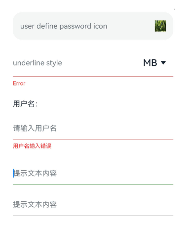

### 示例3（设置自定义键盘）

从API version 10开始，该示例通过[customKeyboard](#customkeyboard10)属性实现了自定义键盘的功能。

```ts
// xxx.ets
@Entry
@Component
struct TextInputExample {
  controller: TextInputController = new TextInputController();
  @State inputValue: string = "";

  // 自定义键盘组件
  @Builder
  CustomKeyboardBuilder() {
    Column() {
      Button('x').onClick(() => {
        // 关闭自定义键盘
        this.controller.stopEditing();
      })
      Grid() {
        ForEach([1, 2, 3, 4, 5, 6, 7, 8, 9, '*', 0, '#'], (item: number | string) => {
          GridItem() {
            Button(item + "")
              .width(110).onClick(() => {
              this.inputValue += item;
            })
          }
        })
      }.maxCount(3).columnsGap(10).rowsGap(10).padding(5)
    }.backgroundColor(Color.Gray)
  }

  build() {
    Column() {
      TextInput({ controller: this.controller, text: this.inputValue })// 绑定自定义键盘
        .customKeyboard(this.CustomKeyboardBuilder()).margin(10).border({ width: 1 }).height('48vp')
    }
  }
}
```

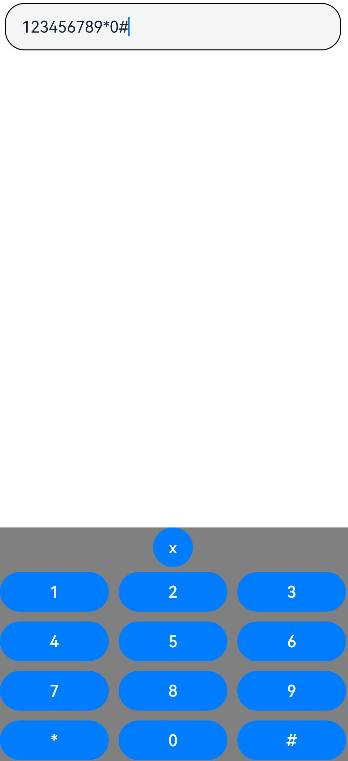

### 示例4（设置右侧清除按钮样式）

该示例通过[cancelButton](#cancelbutton11)属性展示了自定义右侧清除按钮样式的效果。

```ts
// xxx.ets
@Entry
@Component
struct TextInputExample {
  @State text: string = '';
  controller: TextInputController = new TextInputController();

  build() {
    Column() {
      TextInput({ placeholder: 'input ...', controller: this.controller })
        .width(380)
        .height(60)
        .cancelButton({
          style: CancelButtonStyle.CONSTANT,
          icon: {
            size: 45,
            // $r('app.media.startIcon')需要替换为开发者所需的图像资源文件。
            src: $r('app.media.startIcon'),
            color: Color.Blue
          }
        })
        .onChange((value: string) => {
          this.text = value;
        })
    }
  }
}
```

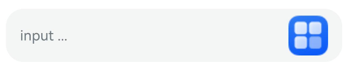

### 示例5（设置计数器）

该示例通过[maxLength](#maxlength)、[showCounter](#showcounter11)（从API version 11开始）、[showUnderline](#showunderline10)（从API version 10开始）属性实现了计数器的功能。

```ts
// xxx.ets
@Entry
@Component
struct TextInputExample {
  @State text: string = '';
  controller: TextInputController = new TextInputController();

  build() {
    Column() {
      TextInput({ text: this.text, controller: this.controller })
        .placeholderFont({ size: 16, weight: 400 })
        .width(336)
        .height(56)
        .maxLength(6)
        .showUnderline(true)
        .showCounter(true,
          { thresholdPercentage: 50, highlightBorder: true })//计数器显示效果为用户当前输入字符数/最大字符限制数。最大字符限制数通过maxLength()接口设置。
          //如果用户当前输入字符数达到最大字符限制乘50%（thresholdPercentage）。字符计数器显示。
          //用户设置highlightBorder为false时，配置取消红色边框。不设置此参数时，默认为true。
        .onChange((value: string) => {
          this.text = value;
        })
    }.width('100%').height('100%').backgroundColor('#F1F3F5')
  }
}
```


### 示例6（电话号码格式化）

该示例通过[onChange](#onchange)回调实现了电话号码格式化为XXX XXXX XXXX的功能。

```ts
// xxx.ets
@Entry
@Component
struct TextInputExample {
  @State submitValue: string = '';
  @State text: string = '';
  public readonly NUM_TEXT_MAXSIZE_LENGTH = 13;
  @State teleNumberNoSpace: string = "";
  @State nextCaret: number = -1; // 用于记录下次光标设置的位置
  @State actualCh: number = -1; // 用于记录光标在第i个数字后插入或者第i个数字前删除
  @State lastCaretPosition: number = 0;
  @State lastCaretPositionEnd: number = 0;
  controller: TextInputController = new TextInputController();

  isEmpty(str?: string): boolean {
    return str == 'undefined' || !str || !new RegExp("[^\\s]").test(str);
  }

  checkNeedNumberSpace(numText: string) {
    let isSpace: RegExp = new RegExp('[\\+;,#\\*]', 'g');
    let isRule: RegExp = new RegExp('^\\+.*');

    if (isSpace.test(numText)) {
      // 如果电话号码里有特殊字符，就不加空格
      if (isRule.test(numText)) {
        return true;
      } else {
        return false;
      }
    }
    return true;
  }

  removeSpace(str: string): string {
    if (this.isEmpty(str)) {
      return '';
    }
    return str.replace(new RegExp("[\\s]", "g"), '');
  }

  setCaret() {
    if (this.nextCaret != -1) {
      console.log("to keep caret position right, change caret to", this.nextCaret);
      this.controller.caretPosition(this.nextCaret);
      this.nextCaret = -1;
    }
  }

  calcCaretPosition(nextText: string) {
    let befNumberNoSpace: string = this.removeSpace(this.text);
    this.actualCh = 0;
    if (befNumberNoSpace.length < this.teleNumberNoSpace.length) { // 插入场景
      for (let i = 0; i < this.lastCaretPosition; i++) {
        if (this.text[i] != ' ') {
          this.actualCh += 1;
        }
      }
      this.actualCh += this.teleNumberNoSpace.length - befNumberNoSpace.length;
      console.log("actualCh: " + this.actualCh);
      for (let i = 0; i < nextText.length; i++) {
        if (nextText[i] != ' ') {
          this.actualCh -= 1;
          if (this.actualCh <= 0) {
            this.nextCaret = i + 1;
            break;
          }
        }
      }
    } else if (befNumberNoSpace.length > this.teleNumberNoSpace.length) { // 删除场景
      if (this.lastCaretPosition === this.text.length) {
        console.log("Caret at last, no need to change");
      } else if (this.lastCaretPosition === this.lastCaretPositionEnd) {
        // 按键盘上回退键一个一个删的情况
        for (let i = this.lastCaretPosition; i < this.text.length; i++) {
          if (this.text[i] != ' ') {
            this.actualCh += 1;
          }
        }
        for (let i = nextText.length - 1; i >= 0; i--) {
          if (nextText[i] != ' ') {
            this.actualCh -= 1;
            if (this.actualCh <= 0) {
              this.nextCaret = i;
              break;
            }
          }
        }
      } else {
        // 剪切/手柄选择 一次删多个字符
        this.nextCaret = this.lastCaretPosition; // 保持光标位置
      }
    }
  }

  build() {
    Column() {
      Row() {
        TextInput({ text: `${this.text}`, controller: this.controller }).type(InputType.PhoneNumber).height('48vp')
          .onChange((value: string) => {
            this.teleNumberNoSpace = this.removeSpace(value);
            let nextText: string = "";
            if (this.teleNumberNoSpace.length > this.NUM_TEXT_MAXSIZE_LENGTH - 2) {
              nextText = this.teleNumberNoSpace;
            } else if (this.checkNeedNumberSpace(value)) {
              if (this.teleNumberNoSpace.length <= 3) {
                nextText = this.teleNumberNoSpace;
              } else {
                let split1: string = this.teleNumberNoSpace.substring(0, 3);
                let split2: string = this.teleNumberNoSpace.substring(3);
                nextText = split1 + ' ' + split2;
                if (this.teleNumberNoSpace.length > 7) {
                  split2 = this.teleNumberNoSpace.substring(3, 7);
                  let split3: string = this.teleNumberNoSpace.substring(7);
                  nextText = split1 + ' ' + split2 + ' ' + split3;
                }
              }
            } else {
              nextText = value;
            }
            console.log("onChange Triggered:" + this.text + "|" + nextText + "|" + value);
            if (this.text === nextText && nextText === value) {
              // 此时说明数字已经格式化完成了 在这个时候改变光标位置不会被重置掉
              this.setCaret();
            } else {
              this.calcCaretPosition(nextText);
            }
            this.text = nextText;
          })
          .onTextSelectionChange((selectionStart, selectionEnd) => {
            // 记录光标位置
            console.log("selection change: ", selectionStart, selectionEnd);
            this.lastCaretPosition = selectionStart;
            this.lastCaretPositionEnd = selectionEnd;
          })// 从API version 10开始支持
      }
    }
    .width('100%')
    .height("100%")
  }
}
```


### 示例7（设置文本断行规则）

从API version 12开始，该示例通过[wordBreak](#wordbreak12)属性实现了TextInput不同断行规则下的效果。

```ts
// xxx.ets
@Entry
@Component
struct TextInputExample {
  @State textStrEn: string =
    'This is set wordBreak to WordBreak text Taumatawhakatangihangakoauauotamateaturipukakapikimaungahoronukupokaiwhenuakitanatahu.';
  @State textStrZn: string =
    '多行文本输入框组件，当输入的文本内容超过组件宽度时会自动换行显示。\n高度未设置时，组件无默认高度，自适应内容高度。宽度未设置时，默认撑满最大宽度。';

  build() {
    Row() {
      Column() {
        Text("TextInput为inline模式，WordBreakType属性为NORMAL的样式：").fontSize(16).fontColor(0xCCCCCC)
        TextInput({
          text: this.textStrEn
        })
          .margin(10)
          .fontSize(16)
          .style(TextInputStyle.Inline)// Inline模式
          .wordBreak(WordBreak.NORMAL) // 非Inline模式该属性无效

        Text("TextInput为inline模式，英文文本，WordBreakType属性为BREAK_ALL的样式：").fontSize(16).fontColor(0xCCCCCC)
        TextInput({
          text: this.textStrEn
        })
          .margin(10)
          .fontSize(16)
          .style(TextInputStyle.Inline)
          .wordBreak(WordBreak.BREAK_ALL)

        Text("TextInput为inline模式，中文文本，WordBreakType属性为BREAK_ALL的样式：").fontSize(16).fontColor(0xCCCCCC)
        TextInput({
          text: this.textStrZn
        })
          .margin(10)
          .fontSize(16)
          .style(TextInputStyle.Inline)
          .wordBreak(WordBreak.BREAK_ALL)

        Text("TextInput为inline模式，WordBreakType属性为BREAK_WORD的样式：").fontSize(16).fontColor(0xCCCCCC)
        TextInput({
          text: this.textStrEn
        })
          .margin(10)
          .fontSize(16)
          .style(TextInputStyle.Inline)
          .wordBreak(WordBreak.BREAK_WORD)
      }.width('100%')
    }.height('100%').margin(10)
  }
}
```
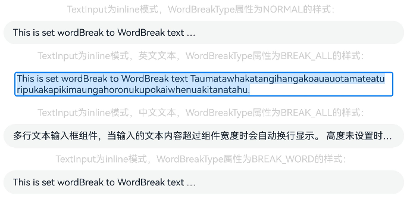

### 示例8（设置文本样式）

从API version 12开始，该示例通过[lineHeight](#lineheight12)、[letterSpacing](#letterspacing12)、[decoration](#decoration12)属性展示了不同样式的文本效果。

```ts
// xxx.ets
@Entry
@Component
struct TextInputExample {
  build() {
    Row() {
      Column() {
        Text('lineHeight').fontSize(9).fontColor(0xCCCCCC)
        TextInput({ text: 'lineHeight unset' })
          .border({ width: 1 }).padding(10).margin(5)
        TextInput({ text: 'lineHeight 15' })
          .border({ width: 1 }).padding(10).margin(5).lineHeight(15)
        TextInput({ text: 'lineHeight 30' })
          .border({ width: 1 }).padding(10).margin(5).lineHeight(30)

        Text('letterSpacing').fontSize(9).fontColor(0xCCCCCC)
        TextInput({ text: 'letterSpacing 0' })
          .border({ width: 1 }).padding(5).margin(5).letterSpacing(0)
        TextInput({ text: 'letterSpacing 3' })
          .border({ width: 1 }).padding(5).margin(5).letterSpacing(3)
        TextInput({ text: 'letterSpacing -1' })
          .border({ width: 1 }).padding(5).margin(5).letterSpacing(-1)

        Text('decoration').fontSize(9).fontColor(0xCCCCCC)
        TextInput({ text: 'LineThrough, Red' })
          .border({ width: 1 }).padding(5).margin(5)
          .decoration({ type: TextDecorationType.LineThrough, color: Color.Red })
        TextInput({ text: 'Overline, Red, DASHED' })
          .border({ width: 1 }).padding(5).margin(5)
          .decoration({ type: TextDecorationType.Overline, color: Color.Red, style: TextDecorationStyle.DASHED })
        TextInput({ text: 'Underline, Red, WAVY' })
          .border({ width: 1 }).padding(5).margin(5)
          .decoration({ type: TextDecorationType.Underline, color: Color.Red, style: TextDecorationStyle.WAVY })
      }.height('90%')
    }
    .width('90%')
    .margin(10)
  }
}
```

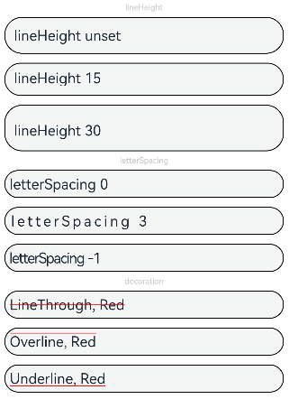

### 示例9（设置文字特性效果）

从API version 12开始，该示例通过[fontFeature](#fontfeature12)属性实现了文本在不同文字特性下的展示效果。

```ts
// xxx.ets
@Entry
@Component
struct TextInputExample {
  @State text1: string = 'This is ss01 on : 0123456789';
  @State text2: string = 'This is ss01 off: 0123456789';

  build() {
    Column() {
      TextInput({ text: this.text1 })
        .fontSize(20)
        .margin({ top: 200 })
        .fontFeature("\"ss01\" on")
      TextInput({ text: this.text2 })
        .margin({ top: 10 })
        .fontSize(20)
        .fontFeature("\"ss01\" off")
    }
    .width("90%")
    .margin("5%")
  }
}
```


### 示例10（自定义键盘避让）

该示例通过[customKeyboard](#customkeyboard10)（从API version 10开始）属性配置[KeyboardOptions](ts-basic-components-richeditor.md#keyboardoptions12)（从API version 12开始）接口实现了自定义键盘避让的效果。

```ts
// xxx.ets
@Entry
@Component
struct TextInputExample {
  controller: TextInputController = new TextInputController();
  @State inputValue: string = "";
  @State height1: string | number = '80%';
  @State supportAvoidance: boolean = true;

  // 自定义键盘组件
  @Builder
  CustomKeyboardBuilder() {
    Column() {
      Row() {
        Button('x').onClick(() => {
          // 关闭自定义键盘
          this.controller.stopEditing();
        }).margin(10)
      }

      Grid() {
        ForEach([1, 2, 3, 4, 5, 6, 7, 8, 9, '*', 0, '#'], (item: number | string) => {
          GridItem() {
            Button(item + "")
              .width(110).onClick(() => {
              this.inputValue += item;
            })
          }
        })
      }.maxCount(3).columnsGap(10).rowsGap(10).padding(5)
    }.backgroundColor(Color.Gray)
  }

  build() {
    Column() {
      Row() {
        Button("20%")
          .fontSize(24)
          .onClick(() => {
            this.height1 = "20%";
          })
        Button("80%")
          .fontSize(24)
          .margin({ left: 20 })
          .onClick(() => {
            this.height1 = "80%";
          })
      }
      .justifyContent(FlexAlign.Center)
      .alignItems(VerticalAlign.Bottom)
      .height(this.height1)
      .width("100%")
      .padding({ bottom: 50 })

      TextInput({ controller: this.controller, text: this.inputValue })// 绑定自定义键盘
        .customKeyboard(this.CustomKeyboardBuilder(), { supportAvoidance: this.supportAvoidance })
        .margin(10)
        .border({ width: 1 })

    }
  }
}
```


### 示例11（设置文本自适应）

从API version 12开始，该示例通过[minFontSize](#minfontsize12)、[maxFontSize](#maxfontsize12)、[heightAdaptivePolicy](#heightadaptivepolicy12)属性实现了文本自适应字号的功能。

```ts
// xxx.ets
@Entry
@Component
struct TextInputExample {
  build() {
    Row() {
      Column() {
        Text('heightAdaptivePolicy').fontSize(9).fontColor(0xCCCCCC)
        TextInput({ text: 'This is the text without the height adaptive policy set' })
          .width('80%').height(50).borderWidth(1).margin(1)
        TextInput({ text: 'This is the text with the height adaptive policy set' })
          .width('80%')
          .height(50)
          .borderWidth(1)
          .margin(1)
          .minFontSize(4)
          .maxFontSize(40)
          .maxLines(3)
          .heightAdaptivePolicy(TextHeightAdaptivePolicy.MAX_LINES_FIRST)
        TextInput({ text: 'This is the text with the height adaptive policy set' })
          .width('80%')
          .height(50)
          .borderWidth(1)
          .margin(1)
          .minFontSize(4)
          .maxFontSize(40)
          .maxLines(3)
          .heightAdaptivePolicy(TextHeightAdaptivePolicy.MIN_FONT_SIZE_FIRST)
        TextInput({ text: 'This is the text with the height adaptive policy set' })
          .width('80%')
          .height(50)
          .borderWidth(1)
          .margin(1)
          .minFontSize(4)
          .maxFontSize(40)
          .maxLines(3)
          .heightAdaptivePolicy(TextHeightAdaptivePolicy.LAYOUT_CONSTRAINT_FIRST)
      }.height('90%')
    }
    .width('90%')
    .margin(10)
  }
}
```


### 示例12（设置折行规则）

从API version 12开始，该示例通过[lineBreakStrategy](#linebreakstrategy12)属性实现了TextInput不同折行规则下的效果。

```ts
// xxx.ets
@Entry
@Component
struct TextInputExample {
  @State message1: string =
    "They can be classified as built-in components–those directly provided by the ArkUI framework and custom components – those defined by developers" +
      "The built-in components include buttons radio buttonsprogress indicators and text You can set the rendering effectof thesecomponents in method chaining mode," +
      "page components are divided into independent UI units to implementindependent creation development and reuse of different units on pages making pages more engineering-oriented.";
  @State lineBreakStrategyIndex: number = 0;
  @State lineBreakStrategy: LineBreakStrategy[] =
    [LineBreakStrategy.GREEDY, LineBreakStrategy.HIGH_QUALITY, LineBreakStrategy.BALANCED];
  @State lineBreakStrategyStr: string[] = ['GREEDY', 'HIGH_QUALITY', 'BALANCED'];

  build() {
    Flex({ direction: FlexDirection.Column, alignItems: ItemAlign.Start }) {
      Text('lineBreakStrategy').fontSize(9).fontColor(0xCCCCCC)
      TextInput({ text: this.message1 })
        .fontSize(12)
        .border({ width: 1 })
        .padding(10)
        .width('100%')
        .maxLines(12)
        .style(TextInputStyle.Inline)
        .lineBreakStrategy(this.lineBreakStrategy[this.lineBreakStrategyIndex])
      Row() {
        Button('当前lineBreakStrategy模式：' + this.lineBreakStrategyStr[this.lineBreakStrategyIndex]).onClick(() => {
          this.lineBreakStrategyIndex++;
          if (this.lineBreakStrategyIndex > (this.lineBreakStrategyStr.length - 1)) {
            this.lineBreakStrategyIndex = 0;
          }
        })
      }
    }.height(700).width(370).padding({ left: 35, right: 35, top: 35 })
  }
}
```

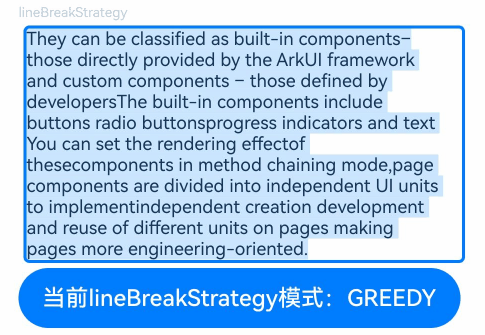

### 示例13（支持插入和删除回调）
从API version 12开始，该示例通过[onWillInsert](#onwillinsert12)、[onDidInsert](#ondidinsert12)、[onWillDelete](#onwilldelete12)、[onDidDelete](#ondiddelete12)接口实现了插入和删除的效果。
```ts
// xxx.ets
@Entry
@Component
struct TextInputExample {
  @State insertValue: string = "";
  @State deleteValue: string = "";
  @State insertOffset: number = 0;
  @State deleteOffset: number = 0;
  @State deleteDirection: number = 0;

  build() {
    Row() {
      Column() {
        TextInput({ text: "TextInput支持插入回调文本" })
          .height(60)
          .onWillInsert((info: InsertValue) => {
            this.insertValue = info.insertValue;
            return true;
          })
          .onDidInsert((info: InsertValue) => {
            this.insertOffset = info.insertOffset;
          })

        Text("insertValue:" + this.insertValue + "  insertOffset:" + this.insertOffset).height(30)

        TextInput({ text: "TextInput支持删除回调文本b" })
          .height(60)
          .onWillDelete((info: DeleteValue) => {
            this.deleteValue = info.deleteValue;
            this.deleteDirection = info.direction;
            return true;
          })
          .onDidDelete((info: DeleteValue) => {
            this.deleteOffset = info.deleteOffset;
            this.deleteDirection = info.direction;
          })

        Text("deleteValue:" + this.deleteValue + "  deleteOffset:" + this.deleteOffset).height(30)
        Text("deleteDirection:" + (this.deleteDirection == 0 ? "BACKWARD" : "FORWARD")).height(30)

      }.width('100%')
    }
    .height('100%')
  }
}
```

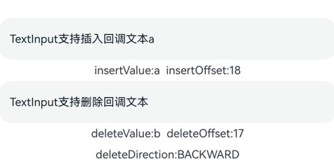

### 示例14（文本扩展自定义菜单）

从API version 12开始，该示例通过[editMenuOptions](#editmenuoptions12)接口实现了文本设置自定义菜单扩展项的文本内容、图标以及回调的功能，同时，可以在[onPrepareMenu](ts-text-common.md#onpreparemenu20)（从API version 20开始）回调中，进行菜单数据的设置。

```ts
// xxx.ets
@Entry
@Component
struct TextInputExample {
  @State text: string = 'TextInput editMenuOptions';
  @State endIndex: number = 0;
  onCreateMenu = (menuItems: Array<TextMenuItem>) => {
    // $r('app.media.startIcon')需要替换为开发者所需的图像资源文件。
    let item1: TextMenuItem = {
      content: 'create1',
      icon: $r('app.media.startIcon'),
      id: TextMenuItemId.of('create1'),
    };
    let item2: TextMenuItem = {
      content: 'create2',
      id: TextMenuItemId.of('create2'),
      icon: $r('app.media.startIcon'),
    };
    menuItems.push(item1);
    menuItems.unshift(item2);
    return menuItems;
  }
  onMenuItemClick = (menuItem: TextMenuItem, textRange: TextRange) => {
    if (menuItem.id.equals(TextMenuItemId.of("create2"))) {
      console.log("拦截 id: create2 start:" + textRange.start + "; end:" + textRange.end);
      return true;
    }
    if (menuItem.id.equals(TextMenuItemId.of("prepare1"))) {
      console.log("拦截 id: prepare1 start:" + textRange.start + "; end:" + textRange.end);
      return true;
    }
    if (menuItem.id.equals(TextMenuItemId.COPY)) {
      console.log("拦截 COPY start:" + textRange.start + "; end:" + textRange.end);
      return true;
    }
    if (menuItem.id.equals(TextMenuItemId.SELECT_ALL)) {
      console.log("不拦截 SELECT_ALL start:" + textRange.start + "; end:" + textRange.end);
      return false;
    }
    return false;
  }
  // $r('app.media.startIcon')需要替换为开发者所需的图像资源文件。
  onPrepareMenu = (menuItems: Array<TextMenuItem>) => {
    let item1: TextMenuItem = {
      content: 'prepare1_' + this.endIndex,
      icon: $r('app.media.startIcon'),
      id: TextMenuItemId.of('prepare1'),
    };
    menuItems.unshift(item1);
    return menuItems;
  }
  @State editMenuOptions: EditMenuOptions = {
    onCreateMenu: this.onCreateMenu,
    onMenuItemClick: this.onMenuItemClick,
    onPrepareMenu: this.onPrepareMenu
  };

  build() {
    Column() {
      TextInput({ text: this.text })
        .width('95%')
        .height(50)
        .editMenuOptions(this.editMenuOptions)
        .margin({ top: 100 })
        .onTextSelectionChange((selectionStart: number, selectionEnd: number) => {
          this.endIndex = selectionEnd;
        })
    }
    .width("90%")
    .margin("5%")
  }
}
```

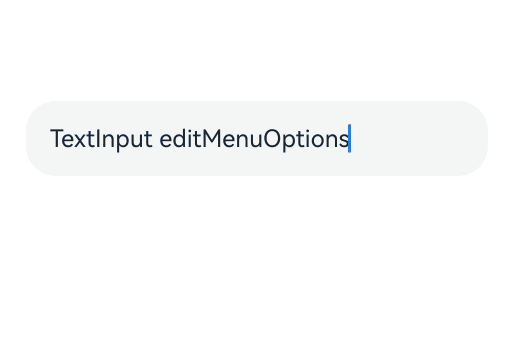

### 示例15（设置symbol类型清除按钮）

从API version 18开始，该示例通过[cancelButton](#cancelbutton18)属性展示了自定义右侧symbol类型清除按钮样式的效果。

```ts
import { SymbolGlyphModifier } from '@kit.ArkUI';

// xxx.ets
@Entry
@Component
struct TextInputExample {
  @State text: string = '';
  symbolModifier: SymbolGlyphModifier =
    new SymbolGlyphModifier($r('sys.symbol.trash')).fontColor([Color.Red]).fontSize(16).fontWeight(FontWeight.Regular);

  build() {
    Column() {
      TextInput({ text: this.text, placeholder: 'input your word...' })
        .cancelButton({
          style: CancelButtonStyle.CONSTANT,
          icon: this.symbolModifier
        })
    }
  }
}
```


### 示例16（文本设置省略模式）

该示例通过[textOverflow](#textoverflow12)（从API version 12开始）、[ellipsisMode](#ellipsismode18)（从API version 18开始）、[style](#style9)（从API version 9开始）属性展示了文本超长省略以及调整省略位置的效果。

```ts
// xxx.ets
@Entry
@Component
struct EllipsisModeExample {
  @State text: string = "As the sun begins to set, casting a warm golden hue across the sky," +
    "the world seems to slow down and breathe a sigh of relief. The sky is painted with hues of orange, " +
    " pink, and lavender, creating a breath taking tapestry that stretches as far as the eye can see." +
    "The air is filled with the sweet scent of blooming flowers, mingling with the earthy aroma of freshly turned soil.";
  @State ellipsisModeIndex: number = 0;
  @State ellipsisMode: (EllipsisMode | undefined | null)[] =
    [EllipsisMode.END, EllipsisMode.START, EllipsisMode.CENTER];
  @State ellipsisModeStr: string[] = ['END ', 'START', 'CENTER'];
  @State textOverflowIndex: number = 0;
  @State textOverflow: TextOverflow[] = [TextOverflow.Ellipsis, TextOverflow.Clip];
  @State textOverflowStr: string[] = ['Ellipsis', 'Clip'];
  @State styleInputIndex: number = 0;
  @State styleInput: TextInputStyle[] = [TextInputStyle.Inline, TextInputStyle.Default];
  @State styleInputStr: string[] = ['Inline', 'Default'];

  build() {
    Row() {
      Column({ space: 20 }) {
        TextInput({ text: this.text })
          .textOverflow(this.textOverflow[this.textOverflowIndex])
          .ellipsisMode(this.ellipsisMode[this.ellipsisModeIndex])
          .style(this.styleInput[this.styleInputIndex])
          .fontSize(30)
          .margin(30)
        Button('更改ellipsisMode模式：' + this.ellipsisModeStr[this.ellipsisModeIndex]).onClick(() => {
          this.ellipsisModeIndex++;
          if (this.ellipsisModeIndex > (this.ellipsisModeStr.length - 1)) {
            this.ellipsisModeIndex = 0;
          }
        }).fontSize(20)
        Button('更改textOverflow模式：' + this.textOverflowStr[this.textOverflowIndex]).onClick(() => {
          this.textOverflowIndex++;
          if (this.textOverflowIndex > (this.textOverflowStr.length - 1)) {
            this.textOverflowIndex = 0;
          }
        }).fontSize(20)
        Button('更改Style大小：' + this.styleInputStr[this.styleInputIndex]).onClick(() => {
          this.styleInputIndex++;
          if (this.styleInputIndex > (this.styleInputStr.length - 1)) {
            this.styleInputIndex = 0;
          }
        }).fontSize(20)
      }
    }
  }
}
```

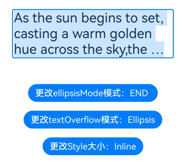

### 示例17（输入框支持输入状态变化等回调）

从API version 8开始，该示例通过[onEditChange](#oneditchange8)、[onCopy](#oncopy8)、[onCut](#oncopy8)、[onPaste](#onpaste8)、[onContentScroll](#oncontentscroll10)（从API version 10开始）接口实现了输入框监测输入状态变化、复制、剪切、粘贴、文本内容滚动回调的效果，同时，可以通过设置[selectAll](#selectall11)（从API version 11开始）属性，输入框初始状态下是否全选文本。

```ts
// xxx.ets
@Entry
@Component
struct TextInputExample {
  @State editStatus: boolean = false;
  @State copyValue: string = "";
  @State cutValue: string = "";
  @State pasteValue: string = "";
  @State totalOffsetX: number = 0;
  @State totalOffsetY: number = 0;

  build() {
    Row() {
      Column() {
        TextInput({ text: "TextInput支持输入状态变化时回调" })
          .height(60)
          .fontStyle(FontStyle.Italic)
          .fontWeight(FontWeight.Bold)
          .fontFamily("HarmonyOS Sans")
          .copyOption(CopyOptions.LocalDevice)
          .textAlign(TextAlign.Center)
          .selectedBackgroundColor(Color.Blue)
          .caretStyle({ width: '4vp' })
          .caretPosition(10)
          .selectionMenuHidden(true)
          .onEditChange((status: boolean) => {
            this.editStatus = status;
          })
          .defaultFocus(true)// 设置TextInput默认获焦
          .enableKeyboardOnFocus(false)
          .selectAll(false)

        Text("editStatus:" + this.editStatus).height(30)

        TextInput({ text: "TextInput支持复制操作时回调" })
          .height(60)
          .fontStyle(FontStyle.Italic)
          .fontWeight(FontWeight.Bold)
          .fontFamily("HarmonyOS Sans")
          .copyOption(CopyOptions.LocalDevice)
          .textAlign(TextAlign.Center)
          .selectedBackgroundColor(Color.Blue)
          .caretStyle({ width: '4vp' })
          .onCopy((copyValue: string) => {
            this.copyValue = copyValue;
          })

        Text("copyValue:" + this.copyValue).height(30)

        TextInput({ text: "TextInput支持剪切操作时回调" })
          .height(60)
          .fontStyle(FontStyle.Italic)
          .fontWeight(FontWeight.Bold)
          .fontFamily("HarmonyOS Sans")
          .copyOption(CopyOptions.LocalDevice)
          .textAlign(TextAlign.Center)
          .selectedBackgroundColor(Color.Blue)
          .caretStyle({ width: '4vp' })
          .onCut((cutValue: string) => {
            this.cutValue = cutValue;
          })

        Text("cutValue:" + this.cutValue).height(30)

        TextInput({ text: "TextInput支持粘贴操作时回调" })
          .height(60)
          .fontStyle(FontStyle.Italic)
          .fontWeight(FontWeight.Bold)
          .fontFamily("HarmonyOS Sans")
          .copyOption(CopyOptions.LocalDevice)
          .textAlign(TextAlign.Center)
          .selectedBackgroundColor(Color.Blue)
          .caretStyle({ width: '4vp' })
          .onPaste((pasteValue: string) => {
            this.pasteValue = pasteValue;
          })

        Text("pasteValue:" + this.pasteValue).height(30)

        TextInput({ text: "TextInput支持文本内容滚动时回调: 文本内容宽度超出输入框宽度，滚动文本查看偏移量变化" })
          .height(60)
          .fontStyle(FontStyle.Italic)
          .fontWeight(FontWeight.Bold)
          .fontFamily("HarmonyOS Sans")
          .copyOption(CopyOptions.LocalDevice)
          .textAlign(TextAlign.Center)
          .selectedBackgroundColor(Color.Blue)
          .caretStyle({ width: '4vp' })
          .onContentScroll((totalOffsetX: number, totalOffsetY: number) => {
            this.totalOffsetX = totalOffsetX;
            this.totalOffsetY = totalOffsetY;
          })

        Text("totalOffsetX:" + this.totalOffsetX + "  totalOffsetY:" + this.totalOffsetY).height(30)

      }.width('100%')
    }
    .height('100%')
  }
}
```

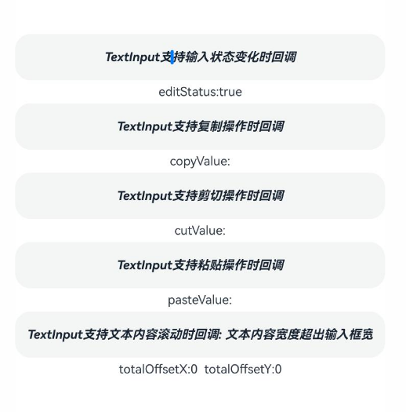

### 示例18（设置最小字体范围与最大字体范围）

从API version 18开始，该示例通过[minFontScale](#minfontscale18)、[maxFontScale](#maxfontscale18)设置字体显示最小与最大范围<!--Del-->（该示例使用系统接口，应用类型需调整为系统应用，可参考HarmonyAppProvision的[系统接口说明](../../../reference/development-intro-api.md#系统接口说明)）<!--DelEnd-->。
<!--code_no_check-->
```json
// 开启应用缩放跟随系统
// AppScope/resources/base，新建文件夹profile。
// AppScope/resources/base/profile，新建文件configuration.json。
// AppScope/resources/base/profile/configuration.json，增加如下代码。
{
  "configuration": {
    "fontSizeScale": "followSystem",
    "fontSizeMaxScale": "3.2"
  }
}
```
<!--code_no_check-->
```json
// AppScope/app.json5，修改如下代码。
{
  "app": {
    "bundleName": "com.example.myapplication",
    "vendor": "example",
    "versionCode": 1000000,
    "versionName": "1.0.0",
    "icon": "$media:app_icon",
    "label": "$string:app_name",
    "configuration": "$profile:configuration"
  }
}
```
<!--RP3-->
<!--code_no_check-->
```ts
// xxx.ets
import { abilityManager, Configuration } from '@kit.AbilityKit';
import { BusinessError } from '@kit.BasicServicesKit';

@Entry
@Component
struct TextInputExample {
  @State currentFontSizeScale: number = 1;
  @State minFontScale: number = 0.85;
  @State maxFontScale: number = 2;

  // 设置字体大小
  async setFontScale(scale: number): Promise<void> {
    let configInit: Configuration = {
      language: 'zh-Ch',
      fontSizeScale: scale,
    };
    // 更新配置-字体大小，调用系统接口更新字体配置
    // 需在工程的module.json5文件的requestPermissions字段配置权限：ohos.permission.UPDATE_CONFIGURATION
    abilityManager.updateConfiguration(configInit, (err: BusinessError) => {
      if (err) {
        console.error(`updateConfiguration fail, err: ${JSON.stringify(err)}`);
      } else {
        this.currentFontSizeScale = scale;
        console.log('updateConfiguration success.');
      }
    });
  }

  build() {
    Column() {
      Column({ space: 30 }) {
        Text("通过minFontScale、maxFontScale调整文本显示的最大和最小字体缩放倍数。")
        TextInput({
          placeholder: 'The text area can hold an unlimited amount of text. input your word...',
          text: '通过minFontScale、maxFontScale调整文本显示的最大和最小字体缩放倍数。'
        })
          .minFontScale(this.minFontScale)// 设置最小字体缩放倍数，参数为undefined则跟随系统默认倍数缩放
          .maxFontScale(this.maxFontScale) // 设置最大字体缩放倍数，参数为undefined则跟随系统默认倍数缩放
      }.width('100%')

      Column() {
        Row() {
          Button('1倍').onClick(() => {
            this.setFontScale(1)
          }).margin(10)
          Button('1.75倍').onClick(() => {
            this.setFontScale(1.75)
          }).margin(10)
        }

        Row() {
          Button('2倍').onClick(() => {
            this.setFontScale(2)
          }).margin(10)
          Button('3.2倍').onClick(() => {
            this.setFontScale(3.2)
          }).margin(10)
        }
      }.margin({ top: 50 })
    }
  }
}
```
| 系统字体缩放倍数为2倍 | 系统字体缩放倍数为3.2倍 |
| ---------------------------------- | ------------------------------------ |
| 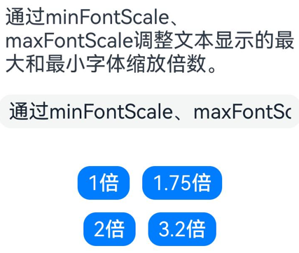  |   |
<!--RP3End-->
### 示例19（设置选中指定区域的文本内容）

从API version 10开始，该示例通过[setTextSelection](#settextselection10)方法展示如何设置选中指定区域的文本内容以及菜单的显隐策略。

```ts
// xxx.ets

@Entry
@Component
struct TextInputExample {
  controller: TextInputController = new TextInputController();
  @State startIndex: number = 0;
  @State endIndex: number = 0;

  build() {
    Column({ space: 3 }) {
      Text('Selection start:' + this.startIndex + ' end:' + this.endIndex)
      TextInput({ text: 'Hello World', controller: this.controller })
        .width('95%')
        .height(40)
        .defaultFocus(true)
        .enableKeyboardOnFocus(true)
        .onTextSelectionChange((selectionStart: number, selectionEnd: number) => {
          this.startIndex = selectionStart;
          this.endIndex = selectionEnd;
        })

      Button('setTextSelection [0,3], set menuPolicy is MenuPolicy.SHOW')
        .onClick(() => {
          this.controller.setTextSelection(0, 3, { menuPolicy: MenuPolicy.SHOW });
        })
    }
    .width('100%')
    .height('100%')
  }
}
```

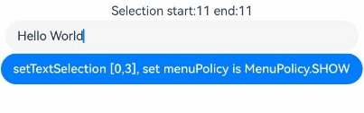

### 示例20（设置文本描边）

从API version 20开始，该示例通过[strokeWidth](#strokewidth20)和[strokeColor](#strokecolor20)属性设置文本的描边宽度及颜色。

```ts
// xxx.ets
import { LengthMetrics } from '@kit.ArkUI';

@Entry
@Component
struct TextInputExample {
  build() {
    Row() {
      Column() {
        Text('stroke feature').fontSize(9).fontColor(0xCCCCCC)

        TextInput({ text: 'Text without stroke' })
          .width('100%')
          .height(60)
          .borderWidth(1)
          .fontSize(40)
        TextInput({ text: 'Text with stroke' })
          .width('100%')
          .height(60)
          .borderWidth(1)
          .fontSize(40)
          .strokeWidth(LengthMetrics.px(-3.0))
          .strokeColor(Color.Red)
        TextInput({ text: 'Text with stroke' })
          .width('100%')
          .height(60)
          .borderWidth(1)
          .fontSize(40)
          .strokeWidth(LengthMetrics.px(3.0))
          .strokeColor(Color.Red)
      }.height('90%')
    }
    .width('90%')
    .margin(10)
  }
}
```

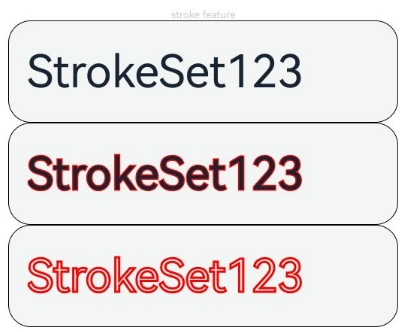

### 示例21（设置中西文自动间距）

从API version 20开始，该示例通过[enableAutoSpacing](#enableautospacing20)属性设置中西文自动间距。

```ts
// xxx.ets
@Entry
@Component
struct TextInputExample {
  build() {
    Row() {
      Column() {
        Text('开启中西文自动间距').margin(5)
        TextInput({text: '中西文Auto Spacing自动间距'})
          .enableAutoSpacing(true)
        Text('关闭中西文自动间距').margin(5)
        TextInput({text: '中西文Auto Spacing自动间距'})
          .enableAutoSpacing(false)
      }.height('100%')
    }
    .width('60%')
  }
}
```

