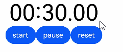
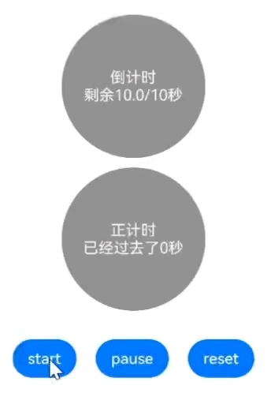

# TextTimer

通过文本显示计时信息并控制其计时器状态的组件。

在组件不可见时时间变动将停止，组件的可见状态基于[onVisibleAreaChange](./ts-universal-component-visible-area-change-event.md#onvisibleareachange)处理，可见阈值ratios大于0即视为可见状态。

>  **说明：**
>
> 该组件从API Version 8开始支持。后续版本如有新增内容，则采用上角标单独标记该内容的起始版本。

## 子组件

无

## 接口

TextTimer(options?: TextTimerOptions)

**卡片能力：** 从API version 10开始，该接口支持在ArkTS卡片中使用。

**原子化服务API：** 从API version 11开始，该接口支持在原子化服务中使用。

**系统能力：** SystemCapability.ArkUI.ArkUI.Full

**参数：** 

| 参数名 | 类型 | 必填 | 说明 |
| -------- | -------- | -------- | -------- |
| options |  [TextTimerOptions](#texttimeroptions对象说明)| 否 | 通过文本显示计时信息并控制其计时器状态的组件参数。 |

## TextTimerOptions对象说明

**卡片能力：** 从API version 10开始，该接口支持在ArkTS卡片中使用。

**原子化服务API：** 从API version 11开始，该接口支持在原子化服务中使用。

**系统能力：** SystemCapability.ArkUI.ArkUI.Full

| 名称   | 类型     | 必填  | 说明                   |
| ----------- | -------- | -------- | -------- |
| isCountDown | boolean  | 否   | 是否倒计时。值为true时，计时器开启倒计时，值为false时，计时器开始计时。<br/>默认值：false |
| count       | number   | 否   | 计时器时间（isCountDown为true时生效），单位为毫秒。最长不超过86400000毫秒（24小时）。&nbsp;0&lt;count&lt;86400000时，count值为计时器初始值。否则，使用默认值为计时器初始值。<br/>默认值：60000 |
| controller  | [TextTimerController](#texttimercontroller) | 否  | TextTimer控制器。 |

## 属性

除支持[通用属性](ts-component-general-attributes.md)外，还支持以下属性：

### format

format(value: string)

设置自定义格式，需至少包含一个HH、mm、ss、SS中的关键字。如使用yy、MM、dd等日期格式，则使用默认值。

**卡片能力：** 从API version 10开始，该接口支持在ArkTS卡片中使用。

**原子化服务API：** 从API version 11开始，该接口支持在原子化服务中使用。

**系统能力：** SystemCapability.ArkUI.ArkUI.Full

**参数：** 

| 参数名 | 类型   | 必填 | 说明                                   |
| ------ | ------ | ---- | -------------------------------------- |
| value  | string | 是   | 自定义格式。<br/>默认值：'HH:mm:ss.SS' |


### fontColor

fontColor(value: ResourceColor)

设置字体颜色。

**卡片能力：** 从API version 10开始，该接口支持在ArkTS卡片中使用。

**原子化服务API：** 从API version 11开始，该接口支持在原子化服务中使用。

**系统能力：** SystemCapability.ArkUI.ArkUI.Full

**参数：** 

| 参数名 | 类型                                       | 必填 | 说明       |
| ------ | ------------------------------------------ | ---- | ---------- |
| value  | [ResourceColor](ts-types.md#resourcecolor) | 是   | 字体颜色。 |

### fontSize

fontSize(value: Length)

设置字体大小。

**卡片能力：** 从API version 10开始，该接口支持在ArkTS卡片中使用。

**原子化服务API：** 从API version 11开始，该接口支持在原子化服务中使用。

**系统能力：** SystemCapability.ArkUI.ArkUI.Full

**参数：** 

| 参数名 | 类型                         | 必填 | 说明                                                         |
| ------ | ---------------------------- | ---- | ------------------------------------------------------------ |
| value  | [Length](ts-types.md#length) | 是   | 字体大小。fontSize为number类型时，使用fp单位。字体默认大小16fp。不支持设置百分比字符串。 |

### fontStyle

fontStyle(value: FontStyle)

设置字体样式。

**卡片能力：** 从API version 10开始，该接口支持在ArkTS卡片中使用。

**原子化服务API：** 从API version 11开始，该接口支持在原子化服务中使用。

**系统能力：** SystemCapability.ArkUI.ArkUI.Full

**参数：** 

| 参数名 | 类型                                        | 必填 | 说明                                    |
| ------ | ------------------------------------------- | ---- | --------------------------------------- |
| value  | [FontStyle](ts-appendix-enums.md#fontstyle) | 是   | 字体样式。<br/>默认值：FontStyle.Normal |

### fontWeight

fontWeight(value: number | FontWeight | string)

设置文本的字体粗细，设置过大可能会在不同字体下有截断。

**卡片能力：** 从API version 10开始，该接口支持在ArkTS卡片中使用。

**原子化服务API：** 从API version 11开始，该接口支持在原子化服务中使用。

**系统能力：** SystemCapability.ArkUI.ArkUI.Full

**参数：** 

| 参数名 | 类型  | 必填 | 说明      |
| ------ | ---------- | ------ | ----------------- |
| value  | number&nbsp;\|&nbsp;[FontWeight](ts-appendix-enums.md#fontweight)&nbsp;\|&nbsp;string | 是   | 文本的字体粗细，number类型取值[100,&nbsp;900]，取值间隔为100，默认为400，取值越大，字体越粗。string类型仅支持number类型取值的字符串形式，例如"400"，以及"bold"、"bolder"、"lighter"、"regular"、"medium"，分别对应FontWeight中相应的枚举值。<br/>默认值：FontWeight.Normal |

### fontFamily

fontFamily(value: ResourceStr)

设置字体列表。

**卡片能力：** 从API version 10开始，该接口支持在ArkTS卡片中使用。

**原子化服务API：** 从API version 11开始，该接口支持在原子化服务中使用。

**系统能力：** SystemCapability.ArkUI.ArkUI.Full

**参数：** 

| 参数名 | 类型                                   | 必填 | 说明                                                         |
| ------ | -------------------------------------- | ---- | ------------------------------------------------------------ |
| value  | [ResourceStr](ts-types.md#resourcestr) | 是   | 字体列表。默认字体'HarmonyOS Sans'。<br>应用当前支持'HarmonyOS Sans'字体和[注册自定义字体](../js-apis-font.md)。<br>卡片当前仅支持'HarmonyOS Sans'字体。 |

### textShadow<sup>11+</sup>

textShadow(value: ShadowOptions | Array&lt;ShadowOptions&gt;)

设置文字阴影效果。该接口支持以数组形式入参，实现多重文字阴影。不支持fill字段, 不支持智能取色模式。

**原子化服务API：** 从API version 12开始，该接口支持在原子化服务中使用。

**系统能力：** SystemCapability.ArkUI.ArkUI.Full

**参数：** 

| 参数名 | 类型                                                         | 必填 | 说明           |
| ------ | ------------------------------------------------------------ | ---- | -------------- |
| value  | [ShadowOptions](ts-universal-attributes-image-effect.md#shadowoptions对象说明)&nbsp;\|&nbsp;Array&lt;[ShadowOptions](ts-universal-attributes-image-effect.md#shadowoptions对象说明)> | 是   | 文字阴影效果。 |

### contentModifier<sup>12+</sup>

contentModifier(modifier: ContentModifier\<TextTimerConfiguration>)

定制TextTimer内容区的方法。

**原子化服务API：** 从API version 12开始，该接口支持在原子化服务中使用。

**系统能力：** SystemCapability.ArkUI.ArkUI.Full

**参数：**

| 参数名 | 类型                                          | 必填 | 说明                                             |
| ------ | --------------------------------------------- | ---- | ------------------------------------------------ |
| modifier  | [ContentModifier\<TextTimerConfiguration>](#texttimerconfiguration12对象说明) | 是   | 在TextTimer组件上，定制内容区的方法。<br/>modifier: 内容修改器，开发者需要自定义class实现ContentModifier接口。 |

## 事件

### onTimer

onTimer(event:&nbsp;(utc:&nbsp;number,&nbsp;elapsedTime:&nbsp;number)&nbsp;=&gt;&nbsp;void)

时间文本发生变化时触发。锁屏状态和应用后台状态下不会触发该事件。
设置高精度的format（SSS、SS）时，回调间隔可能会出现波动。

**卡片能力：** 从API version 10开始，该接口支持在ArkTS卡片中使用。

**原子化服务API：** 从API version 11开始，该接口支持在原子化服务中使用。

**系统能力：** SystemCapability.ArkUI.ArkUI.Full

**参数：** 

| 参数名      | 类型   | 必填 | 说明                                                         |
| ----------- | ------ | ---- | ------------------------------------------------------------ |
| utc         | number | 是   | Linux时间戳，即自1970年1月1日起经过的时间，单位为设置格式的最小单位。 |
| elapsedTime | number | 是   | 计时器经过的时间，单位为设置格式的最小单位。                 |

## TextTimerController

TextTimer组件的控制器，用于控制文本计时器。一个TextTimer组件仅支持绑定一个控制器，组件创建完成后相关指令才能被调用。

**卡片能力：** 从API version 10开始，该接口支持在ArkTS卡片中使用。

**原子化服务API：** 从API version 11开始，该接口支持在原子化服务中使用。

### 导入对象

```
textTimerController: TextTimerController = new TextTimerController()
```

### constructor

constructor()

TextTimerController的构造函数。

**卡片能力：** 从API version 10开始，该接口支持在ArkTS卡片中使用。

**原子化服务API：** 从API version 11开始，该接口支持在原子化服务中使用。

**系统能力：** SystemCapability.ArkUI.ArkUI.Full

### start

start()

计时开始。

**卡片能力：** 从API version 10开始，该接口支持在ArkTS卡片中使用。

**原子化服务API：** 从API version 11开始，该接口支持在原子化服务中使用。

**系统能力：** SystemCapability.ArkUI.ArkUI.Full

### pause

pause()

计时暂停。

**卡片能力：** 从API version 10开始，该接口支持在ArkTS卡片中使用。

**原子化服务API：** 从API version 11开始，该接口支持在原子化服务中使用。

**系统能力：** SystemCapability.ArkUI.ArkUI.Full

### reset

reset()

重置计时器。

**卡片能力：** 从API version 10开始，该接口支持在ArkTS卡片中使用。

**原子化服务API：** 从API version 11开始，该接口支持在原子化服务中使用。

**系统能力：** SystemCapability.ArkUI.ArkUI.Full

## TextTimerConfiguration<sup>12+</sup>对象说明

开发者需要自定义class实现ContentModifier接口。

**原子化服务API：** 从API version 12开始，该接口支持在原子化服务中使用。

**系统能力：** SystemCapability.ArkUI.ArkUI.Full

| 名称 | 类型    |    必填      |  说明              |
| ------ | ------ | ------ |-------------------------------- |
| count | number | 是 | 计时器时间（isCountDown为true时生效），单位为毫秒。最长不超过86400000毫秒（24小时）。 0<count<86400000时，count值为倒计时初始值。否则，使用默认值为倒计时初始值。<br> 默认值：60000。 |
| isCountDown | boolean| 是 | 是否倒计时。值为true时，计时器开启倒计时，值为false时，计时器开始计时。<br> 默认值：false |
| started | boolean | 是 | 是否已经开始了计时。 |
| elapsedTime | number | 是 | 计时器经过的时间，单位为设置格式的最小单位。 |

## 示例
### 示例1（支持手动启停的文本计时器）

该示例展示了TextTimer组件的基本使用方法，通过format属性设置计时器的文本显示格式。

用户可以通过点击"start"、"pause"、"reset"按钮，开启、暂停、重置计时器。

```ts
// xxx.ets
@Entry
@Component
struct TextTimerExample {
  textTimerController: TextTimerController = new TextTimerController()
  @State format: string = 'mm:ss.SS'

  build() {
    Column() {
      TextTimer({ isCountDown: true, count: 30000, controller: this.textTimerController })
        .format(this.format)
        .fontColor(Color.Black)
        .fontSize(50)
        .onTimer((utc: number, elapsedTime: number) => {
          console.info('textTimer notCountDown utc is：' + utc + ', elapsedTime: ' + elapsedTime)
        })
      Row() {
        Button("start").onClick(() => {
          this.textTimerController.start()
        })
        Button("pause").onClick(() => {
          this.textTimerController.pause()
        })
        Button("reset").onClick(() => {
          this.textTimerController.reset()
        })
      }
    }
  }
}
```




### 示例2（设定文本阴影样式）

该示例通过textShadow属性设置计时器的文本阴影样式。

``` ts
// xxx.ets
@Entry
@Component
struct TextTimerExample {
  @State textShadows: ShadowOptions | Array<ShadowOptions> = [{
    radius: 10,
    color: Color.Red,
    offsetX: 10,
    offsetY: 0
  }, {
    radius: 10,
    color: Color.Black,
    offsetX: 20,
    offsetY: 0
  }, {
    radius: 10,
    color: Color.Brown,
    offsetX: 30,
    offsetY: 0
  }, {
    radius: 10,
    color: Color.Green,
    offsetX: 40,
    offsetY: 0
  }, {
    radius: 10,
    color: Color.Yellow,
    offsetX: 100,
    offsetY: 0
  }]

  build() {
    Column({ space: 8 }) {
      TextTimer().fontSize(50).textShadow(this.textShadows)
    }
  }
}
```


### 示例3（设定自定义内容区）

该示例实现了两个简易秒表，使用浅灰色背景。计时器开始后，会实时显示时间变化。倒计时器开始后，背景会变成黑色，正计时器开始后，背景会变成灰色。

``` ts
// xxx.ets
class MyTextTimerModifier implements ContentModifier<TextTimerConfiguration> {
  constructor() {
  }

  applyContent(): WrappedBuilder<[TextTimerConfiguration]> {
    return wrapBuilder(buildTextTimer)
  }
}

@Builder
function buildTextTimer(config: TextTimerConfiguration) {
  Column() {
    Stack({ alignContent: Alignment.Center }) {
      Circle({ width: 150, height: 150 })
        .fill(config.started ? (config.isCountDown ? 0xFF232323 : 0xFF717171) : 0xFF929292)
      Column() {
        Text(config.isCountDown ? "倒计时" : "正计时").fontColor(Color.White)
        Text(
          (config.isCountDown ? "剩余" : "已经过去了") + (config.isCountDown ?
            (Math.max(config.count / 1000 - config.elapsedTime / 100, 0)).toFixed(1) + "/" +
            (config.count / 1000).toFixed(0)
            : ((config.elapsedTime / 100).toFixed(0))
          ) + "秒"
        ).fontColor(Color.White)
      }
    }
  }
}

@Entry
@Component
struct Index {
  @State count: number = 10000
  @State myTimerModifier: MyTextTimerModifier = new MyTextTimerModifier()
  countDownTextTimerController: TextTimerController = new TextTimerController()
  countUpTextTimerController: TextTimerController = new TextTimerController()

  build() {
    Row() {
      Column() {
        TextTimer({ isCountDown: true, count: this.count, controller: this.countDownTextTimerController })
          .contentModifier(this.myTimerModifier)
          .onTimer((utc: number, elapsedTime: number) => {
            console.info('textTimer onTimer utc is：' + utc + ', elapsedTime: ' + elapsedTime)
          })
          .margin(10)
        TextTimer({ isCountDown: false, controller: this.countUpTextTimerController })
          .contentModifier(this.myTimerModifier)
          .onTimer((utc: number, elapsedTime: number) => {
            console.info('textTimer onTimer utc is：' + utc + ', elapsedTime: ' + elapsedTime)
          })
        Row() {
          Button("start").onClick(() => {
            this.countDownTextTimerController.start()
            this.countUpTextTimerController.start()
          }).margin(10)
          Button("pause").onClick(() => {
            this.countDownTextTimerController.pause()
            this.countUpTextTimerController.pause()
          }).margin(10)
          Button("reset").onClick(() => {
            this.countDownTextTimerController.reset()
            this.countUpTextTimerController.reset()
          }).margin(10)
        }.margin(20)
      }.width('100%')
    }.height('100%')
  }
}
```


### 示例4（创建之后立即执行计时）

该示例展示了TextTimer计时器如何在创建完成之后立即开始计时。

``` ts
// xxx.ets
@Entry
@Component
struct TextTimerStart {
  textTimerController: TextTimerController = new TextTimerController()
  @State format: string = 'mm:ss.SS'

  build() {
    Column() {
      Scroll()
        .height('20%')
      TextTimer({ isCountDown: true, count: 30000, controller: this.textTimerController })
        .format(this.format)
        .fontColor(Color.Black)
        .fontSize(50)
        .onTimer((utc: number, elapsedTime: number) => {
          console.info('textTimer notCountDown utc is：' + utc + ', elapsedTime: ' + elapsedTime)
        })
        .onAppear(() => {
          this.textTimerController.start()
        })
    }
  }
}
```
