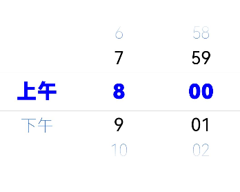
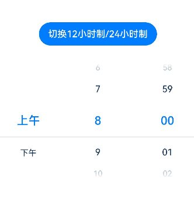
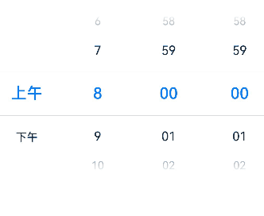

# TimePicker

时间选择组件，根据指定参数创建选择器，支持选择小时及分钟。

>  **说明：**
>
>  该组件从API Version 8开始支持。后续版本如有新增内容，则采用上角标单独标记该内容的起始版本。


## 子组件

无


## 接口

TimePicker(options?: TimePickerOptions)

默认以24小时的时间区间创建滑动选择器。

**原子化服务API：** 从API version 11开始，该接口支持在原子化服务中使用。

**系统能力：** SystemCapability.ArkUI.ArkUI.Full

**参数：**

| 参数名  | 类型                                            | 必填 | 说明                     |
| ------- | ----------------------------------------------- | ---- | ------------------------ |
| options | [TimePickerOptions](#timepickeroptions对象说明) | 否   | 配置时间选择组件的参数。 |

## TimePickerOptions对象说明

**系统能力：** SystemCapability.ArkUI.ArkUI.Full

| 名称                 | 类型                                            | 必填 | 说明                                                         |
| -------------------- | ----------------------------------------------- | ---- | ------------------------------------------------------------ |
| selected             | Date                                            | 否   | 设置选中项的时间。<br/>默认值：当前系统时间<br />从API version 10开始，该参数支持[$$](../../../quick-start/arkts-two-way-sync.md)双向绑定变量。<br/>**原子化服务API：** 从API version 11开始，该接口支持在原子化服务中使用。 |
| format<sup>11+</sup> | [TimePickerFormat](#timepickerformat11枚举说明) | 否   | 指定需要显示的TimePicker的格式。<br/>默认值：TimePickerFormat.HOUR_MINUTE <br/>**原子化服务API：** 从API version 12开始，该接口支持在原子化服务中使用。|

## TimePickerFormat<sup>11+</sup>枚举说明

**原子化服务API：** 从API version 12开始，该接口支持在原子化服务中使用。

**系统能力：** SystemCapability.ArkUI.ArkUI.Full

| 名称               | 说明                     |
| ------------------ | ------------------------ |
| HOUR_MINUTE        | 按照小时和分显示。       |
| HOUR_MINUTE_SECOND | 按照小时、分钟和秒显示。 |

## 属性

除支持[通用属性](ts-universal-attributes-size.md)外，还支持以下属性：

### useMilitaryTime

useMilitaryTime(value: Optional\<boolean>)

设置展示时间是否为24小时制。当展示时间为12小时制时，上下午与小时无联动关系。

**原子化服务API：** 从API version 11开始，该接口支持在原子化服务中使用。

**系统能力：** SystemCapability.ArkUI.ArkUI.Full

**参数：**

| 参数名 | 类型    | 必填 | 说明                                       |
| ------ | ------- | ---- | ------------------------------------------ |
| value  | [Optional](ts-universal-attributes-custom-property.md#optional12)\<boolean> | 是   | 展示时间是否为24小时制。<br/>默认值：false |

### disappearTextStyle<sup>10+</sup>

disappearTextStyle(value: Optional\<PickerTextStyle>)

设置所有选项中最上和最下两个选项的文本颜色、字号、字体粗细。

**原子化服务API：** 从API version 11开始，该接口支持在原子化服务中使用。

**系统能力：** SystemCapability.ArkUI.ArkUI.Full

**参数：**

| 参数名 | 类型                                                         | 必填 | 说明                                                         |
| ------ | ------------------------------------------------------------ | ---- | ------------------------------------------------------------ |
| value  | [Optional](ts-universal-attributes-custom-property.md#optional12)\<[PickerTextStyle](ts-basic-components-datepicker.md#pickertextstyle10类型说明)> | 是   | 所有选项中最上和最下两个选项的文本颜色、字号、字体粗细。<br/>默认值：<br/>{<br/>color: '#ff182431',<br/>font: {<br/>size: '14fp', <br/>weight: FontWeight.Regular<br/>}<br/>} |

### textStyle<sup>10+</sup>

textStyle(value: Optional\<PickerTextStyle>)

设置所有选项中除了最上、最下及选中项以外的文本颜色、字号、字体粗细。

**原子化服务API：** 从API version 11开始，该接口支持在原子化服务中使用。

**系统能力：** SystemCapability.ArkUI.ArkUI.Full

**参数：**

| 参数名 | 类型                                                         | 必填 | 说明                                                         |
| ------ | ------------------------------------------------------------ | ---- | ------------------------------------------------------------ |
| value  | [Optional](ts-universal-attributes-custom-property.md#optional12)\<[PickerTextStyle](ts-basic-components-datepicker.md#pickertextstyle10类型说明)> | 是   | 所有选项中除了最上、最下及选中项以外的文本颜色、字号、字体粗细。<br/>默认值：<br/>{<br/>color: '#ff182431',<br/>font: {<br/>size: '16fp', <br/>weight: FontWeight.Regular<br/>}<br/>} |

### selectedTextStyle<sup>10+</sup>

selectedTextStyle(value: Optional\<PickerTextStyle>)

设置选中项的文本颜色、字号、字体粗细。

**原子化服务API：** 从API version 11开始，该接口支持在原子化服务中使用。

**系统能力：** SystemCapability.ArkUI.ArkUI.Full

**参数：**

| 参数名 | 类型                                                         | 必填 | 说明                                                         |
| ------ | ------------------------------------------------------------ | ---- | ------------------------------------------------------------ |
| value  | [Optional](ts-universal-attributes-custom-property.md#optional12)\<[PickerTextStyle](ts-basic-components-datepicker.md#pickertextstyle10类型说明)> | 是   | 选中项的文本颜色、字号、字体粗细。<br/>默认值：<br/>{<br/>color: '#ff007dff',<br/>font: {<br/>size: '20vp', <br/>weight: FontWeight.Medium<br/>}<br/>} |

### loop<sup>11+</sup>

loop(value: Optional\<boolean>)

设置是否启用循环模式。

**原子化服务API：** 从API version 12开始，该接口支持在原子化服务中使用。

**系统能力：** SystemCapability.ArkUI.ArkUI.Full

**参数：**

| 参数名 | 类型    | 必填 | 说明                                                         |
| ------ | ------- | ---- | ------------------------------------------------------------ |
| value  | [Optional](ts-universal-attributes-custom-property.md#optional12)\<boolean> | 是   | 是否启用循环模式。<br/>默认值：true，true表示启用循环模式，false表示不启用循环模式。 |

### dateTimeOptions<sup>12+</sup>

dateTimeOptions(value: Optional\<DateTimeOptions>)

设置时分秒是否显示前置0。

**原子化服务API：** 从API version 12开始，该接口支持在原子化服务中使用。

**系统能力：** SystemCapability.ArkUI.ArkUI.Full

**参数：**

| 参数名 | 类型                                                         | 必填 | 说明                                                         |
| ------ | ------------------------------------------------------------ | ---- | ------------------------------------------------------------ |
| value  | [Optional](ts-universal-attributes-custom-property.md#optional12)\<[DateTimeOptions](../../apis-localization-kit/js-apis-intl.md#datetimeoptions)> | 是   | 设置时分秒是否显示前置0，目前只支持设置hour、minute和second参数。<br/>默认值：<br/>hour: 24小时制默认为"2-digit"，即有前置0；12小时制默认为"numeric"，即没有前置0。<br/>minute: 默认为"2-digit"，即有前置0。<br/>second: 默认为"2-digit"，即有前置0。<br/> |

### enableHapticFeedback<sup>12+</sup>

enableHapticFeedback(enable: Optional\<boolean>)

**原子化服务API：** 从API version 12开始，该接口支持在原子化服务中使用。

**系统能力：** SystemCapability.ArkUI.ArkUI.Full

| 参数名 | 类型                                          | 必填  | 说明                                                                                  |
| ------ | --------------------------------------------- |-----|-------------------------------------------------------------------------------------|
| enable  | [Optional](ts-universal-attributes-custom-property.md#optional12)\<boolean> | 是   | 是否支持触控反馈。<br/>默认值：true，true表示开启触控反馈，false表示不开启触控反馈。<br/>设置为true后是否生效，还取决于系统的硬件是否支持。 |

### enableCascade<sup>16+</sup>

enableCascade(enable: boolean)

在设置12小时制时，上午和下午的标识会根据小时数自动切换。

**原子化服务API：** 从API version 16开始，该接口支持在原子化服务中使用。

**系统能力：** SystemCapability.ArkUI.ArkUI.Full

| 参数名 | 类型                                          | 必填  | 说明                                                                                  |
| ------ | --------------------------------------------- |-----|-------------------------------------------------------------------------------------|
| enable  | boolean | 是   | 在12小时制时，设置上午和下午的标识是否会根据小时数自动切换。<br/>默认值：false，false表示不开启自动切换，true表示开启自动切换。<br/> |

## 事件

除支持[通用事件](ts-universal-events-click.md)外，还支持以下事件：

### onChange

onChange(callback: Optional\<OnTimePickerChangeCallback>)

滑动TimePicker后，时间选项归位至选中项位置时，触发该回调。

**原子化服务API：** 从API version 11开始，该接口支持在原子化服务中使用。

**系统能力：** SystemCapability.ArkUI.ArkUI.Full

**参数：**

| 参数名   | 类型                                                         | 必填 | 说明                   |
| -------- | ------------------------------------------------------------ | ---- | ---------------------- |
| callback | [Optional](ts-universal-attributes-custom-property.md#optional12)\<[OnTimePickerChangeCallback](#ontimepickerchangecallback16)> | 是   | 选择时间时触发该回调。 |

### onEnterSelectedArea<sup>16+</sup>

onEnterSelectedArea(callback: Callback\<TimePickerResult>)

滑动TimePicker过程中，选项进入分割线区域内，触发该回调。

与onChange事件的差别在于，该事件的触发时机早于onChange事件，当当前滑动列滑动距离超过选中项高度的一半时，选项此时已经进入分割线区域内，会触发该事件。

**原子化服务API：** 从API version 16开始，该接口支持在原子化服务中使用。

**系统能力：** SystemCapability.ArkUI.ArkUI.Full

**参数：** 

| 参数名   | 类型                       | 必填 | 说明                                       |
| -------- | -------------------------- | ---- | ------------------------------------------ |
| callback | Callback\<[TimePickerResult](#timepickerresult对象说明)> | 是   | 滑动TimePicker过程中，选项进入分割线区域时触发的回调。 |

## OnTimePickerChangeCallback<sup>16+</sup>

type OnTimePickerChangeCallback = (value: TimePickerResult) => void

选择时间时触发该事件。

**卡片能力：** 从API version 16开始，该接口支持在ArkTS卡片中使用。

**原子化服务API：** 从API version 16开始，该接口支持在原子化服务中使用。

**系统能力：** SystemCapability.ArkUI.ArkUI.Full

**参数：** 

| 参数名 | 类型                                          | 必填 | 说明           |
| ------ | --------------------------------------------- | ---- | -------------- |
| value  | [TimePickerResult](#timepickerresult对象说明) | 是   | 24小时制时间。 |

## TimePickerResult对象说明

返回值为24小时制时间。

**原子化服务API：** 从API version 11开始，该接口支持在原子化服务中使用。

**系统能力：** SystemCapability.ArkUI.ArkUI.Full

| 名称                 | 类型   | 只读 | 可选 | 说明                                |
| -------------------- | ------ | ---- | ---- | ----------------------------------- |
| hour                 | number | 否   | 否   | 选中时间的时。<br/>取值范围：[0-23] |
| minute               | number | 否   | 否   | 选中时间的分。<br/>取值范围：[0-59] |
| second<sup>11+</sup> | number | 否   | 否   | 选中时间的秒。<br/>取值范围：[0-59] |

## 示例

### 示例1（设置文本样式）

该示例通过配置disappearTextStyle、textStyle、selectedTextStyle实现文本选择器中的文本样式。

```ts
// xxx.ets
@Entry
@Component
struct TimePickerExample {
  private selectedTime: Date = new Date('2022-07-22T08:00:00')

  build() {
    TimePicker({
      selected: this.selectedTime
    })
      .disappearTextStyle({ color: '#004aaf', font: { size: 24, weight: FontWeight.Lighter } })
      .textStyle({ color: Color.Black, font: { size: 26, weight: FontWeight.Normal } })
      .selectedTextStyle({ color: Color.Blue, font: { size: 30, weight: FontWeight.Bolder } })
      .onChange((value: TimePickerResult) => {
        if (value.hour >= 0) {
          this.selectedTime.setHours(value.hour, value.minute)
          console.info('select current date is: ' + JSON.stringify(value))
        }
      })
  }
}
```



### 示例2（切换小时制）

该示例通过配置useMilitaryTime实现12小时制、24小时制的切换。

```ts
// xxx.ets
@Entry
@Component
struct TimePickerExample {
  @State isMilitaryTime: boolean = false
  private selectedTime: Date = new Date('2022-07-22T08:00:00')

  build() {
    Column() {
      Button('切换12小时制/24小时制')
        .margin(30)
        .onClick(() => {
          this.isMilitaryTime = !this.isMilitaryTime
        })

      TimePicker({
        selected: this.selectedTime
      })
        .useMilitaryTime(this.isMilitaryTime)
        .onChange((value: TimePickerResult) => {
          if (value.hour >= 0) {
            this.selectedTime.setHours(value.hour, value.minute)
            console.info('select current time is: ' + JSON.stringify(value))
          }
        })
        .onEnterSelectedArea((value: TimePickerResult) => {
            console.info('item enter selected area, time is: ' + JSON.stringify(value))
        })
    }.width('100%')
  }
}
```



### 示例3（设置时间格式）

该示例使用format、dateTimeOptions设置TimePicker时间格式。

```ts
// xxx.ets
@Entry
@Component
struct TimePickerExample {
  private selectedTime: Date = new Date('2022-07-22T08:00:00')

  build() {
    Column() {
      TimePicker({
        selected: this.selectedTime,
        format: TimePickerFormat.HOUR_MINUTE_SECOND
      })
        .dateTimeOptions({ hour: "numeric", minute: "2-digit", second: "2-digit" })
        .onChange((value: TimePickerResult) => {
          if (value.hour >= 0) {
            this.selectedTime.setHours(value.hour, value.minute)
            console.info('select current date is: ' + JSON.stringify(value))
          }
        })
    }.width('100%')
  }
}
```



### 示例4（设置循环滚动）

该示例使用loop设置TimePicker是否循环滚动。

```ts
// xxx.ets
@Entry
@Component
struct TimePickerExample {
  @State isLoop: boolean = true
  private selectedTime: Date = new Date('2022-07-22T12:00:00')

  build() {
    Column() {
      TimePicker({
        selected: this.selectedTime
      })
        .loop(this.isLoop)
        .onChange((value: TimePickerResult) => {
          if (value.hour >= 0) {
            this.selectedTime.setHours(value.hour, value.minute)
            console.info('select current date is: ' + JSON.stringify(value))
          }
        })

      Row() {
        Text('循环滚动').fontSize(20)

        Toggle({ type: ToggleType.Switch, isOn: true })
          .onChange((isOn: boolean) => {
            this.isLoop = isOn
          })
      }.position({ x: '60%', y: '40%' })

    }.width('100%')
  }
}
```


