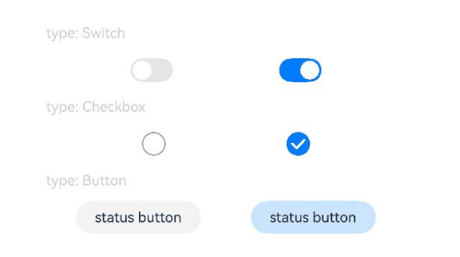
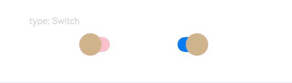
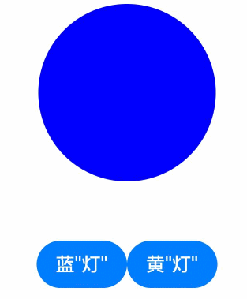

# Toggle

组件提供勾选框样式、状态按钮样式及开关样式。

>  **说明：**
>
> 该组件从API Version 8开始支持。后续版本如有新增内容，则采用上角标单独标记该内容的起始版本。

## 子组件

仅当ToggleType为Button时可包含子组件。


## 接口

Toggle(options: { type: ToggleType, isOn?: boolean })

**卡片能力：** 从API version 9开始，该接口支持在ArkTS卡片中使用。

**原子化服务API：** 从API version 11开始，该接口支持在原子化服务中使用。

**系统能力：** SystemCapability.ArkUI.ArkUI.Full

**参数:** 

| 参数名 | 类型 | 必填   | 说明           |
| ---- | ---------- | -----| -------------- |
| type | [ToggleType](#toggletype枚举说明) | 是   | 开关的样式。<br/>默认值：ToggleType.Switch |
| isOn | boolean    | 否   | 开关是否打开，true：打开，false：关闭。<br/>默认值：false<br />从API version 10开始，该参数支持[$$](../../../quick-start/arkts-two-way-sync.md)双向绑定变量。 |


## ToggleType枚举说明

**卡片能力：** 从API version 9开始，该接口支持在ArkTS卡片中使用。

**原子化服务API：** 从API version 11开始，该接口支持在原子化服务中使用。

**系统能力：** SystemCapability.ArkUI.ArkUI.Full

| 名称       | 说明               |
| -------- | ---------------- |
| Checkbox | 提供单选框样式。<br>**说明：**<br/>API version 11开始，Checkbox默认样式由圆角方形变为圆形。<br/>[通用属性margin](ts-universal-attributes-size.md#margin)的默认值为：<br>{<br>&nbsp;top: '14px',<br>&nbsp;right: '14px',<br>&nbsp;bottom: '14px',<br>&nbsp;left: '14px'<br> }。<br/>默认尺寸为:<br>{width:'20vp', height:'20vp'}。 |
| Button   | 提供状态按钮样式，如果子组件有文本设置，则相应的文本内容会显示在按钮内部。<br/>默认尺寸为:高为28vp，宽无默认值。       |
| Switch   | 提供开关样式。<br>**说明：**<br/>[通用属性margin](ts-universal-attributes-size.md#margin)默认值为：<br>{<br/>&nbsp;top: '6px',<br/>&nbsp;right: '14px',<br/>&nbsp;bottom: '6px',<br/>&nbsp;left: '14px'<br/> }。<br/>默认尺寸为:<br>{width:'36vp', height:'20vp'}。 |

## 属性

除支持[通用属性](ts-universal-attributes-size.md)外，还支持以下属性：

### selectedColor

selectedColor(value: ResourceColor)

设置组件打开状态的背景颜色。

**卡片能力：** 从API version 9开始，该接口支持在ArkTS卡片中使用。

**原子化服务API：** 从API version 11开始，该接口支持在原子化服务中使用。

**系统能力：** SystemCapability.ArkUI.ArkUI.Full

**参数：** 

| 参数名 | 类型                                       | 必填 | 说明                                                         |
| ------ | ------------------------------------------ | ---- | ------------------------------------------------------------ |
| value  | [ResourceColor](ts-types.md#resourcecolor) | 是   | 组件打开状态的背景颜色。<br/>默认值：<br/>当ToggleType为Switch时，默认值为`$r('sys.color.ohos_id_color_component_activated')`<br/>当ToggleType为Checkbox时，默认值为`$r('sys.color.ohos_id_color_component_activated')`<br/>当ToggleType为Button时，默认值为`$r('sys.color.ohos_id_color_component_activated')`混合`$r('sys.color.ohos_id_color_text_highlight_bg')`的透明度。 |

### switchPointColor

switchPointColor(color: ResourceColor)

设置Switch类型的圆形滑块颜色。仅对type为ToggleType.Switch生效。

**卡片能力：** 从API version 9开始，该接口支持在ArkTS卡片中使用。

**原子化服务API：** 从API version 11开始，该接口支持在原子化服务中使用。

**系统能力：** SystemCapability.ArkUI.ArkUI.Full

**参数：** 

| 参数名 | 类型                                       | 必填 | 说明                       |
| ------ | ------------------------------------------ | ---- | -------------------------- |
| color  | [ResourceColor](ts-types.md#resourcecolor) | 是   | Switch类型的圆形滑块颜色。<br/>默认值：$r('sys.color.ohos_id_color_foreground_contrary') |

### switchStyle<sup>12+</sup>

switchStyle(value: SwitchStyle)

设置Switch类型的样式。仅对type为ToggleType.Switch生效。

**原子化服务API：** 从API version 12开始，该接口支持在原子化服务中使用。

**系统能力：** SystemCapability.ArkUI.ArkUI.Full

**参数：** 

| 参数名 | 类型                                  | 必填 | 说明             |
| ------ | ------------------------------------- | ---- | ---------------- |
| value  | [SwitchStyle](#switchstyle12对象说明) | 是   | Switch样式风格。 |

### contentModifier<sup>12+</sup>

contentModifier(modifier: ContentModifier\<ToggleConfiguration>)

定制Toggle内容区的方法。

**原子化服务API：** 从API version 12开始，该接口支持在原子化服务中使用。

**系统能力：** SystemCapability.ArkUI.ArkUI.Full

**参数：**

| 参数名 | 类型                                          | 必填 | 说明                                             |
| ------ | --------------------------------------------- | ---- | ------------------------------------------------ |
| modifier  | [ContentModifier\<ToggleConfiguration>](#toggleconfiguration12对象说明) | 是   | 在Toggle组件上，定制内容区的方法。<br/>modifier: 内容修改器，开发者需要自定义class实现ContentModifier接口。 |

## SwitchStyle<sup>12+</sup>对象说明

**原子化服务API：** 从API version 12开始，该接口支持在原子化服务中使用。

**系统能力：** SystemCapability.ArkUI.ArkUI.Full

| 名称              | 类型                                        | 必填 | 说明                                                         |
| ----------------- | ------------------------------------------- | ---- | ------------------------------------------------------------ |
| pointRadius       | number \|  [Resource](ts-types.md#resource) | 否   | 设置Switch类型的圆形滑块半径。<br />**说明：**<br/>不支持百分比，设定值小于0时按照默认算法设置，设定值大于等于0时按照设定值设置。<br/>未设定此属性时，圆形滑块半径根据默认算法设置。<br/>默认算法：（组件高度（单位：vp） / 2） - （2vp * 组件高度（单位：vp） / 20vp）。 |
| unselectedColor   | [ResourceColor](ts-types.md#resourcecolor)  | 否   | 设置Switch类型关闭状态的背景颜色。<br />默认值：0x337F7F7F。 |
| pointColor        | [ResourceColor](ts-types.md#resourcecolor)  | 否   | 设置Switch类型的圆形滑块颜色。<br />默认值：$r('sys.color.ohos_id_color_foreground_contrary') |
| trackBorderRadius | number \|  [Resource](ts-types.md#resource) | 否   | 设置Switch类型的滑轨的圆角。<br />**说明：**<br/>不支持百分比，设定值小于0时按照默认算法设置，设定值大于组件高度一半时按照组件高度一半设置，其他场合按照设定值设置。<br/>未设定此属性时，滑轨圆角根据默认算法设置。<br/>默认算法：组件高度（单位：vp） / 2。 |

## 事件

除支持[通用事件](ts-universal-events-click.md)外，还支持以下事件：

### onChange

onChange(callback:&nbsp;(isOn:&nbsp;boolean)&nbsp;=&gt;&nbsp;void)

开关状态切换时触发该事件。

**卡片能力：** 从API version 9开始，该接口支持在ArkTS卡片中使用。

**原子化服务API：** 从API version 11开始，该接口支持在原子化服务中使用。

**系统能力：** SystemCapability.ArkUI.ArkUI.Full

**参数：** 

| 参数名 | 类型    | 必填 | 说明                                                         |
| ------ | ------- | ---- | ------------------------------------------------------------ |
| isOn   | boolean | 是   | 为true时，代表状态从关切换为开。false时，代表状态从开切换为关。 |

## ToggleConfiguration<sup>12+</sup>对象说明

开发者需要自定义class实现ContentModifier接口。

**原子化服务API：** 从API version 12开始，该接口支持在原子化服务中使用。

**系统能力：** SystemCapability.ArkUI.ArkUI.Full

| 名称  | 类型    |    只读    |    可选    |  说明              |
| ------ | ------ | ------ |-------------------------------- |-------------------------------- |
| isOn   | boolean| 否  | 否 | 开关是否打开。<br/>默认值：false |
| enabled | boolean | 否 | 否 | 是否可以切换状态。 |
| triggerChange |Callback\<boolean>| 否 | 否 |触发switch选中状态变化。 |


## 示例

### 示例1

```ts
// xxx.ets
@Entry
@Component
struct ToggleExample {
  build() {
    Column({ space: 10 }) {
      Text('type: Switch').fontSize(12).fontColor(0xcccccc).width('90%')
      Flex({ justifyContent: FlexAlign.SpaceEvenly, alignItems: ItemAlign.Center }) {
        Toggle({ type: ToggleType.Switch, isOn: false })
          .selectedColor('#007DFF')
          .switchPointColor('#FFFFFF')
          .onChange((isOn: boolean) => {
            console.info('Component status:' + isOn)
          })

        Toggle({ type: ToggleType.Switch, isOn: true })
          .selectedColor('#007DFF')
          .switchPointColor('#FFFFFF')
          .onChange((isOn: boolean) => {
            console.info('Component status:' + isOn)
          })
      }

      Text('type: Checkbox').fontSize(12).fontColor(0xcccccc).width('90%')
      Flex({ justifyContent: FlexAlign.SpaceEvenly, alignItems: ItemAlign.Center }) {
        Toggle({ type: ToggleType.Checkbox, isOn: false })
          .size({ width: 20, height: 20 })
          .selectedColor('#007DFF')
          .onChange((isOn: boolean) => {
            console.info('Component status:' + isOn)
          })

        Toggle({ type: ToggleType.Checkbox, isOn: true })
          .size({ width: 20, height: 20 })
          .selectedColor('#007DFF')
          .onChange((isOn: boolean) => {
            console.info('Component status:' + isOn)
          })
      }

      Text('type: Button').fontSize(12).fontColor(0xcccccc).width('90%')
      Flex({ justifyContent: FlexAlign.SpaceEvenly, alignItems: ItemAlign.Center }) {
        Toggle({ type: ToggleType.Button, isOn: false }) {
          Text('status button').fontColor('#182431').fontSize(12)
        }.width(106)
        .selectedColor('rgba(0,125,255,0.20)')
        .onChange((isOn: boolean) => {
          console.info('Component status:' + isOn)
        })

        Toggle({ type: ToggleType.Button, isOn: true }) {
          Text('status button').fontColor('#182431').fontSize(12)
        }.width(106)
        .selectedColor('rgba(0,125,255,0.20)')
        .onChange((isOn: boolean) => {
          console.info('Component status:' + isOn)
        })
      }
    }.width('100%').padding(24)
  }
}
```



### 示例2

该示例实现了自定义设置Toggle组件Switch样式的圆形滑块半径、关闭状态的背景颜色、圆形滑块颜色、滑轨的圆角。

```ts
// xxx.ets
@Entry
@Component
struct ToggleExample {
  build() {
    Column({ space: 10 }) {
      Text('type: Switch').fontSize(12).fontColor(0xcccccc).width('90%')
      Flex({ justifyContent: FlexAlign.SpaceEvenly, alignItems: ItemAlign.Center }) {
        Toggle({ type: ToggleType.Switch, isOn: false })
          .selectedColor('#007DFF')
          .switchStyle({
            pointRadius: 15,
            trackBorderRadius: 10,
            pointColor: '#D2B48C',
            unselectedColor: Color.Pink })
          .onChange((isOn: boolean) => {
            console.info('Component status:' + isOn)
          })

        Toggle({ type: ToggleType.Switch, isOn: true })
          .selectedColor('#007DFF')
          .switchStyle({
            pointRadius: 15,
            trackBorderRadius: 10,
            pointColor: '#D2B48C',
            unselectedColor: Color.Pink })
          .onChange((isOn: boolean) => {
            console.info('Component status:' + isOn)
          })
      }
    }.width('100%').padding(24)
  }
}
```



### 示例3

该示例实现了自定义Toggle样式的功能。自定义样式实现了通过按钮切换圆形颜色的功能：点击蓝圆按钮，圆形背景变蓝色，点击黄圆按钮，圆形背景变黄色。

```ts
// xxx.ets
class MySwitchStyle implements ContentModifier<ToggleConfiguration> {
  selectedColor: Color = Color.White
  lamp: string = 'string';
  constructor(selectedColor: Color, lamp: string) {
    this.selectedColor = selectedColor
    this.lamp = lamp;
  }
  applyContent() : WrappedBuilder<[ToggleConfiguration]>
  {
    return wrapBuilder(buildSwitch)
  }
}
@Builder function buildSwitch(config: ToggleConfiguration) {
  Column({ space: 50 }) {
    Circle({ width: 150, height: 150 })
      .fill(config.isOn ? (config.contentModifier as MySwitchStyle).selectedColor : Color.Blue)
    Row() {
      Button('蓝'+ JSON.stringify((config.contentModifier as MySwitchStyle).lamp))
        .onClick(() => {
          config.triggerChange(false);
        })
      Button('黄'+ JSON.stringify((config.contentModifier as MySwitchStyle).lamp))
        .onClick(() => {
          config.triggerChange(true);
        })
    }
  }
}

@Entry
@Component
struct Index {
  build() {
    Column({ space: 50 }) {
      Toggle({ type: ToggleType.Switch})
        .enabled(true)
        .contentModifier(new MySwitchStyle(Color.Yellow, '灯'))
        .onChange((isOn: boolean) => {
          console.info('Switch Log:' + isOn)
        })
    }.height('100%').width('100%')
  }
}
```


