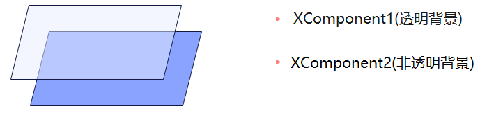
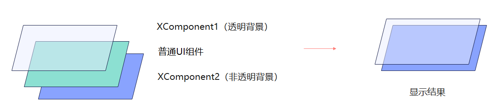
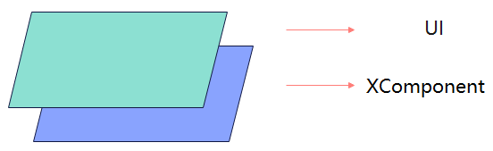

# XComponent
<!--Kit: ArkUI-->
<!--Subsystem: ArkUI-->
<!--Owner: @zjsxstar-->
<!--Designer: @sunbees-->
<!--Tester: @liuli0427-->
<!--Adviser: @HelloCrease-->

提供用于图形绘制和媒体数据写入的Surface，XComponent负责将其嵌入到视图中，支持应用自定义Surface位置和大小。

> **说明：**
>
> 该组件从API Version 8 开始支持。后续版本如有新增内容，则采用上角标单独标记该内容的起始版本。
>
> 当前页面仅包含本模块的系统接口，其他公开接口参见[XComponent](ts-basic-components-xcomponent.md)。

## 接口

### XComponentOptions12+

定义XComponent的具体配置参数。

**系统能力：** SystemCapability.ArkUI.ArkUI.Full

**参数：**

| 名称 | 类型 | 只读 | 可选 | 说明 |
| -------- | -------- | -------- | -------- | -------- |
| screenId17+ | number | 否 | 是 | 给组件设置关联屏幕ID，通过此项可在组件上显示关联屏幕画面。 **系统接口：** 此接口为系统接口。|

  > **说明：**
  >
  > 仅type为SURFACE时有效。
  >
  > 不支持[ArkUI NDK接口](../../../ui/ndk-build-ui-overview.md)创建的XComponent组件。

## 属性

### enableTransparentLayer18+

enableTransparentLayer(enabled: boolean)

当背景颜色设置半透明的XComponent需要开启独立图层时，使用本接口。

使用本接口，并不代表一定会被设置为独立图层。出于一些原因：硬件规格（如：硬件不支持独立图层进行硬件合成）、软件规格（如：独立图层与带模糊ui相交），将导致开发者希望半透明XComponent设置为独立图层却失效的结果。

由于绘制独立图层的原理，使用本接口时需要按照以下要求使用，否则会出现显示问题。

1.当设置了独立图层的XComponent下方有相交的XComponent时，下方的XComponent也应该设置为独立图层。

2.在设置独立图层接口带透明背景的XComponent下方摆放UI组件会发生显示问题，在合成时会出现UI组件显示内容消失的异常。

设置了独立图层接口的XComponent需要在所有与其相交的UI元素下方。

3.在布局静态的场景下对带透明背景XComponent设置独立图层，布局静态场景例如：非页面跳转场景、视频弹幕静置播放场景。

**系统API：** 从API version 18开始，该接口支持在系统中使用。

**系统能力：** SystemCapability.ArkUI.ArkUI.Full

**参数：**

| 参数名   | 类型     | 必填 | 说明                   |
| ------- | ------- | ---- | ---------------------- |
| enabled | boolean | 是   | 是否开启组件背景透明状态下的独立图层。 true：开启独立图层；false：关闭独立图层。 默认值：false |

  > **说明：**
  >
  > 仅type为SURFACE时有效。
  >
  > 不支持[ArkUI NDK接口](../../../ui/ndk-build-ui-overview.md)创建的XComponent组件。