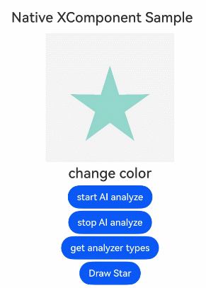

# XComponent
<!--Kit: ArkUI-->
<!--Subsystem: ArkUI-->
<!--Owner: @zjsxstar-->
<!--Designer: @sunbees-->
<!--Tester: @liuli0427-->
<!--Adviser: @HelloCrease-->

提供用于图形绘制和媒体数据写入的[Surface](../../../ui/napi-xcomponent-guidelines.md#概述)，XComponent负责将其嵌入到视图中，支持应用自定义Surface位置和大小。具体指南请参考[自定义渲染 (XComponent)文档](../../../ui/napi-xcomponent-guidelines.md)。

> **说明：**
>
> 该组件从API version 8 开始支持。后续版本如有新增内容，则采用上角标单独标记该内容的起始版本。


## 子组件
无

## 接口

### XComponent<sup>19+</sup>

XComponent(params: NativeXComponentParameters)

在Native侧获取XComponent节点实例、注册XComponent持有的Surface的生命周期回调和触摸、鼠标、按键等组件事件回调。

**原子化服务API：** 从API version 19开始，该接口支持在原子化服务中使用。

**系统能力：** SystemCapability.ArkUI.ArkUI.Full

**参数：**

| 参数名  | 类型                                | 必填 | 说明                           |
| ------- | --------------------------------------- | ---- | ------------------------------ |
| params | [NativeXComponentParameters](#nativexcomponentparameters19) | 是   | 定义XComponent的具体配置参数。 |

### XComponent<sup>12+</sup>

XComponent(options: XComponentOptions)

创建XComponent组件，支持在ArkTS侧获取SurfaceId、注册XComponent持有的Surface的生命周期回调和触摸、鼠标、按键等组件事件回调，支持AI分析。

**原子化服务API：** 从API version 12开始，该接口支持在原子化服务中使用。

**系统能力：** SystemCapability.ArkUI.ArkUI.Full

**参数：**

| 参数名  | 类型                                | 必填 | 说明                           |
| ------- | --------------------------------------- | ---- | ------------------------------ |
| options | [XComponentOptions](#xcomponentoptions12) | 是   | 定义XComponent的具体配置参数。 |

### XComponent<sup>10+</sup>

XComponent(value: {id: string, type: XComponentType, libraryname?: string, controller?: XComponentController})

创建XComponent组件，支持Native侧触发XComponent生命周期回调。

该接口从API version 12开始不再演进，推荐使用[XComponent(options: XComponentOptions)](#xcomponent12)。

**原子化服务API：** 从API version 12开始，该接口支持在原子化服务中使用。

**系统能力：** SystemCapability.ArkUI.ArkUI.Full

**参数：** 

| 参数名      | 类型                                      | 必填 | 说明                                                         |
| ----------- | --------------------------------------------- | ---- | ------------------------------------------------------------ |
| id          | string                                        | 是   | 组件的唯一标识，支持最大的字符串长度128。                    |
| type        | [XComponentType](ts-appendix-enums.md#xcomponenttype10)   | 是   | 用于指定XComponent组件类型。                                 |
| libraryname | string                                        | 否   | 用Native层编译输出动态库名称（对应的动态库不支持跨模块加载），仅类型为SURFACE或TEXTURE时有效。 |
| controller  | [XComponentController](#xcomponentcontroller) | 否   | 给组件绑定一个控制器，通过控制器调用组件方法，仅类型为SURFACE或TEXTURE时有效。 |

### XComponent<sup>(deprecated)</sup>

XComponent(value: {id: string, type: string, libraryname?: string, controller?: XComponentController})

**说明：**

从API version 12开始废弃，建议使用[XComponent(options: XComponentOptions)](#xcomponent12)替代。

**系统能力：** SystemCapability.ArkUI.ArkUI.Full

**参数：** 

| 参数名      | 类型                                      | 必填 | 说明                                                         |
| ----------- | --------------------------------------------- | ---- | ------------------------------------------------------------ |
| id          | string                                        | 是   | 组件的唯一标识，支持最大的字符串长度128。                    |
| type        | string                                        | 是   | 用于指定XComponent组件类型，可选值仅有两个为：<br/>-"surface"：用于EGL/OpenGLES和媒体数据写入，开发者定制的绘制内容单独展示到屏幕上。<br/>-"component"<sup>9+</sup> ：XComponent将变成一个容器组件，并可在其中执行非UI逻辑以动态加载显示内容。<br/>其他值均会被视为"surface"类型 |
| libraryname | string                                        | 否   | 应用Native层编译输出动态库名称（对应的动态库不支持跨模块加载），仅XComponent类型为"surface"时有效。 |
| controller  | [XComponentcontroller](#xcomponentcontroller) | 否   | 给组件绑定一个控制器，通过控制器调用组件方法，仅XComponent类型为"surface"时有效。 |

## XComponentOptions<sup>12+</sup>

定义XComponent的具体配置参数。

**原子化服务API：** 从API version 12开始，该接口支持在原子化服务中使用。

**系统能力：** SystemCapability.ArkUI.ArkUI.Full

| 名称 | 类型 | 只读 | 可选 | 说明 |
| -------- | -------- | -------- | -------- | -------- |
| type | [XComponentType](ts-appendix-enums.md#xcomponenttype10)         | 否 | 否   | 用于指定XComponent组件类型。 |
| controller | [XComponentController](#xcomponentcontroller) | 否 | 否 | 给组件绑定一个控制器，通过控制器调用组件方法，仅类型为SURFACE或TEXTURE时有效。 |
| imageAIOptions | [ImageAIOptions](ts-image-common.md#imageaioptions12) | 否 | 是 | 给组件设置一个AI分析选项，通过此项可配置分析类型或绑定一个分析控制器。 |

## NativeXComponentParameters<sup>19+</sup>

定义XComponent的具体配置参数。通过这种构造参数创建的XComponent，可以将其对应的[FrameNode](../js-apis-arkui-frameNode.md)对象传递至Native侧，使用NDK接口进行Surface生命周期的相关设置和[监听组件事件](../../../ui/ndk-listen-to-component-events.md)。

**原子化服务API：** 从API version 19开始，该接口支持在原子化服务中使用。

**系统能力：** SystemCapability.ArkUI.ArkUI.Full

| 名称 | 类型 | 只读 | 可选 | 说明 |
| -------- | -------- | -------- | -------- | -------- |
| type | [XComponentType](ts-appendix-enums.md#xcomponenttype10)         | 否 | 否   | 用于指定XComponent组件类型。 |
| imageAIOptions | [ImageAIOptions](ts-image-common.md#imageaioptions12) | 否 | 是 | 给组件设置一个AI分析选项，通过此项可配置分析类型或绑定一个分析控制器。 |

## 属性
除支持通用属性外，还支持以下属性：
  > 
  > **说明：**
  >
  > 不支持foregroundColor、obscured和pixelStretchEffect属性，并且type为SURFACE类型时也不支持动态属性设置、自定义绘制、背景设置(backgroundColor除外)、图像效果(shadow除外)、maskShape和foregroundEffect属性。
  >
  > 对于TEXTURE和SURFACE类型的XComponent组件，当不设置[renderFit](./ts-universal-attributes-renderfit.md)属性时，取默认值为RenderFit.RESIZE_FILL。
  > 
  > 对于SURFACE类型的XComponent组件，背景色设置为不透明的纯黑色，在API version 18之前，其[renderFit](./ts-universal-attributes-renderfit.md)通用属性仅支持设置为RenderFit.RESIZE_FILL；在API version 18及之后，支持所有的RenderFit枚举值。
  > 
  > 对于使用[ArkUI NDK接口](../../../ui/ndk-access-the-arkts-page.md)创建的XComponent组件，不支持使用属性获取函数[getAttribute](../capi-arkui-nativemodule-arkui-nativenodeapi-1.md#getattribute)获取其renderFit属性值。
  
### enableAnalyzer<sup>12+</sup>

enableAnalyzer(enable: boolean)

设置组件支持AI分析，当前支持主体识别、文字识别和对象查找等功能。
本功能需要搭配XComponentController的[StartImageAnalyzer](#startimageanalyzer12)和[StopImageAnalyzer](#stopimageanalyzer12)一起使用。
不能和[overlay](ts-universal-attributes-overlay.md)属性同时使用，两者同时设置时overlay中CustomBuilder属性将失效。该特性依赖设备能力。

**原子化服务API：** 从API version 12开始，该接口支持在原子化服务中使用。

**系统能力：** SystemCapability.ArkUI.ArkUI.Full

**参数：**

| 参数名 | 类型 | 必填 | 说明 |
| -------- | -------- | -------- | -------- |
| enable | boolean | 是 | 是否启用图像分析功能。<br/>true：开启图像分析；false：关闭图像分析。<br/>默认值：false |

  > **说明：**
  >
  > 仅type为SURFACE和TEXTURE时该功能有效。

### enableSecure<sup>13+</sup>

enableSecure(isSecure: boolean)

防止组件内自绘制内容被截屏、录屏。

**原子化服务API：** 从API version 13开始，该接口支持在原子化服务中使用。

**系统能力：** SystemCapability.ArkUI.ArkUI.Full

**参数：**

| 参数名   | 类型    | 必填 | 说明                   |
| -------- | ------- | ---- | ---------------------- |
| isSecure | boolean | 是   | 是否开启隐私图层模式。<br/>true：开启隐私图层模式；false：关闭隐私图层模式。<br/>默认值：false |

  > **说明：**
  >
  > 仅type为SURFACE时有效。
  >
  > 不支持[ArkUI NDK接口](../../../ui/ndk-build-ui-overview.md)创建的XComponent组件。

### hdrBrightness<sup>20+</sup>

hdrBrightness(brightness: number)

用于调整组件播放HDR视频的亮度。

**原子化服务API：** 从API version 20开始，该接口支持在原子化服务中使用。

**系统能力：** SystemCapability.ArkUI.ArkUI.Full

**参数：**

| 参数名   | 类型    | 必填 | 说明                   |
| -------- | ------- | ---- | ---------------------- |
| brightness | number | 是   | 用于调整组件播放HDR视频的亮度; brightness的取值范围为0.0~1.0; 小于0.0的值等价于0.0，大于1.0的值等价于1.0，异常值按1.0处理; 0.0 表示SDR视频的亮度，1.0 表示HDR视频的亮度。<br/>默认值：1.0 |

  > **说明：**
  >
  > 仅type为SURFACE时有效。
  >
  > 不支持[ArkUI NDK接口](../../../ui/ndk-build-ui-overview.md)创建的XComponent组件。

## 事件

从API version 12开始，type为SURFACE或TEXTURE时，支持[通用事件](ts-component-general-events.md)。

> **说明：** 
>
> 当配置libraryname参数时，[点击事件](ts-universal-events-click.md)、[触摸事件](ts-universal-events-touch.md)、[挂载卸载事件](ts-universal-events-show-hide.md)、[按键事件](ts-universal-events-key.md)、[焦点事件](ts-universal-focus-event.md)、[鼠标事件](ts-universal-mouse-key.md)仅响应C-API侧事件接口。

仅type为SURFACE或TEXTURE时以下事件有效：

### onLoad

onLoad(callback: OnNativeLoadCallback )

插件加载完成时回调事件。

**原子化服务API：** 从API version 12开始，该接口支持在原子化服务中使用。

**系统能力：** SystemCapability.ArkUI.ArkUI.Full

**参数：**

| 参数名   | 类型   | 必填   | 说明                                       |
| ----- | ------ | ---- | ---------------------------------------- |
| callback | [OnNativeLoadCallback](#onnativeloadcallback18) | 是    | XComponent持有的Surface创建后回调事件。 |

### onDestroy

onDestroy(event: VoidCallback )

插件卸载完成时回调事件。

**原子化服务API：** 从API version 12开始，该接口支持在原子化服务中使用。

**系统能力：** SystemCapability.ArkUI.ArkUI.Full

**参数：**

| 参数名   | 类型   | 必填   | 说明                                       |
| ----- | ------ | ---- | ---------------------------------------- |
| event | [VoidCallback](ts-types.md#voidcallback12) | 是    | XComponent销毁后回调事件。 |

## OnNativeLoadCallback<sup>18+</sup>

type OnNativeLoadCallback = (event?: object) =\> void

XComponent持有的Surface创建后回调事件。

**原子化服务API：** 从API version 18开始，该接口支持在原子化服务中使用。

**系统能力：** SystemCapability.ArkUI.ArkUI.Full

**参数：**

| 参数名   | 类型   | 必填   | 说明                                       |
| ----- | ------ | ---- | ---------------------------------------- |
| event | object | 否    | 获取XComponent实例对象的context，context上挂载的方法由开发者在Native层定义。 |

## XComponentController

XComponent组件的控制器，可以将此对象绑定至XComponent组件，然后通过控制器来调用组件方法。

**原子化服务API：** 从API version 12开始，该接口支持在原子化服务中使用。

**系统能力：** SystemCapability.ArkUI.ArkUI.Full

### constructor

constructor()

XComponentController的构造函数。

```ts
xcomponentController: XComponentController = new XComponentController();
```

**原子化服务API：** 从API version 12开始，该接口支持在原子化服务中使用。

**系统能力：** SystemCapability.ArkUI.ArkUI.Full

### getXComponentSurfaceId<sup>9+</sup>

getXComponentSurfaceId(): string

获取XComponent对应Surface的ID，仅XComponent类型为SURFACE("surface")或TEXTURE时有效。

**原子化服务API：** 从API version 12开始，该接口支持在原子化服务中使用。

**系统能力：** SystemCapability.ArkUI.ArkUI.Full

**返回值：**

| 类型     | 说明                      |
| ------ | ----------------------- |
| string | XComponent持有Surface的ID。 |

> **说明：**
> 
> 使用自定义组件节点创建XComponent组件时，因为onLoad回调触发时机早于[onSurfaceCreated](#onsurfacecreated12)，所以在onLoad回调中调用[getXComponentSurfaceId](#getxcomponentsurfaceid9)获取surfaceId会失败，建议在[onSurfaceCreated](#onsurfacecreated12)回调中获取。

**示例：**

  ```ts
  // xxx.ets
  @Entry
  @Component
  struct Index {
    myXComponentController: XComponentController = new XComponentController();

    build() {
      Flex({ direction: FlexDirection.Column, alignItems: ItemAlign.Center, justifyContent: FlexAlign.Center }) {
        XComponent({
          type: XComponentType.SURFACE,
          controller: this.myXComponentController
        })
          .onLoad(() => {
            let surfaceId: string = this.myXComponentController.getXComponentSurfaceId();
            console.log("XComponent SurfaceId: " + surfaceId);
          })
      }
    }
  }
  ```

### setXComponentSurfaceSize<sup>(deprecated)</sup>

setXComponentSurfaceSize(value: {surfaceWidth: number, surfaceHeight: number}): void

设置XComponent持有Surface的宽度和高度，仅XComponent类型为SURFACE("surface")或TEXTURE时有效。

该接口从API version 12开始废弃，建议使用[setXComponentSurfaceRect](#setxcomponentsurfacerect12)替代。

**系统能力：** SystemCapability.ArkUI.ArkUI.Full

**参数：**

| 参数名           | 类型   | 必填   | 说明                      |
| ------------- | ------ | ---- | ----------------------- |
| surfaceWidth  | number | 是    | XComponent持有Surface的宽度。 |
| surfaceHeight | number | 是    | XComponent持有Surface的高度。 |


### getXComponentContext

getXComponentContext(): Object

获取XComponent实例对象的context，仅XComponent类型为SURFACE("surface")或TEXTURE时有效。

**原子化服务API：** 从API version 12开始，该接口支持在原子化服务中使用。

**系统能力：** SystemCapability.ArkUI.ArkUI.Full

**返回值：**

| 类型   | 说明                                                         |
| ------ | ------------------------------------------------------------ |
| Object | 获取XComponent实例对象的context，context包含的具体接口方法由开发者自定义，context内容与onLoad回调中的第一个参数一致。 |

### setXComponentSurfaceRect<sup>12+</sup>

setXComponentSurfaceRect(rect: SurfaceRect): void

设置XComponent持有Surface的显示区域，包括宽高和相对于组件左上角的位置坐标，仅XComponent类型为SURFACE("surface")或TEXTURE时有效。

**原子化服务API：** 从API version 12开始，该接口支持在原子化服务中使用。

**系统能力：** SystemCapability.ArkUI.ArkUI.Full

**参数：**

| 参数名 | 类型                             | 必填 | 说明                              |
| ------ | ------------------------------------ | ---- | --------------------------------- |
| rect   | [SurfaceRect](#surfacerect12对象说明) | 是   | XComponent持有Surface的显示区域。 |

> **说明：**
>
> rect参数中的offsetX/offsetY不设置或传入异常值时，Surface显示区域相对于XComponent左上角x/y轴的偏移效果默认按照居中显示。
>
> rect参数中的surfaceWidth和surfaceHeight存在0、负数或其他异常值时，调用该接口设置显示区域不生效。未调用该接口主动设置Surface显示区域时，surfaceWidth默认与组件宽度一致，surfaceHeight默认与组件高度一致。
>
> 该方法优先级高于[border](ts-universal-attributes-border.md#border)、[padding](ts-universal-attributes-size.md#padding)等可以改变内容偏移和大小的属性。

### getXComponentSurfaceRect<sup>12+</sup>

getXComponentSurfaceRect(): SurfaceRect

获取XComponent持有Surface的显示区域，包括宽高和相对于组件左上角的位置坐标，仅XComponent类型为SURFACE("surface")或TEXTURE时有效。

**原子化服务API：** 从API version 12开始，该接口支持在原子化服务中使用。

**系统能力：** SystemCapability.ArkUI.ArkUI.Full

**返回值：**

| 类型                                 | 说明                                  |
| ------------------------------------ | ------------------------------------- |
| [SurfaceRect](#surfacerect12对象说明) | 获取XComponent持有Surface的显示区域。 |

### onSurfaceCreated<sup>12+</sup>

onSurfaceCreated(surfaceId: string): void

当XComponent持有的Surface创建后进行该回调，仅XComponent类型为SURFACE("surface")或TEXTURE时有效。

**原子化服务API：** 从API version 12开始，该接口支持在原子化服务中使用。

**系统能力：** SystemCapability.ArkUI.ArkUI.Full

**参数：**

| 参数名    | 类型 | 必填 | 说明                                              |
| --------- | -------- | ---- | ------------------------------------------------- |
| surfaceId | string   | 是   | 回调该方法的时候，绑定XComponent持有Surface的ID。 |

> **说明：**
>
> 仅当XComponent组件未设置libraryname参数时，会进行该回调。

### onSurfaceChanged<sup>12+</sup>

onSurfaceChanged(surfaceId: string, rect: SurfaceRect): void

当XComponent持有的Surface大小改变后（包括首次创建时的大小改变）进行该回调，仅XComponent类型为SURFACE("surface")或TEXTURE时有效。

**原子化服务API：** 从API version 12开始，该接口支持在原子化服务中使用。

**系统能力：** SystemCapability.ArkUI.ArkUI.Full

**参数：**

| 参数名    | 类型                              | 必填 | 说明                                                    |
| --------- | ------------------------------------- | ---- | ------------------------------------------------------- |
| surfaceId | string                                | 是   | 回调该方法的时候，绑定XComponent持有Surface的ID。       |
| rect      | [SurfaceRect](#surfacerect12对象说明) | 是   | 回调该方法的时候，绑定XComponent持有Surface的显示区域。 |

> **说明：**
>
> 仅当XComponent组件未设置libraryname参数时，会进行该回调。

### onSurfaceDestroyed<sup>12+</sup>

onSurfaceDestroyed(surfaceId: string): void

当XComponent持有的Surface销毁后进行该回调，仅XComponent类型为SURFACE("surface")或TEXTURE时有效。

**原子化服务API：** 从API version 12开始，该接口支持在原子化服务中使用。

**系统能力：** SystemCapability.ArkUI.ArkUI.Full

**参数：**

| 参数名    | 类型 | 必填 | 说明                                              |
| --------- | -------- | ---- | ------------------------------------------------- |
| surfaceId | string   | 是   | 回调该方法的时候，绑定XComponent持有Surface的ID。 |

> **说明：**
>
> 仅当XComponent组件未设置libraryname参数时，会进行该回调。

### startImageAnalyzer<sup>12+</sup>

startImageAnalyzer(config: ImageAnalyzerConfig): Promise\<void>

配置AI分析并启动AI分析功能，使用前需先[启用图像AI分析能力](#enableanalyzer12)。<br>该方法调用时，将截取调用时刻的画面帧进行分析，使用时需注意启动分析的时机，避免出现画面和分析内容不一致的情况。<br>若该方法尚未执行完毕，此时重复调用，则会触发错误回调。

> **说明：**
> 
> 分析类型不支持动态修改。
> 该特性依赖设备能力，不支持该能力的情况下，将返回错误码。

**原子化服务API：** 从API version 12开始，该接口支持在原子化服务中使用。

**系统能力：** SystemCapability.ArkUI.ArkUI.Full

**参数：**

| 参数名 | 类型      | 必填 | 说明                                                                   |
| ------ | --------- | ---- | ---------------------------------------------------------------------- |
| config   | [ImageAnalyzerConfig](ts-image-common.md#imageanalyzerconfig12) | 是   | 执行AI分析所需要的入参，用于配置AI分析功能。 |

**返回值：**

| 类型              | 说明                                 |
| ----------------- | ------------------------------------ |
| Promise\<void>  | Promise对象，用于获取AI分析是否成功执行。 |

**错误码：**

以下错误码的详细介绍请参见[AI分析类库错误码](errorcode-image-analyzer.md)。

| 错误码ID | 错误信息                                      |
| -------- | -------------------------------------------- |
| 110001 | Image analysis feature is unsupported.               |
| 110002 | Image analysis is currently being executed.  |
| 110003 | Image analysis is stopped.  |

### stopImageAnalyzer<sup>12+</sup>

stopImageAnalyzer(): void

停止AI分析功能，AI分析展示的内容将被销毁。

> **说明：**
> 
> 在startImageAnalyzer方法未返回结果时调用本方法，会触发其错误回调。
> 该特性依赖设备能力。

**原子化服务API：** 从API version 12开始，该接口支持在原子化服务中使用。

**系统能力：** SystemCapability.ArkUI.ArkUI.Full

### setXComponentSurfaceRotation<sup>12+</sup>

setXComponentSurfaceRotation(rotationOptions: SurfaceRotationOptions): void

设置XComponent持有Surface在屏幕旋转时是否锁定方向，仅XComponent类型为SURFACE("surface")时有效。

**原子化服务API：** 从API version 12开始，该接口支持在原子化服务中使用。

**系统能力：** SystemCapability.ArkUI.ArkUI.Full

**参数：**

| 参数名 | 类型                             | 必填 | 说明                              |
| ------ | ------------------------------------ | ---- | --------------------------------- |
| rotationOptions   | [SurfaceRotationOptions](#surfacerotationoptions12对象说明) | 是 | 设置XComponent持有Surface在屏幕旋转时是否锁定方向。 |

> **说明：**
>
> rotationOptions未配置时，默认XComponent持有Surface在屏幕旋转时不锁定方向，跟随屏幕进行旋转。
>
> 仅在屏幕旋转过程中生效，旋转完成后不再锁定Surface。
>
> 仅在屏幕旋转90°，即发生横竖屏切换时生效。
>
> 锁定旋转后的Buffer宽高需要保持不变，否则会有拉伸问题。

### getXComponentSurfaceRotation<sup>12+</sup>

getXComponentSurfaceRotation(): Required\<SurfaceRotationOptions>

获取XComponent持有Surface在屏幕旋转时是否锁定方向的设置，仅XComponent类型为SURFACE("surface")时有效。

**原子化服务API：** 从API version 12开始，该接口支持在原子化服务中使用。

**系统能力：** SystemCapability.ArkUI.ArkUI.Full

**返回值：**

| 类型                                 | 说明                                  |
| ------------------------------------ | ------------------------------------- |
| Required<[SurfaceRotationOptions](#surfacerotationoptions12对象说明)> | 获取XComponent持有Surface在屏幕旋转时是否锁定方向的设置。 |

### lockCanvas<sup>20+</sup>

lockCanvas(): DrawingCanvas | null

返回可用于向XComponent上绘制内容的画布对象。具体绘制方法请参考[Canvas](../../apis-arkgraphics2d/arkts-apis-graphics-drawing-Canvas.md)。

**原子化服务API：** 从API version 20开始，该接口支持在原子化服务中使用。

**系统能力：** SystemCapability.ArkUI.ArkUI.Full

**返回值：**
| 类型                                 | 说明                                  |
| ------------------------------------ | ------------------------------------- |
| [DrawingCanvas](ts-drawingrenderingcontext.md#drawingcanvas12对象说明) \| null | 可用于向XComponent区域绘制的画布对象或者空对象null。 |

> **说明：**
>
> 如果当前XComponent状态无法获取画布对象则将返回null。原因通常为：
>
> 1. XComponent持有的Surface未创建完成（可通过设置[onLoad](#onload)/[onSurfaceCreated](#onsurfacecreated12)回调来确定，此回调触发时，Surface已创建完成）。
>
> 2. 之前已经调用过lockCanvas来获取过画布对象，且该画布对象未调用[unlockCanvasAndPost](#unlockcanvasandpost20)去释放。
>
> 只支持TEXTURE和SURFACE模式。
>
> 使用此接口后，同时在NDK侧获取NativeWindow并调用相关接口进行绘制，可能出现缓冲区竞争和上下文冲突而发生绘制画面错误等异常，因此不允许使用。
>
> 此接口需要和[unlockCanvasAndPost](#unlockcanvasandpost20)接口配对使用，具体参考[示例3使用画布对象在XComponent上绘制内容](#示例3使用画布对象在xcomponent上绘制内容)。

### unlockCanvasAndPost<sup>20+</sup>

unlockCanvasAndPost(canvas: DrawingCanvas): void

将画布对象中的内容绘制在XComponent区域，并释放该画布对象。

**原子化服务API：** 从API version 20开始，该接口支持在原子化服务中使用。

**系统能力：** SystemCapability.ArkUI.ArkUI.Full

**参数：**
| 参数名 | 类型 | 必填 | 说明 |
| -------- | -------- | -------- | -------- |
| canvas | [DrawingCanvas](ts-drawingrenderingcontext.md#drawingcanvas12对象说明) | 是 | 之前调用lockCanvas方法返回的画布对象。 |

> **说明：**
>
> 1. 画布对象调用unlockCanvasAndPost释放后，不可再使用该画布对象。
>
> 2. 只支持TEXTURE和SURFACE模式。
>
> 3. 使用此接口后，同时在NDK侧获取NativeWindow并调用相关接口进行绘制，可能出现缓冲区竞争和上下文冲突而发生绘制画面错误等异常，因此不允许使用。
>
> 4. 此接口需要和[lockCanvas](#lockcanvas20)接口配对使用，具体参考[示例3使用画布对象在XComponent上绘制内容](#示例3使用画布对象在xcomponent上绘制内容)。

## SurfaceRotationOptions<sup>12+</sup>对象说明

用于描述XComponent持有Surface在屏幕旋转时是否锁定方向的设置。

**原子化服务API：** 从API version 12开始，该接口支持在原子化服务中使用。

**系统能力：** SystemCapability.ArkUI.ArkUI.Full

| 名称          | 类型   | 只读 | 可选 | 说明                                                         |
| ------------- | ------ | ------ | ---- | ------------------------------------------------------------ |
| lock       | boolean | 否 | 是   | Surface在屏幕旋转时是否锁定方向，未设置时默认取值为false，即不锁定方向。<br/>true：锁定方向；false：不锁定方向。 |

## SurfaceRect<sup>12+</sup>对象说明

用于描述XComponent持有Surface的显示区域。

**原子化服务API：** 从API version 12开始，该接口支持在原子化服务中使用。

**系统能力：** SystemCapability.ArkUI.ArkUI.Full

| 名称          | 类型   | 只读 | 可选 | 说明                                                         |
| ------------- | ------ | ------ | ---- | ------------------------------------------------------------ |
| offsetX       | number | 否   | 是   | Surface显示区域相对于XComponent组件左上角的x轴坐标，单位：px。 |
| offsetY       | number | 否   | 是   | Surface显示区域相对于XComponent组件左上角的y轴坐标，单位：px。 |
| surfaceWidth  | number | 否   | 否   | Surface显示区域的宽度，单位：px。                            |
| surfaceHeight | number | 否   | 否   | Surface显示区域的高度，单位：px。                            |

> **说明：**
>
> surfaceWidth和surfaceHeight属性在未调用[setXComponentSurfaceRect](ts-basic-components-xcomponent.md#setxcomponentsurfacerect12)也未设置[border](ts-universal-attributes-border.md#border)和[padding](ts-universal-attributes-size.md#padding)等属性时，其取值大小为XComponent组件的大小。
> 
> surfaceWidth和surfaceHeight属性的取值都不可超过8192px，否则会导致渲染异常。
>
> 沉浸式场景下，默认布局的SurfaceRect不包括安全区，需调用[setXComponentSurfaceRect](ts-basic-components-xcomponent.md#setxcomponentsurfacerect12)接口主动设置Surface显示区域达到沉浸式效果。

## 示例

示例效果请以真机运行为准，当前DevEco Studio预览器不支持。


### 示例1（图像AI分析功能）

使用enableAnalyzer属性开启图像AI分析功能。可通过XComponentController控制开始、停止图形AI分析。

<!--RP1-->
> **说明：**
>
> 本示例画图逻辑具体实现（和nativeRender相关的函数实现）可以参考[ArkTS XComponent示例](https://gitcode.com/openharmony/applications_app_samples/tree/master/code/BasicFeature/Native/ArkTSXComponent)。
<!--RP1End-->

```ts
// xxx.ets
import { BusinessError } from '@kit.BasicServicesKit';
import nativeRender from 'libnativerender.so';// 开发者自己实现的so，详见上述说明。

class CustomXComponentController extends XComponentController {
  onSurfaceCreated(surfaceId: string): void {
    console.info(`onSurfaceCreated surfaceId: ${surfaceId}`);
    nativeRender.SetSurfaceId(BigInt(surfaceId));
  }

  onSurfaceChanged(surfaceId: string, rect: SurfaceRect): void {
    console.info(`onSurfaceChanged surfaceId: ${surfaceId}, rect: ${JSON.stringify(rect)}}`);
    nativeRender.ChangeSurface(BigInt(surfaceId), rect.surfaceWidth, rect.surfaceHeight);
  }

  onSurfaceDestroyed(surfaceId: string): void {
    console.info(`onSurfaceDestroyed surfaceId: ${surfaceId}`);
    nativeRender.DestroySurface(BigInt(surfaceId));
  }
}

@Entry
@Component
struct XComponentExample {
  xComponentController: XComponentController = new CustomXComponentController();
  private config: ImageAnalyzerConfig = {
    types: [ImageAnalyzerType.SUBJECT, ImageAnalyzerType.TEXT]
  };
  private aiController: ImageAnalyzerController = new ImageAnalyzerController();
  private options: ImageAIOptions = {
    types: [ImageAnalyzerType.SUBJECT, ImageAnalyzerType.TEXT],
    aiController: this.aiController
  };
  @State xcWidth: string = "720px";
  @State xcHeight: string = "720px";
  @State currentStatus: string = "index";

  build() {
    Column({ space: 5 }) {
      Row() {
        Text('Native XComponent Sample')
          .fontSize('24fp')
          .fontWeight(500)
          .margin({
            left: 24,
            top: 12
          })
      }
      .margin({ top: 24 })
      .width('100%')
      .height(56)

      XComponent({
        type: XComponentType.SURFACE,
        controller: this.xComponentController,
        imageAIOptions: this.options
      })
        .width(this.xcWidth)
        .height(this.xcHeight)
        .enableAnalyzer(true)
        .onClick(() => {
          let surfaceId = this.xComponentController.getXComponentSurfaceId();
          nativeRender.ChangeColor(BigInt(surfaceId));
          let hasChangeColor: boolean = false;
          if (nativeRender.GetXComponentStatus(BigInt(surfaceId))) {
            hasChangeColor = nativeRender.GetXComponentStatus(BigInt(surfaceId)).hasChangeColor;
          }
          if (hasChangeColor) {
            this.currentStatus = "change color";
          }
        })
      Text(this.currentStatus)
        .fontSize('24fp')
        .fontWeight(500)
      Column() {
        Button('start AI analyze')
          .onClick(() => {
            this.xComponentController.startImageAnalyzer(this.config)
              .then(() => {
                console.info("analysis complete");
              })
              .catch((error: BusinessError) => {
                console.error("error code: " + error.code);
              })
          })
          .margin(2)
        Button('stop AI analyze')
          .onClick(() => {
            this.xComponentController.stopImageAnalyzer();
          })
          .margin(2)
        Button('get analyzer types')
          .onClick(() => {
            this.aiController.getImageAnalyzerSupportTypes();
          })
          .margin(2)
        Button('Draw Star')
          .fontSize('16fp')
          .fontWeight(500)
          .margin({ bottom: 24 })
          .onClick(() => {
            let surfaceId = this.xComponentController.getXComponentSurfaceId();
            this.xComponentController.getXComponentSurfaceRect();
            nativeRender.DrawPattern(BigInt(surfaceId));
            let hasDraw: boolean = false;
            if (nativeRender.GetXComponentStatus(BigInt(surfaceId))) {
              hasDraw = nativeRender.GetXComponentStatus(BigInt(surfaceId)).hasDraw;
            }
            if (hasDraw) {
              this.currentStatus = "draw star";
            }
          })
          .margin(2)
      }.justifyContent(FlexAlign.Center)
    }
    .width("100%")
  }
}
```



### 示例2（在surface旋转过程中锁定）

通过setXComponentSurfaceRotation设置surface在屏幕旋转过程中锁定方向，不跟随屏幕进行旋转。

> **说明：**
>
> 本示例画图逻辑具体实现（和nativeRender相关的函数实现）可以参考<!--RP2-->[ArkTS XComponent示例](https://gitcode.com/openharmony/applications_app_samples/tree/master/code/BasicFeature/Native/ArkTSXComponent)。<!--RP2End-->

```ts
// xxx.ets
import nativeRender from 'libnativerender.so';

class MyXComponentController extends XComponentController {
  onSurfaceCreated(surfaceId: string): void {
    console.log(`onSurfaceCreated surfaceId: ${surfaceId}`);
    nativeRender.SetSurfaceId(BigInt(surfaceId));
  }

  onSurfaceChanged(surfaceId: string, rect: SurfaceRect): void {
    console.log(`onSurfaceChanged surfaceId: ${surfaceId}, rect: ${JSON.stringify(rect)}}`);
    nativeRender.ChangeSurface(BigInt(surfaceId), rect.surfaceWidth, rect.surfaceHeight);
  }

  onSurfaceDestroyed(surfaceId: string): void {
    console.log(`onSurfaceDestroyed surfaceId: ${surfaceId}`);
    nativeRender.DestroySurface(BigInt(surfaceId));
  }
}

@Entry
@Component
struct Index {
  @State isLock: boolean = true;
  @State xc_width: number = 500;
  @State xc_height: number = 700;
  myXComponentController: XComponentController = new MyXComponentController();

  build() {
    Flex({ direction: FlexDirection.Column, alignItems: ItemAlign.Center, justifyContent: FlexAlign.Start }) {
      XComponent({
        id: "XComponent",
        type: XComponentType.SURFACE,
        controller: this.myXComponentController
      })
        .onLoad(() => {
          let surfaceRotation: SurfaceRotationOptions = { lock: this.isLock };
          this.myXComponentController.setXComponentSurfaceRotation(surfaceRotation);
          console.log("Surface getXComponentSurfaceRotation lock = " +
          this.myXComponentController.getXComponentSurfaceRotation().lock);
        })
        .width(this.xc_width)
        .height(this.xc_height)
      Button("Draw")
        .onClick(() => {
          let surfaceId = this.myXComponentController.getXComponentSurfaceId();
          nativeRender.DrawPattern(BigInt(surfaceId));
        })
    }
  }
}
```

### 示例3（使用画布对象在XComponent上绘制内容）

从API version 20开始，该示例通过调用[lockCanvas](#lockcanvas20)返回画布对象，通过画布对象调用对应的绘制接口，再调用[unlockCanvasAndPost](#unlockcanvasandpost20)在XComponent上绘制内容。

```ts
// xxx.ets
import { drawing } from '@kit.ArkGraphics2D';

@Entry
@Component
struct Index {
  private xcController: XComponentController = new XComponentController();
  private mCanvas: DrawingCanvas | null = null;

  build() {
    Column() {
      XComponent({ type: XComponentType.SURFACE, controller: this.xcController })
        .width("80%")
        .height("80%")
        .onLoad(() => {
          this.mCanvas = this.xcController.lockCanvas();
          if (this.mCanvas) {
            this.mCanvas.drawColor(255, 240, 250, 255); // 每次绘制前必须完全重绘整个XComponent区域,可以调用此方法实现
            const brush = new drawing.Brush(); // 创建画刷对象
            brush.setColor({ // 设置画刷的颜色
              alpha: 255,
              red: 39,
              green: 135,
              blue: 217
            });
            this.mCanvas.attachBrush(brush); // 绑定画刷到画布上
            this.mCanvas.drawRect({ // 绘制一个矩形
              left: 300,
              right: 800,
              top: 100,
              bottom: 800
            });
            this.mCanvas.detachBrush(); // 将画刷与画布解绑
            this.xcController.unlockCanvasAndPost(this.mCanvas);
          }
        })
    }
    .height('100%')
    .width('100%')
  }
}
```

