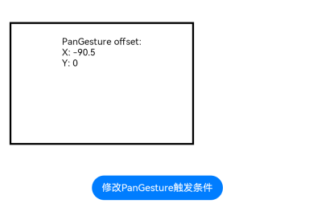

# PanGesture

滑动手势事件，当滑动的最小距离达到设定的最小值时触发滑动手势事件。

>  **说明：**
>
>  从API Version 7开始支持。后续版本如有新增内容，则采用上角标单独标记该内容的起始版本。


## 接口

PanGesture(value?: { fingers?: number, direction?: PanDirection, distance?: number } | [PanGestureOptions](#pangestureoptions))

**原子化服务API：** 从API version 11开始，该接口支持在原子化服务中使用。

**参数：**

| 参数名称 | 参数类型 | 必填 | 参数描述 |
| -------- | -------- | -------- | -------- |
| fingers | number | 否 | 用于指定触发滑动的最少手指数，最小为1指，&nbsp;最大取值为10指。<br/>默认值：1<br/>取值范围：[1,10]<br/>**说明：** <br/>当设置的值小于1或不设置时，会被转化为默认值。 |
| direction | [PanDirection](#pandirection枚举说明) | 否 | 用于指定触发滑动的手势方向，此枚举值支持逻辑与(&amp;)和逻辑或（\|）运算。<br/>默认值：PanDirection.All |
| distance | number | 否 | 用于指定触发滑动手势事件的最小滑动距离，单位为vp。<br/>取值范围：[0, +∞)<br/>默认值：5<br/>**说明：**<br/>[Tabs组件](ts-container-tabs.md)滑动与该滑动手势事件同时存在时，可将distance值设为1，使滑动更灵敏，避免造成事件错乱。<br/>当设定的值小于0时，按默认值5处理。 |
| isFingerCountLimited<sup>15+</sup> | boolean | 否 | 是否检查触摸屏幕的手指数量。若触摸屏幕的手指数量不等于设置的触发滑动的最少手指数（即上述fingers参数），手势将不会被识别。只有当触摸屏幕的手指数等于设置的触发滑动的最少手指数，并且滑动距离达到阈值时，手势才能被成功识别。<br>对于已成功识别的手势，后续改变触摸屏幕的手指数量不会引发[onActionUpdate](ts-basic-gestures-pangesture.md#事件)事件，但可以触发[onActionEnd](ts-basic-gestures-pangesture.md#事件)事件。<br>默认值：false。|

## PanDirection枚举说明

与SwipeDirection不同，PanDirection没有角度限制。

**原子化服务API：** 从API version 11开始，该接口支持在原子化服务中使用。

| 名称 | 描述 |
| -------- | -------- |
| All | 所有方向。 |
| Horizontal | 水平方向。 |
| Vertical | 竖直方向。 |
| Left | 向左滑动。 |
| Right | 向右滑动。 |
| Up | 向上滑动。 |
| Down | 向下滑动。 |
| None | 任何方向都不可触发滑动手势事件。 |


## PanGestureOptions

通过PanGestureOptions对象接口可以动态修改平移手势识别器的属性，从而避免通过状态变量修改属性（状态变量修改会导致UI刷新）。

PanGestureOptions(value?: { fingers?: number, direction?: PanDirection, distance?: number })

**原子化服务API：** 从API version 11开始，该接口支持在原子化服务中使用。

**参数：**

| 参数名称  | 参数类型                              | 必填 | 参数描述                                                     |
| --------- | ------------------------------------- | ---- | ------------------------------------------------------------ |
| fingers   | number                                | 否   | 用于指定触发滑动的最少手指数，最小为1指，&nbsp;最大取值为10指。<br/>默认值：1 |
| direction | [PanDirection](#pandirection枚举说明) | 否   | 用于指定设置滑动方向，此枚举值支持逻辑与(&amp;)和逻辑或（\|）运算。<br/>默认值：PanDirection.All |
| distance  | number                                | 否   | 用于指定触发滑动手势事件的最小滑动距离，单位为vp。<br/>默认值：5<br/>**说明：**<br/>[Tabs组件](ts-container-tabs.md)滑动与该滑动手势事件同时存在时，可将distance值设为1，使滑动更灵敏，避免造成事件错乱。<br/>当设定的值小于0时，按默认值5处理。<br/>建议设置合理的滑动距离，滑动距离设置过大时会导致滑动不跟手（响应时延慢）的问题。 |

**接口**

| 名称 | 功能描述 |
| -------- | -------- |
| setDirection(value:&nbsp;[PanDirection](#pandirection枚举说明)) | 设置direction属性。 <br/>**原子化服务API：** 从API version 11开始，该接口支持在原子化服务中使用。|
| setDistance(value:&nbsp;number) | 设置distance属性。<br/>取值范围：[0, +∞)<br/>**原子化服务API：** 从API version 11开始，该接口支持在原子化服务中使用。 |
| setFingers(value:&nbsp;number) | 设置fingers属性。<br/>取值范围：[0, +∞) <br/>**原子化服务API：** 从API version 11开始，该接口支持在原子化服务中使用。|
| getDirection()<sup>12+</sup>: [PanDirection](#pandirection枚举说明) | 获取direction属性。<br/>**原子化服务API：** 从API version 12开始，该接口支持在原子化服务中使用。|
| getDistance()<sup>18+</sup>: (value:&nbsp;number) | 获取distance属性。<br/>**原子化服务API：** 从API version 18开始，该接口支持在原子化服务中使用。|


## 事件

| 名称 | 功能描述 |
| -------- | -------- |
| onActionStart(event:&nbsp;(event:&nbsp;[GestureEvent](ts-gesture-settings.md#gestureevent对象说明))&nbsp;=&gt;&nbsp;void) | Pan手势识别成功回调。 <br/>**原子化服务API：** 从API version 11开始，该接口支持在原子化服务中使用。|
| onActionUpdate(event:&nbsp;(event:&nbsp;[GestureEvent](ts-gesture-settings.md#gestureevent对象说明))&nbsp;=&gt;&nbsp;void) | Pan手势移动过程中回调。<br/>fingerList为多根手指时，该回调监听每次只会更新一根手指的位置信息。 <br/>**原子化服务API：** 从API version 11开始，该接口支持在原子化服务中使用。|
| onActionEnd(event:&nbsp;(event:&nbsp;[GestureEvent](ts-gesture-settings.md#gestureevent对象说明))&nbsp;=&gt;&nbsp;void) | Pan手势识别成功，手指抬起后触发回调。 <br/>**原子化服务API：** 从API version 11开始，该接口支持在原子化服务中使用。|
| onActionCancel(event:&nbsp;()&nbsp;=&gt;&nbsp;void) | Pan手势识别成功，接收到触摸取消事件触发回调。不返回手势事件信息。<br/>**原子化服务API：** 从API version 11开始，该接口支持在原子化服务中使用。|
| onActionCancel(event:&nbsp;(event:&nbsp;[GestureEvent](ts-gesture-settings.md#gestureevent对象说明))&nbsp;=&gt;&nbsp;void)<sup>18+</sup> | Pan手势识别成功，接收到触摸取消事件触发回调。返回手势事件信息。<br/>**原子化服务API：** 从API version 18开始，该接口支持在原子化服务中使用。|

## 属性

| 名称 | 类型    |描述                                        |
| ----  | ------  | ---------------------------------------- |
| tag<sup>11+</sup>   | string  | 设置Pan手势标志，用于自定义手势判定时区分绑定的手势。<br/>**原子化服务API：** 从API version 11开始，该接口支持在原子化服务中使用。|
| allowedTypes<sup>14+</sup> | Array\<[SourceTool](ts-gesture-settings.md#sourcetool枚举说明9)>  | 设置Pan手势支持的事件输入源。<br/>**原子化服务API：** 从API version 14开始，该接口支持在原子化服务中使用。 |

## 示例

该示例通过PanGesture实现了单指/双指滑动手势的识别。

```ts
// xxx.ets
@Entry
@Component
struct PanGestureExample {
  @State offsetX: number = 0
  @State offsetY: number = 0
  @State positionX: number = 0
  @State positionY: number = 0
  private panOption: PanGestureOptions = new PanGestureOptions({ direction: PanDirection.Left | PanDirection.Right })

  build() {
    Column() {
      Column() {
        Text('PanGesture offset:\nX: ' + this.offsetX + '\n' + 'Y: ' + this.offsetY)
      }
      .height(200)
      .width(300)
      .padding(20)
      .border({ width: 3 })
      .margin(50)
      .translate({ x: this.offsetX, y: this.offsetY, z: 0 }) // 以组件左上角为坐标原点进行移动
      // 左右滑动触发该手势事件
      .gesture(
      PanGesture(this.panOption)
        .onActionStart((event: GestureEvent) => {
          console.info('Pan start')
        })
        .onActionUpdate((event: GestureEvent) => {
          if (event) {
            this.offsetX = this.positionX + event.offsetX
            this.offsetY = this.positionY + event.offsetY
          }
        })
        .onActionEnd((event: GestureEvent) => {
          this.positionX = this.offsetX
          this.positionY = this.offsetY
          console.info('Pan end')
        })
      )

      Button('修改PanGesture触发条件')
        .onClick(() => {
          // 将PanGesture手势事件触发条件改为双指以任意方向滑动
          this.panOption.setDirection(PanDirection.All)
          this.panOption.setFingers(2)
        })
    }
  }
}
```

示意图：

向左滑动：

 

点击按钮修改PanGesture触发条件，双指向左下方滑动：

  