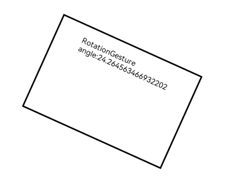

# RotationGesture

用于触发旋转手势事件，触发旋转手势的最少手指为2指，最大为5指，最小改变度数为1度。

>  **说明：**
>
>  从API Version 7开始支持。后续版本如有新增内容，则采用上角标单独标记该内容的起始版本。


## 接口

RotationGesture(value?: { fingers?: number, angle?: number })

**原子化服务API：** 从API version 11开始，该接口支持在原子化服务中使用。

**参数：**

| 参数名称 | 参数类型 | 必填 | 参数描述 |
| -------- | -------- | -------- | -------- |
| fingers | number | 否 | 触发旋转的最少手指数,&nbsp;最小为2指，最大为5指。<br/>默认值：2 <br/>触发手势手指可以多于fingers数目，但只有先落下的两指参与手势计算。|
| angle | number | 否 | 触发旋转手势的最小改变度数，单位为deg。<br/>默认值：1 <br/>**说明：** <br/>当改变度数的值小于等于0或大于360时，会被转化为默认值。|
| isFingerCountLimited<sup>15+</sup> | boolean | 否 | 是否检查触摸屏幕的手指数量。若触摸屏幕的手指数量不等于设置的触发旋转的最少手指数（即上述fingers参数），手势将不会被识别。只有当触摸屏幕的手指数等于设置的触发旋转的最少手指数，并且滑动距离达到阈值时，手势才能被成功识别（只有先落下的两根手指参与手势计算，若抬起其中的一个，手势识别失败。<br>对于已成功识别的手势，后续改变触摸屏幕的手指数量，不会触发[onActionUpdate](ts-basic-gestures-rotationgesture.md#事件)事件，但可以触发[onActionEnd](ts-basic-gestures-rotationgesture.md#事件)事件。<br>默认值：false。|


## 事件

| 名称 | 功能描述 |
| -------- | -------- |
| onActionStart(event:(event:&nbsp;[GestureEvent](ts-gesture-settings.md#gestureevent对象说明))&nbsp;=&gt;&nbsp;void) | Rotation手势识别成功回调。 <br/>**原子化服务API：** 从API version 11开始，该接口支持在原子化服务中使用。|
| onActionUpdate(event:(event:&nbsp;[GestureEvent](ts-gesture-settings.md#gestureevent对象说明))&nbsp;=&gt;&nbsp;void) | Rotation手势移动过程中回调。 <br/>**原子化服务API：** 从API version 11开始，该接口支持在原子化服务中使用。|
| onActionEnd(event:(event:&nbsp;[GestureEvent](ts-gesture-settings.md#gestureevent对象说明))&nbsp;=&gt;&nbsp;void) | Rotation手势识别成功，手指抬起后触发回调。 <br/>**原子化服务API：** 从API version 11开始，该接口支持在原子化服务中使用。|
| onActionCancel(event:&nbsp;()&nbsp;=&gt;&nbsp;void) | Rotation手势识别成功，接收到触摸取消事件触发回调。不返回手势事件信息。<br/>**原子化服务API：** 从API version 11开始，该接口支持在原子化服务中使用。|
| onActionCancel(event:(event:&nbsp;[GestureEvent](ts-gesture-settings.md#gestureevent对象说明))&nbsp;=&gt;&nbsp;void)<sup>16+</sup> | Rotation手势识别成功，接收到触摸取消事件触发回调。返回手势事件信息。<br/>**原子化服务API：** 从API version 16开始，该接口支持在原子化服务中使用。|

## 属性

| 名称 | 类型    |描述                                        |
| ----  | ------  | ---------------------------------------- |
| tag<sup>11+</sup>   | string  | 设置Rotation手势标志，用于自定义手势判定时区分绑定的手势。<br/>**原子化服务API：** 从API version 11开始，该接口支持在原子化服务中使用。|
| allowedTypes<sup>14+</sup> | Array\<[SourceTool](ts-gesture-settings.md#sourcetool枚举说明9)> | 设置Rotation手势支持的事件输入源。<br/>**原子化服务API：** 从API version 14开始，该接口支持在原子化服务中使用。 |

## 示例

该示例通过配置RotationGesture实现了双指旋转手势的识别。

```ts
// xxx.ets
@Entry
@Component
struct RotationGestureExample {
  @State angle: number = 0
  @State rotateValue: number = 0

  build() {
    Column() {
      Column() {
        Text('RotationGesture angle:' + this.angle)
      }
      .height(200)
      .width(300)
      .padding(20)
      .border({ width: 3 })
      .margin(80)
      .rotate({ angle: this.angle })
      // 双指旋转触发该手势事件
      .gesture(
      RotationGesture()
        .onActionStart((event: GestureEvent) => {
          console.info('Rotation start')
        })
        .onActionUpdate((event: GestureEvent) => {
          if (event) {
            this.angle = this.rotateValue + event.angle
          }
        })
        .onActionEnd((event: GestureEvent) => {
          this.rotateValue = this.angle
          console.info('Rotation end')
        })
      )
    }.width('100%')
  }
}
```

  