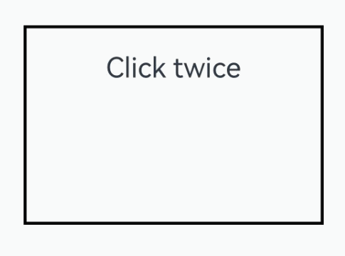

# TapGesture

支持单击、双击和多次点击事件的识别。

>  **说明：**
>
>  从API Version 7开始支持。后续版本如有新增内容，则采用上角标单独标记该内容的起始版本。


## 接口

TapGesture(value?: TapGestureParameters)

**原子化服务API：** 从API version 12开始，该接口支持在原子化服务中使用。

**系统能力：** SystemCapability.ArkUI.ArkUI.Full

**参数：**

| 参数名称 | 参数类型 | 必填 | 参数描述 |
| -------- | -------- | -------- | -------- |
| value | [TapGestureParameters](#tapgestureparameters12对象说明) | 否 | 点击手势的相关参数。|

## TapGestureParameters<sup>12+</sup>对象说明

**原子化服务API：** 从API version 12开始，该接口支持在原子化服务中使用。

**系统能力：** SystemCapability.ArkUI.ArkUI.Full

| 名称 | 类型 | 必填 | 描述 |
| -------- | -------- | -------- | -------- |
| count | number | 否 | 识别的连续点击次数。当设置的值小于1或不设置时，会被转化为默认值。<br/>默认值：1<br/>**说明：**<br/>1. 当配置多击时，上一次的最后一根手指抬起和下一次的第一根手指按下的超时时间为300毫秒。<br/>2. 当上次点击的位置与当前点击的位置距离超过60vp时，手势识别失败。在多指情况下，点击的位置为所有参与手势响应手指的平均位置。|
| fingers | number | 否 | 触发点击的手指数，最小为1指，&nbsp;最大为10指。当设置小于1的值或不设置时，会被转化为默认值。<br/>默认值：1<br/>**说明：**<br/>1. 当配置多指时，第一根手指按下后300毫秒内未有足够的手指数按下，手势识别失败；手指抬起时，抬起后剩余的手指数小于阈值时开始计时，如300ms内未全部抬起则手势识别失败。<br/>2. 实际点击手指数超过配置值，手势识别成功。 |
| distanceThreshold | number | 否 | 点击手势移动阈值。当设置的值小于等于0或不设置时，会被转化为默认值。<br/>默认值：2^31-1<br/>**说明：**<br/>当手指的移动距离超出开发者预设的移动阈值时，点击识别失败。如果初始化为默认阈值时，手指移动超过组件热区范围，点击识别失败。|

## 事件

| 名称 | 功能描述 |
| -------- | -------- |
| onAction(event: (event:&nbsp;[GestureEvent](ts-gesture-settings.md#gestureevent对象说明))&nbsp;=&gt;&nbsp;void) | Tap手势识别成功回调。 <br/>**原子化服务API：** 从API version 11开始，该接口支持在原子化服务中使用。|

## 属性

| 名称 | 类型    |描述                                        |
| ----  | ------  | ---------------------------------------- |
| tag<sup>11+</sup>   | string  | 设置Tap手势标志，用于自定义手势判定时区分绑定的手势。<br/>**原子化服务API：** 从API version 11开始，该接口支持在原子化服务中使用。|
| allowedTypes<sup>14+</sup> | Array\<[SourceTool](ts-gesture-settings.md#sourcetool枚举说明9)> | 设置Tap手势支持的事件输入源。<br/>**原子化服务API：** 从API version 14开始，该接口支持在原子化服务中使用。 |

## 示例

该示例通过TapGesture实现了双击手势的识别。

```ts
// xxx.ets
@Entry
@Component
struct TapGestureExample {
  @State value: string = ''

  build() {
    Column() {
      // 单指双击文本触发手势事件
      Text('Click twice').fontSize(28)
        .gesture(
        TapGesture({ count: 2 })
          .onAction((event: GestureEvent) => {
            if (event) {
              this.value = JSON.stringify(event.fingerList[0])
            }
          })
        )
      Text(this.value)
    }
    .height(200)
    .width(300)
    .padding(20)
    .border({ width: 3 })
    .margin(30)
  }
}
```


